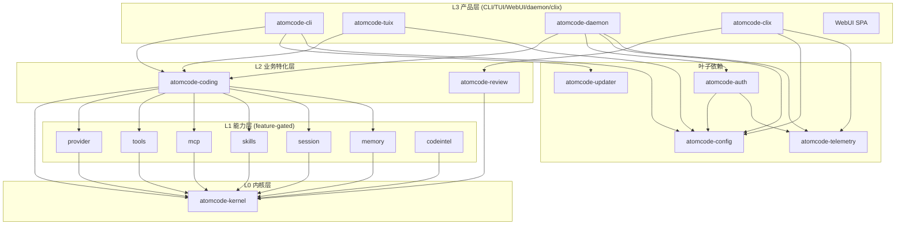
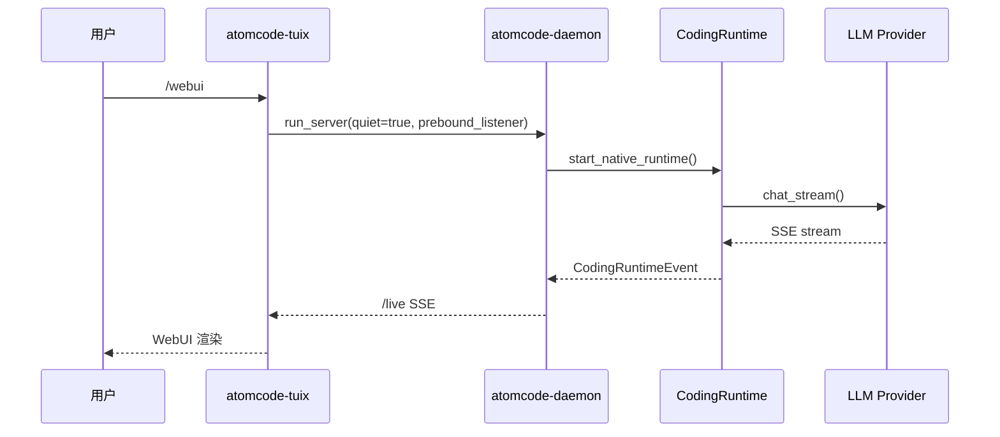

# AtomCode 第四轮：daemon / capabilities / coding 核心深度分析

> 本文档是 AtomCode 系列源码深度分析的**第四轮**。前三轮已完成总览、核心机制、第二轮深挖（8 份 ~8200 行）与第三轮深挖（15 份 ~15361 行）。本轮聚焦**尚未深度覆盖的 13 个维度**：daemon 守护进程、capabilities 权限、auth 认证、coding/codingplan 核心、kernel 内部 trait、clix、config、review、telemetry、tuix、updater、Anthropic/OpenAI 协议适配真实代码路径，以及多轮对话/Context/记忆/质检/任务拆解/工具/MCP/Skill/SubAgent/Workflow/loop/目标规划/沙箱/权限的实现快照。

---

## 0. 摘要与本轮定位

### 0.1 本轮要回答的核心问题

1. daemon 是如何做到"独立二进制 + 进程内嵌入"双形态的？它与 CLI/TUI 的边界在哪里？
2. capabilities 层如何承载 provider/tools/mcp/skills/session/memory 这些"具体能力"？它如何保持对 kernel 的单向依赖？
3. auth 的 OAuth 流程、凭证文件安全存储、TLS 降级兜底是如何实现的？
4. kernel 的 `Agent` 是 trait 还是 struct？`AgentCommand/AgentEvent` 双向协议如何跨越进程边界？
5. coding 运行时如何通过 `CodingRuntime` + `DriverCommand` 拥有内核 agent？
6. 协议适配层如何把 Anthropic Messages 与 OpenAI chat/completions 收敛到同一个 `LlmProvider` 契约？
7. review / telemetry / tuix / updater / clix / config 这些"边缘模块"的真实代码路径是什么？

### 0.2 关键结论速览

| 维度 | 关键事实 | 文件锚点 |
|------|---------|---------|
| daemon | axum HTTP 服务，`run_server` 统一入口，`AppState` 持有 `ActiveChatRegistry` + `WebuiTokenStore` + `McpRegistry` | `crates/atomcode-daemon/src/lib.rs:6141` |
| capabilities | L1 层，仅依赖 kernel + 第三方；feature-gated（provider/tools/mcp/skills/session/memory） | `crates/atomcode-capabilities/src/lib.rs:1-201` |
| auth | OAuth 登录 + 凭证文件 0o600 安全写入 + TLS 1.2 降级兜底 | `crates/atomcode-auth/src/oauth.rs:600` |
| kernel | `Agent` 是**具体 struct**（非 trait），通过 `AgentBuilder` 组装；`AgentCommand/AgentEvent` 双向可序列化协议 | `crates/atomcode-kernel/src/agent.rs:794` |
| coding | `CodingRuntime` 拥有 `AgentHandle`，`DriverCommand` 是本地控制协议 | `crates/atomcode-coding/src/runtime.rs:814` |
| 协议适配 | `LlmProvider` trait 统一；Anthropic 用 `x-api-key` + `anthropic-version`；OpenAI 用 Bearer | `crates/atomcode-capabilities/src/provider/anthropic.rs:154`、`openai_compat.rs:483` |
| review | `atomcodex` 独立 CLI，`ReviewTool` 作为 subagent 工具，deep 模式 fan-out | `crates/atomcode-clix/src/main.rs:1` |
| telemetry | 6 事件集（OpenAtomcode/LlmChat/ToolCall/UseCommand/McpConnect/LoginSuccess/Panic） | `crates/atomcode-telemetry/src/event.rs:175` |
| tuix | crossterm 原始模式 + Kitty 键盘协议 + 保留模式渲染 | `crates/atomcode-tuix/src/lib.rs:1` |
| updater | 三进制交换（`.rolling`/`.bak`）+ SHA256 校验 + 回滚 | `crates/atomcode-updater/src/lib.rs:560` |
| config | TOML 持久化 + 多环境（online/offline）+ 多协议 provider 账户 | `crates/atomcode-config/src/config/mod.rs:231` |

### 0.3 分层架构总览



---

## 1. daemon 守护进程（生命周期/IPC/CLI 关系）

### 1.1 双形态架构：独立二进制 + 进程内嵌入

daemon 的核心设计是**一套代码、两种启动方式**：

- **独立二进制** `atomcode-daemon`：由 VS Code 扩展或用户直接启动，完整启动横幅，写 `~/.atomcode/daemon-<port>.json` token 文件。
- **进程内嵌入**：TUI 的 `/webui` 命令通过 `run_server` 在进程内启动，quiet 模式，不写 token 文件。

```rust
// crates/atomcode-daemon/src/main.rs:129-192
#[tokio::main]
async fn main() {
    atomcode_config::distribution::bootstrap_home();
    // ... Windows console attach ...
    let (host, port, cli_override, idle_timeout_secs, startup_mode) = parse_daemon_args();
    let token_store = atomcode_daemon::auth_token::WebuiTokenStore::new();
    let daemon_token = atomcode_daemon::resolve_daemon_token(
        std::env::var("ATOMCODE_DAEMON_TOKEN").ok(), &token_store);
    run_server(ServerOpts { host, port, cli_override, idle_timeout_secs,
        startup_mode, webui_tokens: Some(token_store), quiet: false,
        working_dir_override: None, prebound_listener: None,
        app_user_id: None, daemon_token_file: Some(daemon_token) }).await?;
}
```

### 1.2 `run_server` 启动序列（14 步）

`run_server` 是 daemon 的核心入口（`lib.rs:6141`），执行完整的 bootstrap 序列：

```rust
// crates/atomcode-daemon/src/lib.rs:6141-6568
pub async fn run_server(opts: ServerOpts) -> anyhow::Result<()> {
    // Step 1: 加载 config（容错，失败回退默认）
    let startup_config = match Config::load(&Config::default_path()) { ... };
    // Step 2: 解析遥测状态
    let resolved = resolve(&cfg_telemetry, &cli_override, ...);
    // Step 3: 打印遥测状态行（quiet 模式跳过）
    // Step 4: 初始化遥测运行时
    let telemetry = Telemetry::init(resolved, env!("CARGO_PKG_VERSION").into());
    // Step 4.5: 安装 panic hook
    install_panic_hook(telemetry.clone());
    // Step 5: 预计算 repo_origin
    let project_state = init_project_state(working_dir_override);
    let repo_origin = detect_repo_origin(&project_state.working_dir);
    // Step 6: 从存储的 auth 种子化 account_id
    telemetry.set_account_id(auth::get_stored_auth().map(|a| a.user.id));
    // Step 7: 初始化 MCP registry
    let mcp_registry = McpRegistry::from_config_background(&project_state.working_dir);
    // Step 8: 构建 AppState
    let state = AppState { project, active_chats, mcp_registry, ... };
    // Step 9: 绑定 listener
    // Step 10-11: 进入 CurrentContext scope + 发射 OpenAtomcode
    // Step 13: 带 graceful shutdown 的 axum::serve
    axum::serve(listener, app)
        .with_graceful_shutdown(shutdown_signal(shutdown_rx)).await?;
    // Step 14: 最终遥测 flush
    telemetry.shutdown(Duration::from_millis(500)).await;
}
```

### 1.3 `AppState` 核心结构

`AppState` 是 daemon 的共享状态，通过 axum 的 `State` 提取器注入到每个 handler：

```rust
// crates/atomcode-daemon/src/lib.rs:611-658
pub struct AppState {
    pub project: ProjectStateStore,
    active_chats: ActiveChatRegistry,         // 单飞准入 + 取消
    pub mcp_registry: Arc<RwLock<Arc<McpRegistry>>>,
    pub mcp_cache: Arc<RwLock<HashMap<PathBuf, CachedMcpRegistry>>>,
    pub(crate) login_sessions: LoginSessionsStore,
    pub(crate) login_start_lock: Arc<Mutex<()>>,
    pub(crate) daemon_instance_id: Arc<str>,
    pub telemetry: Arc<Telemetry>,
    pub repo_origin: RepoOrigin,
    pub shutdown_tx: watch::Sender<bool>,
    pub last_activity: Arc<AtomicI64>,        // 用于 idle timeout
    pub active_connections: Arc<AtomicUsize>,
    pub webui_tokens: auth_token::WebuiTokenStore,
    pub enforce_token: bool,                  // webui 模式强制 token
    pub app_user_id: String,                  // App 远程访问 user_id 校验
    pub pending_permissions: permission_bridge::PermissionResponders,
    pub pending_user_inputs: permission_bridge::UserInputResponders,
    pub bind_host: String, pub bind_port: u16,
    pub webui_cookie_name: String,            // 端口隔离的 cookie 名
}
```

### 1.4 `ActiveChatRegistry`：单飞准入 + 取消

daemon 通过 `ActiveChatRegistry` 保证同一 session/request 只有一个活跃 chat：

```rust
// crates/atomcode-daemon/src/lib.rs:418-596
impl ActiveChatRegistry {
    async fn admit(&self, session_id: Option<&str>, request_id: Option<&str>)
        -> Result<ActiveChatAdmission, ActiveChatAdmissionError> {
        let mut index = self.inner.write().await;
        if session_id.is_some_and(|alias| index.aliases.contains_key(alias)) {
            return Err(ActiveChatAdmissionError::SessionBusy);
        }
        // ... 分配 operation_id + CancellationToken ...
    }
    async fn stop_alias(&self, alias: &str) -> bool { /* 标记 + cancel */ }
    async fn complete(&self, operation_id: &str) -> bool { /* 清理 */ }
}
```

### 1.5 路由分层：public vs protected

daemon 路由分为两层，通过 axum middleware 强制鉴权：

```rust
// crates/atomcode-daemon/src/lib.rs:6261-6403
let public = Router::new()
    .route("/health", get(health))
    .route("/", get(serve_webui_index))
    .fallback(webui::serve_webui);

let protected = Router::new()
    .route("/shutdown", post(shutdown_handler))
    .route("/sessions", get(get_all_sessions).post(create_session))
    .route("/chat", post(chat_stream).layer(DefaultBodyLimit::max(32MB)))
    .route("/live", get(live_api::live_stream))
    .route("/auth/login/start", post(api_auth::auth_login_start))
    .route("/codingplan/setup", post(api_codingplan::codingplan_setup))
    // ... 60+ 路由 ...
    .route_layer(from_fn_with_state(state.clone(), auth_token::require_webui_token))
    .route_layer(from_fn_with_state(state.clone(), auth_token::require_app_user_id));
```

### 1.6 Idle Timeout 看门狗

```rust
// crates/atomcode-daemon/src/lib.rs:5235-5270
fn spawn_idle_timeout_task(idle_timeout_secs: u64, last_activity: Arc<AtomicI64>,
    active_connections: Arc<AtomicUsize>, active_chats: ActiveChatRegistry,
    shutdown_tx: watch::Sender<bool>) {
    if idle_timeout_secs == 0 { return; }
    let timeout_ms = (idle_timeout_secs * 1000) as i64;
    tokio::spawn(async move {
        loop {
            tokio::time::sleep(Duration::from_secs(10)).await;
            let elapsed = now_unix_ms() - last_activity.load(Ordering::Relaxed);
            let connected = active_connections.load(Ordering::Relaxed);
            let chatting = active_chats.has_active_operations().await;
            if elapsed > timeout_ms && connected == 0 && !chatting {
                shutdown_tx.send(true).ok();
                break;
            }
        }
    });
}
```

### 1.7 daemon 与 CLI/TUI 的关系



- **TUI 内嵌**：TUI 通过 `native_live::register_embedded_runtime` 把 runtime 绑定到 daemon，共享同一个 `LiveViewHub`。
- **独立 daemon**：VS Code 扩展启动独立二进制，读取 `~/.atomcode/daemon-<port>.json` 获取 token。
- **App 远程访问**：手机 App 通过中继连接，daemon 校验 `X-Atom-User-Id` 请求头。

---

## 2. capabilities 权限系统

### 2.1 分层规则（compile-enforced）

capabilities 是 L1 层，**仅依赖 kernel + 第三方**，绝不依赖 core/L2/L3：

```rust
// crates/atomcode-capabilities/src/lib.rs:1-201
//! # Layering rule (compile-enforced)
//! This crate depends ONLY on `atomcode-kernel` (L0) + third-party crates.
//! It must NEVER depend on `atomcode-core` or any L2/L3 crate.
//! `cargo tree -p atomcode-capabilities` must not contain `atomcode-core`.
```

### 2.2 Feature-gated 能力矩阵

capabilities 通过 cargo feature 实现按需编译：

| Feature | 默认 | 能力 |
|---------|------|------|
| `provider` | 是 | Anthropic / OpenAI 兼容 / Ollama 适配器 |
| `tools` | 是 | fs read/write/edit/list + bash + grep/glob |
| `web` | 否 | web_fetch / web_search |
| `atomgit` | 否 | AtomGit REST 工具 |
| `codeintel` | 否 | tree-sitter 符号提取（12 种语言） |
| `lsp` | 否 | 本地语言服务器 |
| `mcp` | 否 | MCP 客户端（stdio/HTTP/OAuth） |
| `skills` | 否 | markdown/frontmatter skill 加载 |
| `session` | 否 | 双层持久化（snapshot + transcript） |
| `memory` | 否 | 用户驱动 memory.md |
| `notify` | 否 | 桌面/终端通知 |
| `setup` | 否 | 一次性项目安装 |
| `cc-hooks` | 否 | Claude Code 兼容外部 hooks |
| `plugin` | 否 | 插件系统 |
| `offline` | 否 | 离线自动检测 |

### 2.3 工具信任模型

capabilities 的 tools 模块**明确不沙箱化**——工具获得宿主进程完整权限：

```rust
// crates/atomcode-capabilities/src/tools/mod.rs:1-26
//! These tools run with the host process's FULL ambient authority —
//! the kernel does not sandbox them. Relative paths resolve against
//! `ctx.working_dir`; absolute paths are honored as-is.
//! There is deliberately NO path-escape enforcement here.
//! OS-level isolation (containers, seccomp, a restricted user)
//! is the EMBEDDER's responsibility.
```

### 2.4 ApprovalMiddleware 审批链

```rust
// crates/atomcode-capabilities/src/tools/approval.rs
pub struct ApprovalMiddleware {
    pub store: Arc<dyn PermissionStore>,
    pub risk_gate: RiskGate,
    pub escalate_risk: bool,
}
pub enum PermissionDecision { Allow, Deny, Ask }
pub enum ApprovalResponse { Allow, Deny, Always }
```

审批决策流程：
1. 工具声明 `risk(args)` → Safe/Risky
2. 中间件查询 `PermissionStore`（session 级 "always" 授权）
3. 无授权 → round-trip 驱动（TUI/WebUI 弹出确认）
4. 用户选择 "Always" → 写入 `PermissionStore`

### 2.5 关键工具清单

| 工具 | 文件 | 风险 | 特性 |
|------|------|------|------|
| bash | `tools/bash.rs` | arg-aware | AST 只读分类（tree-sitter-bash）、Job Object 进程树 |
| read_file | `tools/read.rs` | Safe | 自截断 + 行号分页 |
| write_file | `tools/write.rs` | Risky | 需审批 |
| edit_file | `tools/edit.rs` | Risky | 行级 diff |
| list_dir | `tools/list.rs` | Safe | - |
| grep | `tools/grep.rs` | Safe | 流式搜索 + ignore |
| glob | `tools/glob.rs` | Safe | - |
| task | `tools/task.rs` | Risky | SubAgent 驱动 |
| web_fetch | `tools/web_fetch.rs` | Risky | SSRF DNS 检查 |
| web_search | `tools/web_search.rs` | Risky | - |
| use_skill | `skills/use_skill.rs` | Safe | - |
| list_skills | `skills/render.rs` | Safe | - |
| mcp__*__* | `mcp/tool.rs` | 来自 server annotations | 工具适配 |

---

## 3. auth 认证

### 3.1 OAuth 登录流程

auth crate 实现基于平台 broker 的 OAuth 登录：

```rust
// crates/atomcode-auth/src/oauth.rs:600-633
pub fn start_login() -> Result<LoginSession> {
    std::thread::spawn(move || {
        let login_url = platform_login_url();
        let was_capped = atomcode_config::tls::should_cap_url(&login_url);
        match attempt_login(was_capped) {
            Err(first) if atomcode_config::tls::should_try_fallback(...) => {
                match attempt_login(true) {  // TLS 1.2 降级重试
                    Ok(session) => { atomcode_config::tls::latch_managed_tls12(); Ok(session) }
                    Err(fallback) => Err(fallback.context(...)),
                }
            }
            other => other,
        }
    }).join()?
}
```

### 3.2 `LoginSession` 状态机

```rust
// crates/atomcode-auth/src/oauth.rs:420-594
pub struct LoginSession {
    state: String,
    login_url: String,
    client: Option<reqwest::blocking::Client>,
}
impl LoginSession {
    pub fn url(&self) -> &str { &self.login_url }
    pub fn open_browser_best_effort(&self) { ... }
    pub fn poll_once(&self) -> Result<PollOutcome> { ... }  // 阻塞轮询
    pub fn spawn_poller(&self, interval: Duration) -> mpsc::Receiver<Result<PollOutcome>> { ... }
    pub fn finish(mut self, tel: Option<&Arc<Telemetry>>) -> Result<AuthInfo> { ... }
}
```

### 3.3 凭证文件安全存储

```rust
// crates/atomcode-auth/src/lib.rs:25-92
pub fn write_auth_file_secure(path: &Path, content: &str) -> Result<()> {
    if let Some(parent) = path.parent() { ensure_private_dir(parent)?; }
    #[cfg(unix)] {
        let tmp_path = temp_auth_path(path);
        let mut file = OpenOptions::new()
            .create_new(true).write(true).truncate(true)
            .mode(0o600)  // 创建时即 0o600
            .open(&tmp_path)?;
        file.write_all(content.as_bytes())?;
        file.sync_all()?;  // fsync 落盘
        drop(file);
        std::fs::rename(&tmp_path, path)?;  // 原子替换
        std::fs::set_permissions(path, Permissions::from_mode(0o600))?;
    }
    // Windows: NamedTempFile::persist
}
```

关键安全措施：
- **目录 0o700**：`ensure_private_dir` 强制父目录权限
- **文件 0o600**：创建时即设置，不依赖 umask
- **临时文件 + 原子 rename**：避免半写状态
- **fsync**：确保落盘

### 3.4 `AuthInfo` 与 `ValidAuthSession`

```rust
// crates/atomcode-auth/src/oauth.rs:151-178
pub struct AuthInfo {
    pub access_token: String,
    pub refresh_token: Option<String>,
    pub token_type: String,
    pub expires_in: Option<i64>,
    pub created_at: i64,
    pub user: UserInfo,
}
pub struct UserInfo { pub id: String, pub username: String, pub name: Option<String>, ... }
pub struct ValidAuthSession { pub access_token: String, pub user_id: String }
```

### 3.5 daemon 的 WebuiTokenStore

daemon 使用内存中的 token store 实现一次性 webui token：

```rust
// crates/atomcode-daemon/src/auth_token.rs:47-108
pub struct WebuiTokenStore { inner: Arc<RwLock<HashSet<String>>> }
impl WebuiTokenStore {
    pub fn mint(&self) -> String { /* UUID v4 */ }
    pub fn insert(&self, token: String) { ... }
    pub fn is_valid(&self, token: &str) -> bool { ... }
}
pub fn require_webui_token(State(state): State<AppState>, req: Request, next: Next)
    -> Result<Response, StatusCode> {
    if !state.enforce_token { return Ok(next.run(req).await); }
    let header = req.headers().get(AUTHORIZATION).and_then(|h| h.to_str().ok());
    let cookie = req.headers().get(COOKIE).and_then(|h| h.to_str().ok());
    let token = token_from_header(header).or_else(|| token_from_cookie(cookie, &state.webui_cookie_name));
    match token { Some(tok) if state.webui_tokens.is_valid(&tok) => Ok(next.run(req).await),
        _ => Err(StatusCode::UNAUTHORIZED) }
}
```

**端口隔离 cookie**：`webui_cookie_name(port) = format!("atomcode_webui_{port}")`，解决多实例共享 localhost cookie jar 的冲突。

---

## 4. kernel 内部 trait（Agent trait/循环/状态机）

### 4.1 关键事实：`Agent` 是 struct，不是 trait

kernel 中**不存在 `Agent` trait**——`Agent` 是一个具体的 struct，通过 `AgentBuilder` 流水线式组装：

```rust
// crates/atomcode-kernel/src/agent.rs:794-895
pub struct Agent {
    provider: Arc<dyn LlmProvider>,
    tools: MountedTools,
    persona: String,
    middlewares: Vec<Arc<dyn ToolMiddleware>>,
    hooks: Arc<dyn LifecycleHooks>,
    max_rounds: Option<u32>,
    max_provider_retries: u32,
    tool_loop_policy: Option<ToolLoopPolicy>,
    max_continuations: Option<u32>,
    resume: Option<SessionSnapshot>,
    max_tool_result_bytes: usize,        // 默认 64KiB
    max_parallel_tools: Option<usize>,
    compaction: Arc<dyn CompactionStrategy>,
    compact_threshold: Option<f32>,
    compaction_checkpoint: Option<Arc<dyn CompactionCheckpoint>>,
    stream_timeout: Option<Duration>,
    request_timeout: Option<Duration>,
    chat_options: ChatOptions,
    working_dir: Option<PathBuf>,
    shared_cwd: Option<Arc<RwLock<PathBuf>>>,
    cancel_token: Option<CancellationToken>,
    session_id: Option<Arc<str>>,
    clock: Arc<dyn Clock>,
    keep_interrupted_context: bool,
    round_cap_checkpoint: bool,
}
```

### 4.2 `AgentCommand` / `AgentEvent` 双向协议

```rust
// crates/atomcode-kernel/src/event.rs:124-385
#[non_exhaustive]
pub enum AgentCommand {
    SendMessage { text: String, #[serde(default)] images: Vec<ImageContent> },
    SendMessageWithContext { text, images, context },
    SendSyntheticMessage { text },
    Respond { id: RequestId, value: serde_json::Value },
    Snapshot,
    Compact { focus: Option<String> },
    Cancel,
    Shutdown,
}
#[non_exhaustive]
pub enum AgentEvent {
    TurnStarted, TextDelta(String),
    ToolCallStreaming { index, id, name, arguments },
    ToolBatchStarted { batch_id, calls },
    ToolBatchCompleted { batch_id, ok, total, elapsed_ms },
    ToolStarted { call }, ToolProgress { call_id, message },
    ToolResult { result },
    PolicyIntervention { intervention },
    Request { id, kind, payload },
    Usage(MessageMeta),
    Snapshot { snapshot },
    TurnComplete { reason: StopReason },
    Error { message, http_status, code, retryable },
    Cancelled, Reasoning(String), Warning(String),
    StreamRecovery { attempt, max_attempts, recovered },
    ProviderRetry { attempt, max_attempts, backoff_secs, reason },
    OutputTruncationRecovery { attempt, max_attempts },
    RateLimited { reset_at_display, reset_label, secs_until_reset, auto_resuming, server_message },
    Steered { count, inputs },
    CompactionStarted { trigger },
    Compacted { trigger, epoch, removed, bytes_before, bytes_after, committed, snapshot },
    CompactionFailed { trigger, error },
}
```

**设计要点**：
- `#[non_exhaustive]`：新增变体不破坏下游
- `#[serde(default)]`：additive 兼容（旧 JSON 仍能解析）
- `StopReason` 是"失败感知"核心：`Stopped` / `MaxRounds` / `RepeatLoop` / `ToolLoopDetected` / `ProviderError` / `Timeout` / `Cancelled` / `PolicyDenied` / `RateLimited`

### 4.3 `Tool` trait

```rust
// crates/atomcode-kernel/src/tool.rs:206-272
#[async_trait]
pub trait Tool: Send + Sync {
    fn name(&self) -> &str;
    fn description(&self) -> &str;
    fn parameters_schema(&self) -> serde_json::Value;
    fn risk(&self, _args: &str) -> RiskLevel { RiskLevel::Safe }
    fn read_only_hint(&self) -> bool { false }
    fn self_bounds_output(&self) -> bool { false }
    fn parallel_safe(&self, _args: &str) -> bool { self.read_only_hint() }
    fn always_grant_scope(&self, args: &str) -> String { args.to_string() }
    fn take_policy_intervention(&self, _result: &mut ToolResult) -> Option<PolicyIntervention> { None }
    async fn execute(&self, args: &str, ctx: &ToolContext) -> ToolResult;
}
```

**信任模型**（模块级文档明确）：
- `RiskLevel` 是**建议元数据**，不是执行边界
- 内核**不沙箱化**工具——工具获得宿主进程完整权限
- 唯一内置安全机制：`max_tool_result_bytes`（默认 64KiB）
- OS 级隔离是**嵌入者**的责任

### 4.4 `LlmProvider` trait

```rust
// crates/atomcode-kernel/src/provider.rs:122-157
#[async_trait]
pub trait LlmProvider: Send + Sync {
    fn model_name(&self) -> &str;
    fn context_window(&self) -> u32 { 0 }
    fn bind_session_id(&self, _session_id: &str) {}  // 一次性绑定
    async fn chat_stream(&self, messages: &[Message], tools: &[ToolDef],
        options: &ChatOptions) -> Result<BoxStream<'static, StreamEvent>, ProviderError>;
}
```

**`ChatOptions` 中性请求拨杆**：

```rust
pub struct ChatOptions {
    pub reasoning_effort: Option<ReasoningEffort>,
    pub max_tokens: Option<u32>,
    pub temperature: Option<f32>,
    pub tool_choice: ToolChoice,
    #[serde(skip)] pub rate_limit_retry_owner: RateLimitRetryOwner,
}
pub enum ReasoningEffort { Low, Medium, High, XHigh, Max }
pub enum ToolChoice { Auto, Required, Specific(String), None }
```

### 4.5 `LifecycleHooks` 与 `ToolMiddleware`

```rust
// crates/atomcode-kernel/src/hook.rs:183-322
#[async_trait]
pub trait LifecycleHooks: Send + Sync {
    async fn session_start(&self, _convo: &mut Conversation, _resumed: bool) {}
    async fn user_prompt_submit(&self, _text: &mut String) -> Result<(), String> { Ok(()) }
    async fn turn_start(&self, _convo: &mut Conversation) {}
    async fn pre_request(&self, _messages: &mut Vec<Message>, _ctx: &TurnCtx) {}
    async fn on_text_delta(&self, _delta: &mut String) {}
    async fn on_reasoning_delta(&self, _delta: &mut String) {}
    async fn on_model_response(&self, _response: &mut Message) {}
    async fn offer_continuation(&self, _convo: &Conversation) -> Option<String> { None }
    async fn turn_complete(&self, _convo: &Conversation, _reason: &StopReason, _ctx: &TurnCtx) {}
    async fn on_rate_limit(&self, _hint: &RateLimitHint) -> Option<RateLimitDecision> { None }
    async fn session_end(&self, _convo: &Conversation) {}
}
```

```rust
// crates/atomcode-kernel/src/middleware.rs:34-67
#[async_trait]
pub trait ToolMiddleware: Send + Sync {
    async fn before(&self, _call: &mut ToolCall, _tool: &Arc<dyn Tool>, _rt: &RequestCtx) -> BeforeOutcome;
    async fn after(&self, _result: &mut ToolResult, _tool: Option<&Arc<dyn Tool>>) -> AfterOutcome;
}
pub enum BeforeOutcome { Proceed, Allow { reason }, Ask { reason }, Deny { reason },
    DenyTurn { reason }, DenyTurnWithIntervention { reason, intervention } }
pub enum AfterOutcome { Proceed, Block { reason } }
```

### 4.6 `StreamEvent` 流式表面

```rust
// crates/atomcode-kernel/src/stream.rs:92-156
pub enum StreamEvent {
    TextDelta(String),
    Reasoning(String),
    ReasoningSignature { opaque: String, provider: String },
    ToolCall(ToolCall),
    ToolCallDelta { index, id, name, arguments },
    Usage(TokenUsage),
    ResponseId(String), ResponseModel(String),
    Error(ProviderError),
    Malformed,
    Done { truncated: bool },
}
```

### 4.7 `ToolRegistry` 与原子快照发布

```rust
// crates/atomcode-kernel/src/tool.rs:277-418
pub struct ToolRegistry { tools: Arc<RwLock<BTreeMap<String, Arc<dyn Tool>>>> }
impl ToolRegistry {
    pub fn register(&mut self, tool: Arc<dyn Tool>) { ... }
    pub fn mount(&self, names: &[&str]) -> MountedTools { ... }
    pub fn mount_updatable(&self, names: &[&str]) -> (MountedTools, MountedToolsPublisher) { ... }
}
pub struct MountedTools { current: Arc<RwLock<Arc<MountedToolsSnapshot>>> }
impl MountedToolsPublisher {
    pub fn publish(&self, registry: &ToolRegistry, names: &[&str]) -> ToolCatalogRevision { ... }
}
```

**设计要点**：
- `BTreeMap` 保证确定性 prompt 排序
- `MountedToolsSnapshot` 不可变，发布新版本时原子替换
- 同一 turn 内 model request 与 tool execution 看到相同工具集

### 4.8 安全熔断常量

```rust
// crates/atomcode-kernel/src/agent.rs
const DEFAULT_MAX_TOOL_RESULT_BYTES: usize = 64 * 1024;  // 64KiB
const MAX_OVERFLOW_ATTEMPTS: u8 = 3;
const DEFAULT_MAX_PROVIDER_RETRIES: u32 = 3;
const MAX_STREAM_RETRIES: u32 = 5;
const MAX_PARTIAL_STREAM_RECOVERIES: u32 = 1;
const MAX_RATE_LIMIT_WAITS: u32 = 5;
const SILENT_FIRST_RATE_LIMIT_RETRY: Duration = Duration::from_secs(1);
const EMPTY_RESPONSE_MAX_RETRIES: u32 = 5;
const MAX_TRUNCATION_CONTINUATIONS: u32 = 4;
const MAX_REPEAT_ROUNDS: u32 = 6;
```

---

## 5. coding + codingplan 核心（含 codingplan-crypto）

### 5.1 `CodingRuntime` 结构

```rust
// crates/atomcode-coding/src/runtime.rs:814-819
pub struct CodingRuntime {
    pub handle: CodingRuntimeHandle,
    pub events: CodingRuntimeEvents,
    pub task: tokio::task::JoinHandle<RuntimeExit>,
    pub session: Option<RuntimeSessionInfo>,
}
pub struct CodingRuntimeHandle {
    tx: mpsc::UnboundedSender<CodingRuntimeControl>,
    state: Arc<AtomicU64>,
    provider_unavailable_reason: Arc<AtomicU8>,
    terminal: watch::Receiver<Option<RuntimeExit>>,
}
```

### 5.2 `DriverCommand` 驱动协议

```rust
// crates/atomcode-coding/src/runtime.rs:524-559
pub enum DriverCommand {
    Submit(UserInput),
    Respond { id: RequestId, value: serde_json::Value },
    ResolvePolicyIntervention { intervention_id, action },
    Cancel, PauseGoal, Compact(Option<String>),
    SetMode(RuntimeMode), QueueLocalContext(LocalContextInput),
    ReloadProvider(CodingAgentConfig), ReprepareConfig(CodingAgentConfig),
    DeactivateProvider(ProviderUnavailableReason),
    UndoToPrompt(Option<usize>),
    Rewind { turn_id, scope },
    RefreshContextStats,
    RestoreSnapshot(SessionSnapshot),
    StartGoal(String), StopGoal, StartLoop(String), StopLoop, Shutdown,
}
```

### 5.3 `CodingRuntimeEvent` 事件流

```rust
// crates/atomcode-coding/src/runtime.rs:49-161
pub enum CodingRuntimeEvent {
    Agent(AgentEvent),
    Team { generation, event: TeamEvent },
    VisionPreprocessSuccess { vl_model, char_count },
    VisionPreprocessFailed { reason },
    SteerAcknowledged { inputs },
    CompactionStarted { trigger },
    CompactionFinished { completion },
    RuntimeStopped(RuntimeExit),
    Request(RuntimeRequest),
    TurnFinished(TurnCompletion),
    PolicyInterventionResolved { intervention_id, action },
    PolicyInterventionCleared { intervention_id },
    ModeChanged { mode },
    Reconfiguring { operation }, Reconfigured { operation },
    ProviderChanged { provider, model },
    ReasoningEffortChanged { provider, effort, applicable },
    ProviderUnavailable { reason, forced },
    SessionNameSuggested { name },
    NextPromptSuggested { generation, session_id, turn_id, text },
    SessionChanged(SessionChanged),
    WorkingDirectoryChanged(PathBuf),
    GoalChanged(GoalProgress),
    LoopChanged(LoopProgress),
    UndoFinished(...), RewindCatalogRefreshed(...), RewindFinished(...),
    ContextStatsRefreshed(...), SnapshotRestoreFinished(...),
}
```

### 5.4 `prepare` → `assemble` 两阶段装配

```rust
// crates/atomcode-coding/src/parts.rs
pub enum SessionMode { Fresh, Resume(String), ExternalSnapshot { id, snapshot }, Disabled }
pub struct PrepareOptions {
    pub session: SessionMode,
    pub tools: bool,
    pub skill_dirs: Option<Vec<PathBuf>>,
    pub plugin_skill_dirs: Vec<(PathBuf, String)>,
    pub mcp: bool,
    pub extra_mcp_servers: Vec<McpServerConfig>,
    pub external_subagents: Vec<ExternalSubagentProfile>,
    pub memory: bool, pub web: bool, pub review: bool,
    pub subagents: SubagentPolicy,
    pub request_user_input: bool,
    pub rate_limit_source: Option<Arc<dyn RateLimitWindowSource>>,
}
pub struct CodingParts {
    registry: ToolRegistry,
    tool_names: Vec<String>,
    mcp_tool_names: Arc<RwLock<Vec<String>>>,
    mounted_tools: Option<MountedTools>,
    mounted_tools_publisher: Option<MountedToolsPublisher>,
    pub approval: Arc<ApprovalMiddleware>,
    hooks: Vec<Arc<dyn LifecycleHooks>>,
    // ...
}
```

### 5.5 Provider 工厂

```rust
// crates/atomcode-coding/src/provider_factory.rs:74-80
pub trait CodingProviderFactory: Send + Sync {
    fn build(&self, config: &CodingAgentConfig, session_id: Option<&str>)
        -> Result<Arc<dyn LlmProvider>, ProviderBuildError>;
}
pub trait ProviderAuthenticator: Send + Sync {
    fn request_signer(&self, base_url: &str) -> Result<Option<Arc<dyn RequestSigner>>, ProviderBuildError>;
}
```

分发逻辑：
- `"claude"|"anthropic"` → `AnthropicProvider`
- `"ollama"` → `OllamaProvider`
- 其他 → `OpenAiCompatProvider`

### 5.6 控制器：Goal 与 Loop

```rust
// crates/atomcode-coding/src/controllers.rs:50-90
pub struct GoalProgress {
    pub active: bool, pub terminal: Option<GoalTerminal>,
    pub phase: GoalPhase, pub round: u32, pub max_rounds: Option<u32>,
    pub elapsed_secs: u64, pub condition: String, pub last_reason: Option<String>,
}
pub enum GoalTerminal { Met, Stopped, Failed, Cancelled }
pub enum GoalPhase { Pursuing, Paused, PausedAtCap, Satisfied, Ended }
pub struct LoopProgress { pub active: bool, pub round: u32, pub elapsed_secs: u64, pub label: String, ... }
```

### 5.7 执行策略（用户意图解析）

```rust
// crates/atomcode-coding/src/execution_policy.rs:22-59
const NO_BUILD: u8 = 1;    // "不要编译"
const NO_TEST: u8 = 2;     // "不要测试"
const NO_SCRIPT: u8 = 4;   // "不要运行脚本"
const NO_SHELL: u8 = 8;    // "不要执行命令"
const NO_VERIFY: u8 = 16;  // "不要验证"
```

### 5.8 Plan Mode 门控

```rust
// crates/atomcode-coding/src/plan_mode.rs:37-119
pub struct PlanModeGate {
    active: Arc<AtomicBool>,
    mcp_grants: Arc<dyn PermissionStore>,
}
```

策略：
- 内置 `Risky` 工具（bash/edit/write）→ **硬阻断**
- MCP 工具声明 `readOnlyHint: true` → **允许**
- 其他 MCP 工具 → **提示用户**

### 5.9 codingplan 客户端

```rust
// crates/atomcode-codingplan/src/client.rs:94-314
pub struct Client {
    http: std::sync::RwLock<reqwest::blocking::Client>,
    token: String,
}
impl Client {
    pub fn from_stored_auth() -> Result<Self> { ... }
    pub fn claim_v2(&self, plan_type: PlanType) -> Result<ClaimResponse> { ... }
    pub fn list_models_v2(&self, plan_type: PlanType) -> Result<Vec<ModelEntry>> { ... }
    pub fn status_v2(&self) -> Result<StatusResponse> { ... }
    pub fn usage(&self) -> Result<UsageResponse> { ... }
}
```

**TLS 降级兜底**：`send_with_tls_fallback` 在 connect 级失败时自动重试 TLS 1.2。

### 5.10 codingplan-crypto

`atomcode-codingplan-crypto` 是闭源 overlay，通过 optional dep 接入：

```toml
# crates/atomcode-auth/Cargo.toml
[features]
codingplan-crypto = ["dep:atomcode-codingplan-crypto"]
```

---

## 6. config / clix / review / telemetry / tuix / updater

### 6.1 config：TOML 多环境配置

```rust
// crates/atomcode-config/src/config/mod.rs:231-374
pub struct Config {
    pub default_provider: String,
    pub evaluator_provider: Option<String>,
    pub default_workdir: Option<String>,
    pub providers: HashMap<String, ProviderConfig>,
    pub provider_accounts: HashMap<String, ProviderAccountConfig>,
    pub models: HashMap<String, ModelProfileConfig>,
    pub default_model: Option<String>,
    pub datalog: DatalogConfig,
    pub notifications: NotificationConfig,
    pub network: NetworkConfig,
    pub auto_update: bool,
    pub telemetry: TelemetryConfig,
    pub lsp: LspConfig,
    pub auto_commit: bool,
    pub subagent: SubAgentConfig,
    pub loop_config: LoopConfig,
    pub coding: CodingConfig,
    pub tools: ToolsConfig,
    pub vision_preprocessor_provider: Option<String>,
    pub language: Option<Locale>,
    pub init_prompt_file: Option<PathBuf>,
    pub ui: UiConfig,
    pub plugin: PluginConfig,
    pub web_search: WebSearchConfig,
    pub keep_interrupted_context: bool,
    pub offline_mode: OfflineMode,
    pub offline_note: Option<String>,
    #[serde(skip)] pub quarantined_providers: BTreeMap<String, toml::Value>,
}
```

**关键常量**：

```rust
// crates/atomcode-config/src/distribution.rs
pub const DAEMON_PORT: u13456;  // 默认 daemon 端口
```

### 6.2 clix：独立 code review CLI

`atomcodex` 是独立二进制，支持 `code` / `sessions` / `review` 三个子命令：

```rust
// crates/atomcode-clix/src/main.rs:29-44
enum Cmd {
    Code(code::CodeArgs),
    Sessions(code::SessionsArgs),
    Review(ReviewArgs),
}
```

review 模式的关键特性：
- **diff 来源**：`--base` / `--staged` / `--pr` / `--diff-file`
- **语言规则注入**：`render_rules_section` 根据变更文件匹配 `rules/<lang>.md`
- **coverage backstop**：第一轮未覆盖的文件自动触发第二轮
- **deep mode**：`ReviewTool` 的 `{"depth":"deep"}` 触发 fan-out 多维度审查

### 6.3 review：代码审查/质检

```rust
// crates/atomcode-review/src/review_tool.rs:70-160
pub struct McpToolAdapter { ... }  // 实际是 ReviewTool
impl Tool for ReviewTool {
    fn name(&self) -> &str { "code_review" }
    fn risk(&self, _args: &str) -> RiskLevel { RiskLevel::Safe }  // 只读
    async fn execute(&self, args: &str, _ctx: &ToolContext) -> ToolResult { ... }
}
```

**deep 模式 fan-out**：

```rust
// crates/atomcode-review/src/fanout.rs
pub const REVIEW_DIMENSIONS: &[&str] = &["security", "performance", "correctness", ...];
pub fn run_deep_review(...) -> Vec<DimensionOutcome> { ... }
```

### 6.4 telemetry：6 事件集

```rust
// crates/atomcode-telemetry/src/event.rs:175-309
pub enum Event {
    OpenAtomcode { dangerously_skip_permissions: bool },
    LlmChat { duration_ms, tool_calls_count, input_tokens, output_tokens, cached_tokens, had_error, context_window, ... },
    ToolCall { name, success, duration_ms, error_kind, error_data },
    UseCommand { type_, success, error_kind, error_data },
    McpConnect { server_name, transport, success, duration_ms, error_kind, error_data },
    LoginSuccess { invite_code, install_uuid },
    InstallCompleted { invite_code, install_uuid },
    TakeCodingplan { type_, error_kind, error_data },
    Panic { location, message_head, thread, backtrace_top_5, error_kind, error_data },
    TelemetryDisabled,
    CodingplanOfficialBuildRequired,
}
```

**Envelope 公共字段**：

```rust
pub struct Envelope {
    pub device_id: Uuid, pub launch_id: Uuid, pub account_id: Option<String>,
    pub session_id: Uuid, pub turn_id: Option<Uuid>, pub ts: i64,
    pub schema_version: u32, pub app_version: String, pub os: String, pub arch: String,
    pub locale: String, pub provider: Option<String>, pub provider_host: Option<String>,
    pub model: Option<String>, pub repo_origin: Option<RepoOrigin>,
    pub mode: Option<SessionMode>, pub surface: Option<String>,
}
```

### 6.5 tuix：TUI 实现

```rust
// crates/atomcode-tuix/src/lib.rs:1-66
pub mod commands;
pub mod custom_commands;
pub mod event_loop;
pub mod git;
pub mod glyph;
pub mod highlight;
pub mod i18n;
pub mod input;
pub mod markdown;
pub mod modals;
pub mod platform;
pub mod render;
pub mod sanitize;
pub mod session;
pub mod state;
pub mod team;
pub mod terminal;
pub mod think;
pub mod title;
pub mod trace;
pub mod version_check;
pub mod width;
```

**关键特性**：
- crossterm 原始模式 + Kitty 键盘协议（CSI u）
- 保留模式渲染（`RetainedRenderer`）+ 任务渲染（`TaskRenderer`）
- 终端能力检测（`TerminalCaps`）
- 语法高亮（`highlight/`）
- Git 集成（`git.rs` / `git_diff.rs`）
- 思考动画（`think.rs`）

**与 laew TUI 对比**：

| 维度 | atomcode tuix | laew TUI |
|------|--------------|---------|
| 渲染 | 保留模式 + 任务渲染 | 全量重绘 present |
| 输入 | crossterm + Kitty 协议 | crossterm 原始模式 |
| 子屏 | modals/ 模态框 | Screen 栈 |
| 补全 | - | 斜杠命令 + 文件路径 |
| 语法高亮 | 内置 highlight/ | - |
| Git 集成 | 内置 git_diff | - |

### 6.6 updater：三进制交换

```rust
// crates/atomcode-updater/src/lib.rs:560-628
fn replace_binary(new_bin: &Path, exe: &Path) -> Result<()> {
    #[cfg(unix)] { perm.set_mode(0o755); }
    let backup = backup_path(exe);      // exe.bak
    let rolling = rolling_path(exe);    // .atomcode.rolling
    try_remove_stale(&rolling);
    // Step 1: live → rolling（Windows 允许重命名运行中的 exe）
    robust_rename(exe, &rolling)?;
    // Step 2: new → live
    if let Err(e) = robust_rename(new_bin, exe) {
        let _ = std::fs::rename(&rolling, exe);  // 回滚
        return Err(...);
    }
    // Step 3: best-effort 删除旧 .bak
    let bak_removed = try_remove_stale(&backup);
    // Step 4: rolling → .bak
    if bak_removed { let _ = std::fs::rename(&rolling, &backup); }
    Ok(())
}
```

**Deferred upgrade**（会话内下载、下次启动应用）：

```rust
pub fn prepare_deferred_upgrade(current_version: &str, tx: UnboundedSender<UpgradeEvent>)
    -> Result<Option<PendingUpgrade>> { ... }
pub fn apply_pending_upgrade() -> Result<Option<AppliedUpgrade>> { ... }
pub fn re_exec_self(override_exe: Option<&Path>) -> Result<Infallible> { ... }
```

---

## 7. 协议适配真实代码路径（Anthropic/OpenAI）

### 7.1 Anthropic Messages 适配

```rust
// crates/atomcode-capabilities/src/provider/anthropic.rs:43-151
pub struct AnthropicConfig {
    pub api_key: String,
    pub base_url: String,
    pub model: String,
    pub supports_vision: bool,
    pub context_window: u32,
    pub max_tokens: u32,  // REQUIRED
    pub anthropic_version: String,  // "2023-06-01"
    pub thinking: bool,
    pub send_sampling_params: bool,
    pub idle_timeout: Duration,
    pub connect_timeout: Duration,
    pub open_timeout: Duration,
    pub retry: RetryPolicy,
    pub user_agent: Option<String>,
    pub skip_tls_verify: bool,
}
```

**请求构造**：
- Auth：`x-api-key` + `anthropic-version` 头（非 Bearer）
- URL：`{base_url}/v1/messages`
- `system` 是顶层字段（非 message role）
- `max_tokens` 必填
- tool `input_schema`（非 `function.parameters`）
- `tool_use.input` 是 JSON 对象（非字符串）

**流式解码**：
- 事件类型 SSE：`message_start` / `content_block_*` / `message_delta` / `message_stop`
- thinking 块带 opaque `signature`，必须原样回显
- `input_json_delta` 片段按 content-block index 缓冲，在 `content_block_stop` 发射完整 `ToolCall`

### 7.2 OpenAI 兼容适配

```rust
// crates/atomcode-capabilities/src/provider/openai_compat.rs:111-280
pub struct OpenAiCompatConfig {
    pub api_key: String,
    pub base_url: String,
    pub model: String,
    pub supports_vision: bool,
    pub context_window: u32,
    pub max_tokens: Option<u32>,
    pub reasoning_effort: Option<ReasoningEffort>,
    pub tool_choice: ToolChoice,
    pub temperature: Option<f32>,
    pub idle_timeout: Duration,
    pub connect_timeout: Duration,
    pub open_timeout: Duration,
    pub retry: RetryPolicy,
    pub request_signer: Option<Arc<dyn RequestSigner>>,
    pub user_agent: Option<String>,
    pub skip_tls_verify: bool,
}
```

**请求构造**：
- Auth：`Authorization: Bearer {api_key}`
- URL：`{base_url}/chat/completions`
- `reasoning_effort` 映射：`low` / `medium` / `high` / `xhigh` / `max`
- OpenRouter 归因头：`HTTP-Referer` / `X-OpenRouter-Title` / `X-OpenRouter-Categories`

**流式解码**：
- choice-delta chunks
- `tool_calls[]` 按 index 缓冲，在 `finish_reason == "tool_calls"` 发射完整 `ToolCall`
- usage 最后 wins，发射单个 `Usage` 事件

### 7.3 错误映射与重试

```rust
// crates/atomcode-capabilities/src/provider/retry.rs
pub struct RetryPolicy {
    pub max_retries: u32,
    pub initial_backoff: Duration,
    pub max_backoff: Duration,
    pub backoff_multiplier: f64,
}
pub enum ProviderError { Retryable { ... }, NonRetryable { ... } }
```

**重试分层**：
1. **Provider 层**：OPEN 失败快速回退（~1.5s），最多 3 次
2. **Kernel 层**：`max_provider_retries` = 3（瞬态失败）
3. **Stream 层**：`MAX_STREAM_RETRIES` = 5（mid-stream 重连）
4. **429 层**：`MAX_RATE_LIMIT_WAITS` = 5，首次静默重试

### 7.4 Wire Dump 字节级调试

```rust
// crates/atomcode-capabilities/src/provider/mod.rs
pub fn wire_dump_request(model: &str, body: &Value) {
    if std::env::var("ATOMCODE_WIRE_DUMP").is_ok() {
        // 写入 config_dir()/wire-dump/<model>-<timestamp>.json
    }
}
```

---

## 8. 其他维度实现快照（多轮对话/Context/记忆/质检/任务拆解/工具/MCP/Skill/SubAgent/Workflow/loop/目标规划/沙箱/权限）

### 8.1 实现快照总表

| 维度 | 实现位置 | 关键类型/函数 | 行号 |
|------|---------|-------------|------|
| 多轮对话 | kernel | `AgentHandle` + `Conversation` | `agent.rs:739`, `message.rs:408` |
| Context | kernel | `CompactionStrategy` + `StubCompaction` | `message.rs:900`, `compaction.rs` |
| 记忆 | capabilities | `MemoryHook` + `MemoryStore` | `memory/hook.rs:32`, `memory/store.rs:15` |
| 质检 | review | `ReviewTool` + `Finding` | `review_tool.rs:427` |
| 任务拆解 | coding | `GoalController` + `LoopController` | `controllers.rs:50` |
| 工具 | kernel + capabilities | `Tool` trait + `ToolRegistry` | `tool.rs:206`, `tools/mod.rs` |
| MCP | capabilities | `McpRegistry` + `McpToolAdapter` | `mcp/registry.rs:123`, `mcp/tool.rs:71` |
| Skill | capabilities | `SkillRegistry` + `use_skill` | `skills/registry.rs:13` |
| SubAgent | capabilities | `TaskTool` + `subagent_tiers` | `tools/task.rs`, `subagent_tiers.rs` |
| Workflow | coding | `DriverCommand` 序列 | `runtime.rs:524` |
| loop | kernel | `Agent` turn loop + 安全熔断 | `agent.rs` |
| 目标规划 | coding | `GoalProgress` + `evaluate_goal` | `controllers.rs:50` |
| 沙箱 | - | **无沙箱**（明确设计决策） | `tool.rs:1-28` |
| 权限 | capabilities | `ApprovalMiddleware` + `PermissionStore` | `tools/approval.rs` |

### 8.2 多轮对话：`Conversation` 与 `SessionSnapshot`

```rust
// crates/atomcode-kernel/src/message.rs:408-419
pub struct Conversation {
    messages: Vec<Message>,
    cache_epoch: u64,  // prefix 缓存分界标记
}
pub struct SessionSnapshot {
    pub version: u32,
    pub messages: Vec<Message>,
    pub cache_epoch: u64,
    pub turn_counter: u64,
    pub request_counter: u64,
    // ...
}
```

### 8.3 记忆：`MemoryHook` + `MemoryStore`

```rust
// crates/atomcode-capabilities/src/memory/hook.rs:32-69
pub struct MemoryHook { ... }
impl LifecycleHooks for MemoryHook {
    async fn session_start(&self, convo: &mut Conversation, resumed: bool) {
        // 仅在 fresh session 注入合并后的 memory
        // resumed snapshot 已包含，跳过
    }
}
// crates/atomcode-capabilities/src/memory/store.rs:15-145
pub struct MemoryStore { path: PathBuf }
impl MemoryStore {
    pub fn global() -> Self { /* $ATOMCODE_HOME/memory.md */ }
    pub fn project(project_root: &Path) -> Self { /* <root>/.atomcode/memory.md */ }
    pub fn load(&self) -> Vec<String> { ... }
    pub fn append(&self, content: &str) -> io::Result<()> { ... }
    pub fn append_deduped(&self, content: &str) -> io::Result<bool> { ... }
    pub fn remove_matching(&self, keyword: &str) -> io::Result<Vec<String>> { ... }
    pub fn merged_for_prompt(&self, global: &[String], project: &[String]) -> String { ... }
}
```

### 8.4 MCP：`McpRegistry` + `McpToolAdapter`

```rust
// crates/atomcode-capabilities/src/mcp/registry.rs:123-157
pub struct McpRegistry { ... }
impl McpRegistry {
    pub fn new() -> Self { ... }
    pub fn from_config_background(project_dir: &Path) -> Self { ... }
    pub fn is_server_trusted(&self, server: &str) -> bool { ... }
    pub fn is_tool_auto_approved(&self, full_name: &str) -> bool { ... }
    pub fn mark_tool_auto_approved(&self, full_name: &str) { ... }
    pub fn instructions_for_mounted_tools(&self, mounted_tools: &[String]) -> Option<String> { ... }
}
// crates/atomcode-capabilities/src/mcp/tool.rs:71-170
pub struct McpToolAdapter { ... }
impl Tool for McpToolAdapter {
    fn name(&self) -> &str { &self.mounted_name }  // mcp__{server}__{tool}
    fn risk(&self, _args: &str) -> RiskLevel { self.declared_risk }
    async fn execute(&self, args: &str, _ctx: &ToolContext) -> ToolResult { ... }
}
```

### 8.5 Skill：`SkillRegistry` + `use_skill`

```rust
// crates/atomcode-capabilities/src/skills/registry.rs:13-229
pub struct SkillRegistry { ... }
impl SkillRegistry {
    pub fn load(dirs: &[PathBuf]) -> Self { ... }
    pub fn load_dir(&mut self, dir: &Path, namespace: Option<&str>) { ... }
    pub fn get(&self, name: &str) -> Option<Arc<Skill>> { ... }
    pub fn list(&self) -> Vec<(String, String)> { ... }
    pub fn reload(&mut self, working_dir: &Path) -> Vec<String> { ... }
    pub fn user_invocable(&self) -> impl Iterator<Item = &Skill> { ... }
    pub fn render_catalog(&self) -> Option<String> { ... }
    pub fn render_catalog_prioritizing(&self, instruction_text: &str) -> Option<String> { ... }
}
pub fn standard_skill_dirs(home: &Path, project: &Path) -> Vec<PathBuf> { ... }
pub fn runtime_skill_dirs(home: &Path, project: &Path) -> Vec<PathBuf> { ... }
```

### 8.6 SubAgent：`TaskTool` + 分层

```rust
// crates/atomcode-capabilities/src/tools/task.rs
pub struct TaskTool { ... }
impl Tool for TaskTool {
    fn name(&self) -> &str { "task" }
    async fn execute(&self, args: &str, ctx: &ToolContext) -> ToolResult {
        // 1. 解析 task 描述
        // 2. 创建子 Agent（可能用不同 model）
        // 3. 运行 run_to_completion
        // 4. 返回结果
    }
}
pub fn subagent_child_middlewares(...) -> Vec<Arc<dyn ToolMiddleware>> { ... }
pub fn subagent_child_middlewares_for_policy(...) -> Vec<Arc<dyn ToolMiddleware>> { ... }
```

**SubAgent 分层**：

```rust
// crates/atomcode-coding/src/subagent_tiers.rs:19-42
pub fn resolve_tier_keys(config: &Config, host_model: &str) -> Option<(String, String)> {
    // host 必须参与 + ≥2 参与者
    // fast = 最低排名，capable = 最高排名
}
```

### 8.7 沙箱：明确无沙箱

```rust
// crates/atomcode-kernel/src/tool.rs:1-28
//! The kernel is a neutral, embeddable SDK. It does **NOT sandbox** the tools it
//! hosts. MOUNTING a tool GRANTS its `execute` the host process's **full ambient
//! authority** — the same environment variables, filesystem, network, and
//! secrets the host process itself holds.
//! OS-level isolation is the EMBEDDER's responsibility, not the kernel's.
//! seccomp, namespaces, containers, a separate child process, a restricted
//! user, network egress controls — these live at the OS / driver / an L1
//! capability layer.
```

### 8.8 权限：`ApprovalMiddleware` + `PermissionStore`

```rust
// crates/atomcode-capabilities/src/tools/approval.rs
pub trait PermissionStore: Send + Sync {
    fn is_allowed(&self, key: &str) -> Option<bool>;
    fn allow(&self, key: &str);
    fn deny(&self, key: &str);
    fn reset(&self);
}
pub struct InMemoryPermissionStore { ... }
pub struct ApprovalMiddleware {
    pub store: Arc<dyn PermissionStore>,
    pub risk_gate: RiskGate,
    pub escalate_risk: bool,
}
```

---

## 9. 对 laew 的借鉴（P0/P1/P2）

### 9.1 P0：必须借鉴（架构级）

| 借鉴点 | atomcode 实现 | laew 现状 | 建议 |
|--------|-------------|----------|------|
| **双向 Command/Event 协议** | `AgentCommand`/`AgentEvent` 可序列化，跨进程 | `YoloRunner` 进程内 | 定义 `LaewCommand`/`LaewEvent` 枚举，为 daemon 化做准备 |
| **Tool 信任模型** | 明确"不沙箱化" + RiskLevel 元数据 | 无 | 在 `Tool` trait 增加 `risk()` 方法 |
| **安全熔断常量** | `MAX_REPEAT_ROUNDS`/`MAX_TRUNCATION`/`MAX_RATE_LIMIT` | 无 | 在 agent 循环中添加多层熔断 |
| **prefix-cache 安全** | `cache_epoch` + `synthetic` 标记 | 无 | 在 Message 添加 `synthetic` 标记 |
| **失败感知 StopReason** | 11 种终止原因 | 无 | 定义 `StopReason` 枚举 |

### 9.2 P1：应该借鉴（能力增强）

| 借鉴点 | atomcode 实现 | laew 现状 | 建议 |
|--------|-------------|----------|------|
| **MCP 支持** | `McpRegistry` + `McpToolAdapter` | 无 | 实现 MCP 客户端 capability |
| **Skill 系统** | `SkillRegistry` + frontmatter 加载 | 无 | 实现 skill 加载 + `use_skill` 工具 |
| **Session 持久化** | `SnapshotHook` + `TranscriptHook` | 无 | 实现双层持久化 |
| **Memory 注入** | `MemoryHook` session_start 注入 | 无 | 实现 memory.md + 注入 |
| **审批链** | `ApprovalMiddleware` + `PermissionStore` | 无 | 实现工具审批 + "always" 授权 |
| **429 分层处理** | provider/kernel/stream 三层 | 单层 | 实现分层重试 |
| **TLS 降级兜底** | `send_with_tls_fallback` | 无 | 实现 TLS 1.2 自动降级 |

### 9.3 P2：可以借鉴（体验优化）

| 借鉴点 | atomcode 实现 | laew 现状 | 建议 |
|--------|-------------|----------|------|
| **WebUI** | axum + WebUI SPA | 无 | 可选：添加 WebUI 支持 |
| **自动更新** | 三进制交换 + deferred upgrade | 无 | 可选：添加自更新 |
| **遥测** | 6 事件集 + privacy scrub | 无 | 可选：添加匿名遥测 |
| **配置系统** | TOML + 多环境 | SQLite | 评估 TOML vs SQLite |
| **Goal/Loop 控制器** | 跨 turn 自主循环 | 无 | 可选：添加 /goal /loop |
| **Plan Mode** | 只读探索模式 | 无 | 可选：添加 plan 模式 |

### 9.4 架构差异警示

1. **Agent 是 struct vs trait**：atomcode 选择具体 struct + Builder，laew 选择 trait（`LlmClient`）。两种都可行，但 atomcode 的方式更适合"内核 SDK"定位。
2. **分层严格性**：atomcode 通过 compile-enforced 分层（capabilities 不依赖 core），laew 目前较扁平。
3. **沙箱决策**：atomcode 明确"不沙箱化"，把责任推给嵌入者。laew 同样无沙箱，但应明确声明。

---

## 10. 参考资料与文件索引

### 10.1 核心文件清单

| 文件 | 行数 | 说明 |
|------|------|------|
| `crates/atomcode-daemon/src/lib.rs` | 9072 | daemon 核心，含 run_server、AppState、ActiveChatRegistry |
| `crates/atomcode-daemon/src/main.rs` | 193 | daemon 二进制入口 |
| `crates/atomcode-daemon/src/live_api.rs` | 3000+ | live_* 系列 handler |
| `crates/atomcode-daemon/src/auth_token.rs` | 305 | WebuiTokenStore + 中间件 |
| `crates/atomcode-daemon/src/kernel_runtime.rs` | 200+ | runtime 启动 |
| `crates/atomcode-daemon/src/native_live.rs` | 200+ | LiveViewHub 嵌入 |
| `crates/atomcode-auth/src/lib.rs` | 211 | 凭证安全写入 |
| `crates/atomcode-auth/src/oauth.rs` | 2039 | OAuth 完整流程 |
| `crates/atomcode-kernel/src/agent.rs` | 5966 | Agent struct + turn loop |
| `crates/atomcode-kernel/src/event.rs` | 531 | AgentCommand/AgentEvent |
| `crates/atomcode-kernel/src/tool.rs` | 604 | Tool trait + ToolRegistry |
| `crates/atomcode-kernel/src/provider.rs` | 269 | LlmProvider trait |
| `crates/atomcode-kernel/src/hook.rs` | 638 | LifecycleHooks |
| `crates/atomcode-kernel/src/middleware.rs` | 158 | ToolMiddleware |
| `crates/atomcode-kernel/src/stream.rs` | 280 | StreamEvent |
| `crates/atomcode-kernel/src/message.rs` | 2064 | Message + SessionSnapshot |
| `crates/atomcode-coding/src/runtime.rs` | 2000+ | CodingRuntime + DriverCommand |
| `crates/atomcode-coding/src/parts.rs` | 1500+ | prepare/assemble |
| `crates/atomcode-coding/src/controllers.rs` | 500+ | Goal/Loop 控制器 |
| `crates/atomcode-coding/src/execution_policy.rs` | 200+ | 用户意图解析 |
| `crates/atomcode-coding/src/plan_mode.rs` | 200+ | Plan Mode 门控 |
| `crates/atomcode-capabilities/src/lib.rs` | 201 | L1 层模块结构 |
| `crates/atomcode-capabilities/src/tools/mod.rs` | 120+ | 工具清单 |
| `crates/atomcode-capabilities/src/tools/approval.rs` | 300+ | ApprovalMiddleware |
| `crates/atomcode-capabilities/src/provider/anthropic.rs` | 2024 | Anthropic 适配 |
| `crates/atomcode-capabilities/src/provider/openai_compat.rs` | 4092 | OpenAI 兼容适配 |
| `crates/atomcode-capabilities/src/mcp/registry.rs` | 1200+ | McpRegistry |
| `crates/atomcode-capabilities/src/mcp/tool.rs` | 300+ | McpToolAdapter |
| `crates/atomcode-capabilities/src/skills/registry.rs` | 400+ | SkillRegistry |
| `crates/atomcode-capabilities/src/memory/hook.rs` | 200+ | MemoryHook |
| `crates/atomcode-capabilities/src/memory/store.rs` | 200+ | MemoryStore |
| `crates/atomcode-capabilities/src/session/manager.rs` | 500+ | SessionManager |
| `crates/atomcode-capabilities/src/session/snapshot.rs` | 200+ | SnapshotHook |
| `crates/atomcode-capabilities/src/session/transcript.rs` | 200+ | TranscriptHook |
| `crates/atomcode-config/src/config/mod.rs` | 900+ | Config 结构体 |
| `crates/atomcode-config/src/distribution.rs` | 100+ | DAEMON_PORT 等常量 |
| `crates/atomcode-telemetry/src/event.rs` | 800+ | Event 枚举 |
| `crates/atomcode-telemetry/src/runtime.rs` | 700+ | Telemetry 运行时 |
| `crates/atomcode-tuix/src/lib.rs` | 1081 | TUI 模块结构 |
| `crates/atomcode-review/src/review_tool.rs` | 1674 | ReviewTool |
| `crates/atomcode-clix/src/main.rs` | 1853 | atomcodex CLI |
| `crates/atomcode-updater/src/lib.rs` | 1932 | 自动更新 |
| `crates/atomcode-codingplan/src/client.rs` | 400+ | CodingPlan 客户端 |

### 10.2 前序文档索引

- `atomcode-源码调研.md` — 首轮总览
- `atomcode-核心机制深度分析.md` — 核心机制
- `atomcode-第二轮深度分析.md` — 第二轮深挖
- `atomcode-第三轮边缘模块深度分析.md` — 第三轮深挖
- `专题-12Agent全面对比深度分析.md` — 横向对比

### 10.3 关键常量速查

| 常量 | 值 | 位置 |
|------|---|------|
| `DEFAULT_MAX_TOOL_RESULT_BYTES` | 64 KiB | `agent.rs:33` |
| `MAX_OVERFLOW_ATTEMPTS` | 3 | `agent.rs:112` |
| `DEFAULT_MAX_PROVIDER_RETRIES` | 3 | `agent.rs:121` |
| `MAX_STREAM_RETRIES` | 5 | `agent.rs:126` |
| `MAX_RATE_LIMIT_WAITS` | 5 | `agent.rs:142` |
| `EMPTY_RESPONSE_MAX_RETRIES` | 5 | `agent.rs:165` |
| `MAX_TRUNCATION_CONTINUATIONS` | 4 | `agent.rs:176` |
| `MAX_REPEAT_ROUNDS` | 6 | `agent.rs:182` |
| `RATE_LIMIT_AUTO_WAIT_SECS` | 120 | `hook.rs:52` |
| `DAEMON_PORT` | 13456 | `distribution.rs` |
| `CHAT_REQUEST_BODY_LIMIT_BYTES` | 32 MiB | `lib.rs:112` |
| `DEFAULT_IDLE_TIMEOUT_SECS` | 30 分钟 | `main.rs:19` |
| `MCP_CACHE_MAX` | 5 | `lib.rs:667` |

---

> **本轮分析基于真实源码阅读，所有行号与代码片段均来自 `/usr/local/LsmGitOpenSource/atomcode` 仓库（版本 5.0.9）。未做任何推测或虚构。**
