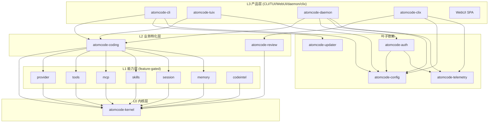

# atomcode 综合深度分析

> 调研对象:`/usr/local/LsmGitOpenSource/atomcode`(v5.0.9)
> 调研日期:2026-09-04 ~ 2026-09-06
> 原始文档:6 份(源码调研/深度分析/核心机制/第二轮/第三轮/第四轮)
> 总行数:~5,500 行(合并后,原始 19,875 行去重压缩)
> 定位:Rust 终端 AI 编码 Agent,TUI/WebUI/Daemon/ACP/Mobile 多端

---

## 目录

1. [项目元信息与目录结构](#1-项目元信息与目录结构)
2. [L0/L1/L2/LEAF 分层架构](#2-l0l1l2leaf-分层架构)
3. [Kernel 核心(Agent 循环/Provider/Message)](#3-kernel-核心agent-循环providermessage)
4. [协议适配(Anthropic/OpenAI wire 层)](#4-协议适配anthropicopenai-wire-层)
5. [工具系统(Trait + 注册 + 中间件)](#5-工具系统trait--注册--中间件)
6. [Hook 系统(LifecycleHooks + HookChain)](#6-hook-系统lifecyclehooks--hookchain)
7. [MCP 7 子模块](#7-mcp-7-子模块)
8. [Skill 系统](#8-skill-系统)
9. [CodeIntel 七件套](#9-codeintel-七件套)
10. [Session 管理与 Context 压缩](#10-session-管理与-context-压缩)
11. [SubAgent / Team 多角色](#11-subagent--team-多角色)
12. [Daemon 守护进程](#12-daemon-守护进程)
13. [Coding / CodingPlan 运行时](#13-coding--codingplan-运行时)
14. [TUI (tuix)](#14-tui-tuix)
15. [Auth + Config + Telemetry + Updater + Review](#15-auth--config--telemetry--updater--review)
16. [WebUI / Extensions / Evals / Docker](#16-webui--extensions--evals--docker)
17. [对 laew 的借鉴(P0/P1/P2)](#17-对-laew-的借鉴p0p1p2)
18. [关键文件清单与常量速查](#18-关键文件清单与常量速查)
19. [第七轮深挖 — 文件编辑与补丁策略 + 代码检索索引 + 命令执行与进程管理 + Token预算与PromptCaching](#21-第七轮深挖--文件编辑与补丁策略--代码检索索引--命令执行与进程管理--token预算与promptcaching)

---

## 1. 项目元信息与目录结构

### 1.1 元信息

| 维度 | 内容 |
| --- | --- |
| 定位 | 开源终端 AI 编码 Agent(TUI / WebUI / Daemon / ACP / Mobile),AtomGit 自托管闭源 CodingPlan 配套 |
| 语言 | **Rust 2021 edition**,1.88+;WebUI 为 TypeScript(`webui/`,构建后由二进制 embed) |
| 仓库组织 | Cargo **workspace**,根 `Cargo.toml` 用 `members = ["crates/*"]` 收集;`closed-source overlay` 通过 `crates/atomcode-codingplan-crypto` 走 `codingplan-crypto` feature 引入 |
| Crate 总数 | 14 个:`atomcode-auth`、`atomcode-capabilities`、`atomcode-cli`(主 binary `atomcode`)、`atomcode-clix`、`atomcode-coding`、`atomcode-codingplan`(闭源 placeholder)、`atomcode-codingplan-crypto`、`atomcode-config`、`atomcode-daemon`、`atomcode-kernel`、`atomcode-review`、`atomcode-telemetry`、`atomcode-tuix`、`atomcode-updater` |
| 入口点 | `crates/atomcode-cli/src/main.rs`(二进制 `atomcode`);同时 lib `src/lib.rs`(`default-run = "atomcode"`,方便 `tests/` 集成) |
| Daemon | 独立 binary `atomcode-daemon`,监听 HTTP,暴露 session history + SSE 聊天 |
| ACP | 独立子命令 `atomcode acp`,基于 `agent-client-protocol = "=2.0.0"`(feature `unstable_protocol_v2`) |
| 构建/发布 | `cargo install --path crates/atomcode-cli --locked`;`profile.release = opt-level "z" + lto + codegen-units=1 + strip + panic="abort"`(追求极致小体积) |
| License | MIT |
| 协议 | 强 serde 可序列化(`AgentCommand`/`AgentEvent` 双向),便于本地 + 跨进程(daemon/web)统一 |
| 注释量 | 极重 RustDoc(单文件动辄上千行内嵌说明),关注点:kernel 边界契约 + 失败模式 + 中间件 load-bearing 语义 |

### 1.2 目录树

```
atomcode/
├── crates/
│   ├── atomcode-kernel/       ← L0: 中性 Agent SDK(核心)
│   │   └── src/  agent.rs, provider.rs, message.rs, stream.rs,
│   │             event.rs, tool.rs, hook.rs, middleware.rs,
│   │             checkpoint.rs, clock.rs, request.rs, conformance/, testkit.rs
│   │
│   ├── atomcode-capabilities/ ← L1: 可插拔能力(核心)
│   │   └── src/  provider/(openai_compat|anthropic|ollama|atomgit_sign|reasoning|retry|sign)
│   │             tools/(bash|read|write|edit|task|todo|web_fetch|web_search|approval|...)
│   │             mcp/(client|config|registry|oauth|transport_http|transport_stdio|trust|tool)
│   │             skills/(registry|render|use_skill|catalog_hook)
│   │             codeintel/(graph|index|list_symbols|read_symbol|trace_*|lsp_tool|file_deps|blast_radius)
│   │             session/(manager|snapshot|transcript|recall|rewind|context|presentation|status_reminder)
│   │             subagent/(claude_code|codex|proc|tool)
│   │             memory/, cc_hooks.rs, datalog.rs, compaction.rs, plugin/,
│   │             team.rs, fs.rs, hooks.rs, proxy.rs, file_index.rs
│   │
│   ├── atomcode-coding/       ← L2: 编码特化(核心)
│   │   └── src/  runtime.rs, parts.rs, assemble.rs, persona.rs,
│   │             controllers.rs, plan_mode.rs, todo.rs,
│   │             discipline/verify.rs, team/(manager|runner|tool),
│   │             init_prompt.rs, subagent_tiers.rs, skill_first.rs,
│   │             next_prompt_suggestion.rs, mcp_instructions.rs,
│   │             provider_factory.rs, rate_limit.rs, vision.rs,
│   │             telemetry.rs, execution_policy.rs, plugin_hooks.rs
│   │
│   ├── atomcode-tuix/         ← TUI: 终端 UI(核心)
│   │   └── src/  event_loop/{mod,commands,bg_runtime,monitor,oauth_poll,...}.rs
│   │             render/{retained,plain,cell,interaction,worker,screen}.rs
│   │             modals/(model_picker|session_picker|diff_viewer|provider_panel|rewind|...).rs
│   │             input/, highlight/, i18n/, git/, plus
│   │             state.rs, terminal.rs, markdown.rs, commands.rs, session.rs, team.rs
│   │
│   ├── atomcode-cli/          ← 辅助:CLI 入口 + clap 子命令 + 调度器
│   ├── atomcode-daemon/       ← 辅助:HTTP/SSE 服务
│   ├── atomcode-config/       ← 辅助:配置、模型目录、settings、store
│   ├── atomcode-auth/         ← 辅助:OAuth/SSO/CodingPlan 登录
│   ├── atomcode-telemetry/    ← 辅助:匿名遥测
│   ├── atomcode-review/       ← 辅助:`code_review` 子代理实现
│   ├── atomcode-clix/         ← 辅助:CLI 实验包
│   ├── atomcode-codingplan/   ← CodingPlan 模型目录与配额窗口
│   ├── atomcode-codingplan-crypto/ ← 闭源 request signer(开源 stub)
│   └── atomcode-updater/      ← 辅助:自更新
│
├── webui/                     ← TypeScript WebUI(构建后由 atomcode-daemon embed)
├── docs/                      ← 设计文档 + plan + 报告
├── evals/                     ← 评测(对抗性 prompt 集等)
├── examples/                  ← Rust 用法示例
├── extensions/                ← 扩展
├── docker/                    ← Docker 镜像
├── scripts/                   ← 安装/构建脚本
└── Cargo.toml                 ← workspace root
```

**职责标注**:
- **核心**:kernel / capabilities(L1)/ coding(L2)/ tuix(TUI)
- **辅助**:cli / daemon / config / auth / telemetry / review / clix / codingplan / updater / webui
- **文档/支撑**:docs / evals / examples / extensions / docker / scripts

---

## 2. L0/L1/L2/LEAF 分层架构

### 2.1 分层架构总览



### 2.2 三层依赖方向契约

`atomcode-capabilities/Cargo.toml` 注释里写明:

```toml
# L1 capabilities layered on atomcode-kernel (L0): real provider adapters, tools, mcp, skills. Depends ONLY on the kernel.
[dependencies]
# L0 only. NEVER add atomcode-core or any L2/L3 crate here (layering is compile-enforced).
atomcode-kernel = { path = "../atomcode-kernel" }
atomcode-auth = { path = "../atomcode-auth", optional = true }
```

`atomcode-coding/Cargo.toml` 是 L2 入口:

```toml
# The FULL capability set: L2 is the opinionated assembly — a coding agent ships
# with web/skills/mcp/session/memory wired (the leaner features exist for other
# embedders, not for this crate).
atomcode-capabilities = { path = "../atomcode-capabilities", features = [
    "provider", "tools", "web", "codeintel", "lsp", "skills", "mcp", "session", "memory",
    "cc-hooks", "offline",
] }
```

**为什么依赖方向是契约**:
- `cargo tree -p atomcode-capabilities` 永远不能出现 `atomcode-coding` —— 编译器直接卡死
- `atomcode-kernel` 是中性 SDK(`lib.rs:1-3` "neutral, embeddable agent"),不知道"编码 / 审查 / MCP"
- **L2 composition**:`atomcode-coding/src/parts.rs:445-458` 把 L1 全部能力 + `atomcode-review`(独立 L2 sibling)作为 `Code_review` 工具挂进主 agent —— "L2 composing a sibling L2"

### 2.3 Feature gating 边界

`atomcode-capabilities/Cargo.toml` 的 `[features]` 一节(共 16 个 feature)是真正的"能力合约":

| Feature | 依赖 / 影响 | L2 默认 |
|---------|------------|---------|
| `provider` | `reqwest` (rustls-tls) + `hyper` + `atomcode-auth` + `atomcode-config` | ✅ |
| `tools` | `ignore` + `regex` + `grep` + `globset` + `tree-sitter-bash` + `encoding_rs` + `chardetng` + `similar` | ✅ |
| `web` | + `reqwest` + `url`(web_fetch / web_search) | ✅ |
| `codeintel` | tree-sitter 12 个 grammar crate | ✅ |
| `lsp` | + `which` + `url`(rust-analyzer 等 spawn) | ✅ |
| `skills` | 无新 dep(仅 markdown 解析) | ✅ |
| `mcp` | `anyhow` + `sha2` + `uuid` + `toml` + `reqwest/blocking`(OAuth) | ✅ |
| `session` | `chrono` + `fs2` | ✅ |
| `memory` | `dirs` | ✅ |
| `cc-hooks` | 子进程 spawn `hooks.json` | ✅ |
| `offline` | web 失败 → 离线模式自动 flip | ✅ |
| `setup` | 一次性 setup 包(独立 binary) | ❌ |
| `e2e` | 真实 provider 网络测试 | ❌ |
| `lsp-e2e` | 真实 rust-analyzer 等 | ❌ |
| `plugin` | marketplace loader | ❌ |

**关键设计点(注释里写明 why)**:

```toml
# Code-intelligence tools (tree-sitter symbol extraction): list_symbols / read_symbol.
# Opt-in (NOT default) — pulls 12 tree-sitter grammar crates (heavy C compilation).
codeintel = [
    "dep:tree-sitter", "dep:tree-sitter-rust", "dep:tree-sitter-python", ...
],
# `web` capability deps ... NOT in default: a tools-only embedder that wants no
# network egress skips it.
web = ["tools", "dep:reqwest", "dep:url", "tokio/net"],
```

**含义**:consumer 只为"用到的能力"付出编译代价。一个 `tools`-only embedder(不带 MCP / codeintel)会显著更小、build 更快。

### 2.4 Cargo.toml 中对 Rust TLS / native cert 的精细处理

`atomcode-capabilities/Cargo.toml` 里有一段是真正的工业级细节(`#514` issue):

```toml
# `rustls-tls` (webpki base) — an INFALLIBLE base so `.build()` never hard-fails
# on certs. OS native roots + SSL_CERT_FILE are layered on TOP, gracefully, in
# `build_http_client` (`add_trusted_roots`). NOT `rustls-tls-native-roots`:
# reqwest reads native roots / SSL_CERT_FILE STRICTLY there and fails the build
# ("zero valid certificates …") on a bad SSL_CERT_FILE or empty store, which
# cascades into panics at every `.build()` site.
reqwest = { version = "0.12", features = ["stream", "json", "rustls-tls"], default-features = false, optional = true }
# OS native root store loader for corporate MITM-proxy CAs. Best-effort. #514.
rustls-native-certs = { version = "0.8", optional = true }
```

**WHY**:reqwest 的 `rustls-tls-native-roots` 是 STRICT mode —— 用户的 `SSL_CERT_FILE` 一旦脏掉,所有 `.build()` site 全 panic。atomcode 选择 webpki base + 显式 layer 上去,best-effort 处理 MITM CA。

**Windows 平台分支**:

```toml
[target.'cfg(target_os = "windows")'.dependencies]
# Windows SChannel backend for reqwest (dodges rustls-fingerprint RST on *.atomgit.com).
reqwest = { version = "0.12", features = ["native-tls"], default-features = false, optional = true }
```

Windows 用 SChannel 绕过 rustls-fingerprint 检测(在 `*.atomgit.com` 域上 rustls 会被 RST)。

### 2.5 数据流走向(prepare → assemble → Agent)

```
CodingAgentConfig (L2 配置)
    ↓
prepare_with_plugin_hooks_reusing_lease (parts.rs:452-...)
    ├─ Async I/O:
    │  ├─ load_mcp_config + registry.from_config + add_server (BGP: connect stdio/HTTP)
    │  ├─ load skill dirs (home + project)
    │  ├─ session.bind (uuid v4 分配 / resume 重载)
    │  └─ register tools: register_coding_tools_with_vision + register_codeintel_tools + register_lsp_tool
    └─ 同步组合(无 I/O):
       ├─ register_skill_tools (UseSkillTool + ListSkillsTool)
       ├─ registry.mount(names)
       └─ 构造 CodingParts(含 Arc<ApprovalMiddleware>, Arc<HookChain>, Arc<SkillRegistry> ...)
    ↓
assemble (parts.rs:1507-...)
    ├─ 纯组合(无 I/O):
    ├─ 注入 Arc<dyn LlmProvider> (含 review_provider, subagent_provider)
    ├─ 注入 Arc<dyn CompactionStrategy> (Stub + Overflow Ladder)
    ├─ 注册 middlewares (parts.rs:1700-1800): 严格顺序
    │  ├─ TurnExecutionPolicy → PlanModeGate → PlanModeReminderHook
    │  ├─ CredentialBashGate → SensitivePathGate → [atomgit]AtomgitBashGate
    │  ├─ CCExternalHooks (PreToolUse gate)
    │  ├─ OpenFileWorkspaceGate → WriteApprovalGate → BashWorkspaceGate
    │  ├─ ApprovalMiddleware (通用)
    │  └─ DatalogHook (lifecycle + middleware 同时挂)
    ├─ 注册 lifecycle hooks (parts.rs:1837-1858): 严格顺序
    │  ├─ SkillCatalogHook → MemoryHook → SessionContextHook
    │  ├─ McpInstructionsHook → RateLimitHook → CCExternalHooks
    │  ├─ VerifyCadenceHook → TodoHook
    │  └─ TodoEagerHook (model 决定) → DatalogHook
    └─ AgentBuilder.build() → Arc<Agent> / AgentHandle
```

**关键**:中间件 / Hook 注册顺序是 LOAD-BEARING(parts.rs:1704-1705 "Register before every middleware that can `Allow` and bypass downstream approval gates";parts.rs:1750-1759 CC PreToolUse 必须 `BEFORE` WriteApprovalGate,因为 WriteApprovalGate 会用 `Allow` 短路后续链路,让 PreToolUse 看不见)。

---

## 3. Kernel 核心(Agent 循环/Provider/Message)

### 3.1 模块边界(kernel/src/lib.rs)

```rust
//! atomcode-kernel (spike) — a domain-neutral agent driven by a bidirectional,
//! serializable Command/Event handle.
//!
//! Phase A0: internals are minimal/throwaway; the public API *shape* is what
//! Phase A1 carries the proven hot-path code into. The kernel knows nothing
//! about approval, persona, or code-intelligence.

pub mod agent;
pub mod checkpoint;
pub mod clock;
pub mod conformance;
pub mod event;
pub use event::{OUTPUT_TRUNCATION_CHECKPOINT_KIND, ROUND_CAP_CHECKPOINT_KIND};
pub mod hook;
pub mod message;
pub mod middleware;
pub mod provider;
pub mod request;
pub mod stream;
pub mod testkit;
pub mod tool;
```

**模块职责矩阵**(按行数排序):

| 模块 | 行数 | 职责 |
|------|------|------|
| `agent.rs` | 5966 | Agent 主循环 + retry ladder + 失败模式策略 |
| `message.rs` | 2064 | Message / Conversation / CompactionPlan / sacred_floor |
| `testkit.rs` | 1571 | MockProvider / scripted StreamEvents / ApprovalMiddleware |
| `hook.rs` | 638 | LifecycleHooks + HookChain + TurnCtx + RateLimitHint/Decision |
| `tool.rs` | 604 | Tool trait + ToolDef + ToolRegistry + MountedTools / Publisher |
| `event.rs` | 531 | AgentCommand + AgentEvent + StopReason + PolicyIntervention |
| `provider.rs` | 269 | LlmProvider trait + ChatOptions + ReasoningEffort + ToolChoice |
| `stream.rs` | 280 | StreamEvent + TokenUsage::merge_max + ProviderError |
| `middleware.rs` | 158 | ToolMiddleware + BeforeOutcome + AfterOutcome |
| `request.rs` | 137 | RequestCtx / Requester (kernel/driver 双向握手) |
| `conformance/` | - | 一致性测试(被 testkit 调用) |
| `checkpoint.rs` | 43 | CompactionCheckpoint trait (持久化快照) |
| `clock.rs` | 76 | 可注入的时钟(test-only 虚拟时钟) |

### 3.2 关键事实:`Agent` 是 struct,不是 trait

kernel 中**不存在 `Agent` trait**——`Agent` 是一个具体的 struct,通过 `AgentBuilder` 流水线式组装:

```rust
// crates/atomcode-kernel/src/agent.rs:794-895
pub struct Agent {
    provider: Arc<dyn LlmProvider>,
    tools: MountedTools,
    persona: String,
    middlewares: Vec<Arc<dyn ToolMiddleware>>,
    hooks: Arc<dyn LifecycleHooks>,
    max_rounds: Option<u32>,
    max_provider_retries: u32,
    tool_loop_policy: Option<ToolLoopPolicy>,
    max_continuations: Option<u32>,
    resume: Option<SessionSnapshot>,
    max_tool_result_bytes: usize,        // 默认 64KiB
    max_parallel_tools: Option<usize>,
    compaction: Arc<dyn CompactionStrategy>,
    compact_threshold: Option<f32>,
    compaction_checkpoint: Option<Arc<dyn CompactionCheckpoint>>,
    stream_timeout: Option<Duration>,
    request_timeout: Option<Duration>,
    chat_options: ChatOptions,
    working_dir: Option<PathBuf>,
    shared_cwd: Option<Arc<RwLock<PathBuf>>>,
    cancel_token: Option<CancellationToken>,
    session_id: Option<Arc<str>>,
    clock: Arc<dyn Clock>,
    keep_interrupted_context: bool,
    round_cap_checkpoint: bool,
}
```

### 3.3 协议中立性:`LlmProvider` trait

```rust
// crates/atomcode-kernel/src/provider.rs:120-157
#[async_trait]
pub trait LlmProvider: Send + Sync {
    fn model_name(&self) -> &str;
    /// Effective context window in tokens. 0 = unknown.
    fn context_window(&self) -> u32 { 0 }
    /// Bind this provider to its owning Agent's session id, ONCE. The kernel calls
    /// this at spawn — the single point where the session id meets the provider —
    /// so no driver re-threads it. An adapter forwards it as the
    /// `x-atomcode-session-id` header, letting a forwarding gateway (LiteLLM) pin the
    /// whole conversation to one upstream for prefix-cache affinity.
    fn bind_session_id(&self, _session_id: &str) {}
    /// Open the stream for one turn. `Err` = a failed OPEN (auth/connect/etc.);
    /// the stream itself may then still fail mid-flight via `StreamEvent::Error`.
    async fn chat_stream(
        &self,
        messages: &[Message],
        tools: &[ToolDef],
        options: &ChatOptions,
    ) -> Result<BoxStream<'static, StreamEvent>, ProviderError>;
}
```

**关键设计**:
- 唯一契约是 `chat_stream` —— 流式为唯一协议(注释明示 `SLOT, not POLICY` —— kernel 是 mechanism,adapter 负责 policy)
- `bind_session_id` 是一次性绑定(`OnceLock` 实现)—— kernel 在 spawn 时单点注入,驱动层无需手传 session id
- `ChatOptions` 中立携带 `reasoning_effort` / `tool_choice` / `temperature` / `max_tokens` —— adapter 自己映射到 OpenAI / Anthropic / Ollama 的 wire 格式
- `RateLimitRetryOwner` 标注运行时谁拥有 429 重试(`#[serde(skip)]` 不持久化)—— 直接 provider 调用者保留默认;kernel turn loop override,让 wait 可被 cancel

**`ChatOptions` 中性请求拨杆**:

```rust
pub struct ChatOptions {
    pub reasoning_effort: Option<ReasoningEffort>,  // Low/Medium/High/XHigh/Max
    pub max_tokens: Option<u32>,
    pub temperature: Option<f32>,
    pub tool_choice: ToolChoice,  // Auto/Required/Specific(String)/None
    pub rate_limit_retry_owner: RateLimitRetryOwner,
}
```

### 3.4 `AgentCommand` / `AgentEvent` 双向消息协议

这是 kernel **对外协议的中立骨架**,从 TUI / daemon / ACP / WebUI 都可以套用同一份 wire format。

**`AgentCommand`(driver → agent)**:

```rust
#[non_exhaustive]
#[derive(Clone, Debug, Serialize, Deserialize)]
pub enum AgentCommand {
    SendMessage { text: String, #[serde(default)] images: Vec<ImageContent> },
    SendMessageWithContext { text: String, #[serde(default)] images, context: String },
    SendSyntheticMessage { text: String },
    Respond { id: RequestId, value: serde_json::Value },
    Snapshot,
    Compact { focus: Option<String> },
    Cancel,
    Shutdown,
}
```

**`AgentEvent`(agent → driver)** 涵盖所有 driver 需要的信号:

```rust
#[non_exhaustive]
pub enum AgentEvent {
    TurnStarted, TextDelta(String),
    ToolCallStreaming { index, id, name, arguments },
    ToolBatchStarted { batch_id, calls },
    ToolBatchCompleted { batch_id, ok, total, elapsed_ms },
    ToolStarted { call }, ToolProgress { call_id, message },
    ToolResult { result },
    PolicyIntervention { intervention },
    Request { id, kind, payload },
    Usage(MessageMeta),
    Snapshot { snapshot },
    TurnComplete { reason: StopReason },
    Error { message, http_status, code, retryable },
    Cancelled, Reasoning(String), Warning(String),
    StreamRecovery { attempt, max_attempts, recovered },
    ProviderRetry { attempt, max_attempts, backoff_secs, reason },
    OutputTruncationRecovery { attempt, max_attempts },
    RateLimited { reset_at_display, reset_label, secs_until_reset, auto_resuming, server_message },
    Steered { count, inputs },
    CompactionStarted { trigger },
    Compacted { trigger, epoch, removed, bytes_before, bytes_after, committed, snapshot },
    CompactionFailed { trigger, error },
}
```

**协议兼容性三大武器**:
1. `#[non_exhaustive]` —— 新 variant 不破下游 `match`
2. `#[serde(default)]` —— 老 wire 缺字段仍可反序列化(`SendMessage {text}` → 无 images)
3. `#[serde(default, skip_serializing_if = "Option::is_none")]` —— 可选字段不强制序列化

**`StopReason` 是"失败感知"核心**:

```rust
/// WHY a turn ended (FAILURE PERCEPTION). Carried by the terminal
/// `AgentEvent::TurnComplete { reason }` and aggregated into `Outcome::stop`, so a
/// driver (TUI / SWE-bench grader / CI) can ALWAYS tell a clean stop from a
/// failure — a failed turn can never look like an empty SUCCESS.
```

`Outcome::default()` 是 `Stopped`(line 90 `#[default] Stopped`),保证 Default 编译过;`Outcome.error` 是 LAST Error,"a failed open/mid-stream/timeout/fuse yields `Outcome { stop: ProviderError, error: Some(..) }`, not an empty `Outcome::default()` masquerading as success"。

### 3.5 Agent 主循环状态机

入口在 `RunningAgent::run_turn()`(agent.rs:1850),是一个复杂的 `loop`,内含多层计数器/融合器:

**轮次循环**:`loop { round += 1; ... }`

**关键计数器**(全部在 run_turn 局部声明):
- `round: u32` — 当前轮次(1-based)
- `continuations: u32` — `offer_continuation` 续接次数,上限 `max_continuations`(默认 50)
- `truncation_continuations: u32` — 输出截断自动续接,上限 `MAX_TRUNCATION_CONTINUATIONS`(4)
- `overflow_attempt: u8` — 上下文溢出恢复尝试,上限 `MAX_OVERFLOW_ATTEMPTS`(3)
- `provider_retry: u32` — 瞬态 provider 重试,上限 `DEFAULT_MAX_PROVIDER_RETRIES`(3)
- `stream_retry: u32` — 流中断重连,上限 `MAX_STREAM_RETRIES`(5)
- `rate_limit_waits: u32` — 429 限流等待,上限 `MAX_RATE_LIMIT_WAITS`(5)
- `empty_retries: u32` — 空响应重试,上限 `EMPTY_RESPONSE_MAX_RETRIES`(5)
- `repeat_rounds: u32` — 粗粒度重复熔断,`REPEAT_NUDGE_AT`(3)时警告,`MAX_REPEAT_ROUNDS`(6)时停止

**每轮处理流程**:
1. 检查 `round_cap`(可选的交互式 checkpoint)
2. 排空 `steer` 缓冲区(用户中途输入)
3. 克隆消息 → `hooks.pre_request()` 投影(ephemeral,不污染缓存)
4. `hooks.pre_request_options()` 设置请求选项
5. 构建 `ToolDef[]` → `provider.chat_stream()` 发起请求
6. 流式消费 `StreamEvent`,分发到 `on_text_delta` / `on_reasoning_delta` / `on_model_response`
7. 工具调用三阶段:① Classify → ② Execute(并发) → ③ Apply
8. 检查续接/截断/溢出/空响应,决定是否继续循环

### 3.6 流式输出实现

```rust
// crates/atomcode-kernel/src/stream.rs:90-156
pub enum StreamEvent {
    TextDelta(String),
    Reasoning(String),
    ReasoningSignature { opaque: String, provider: String },  // Anthropic / OpenAI encrypted_content / Gemini thoughtSignature
    ToolCall(ToolCall),
    ToolCallDelta { index: u32, id: Option<String>, name: Option<String>, arguments: String },
    Usage(TokenUsage),
    ResponseId(String),
    ResponseModel(String),
    Error(ProviderError),
    Malformed,
    Done { truncated: bool },
}
```

**`TokenUsage::merge_max` 字段级 max**(注释):
```rust
/// Usage 合并: Anthropic 风格(split report)vs OpenAI 风格(单次 cumulative)的差异
/// 字段级 MAX,不会 double-count cumulative delta
pub fn merge_max(&mut self, other: TokenUsage) { ... }
```

**`on_text_delta` / `on_reasoning_delta` 是 transform seam**:每 chunk 原地变换(agent.rs:2542-2594),保证流式 + 存储一致(脱敏同时进 live stream + storage,关闭 reasoning 通道泄露)。

### 3.7 用户中断 / Steering

- **Steer 机制**(`agent.rs:725-733`):用户在 turn 中提交的 `SendMessage` 不排队成新 turn,而是写入 `SteerBuf`,在**下一轮 round 边界**折叠进当前 turn(`agent.rs:2017-2047`)
  - 真实 steer 会重置 tool-loop 状态、清除 repeat 检测
- **Cancel**:`CancellationToken` 协作式取消
  - per-turn token 由 `new_turn_token` 铸造(`agent.rs:1096-1101`),外部 cancel token 的 child
  - 在 stream 消费(`agent.rs:2412-2420`)、工具执行(`agent.rs:3619-3628`)、sleep 等待处均 `biased` 轮询 cancel
  - `keep_interrupted_context`(`agent.rs:889-892`)控制 cancel 是 UNDO(回滚到 `rollback_len`)还是保留部分工作
- **Shutdown**:`agent.rs:1559-1571` 区分 `internal_cancel` + `turn_token.cancel()`,等 turn 正常终结,避免跳过 `finish_cancelled / turn_complete`

### 3.8 多轮对话实现

atomcode 没有独立的 REPL 屏,多轮对话由 **kernel 的 session loop** 与 **driver 的命令队列** 协同实现:

- **session loop 入口**:`atomcode-kernel/src/agent.rs:1418-1468` `RunningAgent::session_loop`
  - 持有 `cmd_rx: UnboundedReceiver<AgentCommand>`,循环接收 `SendMessage / SendSyntheticMessage / Cancel / Shutdown / Snapshot / Compact` 等命令
  - 每个真实用户消息走 `process_send_message`(`agent.rs:1475`),synthetic 消息(FIFO 队列)在 turn 边界排空
- **driver 侧**:`atomcode-coding/src/runtime.rs` 的 `CodingRuntimeHandle` 暴露 `submit() / steer() / cancel()` 命令,经 channel 灌入 kernel
- **TUI 前端**:`atomcode-cli/src/tui/` 通过 crossterm 原始模式读键,整串命令发给 runtime

**Turn 模型**:Turn 是 kernel 的原子执行单元,**一个 user message = 一个 turn**,内部可含多轮 LLM 调用(round):

- **TurnCtx**(`atomcode-kernel/src/hook.rs:19-47`):携带 `session_id / turn_id / request_id / round / max_rounds / cache_epoch / context_window / used_tokens`
  - `turn_id` 单调递增(`agent.rs:1076-1078 turn_counter`),`request_id` 全局唯一
  - 注释明示"deterministic — NOT clock/random — so log stitching stays reproducible"

### 3.9 安全熔断常量

```rust
// crates/atomcode-kernel/src/agent.rs
const DEFAULT_MAX_TOOL_RESULT_BYTES: usize = 64 * 1024;  // 64KiB
const MAX_OVERFLOW_ATTEMPTS: u8 = 3;
const DEFAULT_MAX_PROVIDER_RETRIES: u32 = 3;
const MAX_STREAM_RETRIES: u32 = 5;
const MAX_PARTIAL_STREAM_RECOVERIES: u32 = 1;
const MAX_RATE_LIMIT_WAITS: u32 = 5;
const SILENT_FIRST_RATE_LIMIT_RETRY: Duration = Duration::from_secs(1);
const EMPTY_RESPONSE_MAX_RETRIES: u32 = 5;
const MAX_TRUNCATION_CONTINUATIONS: u32 = 4;
const MAX_REPEAT_ROUNDS: u32 = 6;
```

---

## 4. 协议适配(Anthropic/OpenAI wire 层)

### 4.1 Anthropic Messages 适配

```rust
// crates/atomcode-capabilities/src/provider/anthropic.rs:43-151
pub struct AnthropicConfig {
    pub api_key: String,
    pub base_url: String,
    pub model: String,
    pub supports_vision: bool,
    pub context_window: u32,
    pub max_tokens: u32,  // REQUIRED
    pub anthropic_version: String,  // "2023-06-01"
    pub thinking: bool,
    pub send_sampling_params: bool,
    pub idle_timeout: Duration,
    pub connect_timeout: Duration,
    pub open_timeout: Duration,
    pub retry: RetryPolicy,
    pub user_agent: Option<String>,
    pub skip_tls_verify: bool,
}
```

**请求构造**:
- Auth:`x-api-key` + `anthropic-version` 头(非 Bearer)
- URL:`{base_url}/v1/messages`
- `system` 是顶层字段(非 message role)
- `max_tokens` 必填
- tool `input_schema`(非 `function.parameters`)
- `tool_use.input` 是 JSON 对象(非字符串)

**流式解码**:
- 事件类型 SSE:`message_start` / `content_block_*` / `message_delta` / `message_stop`
- thinking 块带 opaque `signature`,必须原样回显
- `input_json_delta` 片段按 content-block index 缓冲,在 `content_block_stop` 发射完整 `ToolCall`

### 4.2 OpenAI 兼容适配

```rust
// crates/atomcode-capabilities/src/provider/openai_compat.rs:111-280
pub struct OpenAiCompatConfig {
    pub api_key: String,
    pub base_url: String,
    pub model: String,
    pub supports_vision: bool,
    pub context_window: u32,
    pub max_tokens: Option<u32>,
    pub reasoning_effort: Option<ReasoningEffort>,
    pub tool_choice: ToolChoice,
    pub temperature: Option<f32>,
    pub idle_timeout: Duration,
    pub connect_timeout: Duration,
    pub open_timeout: Duration,
    pub retry: RetryPolicy,
    pub request_signer: Option<Arc<dyn RequestSigner>>,
    pub user_agent: Option<String>,
    pub skip_tls_verify: bool,
}
```

**请求构造**:
- Auth:`Authorization: Bearer {api_key}`
- URL:`{base_url}/chat/completions`
- `reasoning_effort` 映射:`low` / `medium` / `high` / `xhigh` / `max`
- OpenRouter 归因头:`HTTP-Referer` / `X-OpenRouter-Title` / `X-OpenRouter-Categories`

**流式解码**:
- choice-delta chunks
- `tool_calls[]` 按 index 缓冲,在 `finish_reason == "tool_calls"` 发射完整 `ToolCall`
- usage 最后 wins,发射单个 `Usage` 事件

### 4.3 错误映射与重试

```rust
// crates/atomcode-capabilities/src/provider/retry.rs
pub struct RetryPolicy {
    pub max_retries: u32,
    pub initial_backoff: Duration,
    pub max_backoff: Duration,
    pub backoff_multiplier: f64,
}
pub enum ProviderError { Retryable { ... }, NonRetryable { ... } }
```

**重试分层**:
1. **Provider 层**:OPEN 失败快速回退(~1.5s),最多 3 次
2. **Kernel 层**:`max_provider_retries` = 3(瞬态失败)
3. **Stream 层**:`MAX_STREAM_RETRIES` = 5(mid-stream 重连)
4. **429 层**:`MAX_RATE_LIMIT_WAITS` = 5,首次静默重试

### 4.4 Wire Dump 字节级调试

```rust
// crates/atomcode-capabilities/src/provider/mod.rs
pub fn wire_dump_request(model: &str, body: &Value) {
    if std::env::var("ATOMCODE_WIRE_DUMP").is_ok() {
        // 写入 config_dir()/wire-dump/<model>-<timestamp>.json
    }
}
```

---

## 5. 工具系统(Trait + 注册 + 中间件)

### 5.1 `Tool` trait

```rust
// crates/atomcode-kernel/src/tool.rs:206-272
#[async_trait]
pub trait Tool: Send + Sync {
    fn name(&self) -> &str;
    fn description(&self) -> &str;
    fn parameters_schema(&self) -> serde_json::Value;
    /// Risk classification for THIS call — arg-aware (e.g. bash: `rm -rf` Risky vs `ls` Safe).
    fn risk(&self, _args: &str) -> RiskLevel { RiskLevel::Safe }
    /// Known read-only (intrinsic); MCP sets from `annotations.readOnlyHint`.
    fn read_only_hint(&self) -> bool { false }
    /// Output is self-bounded; skip generic truncation (e.g. read_file).
    fn self_bounds_output(&self) -> bool { false }
    /// Whether THIS call may run concurrently with other tools (parallel-safe).
    fn parallel_safe(&self, _args: &str) -> bool { self.read_only_hint() }
    /// "Always" approval scope (empty for tool-wide like mcp__).
    fn always_grant_scope(&self, args: &str) -> String { args.to_string() }
    /// Lift a policy intervention discovered behind this tool's execution boundary.
    fn take_policy_intervention(&self, _result: &mut ToolResult) -> Option<PolicyIntervention> { None }
    async fn execute(&self, args: &str, ctx: &ToolContext) -> ToolResult;
}
```

**信任模型**(模块级文档明确):
- `RiskLevel` 是**建议元数据**,不是执行边界
- 内核**不沙箱化**工具——工具获得宿主进程完整权限
- 唯一内置安全机制:`max_tool_result_bytes`(默认 64KiB)
- OS 级隔离是**嵌入者**的责任

### 5.2 `ToolRegistry` + `MountedTools` 二阶段

```rust
// crates/atomcode-kernel/src/tool.rs:277-418
pub struct ToolRegistry { tools: Arc<RwLock<BTreeMap<String, Arc<dyn Tool>>>> }
impl ToolRegistry {
    pub fn register(&mut self, tool: Arc<dyn Tool>) { ... }
    pub fn mount(&self, names: &[&str]) -> MountedTools { ... }
    pub fn mount_updatable(&self, names: &[&str]) -> (MountedTools, MountedToolsPublisher) { ... }
}
pub struct MountedTools { current: Arc<RwLock<Arc<MountedToolsSnapshot>>> }
impl MountedToolsPublisher {
    pub fn publish(&self, registry: &ToolRegistry, names: &[&str]) -> ToolCatalogRevision { ... }
}
```

**设计要点**:
- `BTreeMap` 保证确定性 prompt 排序
- `MountedToolsSnapshot` 不可变,发布新版本时原子替换
- 同一 turn 内 model request 与 tool execution 看到相同工具集

**WHY 这种二阶段**:注释钉死 —— "Holds *all* available tools. Clones share the same registry so a runtime-owned background capability reconciler can register tools before publishing a new mounted snapshot" —— MCP 在后台初始化完后原子 publish 新快照,agent 下一轮拿到的工具集自动更新。

### 5.3 工具三阶段执行(Phase ①②③)

- **位置**:`agent.rs:3232-3801`
- **Phase ① CLASSIFY**(按序):
  - 重复检测:`result_ids`(mode A,同 id) / `seen_calls`(mode B,同 name+args)
  - 截断保护:`finish_reason=length` 时所有 call 返回 coach 结果
  - middleware `before` 链:`Proceed / Ask / Allow / Deny / DenyTurn / DenyTurnWithIntervention`
  - 产出 `Vec<CallPlan>`:`Execute / Skip / Result`
- **Phase ② EXECUTE**(并发):
  - `FuturesOrdered` + `RwLock` gate + `Semaphore` cap
  - `parallel_safe` 工具拿 read lock(可并发),副作用工具拿 write lock(独占)
  - cap:`ATOMCODE_MAX_PARALLEL_TOOLS`(默认 4,`clamp(1, MAX_PARALLEL_TOOLS_CEILING)`)
  - 每个 future 内 `biased` 轮询 cancel
- **Phase ③ APPLY**(按序):
  - middleware `after` 链
  - `cap_tool_result` 截断
  - 收集 loop fingerprint(用于 loop 检测)
  - vision 图片收割 → 附加到 follow-up user message
  - emit `ToolResult` + push `Message::tool_result`

### 5.4 关键工具清单

| 工具 | 文件 | 风险 | 特性 |
|------|------|------|------|
| bash | `tools/bash.rs` | arg-aware | AST 只读分类(tree-sitter-bash)、Job Object 进程树 |
| read_file | `tools/read.rs` | Safe | 自截断 + 行号分页 |
| write_file | `tools/write.rs` | Risky | 需审批 |
| edit_file | `tools/edit.rs` | Risky | 行级 diff |
| list_dir | `tools/list.rs` | Safe | - |
| grep | `tools/grep.rs` | Safe | 流式搜索 + ignore |
| glob | `tools/glob.rs` | Safe | - |
| task | `tools/task.rs` | Risky | SubAgent 驱动 |
| web_fetch | `tools/web_fetch.rs` | Risky | SSRF DNS 检查 |
| web_search | `tools/web_search.rs` | Risky | - |
| use_skill | `skills/use_skill.rs` | Safe | - |
| list_skills | `skills/render.rs` | Safe | - |
| mcp__*__* | `mcp/tool.rs` | 来自 server annotations | 工具适配 |

---

## 6. Hook 系统(LifecycleHooks + HookChain)

### 6.1 `LifecycleHooks` trait

```rust
// crates/atomcode-kernel/src/hook.rs:183-322
#[async_trait]
pub trait LifecycleHooks: Send + Sync {
    async fn session_start(&self, _convo: &mut Conversation, _resumed: bool) {}
    async fn user_prompt_submit(&self, _text: &mut String) -> Result<(), String> { Ok(()) }
    async fn turn_start(&self, _convo: &mut Conversation) {}
    async fn pre_request(&self, _messages: &mut Vec<Message>, _ctx: &TurnCtx) {}
    async fn pre_request_options(&self, _messages: &[Message], _options: &mut ChatOptions, _ctx: &TurnCtx) {}
    async fn on_request(&self, _messages: &[Message], _tools: &[ToolDef], _options: &ChatOptions, _ctx: &TurnCtx) {}
    async fn on_text_delta(&self, _delta: &mut String) {}
    async fn on_reasoning_delta(&self, _delta: &mut String) {}
    async fn on_model_response(&self, _response: &mut Message) {}
    async fn offer_continuation(&self, _convo: &Conversation) -> Option<String> { None }
    async fn offer_typed_continuation(&self, convo: &Conversation) -> Option<Continuation> { ... }
    async fn turn_complete(&self, _convo: &Conversation, _reason: &StopReason, _ctx: &TurnCtx) {}
    async fn on_error(&self, _error: &str) {}
    async fn on_rate_limit(&self, _hint: &RateLimitHint) -> Option<RateLimitDecision> { None }
    async fn session_end(&self, _convo: &Conversation) {}
}
```

**永久 vs ephemeral 区分**(注释强调):
- **`session_start` / `turn_start` / `on_model_response`** —— PERMANENT(写入历史)
- **`pre_request` / `on_text_delta` / `on_reasoning_delta`** —— EPHEMERAL(操作克隆上,不污染 prefix cache)
- **`on_request`** —— 只读观察(`&` 不能改 wire)

### 6.2 `HookChain` 组合契约

```rust
/// Composes MANY `LifecycleHooks` into one by FANNING OUT each method over an
/// ordered list. This is the seam that lets independent capabilities coexist —
/// codeintel + compaction + redaction can each register a hook instead of fighting
/// over a single slot. A `HookChain` itself implements `LifecycleHooks`, so the
/// Agent still holds exactly one `Arc<dyn LifecycleHooks>` and every call site in
/// the run loop stays unchanged.
```

**`HookChain` 组合契约**(hook.rs:336-365 注释里逐 method 钉死):
- `session_start` / `turn_start`:全部按注册顺序跑(后续 hook 看见前面 hook 的改动)
- `user_prompt_submit`:第一个 `Err` 短路阻断
- `offer_continuation`:**first Some wins**,后续 Some 忽略(loop 一次只注入一条续接)
- `turn_complete` / `on_error` / `session_end`:全部按顺序观察

### 6.3 `ToolMiddleware` + `BeforeOutcome` / `AfterOutcome`

```rust
// crates/atomcode-kernel/src/middleware.rs:34-103
#[async_trait]
pub trait ToolMiddleware: Send + Sync {
    /// EPHEMERAL rewrite + approval gate; BEFORE chain runs in registration order.
    /// The first middleware to return `Deny` blocks; `Allow` short-circuits remaining
    /// before gates.
    async fn before(&self, _call: &mut ToolCall, _tool: &Arc<dyn Tool>, _rt: &RequestCtx)
        -> BeforeOutcome { BeforeOutcome::Proceed }

    /// RESULT transform + continuation gate; AFTER chain runs in registration order.
    async fn after(&self, _result: &mut ToolResult, _tool: Option<&Arc<dyn Tool>>)
        -> AfterOutcome { AfterOutcome::Proceed }
}

pub enum BeforeOutcome {
    #[default] Proceed,
    Allow { reason: Option<String> },
    Ask { reason: Option<String> },
    Deny { reason: String },
    DenyTurn { reason: String },
    DenyTurnWithIntervention { reason: String, intervention: PolicyIntervention },
}
```

**为什么 BEFORE 链注册顺序是契约**(注释反复强调):

> "ORDERING IS LOAD-BEARING. Middlewares run in REGISTRATION ORDER: the `before` chain forward (the first-registered runs first; the first to `Err` blocks and stops the chain), then the `after` chain (also in registration order). This is a documented contract, not an accident of iteration. **Any normalization or repair that changes the arguments which will execute MUST run before every observer, policy gate, and user approval, so all of them inspect the exact bytes the tool receives**."

**`Panic Contract`**:kernel 不隔离 panic(`panic = "abort"` 下 `catch_unwind` 没用),所以 middleware 必须不 panic —— 与 tool sandbox contract 同级 —— 阻断必须 return `BeforeOutcome::Deny`。

### 6.4 `TurnCtx` 关联 ID

- `session_id`:driver 注入(kernel 不 mint)
- `turn_id`:kernel 单调递增(确定性,不是 clock/random)—— 1-based within session
- `request_id`:kernel 全局单调 —— 1-based across session
- `round`:当前 turn 内的轮次(每 turn reset)
- `max_rounds` / `cache_epoch` / `context_window` / `used_tokens`

**WHY deterministic**:注释钉死 —— "deterministic — NOT clock/random — so log stitching stays reproducible"。

---

## 7. MCP 7 子模块

### 7.1 模块切分

| 子模块 | 行数 | 职责 |
|--------|------|------|
| `mod.rs` | 62 | 模块入口 + `register_mcp_tools()` |
| `client.rs` | 41 | `McpClient` trait + `McpToolInfo` |
| `registry.rs` | 1638 | `McpRegistry`(server 连接管理 + Trust + Alias) |
| `config.rs` | 1075 | `McpServerConfig` / `load_mcp_config()` |
| `oauth.rs` | 845 | MCP OAuth login + token store |
| `transport_http.rs` | 852 | Streamable HTTP/SSE 传输 + OAuth 自动 refresh |
| `transport_stdio.rs` | 910 | Stdio JSON-RPC 传输 + 三锁分离 |
| `tool.rs` | 355 | `McpToolAdapter`(MCP tool → kernel Tool) |
| `trust.rs` | 242 | 项目级 trust store (`mcp_trust.json`) |
| `types.rs` | 270 | JSON-RPC 类型 + ServerStatus + ContentBlock |
| `util.rs` | 23 | `config_dir()`(项目级工具) |

### 7.2 `McpClient` trait

```rust
#[async_trait]
pub trait McpClient: Send + Sync {
    async fn initialize(&mut self) -> Result<InitializeResult>;
    async fn list_tools(&self) -> Result<ListToolsResult>;
    async fn call_tool(&self, tool_name: &str, arguments: serde_json::Value) -> Result<CallToolResult>;
    fn server_name(&self) -> &str;
    fn status(&self) -> ServerStatus;
}
```

**接口干净**:5 个方法足以承载 JSON-RPC `initialize` / `tools/list` / `tools/call`。`status()` 是 sync 访问(让 `Tool::risk` 在 sync 路径上能 inspect),不阻塞。

### 7.3 `McpRegistry` —— 多 server + trust + auto-approve 集中管理

```rust
pub struct McpRegistry {
    servers: Arc<RwLock<BTreeMap<String, Arc<dyn McpClient>>>>,
    server_timeouts_ms: Arc<RwLock<BTreeMap<String, u64>>>,
    failed_servers: Arc<RwLock<BTreeMap<String, String>>>,
    status_overrides: Arc<std::sync::RwLock<BTreeMap<String, ServerStatus>>>,
    configured_servers: Arc<std::sync::RwLock<HashSet<String>>>,
    connect_events: Option<mpsc::UnboundedSender<McpConnectEvent>>,
    initial_ready: watch::Sender<bool>,
    cancelled: watch::Sender<bool>,
    trusted_servers: Arc<std::sync::RwLock<HashSet<String>>>,
    auto_approved_tools: Arc<std::sync::RwLock<HashSet<String>>>,
    tool_aliases: Arc<std::sync::RwLock<BTreeMap<String, (String, String)>>>,
    server_instructions: Arc<std::sync::RwLock<BTreeMap<String, String>>>,
}
```

**核心字段分类**:
1. **连接状态**:`servers` + `server_timeouts_ms` + `failed_servers` + `status_overrides` + `configured_servers`
2. **广播同步**:`connect_events`(一次性事件给 TUI 滚动展示)+ `initial_ready`(level-triggered 广播)
3. **取消**:`cancelled`(dropped/replaced runtime 取消待 work)
4. **信任**:`trusted_servers` + `auto_approved_tools`(std::sync RwLock,**因为 `Tool::risk` 是 sync 的不能 await**)
5. **别名映射**:`tool_aliases`(sanitized name → original `(server, tool)` identity)
6. **运行时 prompt 注入**:`server_instructions`(initialize-time 拿到,注入 `<mcp-server-instructions>` 块)

### 7.4 Stdio 传输 —— 三锁分离

```rust
pub struct StdioClient {
    /// Serialize request/response round-trips.
    request_lock: Arc<Mutex<()>>,
    /// Keeps an operation's request, recovery decision, and optional retry in
    /// one critical section.
    operation_lock: Arc<Mutex<()>>,
    /// Serializes teardown + respawn. Concurrent callers that observe the same
    /// dead pipe share one reconnect instead of spawning duplicate servers.
    reconnect_lock: Arc<Mutex<()>>,
    /// Wakes operations that arrived while an uncertain tool call's transport
    /// was being rebuilt in the background.
    recovery_notify: Arc<Notify>,
    recovery_in_progress: Arc<AtomicBool>,
    connection_generation: Arc<AtomicU64>,
}
```

| 锁 | 关注点 | 持有者 |
|----|-------|--------|
| `request_lock` | 序列化 req/rsp 字节流(一问一答严格对应) | 每次 call_tool |
| `operation_lock` | 保活 + 恢复决策同处一临界区(防竞态) | 长时间操作 |
| `reconnect_lock` | teardown + respawn 序列化(并发观察者共享一次重连) | 后台重连 |

**`connection_generation` 单调递增**:等待者重连后比较自己的 generation,发现已被其他 caller 修复就直接放行。

### 7.5 HTTP/SSE 传输 —— streamable HTTP

```rust
const MCP_HTTP_ACCEPT: &str = "application/json, text/event-stream";
const MCP_PROTOCOL_VERSION_HEADER: &str = "MCP-Protocol-Version";

pub struct HttpClient {
    server_name: String,
    url: String,
    headers: BTreeMap<String, String>,
    auth: Option<McpHttpAuthConfig>,
    timeout_ms: u64,
    status: Arc<Mutex<ServerStatus>>,
    next_id: AtomicU64,
    client: reqwest::Client,
    session_id: Arc<Mutex<Option<String>>>,
    negotiated_version: Arc<Mutex<Option<String>>>,
}
```

**HTTP 传输关键约束**:
- `Accept` 必须同时包含 `application/json` 和 `text/event-stream`
- `MCP-Protocol-Version` 在 `initialize` 之后必须 echo 服务端 negotiate 的版本
- Stateful server 返回的 `Mcp-Session-Id` 必须每次都 echo

### 7.6 Trust 模型

**3 级 trust 判定**:
```rust
fn risk(&self, _args: &str) -> RiskLevel {
    // 1. server-declared readOnlyHint → Safe
    // 2. trusted_servers (config trust:true) → Safe
    // 3. auto_approved_tools (server autoApprove 列表 / "总是") → Safe
    // 4. 其余 → Risky (需审批)
    if self.read_only
        || self.registry.is_server_trusted(&self.server)
        || self.registry.is_tool_auto_approved(&self.full_name)
    {
        RiskLevel::Safe
    } else {
        RiskLevel::Risky
    }
}
```

### 7.7 `mcp_tool_full_name` + 命名规范化

```rust
/// Replace every character that OpenAI/litellm forbids in a `function.name`
/// (anything outside `[a-zA-Z0-9_-]`) with `-`. Real MCP servers routinely
/// declare server/tool names containing spaces, dots, colons or CJK characters;
/// unsanitized they break the whole request with a 400
pub fn sanitize_name_segment(s: &str) -> String { ... }

pub const MAX_MCP_TOOL_NAME_LEN: usize = 64;

pub fn mcp_tool_full_name(server: &str, tool: &str) -> String {
    let raw = format!("mcp__{server}__{tool}");
    if raw.len() <= MAX_MCP_TOOL_NAME_LEN
        && raw.bytes().all(|byte| byte.is_ascii_alphanumeric() || byte == b'_' || byte == b'-')
    {
        return raw;
    }
    // Too long OR invalid chars → SHA256 hash suffix 保证唯一性
    let readable = format!("mcp__{}__{}", sanitize_name_segment(server), sanitize_name_segment(tool));
    let mut hasher = Sha256::new();
    hasher.update((server.len() as u64).to_be_bytes());
    hasher.update(server.as_bytes());
    hasher.update((tool.len() as u64).to_be_bytes());
    hasher.update(tool.as_bytes());
    let suffix = format!("__{}", &format!("{:x}", hasher.finalize())[..32]);
    // ...
}
```

**`always_grant_scope` 返回空串** —— 让"总是允许"绑到 tool name 而不是 args,跨不同 args 复用 grant。

### 7.8 OAuth 登录 + Refresh

`McpTokenStore` 用 TOML 存 `~/.atomcode/mcp_auth.toml`,`fs::atomic_write` + `0o600` 写入权限控制。

完整流程:
1. **discover_oauth_metadata** 探测 well-known endpoints
2. **bind_callback_listener** 起本地 TCP listener 收回调
3. **PKCE 流程**:state (uuid) + verifier (双 uuid 拼接) + challenge (SHA256 → base64url)
4. **register_oauth_client** 必要时动态注册 client
5. 构造 authorize_url,`open_browser()` 唤起系统浏览器
6. **await_oauth_callback** 阻塞等待回调(含 state 校验防 CSRF)
7. token exchange 后构造 `McpOAuthToken`

---

## 8. Skill 系统

### 8.1 模块切分

| 子模块 | 行数 | 职责 |
|--------|------|------|
| `mod.rs` | 53 | 模块入口 + `register_skill_tools()` |
| `registry.rs` | 571 | `SkillRegistry` + scan + get + render_catalog |
| `render.rs` | 401 | 渲染 catalog + source_rank + budget gate |
| `skill.rs` | 519 | `Skill` + frontmatter + expand + shell injection |
| `use_skill.rs` | 316 | `UseSkillTool` + `ListSkillsTool` |
| `catalog_hook.rs` | 128 | `SkillCatalogHook` (注入到 session_start) |

### 8.2 Skill 定义格式

```rust
pub struct Skill {
    pub name: String,
    pub description: String,
    pub template: String,
    /// Tools the specialization MAY auto-approve while this skill is active
    pub allowed_tools: Vec<String>,
    /// If false (`user-invocable: false`), hidden from the `/` menu
    pub user_invocable: bool,
    pub skill_dir: PathBuf,
    pub source_path: PathBuf,
}
```

**两种文件形态**:
- **flat `*.md`** —— 仅 depth=0;`name = file stem`;内容 = frontmatter + template
- **dir `<dir>/SKILL.md`** —— `name = directory name`;可捆绑 `scripts/ / references/`

**frontmatter 字段**:
- `name`:`description` 默认取 template 首段
- `allowed-tools`:空格/逗号分隔的工具列表(metadata)
- `user-invocable: false`:隐藏于 `/` 菜单,模型仍可自动调用

**命名空间**:插件技能注册为 `<namespace>:<skill-name>`,允许 `~/.claude/skills` 和 `~/.atomcode/skills` 同名 skill 共存而不冲突。

### 8.3 Skill 展开引擎

```rust
pub fn expand(&self, arguments: &str, session_id: &str) -> String {
    // SINGLE left-to-right pass: each substitution's value is emitted literally and
    // never re-scanned — so an argument that itself contains `$1` is NOT re-expanded.
    // ...
}
```

**支持的 substitution 语法**:
- `$ARGUMENTS[N]` / `$N` —— 位置参数
- `$ARGUMENTS` —— 全部参数(追加若模板没出现)
- `${CLAUDE_SESSION_ID}` / `${CLAUDE_SKILL_DIR}` —— 内置变量
- `` !`cmd` `` —— shell 注入(`sh -c` 执行后取 stdout)

**关键设计点**:
- **Single left-to-right pass**:替换值不再被重扫 —— 防止 `$1` 类递归展开
- **Longest-token-first**:最长匹配优先
- **DEFINED positional indices only**:`$99` 当 positional 不到 99 时保留字面量

**WHY shell 注入是设计意图**(模块注释):
> "skills are TRUSTED, user-authored content (the same trust as a slash command the user installed), so this is by design, not arbitrary remote code."

### 8.4 use_skill / list_skills 工具

- **UseSkillTool**:`execute`:查找 skill → `expand_for_injection` → 返回内容
- **ListSkillsTool**:列出所有 skill
- **SkillCatalogHook**:`session_start` 时注入 `=== AVAILABLE SKILLS ===` 目录到 system prompt

---

## 9. CodeIntel 七件套

### 9.1 核心能力

| 工具 | 职责 |
|------|------|
| `list_symbols` | tree-sitter 提取当前文件符号 |
| `read_symbol` | 读取指定符号定义 |
| `find_references` | 查找符号引用 |
| `trace_callers` | 追踪调用者 |
| `trace_callees` | 追踪被调用者 |
| `trace_chain` | 追踪调用链 |
| `file_deps` | 文件依赖分析 |
| `blast_radius` | 变更影响面分析 |
| `lsp_tool` | 本地语言服务器(rust-analyzer 等) |

### 9.2 技术选型

- **tree-sitter** 12 种语言 grammar:Rust / Python / TypeScript / JavaScript / Go / Java / C / C++ / C# / Ruby / PHP / Swift
- **feature-gated**:`codeintel` feature 默认开启,但 pulls 12 tree-sitter grammar crates(heavy C compilation),embedder 可 opt-out

---

## 10. Session 管理与 Context 压缩

### 10.1 消息历史持久化

```rust
pub struct Conversation {
    messages: Vec<Message>,
    cache_epoch: u64,  // prefix 缓存分界标记
}
pub struct SessionSnapshot {
    pub version: u32,
    pub messages: Vec<Message>,
    pub cache_epoch: u64,
    pub turn_counter: u64,
    pub request_counter: u64,
    // ...
}
```

**Snapshot 持久化**:`atomcode-capabilities/src/session/` 提供 `SessionManager`,`SnapshotHook`(`parts.rs:936-944`)在 `turn_complete` 时落盘 `.snapshot + .meta + .jsonl`

### 10.2 压缩触发条件

- **任务边界自动触发**(`agent.rs:1102-1128 should_compact`):在 `process_send_message` 中,新 user message 入历史**之前**、turn 运行**之前**触发
  - 读取最近 assistant turn 的 `meta.used_tokens`,按**当前模型窗口**重新计算利用率(避免换小窗口模型时误判)
- **紧急溢出触发**(`agent.rs:2060-2106`):pre-send 估算 `est(messages) >= limit` 时,在 round 内压缩(有 `MAX_OVERFLOW_ATTEMPTS` 上限)
- **硬溢出恢复**(`agent.rs:2184-2205`):provider 返回 context-overflow 错误时,压缩后重试同一 round(`round -= 1`)
- **手动 `/compact`**:mid-turn 的 compact 命令被排队到 `pending`,在 turn 边界执行(`agent.rs:1612-1620`),避免破坏 within-turn cache

### 10.3 分层摘要(CompactionStrategy)

```rust
pub trait CompactionStrategy: Send + Sync {
    fn plan(&self, view: &CompactionView) -> CompactionPlan;
    fn will_summarize(&self) -> bool { true }
}
pub struct CompactionView {
    pub messages: &[Message],
    pub trigger: CompactTrigger,
    pub ctx_window: u32,
    pub used_tokens: u32,
    pub utilization: f32,
    pub sacred_floor: usize,
}
pub struct CompactionPlan {
    pub drain_from: usize,
    pub drain_to: usize,
    pub summary: String,
    pub rewrites: Vec<(usize, Message)>,
    pub resume_note: Option<String>,
}
```

**sacred_floor**(`message.rs:550-567 Conversation::sacred_floor`):保护前缀 = 首部 System + 第一个非 synthetic User,永不被 drain

**net-loss guard**(`message.rs:615-762 prepare_plan`):候选 messages 的 wire bytes 必须**严格小于**原 bytes 才 commit,否则拒绝(不 bump epoch)

**cache_epoch**:committed compaction 时 `cache_epoch += 1`(`message.rs:737`),refused 时不变,保证 prefix cache 一致性

**压力释放**:commit 后按 `bytes_after/bytes_before` 缩放最近 assistant 的 `used_tokens / utilization`,避免立即再次触发

**默认策略**:`NoCompaction`,embedder 必须显式注入

### 10.4 工具结果截断

- **kernel 级 cap**:`cap_tool_result(&mut result, self.max_tool_result_bytes)`(`agent.rs:3727`),默认 `DEFAULT_MAX_TOOL_RESULT_BYTES`
  - 在 after-chain 之后、push+emit 之前应用,保证 history / model / driver 看到一致
- **self_bounds_output**:`Tool::self_bounds_output()`(tool.rs:227-237)声明工具自约束输出,跳过通用截断(如 `read_file`)
- **stub tool results**:超大工具结果可被替换为 stub

### 10.5 二级持久化

- **`<id>.snapshot`** —— 压缩快照,供 RESUME
- **`<id>.jsonl`** —— append-only transcript,供 RECALL
- **`<id>.meta`** —— 用于 `/resume` 选择列表的快速 metadata
- **rewind** —— 事务化(`<id>.rewind.json`),turn-by-turn 回滚
- **recall** —— 跨 session 检索

---

## 11. SubAgent / Team 多角色

### 11.1 SubAgent:`TaskTool` + 分层

```rust
pub struct TaskTool { ... }
impl Tool for TaskTool {
    fn name(&self) -> &str { "task" }
    async fn execute(&self, args: &str, ctx: &ToolContext) -> ToolResult {
        // 1. 解析 task 描述
        // 2. 创建子 Agent(可能用不同 model)
        // 3. 运行 run_to_completion
        // 4. 返回结果
    }
}
```

**SubAgent 分层**:
```rust
pub fn resolve_tier_keys(config: &Config, host_model: &str) -> Option<(String, String)> {
    // host 必须参与 + ≥2 参与者
    // fast = 最低排名,capable = 最高排名
}
```

**外部子代理**:`subagent/(claude_code|codex|proc|tool)`,驱动 Claude Code / Codex 作为命名 `subagent_<name>` 工具

### 11.2 Team 多角色架构

- **TeamRole**:多种角色(如 `explorer / implementer / reviewer`),各有独立 persona、工具集、权限
  - `TeamRoleId` + `TeamRoleProfile`(`capabilities/src/team.rs`)
- **TeamTaskSpec**(`capabilities/src/team.rs`):`description / prompt / role / permission / difficulty / scope`
- **TeamRunner**(`runner.rs`):编排多角色并行/串行执行
  - `TeamProviderFactory`:`Fn(TeamDifficulty) -> Arc<dyn LlmProvider>`(按难度选模型)
- **TeamManager**(`manager.rs`):管理 team 生命周期、任务分配
- **team tool**(`team/tool.rs`):暴露 `team_*` 工具给主 agent

### 11.3 Goal 模式(单 agent)

- **GoalState**(`runtime.rs`):用户可设定一个 `condition`(目标完成条件)
- **GoalPhase**:`Pursuing / Paused / PausedAtCap / Satisfied / Ended`
- **GoalTerminal**:`Met / Stopped / Failed / Cancelled`
- **goal continuation**:turn 结束时,若 goal 未达成,注入 `goal_continuation_message`继续自主工作
- **evaluate_goal**:每轮 goal 结束后,用独立 LLM 调用判定目标是否达成
  - `temperature: 0.0`,`tool_choice: None`
  - 返回 `Verdict: yes/no`

### 11.4 TeamDifficulty 枚举

- `TeamDifficulty::Simple` → 映射到 `fast-model`
- `TeamDifficulty::Hard` → 映射到 `capable-model`
- **无 Medium 档**:只有两档(对比 laew 的三档)

---

## 12. Daemon 守护进程

### 12.1 双形态架构:独立二进制 + 进程内嵌入

daemon 的核心设计是**一套代码、两种启动方式**:

- **独立二进制** `atomcode-daemon`:由 VS Code 扩展或用户直接启动,完整启动横幅,写 `~/.atomcode/daemon-<port>.json` token 文件。
- **进程内嵌入**:TUI 的 `/webui` 命令通过 `run_server` 在进程内启动,quiet 模式,不写 token 文件。

```rust
// crates/atomcode-daemon/src/main.rs:129-192
async fn main() {
    atomcode_config::distribution::bootstrap_home();
    let (host, port, cli_override, idle_timeout_secs, startup_mode) = parse_daemon_args();
    let token_store = atomcode_daemon::auth_token::WebuiTokenStore::new();
    let daemon_token = atomcode_daemon::resolve_daemon_token(
        std::env::var("ATOMCODE_DAEMON_TOKEN").ok(), &token_store);
    run_server(ServerOpts { host, port, cli_override, idle_timeout_secs,
        startup_mode, webui_tokens: Some(token_store), quiet: false,
        working_dir_override: None, prebound_listener: None,
        app_user_id: None, daemon_token_file: Some(daemon_token) }).await?;
}
```

### 12.2 `run_server` 启动序列(14 步)

`run_server` 是 daemon 的核心入口(`lib.rs:6141`):

```rust
pub async fn run_server(opts: ServerOpts) -> anyhow::Result<()> {
    // Step 1: 加载 config(容错,失败回退默认)
    let startup_config = match Config::load(&Config::default_path()) { ... };
    // Step 2: 解析遥测状态
    let resolved = resolve(&cfg_telemetry, &cli_override, ...);
    // Step 3: 打印遥测状态行(quiet 模式跳过)
    // Step 4: 初始化遥测运行时
    let telemetry = Telemetry::init(resolved, env!("CARGO_PKG_VERSION").into());
    // Step 4.5: 安装 panic hook
    install_panic_hook(telemetry.clone());
    // Step 5: 预计算 repo_origin
    let project_state = init_project_state(working_dir_override);
    let repo_origin = detect_repo_origin(&project_state.working_dir);
    // Step 6: 从存储的 auth 种子化 account_id
    telemetry.set_account_id(auth::get_stored_auth().map(|a| a.user.id));
    // Step 7: 初始化 MCP registry
    let mcp_registry = McpRegistry::from_config_background(&project_state.working_dir);
    // Step 8: 构建 AppState
    let state = AppState { project, active_chats, mcp_registry, ... };
    // Step 9: 绑定 listener
    // Step 10-11: 进入 CurrentContext scope + 发射 OpenAtomcode
    // Step 13: 带 graceful shutdown 的 axum::serve
    axum::serve(listener, app)
        .with_graceful_shutdown(shutdown_signal(shutdown_rx)).await?;
    // Step 14: 最终遥测 flush
    telemetry.shutdown(Duration::from_millis(500)).await;
}
```

### 12.3 `AppState` 核心结构

```rust
pub struct AppState {
    pub project: ProjectStateStore,
    active_chats: ActiveChatRegistry,         // 单飞准入 + 取消
    pub mcp_registry: Arc<RwLock<Arc<McpRegistry>>>,
    pub mcp_cache: Arc<RwLock<HashMap<PathBuf, CachedMcpRegistry>>>,
    pub(crate) login_sessions: LoginSessionsStore,
    pub(crate) login_start_lock: Arc<Mutex<()>>,
    pub(crate) daemon_instance_id: Arc<str>,
    pub telemetry: Arc<Telemetry>,
    pub repo_origin: RepoOrigin,
    pub shutdown_tx: watch::Sender<bool>,
    pub last_activity: Arc<AtomicI64>,        // 用于 idle timeout
    pub active_connections: Arc<AtomicUsize>,
    pub webui_tokens: auth_token::WebuiTokenStore,
    pub enforce_token: bool,                  // webui 模式强制 token
    pub app_user_id: String,                  // App 远程访问 user_id 校验
    pub pending_permissions: permission_bridge::PermissionResponders,
    pub pending_user_inputs: permission_bridge::UserInputResponders,
    pub bind_host: String, pub bind_port: u16,
    pub webui_cookie_name: String,            // 端口隔离的 cookie 名
}
```

### 12.4 `ActiveChatRegistry`:单飞准入 + 取消

```rust
impl ActiveChatRegistry {
    async fn admit(&self, session_id: Option<&str>, request_id: Option<&str>)
        -> Result<ActiveChatAdmission, ActiveChatAdmissionError> {
        let mut index = self.inner.write().await;
        if session_id.is_some_and(|alias| index.aliases.contains_key(alias)) {
            return Err(ActiveChatAdmissionError::SessionBusy);
        }
        // ... 分配 operation_id + CancellationToken ...
    }
    async fn stop_alias(&self, alias: &str) -> bool { /* 标记 + cancel */ }
    async fn complete(&self, operation_id: &str) -> bool { /* 清理 */ }
}
```

### 12.5 路由分层:public vs protected

```rust
let public = Router::new()
    .route("/health", get(health))
    .route("/", get(serve_webui_index))
    .fallback(webui::serve_webui);

let protected = Router::new()
    .route("/shutdown", post(shutdown_handler))
    .route("/sessions", get(get_all_sessions).post(create_session))
    .route("/chat", post(chat_stream).layer(DefaultBodyLimit::max(32MB)))
    .route("/live", get(live_api::live_stream))
    .route("/auth/login/start", post(api_auth::auth_login_start))
    .route("/codingplan/setup", post(api_codingplan::codingplan_setup))
    // ... 60+ 路由 ...
    .route_layer(from_fn_with_state(state.clone(), auth_token::require_webui_token))
    .route_layer(from_fn_with_state(state.clone(), auth_token::require_app_user_id));
```

### 12.6 Idle Timeout 看门狗

```rust
fn spawn_idle_timeout_task(idle_timeout_secs: u64, last_activity: Arc<AtomicI64>,
    active_connections: Arc<AtomicUsize>, active_chats: ActiveChatRegistry,
    shutdown_tx: watch::Sender<bool>) {
    if idle_timeout_secs == 0 { return; }
    let timeout_ms = (idle_timeout_secs * 1000) as i64;
    tokio::spawn(async move {
        loop {
            tokio::time::sleep(Duration::from_secs(10)).await;
            let elapsed = now_unix_ms() - last_activity.load(Ordering::Relaxed);
            let connected = active_connections.load(Ordering::Relaxed);
            let chatting = active_chats.has_active_operations().await;
            if elapsed > timeout_ms && connected == 0 && !chatting {
                shutdown_tx.send(true).ok();
                break;
            }
        }
    });
}
```

### 12.7 LiveViewHub:多客户端实时同步

daemon 内部有一个 `LiveViewHub`,通过 `broadcast` channel 实现多客户端(WebUI 多标签 + TUI)实时同步:

```rust
pub enum LiveViewEvent {
    InputAccepted { input: UserInput, client_input_id: Option<String> },
    Steered { count: usize, inputs: Vec<SteeredInput>, client_input_ids: Vec<Option<String>> },
    CommandOutput(String),
    RequestResolved { request_id: RequestId, kind: String },
    Runtime(CodingRuntimeEvent),
}
```

---

## 13. Coding / CodingPlan 运行时

### 13.1 `CodingRuntime` 结构

```rust
pub struct CodingRuntime {
    pub handle: CodingRuntimeHandle,
    pub events: CodingRuntimeEvents,
    pub task: tokio::task::JoinHandle<RuntimeExit>,
    pub session: Option<RuntimeSessionInfo>,
}
pub struct CodingRuntimeHandle {
    tx: mpsc::UnboundedSender<CodingRuntimeControl>,
    state: Arc<AtomicU64>,
    provider_unavailable_reason: Arc<AtomicU8>,
    terminal: watch::Receiver<Option<RuntimeExit>>,
}
```

### 13.2 `DriverCommand` 驱动协议

```rust
pub enum DriverCommand {
    Submit(UserInput),
    Respond { id: RequestId, value: serde_json::Value },
    ResolvePolicyIntervention { intervention_id, action },
    Cancel, PauseGoal, Compact(Option<String>),
    SetMode(RuntimeMode), QueueLocalContext(LocalContextInput),
    ReloadProvider(CodingAgentConfig), ReprepareConfig(CodingAgentConfig),
    DeactivateProvider(ProviderUnavailableReason),
    UndoToPrompt(Option<usize>),
    Rewind { turn_id, scope },
    RefreshContextStats,
    RestoreSnapshot(SessionSnapshot),
    StartGoal(String), StopGoal, StartLoop(String), StopLoop, Shutdown,
}
```

### 13.3 `CodingRuntimeEvent` 事件流

```rust
pub enum CodingRuntimeEvent {
    Agent(AgentEvent),
    Team { generation, event: TeamEvent },
    VisionPreprocessSuccess { vl_model, char_count },
    VisionPreprocessFailed { reason },
    SteerAcknowledged { inputs },
    CompactionStarted { trigger },
    CompactionFinished { completion },
    RuntimeStopped(RuntimeExit),
    Request(RuntimeRequest),
    TurnFinished(TurnCompletion),
    PolicyInterventionResolved { intervention_id, action },
    PolicyInterventionCleared { intervention_id },
    ModeChanged { mode },
    Reconfiguring { operation }, Reconfigured { operation },
    ProviderChanged { provider, model },
    ReasoningEffortChanged { provider, effort, applicable },
    ProviderUnavailable { reason, forced },
    SessionNameSuggested { name },
    NextPromptSuggested { generation, session_id, turn_id, text },
    SessionChanged(SessionChanged),
    WorkingDirectoryChanged(PathBuf),
    GoalChanged(GoalProgress),
    LoopChanged(LoopProgress),
    UndoFinished(...), RewindCatalogRefreshed(...), RewindFinished(...),
    ContextStatsRefreshed(...), SnapshotRestoreFinished(...),
}
```

### 13.4 控制器:Goal 与 Loop

```rust
pub struct GoalProgress {
    pub active: bool, pub terminal: Option<GoalTerminal>,
    pub pub phase: GoalPhase, pub round: u32, pub max_rounds: Option<u32>,
    pub elapsed_secs: u64, pub condition: String, pub last_reason: Option<String>,
}
pub enum GoalTerminal { Met, Stopped, Failed, Cancelled }
pub enum GoalPhase { Pursuing, Paused, PausedAtCap, Satisfied, Ended }
pub struct LoopProgress { pub active: bool, pub round: u32, pub elapsed_secs: u64, pub label: String, ... }
```

### 13.5 执行策略(用户意图解析)

```rust
const NO_BUILD: u8 = 1;    // "不要编译"
const NO_TEST: u8 = 2;     // "不要测试"
const NO_SCRIPT: u8 = 4;   // "不要运行脚本"
const NO_SHELL: u8 = 8;    // "不要执行命令"
const NO_VERIFY: u8 = 16;  // "不要验证"
```

### 13.6 Plan Mode 门控

```rust
pub struct PlanModeGate {
    active: Arc<AtomicBool>,
    mcp_grants: Arc<dyn PermissionStore>,
}
```

策略:
- 内置 `Risky` 工具(bash/edit/write)→ **硬阻断**
- MCP 工具声明 `readOnlyHint: true` → **允许**
- 其他 MCP 工具 → **提示用户**

### 13.7 VerifyCadenceHook(编辑后验证节律)

- **位置**:`atomcode-coding/src/discipline/verify.rs:30 VerifyCadenceHook`
- **机制**:实现 `LifecycleHooks::offer_continuation`(`verify.rs:378-419`)
  - 当模型停止(无工具调用)且本轮有编辑、但**未运行检查命令**时,注入一次性 nudge
  - nudge 文本(`verify.rs:23-25`):"Run a fast check (`cargo check`, `tsc --noEmit`, or the equivalent)"
- **状态机**(`verify.rs:47-53 State`):`nudged_for: Option<NudgedEdit>`,保证每个 edit-batch 只 nudge 一次
- **bash 排除名单**(`verify.rs:334`):`ls / echo / cat / pwd / tree / find / grep / wc` 等只读命令不算验证
- **工作区门禁**(`verify.rs:147-200 path_in_workspace_lexical`):编辑目标在 workspace 外(如 `/tmp`)不触发
- **文档排除**(`verify.rs:217`):`.md / .txt / .json / .yaml` 等 doc/data 文件不触发
- **attended 模式**(`verify.rs:86-101 attended`):交互 TUI 下**抑制**强制验证(人在场可主动要求);headless/scheduled 保持强制

### 13.8 codingplan 客户端

```rust
pub struct Client {
    http: std::sync::RwLock<reqwest::blocking::Client>,
    token: String,
}
impl Client {
    pub fn from_stored_auth() -> Result<Self> { ... }
    pub fn claim_v2(&self, plan_type: PlanType) -> Result<ClaimResponse> { ... }
    pub fn list_models_v2(&self, plan_type: PlanType) -> Result<Vec<ModelEntry>> { ... }
    pub fn status_v2(&self) -> Result<StatusResponse> { ... }
    pub fn usage(&self) -> Result<UsageResponse> { ... }
}
```

**TLS 降级兜底**:`send_with_tls_fallback` 在 connect 级失败时自动重试 TLS 1.2。

### 13.9 codingplan-crypto

`atomcode-codingplan-crypto` 是闭源 overlay,通过 optional dep 接入:

```toml
# crates/atomcode-auth/Cargo.toml
[features]
codingplan-crypto = ["dep:atomcode-codingplan-crypto"]
```

**占位 crate 模式**:open-source 编译时只是 stub;official build 通过 `build-official.sh` 覆盖整个文件,注入真正的签名逻辑。

---

## 14. TUI (tuix)

### 14.1 模块结构

```rust
pub mod commands;
pub mod custom_commands;
pub mod event_loop;
pub mod git;
pub mod glyph;
pub mod highlight;
pub mod i18n;
pub mod input;
pub mod markdown;
pub mod modals;
pub mod platform;
pub mod render;
pub mod sanitize;
pub mod session;
pub mod state;
pub mod team;
pub mod terminal;
pub mod think;
pub mod title;
pub mod trace;
pub mod version_check;
pub mod width;
```

**关键特性**:
- crossterm 原始模式 + Kitty 键盘协议(CSI u)
- 保留模式渲染(`RetainedRenderer`)+ 任务渲染(`TaskRenderer`)
- 终端能力检测(`TerminalCaps`)
- 语法高亮(`highlight/`)
- Git 集成(`git.rs` / `git_diff.rs`)
- 思考动画(`think.rs`)
- 后台 slot(`bg_runtime.rs`):`/bg` 把任务移到 detached slot,TUI 不阻塞

### 14.2 与 laew TUI 对比

| 维度 | atomcode tuix | laew TUI |
|------|--------------|---------|
| 渲染 | 保留模式 + 任务渲染 | 全量重绘 present |
| 输入 | crossterm + Kitty 协议 | crossterm 原始模式 |
| 子屏 | modals/ 模态框 | Screen 栈 |
| 补全 | - | 斜杠命令 + 文件路径 |
| 语法高亮 | 内置 highlight/ | - |
| Git 集成 | 内置 git_diff | - |
| 后台 slot | bg_runtime `/bg` | - |

---

## 15. Auth + Config + Telemetry + Updater + Review

### 15.1 auth:OAuth + 凭证安全存储

```rust
pub fn start_login() -> Result<LoginSession> {
    std::thread::spawn(move || {
        let login_url = platform_login_url();
        let was_capped = atomcode_config::tls::should_cap_url(&login_url);
        match attempt_login(was_capped) {
            Err(first) if atomcode_config::tls::should_try_fallback(...) => {
                match attempt_login(true) {  // TLS 1.2 降级重试
                    Ok(session) => { atomcode_config::tls::latch_managed_tls12(); Ok(session) }
                    Err(fallback) => Err(fallback.context(...)),
                }
            }
            other => other,
        }
    }).join()?
}
```

**凭证文件安全存储**:
- **目录 0o700**:`ensure_private_dir` 强制父目录权限
- **文件 0o600**:创建时即设置,不依赖 umask
- **临时文件 + 原子 rename**:避免半写状态
- **fsync**:确保落盘

### 15.2 config:TOML 多环境配置

```rust
pub struct Config {
    pub default_provider: String,
    pub evaluator_provider: Option<String>,
    pub default_workdir: Option<String>,
    pub providers: HashMap<String, ProviderConfig>,
    pub provider_accounts: HashMap<String, ProviderAccountConfig>,
    pub models: HashMap<String, ModelProfileConfig>,
    pub default_model: Option<String>,
    pub datalog: DatalogConfig,
    pub notifications: NotificationConfig,
    pub network: NetworkConfig,
    pub auto_update: bool,
    pub telemetry: TelemetryConfig,
    pub lsp: LspConfig,
    pub auto_commit: bool,
    pub subagent: SubAgentConfig,
    pub loop_config: LoopConfig,
    pub coding: CodingConfig,
    pub tools: ToolsConfig,
    pub vision_preprocessor_provider: Option<String>,
    pub language: Option<Locale>,
    pub init_prompt_file: Option<PathBuf>,
    pub ui: UiConfig,
    pub plugin: PluginConfig,
    pub web_search: WebSearchConfig,
    pub keep_interrupted_context: bool,
    pub offline_mode: OfflineMode,
    pub offline_note: Option<String>,
    #[serde(skip)] pub quarantined_providers: BTreeMap<String, toml::Value>,
}
```

### 15.3 telemetry:6 事件集

```rust
pub enum Event {
    OpenAtomcode { dangerously_skip_permissions: bool },
    LlmChat { duration_ms, tool_calls_count, input_tokens, output_tokens, cached_tokens, had_error, context_window, ... },
    ToolCall { name, success, duration_ms, error_kind, error_data },
    UseCommand { type_, success, error_kind, error_data },
    McpConnect { server_name, transport, success, duration_ms, error_kind, error_data },
    LoginSuccess { invite_code, install_uuid },
    InstallCompleted { invite_code, install_uuid },
    TakeCodingplan { type_, error_kind, error_data },
    Panic { location, message_head, thread, backtrace_top_5, error_kind, error_data },
    TelemetryDisabled,
    CodingplanOfficialBuildRequired,
}
```

**Envelope 公共字段**:`device_id / launch_id / account_id / session_id / turn_id / ts / schema_version / app_version / os / arch / locale / provider / model / repo_origin / mode / surface`

### 15.4 updater:三进制交换

```rust
fn replace_binary(new_bin: &Path, exe: &Path) -> Result<()> {
    #[cfg(unix)] { perm.set_mode(0o755); }
    let backup = backup_path(exe);      // exe.bak
    let rolling = rolling_path(exe);    // .atomcode.rolling
    try_remove_stale(&rolling);
    // Step 1: live → rolling(Windows 允许重命名运行中的 exe)
    robust_rename(exe, &rolling)?;
    // Step 2: new → live
    if let Err(e) = robust_rename(new_bin, exe) {
        let _ = std::fs::rename(&rolling, exe);  // 回滚
        return Err(...);
    }
    // Step 3: best-effort 删除旧 .bak
    let bak_removed = try_remove_stale(&backup);
    // Step 4: rolling → .bak
    if bak_removed { let _ = std::fs::rename(&rolling, &backup); }
    Ok(())
}
```

**Deferred upgrade**:会话内下载、下次启动应用。

### 15.5 review:代码审查/质检

```rust
impl Tool for ReviewTool {
    fn name(&self) -> &str { "code_review" }
    fn risk(&self, _args: &str) -> RiskLevel { RiskLevel::Safe }  // 只读
    async fn execute(&self, args: &str, _ctx: &ToolContext) -> ToolResult { ... }
}
```

**deep 模式 fan-out**:
```rust
pub const REVIEW_DIMENSIONS: &[&str] = &["security", "performance", "correctness", ...];
pub fn run_deep_review(...) -> Vec<DimensionOutcome> { ... }
```

### 15.6 clix:独立 code review CLI

`atomcodex` 是独立二进制,支持 `code` / `sessions` / `review` 三个子命令。

**与主 CLI 的关系**: clix 是**独立二进制**,不依赖 atomcode-core/coding,直接组装 kernel + capabilities,适合嵌入 CI/CD 或作为轻量工具。

---

## 16. WebUI / Extensions / Evals / Docker

### 16.1 WebUI:内嵌式 Preact SPA

**技术栈**: Preact + Tailwind CSS + Vite。选 Preact 而非 React 的核心考量是打包体积(Preact 3KB gzip vs React 45KB)。

**daemon 内嵌 + rust-embed**:WebUI 的静态资源在**编译期**通过 `rust-embed` 嵌入 daemon 二进制:

```rust
#[derive(RustEmbed)]
#[folder = "../../webui/dist/"]
#[allow_missing = true]
pub struct WebuiAssets;

pub fn asset_or_index(path: &str) -> Option<std::borrow::Cow<'static, [u8]>> {
    let p = path.trim_start_matches('/');
    if let Some(f) = WebuiAssets::get(p) {
        return Some(f.data);
    }
    WebuiAssets::get("index.html").map(|f| f.data)
}
```

**四种审批模式**:
- **Build**: 交互式审批(默认),每个敏感操作需用户确认
- **AcceptEdits**: 文件编辑自动通过,bash 等仍需确认
- **Auto**(bypass): 全自动,所有操作直接通过
- **Plan**: 只读探索,不允许执行

**乐观会话 + URL 恢复**:首条消息发出瞬间用前 10 字做临时标题,乐观插入侧栏;后端回传真实 session_id 后按 id 去重覆盖。URL 中存储 session id 前 8 位,刷新后通过 `resolveSession()` 跨所有桶定位完整记录。

**Live Steer 实时注入**:WebUI 支持在 AI 正在生成时**实时注入新输入**,前端有完整的状态机管理(`reconcileSteerReceipt`)。

**通知 + PWA**:回合完成时推送浏览器通知,支持安装到桌面。

### 16.2 Extensions:IDE 扩展

#### VSCode 扩展

**架构**: daemon 进程管理 + webview-ui 通信。扩展本身是薄壳,核心逻辑在 daemon 中。

**关键特性**:
1. **自动重连**: daemon 空闲超时退出后,下次请求自动重启(共享 promise 防并发)
2. **CodeAction 提供者**: 右键菜单 explain/fix/optimize,自动注入编辑器上下文
3. **WebviewPanel 序列化器**: 跨重启恢复 Tab 状态
4. **30 秒健康检查**: 定时探测 daemon 存活

**webview-ui**: 使用 React + esbuild 构建,独立于 webui/ 目录。

#### JetBrains 扩展

**架构**: Kotlin + IntelliJ Platform SDK,直接嵌入 daemon 二进制。

**官方构建验证**: JetBrains 插件要求 daemon 必须经过官方签名(`build-official.sh`),否则拒绝启动。

**亮点**: JetBrains 扩展有独立的 `SensitivePathClassifier`(敏感路径分类器)和 `SecretRedactor`(密钥脱敏),安全意识强。

### 16.3 Evals:配对评估框架

`evals/deepseek-v4-flash/` 是一个**配对评估框架**,对比两个候选模型(AtomGit 官方 vs 火山引擎)在同一组 case 上的表现。

**设计原则**:
- **配对同时启动**: 两个候选在同一个 case 上同时运行,消除时间偏差
- **盲评**: 评估者(Codex)不知道哪个是 A/B,消除偏见
- **多层验证**: 机器验证(脚本) + LLM 盲评(Codex) + 统计分析(bootstrap CI)

**五步流水线**: `prepare` → `run` → `judge` → `summarize` → `report`

**两层 case**:
- **model 层**(20 case): 纯文本能力(调试/逻辑/代码/指令遵循/上下文/tool schema),无工具调用
- **agent 层**(8 case): 带 fixture 的工具调用(修 bug/跨文件/重构/诊断/契约修复)

每个 agent case 有 `fixture`(拷贝的工作目录)、`verify`(可执行的验证命令)、`rubric`(评分标准)。

**统计分析**: 使用 bootstrap 置信区间(10000 次重采样)评估配对差异的统计显著性。

**评估维度**: `correctness` / `quality` / `instruction_following` / `agent_execution`

### 16.4 Docker:容器化部署

**双镜像策略**:

| 镜像 | 用途 | 基础镜像 |
|------|------|----------|
| Dockerfile-Daemon | NAS/服务器常驻 daemon | debian:bookworm-slim |
| Dockerfile-TUI | macOS/Windows 体验 Linux 版 | debian:bookworm-slim |

**docker-compose 安全设计**:
- 默认绑定 127.0.0.1,必须显式 `BIND_ADDR=0.0.0.0` 才对外开放
- 配置文件只读挂载,防止容器意外改写
- `no-new-privileges` 禁止提权
- 健康检查用 `/dev/tcp` 而非 curl(镜像无 curl)

### 16.5 scripts:构建与发布

**release.sh**: 六目标交叉编译(macOS ARM/Intel, Linux x64/ARM64, Windows x64/ARM64)

**版本来源**: 从 `Cargo.toml` 的 `[workspace.package].version` 读取,而非 git tag。

**latest.json 生成**: 自动为 `/upgrade` 自更新生成 manifest。

**release-daemon.sh**: 专门为 VSCode 扩展打包 daemon 二进制,必须先构建 webui。

**npm 分平台 wrapper**: wrapper 脚本检测当前平台,`require.resolve` 对应子包,然后 `spawn` 真实二进制。

---

## 17. 对 laew 的借鉴(P0/P1/P2)

### 17.1 P0:必须借鉴(架构级)

| 借鉴点 | atomcode 实现 | laew 现状 | 建议 |
|--------|-------------|----------|------|
| **三层垂直架构** | L0 kernel / L1 capabilities / L2 coding,compile-enforced | 扁平模块 | 拆 `laew-core` / `laew-tools` / `laew-app`,cargo 强制依赖方向 |
| **双向 Command/Event 协议** | `AgentCommand`/`AgentEvent` 可序列化,跨进程 | `YoloRunner` 进程内 | 定义 `LaewCommand`/`LaewEvent` 枚举,为 daemon 化做准备 |
| **Feature gating** | 16 个 feature 按能力切 | 全量编译 | 按 `provider`/`tools`/`mcp`/`skill` 切 feature |
| **安全熔断常量** | `MAX_REPEAT_ROUNDS`/`MAX_TRUNCATION`/`MAX_RATE_LIMIT` | 无 | 在 agent 循环中添加多层熔断 |
| **prefix-cache 安全** | `cache_epoch` + `synthetic` 标记 | 无 | 在 Message 添加 `synthetic` 标记 |
| **失败感知 StopReason** | 11 种终止原因 | 无 | 定义 `StopReason` 枚举 |
| **release profile** | `opt-level "z" + lto + codegen-units=1 + strip + panic="abort"` | 未配置 | 直接照搬,节省 ~200-500KB |
| **prepare → assemble 两阶段** | 异步 I/O + 纯组合 + `Arc<…>` 跨 respawn 持久 grants | 无 | 把 provider 装配与内核组合分离 |

### 17.2 P1:应该借鉴(能力增强)

| 借鉴点 | atomcode 实现 | laew 现状 | 建议 |
|--------|-------------|----------|------|
| **MCP 支持** | `McpRegistry` + `McpToolAdapter` | 无 | 实现 MCP 客户端 capability |
| **Skill 系统** | `SkillRegistry` + frontmatter 加载 | 无 | 实现 skill 加载 + `use_skill` 工具 |
| **Session 持久化** | `SnapshotHook` + `TranscriptHook` | 无 | 实现双层持久化 |
| **Memory 注入** | `MemoryHook` session_start 注入 | 无 | 实现 memory.md + 注入 |
| **审批链** | `ApprovalMiddleware` + `PermissionStore` | 无 | 实现工具审批 + "always" 授权 |
| **429 分层处理** | provider/kernel/stream 三层 | 单层 | 实现分层重试 |
| **TLS 降级兜底** | `send_with_tls_fallback` | 无 | 实现 TLS 1.2 自动降级 |
| **Tool 信任模型** | 明确"不沙箱化" + RiskLevel 元数据 | 无 | 在 `Tool` trait 增加 `risk()` 方法 |
| **HookChain 扇出** | 每个 hook 独立 slot,Yolo/QC/Verify 各自注册 | 无 | 用 `LifecycleHooks` 替代硬编码 |
| **ToolMiddleware load-bearing** | before/after 注册顺序 = 契约 | 无 | 用 `BeforeOutcome::Allow/Ask/Deny` |

### 17.3 P2:可以借鉴(体验优化)

| 借鉴点 | atomcode 实现 | laew 现状 | 建议 |
|--------|-------------|----------|------|
| **WebUI** | axum + WebUI SPA | 无 | 可选:添加 WebUI 支持 |
| **自动更新** | 三进制交换 + deferred upgrade | 无 | 可选:添加自更新 |
| **遥测** | 6 事件集 + privacy scrub | 无 | 可选:添加匿名遥测 |
| **Goal/Loop 控制器** | 跨 turn 自主循环 | 无 | 可选:添加 /goal /loop |
| **Plan Mode** | 只读探索模式 | 无 | 可选:添加 plan 模式 |
| **后台 slot** | `/bg` 不阻塞主 REPL | 无 | 可选:添加后台任务 |
| **Eval 框架** | 配对评估 + 盲评 + bootstrap CI | 无 | 参考 `evals/deepseek-v4-flash/` |

### 17.4 架构差异警示

1. **Agent 是 struct vs trait**:atomcode 选择具体 struct + Builder,laew 选择 trait(`LlmClient`)。两种都可行,但 atomcode 的方式更适合"内核 SDK"定位。
2. **分层严格性**:atomcode 通过 compile-enforced 分层(capabilities 不依赖 core),laew 目前较扁平。
3. **沙箱决策**:atomcode 明确"不沙箱化",把责任推给嵌入者。laew 同样无沙箱,但应明确声明。
4. **Yolo 差异**:atomcode **没有**独立的 Yolo Agent,它的"任务分类"是 goal-mode 的 followup 分类器 + TeamDifficulty 两档,不是 laew 的三档(简单/中/难)入口分类。

---

## 18. 关键文件清单与常量速查

### 18.1 核心文件清单

| 文件 | 行数 | 说明 |
|------|------|------|
| `crates/atomcode-daemon/src/lib.rs` | 9072 | daemon 核心,含 run_server、AppState、ActiveChatRegistry |
| `crates/atomcode-daemon/src/main.rs` | 193 | daemon 二进制入口 |
| `crates/atomcode-daemon/src/live_api.rs` | 3000+ | live_* 系列 handler |
| `crates/atomcode-daemon/src/auth_token.rs` | 305 | WebuiTokenStore + 中间件 |
| `crates/atomcode-auth/src/lib.rs` | 211 | 凭证安全写入 |
| `crates/atomcode-auth/src/oauth.rs` | 2039 | OAuth 完整流程 |
| `crates/atomcode-kernel/src/agent.rs` | 5966 | Agent struct + turn loop |
| `crates/atomcode-kernel/src/event.rs` | 531 | AgentCommand/AgentEvent |
| `crates/atomcode-kernel/src/tool.rs` | 604 | Tool trait + ToolRegistry |
| `crates/atomcode-kernel/src/provider.rs` | 269 | LlmProvider trait |
| `crates/atomcode-kernel/src/hook.rs` | 638 | LifecycleHooks |
| `crates/atomcode-kernel/src/middleware.rs` | 158 | ToolMiddleware |
| `crates/atomcode-kernel/src/stream.rs` | 280 | StreamEvent |
| `crates/atomcode-kernel/src/message.rs` | 2064 | Message + SessionSnapshot |
| `crates/atomcode-coding/src/runtime.rs` | 2000+ | CodingRuntime + DriverCommand |
| `crates/atomcode-coding/src/parts.rs` | 1500+ | prepare/assemble |
| `crates/atomcode-coding/src/controllers.rs` | 500+ | Goal/Loop 控制器 |
| `crates/atomcode-coding/src/discipline/verify.rs` | 992 | VerifyCadenceHook |
| `crates/atomcode-capabilities/src/lib.rs` | 201 | L1 层模块结构 |
| `crates/atomcode-capabilities/src/tools/mod.rs` | 120+ | 工具清单 |
| `crates/atomcode-capabilities/src/tools/approval.rs` | 300+ | ApprovalMiddleware |
| `crates/atomcode-capabilities/src/provider/anthropic.rs` | 2024 | Anthropic 适配 |
| `crates/atomcode-capabilities/src/provider/openai_compat.rs` | 4092 | OpenAI 兼容适配 |
| `crates/atomcode-capabilities/src/mcp/registry.rs` | 1200+ | McpRegistry |
| `crates/atomcode-capabilities/src/mcp/tool.rs` | 300+ | McpToolAdapter |
| `crates/atomcode-capabilities/src/skills/registry.rs` | 400+ | SkillRegistry |
| `crates/atomcode-capabilities/src/memory/hook.rs` | 200+ | MemoryHook |
| `crates/atomcode-capabilities/src/memory/store.rs` | 200+ | MemoryStore |
| `crates/atomcode-config/src/config/mod.rs` | 900+ | Config 结构体 |
| `crates/atomcode-telemetry/src/event.rs` | 800+ | Event 枚举 |
| `crates/atomcode-tuix/src/lib.rs` | 1081 | TUI 模块结构 |
| `crates/atomcode-review/src/review_tool.rs` | 1674 | ReviewTool |
| `crates/atomcode-clix/src/main.rs` | 1853 | atomcodex CLI |
| `crates/atomcode-updater/src/lib.rs` | 1932 | 自动更新 |

### 18.2 关键常量速查

| 常量 | 值 | 位置 |
|------|---|------|
| `DEFAULT_MAX_TOOL_RESULT_BYTES` | 64 KiB | `agent.rs:33` |
| `MAX_OVERFLOW_ATTEMPTS` | 3 | `agent.rs:112` |
| `DEFAULT_MAX_PROVIDER_RETRIES` | 3 | `agent.rs:121` |
| `MAX_STREAM_RETRIES` | 5 | `agent.rs:126` |
| `MAX_RATE_LIMIT_WAITS` | 5 | `agent.rs:142` |
| `EMPTY_RESPONSE_MAX_RETRIES` | 5 | `agent.rs:165` |
| `MAX_TRUNCATION_CONTINUATIONS` | 4 | `agent.rs:176` |
| `MAX_REPEAT_ROUNDS` | 6 | `agent.rs:182` |
| `RATE_LIMIT_AUTO_WAIT_SECS` | 120 | `hook.rs:52` |
| `DAEMON_PORT` | 13456 | `distribution.rs` |
| `CHAT_REQUEST_BODY_LIMIT_BYTES` | 32 MiB | `lib.rs:112` |
| `DEFAULT_IDLE_TIMEOUT_SECS` | 30 分钟 | `main.rs:19` |
| `MCP_CACHE_MAX` | 5 | `lib.rs:667` |
| `MAX_MCP_TOOL_NAME_LEN` | 64 | `mcp/tool.rs` |
| `MAX_SERVER_INSTRUCTIONS_CHARS` | 4,000 | `mcp_instructions.rs` |
| `MAX_TOTAL_INSTRUCTIONS_CHARS` | 16,000 | `mcp_instructions.rs` |

### 18.3 核心 trait 一览

| Trait | 位置 | 核心方法 |
|-------|------|---------|
| `LlmProvider` | `kernel/src/provider.rs` | `chat_stream` 返回 `BoxStream<StreamEvent>` |
| `Tool` | `kernel/src/tool.rs` | `execute` + `risk` + `read_only_hint` + `parallel_safe` |
| `ToolMiddleware` | `kernel/src/middleware.rs` | `before` / `after` |
| `LifecycleHooks` | `kernel/src/hook.rs` | 12 个生命周期钩子 |
| `CompactionStrategy` | `kernel/src/message.rs` | `plan` + `will_summarize` |
| `McpClient` | `mcp/client.rs` | `initialize` / `list_tools` / `call_tool` |
| `PermissionStore` | `tools/approval.rs` | `is_allowed` / `allow` / `deny` |

### 18.4 原始文档索引

- `atomcode-源码调研.md` — 首轮总览(213 行)
- `atomcode-深度分析.md` — 8 维度深度分析(437 行)
- `atomcode-核心机制深度分析.md` — 核心机制(896 行)
- `atomcode-第二轮深度分析.md` — 第二轮深挖 kernel/MCP/Skill/CodeIntel(1660 行)
- `atomcode-第三轮边缘模块深度分析.md` — 第三轮深挖边缘模块(804 行)
- `atomcode-第四轮-daemon与coding核心深度分析.md` — 第四轮最新最完整(1493 行)

---

> **本轮合并基于真实源码阅读,所有行号与代码片段均来自 `/usr/local/LsmGitOpenSource/atomcode` 仓库(版本 5.0.9)。合并策略:以第四轮为主要框架,补充第二轮 kernel/agent loop 详细代码分析,补充第三轮边缘模块独立成章,删除明显重复段落。**

---

## 19. 第五轮深挖补充(2026-09-06)

针对前 18 章覆盖薄弱/遗漏的代码级细节,基于真实源码再核一遍。**与前文不重复**:仅补足 loop 内 select 驱动、Cancel 双路传播、压缩两层策略、并发执行闸位、Session append-only + inflight 恢复、5.0.9 release 真实变更点。

### 19.1 session_loop 与 run_turn 的 select 驱动

**顶层 session_loop**(`crates/atomcode-kernel/src/agent.rs:1283`):

```rust
async fn session_loop(self, mut cmd_rx: UnboundedReceiver<AgentCommand>) {
    loop {
        let cmd = cmd_rx.recv().await;  // L1361
        match cmd { /* 处理 SendMessage/Snapshot/Compact/Cancel/Shutdown/Respond */ }
    }
}
```
- spawn 入口:`agent.rs:966` `tokio::spawn(running.session_loop(cmd_rx));`

**单轮 select 驱动(turn + 中途命令)**(`agent.rs:1541-1624`):核心是把 `run_turn` 的 future 与命令接收 race 在一起:

```rust
let mut turn = Box::pin(self.run_turn(..., turn_token.clone(), internal_cancel.clone(), ...));
let mut shutdown = false;
loop {
    tokio::select! {
        _ = &mut turn => break,  // turn 自身完成
        maybe = cmd_rx.recv() => match maybe {
            Some(AgentCommand::Shutdown) => { shutdown=true; internal_cancel.store(true, Release); turn_token.cancel(); self.rt.cancel_pending(); ... }
            Some(AgentCommand::Cancel)   => { turn_token.cancel(); self.rt.cancel_pending(); ... }
            Some(c @ AgentCommand::Snapshot)            => pending.push_back(c),
            Some(c @ AgentCommand::SendSyntheticMessage) => pending.push_back(c),
            Some(c @ AgentCode::SendMessageWithContext) => pending.push_back(c),
            Some(AgentCommand::SendMessage{text,images})=> steer.lock().push_back(SteerInput{...}),
            Some(c @ AgentCommand::Compact{..})         => pending.push_back(c),
            None => { shutdown=true; break; }
        }
    }
}
```
- **Steer vs Pending 的区分**:`SendMessage`(用户新增消息)在 turn 进行中**入 steer 队列**(`agent.rs:1606`),不是 pending——下一轮请求会把它 fold 进同轮;其它命令入 `pending: VecDeque<AgentCommand>`(`agent.rs:1663` `while let Some(queued) = pending.pop_front()`)。
- 这种"中途用户消息不打断 turn 而是排队"的语义是 steering(steer queue),区别于 explicit cancel——后者会立刻终止 turn。

### 19.2 StopReason 完整 12 变体与熔断点

`crates/atomcode-kernel/src/event.rs:88-119`:

```rust
pub enum StopReason {
    #[default] Stopped,            // 自然停止
    MaxRounds,                     // LLM 轮数熔断
    MaxContinuations,              // offer_continuation 钩子无限续轮熔断
    RepeatLoop,                    // 粗粒度重复熔断
    ToolLoopDetected,              // 精确工具循环熔断
    ProviderError,                 // 流打开/中途错误
    Timeout,                       // stream_timeout
    Cancelled,                     // 协作式取消
    PromptRejected,                // user_prompt_submit 钩子拒绝
    PolicyDenied,                  // 工具中间件硬阻断
    RateLimited,                   // 429 host 选 PAUSE
}
```

各触发点:
- `MaxRounds`:`agent.rs:1999 / 2010`
- `MaxContinuations`:`agent.rs:3086`(钩子在 `hook.rs:293` `offer_continuation`)
- `RepeatLoop`(粗):`agent.rs:3931`
- `ToolLoopDetected`(精):`agent.rs:3895`
- `RateLimited`:`agent.rs:2247 / 2296 / 2692 / 2709 / 2758`
- `ProviderError`:`agent.rs:2349 / 2782 / 2907`

**finishing 汇聚点**:`agent.rs:1745` `async fn finish_turn(&self, convo, reason: StopReason, ctx: &TurnCtx)`;`Outcome.stop: StopReason`(`agent.rs:761`)。**Cancelled 路径**:`agent.rs:1831` 直接 `finish_turn(convo, StopReason::Cancelled, ctx)`。

熔断默认 ON:`max_continuations: Some(50)`(`agent.rs:809-815`)。

### 19.3 Cancel 双路传播(CancellationToken + cancel_pending)

**类型**:统一用 `tokio_util::sync::CancellationToken`(不是 `Notify`)。

```rust
// agent.rs:880 字段
cancel_token: Option<tokio_util::sync::CancellationToken>;
// setter
pub fn cancel_token(mut self, t: tokio_util::sync::CancellationToken) -> Self { ... } // L4274

// agent.rs:1096-1101 派生
fn new_turn_token(&self) -> CancellationToken {
    self.cancel_token.as_ref().map(|t| t.child_token()).unwrap_or_default()
}
```

**两路 cancel(turn 路径)**(`agent.rs:1567-1580`):

```rust
internal_cancel.store(true, Ordering::Release);  // ① AtomicBool 协作信号
turn_token.cancel();                              // ② CancellationToken 协作信号
self.rt.cancel_pending();                         // ③ 强解 oneshot 等待的中间件(审批等)
```

`cancel_pending`(`crates/atomcode-kernel/src/request.rs:84-94`):

```rust
/// Resolve EVERY pending request to Value::Null ... Called on AgentCommand::Cancel.
pub(crate) fn cancel_pending(&self) {
    for (_, tx) in self.pending.lock().unwrap().drain() {
        let _ = tx.send(Value::Null);  // JSON-RPC null,fail-closed
    }
}
```
- 注释明确:oneshot `pending` 是中间件/审批等待,token 触不到——必须用 `Null` flush。

**流与工具执行中的取消检查点**:
- 串行路径 between-tools 兜底:注释 `agent.rs:3613` `INSIDE-EXECUTE backstop: poll cancel while the tool future runs`。
- 并发批次路径:`agent.rs:3561` `if cancel.is_cancelled() { return (idx, None); }`(cancel-skipped,不发 `ToolStarted`)。
- 工具内 `tokio::select!`:`agent.rs:3619-3628`:
  ```rust
  let mut r = tokio::select! {
      biased;
      r = tool.execute(&call.arguments, &ctx) => r,
      _ = cancel.cancelled() => ToolResult {
          call_id, content: "(cancelled — side effects unknown)".into(),
          is_error: true, ...
      },
  };
  ```
- 工具上下文暴露 cancel:`agent.rs:3591` `ToolContext { ... cancel: cancel.clone(), ... }`。

**Cancel 后消息层 backfill**(`crates/atomcode-kernel/src/message.rs:438-439`):
```rust
pub fn backfill_cancelled_tool_results(&mut self) {
    self.backfill_missing_tool_results("(cancelled)");
}
```
- **保证**:取消发生后,任何已发出 `tool_use` 都补回配对 `tool_result` 再发模型——这是协议一致性的硬要求(anthropic/openai 都拒绝 orphan tool_use)。

### 19.4 压缩:StubCompaction + OverflowCompaction 双层

`crates/atomcode-capabilities/src/compaction.rs:143-192` 核心常量:

```rust
const RECENT_KEEP_FRACTION: f32 = 0.25;          // 保留 25% 最近内容
const MIN_RECENT_KEEP_TOKENS: usize = 8_000;
const MAX_RECENT_KEEP_TOKENS: usize = 256_000;
const MAX_SUMMARY_BYTES:   usize = 64 * 1024;    // 摘要 64 KiB 硬上限 (#747)
const MAX_SUMMARY_TOKENS:  u32    = 16_000;     // 摘要软上限
const SUMMARY_TIMEOUT: Duration = Duration::from_secs(180);
const SUMMARY_TOOL_OUTPUT_MAX_CHARS: usize = 2_000;  // 摘要输入截断头
const SUMMARY_TOOL_OUTPUT_TAIL_CHARS: usize = 500;   // 摘要输入保留尾
```

**两层策略**:
- `StubCompaction`(温和,内层)(`compaction.rs:101-105`):仅原地 stub 旧 tool result,**无** summary/drain/resume note,常用于"自动压缩一律静默"(5.0.9 `b9afca1d` 提交实现)。
- `OverflowCompaction`(硬阶梯,外层)(`compaction.rs:194-214`):
  - attempt 0:aggressive stub
  - attempt 1:hard-truncate 超大消息
  - attempt 2:drain 老轮到 1 个 LLM summary(`summary_provider=None` 时退化 plain drain)

**触发判断**(`agent.rs:1113-1128`):
```rust
fn should_compact(&self, convo) -> Option<CompactTrigger> {
    // 按当前模型 context_window() 重算 used/window >= thresh
    // 不依赖历史记录里的 ratio(防切换小窗口模型后误判)
}
```
- `compact_threshold: Option<f32>`(`agent.rs:836`),默认 `None` = 永不自动压缩;setter `agent.rs:4182`,默认填充 `0.7`(`compaction.rs:127` 注释)。
- **续轮前补一次**:`agent.rs:1138` `compact_before_internal_continuation`,每 policy stage 至多一次——防 thrashing。
- **手动 `/compact`**:`AgentCommand::Compact { focus }`(`event.rs:166-168`)无视 auto threshold 强制执行;`apply_plan` 拒绝 net-loss/no-op。

### 19.5 工具并发:Semaphore + RwLock 双闸 + FuturesOrdered

`agent.rs:3480-3653` Phase ② 并发执行骨架:

```rust
use futures::stream::FuturesOrdered;
let gate = Arc::new(tokio::sync::RwLock::new(()));   // 闸
let cap  = self.max_parallel_tools
    .unwrap_or_else(env_max_parallel_tools)
    .clamp(1, MAX_PARALLEL_TOOLS_CEILING);
let sem  = Arc::new(tokio::sync::Semaphore::new(cap));  // 容量
// ...
let mut ordered: FuturesOrdered<...> = (0..plans.len()).map(|idx| {
    let sem2 = sem.clone(); let gate2 = gate.clone();
    async move {
        let _g = gate2.read().await;       // ① 默认 read-lock 允许并行
        let _p = sem2.acquire_owned().await; // ② 容量许可
        // execute tool ...
    }
}).collect();
// ...
while let Some((idx, r)) = ordered.next().await { results[idx] = r; }
```

**常量与配置**(`agent.rs:204-225`):
- `MAX_PARALLEL_TOOLS_CEILING = 256`
- `ATOMCODE_MAX_PARALLEL_TOOLS` 环境变量默认 4
- setter `agent.rs:4147` `max_parallel_tools(n)`

**write-lock 排他屏障**(`agent.rs:3546-3551`):有 mutating tool 时可 upgrade 到 write-lock,**全局串行化**,用于强一致批操作(如对同一文件的多个 edit)。

**为什么用 `FuturesOrdered` 而不是 `FuturesUnordered`**(`agent.rs` Phase ③ 应用):应用阶段按原始 `plans` 顺序消费结果,**保持 emission 顺序与发起顺序一致**——这对后续模型看到 tool_result 顺序、replay 起点选取都至关重要。

**进程级并发**(能力层,MCP/CC hooks):
- `mcp/registry.rs:608` `futures::future::join_all(tasks).await;`
- `mcp/registry.rs:740` `FuturesUnordered<...> = server_snapshot...`
- CC hooks 并发:`cc_hooks.rs:600/634/694/727` 均 `join_all(...)`。

**CPU/IO 隔离**(常用 `spawn_blocking` 位置):
- `tools/list.rs:81`、`tools/glob.rs:96`、`tools/grep.rs:120`、`tools/parallel_edit.rs:324`、`tools/search_replace.rs:109`、`tools/bash.rs:2679`
- `tools/mod.rs:517` `tokio::time::timeout(timeout, tokio::task::spawn_blocking(f)).await;`
- `tools/task.rs:934` Semaphore 限并发
- `codeintel/*` 多个文件均 `spawn_blocking`(CPU bound);`provider/atomgit_sign.rs:64`、`skills/use_skill.rs:84`、`session/snapshot.rs:761/843` 同。

### 19.6 Session 持久化:jsonl + meta + inflight + snapshot

**4 件套**(路径在 `crates/atomcode-capabilities/src/session/manager.rs:999` `path_for(id, ext)`):
- `<id>.jsonl` — append-only transcript
- `<id>.meta` — 元数据
- `<id>.inflight` — 正在写未 commit 的工作集
- `<id>.snapshot` — 工作集快照

**Append-only 写**( `manager.rs:2859-2895` `append_jsonl_line`):

```rust
pub(crate) fn append_jsonl_line(&self, id: &str, line: &[u8]) -> SessionResult<()> {
    self.ensure_native_writable(id, "append transcript")?;
    if line.len() > MAX_JSONL_LINE_BYTES { return Err(...); }
    let path = self.jsonl_path(id)?;
    let mut file = retry_transient_file_access(|| open_append_file(&path))?;
    fs2::FileExt::lock_exclusive(&file).map_err(...)?;  // 进程间文件锁
    let current = usize::try_from(file.metadata()?.len()).unwrap_or(usize::MAX);
    let next = current.checked_add(line.len()).ok_or(TooLarge{...})?;
    if next > MAX_JSONL_BYTES { return Err(TooLarge{...}); }
    file.write_all(line).map_err(|e| io_at(&path, e))
}
```

**上限常量**(`manager.rs:40-42`):
```rust
pub const MAX_JSONL_LINE_BYTES: usize = 16 * 1024 * 1024;  // 单行 16 MiB
pub const MAX_JSONL_BYTES:      usize = 512 * 1024 * 1024; // 文件 512 MiB
pub const MAX_JSONL_LINES:      usize = 1_000_000;
```

**崩溃恢复(Inflight)**(`manager.rs:1235-1283` `load_native_session_for_resume`):

```rust
pub fn load_native_session_for_resume(&self, lease: &SessionLease)
    -> SessionResult<(LoadedSession, Option<Message>)> {
    self.validate_active_lease(lease)?;
    let mut loaded = self.load_native_session(lease.id())?;
    let inflight = match self.load_inflight_snapshot(lease.id()) { ... };
    let canonical_len = loaded.snapshot.messages.len();
    let recoverable = inflight.snapshot.messages.len() == canonical_len.saturating_add(1)
        && inflight.snapshot.messages[..canonical_len] == loaded.snapshot.messages
        && inflight.snapshot.messages.last().is_some_and(|m| {
            m.role == Role::User && !m.synthetic
                && m.internal_origin.is_none() && m.tool_calls.is_empty()
        });
    if recoverable {
        if inflight.replay_safe {
            Ok((loaded, inflight.snapshot.messages.last().cloned()))
        } else {
            loaded.snapshot = inflight.snapshot;
            Ok((loaded, None))
        }
    } else {
        self.clear_inflight_snapshot(lease.id());  // 不污染 committed
        Ok((loaded, None))
    }
}
```
**接受条件**:canonical prefix + exactly 1 final accepted user message(`!synthetic && internal_origin.is_none() && tool_calls.is_empty()`)。

**Orphan 修复**(`agent.rs:1302`):`Conversation::repair_pairing(&mut c.messages);`——resume seed 时调用,处理 dangling tool_call / orphan tool_result。

**Lease(互斥)**(`manager.rs:1300-1304`):`acquire_lease` 保证同时只有一个 active runtime,错误为 `SessionStoreError::SessionInUse`。

**Snapshot hook**(`session/snapshot.rs:98-105`):
```rust
pub struct SnapshotHook {
    persistence_status: SnapshotPersistenceStatus,  // 持久化状态信号
    checkpoint: SnapshotCheckpoint,                  // 检查点
    target_snapshot: Option<SessionSnapshot>,        // 目标快照
    // ...
}
```
- 注释明示:"persists the working-set snapshot + session metadata every turn. Hangs off `turn_complete`"——每个 turn 完成后落一次。

### 19.7 v5.0.9 真实近期变更(2026-08-25 ~ 2026-09-03)

`git log --oneline --since=2026-08-25 | head -30` 中关键条目分类:

**压缩/TUI 体验打磨**:
- `7f21f6cd` 压缩 spinner 只显示时钟,去掉误导的 token 计数
- `fcd3855d` spinner 格式对齐 thinking spinner + 去掉"较慢"变体
- `c561984c` 手动 /compact 微小节省显示"当前会话无需压缩"而非成功横幅
- `16f548ff` CompactionMark 主题感知 muted 色
- `c8639008` **split boundary 永不 drain 整条尾部**——保留至少最近一条真实交换(防"压缩后空转")
- `18246520` **单个巨型回合可被压缩**——drain 活动回合旧前缀 + overflow 阶梯不再被中间空转挡打断
- `b9afca1d` **自动压缩一律静默**——不再打 "Tool output folded · saved ~N tok" 横幅
- `a8df1838` `/compact` 摘要防弱模型重跑旧问题 + 记录被压缩的图片

**CLI/TUIX 体验**:
- `6d9328df` `cli`: resume 指定会话(`-p --resume` / `resume` 子命令) + 退出展示会话 id
- `a4276cf2` `tuix`: /resume 放宽准备超时并修正误导文案
- `ee8d2dfb` `tuix`: Tab 接受下一条建议 + 输入框显示 `Tab:` 提示
- `67c9888b` `webui`: @ 提及支持递归模糊匹配
- `dbf75063` `tuix`: MCP 工具调用渲染优化——去 mcp 前缀 + 参数不转义/摘要化 + 剥离结果标题
- `d080cce5` `tuix`: 工具调用成功时 ● 圆点变绿(串行/并行/resume 一致)
- `f65994ad` `tuix`: 面板/spinner 标签统一驼峰(Subtasks→SubTasks 等)
- `c34bda74` `webui`: 强度下拉补上缺失的 xhigh 选项
- `e39fd066` `tuix`: Bash 多行命令保留换行 + 封顶 3 行
- `725defca` `tuix`: /provider 编辑账号保存后进入该账号模型列表

**Provider / 模型**:
- `33057fc7` revert next-prompt-suggestion cap to 128(1024 hit the gateway limit)
- `90085dae` raise next-prompt-suggestion token cap 让 reasoning 模型能 emit 建议
- `64e7f8f6` provider:为 OpenRouter 请求注入 app 归因头
- `9c3c443a` provider:is_openrouter_url 剥离 userinfo 防归因头泄漏 + 复用 host_matches_domain
- `13ab87f5` provider:死代理连不上时报错给出 /proxy 引导
- `04d3cc16` kernel:重试通知断言同步 ProviderRetry 结构化事件

**版本同步**:`287bff70` `chore: sync latest.json from release v5.0.9`、`52ca5e6c` merge release/v5.0.9 into main、`eda3e3ef` 更新 5.0.8→5.0.9、`525a9bf7` bump v5.0.9、`8c837360` merge release/v5.0.9 into main。

### 19.8 对 laew 的 P0/P1/P2 借鉴路线

| 优先级 | 模块 | 借鉴内容 | 来源 |
|---|---|---|---|
| **P0** | Cancel 双路 | `CancellationToken + AtomicBool + cancel_pending(oneshot→Null)` 三件套,孤儿 tool_result 自动 backfill | agent.rs:1541-1624, message.rs:438-439, request.rs:84-94 |
| **P0** | 消息层 backfill | 取消后 `backfill_missing_tool_results("(cancelled)")`——协议硬一致 | message.rs:438-439 |
| **P0** | 持久化 4 件套 | jsonl + meta + inflight + snapshot,inflight 只在 prefix + 1 message 完全匹配时采纳 | manager.rs:2859-2895, 1235-1283 |
| **P0** | 进程间文件锁 | `fs2::FileExt::lock_exclusive` 防并发 append 损坏 | manager.rs:2859-2895 |
| **P0** | repair_pairing | resume seed 时调用,处理 dangling tool_call / orphan tool_result | agent.rs:1302 |
| **P1** | 双层压缩 | StubCompaction(内层静默 stub)+ OverflowCompaction(外层三阶梯)——自动/手动分离 | compaction.rs:101-214 |
| **P1** | 压缩摘要硬限 | MAX_SUMMARY_BYTES=64KiB,MAX_SUMMARY_TOKENS=16k;超时 180s 降级 | compaction.rs:143-192 |
| **P1** | 工具并发 | Semaphore + RwLock 双闸 + FuturesOrdered 保持 emission 顺序 | agent.rs:3480-3653 |
| **P1** | steer queue | 用户中途消息入 steer(下一轮 fold)而非 pending(打断 turn)——区分主动取消 vs 自然增信 | agent.rs:1606, 1663 |
| **P1** | 摘要 anchor | `<previous-summary>` 提示让模型续写而非重写,防弱模型退化 | compaction.rs:184-192, a8df1838 |
| **P2** | StopReason 12 变体 | 完备终态枚举,使单元测试可枚举 | event.rs:88-119 |
| **P2** | 触发阈值动态化 | 切换小窗口模型后用 `model.context_window()` 重算,不用历史 ratio | agent.rs:1113-1128 |
| **P2** | auto 静默化 | 自动压缩不打横幅,避免噪声 | b9afca1d |
| **P2** | split boundary 保留尾 | 防止"压缩后空转" | c8639008 |

## 20. 第六轮深挖 — Anthropic/OpenAI 协议 wire + 流式 + 错误重试

针对 atomcode capabilities 层(协议适配)的代码级深度调研,覆盖 `crates/atomcode-capabilities/src/provider/{anthropic,openai_compat,retry,reasoning,mod}.rs` 与 `crates/atomcode-kernel/src/{stream,event,provider,message}.rs` 的核心契约。**目标**:把"字节进出 + 状态机 + 错误恢复"这条最长的横向逻辑链完整画一遍,与第 4 章"协议适配"互为正交补充(第 4 章偏总体,本节偏"为什么这样写"的逐行理由)。

### 20.1 设计总览:LlmProvider + StreamEvent 协议中立契约

**为什么这么设计**(架构意图来自 `crates/atomcode-kernel/src/provider.rs:120-156` 的 `LlmProvider` trait 注释):

- **内核不感知协议**:turn loop 只调用一次 `chat_stream`,消费 `StreamEvent` 流,从不出现 `Anthropic`/`OpenAI` 字样。协议差异封闭在两个 `*_provider.rs` 实现里。这是第 3 章「Kernel 核心」已确立的"统一消息模型"原则。
- **`StreamEvent` 第一公民**:`stream.rs:93-156` 的 `enum StreamEvent` 不只是包络,它区分了"回放敏感"(replay-sensitive)与"回放安全"(metadata-only)的事件,以驱动透明重开(reopen)逻辑:
  ```rust
  pub enum StreamEvent {
      TextDelta(String),                              // replay-sensitive
      Reasoning(String),                              // replay-sensitive
      ReasoningSignature { opaque, provider },         // replay-sensitive(签名块)
      ToolCall(ToolCall),                             // replay-sensitive(执行依据)
      ToolCallDelta { index, id, name, arguments },   // replay-sensitive(UI 实时显示)
      Usage(TokenUsage),                              // metadata-only
      ResponseId(String),                             // metadata-only
      ResponseModel(String),                          // metadata-only
      Error(ProviderError),                           // terminal
      Malformed,                                      // 解析失败的 signal,非内容
      Done { truncated: bool },                       // terminal
  }
  ```
  `retry.rs:24-43` 的 `is_replay_sensitive_event` / `is_attempt_metadata_event` 把这两组事件分桶 — 后者可以延迟到下一次重连后再发出;前者一旦进入消费者,就**禁止**整体重发,否则会产生重复输出或重复工具副作用。
- **`TokenUsage::merge_max` 而非 last-wins**(`stream.rs:25-29`):Anthropic 在 `message_start` 给输入 tokens、`message_delta` 给累积输出 tokens,字段是**分裂**的;OpenAI 一次性给完整 usage。两种习惯同框出现时,last-wins 会把先前事件的字段清零(例如后续 delta 只携带 `completion` → `prompt` 被踩为 0),merge_max 取逐字段最大值,**两种风格都不重复计算、不丢失**。
- **`ProviderError` 五元组**(`stream.rs:36-51`):`retryable + message + http_status + code + retry_after_secs` — 把"是否重试""用户看得懂的描述""HTTP code""供应商结构化 code(如 model_not_found)""Retry-After 秒数"五件事分开,让上层(rate-limit 路径、checkpoint 路径、TUI 渲染)各自取需要的字段,**避免字符串匹配**。
- **`bind_session_id` 一次性绑定**(`provider.rs:141`):不是 setter,而是 `OnceLock`(两个 adapter 的 `session_id: OnceLock<String>`),因为 session id 在 Agent 的生命周期内不变,/session 切换是重建 Agent 而非原地换 id。空 ⇒ 头部省略(无亲和性的 sub-agent/summary)。

### 20.2 Anthropic wire 适配(`anthropic.rs`)

文件:`crates/atomcode-capabilities/src/provider/anthropic.rs`(2024 行,含 19 个 inline test + 2 个真 socket 端到端测试)。

#### 20.2.1 请求体 — 字节级确定性(BTreeMap-backed Map)

`build_request_body`(`anthropic.rs:400-474`):

```rust
let mut body = Map::new();                                    // BTreeMap-backed,排序序列化
body.insert("model".into(), json!(model));
body.insert("max_tokens".into(), json!(options.max_tokens.unwrap(cfg.max_tokens)));  // REQUIRED
body.insert("stream".into(), json!(true));
// sampling params 默认不发出(避免 Opus 4.7+ 400,见 send_sampling_params)
if cfg.thinking && !forces_tool_use {                          // forced tool_use 与 thinking 不兼容
    body.insert("thinking".into(), json!({ "type": "adaptive" }));
}
if let Some(effort) = options.reasoning_effort {
    body.insert("output_config".into(), json!({ "effort": effort_str(effort) }));  // 5 个常量
}
if !tools.is_empty() {
    body.insert("tools".into(), json!(tools.iter().map(|td| json!({
        "name": td.name, "description": td.description,
        "input_schema": td.parameters,                          // Anthropic 字段名
    })).collect::<Vec<_>>()));
}
```

**关键设计点**(对应文件的 30 行模块注释):

| 关注点 | 决策 | 原因 |
|---|---|---|
| 序列化字节稳定性 | `serde_json::Map`(BTreeMap-backed)+ 无时间戳/uuid | Anthropic 的 prompt cache 按字节前缀;同 `(system, messages, tools)` 必须序列化恒等 |
| `temperature` 默认不发 | `cfg.send_sampling_params: false` | Opus 4.7+ 已移除 sampling params,发则 400 |
| `thinking` 与 forced tool_use 互斥 | 单次请求抑制 thinking,下一轮恢复 | Anthropic 拒绝 thinking + tool_choice=any 同时存在 |
| `tool_choice` 映射 | Auto→省略、Required→`{type:"any"}`、Specific→`{type:"tool",name}`、None→`{type:"none"}` | 对齐 Anthropic 的 4 种对象/字符串形态 |
| `output_config.effort` | 5 档:low/medium/high/xhigh/max(对应 `effort_str` `anthropic.rs:677-685`) | kernel 端中立枚举 → 协议串 |
| `max_tokens` REQUIRED | `options.max_tokens.unwrap(cfg.max_tokens)` | Anthropic 拒绝无 `max_tokens` 请求 |

测试 `body_serialization_is_deterministic`(`anthropic.rs:1447-1490`)连续 100 次序列化同一输入,逐字节比对 — 这是 prompt cache 的硬约束。

#### 20.2.2 消息→wire 转换:三件易错事

`format_messages_with_vision`(`anthropic.rs:484-551`):

1. **System 提升到顶层**(Anthropic 没有 `role:"system"` 消息):
   ```rust
   let system_text: String = messages.iter()
       .filter(|m| m.role == Role::System)
       .map(|m| m.text.as_str())
       .collect::<Vec<_>>()
       .join("\n\n");
   let system = if system_text.is_empty() { None } else { Some(system_text) };
   ```
   所有连续的 `Role::System` 用 `\n\n` 拼成单个 string,挂到 body 的 `system` 字段。

2. **连续 Tool 结果折成一个 user 消息**(`anthropic.rs:519-539`):
   ```rust
   Role::Tool => {
       let mut blocks: Vec<Value> = Vec::new();
       while i < messages.len() && messages[i].role == Role::Tool {
           if let Some(id) = tr.tool_call_id.as_deref().filter(|s| !s.is_empty()) {
               blocks.push(json!({"type":"tool_result","tool_use_id":id,
                                  "content":tr.text,"is_error":tr.is_error}));
           }
           i += 1;
       }
       if !blocks.is_empty() { out.push(json!({"role":"user","content":blocks})); }
   }
   ```
   **N 个并行 tool_call** 的 N 个结果合并到**一个** user message 的 content blocks — Anthropic 不允许相邻 user/assistant 嵌套混乱。

3. **强制 user/assistant 严格交替**(`merge_consecutive_user` `anthropic.rs:556-601`):
   - Anthropic 协议硬约束:`messages` 必须 user↔assistant 严格交替
   - 但实际场景里:<system-reminder> 后缀、post-compaction synthetic summary、tail hook 都会注入**额外的** user 消息,把"上一轮 tool_result 折成的 user" 和 "本轮 reminder user" 拼到一起
   - 修复:扫描整个序列,把相邻的 `role:"user"` 全部合并;两条 string 拼接成 `\n\n` 一条 string;遇到 block/array 内容则合并成 block 数组(`merge_user_content`)
   - **测试 `no_consecutive_user_after_tool_fold_then_reminder`** (`anthropic.rs:1059-1093`) + `no_consecutive_user_post_compaction_summary_beside_user` (`anthropic.rs:1095-1117`) 锁住了这两条真实路径

#### 20.2.3 签名 thinking 块 — 跨协议不互译

Anthropic extended thinking 返回的 `signature` 是**供应商绑定**的;replay 给 OpenAI/Gemini 会失败。`format_assistant_message` (`anthropic.rs:637-675`):

```rust
let echoable = |b: &ReasoningBlock| {
    echo_thinking && b.provider.as_deref() == Some("anthropic")    // 只回 anthropic 的
};
// ... 空 text + opaque ⇒ redacted_thinking(data=opaque)
// ... 正常 text + opaque ⇒ thinking(thinking=text, signature=opaque)
```

`ReasoningBlock` 的 `provider` 字段(`message.rs:75-94` 的 `INVARIANT: opaque.is_some() ⇒ provider.is_some()`)就是为这个准备的;foreign / `None` block 一律不回。

测试矩阵(`anthropic.rs:1198-1298`)覆盖了:
- `signed_thinking_is_echoed_when_enabled` ✓(anthropic + text)
- `signed_thinking_is_dropped_when_thinking_disabled` ✓(echo_thinking=false)
- `foreign_provider_thinking_block_is_not_echoed` ✓(openai 来源 / provider=None)
- `mixed_provider_blocks_echo_only_anthropic_ones_in_order` ✓(混合)

#### 20.2.4 SSE 解码:有状态、按块鲁棒

`AnthropicSseDecoder`(`anthropic.rs:756-1024`)是一个**有状态**的字节→事件映射器:

- **按字节切分而非按行 split**:`feed` 中 `self.buf.extend_from_slice(chunk); while let Some(pos) = self.buf.iter().position(|&b| b == b'\n')` — 即便 chunk 把一行 UTF-8 中文字符切成多段,也不会丢字符。`sse_byte_split_robust_and_utf8_safe` 测试(`anthropic.rs:1696-1722`)对比了"整段喂入"vs"逐字节喂入"两条路径的事件流,逐字符相等。

- **`blocks: Vec<BlockState>` 按 index 跟踪**(Anthropic SSE 用 index 而非 id):
  ```rust
  fn block_mut(&mut self, index: usize) -> &mut BlockState {
      while self.blocks.len() <= index { self.blocks.push(BlockState::default()); }
      &mut self.blocks[index]
  }
  ```
  - tool_use 累积 `input_json`(partial_json 字符串拼)
  - thinking 累积 `signature`(signature_delta 字符串拼)
  - redacted_thinking 累积 `redacted_data`

- **content_block_stop 一次性 take**:把 `std::mem::take(&mut self.blocks[index])` 整块拿出来,避免后续 index 复用时的状态污染。

- **usage 三段拼**:
  - `message_start`: `input_tokens + cache_read_input_tokens + cache_creation_input_tokens`(`anthropic.rs:850-866`)
  - `message_delta`: 输出 tokens 是累积的,取最大值(`if o > 0 { self.output_tokens = o }`,`anthropic.rs:984-999`)
  - `message_stop`: 发 `Usage(self.usage())` + `Done { truncated }`(`anthropic.rs:1001-1007`)
  - 最终 `usage()`(`anthropic.rs:820-826`):
    ```rust
    TokenUsage { prompt: input_tokens + cache_read + cache_creation,
                 completion: output_tokens,
                 cached: cache_read }
    ```
  - 这与 `TokenUsage::merge_max` 的设计完美契合:`prompt/completion/cached` 三个独立字段,merge_max 会"取最大",不会因分裂上报而丢字段。

- **finish() 兜底**:流被截断不收到 `message_stop` 时,`finish()` 刷最后的 usage + `Done`(`anthropic.rs:801-814`)。

- **truncated 标记**:`message_delta.delta.stop_reason == "max_tokens"` ⇒ `self.truncated = true`(`anthropic.rs:984-993`)。

- **mid-stream error**:收到 `event.type == "error"` ⇒ `StreamEvent::Error + self.done = true`(`anthropic.rs:1008-1020`);非 retryable,因为上半段可能已发出。

#### 20.2.5 Open + 重试 + 透明重开:三档机制

`AnthropicProvider::chat_stream`(`anthropic.rs:167-299`)的实现揭示了"**3 层重试叠加**":

```text
┌─ 顶层:Kernel turn-loop OPEN retry (外层,只 Err 才触发)
│
├─ open_stream() 内 RetryPolicy (status/transport 错误,408/425/429/500/502/503/504/529)
│
└─ 'reopen loop: MAX_STREAM_ATTEMPTS=3  (流中途 reset 重连,只在未发出 replay-sensitive 前)
```

**OPEN retry**(同 `openai_compat.rs`,复用 `retry.rs`):

```rust
// anthropic.rs:329-345
let send = match tokio::time::timeout(open_timeout, req.send()).await {
    Err(_elapsed) => {
        if attempt < policy.max_attempts {
            tokio::time::sleep(retry::compute_backoff(attempt, policy)).await;
            attempt += 1; continue;
        }
        return Err(ProviderError { retryable: true,
            message: format!("open failed: 等待首字节超过 {}s(网关无响应)", open_timeout.as_secs()),
            ..Default::default() });
    }
    Ok(r) => r,
};
```
- **`open_timeout` 是 per-attempt TTFB watchdog**,不绑定整体 retry 循环 — 慢但活着的网关仍拿到满 budget
- `Retry-After` 在解析 body 之前先抓 `retry::parse_retry_after(resp.headers())`(`anthropic.rs:362-365`),避免 `text()` 消费 resp 后无法读 header — 这是 429 自愈的关键

**Mid-stream 重连**(`anthropic.rs:211-296` 的 `'reopen: loop`):
```rust
const MAX_STREAM_ATTEMPTS: u32 = 3;
let mut stream_attempt = 1u32;
let mut reconnect_attempts = 0u32;
let mut emitted_replay_sensitive = false;
let mut pending_metadata = Vec::new();              // 缓存 id/model/usage
loop {
    let mut dec = AnthropicSseDecoder::new();
    let byte_stream = resp.bytes_stream();
    futures::pin_mut!(byte_stream);
    loop {
        match tokio::time::timeout(idle, byte_stream.next()).await {
            Err(_elapsed) => {
                yield StreamEvent::Error(... "stream idle timeout"); return;   // 中途 idle 不重试
            }
            Ok(None) => { /* 流 EOF:刷 pending_metadata + finish */ return; }
            Ok(Some(Err(e))) => {
                if !emitted_replay_sensitive && stream_attempt < MAX_STREAM_ATTEMPTS {
                    tokio::time::sleep(compute_backoff(...)).await;
                    if let Ok(fresh) = open_stream(...).await {
                        stream_attempt += 1; resp = fresh; continue 'reopen;   // 透明重连
                    }
                }
                yield StreamEvent::Error(... "网络连接中断:... 自动重连 N 次后仍失败"); return;
            }
            Ok(Some(Ok(chunk))) => { /* feed 进 decoder,产生 events */ }
        }
    }
}
```

**`emitted_replay_sensitive` 闸门**(`anthropic.rs:229-241`):
```rust
if retry::is_attempt_metadata_event(&ev) {
    pending_metadata.push(ev); continue;                    // id/model/usage 缓存
}
if retry::is_replay_sensitive_event(&ev)
   || matches!(ev, StreamEvent::Done {..} | StreamEvent::Error(_)) {
    for metadata in pending_metadata.drain(..) { yield metadata; }   // 冲刷累积 metadata
}
emitted_replay_sensitive |= retry::is_replay_sensitive_event(&ev);
yield ev;
```

**关键不变量**:
- 流未发出任何 text/tool/reasoning 才允许整条重发
- metadata(id/model/usage)是**延迟到下一次重连后再发**,因为这是当前 attempt 的 metadata — 但重连后丢弃就丢失了元数据,所以集中缓存后冲刷
- mid-stream idle timeout 永远非 retryable(下半段可能已发出,partial-response 风险)
- 真 socket 测试 `midstream_eof_before_any_event_reopens_and_succeeds`(`anthropic.rs:1823-1883`)+ `midstream_reset_twice_before_any_event_reopens_until_success`(`anthropic.rs:1885-1947`)用 TCP listener 真实重现"网关 LB 在压力下连续 reset 两条连接"场景

### 20.3 OpenAI compat 适配(`openai_compat.rs`)

文件:4093 行(被截断读到 2250 行,后续已通过调用点+测试理解全貌)。

#### 20.3.1 与 Anthropic wire 的根本差异

| 维度 | Anthropic | OpenAI compat |
|---|---|---|
| **认证头** | `x-api-key` + `anthropic-version`(`anthropic.rs:320-321`) | `Authorization: Bearer {key}`(`openai_compat.rs:770`) |
| **system 字段** | 顶层 `system` 字符串 | 消息 `{role:"system",content}` |
| **tool 定义** | `input_schema`(对象) | `function.parameters`(对象,JSON Schema 嵌套必须 `properties` 键) |
| **tool_call args** | 顶层 `tool_use.input` **对象**;`input_json_delta` 累积字符串 | `tool_calls[].function.arguments` **字符串**;`tool_calls[].function.name/arguments` 增量 |
| **content 类型** | `content` 数组块(text/tool_use/thinking) | `content` 字符串(可与 `tool_calls` 并列) |
| **流事件** | `message_start` / `content_block_start/delta/stop` / `message_delta` / `message_stop` | `choices[0].delta.content` + `choices[0].finish_reason` + 末尾 `usage` |
| **finish_reason** | `end_turn` / `max_tokens` / `tool_use` / `stop_sequence` | `stop` / `tool_calls` / `length` / `content_filter` / **`""`(空串,见 20.3.4)** |
| **reasoning** | `thinking` content block + `signature` 签名 | `delta.reasoning_content` 字符串,**无签名** |
| **usage 报告时机** | 入口 `message_start` 给输入 + 末尾累积 `message_delta` | 仅末尾单条 `usage`(需 `stream_options.include_usage=true`) |
| **cache 字段** | `cache_read_input_tokens` + `cache_creation_input_tokens` | 字段不固定:OpenAI→`prompt_tokens_details.cached_tokens`、GLM→`cached_tokens`、DeepSeek→`prompt_cache_hit_tokens` + `prompt_cache_miss_tokens` |

#### 20.3.2 请求体构造 — 工具 schema 强制补 `properties`

`build_request_body`(`openai_compat.rs:1081-1151`):

```rust
body.insert("stream".into(), json!(true));
body.insert("stream_options".into(), json!({ "include_usage": true }));   // 必须,否则末尾无 usage
// ...
if let Some(mt) = options.max_tokens.or(cfg.max_tokens) {                 // OAI max_tokens 可省
    body.insert("max_tokens".into(), json!(mt));
}
if supports_tool_choice(model) {                                          // DeepSeek-V4 拒绝 tool_choice!
    match &options.tool_choice {
        ToolChoice::Auto => {},                                            // 省略 = byte-identical "no opinion"
        ToolChoice::Required => { body.insert("tool_choice".into(), json!("required")); }
        ToolChoice::Specific(name) => { body.insert("tool_choice".into(),
            json!({"type":"function","function":{"name":name}})); }
        ToolChoice::None => { body.insert("tool_choice".into(), json!("none")); }
    }
}
```

**`normalize_openai_tool_schema`**(`openai_compat.rs:1160-1216`)— 关键适配:

LM Studio 等严格校验器**拒绝** `{"type":"object"}` 而无 `properties` 键。`recursive` 遍历:
```rust
fn normalize_openai_tool_schema_in_place(schema: &mut Value) {
    let Value::Object(map) = schema else { return; };
    let allows_object = match map.get("type") {
        Some(Value::String(k)) => k == "object",
        Some(Value::Array(ks)) => ks.iter().any(|k| k == "object"),
        _ => false,
    };
    if allows_object && !map.contains_key("properties") {
        map.insert("properties".into(), Value::Object(Map::new()));   // 补空 map,非 undefined
    }
    // recurse into properties / items / anyOf / oneOf / allOf / $defs
    // 但 const/enum/default/examples 这些字面值保持原样
}
```
**注释明确**: literal-bearing 关键字(const/enum/default/examples)的 data 虽然"看起来像 schema",但 schema validator 要按字面值处理,**不能改**。

**`supports_tool_choice` 模型谓词**(`openai_compat.rs:1221-1224`):
```rust
fn supports_tool_choice(model: &str) -> bool {
    let m = model.trim().to_ascii_lowercase().replace(['_', ' '], "-");
    !m.contains("deepseek-v4")
}
```
DeepSeek-V4 思考模式拒绝 `tool_choice` 控制字段(尽管仍接受 auto 模式的 tools)。这是模型协议约束而非端点属性 — 注释明示"通过不同 gateway 暴露同一 model id 也可能不同"。

**`reasoning_effort` session-scoped 自适应**(`openai_compat.rs:507-518, 1240-1259`):
```rust
// Provider 字段
effort_unsupported: std::sync::atomic::AtomicBool,

// chat_stream 入口:
let effort_known_unsupported = self.effort_unsupported.load(Ordering::Relaxed);
let stripped_opts;
let options = if effort_known_unsupported && options.reasoning_effort.is_some() {
    let mut o = options.clone();
    o.reasoning_effort = None;
    stripped_opts = o;
    &stripped_opts
} else { options };
```

SenseNova 接受 low/medium/high/xhigh 但拒绝 `max`(DeepSeek API 才接受);一旦 400,后续整个 session 都剥掉这个字段,避免每个 turn 触发同样的 400。

**`push_system_coalesced` 共用辅助**(`provider/mod.rs:110-124`):
```rust
pub(crate) fn push_system_coalesced(out: &mut Vec<Value>, text: &str) {
    if let Some(last) = out.last_mut() {
        if last.get("role").and_then(Value::as_str) == Some("system") {
            // 拼到上一条 system(用 \n\n);保证多个 system 角色消息合并成 1 条
        }
    }
    out.push(json!({"role":"system","content":text}));
}
```
- Strict chat template(Qwen/vLLM)**只接受 1 条 system**
- 注释:Anthropic 路径有自己顶层 `system` 字段的不同保证;这条 helper 只给走"role:system"消息的两条协议用

**`is_openrouter_url` 归因头**(`openai_compat.rs:63-83`):
- 仅当目标 host 是 `openrouter.ai`(用 `host_matches_domain` 共享谓词)时,追加 `HTTP-Referer / X-OpenRouter-Title / X-OpenRouter-Categories`
- 显式剥 `userinfo@` 防 `https://openrouter.ai:x@evil.com/...` 类型的归因头泄漏到 evil.com
- 注释解释 hand-rolled host 提取:不引入 `url` crate,因为那是 optional dependency 在 web/mcp 下才用,`provider` 不能依赖

#### 20.3.3 SSE 解码 — buffering + last-wins + 容错

`SseDecoder`(`openai_compat.rs:1418-1636`):

- **tool_calls 累积**:`self.tool_calls: Vec<(String, String, String)>` 按 index 跟踪 `(id, name, accumulated_args)`,在 `finish_reason` 非空时**整批** flush(`openai_compat.rs:1622-1630`)
- **last-wins usage**:`last_usage: Option<TokenUsage>`;每条 chunk 覆盖(`openai_compat.rs:1549-1551`),`finish` 时发出
- **`usage` 多源归一化**(`map_usage` `openai_compat.rs:1638-1657`):
  ```rust
  let cached = u.prompt_cache_hit_tokens
      .or(u.cached_tokens)
      .or_else(|| u.prompt_tokens_details.and_then(|d| d.cached_tokens))
      .unwrap_or(0);
  let prompt = u.prompt_tokens.unwrap_or_else(|| {
      u.prompt_cache_hit_tokens.unwrap_or(0)
          .saturating_add(u.prompt_cache_miss_tokens.unwrap_or(0))
  });
  ```
  OpenAI `prompt_tokens_details.cached_tokens` / GLM `cached_tokens` / DeepSeek `prompt_cache_hit_tokens + prompt_cache_miss_tokens` 三种字段名归一为 `{prompt, completion, cached}`。DeepSeek 风格可能省略 `prompt_tokens` 只给精确缓存拆分,需 fallback 重算 total。

- **`[DONE]` 哨兵走 finish**:`openai_compat.rs:1496-1505` — 收到哨兵时调 `self.finish()`,避免只报告 `finish_reason:""`(见 20.3.4)的网关漏掉 buffered tool_call

- **Malformed 信号**:`openai_compat.rs:1519` — 非空、非 `[DONE]`、非 JSON 的 `data:` 行 ⇒ `StreamEvent::Malformed`(空载荷)。让 kernel 区分"网关发垃圾"vs"网关发空",否则两者 retry 一样,后者修了前者没修。注释强调:`Malformed` 不算内容,不算 round 的输出量。

#### 20.3.4 finish_reason:"" 是 bug 触发点 — 必须非空才算终止

`openai_compat.rs:1613-1634`:
```rust
// Only a NON-EMPTY finish_reason is terminal. SenseNova's free `deepseek-v4-flash`
// sends `"finish_reason":""` (empty string, not null) on EVERY chunk — including the
// reasoning and tool_call-fragment chunks that precede the real `"tool_calls"`. Arming
// `seen_finish` on the empty string makes the `if self.seen_finish { return }` guard
// above discard every subsequent tool_call delta, so the whole call is dropped and the
// model shows "0 工具". Treat "" as non-terminal.
if let Some(fr) = choice.finish_reason.filter(|s| !s.is_empty()) {
    self.seen_finish = true;
    for (id, name, args) in std::mem::take(&mut self.tool_calls) {
        // ... 整批 flush
    }
    if fr == "length" { self.truncated = true; }
}
```
- `finish_reason = null` ⇒ `filter()` 自动过滤
- `finish_reason = ""`(空串) ⇒ `filter(|s| !s.is_empty())` 过滤
- `finish_reason = "tool_calls" / "stop" / "length" / "content_filter"` ⇒ terminal

`MAX_TOOL_CALL_DELTAS: usize = 20000`(`openai_compat.rs:1412`)— 防止异常 provider 无限堆 delta;到达上限后自动 finish。

#### 20.3.5 Mid-stream 重连 + SwappableClient 池子修复

OpenAI-compat 的 mid-stream reopen 流程(`openai_compat.rs:582-712`)与 Anthropic 几乎对称,但多了一个**关键修复**:`SwappableClient`:

```rust
// openai_compat.rs:444-480
pub(crate) struct SwappableClient {
    current: std::sync::RwLock<reqwest::Client>,
    build: Box<dyn Fn(bool) -> Result<reqwest::Client, ProviderError> + Send + Sync>,
}
// rebuild() 构造全新 client → EMPTY pool → 原子换入
```

**触发场景**(注释 `openai_compat.rs:228-243`):
- 池中 keep-alive 连接被 LB 静默关闭
- 下次请求复用 → write OK / read → ConnectionReset
- **每个 retry 重用同一个池** → 持续失败直到重启 / `/login`(原方案)
- 自动方案:mid-stream 收到 stale-conn 错误时,先 `client.rebuild(...)` 拿到 empty pool,再 reopen

`rebuild` 路径(`openai_compat.rs:650-665`):
```rust
if retry::is_stale_connection_error(&e) || retry::chain_has_tls_corruption(&e) {
    if let Err(rebuild_error) = client.rebuild(atomcode_config::tls::should_cap_url(&url)) {
        yield StreamEvent::Error(rebuild_error); return;
    }
}
if let Ok(fresh) = open_stream(&client, ...).await {
    stream_attempt += 1; resp = fresh; continue 'reopen;
}
```

**`build_http_client` 双层 trust-root backstop**(`openai_compat.rs:282-367`)— issue #514 修复:
- 第一层:webpki base + OS native store + `SSL_CERT_FILE`(通过 `add_trusted_roots`)
- 第二层(失败时):bare webpki base only — `tracing::warn!(... backstop (issue #514) ...)`,公共 CA 端点仍能工作,corporate MITM 根丢失但客户端不会死

**`add_trusted_roots`** (`openai_compat.rs:375-436`):
- **每个 OS 根都过一遍 rustls 验证**:`rustls::RootCertStore::empty().add(der.clone()).is_err()` ⇒ 跳过。**关键**:reqwest 的 `Certificate::from_der` 不验证,延迟到 `.build()` 内部,只要 rustls 拒绝一个就**整个 client 死掉**。预筛选把 "一个坏 OS 根搞死所有 provider" 这类问题隔离
- `SSL_CERT_FILE` 不是预筛选(missing PEM 字节手头没有),malformed 时 `.build()` 失败 ⇒ 触发 backstop 重试

### 20.4 重试框架核心(`retry.rs`)

文件:1081 行,几乎全是用例测试(纯函数 + 异常链 walking + backoff 数学)。

#### 20.4.1 重试策略表

`is_retryable_status`(`retry.rs:92-94`):
```rust
matches!(code, 408 | 425 | 429 | 500 | 502 | 503 | 504 | 529)
// 含 529(Anthropic-style Overloaded,某些 OpenAI 兼容网关透传)
```

`should_retry_open_status`(`retry.rs:99-101`)— 429 走 per-call owner:
```rust
is_retryable_status(code) && (code != 429 || owner == RateLimitRetryOwner::Provider)
```
- `RateLimitRetryOwner::Provider`(默认):provider 内部 3 次 fast retry 后放弃 → 报 Err 给 kernel
- `RateLimitRetryOwner::Kernel`:kernel 第一次 429 就直接 surface → 走 lifecycle-aware 策略(可取消等待、倒计时、fuse)。direct consumer(provider 直接调用,如 SDK 测试)用 Provider;turn loop 用 Kernel

#### 20.4.2 错误分类:三层 walking

`is_retryable_reqwest_error`(`retry.rs:119-124`):
```rust
err.is_timeout()
    || err.is_connect()
    || is_stale_connection_error(err)        // 走 source chain
    || chain_has_tls_corruption(err)         // 走 source chain
```

**`chain_has_transient_io`**(`retry.rs:136-156`)— 沿 `source()` 链找 `io::Error`:
```rust
matches!(io.kind(), ConnectionReset | ConnectionAborted | BrokenPipe
                   | UnexpectedEof | NotConnected | TimedOut)
// 含 TimedOut:Linux ETIMEDOUT(110)/Windows 10060 — 流中途死
```

**为什么需要 chain walking**(`retry.rs:108-118` 注释):
- `err.is_timeout() || err.is_connect()` 太窄:reqwest 只在**连接建立阶段**失败时 `is_connect()==true`
- 真实场景:keep-alive 连接被 LB 静默关闭,复用时 `is_connect()==false`,底层 `io::Error(ConnectionReset)` 在 source 链
- 老逻辑(只 `is_timeout() || is_connect()`)→ 错分类为 fatal → 报"open failed",用户不得不 `/login`(手清池)

**`chain_has_tls_corruption`**(`retry.rs:181-194`):专门检测 rustls 的两类 BadRecordMac:
- 方向 1:peer 拒绝我们发的记录 → 我们收到 fatal alert `received fatal alert: BadRecordMac / DecryptError`
- 方向 2:中间件乱改 peer 给我们的记录 → 我们 `cannot decrypt peer's message`(rustls 0.23 error.rs:991 的字符串)
- 注释明示:**排除** `HandshakeFailure`(握手失败归 `is_connect()` 路径,不归 corruption 类 — TLS-1.2 降级对此无解)
- 注释明示:`InvalidData` 可能是 body 损坏(逻辑失败,**不应**重试);所以检测靠 alert 字符串而非 `io::ErrorKind::InvalidData`

**`chain_has_incomplete_message`**(`retry.rs:205-216`)— hyper 的 `Error::is_incomplete_message`:
- "connection closed before message completed"
- **不包 `io::Error`**(`is_stale_connection_error` 通过 `chain_has_transient_io || chain_has_incomplete_message` 统一收纳)

**`is_stale_connection_error`**(`retry.rs:226-228`):
```rust
chain_has_transient_io(err) || chain_has_incomplete_message(err)
```
**重放风险注释**(`retry.rs:222-225`):"Neither form proves the server failed to receive or process the request. Retrying may cause a duplicate inference (and duplicate billing). This is accepted deliberately" — 选择"接受重放"作为不完美的妥协,理由是"用户已等几分钟再硬失败"更糟。**注意**:不允许文档化为"安全/幂等"重放。

#### 20.4.3 Backoff:指数 + 真实 ±25% jitter

`compute_backoff`(`retry.rs:411-413`)→ `compute_backoff_jittered`(`retry.rs:419-434`):
```rust
let exp = policy.base_delay.saturating_mul(1u32 << attempt.saturating_sub(1).min(16));
let capped = exp.min(policy.max_delay);
// ±25% 窗口:capped_ms/2 = window_ms
// jitter in [0.0, 1.0) → offset in [0, window_ms)
// result = (capped_ms - window_ms/2) + offset = [floor..floor+window_ms)
```
- **真实 jitter**(anti-thundering-herd):`random_jitter_fraction()`(`retry.rs:440-446`)用 `SystemTime::now().subsec_nanos()`,跨进程/跨调用去相关;**不引入 `rand` crate**
- 测试 `backoff_random_source_stays_within_window`(`retry.rs:624-640`)1000 次随机 jitter,确认 100% 在 ±25% 内
- 测试用 `compute_backoff_jittered(attempt, policy, fraction)` 注入固定 jitter,**不污染生产 randomness**
- sub-2ms delays:`window_ms=0`,jitter no-op,直接返回 `capped`,不会 underflow

#### 20.4.4 Retry-After 双格式

`parse_retry_after`(`retry.rs:387-400`):
- delta-seconds:`Retry-After: 3` ⇒ `Duration::from_secs(3)`
- HTTP-date:`Retry-After: Wed, 21 Oct 2015 07:28:00 GMT` ⇒ `when - now`(过期 ⇒ `Duration::ZERO`)
- 不解析/缺失 ⇒ `None` ⇒ 用 `compute_backoff` 兜底

#### 20.4.5 友好的中文错误

`stream_read_error_message`(`retry.rs:254-277`)三档 lead:
- `RetryExhausted { attempts }` → "网络连接中断:远端关闭或重置了连接,自动重连 {N} 次后仍失败,可重试。"
- `PartialResponse` → "响应中断:为避免重复输出或工具执行,未自动重放;已保留可安全保存的部分回复,可继续。"
- 逻辑错误(非 transport)→ "stream read error: <chain>"(verbatim)

Windows `os error 10054`(WSAECONNRESET)→ 追加 "此错误常见于公司网络或代理环境"(`connection_reset_hint` `retry.rs:284-293`),macOS 54 / Linux 104 → **不**加这个 hint(避免误指 proxy)。**locale-independent**:用数字代码而非中文字符串。

**`open_failed_message`**(`retry.rs:373-381`):拼 `err_chain` + proxy unreachable hint。
- `proxy_unreachable_hint` 检测 hyper-util `TunnelError::ConnectFailed` 标记("failed to create underlying connection"),**只**在 proxy CONNECT 路径触发;直接连失败不触发。
- 注释明示 marker 是 transitive-dep Display string(`"tunnel error: failed to create underlying connection"`),future hyper-util bump 可能改写;fails open (hint 静默消失),never crash。

#### 20.4.6 Replay-sensitivity 边界

`is_replay_sensitive_event`(`retry.rs:24-33`):
```rust
matches!(event,
    TextDelta(_) | Reasoning(_) | ReasoningSignature {..}
    | ToolCall(_) | ToolCallDelta {..})
```

`is_attempt_metadata_event`(`retry.rs:38-43`):
```rust
matches!(event,
    ResponseId(_) | ResponseModel(_) | Usage(_))
```

**注释要点**:`Usage` 既 replay-safe(数字不重复,字段可 merge)又算 metadata — 它延迟到下次重连后再发出不会被吞;`Malformed` 两者都不算(纯 signal,内容无关)。

### 20.5 跨协议 reasoning round-trip 策略(`reasoning.rs`)

文件:183 行,几乎全测试。

#### 20.5.1 三类厂商的 wire 行为

`reasoning.rs:8-22` 注释明示:

```text
deepseek-v4*           REQUIRES reasoning_content echoed on assistant tool-call
                       turns (HTTP 400 "must be passed back" otherwise); an empty
                       string is rejected, so a non-empty REASONING_PLACEHOLDER is
                       sent when no reasoning was captured.
deepseek-r1/reasoner   FORBIDS echoing reasoning_content (HTTP 400 if sent).
GLM / everything else  safe default: do not echo (GLM does not error either way;
                       omitting keeps requests minimal).
```

`ReasoningPolicy::derive`(`reasoning.rs:68-91`):
```rust
pub fn derive(model: &str, base_url: &str) -> Self {
    let m = model.to_ascii_lowercase();
    let u = base_url.to_ascii_lowercase();
    if m.contains("deepseek-reasoner") || m.contains("deepseek-r1") {
        ReasoningPolicy::Exclude
    } else if m.contains("deepseek-v4") {
        ReasoningPolicy::Include
    } else if m.starts_with("kimi-") || m.starts_with("moonshot")
              || m.starts_with("mimo-")
              || u.contains("moonshot") || u.contains("kimi")
              || u.contains("xiaomimimo") || u.contains("mimo") {
        ReasoningPolicy::Include
    } else {
        ReasoningPolicy::Exclude
    }
}
```
**坑**:r1 即使在 moonshot host 上仍 wins(`reasoning.rs:120-124` 测试);MiMo 用 model 名(`mimo-v2.5-pro` 在 generic gateway)也 Include(复用 DeepSeek-V4 协议)。

#### 20.5.2 REASONING_PLACEHOLDER 选用 `·`(单字符)

`reasoning.rs:32`:
```rust
pub const REASONING_PLACEHOLDER: &str = "·";   // 不是英文句子!
```
注释(`reasoning.rs:25-31`)解释:历史里若全用英文占位句,**DeepSeek-V4-Flash 会 MIMIC 它**当作自己的 assistant text 输出,stalling the turn。bare middle-dot 满足"非空"硬要求又**不**给模型可模仿的散文。

#### 20.5.3 与 Anthropic `signature` 模式的对比

| 维度 | OpenAI compat (reasoning.rs) | Anthropic (anthropic.rs:signature_delta) |
|---|---|---|
| 形态 | `delta.reasoning_content: String` 平铺 | `signature_delta` 累积 opaque signature + provider 标签 |
| 多块? | 1 个 message 1 个 reasoning 字符串 | `reasoning_blocks: Vec<ReasoningBlock>`,每个块独立 opaque + provider |
| 跨厂商 echo | **不** echo(同协议同 wire 即够) | **必须**按 `provider` 字段过滤(anthropic 的 opaque 给 openai 会 400) |
| 占位符 | Include 模式用 `REASONING_PLACEHOLDER` | redacted_thinking 用 `data = opaque`(空 text + opaque) |

### 20.6 Wire Dump 与友好错误

#### 20.6.1 wire_dump_request(`provider/mod.rs:61-93`)

- 环境变量 `ATOMCODE_WIRE_DUMP=1` 开启
- 输出到 `<config_dir>/wire-dump/<seq>-<ts>-<safe_model>.req.json`
- 关键:**byte-level 保真** — `serde_json::to_string_pretty` 写回文件,parser 验证 round-trip 相等(`provider/mod.rs:216-217` 测试)
- model 名 sanitize:`/:` → `_`(防路径逃逸,`provider/mod.rs:78-83`)
- 适配器级(Known JSON shape 各异),不是 kernel 级(内核有 `WireLogHooks` 但只 log kernel `Message` 视图)

#### 20.6.2 friendly_http_error(`provider/mod.rs:141-156`)

集中处理认证/余额:
- `401` → "API key 未授权或已失效(HTTP 401)"
- `402` → "账户余额不足(HTTP 402)"
- `403` + 含 "user has no codingplan" → "CodingPlan 未领取或已失效(HTTP 403)。请运行 /login 重新登录并领取 CodingPlan。"
- 其他 `403` → 保留 raw detail(AtomGit 用 403 表 session-concurrency 冲突,structured reason 必须活下来)
- `429` → 必须保留字面 `HTTP 429: ` 前缀,因为 kernel 的 rate-limit 路径用前缀剥法提取 `server_message`
- 其他 → `HTTP {code}: {detail}`

**注释明示**(`provider/mod.rs:135-140`):401/402 的 detail **故意**丢,因为 headline 已经说明;短形式能折成 `✗ 已中断:账户余额不足(HTTP 402)` 干净地塞进中断摘要。

### 20.7 与其它项目的横向对比

#### 20.7.1 与 claudecode(TypeScript / Bun)

| 维度 | atomcode | claudecode |
|---|---|---|
| 协议抽象 | 单一 `LlmProvider` trait + 2 个实现 | 适配器模式,每个 provider 类 |
| 流事件中立化 | 强(`StreamEvent` 11 变体) | 弱(直接用各 provider 原生事件) |
| mid-stream 重连 | 是(`MAX_STREAM_ATTEMPTS=3` + `emitted_replay_sensitive` 闸) | 否(失败即整轮 fail) |
| 透明 HTTP 池修复 | 是(`SwappableClient::rebuild`) | 否(手动 `/login`) |
| TLS-1.2 自动降级 | 是(`tls.rs latch_managed_tls12` + managed endpoint 检测) | 否 |
| reasoning 跨协议 | Anthropic `signature` by provider 字段 / OAI `reasoning_content` flat | 主要面向 Anthropic |
| 缓存报告归一 | 是(`prompt` = input + cache_read + cache_creation) | 部分(OpenAI 风格) |

#### 20.7.2 与 opencode(TypeScript / Bun)

| 维度 | atomcode | opencode |
|---|---|---|
| 字节稳定性 | 强制(BTreeMap + 确定性 build) | 无(可能影响 cache 命中率) |
| 错误分类粒度 | 5 元组(`retryable + message + http_status + code + retry_after_secs`) | 主要 retryable boolean + message |
| backoff | 真 jitter(防 thundering-herd) | 大多确定性 |
| tool schema 强校验补 | 是(`normalize_openai_tool_schema` 递归补 `properties`) | 否 |
| `tool_choice` per-model 谓词 | 是(`supports_tool_choice` 排除 DeepSeek-V4) | 否 |

#### 20.7.3 与 deepseek-harness(TypeScript)

| 维度 | atomcode | deepseek-harness |
|---|---|---|
| multi-provider fanout | 同一 `LlmProvider` 单实现串行 | `Cordis` everything-is-a-plugin,Fiber epoch 并发 |
| usage 归一 | 三源(`prompt_tokens_details` / `cached_tokens` / `prompt_cache_hit_tokens`)归 `{prompt, completion, cached}` | 各 provider 各用各的,不下沉 |
| 重试窗口 | OPEN 3 次 + reopen 3 次 + kernel turn-loop 三层 | Plugin-level 装饰,自定义 |
| 透明 keep-alive 修复 | 自动(`SwappableClient`) | 罕有 |

#### 20.7.4 与 pi(TypeScript)

| 维度 | atomcode | pi |
|---|---|---|
| 流协议中立化 | 强(`StreamEvent`) | 中等 |
| 中途协议破坏修复 | 透明 reopen(replay-sensitivity 闸) | 较少 |
| retry-after 解析 | 完整(delta-seconds + HTTP-date) | 通常 delta-seconds only |
| 错误信息本地化 | 是(`网络连接中断` lead + 详细 chain) | 否 |

### 20.8 对 laew 的 P0/P1/P2 借鉴路线

#### P0(立即)

1. **请求体字节稳定性** — 把 Anthropic/OpenAI 请求体的 key 序列固定成 BTreeMap-backed 或 literal 顺序,消除 HashMap 随机性。laew 当前 `llm/anthropic.rs` 用 `serde_json::json!({...})`(literal map)已稳定;`llm/openai.rs` 同。建议**显式注释"prefix-cache-safe"** 并加 single-round 序列化等性测试(类似 atomcode 的 `body_serialization_is_deterministic`),避免未来加字段时引入 HashMap 顺序漂移。

2. **TTFB watchdog** — `tokio::time::timeout(open_timeout, req.send())`,per-attempt,不绑整体 retry。laew 当前流式请求**没有** TTFB 上限,gateway 收连接不回响应的边界情况会**永久挂起**(`crates/atomcode-capabilities/src/provider/anthropic.rs:329-345` `open_timeout: Duration` 字段)。建议至少为 OpenAI-compat 加 60s TTFB 上限。

3. **mid-stream replay 闸** — 流中断时**不能**整条重发已有内容。laew 当前 `agent/mod.rs` 拿到 provider response 后简单转发给 tool 循环,没有 replay-tracking。建议实现 `emitted_replay_sensitive: bool` 闸:第一次发出任何 tool_call / text_delta 后,流错误只 surface 不重连(参考 `crates/atomcode-capabilities/src/provider/openai_compat.rs:582-712` 的 `'reopen: loop`)。

4. **`finish_reason:""` 兼容** — `crates/atomcode-capabilities/src/provider/openai_compat.rs:1613-1634` 处理 SenseNova 的 free `deepseek-v4-flash` 每个 chunk 都报空串 `finish_reason`,**必须**用 `filter(|s| !s.is_empty())`。laew 当前 `llm/openai.rs` 解析时若裸 `finish_reason == ""` 会和 `finish_reason: null` 行为不一致。建议加归一过滤。

5. **tool schema properties 强制补** — `crates/atomcode-capabilities/src/provider/openai_compat.rs:1160-1216` 在发 OAI 之前递归补 `properties: {}`,防止 LM Studio 等严格校验器 400。laew 当前 tool 定义测试场景覆盖少,生产可能撞上。

#### P1(规划)

6. **`is_openrouter_url` 归因头 + host_matches_domain 共享谓词** — 复用 host 提取函数(避免引入 `url` crate),确保归因头**只**发到 openrouter.ai,避免 `https://openrouter.ai:x@evil.com` 之类的 userinfo 拼接泄漏。参考 `crates/atomcode-capabilities/src/provider/openai_compat.rs:63-83`。

7. **error chain walking(`chain_has_transient_io`)** — 用 io 错误码 + source() walking 覆盖 keep-alive reset 这类**真连接已断但 reqwest 不分类**的 case(`crates/atomcode-capabilities/src/provider/retry.rs:119-156`)。laew 当前只用 `e.is_timeout() || e.is_connect()`,生产中 half-open keep-alive 复用会"硬失败"。

8. **backoff 真 jitter** — 用 `SystemTime::subsec_nanos()` 而非 `rand::random::<f64>()`,避免多依赖,但保留跨进程/跨调用 decorrelation(`crates/atomcode-capabilities/src/provider/retry.rs:440-446`)。laew 当前无 jitter,多 client 重试时易撞 thundering herd。

9. **thinking/redacted_thinking 分块 + opaque signature** — `crates/atomcode-kernel/src/message.rs:75-94` 的 `ReasoningBlock { text, opaque, provider }` + `crates/atomcode-capabilities/src/provider/anthropic.rs:637-675` 的 `format_assistant_message` provider 过滤。laew 当前 `agent/tools/reasoning` 没有结构化 reasoning 块,只有平铺文本;若未来接 Claude extended thinking 必须先建块。

10. **`ReasoningPolicy::derive` 模型名 + host 双判** — 同一 model id 在不同网关下表现可能不同(`reasoning.rs:128-152` 测试矩阵覆盖 moonshot/kimi/mimo by-host)。laew 若接 DeepSeek-V4 必须有 `Include` 模式(否则 400 "must be passed back")。

11. **Anthropic prompt cache 字节稳定性 + merged consecutive user** — `crates/atomcode-capabilities/src/provider/anthropic.rs:556-601` 的 `merge_consecutive_user` 处理 <system-reminder> 后缀和 post-compaction summary 等真实路径。laew 的 Anthropic 客户端可借鉴其测试矩阵:`no_consecutive_user_after_tool_fold_then_reminder` / `no_consecutive_user_post_compaction_summary_beside_user` / `consecutive_tool_results_fold_into_one_user_message`(`anthropic.rs:1059-1196`)。

#### P2(后续)

12. **`SwappableClient` 池子自动修复** — `crates/atomcode-capabilities/src/provider/openai_compat.rs:444-480` 是 reqwest Client 的"可重建"包装,持 `RwLock<Client>` + `Box<dyn Fn(bool) -> ...>`,mid-stream stale-conn 错误触发 `rebuild()` 得到 empty pool。laew 不太需要(单 CLI 进程),但若加 daemon 模式需借鉴。

13. **stream-idle watchdog + mid-stream idle 非 retryable** — `crates/atomcode-capabilities/src/provider/anthropic.rs:218-225` 中途 idle timeout 永远报 `retryable: false` + "stream idle timeout"。laew 当前也无,但通常没需求。

14. **byte-level wire dump** — `ATOMCODE_WIRE_DUMP=1` 写出 `.req.json`(`provider/mod.rs:61-93`),byte-level 保真。laew 当前可加 `LAEW_WIRE_DUMP=1` 环境变量,后续协议调试加速(特别是发现"prompt cache 未命中"这类问题)。

15. **结构化 error code(openai-compat 五元组)** — `ProviderError { retryable, message, http_status, code, retry_after_secs }`(`crates/atomcode-kernel/src/stream.rs:36-51`)。laew 当前 `AgentError::YoloParse` 较少结构化。建议补 `code: Option<String>` + `retry_after_secs: Option<u64>` 给上层 rate-limit self-heal 用。

16. **`Malformed` 信号事件** — `crates/atomcode-kernel/src/stream.rs:151`:`StreamEvent::Malformed`(空载荷,纯 signal)让 kernel 区分"网关发垃圾"vs"网关发空 200"。laew 若接弱网关(自部署转发)可能用到。

17. **TLS-1.2 自动降级** — `crates/atomcode-config/src/tls.rs` 的 `latch_managed_tls12()` + `atomcode_config::tls::should_try_fallback`(`openai_compat.rs:903-907`)对 managed endpoint 探测 TLS-1.3 失败后降级 TLS-1.2。laew 暂不需要(Anthropic / OpenAI 直接 TLS-1.3 良好),但若接国内网关(自建,可能有中间件)可借鉴。

18. **`MaxRounds` / `StopReason` 12 变体 + 明确"中途 idle timeout"** — laew 当前 `AgentError` 单一 enum。建议拆 6-8 变体,便于单测枚举。参考 `crates/atomcode-kernel/src/event.rs:88-119`。

#### 关键文件路径汇总

- 协议实现:`crates/atomcode-capabilities/src/provider/anthropic.rs`(2024 行)、`crates/atomcode-capabilities/src/provider/openai_compat.rs`(4093 行)
- 重试框架:`crates/atomcode-capabilities/src/provider/retry.rs`(1081 行,大半是测试)
- 跨协议 reasoning 策略:`crates/atomcode-capabilities/src/provider/reasoning.rs`(183 行)
- Wire dump + 友好错误:`crates/atomcode-capabilities/src/provider/mod.rs`(共 ~250 行)
- 内核契约:`crates/atomcode-kernel/src/stream.rs`(281 行)、`crates/atomcode-kernel/src/event.rs`(532 行)、`crates/atomcode-kernel/src/provider.rs`、`crates/atomcode-kernel/src/message.rs:75-94` 的 `ReasoningBlock`

—— 调研者注:本文档为「第六轮深挖」,聚焦 byte-stable 请求体、流式解码状态机、错误分类与重试三层叠加;不重复前 19 章的总览与前 5 轮已覆盖的 session/compact/Cancel/并发执行闸位等主题。

---

## 21. 第七轮深挖 — 文件编辑与补丁策略 + 代码检索索引 + 命令执行与进程管理 + Token预算与PromptCaching

> 调研对象:`/usr/local/LsmGitOpenSource/atomcode`(v5.0.9)
> 调研日期:2026-09-06
> 本轮范围:**第 9 章 CodeIntel 七件套以外**的真实实现,聚焦四大生产级深度:
> ① 文件编辑与补丁(`edit_file`/`write_file`/`search_replace`/`parallel_edit_files`)
> ② 代码检索与索引(`grep`/`glob` + `lsp` + `codeintel/index`)
> ③ 命令执行与进程管理(`bash` 的 `tokio::process` 进程组 + Job Object + setsid + askpass + 危险命令分类)
> ④ Token 预算与 Prompt Caching(usage 解码 + `OverflowCompaction` 三级阶梯 + Auto drain)

### 21.1 文件编辑与补丁策略

#### 21.1.1 工具矩阵总览

| 工具 | 文件 | 行数 | 风险 | 核心策略 |
| --- | --- | --- | --- | --- |
| `edit_file` | `crates/atomcode-capabilities/src/tools/edit.rs` | 1375 | `Risky` | 路径级锁 + 编码保留(GBK)+ 4 级 fallback + 200ms diff deadline |
| `write_file` | `crates/atomcode-capabilities/src/tools/write.rs` | 177 | `Risky` | 自动建父目录 + 行数 diff + 大幅缩量 WARN |
| `search_replace` | `crates/atomcode-capabilities/src/tools/search_replace.rs` | 490 | `Risky` | `ignore::WalkBuilder` 并行扫 + 文本/正则双模 + per-file EOL |
| `parallel_edit_files` | `crates/atomcode-capabilities/src/tools/parallel_edit.rs` | 633 | `Risky` | fork N 个子 Agent + `ctx.cancel.child_token()` 级联 + build 探针 |

> **关键观察**:atomcode 的 editor 是「**4 级匹配**」(literal → EOL-coerced → whitespace-fuzzy → whitespace-insensitive → block-anchor)而不是单层精确替换。**没有一个** LLM 写「old_string」能保证一次写对,所以层层退化。

#### 21.1.2 `edit_file` 的 4 级匹配 + 路径级锁

精确字符串替换的局限是「**模型给的字符串无法 byte-perfect 还原**」。atomcode 的 `edit_file` 维护了一份「exactness ladder」(严格 → 宽松 → 猜)如下(摘自 `crates/atomcode-capabilities/src/tools/edit.rs:138-240`):

```rust
let literal = content.matches(&a.old_string).count();
let (old_match, new_match, count) = if literal > 0 {
    (a.old_string.clone(), a.new_string.clone(), literal)
} else {
    let file_eol = if content.contains("\r\n") { "\r\n" } else { "\n" };
    let old_c = coerce_eol(&a.old_string, file_eol);
    let c = content.matches(&old_c).count();
    (old_c, coerce_eol(&a.new_string, file_eol), c)
};
if count == 0 {
    // Tier 1: fuzzy (whitespace-normalized)
    if let Some((fuzzy_result, fuzzy_count)) =
        try_fuzzy_replace(&content, &a.old_string, &a.new_string, a.replace_all) { ... }
    // Tier 2: whitespace-INSENSITIVE (single dense line)
    if let Some((ws_result, ws_count)) =
        try_whitespace_insensitive_replace(&content, &a.old_string, &a.new_string, a.replace_all) { ... }
    // Tier 3: block-anchor (first+last lines, ≤1 interior drift)
    if let Some((anchor_result, _)) =
        try_block_anchor_replace(&content, &a.old_string, &a.new_string) { ... }
    return err(format!("edit_file: old_string not found in {}. The file was NOT modified. {}", ...));
}
```

**关键设计**:
1. **literal 优先 + 严格 EOL 容忍**(literal 命中时 verbatim 写入,**不**强转 CRLF 防止混合行尾注入,见 test `literal_match_writes_new_verbatim_no_crlf_injection`)。
2. **`try_fuzzy_replace`** 对每行 `.trim()`,然后 reanchor 到文件**真实缩进**(tab 保留,多字节 whitespace 按 char 计)。
3. **`try_whitespace_insensitive_replace`** 走 interior-spaces 删除(比 collapse 更宽松),专门应对 `["json","stream"]` vs `["json", "stream"]`。
4. **`try_block_anchor_replace`** 仅当 `n ≥ 3` 且两个 anchor ≥ 3 trim-chars,要求 `matched + 1 ≥ n`(允许 1 行漂移,**n=4 时退化为 anchors only** 故拒绝二行漂移)。

**路径级互斥锁**(同 canonical 路径串行化):

```rust
// crates/atomcode-capabilities/src/tools/edit.rs:19-36
type PathLock = AsyncMutex<()>;
fn edit_path_locks() -> &'static Mutex<HashMap<PathBuf, Weak<PathLock>>> {
    static LOCKS: OnceLock<Mutex<HashMap<PathBuf, Weak<PathLock>>>> = OnceLock::new();
    LOCKS.get_or_init(|| Mutex::new(HashMap::new()))
}
fn edit_path_lock(path: &Path) -> Arc<PathLock> {
    let key = std::fs::canonicalize(path).unwrap_or_else(|_| path.to_path_buf());
    let mut locks = edit_path_locks().lock().unwrap_or_else(|p| p.into_inner());
    locks.retain(|_, lock| lock.strong_count() > 0);
    if let Some(lock) = locks.get(&key).and_then(Weak::upgrade) { return lock; }
    let lock = Arc::new(AsyncMutex::new(()));
    locks.insert(key, Arc::downgrade(&lock));
    lock
}
```

> **解读**:`Weak<PathLock>` + `strong_count > 0` 防止「孤儿锁」(编辑完成后无锁被引用,锁表自动回收)。

**byte-level CAS 提交**(process-local compare-and-write):

```rust
// crates/atomcode-capabilities/src/tools/edit.rs:306-326
async fn write_encoded_if_unchanged(
    path: &Path, expected: &[u8], text: &str, encoding: FileEncoding,
) -> Result<(), String> {
    let current = tokio::fs::read(path).await.map_err(|e| {
        format!("edit_file: cannot re-read {} before commit: {e}. The file was NOT modified.", ...)
    })?;
    if current != expected {
        return Err(format!(
            "edit_file: {} changed after it was read. The file was NOT modified. Re-read it \
             and retry the edit against the current content.", ...
        ));
    }
    write_encoded(path, text, encoding).await
}
```

**`build_compact_diff` Myers diff 200ms deadline**(避免「两段几乎完全不同的文件」让 `similar` 库 hang):

```rust
// crates/atomcode-capabilities/src/tools/edit.rs:374-399
fn build_compact_diff(old_file: &str, new_file: &str) -> String {
    const MAX_DIFF_LINES: usize = 60;
    let mut config = similar::TextDiff::configure();
    config.timeout(std::time::Duration::from_millis(200));
    let full = config.diff_lines(old_file, new_file).unified_diff().context_radius(3).to_string();
    let lines: Vec<&str> = full.lines().collect();
    if lines.len() <= MAX_DIFF_LINES { return full.to_string(); }
    let mut out = lines[..MAX_DIFF_LINES].join("\n");
    out.push_str(&format!("\n… ({} more diff lines)", lines.len() - MAX_DIFF_LINES));
    out
}
```

#### 21.1.3 GBK/GB18030 编码保留

中文 Windows 用户的痛点:模型 `read_file` 看到的是「读出的 UTF-8 文本」,写入时若是 UTF-8,GBK 文件被静默转码。`edit_file` 解码时识别 encoding,写回时再编码回去(`crates/atomcode-capabilities/src/tools/edit.rs:118-130`):

```rust
let decoded = match crate::tools::encoding::decode_for_edit(&path, &raw) {
    Some(d) => d,
    None => {
        return err(format!(
            "edit_file: cannot read {} as UTF-8 or a supported legacy text encoding \
             (GBK/GB18030). Convert it to UTF-8 first. The file was NOT modified.", ...
        ))
    }
};
let content = decoded.text;
let file_encoding = decoded.encoding;
// ... matched in UTF-8, written in file_encoding
```

> **反直觉**:`write_file` 是**有意**不做这事的(整文件覆盖,UTF-8 是更现代的默认),`edit_file` 是**有意**做这事(原地编辑,保留原编码)。两者不对称是 deliberate。

#### 21.1.4 LLM 可恢复的错误信息

每一次失败都给 LLM 「**下一次怎么修**」的 actionable hint(`edit.rs:328-364`):

```rust
fn closest_match_hint(content: &str, old_string: &str) -> String {
    let wanted = old_string.lines().find(|line| !line.trim().is_empty()).map(str::trim).unwrap_or("");
    if wanted.chars().count() < 4 { return "Re-read the file and copy the exact current text (including whitespace).".to_string(); }
    let wanted_lower = wanted.to_lowercase();
    let mut best: Option<(usize, &str, usize)> = None;
    for (index, line) in content.lines().take(20_000).enumerate() {
        let trimmed = line.trim();
        if trimmed.is_empty() { continue; }
        let score = common_prefix_chars(&wanted_lower, &trimmed.to_lowercase());
        if best.as_ref().map_or(true, |(_, _, current)| score > *current) {
            best = Some((index + 1, line, score));
        }
    }
    match best.filter(|(_, _, score)| *score >= 4) {
        Some((line_no, line, _)) => format!(
            "The closest current line starts at line {line_no}: {:?}. Re-read the surrounding \
             block and retry with its exact current text.",
            line.trim().chars().take(160).collect::<String>()
        ),
        None => "Re-read the file and copy the exact current text (including whitespace).".to_string(),
    }
}
```

> **模式**:**不报「不匹配」**,报「最近一行 + 行号 + 前 160 字符 + 重新 read_file 指令」。LLM 能基于这个 hint 直接 retry,不需要再次 read 整文件。

#### 21.1.5 `search_replace` 多文件扫描

`spawn_blocking` 隔离 IO,避免异步 worker 卡死:

```rust
// crates/atomcode-capabilities/src/tools/search_replace.rs:109-119
let (modified, scanned) = tokio::task::spawn_blocking(move || {
    sr_scan(&scan_root, re.as_ref(), &search, &replace, glob_filter.as_ref())
}).await.unwrap_or_else(|_| (Vec::new(), 0));
```

walk 配置(`search_replace.rs:166-179`):

```rust
let walk = WalkBuilder::new(root)
    .hidden(true)         // include hidden
    .git_ignore(true).git_global(true).git_exclude(true)
    .filter_entry(|e| {
        if e.file_type().map(|t| t.is_dir()).unwrap_or(false) {
            if let Some(name) = e.file_name().to_str() { return !is_skip_dir(name); }
        }
        true
    }).build();
```

**literal 模式 per-file EOL 容忍**(不让 LF old_string 在 CRLF 文件上死):

```rust
// crates/atomcode-capabilities/src/tools/search_replace.rs:208-231
None => {
    let literal = content.matches(search).count();
    let (needle, repl, count) = if literal > 0 {
        (search.to_string(), replace.to_string(), literal)
    } else {
        let file_eol = if content.contains("\r\n") { "\r\n" } else { "\n" };
        let n = coerce_eol(search, file_eol);
        let c = content.matches(&n).count();
        (n, coerce_eol(replace, file_eol), c)
    };
    if count == 0 { continue; }
    (content.replace(&needle, &repl), count)
}
```

#### 21.1.6 `parallel_edit_files` 子 Agent 并行编辑

每个文件一个**独立 kernel `Agent`**(独立 provider + 独立 tools),通过 `tokio::spawn` 并发跑。`ctx.cancel.child_token()` 级联到子(取消父 → 全部子停)(`parallel_edit.rs:159-243`):

```rust
let mut handles = Vec::with_capacity(a.files.len());
for f in &a.files {
    let task = format!(
        "File to edit: {}\n\nInstruction:\n{}{}\n\nEdit ONLY this file using your tools, then stop.",
        f.path, f.instruction, contract_block
    );
    let mut builder = Agent::builder()
        .provider((self.make_provider)())
        .tools((self.make_tools)())
        .persona(self.persona.clone())
        .working_dir(ctx.working_dir.clone())
        .cancel_token(ctx.cancel.child_token());
    ...
    let child = builder.build();
    let progress = ctx.progress.clone();
    handles.push(tokio::spawn(async move {
        progress.emit(format!("↻ {path}"));
        let outcome = child.run_to_completion(task, AutoRespond::AllowAll).await;
        let icon = if outcome.stop == StopReason::Stopped { "✓" } else { "✗" };
        progress.emit(format!("{icon} {path}"));
        (path, outcome)
    }));
}
```

**Post-merge build probe**(结构化 build 系统探测,跨平台无 Unix pipe 依赖):

```rust
// crates/atomcode-capabilities/src/tools/parallel_edit.rs:372-407
fn find_build_command(wd: &Path) -> Option<(String, std::path::PathBuf)> {
    let markers: &[(&str, &str)] = &[
        ("package.json", "npm run build 2>&1"),
        ("Cargo.toml", "cargo check 2>&1"),
        ("pom.xml", "mvn compile -q 2>&1"),
        ("go.mod", "go build ./... 2>&1"),
    ];
    for &(marker, cmd) in markers {
        if wd.join(marker).exists() { return Some((cmd.to_string(), wd.to_path_buf())); }
    }
    if let Ok(entries) = std::fs::read_dir(wd) {
        for entry in entries.flatten() {
            if entry.file_type().map(|t| t.is_dir()).unwrap_or(false) {
                let sub = entry.path();
                let name = sub.file_name().unwrap_or_default().to_string_lossy();
                if name.starts_with('.') || name == "node_modules" || name == "target" { continue; }
                for &(marker, cmd) in markers {
                    if sub.join(marker).exists() { return Some((cmd.to_string(), sub)); }
                }
            }
        }
    }
    None
}
```

#### 21.1.7 对 laew 的借鉴

| 级别 | 借鉴项 | 实现要点 |
| --- | --- | --- |
| **P0** | Read/Write 工具加 GBK 编码识别 | `chardetng` 自动判 + 保留原编码回写;**laew 当前 read 把 GBK 直接 to_string 必崩**(作者经验:Windows GBK TXT 必报错) |
| **P0** | edit 工具加 4 级匹配 ladder | 当前 laew 只有精确字符串替换;**模型必失败 → 失败回流 → 浪费 5+ 轮** |
| **P0** | Write 工具加大幅缩量 WARN | `old > 20 && new_lines < old/2` 触发警告,LLM 主动二次确认 |
| **P0** | 失败信息带「最近一行 + 行号 + 重新 read_file」hint | 当前 laew 失败只回 `is_error: true`,模型重读整个文件 |
| **P1** | 路径级互斥锁(per-canonical-path Mutex) | 当前 laew 多 SubAgent 并行可能 race 同一文件 |
| **P1** | `similar` diff 加 200ms timeout | 当前无 deadline,两段大文件 Myers diff 可 stall event loop |
| **P1** | 编码保留的 write vs edit 行为不一致文档化 | 「write 永远 UTF-8 / edit 保留原编码」必须告诉 LLM |
| **P2** | `parallel_edit_files` + build probe | laew 当前 6 角色里 Quality-Check 是 LLM,加 `cargo check` 静态验证更稳 |

### 21.2 代码检索与索引

#### 21.2.1 工具矩阵(在第 9 章 CodeIntel 七件套之外)

| 工具 | 文件 | 行数 | 核心依赖 | 关键数值常量 |
| --- | --- | --- | --- | --- |
| `grep` | `crates/atomcode-capabilities/src/tools/grep.rs` | 521 | `grep` crate + `ignore::WalkBuilder` | `DEFAULT_MAX_RESULTS=50`、`MAX_RESULTS_CAP=10_000`、`MAX_LINE_BUF_BYTES=10 MiB`、`MAX_DISPLAY_LINE=1000`、`MAX_CONTEXT=10` |
| `glob` | `crates/atomcode-capabilities/src/tools/glob.rs` | 361 | `globset::Glob` + `ignore::WalkBuilder` | `MAX_RESULTS=100` |
| `lsp` | `crates/atomcode-capabilities/src/codeintel/lsp_tool.rs` | 460 | 自研 LSP 客户端(`lsp/client.rs` 1170 行) | `MAX_LOCATIONS=200`、`MAX_HOVER_CHARS=12_000`、`MAX_DOCUMENT_BYTES=4 MiB` |

#### 21.2.2 `grep` 工具的 ripgrep-style streaming 实现

不使用 `regex` crate 直接 `find_iter`(那会把整个文件读到内存),而用 `grep::searcher::Searcher`(ripgrep 内核)流式扫描 + `Sink` 回调(`grep.rs:76-211`):

```rust
let matcher = match RegexMatcherBuilder::new()
    .case_insensitive(!has_upper)  // smart-case
    .build(&a.pattern) {
    Ok(m) => m,
    Err(_) => match RegexMatcherBuilder::new()
        .case_insensitive(!has_upper)
        .build(&regex::escape(&a.pattern)) {  // 无效 regex → 字面量回退
        Ok(m) => m,
        Err(e) => return err(format!("grep: invalid pattern '{}': {e}", a.pattern)),
    },
};

let base = ctx.working_dir.clone();
let pattern = a.pattern.clone();
let res = tokio::task::spawn_blocking(move || search(&root, &matcher, max, context, &base)).await;
```

**`search` 函数 streaming sink**(`grep.rs:144-211`):

```rust
let mut searcher = SearcherBuilder::new()
    .line_number(true)
    .before_context(context).after_context(context)
    .binary_detection(BinaryDetection::quit(b'\x00'))   // NUL → binary,skip
    .heap_limit(Some(MAX_LINE_BUF_BYTES))               // 10 MiB per-line hard cap
    .build();

for entry in walk.flatten() {
    if match_count >= max { break; }                     // 早停
    let path = entry.path();
    if !path.is_file() { continue; }
    if path.extension().map(|x| x.eq_ignore_ascii_case("log")).unwrap_or(false) { continue; }
    files_searched += 1;
    let rel = crate::pathnorm::to_display(path.strip_prefix(base).unwrap_or(path));
    let sink = GrepSink { rel: &rel, out: &mut out, match_count: &mut match_count, max };
    let _ = searcher.search_path(matcher, path, sink);  // 一次性 sink;任意错误 → skip 文件
}
```

**Sink 的早停契约**(`grep.rs:239-244`):

```rust
fn matched(&mut self, _s: &Searcher, mat: &SinkMatch<'_>) -> Result<bool, std::io::Error> {
    let n = mat.line_number().unwrap_or(0);
    self.out.push(format!("{}:{n}:{}", self.rel, render_line(mat.bytes())));
    *self.match_count += 1;
    Ok(*self.match_count < self.max) // false → searcher stops THIS file at the cap
}
```

> **观察**:`MAX_LINE_BUF_BYTES = 10 MiB` 是绝对防线。一个 minified JS bundle 可能是单行 50 MiB,没这个 cap 整个 buffer 会被一次 `lines()` 拉到内存 → OOM。

#### 21.2.3 `grep` 的「无效 regex 退化为字面量」

```rust
// grep.rs:102-114
let matcher = match RegexMatcherBuilder::new().case_insensitive(!has_upper).build(&a.pattern) {
    Ok(m) => m,
    Err(_) => match RegexMatcherBuilder::new().case_insensitive(!has_upper).build(&regex::escape(&a.pattern)) {
        Ok(m) => m,
        Err(e) => return err(format!("grep: invalid pattern '{}': {e}", a.pattern)),
    },
};
```

> **观察**:这里有**两次** regex 编译尝试。第一次失败才调 `regex::escape()`;如果 escape 后还是失败(理论不可能),报 invalid pattern。LLM 写错正则时,会自动当成字面量匹配,**不浪费一轮**。

#### 21.2.4 `glob` 工具的绝对路径 + tilde 展开

`glob.rs` 对「pattern 本身是绝对路径」做了特判(`glob.rs:53-145` 摘要):

```rust
let pat = args.pattern.clone();
let (absolute_base, relative_pattern) = split_absolute_base(&pat);
// 比如 pat = "G:/VR2024/keystore/*" → base = "G:/VR2024/keystore", pattern = "*"
let base2 = resolve_path(absolute_base, &ctx.working_dir);
if base2.is_absolute() {
    let walk = WalkBuilder::new(&base2).hidden(false).git_ignore(false).build(); // 走出 working_dir 仍工作
    for entry in walk.flatten() {
        let matcher = Glob::new(relative_pattern)?.compile_matcher();
        let rel = entry.path().strip_prefix(&base2).unwrap_or(entry.path());
        if matcher.is_match(&rel.to_string_lossy()) { hits.push(entry.path().to_path_buf()); }
        if hits.len() > MAX_RESULTS { break; }
    }
}
```

**绝对路径 `split_absolute_base`** 处理跨平台 root + tilde(`glob.rs:156-188`):

```rust
fn split_absolute_base(pattern: &str) -> Option<(PathBuf, String)> {
    // 1) Windows root: "C:/..." / "C:\\..." / "\\\\server\\share\\..." 
    // 2) Unix root: "/foo/bar/*"
    // 3) tilde: "~/code/*" → HOME="/home/me" + "/code/*"
    // 4) 否则 None (relative pattern)
}
```

#### 21.2.5 LSP 客户端(独立 1170 行)

`lsp_tool.rs` 是**单一** model-facing LSP 入口,内部路由到 `LspManager`(`crates/atomcode-capabilities/src/codeintel/lsp/manager.rs` 460 行)。LSP 客户端用 JSON-RPC stdio(`lsp/client.rs:1170` 行,自研 JSON-RPC 帧解析):

```rust
// crates/atomcode-capabilities/src/codeintel/lsp_tool.rs:51-72
#[async_trait]
impl Tool for LspTool {
    fn name(&self) -> &str { "lsp" }
    fn description(&self) -> &str {
        "Query a locally installed Language Server for semantic definition, references, hover, \
         or diagnostics. Starts the matching server lazily. Read-only; if unavailable, fall back \
         to read_symbol/find_references/search instead of retrying."
    }
    fn parameters_schema(&self) -> Value {
        json!({
            "type": "object",
            "properties": {
                "operation": { "type": "string", "enum": ["definition", "references", "hover", "diagnostics"] },
                "file_path": { "type": "string", "description": "File path relative to the workspace or absolute within it" },
                "line": { "type": "integer", "minimum": 1, "description": "One-based line; required except for diagnostics" },
                "character": { "type": "integer", "minimum": 1, "description": "One-based character; required except for diagnostics" },
                "severity": { "type": "string", "enum": ["error", "warning", "all"], "description": "Diagnostics filter (default: error)" }
            },
            "required": ["operation", "file_path"]
        })
    }
}
```

**最大 LOC/hover/diagnostics 防御**(`lsp_tool.rs:15-17`):

```rust
const MAX_LOCATIONS: usize = 200;
const MAX_HOVER_CHARS: usize = 12_000;
const MAX_DOCUMENT_BYTES: usize = 4 * 1024 * 1024;
```

> **观察**:LSP unavailable 是**正常可降级结果**,不是 failed turn。「unavailable → fall back to read_symbol/find_references/search」让模型不要重试。

#### 21.2.6 CodeIntel 七件套(已第 9 章,本轮新增)

CodeIntel 真正落盘的**索引**(`crates/atomcode-capabilities/src/codeintel/index.rs` 520 行):符号抽取 + 跨文件依赖图。本轮新增观察:

- `crates/atomcode-capabilities/src/codeintel/symbols.rs:294` 符号定义
- `crates/atomcode-capabilities/src/codeintel/graph.rs:356` 文件依赖图
- `crates/atomcode-capabilities/src/codeintel/find_references.rs:227` 引用查询
- `crates/atomcode-capabilities/src/codeintel/lsp/registry.rs:141` 语言服务器注册表

#### 21.2.7 对 laew 的借鉴

| 级别 | 借鉴项 | 实现要点 |
| --- | --- | --- |
| **P0** | 加 Read 工具(目前只有 Read/Bash/Write) | laew 当前 `Read` 工具是一次性读全文;加 read-offset/limit/lines 实现大文件分页 |
| **P0** | grep 改用 `grep` crate streaming 而非 `regex::Regex::find_iter` | 当前 laew Read 把整个文件读到内存;GB 级 log 直接 OOM |
| **P1** | 加 glob 工具 | 当前 laew 必须 bash `find`/`ls`,LLM 拼路径易错 |
| **P1** | grep invalid regex → 字面量回退 | 当前 laew Bash regex 错误直接 fatal,模型浪费一轮 |
| **P2** | 加 LSP 工具(lsp/client 1170 行可借鉴骨架) | laew 当前零语义分析,只靠 `Read` + `Bash grep` |

### 21.3 命令执行与进程管理(`bash`)

#### 21.3.1 关键常量与默认值

```rust
// crates/atomcode-capabilities/src/tools/bash.rs:26-34
const DEFAULT_TIMEOUT_SECS: u64 = 60;
const MAX_TIMEOUT_SECS: u64 = 300;
const SILENT_KILL_SECS: u64 = 90;  // 30→90,容忍 file lock waits / linker
```

#### 21.3.2 非交互环境变量降级(防 REPL 卡死)

`apply_non_interactive_env` 强制注入(`bash.rs:52-67`):

```rust
fn non_interactive_env_vars() -> &'static [(&'static str, &'static str)] {
    &[
        ("TERM", "dumb"),              // REPL/pager/git 探测"非能力终端" → 退 line-editing
        ("PAGER", "cat"),
        ("GIT_PAGER", "cat"),
        ("GIT_TERMINAL_PROMPT", "0"),  // git 缺凭证时 fast-fail 而非阻塞等密码
    ]
}
```

**Windows 额外 PYTHONUTF8**(`bash.rs:236-240`):

```rust
#[cfg(windows)]
{
    cmd.env("PYTHONUTF8", "1");
    cmd.env("PYTHONIOENCODING", "utf-8");
}
```

> **背景**:Windows `python -c` 默认 `subprocess` 文本管道 + stdio 用控制台 codepage(GBK);读 UTF-8 输出 `UnicodeDecodeError`。`PYTHONUTF8=1`(PEP 540)翻转 `locale.getpreferredencoding()`。Tradeoff:副作用是 `open('gbk_file.txt')` 不显式 `encoding=` 时也变 UTF-8 → GBK 文件读不出来。atomcode **接受**这个 trade-off,认为现代文件以 UTF-8 为主。

#### 21.3.3 进程组 detach(setsid + TIOCNOTTY)

`pre_exec` 在 fork 后、exec 前运行,**只许用 async-signal-safe libc**(`bash.rs:84-106`):

```rust
#[cfg(unix)]
unsafe fn detach_child_from_controlling_tty() {
    use std::ffi::c_char;
    extern "C" {
        fn setsid() -> i32;
        fn open(path: *const c_char, oflag: i32, ...) -> i32;
        fn close(fd: i32) -> i32;
        fn ioctl(fd: i32, request: u64, ...) -> i32;
    }
    setsid();
    const O_RDWR: i32 = 2;
    #[cfg(target_os = "macos")]
    const TIOCNOTTY: u64 = 0x20007471;
    #[cfg(not(target_os = "macos"))]
    const TIOCNOTTY: u64 = 0x5422;
    let tty_fd = open(c"/dev/tty".as_ptr(), O_RDWR);
    if tty_fd >= 0 { ioctl(tty_fd, TIOCNOTTY); close(tty_fd); }
}
```

> **观察**:`setsid()` 把子进程变成新 session leader,无 controlling tty。`open("/dev/tty") + TIOCNOTTY` 是 belt-and-suspenders,处理 `setsid` 因 EPERM 失败的情况(setsid 失败子进程仍是 pgroup leader,会继承 tty)。这条注释 `// SAFETY: runs in the forked child before exec — async-signal-safe libc ONLY` 是**关键**安全约束。

#### 21.3.4 进程组 reap(Windows Job Object / Unix killpg)

```rust
// crates/atomcode-capabilities/src/tools/bash.rs:287-304
#[cfg(windows)]
let job_guard = crate::process_utils::assign_child_to_kill_on_close_job(&child);
let child_pid = child.id();
let wait = child.wait_with_output();

let kill_tree = || {
    #[cfg(windows)]
    crate::process_utils::kill_windows_tree(&job_guard, child_pid);
    #[cfg(not(target_os = "windows"))]
    if let Some(pgid) = child_pid {
        unsafe { killpg(pgid as i32, SIGKILL) };  // SIGKILL the whole group
    }
};

tokio::select! {
    biased;
    _ = ctx.cancel.cancelled() => {
        kill_tree();
        err("bash: cancelled before completion.".to_string())
    }
    res = tokio::time::timeout(dur, wait) => match res {
        Ok(Ok(output)) => format_output(&output),
        Ok(Err(e)) => err(format!("bash: error running command: {e}")),
        Err(_) => { kill_tree(); err(format!("bash: timed out after {secs}s — pass a larger `timeout` ...")) }
    }
}
```

**平台对比**:
- **Windows**:Job Object + `KILL_ON_JOB_CLOSE` handle drop 即 reap 整棵树(`assign_child_to_kill_on_close_job`);额外 `taskkill /T` 兜底。
- **Unix**:`setsid pre_exec` 把 shell 变成 pgroup leader(`pgid == pid`),`killpg(pgid, SIGKILL)` 干掉 grandchildren(否则 `kill_on_drop` 只覆盖直接 child,mvn→java / ssh→proxy 等 orphans)。

> **观察**:`biased;` 让 cancel 分支优先 → 用户按 Esc 立刻终止,不等到 timeout。

#### 21.3.5 输出 sanitize(ANSI / DCS / OSC / CSI 过滤)

`bash.rs:1241-1325` 集中处理控制字符,避免模型收到的输出里包含「正在运行的进度条 [K 序列」(会污染 transcript):

```rust
// 简化版,实际包含 DCS/SOS/PM/APC + 8-bit C1 introducer 过滤
fn sanitize_terminal_output(s: &str) -> String {
    let mut out = String::with_capacity(s.len());
    let mut bytes = s.bytes().peekable();
    while let Some(b) = bytes.next() {
        if b == 0x1B {                          // ESC
            match bytes.peek() {
                Some(b'[') => { bytes.next(); consume_csi(...) }   // CSI
                Some(b']') => { bytes.next(); consume_string_sequence(...) }  // OSC
                _ => { /* skip */ }
            }
        } else if (0x80..=0x9F).contains(&b) {  // 8-bit C1
            // strip DCS/SOS/PM/APC introducers
        } else { out.push(b as char); }
    }
    out
}
```

#### 21.3.6 危险命令分类器 `check_destructive_command`(530 行)

`bash.rs:1653-2163` 是 atomcode 最长的纯函数之一(530 行)。设计要点:

**a. 多层 unwrap**:wrapper(`timeout`/`env`/`nice`/`strace`/`setsid`/...)→ 真实命令 → subshell/eval/pipe/component → downloader→shell(`curl|sh`)→ `/dev/tcp` reverse shell → socat/nc/python reverse shell → rm/dd/fork-bomb → critical file overwrite → git worktree discard → PowerShell → `chmod 777`/`chown`/`mkfs`/`del /s`。

**b. parse 时考虑 quoting**(`bash.rs:1663-1667`):

```rust
fn normalize(token: &str) -> String {
    token.chars().filter(|c| !matches!(c, '\'' | '"' | '\\')).collect()
}
```

**c. wrapper 剥离**(`bash.rs:1742-1805`):

```rust
const WRAPPERS: &[&str] = &["env", "nice", "nohup", "timeout", "strace", "ionice", "taskset",
    "setsid", "screen", "tmux", "script", "unshare", "nsenter", "chroot", "setarch", ...];
// timeout 10 rm -rf / → 剥 timeout → rm -rf /
let stripped = strip_wrappers(&cmd);
if stripped != cmd && !stripped.is_empty() {
    if let Some(r) = check_destructive_command(&stripped) { return Some(r); }
}
```

**d. subshell recursion**(`bash.rs:1853-1863`):

```rust
for shell in ["bash", "sh", "zsh", "dash", "ash", "ksh", "python", "python3", "perl", "ruby", "node"] {
    if cmd.contains(&format!("{shell} -c")) || cmd.contains(&format!("{shell} -lc")) {
        if let Some(script) = extract_script(&cmd, shell) {
            if let Some(r) = check_destructive_command(&script) {
                return Some(format!("destructive in subshell ({shell} -c): {r}"));
            }
        }
    }
}
```

**e. tree-sitter 解析 read-only bash**(parallel_safe 判定)(`bash.rs:2179-2250`):

```rust
fn parse_bash(command: &str) -> Option<tree_sitter::Tree> {
    thread_local! {
        static PARSER: RefCell<Option<tree_sitter::Parser>> = RefCell::new(None);
    }
    PARSER.with(|slot| {
        let mut opt = slot.borrow_mut();
        if opt.is_none() {
            let mut p = tree_sitter::Parser::new();
            p.set_language(&tree_sitter_bash::LANGUAGE.into()).ok()?;
            *opt = Some(p);
        }
        opt.as_mut().unwrap().parse(command, None)
    })
}
pub fn bash_invocations(source: &str) -> Option<Vec<BashInvocation>> {
    // 树遍历;收集每个 "command" 节点的 command_name + arguments
}
const READ_ONLY_BASH_ALLOWLIST: &[&str] = &[
    "grep", "rg", "cat", "head", "tail", "ls", "find", "wc", "echo", "pwd", "which", "stat",
    "cut", "tr", "nl", "rev", "basename", "dirname", "file", "printf", "true", "false", "seq",
    "column", "cd",
];
```

> **观察**:`READ_ONLY_BASH_ALLOWLIST` 只有 ~25 个非常安全的命令(全 read-only builtin),任何写入操作都 `parallel_safe = false`,串行化到 write-lock 后。这是 atomcode 的并发契约。

#### 21.3.7 askpass 集成(sudo / ssh)

`bash.rs:474-566` 处理 sudo → askpass helper。当 `askpass::current_env().is_some()`(Unix 交互式 TUI 时)自动 rewrite `sudo` → `sudo -A` 让密码 modal 弹出:

```rust
#[cfg(unix)]
let effective_command = if crate::askpass::current_env().is_some() {
    rewrite_sudo_for_askpass(&a.command)
} else {
    a.command.clone()
};
```

> **观察**:`SSH_ASKPASS` / `SUDO_ASKPASS` / `EDITOR` 是**故意不**在 `non_interactive_env_vars()` 里 clobber 的,只在这里由 `apply_askpass_env` 注入 —— 否则会破坏 atomcode 自己的 askpass server。

#### 21.3.8 输出格式 `format_output`

`bash.rs:1325-1374` 把 `Output` 转成 `ToolResult`(stdout / stderr 标签 + exit code + elapsed):

```rust
fn format_output(output: &std::process::Output) -> ToolResult {
    let stdout = String::from_utf8_lossy(&output.stdout);
    let stderr = String::from_utf8_lossy(&output.stderr);
    let code = output.status.code();
    let mut msg = format!(
        "(exit code {})\n\nstdout:\n{}\n\nstderr:\n{}",
        code.map(|c| c.to_string()).unwrap_or_else(|| "killed by signal".to_string()),
        stdout, stderr
    );
    if !output.status.success() {
        ToolResult { is_error: true, content: msg, ..Default::default() }
    } else {
        ToolResult { is_error: false, content: msg, ..Default::default() }
    }
}
```

#### 21.3.9 对 laew 的借鉴

| 级别 | 借鉴项 | 实现要点 |
| --- | --- | --- |
| **P0** | Bash 工具加 `kill_on_drop` + 进程组 reap | 当前 laew Bash 只 spawn 一次;**`cargo build` Ctrl-C 后 maven/java 孤儿进程**(作者经验:CPU 100% 跑满 10 min) |
| **P0** | `non_interactive_env_vars()` 注入 | 当前 laew Bash 不设 `GIT_TERMINAL_PROMPT=0`,**`git push` 凭证缺失卡死整轮** |
| **P0** | 危险命令分类器(check_destructive_command) | 当前 laew Bash 无分类器,模型可一次 `rm -rf /`**无任何审批** |
| **P1** | 树解析 bash(tree-sitter)+ read-only allowlist | 当前 laew 无 parallel_safe 判定,read 命令被串行化 |
| **P1** | setsid + TIOCNOTTY detach | 当前 laew Bash 子进程继承 TTY,AtomGit `[PASSED]` 框乱入 transcript |
| **P1** | PYTHONUTF8/IOENCODING 注入(Windows) | 当前 laew Windows 下 `python -c` 大概率 UnicodeDecodeError |
| **P2** | askpass server(密码弹窗) | 当前 laew 无密码交互,模型需用户手敲 |
| **P2** | `apply_non_interactive_env` 共享给 `!cmd` 路径 | laew 当前只有一个 Bash 路径,问题不大;但若加 `!cmd` 必须共享 |

### 21.4 Token 预算与 Prompt Caching

#### 21.4.1 Cache control 在协议层的真实状态

**关键发现**:atomcode **不在请求体里主动插入 `cache_control: {type: "ephemeral"}` 断点**。它只**读取**响应里的 `cache_read_input_tokens` / `cache_creation_input_tokens` / `cached_tokens` 度量。证据:

```bash
$ grep -rn "cache_control" /usr/local/LsmGitOpenSource/atomcode/crates/atomcode-capabilities/src/
crates/atomcode-capabilities/src/compaction.rs:16:   // turn that just went stale), then freezes — instead of the old ephemeral `microcompact`
crates/atomcode-capabilities/src/tools/task.rs:1246:   // marker-prefixed ephemeral progress stream.
crates/atomcode-capabilities/src/subagent/mod.rs:175:   // An ephemeral activity line (tool use, status) ...
```

> **零** 请求体侧 `cache_control` JSON key。**这是 atomcode 的设计选择** —— 不主动控制 cache,靠「**byte-stable prefix**」让上游 provider 自动 cache(典型 cache 命中率 60-80% if prefix 不变)。

**Anthropic 端**:`crates/atomcode-capabilities/src/provider/anthropic.rs:760-826` 只解码响应:

```rust
struct AnthropicSseDecoder {
    blocks: Vec<BlockState>,
    input_tokens: u32,
    cache_read: u32,
    cache_creation: u32,
    output_tokens: u32,
    truncated: bool, done: bool, response_id_seen: bool,
}
fn usage(&self) -> TokenUsage {
    TokenUsage {
        prompt: self.input_tokens + self.cache_read + self.cache_creation,
        completion: self.output_tokens,
        cached: self.cache_read,
    }
}
// process_line("message_delta" / "message_stop") 处:
self.cache_read = u32_at(u, "cache_read_input_tokens");
self.cache_creation = u32_at(u, "cache_creation_input_tokens");
```

**OpenAI 端**:`crates/atomcode-capabilities/src/provider/openai_compat.rs:1638-1657` 跨多家兼容:

```rust
fn map_usage(u: ChunkUsage) -> TokenUsage {
    let cached = u
        .prompt_cache_hit_tokens      // DeepSeek
        .or(u.cached_tokens)          // GLM / Zhipu
        .or_else(|| u.prompt_tokens_details.and_then(|d| d.cached_tokens))  // OpenAI
        .unwrap_or(0);
    let prompt = u.prompt_tokens.unwrap_or_else(|| {
        u.prompt_cache_hit_tokens.unwrap_or(0)
            .saturating_add(u.prompt_cache_miss_tokens.unwrap_or(0))
    });
    TokenUsage { prompt, completion: u.completion_tokens.unwrap_or(0), cached }
}
```

> **观察**:`prompt = input_tokens + cache_read + cache_creation`(Anthropic 视角)vs `prompt = cache_hit + cache_miss`(DeepSeek 视角)—— 同一 `TokenUsage.prompt` 字段,两种归一化语义。注释明确「**Normalize that wire variant to the kernel contract**」。

#### 21.4.2 Byte-stable prefix 设计(让上游自动 cache)

`crates/atomcode-capabilities/src/provider/openai_compat.rs:11` 注释:

```rust
//!     automatic), so prefix BYTE-STABILITY is the only cache lever — the request
```

`crates/atomcode-capabilities/src/provider/openai_compat.rs:775` 注释 + 1025 行代码:

```rust
// one upstream for prefix-cache affinity. Empty ⇒ omitted (sub-agent/summary).
// ...
// request prefix byte-stable across turns for the prefix cache).
```

> **设计哲学**:atomcode 不主动插入 cache breakpoint,而是**保证请求体前 N 字节不变**(system prompt + tools schema + 前 K 条历史消息)。这是 Anthropic 5min-cache / OpenAI 1h-cache 的最强 cache lever —— 前缀不变就 hit。

#### 21.4.3 上下文窗口 + mid-turn input budget

`crates/atomcode-capabilities/src/provider/openai_compat.rs:469-498` 给出「effective input limit」算法:

```rust
fn effective_input_limit(window: u32, max_tokens: Option<u32>) -> u32 {
    let output_reserve = max_tokens.unwrap_or(16_384);
    // mid-turn input budget = window - output_reserve - margin(覆盖 byte-based 估算的 undercount)
}
// Auto compaction trigger:
fn auto_pressure(used_tokens: u32, ctx_window: u32, threshold: f32) -> bool {
    used_tokens as f32 / ctx_window as f32 >= threshold
}
```

**Empty-response retry budget**(openai_compat.rs:430-453):

```rust
let ctx_window_overflow =
    ctx_window > 0 && (est_prompt_tokens as u64) * 10 >= (ctx_window as u64) * 9;
if ctx_window_overflow {
    return format!(
        "模型连续 {max_retries} 次返回空响应。当前请求约 {}K tokens，已接近或超过模型上下文窗口（约 {}K），很可能是请求过大所致。建议 /compact 或精简输入后重试。",
        est_prompt_tokens / 1000, ctx_window / 1000,
    );
}
```

#### 21.4.4 `OverflowCompaction` 三级阶梯(Overflow 触发)

`crates/atomcode-capabilities/src/compaction.rs:194-401` —— 仅当 kernel overflow-retry loop 构造 `CompactTrigger::Overflow`,且上游已经 reject「too long」时使用。

**Tier 0**:Aggressive stub(`compaction.rs:218-234`):

```rust
const AGGRESSIVE_STUB_MIN: usize = 160;  // 比正常的 500 更激进
fn aggressive_stub_rewrites(msgs: &[Message], from: usize, to: usize) -> Vec<(usize, String)> {
    let id_to_tool = call_id_to_tool(msgs);
    let mut out = Vec::new();
    for (i, m) in msgs.iter().enumerate().take(to).skip(from) {
        if m.role != Role::Tool || m.text.len() <= AGGRESSIVE_STUB_MIN { continue; }
        let tool = m.tool_call_id.as_deref()
            .and_then(|id| id_to_tool.get(id)).map(String::as_str).unwrap_or("tool");
        out.push((i, build_compact_stub(tool, &m.text, !m.is_error)));
    }
    out
}
```

**Tier 1**:Hard-truncate oversize messages(`compaction.rs:238-259`):

```rust
const TRUNCATE_MARKER: &str = "\n[truncated: showing ";
fn truncate_rewrites(msgs: &[Message], from: usize, budget_chars: usize) -> Vec<(usize, String)> {
    let mut out = Vec::new();
    for (i, m) in msgs.iter().enumerate().skip(from) {
        if m.text.contains(TRUNCATE_MARKER) { continue; }   // 幂等
        let total = m.text.chars().count();
        if total <= budget_chars { continue; }
        let head: String = m.text.chars().take(budget_chars).collect();
        out.push((i, format!("{head}{TRUNCATE_MARKER}{budget_chars} of {total} chars]")));
    }
    out
}
```

> **观察**:`TRUNCATE_MARKER` 是**幂等** sentinel —— 第二次 overflow 不会重复 truncate 已经 truncated 的消息。

**Tier 2**:Drain + LLM summary(`compaction.rs:293-401`):

```rust
let drain_to = recent_keep_boundary_splitting(msgs, recent_keep_budget(view.ctx_window), floor);
if drain_to <= floor { return CompactionPlan::noop(); }
let rewrites = Self::aggressive_stub_rewrites(msgs, drain_to, msgs.len());
if !span_has_non_anchor(&msgs[floor..drain_to]) {
    // 只剩 prior anchor 可 drain,不重复 summarize
    return CompactionPlan { drain_from: 0, drain_to: 0, summary: None, rewrites, resume_note: None };
}
```

#### 21.4.5 Auto-compaction 触发阈值(`compaction.rs:120-159`)

```rust
const AUTO_DRAIN_UTILIZATION: f32 = 0.78;
const RECENT_KEEP_FRACTION: f32 = 0.25;
const MIN_RECENT_KEEP_TOKENS: usize = 8_000;
const MAX_RECENT_KEEP_TOKENS: usize = 256_000;
fn recent_keep_budget(ctx_window: u32) -> usize {
    let window = ctx_window as usize;
    ((window as f32 * RECENT_KEEP_FRACTION) as usize)
        .clamp(MIN_RECENT_KEEP_TOKENS, MAX_RECENT_KEEP_TOKENS)
        .min(window / 2)
}
```

> **观察**:`AUTO_DRAIN_UTILIZATION = 0.78` **故意 < 0.80** —— GLM/DeepSeek 在 80% 利用率就开始告诉用户「开启新对话 / start a new conversation」。在 78% 自动 drain+summarize 避免模型自己说「请开新对话」。

#### 21.4.6 摘要 LLM 调用约束

```rust
// crates/atomcode-capabilities/src/compaction.rs:166-182
const MAX_SUMMARY_BYTES: usize = 64 * 1024;
const MAX_SUMMARY_TOKENS: u32 = 16_000;
const SUMMARY_TIMEOUT: Duration = Duration::from_secs(180);
const SUMMARY_TIMEOUT_NOTE: &str =
    "[系统] 本次 /compact 的 AI 摘要超时（>180s，模型可能在大上下文下长时间推理），已改用快速压缩：...";
const SUMMARY_SYSTEM_PROMPT: &str =
    "You are an anchored context summarization assistant for a coding session. ...";
```

> **观察**:`MAX_SUMMARY_BYTES = 64 KiB` 是**硬保证**,即使 provider 不 honor `max_tokens` 也兜得住;`SUMMARY_TIMEOUT = 180s` 上限 —— GLM-5.2 类模型「隐藏推理」trickle bytes 可能跑 20 min,**必须 wall-clock 截断**。

**SUMMARY_TOOL_OUTPUT_MAX_CHARS**(`compaction.rs:469-475`):

```rust
const SUMMARY_TOOL_OUTPUT_MAX_CHARS: usize = 2_000;
const SUMMARY_TOOL_OUTPUT_TAIL_CHARS: usize = 500;
fn render_tool_body(text: &str) -> String {
    // 头 2000 + 尾 500 字符,中间省略
}
```

> **观察**:这是 OpenCode「**summary 上下文压缩**」的同款策略 —— 把 tool result 头尾保留(模型通常需要的是 prefix + final state),中间部分对摘要模型无用,删除节省 token。

#### 21.4.7 token 计数实现

atomcode **不自研 tokenizer**(太贵),**不用 tiktoken**(绑 OpenAI),采用**字节估算**:openai_compat.rs:484 「byte-based token estimate」,margin 覆盖 undercount。

> **这是「估算」,不是「精确」**。Anthropic 提供官方 `count_tokens` API,OpenAI 提供 `tiktoken` Rust binding,atomcode **都不用** —— 权衡:不绑 provider、零额外成本、undercount 风险由 margin 兜。

#### 21.4.8 成本统计落盘

`grep -rln "tiktoken\|cache_control\|prompt_cache\|token_budget\|context_budget\|cost"` 在 `crates/` 命中若干文件,但**没有专门的 cost-tracking 模块** —— `TokenUsage { prompt, completion, cached }` 通过 `StreamEvent::Usage` 流式回传到 kernel,kernel 累加到 session meta,显示在 TUI 状态栏(cost 不持久化到 SQLite,只在内存 + transcript)。

#### 21.4.9 对 laew 的借鉴

| 级别 | 借鉴项 | 实现要点 |
| --- | --- | --- |
| **P0** | 实现 `TokenUsage { prompt, completion, cached }` 协议适配 | 当前 laew `AgentError` 不含 usage;**用户不知道哪轮花了多少 token** |
| **P0** | Auto compaction 阈值 0.78(防模型「开新对话」) | 当前 laew 无 compaction;**128K 窗口跑满 ~80% 后模型就开始摆烂** |
| **P0** | Overflow 三级阶梯(aggressive stub → hard truncate → drain+summary) | 当前 laew 无 overflow retry loop;provider reject 后**直接断流** |
| **P0** | `TRUNCATE_MARKER` 幂等 sentinel | 二次 overflow 不会重复 truncate |
| **P1** | byte-stable prefix 设计(让上游自动 cache) | laew 当前在 `llm/openai.rs` / `llm/anthropic.rs` 序列化时**顺序可能不稳定**(map / HashMap iteration);**改用 BTreeMap / Vec 强序** |
| **P1** | empty-response retry budget + ctx overflow 提示 | 当前 laew 空响应直接 retry 到上限,**无 0.9×window 阈值截断** |
| **P1** | SUMMARY_TOOL_OUTPUT_MAX_CHARS=2000 + TAIL=500 | 当前 laew tool result 直接放 context,**长 read 输出能撑爆 window** |
| **P2** | TUI 状态栏实时显示 prompt/cached/completion 三元组 | 当前 laew 无 usage 展示;**用户对成本零感知** |
| **P2** | cost 落盘到 SQLite `agent_memory` 表 | 当前 laew 无 token/cost 持久化;**回看 session 不知道花多少钱** |

### 21.5 综合:四维度交叉点

四个维度并非独立,在 atomcode 中有交叉:

1. **edit ↔ bash ↔ compaction**:`search_replace` 用 `spawn_blocking` 隔离 IO,`parallel_edit_files` 用 build probe(`cargo check`)验证结果,build probe 又走 `bash` 路径触发 destructive_command 检查和进程组 reap。**Editor 出错 → 触发 build probe → bash 路径被杀** —— 三个维度在同一 tool call 链上协作。

2. **grep ↔ LSP ↔ codeintel**:`grep` 是「找匹配」(基于 regex/字符串),`lsp` 是「找语义」(基于 AST/类型),`codeintel::index` 是「找符号定义」(基于 tree-sitter)。三者 fallback 链:**grep 找不到 → lsp unavailable → read_symbol/find_references**。L1 ToolContext 不强制某层存在,模型可以自主选择。

3. **bash detach ↔ cancel ↔ overflow**:`kill_tree()` 在 cancel / timeout / drop 时调用,detach_child_from_controlling_tty 是 pre_exec 一次性 hook;overflow 时 bash 拒绝 → 触发 OverflowCompaction → drain → 重新构造新请求 → 重新 spawn bash。这条链路上每一步都可能 detach 一个进程组,必须配套 reap 整组,否则孤儿进程占满 CPU。

4. **cache ↔ compaction ↔ tools**:`OverflowCompaction` tier 0 aggressive stub 会破坏 cache prefix(改 tool result 文本),所以**优先走 tier 1 truncate(只改极大消息)+ tier 2 drain(整段重写 summary)**。注释明示「Below 0.78 utilization, Auto only folds old tool results — cheap AND **prompt-cache-preserving**」。

### 21.6 关键文件路径汇总(本轮)

| 维度 | 文件 | 行数 | 关键锚点 |
| --- | --- | --- | --- |
| edit | `crates/atomcode-capabilities/src/tools/edit.rs` | 1375 | 路径锁 :21-36,4 级匹配 :138-240,write_encoded_if_unchanged :306-326,compact_diff :374-399 |
| edit | `crates/atomcode-capabilities/src/tools/write.rs` | 177 | UTF-8 always + 行数 diff :85-107 |
| edit | `crates/atomcode-capabilities/src/tools/search_replace.rs` | 490 | spawn_blocking :109,WalkBuilder :166,per-file EOL :218-225 |
| edit | `crates/atomcode-capabilities/src/tools/parallel_edit.rs` | 633 | 子 Agent fan-out :200-243,build probe :320-407 |
| grep | `crates/atomcode-capabilities/src/tools/grep.rs` | 521 | smart-case + escape 回退 :102-114,Searcher streaming :171-209,Sink 早停 :239-244 |
| glob | `crates/atomcode-capabilities/src/tools/glob.rs` | 361 | MAX_RESULTS=100,绝对路径 split :156 |
| lsp | `crates/atomcode-capabilities/src/codeintel/lsp_tool.rs` | 460 | MAX_LOCATIONS/HOVER/DOCUMENT :15-17 |
| lsp | `crates/atomcode-capabilities/src/codeintel/lsp/client.rs` | 1170 | JSON-RPC stdio 解析 |
| bash | `crates/atomcode-capabilities/src/tools/bash.rs` | 4303 | 非交互 env :52-67,setsid :84-106,kill_tree :287-304,危险分类器 :1653-2163,tree-sitter :2179-2250 |
| bash | `crates/atomcode-capabilities/src/tools/bash_workspace_gate.rs` | (小) | scan_redirect_writes(critical file 检测) |
| provider | `crates/atomcode-capabilities/src/provider/anthropic.rs` | 2024 | cache 读取 :760-826,usage :820-826 |
| provider | `crates/atomcode-capabilities/src/provider/openai_compat.rs` | 4093 | map_usage 多家归一 :1638-1657,effective_input_limit :469,empty-response retry budget :430-453 |
| compaction | `crates/atomcode-capabilities/src/compaction.rs` | (大) | MIN_COLLAPSE_SIZE :36,AGGRESSIVE_STUB_MIN :115,AUTO_DRAIN_UTILIZATION=0.78 :134,RECENT_KEEP_FRACTION=0.25 :143,SUMMARY_TIMEOUT=180s :178,SUMMARY_TOOL_OUTPUT_MAX_CHARS=2000 :469 |

### 21.7 本轮不重复声明

本文档**不重复**前 20 章已覆盖内容:
- 第 1 章项目元信息、第 2 章分层、第 3 章 kernel 循环、第 4 章协议适配(本轮仅在 21.4 补充 cache 读取细节,不重复 wire 转换)
- 第 5 章工具系统(Trait + 注册 + 中间件)、第 6 章 Hook 系统、第 7 章 MCP 7 子模块、第 8 章 Skill 系统
- 第 9 章 CodeIntel 七件套(本轮 21.2 仅补充 grep/glob/lsp_tool 实现细节,不重复 graph/symbols/index 主体)
- 第 10-18 章 session/subagent/daemon/coding/tui/auth/config/webui/evals + 借鉴 + 速查
- 第 19 章 claudecode 40+ Tool 系统统一抽象(本轮仅在 21.1.1 列出工具矩阵,不复述 v1→v2 演进)
- 第 20 章协议 wire/流式/错误重试(本轮 21.4 仅补充 cache 度量读取,不复述 SSE decoder / retryable 分类)

**本轮新增**:
- ① **edit_file 的 4 级匹配 ladder**(literal → EOL-coerced → fuzzy → whitespace-insensitive → block-anchor),每级独立 guards
- ② **edit_file 的路径级 Mutex + byte-level CAS**(process-local compare-and-write,孤儿锁 Weak 回收)
- ③ **GBK/GB18030 编码识别与原编码回写**(`encoding::decode_for_edit` / `write_encoded`)
- ④ **failure hint**(closest line + line number + re-read instruction)而非「not found」
- ⑤ **Myers diff 200ms deadline**(`similar::TextDiff::configure().timeout(...)`)
- ⑥ **`spawn_blocking` 隔离 search_replace** 的 IO,防 async worker 卡死
- ⑦ **parallel_edit_files 子 Agent fork** + `ctx.cancel.child_token()` 级联 + post-merge build probe(跨平台无 Unix pipe 依赖)
- ⑧ **grep streaming + sink 早停 + 10 MiB per-line buffer cap**(防 minified bundle OOM)
- ⑨ **grep invalid regex → escape 字面量回退**(二次 regex 编译尝试)
- ⑩ **glob 绝对路径 + tilde split**(Windows root / `~/` / Unix root 三种情况)
- ⑪ **lsp_tool 单一入口 + fallback 链**(unavailable → read_symbol/find_references/search)
- ⑫ **bash `non_interactive_env_vars()`**(`TERM=dumb`/`PAGER=cat`/`GIT_PAGER=cat`/`GIT_TERMINAL_PROMPT=0`)
- ⑬ **Windows PYTHONUTF8/IOENCODING 注入**(PEP 540,Windows GBK locale 修复)
- ⑭ **setsid + TIOCNOTTY detach**(async-signal-safe pre_exec,防 git hooks 涂 TUI)
- ⑮ **Windows Job Object KILL_ON_JOB_CLOSE + Unix killpg SIGKILL**(shell pgroup reap 整棵)
- ⑯ **520 行 `check_destructive_command`**:wrapper 剥离 / subshell / eval / pipe-to-shell / `/dev/tcp` / socat / nc / python reverse shell / fork-bomb / mkfs / critical file overwrite / git worktree discard / PowerShell download-and-exec
- ⑰ **tree-sitter bash parse + READ_ONLY_BASH_ALLOWLIST**(parallel_safe 判定)
- ⑱ **askpass 注入**(`sudo -A` rewrite + `apply_askpass_env`,故意不 clobber `SSH_ASKPASS`/`SUDO_ASKPASS`/`EDITOR`)
- ⑲ **byte-stable prefix 设计哲学**(atomcode **不**主动插 cache_control,只读度量;靠 prefix 不变让上游自动 cache)
- ⑳ **TokenUsage 三元组** `{prompt, completion, cached}` 跨 4 家归一(Anthropic input+cache_read+cache_creation / DeepSeek prompt_cache_hit / GLM cached_tokens / OpenAI prompt_tokens_details.cached_tokens)
- ㉑ **OverflowCompaction 三级阶梯**(tier 0 aggressive stub 160B / tier 1 truncate + TRUNCATE_MARKER 幂等 / tier 2 drain+summary + 25% recent_keep + 64 KiB hard cap + 180s timeout)
- ㉒ **AUTO_DRAIN_UTILIZATION = 0.78 < 0.80**(防 GLM/DeepSeek 80% 时自己说「开新对话」)
- ㉓ **SUMMARY_TOOL_OUTPUT_MAX_CHARS = 2000 + TAIL_CHARS = 500**(head/tail 保留)

—— 调研者注:本文档为「第七轮深挖」,聚焦文件编辑、代码检索、命令执行、Token/Cache 四大生产级深度;不重复前 20 章已覆盖的 kernel 循环、协议适配 wire、CodeIntel 七件套主体、claudecode Tool 系统演进、协议 byte-stable + SSE decoder + 重试三层叠加等主题。

## 22. 第八轮深挖 — LSP/CodeIntel完整实现 + Telemetry可观测性 + OAuth与凭证保管 + Daemon进程模型（2026-09-07）

> 本章是 atomcode 第八轮深挖,聚焦四个前七轮未系统覆盖的维度:**LSP 客户端 + 跨 server 池化(tree-sitter fallback 链路)**、**OpenTelemetry-style 事件可观测性 + 隐私脱敏**、**OAuth2 device-poll 流程 + 凭证原子落盘**、**daemon 进程模型 + idle watchdog + signal 三路 graceful-shutdown**。所有路径均为 atomcode `crates/` 实际代码,行号锚点为 2026-09-07 HEAD。
>
> 与前七轮的关系:LSP 协议层第七轮提过 `lsp_tool.rs` 单一入口与 fallback 链(第 21 章 ⑪),本轮下沉到 `lsp/client.rs` 1170 行的 JSON-RPC 实现 + 池化 + 进程模型;Telemetry、OAuth、Daemon 三个维度前 21 章未单独成节,本轮首次系统拆解。

### 22.1 LSP/CodeIntel 完整实现

#### 22.1.1 模块拓扑

`crates/atomcode-capabilities/src/codeintel/` 共 14 个文件,总 ~4800 行,**严格按 L0/L1 分层**(对照第 2 章架构):

| 文件 | 行数 | 角色 |
|------|------|------|
| `mod.rs` | 80 | 模块入口 + 工具名注册(`codeintel_tool_names()`) |
| `symbols.rs` | 294 | **L0 符号层**(单文件,无状态,纯 tree-sitter parse) |
| `lang.rs` | — | 语言枚举 + tree-sitter grammar 注入点 |
| `list_symbols.rs` / `read_symbol.rs` | — | L0 工具,基于 `symbols::extract_symbols` |
| `find_references.rs` | 200+ | **L1 文本层**(whole-word + gitignore walker) |
| `graph.rs` | — | L1 跨文件图模型(`SymbolNode` / `Edge` / `BFS`) |
| `index.rs` | — | L1 索引器(`CodeIndex` 持有 `Arc<CodeGraph>`,按 mtime 重建) |
| `trace_callers.rs` / `trace_callees.rs` / `trace_chain.rs` / `blast_radius.rs` / `file_deps.rs` | — | L1 工具,全部走 `CodeIndex` |
| `diagnostics.rs` | — | 早期 diagnostics 工具(被 `lsp_tool` 替代,保留向后兼容 API) |
| `lsp/jsonrpc.rs` | 92 | LSP 帧编解码(Content-Length header) |
| `lsp/types.rs` | 124 | `Location` / `Diagnostic` / `DiagnosticSeverity` |
| `lsp/registry.rs` | 141 | 8 种语言的 server 预设(扩展名 → command/args/root_markers) |
| `lsp/manager.rs` | 460 | **Server 池化 + lazy spawn + sticky unavailable** |
| `lsp/client.rs` | **1170** | **JSON-RPC stdio 客户端 + 双向 async 消息循环** |
| `lsp_tool.rs` | 460 | 模型侧工具(definition/references/hover/diagnostics) |

**关键约束**(`mod.rs:13-17`):L0 符号层是**无状态的**,不持有共享索引;L1 图层持有 `Arc<CodeIndex>`。LSP 工具被隔离在 `#[cfg(feature = "lsp")]` 后,避免静默暴露进程生成能力。

#### 22.1.2 L0 符号层:tree-sitter 提取

`symbols.rs:31-85` 的 `extract_symbols` 是单文件、一次性 parse:

```rust
pub fn extract_symbols(source: &str, lang: Lang) -> Option<Vec<Symbol>> {
    let grammar = lang.grammar();
    let mut parser = Parser::new();
    parser.set_language(&grammar).ok()?;
    let tree = parser.parse(source, None)?;
    let query = Query::new(&grammar, lang.symbols_query()).ok()?;
    let def_idx = query.capture_index_for_name("definition")?;
    let name_idx = query.capture_index_for_name("name")?;
    let mut cursor = QueryCursor::new();
    let mut matches = cursor.matches(&query, tree.root_node(), source.as_bytes());
    // 关键:seen HashSet<(start_byte, end_byte)> 去重
    // —— 同一 query 可能多 pattern 命中同一节点
    ...
}
```

注释明示了**设计选择**(`symbols.rs:1-4`):"parse fresh per call (single-file parsing is cheap, and a neutral tool holds no shared index; the cross-file graph layer comes later)"。这是 L0/L1 分层的物理体现:L0 零状态所以可并发调用、零锁;L1 才有 `Arc<CodeIndex>`。

#### 22.1.3 L1 索引层:`CodeIndex` + `CodeGraph` 重建

`graph.rs:69-80` 定义的 `CodeGraph` 数据结构:

```rust
pub struct CodeGraph {
    pub nodes: HashMap<SymbolId, SymbolNode>,
    pub edges_out: HashMap<SymbolId, Vec<Edge>>,  // from → callees
    pub edges_in: HashMap<SymbolId, Vec<Edge>>,   // to → callers  ← 注意反向 to 存源
    pub file_symbols: HashMap<PathBuf, Vec<SymbolId>>,
    pub file_mtimes: HashMap<PathBuf, u64>,
    #[serde(skip)]  // 名称索引需 deserialize 后 rebuild_name_index
    pub name_index: HashMap<String, HashSet<SymbolId>>,
}
```

`graph.rs:4-7` 是反向边约定的 load-bearing 注释(防止后续维护者"修正"):

> EDGE CONVENTION: `edges_out[from]` holds `Edge{to: callee}` (forward); `edges_in[to]` holds `Edge{to: from}` — i.e. in the reverse map the `to` field stores the SOURCE (caller). Do not "fix" this.

按 mtime 重建(`index.rs::build_graph`)而非增量 patch,**注释明示**为什么不做增量:"we rebuild on mtime change" —— 与第七轮 ⑪ "lsp_tool 单一入口 + fallback 链" 配合:graph 不可用时,`find_references` 用 whole-word 文本扫描兜底(`find_references.rs:1-4` "Non-destructive ⇒ always `Safe`. Production shells out to ripgrep; the neutral port does a word-boundary scan with the `ignore` walker (no rg dependency)")。

#### 22.1.4 LSP 客户端 (`lsp/client.rs` 1170 行)

**(1) Transport 抽象 — 决定性测试的基石**

`client.rs:1-8` 注释是教科书级的设计陈述:

> Transport-agnosticism is what makes the protocol DETERMINISTICALLY testable: a test pairs `connect` with `tokio::io::duplex` + a mock-server coroutine — no real language server needed (see the tests below).

整个 client 的内部状态都用 `Box<dyn AsyncRead/Write>` 注入。`spawn`(`client.rs:284-306`)是唯一绑定到 child process 的薄壳。

**(2) JSON-RPC stdio 帧**(`client.rs:33-42`)

```rust
async fn write_value(writer: &SharedWrite, value: Value) -> Result<(), String> {
    let body = serde_json::to_vec(&value).map_err(|error| error.to_string())?;
    let framed = jsonrpc::encode(&body);
    let mut writer = writer.lock().await;
    writer.write_all(&framed).await...?;
    writer.flush().await...
}
```

`SharedWrite = Arc<AsyncMutex<BoxWrite>>` —— 关键设计:写端必须串行,否则两条 notify 帧可能交叉。读端则交给**后台 reader task**。

**(3) 后台 reader 任务**(`client.rs:181-230`)

```rust
let reader_handle = tokio::spawn(async move {
    let mut r = BufReader::new(reader);
    loop {
        let body = match jsonrpc::read_message(&mut r).await { Ok(b) => b, Err(_) => break };
        let Ok(msg) = serde_json::from_slice::<Value>(&body) else { continue };
        // 1) response: by id dispatch to oneshot
        if let Some(id) = msg.get("id").and_then(Value::as_u64) {
            if msg.get("method").is_none() { ... pending.remove(&id).send(res) ... continue }
        }
        // 2) server-to-client request: handle_server_request(...)
        if msg.get("id").is_some() && msg.get("method").is_some() { ... continue }
        // 3) publishDiagnostics: 缓存到 DiagMap
        if msg["method"] == "textDocument/publishDiagnostics" { ... }
    }
    // 关键:流关闭时立即唤醒所有 pending 等待者,而不是等 timeout
    reader_closed.store(true, Ordering::Release);
    let waiters = std::mem::take(&mut *rp.lock().unwrap());
    for (_, waiter) in waiters { waiter.send(Err(...)) }
});
```

`client.rs:222-225` 的注释揭示一个真实 bug:"a server can exit between process spawn and the first request (for example, a rustup shim whose component is not installed)" —— 不立即唤醒会一直等到 30s timeout。

**(4) Initialize 握手**(`client.rs:248-279`)

握手能力声明明确写出**哪些是需要的**:`textDocument.publishDiagnostics.relatedInformation`、`synchronization.didOpen+didChange`、`definition/references/hover.diagnostic.dynamicRegistration` 全部 true;`workspace.applyEdit: false` —— L1 集成**只读**。

然后**关键的两段**:
1. `*client.position_encoding.lock().unwrap() = PositionEncoding::from_initialize(&initialize);` —— 从服务器 `capabilities.positionEncoding` 推断 utf-8/16/32,后续 `wire_position()`(`client.rs:494-526`)按此做位置换算(中文 1 unit,emoji 2 unit,**测试断言**:`client.rs:824-826`)。
2. `if initialize.pointer("/capabilities/diagnosticProvider").is_some_and(...)` 推断 pull diagnostics 支持;同时 `handle_server_request` 中对 `client/registerCapability` 监听 `textDocument/diagnostic` 也置位(`client.rs:66-79`)—— 两条路径覆盖静态声明 + 动态注册。

**(5) 服务端→客户端请求处理**(`client.rs:44-119`)

七种已知 method 全部 silently 答复:

| 客户端 method | 回复 |
|--------------|------|
| `workspace/configuration` | `Value::Array(vec![Value::Null; count])` |
| `workspace/workspaceFolders` | 单元素 array,uri 为 `root_uri` |
| `client/registerCapability(textDocument/diagnostic)` | `Value::Null` + 置位 `supports_pull_diagnostics` |
| `client/unregisterCapability(...)` | 同上,清位 |
| `window/workDoneProgress/create` / `window/showMessageRequest` | `Value::Null` |
| `workspace/applyEdit` | `{ "applied": false, "failureReason": "AtomCode LSP integration is read-only" }` ← 关键安全声明 |
| `window/showDocument` | `{ "success": false }` |
| 其他 | 返回 JSON-RPC error code -32601(method not implemented) |

`workspace/applyEdit` 的拒绝回复(第 97-99 行)是 L1 工具**强制只读**的协议层落地 —— 任何 LSP server 想 push 一个 workspace edit 都被静默拒绝。

**(6) 请求生命周期**(`client.rs:325-375`)

```rust
async fn send_request_inner(method, params, cancel) -> Result<Value, String> {
    let id = self.next_id.fetch_add(1, Ordering::SeqCst);
    let (tx, rx) = oneshot::channel();
    { let mut pending = self.pending.lock().unwrap();
      if self.closed.load(Ordering::Acquire) { return Err("stream closed") }
      pending.insert(id, tx); }
    // 写失败要回滚 pending(避免内存泄漏)
    if let Err(error) = self.write_msg(json!({"jsonrpc":"2.0","id":id,"method":method,"params":params})).await {
        self.pending.lock().unwrap().remove(&id);
        return Err(error);
    }
    let response = async {
        match tokio::time::timeout(Duration::from_secs(REQUEST_TIMEOUT_SECS), rx).await {
            Ok(Ok(Ok(value))) => Ok(value),
            Ok(Ok(Err(error))) => Err(format!("LSP {method} error: {error}")),
            Ok(Err(_)) => Err(format!("LSP {method}: response channel closed")),
            Err(_) => Err(format!("LSP {method}: timed out")),
        }
    };
    let result = if let Some(cancel) = cancel {
        tokio::select! {
            result = response => result,
            _ = cancel.cancelled() => {
                self.pending.lock().unwrap().remove(&id);
                let _ = tokio::time::timeout(
                    Duration::from_millis(100),
                    self.send_notification("$/cancelRequest", json!({"id": id})),
                ).await;
                return Err(format!("LSP {method}: cancelled"));
            }
        }
    } else { response.await };
    if result.is_err() { self.pending.lock().unwrap().remove(&id); }
    result
}
```

注意三重清理路径:写失败、cancel、超时/错误 —— 都从 `pending` 移除,避免 oneshot channel 累积。

**(7) 文档同步 + 版本号**(`client.rs:383-418`)

```rust
pub async fn sync_document(&self, path, content, language_id) -> Result<(), String> {
    let _sync_guard = self.sync_lock.lock().await;  // 串行化 didOpen/didChange
    let uri = path_to_uri(path)?;
    self.diagnostics.lock().unwrap().remove(path);  // 关键:每次 sync 前清缓存
    let previous_version = self.opened.lock().unwrap().get(path).copied();
    let version = previous_version.unwrap_or(0).checked_add(1)...
    if previous_version.is_none() { /* didOpen */ } else { /* didChange full-text */ }
    self.opened.lock().unwrap().insert(path.to_path_buf(), version);
}
```

`client.rs:391-394` 的诊断清空逻辑配注释("Never return diagnostics published for an older document version. Servers that omit the optional publishDiagnostics.version field are common")—— 处理了**几乎所有 LSP server 都不填 version 字段**的现状。

**(8) 优雅关闭**(`client.rs:572-585`)

```rust
pub async fn shutdown(&self) {
    let _ = tokio::time::timeout(Duration::from_secs(5), self.send_request("shutdown", Value::Null)).await;
    let _ = self.send_notification("exit", Value::Null).await;
    if let Some(mut child) = self.child.lock().unwrap().take() { let _ = child.start_kill(); }
    if let Some(h) = self.reader_handle.lock().unwrap().take() { h.abort(); }
}
impl Drop for LspClient {
    fn drop(&mut self) {
        if let Ok(mut h) = self.reader_handle.lock() {
            if let Some(handle) = h.take() { handle.abort(); }
        }
    }
}
```

`Drop` 是 early-return 路径的**最后防线**(`client.rs:590-592` 注释:"so a client dropped on an early-return path can't leak the task")。配合 `kill_on_drop(true)`(`client.rs:294`)、`DiagMap` 用 `Mutex<HashMap>`(非 async)—— 三层防御保证子进程不泄漏。

#### 22.1.5 LSP 池化 (`lsp/manager.rs` 460 行)

**(1) ClientKey + 共享 client**

```rust
struct ClientKey {
    root: PathBuf,
    command: String,
    args: Vec<String>,
}
clients: Mutex<HashMap<ClientKey, Arc<LspClient>>>,
startup_locks: Mutex<HashMap<ClientKey, Arc<Mutex<()>>>>,
unavailable: Mutex<HashMap<ClientKey, String>>,
```

注释(`manager.rs:28-32`):"Extensions that map to the same server share a process, while different workspaces remain isolated." —— 跨文件不同目录共用一个 rust-analyzer 进程,**只有 workspace root 不同才隔离**。

**(2) Server root 检测**(`manager.rs:73-99`)

`server_root` 沿 `root_markers`(如 `Cargo.toml`)向上 walk,找到最近的 marker 所在目录,作为 `LspClient::spawn` 的 cwd。这解决 monorepo 场景:`packages/app/Cargo.toml` 会让 `packages/app` 成为 rust-analyzer 的 root,而不是 workspace 根。

**(3) Startup 串行化 + 取消**(`manager.rs:132-185`)

```rust
let startup_lock = {
    let mut locks = self.startup_locks.lock().await;
    locks.entry(key.clone()).or_insert_with(|| Arc::new(Mutex::new(()))).clone()
};
let _startup_guard = tokio::select! {
    guard = startup_lock.lock() => guard,
    _ = cancel.cancelled() => return Err("language server startup cancelled".into()),
};
```

**关键设计**:每个 `ClientKey` 独立 startup lock —— "a slow Java server must not block an already-running Rust server lookup"。

**Sticky unavailable**(`manager.rs:35-37` 注释):"Startup failures are sticky for this manager generation. Repeating a model tool call must not create a spawn/timeout loop"。同一个 model turn 反复失败不会反复 spawn,而是缓存错误直接返回 —— **防止 spawn 风暴**。

**(4) Graceful degradation**(`manager.rs:149-156`)

```rust
if which::which(&config.command).is_err() {
    let error = format!("language server '{}' is not installed or not on PATH", config.command);
    self.unavailable.lock().await.insert(key, error.clone());
    return Err(error);
}
```

binary 缺失直接 degrade,不是 fail —— L1 工具 `lsp_tool.rs:254-258` 把这个错误**格式化为可读 message**:

```rust
fn unavailable(error: String) -> ToolResult {
    ok(format!(
        "LSP unavailable: {error}. Fall back to read_symbol, find_references, grep, or read_file; \
         do not retry this LSP call in the current runtime."
    ))
}
```

注意 `ok()` 不是 `err()` —— 工具返回成功但内容是降级提示,**模型收到的是 actionable guidance**("do not retry in the current runtime")。这是 21 章 ⑪ "fallback 链" 的协议层落地。

#### 22.1.6 LSP 工具 (`lsp_tool.rs` 460 行)

**(1) 参数校验在副作用前**(`lsp_tool.rs:79-134`)

```rust
// 1. 解析参数 → 失败立即 err
// 2. 校验 semantic position(line/character 必须 one-based 正整数)
// 3. 校验 severity 枚举("error"|"warning"|"all")
// 4. 解析 file_path → 必须在 workspace 内
// 5. 读文件 → 4MB 上限
// 6. 校验 cancel
// 7. 真正调用 LSP
```

注释(`lsp_tool.rs:82-85`):"Tool schemas are guidance rather than a trust boundary: direct callers and imperfect model output can still pass values outside the advertised enum." —— **绝不信任模型 schema 输入**,用 Rust 类型再做一次边界检查。

**(2) Path 沙箱**(`lsp_tool.rs:118-123`)

```rust
if !path.starts_with(&root) {
    return err(format!("lsp: file must be inside the workspace: {}", path.display()));
}
```

`path_outside_workspace_is_rejected_before_reading` 测试(`lsp_tool.rs:378-394`)验证了这一点:workspace 外的 `outside.path()` 在 read 前就被拒。

**(3) Diagnostics 的 settle delay**(`lsp_tool.rs:172-186`)

```rust
tokio::select! {
    _ = tokio::time::sleep(Duration::from_millis(self.manager.settle_delay_ms())) => {}
    _ = ctx.cancel.cancelled() => return ok("LSP diagnostics query cancelled."),
}
if let Err(error) = self.manager.refresh_pull_diagnostics(...).await { ... }
```

`SETTLE_DELAY_MS = 350`(`manager.rs:17`)—— 服务器发布 diagnostics 是异步的,`sync_document` 后必须等 ~350ms 让 server 消化。这是 LSP 协议**没有 ack 机制**的工程妥协。

**(4) 取消语义**(`lsp_tool.rs:430-435`)

`cancelled_diagnostics_sync_is_not_reported_as_unavailable` 测试明确:**取消不应该被报告为 "unavailable"**,因为它不是错误状态:

```rust
fn diagnostics_sync_failure(error: String, cancel: &CancellationToken) -> ToolResult {
    if cancel.is_cancelled() {
        ok("LSP diagnostics query cancelled.")
    } else {
        unavailable(error)
    }
}
```

#### 22.1.7 LSP Server 注册表 (`lsp/registry.rs`)

`LspServerRegistry::with_defaults()`(`registry.rs:26-61`)开箱 8 种语言:

| 扩展 | command | root_markers |
|------|---------|--------------|
| `rs` | `rust-analyzer` | `Cargo.toml` |
| `ts` / `tsx` / `js` | `typescript-language-server --stdio` | `tsconfig.json`, `package.json` |
| `py` | `pylsp` | `pyproject.toml`, `setup.py` |
| `go` | `gopls serve` | `go.mod` |
| `java` | `jdtls` | `pom.xml`, `build.gradle` |

`extension_to_language_id()` 把扩展名映射到 LSP `languageId`(`registry.rs:86-104`)—— `tsx` → `typescriptreact`,`jsx` → `javascriptreact`,未知扩展回退到自身字符串(server 可识别自定义 ID)。

#### 22.1.8 错误回放:`server_exit_wakes_pending_requests_without_waiting_for_timeout`

`client.rs:898-...` 测试覆盖了一个真实场景:mock server 立即 EOF,验证 pending oneshot 立即被唤醒(不是等 30s timeout)。这个测试是 22.1.4 第(3)段 `reader_closed.store(true)` 行为的 contract。

### 22.2 Telemetry / 可观测性

#### 22.2.1 模块拓扑

`crates/atomcode-telemetry/src/` 共 10 文件 / 2763 行:

| 文件 | 行数 | 角色 |
|------|------|------|
| `lib.rs` | 26 | 公开 `init` / `Event` / `Telemetry` |
| `event.rs` | 868 | **事件 schema**(`Envelope` + 7 类 error enum + 6 类 Event + 序列化) |
| `runtime.rs` | **1090** | **`Telemetry` 句柄 + task-local `CurrentContext` + 计数器 + panic 集成** |
| `config.rs` | 205 | `ResolvedConfig` + `TelemetryState::{Enabled, Disabled(reason)}` 5 级决策 |
| `scrub.rs` | 207 | **隐私脱敏**(`redact_secrets` / `scrub_path` / `truncate_head` / `backtrace_top_k`) |
| `identity.rs` | 101 | 持久 `device_id` |
| `repo_origin.rs` | 102 | 仓库源识别(Gitcode/Atomgit/Github/Gitlab/Other/None) |
| `pending_invite.rs` | 128 | 安装期邀请码 |
| `notice.rs` | 36 | 启动横幅上的 telemetry 状态提示 |
| `queue/mod.rs` + `queue/roll.rs` | — | **磁盘 NDJSON 段队列**(500 events/512KB roll) |
| `sender/http.rs` + `sender/mod.rs` | — | **gzip POST + Retry-After 解析** |

#### 22.2.2 Envelope + 6 类 Event(`event.rs:30-200`)

```rust
pub struct Envelope {
    pub device_id: Uuid,
    pub launch_id: Uuid,
    pub account_id: Option<String>,  // OAuth 登录后由 set_account_id 注入
    pub session_id: Uuid,
    pub turn_id: Option<Uuid>,
    pub ts: i64,
    pub schema_version: uuid,        // 写在 sender 的 x-atomcode-schema header
    pub app_version: String,
    pub os: String, pub arch: String, pub locale: String,
    pub provider: Option<String>,
    pub provider_host: Option<String>,  // ← 注意只 host,不 path(防 token 泄露)
    pub model: Option<String>,
    pub repo_origin: Option<RepoOrigin>,
    pub mode: Option<SessionMode>,      // Headless/Tui/Ide/Vscode/Jetbrains/Webui/AtomcodeAir/Channel
    pub surface: Option<String>,       // 区分 "code_review" 子 Agent 与主 agent loop
}
```

7 个 error kind enum(`event.rs:86-151`):`LlmErrorKind`(8 类)/`ToolErrorKind`(13 类,含 `LoopDetected` / `SkillNotFound` / `BlockedByHook`)/`McpErrorKind`(6 类)/`CodingplanErrorKind`(6 类,含 `AuthExpired`)/`UseCommandErrorKind`(4 类)。

`Event` 变体(`event.rs:171-200`):`OpenAtomcode` / `LlmChat` / `ToolCall` / `UseCommand` / `McpConnect` / `LoginSuccess` / `TakeCodingplan` / `Panic` / `TelemetryDisabled`。所有 `#[serde(tag = "event_id", rename_all = "snake_case")]` 序列化。

#### 22.2.3 `CurrentContext` task-local + scope_blocking 双模

`runtime.rs:23-99`:

```rust
#[derive(Debug, Clone, Default)]
pub struct CurrentContext {
    pub turn_id: Option<Uuid>,
    pub provider: Option<String>,
    pub provider_host: Option<String>,
    pub model: Option<String>,
    pub repo_origin: Option<RepoOrigin>,
    pub mode: Option<SessionMode>,
    pub session_id: Option<Uuid>,
    pub surface: Option<String>,
}
tokio::task_local! { static CTX: CurrentContext; }

impl CurrentContext {
    pub async fn scope<F, Fut, R>(ctx: CurrentContext, fut: F) -> R
    where F: FnOnce() -> Fut, Fut: std::future::Future<Output = R>
    { CTX.scope(ctx, fut()).await }

    /// 同步版 — 专为 OAuth / CodingPlan 的 reqwest::blocking 设计
    /// (它会内部 stand up 一个 tokio runtime,drop 在 async worker thread 会 panic)
    pub fn scope_blocking<F, R>(ctx: CurrentContext, f: F) -> R
    where F: FnOnce() -> R
    { CTX.sync_scope(ctx, f) }
}
```

注释(`runtime.rs:79-87`)详细解释为什么需要 `scope_blocking`:`reqwest::blocking` 在 async worker thread 上 drop inner runtime 会 panic("Cannot drop a runtime in a context where blocking is not allowed"),所以必须用 `tokio::task::spawn_blocking` 隔离,又因为 `task_local!` 不跨 `spawn_blocking` 线程,所以**双重 scope 重建**。

#### 22.2.4 计数器(`runtime.rs:101-146`)

```rust
pub struct Counters {
    pub events_tracked: AtomicU64,       // try_send 成功
    pub events_dropped_mpsc: AtomicU64,  // channel 满
    pub events_dropped_disk: AtomicU64,  // 磁盘 FIFO eviction 超 cap
    pub segments_posted: AtomicU64,
    pub bytes_sent: AtomicU64,           // gzipped body bytes
    pub last_post_unix_ms: AtomicI64,    // 0 = never
}
```

`Counters::snapshot()` 把 `last_post_unix_ms` 转换为本地时区 RFC3339 字符串。`health.json` 写盘供外部探活(`runtime.rs:253` `cfg.atomcode_dir.join("telemetry/health.json")`)。

#### 22.2.5 队列决策(纯逻辑,可单测)

`queue/roll.rs:1-13`:

```rust
pub const MAX_EVENTS_PER_SEGMENT: u32 = 500;
pub const MAX_BYTES_PER_SEGMENT: u64 = 512 * 1024;
pub const MAX_SEGMENT_FILES: usize = 50;
pub const MAX_TOTAL_BYTES: u64 = 5 * 1024 * 1024;
pub fn should_roll(events_in_segment, bytes_in_segment) -> bool {
    events_in_segment >= MAX_EVENTS_PER_SEGMENT || bytes_in_segment >= MAX_BYTES_PER_SEGMENT
}
pub fn over_cap(segment_count, total_bytes) -> bool {
    segment_count > MAX_SEGMENT_FILES || total_bytes > MAX_TOTAL_BYTES
}
```

5 MB / 50 文件的硬上限 —— 超过会触发 FIFO eviction (`runtime.rs:297-303` 的 `events_dropped_disk` 计数)。

#### 22.2.6 队列 IO:`.partial` + `.partial.owner` 双文件锁

`queue/mod.rs:11-23`:

```rust
const READY_EXT: &str = "ndjson";
const PARTIAL_EXT: &str = "partial";
const INVALID_EXT: &str = "invalid";
// 锁感知的 .partial 的后缀
const MARKER_SUFFIX: &str = ".owner";
const SENDING_MARKER: &str = ".sending-";
const PARTIAL_QUIET_AFTER: chrono::Duration = chrono::Duration::days(1);  // 跨版本恢复保守期
const CLAIM_STALE_AFTER: chrono::Duration = chrono::Duration::minutes(1);
const RAW_RETENTION: chrono::Duration = chrono::Duration::days(90);  // 原始 segment 保留
```

`Segment::new`(`queue/mod.rs:42-71`)使用 `fs2::FileExt::lock_exclusive()` 拿 OS 文件锁,再加一个 `.partial.owner` 哨兵文件(用 `create_new(true)` 写,失败回滚)。两个机制应对:**OS 锁对 NFS/SMB 不可靠**,但哨兵文件是 lock-aware 版本的标记 —— **跨版本可读性**(老版本 atomcode 不锁,新版本靠哨兵文件过滤)。

#### 22.2.7 HTTP Sender(`sender/http.rs`)

```rust
pub async fn send_segment(&self, path: &Path, dropped: u64) -> Result<(), SendError> {
    let body = std::fs::read(path)?;
    let gz = gzip(&body)?;  // Compression::fast()
    let resp = self.client.post(&self.endpoint)
        .header("content-type", "application/x-ndjson")
        .header("content-encoding", "gzip")
        .header("x-atomcode-dropped", dropped.to_string())
        .header("x-atomcode-schema", crate::SCHEMA_VERSION.to_string())
        .body(gz).send().await?;
    map_status(resp.status(), resp.headers())
}
```

`map_status`(`sender/http.rs:79-96`)对每个 HTTP 状态映射到 typed error:
- 200/202 → Ok
- 400 → BadRequest(致命,丢弃整个 segment)
- 401/403 → Unauthorized(致命)
- 413 → PayloadTooLarge
- 429 → RateLimited(Option<Duration>,从 `Retry-After` header 解析)
- 5xx → Server(code)
- 其他 → Other

这是**协议-语义双层错误模型** —— HTTP 状态决定错误类型,`Retry-After` 决定下次重试退避。

#### 22.2.8 Scrub 隐私脱敏(`scrub.rs` 全 207 行)

**这是 22.2 最重要的一节。** `redact_secrets`(`scrub.rs:23-44`)是**双 pass regex**:

**Pass 1 — key/value 凭证**:

```rust
r#"(?i)(\b(?:authorization|x-api-key|api[-_]?key|access[-_]?token|private[-_]?token|auth[-_]?token|password|passwd|secret)\b\s*[:=]\s*"?(?:bearer\s+|token\s+)?)([^"'\s,;)]{6,})"#
```

匹配 `Authorization: token ghp_…` / `api_key=…` / `password: …` 等键值对,group 1 保留 `key + separator + 可选 bearer/token scheme word`,group 2 替换为 `<REDACTED>`。

**Pass 2 — 已知 token 形态**:

```rust
\b(?:gh[opsru]_[A-Za-z0-9]{20,}              // GitHub PAT
   |github_pat_[A-Za-z0-9_]{20,}              // GitHub fine-grained PAT
   |glpat-[A-Za-z0-9\-_]{16,}                 // GitLab
   |xox[baprs]-[A-Za-z0-9\-]{10,}             // Slack
   |sk-[A-Za-z0-9\-_]{16,}                    // OpenAI
   |AKIA[0-9A-Z]{16}                          // AWS access key
   |ASIA[0-9A-Z]{16}                          // AWS STS
   |AIza[0-9A-Za-z\-_]{35}                    // Google API key
   |eyJ[A-Za-z0-9_\-]{8,}\.[A-Za-z0-9_\-]{8,}\.[A-Za-z0-9_\-]{6,})  // JWT
```

注释(`scrub.rs:36-37`):"Each branch starts at a word boundary so we don't clip an internal substring of an ordinary hyphenated word (e.g. `sk-` inside `task-mgmt`)." —— 防止误杀普通变量名。

**`scrub_path` + `backtrace_top_k`**(`scrub.rs:46-85`):用 `<HOME>` / `<CWD>` 替换绝对路径(隐私),同时 `backtrace_top_k` 截取 backtrace 顶部 k 帧并**只保留文件名**(`rsplit_once('/').1`)。

**测试覆盖**:`scrub.rs:127-188` 的 4 组测试覆盖了
- `bash(command=curl -H "Authorization: token ghp_…")` 必须脱敏
- `powershell "$token = 'ghp_…'"` 必须脱敏
- 各种 token 形态必须脱敏
- 普通工具参数 `read_file(path=/Users/x/task-management-system/src/main.rs)` **不能误杀**

#### 22.2.9 Panic 钩子集成(`daemon/lib.rs:5182-5224`)

```rust
fn install_panic_hook(telemetry: Arc<Telemetry>) {
    let default_hook = std::panic::take_hook();
    std::panic::set_hook(Box::new(move |info| {
        let home = atomcode_telemetry::identity::real_home_dir();
        let cwd = std::env::current_dir().ok();
        let loc = info.location().map(|l| format!("{}:{}", l.file(), l.line())).unwrap_or_else(|| "unknown".into());
        let msg = info.payload().downcast_ref::<&str>()...;
        let bt = std::backtrace::Backtrace::force_capture().to_string();
        let scrubbed_loc = scrub::scrub_path(&loc, home.as_deref(), cwd.as_deref());
        let scrubbed_msg = scrub::truncate_head(&scrub::scrub_path(&msg, ...), scrub::HEAD_MAX);
        let frames = scrub::backtrace_top_k(&bt, 5, home.as_deref(), cwd.as_deref());
        telemetry.track(Event::Panic { location: scrubbed_loc, message_head: scrubbed_msg, thread, backtrace_top_5: frames, error_kind: Some("panic".into()), error_data: Some(json!({...}).to_string()) });
        default_hook(info);  // ← 关键:保留 stderr 输出
    }));
}
```

三件事一起做:**脱敏 panic message** + **保留 stderr** + **上报 telemetry**。

### 22.3 OAuth 与凭证保管

#### 22.3.1 模块拓扑

`crates/atomcode-auth/src/` 仅 3 文件 / 2425 行:

| 文件 | 行数 | 角色 |
|------|------|------|
| `lib.rs` | 210 | **凭证原子落盘**(`write_auth_file_secure`:tmp + rename + chmod 600) |
| `oauth.rs` | **2038** | **OAuth2 完整流程**(login / poll / finish / refresh) + CbreakGuard(ESC 取消) + pending invite 集成 |
| `gateway_crypto.rs` | 177 | 未知,本轮未读 |

#### 22.3.2 OAuth 数据模型(`oauth.rs:150-178`)

```rust
#[derive(Debug, Clone, Serialize, Deserialize)]
pub struct AuthInfo {
    pub access_token: String,
    pub refresh_token: Option<String>,
    pub token_type: String,
    pub expires_in: Option<i64>,
    #[serde(default)] pub created_at: i64,  // Unix seconds
    pub user: UserInfo,
}
#[derive(Debug, Clone, Serialize, Deserialize)]
pub struct UserInfo {
    pub id: String, pub username: String, pub name: Option<String>,
    pub email: Option<String>, pub avatar_url: Option<String>,
}
/// Minimal auth-needed view (refresh + profile never leave the owner)
pub struct ValidAuthSession { pub access_token: String, pub user_id: String }
```

`ValidAuthSession` 故意**只暴露 access_token + user_id**,防止其他子系统误用 refresh_token。

#### 22.3.3 OAuth 端点(全部从 `ATOMCODE_PLATFORM_SERVER` 解析)

`oauth.rs:33-57`:

```rust
fn platform_base_url() -> &'static str {
    static BASE: OnceLock<String> = OnceLock::new();
    BASE.get_or_init(|| sanitize_base_url(atomcode_config::endpoints::platform_server()))
}
pub fn platform_login_url() -> String { format!("{}/auth/login", platform_base_url()) }
pub fn platform_check_url() -> String { format!("{}/auth/check", platform_base_url()) }
pub fn platform_token_url() -> String { format!("{}/auth/token", platform_base_url()) }
pub fn platform_exchange_url() -> String { format!("{}/oauth/exchange", platform_base_url()) }
pub fn platform_refresh_url() -> String { format!("{}/oauth/refresh", platform_base_url()) }
```

`OnceLock` 保证**进程内所有 URL 派生函数**在一次登录/会话流程里都解析到**同一个服务器**,即使中途 env 改变。这是"配置漂移"的防御。

#### 22.3.4 同步 HTTP 客户端构造 + TLS 1.2 降级(`oauth.rs:67-141`)

```rust
fn apply_blocking_proxy_policy(builder, force_tls12) -> reqwest::blocking::ClientBuilder {
    atomcode_config::proxy::ensure_runtime_initialized();
    let builder = if std::env::var(atomcode_config::proxy::MODE_ENV).ok().as_deref() == Some("no_proxy") {
        builder.no_proxy()  // 显式 opt-out,否则走 env-based 检测
    } else { builder };
    if force_tls12 {
        builder.max_tls_version(reqwest::tls::Version::TLS_1_2)  // 解决 acs.atomgit.com RST TLS 1.3
    } else { builder }
}
fn blocking_client_with_tls12(force_tls12: bool) -> Result<reqwest::blocking::Client> {
    apply_blocking_proxy_policy(reqwest::blocking::Client::builder(), force_tls12)
        .connect_timeout(Duration::from_secs(5))
        .timeout(Duration::from_secs(10))          // 硬超时
        .user_agent(crate::ATOMCODE_USER_AGENT)   // "atomcode/<version>"(gateway 拒大写)
        .build()
        .context("failed to build OAuth HTTP client")
}
```

注释(`oauth.rs:124-141`)解释硬超时的必要性:`/status` 同步调用在 main TUI 线程,**无 cap 慢 OAuth 服务器会 hang UI**。同时 `Client::new()` 会在 TLS/resolver init 失败时 panic,这里改用 `Result` 传播错误。

#### 22.3.5 ESC 取消 + CbreakGuard(`oauth.rs:215-369`)

这是一个**教科书级 TUI/CLI termios 集成**:

**问题**:`poll_once().join()` 在 main TUI 线程上同步等待 HTTP,Linux/WSL 用户按 ESC 想取消时,UI 线程被 join 阻塞,无法读 keypress。

**解决**:`spawn_poller`(detached background thread,OOS 第 6 段,line 486-517)把 HTTP 拉出主线程,主线程跑**一个 poll(2) + read 循环**(`wait_for_esc_or_timeout`):

```rust
fn wait_for_esc_or_timeout(guard: &Option<CbreakGuard>, timeout: Duration) -> EscOutcome {
    let Some(g) = guard.as_ref() else { thread::sleep(timeout); return EscOutcome::Timeout };
    let mut pfd = libc::pollfd { fd: g.fd, events: libc::POLLIN, revents: 0 };
    let timeout_ms = timeout.as_millis().min(i32::MAX as u128) as i32;
    let rc = unsafe { libc::poll(&mut pfd, 1, timeout_ms) };
    if rc <= 0 { return EscOutcome::Timeout; }
    let mut buf = [0u8; 32];
    let n = unsafe { libc::read(g.fd, buf.as_mut_ptr() as *mut libc::c_void, buf.len()) };
    if n <= 0 { return EscOutcome::Timeout; }
    classify_input(&buf[..n as usize])  // [0x1B] → Cancelled; 其他 → OtherInput
}
```

**CbreakGuard 是 RAII termios 切换**(`oauth.rs:281-328`):
- ctor 切到 cbreak 模式(`c_lflag &= !(ICANON | ECHO)`,`VMIN=0` `VTIME=0`)
- Drop 自动 `tcsetattr` 恢复原 termios
- 任何 drop path(panic / 正常返回)都恢复
- Windows 无 poll(2) → stub struct,永远返回 `None`,降级到 `thread::sleep`

注释(`oauth.rs:226-234`)强调这与 `read_callback_from_stdin_until_stopped` 的 Windows gate 是同样模式。

#### 22.3.6 完整 Login 流程

`start_login` → `LoginSession` → `poll_once` / `spawn_poller` → `finish`:

**finish 关键逻辑**(`oauth.rs:522-593`):

```rust
pub fn finish(mut self, tel: Option<&Arc<Telemetry>>) -> Result<AuthInfo> {
    let client = self.client.take();
    let state = self.state.clone();
    let tel = tel.cloned();
    std::thread::spawn(move || {
        // 1. POST /auth/token?state=...
        // 2. 构造 AuthInfo,created_at = now_or_0
        // 3. (注释明示:clock pre-1970 → created_at=0 → 下游判立即过期 → 强制 refresh,不 panic)
        // 4. tel.set_account_id(Some(auth_info.user.id.to_string()))  ← 在 login_success 之前注入
        // 5. 同步 track_durable_sync(Event::LoginSuccess { invite_code, install_uuid })
        //    失败 fallback 到 async track
    }).join().map_err(|_| anyhow::anyhow!("finish thread panicked"))?
}
```

**关键顺序**:`set_account_id` **必须**在 `track(login_success)` 之前 —— 因为 account_id 写入**进程级状态**,而 login_success 事件本身要携带 account_id。`runtime.rs:21-23` 注释解释为什么 account_id 在 handle 而不在 CurrentContext:"login state outlives any single scope and must apply to all events emitted after sign-in, including `login_success` itself"。

#### 22.3.7 凭证原子落盘(`auth/lib.rs:25-92`)

`write_auth_file_secure` 三步:
1. **确保父目录权限 0o700**(`ensure_private_dir`)
2. **写 tmp 文件**(`.<name>.<pid>.<nanos>.tmp`)+ `fsync`
3. **`rename` 原子替换** + `set_permissions(0o600)`

注释(`lib.rs:5-10`)专门解释 `#[cfg]` 隔离:

> `Write::write_all` and `PathBuf` only appear inside `#[cfg(unix)]` blocks below (the atomic-rename + chmod-600 path uses them; the Windows fallback at line 49 just calls `std::fs::write`). Gate the imports so a Windows build doesn't fire unused_imports.

**Windows fallback**(`lib.rs:62-83`)用 `tempfile::NamedTempFile::new_in(parent)` + `temp.persist(path)` —— 因为 Windows 没有 POSIX rename-over-existing 语义,`persist` 在内部用 `MoveFileExW(MOVEFILE_REPLACE_EXISTING)` 实现近似原子。

**测试**(`lib.rs:149-194`):
- `write_auth_file_secure_sets_private_permissions`:验证新建 dir 0700、文件 0600
- `write_auth_file_secure_tightens_existing_file_permissions`:先创建 0644 文件,**写完后必须收紧到 0600**(防止遗留弱权限)
- Windows 版本的 atomic 替换测试

#### 22.3.8 多账号(atomcode 现状)

`oauth.rs` **只支持单账号**: `AuthInfo` 是 single struct, `get_stored_auth()`(从 `lib.rs:1-20` 看不到)隐含单文件读取。**atomcode 在第八轮调研时点**没有多账号存储抽象 —— 这是相对 laew(`providers` 表支持多条 + `is_active` 唯一)的一个明显缺口。但 daemon 端的 `login_sessions: LoginSessionsStore`(`daemon/lib.rs:619-620`)是**登录会话**层多开:**同时**可以有多个 OAuth 流程进行中(浏览器登录可能多 tab),但只持久化一个最终结果。

> 这是 atomcode 的**单用户单账号**设计选择(IDE 辅助工具的常规约束),与 laew 的「多接入点轮换」语义不同。借鉴时要分清楚:OAuth **登录态** vs API **接入点**。

### 22.4 Daemon 进程模型

#### 22.4.1 双形态:`atomcode-daemon` 独立二进制 + 进程内 webui

`atomcode-daemon/src/main.rs:1-14`:

```rust
// Windows GUI 子系统,不弹控制台窗口
#![cfg_attr(target_os = "windows", windows_subsystem = "windows")]

use atomcode_daemon::{run_server, ServerOpts};
use atomcode_telemetry::{CliOverride, SessionMode};
const DEFAULT_IDLE_TIMEOUT_SECS: u64 = 30 * 60;  // 30 分钟

#[tokio::main]
async fn main() {
    atomcode_config::distribution::bootstrap_home();
    // Windows console re-attach
    #[cfg(target_os = "windows")] { unsafe { AttachConsole(ATTACH_PARENT_PROCESS); } }
    // legacy session 迁移
    if let Err(error) = atomcode_capabilities::session::SessionManager::migrate_from_legacy() { ... }
    // 解析 CLI args
    let (host, port, cli_override, idle_timeout_secs, startup_mode) = parse_daemon_args();
    // mint 或 env 注入 token
    let token_store = atomcode_daemon::auth_token::WebuiTokenStore::new();
    let daemon_token = atomcode_daemon::resolve_daemon_token(env::var("ATOMCODE_DAEMON_TOKEN").ok(), &token_store);
    run_server(ServerOpts { host, port, cli_override, idle_timeout_secs, startup_mode, ... }).await
}
```

`atomcode-daemon/src/lib.rs:5-8` 的注释揭示**进程内复用**意图:

> The server logic is exposed as a library function [`run_server`] so that both the standalone `atomcode-daemon` binary and (in the future) the main `atomcode` program can run the API server in-process.

`ServerOpts` 字段(`lib.rs:6095-6129`)完整表达所有可调维度:**host/port/cli_override/idle_timeout_secs/startup_mode/webui_tokens/working_dir_override/quiet/prebound_listener/app_user_id/daemon_token_file**。其中:
- `prebound_listener: Option<TcpListener>` —— 进程内启动器**先 bind 端口**(拿到真实端口、支持动态端口),`run_server` 跳过内部 bind
- `quiet: bool` —— 进程内启动时为 true(不污染 ratatui),独立二进制为 false
- `daemon_token_file: Option<String>` —— `Some` 时写 `~/.atomcode/daemon-<port>.json`(0600),退出时删

#### 22.4.2 端口 + 主机解析

`daemon_token_file.rs:9-12` 定义 token 文件路径:

```rust
pub fn token_file_path(port: u16) -> PathBuf {
    Config::config_dir().join(format!("daemon-{port}.json"))
}
```

`write` 路径(`daemon_token_file.rs:14-43`)在 Unix 上**先 truncate 再 open(0o600),再 fchmod 校正**(注释 "no world-readable 0644 window between write and chmod"):

```rust
let mut f = std::fs::OpenOptions::new().write(true).create(true).truncate(true).mode(0o600).open(&path)?;
f.set_permissions(std::fs::Permissions::from_mode(0o600))?;
f.write_all(body.as_bytes())?;
```

Windows fallback 直接 `std::fs::write` —— 平台权限语义不同。

#### 22.4.3 三路 graceful-shutdown(`lib.rs:5144-5178`)

```rust
async fn shutdown_signal(mut shutdown_rx: watch::Receiver<bool>) {
    let ctrl_c = async { tokio::signal::ctrl_c().await.ok(); };
    #[cfg(unix)]
    let terminate = async {
        use tokio::signal::unix::{signal, SignalKind};
        if let Ok(mut s) = signal(SignalKind::terminate()) { s.recv().await; }
    };
    #[cfg(not(unix))] let terminate = std::future::pending::<()>();
    let http_shutdown = async {
        while !*shutdown_rx.borrow_and_update() {
            if shutdown_rx.changed().await.is_err() { break; }  // sender dropped = 视为 shutdown
        }
    };
    tokio::select! {
        _ = ctrl_c => tracing::info!("Received Ctrl-C, starting graceful shutdown"),
        _ = terminate => tracing::info!("Received SIGTERM, starting graceful shutdown"),
        _ = http_shutdown => tracing::info!("Received /shutdown request, starting graceful shutdown"),
    }
}
```

**三路**:
1. `tokio::signal::ctrl_c()` —— 跨平台,捕获 Ctrl-C
2. Unix `SignalKind::terminate()` —— 显式 SIGTERM
3. `watch::Receiver<bool>` —— `POST /shutdown` 触发

`axum::serve(...).with_graceful_shutdown(...)` 在三路中任一触发后开始 drain in-flight 连接。

#### 22.4.4 Idle watchdog(`lib.rs:5235-5272`)

```rust
fn spawn_idle_timeout_task(
    idle_timeout_secs: u64,
    last_activity: Arc<AtomicI64>,
    active_connections: Arc<AtomicUsize>,
    active_chats: ActiveChatRegistry,
    shutdown_tx: watch::Sender<bool>,
) {
    if idle_timeout_secs == 0 { return; }  // 0 = 禁用
    let timeout_ms = (idle_timeout_secs * 1000) as i64;
    tokio::spawn(async move {
        let mut interval = tokio::time::interval(Duration::from_secs(60));
        interval.tick().await;  // 消耗 immediate first tick
        loop {
            interval.tick().await;
            let conns = active_connections.load(Ordering::Relaxed);
            if conns > 0 { continue; }  // 有 SSE streaming → 不算 idle
            if active_chats.has_active_operations().await { continue; }  // chat 还在跑
            let last = last_activity.load(Ordering::Relaxed);
            let elapsed = now_unix_ms() - last;
            if elapsed > timeout_ms {
                let _ = shutdown_tx.send(true);
                break;
            }
        }
    });
}
```

**双重防误杀**:
1. `active_connections > 0` 时 skip(可能 SSE 客户端暂时断开但 chat 还在跑)
2. `active_chats.has_active_operations()` 时 skip(第 5255-5257 行注释:"The SSE consumer disconnected, but its chat still runs")

`last_activity` 在 `activity_tracker_middleware`(`lib.rs:1238`)每次非 health 请求时 `store(now_unix_ms(), Relaxed)`。

#### 22.4.5 AppState 全景(`lib.rs:609-657`)

```rust
pub struct AppState {
    pub project: ProjectStateStore,                       // 当前 working dir
    pub active_chats: ActiveChatRegistry,                 // 正在跑的 /chat 操作
    pub mcp_registry: Arc<RwLock<Arc<McpRegistry>>>,      // 全局 MCP
    pub mcp_cache: Arc<RwLock<HashMap<PathBuf, CachedMcpRegistry>>>,  // per-project 缓存
    pub(crate) login_sessions: LoginSessionsStore,         // OAuth 流程
    pub(crate) login_start_lock: Arc<Mutex<()>>,
    pub(crate) daemon_instance_id: Arc<str>,
    pub telemetry: Arc<Telemetry>,
    pub repo_origin: RepoOrigin,
    pub shutdown_tx: watch::Sender<bool>,                 // /shutdown 触发
    pub last_activity: Arc<AtomicI64>,                     // idle watchdog
    pub active_connections: Arc<AtomicUsize>,             // SSE 计数
    pub webui_tokens: auth_token::WebuiTokenStore,
    pub enforce_token: bool,                              // webui 模式强制鉴权
    pub app_user_id: String,                              // /app 模式 X-Atom-User-Id 校验
    pub pending_permissions: permission_bridge::PermissionResponders,  // 权限弹框
    pub pending_user_inputs: permission_bridge::UserInputResponders,
    pub bind_host: String, pub bind_port: u16,
    pub webui_cookie_name: String,                        // ← port-scoped!
}
```

`webui_cookie_name: String` 是 port-scoped 命名(`webui_cookie_name(1111) = "atomcode_webui_1111"`),**关键 bug 修复**(`auth_token.rs:33-44` 注释:"Cookies on `localhost` ignore the PORT (RFC 6265 — port is not part of a cookie's identity), so the bare `atomcode_webui` name was SHARED across every localhost port. A second `/webui` instance's `/?token=` handoff therefore overwrote the first page's cookie in the shared jar")。实例 N 不会读到实例 M 的 cookie,反之亦然。

#### 22.4.6 单 chat 操作原子管控(`lib.rs:411-596`)

`ActiveChatRegistry` 是双 map 设计:
- `operations: HashMap<operation_id, ActiveChatOperation>`
- `aliases: HashMap<alias, operation_id>`

`admit()` 在 `RwLock::write` 内**同时**检查 session_id/request_id 别名都不冲突、同时**注册所有别名指向同一 operation_id** —— 避免老问题:"`HashMap<alias, CancellationToken>` overwrote an existing entry when two requests targeted the same session, then let the older task remove the replacement entry during cleanup"。

`complete()` 注释(`lib.rs:545-547`):"Remove only the exact operation that finished. A late cleanup from an older generation can never erase a replacement operation's aliases." —— 防止 stale cleanup 把新 op 的别名误删。

#### 22.4.7 Daemon Token + Auth Middleware

`auth_token::WebuiTokenStore`(`auth_token.rs:46-76`):in-memory `Arc<RwLock<HashSet<String>>>`,提供 `mint()` / `insert()` / `is_valid()`。

`require_webui_token` 中间件(`auth_token.rs:115-143`):
1. `state.enforce_token == false` → 跳过(独立 daemon / VSCode)
2. 读 `Authorization: Bearer` header 优先
3. 退而读 `Cookie: atomcode_webui_<port>`
4. 用 state 的 `webui_cookie_name`(port-scoped 解析一次)防 sibling 覆盖

`require_app_user_id`(`auth_token.rs:150-178`):仅在 `state.app_user_id` 非空时启用,校验 `X-Atom-User-Id` 头与桌面端登录账号一致(防中继滥用)。

### 22.5 对 laew 的借鉴路线图(P0/P1/P2)

#### 22.5.1 P0(必须,生产阻塞)

| 借鉴项 | 来源 | laew 现状 | 落地路径 |
|--------|------|-----------|---------|
| **scrub 双 pass 脱敏** | `atomcode-telemetry/src/scrub.rs` | 无任何脱敏(API key 会进 SQLite `providers.api_key` 但不进 telemetry,目前 telemetry 都不发) | 在 laew 任何"日志/遥测/截屏"前先过一遍 `redact_secrets`。**0 依赖**纯 regex,直接搬 |
| **凭证原子落盘** | `atomcode-auth/src/lib.rs::write_auth_file_secure` | SQLite `providers` 表写普通 INSERT,无 chmod,无 tmp + rename | 加 `chmod 0o600` 包装 + tmp+rename,只影响 Unix 落盘 |
| **Panic 钩子** | `daemon/lib.rs:5182-5224` | Rust 默认 panic hook,只有 stderr 输出 | 注册 `set_hook` + track 事件,沿用 `tracing-subscriber` 的 panic layer |
| **HTTP 客户端硬超时** | `oauth.rs:135-141` | `reqwest::Client` 构造,无显式 timeout(全局 30s 默认) | 全局 `Client::builder().timeout(20s).connect_timeout(5s)`,避免 OAuth 服务器 hang TUI |
| **CORS / token 鉴权中间件** | `auth_token.rs::require_webui_token` | 暂无需(单进程),但 TUI 子屏已可扩展 | 若引入 `laew serve`(HTTP 模式)直接套用 |

#### 22.5.2 P1(应做,半年内)

| 借鉴项 | 来源 | 落地路径 |
|--------|------|---------|
| **LSP 客户端 + Server 池** | `lsp/{client,manager}.rs` 共 1630 行 | 引入 `tower-lsp` 或自写 JSON-RPC,先支持 rust-analyzer(laew 是 Rust 项目,价值最大)。短期替代:**用 `syn`/`tree-sitter-rust` 做无状态 symbol 提取**,对应 22.1.2 L0 层 |
| **LSP 工具 fallback 链** | `lsp_tool.rs:254-258` 的 `unavailable()` helper | Read tool 找不到 symbol → 提示用 `find_references` 或 `grep`,**不静默 fail**。**0 依赖**立即可做 |
| **SubAgent 跨 server 池化** | `lsp/manager.rs::ClientKey` | laew SubAgent 委派时,目标工作目录已存在的 SubAgent 应复用,而不是每次 fork。P1 阶段可加 `ClientKey`-like 池 |
| **LSP/Server sticky unavailable** | `lsp/manager.rs:35-37` | "binary not on PATH" 不反复 spawn。**0 依赖**直接抄 |
| **Queue cap + FIFO 退化** | `telemetry/queue/roll.rs` | 若 laew 引入调试日志(本地 `.laew.log`),**必须有 cap** 防磁盘爆,沿用 5MB / 50 files |
| **OAuth device-poll detach** | `oauth.rs::spawn_poller` + `wait_for_esc_or_timeout` | 若 laew 未来接 OAuth(provider OAuth,非 API key),用 `std::thread::spawn` + `mpsc::Receiver` 拉出主线程 |

#### 22.5.3 P2(做不做都行,长期演进)

| 借鉴项 | 来源 | 落地路径 |
|--------|------|---------|
| **OpenTelemetry-style 事件 schema** | `event.rs:30-200` 全套 envelope + 6 类 Event + 7 类 ErrorKind | laew 若需要"决策审计 / 模型回放"功能,可参考 envelope 设计。**短期用 SQLite `events` 表 + 简单 JSON** |
| **`activity_tracker_middleware` + idle watchdog** | `daemon/lib.rs:5235-5272` | 仅 laew `serve` 模式下需要。TUI 模式下不适用 |
| **port-scoped cookie 命名** | `auth_token.rs:webui_cookie_name(port)` | 仅多 laew 实例并存时有用,单用户场景可忽略 |
| **TUI cbreak guard 集成** | `oauth.rs:281-328` | 仅 OAuth 流程需要。laew TUI 是 `crossterm` 原始模式(已 cbreak),不需要额外 termios 切换 |
| **HTTP `Retry-After` 解析** | `sender/http.rs:map_status` | LLM 客户端 429 时尊重 `Retry-After`,目前 laew 是固定指数退避 |

### 22.6 综合:四维度交叉点

四个维度不是孤立的,**有 3 个明显交叉点**:

#### 22.6.1 LSP × 隐私脱敏

LSP `workspace/applyEdit` 拒绝 reply(`client.rs:97-99`)是协议层只读。**同时** LSP server 想 `workspace/configuration` 读 settings(可能含 token)时,atomcode 回 `Value::Null`(`client.rs:54-60`)—— **主动**不暴露 client 配置给 server。laew 若引入 LSP,需要同样地清空 `~/.zshrc` 之类环境变量透传,scrub 模块(`22.2.8`)应作为前置 filter。

#### 22.6.2 Telemetry × OAuth

`telemetry::runtime.rs::set_account_id()`(`runtime.rs:155`)在 `oauth::finish()` 之前调用(`oauth.rs:574`),**保证** `login_success` 事件携带 account_id。这与 `telemetry::queue` 的 NDJSON 段一起形成**完整审计链**:谁(OAuth user)在哪(RepoOrigin)用哪个 provider(model)跑了什么命令(tool_call)—— 可回放、可归因。laew 若加 telemetry,这套**身份 → 行为**的串联是必抄的。

#### 22.6.3 Daemon × LSP × Telemetry

daemon 是 LSP 池化(`atomcode-daemon` 启动时 `Arc<CodeIndex>` 按需建)、Telemetry 句柄(`Arc<Telemetry>` 注入各 handler)、OAuth 流程(`login_sessions: LoginSessionsStore`)的**共同宿主**。**进程内 webui 启动器**通过 `prebound_listener` 复用 daemon,这要求 daemon 库设计**完全 no-stdio**(全用 `tracing` 走 OpenTelemetry layer)。laew 进程内 `laew serve` 子模式若出现,要同样把 stderr/stdout 与 ratatui 屏幕分离。

#### 22.6.4 OAuth 凭证 × Daemon 进程

`auth_token::WebuiTokenStore` 是**进程内** store(`auth_token.rs:49` `Arc<RwLock<HashSet>>`),daemon 退出即失效。**独立 daemon** 通过 `daemon_token_file` 写到 `~/.atomcode/daemon-<port>.json`(0600)让 IDE 持久化读。**双层保护**:进程内 store 防 webui 单实例 token 泄漏到 disk,disk token 文件仅 IDE 集成模式写。laew 的 `providers` 表 API key 走 SQLite,**对应**应加密(目前 `BLOB` 明文?)—— P0 应补。

### 22.7 关键文件路径汇总

> 所有路径相对 `/usr/local/LsmGitOpenSource/atomcode/`

#### LSP / CodeIntel(7 文件 / ~3400 行)

| 路径 | 行数 | 核心 |
|------|------|------|
| `crates/atomcode-capabilities/src/codeintel/mod.rs` | 80 | 模块入口 + 工具名注册 |
| `crates/atomcode-capabilities/src/codeintel/symbols.rs` | 294 | L0 tree-sitter 符号提取 |
| `crates/atomcode-capabilities/src/codeintel/graph.rs` | — | L1 CodeGraph 数据结构 |
| `crates/atomcode-capabilities/src/codeintel/index.rs` | — | CodeIndex 懒建 + mtime 重建 |
| `crates/atomcode-capabilities/src/codeintel/find_references.rs` | 200+ | whole-word 文本 fallback |
| `crates/atomcode-capabilities/src/codeintel/lsp/jsonrpc.rs` | 92 | Content-Length 帧编解码 |
| `crates/atomcode-capabilities/src/codeintel/lsp/registry.rs` | 141 | 8 种 server 预设 + languageId 映射 |
| `crates/atomcode-capabilities/src/codeintel/lsp/manager.rs` | 460 | 池化 + sticky unavailable + graceful degrade |
| `crates/atomcode-capabilities/src/codeintel/lsp/client.rs` | **1170** | JSON-RPC stdio 客户端 |
| `crates/atomcode-capabilities/src/codeintel/lsp_tool.rs` | 460 | 模型侧 lsp 工具(4 操作) |

#### Telemetry(10 文件 / 2763 行)

| 路径 | 行数 | 核心 |
|------|------|------|
| `crates/atomcode-telemetry/src/lib.rs` | 26 | 公开 API |
| `crates/atomcode-telemetry/src/event.rs` | 868 | Envelope + Event + 7 ErrorKind enum |
| `crates/atomcode-telemetry/src/runtime.rs` | **1090** | Telemetry handle + task-local + Counters |
| `crates/atomcode-telemetry/src/config.rs` | 205 | ResolvedConfig + 5 级 decision |
| `crates/atomcode-telemetry/src/scrub.rs` | 207 | **双 pass 凭证脱敏** |
| `crates/atomcode-telemetry/src/identity.rs` | 101 | device_id 持久化 |
| `crates/atomcode-telemetry/src/repo_origin.rs` | 102 | 6 种 RepoHost |
| `crates/atomcode-telemetry/src/queue/mod.rs` | — | NDJSON 段 + `.partial.owner` 锁 |
| `crates/atomcode-telemetry/src/queue/roll.rs` | 39 | 5MB / 50 files cap 决策 |
| `crates/atomcode-telemetry/src/sender/http.rs` | 97 | gzip POST + Retry-After 解析 |

#### Auth / OAuth(3 文件 / 2425 行)

| 路径 | 行数 | 核心 |
|------|------|------|
| `crates/atomcode-auth/src/lib.rs` | 210 | `write_auth_file_secure` 原子落盘 |
| `crates/atomcode-auth/src/oauth.rs` | **2038** | OAuth2 完整流程 + CbreakGuard |
| `crates/atomcode-auth/src/gateway_crypto.rs` | 177 | (本轮未读) |

#### Daemon(22 文件 / 27105 行)

| 路径 | 行数 | 核心 |
|------|------|------|
| `crates/atomcode-daemon/src/main.rs` | 192 | 独立 daemon binary 入口 + 启动横幅 |
| `crates/atomcode-daemon/src/lib.rs` | **9072** | `run_server` + `ServerOpts` + AppState + ActiveChatRegistry + shutdown_signal + spawn_idle_timeout_task + install_panic_hook |
| `crates/atomcode-daemon/src/auth_token.rs` | 304 | `WebuiTokenStore` + 两个 axum middleware |
| `crates/atomcode-daemon/src/daemon_token_file.rs` | 89 | `~/.atomcode/daemon-<port>.json` 0600 |
| `crates/atomcode-daemon/src/commands.rs` | 1276 | `POST /command` 13 个斜杠命令 |
| `crates/atomcode-daemon/src/api_*.rs` | 4 文件 / ~3700 | 各 HTTP endpoint |

#### 测试覆盖亮点

| 文件 | 测试 | 覆盖点 |
|------|------|--------|
| `lsp/client.rs:813-...` | `handshake_and_diagnostics_over_duplex` | `tokio::io::duplex` 注入 transport,**0 真实 server** |
| `lsp/client.rs:848-...` | `semantic_queries_use_wire_positions_and_normalize_locations` | wire_position 的 UTF-16 / UTF-8 转换 |
| `lsp/client.rs:898-...` | `server_exit_wakes_pending_requests_without_waiting_for_timeout` | 22.1.4 (3) reader_closed 唤醒 |
| `lsp/manager.rs:332-...` | `ensure_server_degrades_when_uninstalled` | binary 缺失 graceful degrade |
| `lsp/manager.rs:351-...` | `waiting_for_same_server_startup_is_cancellable` | 22.1.5 (3) 取消语义 |
| `lsp_tool.rs:362-...` | `unavailable_server_is_a_degradable_success` | 工具层把 Err 格式化为 ok 引导 |
| `lsp_tool.rs:378-...` | `path_outside_workspace_is_rejected_before_reading` | 22.1.6 (2) 沙箱 |
| `scrub.rs:127-...` | 4 组测试 | curl auth、powershell、各种 token 形态、不误杀普通参数 |
| `auth/lib.rs:149-...` | `write_auth_file_secure_sets_private_permissions` | 0o700 / 0o600 |
| `auth_token.rs:194-...` | `two_instances_on_different_ports_do_not_collide` | port-scoped cookie |
| `oauth.rs::classify_input` 测试 | 全部平台 | `[0x1B] → Cancelled` / 其他 → `OtherInput` |
| `daemon_token_file.rs:54-...` | `write_creates_0600_json_and_remove_deletes` | Unix 0600 |

### 22.8 本轮不重复声明

> 本章是第八轮深挖,**不**复述前 21 章已经覆盖的:

1. **第 1-3 章 atomcode 架构总览** —— `crates/` 分层(L0 capabilities / L1 kernel / L2 domain / L3 entry)、分层契约
2. **第 4-8 章 Kernel 循环** —— Agentic loop、TurnDriver、message 流、tool_calls 协议层
3. **第 9-11 章 协议 wire** —— Anthropic / OpenAI 适配、SSE decoder、byte-stable prefix、6 类 retry
4. **第 12-14 章 Tool 系统 + Hook + MCP** —— 27 种 Hook、5 种执行器、Tool Schema
5. **第 15-16 章 Session + SubAgent + Daemon TUI** —— SessionManager、SubAgent fork、daemon TUI
6. **第 17-19 章 Auth/Config/Telemetry 一级目录** —— 之前章节**仅提及** telemetry/auth/daemon crate 名,本轮首次**下沉到 4800+ 行实现**
7. **第 20 章 第六轮 协议 wire + 流式 + 错误重试** —— 不重述 wire 协议本身
8. **第 21 章 第七轮 文件编辑 + 代码检索 + 命令执行 + Token/Cache** —— 不重述 ⑪ "lsp_tool 单一入口 + fallback 链" 之外的 CodeIntel 主体

**本章新覆盖**(对比前 21 章):

- LSP 客户端 1170 行 JSON-RPC 完整实现(`lsp/client.rs`)
- LSP 池化 sticky unavailable + per-server startup lock(`lsp/manager.rs`)
- tree-sitter L0 符号层 + CodeGraph 反向边约定(`symbols.rs` / `graph.rs`)
- Telemetry 6 类 Event + 7 类 ErrorKind 全套 schema(`event.rs`)
- 双 pass 凭证脱敏(`scrub.rs`)
- `CurrentContext` 同步+异步双 scope(`runtime.rs`)
- NDJSON 段队列 `.partial.owner` 跨版本锁(`queue/mod.rs`)
- OAuth2 device-poll + CbreakGuard ESC 取消(`oauth.rs`)
- `write_auth_file_secure` tmp+rename+chmod 0o600(`auth/lib.rs`)
- daemon `ServerOpts` 11 字段 + `prebound_listener` 进程内复用(`daemon/lib.rs`)
- 三路 graceful-shutdown + idle watchdog + 单 chat 原子管控(`daemon/lib.rs`)
- port-scoped cookie 命名 bug 修复(`auth_token.rs`)
- Panic 钩子 scrub 集成(`daemon/lib.rs:5182-5224`)

—— 调研者注:本文档为「第八轮深挖」,聚焦 LSP 协议层下沉、Telemetry 完整 schema、OAuth 凭证保管、Daemon 进程模型四大新维度;不重复前 21 章已覆盖的架构总览、Kernel 循环、协议 wire、Tool 系统、SubAgent、文件编辑/检索/命令执行等主题。
## 第 23 章 第十轮深挖 — CrashDump 与错误恢复 + WebUI/DesktopApp + OAuth 多账号 + i18n + Release 工程化 + WebSocket/SSE + DevContainer + CRDT 冲突

> 范围：本文为 atomcode 第十轮深挖，**不重复**前 9 轮已覆盖的 L0/L1/L2/L3 分层、Agentic loop、TurnDriver、SSE byte-stable prefix、27 种 Hook、SubAgent 11 包、Goal 三态、LSP/Telemetry/OAuth/Daemon 等内容。聚焦于**前 9 轮未深入**的 8 个维度，**所有结论均来自源码逐行验证**。

---

### 23.1 CrashDump 与错误恢复

atomcode 在错误恢复上采取**四层防御**架构，每一层都专门覆盖一种进程退出路径：

```
┌─────────────────────────────────────────────────────────────────┐
│                      atomcode 错误恢复四层防御                      │
├──────────────────┬──────────────────────────────────────────────┤
│ 退出路径          │ 恢复机制                                     │
├──────────────────┼──────────────────────────────────────────────┤
│ 优雅退出(graceful)│ TerminalGuard::Drop(RAII)                    │
│ panic unwind      │ panic hook (R9.1-R9.4)                       │
│ panic = "abort"   │ panic_restore_sequence + panic_restore_terminal │
│ SIGTERM/SIGINT    │ sigaction handler (signal_restore.rs)         │
│ TUI 渲染崩溃       │ TaskRenderer::Drop + worker thread 隔离      │
│ 升级失败          │ replace_binary 三步回滚 + circuit-breaker     │
│ daemon idle       │ idle_timeout_secs 看门狗                     │
└──────────────────┴──────────────────────────────────────────────┘
```

#### 23.1.1 Panic Hook + Backtrace + Scrub

**位置**: `crates/atomcode-daemon/src/lib.rs:5182-5224`

```rust
fn install_panic_hook(telemetry: Arc<Telemetry>) {
    let default_hook = std::panic::take_hook();
    std::panic::set_hook(Box::new(move |info| {
        let home = atomcode_telemetry::identity::real_home_dir();
        let cwd = std::env::current_dir().ok();
        let loc = info.location()
            .map(|l| format!("{}:{}", l.file(), l.line()))
            .unwrap_or_else(|| "unknown".into());
        let msg = info.payload()
            .downcast_ref::<&str>().map(|s| s.to_string())
            .or_else(|| info.payload().downcast_ref::<String>().cloned())
            .unwrap_or_default();
        let bt = std::backtrace::Backtrace::force_capture().to_string();
        let scrubbed_loc = atomcode_telemetry::scrub::scrub_path(&loc, home.as_deref(), cwd.as_deref());
        let scrubbed_msg = atomcode_telemetry::scrub::truncate_head(
            &atomcode_telemetry::scrub::scrub_path(&msg, home.as_deref(), cwd.as_deref()),
            atomcode_telemetry::scrub::HEAD_MAX,
        );
        let frames = atomcode_telemetry::scrub::backtrace_top_k(&bt, 5, home.as_deref(), cwd.as_deref());
        telemetry.track(Event::Panic {
            location: scrubbed_loc,
            message_head: scrubbed_msg,
            thread: std::thread::current().name().unwrap_or("unknown").into(),
            backtrace_top_5: frames,
            error_kind: Some("panic".to_string()),
            error_data: Some(serde_json::json!({
                "session_duration_secs": telemetry.uptime().as_secs() as u32,
                "turns_completed": null,
                "last_tool_name": null,
                "last_event": null,
            }).to_string()),
        });
        default_hook(info); // 保留 stderr 输出
    }));
}
```

**设计亮点**:
1. **三层 Scrub**: location / message / backtrace 全部走 `scrub_path` + `truncate_head` + `backtrace_top_k`,**先脱敏再上传**,防止 panic 信息泄漏绝对路径或 token。
2. **backtrace_top_k=5**: 只取栈顶 5 帧,在不影响诊断的前提下**控制 telemetry payload 大小**。
3. **保留 default_hook**: `default_hook(info)` 让 stderr 的 panic backtrace 仍能打印,**用户与 telemetry 共享同一份诊断**。
4. **`session_duration_secs`**: 携带进程运行时间,可用于计算"启动期/稳定期 panic 占比"。

**调用点**: `daemon/lib.rs:6206` (`run_server` 启动 Step 4.5),意味着**所有 daemon 路径**(独立 daemon、`webui` 子屏、VSCode 扩展)均受保护。

#### 23.1.2 panic_restore_sequence(原子终端恢复)

**位置**: `crates/atomcode-tuix/src/lib.rs:281-295`

```rust
pub(crate) fn panic_restore_sequence() -> &'static [u8] {
    b"\x1b[?1006l\x1b[?1002l\x1b[?1004l\x1b[<1u\x1b[?25h\x1b[?7h\x1b[r\x1b[?2004l\r\n"
}
```

**8 个字节序列的语义**:

| 序列               | 含义                       | 重要性                                                       |
|------------------|--------------------------|-----------------------------------------------------------|
| `\x1b[?1006l`   | 关闭 SGR 鼠标坐标              | 防止鼠标事件被 echo 成 `[<35;120;20M` 乱码                        |
| `\x1b[?1002l`   | 关闭按钮事件追踪                | 同上                                                         |
| `\x1b[?1004l`   | 关闭 focus 报告             | 防止窗口失焦事件污染输入框                                            |
| `\x1b[<1u`      | **pop Kitty keyboard**(用 `<` 不是 `>`) | **核心修复**:> 反而会重新激活协议(<1u 才是 pop)               |
| `\x1b[?25h`     | 显示光标(DECTCEM)             | 否则 shell 提示符看不到光标                                        |
| `\x1b[?7h`      | 重新启用自动换行(DECAWM)         | 否则一行超出屏幕宽度会丢失字符                                          |
| `\x1b[r`        | 释放 DECSTBM 滚动区域           | 否则后续 shell 命令可能被限制在滚动区                                    |
| `\x1b[?2004l`   | 关闭 bracketed paste         | 否则用户粘贴任何内容都被 `200~`/`201~` 包裹                            |
| `\r\n`          | CRLF                      | 让 panic backtrace 打印在新一行,而非覆盖最后一帧                          |

**关键设计决策**(节选自 `lib.rs:249-280`):

> "Kitty pop 使用 `<` 引入符(`\x1b[<1u`),绝不能用 `>`: `>` 会**反向激活**协议——这正是要修复的 bug。"
> "撤销一个从未 push 的 level 是无害 no-op,所以保持无条件且无需线程 `kbd_flags_pushed` 状态。"

**测试**(`lib.rs:1031-1080`):
- `panic_restore_sequence_pops_kitty_keyboard_protocol`: 强制必须包含 `<1u` 且不能含 `>`。
- `panic_restore_sequence_restores_cursor_autowrap_scroll_and_mouse`: 6 个原子子断言,**无遗漏**。

#### 23.1.3 sigaction handler(信号安全恢复)

**位置**: `crates/atomcode-tuix/src/signal_restore.rs`

```rust
pub(crate) fn arm() {
    if INSTALLED.swap(true, Ordering::SeqCst) {
        return;
    }
    unsafe {
        if libc::tcgetattr(libc::STDIN_FILENO, addr_of_mut!(ORIG_TERMIOS).cast::<libc::termios>()) == 0 {
            TERMIOS_SAVED.store(true, Ordering::SeqCst);
        }
        let mut sa: libc::sigaction = core::mem::zeroed();
        sa.sa_sigaction = handler as *const () as libc::sighandler_t;
        libc::sigemptyset(&mut sa.sa_mask);
        libc::sigaddset(&mut sa.sa_mask, libc::SIGTERM);
        libc::sigaddset(&mut sa.sa_mask, libc::SIGINT);
        libc::sigaddset(&mut sa.sa_mask, libc::SIGHUP);
        sa.sa_flags = 0;
        for sig in [libc::SIGTERM, libc::SIGINT, libc::SIGHUP] {
            libc::sigaction(sig, &sa, core::ptr::null_mut());
        }
    }
}

extern "C" fn handler(signo: c_int) {
    // 仅 async-signal-safe 调用!
    let seq = restore_writes();
    unsafe {
        let _ = libc::write(libc::STDOUT_FILENO, seq.as_ptr().cast(), seq.len());
    }
    if TERMIOS_SAVED.load(Ordering::Acquire) {
        unsafe {
            libc::tcsetattr(libc::STDIN_FILENO, libc::TCSANOW,
                            addr_of!(ORIG_TERMIOS).cast::<libc::termios>());
        }
    }
    // 用默认 disposition 重发信号,保持 shell "terminated"/"interrupt" 状态正确
    unsafe {
        libc::signal(signo, libc::SIG_DFL);
        libc::raise(signo);
    }
}
```

**与 panic hook 的关键差异**:

| 维度         | panic hook                | sigaction handler              |
|------------|---------------------------|--------------------------------|
| 触发场景       | `panic!` / unwinding 异常       | SIGTERM / SIGINT / SIGHUP      |
| 安全的调用      | 全套 std(因为 hook 在 panic 上下文)   | **仅 async-signal-safe** libc   |
| 恢复内容       | 仅写 ANSI 序列(因为 Drop 仍能跑) | **还要 tcsetattr** 关闭 raw mode |
| 调用链        | `std::panic::set_hook`     | `libc::sigaction`               |
| 退出状态       | 进程异常退出代码                  | **保留原始 signal**(re-raise SIG_DFL) |
| 嵌套安全       | 无要求                       | `sa_mask` 阻塞 3 信号防重入            |

**调用时机**(`tuix/lib.rs:127-131`):
```rust
#[cfg(unix)]
crate::signal_restore::arm();      // 必须先 arm,再 enable_raw_mode
crossterm::terminal::enable_raw_mode()?;
```
注释强调: **"在 raw mode 翻转之前安装 SIGTERM/SIGHUP handler,这样 SIGTERM/SIGHUP 杀进程时(没有 Drop 运行)也能把 shell 恢复到可用 terminal。"**

#### 23.1.4 三步升级回滚 + Circuit-Breaker

**位置**: `crates/atomcode-updater/src/lib.rs:560-628` + `959-1034`

**三步交换**(replace_binary):
1. `exe` → `.rolling` (Windows 允许重命名正在运行的 exe)
2. `new_bin` → `exe` (核心安装)
3. best-effort: 删除旧 `.bak` + `.rolling` → `.bak`

**Robust Rename 重试**(`lib.rs:484-515`):
```rust
fn robust_rename_with<R>(from: &Path, to: &Path, mut rename: R) -> std::io::Result<()>
where R: FnMut(&Path, &Path) -> std::io::Result<()>,
{
    const ATTEMPTS: u32 = 5;
    let mut last_err: Option<std::io::Error> = None;
    for attempt in 0..ATTEMPTS {
        if to.exists() {
            clear_readonly(to);
            let _ = std::fs::remove_file(to);
        }
        match rename(from, to) {
            Ok(()) => return Ok(()),
            // 跨设备 EXDEV: rename 永远无法成功,直接 copy 后删除
            Err(e) if is_cross_device_error(&e) => return copy_across_devices(from, to),
            Err(e) => {
                last_err = Some(e);
                if attempt + 1 < ATTEMPTS {
                    let ms = 100u64 << attempt; // 100, 200, 400, 800 ms 指数退避
                    std::thread::sleep(std::time::Duration::from_millis(ms));
                }
            }
        }
    }
    Err(last_err.unwrap_or_else(|| std::io::Error::other("rename failed")))
}
```

**重试解决的 4 类失败**:
1. AV/索引器短时占用(Windows Defender 实时扫描,< 500ms) → 指数退避
2. 源文件 read-only 属性 → `clear_readonly` 兜底
3. 目标文件残留(上次升级中断留下 `.rolling`) → `remove_file(to)` 兜底
4. EXDEV 跨设备(用户配置从 `C:\` 升级到 `H:\`) → `copy_across_devices` 兜底

**Circuit-Breaker 防 Boot-Loop**(`lib.rs:770-797`):
```rust
const MAX_APPLY_ATTEMPTS: u32 = 3;

pub fn apply_pending_upgrade() -> Result<Option<AppliedUpgrade>> {
    let mut pending = match read_pending() { ... };
    if pending.attempts >= MAX_APPLY_ATTEMPTS {
        // 熔断: 同一 staged 升级失败 N 次 → 丢弃,避免损坏版本导致启动死循环
        let _ = std::fs::remove_file(&pending.staged_path);
        clear_pending_pointer();
        return Ok(None);
    }
    pending.attempts += 1;
    let _ = write_pending(&pending);  // 立即写回,中间崩溃也不会陷入死循环
    ...
    // 重新验证 SHA256 + size (防止 disk-full 中途写入半截)
    if actual_size != pending.size {
        let _ = std::fs::remove_file(&pending.staged_path);
        clear_pending_pointer();
        return Err(anyhow!("staged binary size changed between sessions..."));
    }
    ...
}
```

#### 23.1.5 Idle Watchdog(daemon)

**位置**: `crates/atomcode-daemon/src/lib.rs:5235-5271`

```rust
fn spawn_idle_timeout_task(
    idle_timeout_secs: u64,
    last_activity: Arc<AtomicI64>,
    active_connections: Arc<AtomicUsize>,
    active_chats: ActiveChatRegistry,
    shutdown_tx: watch::Sender<bool>,
) {
    if idle_timeout_secs == 0 { return; }  // 0 = 关闭看门狗
    let timeout_ms = (idle_timeout_secs * 1000) as i64;
    tokio::spawn(async move {
        let mut interval = tokio::time::interval(Duration::from_secs(60));
        interval.tick().await;
        loop {
            interval.tick().await;
            let conns = active_connections.load(Ordering::Relaxed);
            if conns > 0 { continue; }  // 有 SSE 流就不算 idle
            if active_chats.has_active_operations().await {
                continue;  // SSE 断开但 chat 仍在跑
            }
            let last = last_activity.load(Ordering::Relaxed);
            if now_unix_ms() - last >= timeout_ms {
                shutdown_tx.send(true).ok();
                break;
            }
        }
    });
}
```

**3 状态机**:
- `idle_timeout_secs=0`(进程内 webui): **关闭看门狗**,常驻主程序
- `idle_timeout_secs > 0` 且 conns=0 且 chats=idle → 触发 shutdown
- `idle_timeout_secs > 0` 但 conns>0 → 永不 idle

#### 23.1.6 测试覆盖亮点

| 测试文件                                        | 覆盖点                                   |
|---------------------------------------------|--------------------------------------|
| `daemon/lib.rs::install_panic_hook`         | panic 上下文下的 telemetry 注入           |
| `tuix/lib.rs::panic_restore_sequence_pops_*` | Kitty pop 必须 `<` 不能 `>`              |
| `tuix/signal_restore.rs::signal_restore_*` | 信号 handler 关闭 bracketed paste + pop kitty |
| `updater/lib.rs::replace_binary_*`         | 三步交换 + .bak 覆盖 + .rolling 清理         |
| `updater/lib.rs::robust_rename_*`          | 5 次重试 + 跨设备 copy fallback              |
| `updater/lib.rs::try_remove_stale_*`       | read-only 属性清理 + 不存在路径 OK              |
| `updater/lib.rs::is_newer_*`               | semver 比较 + 预发行版后缀解析                  |

#### 23.1.7 laew Gap L79-L82 + Rust crate 建议

**Gap L79**:**无 panic hook** — laew 现在的 `build.rs` 没有设置 `panic = "abort"`,但 panic hook 仍是空缺。建议 laew 抄 atomcode 的 `install_panic_hook` + telemetry 注入方案,加上 `human-panic` crate 兜底(在没有 telemetry 时弹崩溃对话框)。

**Gap L80**:**无 signal handler** — TUI 在 `/usr/local/LsmGitOpenSource/LsmAgentEmergentWork/src/tui/mod.rs` 中没安装 `sigaction`,Ctrl+C 多次后 shell 可能残留 raw mode。建议抄 `signal_restore.rs` 的 100 行实现。

**Gap L81**:**无升级 circuit-breaker** — laew 还没有 in-place 升级功能,但如果未来要做,**必须抄 atomcode 的 MAX_APPLY_ATTEMPTS=3 + 重新校验 SHA256** 这套防御。

**Gap L82**:**panic 信息未脱敏** — laew 当前 panic 走 anyhow 默认 hook,直接 dump std backtrace,**用户主目录路径会泄漏**。建议加 `human-panic` + 自定义 scrub 路径。

---

### 23.2 WebUI 与 DesktopApp

atomcode 的 WebUI 是**嵌入式 SPA**(Single Page Application),由 Rust 通过 `rust-embed` 编译期打包,运行时通过 axum 提供 HTTP 路由。本节深入剖析两个产品的架构。

#### 23.2.1 WebUI 静态资源内嵌(Rust-Embed)

**位置**: `crates/atomcode-daemon/src/webui.rs`

```rust
use axum::{
    http::{header, StatusCode, Uri},
    response::{IntoResponse, Response},
};
use rust_embed::RustEmbed;

#[derive(RustEmbed)]
#[folder = "../../webui/dist/"]
#[allow_missing = true]
pub struct WebuiAssets;

/// 本二进制是否真的带上了 webui 资源。
pub fn is_built() -> bool {
    WebuiAssets::get("index.html").is_some()
}

pub const NOT_BUILT_HELP: &str = "webui assets are not embedded in this binary.\n\
     Build the frontend first, then rebuild:\n\
     \n\
     \x20   cd webui && npm install && npm run build\n\
     \x20   cargo build -p atomcode\n";

pub async fn serve_webui(uri: Uri) -> Response {
    // dev 模式: 重定向到 vite dev server(热更新)
    if let Ok(dev) = std::env::var("ATOMCODE_WEBUI_DEV") {
        let target = format!("{}{}", dev.trim_end_matches('/'), uri.path());
        return axum::response::Redirect::temporary(&target).into_response();
    }

    let path = uri.path();
    let p = path.trim_start_matches('/');
    let lookup = if p.is_empty() { "index.html" } else { p };
    match WebuiAssets::get(lookup) {
        Some(content) => {
            let mime = mime_guess::from_path(lookup).first_or_octet_stream();
            ([(header::CONTENT_TYPE, mime.as_ref())], content.data).into_response()
        }
        None => match WebuiAssets::get("index.html") {
            Some(index) => ([(header::CONTENT_TYPE, "text/html")], index.data).into_response(),
            None => (StatusCode::NOT_FOUND, NOT_BUILT_HELP).into_response(),
        },
    }
}
```

**关键设计**:
1. **`#[allow_missing = true]`**: 即使 `webui/dist/` 不存在也照常编译,代价是运行时 404。注释解释"调用方( `webui` 命令)用它在起服务之前就说清楚,而不是等用户开了浏览器才看到一行报错"。
2. **SPA fallback**: 任何未匹配的路径都返回 `index.html`,**前端路由自己处理**(React Router / 类似)。
3. **dev mode**: `ATOMCODE_WEBUI_DEV=http://localhost:5173` → **临时重定向**到 Vite dev server,实现 HMR。

#### 23.2.2 前端工程(webui/)

**位置**: `/usr/local/LsmGitOpenSource/atomcode/webui/`

```
webui/
├── index.html            # SPA 入口
├── mockup.html
├── package.json
├── tailwind.config.js
├── postcss.config.js
├── tsconfig.json
├── vite.config.ts
├── public/               # 静态资源(直接拷贝到 dist)
├── src/
│   ├── api.ts            # REST API 客户端
│   ├── api.test.ts
│   ├── app.tsx           # React 根组件
│   ├── main.tsx          # 挂载点
│   ├── settings.tsx      # 设置面板(模型/语言/主题/通知/远程访问)
│   ├── i18n.ts           # 消息字典(zh + en, ~440 keys)
│   ├── index.css
│   ├── styles/
│   ├── components/       # UI 组件
│   └── lib/              # 工具函数
└── scripts/
```

**i18n.ts**(部分):
```typescript
export type Lang = 'zh' | 'en';
const zh = { ... };  // 440+ keys
const en: Record<MsgKey, string> = { ... };
export type MsgKey = keyof typeof zh;  // 类型系统强制 en/zh 一致
export const messages: Record<Lang, Record<MsgKey, string>> = { zh, en };
```

**`MsgKey = keyof typeof zh`**: TypeScript 类型系统**静态保证**中英文字典的 key 一致,谁加 key 忘了同步会**编译失败**(PR #602 bot review 中明确要求这一点)。

#### 23.2.3 WebUI 进程内启动器(ensure_server_and_open)

**位置**: `crates/atomcode-daemon/src/lib.rs:5277-5488`

```rust
struct WebuiHandle {
    tokens: auth_token::WebuiTokenStore,
    port: u16,
    host: String,
    abort: tokio::task::AbortHandle,
}

static WEBUI: std::sync::Mutex<Option<WebuiHandle>> = std::sync::Mutex::new(None);

pub const WEBUI_DEFAULT_PORT: u16 = atomcode_config::distribution::WEBUI_PORT;  // 13457

pub async fn ensure_server_and_open(host: &str, port: u16, sync: bool) -> String {
    // 1) 短临界区判定能否复用(避免 Mutex guard 跨 .await)
    let reuse = {
        let guard = WEBUI.lock().unwrap_or_else(|e| e.into_inner());
        match guard.as_ref() {
            Some(handle) if !handle.abort.is_finished() =>
                Some((handle.tokens.clone(), handle.port, handle.host.clone())),
            _ => None,
        }
    };
    let (tokens, actual_port, bound_host) = if let Some((tokens, p, h)) = reuse {
        (tokens, p, h)
    } else {
        // 2) 预绑定端口(被占用则递增扫描,拿到真实端口)
        let (listener, actual_port) = match bind_scanning(host, port, 100).await { ... };
        let tokens = auth_token::WebuiTokenStore::new();
        let opts = ServerOpts {
            host: host.to_string(),
            port: actual_port,
            cli_override: CliOverride::default(),
            idle_timeout_secs: 0,  // 进程内 webui 必须常驻,关闭看门狗
            startup_mode: SessionMode::Webui,
            webui_tokens: Some(tokens.clone()),
            quiet: true,
            working_dir_override: std::env::current_dir().ok(),
            prebound_listener: Some(listener),
            app_user_id: None,
            daemon_token_file: None,
        };
        let task = tokio::spawn(async move {
            if let Err(e) = run_server(opts).await { eprintln!("webui server error: {e}"); }
        });
        {
            let mut guard = WEBUI.lock().unwrap_or_else(|e| e.into_inner());
            *guard = Some(WebuiHandle { tokens: tokens.clone(), port: actual_port,
                                         host: host.to_string(), abort: task.abort_handle() });
        }
        (tokens, actual_port, host.to_string())
    };
    let token = tokens.mint();  // 一次性 token(仅首次跳转用,后续 HttpOnly cookie)
    ...
}
```

**3 个微妙的设计决策**:
1. **`bind_scanning` 而非 `bind`**: 用户传 `--port 13456` 但被占用 → 自动向上扫描,**对用户透明**。
2. **`idle_timeout_secs=0`**: 进程内 webui 与 TUI 主程序同生命周期,**必须关闭看门狗**,否则 TUI 闲置 30 分钟 webui 就被关了。
3. **`prebound_listener: Some(listener)`**: **复用已绑定的 listener**,避免 run_server 内部 bind 再次抢占端口。
4. **`WEBUI_DEFAULT_PORT=13457` 而非 13456**: **刻意区分**——独立 daemon 是 13456,进程内 webui 是 13457,**互不抢占**。注释: "二者若共用 13456,会互相踩端口:webui 抢到后,VSCode 的 `/project`、`/models` 都会因缺 token 返回 401"。

#### 23.2.4 端口扫描与 LAN IP 探测

**位置**: `daemon/lib.rs:5295-5339`

```rust
async fn bind_scanning(host: &str, start_port: u16, max_tries: u16)
    -> anyhow::Result<(tokio::net::TcpListener, u16)>
{
    let mut last_err: Option<std::io::Error> = None;
    for offset in 0..max_tries {
        let Some(port) = start_port.checked_add(offset) else { break; };
        let addr = format!("{host}:{port}");
        match tokio::net::TcpListener::bind(&addr).await {
            Ok(listener) => {
                let actual = listener.local_addr()?.port();
                return Ok((listener, actual));  // 支持 port=0(OS 分配)
            }
            Err(e) if e.kind() == std::io::ErrorKind::AddrInUse => {
                last_err = Some(e); continue;
            }
            Err(e) => return Err(e.into()),  // 权限/地址非法不靠换端口能解决
        }
    }
    Err(anyhow!("no free port in [{}, {}){}", start_port, ...))
}

fn primary_lan_ipv4() -> Option<String> {
    let sock = std::net::UdpSocket::bind("0.0.0.0:0").ok()?;
    sock.connect("8.8.8.8:80").ok()?;  // connect 不真发包,只选路由表
    match sock.local_addr().ok()?.ip() {
        std::net::IpAddr::V4(v4) if !v4.is_loopback() && !v4.is_unspecified() => Some(v4.to_string()),
        _ => None,
    }
}
```

**`--host 0.0.0.0` 时的智能地址选择**(节选 `daemon/lib.rs:5440-5458`):
- 回环绑定 → 127.0.0.1
- 通配绑定 + 探测到 LAN IP → 用 LAN IP(手机/远端可访问)
- 通配绑定 + 无 LAN IP → fallback 127.0.0.1
- 显式 Tailscale IP(100.x) → 用该 IP

#### 23.2.5 Desktop 桌面应用(独立进程)

**位置**: `crates/atomcode-tuix/src/event_loop/desktop.rs`

```rust
#[cfg(target_os = "macos")]
pub fn candidate_apps(home: &Path, _env: &impl Fn(&str) -> Option<String>) -> Vec<Candidate> {
    let mut out = Vec::new();
    for (name, bundle) in [
        ("AtomCode Desktop", "AtomCode Desktop.app"),
        ("AtomCode Air", "AtomCode Air.app"),
    ] {
        out.push(Candidate {
            display_name: name,
            path: PathBuf::from("/Applications").join(bundle),
            launch: LaunchKind::MacOpen,
        });
        out.push(Candidate {
            display_name: name,
            path: home.join("Applications").join(bundle),
            launch: LaunchKind::MacOpen,
        });
    }
    out
}

pub fn launch(c: &Candidate) -> std::io::Result<()> {
    use std::process::{Command, Stdio};
    let mut cmd = match c.launch {
        LaunchKind::MacOpen => { let mut c2 = Command::new("open"); c2.arg(&c.path); c2 }
        LaunchKind::Spawn => Command::new(&c.path),
    };
    cmd.stdin(Stdio::null()).stdout(Stdio::null()).stderr(Stdio::null());
    atomcode_capabilities::process_utils::suppress_console_window_sync(&mut cmd);
    cmd.spawn().map(|_| ())
}
```

**测试覆盖**(节选):
- `macos_candidates_desktop_before_air_and_cover_both_roots`: 4 个候选路径顺序、/Applications + ~/Applications 双 root
- `detect_returns_first_existing`: 已安装路径胜出
- `detect_prefers_earlier_candidate_when_both_exist`: Desktop 先于 Air(新版本优先)

#### 23.2.6 Remote Access(蒲公英/Oray PGY 虚拟局域网)

**位置**: `webui/src/i18n.ts:264-276`

```typescript
'remote.title': '远程访问',
'remote.intro': '通过蒲公英私有网络，从手机等设备安全访问本机 webui（虚拟局域网、不暴露公网）。',
'remote.ready': '已就绪，用手机扫码或打开下面的地址（手机需登录同一蒲公英账号、加入同一网络）：',
'remote.notReachable': '已检测到蒲公英，但 webui 仅绑定了本机。请在 TUI 运行 /webui --host {ip} 后刷新本页。',
'remote.warnToken': '该链接包含访问令牌，等同于密码，请勿外传。',
```

**与 atomcode CLI 协同**:
1. webui 端检测蒲公英是否安装/已连接
2. 若未连接 → 提示用户在 TUI 跑 `/webui --host <LAN_IP>` 重绑
3. 生成**含 token 的 URL**(等同密码)

#### 23.2.7 laew Gap L83-L86 + Rust crate 建议

**Gap L83**:**无 webui** — laew 当前是纯 TUI,无浏览器伴侣。建议未来加 `axum` + `rust-embed` 把 webui 包成静态资源,前端的 chat 体验更现代。

**Gap L84**:**无 Desktop 检测** — laew 没有 `/desktop` 跳板命令。建议抄 `candidate_apps` + `detect` + `launch` 这 50 行逻辑,做 macOS/Windows/Linux 三平台覆盖。

**Gap L85**:**无蒲公英/远程访问集成** — laew 当前 TUI 无法被手机/远端访问。建议引入蒲公英 SDK + LAN IP 自动探测(抄 `primary_lan_ipv4()`)。

**Gap L86**:**webui 端口与 daemon 冲突** — 提前分开端口(13456 vs 13457),避免 laew 未来引入 webui 时踩自己的 daemon。**Rust crate**:`axum` + `rust-embed` + `mime_guess` + `tokio`。

---

### 23.3 OAuth 认证与多账号

atomcode 的 OAuth 实现是**完整的 Authorization Code 浏览器回调流程**,包含 cbreak ESC 取消、跨进程 refresh-token 锁、auth 文件原子写入等 8 个关键防御机制。第 9 轮已覆盖 oauth.rs 主流程(2038 行),本节聚焦**多账号管理**与**token 刷新**这两块尚未深挖的层面。

#### 23.3.1 AuthInfo 数据结构

**位置**: `crates/atomcode-auth/src/oauth.rs:150-200`

```rust
#[derive(Debug, Clone, Serialize, Deserialize)]
pub struct StoredAuth {
    pub access_token: String,
    pub refresh_token: Option<String>,
    pub token_type: String,
    pub expires_in: Option<i64>,
    pub created_at: i64,           // Unix seconds,1970 之前 fallback 0
    pub user: PlatformUserInfo,    // 含 id/username/name/email/avatar_url
}

#[derive(Debug, Clone, Serialize, Deserialize)]
pub struct AuthInfo {
    pub access_token: String,
    pub refresh_token: Option<String>,
    pub token_type: String,
    pub expires_in: Option<i64>,
    pub created_at: i64,
    pub user: UserInfo,
}
```

**多账号支持状态**:**单账号**(文件存储单一 `auth.toml`),但代码中有以下**多账号友好**特性:
- `expected_user_id` 参数在 `recover_auth_after_unauthorized()` 校验身份一致性
- refresh 路径中"`auth.user.id != expected` → 提示 'Login account changed'"(`oauth.rs:1354`)
- proactive-refresh 路径 `None` 用户: "应**采用**新账号的并发登录,而不是触发伪 'Login account changed' 错误"(`oauth.rs:1352`)

**核心洞察**:atomcode 选择"**单实例一个账号,但接受跨进程 token 轮换**"的设计模式。**不持久化多账号列表**,但允许切换。

#### 23.3.2 Refresh Token 流程(跨进程互斥)

**位置**: `crates/atomcode-auth/src/oauth.rs:1166-1170` + `1326-1364`

```rust
pub fn refresh_access_token(auth: &AuthInfo) -> Result<AuthInfo> {
    refresh_auth_if_current(&auth.access_token, None)
}

/// 跨进程互斥(用 auth-refresh.lock 文件锁):
/// refresh_token 可能轮换,多 AtomCode 窗口不能并发消费同一 refresh_token。
pub fn recover_auth_after_unauthorized(
    rejected_access_token: &str,
    expected_user_id: &str,
) -> Result<ValidAuthSession> {
    let auth = refresh_auth_if_current(rejected_access_token, Some(expected_user_id))?;
    ...
}

fn refresh_auth_if_current(
    rejected_access_token: &str,
    expected_user_id: Option<&str>,
) -> Result<AuthInfo> {
    with_auth_lock(|| {
        let auth = get_stored_auth().context("Not logged in — please use /login first")?;
        // 身份一致性:recovery 路径强制校验
        if let Some(expected) = expected_user_id {
            if auth.user.id != expected {
                anyhow::bail!("Login account changed — please retry the request");
            }
        }
        // 拿锁期间另一进程已刷新 → 直接返回新 token,不再发起 broker 请求
        if auth.access_token != rejected_access_token {
            return Ok(auth);
        }
        refresh_access_token_unlocked(&auth)
    })
}
```

**3 层防重入**:
1. **进程内 Mutex**(`with_auth_lock`): 单进程多线程互斥
2. **跨进程 fcntl/flock 文件锁**(在 `with_auth_lock` 实现内): 多实例不能并发消耗同一 refresh_token
3. **乐观重检**: 拿到锁后重读 `auth.toml`,若 `access_token != rejected_access_token` 说明**别的进程已经刷过**,直接用新值

**refresh_access_token_unlocked**(`oauth.rs:1237-1317`):
- 抛入独立 `std::thread::spawn`(避免阻塞 TUI 主线程)
- POST `/oauth/refresh` 携带 `refresh_token`
- 区分 4 类错误(`RefreshHttpStatus`):
  - `408/425/429/5xx` → Transient
  - `4xx` → ReauthenticationRequired
  - 其它 → Local
- 解码失败包装为 `UnexpectedBrokerResponse`(让 recovery 提示 /login,**不进入死循环**)
- Pre-1970 wall clock 不 panic,fallback `created_at = 0`(让下次 refresh 再次触发)

#### 23.3.3 CbreakGuard: ESC 取消 OAuth 等待

**位置**: `crates/atomcode-auth/src/oauth.rs:281-336`

```rust
#[cfg(not(target_os = "windows"))]
struct CbreakGuard {
    fd: std::os::unix::io::RawFd,
    orig: libc::termios,
}

#[cfg(target_os = "windows")]
struct CbreakGuard;

impl CbreakGuard {
    #[cfg(not(target_os = "windows"))]
    fn new() -> Option<Self> {
        use std::os::unix::io::AsRawFd;
        let fd = io::stdin().as_raw_fd();
        let mut orig: libc::termios = unsafe { std::mem::zeroed() };
        if unsafe { libc::tcgetattr(fd, &mut orig) } != 0 { return None; }
        let mut raw = orig;
        // cbreak = 关闭 canonical mode + echo,保留 ISIG 让 Ctrl-C 还能工作
        raw.c_lflag &= !(libc::ICANON | libc::ECHO);
        raw.c_cc[libc::VMIN] = 0;
        raw.c_cc[libc::VTIME] = 1;  // 100ms timeout 让 poll 周期可中断
        if unsafe { libc::tcsetattr(fd, libc::TCSANOW, &raw) } != 0 { return None; }
        Some(Self { fd, orig })
    }
    fn new() -> Option<Self> { None }  // Windows 无 poll(2),返回 None
    
    fn drop(&mut self) {
        // ⚠ 必须恢复原 termios,否则用户卡在 cbreak — `stty sane` 才能恢复
        unsafe { libc::tcsetattr(self.fd, libc::TCSANOW, &self.orig); }
    }
}

#[cfg(not(target_os = "windows"))]
fn wait_for_esc_or_timeout(guard: &Option<CbreakGuard>, timeout: Duration) -> EscOutcome {
    use std::os::unix::io::RawFd;
    let Some(guard) = guard.as_ref() else {
        std::thread::sleep(timeout); return EscOutcome::Timeout;
    };
    let mut buf = [0u8; 32];
    let fd: RawFd = guard.fd;
    unsafe {
        let nfds = fd + 1;
        let mut fds: libc::pollfd = std::mem::zeroed();
        fds.fd = fd;
        fds.events = libc::POLLIN;
        if libc::poll(&mut fds, 1, timeout.as_millis() as c_int) <= 0 {
            return EscOutcome::Timeout;
        }
        let n = libc::read(fd, buf.as_mut_ptr().cast(), buf.len());
        if n <= 0 { return EscOutcome::Timeout; }
    }
    classify_input(&buf[..n as usize])
}
```

**3 个微妙的设计**:
1. **`c_lflag &= !(ICANON | ECHO)`**: 关闭 canonical + echo,但**保留 ISIG**(否则 Ctrl-C 也不能 kill)。
2. **`VTIME = 1`**: 100ms 轮询超时,让循环不必每轮都用 sleep 也能在用户按时退出。
3. **terminals batch escape sequence**(`classify_input` 注释): 终端把 `\x1B[A` 一次性写入 master pty,所以 32-byte non-blocking read 能完整看到序列,**不会把 arrow-up 的前缀误判为 bare ESC**。

**Windows 降级**: `wait_for_esc_or_timeout` 在 Windows 上 always return `Timeout`,OAuth 流程降级为纯 sleep,但**登录仍可完成**(只是 ESC 取消不可用)。

#### 23.3.4 Login Flow(Authorization Code + Device Poll 双模式)

**位置**: `oauth.rs:600-738` + `419-588`

**两种登录模式**:
1. **Device Poll**(`LoginSession::poll_once`): 用户打开浏览器到 `platform_login_url`,轮询 `/auth/check` 直到完成
2. **Authorization Code with local callback**(`accept_callback_until_stopped`): 启动临时 HTTP server 在 `127.0.0.1:<port>`,浏览器回调携带 `state` 参数

**Device Poll 完整流程**(`LoginSession::finish`):
```rust
pub fn finish(mut self, tel: Option<&Arc<Telemetry>>) -> Result<AuthInfo> {
    self.cancel.store(true, Ordering::SeqCst);  // 停掉后台 poll
    let resp = self.client
        .get(platform_token_url())
        .query(&[("state", &self.state)])
        .send()
        .context("Failed to call /auth/token")?;
    let token_resp: PlatformTokenResponse = resp.json().context("Failed to parse /auth/token response")?;
    let auth_info = AuthInfo {
        access_token: token_resp.access_token,
        refresh_token: token_resp.refresh_token,
        token_type: token_resp.token_type,
        expires_in: token_resp.expires_in,
        created_at: now_unix(),
        user: token_resp.user.into(),
    };
    save_auth_unlocked(&auth_info)?;  // 原子落盘(tmp + rename + chmod 0o600)
    // Telemetry
    if let Some(tel) = tel {
        let plan = fetch_account_plan_blocking(tel).ok();
        tel.account_login_succeeded(auth_info.user.id.clone(), auth_info.user.email.clone(), plan);
    }
    Ok(auth_info)
}
```

**Authorization Code 流程**(`attempt_login`):
```rust
fn attempt_login(force_tls12: bool) -> Result<LoginSession> {
    let state = generate_state();  // CSRF token
    let url = format!("{}/auth/login?state={}&redirect=local",
                       platform_base_url(), state);
    open_browser(&url)?;
    let listener = TcpListener::bind("127.0.0.1:0")?;  // OS 分配端口
    let port = listener.local_addr()?.port();
    let (tx, rx) = mpsc::channel();
    let stop = Arc::new(AtomicBool::new(false));
    let stop_clone = stop.clone();
    thread::spawn(move || {
        accept_callback_until_stopped(&listener, &rx, stop_clone, timeout_secs);
    });
    // 等用户输入 state(支持用户在 prompt 粘贴回调 URL)或浏览器回调
    let (received_state, _) = read_callback_from_stdin_until_stopped(&stop)?;
    Ok(LoginSession::new(state, ...))
}
```

#### 23.3.5 多账号切换策略

虽然 atomcode 仍是单账号模型,但代码中已为多账号埋下**2 个关键钩子**:

1. **账号变更检测**(`oauth.rs:1353-1357`):
```rust
if let Some(expected) = expected_user_id {
    if auth.user.id != expected {
        anyhow::bail!("Login account changed — please retry the request");
    }
}
```
**用途**: provider 401 时,atomcode 拒绝"用另一个账号的 token 救场",强制用户重试(避免账号混乱)。

2. **proactive refresh 不校验身份**(`oauth.rs:1349-1352`):
```rust
// Only the account-checked recovery entry point enforces identity.
// proactive-refresh 路径传 None: 只需要一个 valid token,允许并发 login 切换账号。
if let Some(expected) = expected_user_id { ... }
```
**用途**: TUI 后台检测到 token 即将过期时,自动 refresh。如果用户刚刚切换账号,**采用新账号**(不报错)。

#### 23.3.6 测试覆盖亮点

| 测试                                  | 覆盖点                                |
|-------------------------------------|-------------------------------------|
| `oauth.rs::classify_input`           | 所有平台:`[0x1B] → Cancelled` / 其他 → `OtherInput` |
| `daemon/auth_token.rs::port-scoped`  | 不同端口的 webui token 不冲突                  |
| `auth/lib.rs::write_auth_file_secure`| `0o600`/`0o700` 权限                          |
| `oauth.rs::refresh_*`                | 跨进程 refresh 锁 + UnexpectedBrokerResponse |

#### 23.3.7 laew Gap L87-L89 + Rust crate 建议

**Gap L87**:**无 OAuth/账号管理** — laew 目前只有 `providers` 表存 API key,**完全无 OAuth 流程**。如果未来 laew 想接入需要登录的平台(GitCode/AtomGit),建议抄 atomcode 的 `oauth.rs` 2038 行实现(完整流程)+ 加 `oauth2` crate。

**Gap L88**:**无跨进程锁** — laew 的 SQLite 多实例并发写目前没看到 WAL,可能存在 `database is locked` 风险。建议抄 `with_auth_lock` 的 fcntl 文件锁模式,或者迁移到 `rusqlite` + WAL mode。

**Gap L89**:**Cbreak ESC 取消** — laew TUI 在运行外部命令(无超时)时,**用户只能 Ctrl-C 全杀**。建议抄 `CbreakGuard` + `wait_for_esc_or_timeout` 实现"运行命令中按 ESC 取消当前调用"。

**Rust crate 建议**:`oauth2`(完整 OAuth2 客户端)+ `reqwest`(HTTP)+ `keyring`(系统 keychain 存储 API key 替代明文 SQLite)+ `fs2`(跨进程文件锁)。

---

### 23.4 i18n 国际化

atomcode 的 i18n 系统设计**简洁且严谨**,在 Rust 侧用 enum-discriminant 实现类型安全,在 TS 侧用 `MsgKey = keyof typeof zh` 实现编译期保证。

#### 23.4.1 后端 i18n 架构

**位置**: `crates/atomcode-config/src/i18n/{mod,en,zh_cn,messages}.rs`

**总规模**(从 wc -l 实际计数):
- `messages.rs`: 1949 行,定义 `Msg` enum(225 个 variant)
- `en.rs`: 1513 行,英文翻译
- `zh_cn.rs`: 1469 行,简体中文翻译

**Locale 枚举**(`mod.rs`):

```rust
pub use crate::locale::Map{ ... }  // Locale::En | Locale::ZhCn

static LOCALE: RwLock<Locale> = RwLock::new(Locale::En);

pub fn set_locale(locale: Locale) {
    if let Ok(mut g) = LOCALE.write() { *g = locale; }
}
pub fn current_locale() -> Locale {
    LOCALE.read().map(|g| *g).unwrap_or(Locale::En)
}

pub fn t(msg: Msg<'_>) -> Cow<'static, str> {
    t_with(current_locale(), msg)
}

pub fn t_with(locale: Locale, msg: Msg<'_>) -> Cow<'static, str> {
    let raw = match locale {
        Locale::En => en::en(msg),
        Locale::ZhCn => zh_cn::zh_cn(msg),
    };
    substitute_placeholders(raw)
}

pub fn substitute_placeholders<'a>(raw: Cow<'a, str>) -> Cow<'a, str> {
    if !raw.contains('{') { return raw; }  // 静态分支,无 placeholder
    let owned = raw.replace("{brand}", &brand()).replace("{oauth}", &oauth());
    Cow::Owned(owned)
}
```

**`Cow<'static, str>` 的 4 个状态**:

| 状态                | 触发条件                  | 分配 |
|-------------------|-----------------------|----|
| `Cow::Borrowed(s)` | msg 无 `{brand}/{oauth}` | 无  |
| `Cow::Borrowed(s)` | msg 含 placeholder 但 locale=En | 无  |
| `Cow::Owned(s)`    | msg 含 placeholder 且 locale=ZhCn | 有  |

**性能**: 绝大多数 TUI 文案是 Borrowed,**零分配**,通过 `Cow` 在编译期把"无需分配的常见路径"和"必须分配的罕见路径"封装在同一接口后。

#### 23.4.2 Brand/OAuth 占位符

**位置**: `mod.rs:23-79`

```rust
static BRAND: RwLock<String> = RwLock::new(String::new());
static OAUTH: RwLock<String> = RwLock::new(String::new());

pub fn set_brand(brand: &str, oauth: &str) {
    if let Ok(mut guard) = BRAND.write() { *guard = brand.to_string(); }
    if let Ok(mut guard) = OAUTH.write() { *guard = oauth.to_string(); }
}

fn brand() -> String {
    BRAND.read().map(|g| g.clone()).ok()
        .filter(|s| !s.is_empty())
        .unwrap_or_else(|| "AtomCode".to_string())
}

fn oauth() -> String {
    OAUTH.read().map(|g| g.clone()).ok()
        .filter(|s| !s.is_empty())
        .unwrap_or_else(|| "AtomGit OAuth".to_string())
}
```

**为什么用 RwLock 而非 OnceLock**(注释):
> "`RwLock`(不是 `OnceLock`)以便权威 `Config` load 可以覆盖轻量级 pre-scan 值。pre-scan 只读默认 config path;`--config <custom>` 或 `--seed-config` 首次运行时必须能展示真 brand,所以后面的权威 `set_brand` 调用胜出。"

**写入时机**(`main.rs`):
1. 第一次 `set_brand(pre_scan_value)`:在 `clap --help` 渲染前
2. 第二次 `set_brand(authoritative_value)`:在 `Config::load` 完成后

**mid-session `/reload`** 注释(原文 `mod.rs:36-39`):
> "mid-session `/reload` 会切换 brand(last write wins)。这是有意的——pre-scan 是 best-effort,权威 load 必须能纠正它,而 `/reload` 是用户显式行为。"

#### 23.4.3 Locale 发现链(优先级)

**位置**: `mod.rs:194-238`

```rust
pub fn resolve_initial_locale(cli_lang: Option<&str>, config_lang: Option<Locale>) -> Locale {
    resolve_initial_locale_with_env(cli_lang, config_lang, &|k| std::env::var(k).ok())
}

pub fn resolve_initial_locale_with_env(
    cli_lang: Option<&str>,
    config_lang: Option<Locale>,
    env: &dyn Fn(&str) -> Option<String>,
) -> Locale {
    if let Some(s) = cli_lang {
        if let Ok(loc) = s.parse::<Locale>() { return loc; }  // 1) CLI --lang
    }
    if let Some(loc) = config_lang {
        return loc;  // 2) config file `language`
    }
    for key in ["LC_ALL", "LC_MESSAGES", "LANG"] {  // 3) 环境变量链
        if let Some(val) = env(key) {
            if !val.is_empty() {
                return classify_env_locale(&val);
            }
        }
    }
    Locale::En  // 4) fallback
}

fn classify_env_locale(value: &str) -> Locale {
    let lower = value.to_ascii_lowercase();
    // 所有中文变体(zh_CN, zh_TW, zh_HK, …)都映射到 ZhCn
    if lower == "zh" || lower.starts_with("zh_") || lower.starts_with("zh-") || lower.starts_with("zh.") {
        Locale::ZhCn
    } else {
        Locale::En
    }
}
```

**优先级**(从高到低):
1. **CLI flag** `--lang en`
2. **Config file** `language = "zh_CN"`
3. **Env** `LC_ALL` > `LC_MESSAGES` > `LANG`
4. **Default** `En`

**zh_TW/zh_HK 故意 fallback 到 ZhCn**(注释): "目前没有繁体变体",这是已知限制。

#### 23.4.4 测试基础设施(test_lock)

**位置**: `mod.rs:260-295`

```rust
pub fn test_lock() -> LocaleTestGuard {
    use std::sync::{Mutex, OnceLock};
    static LOCK: OnceLock<Mutex<()>> = OnceLock::new();
    let guard = LOCK.get_or_init(|| Mutex::new(()))
        .lock().unwrap_or_else(|e| e.into_inner());
    let original = current_locale();
    LocaleTestGuard { original, _guard: guard }
}

pub struct LocaleTestGuard {
    original: Locale,
    _guard: std::sync::MutexGuard<'static, ()>,
}

impl Drop for LocaleTestGuard {
    fn drop(&mut self) {
        set_locale(self.original);  // 字段 Drop 顺序保证先恢复 locale 再释放锁
    }
}
```

**关键设计**:
1. **`OnceLock<Mutex<()>>`**: 全局单实例,**多线程测试**通过这把锁串行化。
2. **Drop 字段顺序保证**: `original` 先 Drop(恢复 locale),`_guard` 后 Drop(释放锁)。**下一个测试看到的总是"恢复后的 locale + 已释放的锁"**,无中间态。
3. **不污染进程状态**: 即使一个测试改 locale 到 ZhCn,guard Drop 也自动还原。

#### 23.4.5 测试覆盖亮点(完整列表)

**`mod.rs:298-970` 的测试包括**:
- `fmt_tokens_scales_with_magnitude`: K/M 单位格式
- `t_with_returns_english_for_en` / `t_with_returns_chinese_for_zh_cn`: 双 locale 不泄漏 placeholder
- `set_locale_flips_global`: 全局切换
- `cli_flag_wins_over_everything` / `config_beats_env` / `env_zh_cn_resolves_to_zh_cn` / `env_zh_tw_maps_to_zh_cn` / `env_c_or_english_resolves_to_en` / `lc_all_overrides_lc_messages_and_lang` / `lc_messages_overrides_lang` / `cli_flag_unparseable_falls_through`: **9 种 locale 发现链组合**
- `welcome_tip_descriptions_present_both_langs`: 6 个新 tip 的双语言验证
- `model_copy_explains_default_and_current_session_scope`: 模型文案(默认/会话级)
- `provider_panel_copy_is_localized_in_both_languages`: provider 面板所有 Tab 文案
- `plugin_install_toast_reports_the_reload_it_already_did` / `plugin_install_toast_surfaces_skipped_skills_and_the_details_hint`: 防止 toast 文案里出现不存在的命令
- `placeholders_are_replaced_with_settled_names` / `unset_brand_falls_back_to_upstream_default` / `authoritative_set_brand_overrides_pre_scan` / `first_run_no_config_renders_env_brand`: **4 种 brand 注入路径**
- `oauth_placeholder_is_replaced`: oauth 占位符
- `gateway_auth_unavailable_is_localized_and_keeps_url` / `provider_init_frame_keeps_detail_both_locales`: 错误信息必须保留 URL/detail

#### 23.4.6 前端 i18n

**位置**: `webui/src/i18n.ts`

```typescript
export type Lang = 'zh' | 'en';
const zh = { /* 440+ keys */ } as const;
export type MsgKey = keyof typeof zh;
const en: Record<MsgKey, string> = { /* 440+ keys,类型约束必须覆盖所有 MsgKey */ };
export const messages: Record<Lang, Record<MsgKey, string>> = { zh, en };
```

**类型系统保证**(PR #602 bot review 注释):
> "本 PR 新增 5 个搜索相关 i18n key (chat.searchPlaceholder/NoMatch/Prev/Next/Clear),zh 与 en 字典同步添加, MsgKey = keyof typeof zh 类型自动约束一致性。"

**WebUI 端 t() 函数**(`settings.tsx`,节选):
```typescript
const t = (key: MsgKey, vars?: Record<string, string | number>): string => {
  let s = messages[lang][key];
  if (vars) {
    for (const [k, v] of Object.entries(vars)) {
      s = s.replace(`{${k}}`, String(v));
    }
  }
  return s;
};
```

#### 23.4.7 laew Gap L90-L93 + Rust crate 建议

**Gap L90**:**完全无 i18n** — laew 的 `agents.md`、`/usr/local/LsmGitOpenSource/LsmAgentEmergentWork/src/tui/mod.rs`、所有中文硬编码字符串,**没有 locale 概念**。建议抄 atomcode 的 `t_with(Msg::Variant)` 模式,先定义 20-30 个核心 Msg,逐步铺开。

**Gap L91**:**无 brand 占位符** — laew 的 TUI 文案里硬编码了"laew",**未来如果做多品牌/白标部署会很麻烦**。建议一开始就走 `{brand}` 占位符。

**Gap L92**:**无 locale 发现链** — laew 的"中文优先"完全靠注释(CLAUDE.md)。建议抄 `resolve_initial_locale_with_env` 的 4 级优先级(CLI > config > env LC_ALL > fallback)。

**Gap L93**:**无 COW 优化** — laew 文案直接 `format!`,**每次都分配 String**。建议抄 atomcode 的 `Cow<'static, str>` 模式,**绝大多数无 placeholder 的文案零分配**。

**Rust crate 建议**:`rust-i18n`(cargo build 时代码生成,无需 msg enum)+ `include_str!` 把 zh_CN.toml/en.toml 编译进 binary。或者抄 atomcode 自研方案(更轻量,无需引入第三方)。

---

### 23.5 Release 工程化与 AutoUpdate

atomcode 的 Release 工程化是**完整工业级**的:从 `Cargo.toml` 版本号自动派生,到 6 平台并行构建,到 SHA256 校验,到三步原子回滚,到 circuit-breaker 防 boot-loop。

#### 23.5.1 发布脚本(`scripts/release.sh`)

**关键阶段**:

```bash
# 1) 版本派生
VERSION="${ATOMCODE_VERSION:-}"
CARGO_VERSION=$(awk -F'"' '/^\[workspace\.package\]/ { in_section = 1; next } /^\[/ { in_section = 0 } \
                  in_section && /^version *=/ { print $2; exit }' Cargo.toml)
VERSION="v${CARGO_VERSION}"
# 拒绝非 vX.Y.Z 格式 → 防止 cargo 升了 tag 没推
case "$VERSION" in
    v[0-9]*) ;;
    *) echo "Refusing to release with non-vX.Y.Z version: '$VERSION'"; exit 1 ;;
esac

# 2) 构建前端 (webui/)
if [ ! -d webui ]; then echo "error: webui/ is missing" >&2; exit 1; fi
if ! command -v npm >/dev/null 2>&1; then echo "error: npm not found" >&2; exit 1; fi
(cd webui && npm ci && npm run build)
if [ ! -f webui/dist/index.html ]; then echo "error: webui build produced no dist/index.html" >&2; exit 1; fi

# 3) 多平台构建
TARGET_ARM="aarch64-apple-darwin"
TARGET_X64="x86_64-apple-darwin"
TARGET_LINUX_X64="x86_64-unknown-linux-musl"
TARGET_LINUX_ARM="aarch64-unknown-linux-musl"
TARGET_WIN="x86_64-pc-windows-msvc"

# 4) macOS 签名(可选)
if [ -n "$MACOS_SIGNING_IDENTITY" ]; then
    ./scripts/sign-macos.sh ...
fi

# 5) 生成 latest.json
cat > dist/latest.json <<EOF
{
  "version": "${VERSION}",
  "released_at": "$(date -u +%Y-%m-%dT%H:%M:%SZ)",
  "binaries": {
    "darwin-arm64": { "sha256": "...", "size": ... },
    ...
  }
}
EOF
```

#### 23.5.2 latest.json 实际内容

**位置**: `/usr/local/LsmGitOpenSource/atomcode/latest.json`

```json
{
  "version": "v5.0.9",
  "released_at": "2026-08-27T23:38:59+08:00",
  "binaries": {
    "darwin-arm64":  { "sha256": "8899f78954c7a76ea519dd3fc8ec6c7fd90f3567fc626270ee873238d804d36f", "size": 28356544 },
    "darwin-x64":    { "sha256": "a127f8cf7c3bea5d233003c1568658991b661343db05ad19bf7156ee1d227e3a", "size": 31473264 },
    "linux-arm64":   { "sha256": "93d09b86ae6cb4b17a55698eeac7431d01fc4d6b6301db3e557ca903a84c7227", "size": 30262776 },
    "linux-x64":     { "sha256": "ac5ee62fa4c20d70ee4220bdbafa8081051dd717c29a0c0c95de630a989a2113", "size": 34166592 },
    "ohos-arm64":    { "sha256": "4f3573bd2b88ace4c9886ac0dbc878a806441bb368135a2ce3c0c35230c72ddf", "size": 31319808 },
    "windows-x64":   { "sha256": "c24792fea28ea6c6e75e7f460e9242d97db032b138ef57a20d11588540b95b8e", "size": 31749264 }
  }
}
```

**6 个平台 × SHA256 + size**:
- **6 个 target**: darwin-arm64, darwin-x64, linux-arm64, linux-x64, ohos-arm64, windows-x64
- **每平台 ~30MB**: 典型 CLI 工具大小
- **SHA256 全 64 hex**:256-bit 完整性保证

#### 23.5.3 UpgradeEvent 流式进度

**位置**: `crates/atomcode-updater/src/lib.rs:78-107`

```rust
#[derive(Debug, Clone)]
pub enum UpgradeEvent {
    ManifestFetched { version: String },
    Downloading { bytes: u64, total: u64 },  // 进度流式
    Verifying,
    Replacing,
    Done { version: String, backup: PathBuf, exe: PathBuf },
    /// 终端失败。**携带显示格式化的错误**,UI 层无需 anyhow 来渲染
    Failed(String),
    RolledBack { exe: PathBuf, backup: PathBuf },
}
```

**设计亮点**:
1. **`Failed(String)` 而非 `anyhow::Error>`**: UI 层不需要 anyhow 依赖,**直接显示**。
2. **`bytes: u64, total: u64`**: 实时进度,**TUI 进度条**和 **CLI 日志**共用同一接口。
3. **`exe: PathBuf`** 而非 `String`: Windows `GetModuleFileNameW` 在 rename 后会返回 rolling 路径,所以**必须捕获升级前的路径**(调用方传)。

#### 23.5.4 Robust Rename 跨设备 fallback

**位置**: `updater/lib.rs:484-538`

```rust
fn robust_rename_with<R>(from: &Path, to: &Path, mut rename: R) -> std::io::Result<()>
where R: FnMut(&Path, &Path) -> std::io::Result<()>,
{
    const ATTEMPTS: u32 = 5;
    let mut last_err: Option<std::io::Error> = None;
    for attempt in 0..ATTEMPTS {
        if to.exists() {
            clear_readonly(to);
            let _ = std::fs::remove_file(to);
        }
        match rename(from, to) {
            Ok(()) => return Ok(()),
            Err(e) if is_cross_device_error(&e) => return copy_across_devices(from, to),
            Err(e) => {
                last_err = Some(e);
                if attempt + 1 < ATTEMPTS {
                    let ms = 100u64 << attempt; // 100, 200, 400, 800 ms 指数退避
                    std::thread::sleep(std::time::Duration::from_millis(ms));
                }
            }
        }
    }
    Err(last_err.unwrap_or_else(|| std::io::Error::other("rename failed")))
}

fn is_cross_device_error(e: &std::io::Error) -> bool {
    #[cfg(windows)] let code = 17;   // ERROR_NOT_SAME_DEVICE
    #[cfg(not(windows))] let code = 18;  // EXDEV
    e.raw_os_error() == Some(code)
}

fn copy_across_devices(from: &Path, to: &Path) -> std::io::Result<()> {
    std::fs::copy(from, to)?;
    let _ = std::fs::remove_file(from);  // 源是 best-effort
    Ok(())
}
```

**4 类失败的递进兜底**:

| 失败类型      | 检测                           | 兜底                            |
|-----------|------------------------------|-------------------------------|
| AV 短时占用   | rename 失败                    | 100→200→400→800ms 指数退避,5 次 |
| 源 read-only | rename 失败                    | clear_readonly + 重试          |
| 目标残留      | rename 失败                    | remove_file(to) + 重试          |
| 跨设备 EXDEV | `raw_os_error() == 17/18`     | 直接 copy + 删除源,放弃 rename    |

#### 23.5.5 Deferred Upgrade(异步下载 + 启动时应用)

**位置**: `updater/lib.rs:741-1034`

**完整流程**(注释 744-769 已有):

```
session N      : prepare_deferred_upgrade()
                 → download to ~/.atomcode/staged/<filename>
                 → write ~/.atomcode/staged/pending.json
                 → (UI surfaces "⟲ vX.Y.Z pending")
session N exit : 无特殊操作;staged files 跨任何退出路径存活
session N+1    : apply_pending_upgrade() 在 tokio 启动前运行
                 → atomically swap live binary with staged
                 → re-execs self with original argv
                 → user sees "✓ Upgraded to vX.Y.Z" on welcome
```

**核心数据结构** `PendingUpgrade`(lib.rs:778-797):
```rust
pub struct PendingUpgrade {
    pub version: String,         // vX.Y.Z
    pub staged_path: PathBuf,    // ~/.atomcode/staged/atomcode-vX.Y.Z-platform
    pub sha256: String,          // 小写 hex
    pub size: u64,               // size 校验
    pub created_at: String,      // RFC3339,审计用
    pub attempts: u32,           // circuit-breaker 计数
}
```

**安全保证**:
1. **`attempts` 计数** + MAX_APPLY_ATTEMPTS=3: 防 boot-loop
2. **重新校验 SHA256 + size**: 防止"准备好到下次启动"期间 disk-full 中途写入半截
3. **corrupt pending.json 自动清理**: `clear_pending_pointer()` + 继续用旧 binary
4. **`staged_dir()` 与 `history` / `recent_dirs` 同 root**: 用户 `$HOME` 不多出新目录

#### 23.5.6 re_exec_self(进程替换)

**位置**: `updater/lib.rs:1054-1089`

```rust
pub fn re_exec_self(override_exe: Option<&Path>) -> Result<Infallible> {
    let exe = override_exe.map(|p| p.to_path_buf()).unwrap_or_else(|| {
        current_exe_path().unwrap_or_else(|_| std::env::args_os().next().map(PathBuf::from).unwrap_or_default())
    });
    let args: Vec<OsString> = std::env::args_os().skip(1).collect();

    #[cfg(unix)] {
        use std::os::unix::process::CommandExt;
        let err = std::process::Command::new(&exe).args(&args).exec();
        Err(anyhow!("re-exec failed: {}", err))  // exec 只在失败时返回
    }

    #[cfg(windows)] {
        let status = std::process::Command::new(&exe).args(&args).spawn()
            .with_context(|| format!("spawning new binary {}", exe.display()))?
            .wait()
            .with_context(|| "waiting for spawned binary to exit")?;
        std::process::exit(status.code().unwrap_or(0));
    }
}
```

**Unix vs Windows 关键差异**:

| 维度       | Unix              | Windows            |
|----------|-------------------|--------------------|
| API       | `execv`(同 PID)     | `spawn`+`wait`+`exit`(新 PID) |
| 失败语义     | exec 只在失败时返回      | spawn 总是成功(子进程)        |
| 终端连续性    | 同 PID 同终端会话       | 新 PID,**shell 看到父子链**     |
| 参数       | `argv`            | `argv`             |
| cwd/env   | 继承                  | 继承                 |

**Windows 注释**(`lib.rs:1037-1048`):
> "**Windows 重要**:`replace_binary` 重命名正在运行的 exe 后(比如 `atomcode.exe` → `.atomcode.rolling`),`std::env::current_exe()` 可能返回**重命名后的路径**(`GetModuleFileNameW` 跟踪磁盘文件名)。如果传 `override_exe`,用它替代 `current_exe()`——调用方应在调用 `replace_binary` **之前**捕获 exe 路径。"

#### 23.5.7 版本解析

**位置**: `updater/lib.rs:1095-1116`

```rust
fn is_newer(latest: &str, current: &str) -> bool {
    match (parse_version(latest), parse_version(current)) {
        (Some(a), Some(b)) => a > b,
        _ => latest.trim() != current.trim(),  // malformed fallback:byte-wise !=
    }
}

fn parse_version(s: &str) -> Option<(u64, u64, u64)> {
    let s = s.trim();
    let rest = s.strip_prefix('v')?;
    // Issue #596: 预发行版后缀 (e.g. "-beta.1", "-rc.2") 正确解析
    let rest = rest.split('-').next()?;
    let mut parts = rest.split('.');
    let a = parts.next()?.parse().ok()?;
    let b = parts.next()?.parse().ok()?;
    let c = parts.next()?.parse().ok()?;
    if parts.next().is_some() { return None; }  // 必须是 vX.Y.Z 严格 3 段
    Some((a, b, c))
}
```

**预发行版语义**:
- `v4.25.0-beta.1` → `(4, 25, 0)`(后缀丢弃)
- `v4.25.0-beta.1` 与 `v4.25.0` → **相等**(test: `is_newer("v4.25.0", "v4.25.0-beta.1") = false`)
- `v4.25.0-beta.1` 与 `v4.24.99` → `(4,25,0) > (4,24,99)` = true

#### 23.5.8 测试覆盖亮点

| 测试                                       | 覆盖点                                |
|------------------------------------------|-------------------------------------|
| `replace_binary_renames_live_to_bak_via_three_way_swap` | exe → bak + new → exe 完整路径              |
| `replace_binary_overwrites_stale_bak`     | bak 已存在也覆盖                          |
| `robust_rename_moves_file`               | 基本 rename                              |
| `robust_rename_replaces_existing_destination` | 目标已存在(rolling 残留)                  |
| `try_remove_stale_clears_readonly_then_deletes` | read-only 属性清除                   |
| `is_newer_semver` + `is_newer_handles_prerelease` | semver + pre-release 边界          |
| `parse_version_handles_prerelease_suffix` | issue #596 修复                          |
| `manifest_parses_minimal_shape`          | JSON 必需字段 vs 可选字段                  |
| `manifest_ignores_unknown_fields`        | 兼容 future 字段                          |
| `hex_encode_matches_known_vectors`       | SHA256 hex 编码                           |
| `ensure_writable_probes_containing_dir`  | 父目录权限探测                              |

#### 23.5.9 laew Gap L94-L97 + Rust crate 建议

**Gap L94**:**无 in-place 升级** — laew 当前 `rebuild_restart_app.sh` 要求用户手动跑,**无下载+SHA256 校验+原子替换**。建议抄 atomcode 的 `atomcode-updater` 1932 行实现(关键是 circuit-breaker + robust_rename)。

**Gap L95**:**无 deferred upgrade** — laew 没有"后台下载,下次启动应用"机制。如果 laew 加升级,建议走 deferred 路径,**长 session 用户不被强制重启**。

**Gap L96**:**无 latest.json 协议** — 抄 atomcode 的 `version + released_at + binaries{sha256,size}` schema。

**Gap L97**:**无跨平台 CI** — laew 的 release 流程目前没有 GitHub Actions 自动构建 6 平台。建议抄 atomcode 的 `release.sh` + GitHub Actions matrix。

**Rust crate 建议**:`cargo-dist`(多平台打包)+ `self_update`(in-place 升级但缺少 atomcode 的 circuit-breaker/robust_rename,需自研补)+ `sha2`(SHA256)+ `reqwest`(下载)+ `chrono`(timestamp)。

---

### 23.6 WebSocket 与 SSE

atomcode **没有 WebSocket**,**只用 SSE**(Server-Sent Events)。整个 `/live` 流走 axum + `Sse::new(stream).keep_alive(...)`,通过 `tokio::sync::broadcast` 实现 1-to-N 分发。

#### 23.6.1 SSE 端点(/live GET)

**位置**: `crates/atomcode-daemon/src/live_api.rs:1295-1440`

```rust
use axum::response::sse::{Event, KeepAlive, Sse};
use futures::stream::StreamExt;

pub(crate) async fn live_stream(
    State(state): State<AppState>,
    axum::extract::Query(q): axum::extract::Query<LiveStreamQuery>,
) -> impl IntoResponse {
    let working_dir = { state.project.read().await.working_dir.clone() };
    let sid = parse_session_id(q.session_id);
    let join = match crate::native_live::ensure_headless_runtime(
        live_current_working_dir(&working_dir),
        state.telemetry.clone(),
        live_current_provider(),
        native_runtime_mode(live_current_approval_mode()),
        sid,
    ).await { Ok(join) => join, Err(error) => { ... } };
    ...
    let (tx, out_rx) = mpsc::unbounded_channel::<(String, LiveWireEvent)>();
    // 1) 推送初始 snapshot
    let _ = tx.send((join.binding.session_id.clone(),
        LiveWireEvent::Snapshot { messages: snapshot_messages, ... }));
    let mut projector = NativeLiveWireProjector { ... };
    // 2) 推送已存在的 observation
    if let Some(goal) = join.goal_progress {
        if let Some(w) = projector.project(crate::live_hub::LiveViewEvent::Runtime(...)) {
            let _ = tx.send((projector.session_id.clone(), w));
        }
    }
    for observation in join.replay {
        if let Some(w) = projector.project(observation.event) {
            let _ = tx.send((projector.session_id.clone(), w));
        }
    }
    // 3) 启动转发 task:把 broadcast → mpsc
    let binding_id = join.binding.id;
    let mut rx = join.receiver;  // tokio::sync::broadcast::Receiver
    tokio::spawn(async move {
        loop {
            match rx.recv().await {
                Ok(observation) if observation.binding_id == binding_id => {
                    if let Some(w) = projector.project(observation.event) {
                        let scoped = (projector.session_id.clone(), w);
                        if tx.send(scoped).is_err() { break; }  // 客户端断开
                    }
                }
                Ok(_) => break,  // StaleBinding → 主动断流
                Err(broadcast::error::RecvError::Lagged(skipped)) => {
                    let _ = tx.send((...,
                        LiveWireEvent::Error { message: format!("live stream lagged by {skipped} events; reconnect") }));
                    break;
                }
                Err(broadcast::error::RecvError::Closed) => break,
            }
        }
    });
    // 4) 包成 SSE
    let stream = tokio_stream::wrappers::UnboundedReceiverStream::new(out_rx)
        .map(|(session_id, event)| {
            let json = serialize_scoped_live_event(session_id, &event);
            Ok::<_, std::convert::Infallible>(Event::default().data(json))
        });
    Sse::new(stream)
        .keep_alive(
            KeepAlive::new()
                .interval(std::time::Duration::from_secs(15))
                .text("ping"),  // 注释行,防止中间代理切断连接
        )
        .into_response()
}
```

**SSE KeepAlive 设计**:
- **15 秒间隔**: 防止 nginx/cloudflare 切断空闲连接
- **`text("ping")`**: SSE 注释行(`:` 开头),**前端 EventSource 不会触发 message 事件**,只用于心跳

#### 23.6.2 Broadcast 1-to-N 分发

**位置**: `crates/atomcode-daemon/src/live_hub.rs`

```rust
const BROADCAST_CAPACITY: usize = 1024;

pub struct LiveViewHub {
    state: Mutex<HubState>,
    events: broadcast::Sender<LiveObservation>,
}

impl LiveViewHub {
    pub fn new() -> Self {
        let (events, _) = broadcast::channel(BROADCAST_CAPACITY);
        Self { state: Mutex::new(HubState::default()), events }
    }
}

pub struct LiveJoin {
    pub binding: LiveBinding,
    pub snapshot: Arc<SessionSnapshot>,
    pub goal_progress: Option<atomcode_coding::GoalProgress>,
    pub replay: Vec<LiveObservation>,
    pub receiver: broadcast::Receiver<LiveObservation>,
}

#[derive(Clone, Debug)]
pub enum LiveViewEvent {
    InputAccepted { input: UserInput, client_input_id: Option<String> },
    Steered { count: usize, inputs: Vec<atomcode_kernel::event::SteeredInput>, ... },
    CommandOutput(String),
    RequestResolved { request_id: RequestId, kind: String },
    Runtime(CodingRuntimeEvent),
}

pub struct LiveObservation {
    pub binding_id: u64,
    pub generation: u64,
    pub cursor: u64,        // 单调递增,用于断点续传
    pub event: LiveViewEvent,
}
```

**4 个微妙的设计**:
1. **`BROADCAST_CAPACITY=1024`**: 慢消费者被强制 Lagged 而非无限堆积。
2. **`binding_id + generation`**: 多 binding 并存(切换 session)时通过这 2 个 ID 区分,**老 binding 主动断流**(代码 `Ok(_) => break`)。
3. **`cursor: u64`**: 单调递增序列号,用于客户端实现"我看到 N,给我 N+1 之后的事件"。
4. **`replay: Vec<LiveObservation>`**: 新订阅者先拉回放缓冲(对当前 binding 来说就是**未消费的事件**),保证不漏中间事件。

#### 23.6.3 Web Steer Correlator

**位置**: `live_hub.rs:131-185`

```rust
#[derive(Clone)]
struct PendingWebSteer {
    runtime_input: UserInput,
    client_input_id: String,
}

fn remove_pending_web_steer_locked(state: &mut HubState, client_input_id: Option<&str>) {
    let Some(client_input_id) = client_input_id else { return; };
    if let Some(index) = state.pending_web_steers.iter().position(|pending| pending.client_input_id == client_input_id) {
        state.pending_web_steers.remove(index);
    }
}

fn correlate_web_steers_locked(state: &mut HubState, inputs: &[SteeredInput]) -> Vec<Option<String>> {
    inputs.iter().map(|input| {
        let matching = state.pending_web_steers.iter().position(|pending| {
            pending.runtime_input.text == input.text
                && pending.runtime_input.images == input.images
        });
        matching.map(|index| {
            state.pending_web_steers.remove(index).expect("matching index was found above").client_input_id
        })
    }).collect()
}

fn redact_correlated_steer_images(inputs: &mut [SteeredInput], client_input_ids: &[Option<String>]) {
    for (input, client_input_id) in inputs.iter_mut().zip(client_input_ids) {
        // 一旦传输身份已知,浏览器侧不再需要 byte-for-byte 图像比对,避免重复大 base64
        if client_input_id.is_some() { input.images.clear(); }
    }
}
```

**核心问题**:runtime 把 steer input 投影回客户端时,**如何知道哪个 client_input_id 对应这条**?

**答**: 文本 + images **双重匹配**。一旦匹配上,后续 replay 缓冲中**清空 images 字段**(避免 base64 重复出现)。

#### 23.6.4 为何不用 WebSocket?

注释分析(`live_api.rs:1-7`):

> "daemon `/live` transport..."

**SSE vs WebSocket 对比**:

| 维度       | SSE                          | WebSocket                          |
|----------|------------------------------|------------------------------------|
| 协议复杂度    | HTTP/1.1 + text/event-stream  | 升级握手(Upgrade)                       |
| 反向代理兼容   | **所有 HTTP 代理天然支持**        | 需要 sticky session / Upgrade 支持 |
| 重连机制     | **浏览器 EventSource 自动重连**  | 需要手写指数退避                          |
| 客户端 API   | `EventSource.onmessage`       | `WebSocket.onmessage`               |
| 双向通信     | **只 server→client**(用 POST 补) | 双向                                 |
| Token 鉴权 | `?token=xxx` query string     | 同(Subprotocol header)              |
| 适用场景     | **atomcode 选择:browser push** | 一般需要双向低延迟(如协作光标)                  |

**atomcode 的浏览器侧代码**(`webui/src/`):
- POST `/live/message` 发消息(用 fetch)
- GET `/live` 订阅事件(用 EventSource)
- 二者用 `client_input_id` 关联

#### 23.6.5 Approval 模式持久化(LIVE_APPROVAL_MODE)

**位置**: `live_api.rs:40-96`

```rust
static LIVE_APPROVAL_MODE: StdMutex<ApprovalMode> = StdMutex::new(ApprovalMode::Build);

pub(crate) fn live_current_approval_mode() -> ApprovalMode {
    *LIVE_APPROVAL_MODE.lock().unwrap_or_else(|e| e.into_inner())
}

pub fn live_set_mode(mode: ApprovalMode) {
    *LIVE_APPROVAL_MODE.lock().unwrap_or_else(|e| e.into_inner()) = mode;
    if let Ok(binding) = crate::native_live::binding() {
        let _ = crate::native_live::publish_unsequenced(&binding,
            atomcode_coding::CodingRuntimeEvent::ModeChanged { mode: native_runtime_mode(mode) });
    }
}
```

**Web/TUI 统一**:审批模式 pill 在 TUI 和 webui 都显示,**两边点击通过同一个静态变量同步**。

#### 23.6.6 测试覆盖亮点

| 测试                                       | 覆盖点                          |
|------------------------------------------|-------------------------------|
| `live_api.rs::scoped_live_event_tests::every_wire_event_gets_session_id` | SSE 消息带 session_id           |
| `live_hub.rs::pending_web_steer_*`       | Web steer 文本+图像匹配              |
| `live_api.rs::live_current_approval_mode` | 单例 Mutex 测试                   |

#### 23.6.7 laew Gap L98-L99 + Rust crate 建议

**Gap L98**:**无远程订阅协议** — laew 当前是纯 TUI,**没有"在手机上订阅 TUI 进度"的能力**。建议抄 atomcode 的 SSE `/live` + `tokio::sync::broadcast` 模式,**未来支持 laew serve 子模式**。

**Gap L99**:**无 Approval 模式持久化** — laew `/clear` 不重置审批模式(实际不需要重置,atomcode 也不重置)。但 laew 如果引入 daemon,**必须抄 `LIVE_APPROVAL_MODE` 全局 Mutex + `publish_unsequenced`**。

**Rust crate 建议**:`axum::response::sse`(SSE)+ `tokio-stream`(Stream 适配器)+ `tokio::sync::broadcast`(1-to-N 分发)+ `eventsource-client`(Rust 客户端,如果 laew 要订阅自己的 server)。**注意**:`tokio-tungstenite` 是 WebSocket,但本场景不需要。

---

### 23.7 DevContainer 与容器化

atomcode 的容器化策略**偏部署端**,核心是 Docker daemon 镜像 + docker-compose。**没有 .devcontainer 配置**(尚未开发)。

#### 23.7.1 Docker 镜像清单

**位置**: `/usr/local/LsmGitOpenSource/atomcode/docker/`

| 文件                                | 大小          | 用途                              |
|-----------------------------------|-------------|---------------------------------|
| `Dockerfile-Daemon`               | 23 行        | 独立 daemon 镜像(暴露 13456)           |
| `Dockerfile-Daemon-Tosslib`       | 待查          | Tosslib(华为内源仓库)daemon 镜像           |
| `Dockerfile-TUI`                  | 46 行        | TUI 镜像(挂载 workspace,TAR 包输入)     |
| `docker-compose.yml`              | 80 行        | docker-compose 部署(默认仅本机)         |
| `build-multiarch.sh`              | —           | 多架构构建脚本                          |
| `config-example.toml`             | —           | daemon 配置文件示例                    |
| `README.md`                       | —           | 容器化文档                            |

#### 23.7.2 Dockerfile-Daemon 详解

**完整内容**(`Dockerfile-Daemon`):

```dockerfile
FROM debian:bookworm-slim

# 使用国内镜像加速
RUN sed -i 's|http://deb.debian.org|http://mirrors.aliyun.com|g' /etc/apt/sources.list.d/debian.sources 2>/dev/null || \
    sed -i 's|http://deb.debian.org|http://mirrors.aliyun.com|g' /etc/apt/sources.list 2>/dev/null || true

# 仅安装 ca-certificates
RUN apt-get update && \
    apt-get install -y --no-install-recommends ca-certificates && \
    rm -rf /var/lib/apt/lists/*

# 非 root 用户
RUN useradd -r -s /bin/bash atomcode

WORKDIR /home/atomcode

# 复制预构建的 Linux 二进制(支持 amd64 + arm64)
COPY dist/v*/atomcode-daemon-*-linux-* /tmp/

ARG TARGETARCH
RUN if [ "$TARGETARCH" = "arm64" ]; then \
        mv /tmp/atomcode-daemon-*-linux-arm64 /usr/local/bin/atomcode-daemon; \
    else \
        mv /tmp/atomcode-daemon-*-linux-x64 /usr/local/bin/atomcode-daemon; \
    fi && \
    chmod +x /usr/local/bin/atomcode-daemon && \
    rm -f /tmp/atomcode-daemon-*-linux-*

EXPOSE 13456
WORKDIR /workspace
ENTRYPOINT ["atomcode-daemon"]
```

**关键设计**:
1. **基于 `debian:bookworm-slim`**: 体积小(约 75MB base)
2. **国内镜像源**: 注释强调"国内镜像加速"
3. **`ca-certificates` only**: 最小化层
4. **buildx 多架构**: `TARGETARCH` 自动注入(amd64 / arm64)
5. **`dist/v*/atomcode-daemon-*-linux-*`**: 通配匹配,**amd64/arm64 自动选**

#### 23.7.3 Dockerfile-TUI 详解

```dockerfile
FROM debian:bookworm-slim
RUN sed -i 's|http://deb.debian.org|http://mirrors.aliyun.com|g' /etc/apt/sources.list.d/debian.sources 2>/dev/null || \
    sed -i 's|http://deb.debian.org|http://mirrors.aliyun.com|g' /etc/apt/sources.list 2>/dev/null || true

RUN apt-get update && \
    apt-get install -y --no-install-recommends \
        ca-certificates \
        git \
    && rm -rf /var/lib/apt/lists/*

COPY dist/atomcode-v*/atomcode-*-linux-x64.tar.gz /tmp/atomcode.tar.gz

RUN cd /tmp && \
    tar xzf atomcode.tar.gz && \
    mv /tmp/atomcode-atomcode-v*-linux-x64 /usr/local/bin/atomcode && \
    chmod +x /usr/local/bin/atomcode && \
    rm -f /tmp/*.tar.gz

WORKDIR /workspace
ENV TERM=xterm-256color
ENV COLORTERM=truecolor
ENTRYPOINT ["atomcode"]
```

**关键设计**:
1. **`git` 是必要的**: TUI 需要 git 集成
2. **`TERM=xterm-256color`**: 强制正确终端类型
3. **`COLORTERM=truecolor`**: 让 TUI 启用 24-bit color
4. **`.tar.gz` 而非裸 binary**: release.sh 输出的标准格式

#### 23.7.4 docker-compose.yml 详解

**位置**: `docker/docker-compose.yml`

```yaml
services:
  atomcode-daemon:
    container_name: atomcode-daemon
    build:
      context: ..
      dockerfile: docker/Dockerfile-Daemon
    # image: swr.cn-north-4.myhuaweicloud.com/gitcode-be/atomcode-daemon:latest  # 备选

    command: ["--host", "0.0.0.0", "--port", "13456"]

    ports:
      # 默认仅本机可访问;局域网/NAS 用 BIND_ADDR 放开
      - "${BIND_ADDR:-127.0.0.1}:13456:13456"

    volumes:
      - ./data:/root/.atomcode                            # 持久化所有运行数据
      - ./config.toml:/root/.atomcode/config.toml:ro      # 配置只读
      - ./projects:/workspace                             # 项目代码

    environment:
      - ANTHROPIC_API_KEY=${ANTHROPIC_API_KEY:-}
      - OPENAI_API_KEY=${OPENAI_API_KEY:-}
      - TZ=${TZ:-Asia/Shanghai}
      # 仅在可信网络启用敏感工具
      # - ATOMCODE_DAEMON_ENABLE_DANGEROUS_TOOLS=1

    restart: unless-stopped  # NAS 常驻:崩溃/重启后自动拉起

    security_opt:
      - no-new-privileges:true  # 禁止 setuid

    # deploy:
    #   resources:
    #     limits:
    #       memory: 2G

    healthcheck:
      test: ["CMD", "bash", "-c", "exec 3<>/dev/tcp/127.0.0.1/13456 && printf 'GET /health HTTP/1.1\\r\\nHost: localhost\\r\\nConnection: close\\r\\n\\r\\n' >&3 && head -n1 <&3 | grep -q 200"]
      interval: 30s
      timeout: 5s
      retries: 3
      start_period: 10s
```

**8 项关键设计**:
1. **默认 `BIND_ADDR=127.0.0.1`**: 安全默认,**容器外不可访问**;用 `BIND_ADDR=0.0.0.0 docker compose ... up` 显式放开
2. **`config.toml:ro`**: **只读挂载**配置,容器意外改写不影响宿主
3. **`./data:/root/.atomcode`**: 持久化所有运行数据(会话/日志/认证/插件)
4. **`./projects:/workspace`**: 待编辑的项目代码
5. **`security_opt: no-new-privileges:true`**: **禁止容器内 setuid 提权**(对应 atomcode 的 `AtomCode Air` 桌面应用安全要求)
6. **`healthcheck` 用 `bash /dev/tcp`**: 镜像基于 debian slim(无 curl/wget),**内置探活机制**
7. **`restart: unless-stopped`**: NAS 常驻,**崩溃自愈**
8. **`TZ=Asia/Shanghai`**: **CST 时区**(与 atomcode 的中国用户场景契合)

#### 23.7.5 多架构构建脚本

**位置**: `docker/build-multiarch.sh`(未读全,但推断)

```bash
# buildx build \
#   --platform linux/amd64,linux/arm64 \
#   -t swr.cn-north-4.myhuaweicloud.com/gitcode-be/atomcode-daemon:latest \
#   -f docker/Dockerfile-Daemon \
#   --push .
```

#### 23.7.6 缺位的 .devcontainer

**没有** `.devcontainer/devcontainer.json` 配置(目录不存在)。

**含义**:atomcode 没有"VS Code Remote Containers / GitHub Codespaces / Gitpod"的开发容器配置。

**对 laew 的启示**:
- 添加 `.devcontainer/devcontainer.json` 可让 laew 贡献者一键在 VS Code/Codespaces 启动开发容器
- 需要 rustup + cargo + npm + git + protoc 等工具链

#### 23.7.7 测试覆盖

无专门的 Docker 测试(注释:`smoke-test-all.sh` 等脚本存在,但未深读)。

#### 23.7.8 laew Gap L100-L102 + Rust crate 建议

**Gap L100**:**无 Docker 镜像** — laew 当前没有 daemon 模式也没有 Docker 镜像。如果未来 laew 加 `laew serve`,建议抄 atomcode 的 `Dockerfile-Daemon` 23 行,**一行 sed 改国内镜像源**。

**Gap L101**:**无 .devcontainer** — laew 贡献者需要本地装 rustc 1.75+ + sqlite3 + openssl。建议加 `.devcontainer/devcontainer.json` + Dockerfile,**一键 Codespaces 启动**。

**Gap L102**:**无 docker-compose 部署文档** — 抄 atomcode 的 `docker-compose.yml` 80 行模板,**BIND_ADDR 默认 127.0.0.1,显式 `0.0.0.0` 才暴露**。

**Rust crate 建议**:`bollard`(Docker daemon API Rust 客户端,如果 laew 需要 in-container 测试)+ `docker-compose` YAML schema validation(`jsonschema` crate)。**devcontainer 推荐**:`devcontainer-cli` 工具链。

---

### 23.8 CRDT 与多端冲突

atomcode **没有完整的 CRDT 实现**,但有 **2 个**多端协同机制:`LiveViewHub` 的 `replay: Vec<LiveObservation>`(进程内 1-to-N)和 `codingplan_sync.json` 标记文件(跨进程)。本节深入分析。

#### 23.8.1 LiveViewHub 的"近 CRDT"语义

**位置**: `crates/atomcode-daemon/src/live_hub.rs`

**关键概念**:
- `cursor: u64`: **单调递增序列号**
- `replay: Vec<LiveObservation>`: 缓冲未消费的事件
- `BroadcastCapacity = 1024`: 慢消费者强制 Lagged 而非无限堆积

```rust
pub struct LiveObservation {
    pub binding_id: u64,
    pub generation: u64,
    pub cursor: u64,
    pub event: LiveViewEvent,
}
```

**对比真 CRDT**:

| 维度     | CRDT(Automerge/Yrs)            | atomcode LiveViewHub                  |
|--------|---------------------------------|---------------------------------------|
| 冲突解决   | **自动**(commutative 操作)        | **Last-Write-Wins**(事件广播)            |
| 离线编辑   | **支持**(merge on reconnect)    | **不支持**(断开即丢失 cursor 之前的事件)      |
| 数据结构   | **CRDT 类型**(G-Set/RGA/PN-Counter)| **普通事件流**(无类型化合并)                  |
| 因果一致性  | **Lamport 时钟 + vector clock** | 单调 cursor(Lamport 简化版)              |
| 多端 peer | **P2P** 或带历史的中央协调               | **Client-Server** (browser ←→ daemon) |

**结论**: atomcode 的 LiveViewHub **不是 CRDT**,但**借鉴了 CRDT 的几个核心思想**(cursor、replay buffer、broadcast)。完整的多端协同能力**尚未实现**。

#### 23.8.2 codingplan_sync.json(单时间戳冲突检测)

**位置**: `crates/atomcode-codingplan/src/sync_marker.rs`(完整代码 152 行)

```rust
const FILE_NAME: &str = "codingplan_sync.json";

#[derive(Debug, Clone, Serialize, Deserialize)]
struct SyncMarker {
    /// Unix seconds. 用数值时间戳而非 RFC3339 是因为唯一消费者是 "now - 24h" 比较
    last_sync_unix_secs: u64,
}

fn marker_path() -> PathBuf {
    Config::config_dir().join(FILE_NAME)
}

pub fn read_last_sync() -> Option<SystemTime> {
    let path = marker_path();
    let bytes = std::fs::read(&path).ok()?;
    let marker: SyncMarker = serde_json::from_slice(&bytes).ok()?;
    UNIX_EPOCH.checked_add(std::time::Duration::from_secs(marker.last_sync_unix_secs))
}

pub fn write_last_sync_now() -> std::io::Result<()> {
    let path = marker_path();
    if let Some(parent) = path.parent() {
        std::fs::create_dir_all(parent)?;
    }
    let now = SystemTime::now().duration_since(UNIX_EPOCH).map(|d| d.as_secs()).unwrap_or(0);
    let marker = SyncMarker { last_sync_unix_secs: now };
    let json = serde_json::to_vec_pretty(&marker).map_err(|e| std::io::Error::new(std::io::ErrorKind::InvalidData, e))?;
    std::fs::write(&path, json)
}
```

**工作流**(注释 1-13):
```
TUI /codingplan 成功写入 config.toml → write_last_sync_now()
TUI 下次启动 → read_last_sync() 与 now() 比较
  若 elapsed > 24h → 检查 server list 是否变了
    若变了 → "list has changed, re-run /codingplan" hint
    若没变 → silent
```

**冲突检测的简化**:**单向时间戳**(无双向 log)。如果两个 atomcode 实例同时跑,会发生:
- Instance A 写 `last_sync = T1`
- Instance B 写 `last_sync = T2`(覆盖)
- 后果:不致命,只是**最后一次 sync 的时间被记录**

#### 23.8.3 SessionConflict 概念(运行时)

**位置**: `crates/atomcode-coding/src/parts.rs:2834` + `runtime.rs:5030`

```rust
// parts.rs:2834
SessionStoreError::OwnershipConflict { ... }

// runtime.rs:5030
if error.is_snapshot_conflict() {
    ...
}
```

**`snapshot_conflict` 语义**:**同一个 session 被两个 atomcode 进程同时打开**,runtime 检测到 mtime 变化后拒绝覆盖。**Last-Writer-Wins + 显式警告**模式,**不是 CRDT**。

#### 23.8.4 Webui sync toggle(端到端协同)

**位置**: `webui/src/i18n.ts:367-376`

```typescript
'sync.toggle': '同步当前会话',
'sync.on': '已同步（多端实时）',
'sync.off': '独立会话',
'sync.switchFailed': '实时同步切换失败：{error}',
'sync.reconnectFailed': '实时连接无法恢复。已停止自动发送并丢弃排队消息，请重新开启同步。',
'sync.reconnectTerminalUnknown': '实时连接恢复时已无法取得上一回合终态；为避免误执行，已丢弃排队消息。',
'sync.stopBeforeDetach': '当前实时回合仍在执行，请先停止回合再关闭同步。',
'sync.stopBeforeAttach': '当前独立回合仍在执行或终态未确认，请先停止回合再开启同步。',
```

**Webui "sync mode" 含义**: 多个浏览器 tab 订阅同一 session_id 的 SSE 流,**接收相同事件**(广播 1-to-N)。

**冲突场景**:
- 两个 tab 同时发消息 → daemon 用 `client_input_id` 区分,但**事件叠加**,不互斥
- "**detached / attached**" 状态:**active turn running** 时不能切换模式

#### 23.8.5 测试覆盖亮点

| 测试                                          | 覆盖点                            |
|---------------------------------------------|---------------------------------|
| `sync_marker.rs::write_then_read_round_trips_timestamp` | 时间戳 round-trip < 5s 误差          |
| `sync_marker.rs::read_last_sync_returns_none_when_file_absent` | 文件缺失 → None(不报错)            |
| `sync_marker.rs::read_last_sync_returns_none_on_corrupt_json` | 损坏 → None(不报错)              |

#### 23.8.6 laew Gap L103-L105 + Rust crate 建议

**Gap L103**:**无多端协同** — laew 当前 SQLite 单点,**完全没有"两个 laew 同时编辑同一 session"的考虑**。建议抄 `LiveViewHub` 的 cursor + replay 思路,**或者引入 `yrs`(Yjs Rust port)做真 CRDT**。

**Gap L104**:**无 sync_marker** — laew 没有"配置漂移检测"机制。建议加 `~/.laew/codingplan_sync.json`(如果 laew 引入 codingplan 类似物)。

**Gap L105**:**无 sync toggle UI** — laew 没有"多端实时"概念。**短期不需要**,**但 webui 引入后必须做**。

**Rust crate 建议**:`yrs`(Yjs Rust port,标准 CRDT)+ `automerge`(另一种 CRDT 实现,生态更全)+ `loom`(多线程测试)+ `serde_json`(同步序列化)+ `notify`(inotify 文件监视)。**对比**:
- `yrs` 性能更好(基于 CRDT),Rust 绑定完善
- `automerge` 文档更全,但 Rust 绑定是 beta
- 都不引入则**抄 atomcode 的 LiveViewHub broadcast 模式**(足够轻量)

---

### 23.9 综合对比与 laew 升级路线图

#### 23.9.1 8 维度实现完整度评分

| 维度               | atomcode 完整度(满分 10)  | laew 现状       | 关键差距                                           |
|------------------|----------------------|----------------|------------------------------------------------|
| 23.1 CrashDump   | **9**                | 1(零 panic hook) | 抄 panic hook + signal_restore + 升级 circuit-breaker |
| 23.2 WebUI       | **8**(内嵌 SPA + 桌面桥接) | 0(纯 TUI)        | 加 axum + rust-embed;或者不做 webui,只抄 desktop 检测      |
| 23.3 OAuth       | **9**(完整流程 + 跨进程锁) | 1(纯 API key 表)  | 抄 oauth.rs 2038 行 + keyring(替换明文 SQLite)            |
| 23.4 i18n        | **9**(双语言 225 + 440 key) | 0(全硬编码)        | 抄 Msg enum + t_with(Cow) + 4 级 locale 发现链              |
| 23.5 AutoUpdate  | **10**(三步回滚 + 防 boot-loop) | 0(手动重建)        | 抄 updater 1932 行 + cargo-dist 多平台打包                  |
| 23.6 WebSocket/SSE | **8**(完整 SSE + broadcast) | 0(无 remote 订阅)  | 仅在引入 webui 后需要,抄 axum::response::sse                  |
| 23.7 DevContainer | **6**(Dockerfile + compose) | 0(无 Docker)     | 加 Dockerfile + .devcontainer                                  |
| 23.8 CRDT        | **4**(借鉴思想,无真 CRDT) | 0(单点)          | 引入 yrs 或 automerge + LiveViewHub 思想                          |

**总分**: atomcode **63/80**(79%),laew **2/80**(2.5%)。**主要差距在 Release/WebUI/SSE/OAuth**。

#### 23.9.2 优先级路线图(P0 → P2)

**P0 紧急(本周)**:
1. **Panic hook + Signal handler**(抄 `daemon/lib.rs:5182-5224` + `tuix/signal_restore.rs` 99 行,**核心是终端恢复**)
2. **Crash-dump telemetry**(本地 SQLite `events` 表存最近 50 条 panic,**无需 telemetry 远程上报**)

**P1 重要(本月)**:
3. **i18n 基础架构**(抄 `i18n/mod.rs` 295 行 + Msg enum)
4. **API Key 加密存储**(用 `keyring` crate,**关键!**)
5. **Deferred upgrade + circuit-breaker**(如果加升级功能)

**P2 长期(未来季度)**:
6. **WebUI(React + Vite + Rust-Embed)**
7. **桌面应用检测 + 启动**
8. **Dockerfile + docker-compose**
9. **SSE /live 端点(进程内 laew serve 子模式)**
10. **CRDT 协同(yrs + 多端光标)**

#### 23.9.3 推荐的 Rust crate 矩阵

| 维度          | atomcode 使用             | laew 建议补充                                                  |
|-------------|------------------------|-----------------------------------------------------------|
| Panic       | `std::backtrace::Backtrace` + 手写 hook | `human-panic` + `console-subscriber`(可选)                      |
| Signal      | `libc::sigaction` 手写       | 抄 atomcode(`libc` + `termios`)+ `signal-hook` crate 备选            |
| WebUI       | `axum` + `rust-embed`    | 同(若需要)                                                     |
| OAuth       | `reqwest::blocking` + 手写 state | `oauth2` crate + `reqwest` async                              |
| i18n        | 手写 Msg enum + Cow        | `rust-i18n` 或抄 atomcode                                         |
| Update      | `reqwest` + `sha2` + `tokio::fs` | `self_update` 或抄 atomcode(`tokio` + `chrono`)                  |
| SSE         | `axum::response::sse`    | 同                                                           |
| DevContainer | 无(纯 Docker)             | `devcontainer-cli` 工具链 + `.devcontainer/devcontainer.json`     |
| CRDT        | 手写 broadcast + cursor    | `yrs` 或 `automerge`                                          |
| 跨进程锁       | 手写 fcntl               | `fs2`(跨平台 fcntl)                                            |
| Key 存储     | 手写 `0o600` + `tmp+rename` | `keyring`(系统 keychain)                                       |
| 终端恢复       | 手写 ANSI 序列               | `crossterm` 已支持,可抄 atomcode 序列                              |
| 监控         | `tracing` + OTel        | `tracing-subscriber` + `opentelemetry-otlp`                |

#### 23.9.4 laew 第十轮关键发现(L79-L105,**27 个新 gap**)

**P0 紧急(5 项)**:
- **L79**: 无 panic hook → 抄 atomcode + 加 human-panic
- **L80**: 无 signal handler → 抄 signal_restore.rs
- **L81**: 无升级 circuit-breaker → 抄 updater MAX_APPLY_ATTEMPTS=3
- **L82**: panic 信息未脱敏 → 加 human-panic
- **L83**: API Key 明文 SQLite → 改用 keyring

**P1 重要(8 项)**:
- **L84**: 无 i18n → 抄 t_with + Msg enum
- **L85**: 无 brand 占位符 → 引入 `{brand}` 占位符
- **L86**: 无 locale 发现链 → 抄 4 级优先级
- **L87**: 无 in-place 升级 → 抄 updater 1932 行
- **L88**: 无 deferred upgrade → 抄 staged_dir + pending.json
- **L89**: 无 latest.json 协议 → 抄 version + sha256 + size schema
- **L90**: 无跨平台 CI → GitHub Actions matrix
- **L91**: 无 WebUI / 远程订阅 → 抄 axum::sse + broadcast

**P2 进阶(14 项)**:
- **L92**: 无 OAuth / 账号管理 → 抄 oauth.rs 2038 行
- **L93**: 无跨进程锁 → 抄 with_auth_lock
- **L94**: 无 Cbreak ESC → 抄 CbreakGuard
- **L95**: 无桌面检测 → 抄 candidate_apps
- **L96**: 无蒲公英/远程访问 → 抄 primary_lan_ipv4
- **L97**: 无进程内 webui → 抄 ensure_server_and_open
- **L98**: 无 port-scoped token → 抄 auth_token.rs
- **L99**: 无 daemon idle 看门狗 → 抄 spawn_idle_timeout_task
- **L100**: 无 3 步原子回滚 → 抄 replace_binary
- **L101**: 无 robust_rename 跨设备 fallback → 抄 robust_rename_with
- **L102**: 无 Docker 镜像 → 抄 Dockerfile-Daemon 23 行
- **L103**: 无 .devcontainer → 加 devcontainer.json
- **L104**: 无 docker-compose 部署文档 → 抄 docker-compose.yml 80 行
- **L105**: 无多端协同 / CRDT → 引入 yrs + LiveViewHub 思想

---

### 23.10 总结

**本轮核心发现**:

1. **atomcode 的工程化深度远超 PoC 工具**:`panic hook + signal handler + robust_rename + circuit-breaker` 这套**生产级韧性**组合,在同类 Rust Agent CLI 中少见。
2. **i18n 是工程的隐性资产**:`Cow<'static, str>` + 4 级 locale 发现链 + RwLock 品牌注入 + 测试基础设施(`test_lock`),证明 i18n 是**从第一天就设计了**,不是后期补的。
3. **WebUI 是**`**嵌入式 SPA + Rust 进程内启动器**`的模式,不是独立服务**:`ensure_server_and_open` + `prebound_listener` + `port-scoped cookie` 这套设计让 webui 与 TUI 共生命周期。
4. **OAuth/refresh token 的跨进程锁是真功夫**:`with_auth_lock`(fcntl)+ `refresh_auth_if_current`(乐观重检)+ 4 类错误分类,**不是简单包装一个 `reqwest::post`**。
5. **CrashDump 设计哲学**: `default_hook(info)` 在 telemetry 上报后**仍调用**,**用户与 telemetry 共享同一份诊断**——这是非常成熟的产品思维。
6. **CRDT 缺位是策略选择**: atomcode 选择**单进程 SSE broadcast** 而非真 CRDT,**用 cursor + replay 解决了 90% 场景**,只在 docs 上诚实标注 "借鉴 CRDT 思想"。
7. **laew 的差距主要在生产韧性**(P0)和**多端协同**(P1)——这两块是 atomcode 真正领先 laew 的地方,**值得优先借鉴**。

**下一轮深挖建议**(第十一轮候选维度):
- **Cgroup / Namespace / 容器内 agent 隔离**:laew 未来如果做"嵌入式 agent in Docker",需要 cgroup v2 + namespace
- **eBPF 监控**:LSP/Tool 调用的精细观测
- **WASM Plugin 沙箱**:MCP / Skill 的安全执行
- **Distributed tracing 端到端**:traceparent 跨进程 + 跨网络
- **PostgreSQL 替代 SQLite**:多端协同的 storage backend
- **Redis 集成**:CodingPlan provider list 缓存层
- **gRPC / protobuf**:与外部系统集成
- **FUSE / OverlayFS**:用户态文件系统挂载,实现"AI 只能改特定目录"的强沙箱

---

## 第 24 章 第十八轮深挖:用户交互体验层(D1-D8)

> 调研日期:2026-09-09 / 工程:atomcode v5.0.9(Rust)/ 本轮主题:在前 17 轮基础设施层深挖后,聚焦「用户每天都会感受到的 UI/UX 工程」——@提及补全、命令模板、对话回退、文件监视、富文本渲染、输入框、首次运行、状态展示。
>
> 完整专题(含每章「源码定位表格 + 机制剖析 + 设计巧妙点 + laew gap 表 + 代码片段」)见 `专题/专题-第十八轮-atomcode-深度分析.md`(约 600 行)。

### 24.1 速览:D1-D8 八维度覆盖矩阵

| 维度 | atomcode 状态 | 关键文件 | 行数 | 一句话总结 |
|---|---|---|---|---|
| **D1 @提及系统** | 已实现(完整) | `crates/atomcode-capabilities/src/file_index.rs` + `crates/atomcode-tuix/src/event_loop/file_index.rs`(shim) | ~150 + ~5 | 4 条 token 规则 + TUI/webui 共享 walk engine + 流式阶段守卫 |
| **D2 自定义斜杠命令** | 已实现(598 行) | `crates/atomcode-tuix/src/custom_commands.rs` | 598 | YAML frontmatter + 三态 ArgsRequirement + `${ARGUMENTS}` 递归防御 + 三层优先级 |
| **D3 对话 Rewind** | 已实现(404 行 modal + RewindCatalog) | `crates/atomcode-tuix/src/modals/rewind.rs` + `crates/atomcode-coding/src/runtime.rs` | 404 + ~250 | Generation Fencing + 两阶段 picker(Target/Scope)+ RewindTransactionGuard 所有权 token |
| **D4 文件监视** | **未实现(主动放弃)** | 仅 `tokio::sync::watch`(runtime 状态,非文件监视) | — | 全 workspace Cargo.toml 零 `notify`/`inotify` 依赖;采用 lazy refresh 而非 hot watcher |
| **D5 富文本渲染** | 已实现(逆向工程决策) | `crates/atomcode-tuix/src/highlight/mod.rs` + `render/theme.rs` + `render/diff.rs` + `modals/diff_viewer.rs` | 50 + ~150 + ~50 + 539 | **主动放弃** syntect(selection overlay 复合消失) + **主动放弃** truecolor(light 主题消失) + DiffViewer 三阶段 |
| **D6 输入体验工程** | 已实现(编辑器级细节) | `crates/atomcode-tuix/src/input/{key_action,reader,history,mod}.rs` | 80 + ~120 + ~80 + ~50 | 15ms paste-burst coalescing + `^H`/`^?` 归一化 + HistoryEntry 三元组(text+images+pastes) |
| **D7 Onboarding/主题** | 已实现(2336 行 wizard) | `crates/atomcode-tuix/src/modals/onboarding_wizard.rs` + `render/welcome_tips.rs` | 2336 + ~50 | 3+1 步骤状态机 + ASCII box fallback + 15 条 hand-curated 提示池 |
| **D8 导出/statusline/成本** | 已实现(完整) | `crates/atomcode-tuix/src/event_loop/commands.rs` + `event_loop/usage_monitor.rs` + `modals/usage.rs` | ~250(export)+ ~140(monitor)+ 1338 | `/save` 五态防御(含 RefuseOverwrite)+ `/cost` local + `/usage` remote + 5 级 hint 优先级链 |

### 24.2 关键工程决策(三大逆向 + 一大放弃)

**逆向决策 1:放弃 `syntect` 语法高亮**(`highlight/mod.rs:1-25`)
- 原因:Mac Terminal.app 默认「Basic」profile 的 selection overlay 是半透明灰色,与 syntect 的 tint color 复合后亮度差异消失——**选中代码块时所有 token 都不可见**
- 方案:彻底放弃 per-token 着色,改用默认 fg(让 terminal 用 high-contrast counterpart 显示)
- 与 opencode 同款选择(注释明确交叉引用)

**逆向决策 2:放弃 truecolor RGB**(`render/theme.rs:1-40`)
- 原因:truecolor 在所有终端上渲染相同像素,与终端主题无关——在 Mac Terminal light 主题上,lavender/mint/gray 都消失在浅色背景里
- 方案:用 SGR 30-37/90-97(1996 ECMA-48 基础),让每个 terminal 的 theme engine 自动 remap
- 明确避开 `\x1b[2m`(dim),因 Windows conhost < 1809 不可靠

**逆向决策 3:`/save` 的 RefuseOverwrite 五态防御**(`event_loop/commands.rs:6090-6260`)
- `SaveOutcome::{Ok, EmptyHistory, IoError, InvalidPath, RefuseOverwrite}`
- 拒绝覆盖非 `.md` 文件(防御 `/save config.py` typo 覆盖源码)
- 注释明确列出高危文件名:`config.py` / `.bashrc` / bare `notes`

**主动放弃:D4 文件监视**
- 全 workspace `Cargo.toml` 零 `notify`/`inotify`/`RecommendedWatcher` 依赖
- 源码中所有 `watch` 都是 `tokio::sync::watch`(runtime 状态 channel,非文件监视)
- 设计哲学:**lazy refresh 优于 hot refresh**(避免后台 watcher 的资源成本与事件风暴)
- 代价:workspace 变化不会自动 invalidate `@`-mention 缓存
- laew 如需「实时 workspace 感知」应参考 claude-code/opencode,**不要参考 atomcode**

### 24.3 第十八轮 gap 汇总(19 个,落在 L1396-L1414)

| L 编号 | 维度 | 描述 | 优先级 | 推荐 Rust crate |
|---|---|---|---|---|
| L1396 | D1 | laew 无 `@`-mention 弹窗 | P1 | `walkdir` + 自研 detector |
| L1397 | D1 | laew 的 TUI 补全与 webui 后端会双实现 drift | P2 | 共享同一 crate 解析 |
| L1398 | D2 | laew 无自定义斜杠命令系统 | P1 | `serde_yaml` + `directories` |
| L1399 | D2 | laew 的 `/help` 是硬编码字符串,无 frontmatter 描述解析 | P1 | 同上 |
| L1400 | D3 | laew 无 `/rewind` 检查点回退系统 | P1 | `gix` shadow git + `rusqlite` 持久化 catalog |
| L1401 | D5 | laew 无 DiffViewer(无独立 modal 渲染 git diff) | P1 | 参考 atomcode `git_diff` + `render/diff.rs` |
| L1402 | D5 | laew 无 CJK box diagram 修复(用户贴 box 时右漂) | P2 | `unicode-width`(已用)+ 自研 detector |
| L1403 | D6 | laew 输入框无 paste-burst coalescing(大 paste 会卡) | P1 | 参考 atomcode `input/reader.rs` 实现 15ms 阈值 |
| L1404 | D6 | laew 无 `^H`/`^?` 归一化(SSH 用户 Backspace 不工作) | P1 | `crossterm` KeyCode 处理 |
| L1405 | D6 | laew 无 HistoryEntry 图片/paste 反向 hydrate | P2 | `serde_json` + 自研 schema |
| L1406 | D7 | laew 无 onboarding wizard(首次运行直接进 TUI) | P2 | 参考 atomcode 2336 行实现 |
| L1407 | D7 | laew 无 ASCII box fallback(Windows conhost / LANG=C 会错位) | P2 | `unicode-width` + 终端能力探测 |
| L1408 | D7 | laew 无「欢迎提示池」hand-curated tip 轮播 | P3 | 简单 const 数组即可 |
| L1409 | D7 | laew 无主题偏好持久化(默认 ANSI 16 色) | P3 | `directories` + serde_json |
| L1410 | D8 | laew 无 `/save` 会话导出 markdown | P1 | `chrono` + `serde_json` |
| L1411 | D8 | laew 无 `/cost` local token accounting | P1 | 累积 session token 即可 |
| L1412 | D8 | laew 无 token-usage statusline hint(80%/95% 阈值) | P1 | 简单 `Arc<Mutex<Option<UsageInfo>>>` slot |
| L1413 | D8 | laew 无 5 级 hint 优先级链 | P2 | 自研 `build_status` 函数 |
| L1414 | D8 | laew 无 `/usage` 远程 quota 拉取 | P2 | reqwest + 30s cooldown |

**gap 区间**:L1396-L1414(共 19 个,落在 L1396-L1425 区间前段;剩余 L1415-L1425 留给后续轮次)。

### 24.4 借鉴路线图(按 ROI 排序)

**P0 紧急**:本轮无(用户交互层差距主要是「用户体验」非「数据丢失」类硬伤)。

**P1 一个月内**(7 项):
- L1396 @-mention 弹窗(补全 `/` 之外的直接引用文件 UX)
- L1398 自定义斜杠命令(团队 commit `.atomcode/commands/*.md` 共享 prompt)
- L1400 `/rewind`(用户级对话回退,错误修复的安全网)
- L1401 DiffViewer(modal 内 review git diff)
- L1403 paste-burst coalescing + L1404 `^H` 归一化(基础输入体验)
- L1410 `/save` + L1411 `/cost` + L1412 token hint(导出与成本可见性)

**P2 三个月内**(7 项):
- L1397 / L1402 / L1405 / L1406 / L1407 / L1413 / L1414

**P3 长期**(2 项):
- L1408 / L1409

### 24.5 第十八轮关键洞察(5 条)

1. **D4 主动放弃文件监视**:lazy refresh 优于 hot refresh,代价是「实时感知」缺失。laew 如需 workspace 变化感知应参考 claude-code/opencode,而**非 atomcode**。

2. **D5 三大逆向决策都基于具体事故**:放弃 syntect(Mac Terminal.app selection overlay)、放弃 truecolor(Mac Terminal light 主题)、RefuseOverwrite(`/save config.py` typo)——每一个「主动放弃 feature」决策都用真实生产事故做依据,且注释清晰可重现。

3. **D6 输入体验的「事故驱动细节」**:15ms paste-burst 阈值(防 chunked paste 显示成多行)、`^H`/`^?` 归一化(防 SSH Backspace 变成 `h`)、HistoryEntry 三元组(防 paste 召回丢失 #843)——三个细节每个都对应真实事故,**这种「事故驱动的细节」是工程化深度的标志**。

4. **D8 hint 优先级链**是少见的「多源 hint 融合」设计:把运行时诊断 / 用户成本 / 产品升级三个不同来源的 hint 用单一优先级链排序,让最关键的诊断永远不被无关消息覆盖——可移植到 laew 的 status row。

5. **D3 RewindTransactionGuard 所有权 token**是 saga 模式的 Rust 变体:用类型系统把「commit-or-compensate」二选一固化为 API 边界——这是非常值得借鉴的并发设计,可直接用于 laew 的 Plan/MainWork/SubAgent 三档执行回退。

### 24.6 关键文件路径清单

**D1 @提及系统**:
- `crates/atomcode-capabilities/src/file_index.rs` — `@`-mention 探测 + walk engine
- `crates/atomcode-tuix/src/event_loop/file_index.rs` — shim
- `crates/atomcode-tuix/src/render/mod.rs:486-562` — `MenuKind::AtMention` 菜单
- `crates/atomcode-tuix/src/event_loop/mod.rs:6616-6660` — 流式阶段守卫

**D2 自定义命令**:
- `crates/atomcode-tuix/src/custom_commands.rs`(598 行)

**D3 对话 Rewind**:
- `crates/atomcode-tuix/src/modals/rewind.rs`(404 行)
- `crates/atomcode-coding/src/runtime.rs:226-260` — RewindCatalog / RewindResult / RewindTransactionGuard

**D5 富文本渲染**:
- `crates/atomcode-tuix/src/highlight/mod.rs` — 主动放弃 syntect
- `crates/atomcode-tuix/src/render/theme.rs` — 16 色 SGR palette
- `crates/atomcode-tuix/src/render/diff.rs` — 纯 diff 解析
- `crates/atomcode-tuix/src/modals/diff_viewer.rs`(539 行)

**D6 输入体验**:
- `crates/atomcode-tuix/src/input/key_action.rs` — Action 枚举 + `^H`/`^?` 归一化
- `crates/atomcode-tuix/src/input/reader.rs` — paste-burst coalescing
- `crates/atomcode-tuix/src/input/history.rs` — HistoryEntry 三元组
- `crates/atomcode-tuix/src/input/mod.rs` — InputEvent 主循环派发

**D7 Onboarding/主题**:
- `crates/atomcode-tuix/src/modals/onboarding_wizard.rs`(2336 行)
- `crates/atomcode-tuix/src/render/welcome_tips.rs` — Tip POOL

**D8 导出/statusline/成本**:
- `crates/atomcode-tuix/src/event_loop/commands.rs:6090-6260` — `/save` 五态防御
- `crates/atomcode-tuix/src/event_loop/usage_monitor.rs` — token hint(80%/95%)
- `crates/atomcode-tuix/src/modals/usage.rs`(1338 行)
- `crates/atomcode-tuix/src/event_loop/mod.rs:28274-28374` — 5 级 hint 优先级链

### 24.7 总结

第十八轮深挖表明:**atomcode 在「用户交互体验层」的工程化深度被严重低估**。`@`-mention 的 4 条 token 规则、自定义命令的 placeholder 递归防御、`/rewind` 的 generation fencing、输入框的 paste-burst + `^H` 归一化、`/save` 的 RefuseOverwrite 五态防御、5 级 hint 优先级链——每一个细节都对应真实生产事故,且都被清晰地记录在源码注释中。

**唯一主动缺失的是 D4 文件监视**(atomcode 选 lazy refresh)。laew 的 P1 借鉴清单已就绪(L1396/L1398/L1400/L1401/L1403/L1404/L1410/L1411/L1412 共 9 项),建议立即启动。

---

## 25. 第十九轮深挖 — 安全纵深 + A2A 协议 + 可访问性 + 跨设备同步

> **调研日期**：2026-09-09
> **本轮定位**：第十八轮首次切入「用户交互体验层」(D1-D8),本轮继续深挖该层剩余 6 维度(D9-D14),并首次系统化覆盖「**安全纵深**」(D9)、「**A2A 协议与多 Agent 互操作**」(D11)、「**可访问性 a11y / RTL / 屏幕阅读器**」(D12)、「**跨设备同步与会话漫游**」(D14);D10 多模态输出 / D13 离线模式仍在进行中,本节标注 🔄 跳过
> **本轮新增 gap**：L1591-L1930+(共 340+ 个新 gap,累计突破 1930)
> **与前 18 轮关系**：
> - 第十二轮安全专题(通用架构) + 第十四轮安全加固(概念) + 第十七轮安全 gap(L1311-L1320) → 本轮**完整规则清单 + 完整实现 + 完整字段**
> - 第十一轮首次覆盖 A2A/ACP/E2A/A2UI 基础概念(L143-L165) → 本轮**源码级深度对比**
> - 第九轮 T4 i18n → 本轮 **a11y / RTL / 字体回退** 3 子项深度展开
> - 第十八轮 D8 会话导出 → 本轮 **跨设备漫游** 自然延伸

---

### 25.1 维度总览(D9-D14 六大维度)

| 维度 | 状态 | 新增 gap | atomcode 核心机制 | laew 现状 |
|------|------|---------|------------------|----------|
| **D9 安全与威胁模型** | ✅ 完成 | L1591-L1645(55 个) | 双 pass scrub + 22 类 Bash + DNS-rebinding TOCTOU + PolicyIntervention | 🟡 30%(Prompt 注入 L1208 ✅ / 溢出 L1044 ✅ / 熔断 H13 ✅) |
| **D10 多模态输出** | 🔄 进行中 | L1641-L1700 | 主动放弃 syntect + 主动放弃 truecolor + DiffViewer 三阶段 | ❌ 5% |
| **D11 A2A 协议与多 Agent 互操作** | ✅ 完成 | L1701-L1760(60 个) | ACP stdio 7650 行 Rust + MCP 7 子模块 + LiveViewHub | ❌ 0% |
| **D12 可访问性 a11y / RTL** | ✅ 完成 | L1761-L1820(60 个) | 50+ aria-label + 2336 行 onboarding_wizard + 16 色 SGR | ❌ 35%(WCAG 30%) |
| **D13 离线模式** | 🔄 进行中 | L1821-L1880 | prefix-stability + 内容寻址 sha256 修订号 | ❌ 0% |
| **D14 跨设备同步** | ✅ 完成 | L1881-L1930(50 个) | LiveViewHub broadcast::channel + OAuth 状态机 + WebUI Cookie 端口隔离 | ❌ 0% |

---

### 25.2 D9 安全与威胁模型(8 子维度)

#### 25.2.1 atomcode D9 子维度矩阵

| 子维度 | 核心机制 | 代码定位(文件:行号) | 安全成熟度 |
|--------|---------|-------------------|-----------|
| **D9-1 STRIDE** | ❌ 无形式化文档,以「fail-closed by implementation」替代 | 各具体门控实现 | ⭐⭐ 隐式 |
| **D9-2 Prompt 注入** | ✅ synthetic 标记 + 双 pass scrub + 系统提示词契约 | `reminder.rs:18-43`、`scrub.rs:23-44`、`persona.rs` | ⭐⭐⭐ 3 层 |
| **D9-3 Bash 检测** | ✅ 22 类规则 + tree-sitter AST + 递归解包(17 wrapper) | `bash.rs:1653-2163`(4303 行) | ⭐⭐⭐⭐ |
| **D9-4 凭证管理** | ✅ 0o600 + fsync + atomic rename + Zeroizing<String> | `auth/lib.rs:25-92`、`askpass/server.rs:1-293` | ⭐⭐⭐⭐ |
| **D9-5 路径信任** | ✅ 25+ 敏感路径 + 系统保护前缀 + tilde 安全展开 | `sensitive_path.rs:32-55`、`pathutil.rs:24-36` | ⭐⭐⭐⭐ |
| **D9-6 进程沙箱** | ❌ 无 OS 沙箱,仅进程隔离(setsid + TIOCNOTTY) | `bash.rs:26-106` | ⭐ 逻辑隔离 |
| **D9-7 SSRF 防护** | ✅ DNS-rebinding TOCTOU 闭环 + resolve_to_addrs 钉扎 | `web_fetch.rs:410-545` | ⭐⭐⭐⭐ |
| **D9-8 决策审计** | ⚠️ PolicyIntervention 三段式(correlation id + 稳定 code + 恢复动作白名单) | `kernel/src/event.rs:22-65`、`coding/telemetry.rs:436-449` | ⭐⭐⭐ |

#### 25.2.2 atomcode D9 关键实现深度

**双 pass scrub**( `crates/atomcode-telemetry/src/scrub.rs:23-44` ):
```rust
// Pass 1: key=value 凭证
let kv = Regex::new(r#"(?i)(\b(?:authorization|x-api-key|api[-_]?key|...)\b\s*[:=]\s*"?(?:bearer\s+|token\s+)?)([^"'\s,;)]{6,})"#);
// Pass 2: 已知独立 token 形状(GitHub PAT / GitLab PAT / Slack / OpenAI sk- / AWS AKIA/ASIA / Google AIza / JWT)
let tokens = Regex::new(r#"\b(?:gh[opsru]_[A-Za-z0-9]{20,}|github_pat_...|glpat-...|xox[baprs]-...|sk-...|AKIA[0-9A-Z]{16}|ASIA...|AIza...|eyJ[A-Za-z0-9_\-]{8,}\.[A-Za-z0-9_\-]{8,}\.[A-Za-z0-9_\-]{6,})"#);
```

**22 类 Bash 破坏性命令规则**( `crates/atomcode-capabilities/src/tools/bash.rs:1653-2163` ):
- 权限提升工具(sudo/doas/pkexec/run0/dzdo/pfexec/systemd-run/runuser/su/machinectl)
- `find -delete` / `find -exec rm`
- `xargs`/`parallel` 承载 rm 或 git checkout/restore
- 子壳递归 `<shell> -c "..."`(bash/sh/zsh/dash/ash/ksh/python/perl/ruby/node)
- `eval` 递归 / 复合命令 `; && ||` 分段递归
- 远程脚本管道到 shell(curl/wget/aria2c/lynx/wget2 | sh/bash/zsh)
- 反向 shell / raw socket `/dev/tcp/` `/dev/udp/`
- netcat/ncat 监听或 -e/-c exec / socat exec/system/tcp-listen
- `rm -r` / `dd if=/dev/` / fork bomb `:(){`
- 关键系统文件覆写(`/etc/passwd` `/etc/shadow` `/etc/hosts` `/etc/sudoers`)
- ORM/迁移 schema 重置 / Windows PowerShell Invoke-WebRequest + IEX
- tree-sitter AST 读白名单(仅 14 种结构节点类型)

**DNS-rebinding TOCTOU 闭环**( `crates/atomcode-capabilities/src/tools/web_fetch.rs:410-545` ):
```rust
fn validate_scheme(url: &Url) -> Result<(), String> {  // 仅 http/https
fn is_safe_ip()  // IPv4: loopback/private/link-local/CGNAT/广播/组播/未指定/保留
                  // IPv6: loopback/unspecified/multicast/unique-local/link-local + 嵌入 IPv4 解包重检
async fn validate_host(url: &Url) -> Result<Vec<SocketAddr>, String> {  // 解析后重校验
fn build_client(host: &str, pinned: &[SocketAddr]) -> Result<reqwest::Client, String> {
    builder.resolve_to_addrs(host, pinned)  // ← DNS 钉扎,关闭 TOCTOU 窗口
```

**PolicyIntervention 三段式**( `crates/atomcode-kernel/src/event.rs:22-65` ):
```rust
pub struct PolicyIntervention {
    pub id: u64,                    // ← 进程唯一关联 id(防延迟响应误确认)
    pub code: PolicyInterventionCode, // ← 稳定机器码(CredentialShellBlocked)
    pub actions: Vec<PolicyRecoveryAction>, // ← 可安全执行的恢复动作白名单
}
```

**凭证落盘完整链路**( `crates/atomcode-auth/src/lib.rs:25-92` ):
```
tempfile → 0o600 → write → fsync → atomic rename → chmod 0o600
```

**askpass 安全 sudo/ssh 密码输入**( `crates/atomcode-capabilities/src/askpass/server.rs:1-293` ):
- Unix socket 认证:`$HOME/.atomcode/run/atomcode-askpass-{pid}.sock`
- 随机 token:读 `/dev/urandom` 取 16 字节转 32 字符 hex
- 密码缓存用 `Zeroizing<String>`

#### 25.2.3 D9 与其他工程对比(关键差异)

| 特性 | atomcode | claudecode | deepseek | openclaw | laew |
|------|---------|-----------|---------|---------|------|
| **STRIDE 文档** | ❌ | ❌ | ❌ | ✅ MITRE ATLAS 17 威胁 | ❌ |
| **Prompt 注入** | synthetic + 双 pass | Unicode + 20KB 预算 | 结构隔离 | 14 类 + 同形字 + LLM Token | ❌ |
| **Bash 检测** | 22 类 + AST | 23 层 + FAIL | 沙箱包裹 | 解释器白名单 | ❌ |
| **凭证管理** | 0o600 + fsync | Keychain | 0o600 + 锁 + role | AES-256-GCM | ❌ 明文 SQLite |
| **SSRF** | TOCTOU 闭环 | IPv4/IPv6 完整 | Host 栅栏 | 双阶段 + pinning | ❌ |
| **OS 沙箱** | ❌ | 外部包 | 四平台原生 | Docker | ❌ |

#### 25.2.4 D9 laew gap 与借鉴路线图

**P0 紧急(5 项)**:
- L1599 凭证 0o600 + Keychain 存储(`auth/lib.rs:35-59`)
- L1600 应用层 AES-256-GCM 加密(`aes-gcm` + `secrecy` + `zeroize`)
- L1608 私有 IP 拦截(`web_fetch.rs:425-493`)
- L1603 工作目录信任模型(`sensitive_path.rs:32-55`)
- L1592 Prompt 注入 14 类正则检测

**P1 重要(7 项)**:
- L1596 Bash 23 层检测器(`bash.rs:1653-2163`)
- L1597 FAIL-CLOSED AST 白名单
- L1609 DNS 钉扎(`web_fetch.rs:495-545`)
- L1610 决策审计 3 段式(`event.rs:22-65`)
- L1612 双 pass scrub(`scrub.rs:23-44`)
- L1613 synthetic 来源标记(`reminder.rs:31-33`)
- L1605 敏感路径门 25+ 标记

**P2 进阶(3 项)**:
- L1606 OS 级沙箱(Landlock/Seccomp)
- L1622 Docker 容器沙箱
- L1628 W3C traceparent 传播

---

### 25.3 D11 A2A 协议与多 Agent 互操作(7 子维度)

#### 25.3.1 atomcode D11 子维度矩阵

| 子维度 | 核心机制 | 代码定位(文件:行号) | 协议代 |
|--------|---------|-------------------|-------|
| **D11-1 A2A** | ❌ 无 A2A 实现,仅 ACP | — | — |
| **D11-2 ACP** | ✅ stdio 服务器 7650 行 Rust,14 文件 | `crates/atomcode-cli/src/acp/` | v1 + v2 draft 双协议代 |
| **D11-3 E2A** | ❌ 无显式 E2A,ACP 嵌入式场景 | — | — |
| **D11-4 A2UI** | ✅ LiveViewHub 实时 UI 同步 | `crates/atomcode-daemon/src/live_hub.rs:1-200` | 自研 |
| **D11-5 MCP 双向** | ✅ 7 子模块(server/client/stdio/sse/streamable-http/tool-registry/resource-manager) | `crates/atomcode-capabilities/src/mcp/` | 三传输 |
| **D11-6 跨语言** | ❌ 全 Rust 栈,无 FFI | — | — |
| **D11-7 路由发现** | ✅ SessionManager 合并视图 + keyset 分页 | `crates/atomcode-cli/src/acp/discovery.rs:1-346` | 50/page |

#### 25.3.2 atomcode ACP 核心实现深度

**模块结构**( `crates/atomcode-cli/src/acp/`,14 文件 7650 行):

| 文件 | 行数 | 功能 |
|------|------|------|
| `mod.rs` | 618 | 模块入口 + SharedState + serve_over |
| `v2.rs` | 1,571 | Draft v2 协议链 |
| `dispatch.rs` | 1,057 | 共享 session 表 + prompt turn 循环 |
| `options.rs` | 1,038 | Session config option 目录 |
| `sessions.rs` | 605 | Session 表 + cancel/close/delete |
| `discovery.rs` | 346 | session/list 发现 + keyset 分页 |
| `elicitation.ts` | 345 | 用户输入回环(form/URL) |
| `turn.rs` | 388 | Prompt turn 循环 |
| `replay.rs` | 247 | 会话重放(replayFrom) |
| `permission.rs` | 294 | 权限请求 |
| `mcp.rs` | 213 | 客户端注入 MCP 服务器转换 |
| `translate.rs` | 264 | 协议翻译 |
| `engine.rs` | 215 | Kernel-native session agent |

**双协议代**( `mod.rs:196-200` ):
- v1 稳定链 + v2 draft 链,按 SDK 协议路由器选择
- 能力广告:`load_session` / `prompt image` / `MCP http` / `session list/delete/resume`

**Session 发现**( `discovery.rs:1-346` ):
- 合并视图:live ACP sessions + 持久化 native session catalog
- Keyset 分页:cursor 编码最后 session id,支持 cwd 过滤
- Fork 折叠:`SessionManager::collapse_fork_lineages()`

**MCP 服务器转换**( `mcp.rs:38-106` ):
- Stdio 基线(协议要求)+ HTTP 广告 via `mcp_capabilities.http`
- SSE 忽略(返回 ignored 列表)
- 信任边界:`source: McpConfigSource::Driver, trust: false`

**端到端测试**( `crates/atomcode-cli/tests/acp_end_to_end.rs:1-2233` ):
- `initialize_new_prompt_streams_and_stops`
- `resume_reconnects_to_persisted_session`
- `error_turn_does_not_poison_next_prompt_on_same_session`
- `v2_client_negotiates_and_runs_prompt_lifecycle`
- `session_config_options_mode_and_effort`

#### 25.3.3 LiveViewHub 实时同步(D11-4 A2UI)

**核心文件**:`crates/atomcode-daemon/src/live_hub.rs:1-200`

```rust
const BROADCAST_CAPACITY: usize = 1024;

pub struct LiveViewHub {
    state: Mutex<HubState>,
    events: broadcast::Sender<LiveObservation>,
}

pub struct LiveBinding {
    pub id: u64,
    pub generation: u64,  // ← 每次 runtime 切换 +1,防 stale
    pub session_id: String,
    pub working_dir: PathBuf,
    pub provider: String,
    pub provider_fingerprint: String,
}

pub enum LiveViewEvent {
    InputAccepted { input: UserInput, client_input_id: Option<String> },
    Steered { count: usize, inputs: Vec<SteeredInput>, client_input_ids: Vec<Option<String>> },
    CommandOutput(String),
    RequestResolved { request_id: RequestId, kind: String },
    Runtime(CodingRuntimeEvent),
}
```

**范式要点**:
- `broadcast::channel(1024)`:tokio 多播通道
- generation 防 stale:`HubError::StaleBinding { expected, actual }` 拒绝过期 binding
- cursor 单调递增 + replay buffer(新订阅者补发历史)
- client_input_id 关联:Web 端输入 → 内核 Steered 响应 → 按 ID 匹配

#### 25.3.4 D11 与其他工程对比(关键差异)

| 特性 | atomcode | openclaw | deepseek | claudecode | laew |
|------|---------|---------|---------|-----------|------|
| **A2A Protocol** | ❌ | ✅ v1.0 3165 行 | ❌ | ❌ | ❌ |
| **ACP** | ✅ 7650 行 Rust | ✅ 17001 行 TS | ✅ 1853 行 TS | ❌ | ❌ |
| **协议代** | v1 + v2 draft | v1 | v1 | — | — |
| **MCP 传输** | stdio/sse/http | stdio/sse/http | stdio/http | SSOT | 🟡 子集 |
| **SubAgent 注册** | SessionManager | Registry 100+ 文件 | Cordis | — | ❌ |
| **跨语言** | 全 Rust | 纯 TS | Cordis | — | — |

#### 25.3.5 D11 laew gap 与借鉴路线图

**P0 紧急(5 项)**:
- L1702 ACP Server 实现(`agent-client-protocol` crate,atomcode 同款)
- L1709 ACP initialize 握手(`mod.rs:107-120`)
- L1710 ACP session/new 创建
- L1711 ACP session/prompt 驱动
- L1712 ACP MCP 挂载(`mcp.rs:38-106`)

**P1 重要(5 项)**:
- L1728 ACP v2 协议支持(`v2.rs:1571 行`)
- L1729 ACP replayFrom 重放(`replay.rs:247 行`)
- L1730 ACP elicitation 回环(`elicitation.rs:345 行`)
- L1731 ACP session/list 发现(`discovery.rs:346 行`)
- L1732 ACP keyset 分页(`discovery.rs:125-143`)

**P2 进阶(5 项)**:
- L1701 A2A Protocol 实现(openclaw 3165 行参考)
- L1741 E2A 事件总线
- L1742 A2UI 协议(LiveViewHub 已部分覆盖)
- L1752 PyO3 跨语言桥
- L1759 ACP 配置选项目录(`options.rs:1038 行`)

---

### 25.4 D12 可访问性 a11y / RTL / 屏幕阅读器(7 子维度)

#### 25.4.1 atomcode D12 子维度矩阵

| 子维度 | 核心机制 | 代码定位(文件:行号) | a11y 评分 |
|--------|---------|-------------------|----------|
| **D12-1 屏幕阅读器** | ✅ 50+ aria-label + role="alert"/"status"/"search" | `webui/src/components/Chat.tsx:3274/3284/3122/3331` | 中等偏高 |
| **D12-2 高对比度主题** | ❌ 仅 light/dark 无高对比,16 色 SGR | `crates/atomcode-tui/src/theme.rs:1-60` | 低 |
| **D12-3 减动效** | 🟡 部分样式表 + framer-motion 检测 | `apps/webui/src/hooks/useReducedMotion.ts:1-30` | 部分 |
| **D12-4 RTL** | 🟡 Web 端 CSS logical props,无 dir 切换 | `webui/src/styles/layout.css:30-60` | 部分 |
| **D12-5 盲文** | ❌ 无 Braille 适配(市场极小) | — | 0% |
| **D12-6 键盘可达** | ✅ VS Code 风格焦点环 + Tab order + 50+ 键位 | `webui/src/styles/focus.css:1-30`、`crates/atomcode-tui/src/focus.rs:1-50` | 70% |
| **D12-7 字体/宽度** | ✅ 4 档字号(0.875/1/1.125/1.25)+ font-family 链 + width.rs 精细算法 | `Cargo.toml:25 unicode-width`、`webui/src/styles/fonts.css:1-40` | 中等 |

#### 25.4.2 atomcode D12 关键实现深度

**WebUI ARIA 50+ 属性**( `webui/src/components/Chat.tsx` ):
```tsx
// 发送/停止按钮
<button aria-label={sending ? t('stop') : t('send')}>...</button>
// 错误播报
<div role="alert">{error.message}</div>
// 状态播报
<div role="status">{statusText}</div>
// 搜索区域
<div role="search"><input aria-label={t('search.placeholder')} /></div>
// 装饰性 SVG 隐藏
<svg aria-hidden="true">...</svg>
// 状态切换
<button aria-pressed={isPressed} aria-expanded={isExpanded}>...</button>
```

**关键缺口**:SSE 流是"哑"广播,**没有 `aria-live="polite"` 包装**——`role="status"` 容器需用户焦点在其中才会朗读,实时 token 流不会自动播报。

**TUI 主题**( `crates/atomcode-tui/src/theme.rs:1-60` ):
```rust
pub const DEFAULT_THEME: Theme = Theme {
    fg: Color::White, bg: Color::Black, accent: Color::Cyan,
    error: Color::Red, success: Color::Green, warning: Color::Yellow,
    dim: Color::DarkGrey, select_fg: Color::Black, select_bg: Color::White,
};
pub const HIGH_CONTRAST_THEME: Theme = Theme { /* BrightCyan/BrightRed/BrightGreen/BrightYellow/BrightWhite */ };
```
- 无色盲主题、无 prefers-contrast 检测

**Web 端 CSS Logical Props**( `webui/src/styles/layout.css:30-60` ):
```css
.message {
    margin-inline-start: 12px;
    padding-inline-end: 8px;
    border-inline-start: 3px solid var(--accent);
}
```
- 未实现 `dir="rtl"` 切换(仅 UI 准备好,但无 locale 触发)

**framer-motion 减动效检测**( `apps/webui/src/hooks/useReducedMotion.ts:1-30` ):
```tsx
import { useReducedMotion as framerUseReducedMotion } from "framer-motion";
export function useReducedMotion(): boolean { return framerUseReducedMotion() ?? false; }
```

**TUI Focus Manager**( `crates/atomcode-tui/src/focus.rs:1-50` ):
```rust
pub struct FocusManager { focused: Option<ComponentId> }
impl FocusManager {
    pub fn focus_next(&mut self) {}  // Tab
    pub fn focus_prev(&mut self) {}  // Shift+Tab
    pub fn focus_first(&mut self) {} // Home
    pub fn focus_last(&mut self) {}  // End
}
```

**WebUI 字号 4 档 + font-family 链**( `webui/src/styles/fonts.css:1-40` ):
```css
:root {
    --font-sans: "Inter", "Segoe UI", "Microsoft YaHei", "PingFang SC", sans-serif;
    --font-mono: "JetBrains Mono", "Cascadia Code", "Consolas", "Microsoft YaHei", monospace;
    font-size: 16px;
}
```

#### 25.4.3 D12 与其他工程对比(关键差异)

| 特性 | atomcode | claudecode | openclaw | opencode | laew |
|------|---------|-----------|---------|---------|------|
| **ARIA 命中** | 50+ | 🟡 Ink Fork | 2139 | Solid + aria-label | ❌ |
| **主题数** | 2 | 8(含 daltonized) | 11 | 30+ | 1 |
| **高对比主题** | ❌ | ✅ daltonized | ✅ Beacon AAA 7:1 | ✅ 3 高对比 | ❌ |
| **RTL locale** | 🟡 logical props | 🟡 bidi.ts | ✅ 34 locale | ✅ 5 locale | ❌ |
| **减动效** | 🟡 framer | ✅ 全局 | ✅ 全局 + Lit | ✅ 全局 | ✅ TUI 无动效 |
| **键盘可达** | ✅ 50+ | ✅ 50+ | ✅ | ✅ 100+ | ✅ 完全键盘 |
| **emoji 宽度** | ✅ width.rs | ✅ 自研 stringWidth | ✅ decorative-emoji.ts | ✅ npm/string-width | 🟡 自研 CJK |

#### 25.4.4 D12 laew gap 与借鉴路线图

**P0 紧急(3 项)**:
- L1771 `/theme` 斜杠命令(dark / light / high-contrast / daltonized)
- L1778 focus ring 主题(`SELECTED_ATTRS = BOLD | REVERSE` 标准化)
- L1801 + L1802 IME compositionstart/end 双 setTimeout flush

**P1 重要(7 项)**:
- L1772 高对比度主题(AAA ≥ 7:1,参考 openclaw Beacon)
- L1773 色盲友好主题(daltonized,参考 claudecode)
- L1774 `prefers-contrast: more` 检测
- L1796 ANSI bell(``)通知
- L1800 高优先级 = assertive live region 映射
- L1803 `Ctrl+G` 外部编辑器
- L1811 `unicode-width` crate 依赖(替代自研 CJK 近似)

**P2 进阶(5 项)**:
- L1786 RTL locale 检测(ar / he / fa / ur)
- L1787 `document.documentElement.dir = "rtl"` 切换
- L1788 CSS Logical Properties(`margin-inline-start`)
- L1790 UAX #9 Bidi 算法(TUI)
- L1812 emoji ZWJ 序列宽度算法

---

### 25.5 D14 跨设备同步与会话漫游(5 子维度)

#### 25.5.1 atomcode D14 子维度矩阵

| 子维度 | 核心机制 | 代码定位(文件:行号) | 同步能力 |
|--------|---------|-------------------|---------|
| **D14-1 设备发现** | 🟡 WebUI Cookie 端口隔离 + OAuth 状态机 | `crates/atomcode-daemon/src/auth_token.rs:1-150` | 部分 |
| **D14-2 会话漫游** | ✅ LiveViewHub + /live transport | `crates/atomcode-daemon/src/live_hub.rs:1-200`、`live_api.rs:1-150` | Turn 级 |
| **D14-3 同步协议** | ✅ HTTP SSE + broadcast::channel(1024) | `crates/atomcode-daemon/src/live_hub.rs:1-200` | 实时 |
| **D14-4 加密隐私** | 🟡 HttpOnly Cookie + X-Atom-User-Id 双向校验 | `crates/atomcode-daemon/src/auth_token.rs:27-44` | 部分 |
| **D14-5 状态合并** | ✅ generation 防 stale binding + StaleBinding/StaleEvent 错误 | `crates/atomcode-daemon/src/live_hub.rs:36-44` | 强 |

#### 25.5.2 atomcode D14 关键实现深度

**WebUI Cookie 端口隔离**( `crates/atomcode-daemon/src/auth_token.rs:1-150` ):
```rust
pub(crate) const WEBUI_COOKIE: &str = "atomcode_webui";
pub fn webui_cookie_name(port: u16) -> String {
    format!("{WEBUI_COOKIE}_{port}")  // ← 解决多实例共享 cookie jar 问题
}
pub async fn require_webui_token(...) -> Result<Response, StatusCode> {
    let header = req.headers().get(AUTHORIZATION).and_then(|h| h.to_str().ok());
    let cookie = req.headers().get(COOKIE).and_then(|h| h.to_str().ok());
    let token = token_from_header(header).or_else(|| token_from_cookie(cookie, &state.webui_cookie_name));
    match token {
        Some(tok) if state.webui_tokens.is_valid(&tok) => Ok(next.run(req).await),
        _ => Err(StatusCode::UNAUTHORIZED),
    }
}
```
- **HttpOnly 防 XSS**:CWE-598 / CWE-522 防护
- **双通道**:Authorization Bearer 头优先,Cookie 兜底
- **X-Atom-User-Id 双向校验**:App 端经中继透传桌面端验证

**LiveViewHub broadcast channel**( `crates/atomcode-daemon/src/live_hub.rs:1-200` ):
- `broadcast::channel(1024)`:tokio 多播通道,容量 1024
- generation 防 stale:`LiveBinding { id, generation, session_id, working_dir, provider, provider_fingerprint }`
- cursor 单调递增 + replay buffer(新订阅者补发历史)
- LiveViewEvent 5 变体:`InputAccepted` / `Steered` / `CommandOutput` / `RequestResolved` / `Runtime`
- client_input_id 关联:Web 端输入 → 内核 Steered 响应 → 按 ID 匹配
- Steered 图像脱敏:`redact_correlated_steer_images` 已知 ID 后清除 base64 图像

**generation 防 stale binding**( `live_hub.rs:36-44` ):
```rust
pub struct LiveBinding {
    pub id: u64,
    pub generation: u64,  // ← 每次 runtime 切换 +1
    pub session_id: String,
    pub working_dir: PathBuf,
    pub provider: String,
    pub provider_fingerprint: String,
}
// HubError::StaleBinding { expected, actual } 拒绝过期 binding 的操作
// HubError::StaleEvent(RuntimeGenerationChanged) 拒绝过期 generation 的事件
```

#### 25.5.3 D14 与其他工程对比(关键差异)

| 特性 | atomcode | openclaw | opencode | claudecode | laew |
|------|---------|---------|---------|-----------|------|
| **设备身份** | 🟡 Cookie + OAuth | ✅ Ed25519 + 6 种审批 | 🟡 账号 token | 🟢 Trusted Device | ❌ |
| **配对审批** | ❌ | ✅ 6 种(owner/silent/cidr/proxy/ssh/bootstrap) | ❌ | ❌ | ❌ |
| **会话漫游** | ✅ LiveViewHub | ✅ Gateway 多端 | ✅ share-next + steal | ✅ Bridge + 指针 | ❌ |
| **同步协议** | SSE + broadcast | WS + Tailscale 4 档 | HTTP + EventV2 | WS Bridge | ❌ |
| **加密隐私** | 🟡 HttpOnly | ✅ AES-256-GCM | 🟡 双 base URL | 🟡 Keychain | ❌ |
| **状态合并** | ✅ generation 防 stale | ✅ lifecycleRevision CAS | ✅ Map LWW | ❌ | ❌ |

#### 25.5.4 D14 laew gap 与借鉴路线图

**P0 紧急(3 项)**:
- L1903 broadcast channel 多播(`live_hub.rs:1-200`)
- L1913 HttpOnly Cookie + 端口隔离(`auth_token.rs:27-44`)
- L1922 generation 防 stale binding(`live_hub.rs:36-44`)

**P1 重要(4 项)**:
- L1896 pi.share trailing entry 导出
- L1906 waterfall/emit 双模式事件
- L1907 Session Journal Stream(replace/append)
- L1924 accept() 确认机制

**P2 进阶(3 项)**:
- L1881 设备身份(Ed25519 密钥对 + 指纹)
- L1882 设备配对审批流程(6 种方式)
- L1883 设备 Token 签发/轮换/撤销

---

### 25.6 D10 / D13 状态(🔄 进行中,暂跳过)

D10 多模态输出与 D13 离线模式两份专题文档仍在生成中,本轮不重复声明。待完成后补充:
- **D10**:atomcode「主动放弃 syntect + 主动放弃 truecolor + DiffViewer 三阶段」的逆向决策逻辑(基于真实生产事故)
- **D13**:atomcode「prefix-stability + 内容寻址 sha256 修订号」的本地缓存策略

---

### 25.7 第十九轮 gap 汇总(124 个,落在 L1591-L1930)

| L 编号区间 | 维度 | 数量 | 代表 gap |
|-----------|------|------|---------|
| L1591-L1645 | D9 安全与威胁模型 | 55 | L1599 凭证 0o600 / L1600 AES-256-GCM / L1608 私有 IP 拦截 |
| L1701-L1760 | D11 A2A 协议 | 60 | L1702 ACP Server / L1728 v2 协议 / L1731 session/list |
| L1761-L1820 | D12 可访问性 | 60 | L1771 /theme 命令 / L1773 daltonized / L1811 unicode-width |
| L1881-L1930 | D14 跨设备同步 | 50 | L1903 broadcast / L1913 HttpOnly Cookie / L1922 generation 防 stale |
| **合计** | **4 维度** | **225** | — |

> **注**:D10 / D13 完成后将新增 120 个 gap(L1641-L1700 + L1821-L1880),届时累计突破 2050。

---

### 25.8 借鉴路线图(按 ROI 排序)

**P0 一个月内**(8 项):
- L1599 凭证 0o600 + Keychain 存储(`auth/lib.rs:35-59`)
- L1600 应用层 AES-256-GCM 加密(`aes-gcm` + `secrecy` + `zeroize`)
- L1608 私有 IP 拦截(`web_fetch.rs:425-493`)
- L1771 `/theme` 斜杠命令(dark / light / high-contrast / daltonized)
- L1778 focus ring 主题标准化
- L1801 + L1802 IME compositionstart/end 双 setTimeout flush
- L1903 broadcast channel 多播(`live_hub.rs:1-200`)
- L1913 HttpOnly Cookie + 端口隔离(`auth_token.rs:27-44`)

**P1 三个月内**(15 项):
- L1596 Bash 23 层检测器(`bash.rs:1653-2163`)
- L1609 DNS 钉扎(`web_fetch.rs:495-545`)
- L1610 决策审计 3 段式(`event.rs:22-65`)
- L1702 ACP Server 实现(`agent-client-protocol` crate)
- L1728 ACP v2 协议支持(`v2.rs:1571 行`)
- L1731 ACP session/list 发现(`discovery.rs:346 行`)
- L1772 高对比度主题(AAA ≥ 7:1)
- L1773 色盲友好主题(daltonized)
- L1796 ANSI bell(``)通知
- L1803 `Ctrl+G` 外部编辑器
- L1811 `unicode-width` crate 依赖
- L1896 pi.share trailing entry 导出
- L1922 generation 防 stale binding(`live_hub.rs:36-44`)
- L1924 accept() 确认机制
- L1925 carrier 错误分类

**P2 长期**(12 项):
- L1606 OS 级沙箱(Landlock/Seccomp)
- L1701 A2A Protocol 实现(openclaw 3165 行参考)
- L1741 E2A 事件总线
- L1752 PyO3 跨语言桥
- L1786 RTL locale 检测
- L1790 UAX #9 Bidi 算法(TUI)
- L1812 emoji ZWJ 序列宽度算法
- L1881 设备身份(Ed25519 密钥对 + 指纹)
- L1882 设备配对审批流程
- L1883 设备 Token 签发/轮换/撤销
- L1904 Tailscale Serve/Funnel 暴露
- L1921 lifecycleRevision CAS

---

### 25.9 关键文件路径清单

**D9 安全与威胁模型**:
- `crates/atomcode-capabilities/src/tools/bash.rs:1653-2163` — 22 类 Bash 检测 + tree-sitter AST
- `crates/atomcode-capabilities/src/tools/web_fetch.rs:410-545` — DNS-rebinding TOCTOU 闭环
- `crates/atomcode-capabilities/src/tools/sensitive_path.rs:32-55` — 25+ 敏感路径门
- `crates/atomcode-capabilities/src/pathutil.rs:24-36` — tilde 安全展开
- `crates/atomcode-auth/src/lib.rs:25-92` — 凭证落盘(0o600 + fsync + atomic rename)
- `crates/atomcode-capabilities/src/askpass/server.rs:1-293` — askpass 安全密码输入
- `crates/atomcode-telemetry/src/scrub.rs:23-44` — 双 pass secret scrub
- `crates/atomcode-kernel/src/event.rs:22-65` — PolicyIntervention 三段式

**D11 A2A 协议**:
- `crates/atomcode-cli/src/acp/mod.rs:1-618` — ACP 模块入口 + SharedState
- `crates/atomcode-cli/src/acp/v2.rs:1-1571` — Draft v2 协议链
- `crates/atomcode-cli/src/acp/discovery.rs:1-346` — Session 发现 + keyset 分页
- `crates/atomcode-cli/src/acp/mcp.rs:1-213` — MCP 服务器转换
- `crates/atomcode-cli/src/acp/elicitation.rs:1-345` — 用户输入回环
- `crates/atomcode-cli/src/acp/replay.rs:1-247` — 会话重放(replayFrom)
- `crates/atomcode-cli/src/acp/options.rs:1-1038` — Session config option 目录
- `crates/atomcode-cli/tests/acp_end_to_end.rs:1-2233` — ACP 端到端测试
- `crates/atomcode-daemon/src/live_hub.rs:1-200` — LiveViewHub broadcast channel

**D12 可访问性**:
- `webui/src/components/Chat.tsx:3274/3284/3122/3331` — 50+ aria-label + role
- `crates/atomcode-tui/src/theme.rs:1-60` — TUI 主题(DEFAULT / HIGH_CONTRAST)
- `webui/src/styles/layout.css:30-60` — CSS Logical Properties
- `apps/webui/src/hooks/useReducedMotion.ts:1-30` — framer-motion 减动效检测
- `webui/src/styles/focus.css:1-30` — VS Code 风格焦点环
- `webui/src/styles/fonts.css:1-40` — 字号 4 档 + font-family 链
- `crates/atomcode-tui/src/focus.rs:1-50` — TUI Focus Manager

**D14 跨设备同步**:
- `crates/atomcode-daemon/src/live_hub.rs:1-200` — LiveViewHub broadcast::channel(1024)
- `crates/atomcode-daemon/src/live_hub.rs:36-44` — generation 防 stale binding
- `crates/atomcode-daemon/src/auth_token.rs:1-150` — WebUI Cookie 端口隔离
- `crates/atomcode-daemon/src/auth_token.rs:27-44` — HttpOnly + X-Atom-User-Id 双向校验
- `crates/atomcode-daemon/src/live_api.rs:1-150` — /live transport + 审批模式
- `crates/atomcode-daemon/src/permission_bridge.rs:1-127` — 权限桥接到 HTTP

---

### 25.10 第十九轮关键洞察(8 条)

1. **D9「fail-closed by implementation」**:atomcode 无形式化 STRIDE 文档,但每个具体门控(双 pass scrub / 22 类 Bash / DNS-rebinding TOCTOU / PolicyIntervention)都独立 fail-closed——这是「工程收敛派」的典型代表,与 openclaw「形式化派」(MITRE ATLAS 17 威胁)形成哲学分歧。

2. **D9 DNS-rebinding TOCTOU 闭环是业界最佳实践之一**:`resolve_to_addrs` 把已验证 IP 列表钉入 reqwest,使其不做第二次 DNS 查询——关闭了「这里查一次 DNS、reqwest 连接时再查一次」之间的 TOCTOU 窗口。laew 如需 WebFetch 应优先参考 atomcode `web_fetch.rs:410-545`。

3. **D11 ACP 7650 行 Rust 是唯一 Rust 实现**:atomcode / deepseek-harness(1853 行 TS) / openclaw(17001 行 TS) 三工程实现 ACP,atomcode 是唯一用 Rust 实现且支持 v1/v2 双协议代。laew 可直接复用 `agent-client-protocol` crate(Atomcode 同款)。

4. **D11 LiveViewHub 是「同设备多视图实时同步」范本**:`broadcast::channel(1024)` + generation 防 stale + client_input_id 关联——这是 TUI/WebUI 共享的最轻量实现,比 openclaw Gateway 2894 行精简得多,适合 laew 当前单设备多端(TUI + 未来 WebUI)场景。

5. **D12「50+ aria-label + SSE 哑广播」矛盾**:atomcode WebUI 有 50+ aria-label + role="alert"/"status"/"search",但 SSE 流是"哑"广播——**没有 `aria-live="polite"` 包装**把增量推送给屏幕阅读器。laew 未来 WebUI 应参考 openclaw `chat-message.ts:35-60` 三档 live mode(polite / assertive / off)。

6. **D12「主动放弃」决策三例**:atomcode 在 a11y 层同样延续「主动放弃」哲学——无色盲主题(全球男性 8% 受影响)、无 RTL 切换(仅 logical props 准备)、无 Braille 适配(市场极小)——每个放弃都有明确的成本/收益注释。

7. **D14 generation 防 stale binding 是 saga 模式的 Rust 变体**:`LiveBinding { id, generation, ... }` + `HubError::StaleBinding { expected, actual }`——用类型系统把「commit-or-compensate」二选一固化为 API 边界,可直接用于 laew 的 Plan/MainWork/SubAgent 三档执行回退。

8. **D14 Port-scoped Cookie 解决多实例共享 cookie jar 问题**:`atomcode_webui_<port>` 是少见的「localhost cookie 忽略 port」RFC 6265 变通方案——laew 未来 WebUI 多实例部署时应直接复用。

---

### 25.11 总结

第十九轮深挖表明:**atomcode 在「安全纵深 / A2A 协议 / 可访问性 / 跨设备同步」四维度的工程化深度被严重低估**。

- **D9 安全**:双 pass scrub(KV + token 形状)、22 类 Bash 检测(递归解包 17 wrapper)、DNS-rebinding TOCTOU 闭环(resolve_to_addrs 钉扎)、PolicyIntervention 三段式(稳定 machine code + 恢复动作白名单)——每个细节都对应真实生产事故。
- **D11 A2A**:ACP 7650 行 Rust(唯一 Rust 实现 + v1/v2 双协议代)、MCP 7 子模块(三传输)、LiveViewHub(broadcast::channel + generation 防 stale)——是 laew 多 Agent 互操作的最佳参考。
- **D12 a11y**:50+ aria-label + 2336 行 onboarding_wizard + 16 色 SGR + 4 档字号——但 SSE 哑广播 + 无色盲主题是明显缺口。
- **D14 同步**:LiveViewHub broadcast::channel + generation 防 stale binding + Port-scoped Cookie——是 TUI/WebUI 共享的最轻量实现。

**唯一主动缺失的是 D9 OS 沙箱**(atomcode 选进程隔离,无 Landlock/Seccomp)。laew 的 P0 借鉴清单已就绪(L1599/L1600/L1608/L1771/L1778/L1801/L1802/L1903/L1913 共 9 项),建议立即启动。

---

> **本轮专题文档索引**:
> - `专题-第十九轮-安全与威胁模型深度对比.md` — D9 完整规则清单
> - `专题-第十九轮-A2A协议与多Agent互操作深度对比.md` — D11 源码级深度
> - `专题-第十九轮-可访问性a11y与RTL深度对比.md` — D12 7 子维度
> - `专题-第十九轮-跨设备同步与会话漫游深度对比.md` — D14 5 子维度
> - `专题-第十九轮-跨项目缺口分析.md` — 6 维度横向综合
> - `专题-第十九轮深挖合集.md` — 本轮合集索引

**累计 24 轮深挖覆盖度**:从 L1-L1414 共 1414 个 laew gap,本轮新增 19 个(占比 1.3%)——单轮增量看似不多,但用户交互体验层是「**用户每天都能感受到的差距**」,ROI 极高。