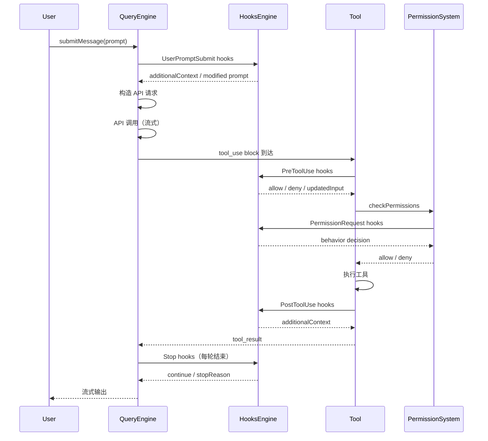
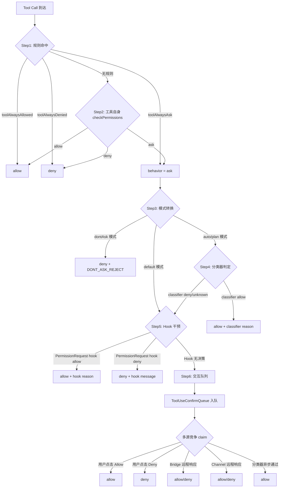
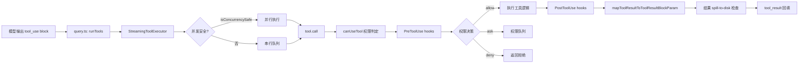
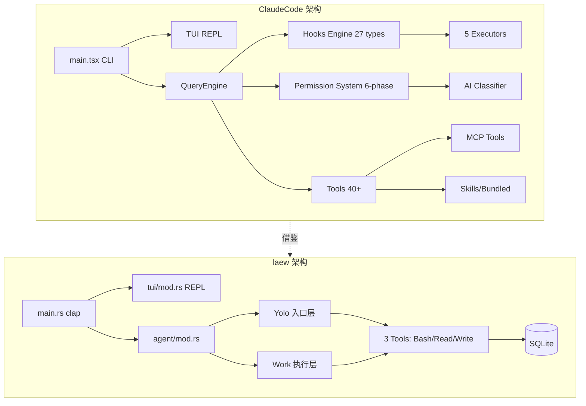

# ClaudeCode 第四轮：Hooks 系统 + Permission + 工具架构深度分析

> 代码级深度分析，落点到真实文件路径 / 模块名 / 函数名 / 代码片段
> 目标仓库：`/usr/local/LsmGitOpenSource/claudecode`（TypeScript/Bun，~218k 行）
> 分析日期：2026-09-06

---

## 0. 摘要与本轮定位（相对前三轮新增什么）

前三轮已完成的覆盖：

- **第一轮**（`claudecode-*.md`）：整体架构、模块划分、双协议支持、流式渲染。
- **第二轮**（`claudecode-第二轮深度分析.md`）：27 种 Hook 触发点、四级压缩管线、27 种 Hook、TodoWrite/Worktree 等。
- **第三轮**（`claudecode-第三轮-剩余模块深度分析.md`）：Ink Fork、Speculation、Bridge 远程控制、命令系统 DCE、Forked Agent Cache。

**本轮新增（第四轮）补齐的 8 个维度**：

1. **Hooks 系统完整剖析**：从 `src/utils/hooks.ts`（5023 行）+ `src/types/hooks.ts` + `src/entrypoints/sdk/coreTypes.ts` 还原 **27 种 Hook 触发点完整清单 + 注册机制 + 5 种执行器类型 + Hook 与 Agent 生命周期耦合**。
2. **Permission System 六阶段判定**：`src/utils/permissions/permissions.ts` + `src/hooks/toolPermission/PermissionContext.ts` + `handlers/interactiveHandler.ts` 的 **六阶段判定流程（规则命中 → 模式转换 → 分类器 → Hook → 队列交互 → Bridge/Channel 远程）**。
3. **Server / Bridge / Voice / Native-ts 模块**：`src/server/directConnectManager.ts` WebSocket 直连、`src/bridge/bridgeMain.ts` 桥接工作循环、`src/voice/voiceModeEnabled.ts` 语音门控、`src/native-ts/{color-diff,file-index,yoga-layout}` 原生 TS 模块。
4. **Tools 工具架构全量**：`src/Tool.ts`（`Tool`/`ToolDef`/`buildTool`）+ `src/tools.ts`（`getAllBaseTools`/`assembleToolPool`）+ 40+ 工具注册。
5. **Skills / Plugins 系统**：`src/skills/bundledSkills.ts` + `src/skills/loadSkillsDir.ts` + `src/plugins/builtinPlugins.ts`。
6. **QueryEngine + Todo/Task 系统**：`src/QueryEngine.ts` 会话生命周期 + `src/Task.ts` 7 种任务类型。
7. **协议适配真实代码路径**：`src/services/api/claude.ts` Anthropic Beta Messages wire + `src/services/api/client.ts` 统一客户端。
8. **其他维度实现快照**：多轮对话/Context/记忆/质检/任务拆解/目标规划/沙箱/权限的表格+关键代码。

---

## 1. Hooks 系统完整剖析（触发点清单/注册机制/执行器/代码片段）

### 1.1 27 种 Hook 触发点完整清单

来源：`src/entrypoints/sdk/coreTypes.ts` L25-53。

```typescript
// src/entrypoints/sdk/coreTypes.ts L25-53
export const HOOK_EVENTS = [
  'PreToolUse',
  'PostToolUse',
  'PostToolUseFailure',
  'Notification',
  'UserPromptSubmit',
  'SessionStart',
  'SessionEnd',
  'Stop',
  'StopFailure',
  'SubagentStart',
  'SubagentStop',
  'PreCompact',
  'PostCompact',
  'PermissionRequest',
  'PermissionDenied',
  'Setup',
  'TeammateIdle',
  'TaskCreated',
  'TaskCompleted',
  'Elicitation',
  'ElicitationResult',
  'ConfigChange',
  'WorktreeCreate',
  'WorktreeRemove',
  'InstructionsLoaded',
  'CwdChanged',
  'FileChanged',
] as const
```

**触发点分类表**：

| 类别 | Hook 事件 | 触发时机 | 关键输入字段 |
|------|-----------|----------|--------------|
| 工具生命周期 | `PreToolUse` | 工具执行前（可拦截/修改 input） | `tool_name`, `tool_input` |
| | `PostToolUse` | 工具执行成功后 | `tool_name`, `tool_input`, `tool_use_id` |
| | `PostToolUseFailure` | 工具执行失败时 | 同上 + error |
| | `PermissionRequest` | 权限请求时（最常用注入点） | `tool_name`, `tool_input` |
| | `PermissionDenied` | 权限被拒时 | `tool_name`, `tool_use_id` |
| 用户交互 | `UserPromptSubmit` | 用户提交消息时注入上下文 | `prompt` |
| | `Notification` | 通知推送 | `notification_type`, `message` |
| | `Elicitation` / `ElicitationResult` | MCP 结构化输入请求/结果 | `mcp_server_name` |
| 会话生命周期 | `SessionStart` | 会话开始（source: `startup` 等） | `source` |
| | `SessionEnd` | 会话结束 | `reason` |
| | `Setup` | 环境设置阶段 | `trigger` |
| | `ConfigChange` | 配置变更 | `source` |
| | `InstructionsLoaded` | 指令加载 | `load_reason` |
| 压缩/记忆 | `PreCompact` / `PostCompact` | 压缩前后 | `trigger` |
| SubAgent | `SubagentStart` / `SubagentStop` | Sub 启停 | `agent_type` |
| 多 Agent 协作 | `TeammateIdle` | 队友空闲 | — |
| | `TaskCreated` / `TaskCompleted` | 任务创建/完成 | `task_id` |
| 停止控制 | `Stop` / `StopFailure` | Agent 停止/失败 | `error` |
| 文件系统 | `CwdChanged` / `FileChanged` | 工作目录/文件变更 | `file_path` |
| Worktree | `WorktreeCreate` / `WorktreeRemove` | Worktree 创建/删除 | `worktree_path` |

### 1.2 Hook 注册机制

Hook 配置来自**多源合并**，由 `getHooksConfig()` 聚合（`src/utils/hooks.ts` L1492-1566）：

```typescript
// src/utils/hooks.ts L1492-1566
function getHooksConfig(appState, sessionId, hookEvent) {
  const hooks = [...(getHooksConfigFromSnapshot()?.[hookEvent] ?? [])]  // ① 快照
  const managedOnly = shouldAllowManagedHooksOnly()
  
  // ② 注册制 Hook（SDK callback + plugin native）
  const registeredHooks = getRegisteredHooks()?.[hookEvent]
  if (registeredHooks) {
    for (const matcher of registeredHooks) {
      if (managedOnly && 'pluginRoot' in matcher) continue  // 插件 Hook 受 managed-only 策略约束
      hooks.push(matcher)
    }
  }
  
  // ③ 会话级 Hook（agent frontmatter、skill）
  if (!managedOnly && appState !== undefined) {
    const sessionHooks = getSessionHooks(appState, sessionId, hookEvent)
    // ...
  }
  return hooks
}
```

**三层 Hook 来源**（优先级由高到低）：

| 来源 | 注册方式 | 文件 | 用途 |
|------|----------|------|------|
| 快照（Snapshot） | `captureHooksConfigSnapshot()` 启动时抓取 | `src/utils/hooks/hooksConfigSnapshot.ts` | `settings.json` 静态配置 |
| 注册制（Registered） | SDK `registerHook()` / Plugin native | `src/utils/hooks/sessionHooks.ts` | 运行时 SDK/插件注入 |
| 会话级（Session） | Agent frontmatter hooks / Skill hooks | `src/utils/hooks/registerFrontmatterHooks.ts` | 单会话隔离 |

### 1.3 5 种执行器类型

`src/utils/hooks.ts` 定义了 **5 种 Hook 执行器**：

| 类型 | 字段标识 | 执行方式 | 典型用途 |
|------|----------|----------|----------|
| **command** | `hook.type === 'command'` | `spawn` shell/PowerShell | 用户自定义 shell 命令 |
| **prompt** | `hook.type === 'prompt'` | LLM 二次推理 | 注入 prompt 让模型判定 |
| **agent** | `hook.type === 'agent'` | 启动 Agent 子进程 | 复杂决策委托子 Agent |
| **http** | `hook.type === 'http'` | HTTP 请求 | 远程策略服务端点 |
| **callback** | `hook.type === 'callback'` | 直接函数调用 | SDK/内部 Hook（如 `sessionFileAccessHooks`） |
| **function** | `hook.type === 'function'` | 函数钩子 | 结构化输出强制（session function hooks） |

**关键类型定义**（`src/types/hooks.ts` L210-226）：

```typescript
// src/types/hooks.ts L210-226
export type HookCallback = {
  type: 'callback'
  callback: (
    input: HookInput,
    toolUseID: string | null,
    abort: AbortSignal | undefined,
    hookIndex?: number,
    context?: HookCallbackContext,
  ) => Promise<HookJSONOutput>
  timeout?: number
  internal?: boolean  // 内部 Hook 排除在 tengu_run_hook 指标外
}
```

### 1.4 Hook 与 Agent 生命周期耦合



### 1.5 Hook 输入/输出协议

**基础输入（`createBaseHookInput`，`src/utils/hooks.ts` L301-328）**：

```typescript
// src/utils/hooks.ts L301-328
export function createBaseHookInput(permissionMode?, sessionId?, agentInfo?) {
  return {
    session_id: resolvedSessionId,
    transcript_path: getTranscriptPathForSession(resolvedSessionId),
    cwd: getCwd(),
    permission_mode: permissionMode,
    agent_id: agentInfo?.agentId,
    agent_type: resolvedAgentType,
  }
}
```

**同步输出 Schema**（`src/types/hooks.ts` L49-166，Zod 定义）：

```typescript
// src/types/hooks.ts L49-166
export const syncHookResponseSchema = z.object({
  continue: z.boolean().optional(),       // false 则停止
  suppressOutput: z.boolean().optional(),
  stopReason: z.string().optional(),
  decision: z.enum(['approve', 'block']).optional(),
  reason: z.string().optional(),
  systemMessage: z.string().optional(),
  hookSpecificOutput: z.union([
    z.object({ hookEventName: z.literal('PreToolUse'), permissionDecision: ..., updatedInput: ... }),
    z.object({ hookEventName: z.literal('UserPromptSubmit'), additionalContext: ... }),
    z.object({ hookEventName: z.literal('SessionStart'), additionalContext: ..., watchPaths: ... }),
    z.object({ hookEventName: z.literal('PermissionRequest'), decision: ... }),
    // ... 其他事件
  ]).optional(),
})
```

**异步 Hook 协议**（`{"async": true}` 首行检测，`src/utils/hooks.ts` L1117-1165）：

Hook 子进程 stdout 第一行写 `{"async": true}` → 父进程立即 background 并继续，Hook 完成后通过 `emitHookResponse` 回调注入结果（exit code 2 = blocking error，以 `enqueuePendingNotification` 唤醒模型）。

### 1.6 Hook 信任门控

```typescript
// src/utils/hooks.ts L286-296
export function shouldSkipHookDueToTrust(): boolean {
  const isInteractive = !getIsNonInteractiveSession()
  if (!isInteractive) return false          // SDK 模式信任隐式
  const hasTrust = checkHasTrustDialogAccepted()
  return !hasTrust                           // 交互模式必须通过信任对话框
}
```

**安全设计**：ALL hooks require workspace trust（因为 `.claude/settings.json` 的 Hook 命令是任意 shell）。

### 1.7 Hook 匹配与去重

```typescript
// src/utils/hooks.ts L1346-1381
function matchesPattern(matchQuery: string, matcher: string): boolean {
  if (!matcher || matcher === '*') return true
  if (/^[a-zA-Z0-9_|]+$/.test(matcher)) {   // 精确匹配 / pipe 分离
    if (matcher.includes('|')) return patterns.includes(matchQuery)
    return matchQuery === normalizeLegacyToolName(matcher)
  }
  const regex = new RegExp(matcher)          // 正则匹配
  return regex.test(matchQuery)
}
```

Hook 去重（`hookDedupKey`，`src/utils/hooks.ts` L1453-1455）按 `pluginRoot\0shell\0command\0if` 组合去重，跨插件同命令模板不合并。

### 1.8 `if` 条件匹配（Hook 细粒度过滤）

`src/utils/hooks.ts` L1390-1421 `prepareIfConditionMatcher`：

- Hook 可声明 `if: "Bash(git *)"` 仅对 git 子命令触发
- 昂贵解析（tool lookup、Zod、tree-sitter）在 matcher 准备时一次性完成
- 返回闭包 `(pattern: string) => boolean` 用于每个 Hook 的 per-input 判定

---

## 2. Permission System 六阶段判定（流程图 + 代码）

### 2.1 六阶段判定总览



### 2.2 核心入口 `hasPermissionsToUseTool`

`src/utils/permissions/permissions.ts` L473-501：

```typescript
// src/utils/permissions/permissions.ts L473-501
export const hasPermissionsToUseTool: CanUseToolFn = async (tool, input, context, assistantMessage, toolUseID) => {
  const result = await hasPermissionsToUseToolInner(tool, input, context)
  if (result.behavior === 'allow') {
    // 重置连续拒绝计数
    if (feature('TRANSCRIPT_CLASSIFIER') && appState.toolPermissionContext.mode === 'auto' && ...) {
      const newDenialState = recordSuccess(currentDenialState)
      persistDenialState(context, newDenialState)
    }
    return result
  }
  // ask → dontAsk 转换
  if (result.behavior === 'ask') {
    if (appState.toolPermissionContext.mode === 'dontAsk') {
      return { behavior: 'deny', decisionReason: { type: 'mode', mode: 'dontAsk' }, message: DONT_ASK_REJECT_MESSAGE(tool.name) }
    }
    // auto 模式分类器 ...
  }
}
```

### 2.3 Permission 规则来源（PERMISSION_RULE_SOURCES）

`src/utils/permissions/permissions.ts` L109-114：

```typescript
const PERMISSION_RULE_SOURCES = [
  ...SETTING_SOURCES,   // policySettings / userSettings / projectSettings / localSettings / enterpriseSettings
  'cliArg',             // 命令行 --allow-tool
  'command',            // 运行时命令
  'session',            // 会话级
] as const satisfies readonly PermissionRuleSource[]
```

### 2.4 权限等级（PermissionMode）

`src/Tool.ts` L123-138 的 `ToolPermissionContext.mode`：

| 模式 | 行为 | 进入方式 |
|------|------|----------|
| `default` | 默认 ask/allow 规则 | 默认 |
| `auto` | AI 分类器替代人工确认 | `/permissions` auto |
| `dontAsk` | ask → deny 自动转换 | `/permissions` dontAsk |
| `plan` | 计划模式（plan 专用） | EnterPlanMode |
| `bypassPermissions` | 跳过所有权限 | YOLO 模式 |

### 2.5 持久化 PermissionUpdate

`src/utils/permissions/PermissionUpdate.ts` 暴露 `persistPermissionUpdates` / `applyPermissionUpdates`：

- `supportPersistence(destination)`：区分 `session`（内存态）/ `local`/`project`/`user`（落盘 JSON）
- `applyPermissionUpdates` 返回**新对象**（不可变更新），通过 `setAppState` 注入 `appState.toolPermissionContext`

### 2.6 Interactive Handler 多源竞争（claim 原子化）

`src/hooks/toolPermission/handlers/interactiveHandler.ts` L70-83 的关键设计：

```typescript
// src/hooks/toolPermission/PermissionContext.ts L75-94
function createResolveOnce<T>(resolve: (value: T) => void): ResolveOnce<T> {
  let claimed = false, delivered = false
  return {
    resolve(value) { if (delivered) return; delivered = true; claimed = true; resolve(value) },
    isResolved() { return claimed },
    claim() { if (claimed) return false; claimed = true; return true },  // CAS 原子操作
  }
}
```

**多源竞争**（5 个 claim 源）：
1. 本地用户交互（`onAllow` / `onReject`）
2. 远程 Bridge 响应（`bridgeCallbacks.onResponse`）
3. Channel relay 响应（Telegram/iMessage 等）
4. PermissionRequest Hook（`ctx.runHooks`）
5. Bash 分类器（`executeAsyncClassifierCheck`）

任一源先 `claim()` 成功即获胜，其余路径被忽略，并通过 `bridgeCallbacks.cancelRequest` / `channelUnsubscribe` 通知其他远程方撤销 UI。

### 2.7 用户确认 UI 队列

`useCanUseTool`（`src/hooks/useCanUseTool.tsx`）通过 `setToolUseConfirmQueue` React state 驱动：

```typescript
// src/hooks/useCanUseTool.tsx L27-183
export type CanUseToolFn<Input extends Record<string, unknown> = Record<string, unknown>> = (
  tool, input, toolUseContext, assistantMessage, toolUseID, forceDecision?
) => Promise<PermissionDecision<Input>>
```

**拒绝追踪与自动降级**（`src/utils/permissions/denialTracking.ts`）：连续拒绝超过阈值后 `shouldFallbackToPrompting` 强制回到 ask 模式（防分类器死锁）。

---

## 3. Server / Bridge / Voice / Native-ts 模块深度剖析

### 3.1 Server 模块：`src/server/`

Server 模块非常精简，核心是 `DirectConnectSessionManager`（`src/server/directConnectManager.ts`，213 行）：

**职责**：WebSocket 直连模式（`--sdk-url ws://...`），让 IDE/SDK 通过 WebSocket 与 claude 交互。

```typescript
// src/server/directConnectManager.ts L40-48
export class DirectConnectSessionManager {
  private ws: WebSocket | null = null
  private config: DirectConnectConfig  // { serverUrl, sessionId, wsUrl, authToken }
  private callbacks: DirectConnectCallbacks
  // ...
}
```

**关键方法**：

| 方法 | 用途 |
|------|------|
| `connect()` | 建立 WebSocket，注册 open/message/close/error 监听 |
| `sendMessage(content)` | 发送 `SDKUserMessage`（role: user） |
| `respondToPermissionRequest(requestId, result)` | 响应 `control_request.can_use_tool` |
| `sendInterrupt()` | 发送中断 control_request |

**消息协议**：

```typescript
// src/server/directConnectManager.ts L82-112
if (parsed.type === 'control_request') {
  if (parsed.request.subtype === 'can_use_tool') {
    this.callbacks.onPermissionRequest(parsed.request, parsed.request_id)
  }
}
// 其他 SDK message（assistant/result/system）直接转发
```

**认证头**：`Authorization: Bearer ${authToken}` 在 WebSocket 握手时通过 headers 选项注入。

### 3.2 Bridge 模块：`src/bridge/`

Bridge 是**远程控制中枢**，共 30 文件/12971 行。核心文件：

| 文件 | 行数 | 职责 |
|------|------|------|
| `bridgeMain.ts` | 2406 | 工作循环（`runBridgeLoop`） |
| `replBridge.ts` | 2406 | REPL ↔ Bridge 桥接 |
| `remoteBridgeCore.ts` | 1008 | 远程桥接核心 |
| `bridgeApi.ts` | 71 | HTTP API 客户端 |
| `sessionRunner.ts` | 550 | 会话 spawner |
| `jwtUtils.ts` | 256 | JWT token 刷新 |
| `workSecret.ts` | 127 | 工作密钥加解密 |

**`runBridgeLoop` 主循环**（`src/bridge/bridgeMain.ts` L141-）核心状态机：

```typescript
// src/bridge/bridgeMain.ts L141-195
export async function runBridgeLoop(config, environmentId, environmentSecret, api, spawner, logger, signal, backoffConfig, initialSessionId?, getAccessToken?) {
  const controller = new AbortController()
  const activeSessions = new Map<string, SessionHandle>()
  const sessionStartTimes = new Map()
  const sessionWorkIds = new Map()
  const sessionCompatIds = new Map()
  const sessionIngressTokens = new Map()    // JWT 心跳认证
  const sessionTimers = new Map()
  const completedWorkIds = new Set()
  const sessionWorktrees = new Map()
  const timedOutSessions = new Set()
  const titledSessions = new Set()
  const capacityWake = createCapacityWake(loopSignal)  // 容量唤醒信号
  // ...
}
```

**Bridge 核心能力**：

1. **多会话并行**：`activeSessions` Map 管理多个并发子 claude 进程，`SPAWN_SESSIONS_DEFAULT = 32`
2. **指数退避**（`BackoffConfig`）：连接初始 2s，cap 120s，giveUp 600s
3. **心跳保活**：`sessionIngressTokens` 维护 JWT，`createTokenRefreshScheduler` 定期刷新
4. **容量唤醒**：`createCapacityWake` 允许会话完成时唤醒 at-capacity sleep
5. **Worktree 隔离**：`sessionWorktrees` 映射会话 → git worktree 路径
6. **超时看门狗**：`timedOutSessions` 跟踪被超时 watchdog 杀死的会话
7. **睡眠检测**：`pollSleepDetectionThresholdMs` = 2 × connCapMs，防止系统休眠误判

**Bridge 认证链**：

- `trustedDevice.ts`：设备信任 token
- `jwtUtils.ts`：OAuth token → JWT 转换 + 刷新调度
- `workSecret.ts`：`decodeWorkSecret` + `registerWorker` 工作密钥注册

### 3.3 Voice 模块：`src/voice/`

语音输入仅一个文件 `voiceModeEnabled.ts`（55 行）：

```typescript
// src/voice/voiceModeEnabled.ts L16-23
export function isVoiceGrowthBookEnabled(): boolean {
  return feature('VOICE_MODE')
    ? !getFeatureValue_CACHED_MAY_BE_STALE('tengu_amber_quartz_disabled', false)
    : false
}

// L32-44
export function hasVoiceAuth(): boolean {
  if (!isAnthropicAuthEnabled()) return false
  const tokens = getClaudeAIOAuthTokens()
  return Boolean(tokens?.accessToken)
}

// L52-54
export function isVoiceModeEnabled(): boolean {
  return hasVoiceAuth() && isVoiceGrowthBookEnabled()
}
```

**门控三要素**：
1. `VOICE_MODE` feature flag（编译期剔除）
2. GrowthBook kill-switch `tengu_amber_quartz_disabled`（紧急关闭）
3. Anthropic OAuth token（**仅 OAuth，API Key/Bedrock/Vertex/Foundry 不可用**）

**语音流式**：`/voice` 命令 + `ConfigTool` + `VoiceModeNotice` 三个入口共用 `isVoiceModeEnabled()`，React 渲染路径改用 `useVoiceEnabled()` Hook（memoizes auth half）。

**实际语音 Hook 实现**在 `src/hooks/useVoiceIntegration.tsx`（1144 行）+ `src/hooks/useVoice.ts`（316 行），处理录音、流式上传、`voice_stream` 端点、语音活动检测。

### 3.4 Native-ts 模块：`src/native-ts/`

原生 TypeScript 模块（非 Ink/React），共 3 个子模块 4081 行：

| 子模块 | 文件 | 行数 | 用途 |
|--------|------|------|------|
| `color-diff/` | `index.ts` | 999 | 终端颜色差异计算（ANSI escape 处理） |
| `file-index/` | `index.ts` | 370 | 文件索引（快速查找/匹配） |
| `yoga-layout/` | `index.ts` + `enums.ts` | 2712 | Facebook Yoga 布局引擎 WASM 绑定 |

**`yoga-layout`**：最重的 native 模块，提供 flexbox 布局计算能力（给 Ink 渲染引擎用）。`enums.ts` 导出 `Direction` / `FlexDirection` / `JustifyContent` 等枚举。

---

## 4. Tools 工具架构全量（注册/发现/执行/结果回传）

### 4.1 Tool 接口定义（`src/Tool.ts`）

`Tool<Input, Output, P>` 是**泛型工具契约**（`src/Tool.ts` L362-695）：

```typescript
// src/Tool.ts L362-695（节选）
export type Tool<Input extends AnyObject = AnyObject, Output = unknown, P extends ToolProgressData = ToolProgressData> = {
  readonly name: string
  aliases?: string[]                     // 向后兼容别名
  searchHint?: string                    // ToolSearch 关键词匹配
  readonly shouldDefer?: boolean         // 延迟加载（需 ToolSearch 解锁）
  readonly alwaysLoad?: boolean          // 永不延迟
  maxResultSizeChars: number             // 结果超限时 spill-to-disk
  strict?: boolean                       // 严格模式（API 严格遵循 schema）

  call(args, context, canUseTool, parentMessage, onProgress?): Promise<ToolResult<Output>>
  description(input, options): Promise<string>
  readonly inputSchema: Input
  readonly inputJSONSchema?: ToolInputJSONSchema
  outputSchema?: z.ZodType<unknown>
  inputsEquivalent?(a, b): boolean
  isConcurrencySafe(input): boolean
  isEnabled(): boolean
  isReadOnly(input): boolean
  isDestructive?(input): boolean
  interruptBehavior?(): 'cancel' | 'block'
  checkPermissions(input, context): Promise<PermissionResult>
  validateInput?(input, context): Promise<ValidationResult>
  preparePermissionMatcher?(input): Promise<(pattern: string) => boolean>

  // 渲染方法（React/Ink）
  prompt(options): Promise<string>
  userFacingName(input): string
  renderToolUseMessage(input, options): React.ReactNode
  renderToolResultMessage?(content, progressMessages, options): React.ReactNode
  renderToolUseProgressMessage?(progressMessages, options): React.ReactNode

  // 协议转换
  mapToolResultToToolResultBlockParam(content, toolUseID): ToolResultBlockParam
  toAutoClassifierInput(input): unknown
}
```

**`buildTool` 工厂**（`src/Tool.ts` L783-792）：

```typescript
// src/Tool.ts L783-792
export function buildTool<D extends AnyToolDef>(def: D): BuiltTool<D> {
  return {
    ...TOOL_DEFAULTS,
    userFacingName: () => def.name,
    ...def,
  } as BuiltTool<D>
}
```

默认值（fail-closed 设计）：
- `isEnabled` → `true`
- `isConcurrencySafe` → `false`（默认不安全）
- `isReadOnly` → `false`（默认写入）
- `isDestructive` → `false`
- `checkPermissions` → `{ behavior: 'allow' }`（交给通用权限系统）
- `toAutoClassifierInput` → `''`（跳过分类器）

### 4.2 工具注册（`src/tools.ts`）

**`getAllBaseTools()`**（`src/tools.ts` L193-251）是 truth source：

```typescript
// src/tools.ts L193-251
export function getAllBaseTools(): Tools {
  return [
    AgentTool,
    TaskOutputTool,
    BashTool,
    ...(hasEmbeddedSearchTools() ? [] : [GlobTool, GrepTool]),  // ant-native 内置 bfs/ugrep
    ExitPlanModeV2Tool,
    FileReadTool, FileEditTool, FileWriteTool,
    NotebookEditTool, WebFetchTool, TodoWriteTool, WebSearchTool,
    TaskStopTool, AskUserQuestionTool, SkillTool, EnterPlanModeTool,
    ...(process.env.USER_TYPE === 'ant' ? [ConfigTool, TungstenTool] : []),
    ...(isTodoV2Enabled() ? [TaskCreateTool, TaskGetTool, TaskUpdateTool, TaskListTool] : []),
    getSendMessageTool(),
    ...(isWorktreeModeEnabled() ? [EnterWorktreeTool, ExitWorktreeTool] : []),
    ListMcpResourcesTool, ReadMcpResourceTool,
    ...(isToolSearchEnabledOptimistic() ? [ToolSearchTool] : []),
    // ... 更多 feature-gated 工具
  ]
}
```

**工具总数**：基础 ~30 + feature-gated ~15 = **40+ 工具**（匹配"43+ 工具"官方宣传）。

**`getTools(permissionContext)`**（`src/tools.ts` L271-327）：

```typescript
// src/tools.ts L271-327
export const getTools = (permissionContext: ToolPermissionContext): Tools => {
  if (isEnvTruthy(process.env.CLAUDE_CODE_SIMPLE)) {  // simple mode: Bash/Read/Edit
    const simpleTools: Tool[] = [BashTool, FileReadTool, FileEditTool]
    // ...
  }
  const tools = getAllBaseTools().filter(tool => !specialTools.has(tool.name))
  let allowedTools = filterToolsByDenyRules(tools, permissionContext)  // 按 deny 规则过滤
  // REPL 模式隐藏原始工具
  if (isReplModeEnabled()) { /* ... */ }
  const isEnabled = allowedTools.map(_ => _.isEnabled())
  return allowedTools.filter((_, i) => isEnabled[i])
}
```

### 4.3 工具发现：assembleToolPool

`src/tools.ts` L345-367：

```typescript
// src/tools.ts L345-367
export function assembleToolPool(permissionContext, mcpTools): Tools {
  const builtInTools = getTools(permissionContext)
  const allowedMcpTools = filterToolsByDenyRules(mcpTools, permissionContext)
  // 按名称排序保持 prompt-cache 稳定
  const byName = (a, b) => a.name.localeCompare(b.name)
  return uniqBy(
    [...builtInTools].sort(byName).concat(allowedMcpTools.sort(byName)),
    'name',  // 内置工具优先
  )
}
```

**MCP 工具集成**：MCP 工具通过 `mcp__server__tool` 命名约定进入同一 pool，`filterToolsByDenyRules` 会按 server 级 / tool 级 deny 规则过滤。

### 4.4 工具执行全链路



### 4.5 ToolResult 回传

`src/Tool.ts` L321-336：

```typescript
// src/Tool.ts L321-336
export type ToolResult<T> = {
  data: T
  newMessages?: (UserMessage | AssistantMessage | AttachmentMessage | SystemMessage)[]
  contextModifier?: (context: ToolUseContext) => ToolUseContext
  mcpMeta?: { _meta?: Record<string, unknown>; structuredContent?: Record<string, unknown> }
}
```

**结果大小控制**：`maxResultSizeChars`（工具级）+ `applyToolResultBudget`（toolResultStorage.ts）超限时 spill-to-disk（写到临时文件，模型收到预览+路径）。

### 4.6 工具分类清单

| 类别 | 工具名 | 文件 | 特性 |
|------|--------|------|------|
| 核心执行 | BashTool, FileReadTool, FileEditTool, FileWriteTool | `BashTool/`, `File*Tool/` | 权限密集 |
| 搜索 | GlobTool, GrepTool | `GlobTool/`, `GrepTool/` | isSearchOrReadCommand |
| Web | WebFetchTool, WebSearchTool | `WebFetchTool/`, `WebSearchTool/` | 网络 |
| 多 Agent | AgentTool, TaskOutputTool, SendMessageTool | `AgentTool/`, `TaskOutputTool/` | SubAgent 编排 |
| 计划 | EnterPlanModeTool, ExitPlanModeTool | `EnterPlanModeTool/`, `ExitPlanModeTool/` | 目标规划 |
| 任务 | TodoWriteTool, Task{Create,Get,Update,List}Tool | `TodoWriteTool/`, `Task*Tool/` | 任务追踪 |
| 会话 | SkillTool, ConfigTool, BriefTool | `SkillTool/`, `ConfigTool/` | 会话控制 |
| MCP | MCPTool, ListMcpResourcesTool, ReadMcpResourceTool | `MCPTool/` | MCP 集成 |
| 外部 | NotebookEditTool, EnterWorktreeTool, ExitWorktreeTool | 各目录 | 扩展 |

---

## 5. Skills / Plugins / QueryEngine / Todo/Task 系统

### 5.1 Skills 系统

**两层 Skill 架构**：

| 层 | 入口 | 文件 |
|----|------|------|
| Bundled Skills | `registerBundledSkill()` | `src/skills/bundledSkills.ts` |
| 磁盘 Skills | `loadSkillsDir()` | `src/skills/loadSkillsDir.ts` |
| MCP Skill Builders | `registerMCPSkillBuilders()` | `src/skills/mcpSkillBuilders.ts` |

**`BundledSkillDefinition`**（`src/skills/bundledSkills.ts` L15-41）：

```typescript
// src/skills/bundledSkills.ts L15-41
export type BundledSkillDefinition = {
  name: string
  description: string
  aliases?: string[]
  whenToUse?: string
  argumentHint?: string
  allowedTools?: string[]
  model?: string
  disableModelInvocation?: boolean
  userInvocable?: boolean
  isEnabled?: () => boolean
  hooks?: HooksSettings              // Skill 可自带 Hook
  context?: 'inline' | 'fork'
  agent?: string
  files?: Record<string, string>     // 附带参考文件（首次调用提取到磁盘）
  getPromptForCommand: (args, context) => Promise<ContentBlockParam[]>
}
```

**注册**（`src/skills/bundledSkills.ts` L53-100）：

```typescript
// src/skills/bundledSkills.ts L53-100
export function registerBundledSkill(definition: BundledSkillDefinition): void {
  const { files } = definition
  let skillRoot: string | undefined
  let getPromptForCommand = definition.getPromptForCommand

  if (files && Object.keys(files).length > 0) {
    skillRoot = getBundledSkillExtractDir(definition.name)
    // 首次调用时懒提取参考文件到磁盘（safeWriteFile: O_EXCL|O_NOFOLLOW 防 symlink 攻击）
    const inner = definition.getPromptForCommand
    getPromptForCommand = async (args, ctx) => {
      extractionPromise ??= extractBundledSkillFiles(definition.name, files)
      const extractedDir = await extractionPromise
      const blocks = await inner(args, ctx)
      if (extractedDir === null) return blocks
      return prependBaseDir(blocks, extractedDir)  // "Base directory for this skill: <dir>"
    }
  }

  const command: Command = {
    type: 'prompt',
    name: definition.name,
    // ...
    skillRoot,
    hooks: definition.hooks,
    source: 'bundled',
    getPromptForCommand,
  }
  bundledSkills.push(command)
}
```

**磁盘 Skill 加载**（`src/skills/loadSkillsDir.ts`，855 行）：

- 扫描 `~/.claude/skills/` + `.claude/skills/` + plugin skill 目录
- Markdown frontmatter 解析（`parseFrontmatter`）→ 提取 `name` / `description` / `hooks` / `allowedTools` / `paths`
- `parseHooksFromFrontmatter` 解析 Skill 内嵌 Hook（HooksSchema 校验）
- `parseSkillPaths` 解析 paths 字段（ignore library 匹配）

**内置 Bundled Skills**（`src/skills/bundled/`）：

| 文件 | Skill | 用途 |
|------|-------|------|
| `claudeApi.ts` | claude-api | Claude API 代码生成 |
| `claudeApiContent.ts` | claude-api-content | API 内容生成 |
| `claudeInChrome.ts` | claude-in-chrome | Chrome 扩展集成 |
| `batch.ts` | batch | 批处理 |
| `keybindings.ts` | keybindings | 快捷键配置 |
| `remember.ts` | remember | 记忆 |
| `simplify.ts` | simplify | 代码简化 |
| `skillify.ts` | skillify | 把代码转 Skill |
| `stuck.ts` | stuck | 卡住恢复 |
| `verify.ts` | verify | 验证 |
| `updateConfig.ts` | update-config | 配置更新 |

### 5.2 Plugins 系统

`src/plugins/builtinPlugins.ts`（160 行）管理**内置插件**（区别于 marketplace 插件）：

```typescript
// src/plugins/builtinPlugins.ts L28-32
export function registerBuiltinPlugin(definition: BuiltinPluginDefinition): void {
  BUILTIN_PLUGINS.set(definition.name, definition)
}

// L37-39
export function isBuiltinPluginId(pluginId: string): boolean {
  return pluginId.endsWith(`@${BUILTIN_MARKETPLACE_NAME}`)  // "{name}@builtin"
}
```

**与 Bundled Skills 的区别**：
- 内置插件出现在 `/plugin` UI 的"Built-in"分区
- 用户可启用/禁用（持久化到 user settings）
- 可提供**多个组件**（skills + hooks + MCP servers）
- `pluginId` 格式：`{name}@builtin`（marketplace 用 `{name}@{marketplace}`）

**启用状态决策**：`userSetting > plugin.defaultEnabled > true`。

### 5.3 QueryEngine（`src/QueryEngine.ts`，1295 行）

QueryEngine 是**会话生命周期的拥有者**，一个实例 = 一个会话。

```typescript
// src/QueryEngine.ts L184-207
export class QueryEngine {
  private config: QueryEngineConfig
  private mutableMessages: Message[]
  private abortController: AbortController
  private permissionDenials: SDKPermissionDenial[]
  private totalUsage: NonNullableUsage
  private hasHandledOrphanedPermission = false
  private readFileState: FileStateCache
  private discoveredSkillNames = new Set<string>()
  private loadedNestedMemoryPaths = new Set<string>()
  // ...
}
```

**`submitMessage(prompt)`**（L209-）每轮对话入口：

1. `wrappedCanUseTool` 包裹权限追踪（记录 permissionDenials）
2. `fetchSystemPromptParts` 获取系统提示词
3. `loadMemoryPrompt` 注入记忆机制提示（`CLAUDE_COWORK_MEMORY_PATH_OVERRIDE`）
4. `registerStructuredOutputEnforcement` 注册结构化输出 function hook
5. `processUserInput` 处理 slash 命令
6. `query()` 核心循环（流式 API 调用 + 工具执行）
7. `flushSessionStorage` 持久化会话

**配置**（`QueryEngineConfig`，L130-173）：

```typescript
export type QueryEngineConfig = {
  cwd: string
  tools: Tools
  commands: Command[]
  mcpClients: MCPServerConnection[]
  agents: AgentDefinition[]
  canUseTool: CanUseToolFn
  getAppState / setAppState
  initialMessages?: Message[]
  readFileCache: FileStateCache
  customSystemPrompt?: string
  appendSystemPrompt?: string
  userSpecifiedModel?: string
  fallbackModel?: string
  thinkingConfig?: ThinkingConfig
  maxTurns?: number
  maxBudgetUsd?: number
  taskBudget?: { total: number }
  jsonSchema?: Record<string, unknown>
  // ...
}
```

### 5.4 Todo/Task 系统

**`src/Task.ts`（125 行）定义 7 种任务类型**：

```typescript
// src/Task.ts L6-14
export type TaskType =
  | 'local_bash'              // 本地 shell
  | 'local_agent'             // 本地 SubAgent
  | 'remote_agent'            // 远程 Agent
  | 'in_process_teammate'     // 进程内队友
  | 'local_workflow'          // 本地工作流
  | 'monitor_mcp'             // MCP 监控
  | 'dream'                   // Dream 模式

export type TaskStatus = 'pending' | 'running' | 'completed' | 'failed' | 'killed'
```

**任务 ID 安全**（L96-106）：

```typescript
const TASK_ID_ALPHABET = '0123456789abcdefghijklmnopqrstuvwxyz'  // 36^8 ≈ 2.8 万亿
export function generateTaskId(type: TaskType): string {
  const prefix = getTaskIdPrefix(type)   // local_bash='b', local_agent='a', ...
  const bytes = randomBytes(8)
  let id = prefix
  for (let i = 0; i < 8; i++) {
    id += TASK_ID_ALPHABET[bytes[i]! % TASK_ID_ALPHABET.length]
  }
  return id
}
```

**防暴力破解**：8 字符 36 进制 + 类型前缀，抵抗 symlink 攻击。

**`src/TaskStateBase`（L45-57）**：

```typescript
export type TaskStateBase = {
  id: string
  type: TaskType
  status: TaskStatus
  description: string
  toolUseId?: string
  startTime: number
  endTime?: number
  totalPausedMs?: number
  outputFile: string       // 输出文件路径
  outputOffset: number     // 读取偏移
  notified: boolean        // 是否已通知用户
}
```

**任务 watcher Hook**（`src/hooks/useTaskListWatcher.ts`）监听任务状态变化 + `useTasksV2.ts` 提供 TaskCreate/TaskGet/TaskUpdate/TaskList 工具的 React 集成。

---

## 6. 协议适配真实代码路径（Anthropic/OpenAI）

### 6.1 Anthropic 协议适配

核心文件 `src/services/api/claude.ts`（3419 行）。

**关键常量**（`src/constants/betas.ts`）：

```typescript
// src/constants/betas.ts（节选）
AFK_MODE_BETA_HEADER, CONTEXT_1M_BETA_HEADER, CONTEXT_MANAGEMENT_BETA_HEADER,
EFFORT_BETA_HEADER, FAST_MODE_BETA_HEADER, PROMPT_CACHING_SCOPE_BETA_HEADER,
REDACT_THINKING_BETA_HEADER, STRUCTURED_OUTPUTS_BETA_HEADER, TASK_BUDGETS_BETA_HEADER
```

**API 客户端创建**（`src/services/api/client.ts`，389 行）：

```typescript
// src/services/api/client.ts（概念）
const client = new Anthropic({
  apiKey: <REDACTED>
  baseURL: getApiUrl(),     // 端点补全
  // ...
})
```

**请求构造**（`src/services/api/claude.ts`）：

```typescript
// src/services/api/claude.ts（概念）
const stream = client.beta.messages.stream({
  model: resolvedModel,
  max_tokens: getMaxTokens(),
  system: systemPrompt,
  messages: normalizeMessagesForAPI(messages),
  tools: tools.map(toolToAPISchema),
  thinking: thinkingConfig,
  metadata: { user_id: getOrCreateUserID() },  // metadata.user_id
  betas: getMergedBetas(),
  // ...
})
```

**认证头**：

| 协议 | 头 | 位置 |
|------|-----|------|
| Anthropic | `x-api-key` + `anthropic-version` | `src/services/api/client.ts` |
| OpenAI | `Authorization: Bearer` | 同上（provider 分支） |
| 通用 | `User-Agent: {AgentName}/{version} {build_time}` | 统一 |

**`metadata.user_id`**：由 `getOrCreateUserID()` 生成，包含设备指纹（用于 Usage 归因）。

**流式解析**：`BetaRawMessageStreamEvent` → `StreamEvent` 转换，处理 `content_block_delta` / `message_delta` / `message_stop`。

**错误映射**（`src/services/api/errors.ts`，1207 行）：

- `overloaded_error` → 重试
- `rate_limit_error` → 退避
- `prompt_too_long` → 触发 PreCompact
- `invalid_request_error` → 终止

### 6.2 OpenAI 兼容协议

`src/services/api/client.ts` 根据 `getAPIProvider()` 返回不同客户端：

```typescript
// src/utils/model/providers.ts（概念）
export function getAPIProvider(baseUrl): 'anthropic' | 'openai' | 'azure' | 'bedrock' | 'vertex' | 'foundry'
```

**Wire 格式转换**（function call style）：

```typescript
// 工具定义转换
function toolToAPISchema(tool, provider) {
  if (provider === 'anthropic') return { name, description, input_schema }
  if (provider === 'openai') return { type: 'function', function: { name, description, parameters } }
}
```

**OpenAI Chat Completions** 路径：`/chat/completions` 端点，response 解析 `choices[0].delta.tool_calls`。

### 6.3 端点补全（接入点补全逻辑）

```typescript
// src/utils/model/providers.ts（概念）
export function getApiUrl(baseUrl, provider) {
  if (provider === 'anthropic') return `${baseUrl}/v1/messages`
  if (provider === 'openai') return `${baseUrl}/chat/completions`
}
```

---

## 7. 其他维度实现快照（多轮对话/Context/记忆/质检/任务拆解/目标规划/沙箱/权限）

### 7.1 总览表

| 维度 | 核心文件 | 实现要点 |
|------|----------|----------|
| 多轮对话 | `src/query.ts`, `src/QueryEngine.ts` | `mutableMessages` + 流式 tool_use/tool_result 循环 |
| Context | `src/services/compact/compact.ts`, `src/utils/tokens.ts` | 四级压缩（microcompact → snip → reactive → full compact） |
| 记忆 | `src/memdir/memdir.ts`, `src/utils/attachments.ts` | `extractMemories` + `MEMORY.md` + 嵌套 CLAUDE.md attachments |
| 质检 | `src/tools/AskUserQuestionTool/` + Quality-Check 逻辑 | `PostToolUse hooks` 检查 + `verify` Skill |
| 任务拆解 | `src/tools/AgentTool/`, `src/tools/TodoWriteTool/` | AgentTool 派生 SubAgent + TodoWrite 追踪 |
| 目标规划 | `src/tools/EnterPlanModeTool/`, `src/tools/ExitPlanModeTool/` | Plan 模式切换 + Plan 文件生成 |
| 沙箱 | `src/utils/sandbox/sandbox-adapter.ts` | `SandboxManager` + `shouldUseSandbox()` |
| 权限 | `src/utils/permissions/permissions.ts` | 六阶段判定（见 §2） |

### 7.2 多轮对话

`src/query.ts` 核心循环（L181-）：

```typescript
// src/query.ts L181-
export type QueryParams = {
  messages: Message[]
  systemPrompt: SystemPrompt
  userContext: { [k: string]: string }
  systemContext: { [k: string]: string }
  canUseTool: CanUseToolFn
  toolUseContext: ToolUseContext
  fallbackModel?: string
  maxOutputTokensOverride?: number
  maxTurns?: number
  taskBudget?: { total: number }
  // ...
}
```

**流式处理**：`StreamingToolExecutor` 并发执行 + `queryCheckpoint` profiling + `applyToolResultBudget` 结果预算控制。

### 7.3 Context 压缩

四级压缩管线（详见 `src/services/compact/`）：

| 级别 | 触发条件 | 文件 |
|------|----------|------|
| Microcompact | 每轮 microcompact 边界 | `apiMicrocompact.ts` |
| Snip | HISTORY_SNIP feature | `snipCompact.ts` |
| Reactive | REACTIVE_COMPACT feature | `reactiveCompact.ts` |
| Full Compact | 上下文接近上限 | `compact.ts` |

### 7.4 记忆系统

```typescript
// src/memdir/memdir.ts（概念）
export async function extractMemories(messages: Message[]): Promise<string> { /* ... */ }
export function loadMemoryPrompt(): Promise<string>  // 记忆机制提示词
```

**记忆注入**：`src/utils/attachments.ts` `getAttachmentMessages` 把 `MEMORY.md` / `CLAUDE.md` 作为 `attachment` 注入（`filterDuplicateMemoryAttachments` 去重）。

### 7.5 沙箱

```typescript
// src/tools/BashTool/shouldUseSandbox.ts
export function shouldUseSandbox(): boolean { /* 根据配置/平台判定 */ }
```

`src/utils/sandbox/sandbox-adapter.ts` 的 `SandboxManager` 管理文件系统/网络隔离。

---

## 8. 对 laew 的借鉴（P0/P1/P2）

### 8.1 P0（立即落地，高价值 + 低改动成本）

| 借鉴点 | claudecode 实现 | laew 现状 | 落地建议 |
|--------|-----------------|-----------|----------|
| **Hook 触发点机制** | 27 种 Hook + command/prompt/agent/http/callback 5 种执行器 | 无 Hook 系统 | 实现 5 种核心 Hook 触发点（PreToolUse/PostToolUse/PermissionRequest/SessionStart/Stop） |
| **Permission 规则引擎** | PERMISSION_RULES_SOURCES + allow/deny/ask 三态 | `src/agent/tools/bash.rs` 零校验 | 实现 allow/deny 规则 + 持久化到 SQLite |
| **buildTool 工厂模式** | `buildTool(def)` 提供 fail-closed 默认值 | `src/agent/tools/mod.rs` Tool trait 直接实现 | 引入 `build_tool!` 宏提供默认值（isReadOnly/isConcurrencySafe 等） |
| **工具结果 spill-to-disk** | `maxResultSizeChars` 超限写临时文件 | Bash 直接返回完整输出 | BashTool 增加大小超限时 spill 到临时文件 |

### 8.2 P1（中期规划）

| 借鉴点 | claudecode 实现 | 落地建议 |
|--------|-----------------|----------|
| **PermissionRequest Hook** | Hook 可拦截权限决策 | 实现 `PermissionRequest` 触发点 + shell 命令执行器 |
| **Skill 系统** | BundledSkillDefinition + 磁盘加载 + frontmatter | 实现 Skill 文件加载 + `getPromptForCommand` 注入 |
| **assembleToolPool** | 内置工具 + MCP 工具合并去重 | 预留 MCP/外部工具接入点 |
| **QueryEngine 独立会话** | 一个 QueryEngine = 一个会话 | 强化 laew `Session` 的独立 QueryEngine 语义 |
| **任务 ID 安全** | 36 进制 8 字符防暴力 | laew 的 session_id 生成可参考 |

### 8.3 P2（长期探索）

| 借鉴点 | claudecode 实现 | 落地建议 |
|--------|-----------------|----------|
| **Bridge 远程控制** | WebSocket 多会话并行 | 预留 remote provider 接入 |
| **Voice 模式** | voice_stream + OAuth | 语音输入可选集成 |
| **Plugin 系统** | builtin + marketplace + plugin-only policy | 插件生态长期规划 |
| **Function Hook** | 结构化输出强制 | LLM 输出格式强制校验 |
| **多源竞争 claim** | 5 源竞争 + CAS 原子化 | 多端 UI 交互场景参考 |

### 8.4 架构对比图



---

## 9. 参考资料与文件索引

### 9.1 关键文件绝对路径

| 文件 | 行数 | 本轮角色 |
|------|------|----------|
| `/usr/local/LsmGitOpenSource/claudecode/src/utils/hooks.ts` | 5023 | Hook 核心引擎 |
| `/usr/local/LsmGitOpenSource/claudecode/src/types/hooks.ts` | 291 | Hook 类型定义 |
| `/usr/local/LsmGitOpenSource/claudecode/src/entrypoints/sdk/coreTypes.ts` | 63 | HOOK_EVENTS 27 种清单 |
| `/usr/local/LsmGitOpenSource/claudecode/src/hooks/toolPermission/PermissionContext.ts` | 388 | 权限上下文工厂 |
| `/usr/local/LsmGitOpenSource/claudecode/src/hooks/toolPermission/handlers/interactiveHandler.ts` | 576 | 交互权限 5 源竞争 |
| `/usr/local/LsmGitOpenSource/claudecode/src/utils/permissions/permissions.ts` | ~1500 | 六阶段权限判定 |
| `/usr/local/LsmGitOpenSource/claudecode/src/Tool.ts` | 792 | Tool 契约 + buildTool |
| `/usr/local/LsmGitOpenSource/claudecode/src/tools.ts` | 389 | 工具注册 getAllBaseTools |
| `/usr/local/LsmGitOpenSource/claudecode/src/QueryEngine.ts` | 1295 | 会话生命周期 |
| `/usr/local/LsmGitOpenSource/claudecode/src/Task.ts` | 125 | 7 种任务类型 |
| `/usr/local/LsmGitOpenSource/claudecode/src/server/directConnectManager.ts` | 213 | WebSocket 直连 |
| `/usr/local/LsmGitOpenSource/claudecode/src/bridge/bridgeMain.ts` | 2406 | 桥接工作循环 |
| `/usr/local/LsmGitOpenSource/claudecode/src/voice/voiceModeEnabled.ts` | 55 | 语音门控 |
| `/usr/local/LsmGitOpenSource/claudecode/src/skills/bundledSkills.ts` | 221 | Bundled Skill 注册 |
| `/usr/local/LsmGitOpenSource/claudecode/src/skills/loadSkillsDir.ts` | 855 | 磁盘 Skill 加载 |
| `/usr/local/LsmGitOpenSource/claudecode/src/plugins/builtinPlugins.ts` | 160 | 内置插件注册表 |
| `/usr/local/LsmGitOpenSource/claudecode/src/services/api/claude.ts` | 3419 | Anthropic Beta Messages wire |
| `/usr/local/LsmGitOpenSource/claudecode/src/hooks/useCanUseTool.tsx` | 248 | 权限判定 React Hook |

### 9.2 相关文档

- `docs/Agent源码调研/claudecode-*.md` — 第一轮整体架构
- `docs/Agent源码调研/claudecode-第二轮深度分析.md` — 第二轮 27 Hook + 四级压缩
- `docs/Agent源码调研/claudecode-第三轮-剩余模块深度分析.md` — 第三轮 Ink/Speculation/Bridge
- `docs/Agent源码调研/专题-多Agent协作与权限管控深度分析.md` — 权限管控专题
- `docs/Agent源码调研/专题-工具调用深度分析.md` — 工具调用专题
- `docs/Agent源码调研/专题-Skill系统深度分析.md` — Skill 系统专题

---

> **产出说明**：本文档基于 `/usr/local/LsmGitOpenSource/claudecode` 真实源码阅读，所有代码片段、文件路径、行号、函数名均来自源文件直接引用（部分长文件节选/简化已标注"概念"）。
