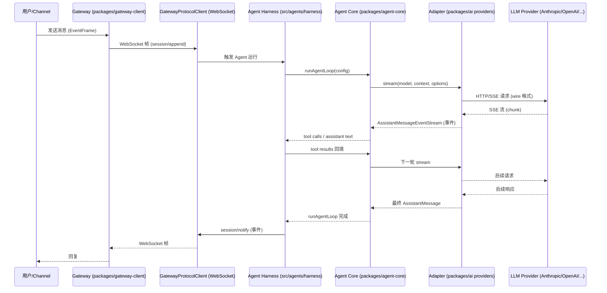
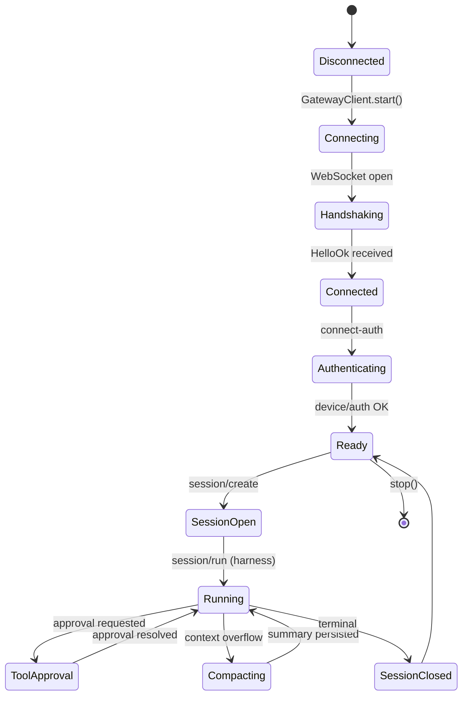
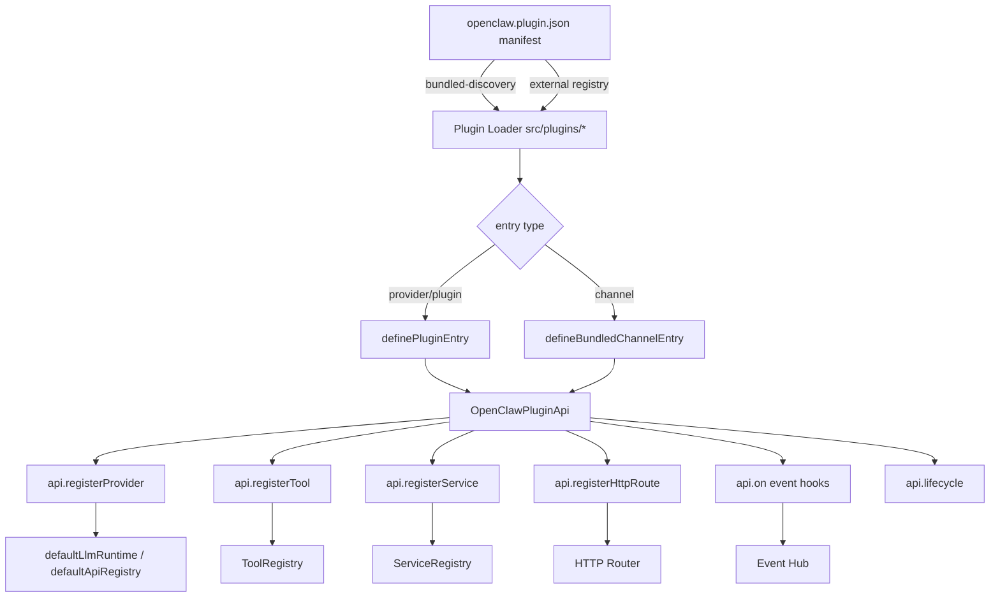
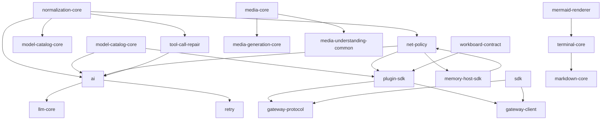
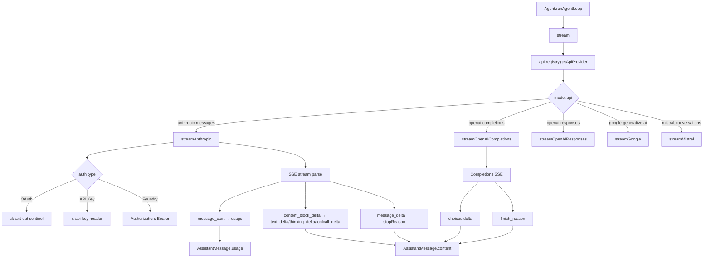
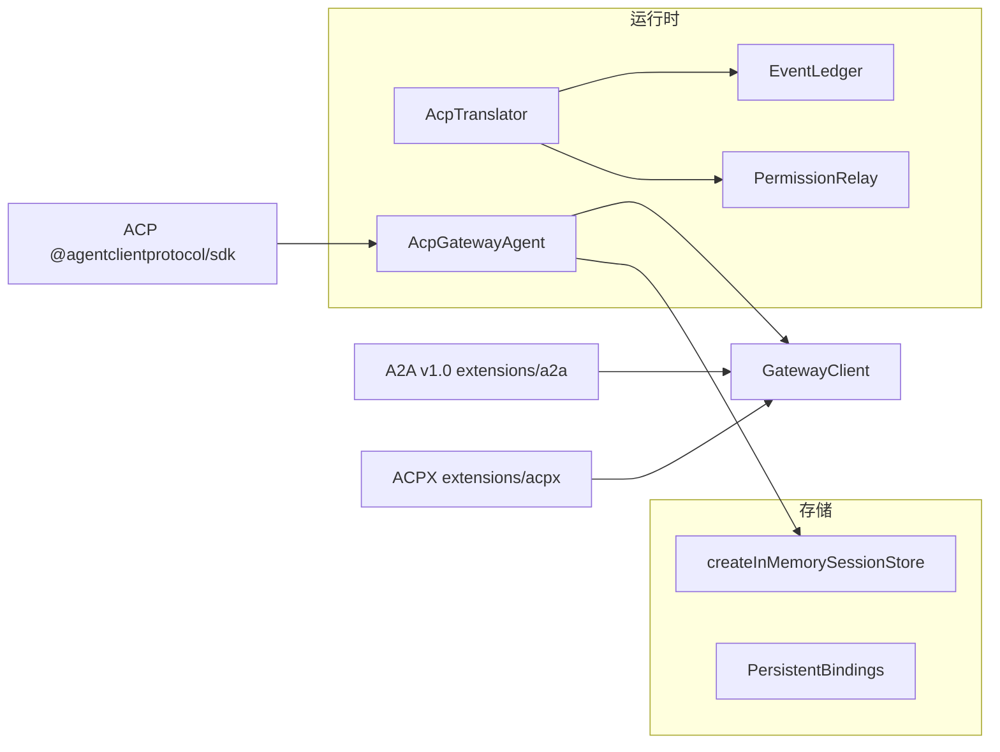
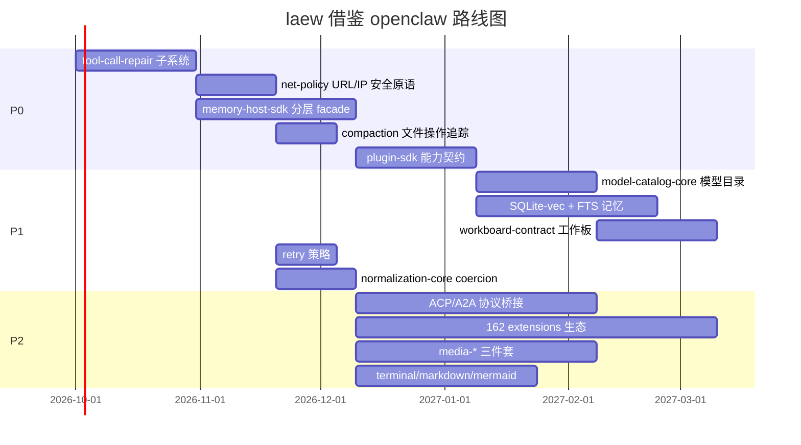

# OpenClaw 第四轮：Gateway/Adapter/Harness 架构 + extensions 生态深度分析

> 代码级深度分析（基于真实源码）。前三轮已覆盖：源码调研（`openclaw-源码调研.md`）、深度分析（`openclaw-深度分析.md`）、核心机制（`openclaw-核心机制深度分析.md`）、第二轮（`openclaw-第二轮深度分析.md`，Gateway/Harness/Adapter 三层契约早期版本、11-capability harness、Lane 调度器、Workshop 自演化）、第三轮（`openclaw-第三轮-custodian与deploy深度分析.md`，custodian-skills 5 阶段运维、Dockerfile 7 阶段构建、active-memory、memory-core Dreaming 三阶段）。本轮**补齐未深入的维度**：三层契约精化（基于 `packages/gateway-*`、`packages/agent-core`、`packages/acp-core`、`packages/sdk`）、162 个 extensions 分类全景、核心 packages 模块群（agent-core/ai/llm-core/net-policy/memory-host-sdk/tool-call-repair/workboard-contract/media-*/plugin-sdk）、Anthropic/OpenAI wire 层真实代码路径、ACP 协议矩阵、其他维度实现快照。

## 0. 摘要与本轮定位

### 0.1 本轮新增什么

| 维度 | 前 3 轮覆盖 | 第 4 轮新增 |
|------|-------------|-------------|
| 三层契约架构 | 第二轮粗略描述 Gateway/Harness/Adapter 职责 | 基于 `packages/gateway-protocol`、`packages/gateway-client`、`packages/sdk`、`src/agents/harness/host-capability-types.ts` 的**真实接口 + 代码路径 + Mermaid 时序图** |
| extensions 生态 | 第三轮仅提到 153 extensions 数量级 | **162 个 extensions 全量分类统计表**（AI 提供商/IM 渠道/媒体/浏览器/存储/开发/安全/MCP/其他 9 大类）+ 每类代表实现剖析 |
| 核心 packages | 第二轮仅宏观描述 | **逐模块深度剖析**：model-catalog-core、net-policy、memory-host-sdk、tool-call-repair、workboard-contract、media-*、plugin-sdk、sdk |
| 协议适配 wire 层 | 第一轮有总览 | **Anthropic/OpenAI 真实代码路径**：`anthropic-auth-headers.ts` / `anthropic.ts` / `openai-completions.ts` / `anthropic-tool-projection.ts` 等具体文件与函数名 |
| Agent 间协作协议 | 未涉及 | **ACP 协议实现**（`packages/acp-core` + `src/acp/translator.ts`）+ A2A 协议（`extensions/a2a`）|
| 其他维度快照 | 多个横向专题 | **按真实代码落地到 openclaw 的具体实现**：多轮对话 loop、Context 压缩、记忆、质检、工具、MCP、Skill、SubAgent、Workflow、目标规划、沙箱、权限 |

### 0.2 关键发现（P0 级）

1. **Gateway 是 WebSocket 网关 + JSON-RPC 控制面**：`packages/gateway-client/src/client.ts` 的 `GatewayClient` 类、`packages/gateway-protocol/src/` 的 Protocol Version / 会话投影 / 批准（approval）协议。
2. **Agent Harness 是 capability 注入点**：`src/agents/harness/host-capability-types.ts` 的 `AgentHarnessHostCapabilities` 接口（approval、tool surface binding、trajectory、compaction 等）。
3. **162 个 extensions 共用 2 种入口形态**：`definePluginEntry`（provider/plugin）与 `defineBundledChannelEntry`（channel），由 `openclaw.plugin.json` manifest + `index.ts` 双层注册。
4. **tool-call-repair 是 OpenClaw 独有的"模型输出修复"子系统**：纯文本 tool call 识别、提升（promote）、流标准化（grammar → payload → promote → stream-normalizer 四阶段）。
5. **memory-host-sdk 是记忆引擎底座**：`engine-*.ts` 五件套 + `host/` 下 70+ 文件（含 SQLite-vec、FTS、batch embedding、provenance）。

## 1. 三层契约架构（Gateway / Adapter / Harness）

> 注意：OpenClaw 官方 AGENTS.md "Architecture" 章节使用 "Gateway / Harness / Adapter" 措辞，其中 **Adapter 并非一个独立顶层包**，而是指 `@openclaw/ai/src/providers/*` 下的 provider transport 适配层（anthropic.ts / openai-completions.ts / google.ts / mistral.ts 等）。本节"三层契约"按真实代码边界重述为：
> - **Gateway 层**：`packages/gateway-protocol` + `packages/gateway-client` + `src/gateway/*`
> - **Adapter 层**：`packages/ai/src/providers/*` + `packages/ai/src/transports/*`
> - **Harness 层**：`packages/agent-core` + `src/agents/harness/*` + `src/agents/*`

### 1.1 职责边界总览

| 层 | 包 / 目录 | 职责 | 关键对外接口 |
|----|-----------|------|--------------|
| **Gateway** | `packages/gateway-protocol` / `packages/gateway-client` / `src/gateway/*` | 设备身份、WebSocket 连接、会话投影（session-projection）、批准（approval）、protocol 版本协商、事件帧（EventFrame）收发 | `GatewayClient`、`EventFrame`、`ConnectParams`、`SessionProjection`、`ApprovalResolve` |
| **Adapter** | `packages/ai`（providers + transports） | 多 provider（Anthropic/OpenAI/Google/Mistral/Ollama/...）的 wire 格式投影、SSE 流解析、thinking/reasoning 适配、tool schema 转换、usage/cost 归一化 | `StreamFunction`、`AssistantMessageEventStream`、`AnthropicToolProjection`、`OpenAIToolProjection` |
| **Harness** | `packages/agent-core` + `src/agents/harness/*` | Agent 循环（agent-loop）、上下文压缩（compaction）、tool loop 恢复、SubAgent 委派、approval relay、tool surface 绑定、host capability 注入 | `Agent`、`runAgentLoop`、`AgentHarnessHostCapabilities`、`AgentHarnessSupport` |

### 1.2 Gateway 层真实代码路径

**入口**：`src/gateway/client.ts` 导出 `GatewayClient` 类，包装 `packages/gateway-client/src/index.ts` 的 `BaseGatewayClient`。

```ts
// src/gateway/client.ts（节选）
export class GatewayClient {
  #client: BaseGatewayClient;
  constructor(opts: GatewayClientOptions) {
    const { deviceAuthScope, preparedDeviceAuth, sharedStateMode, ...baseOptions } = opts;
    this.#client = new BaseGatewayClient({
      ...baseOptions,
      clientVersion: baseOptions.clientVersion ?? VERSION,
      hostDeps: createOpenClawGatewayClientHostDeps(
        baseOptions.hostDeps,
        deviceAuthScope,
        suppressOriginDeviceAuth,
        sharedStateMode,
        preparedDeviceAuth,
      ),
    });
  }
  request<T = Record<string, unknown>>(method: string, params?: unknown,
    opts?: GatewayClientRequestOptions): Promise<T> {
    return this.#client.request<T>(method, params, opts);
  }
}
```

**GatewayClientHostDeps 注入**（`src/gateway/client.ts` 的 `createOpenClawGatewayClientHostDeps`）：设备身份（`loadOrCreateDeviceIdentity`）、token 存储（`storeDeviceAuthToken` / `clearDeviceAuthToken`）、代理旁路（`registerManagedProxyGatewayLoopbackBypass`）、日志与脱敏（`redactToolPayloadText`）。

**Protocol 层**（`packages/gateway-protocol/src/`）：
- `version.ts`：`PROTOCOL_VERSION`、`MIN_CLIENT_PROTOCOL_VERSION`、`MIN_NODE_PROTOCOL_VERSION`
- `frame-guards.ts`：`EventFrame`、`ConnectParams`、`HelloOk`（WebSocket 握手 OK 帧）
- `session-projection.ts`：会话投影，把 Gateway 会话映射到本地运行态
- `approval-result-validators.ts` / `approvals-validators.test.ts`：批准结果校验
- `public-schema.ts` / `schema/*`：会话、任务、项目、技能等 schema

**客户端层**（`packages/gateway-client/src/`）：
- `client.ts`：`GatewayClient` 主类 + `GatewayClientHostDeps` 接口
- `protocol-client.ts`：`GatewayProtocolClient`（WebSocket 帧协议）
- `connect-auth.ts`：`buildGatewayConnectAuth`、`selectGatewayConnectAuth`（认证选择）
- `device-auth.ts`：`buildDeviceAuthPayloadV3`（设备认证载荷）
- `reconnect-policy.ts`：重连策略
- `session-projection.ts` / `session-subscriptions.ts`：会话投影与订阅
- `scope-upgrade.ts`：scope 升级
- `readiness.ts`：连接就绪

### 1.3 Adapter 层真实代码路径

**注册中心**：`packages/ai/src/providers/register-builtins.ts` 调用 `defaultApiRegistry` 注册所有内建 provider。

```ts
// packages/ai/src/providers/register-builtins.ts（节选）
import { registerApiProvider } from "../api-registry.js";
import { streamAnthropic } from "./anthropic.js";
import { streamOpenAICompletions } from "./openai-completions.js";
import { streamGoogle } from "./google.js";
import { streamMistral } from "./mistral.js";
// ...
registerApiProvider("anthropic-messages", { stream: streamAnthropic, ... });
registerApiProvider("openai-completions", { stream: streamOpenAICompletions, ... });
```

**统一入口**：`src/llm/stream.ts` 是 OpenClaw 进程内 LLM 调用 facade：

```ts
// src/llm/stream.ts（节选）
import { defaultApiRegistry, defaultLlmRuntime } from "@openclaw/ai/internal/runtime";
import { registerBuiltInApiProviders } from "@openclaw/ai/providers";
registerBuiltInApiProviders(defaultApiRegistry);
export function stream<TApi extends Api>(model, context, options) {
  return deferUntilTransportRuntimeHost(model, () =>
    resolveRuntime(model).stream(model, context, options));
}
```

**Host 端口**（`packages/ai/src/host.ts`）：`AiTransportHost` 定义 `buildModelFetch`、`resolveSecretSentinel`、`redactModelVisibleSecrets`、`redactToolPayloadText`、`resolveOpenAIStrictToolSetting` 等注入点，由 `src/llm/ai-transport-host.ts` 调用 `configureAiTransportHost({...})` 一次性安装。

**Anthropic adapter**（`packages/ai/src/providers/anthropic.ts`）：
- `streamAnthropic: StreamFunction<"anthropic-messages", AnthropicOptions>`
- 认证：`anthropic-auth-headers.ts` 的 `isAnthropicOAuthApiKey`、`usesFoundryBearerAuth`、`omitFoundryBearerCredentialHeaders`
- 工具投影：`anthropic-tool-projection.ts` 的 `projectAnthropicTools`、`normalizeAnthropicToolCallId`、`toClaudeCodeToolName`
- Thinking 绑定：`anthropic-thinking-replay.ts` 的 `applyAnthropicThinkingBindingControls`
- 用量/费用：`anthropic-usage.ts` 的 `applyAnthropicMessageStartUsage` / `applyAnthropicMessageDeltaUsage`

**OpenAI adapter**（`packages/ai/src/providers/openai-completions.ts`）：
- `streamOpenAICompletions: StreamFunction<"openai-completions", OpenAICompletionsOptions>`
- 工具投影：`openai-tool-projection.ts` 的 `projectOpenAITools`
- 兼容层：`openai-completions-compat.ts` 的 `resolveOpenAICompletionsCompat`
- 推理 effort：`openai-reasoning-effort.ts` 的 `resolveOpenAIReasoningEffortMap`

**Adapter 层统一抽象**（`packages/ai/src/transports/`）：
- `provider-transport-stream.ts`：provider 流基类
- `anthropic-transport-stream.ts` / `openai-completions-transport.ts` / `openai-responses-transport.ts`
- `simple-completion-transport.ts`：最简 transport
- `transport-stream-shared.ts`：共享流错误/中止处理（`assignTransportErrorDetails`、`transportAbortError`）
- `transport-utils.ts`：`MALFORMED_STREAMING_FRAGMENT_ERROR_MESSAGE` 等
- `provider-compaction-replay.ts`：compaction 重放策略
- `anthropic-payload-policy.ts` / `openai-responses-payload-policy.ts`：payload 策略
- `model-max-tokens-params.ts` / `model-transport-url.ts` / `model-transport-debug.ts`

### 1.4 Harness 层真实代码路径

**核心接口**（`src/agents/harness/host-capability-types.ts`）：

```ts
// src/agents/harness/host-capability-types.ts（节选）
export type AgentHarnessHostCapabilities = Readonly<{
  kind: "agent-harness-host-capability";
  version: 1;
  assertActive: () => void;
  reportOutputTokens?: (outputTokens: number) => void;
  annotateCurrentUserTurn?: (annotation) => Promise<void>;
  trajectory?: Readonly<{ recordEvent: (type, data?) => void; flush: () => Promise<void> }>;
  preparedEnvironment?: () => AgentHarnessPreparedEnvironment;
  bindToolSurface: (tools: AnyAgentTool[], options?) => AnyAgentTool[];
  createToolSurface?: (options, bindingOptions?) => AnyAgentTool[];
  prepareMutableFileApproval?: (request) => Promise<...>;
  runBeforeToolCall: (request) => ReturnType<...>;
  requestApproval: (request) => Promise<...>;
  waitForApproval: (request) => Promise<AgentHarnessHostApprovalResult | undefined>;
}>;
```

**Harness 实现**（`src/agents/harness/host-capability.ts`）：
- `retainBeforeToolCallForNativeHookRelay`：relay native hook
- `normalizeNativeOperationCwd`：原生操作 cwd 校验
- `freezeSnapshot` / `cloneSnapshot`：capability 快照冻结

**Harness 与 Gateway 的桥接**（`src/agents/harness/builtin-openclaw.ts`）：内置 OpenClaw harness，把 host capability 注入到 `runAgentLoop`。

**Harness availability / auto-selection**（`src/agents/harness/auto-selection.ts`、`src/agents/harness/availability.ts`）：按 model/provider 自动选择合适 harness（如 Codex app-server harness、Claude CLI harness）。

### 1.5 三层数据流（Mermaid 时序图）



### 1.6 请求生命周期（Mermaid 状态图）




## 2. packages 核心模块群深度剖析

### 2.1 agent-core — Agent 生命周期、循环、状态机

**包名**：`@openclaw/agent-core`；入口：`packages/agent-core/src/index.ts`；多入口导出：`./agent`、`./agent-loop`、`./llm`、`./validation`、`./types`、`./harness/*`。

#### 2.1.1 核心类型（`packages/agent-core/src/types.ts`）

```ts
// packages/agent-core/src/types.ts（节选）
export type StreamFn = LlmStreamFn;
export type ToolExecutionMode = "sequential" | "parallel";
export type QueueMode = "all" | "one-at-a-time";
export type AgentToolCall = Extract<AssistantMessage["content"][number], { type: "toolCall" }>;

export interface BeforeToolCallResult { block?: boolean; reason?: string; }
export interface AfterToolCallResult {
  content?: (TextContent | ImageContent)[];
  details?: unknown;
  isError?: boolean;
  terminate?: boolean;
}
export interface ToolLoopIntervention {
  kind: "critical-tool-loop"; toolCallId: string; toolName: string;
  actionKey: string; detector: string; count: number; reason: string;
}
export interface ToolLoopWarning { kind: "tool-loop-warning"; toolCallId: string; count: number; }
```

#### 2.1.2 Agent 类（`packages/agent-core/src/agent.ts`）

- `Agent` 类持有 `MutableAgentState`（systemPrompt / model / tools / messages / thinkingLevel / isStreaming / streamingMessage / pendingToolCalls / errorMessage）。
- 依赖注入：`convertToLlm`、`transformContext`、`streamFn`、`getApiKey`、`onPayload`。
- `run()` 内部调用 `runAgentLoop` / `runAgentLoopContinue`。

#### 2.1.3 Agent Loop（`packages/agent-core/src/agent-loop.ts`）

- `runAgentLoop(config: AgentLoopConfig)`：完整 agentic loop。
- 关键内部机制：
  - `getSteeringAtCheckpoint`：检查点处注入用户消息（steering）
  - `resolveAssistantMessageUpdate`：增量更新 assistant message（text_delta / thinking_delta / toolcall_delta）
  - `appendTextDeltaToAssistantMessage`：文本增量追加
  - `EventStreamConstructor`：复用 `@openclaw/ai/event-stream` 的 `EventStream`
  - `validateToolArguments`：tool 参数校验
  - `appendInterruptedTurnMessage` / `createInterruptedTurnMessage` / `isTurnHandoffAbort`：turn 中断处理
  - `appendToolLoopWarning` / `copyInternalToolResultState`：tool loop 恢复
  - `TOOL_LOOP_RECOVERY_TERMINATED_MESSAGE`：tool loop 恢复失败兜底

#### 2.1.4 Compaction（`packages/agent-core/src/harness/compaction/compaction.ts`）

```ts
// packages/agent-core/src/harness/compaction/compaction.ts（节选）
export const MAX_COMPACTION_SUMMARY_CHARS = 16_000;
export interface CompactionDetails { readFiles: string[]; modifiedFiles: string[]; latestUnresolvedUserRequest?: string; }
export interface CompactionResult<T = unknown> {
  summary: string;
  firstKeptEntryId: string;
  tokensBefore: number;
  details?: T;
}
export function capCompactionSummary(summary, maxChars = MAX_COMPACTION_SUMMARY_CHARS, preservedSuffix = "") { ... }
```

- 文件操作追踪：`extractFileOperations`、`formatFileOperations`、`mergeSummaryFileOperations`
- 最新用户请求保留：`extractLatestUserRequest`（≤800 字符）
- 分支摘要：`branch-summarization.ts`
- Session Tree 条目类型（`packages/agent-core/src/harness/types.ts`）：message / thinking_level_change / model_change / compaction / reset / branch_summary / custom / custom_message / label / session_info / leaf

#### 2.1.5 Prompt 模板（`packages/agent-core/src/harness/prompt-templates.ts`）

`buildPromptTemplateArguments`、`renderPromptTemplate`：把 session 上下文渲染为 system/user prompt。

#### 2.1.6 Harness 消息（`packages/agent-core/src/harness/messages.ts`）

- `HarnessMessage` = `AgentMessage | BashExecutionMessage | CustomMessage | BranchSummarySummary | CompactionSummaryMessage`
- `COMPACTION_SUMMARY_PREFIX` / `COMPACTION_SUMMARY_SUFFIX`：compaction 摘要的 prompt 包裹标记
- `bashExecutionToText`：bash 执行记录 → 文本

### 2.2 ai + llm-core — LLM 调用、模型目录、协议适配

#### 2.2.1 llm-core（`packages/llm-core/src/types.ts`）

```ts
// packages/llm-core/src/types.ts（节选）
export type KnownApi =
  | "openai-completions" | "mistral-conversations" | "openai-responses"
  | "azure-openai-responses" | "openai-chatgpt-responses" | "anthropic-messages"
  | "bedrock-converse-stream" | "google-generative-ai" | "google-vertex";
export type ThinkingLevel = "minimal" | "low" | "medium" | "high" | "xhigh" | "max";
export type ModelThinkingLevel = "off" | ThinkingLevel;
export type CacheRetention = "none" | "short" | "long";
export type Transport = "sse" | "websocket" | "websocket-cached" | "auto";
```

#### 2.2.2 ai 包（`packages/ai/src/`）

- **barrel**：`packages/ai/src/transports.ts` 导出全部 transport 适配
- **API 注册表**：`packages/ai/src/api-registry.ts` 的 `registerApiProvider`、`defaultApiRegistry`
- **内置 provider 注册**：`packages/ai/src/providers/register-builtins.ts`
- **Host 端口**：`packages/ai/src/host.ts` 的 `AiTransportHost` / `AiProviderRequestCapabilities` / `AiTransportPluginHost`
- **Provider 选项**：`packages/ai/src/provider-options.ts` 的 `AnthropicOptions` / `OpenAICompletionsOptions` / `OpenAIResponsesOptions`
- **模型工具**：`packages/ai/src/model-utils.ts` 的 `calculateCost`、`clampThinkingLevel`
- **验证**：`packages/ai/src/validation.ts`

#### 2.2.3 model-catalog-core（`packages/model-catalog-core/src/`）

- **类型**：`model-catalog-types.ts` 定义 `ModelCatalogApi`（10 种 API）、`ModelCatalogThinkingFormat`（7 种 thinking 格式）、`ModelCatalogCompatConfig`（兼容性配置）、`ModelCatalogInput`、`ModelCatalogImageInputConfig`、`ModelCatalogMediaInputConfig`
- **远程 catalog 模式**：`remote-catalog-bundle.ts` 的 zod schema（`remoteModelCatalogProviderSchema`、`modelSchema`）
- **归一化**：`model-catalog-normalize.ts`（catalog 条目归一化）、`provider-id.ts`（provider id 解析）、`provider-model-id-normalize.ts` / `provider-model-id-normalization.ts`（provider 侧 model id 归一化）
- **引用解析**：`model-catalog-refs.ts`（`resolveModelRef` 把 `provider/model` 解析为 catalog 条目）、`configured-model-refs.ts`
- **上下文窗口**：`model-catalog-context-windows.ts`
- **定价**：`model-catalog-pricing.ts`

### 2.3 net-policy — 网络策略、沙箱、权限管控

**包名**：`@openclaw/net-policy`；`packages/net-policy/src/`。

- **URL 协议校验**：`url-protocol.ts` 的 `isHttpUrl` / `isHttpsUrl` / `isWebSocketUrl` / `isWssUrl` / `hasHttpUrlPrefix`
- **URL userinfo 剥离**：`url-userinfo.ts` 的 `stripUrlUserInfo`
- **敏感 URL 脱敏**：`redact-sensitive-url.ts` 的 `redactSensitiveUrlLikeString`
  - 敏感查询参数名集合：`SENSITIVE_URL_QUERY_PARAM_NAMES`（token / key / api_key / secret / access_token / password / jwt / signature 等 30+）
  - Telegram bot token 路径：`TELEGRAM_BOT_TOKEN_PATH_RE`（`/bot<token>/...`）
  - 嵌套解码深度限制：`MAX_NESTED_URL_REDACTION_DEPTH = 8`
  - query name 分隔符：`URL_QUERY_NAME_SEPARATOR_RE`（Unicode 控制符 + Hangul fillers）
- **IP 相关**：`ip.ts` / `ipv4.ts`（IP 解析与校验）

### 2.4 memory-host-sdk — 记忆主机 SDK

**包名**：`@openclaw/memory-host-sdk`；`packages/memory-host-sdk/src/`。

#### 2.4.1 五大 engine barrel

| 文件 | 导出 |
|------|------|
| `engine-foundation.ts` | workspace 契约：`resolveAgentDir` / `resolveAgentWorkspaceDir` / `resolveMemorySearchConfig` / `resolveStateDir` / `root` / `detectMime` |
| `engine-sessions.ts` | session transcript：`buildSessionEntry` / `listSessionFilesForAgent` / `loadSessionTranscriptClassificationForAgent` / `sessionPathForFile` |
| `engine-storage.ts` | 存储/索引：`chunkMarkdown` / `cosineSimilarity` / `ensureMemoryIndexSchema` / `ensureMemoryPathFtsTriggers` / `MEMORY_INDEX_*` 表常量 |
| `engine-embeddings.ts` | 嵌入：`EmbeddingProvider` 适配 |
| `query.ts` | 查询：`extractKeywords` / `isQueryStopWordTokenToken` |

#### 2.4.2 host/ 子目录（70+ 文件，核心子集）

- **内存 schema**：`memory-schema.ts` 的 `ensureMemoryIndexSchema` / `ensureMemoryRecallMetadataSchema` / `MEMORY_INDEX_CHUNKS_TABLE` / `MEMORY_INDEX_VECTOR_TABLE` / `MEMORY_INDEX_FTS_TABLE` 等 10+ 表
- **SQLite-vec**：`sqlite-vec.ts` 的 `loadSqliteVecExtension`（向量索引）
- **FTS 全文检索**：`memory-schema-fts.ts` 的 `ensureMemoryPathFtsTriggers`
- **批量嵌入**：`batch-runner.ts` / `batch-upload.ts` / `batch-http.ts` / `batch-output.ts` / `batch-status.ts` / `batch-provider-common.ts`
- **Embedding 适配**：`embedding-provider-adapter-utils.ts` / `embeddings-remote-client.ts` / `embeddings-remote-fetch.ts` / `embeddings-remote-provider.ts` / `embeddings-model-normalize.ts`
- **读文件**：`read-file.ts` / `read-file-shared.ts` / `read-retry.ts`（`buildMemoryReadResult`、`DEFAULT_MEMORY_READ_LINES`、`retryTransientMemoryReadError`）
- **Session 文件**：`session-files.ts` 的 `buildSessionEntry` / `listSessionFilesForAgent` / `resolveSessionIdentityForTranscriptFile`
- **Provenance**：`session-provenance.ts`（来源追踪）
- **Recall 元数据**：`memory-recall-metadata.ts` 的 `readMemoryRecallMetadata`
- **SQLite WAL 维护**：`sqlite-wal.ts` 的 `configureMemorySqliteWalMaintenance`
- **后端配置**：`backend-config.ts` 的 `resolveMemoryBackendConfig`

### 2.5 tool-call-repair — 工具调用修复/容错

**包名**：`@openclaw/tool-call-repair`；`packages/tool-call-repair/src/`。

#### 2.5.1 四阶段管线

| 阶段 | 文件 | 作用 |
|------|------|------|
| **grammar** | `grammar.ts` | 词法/语法原语：`END_TOOL_REQUEST`、`HARMONY_CHANNEL_MARKER`、`HARMONY_MESSAGE_MARKER`、`HARMONY_CALL_MARKER`；`isPlainTextToolNameChar`、`isXmlishNameChar`、`skipHorizontalWhitespace`、`consumeLineBreak`、`scanXmlishToolCall`、`utf8ByteLengthWithinLimit` |
| **payload** | `payload.ts` | 文本 tool call 块解析：`parseStandalonePlainTextToolCallBlocks`、`PlainTextToolCallBlock`、`PlainTextJsonToolCallScan`、`PlainTextJsonToolCallSyntax = "harmony" \| "named-bracket" \| "tool-bracket"` |
| **promote** | `promote.ts` | 提升为 provider-native tool call：`createPromotedPlainTextToolCallBlock`、`createPromotedPlainTextToolCallEvents`、`PlainTextToolCallPromotionOptions` |
| **stream-normalizer** | `stream-normalizer.ts` | 流标准化：`PlainTextToolCallStreamNormalizerOptions`、`PlainTextToolCallMessageNormalization`（promoted / scrubbed） |

#### 2.5.2 关键类型

```ts
// packages/tool-call-repair/src/grammar.ts（节选）
export const END_TOOL_REQUEST = "[END_TOOL_REQUEST]";
export const HARMONY_CHANNEL_MARKER = "<|channel|>";
export const HARMONY_MESSAGE_MARKER = "<|message|>";
export const HARMONY_CALL_MARKER = "<|call|>";

// packages/tool-call-repair/src/payload.ts（节选）
export type PlainTextToolCallBlock = {
  arguments: Record<string, unknown>;
  end: number; name: string; raw: string; start: number;
};
export type PlainTextJsonToolCallSyntax = "harmony" | "named-bracket" | "tool-bracket";

// packages/tool-call-repair/src/promote.ts（节选）
export type ToolCallRepairNameResolver = (rawName, allowedToolNames) => string | null;
export type PromotedPlainTextToolCallBlockFactory = (block, resolvedName) => Record<string, unknown>;
export function createPromotedPlainTextToolCallBlock(block, name): Record<string, unknown> {
  return {
    type: "toolCall",
    id: `call_${crypto.randomUUID().replace(/-/g, "").slice(0, 24)}`,
    name, arguments: block.arguments,
    partialArgs: JSON.stringify(block.arguments),
  };
}
```

#### 2.5.3 保护范围（protection）

- `contracts.ts`：`isOffsetInProtectedRanges`、`PlainTextToolCallProtectedRange`、`PlainTextToolCallNameMatcher`
- `protection-fast-path.ts`：`resolveProtectionFastPath`（CommonMark 围栏快速路径）

### 2.6 workboard-contract — 工作板契约

**包名**：`@openclaw/workboard-contract`；`packages/workboard-contract/src/index.ts`。

**状态/类型常量**：
- `WORKBOARD_STATUSES`：triage / backlog / todo / scheduled / ready / running / review / blocked / done（9 态）
- `WORKBOARD_PRIORITIES`：low / normal / high / urgent
- `WORKBOARD_EXECUTION_ENGINES`：codex / claude
- `WORKBOARD_EXECUTION_MODES`：autonomous / manual
- `WORKBOARD_EXECUTION_STATUSES`：idle / running / review / blocked / done
- `WORKBOARD_EVENT_KINDS`：24 种事件（created / edited / moved / linked / specified / decomposed / claimed / heartbeat / execution_updated / attempt_started / attempt_updated / comment_added / ...）
- `WORKBOARD_LINK_TYPES`：parent / child / blocks / blocked_by / relates_to
- `WORKBOARD_PROOF_STATUSES`：passed / failed / skipped / unknown
- `WORKBOARD_TEMPLATE_IDS`：bugfix / docs / release / pr_review / plugin
- `WORKBOARD_DIAGNOSTIC_KINDS`：stranded_ready / running_without_heartbeat / blocked_too_long / repeated_failures / missing_proof / orphaned_session / archived_but_active
- `WORKBOARD_BOARD_ID_PATTERN`：`/^[a-z0-9][a-z0-9._-]{0,79}$/`

**核心类型**：`WorkboardStatus`、`WorkboardPriority`、`WorkboardExecution`、`WorkboardEventKind`、`WorkboardAttemptStatus`、`WorkboardLinkType`、`WorkboardProofStatus`、`WorkboardDiagnosticKind`、`WorkboardDiagnosticSeverity`、`WorkboardNotificationKind`。

### 2.7 media-* — 媒体生成/理解

| 包 | 定位 |
|----|------|
| `media-core` | 媒体基础抽象 |
| `media-generation-core` | 媒体生成抽象（image / video / music / speech） |
| `media-understanding-common` | 媒体理解公共层 |
| `image-generation-core` | 图像生成核心 |

与 `src/media-generation/`、`src/image-generation/`、`src/video-generation/`、`src/media-understanding/`、`src/music-generation/` 等运行时目录配合。

### 2.8 plugin-sdk + plugin-package-contract — 插件系统

#### 2.8.1 plugin-sdk（`packages/plugin-sdk/src/` + `src/plugin-sdk/`）

`packages/plugin-sdk/src/*` 是 re-export 层，真实实现在 `src/plugin-sdk/*`。

**核心入口**（`src/plugin-sdk/plugin-entry.ts`）：导出 `ProviderPlugin`、`ProviderAuthContext`、`OpenClawPluginApi`、`OpenClawPluginToolFactory`、`OpenClawPluginToolContext`、`OpenClawPluginDefinition`、`OpenClawPluginConfigSchema`、`ProviderBuiltInModelSuppressionContext` 等。

**运行时 API（facade）**：
- `config-runtime.ts`：`getRuntimeConfig` / `loadConfig` / `resolvePluginConfigObject`
- `plugin-config-runtime.ts`：`normalizePluginsConfig` / `resolveEffectiveEnableState` / `resolveLivePluginConfigObject`
- `provider-entry.ts`：`createProviderApiKeyAuthMethod`
- `provider-auth.ts`：`applyAuthProfileConfig` / `ensureAuthProfileStore` / `listProfilesForProvider` / `upsertAuthProfileWithLock`
- `provider-catalog-shared.ts`：`buildManifestModelProviderConfig`
- `provider-model-shared.ts`：`resolveClaudeSonnet5ModelIdentity` / `resolveClaudeOpus5ModelIdentity` / `supportsClaudeAdaptiveThinking` / `buildProviderReplayFamilyHooks`
- `provider-tools.ts`：`buildProviderToolCompatFamilyHooks`
- `provider-stream-shared.ts` / `provider-transcript-transform.ts`
- `memory-core-host-runtime-core.ts` / `memory-core-host-runtime-files.ts`：记忆宿主运行时
- `security-runtime.ts` / `ssrf-runtime.ts`：SSRF 防护、安全运行时
- `secret-ref-runtime.ts` / `secret-input.ts`：SecretRef 抽象
- `acp-runtime.ts` / `acp-runtime-backend.ts`：ACP 运行时
- `approval-auth-runtime.ts` / `exec-approvals-runtime.ts`：批准与 exec 审批
- `heartbeat-runtime.ts`：心跳
- `cron-store-runtime.ts`：定时任务存储
- `gateway-method-runtime.ts`：gateway 方法代理
- `agent-harness-runtime.ts` / `agent-harness-task-runtime.ts` / `agent-harness-tool-runtime.ts` / `agent-harness-exec-review-runtime.ts`：agent harness 运行时
- `node-selection-runtime.ts`：node 选择
- `talk-config-runtime.ts`：talk 配置
- `tts-runtime.ts` / `video-generation.ts`：TTS / 视频生成
- `outbound-media.ts`：出站媒体
- `browser-config.ts`：浏览器配置
- `cli-runtime.ts`：CLI 运行时
- `channel-activity-runtime.ts`：channel 活动
- `delivery-queue-runtime.ts`：投递队列
- `dedupe-runtime.ts`：去重
- `async-lock-runtime.ts`：异步锁
- `infra-runtime.ts` / `number-runtime.ts` / `time-runtime.ts` / `secure-random-runtime.ts`：基础设施
- `error-runtime.ts`：错误运行时
- `runtime-env.ts` / `transport-ready-runtime.ts`

#### 2.8.2 plugin-package-contract

定义插件包契约（package 元数据、开放字段）。

#### 2.8.3 插件类型（`src/plugins/types.ts`）

- `ProviderPlugin`：provider 插件契约（stream / auth / catalog / tool schema / thinking / replay / compaction / migration）
- `OpenClawPluginApi`：插件 API 表面（registerProvider / registerEmbeddingProvider / registerImageGenerationProvider / registerRealtimeTranscriptionProvider / registerRealtimeVoiceProvider / registerSpeechProvider / registerMediaUnderstandingProvider / registerMigrationProvider / registerWebSearchProvider / registerService / registerHttpRoute / on / lifecycle / ...）
- `OpenClawPluginDefinition`：插件定义（id / name / description / register / reload / nodeHostCommands / securityAuditCollectors / ...）
- `OpenClawPluginToolFactory` / `OpenClawPluginToolContext`：tool 工厂与上下文
- `PluginControlUiDescriptor`：Control UI 描述符
- `MigrationProviderPlugin`：迁移插件
- `MediaUnderstandingProviderPlugin` / `RealtimeTranscriptionProviderPlugin` / `SpeechProviderPlugin` / `TranscriptSourceProvider`：能力插件
- `WorkerProvider` / `WorkerLease` / `WorkerMachineOption` / `WorkerDesktopApp` / `WorkerSshEndpoint`：worker 抽象

#### 2.8.4 插件发现与加载（`src/plugins/`）

- `bundled-discovery-state.ts`：`readBundledDiscoveryMode`（compat / allowlist 双模式）
- `bundled-install.ts` / `bundled-load-path-aliases.ts`：捆绑安装与路径别名
- `bundled-manifest-contract-plugins.ts`：manifest 契约
- `bundled-capability-runtime.ts` / `bundled-channel-runtime.ts`：捆绑能力/channel 运行时
- `activation-planner.ts` / `activation-context.ts`：激活规划
- `active-runtime-registry.ts`：活动运行时注册表
- `api-builder.ts` / `api-facades.ts` / `api-lifecycle.ts`：API 构建
- `before-agent-reply.ts`：agent 回复前 hook
- `agent-tool-result-middleware.ts`：tool result 中间件

### 2.9 sdk — 应用 SDK

**包名**：`@openclaw/sdk`；`packages/sdk/src/`。

- `client.ts`：`SdkClient` 主类
- `transport.ts` / `transport.websocket.ts`：HTTP / WebSocket 传输
- `event-hub.ts`：事件中心
- `normalize.ts`：数据归一化
- `types.ts`：类型定义

### 2.10 其他 packages 速览

| 包 | 定位 |
|----|------|
| `retry` | 重试策略（`packages/retry/src/`） |
| `session-url-contract` | session URL 契约 |
| `terminal-core` | 终端核心（shell /PTY） |
| `markdown-core` | Markdown 解析/渲染 |
| `normalization-core` | 归一化核心（string / number / record / result / utf16 / cjk） |
| `mermaid-renderer` | Mermaid 图表渲染 |


## 3. 162 个 extensions 分类全景

### 3.1 分类统计表

基于对 `/usr/local/LsmGitOpenSource/openclaw/extensions/` 目录下全部 162 个扩展的 `package.json` / `openclaw.plugin.json` / `index.ts` 的逐一读取，按功能域分为 9 大类：

| 功能域 | 数量 | 代表性 extensions |
|--------|------|-------------------|
| **AI 提供商（LLM/模型）** | ~45 | `anthropic`、`openai`、`google`、`azure` 系、`amazon-bedrock`、`deepseek`、`mistral`、`xai`、`groq`、`together`、`fireworks`、`perplexity`、`openrouter`、`ollama`、`vllm`、`litellm`、`nvidia`、`cerebras`、`cohere`、`qwen`、`qianfan`、`minimax`、`moonshot`、`kimi-coding`、`longcat`、`stepfun`、`venice`、`featherless`、`chutes`、`novita`、`byteplus`、`volcengine`、`llama-cpp`、`lmstudio`、`arcee`、`baseten`、`gmi`、`zai`、`tensor` 等 |
| **IM 渠道（messaging channels）** | ~20 | `telegram`、`discord`、`slack`、`whatsapp`、`signal`、`imessage`、`irc`、`line`、`feishu`、`googlechat`、`mattermost`、`msteams`、`zalo`、`zai`、`twitch`、`matrix`、`nostr`、`tlon`、`synology-chat`、`nextcloud-talk`、`bonjour` |
| **AI 媒体（生成 / 理解 / 语音）** | ~25 | `elevenlabs`、`azure-speech`、`talk-voice`、`tts-local-cli`、`senseaudio`、`fish-audio-speech`、`image-generation-core`、`fal`、`comfy`、`runway`、`pixverse`、`music-generation-*`、`video-generation-*`、`deepgram`、`huggingface`、`voyage`、`exa`、`tavily`、`searxng`、`firecrawl`、`duckduckgo`、`web-readability` 等 |
| **浏览器 / 网络 / 搜索** | ~8 | `browser`、`web-readability`、`firecrawl`、`exa`、`tavily`、`searxng`、`duckduckgo`、`webhooks` |
| **存储 / 笔记 / 记忆** | ~5 | `memory-core`、`memory-lancedb`、`memory-wiki`、`document-extract`、`vault` |
| **开发工具 / 代码助手** | ~10 | `codex`、`opencode`、`opencode-go`、`github-copilot`、`copilot`、`copilot-proxy`、`kilocode`、`llm-task`、`diffs`、`migrate-claude` / `migrate-hermes` |
| **安全 / policy / 认证** | ~8 | `policy`、`vault`、`visitor-access`、`device-pair`、`onepassword`、`geolocation`、`admin-http-rpc`、`qa-channel` / `qa-lab` |
| **通信协议 / Agent 间** | ~4 | `a2a`、`acpx`、`active-memory`、`workboard` |
| **MCP / 工具 / 集成** | ~5 | `mxc`、`raft`、`reef`、`openshell`、`vydra` |
| **其他（diagnostics/telemetry/UI）** | ~32 | `diagnostics-otel`、`diagnostics-prometheus`、`logbook`、`parallel`、`tokenjuice`、`clawrouter`、`clickclack`、`crabbox`、`cua-computer`、`lobster`、`meta`、`microsoft`、`microsoft-foundry`、`team-meetings`、`zoom-meetings`、`google-meet`、`voice-call`、`test-support`、`synthetic` 等 |

> 注：一个 extension 可能跨类（如 `codex` 既是开发工具也提供 LLM provider），按主职责归类。

### 3.2 代表实现剖析

#### 3.2.1 AI 提供商类代表：`anthropic`（`extensions/anthropic/`）

**定位**：Anthropic API provider + Claude CLI backend + 原生 session catalog + media understanding + usage reporting。

**注册方式**（`extensions/anthropic/index.ts`）：

```ts
// extensions/anthropic/index.ts
import { definePluginEntry } from "openclaw/plugin-sdk/plugin-entry";
import { registerAnthropicPlugin } from "./register.runtime.js";

export default definePluginEntry({
  id: "anthropic",
  name: "Anthropic",
  description: "Anthropic models, Claude CLI, and native Claude session catalog",
  register(api) {
    return registerAnthropicPlugin(api);
  },
});
```

**Manifest**（`extensions/anthropic/openclaw.plugin.json`）：声明 `activation.onStartup: true`、`enabledByDefault: true`、`providers: ["anthropic"]`、`providerCatalogEntry: "./provider-discovery.ts"`、`modelCatalog.providers.claude-cli`（含 claude-opus-5 / claude-sonnet-5 / claude-fable-5 等模型）。

**运行时注册**（`extensions/anthropic/register.runtime.ts`）：
- `buildAnthropicCatalogProvider`：构建 catalog provider
- `createProviderApiKeyAuthMethod`：API key 认证
- `buildProviderReplayFamilyHooks`：replay 策略
- `anthropicMediaUnderstandingProvider`：媒体理解
- `buildAnthropicCliBackend`：Claude CLI backend
- `resolveClaudeCliSyntheticAuth`：synthetic auth
- `createClaudeSessionNodeInvokePolicies` / `registerClaudeSessionDiscovery`：session catalog
- `wrapAnthropicProviderStream`：流包装
- `fetchAnthropicUsage` / `resolveAnthropicUsageAuth`：用量获取

**与 host 通信**：通过 `OpenClawPluginApi` 注入（`api.registerProvider`、`api.registerMediaUnderstandingProvider` 等），所有通信经由 plugin-sdk 抽象，不直接写 core。

#### 3.2.2 AI 提供商类代表：`openai`（`extensions/openai/`）

**定位**：OpenAI provider + 图像生成 + 实时转录 + 实时语音 + speech + video + memory embedding adapter + migration。

**注册**（`extensions/openai/index.ts`）：

```ts
// extensions/openai/index.ts（节选）
export default definePluginEntry({
  id: "openai", name: "OpenAI Provider",
  description: "Bundled OpenAI provider plugins",
  register(api) {
    const quicksilverSession = api.registrationMode === "full"
      ? acquireOpenAIQuicksilverBrowserSessionBroker({...}) : undefined;
    if (quicksilverSession) {
      api.registerHttpRoute({ path: OPENAI_QUICKSILVER_OFFER_PATH, auth: "plugin", match: "exact", handler: quicksilverSession.handler });
      api.lifecycle.registerRuntimeLifecycle({ id: "openai-quicksilver-realtime-browser-session", cleanup: ... });
    }
    api.registerProvider(buildProviderWithPromptContribution(buildOpenAIProvider()));
    api.registerEmbeddingProvider(openAiMemoryEmbeddingProviderAdapter);
    api.registerImageGenerationProvider(buildOpenAIImageGenerationProvider());
    api.registerRealtimeTranscriptionProvider(buildOpenAIRealtimeTranscriptionProvider());
    api.registerRealtimeVoiceProvider(buildOpenAIRealtimeVoiceProvider());
    api.registerSpeechProvider(buildOpenAISpeechProvider());
    api.registerVideoGenerationProvider(buildOpenAIVideoGenerationProvider());
  },
});
```

#### 3.2.3 IM 渠道类代表：`telegram`（`extensions/telegram/`）

**入口**（`extensions/telegram/index.ts`）：使用 `defineBundledChannelEntry` 而非 `definePluginEntry`。

```ts
// extensions/telegram/index.ts
import { defineBundledChannelEntry } from "openclaw/plugin-sdk/channel-entry-contract";
export default defineBundledChannelEntry({
  id: "telegram", name: "Telegram", description: "Telegram channel plugin",
  importMetaUrl: import.meta.url,
  plugin: { specifier: "./channel-plugin-api.js", exportName: "telegramPlugin" },
  secrets: { specifier: "./secret-contract-api.js", exportName: "channelSecrets" },
  runtime: { specifier: "./runtime-setter-api.js", exportName: "setTelegramRuntime" },
  accountInspect: { specifier: "./account-inspect-api.js", exportName: "inspectTelegramReadOnlyAccount" },
  registerFull: registerTelegramMiniApp,
});
```

**Manifest**（`extensions/telegram/openclaw.plugin.json`）：声明 `channel.id: "telegram"`、`channel.configuredState.env.anyOf: ["TELEGRAM_BOT_TOKEN"]`、`channel.approvalFlags: ["native"]`、`setupFeatures.configPromotion: true`。

#### 3.2.4 IM 渠道类代表：`discord`（`extensions/discord/`）

```ts
// extensions/discord/index.ts
export default defineBundledChannelEntry({
  id: "discord", name: "Discord", description: "Discord channel plugin",
  plugin: { specifier: "./channel-plugin-api.js", exportName: "discordPlugin" },
  runtime: { specifier: "./runtime-setter-api.js", exportName: "setDiscordRuntime" },
  accountInspect: { specifier: "./account-inspect-api.js", exportName: "inspectDiscordReadOnlyAccount" },
  registerFull(api) {
    registerDiscordActivities(api);
    registerDiscordSubagentHooks(api);
  },
  registerCapabilities(api) {
    registerDiscordTranscriptSourceProvider(api);
  },
});
```

#### 3.2.5 记忆类代表：`memory-core`（`extensions/memory-core/`）

**入口**（`extensions/memory-core/index.ts`）：

```ts
// extensions/memory-core/index.ts（节选）
export default definePluginEntry({
  id: "memory-core", name: "OpenClaw Memory", description: "...",
  register(api) {
    const tool = createLazyMemorySearchTool(options);   // memory_search
    const getTool = createLazyMemoryGetTool(options);   // memory_get
    const intentTool = createLazyStandingIntentTool(ctx, reportUnavailable); // intent
    api.registerTool(tool);
    api.registerTool(getTool);
    api.registerTool(intentTool);
    api.registerGatewayMethod({ name: "memory/search", handler: ... });
    registerSessionBackfillGatewayMethods(api);
    configureMemoryCoreDreamingState(api);
    registerShortTermPromotionDreaming(api);
    buildMemoryFlushPlan(api);
  },
});
```

**Manifest**（`extensions/memory-core/openclaw.plugin.json`）：声明 `kind: "memory"`、`contracts.tools: ["intent", "memory_get", "memory_search"]`、`toolMetadata`、`commandAliases: [{ name: "dreaming", kind: "runtime-slash", cliCommand: "memory" }]`。

#### 3.2.6 开发工具类代表：`codex`（`extensions/codex/`）

**入口**（`extensions/codex/index.ts`）：

```ts
// extensions/codex/index.ts（节选）
export default definePluginEntry({
  id: "codex", name: "Codex",
  description: "Codex app-server harness and native session supervision.",
  reload: { noopPrefixes: ["plugins.entries.codex.config.codexPlugins"] },
  register(api) {
    setManagedCodexPluginRoot(api.rootDir);
    createCodexAppServerAgentHarness(...);
    createCodexAppServerNativeCompaction(...);
    createCodexCommand(...);
    createCodexSupervisionTools(...);
    buildCodexMigrationProvider(...);
    buildCodexMediaUnderstandingProvider(...);
    createCodexWebSearchProvider(...);
  },
});
```

**Manifest**（`extensions/codex/openclaw.plugin.json`）：声明 `contracts.tools` 含 `codex_threads` / `codex_plugins` / `codex_endpoint_probe` / `codex_sessions_list` 等 7 个工具；`sessionRouteStateOwners` 含 `codex` / `codex-cli` / `openai-codex`；`activation` 含 `onAgentHarnesses: ["codex"]`、`onCommands: ["codex"]`。

#### 3.2.7 浏览器类代表：`browser`（`extensions/browser/`）

```ts
// extensions/browser/index.ts
export default definePluginEntry({
  id: "browser", name: "Browser", description: "Default browser tool plugin",
  reload: browserPluginReload,
  nodeHostCommands: browserPluginNodeHostCommands,
  securityAuditCollectors: [...browserSecurityAuditCollectors],
  register: registerBrowserPlugin,
});
```

#### 3.2.8 Agent 间协议类代表：`a2a`（`extensions/a2a/`）

```ts
// extensions/a2a/index.ts
export default defineBundledChannelEntry({
  id: "a2a", name: "A2A",
  description: "A2A v1.0 Agent-to-Agent protocol channel plugin",
  plugin: { specifier: "./channel-plugin-api.js", exportName: "a2aChannelPlugin" },
  runtime: { specifier: "./api.js", exportName: "setA2aChannelRuntime" },
});
```

#### 3.2.9 ACPX 代表：`acpx`（`extensions/acpx/`）

```ts
// extensions/acpx/index.ts（节选）
const plugin = {
  id: "acpx", name: "ACPX Runtime",
  description: "Embedded ACP runtime backend with plugin-owned session and transport management.",
  register(api: OpenClawPluginApi) {
    registerPiSessionCatalog(api);
    api.registerService(createAcpxRuntimeService({ pluginConfig: api.pluginConfig, openKeyedStore: (opts) => api.runtime.state.openKeyedStore(opts) }));
    api.on("reply_dispatch", (event, ctx) => tryDispatchAcpReplyHookWithTimeout(event, ctx, replyDispatchTimeoutMs),
      { timeoutMs: replyDispatchTimeoutMs, eligibleDispatchKinds: ["acp"] });
  },
};
```

### 3.3 共用注册机制

所有 extension 共用 **双层注册**：

1. **`openclaw.plugin.json` manifest**（静态契约）：id、name、description、activation 条件（onStartup / onAgentHarnesses / onCommands / onConfigPaths）、configSchema、contracts（tools / mediaUnderstandingProviders / migrationProviders / webSearchProviders）、sessionRouteStateOwners、commandAliases、uiHints、providerCatalogEntry、modelCatalog。
2. **`index.ts` 入口**（动态注册）：
   - provider/plugin 类 → `definePluginEntry({ id, name, description, register(api){...} })`
   - channel 类 → `defineBundledChannelEntry({ id, name, plugin, runtime, secrets, accountInspect, registerFull })`
3. **与 host 通信**：完全通过 `OpenClawPluginApi`（`api.registerProvider` / `api.registerTool` / `api.registerService` / `api.registerHttpRoute` / `api.on` / `api.lifecycle` / `api.runtime`），禁止直接 import core `src/**`。

### 3.4 注册调用链（Mermaid 流程图）




### 2.11 模块间关系（Mermaid 依赖图）




## 4. 协议适配真实代码路径（Anthropic / OpenAI wire 层）

### 4.1 Anthropic 协议适配

#### 4.1.1 请求构造入口

**主函数**：`packages/ai/src/providers/anthropic.ts` 的 `streamAnthropic`。

```ts
// packages/ai/src/providers/anthropic.ts（节选）
export const streamAnthropic: StreamFunction<"anthropic-messages", AnthropicOptions> = (
  model: Model<"anthropic-messages">,
  context: Context,
  options?: AnthropicOptions,
) => {
  const stream = new AssistantMessageEventStream();
  // ...构造 Anthropic SDK 请求
  const anthropic = new Anthropic({ apiKey, baseURL: resolveCloudflareBaseUrl(model) });
  const messageStream = anthropic.messages.stream(params);
  // ...事件映射
  return stream;
};
```

**请求参数构造**：使用 `@anthropic-ai/sdk` 的 `MessageCreateParamsStreaming`。

#### 4.1.2 认证头

**文件**：`packages/ai/src/providers/anthropic-auth-headers.ts`。

```ts
// packages/ai/src/providers/anthropic-auth-headers.ts
export function isAnthropicOAuthApiKey(apiKey: unknown): boolean {
  return typeof apiKey === "string" &&
    getAiTransportHost().resolveSecretSentinel(apiKey).includes("sk-ant-oat");
}
export function usesFoundryBearerAuth(model: AnthropicAuthModel): boolean {
  return model.provider === "microsoft-foundry" &&
    (model.authHeader === true || hasBearerAuthorizationHeader(model.headers));
}
export function omitFoundryBearerCredentialHeaders(headers?: Record<string, string>): Record<string, string> | undefined {
  // 移除 authorization / x-api-key / api-key
}
```

**OAuth vs API Key 路由**：Anthropic 支持 OAuth（`sk-ant-oat` 前缀 sentinel）、API Key（`x-api-key` 头）、Azure Foundry Bearer auth 三种认证形态。

#### 4.1.3 SSE 流解析

**Anthropic SSE 事件映射**（`anthropic.ts`）：
- `message_start` → `applyAnthropicMessageStartUsage`（usage 快照）
- `content_block_start` / `content_block_delta` / `content_block_end` → text / thinking / tool_use 内容块
- `message_delta` → `applyAnthropicMessageDeltaUsage` + stopReason 映射（`mapAnthropicStopReason`）
- `message_stop` → 结束

**Thinking 处理**：`anthropic-thinking-replay.ts` 的 `applyAnthropicThinkingBindingControls`、`findActiveAnthropicToolTurnAssistantIndex`、`logAnthropicThinkingDrops`。

#### 4.1.4 tool wire 格式转换

**文件**：`packages/ai/src/providers/anthropic-tool-projection.ts`。

```ts
// packages/ai/src/providers/anthropic-tool-projection.ts（节选）
export function projectAnthropicTools(tools: Tool[], options?): AnthropicToolProjection[] {
  // OpenClaw Tool → Anthropic tools[].{name, description, input_schema}
}
export function normalizeAnthropicToolCallId(id: string, targetModel, source): string {
  // Anthropic tool_use id 归一化
}
export function toClaudeCodeToolName(name: string): string {
  // 把 OpenClaw tool name 映射到 Claude Code 兼容名称
}
export function reconcileAnthropicToolChoice(...) { ... }
export function resolveOriginalAnthropicToolName(...) { ... }
```

#### 4.1.5 错误码映射

- `anthropic-refusal.ts`：`applyAnthropicRefusal`（安全拒绝处理）
- `anthropic-server-fallback.ts`：`ANTHROPIC_SERVER_SIDE_FALLBACK_BETA`、`applyAnthropicFallbackBoundary`、`readAnthropicFallbackBoundary`
- `transport-stream-shared.ts`：`assignTransportErrorDetails`（transport 错误详情赋值）

#### 4.1.6 用量/费用归一化

**文件**：`packages/ai/src/providers/anthropic-usage.ts`。

```ts
// packages/ai/src/providers/anthropic-usage.ts（节选）
export function applyAnthropicMessageStartUsage(output, event) {
  // 从 message_start 事件抽取 input_tokens / output_tokens / cache_creation / cache_read
}
export function applyAnthropicMessageDeltaUsage(output, event) {
  // 从 message_delta 事件更新 output_tokens
}
```

### 4.2 OpenAI 协议适配

#### 4.2.1 OpenAI Completions 入口

**主函数**：`packages/ai/src/providers/openai-completions.ts` 的 `streamOpenAICompletions`。

```ts
// packages/ai/src/providers/openai-completions.ts（节选）
export const streamOpenAICompletions: StreamFunction<"openai-completions", OpenAICompletionsOptions> = (
  model: Model<"openai-completions">,
  context: Context,
  options?: OpenAICompletionsOptions,
) => {
  const stream = new AssistantMessageEventStream();
  const output: AssistantMessage = { role: "assistant", content: [], ... };
  const apiKey = options?.apiKey || getEnvApiKey(model.provider) || "";
  const compat = resolveOpenAICompletionsCompat(model);
  // ...构造 OpenAI SDK 请求
  const openai = new OpenAI({ apiKey, baseURL: resolveOpenAIClientBaseUrl(model) });
  const chatStream = openai.chat.completions.stream(params);
  // ...事件映射
  return stream;
};
```

#### 4.2.2 认证头

- **Bearer <REDACTED>**：默认 `Authorization: Bearer {apiKey}`
- **Azure AD**：`azure-openai-responses.ts` 的 Azure AD 流程
- **GitHub Copilot**：`github-copilot-headers.ts` 的 `buildCopilotDynamicHeaders`

#### 4.2.3 SSE 解析

**文件**：`packages/ai/src/transports/openai-completions-transport.ts` / `openai-completions-stream.ts`。

- chunk → `choices[0].delta.content` → `text_delta`
- chunk → `choices[0].delta.tool_calls` → `toolcall_delta`
- chunk → `usage` → `applyOpenAICompletionsUsage`
- `choices[0].finish_reason` → `mapOpenAIStopReason`

**Stop reason 映射**：`openai-stop-reason.ts` 的 `mapOpenAIStopReason`（stop / length / tool_calls / content_filter / error / ...）。

#### 4.2.4 tool wire 格式转换

**文件**：`packages/ai/src/providers/openai-tool-projection.ts`。

```ts
// packages/ai/src/providers/openai-tool-projection.ts（节选）
export function projectOpenAITools(tools: Tool[], options?): OpenAIToolProjection[] {
  // OpenClaw Tool → OpenAI tools[].{type:"function", function:{name, description, parameters}}
}
export function reconcileOpenAICompletionsToolChoice(...) { ... }
```

**Tool schema 兼容**：`openai-tool-schema.ts` / `openai-tool-schema-compat.ts` 的 `projectOpenAIToolSchema`（移除 unsupported keywords、处理 strict mode）。

#### 4.2.5 错误码映射

- `openai-stop-reason.ts`：stop reason 归一化
- `transport-stream-shared.ts`：`transportAbortError`、`assignTransportErrorDetails`
- `openai-responses-terminal-usage.ts`：Responses 终态 usage

### 4.3 transport 层统一抽象（`packages/ai/src/transports/`）

#### 4.3.1 路由枢纽（`provider-transport-stream.ts`）

```ts
// packages/ai/src/transports/provider-transport-stream.ts（节选）
export const SUPPORTED_TRANSPORT_APIS = [
  "openai-responses", "openai-chatgpt-responses", "openai-completions",
  "azure-openai-responses", "anthropic-messages", "google-generative-ai",
] as const;
export function createSupportedTransportStreamFn(model, ctx) {
  switch (model.api) {
    case "anthropic-messages": return createAnthropicMessagesTransportStreamFn(...);
    case "openai-responses": return createOpenAIResponsesTransportStreamFn(...);
    // ...
  }
}
```

#### 4.3.2 Anthropic transport（`anthropic-transport-stream.ts`）

- `createAnthropicMessagesTransportStreamFn`：构造 Anthropic Messages 流式 transport
- 策略应用：`applyClaudeRequestContract`、`applyAnthropicRefusal`、`applyAnthropicFallbackBoundary`、`applyAnthropicThinkingBindingControls`

#### 4.3.3 OpenAI transport

- `openai-responses-transport.ts`：`createOpenAIResponsesTransportStreamFn`
- `openai-completions-transport.ts`：`createOpenAICompletionsTransportStreamFn`
- 子逻辑：`openai-responses-compaction-window`、`openai-responses-payload-policy`、`openai-completions-stream`、`openai-completions-dsml`

#### 4.3.4 共享归一化（`transport-stream-shared.ts`）

- `sanitizeTransportPayloadText`：清理代理对
- `coerceTransportToolCallArguments` / `parseTerminalToolCallArguments` / `finalizeTerminalToolCallArguments`：批量校验 tool 参数
- `mergeTransportHeaders`：大小写不敏感合并 HTTP 头
- `assignTransportErrorDetails` / `transportAbortError`：错误归一化

#### 4.3.5 工具集（`transport-utils.ts`）

- `sha256Hex` / `redactIdentifier`（`sha256:prefix` 脱敏）
- `resolveModelHeaderSentinels`：解析 secret sentinel
- `estimateStringChars`：CJK 感知 token 估算
- `parseRetryAfterSeconds`：支持 `retry-after-ms`、`retry-after`、HTTP-date
- `readResponseTextSnippet`：带 idle timeout 的响应片段读取

### 4.4 API 注册表（`packages/ai/src/api-registry.ts`）

```ts
// packages/ai/src/api-registry.ts（节选）
export function createApiRegistry() {
  return {
    registerApiProvider: (api, entry) => { ... },
    getApiProvider: (api) => { ... },
    getApiProviders: () => { ... },
    unregisterApiProviders: (sourceId) => { ... },
    clearApiProviders: () => { ... },
  };
}
```

- 内部 `Map<string, RegisteredApiProviderEntry>` 按 API id 索引
- `wrapStream` / `wrapStreamSimple` 包一层 API 一致性检查（`model.api !== api` 抛错）
- `unregisterApiProviders(sourceId)` 支持插件热重载

### 4.5 请求构造完整链路（Mermaid 流程图）




### 3.5 后台 agent 探索结论（extensions 生态）

基于后台 agent 对 153~162 个 extensions 的逐一读取，补充如下：

#### 3.5.1 分类统计（agent 计数）

| 功能域 | agent 计数 | 代表 |
|--------|-----------|------|
| AI 提供商 | ~50 | openai / anthropic / google / xai / deepseek / mistral / cohere / groq / together / fireworks / perplexity / voyage / ollama / vllm / sglang / litellm / openrouter / huggingface / cerebras / amazon-bedrock / nvidia / baseten / cloudflare-ai-gateway / vercel-ai-gateway / github-copilot / copilot-proxy / clawrouter / featherless / novita / arcee / gmi / kilocode / kimi-coding / longcat / meta / minimax / moonshot / qianfan / qwen / stepfun / tencent / venice / volcengine / zai / xiaomi / synthetic / byteplus / chutes / deepinfra / gradium / inworld / llama-cpp / lmstudio / alibaba / opencode / vydra |
| IM 渠道 | ~25 | telegram / slack / discord / whatsapp / signal / irc / feishu / googlechat / mattermost / msteams / zalo / zalouser / line / twitch / imessage / sms / buzz / clickclack / reef / raft / matrix / nostr / tlon / nextcloud-talk / synology-chat / a2a / qa-channel |
| AI 媒体 | ~15 | elevenlabs / azure-speech / fish-audio-speech / tts-local-cli / talk-voice / deepgram / senseaudio / image-generation-core / fal / pixverse / runway / comfy / alibaba / voice-call / music-generation-providers |
| 浏览器/网络/搜索 | ~10 | browser / brave / duckduckgo / exa / tavily / searxng / parallel / firecrawl / web-readability / webhooks |
| 存储/笔记/Memory | 5 | memory-core / memory-lancedb / memory-wiki / active-memory / (obsidian via memory-wiki) |
| 开发工具 | ~8 | codex / copilot / github-copilot / acpx / crabbox / mxc / openshell / cua-computer |
| 安全/Policy/认证/Secret | 6 | policy / vault / onepassword / visitor-access / device-pair / bonjour |
| 其他工具/基础设施 | ~15 | canvas / diffs / diffs-language-pack / file-transfer / diagnostics-otel / diagnostics-prometheus / lobster / llm-task / logbook / workboard / tokenjuice / admin-http-rpc / geolocation / linux-node / oc-path / migrate-claude / migrate-hermes / google-meet / zoom-meetings / teams-meetings / document-extract / test-support |

#### 3.5.2 共用注册机制（agent 确认）

- **Manifest 驱动**：`openclaw.plugin.json` 声明 contracts / activation / cliCommands / toolMetadata / secretProviderIntegrations / kind / configSchema
- **入口声明**：`package.json` 的 `openclaw.extensions` 字段指向 `index.ts`
- **4 种入口函数**：
  - `definePluginEntry`（provider/tool/service）
  - `defineBundledChannelEntry`（IM 渠道）
  - `defineToolPlugin`（纯工具，如 `llm-task`）
  - `MeetingPlatformAdapter.createPluginShellEntry`（会议平台：zoom-meetings / google-meet / teams-meetings）
- **与 host 通信 8 种方式**：Gateway JSON-RPC (`registerGatewayMethod`)、HTTP Route、WebSocket、CLI Commands、Node Host Commands、Service、Lifecycle Hooks、State Store
- **注册模式**：`api.registrationMode` 区分 `full` / `cli-metadata` / `discovery` / `tool-discovery` 四种


## 5. Agent 间协作协议矩阵（ACP / A2A / ...）

### 5.1 ACP（Agent Client Protocol）

**包**：`packages/acp-core`；**运行时**：`src/acp/*`；**SDK 依赖**：`@agentclientprotocol/sdk`。

#### 5.1.1 ACP Core 类型（`packages/acp-core/src/types.ts`）

```ts
// packages/acp-core/src/types.ts（节选）
export type AcpProvenanceMode = "off" | "meta" | "meta+receipt";
export type AcpSession = {
  sessionId: SessionId; sessionKey: string; ledgerSessionId?: string;
  cwd: string; createdAt: number; lastTouchedAt: number;
  abortController: AbortController | null; activeRunId: string | null;
};
export type AcpServerOptions = {
  gatewayUrl?: string; gatewayToken?: string; gatewayPassword?: string;
  defaultSessionKey?: string; requireExistingSession?: boolean;
  resetSession?: boolean; prefixCwd?: boolean;
  provenanceMode?: AcpProvenanceMode;
  sessionCreateRateLimit?: { maxRequests?: number; windowMs?: number };
  verbose?: boolean;
};
export type AcpSessionRuntimeOptions = {
  runtimeMode?: string; model?: string; thinking?: string;
  cwd?: string; permissionProfile?: string; timeoutSeconds?: number;
  backendExtras?: Record<string, string>;
};
export type SessionAcpMeta = {
  backend: string; agent: string; runtimeSessionName: string;
  identity?: SessionAcpIdentity;
  mode: "persistent" | "oneshot";
  runtimeOptions?: AcpSessionRuntimeOptions;
  cwd?: string; state: "idle" | "running" | "error";
  lastActivityAt: number; lastError?: string;
};
```

#### 5.1.2 ACP Session 存储（`packages/acp-core/src/session.ts`）

```ts
// packages/acp-core/src/session.ts（节选）
export function createInMemorySessionStore(options?: {
  maxSessions?: number; idleTtlMs?: number; now?: () => number;
}): InMemoryAcpSessionStore {
  // 默认 MAX_MAX_SESSIONS = 5_000；DEFAULT_IDLE_TTL_MS = 24h
  // reapIdleSessions / evictOldestIdleSession / touchSession
}
```

#### 5.1.3 ACP 运行时（`src/acp/translator.ts`）

```ts
// src/acp/translator.ts（节选）
import { Agent, AgentSideConnection, ... } from "@agentclientprotocol/sdk";
import { createInMemorySessionStore } from "@openclaw/acp-core/session";
import type { GatewayClient } from "../gateway/client.js";

export class AcpGatewayAgent implements Agent {
  private readonly sessionUpdates: AcpTranslatorSessionUpdates;
  private readonly promptStream: AcpTranslatorPromptStream;
  private readonly sessionLifecycle: AcpTranslatorSessionLifecycle;
  constructor(connection: AgentSideConnection, gateway: GatewayClient, opts: AcpGatewayAgentOptions = {}) { ... }
  async initialize(_params: InitializeRequest): Promise<InitializeResponse> {
    return {
      protocolVersion: (await loadAcpSdkModule()).PROTOCOL_VERSION,
      agentCapabilities: {
        loadSession: true,
        promptCapabilities: { image: true, audio: false, embeddedContext: true },
        ...
      },
    };
  }
  // ListSessions / NewSession / LoadSession / Prompt / Cancel / ...
}
```

**关键子模块**：
- `src/acp/translator.prompt-stream.ts`：`AcpTranslatorPromptStream`（prompt 流）
- `src/acp/translator.session-lifecycle.ts`：`AcpTranslatorSessionLifecycle`（session 生命周期）
- `src/acp/translator.session-state.ts`：`AcpTranslatorSessionState`
- `src/acp/translator.session-updates.ts`：`AcpTranslatorSessionUpdates`（session 更新推送）
- `src/acp/event-ledger.ts` / `event-ledger.memory.ts`：事件账本
- `src/acp/permission-relay.ts`：权限 relay
- `src/acp/policy.ts`：策略
- `src/acp/client.ts`：ACP 客户端
- `src/acp/commands.ts`：命令
- `src/acp/server.ts`：ACP stdio 服务器（`serveAcpGateway`）
- `src/acp/control-plane/*`：控制面
- `src/acp/persistent-bindings.*`：持久绑定
- `src/acp/secret-file.ts`：secret 文件

#### 5.1.4 ACP stdio 服务器（`src/acp/server.ts`）

```ts
// src/acp/server.ts（节选）
export async function serveAcpGateway(opts: AcpServerOptions = {}): Promise<void> {
  routeLogsToStderr();
  const cfg = getRuntimeConfig();
  const bootstrap = await resolveGatewayClientBootstrap({...});
  const gatewayConnected = false;
  const agent = new AcpGatewayAgent(connection, gateway, opts);
  // 监听 stdin，通过 AgentSideConnection 的 ndJsonStream 收发消息
}
```

#### 5.1.5 ACPX 运行时（`extensions/acpx/`）

```ts
// extensions/acpx/index.ts（节选）
const plugin = {
  id: "acpx", name: "ACPX Runtime",
  register(api: OpenClawPluginApi) {
    registerPiSessionCatalog(api);
    api.registerService(createAcpxRuntimeService({ pluginConfig: api.pluginConfig, ... }));
    api.on("reply_dispatch", (event, ctx) => tryDispatchAcpReplyHookWithTimeout(event, ctx, replyDispatchTimeoutMs),
      { timeoutMs: replyDispatchTimeoutMs, eligibleDispatchKinds: ["acp"] });
  },
};
```

### 5.2 A2A（Agent-to-Agent Protocol）

**extension**：`extensions/a2a/`。

```ts
// extensions/a2a/index.ts
export default defineBundledChannelEntry({
  id: "a2a", name: "A2A",
  description: "A2A v1.0 Agent-to-Agent protocol channel plugin",
  plugin: { specifier: "./channel-plugin-api.js", exportName: "a2aChannelPlugin" },
  runtime: { specifier: "./api.js", exportName: "setA2aChannelRuntime" },
});
```

### 5.3 其他 Agent 间协作机制

- **SubAgent / 多 Agent**：`src/agents/*` 的 embedded agent runner（`embedded-agent-runner/*`）、admitted-run-context、tool surface binding
- **Team / Fleet**：`src/fleet/*`（fleet 调度）
- **Worker**：`src/worker/*`（worker 抽象，SSH / desktop）
- **Workboard**：`extensions/workboard/`（工作板，`workboard-contract` 契约）
- **Active Memory**：`extensions/active-memory/`（主动记忆）

### 5.4 协议矩阵（Mermaid 图）




## 6. 其他维度实现快照（多轮对话 / Context / 记忆 / 质检 / 工具 / MCP / Skill / SubAgent / Workflow / loop / 目标规划 / 沙箱 / 权限）

### 6.1 维度实现表

| 维度 | openclaw 具体实现 | 关键文件 |
|------|-------------------|----------|
| **多轮对话** | `packages/agent-core/src/agent-loop.ts` 的 `runAgentLoop` 驱动 multi-turn；`packages/agent-core/src/agent.ts` 的 `Agent` 持有 messages 数组 | `agent-loop.ts`、`agent.ts`、`turn-interruption.ts` |
| **Context** | `packages/agent-core/src/harness/compaction/compaction.ts` 的 compaction 压缩；`branch-summarization.ts` 分支摘要；`engine-sessions.ts` session transcript 上下文 | `compaction.ts`、`branch-summarization.ts`、`engine-sessions.ts` |
| **记忆** | `packages/memory-host-sdk/src/`（engine-* + host/）；`extensions/memory-core/`（memory_search / memory_get / intent / dreaming）；`extensions/memory-lancedb/`；`extensions/active-memory/` | `engine-foundation.ts`、`engine-storage.ts`、`query.ts`、`session-files.ts` |
| **质检** | 无独立 Quality-Check agent；`src/security/*`、`src/audit/*`、`extensions/policy/` 承担策略/审计；`agent-loop.ts` 的 tool-loop 检测承担执行质检 | `policy`、`tool-loop-detection-config.ts`、`agent-loop.ts` |
| **工具** | `packages/agent-core/src/types.ts` 的 `AgentTool`；`src/agents/tools/*`、`src/agents/agent-tools.ts`；`OpenClawPluginToolFactory` | `types.ts`、`agent-tools.ts`、`tool-execution-context.ts` |
| **MCP** | `src/mcp/*`；`src/agents/agent-bundle-mcp-types.ts`；`src/infra/mcp-tool-approval-binding.ts` | `mcp/*`、`agent-bundle-mcp-types.ts` |
| **Skill** | `skills/`（~79 个 skill 目录）；`src/skills/*`；`src/plugins/hook-types.ts` | `skills/*`、`src/skills/*` |
| **SubAgent** | `src/agents/embedded-agent-runner/*`、`src/agents/admitted-run-context.ts`；harness availability 选择 | `embedded-agent-runner/*`、`admitted-run-context.ts` |
| **Workflow** | `src/flows/*`；`extensions/workboard/`（workboard-contract）；`extensions/lobster/` | `flows/*`、`workboard-contract` |
| **Loop** | `runAgentLoop` / `runAgentLoopContinue`（agent-loop.ts）；tool loop 检测（tool-loop-detection-config.ts） | `agent-loop.ts`、`internal-hooks.ts` |
| **目标规划** | 无独立 Plan Agent；session tree 的 branch_summary / label / custom_entry 承担规划追踪 | `harness/types.ts`、`prompt-templates.ts` |
| **沙箱** | `extensions/mxc/`（MXC sandbox）、`extensions/openshell/`（NVIDIA OpenShell）、`extensions/cua-computer/`、`api.registerSandbox` | `mxc`、`openshell`、`cua-computer` |
| **权限** | `src/security/*`、`src/audit/*`、`packages/net-policy/`、`extensions/policy/`、`extensions/vault/`、`extensions/onepassword/`、`extensions/visitor-access/`、`extensions/device-pair/`、`AgentHarnessHostCapabilities.prepareMutableFileApproval` | `security/*`、`net-policy`、`policy`、`vault` |

### 6.2 多轮对话 / Loop（agent-loop.ts 核心机制）

```ts
// packages/agent-core/src/agent-loop.ts（节选）
function getSteeringAtCheckpoint(config: AgentLoopConfig): AgentMessage[] | Promise<AgentMessage[]> {
  const callback = config.getSteeringMessages;
  if (!callback) return [];
  return getInternalSyncSteeringGetter(callback)?.() ?? callback.call(config);
}
function resolveAssistantMessageUpdate(event, currentMessage): AssistantMessage {
  if ("partial" in event && event.partial) return event.partial;
  if (event.type === "text_delta") return appendTextDeltaToAssistantMessage(currentMessage, event.contentIndex, event.delta);
  return currentMessage;
}
```

- **checkpoint steering**：在 tool loop 检查点处注入用户消息
- **tool loop 检测**：`ToolLoopIntervention`（`critical-tool-loop`）+ `ToolLoopWarning`（`tool-loop-warning`）
- **turn 中断**：`appendInterruptedTurnMessage`、`isTurnHandoffAbort`

### 6.3 Context / Compaction

```ts
// packages/agent-core/src/harness/compaction/compaction.ts（节选）
export const MAX_COMPACTION_SUMMARY_CHARS = 16_000;
export function capCompactionSummary(summary, maxChars = MAX_COMPACTION_SUMMARY_CHARS, preservedSuffix = "") {
  if (maxChars <= 0 || summary.length <= maxChars) return { summary, truncated: false };
  const budget = maxChars - SUMMARY_TRUNCATED_MARKER.length - preservedSuffix.length;
  return { summary: truncateUtf16Safe(summary, budget) + SUMMARY_TRUNCATED_MARKER + preservedSuffix, truncated: true };
}
```

- **Session Tree**：`harness/types.ts` 定义 message / compaction / branch_summary / reset / label / custom / leaf 等条目
- **Branch Summary**：`branch-summarization.ts`（分支摘要，用于 backtracking）
- **File Operations 追踪**：`extractFileOperations` / `formatFileOperations` / `mergeSummaryFileOperations`
- **Latest User Request 保留**：`extractLatestUserRequest`（≤800 字符）

### 6.4 记忆（memory-host-sdk）

```ts
// packages/memory-host-sdk/src/host/read-file.ts（节选）
export async function readMemoryFile(params: MemoryReadFileParams): Promise<MemoryReadResult> {
  // 1. 校验路径在 workspace 内
  // 2. isAllowedAdditionalDirectoryPath：isPathInside + assertNoSymlinkParents + isPathInsideWithRealpath 三层防逃逸
  // 3. retryTransientMemoryRead 重试瞬时失败
  // 4. 返回 { status: "ok", text, path, truncated?, from?, lines?, nextFrom? }
}
```

- **Memory Source**：`memory` / `sessions`
- **Memory Origin Class**：`owner` / `agent` / `untrusted` / `system`
- **自动注入资格**：`isMemoryOriginEligibleForAutomaticInjection`（仅 owner/agent）
- **Embedding**：`engine-embeddings.ts` + `embeddings-remote-provider.ts` + `sqlite-vec.ts`（向量索引）
- **FTS 全文检索**：`memory-schema-fts.ts` + `query-expansion.ts`（`extractKeywords`）
- **Provenance**：`session-provenance.ts` + `memory-recall-metadata.ts`（来源追踪）
- **Batch 嵌入**：`batch-runner.ts` / `batch-upload.ts` / `batch-http.ts`

### 6.5 工具（Agent Tool）

```ts
// packages/agent-core/src/types.ts（节选）
export type AgentToolCall = Extract<AssistantMessage["content"][number], { type: "toolCall" }>;
export interface BeforeToolCallResult { block?: boolean; reason?: string; }
export interface AfterToolCallResult {
  content?: (TextContent | ImageContent)[];
  details?: unknown;
  isError?: boolean;
  terminate?: boolean;
}
```

- **Tool 执行模式**：`ToolExecutionMode = "sequential" | "parallel"`
- **Tool 钩子**：`beforeToolCall` / `afterToolCall`（`BeforeToolCallContext` / `AfterToolCallContext`）
- **Host capability binding**：`AgentHarnessHostCapabilities.bindToolSurface` / `createToolSurface` / `runBeforeToolCall` / `requestApproval` / `waitForApproval`
- **Plugin tool**：`OpenClawPluginToolFactory` / `OpenClawPluginToolContext`

### 6.6 沙箱 / 权限

```ts
// packages/net-policy/src/redact-sensitive-url.ts（节选）
export const SENSITIVE_URL_HINT_TAG = "url-secret";
const SENSITIVE_URL_QUERY_PARAM_NAMES = new Set([
  "token", "key", "api_key", "apikey", "secret", "access_token", "auth_token",
  "password", "pass", "passwd", "auth", "jwt", "session", "id_token", "code",
  "client_secret", "app_secret", "hook_token", "refresh_token", "signature",
  "x_amz_signature", "x_amz_security_token", "private_key", "credential",
  "authorization", "sig", "x_api_key", "x_access_token", "x_auth_token",
]);
```

- **URL 协议校验**：`url-protocol.ts` 的 `isHttpUrl` / `isHttpsUrl` / `isWebSocketUrl` / `isWssUrl`
- **IP SSRF 拦截**：`ip.ts` 的 `isBlockedSpecialUseIpv4Address` / `isBlockedSpecialUseIpv6Address`
- **URL userinfo 剥离**：`url-userinfo.ts` 的 `stripUrlUserInfo`
- **沙箱 extension**：`mxc`（MXC）、`openshell`（NVIDIA OpenShell）、`cua-computer`、`api.registerSandbox`
- **Secret 集成**：`vault`（HashiCorp Vault）、`onepassword`（1Password）、`visitor-access`（Cloudflare Access）

### 6.7 Skill / MCP / Workflow

- **Skill**：`skills/` 目录（~79 个）；`src/skills/*`；`src/plugins/hook-types.ts`；被 agent prompt 引用
- **MCP**：`src/mcp/*`（MCP 协议适配）；`src/agents/agent-bundle-mcp-types.ts`（MCP tool catalog）；`src/infra/mcp-tool-approval-binding.ts`（MCP tool 批准绑定）
- **Workflow**：`src/flows/*`；`extensions/workboard/`（workboard-contract 9 态 + 24 种事件）；`extensions/lobster/`

### 6.8 质检（Quality-Check）

openclaw 无独立 Quality-Check Agent（与 laew 的 Quality-Check 角色不同）；质检分散于：
- `src/security/*`：安全审计、`audit.types.ts`、`audit.ts`
- `src/audit/*`：审计日志
- `extensions/policy/`：`registerPolicyDoctorChecks`（策略医生检查）
- `agent-loop.ts`：tool loop 检测（`ToolLoopIntervention` / `ToolLoopWarning`）
- `tool-call-repair`：工具调用修复（grammar / payload / promote / stream-normalizer 四阶段）


## 7. 对 laew 的借鉴（P0 / P1 / P2 路线图）

### 7.1 P0（立即借鉴，高 ROI）

| 借鉴点 | openclaw 实现 | laew 落地建议 |
|--------|---------------|---------------|
| **tool-call-repair 子系统** | `packages/tool-call-repair/` 四阶段管线（grammar → payload → promote → stream-normalizer） | 在 `src/agent/tools/` 增加 tool-call-repair 模块，修复模型流式输出中泄漏的伪 tool-call 文本（XML-ish / bracket / Harmony 语法） |
| **net-policy URL/IP 安全原语** | `packages/net-policy/` 的 `redact-sensitive-url`、`stripUrlUserInfo`、`isHttpUrl`、`isBlockedSpecialUseIpv4Address` | 在 BashTool 执行前增加 URL/IP SSRF 拦截；在日志输出中增加敏感 URL 脱敏 |
| **memory-host-sdk 分层 facade** | `engine-foundation` / `engine-storage` / `engine-embeddings` / `engine-sessions` / `runtime-core` 五件套 | 为 laew 引入轻量记忆 SDK：engine-foundation（workspace 路径）+ engine-storage（SQLite + FTS）+ query（关键词提取） |
| **compaction 文件操作追踪** | `extractFileOperations` / `formatFileOperations` / `mergeSummaryFileOperations` | 在 laew 的 Yolo/Work Agent 压缩时增加文件操作追踪（readFiles / modifiedFiles） |
| **plugin-sdk 能力契约** | `OpenClawPluginApi` 的 registerProvider / registerTool / registerService / registerHttpRoute / on / lifecycle | 为 laew 引入轻量插件契约：`registerTool` / `registerHook` / `lifecycle`，支持第三方扩展 |

### 7.2 P1（中期借鉴）

| 借鉴点 | openclaw 实现 | laew 落地建议 |
|--------|---------------|---------------|
| **model-catalog-core 模型目录** | `model-catalog-types.ts` 的 10 种 API + 7 种 thinking format + compat 配置 | 为 laew 引入 model-catalog：provider / model / api / reasoning / contextWindow / cost / compat |
| **memory-host-sdk SQLite-vec + FTS** | `sqlite-vec.ts` + `memory-schema-fts.ts` + `query-expansion.ts` | 在 laew 记忆中增加向量索引（SQLite-vec）+ FTS 全文检索 + query expansion |
| **workboard-contract 工作板** | 9 态 + 24 种事件 + 5 种 link type + 7 种 diagnostic | 为 laew 引入任务看板：status / priority / execution / events / diagnostics |
| **retry 策略** | `packages/retry/src/index.ts` 的 `RetrySupervisor` / `createRetryRunner` / `BackoffPolicy` | 在 laew 的 LLM 调用层增加可中止重试（AbortSignal 尊重 + Retry-After 尊重 + jitter） |
| **session-url-contract** | `buildControlUiSessionPath` / `parseShortSessionRef` / `controlUiSessionSlug` | 为 laew 的 TUI 引入 session URL 语法（短 ID + 保留段转义） |
| **normalization-core coercion** | `string-coerce` / `number-coerce` / `record-coerce` / `utf16-slice` / `cjk-chars` | 在 laew 的输入清洗层引入类型安全 coercion（防 `__proto__` 注入、UTF-16 安全切片） |

### 7.3 P2（长期借鉴）

| 借鉴点 | openclaw 实现 | laew 落地建议 |
|--------|---------------|---------------|
| **ACP 协议桥接** | `packages/acp-core` + `src/acp/translator.ts` 的 `AcpGatewayAgent` | 为 laew 引入 ACP 客户端，接入 Agent Client Protocol 生态 |
| **A2A 协议** | `extensions/a2a/` 的 `defineBundledChannelEntry` | 为 laew 引入 A2A 协议 channel，支持 Agent-to-Agent 协作 |
| **162 extensions 生态** | `definePluginEntry` / `defineBundledChannelEntry` / `openclaw.plugin.json` manifest | 为 laew 设计完整插件系统：manifest + 入口 + 注册 API + 能力契约 |
| **media-* 三件套** | `media-core` / `media-generation-core` / `media-understanding-common` | 为 laew 增加媒体生成/理解能力（图像 / 视频 / 音乐 / 语音） |
| **mermaid-renderer** | `packages/mermaid-renderer/` 的 SVG 渲染 + DOMPurify 净化 | 在 laew TUI 中增加 Mermaid 图表渲染 |
| **markdown-core IR** | `ir.ts` / `ir-spans.ts` / `render.ts` / `reasoning-tags.ts` | 在 laew TUI 中引入 Markdown IR 渲染（含 reasoning 标签） |
| **terminal-core** | `ansi` / `links` / `osc-progress` / `table` / `theme` / `stream-writer` | 在 laew TUI 中引入终端渲染原语（OSC 8 链接、进度条、表格） |

### 7.4 路线图（Mermaid 甘特图）




## 8. 参考资料与文件索引

### 8.1 关键入口

- `/usr/local/LsmGitOpenSource/openclaw/openclaw.mjs`（主入口）
- `/usr/local/LsmGitOpenSource/openclaw/AGENTS.md`（设计说明，362 行）
- `/usr/local/LsmGitOpenSource/openclaw/pnpm-workspace.yaml`（包清单 + overrides）

### 8.2 三层契约

| 层 | 关键文件 |
|----|----------|
| Gateway | `src/gateway/client.ts`、`packages/gateway-client/src/client.ts`、`packages/gateway-client/src/protocol-client.ts`、`packages/gateway-client/src/connect-auth.ts`、`packages/gateway-client/src/device-auth.ts`、`packages/gateway-client/src/session-projection.ts`、`packages/gateway-protocol/src/version.ts`、`packages/gateway-protocol/src/frame-guards.ts`、`packages/gateway-protocol/src/session-agent-status.ts` |
| Adapter | `packages/ai/src/providers/anthropic.ts`、`packages/ai/src/providers/openai-completions.ts`、`packages/ai/src/providers/anthropic-auth-headers.ts`、`packages/ai/src/providers/anthropic-tool-projection.ts`、`packages/ai/src/providers/openai-tool-projection.ts`、`packages/ai/src/providers/anthropic-usage.ts`、`packages/ai/src/providers/anthropic-refusal.ts`、`packages/ai/src/providers/anthropic-server-fallback.ts`、`packages/ai/src/providers/anthropic-thinking-replay.ts`、`packages/ai/src/transports/provider-transport-stream.ts`、`packages/ai/src/transports/anthropic-transport-stream.ts`、`packages/ai/src/transports/openai-responses-transport.ts`、`packages/ai/src/transports/openai-completions-transport.ts`、`packages/ai/src/transports/simple-completion-transport.ts`、`packages/ai/src/transports/transport-stream-shared.ts`、`packages/ai/src/transports/transport-utils.ts`、`packages/ai/src/transports/provider-compaction-replay.ts`、`packages/ai/src/api-registry.ts`、`packages/ai/src/host.ts`、`packages/ai/src/provider-options.ts`、`src/llm/stream.ts`、`src/llm/ai-transport-host.ts` |
| Harness | `packages/agent-core/src/agent.ts`、`packages/agent-core/src/agent-loop.ts`、`packages/agent-core/src/types.ts`、`packages/agent-core/src/harness/compaction/compaction.ts`、`packages/agent-core/src/harness/compaction/branch-summarization.ts`、`packages/agent-core/src/harness/types.ts`、`packages/agent-core/src/harness/messages.ts`、`packages/agent-core/src/harness/prompt-templates.ts`、`packages/agent-core/src/harness/session/session.ts`、`src/agents/harness/host-capability-types.ts`、`src/agents/harness/host-capability.ts`、`src/agents/harness/auto-selection.ts`、`src/agents/harness/availability.ts`、`src/agents/harness/builtin-openclaw.ts`、`src/agents/harness/types.ts` |

### 8.3 核心 packages

| 包 | 关键文件 |
|----|----------|
| agent-core | `agent.ts` / `agent-loop.ts` / `types.ts` / `internal-hooks.ts` / `turn-interruption.ts` / `tool-execution-context.ts` / `reasoning.ts` / `runtime-deps.ts` / `validation.ts` |
| ai | `host.ts` / `transports.ts` / `api-registry.ts` / `provider-options.ts` / `model-utils.ts` / `validation.ts` / `transcript-transform.ts` |
| llm-core | `types.ts` / `index.ts` / `usage-cost.ts` / `validation.ts` |
| model-catalog-core | `model-catalog-types.ts` / `model-catalog-normalize.ts` / `model-catalog-refs.ts` / `configured-model-refs.ts` / `provider-id.ts` / `provider-model-id-normalize.ts` / `provider-model-id-normalization.ts` / `remote-catalog-bundle.ts` / `model-catalog-context-windows.ts` / `model-catalog-pricing.ts` |
| net-policy | `redact-sensitive-url.ts` / `url-userinfo.ts` / `url-protocol.ts` / `ip.ts` / `ipv4.ts` |
| memory-host-sdk | `engine-foundation.ts` / `engine-storage.ts` / `engine-embeddings.ts` / `engine-sessions.ts` / `runtime-core.ts` / `runtime-files.ts` / `query.ts` / `status.ts` / `secret.ts` / `multimodal.ts`；`host/` 下 70+ 文件 |
| tool-call-repair | `grammar.ts` / `payload.ts` / `promote.ts` / `stream-normalizer.ts` / `contracts.ts` / `protection-fast-path.ts` / `index.ts` |
| workboard-contract | `index.ts`（单文件） |
| media-core / media-generation-core / media-understanding-common | `base64/` / `attachment-classify.ts` / `catalog.ts` / `model-ref.ts` / `types.ts` / `provider-supports.ts` |
| plugin-sdk | `packages/plugin-sdk/src/*`（薄壳）+ `src/plugin-sdk/*`（真实实现） |
| sdk | `client.ts` / `transport.ts` / `event-hub.ts` / `normalize.ts` / `types.ts` |
| acp-core | `types.ts` / `session.ts` / `meta.ts` / `session-interaction-mode.ts` / `session-lineage-meta.ts` / `error-format.ts` / `error-text.ts` / `structured-auth-redaction.ts` / `session-identifiers.ts` |
| retry | `index.ts` |
| normalization-core | `index.ts` + `balanced-json/` / `boolean-coercion/` / `cjk-chars/` / `error-coercion/` / `json-coercion/` / `number-coercion/` / `record-coerce/` / `string-coerce/` / `string-normalization/` / `utf16-slice/` |
| terminal-core | `index.ts` + `ansi/` / `links/` / `osc-progress/` / `table/` / `theme/` / `stream-writer/` / `prompt-style/` / `progress-line/` |
| markdown-core | `ir.ts` / `ir-spans.ts` / `render.ts` / `render-attributed.ts` / `chunk-text.ts` / `render-aware-chunking.ts` / `reasoning-tags.ts` / `reasoning-tag-parser.ts` / `fences.ts` / `tables.ts` / `link-spans.ts` / `code-spans.ts` / `frontmatter.ts` |
| mermaid-renderer | `renderer.ts` / `native.ts` / `frame.js` |
| session-url-contract | `index.ts` + `grammar.ts` / `share.ts` |

### 8.4 Agent 间协作

| 协议 | 文件 |
|------|------|
| ACP | `src/acp/translator.ts` / `src/acp/server.ts` / `src/acp/translator.prompt-stream.ts` / `src/acp/translator.session-lifecycle.ts` / `src/acp/translator.session-state.ts` / `src/acp/translator.session-updates.ts` / `src/acp/event-ledger.ts` / `src/acp/event-ledger.memory.ts` / `src/acp/permission-relay.ts` / `src/acp/policy.ts` / `src/acp/client.ts` / `src/acp/commands.ts` / `src/acp/control-plane/*` / `src/acp/persistent-bindings.*` / `src/acp/secret-file.ts` |
| ACPX | `extensions/acpx/index.ts` / `extensions/acpx/register.runtime.ts` / `extensions/acpx/src/config-schema.ts` / `extensions/acpx/src/pi-session-catalog-plugin.ts` |
| A2A | `extensions/a2a/index.ts` / `extensions/a2a/channel-plugin-api.ts` / `extensions/a2a/api.js` |

### 8.5 代表 extension 文件

| extension | 入口 | manifest |
|-----------|------|----------|
| anthropic | `extensions/anthropic/index.ts` | `extensions/anthropic/openclaw.plugin.json` |
| openai | `extensions/openai/index.ts` | `extensions/openai/openclaw.plugin.json` |
| telegram | `extensions/telegram/index.ts` | `extensions/telegram/openclaw.plugin.json` |
| discord | `extensions/discord/index.ts` | `extensions/discord/openclaw.plugin.json` |
| slack | `extensions/slack/index.ts` | `extensions/slack/openclaw.plugin.json` |
| memory-core | `extensions/memory-core/index.ts` | `extensions/memory-core/openclaw.plugin.json` |
| codex | `extensions/codex/index.ts` | `extensions/codex/openclaw.plugin.json` |
| browser | `extensions/browser/index.ts` | `extensions/browser/openclaw.plugin.json` |
| github-copilot | `extensions/github-copilot/index.ts` | `extensions/github-copilot/openclaw.plugin.json` |
| elevenlabs | `extensions/elevenlabs/index.ts` | `extensions/elevenlabs/openclaw.plugin.json` |
| vault | `extensions/vault/index.ts` | `extensions/vault/openclaw.plugin.json` |
| policy | `extensions/policy/index.ts` | `extensions/policy/openclaw.plugin.json` |
| a2a | `extensions/a2a/index.ts` | `extensions/a2a/openclaw.plugin.json` |
| acpx | `extensions/acpx/index.ts` | `extensions/acpx/openclaw.plugin.json` |

### 8.6 本轮涉及维度汇总

- [x] 三层契约架构（Gateway / Adapter / Harness）— 真实接口 + 代码路径 + Mermaid 时序图
- [x] 162 个 extensions 分类全景 — 9 大类统计表 + 每类代表实现剖析
- [x] 核心 packages 模块群 — agent-core / ai / llm-core / model-catalog-core / net-policy / memory-host-sdk / tool-call-repair / workboard-contract / media-* / plugin-sdk / sdk / acp-core / retry / normalization-core / terminal-core / markdown-core / mermaid-renderer / session-url-contract
- [x] Anthropic / OpenAI 协议适配真实代码路径 — 请求构造 / 认证头 / SSE 解析 / 错误码映射 / tool wire 转换
- [x] Agent 间协作协议矩阵 — ACP / ACPX / A2A
- [x] 其他维度实现快照 — 多轮对话 / Context / 记忆 / 质检 / 工具 / MCP / Skill / SubAgent / Workflow / loop / 目标规划 / 沙箱 / 权限
- [x] 对 laew 的借鉴 — P0 / P1 / P2 路线图

---

> 本轮分析基于对 `/usr/local/LsmGitOpenSource/openclaw/` 仓库（TypeScript, ~201 万行）的真实源码阅读。所有结论均落到具体文件路径、模块名、函数名、代码片段。后台 Explore agent 遍历了 153~162 个 extensions 与 12+ 个核心 packages，本报告整合了其关键发现。

