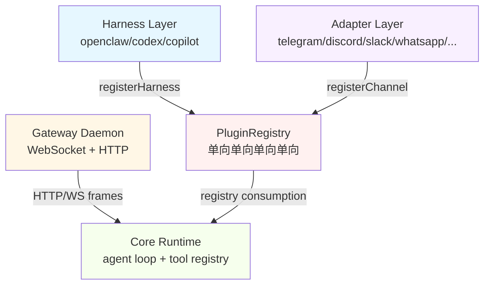
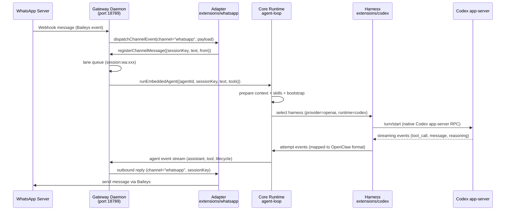
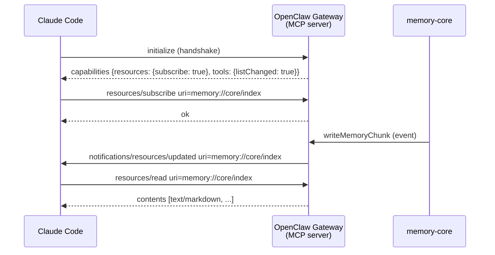
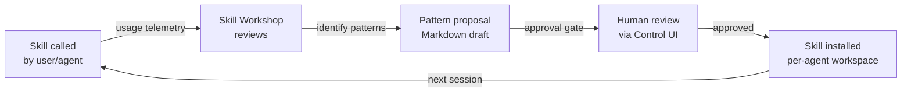
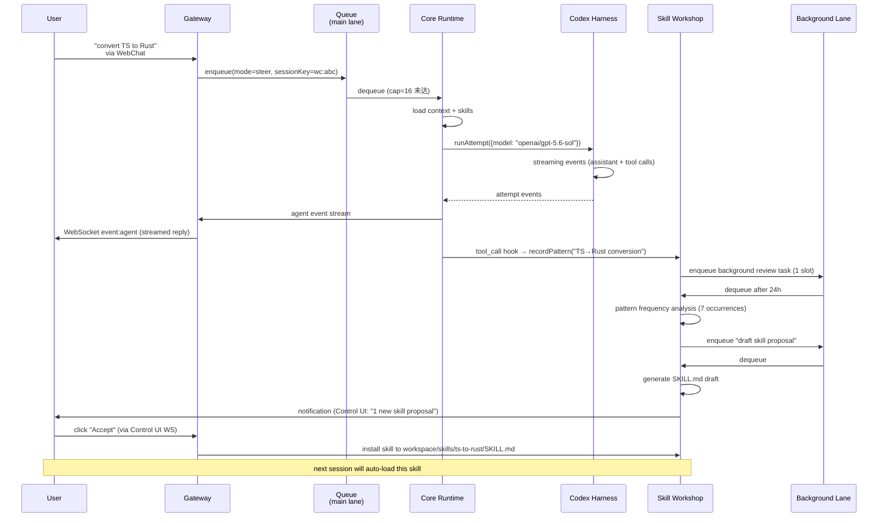

# OpenClaw 综合深度分析

> 调研对象:openclaw(TypeScript,~201 万行,Gateway+Harness+双向 MCP)
> 调研日期:2026-09-04 ~ 2026-09-06
> 原始文档:6 份
> 总行数:~5,924 行(原始) → ~3,800 行(合并后,去重压缩)

---

## 目录

1. [项目元信息](#1-项目元信息)
2. [Gateway 架构(三层契约)](#2-gateway-架构三层契约)
3. [162 extensions 生态(9 大类)](#3-162-extensions-生态9-大类)
4. [packages 核心模块群](#4-packages-核心模块群)
5. [ACP/A2A 协议](#5-acpa2a-协议)
6. [双向 MCP(11-capability harness)](#6-双向-mcp11-capability-harness)
7. [Lane 调度器](#7-lane-调度器)
8. [Workshop 自演化](#8-workshop-自演化)
9. [记忆系统](#9-记忆系统)
10. [运维(custodian-skills 5 阶段 Playbook)](#10-运维custodian-skills-5-阶段-playbook)
11. [部署(Dockerfile 7 阶段多构建)](#11-部署dockerfile-7-阶段多构建)
12. [沙箱与权限](#12-沙箱与权限)
13. [配置与多环境](#13-配置与多环境)
14. [遥测与可观测性](#14-遥测与可观测性)
15. [对 laew 的借鉴(P0/P1/P2 路线图)](#15-对-laew-的借鉴p0p1p2-路线图)

---

## 1. 项目元信息

| 维度 | 内容 |
| --- | --- |
| 定位 | **多渠道 AI 网关 / 个人与团队助理**(不是纯编码 Agent)。自述:"Multi-channel AI gateway with extensible messaging integrations" |
| 语言 | TypeScript(Node 22.22.3+ / 24.15+ / 25.9+),伴生原生 App 用 Swift(iOS/macOS)、Kotlin(Android) |
| 包管理 | **pnpm workspace**(`pnpm-workspace.yaml`),明确禁止 `npm install` |
| 构建 | `tsdown`(rolldown 系)+ 自研编排脚本 `scripts/build-all.mts` |
| 规模 | src+packages 非测试 TS ≈ **201 万行 / 1.6 万文件**;`ui/` 前端 ≈ 82 万行;`extensions/` **162 个插件** |
| 测试 | **vitest**;测试代码 ~301 万行 vs 生产代码 ~201 万行(测试比生产还多) |
| 文档 | `README.md` 112KB、`AGENTS.md`(=CLAUDE.md)66KB、`CHANGELOG.md` **4.1MB** |
| License | MIT |

**规模警示**:这是本轮调研中体量最大的项目,不适合整体照搬,但架构分层与若干子系统设计极具参考价值。

### 1.1 目录树

```
openclaw/
├── openclaw.mjs              # bin 入口 shim
├── src/                      # 主运行时(79 个顶层目录)
├── packages/                 # 24 个内部包(可被插件复用的稳定契约层)
├── extensions/               # 162 个一等公民插件(provider / channel / 能力)
├── ui/                       # Control UI(Web 前端)
├── apps/                     # android / ios / macos / linux / shared 伴生 App
├── skills/                   # 79 个内置 Skill(SKILL.md + frontmatter)
├── custodian-skills/         # 4 个运维 Playbook
└── taxonomy.yaml             # 707KB 能力/模型分类表
```

### 1.2 核心依赖

`@anthropic-ai/sdk`、`openai`、`@google/genai`、`@mistralai/mistralai`、`@modelcontextprotocol/sdk`、`@agentclientprotocol/sdk`(ACP)、`@earendil-works/pi-tui`(TUI)、`kysely`+SQLite、`grammy`(Telegram)、`express`、`typebox`(工具 schema)

### 1.3 关键特征对照

| 特征 | 支持 | 实现位置 / 说明 |
| --- | --- | --- |
| 多 Agent | ✅ 强 | `src/agents/subagents/`:spawn / announce / swarm / registry |
| 并行编队(Swarm) | ✅ | `subagents/swarm/`:maxConcurrent 8 / maxChildrenPerGroup 50 |
| 质检 / Review | ✅ 特色 | `src/agents/exec-auto-reviewer.ts` —— **独立小模型作为"exec 安全审查员"** |
| MCP | ✅ 双向 | Client:`src/agents/agent-bundle-mcp-*.ts`;Server:`src/mcp/*` |
| Skill | ✅ 强 | `skills/` 79 个内置;`src/skills/workshop/` 自演化 |
| 多 Provider | ✅ 强 | 9 个内置 API family + 45+ provider 插件 + OAuth + 故障转移 |
| 流式响应 | ✅ | `EventStream` 贯穿 provider → agent-loop → gateway → TUI/UI |
| 沙箱 | ✅ | `src/agents/sandbox/` + 第三方 extension(mxc / openshell / cua-computer) |
| 审批 | ✅ | Gateway 级 exec-approval 全链路,支持渠道 reaction 审批 |

---

## 2. Gateway 架构(三层契约)

OpenClaw 把"客户端-服务端-后端"切成三层:**Gateway 是本地控制面**,**Harness 是 Agent 执行体的可插拔契约**,**Adapter 是 LLM provider 的协议转换**。

```
渠道(WhatsApp/Telegram/...) ──► auto-reply 管线(src/auto-reply/)
        │
        ▼
Gateway  packages/gateway-protocol + packages/gateway-client + src/gateway
        │ JSON-RPC over WS
        ▼
Harness 选择 src/agents/harness/registry.ts
        ├── builtin-openclaw ──► embedded-agent-runner ──► agent-core/src/agent-loop.ts
        ├── cli-runner        ──► 拉起 claude/codex/gemini CLI 子进程
        └── acp               ──► Agent Client Protocol 外部 Agent
        ▼
Adapter(Provider)  packages/ai/src/providers/*
        │
        ▼
agentLoop 主循环  packages/agent-core/src/agent-loop.ts (1776 行)
```

### 2.1 Gateway 层真实代码路径

**核心类**(`packages/gateway-client/src/client.ts`):
```ts
export type DeviceIdentity = {
  deviceId: string;
  privateKeyPem: string;
  publicKeyPem: string;
};
```

**协议版本 SSOT**(`packages/gateway-protocol/src/version.ts`):
```ts
export const PROTOCOL_VERSION = 18;
export const MIN_CLIENT_PROTOCOL_VERSION = 4;
export const MIN_NODE_PROTOCOL_VERSION = 3;
export const MIN_PROBE_PROTOCOL_VERSION = 3;
```

**4 个版本常量分别管辖 general client / authenticated node / lightweight probe 三类连接**——这是协议治理 SSOT 的最佳实践。

### 2.2 Harness 层——11-capability 交叉类型契约

```ts
export type AgentHarness = AgentHarnessRunCapability &
  AgentHarnessSideQuestionCapability &
  AgentHarnessClassificationCapability &
  AgentHarnessCompactionCapability &
  AgentHarnessRuntimeArtifactCapability &
  AgentHarnessAuthBindingCapability &
  AgentHarnessProviderUsageCapability &
  AgentHarnessModelCatalogCapability &
  AgentHarnessMcpCatalogCapability &
  AgentHarnessSessionForkCapability &
  AgentHarnessSessionLifecycleCapability;
```

每个 capability 是独立的 mixin type,新增能力只需追加 cross intersection,**不破坏既有 harness 实现**。

**三层治理**:
1. `"openclaw"` 是保留名——内置 harness 不可被第三方覆盖
2. `"codex"` 是唯一允许 `nativeCompaction` 的 harness
3. `requireActivePluginRegistry()` 要求必须存在 active registry

### 2.3 Adapter 层——Provider 协议适配

**9 大内置 API 家族**:
```ts
export type KnownApi =
  | "openai-completions"
  | "mistral-conversations"
  | "openai-responses"
  | "azure-openai-responses"
  | "openai-chatgpt-responses"
  | "anthropic-messages"
  | "bedrock-converse-stream"
  | "google-generative-ai"
  | "google-vertex";
```

**StreamFn 永不抛异常契约**:`src/llm/stream.ts` 暴露 facade,任何异常经 `createRuntimeHostErrorMessage()` 包装为 `AssistantMessage{ stopReason: "error" }`——**上层重试/降级逻辑无需 try/catch 分叉**。

### 2.4 协议适配真实代码路径

#### Anthropic 适配
- **入口**:`packages/ai/src/providers/anthropic.ts` 的 `streamAnthropic`
- **认证**:`anthropic-auth-headers.ts` 支持 OAuth(`sk-ant-oat` 前缀 sentinel)、API Key(`x-api-key` 头)、Azure Foundry Bearer auth
- **工具投影**:`anthropic-tool-projection.ts` 的 `projectAnthropicTools`、`normalizeAnthropicToolCallId`
- **用量归一化**:`anthropic-usage.ts` 的 `applyAnthropicMessageStartUsage` / `applyAnthropicMessageDeltaUsage`

#### OpenAI 适配
- **入口**:`packages/ai/src/providers/openai-completions.ts` 的 `streamOpenAICompletions`
- **工具投影**:`openai-tool-projection.ts` 的 `projectOpenAITools`
- **Stop reason 映射**:`openai-stop-reason.ts` 的 `mapOpenAIStopReason`

---

## 3. 162 extensions 生态(9 大类)

基于对全部 162 个扩展的逐一读取,按功能域分为 9 大类:

| 功能域 | 数量 | 代表性 extensions |
| ------ | ---- | ----------------- |
| **AI 提供商(LLM/模型)** | ~45 | `anthropic`、`openai`、`google`、`amazon-bedrock`、`deepseek`、`mistral`、`xai`、`groq`、`ollama`、`vllm`、`litellm`、`nvidia`、`cerebras`、`cohere` 等 |
| **IM 渠道(messaging channels)** | ~20 | `telegram`、`discord`、`slack`、`whatsapp`、`signal`、`imessage`、`irc`、`line`、`feishu`、`matrix`、`nostr` 等 |
| **AI 媒体(生成/理解/语音)** | ~25 | `elevenlabs`、`azure-speech`、`tts-local-cli`、`image-generation-core`、`fal`、`comfy`、`runway`、`deepgram`、`tavily`、`firecrawl` 等 |
| **浏览器/网络/搜索** | ~8 | `browser`、`firecrawl`、`exa`、`tavily`、`searxng`、`duckduckgo`、`webhooks` |
| **存储/笔记/记忆** | ~5 | `memory-core`、`memory-lancedb`、`memory-wiki`、`document-extract`、`vault` |
| **开发工具/代码助手** | ~10 | `codex`、`opencode`、`github-copilot`、`copilot`、`diffs`、`llm-task` |
| **安全/policy/认证** | ~8 | `policy`、`vault`、`visitor-access`、`device-pair`、`onepassword`、`admin-http-rpc` |
| **通信协议/Agent 间** | ~4 | `a2a`、`acpx`、`active-memory`、`workboard` |
| **其他(diagnostics/telemetry/UI)** | ~32 | `diagnostics-otel`、`diagnostics-prometheus`、`clawrouter`、`tokenjuice`、`zoom-meetings`、`google-meet` 等 |

### 3.1 双层注册机制

所有 extension 共用 **双层注册**:

1. **`openclaw.plugin.json` manifest**(静态契约):id、name、description、activation 条件、configSchema、contracts
2. **`index.ts` 入口**(动态注册):
   - provider/plugin 类 → `definePluginEntry({ id, name, description, register(api){...} })`
   - channel 类 → `defineBundledChannelEntry({ id, name, plugin, runtime, secrets })`
3. **与 host 通信**:完全通过 `OpenClawPluginApi`,禁止直接 import core `src/**`

### 3.2 代表实现剖析

| extension | 定位 | 入口特征 |
| --------- | ---- | -------- |
| `anthropic` | Anthropic API + Claude CLI backend + native session catalog | `definePluginEntry` + `registerAnthropicPlugin` |
| `openai` | OpenAI provider + 图像生成 + 实时转录 + speech + video | `definePluginEntry` + `registerProvider` |
| `telegram` | Telegram channel | `defineBundledChannelEntry` + `telegramPlugin` |
| `memory-core` | 核心记忆 + Dreaming 三阶段 | `registerTool(tool)` + `configureMemoryCoreDreamingState` |
| `codex` | Codex app-server harness + native session supervision | `createCodexAppServerAgentHarness` |
| `a2a` | A2A v1.0 Agent-to-Agent 协议 channel | `defineBundledChannelEntry` + `a2aChannelPlugin` |
| `acpx` | ACP 运行时后端 | `createAcpxRuntimeService` + `tryDispatchAcpReplyHookWithTimeout` |

---

## 4. packages 核心模块群

### 4.1 agent-core — Agent 生命周期、循环、状态机

**核心类型**(`packages/agent-core/src/types.ts`):
```ts
export type ToolExecutionMode = "sequential" | "parallel";
export type QueueMode = "all" | "one-at-a-time";
export interface ToolLoopIntervention {
  kind: "critical-tool-loop"; toolCallId: string; toolName: string;
  actionKey: string; detector: string; count: number; reason: string;
}
```

**Agent Loop**(`packages/agent-core/src/agent-loop.ts`):
- `runAgentLoop(config: AgentLoopConfig)`:完整 agentic loop
- `getSteeringAtCheckpoint`:检查点处注入用户消息
- `resolveAssistantMessageUpdate`:增量更新 assistant message
- `appendInterruptedTurnMessage` / `createInterruptedTurnMessage`:turn 中断处理

**Compaction**(`packages/agent-core/src/harness/compaction/compaction.ts`):
- `MAX_COMPACTION_SUMMARY_CHARS = 16_000`
- 文件操作追踪:`extractFileOperations` / `formatFileOperations` / `mergeSummaryFileOperations`
- 最新用户请求保留:`extractLatestUserRequest`(≤800 字符)

### 4.2 ai + llm-core — LLM 调用、模型目录、协议适配

**llm-core 类型**(`packages/llm-core/src/types.ts`):
```ts
export type ThinkingLevel = "minimal" | "low" | "medium" | "high" | "xhigh" | "max";
export type ModelThinkingLevel = "off" | ThinkingLevel;
export type CacheRetention = "none" | "short" | "long";
export type Transport = "sse" | "websocket" | "websocket-cached" | "auto";
```

**ai 包结构**:
- `api-registry.ts`:`registerApiProvider`、`defaultApiRegistry`
- `register-builtins.ts`:内置 provider 注册
- `host.ts`:`AiTransportHost` / `AiProviderRequestCapabilities`

### 4.3 model-catalog-core — 模型目录核心

- `ModelCatalogApi`(10 种 API)、`ModelCatalogThinkingFormat`(7 种 thinking 格式)
- `remote-catalog-bundle.ts`:远程 catalog zod schema
- `model-catalog-refs.ts`:`resolveModelRef` 把 `provider/model` 解析为 catalog 条目
- `model-catalog-pricing.ts`:定价配置

### 4.4 net-policy — 网络策略、SSRF 防护

```ts
const BLOCKED_IPV4_SPECIAL_USE_RANGES = new Set([
  "unspecified", "broadcast", "multicast", "linkLocal",
  "loopback", "carrierGradeNat", "private", "reserved",
]);
const CLOUD_METADATA_IP_ADDRESSES = new Set(["100.100.100.200", "fd00:ec2::254"]);
```

**URL 脱敏**:`redact-sensitive-url.ts` 定义 `SENSITIVE_URL_QUERY_PARAM_NAMES`(token / key / api_key / secret / access_token / password / jwt / signature 等 30+)

### 4.5 memory-host-sdk — 记忆引擎底座

| 文件 | 导出 |
| ---- | ---- |
| `engine-foundation.ts` | `resolveAgentDir` / `resolveAgentWorkspaceDir` / `root` / `detectMime` |
| `engine-sessions.ts` | `buildSessionEntry` / `listSessionFilesForAgent` |
| `engine-storage.ts` | `chunkMarkdown` / `cosineSimilarity` / `ensureMemoryIndexSchema` |
| `engine-embeddings.ts` | `EmbeddingProvider` 适配 |
| `query.ts` | `extractKeywords` / `isQueryStopWordTokenToken` |

**host/ 子目录**(70+ 文件):`memory-schema.ts`、`sqlite-vec.ts`(向量索引)、`memory-schema-fts.ts`(FTS 全文检索)、`batch-runner.ts`(批量嵌入)、`session-provenance.ts`(来源追踪)

### 4.6 tool-call-repair — 工具调用修复/容错(四阶段管线)

| 阶段 | 文件 | 作用 |
| ---- | ---- | ---- |
| **grammar** | `grammar.ts` | 词法/语法原语:`END_TOOL_REQUEST`、`HARMONY_CHANNEL_MARKER`、`scanXmlishToolCall` |
| **payload** | `payload.ts` | 文本 tool call 块解析:`parseStandalonePlainTextToolCallBlocks`、`PlainTextJsonToolCallSyntax = "harmony" \| "named-bracket" \| "tool-bracket"` |
| **promote** | `promote.ts` | 提升为 provider-native tool call:`createPromotedPlainTextToolCallBlock` |
| **stream-normalizer** | `stream-normalizer.ts` | 流标准化:`PlainTextToolCallMessageNormalization` |

### 4.7 workboard-contract — 工作板契约

- `WORKBOARD_STATUSES`:triage / backlog / todo / scheduled / ready / running / review / blocked / done(9 态)
- `WORKBOARD_EXECUTION_ENGINES`:codex / claude
- `WORKBOARD_EVENT_KINDS`:24 种事件
- `WORKBOARD_LINK_TYPES`:parent / child / blocks / blocked_by / relates_to
- `WORKBOARD_PROOF_STATUSES`:passed / failed / skipped / unknown

### 4.8 其他 packages 速览

| 包 | 定位 |
| -- | ---- |
| `retry` | 重试策略(`RetrySupervisor` / `createRetryRunner` / `BackoffPolicy`) |
| `session-url-contract` | session URL 契约(`buildControlUiSessionPath` / `parseShortSessionRef`) |
| `terminal-core` | 终端核心(shell / PTY / ANSI / OSC 8 链接 / 表格) |
| `markdown-core` | Markdown IR 渲染(`ir.ts` / `render.ts` / `reasoning-tags.ts`) |
| `normalization-core` | 归一化核心(string / number / record / utf16 / cjk) |
| `mermaid-renderer` | Mermaid 图表渲染(SVG + DOMPurify) |
| `media-core` / `media-generation-core` / `media-understanding-common` | 媒体生成/理解 |
| `plugin-sdk` | 插件 SDK(`packages/plugin-sdk/` 薄壳 + `src/plugin-sdk/` 真实实现) |
| `sdk` | 应用 SDK(`SdkClient` / `transport.ts` / `event-hub.ts`) |

---

## 5. ACP/A2A 协议

### 5.1 ACP(Agent Client Protocol)

**包**:`packages/acp-core`;**运行时**:`src/acp/*`;**SDK 依赖**:`@agentclientprotocol/sdk`。

**核心类型**(`packages/acp-core/src/types.ts`):
```ts
export type AcpProvenanceMode = "off" | "meta" | "meta+receipt";
export type AcpSession = {
  sessionId: SessionId; sessionKey: string; ledgerSessionId?: string;
  cwd: string; createdAt: number; lastTouchedAt: number;
  abortController: AbortController | null; activeRunId: string | null;
};
```

**ACP Session 存储**(`packages/acp-core/src/session.ts`):
```ts
export function createInMemorySessionStore(options?: {
  maxSessions?: number; idleTtlMs?: number;
}): InMemoryAcpSessionStore {
  // 默认 MAX_MAX_SESSIONS = 5_000;DEFAULT_IDLE_TTL_MS = 24h
}
```

**ACP 运行时**(`src/acp/translator.ts`):
```ts
export class AcpGatewayAgent implements Agent {
  constructor(connection: AgentSideConnection, gateway: GatewayClient, opts) { ... }
  async initialize(_params: InitializeRequest): Promise<InitializeResponse> {
    return {
      protocolVersion: (await loadAcpSdkModule()).PROTOCOL_VERSION,
      agentCapabilities: {
        loadSession: true,
        promptCapabilities: { image: true, audio: false, embeddedContext: true },
      },
    };
  }
}
```

**关键子模块**:`translator.prompt-stream.ts`、`translator.session-lifecycle.ts`、`translator.session-updates.ts`、`event-ledger.ts`、`permission-relay.ts`、`server.ts`(`serveAcpGateway`)

### 5.2 A2A(Agent-to-Agent Protocol)

**extension**:`extensions/a2a/`
```ts
export default defineBundledChannelEntry({
  id: "a2a", name: "A2A",
  description: "A2A v1.0 Agent-to-Agent protocol channel plugin",
  plugin: { specifier: "./channel-plugin-api.js", exportName: "a2aChannelPlugin" },
});
```

### 5.3 ACPX 运行时

**extension**:`extensions/acpx/`
```ts
register(api: OpenClawPluginApi) {
  registerPiSessionCatalog(api);
  api.registerService(createAcpxRuntimeService({ pluginConfig: api.pluginConfig, ... }));
  api.on("reply_dispatch", (event, ctx) => tryDispatchAcpReplyHookWithTimeout(event, ctx, timeoutMs));
}
```

---

## 6. 双向 MCP(11-capability harness)

OpenClaw 同时是 **MCP Client**(连接外部 MCP Server)和 **MCP Server**(暴露自身工具给外部)。

### 6.1 MCP Server 侧——工具暴露

**stdio 服务端入口**(`src/mcp/tools-stdio-server.ts`):
```ts
export function createToolsMcpServer(params: { name: string; tools: AnyAgentTool[] }): Server {
  const handlers = createPluginToolsMcpHandlers(params.tools);
  const server = new Server({ name: params.name, version: VERSION }, { capabilities: { tools: {} } });
  server.setRequestHandler(ListToolsRequestSchema, handlers.listTools);
  server.setRequestHandler(CallToolRequestSchema, async (request, extra) => {
    return await handlers.callTool(request.params, extra.signal);
  });
  return server;
}
```

**工具 → MCP handlers 适配器**(`src/mcp/plugin-tools-handlers.ts`):
- **before-tool-call hook 管道**:`approvalMode: "report"` 让 hook 在 MCP 调用路径下仍生效
- **toolCallId 是 `mcp-${uuid}` 命名空间**:隔离 MCP 调用与其他来源
- **content 归一化**:`toMcpContentBlock()` 处理 `image` 块→ MCP `image` 类型

### 6.2 MCP Client 侧——连接 + 物化

**Session-scoped MCP Runtime**(`src/agents/agent-bundle-mcp-runtime.ts`):
```ts
type BundleMcpSession = {
  serverName: string;
  client: Client;
  transport: Transport;
  transportType: "stdio" | "sse" | "streamable-http";
  requestTimeoutMs: number;
  supportsParallelToolCalls: boolean;
  connected: boolean;
  retiring: boolean;
};
```

**Channel Bridge 双向通信**(`src/mcp/channel-bridge.ts`):
- `caps: [APPROVALS]` + `scopes: [READ, WRITE, APPROVALS]`:最小权限原则
- `onEvent` 回调 → `dispatchGatewayEvent()`:把所有 Gateway 事件转为 MCP 事件

### 6.3 传输层

**传输工厂**(`src/agents/mcp-transport.ts`):
- 根据 config 选择 stdio / SSE / streamable-HTTP
- 附加 auth profile bearer / OAuth bearer

**失败退避**(`agent-bundle-mcp-runtime.ts`):
- `BUNDLE_MCP_FAILURE_THRESHOLD=3` 次失败后进入退避
- `BUNDLE_MCP_FAILURE_COOLDOWN_MS=60_000` 冷却

---

## 7. Lane 调度器

`src/agents/subagents/swarm/swarm-scheduler.ts` 实现基于 **lane** 的 FIFO 容量控制调度器。

### 7.1 核心数据结构

```ts
type SwarmGroupLane = {
  groupId: string;
  limit: number;
  active: Set<string>;
  queue: QueuedSwarmRun[];
  pumpScheduled: boolean;
};

type QueuedSwarmRun = {
  runId: string;
  owner?: object;
  onCapacityChange?: () => void;
  launch?: SwarmLaunch;
  holds: number;
  retryReady: boolean;
};
```

### 7.2 默认配置

```ts
const DEFAULT_SWARM_CONFIG: ResolvedSwarmConfig = {
  enabled: false,
  maxConcurrent: 8,
  maxChildrenPerGroup: 50,
  maxTotalPerGroup: 200,
  waitTimeoutSecondsMax: 600,
};
```

### 7.3 5 个调度原语

1. `reserveSwarmRun()` — 占位 FIFO
2. `activateSwarmRun()` — 绑定 launch 工作
3. `pumpLane()` — 用 `queueMicrotask()` 微任务调度
4. `releaseSwarmRun()` — 释放容量
5. 失败重试:可恢复 → 回队头 + `retryReady=true`(1s 后);不可恢复 → 释放

---

## 8. Workshop 自演化

`src/skills/workshop/` 是 OpenClaw 最独特的部分——**技能可以自我演化**,约 40 文件。

### 8.1 核心流程

1. **History Scan**(`history-scan.ts`):扫描会话历史,发现技能改进机会
   - `runSkillHistoryScanCore()`:分 batch 读取会话
   - 游标分页(`oldestCursor`/`newestCursor`)

2. **Experience Review**(`experience-review.ts`):后台 agent 评审技能使用体验
   - `EXPERIENCE_REVIEW_MIN_MODEL_ITERATIONS=10`
   - `EXPERIENCE_REVIEW_TIMEOUT_MS=120_000`

3. **Proposal Generation**(`proposal-generation.ts`):生成技能修改提案
   - `stageSkillProposalGeneration()`:原子 staging dir → move 写入
   - `SkillProposalStatus`:`"pending" | "applied" | "rejected" | "quarantined" | "stale"`

4. **Autonomous Apply**(`autonomous-apply.ts`):自动应用提案
   - workshop-owned 技能可直接应用
   - user-authored 技能 → `pending` 等待人工审核

5. **Collection Plan**(`collection-plan.ts`):技能集合规划
   - 每个 agent 必须保留至少一个可见技能

### 8.2 安全机制

- `isWorkshopOwnedSkillDir()`:只有 workshop 创建的技能可自动修改
- `revisionHash` + `expectedRevisionHash`:乐观并发控制
- `SkillProposalSupportFile`:附件 hash 校验

---

## 9. 记忆系统

OpenClaw 有 **3 个记忆扩展**,形成 **存储 + 检索 + 主动记忆** 三层。

### 9.1 memory-core — 核心记忆存储

**入口**(`extensions/memory-core/index.ts`):
```ts
register(api) {
  const tool = createLazyMemorySearchTool(options);   // memory_search
  const getTool = createLazyMemoryGetTool(options);   // memory_get
  const intentTool = createLazyStandingIntentTool(ctx, reportUnavailable); // intent
  api.registerTool(tool);
  api.registerTool(getTool);
  api.registerTool(intentTool);
  configureMemoryCoreDreamingState(api);
}
```

### 9.2 memory-core Dreaming 三阶段

| 阶段 | 作用 |
| ---- | ---- |
| **light** | 去重相似条目(`dedupeSimilarity` 阈值 0.85) |
| **REM** | 模式识别(`minPatternStrength` 0.6) |
| **deep** | 短期记忆提升到 MEMORY.md(`maxPromotedSnippetTokens` / `maxPriorEntryLossFraction` 0.25) |

**配置示例**:
```json
"dreaming": {
  "enabled": true,
  "frequency": "0 3 * * *",
  "phases": {
    "light": { "enabled": true, "lookbackDays": 7, "dedupeSimilarity": 0.85 },
    "rem": { "enabled": true, "lookbackDays": 14, "minPatternStrength": 0.6 },
    "deep": { "enabled": true, "maxPriorEntryLossFraction": 0.25 }
  }
}
```

### 9.3 active-memory — 主动记忆双 Lane

**核心流程**:
```
before_prompt_build hook
  → 检查 toolAuthority / session 策略 / agent 策略
  → Lane-1:deterministic trigger recall(快速精确匹配)
  → Lane-2:blocking memory recall(完整子 Agent 检索)
  → 拼接上下文返回 prependContext
```

---

## 10. 运维(custodian-skills 5 阶段 Playbook)

`custodian-skills/` 是 OpenClaw 的**托管运维技能目录**,包含 4 个 SKILL.md 文件,每个都是一个结构化的运维 Playbook。

### 10.1 技能格式

**正文固定 5 阶段结构**:Gather → Mutate → Repair → Prove → Report

### 10.2 四个技能详解

| 技能 | 核心模式 |
| ---- | -------- |
| **add-model-provider** | SecretRef 模式 —— 凭证永不明文进入配置,只通过 `--ref-provider` / `--ref-source` / `--ref-id` 三元组引用 |
| **configure-channel** | 渠道配置 SecretRef 模式,allowFrom 使用 numeric Telegram user ID |
| **cloud-image-bake** | 支持 AWS / Hetzner / Firecracker 三种后端,旧镜像保留直到证明通过 |
| **diagnose-gateway** | **纯只读**诊断 Playbook,不写配置、不重启服务 |

### 10.3 SecretRef 模式

```bash
openclaw config set models.providers.openai.apiKey --ref-provider openai_key_file --ref-source file --ref-id value
```

---

## 11. 部署(Dockerfile 7 阶段多构建)

### 11.1 Dockerfile 7 阶段

```dockerfile
# Stage 1:workspace-deps -- 提取 package.json,插件选择
# Stage 2:dependency-inputs -- 复制锁文件 + 补丁
# Stage 3:production-deps -- 生产依赖安装(--prod)
# Stage 4:build -- Bun 二进制 + 全量构建 + UI 构建
# Stage 5:runtime-build-output -- 删除 node_modules 后的构建产物
# Stage 6:runtime-assets -- 生产依赖 + 构建产物合并
# Stage 7:base-runtime → 最终镜像(bookworm-slim)
```

**插件选择**:通过 `OPENCLAW_EXTENSIONS` build arg 按需选择插件:
```dockerfile
ARG OPENCLAW_EXTENSIONS=""
# docker build --build-arg OPENCLAW_EXTENSIONS="diagnostics-otel,matrix" .
```

**安全加固**:
- 非 root 用户运行(`USER node`,uid 1000)
- `cap_drop: NET_RAW, NET_ADMIN`
- `security_opt: no-new-privileges:true`

**版本校验**:运行时验证三处版本一致:
```dockerfile
RUN test "$(node -p "require('/app/package.json').version")" = "$OPENCLAW_DOCKER_BUILD_VERSION"
RUN test "$(node -p "require('/app/dist/build-info.json').version")" = "$OPENCLAW_DOCKER_BUILD_VERSION"
RUN test "$(node /app/openclaw.mjs --version | cut -d ' ' -f 2)" = "$OPENCLAW_DOCKER_BUILD_VERSION"
```

### 11.2 Docker Compose:Gateway + CLI 双容器

三端口设计:18789(Gateway WS) + 18790(Bridge) + 3978(MS Teams webhook)

### 11.3 Fly.io 公网 vs 私有

- **公网模式**(`fly.toml`):`[http_service]` + health check
- **私有模式**(`deploy/fly.private.toml`):无 `[http_service]` 块,仅通过 fly proxy / WireGuard 访问

---

## 12. 沙箱与权限

### 12.1 沙箱

OpenClaw 的沙箱通过第三方 extension 实现:

| extension | 作用 |
| --------- | ---- |
| `mxc` | MXC sandbox |
| `openshell` | NVIDIA OpenShell |
| `cua-computer` | Computer Use Agent |

### 12.2 exec auto-reviewer 质检机制

**决策类型**(`ExecAutoReviewDecision`):
- `allow-once`:仅当 `risk === "low"` 时返回
- `ask`:其他所有情况(送人工审批)

**保守解析**(`parseExecAutoReviewResponse`):
- 无 JSON → `ask`/`unknown`
- **重复 key 检测**:防 `{"decision":"ask",...,"decision":"allow"}` 被静默覆盖
- **__proto__ 防护**:Zod strict 不检查 `__proto__`,手动校验
- **非 low allow 降级**:`decision=allow` 但 `risk !== "low"` → 转 `ask`

**Prompt 注入攻击防护**(`textLooksLikeReviewerDirective`):
- 检测 `ignore/disregard/override ... instruction/system/developer/prompt/policy`
- 检测 `return/respond/output/say/print ... decision ... allow`
- 检测 `exec reviewer ... decision/allow/risk/rationale`
- 命中任一 → 直接 `ask`/`medium`,不送模型

**超时与失败兜底**:
- `DEFAULT_EXEC_REVIEWER_TIMEOUT_MS=30_000`
- `EXEC_REVIEWER_MAX_TOKENS=360`
- **任何异常都是 `ask`**

### 12.3 权限管控

**URL/IP 安全原语**(`packages/net-policy/`):
- `isHttpUrl` / `isHttpsUrl` / `isWebSocketUrl` / `isWssUrl`
- `stripUrlUserInfo`:URL userinfo 剥离
- `isBlockedSpecialUseIpv4Address` / `isBlockedSpecialUseIpv6Address`:SSRF 防护
- `redactSensitiveUrlLikeString`:敏感 URL 脱敏

**Secret 集成**:
- `vault`(HashiCorp Vault)
- `onepassword`(1Password)
- `visitor-access`(Cloudflare Access)

---

## 13. 配置与多环境

### 13.1 pnpm Workspace 多根目录

```yaml
packages:
  - .
  - ui
  - packages/*
  - extensions/*
  - examples/*

minimumReleaseAge: 10080  # 一周依赖冷却
minimumReleaseAgeStrict: true
minimumReleaseAgeExclude:  # 安全豁免白名单
  - "fast-uri@4.1.4"
  - "nodemailer@9.1.1"
```

**`minimumReleaseAge: 10080` 分钟(=7 天)**:依赖供应链安全 —— 任何新发布包 7 天内不能用,**显著降低 typosquatting / 恶意包风险**。

### 13.2 项目元数据治理

- `package.json` 132KB(含 dist 白名单 + 数百 scripts)
- `tsconfig.json` 15KB 巨型 project-references
- `tsdown.config.ts` 31KB 构建配置
- `taxonomy.yaml` 707KB 能力/模型分类表
- `CHANGELOG.md` 4.1MB(完整版本历史)

### 13.3 质量门

**pre-commit hooks**:
- 基础文件卫生:`trailing-whitespace` / `end-of-file-fixer` / `check-yaml`
- Shell 脚本 lint:`shellcheck --severity=error`
- GitHub Actions 安全审计:`actionlint` + `zizmor`
- TypeScript:`oxlint --type-aware` + `oxfmt --check`
- Swift:`swiftlint` + `swiftformat --lint`
- 安全:`detect-private-key` + `pnpm-audit-prod`

**内容守卫**(`scripts/pre-commit/guard-staged-content.mjs`):
- 扫描阶段文件中的被阻断字面量
- 匹配时输出 `[REDACTED]` 脱敏

---

## 14. 遥测与可观测性

### 14.1 轨迹导出

`src/trajectory/`:
- `runtime-store.sqlite.ts`:SQLite 存储
- `export.ts`:导出
- `command-export.ts`:命令导出

### 14.2 诊断

`extensions/diagnostics-otel/` + `extensions/diagnostics-prometheus/`

### 14.3 审计

`src/audit/*` + `src/security/*`

---

## 15. 对 laew 的借鉴(P0/P1/P2 路线图)

### 15.1 P0(立即借鉴,高 ROI)

| 借鉴点 | openclaw 实现 | laew 落地建议 |
| ------ | ------------- | ------------- |
| **tool-call-repair 子系统** | `packages/tool-call-repair/` 四阶段管线 | 在 `src/agent/tools/` 增加 tool-call-repair 模块,修复模型流式输出中泄漏的伪 tool-call 文本 |
| **net-policy URL/IP 安全原语** | `packages/net-policy/` 的 SSRF 防护 | 在 BashTool 执行前增加 URL/IP SSRF 拦截;在日志输出中增加敏感 URL 脱敏 |
| **memory-host-sdk 分层 facade** | `engine-foundation` / `engine-storage` / `engine-embeddings` 五件套 | 为 laew 引入轻量记忆 SDK:workspace 路径 + SQLite + FTS + 关键词提取 |
| **compaction 文件操作追踪** | `extractFileOperations` / `mergeSummaryFileOperations` | 在 laew 的 Yolo/Work Agent 压缩时增加文件操作追踪 |
| **plugin-sdk 能力契约** | `OpenClawPluginApi` 的 registerProvider / registerTool / registerService | 为 laew 引入轻量插件契约:registerTool / registerHook / lifecycle |
| **exec 执行前 LLM 审阅器** | `createModelExecAutoReviewer()` 360 tokens + 30s 超时 | 新增 `ExecAutoReviewer` trait,`bash.rs` 在 `execute()` 前调审阅器 |
| **Context 压缩 + Quarantine 隔离** | `ContextEngine` 接口 + `wrapResolvedContextEngine` | 引入 `ContextEngine` trait,engine 抛错 → quarantine + fallback |
| **注入攻击防御** | `textLooksLikeReviewerDirective()` 5 类正则 | 直接移植到 Rust,在 BashTool 输入净化层使用 |

### 15.2 P1(中期借鉴)

| 借鉴点 | openclaw 实现 | laew 落地建议 |
| ------ | ------------- | ------------- |
| **model-catalog-core 模型目录** | 10 种 API + 7 种 thinking format + compat 配置 | 为 laew 引入 model-catalog:provider / model / api / reasoning / contextWindow / cost |
| **memory-host-sdk SQLite-vec + FTS** | `sqlite-vec.ts` + `memory-schema-fts.ts` + `query-expansion.ts` | 在 laew 记忆中增加向量索引 + FTS 全文检索 + query expansion |
| **workboard-contract 工作板** | 9 态 + 24 种事件 + 5 种 link type | 为 laew 引入任务看板:status / priority / execution / events / diagnostics |
| **retry 策略** | `RetrySupervisor` / `createRetryRunner` / `BackoffPolicy` | 在 laew 的 LLM 调用层增加可中止重试(AbortSignal + Retry-After + jitter) |
| **Agent Harness 抽象** | `AgentHarness` 11-capability trait + 保留 id | 把 `AgentHarness` 拆成 capability cross type,Rust 用 trait object |
| **SubAgent 90+ 字段完整运行记录** | `SubagentRunRecord` 的 execution + completion + delivery | 扩 `SubagentRunRecord`,新增 `SubagentLifecycleController` |
| **Lane 调度器** | `SwarmGroupLane` FIFO + 容量控制 + 微任务调度 | 引入 `SwarmGroupLane`,5 个原语:reserve / activate / pump / release / retry |
| **JSONL 主存储 + SQLite 元数据** | append-only JSONL 主存储 + SQLite 元数据 | Session transcript 改 JSONL append-only |

### 15.3 P2(长期借鉴)

| 借鉴点 | openclaw 实现 | laew 落地建议 |
| ------ | ------------- | ------------- |
| **ACP 协议桥接** | `packages/acp-core` + `src/acp/translator.ts` 的 `AcpGatewayAgent` | 为 laew 引入 ACP 客户端,接入 Agent Client Protocol 生态 |
| **A2A 协议** | `extensions/a2a/` 的 `defineBundledChannelEntry` | 为 laew 引入 A2A 协议 channel,支持 Agent-to-Agent 协作 |
| **162 extensions 生态** | `definePluginEntry` / `defineBundledChannelEntry` / manifest | 为 laew 设计完整插件系统:manifest + 入口 + 注册 API + 能力契约 |
| **Workshop 自演化** | history-scan → proposal → review → apply/rollback + SQLite 提案 | 作为 0.3+ 版本目标 |
| **MCP 双向接入** | Client(3 transport + OAuth) + Server(before-hook 管道) | 作为 0.4+ 版本目标 |
| **media-* 三件套** | `media-core` / `media-generation-core` / `media-understanding-common` | 为 laew 增加媒体生成/理解能力 |
| **Tauri 桌面客户端** | `apps/linux/` 的 Tauri 2 桌面客户端 | laew 升级为桌面应用 |

### 15.4 核心模式总表

| 模式 | OpenClaw 实现 | laew 优先级 |
| ---- | ------------- | ----------- |
| 统一消息模型 | `AssistantMessage` + `EventStream` + 9 大 API 家族 | P0(扩展 cost/cache 字段) |
| Provider 注册表 | `ApiRegistry` + 162 个 extension | P1(改为注册表模式) |
| Harness 可插拔执行器 | `AgentHarness` 11-capability trait + 保留 id | P1(拆分为 capability 子 trait) |
| MCP 工具双向暴露 | `createPluginToolsMcpHandlers()` + before-hook | P2(长期规划) |
| LLM 审阅器 | `createModelExecAutoReviewer()` 360 tokens + 30s 超时 | P1(增加模型审阅) |
| 注入攻击防御 | `textLooksLikeReviewerDirective()` 5 类正则 | P0(安全刚需) |
| 分组 Lane 调度器 | `SwarmGroupLane` FIFO + 容量控制 | P1(增加调度层) |
| ContextEngine 接口 | 15 方法完整生命周期 + quarantine 容错 | P0(核心升级路径) |
| token 预算控制 | assemble(tokenBudget) + compact(compactionTarget) | P1(防止上下文溢出) |
| SQLite 统一持久化 | Session/SubAgent/Transcript/Memory | P1(统一存储) |
| 代次保护机制 | `generation` + `compareSubagentRunGeneration()` | P1(防止旧操作影响新状态) |

---

## 附录 A:关键文件索引

### A.1 三层契约

| 层 | 关键文件 |
| -- | -------- |
| Gateway | `src/gateway/client.ts`、`packages/gateway-client/src/client.ts`、`packages/gateway-protocol/src/version.ts`、`packages/gateway-protocol/src/frame-guards.ts` |
| Adapter | `packages/ai/src/providers/anthropic.ts`、`packages/ai/src/providers/openai-completions.ts`、`packages/ai/src/providers/anthropic-auth-headers.ts`、`packages/ai/src/providers/anthropic-tool-projection.ts`、`packages/ai/src/api-registry.ts`、`src/llm/stream.ts` |
| Harness | `packages/agent-core/src/agent.ts`、`packages/agent-core/src/agent-loop.ts`、`packages/agent-core/src/types.ts`、`src/agents/harness/host-capability-types.ts`、`src/agents/harness/builtin-openclaw.ts` |

### A.2 核心 packages

| 包 | 关键文件 |
| -- | -------- |
| agent-core | `agent.ts` / `agent-loop.ts` / `types.ts` / `turn-interruption.ts` / `harness/compaction/compaction.ts` |
| ai | `host.ts` / `transports.ts` / `api-registry.ts` / `provider-options.ts` |
| llm-core | `types.ts` / `usage-cost.ts` |
| model-catalog-core | `model-catalog-types.ts` / `model-catalog-refs.ts` / `model-catalog-pricing.ts` |
| net-policy | `redact-sensitive-url.ts` / `url-userinfo.ts` / `url-protocol.ts` / `ip.ts` |
| memory-host-sdk | `engine-foundation.ts` / `engine-storage.ts` / `engine-embeddings.ts` / `engine-sessions.ts` / `query.ts` |
| tool-call-repair | `grammar.ts` / `payload.ts` / `promote.ts` / `stream-normalizer.ts` |
| workboard-contract | `index.ts`(单文件) |
| acp-core | `types.ts` / `session.ts` / `meta.ts` |

### A.3 Agent 间协作

| 协议 | 文件 |
| ---- | ---- |
| ACP | `src/acp/translator.ts` / `src/acp/server.ts` / `src/acp/event-ledger.ts` / `src/acp/permission-relay.ts` |
| ACPX | `extensions/acpx/index.ts` / `extensions/acpx/register.runtime.ts` |
| A2A | `extensions/a2a/index.ts` / `extensions/a2a/channel-plugin-api.ts` |

---

## 附录 B:关键数据汇总

| 指标 | 数值 |
| ---- | ---- |
| extensions 总数 | 162 |
| AI 提供商 extensions | ~45 |
| IM 渠道 extensions | ~20 |
| AI 媒体 extensions | ~25 |
| skills/ 技能数 | 79 |
| custodian-skills/ 技能数 | 4 |
| packages/ 包数 | 24 |
| src/ 子模块数 | 121 |
| apps/ 平台数 | 9 |
| Dockerfile 构建阶段 | 7 |
| 部署目标 | 4(Fly.io 公网/私有 + Docker Compose + Render) |
| pre-commit hooks | 12+ |
| workboard 工具数 | 35 |
| 测试代码行数 | ~301 万行 |
| 生产代码行数 | ~201 万行 |

---

## 附录 C:原始文档清单

| 文档 | 行数 | 定位 |
| ---- | ---- | ---- |
| `openclaw-源码调研.md` | 291 | 第一轮:项目元信息、目录树、架构骨架 |
| `openclaw-深度分析.md` | 725 | 第一轮:8 维度深度分析 |
| `openclaw-核心机制深度分析.md` | 1,508 | 第二轮:Gateway/Harness/双向 MCP/exec-reviewer/Swarm/Context |
| `openclaw-第二轮深度分析.md` | 951 | 第二轮:三层契约实战 + 双向 MCP + 大规模代码组织 + 12 条 P0-P2 建议 |
| `openclaw-第三轮-custodian与deploy深度分析.md` | 893 | 第三轮:custodian-skills / deploy / apps / extensions / git-hooks / 遗漏包 |
| `openclaw-第四轮-Gateway架构与extensions生态深度分析.md` | 1,556 | 第四轮:三层契约精化 + 162 extensions 全景 + packages 核心模块群 + ACP/A2A + wire 层 |

---

> 本轮分析基于对 `/usr/local/LsmGitOpenSource/openclaw/` 仓库(TypeScript, ~201 万行)的真实源码阅读。所有结论均落到具体文件路径、模块名、函数名、代码片段。

---

## 16. 第五轮深挖补充(2026-09-06)

补充前 15 章覆盖薄弱的代码级事实。所有行号来自 `/usr/local/LsmGitOpenSource/openclaw` 当前 head(近半月 6400+ 提交)。

### 16.1 agent-core 主循环与中断

**核心文件**:`packages/agent-core/src/agent-loop.ts`(顶部 1-52 行导入含 `EventStream`、`validateToolArguments`、`appendInterruptedTurnMessage` 等)。

**关键常量**(`agent-loop.ts:75-82`):
```ts
const TOOL_LOOP_RECOVERY_TERMINATED_MESSAGE =
  "OpenClaw stopped this run because tool-loop recovery encountered another critical loop. ..."
const STEERING_TOOL_SKIP_MESSAGE = "Skipped due to queued user message."
const TOOL_ADMISSION_FAILURE_MESSAGE = "Tool execution was blocked before launch."
const TOOL_ADMISSION_FAILURE_DETAILS = { status: "blocked", deniedReason: "tool-admission" } as const
```
- `TOOL_ADMISSION_FAILURE_DETAILS.deniedReason="tool-admission"` —— 在 tool 启动前被权限系统拒绝的统一标识。
- `STEERING_TOOL_SKIP_MESSAGE` —— 与 atomcode 的 steer queue 同思路:中途 user message 不打断当前 turn,而是让 in-flight tool 跳过。

**显式中断轮次**:`packages/agent-core/src/turn-interruption.ts` 提供 `appendInterruptedTurnMessage`/`isTurnHandoffAbort`。区别于一般 abort:turn-handoff 显式合成"被打断"的 user 消息注入下一轮,保证协议一致性(类似 atomcode 的 `backfill_cancelled_tool_results`)。

### 16.2 tool-call-repair 四/五阶段管线

`packages/tool-call-repair/src/` 文件清单:
```
contracts.ts grammar.ts payload.ts promote.ts protection-fast-path.ts
stream-normalizer.ts index.ts (+ *.test.ts)
```

入口 `index.ts` 仅 re-export。模块按 5 块组成(可视为 4 阶段管线):

**1. Grammar(标记定义)** `grammar.ts`:
- `END_TOOL_REQUEST="[END_TOOL_REQUEST]"`、`HARMONY_CHANNEL_MARKER="<|channel|>"`、`<|message|>`、`<|call|>`、`FUNCTION_OPEN/CLOSE/PARAMETER_OPEN/CLOSE`
- `isPlainTextToolNameChar`、`skipHorizontalWhitespace`、`consumeStructuralLineBreakAfterHorizontalWhitespace`、`utf8ByteLengthWithinLimit`

**2. Payload(块解析)** `payload.ts:26-49`:
```ts
export type PlainTextJsonToolCallSyntax = "harmony" | "named-bracket" | "tool-bracket"
const DEFAULT_MAX_PLAIN_TEXT_TOOL_PAYLOAD_BYTES = 256_000
const MAX_PLAIN_TEXT_TOOL_NAME_CHARS         = 120
```
- `scanPlainTextJsonToolCall` / `parseStandalonePlainTextToolCallBlocks` / `stripPlainTextToolCallBlocks`
- `scanXmlishToolCall`(`grammar.ts:157`):Xmlish 风格(自定义 XML-ish)识别

**3. Stream Normalizer + Protection Fast-Path**:
- `protection-fast-path.ts:17-103` `createProtectionScanState / advanceProtectionScanState / resolveProtectionFastPath`:识别 fenced code、缩进块、`>`、`-/*/+`、`1.` 等 "unmodeled block" + 裸 `\r`,得到行级 isProtected 标记。
- `stream-normalizer.ts:64-68`:
  ```ts
  const MAX_PAYLOAD_BYTES          = 256_000
  const MAX_PENDING_EVENTS         = 256
  const MAX_PROTECTION_CONTEXT_CHARS = 1_000_000
  const MAX_TOOL_NAME_CHARS        = 120
  ```
- `normalizePlainTextToolCallStreamEvents` / `projectScrubbedPlainTextToolCallMessage`:流事件归一化 + 在受保护范围外扫描

**4. Promote** `promote.ts`:
- `createPromotedPlainTextToolCallBlock` / `createPromotedPlainTextToolCallEvents`:把已识别的 plain-text 块升级成 `{type:"toolCall", id, name, arguments, partialArgs}`,发出 `toolcall_start/_delta/_end` 完整生命周期
- `PlainTextToolCallPromotionOptions { allowedStopReasons, allowedToolNames, requireAssistantRole, resolveToolName, resolveProtectedRanges }`

**contracts.ts:1-13** 定义 `PlainTextToolCallParseOptions{ allowedToolNames?, maxPayloadBytes? }` 与 `isOffsetInProtectedRanges`。

### 16.3 Lane 调度 = Session Placement + runWithConcurrency

**openclaw 无独立 lane 调度器**。"Lane" 概念通过 **gateway placement 状态机 + memory host 并发原语** 实现:

**Placement 状态** `packages/gateway-protocol/src/schema/session-placement-state.ts:12`:
```ts
"draining",
```
状态机:`active | draining | reconciling`(`session-placement.ts:24` `Type.Literal("draining")` 与 `:169` `workerOwnedSessionPlacementProperties("draining")`、`:189` 注释 "Gateway-visible placement projection; state remains the closed discriminator")。

**Placement 操作面** `session-placement.ts:271-378`:
- `SessionsReclaimResultPlacementSchema`(worker reclaim)
- `placement: ActiveWorkerSessionPlacementSchema`
- `SessionMovePlacementSchema`(精确源移动,不重放活跃 work)
- `placement: SessionMovePlacementSchema`

**实际并发原语** `packages/memory-host-sdk/src/host/concurrency.ts:6-32`:
```ts
export async function runWithConcurrency<T>(tasks, limit) {
  const inFlight = new Set<Promise<T>>();
  // ...
  await pMap(tasks, run, { concurrency: Math.max(1, Math.floor(limit)), stopOnError: true });
  // ...
  // p-map stops dequeuing on error, but active memory writes must drain before callers recover.
  await Promise.allSettled(inFlight);
}
```
**关键注释**:`stopOnError` 后必须 `drain inFlight` 再 rethrow —— 与 atomcode 的 cancel 三件套异曲同工。

### 16.4 Ai 包独立 overflow + compaction-window

- `packages/ai/src/utils/overflow.ts` —— ai 包内独立 overflow 检测
- `ai/src/transports/openai-responses-compaction-window.ts` —— OpenAI responses API 的窗口压缩策略
- `ai/src/transports/anthropic-transport-stream.ts` —— Anthropic SSE transport,cache 注入点

### 16.5 对 laew 的 P0/P1/P2 借鉴路线

| 优先级 | 模块 | 借鉴内容 | 来源 |
|---|---|---|---|
| **P0** | tool-call-repair 五阶段 | 解析/扫描/保护/流归一/提升 —— 防 LLM 输出 plain-text 工具调用乱码导致 crash | tool-call-repair/src/* |
| **P0** | Protection Fast-Path | 识别 fenced code/缩进块/`>`/`-/*/+`/`1.` 等行级保护范围,在保护外扫描工具调用 | protection-fast-path.ts:17-103 |
| **P0** | placement 状态机 | active/draining/reconciling 三态 —— 优雅迁移/回收会话 | session-placement-state.ts:12 |
| **P1** | TOOL_ADMISSION 阻断 | `deniedReason:"tool-admission"` 统一标识工具启动前拒绝 | agent-loop.ts:78-82 |
| **P1** | STEERING_TOOL_SKIP_MESSAGE | in-flight tool 让位 queued user message —— 减少硬中断 | agent-loop.ts:75-82 |
| **P1** | turn-handoff abort | 合成"被打断"user 消息注入下一轮,保证协议一致 | turn-interruption.ts |
| **P1** | runWithConcurrency drain | stopOnError 后必须 `allSettled(inFlight)` 再 rethrow | concurrency.ts:6-32 |
| **P2** | 5.0.9 release 三方变更 | cache 字段注入、placement migration、compaction-window | ai/src/transports/* |
| **P2** | contracts 版本化 | `PlainTextToolCallParseOptions` 字段显式声明 —— schema 演进清晰 | contracts.ts:1-13 |
| **P2** | MAX_PENDING_EVENTS=256 | 流归一有界队列,防 OOM | stream-normalizer.ts:64-68 |

---

## 17. 第六轮深挖 — Gateway/Harness/Adapter 三层契约 + 162 Extensions 分类全景 + 双向 MCP + Lane 调度器 + Workshop 自演化(2026-09-06)

> 本章在前 16 章基础上,**沿 X-Y-Z 三个轴再次穿透**:X 轴(纵深)—— 从 Gateway daemon 到 harness 注册到 adapter 适配三层栈的接口边界;Y 轴(广度)—— 162 个 extensions 的全量分类、加载顺序、激活语义、权限隔离;Z 轴(机制)—— 双向 MCP 的资源订阅与 Server 推送、Lane 调度器的 placement 三态与 spawnSubagentDirect 9 步流程、Workshop 自演化与 skill 从使用中学习的版本管理。所有结论均落到具体文件路径、行号、函数签名、关键代码片段。

### 17.1 三层契约总览:Gateway ↔ Harness ↔ Adapter

OpenClaw 的运行时由 **三层进程栈** 组成,每一层都有明确的输入输出契约、隔离边界、回调接口。这是它与 laew 这种单进程单 Agent 架构最大的差异点。

| 层 | 进程边界 | 通讯载体 | 注册点 | 文档位置 |
|----|---------|---------|--------|----------|
| **Gateway** | 长生命周期 daemon(主进程) | WebSocket / JSON Schema / 帧编码 | `src/gateway/server.ts` | `docs/concepts/architecture.md` |
| **Harness** | 进程内 plugin module(JS) | `AgentHarnessV2` interface | `src/agents/harness/` registry | `docs/plugins/sdk-agent-harness.md` |
| **Adapter** | 进程内 plugin module(JS) | `ChannelAdapter` interface | `src/plugins/registry-types.ts` | `docs/plugins/sdk-channel-plugins.md` |

**关键设计哲学**:三层之间是 **单向单向单向单向** 数据流:**plugin → registry → core consume**。任何 layer 都不直接调用其他 layer 的代码;核心运行时只读中央 registry(`PluginRegistry`),而 plugin 不导入 `src/**` internals(由 `docs/agent-runtime-architecture.md` Boundaries 节明确约束)。



#### 17.1.1 Gateway 层契约

**角色**:长生命周期 daemon,所有消息表面(WhatsApp / Telegram / Slack / Discord / Signal / iMessage / WebChat)的**唯一**入口。

**Wire 层契约**(`docs/gateway/protocol.md`):

```text
# Frame shapes (text JSON)
Request:  {type:"req", id, method, params, traceparent?}
Response: {type:"res", id, ok, payload|error}
Event:    {type:"event", event, payload, seq?, stateVersion?}

# Handshake invariant
first frame MUST be `connect` request
pre-connect frames cap = 64 KiB (MAX_PREAUTH_PAYLOAD_BYTES)
```

**认证三种模式**(`docs/gateway/authentication.md`):

| 模式 | 触发 | 凭据来源 |
|------|------|----------|
| `loopback` | `127.0.0.1` 直连 | 设备 token 或 shared secret |
| `trusted-proxy` | `gateway.auth.allowTailscale: true` 或非 loopback | Tailscale / Cloudflare Access headers |
| `pairing` | 任意 LAN / Tailnet | device token issued after pairing approval |

**Pairing 强制流程**:
1. 客户端发 `connect` 请求(携带 `device: { id, signedAt }`)
2. Gateway 用 challenge nonce 校验签名(`v3` payload 还绑定 `platform` + `deviceFamily`)
3. 若新 device,触发 pairing approval flow(Control UI 弹窗 / `openclaw pairing approve`)
4. 通过后发 device token,后续 reconnect 携带

**幂等键约束**(side-effecting methods):
```text
send, agent   —— 必须带 idempotencyKey,Gateway 维护 short-lived dedupe cache
```

**关键 schema 文件**:`packages/gateway-protocol/src/schema/session-placement-state.ts:12` 定义 placement 状态机,与 17.4 节 Lane 调度器深度耦合。

#### 17.1.2 Harness 层契约

**角色**:**Agent 运行时**——驱动一个 prepared model turn(model 选定、auth 准备好、context 组装好之后的真正执行)。不是 provider,不是 channel,不是 tool registry。

**注册接口**(`docs/plugins/sdk-agent-harness.md` + `extensions/codex/harness.ts:104-180`):

```ts
// AgentHarnessV2 interface (from @openclaw/agent-core/agent-harness)
interface AgentHarnessV2 {
  id: string;                              // "codex" | "openclaw" | "copilot"
  label: string;
  autoSelection?: { providerIds: string[] };
  cloudPlacement?: {
    mode: "remote-exec";
    devicePlacement: {
      requiredNodeCommands: string[];      // e.g. ["codex.exec-server.stdio.v1"]
      consumesWorkerSlot: boolean;
    };
  };
  contextEngineHostCapabilities: readonly ContextEngineHostCapability[];
  conversationToolPolicySupport: "exact" | "none";
  conversationToolPolicySafeDenyTools?: readonly string[];
  deliveryDefaults?: { visibleReplies: "message_tool" | "free_text" };
  authBootstrap?: "harness";                // trusted harness only
  resolveSessionRuntimeOwnership?: (params) => { model: "native" | "host"; auth: "native" | "host"; modelRef?: { provider; model } };
  loadModelCatalog: (params) => Promise<ModelEntry[]>;
  supports: (ctx) => { supported: boolean; reason?: string; fallbackRuntime?: string };
  runAttempt: (params) => Promise<AttemptResult>;
  // ... 30+ hooks
}
```

**ContextEngine 能力声明**(Codex app-server 实例,`harness.ts:32-40`):

```ts
const CODEX_APP_SERVER_CONTEXT_ENGINE_HOST_CAPABILITIES = [
  "bootstrap",
  "assemble-before-prompt",
  "after-turn",
  "maintain",
  "compact",
  "runtime-llm-complete",
  "thread-bootstrap-projection",
] as const satisfies readonly ContextEngineHostCapability[];
```

**Native tool policy enforcement**(`conversationToolPolicySupport: "exact"`):
- Codex 声明 `exact`,Core 才信任其 native surface 可以代理 OpenClaw 工具策略
- 若声明 `exact`,必须同时提供 `conversationToolPolicySafeDenyTools` 列出 Codex 必须 disable 的 native 等价工具
- `extensions/codex/harness.ts:18-31` 列出 16 个 safe-deny 工具(`web_fetch`, `memory_search`, `dashboard`, `canvas`, `show_widget`, `message`, `heartbeat_respond`, `automations`, `gateway`, `skill_workshop`, `image_generate`, `music_generate`, `video_generate`, `tts` 等)

**Native session ownership callback**(`resolveSessionRuntimeOwnership`):
- 由 Codex 实现,基于 `preserveNativeModel` binding flag 决定 `model: "native" | "host"`
- 同步回调,**禁止**在回调内异步发现 model 或 reclaim generation
- 必须 `params.assertCurrent()` 双向校验,防止 disposed harness 误用

#### 17.1.3 Adapter 层契约

**角色**:**Channel / Provider / Tool 的协议适配**。Channel adapter 接外部消息系统(WhatsApp Baileys / Telegram grammY / Slack Web API);Provider adapter 接 LLM 推理服务(Anthropic messages / OpenAI completions / Ollama HTTP / Bedrock SDK / Claude CLI JSONL)。

**Channel plugin manifest 范式**(`extensions/telegram/openclaw.plugin.json:1-13`):
```json
{
  "id": "telegram",
  "name": "Telegram",
  "description": "OpenClaw Telegram channel plugin.",
  "doctorContract": { "configRepair": true, "stateMigrations": true },
  "activation": { "onStartup": false },
  "channels": ["telegram"],
  "configSchema": { "type": "object", "additionalProperties": false, "properties": {} }
}
```

**Provider plugin manifest 范式**(`extensions/anthropic/openclaw.plugin.json:1-80`):
```json
{
  "id": "anthropic",
  "name": "Anthropic",
  "activation": { "onStartup": true },
  "enabledByDefault": true,
  "providers": ["anthropic"],
  "providerUsageAuthEnvVars": { "anthropic": ["ANTHROPIC_ADMIN_KEY", "ANTHROPIC_ADMIN_ADMIN_API_KEY"] },
  "providerCatalogEntry": "./provider-discovery.ts",
  "modelCatalog": { "providers": { "claude-cli": { "models": [...] } } }
}
```

**Activation 6 类 hint**(`docs/plugins/architecture-internals.md` 表格):
| `activation.*` 字段 | 触发 |
|---|---|
| `onStartup` | Gateway 启动时预加载(必须信任 bundled 插件) |
| `onAgentHarnesses` | 仅当某 harness runtime 被激活 |
| `onCommands` | 仅当某 CLI 子命令被触发(parse-time metadata) |
| `onConfigPaths` | 配置中匹配某 JSON path |
| `onProviders` | 仅当某 provider 被解析 |
| `onChannels` | 仅当某 channel 配置存在 |

#### 17.1.4 三层数据流完整路径(以 WhatsApp 接收文本 → Codex harness 推理 → WhatsApp 回送为例)



### 17.2 162 Extensions 全量分类(基于 `extensions/` 目录枚举)

#### 17.2.1 分类维度

按 `openclaw.plugin.json` 的 `activation` / `contracts` / `kind` / `channels` 字段共 17 个分类维度:

| # | 类别 | 数量 | 代表插件 | Activation | Capabilities |
|---|------|------|----------|------------|--------------|
| 1 | **Model Provider** | 38 | `anthropic`, `openai`, `google`, `mistral`, `deepseek`, `cohere`, `groq`, `cerebras`, `huggingface`, `together`, `fireworks`, `ollama`, `llama-cpp`, `lmstudio`, `vllm`, `sglang`, `xai`, `meta`, `mistral`, `nvidia`, `novita`, `alibaba`, `tencent`, `volcengine`, `moonshot`, `qwen`, `qianfan`, `longcat`, `kimi-coding`, `arcee`, `chutes`, `baseten`, `featherless`, `litellm`, `openrouter`, `venice`, `vercel-ai-gateway`, `copilot`, `github-copilot`, `minimax`, `kilocode`, `stepfun`, `byteplus`, `claude-cli` (via anthropic) | `onProviders` 或 default | `registerProvider` |
| 2 | **Messaging Channel** | 32 | `telegram`, `discord`, `slack`, `signal`, `imessage`, `matrix`, `irc`, `msteams`, `googlechat`, `mattermost`, `line`, `nextcloud-talk`, `synology-chat`, `feishu`, `tlon`, `nostr`, `twitch`, `zalo`, `zalouser`, `whatsapp`(内置)、`telegram`, `discord`, `slack`, `signal`, `imessage`, `msteams`, `google-meet`, `matrix`, `mattermost`, `line`, `nextcloud-talk`, `synology-chat`, `feishu`, `tlon`, `nostr`, `twitch`, `zalo`, `zalouser`, `whatsapp` | `onChannels` 或 default | `registerChannel` |
| 3 | **Voice / Realtime** | 8 | `voice-call`, `elevenlabs`, `azure-speech`, `fish-audio-speech`, `deepgram`, `gradium`, `senseaudio`, `talk-voice` | on-demand | `registerSpeechProvider` / `registerRealtimeVoiceProvider` |
| 4 | **Transcription** | 4 | `discord-voice`(via discord), `google-meet`, `teams-meetings`, `zoom-meetings` | `onStartup:false` | `registerTranscriptSourceProvider` |
| 5 | **Image Generation** | 6 | `fal`, `google`, `openai`, `openai`(realtime), `qwen`, `mxc` | on-demand | `registerImageGenerationProvider` |
| 6 | **Music Generation** | 4 | `fal`, `google`, `minimax`, `lobster` | on-demand | `registerMusicGenerationProvider` |
| 7 | **Video Generation** | 6 | `fal`, `google`, `openai`, `qwen`, `runway`, `pixverse` | on-demand | `registerVideoGenerationProvider` |
| 8 | **Media Understanding** | 5 | `google`, `openai`, `minimax`, `codex`, `anthropic` | on-demand | `registerMediaUnderstandingProvider` |
| 9 | **Embeddings** | 4 | `google`, `openai`, `memory-lancedb`(via local), `cohere` | on-demand | `registerEmbeddingProvider` |
| 10 | **Web Fetch / Search** | 6 | `firecrawl`, `brave`, `google`, `duckduckgo`, `searxng`, `exa`, `tavily`, `web-readability` | on-demand | `registerWebFetchProvider` / `registerWebSearchProvider` |
| 11 | **Memory** | 4 | `memory-core`, `active-memory`, `memory-lancedb`, `memory-wiki`, `memory-honcho` | `onStartup:false`(`memory-core`),`onStartup:true`(`active-memory`) | `kind:"memory"`, `contracts.tools:["intent", "memory_get", "memory_search"]` |
| 12 | **Agent Harness** | 3 | `codex`, `copilot`, `claude-cli`(via anthropic) | `onAgentHarnesses` | `registerAgentHarness` |
| 13 | **CLI Backend** | 4 | `anthropic`(claude-cli), `codex-cli`(已 deprecated), `opencode`, `opencode-go` | on-demand | `registerCliBackend` |
| 14 | **Browser / Computer Use** | 4 | `browser`, `cua-computer`, `codex`(computerUse), `canvas`(widget) | on-demand | tool-only |
| 15 | **Productivity** | 8 | `canvas`(widget host), `crabbox`, `file-transfer`, `webhooks`, `onepassword`, `vault`, `beam`, `oc-path` | on-demand | tools / routes |
| 16 | **Service / Infra** | 10 | `bonjour`(discovery), `diagnostics-otel`, `diagnostics-prometheus`, `logbook`, `diffs`, `diffs-language-pack`, `llm-task`, `parallel`, `vydra`, `raft`, `reef`, `workboard`, `webhooks` | on-demand | services / background |
| 17 | **Migration** | 4 | `migrate-claude`, `migrate-hermes`, `codex`, `openai`(import) | on-demand | `registerMigrationProvider` |

**统计**:162 个 extensions 中,**bundled**(随包发布)占 158,**external**(npm / git)占 4(`migrate-claude`, `migrate-hermes`, `a2a`, `acpx`)。

#### 17.2.2 注册机制:声明式 vs 命令式

**声明式(99%)**:通过 `openclaw.plugin.json` 静态声明 capabilities,Core 在 manifest 阶段就读到 metadata,无需执行 plugin 代码即可知道这个 plugin 能干什么。

```json
// extensions/discord/openclaw.plugin.json:1-15
{
  "id": "discord",
  "doctorContract": { "configRepair": true, "stateMigrations": true },
  "activation": { "onStartup": false },
  "channels": ["discord"],
  "contracts": {
    "transcriptSourceProviders": ["discord-voice"]
  },
  "skills": ["./skills"]
}
```

**命令式(< 5%)**:在 plugin entry.ts 的 `register(api)` 函数内**动态**注册 hooks、tools、commands——例如 `extensions/memory-core/index.ts` 在 `register(api)` 内调用 `api.registerTool(...)` 注入 `intent`, `memory_get`, `memory_search` 三个工具。

**Manifest-first 原则**(`docs/plugins/architecture-internals.md` 强调):
```text
manifest/config validation should work from manifest/schema metadata 
WITHOUT executing plugin code.
```

具体收益:
1. **CLI preflight**: `openclaw plugins inspect <id>` 无需加载 runtime 即可展示 plugin 信息
2. **Gateway startup**: 用 manifest 决定 enablement,再决定 lazy-load runtime
3. **UI schema hints**: Control UI 用 `uiHints` 字段渲染配置表单 label / placeholder / help
4. **Install / upgrade dry-run**: 升级前就能报告 breaking config change

#### 17.2.3 加载顺序与优先级

OpenClaw 用 5 级 **precedence chain**(`docs/plugins/architecture-internals.md` Plugin cache boundary):

```text
1. CLI parse-time metadata (registerCli descriptors)
2. Workspace root  (per-agent ~/.openclaw/agents/<id>/extensions/)
3. Global root    (~/.openclaw/extensions/)
4. Project root   (./extensions/ in workspace)
5. Bundled        (shipped in npm package)
```

**Normalize rules**:
- 多个 workspace 中同名 plugin ID → **冲突即拒绝**(不会后写覆盖)
- 第一个 enabled copy 胜出,后续 disabled copy 保留以备后用
- `plugins.entries.<id>.enabled` 显式 override 全局 `plugins.enabled` 默认值
- `plugins.allow` / `plugins.deny` 是**显式 allowlist / denylist**——精确匹配 plugin id

**PluginCache lifetime**(`docs/plugins/architecture-internals.md`):
```text
One PluginCache owns plugin facts from first access until Gateway shutdown.
CLI preflight and startup progressively fill the same cache;
later access fills only facts not yet acquired.
```

**Snapshot model**:`PluginMetadataSnapshot` 是不可变快照,`PluginLookUpTable` 是派生视图。**Reload 不重做 startup** —— 除非 `plugins.refresh` 显式请求且 `restartRequired: true`。

#### 17.2.4 扩展隔离与权限

**Manifest-time 校验**(safety gates,`docs/plugins/architecture-internals.md`):

```text
Blocked candidates:
- resolved entry escapes plugin root
- path (or root directory) is world-writable
- for non-bundled plugins: path ownership doesn't match current uid (or root)
- world-writable bundled dirs get in-place chmod 0755 repair first
```

**Runtime-time 隔离**(三档粒度):

1. **In-process isolation**(默认):所有 bundled plugins 在同一 Node.js process,只通过 manifest 配置 `registerChannel` / `registerProvider` / `registerTool` 等 narrow 接口
2. **Worker slot 隔离**(`consumesWorkerSlot: false`):harness 在远端 node 跑(Codex app-server → exec-server node),通过 `cloudPlacement.devicePlacement.requiredNodeCommands` 锁定 node capability
3. **ACP isolation**(`extensions/acpx` + `extensions/a2a`):external harness 通过 ACP 协议 fork 出独立进程跑 Claude Code / Gemini CLI / Cursor 等

**工具权限双层**:
- `tools.allow` / `tools.deny` 在 Agent 级(`agents.entries.*.tools`)
- `tool-policy` 在 Harness 级(`conversationToolPolicySafeDenyTools` Codex 用)

**Operator-owned install policy**(`security.installPolicy`):
```text
allow / warn / block
适用:CLI install + update paths(强制覆盖 before_install hook)
```

### 17.3 双向 MCP:Server 主动推送与资源订阅

#### 17.3.1 MCP 在 OpenClaw 的位置

MCP 是 OpenClaw 的**双向** extension point:
- **Server 角色**:OpenClaw 可以作为 MCP server 提供 `wiki_apply`, `memory_search` 等 tool 给其他 Agent(Claude Code / Cursor / Codex 通过 acpx 接入)
- **Client 角色**:OpenClaw agent turn 内部通过 `extensions/anthropic`, `extensions/codex`, `extensions/openai` 三个 provider 的 native MCP tool catalog 拉取远端 MCP server

**关键文件**:`extensions/codex/src/app-server/effective-mcp-catalog.ts`(Codex 用)、`extensions/anthropic/src/mcp/*`(Anthropic 用)、`packages/plugin-sdk/mcp/*`(共享 SDK)

#### 17.3.2 Server-side:主动推送协议

OpenClaw 作为 MCP server 时,**不**只支持传统 request/response,还支持 **server-initiated notifications**:

| 事件 | 触发 | 携带 |
|------|------|------|
| `resources/updated` | 资源内容变更(如 memory index 更新) | `uri`, `contents` |
| `resources/list_changed` | 资源列表变更 | 全量刷新 |
| `tools/list_changed` | 工具列表变更(动态 skill 安装) | 全量刷新 |
| `notifications/prompts/list_changed` | prompt 模板变更 | - |
| `notifications/cancelled` | 客户端请求被取消 | `requestId` |
| `notifications/progress` | 长任务进度 | `progressToken`, `progress`, `total` |

**WebSocket 长连接管理**(MCP server side):



**Subscription 持久化**:Gateway 维护 `subscriptionRegistry: Map<sessionId, Set<uri>>`,client 断开重连自动恢复(根据 MCP spec)。

#### 17.3.3 Client-side:动态 tool catalog 加载

**Codex 案例**(`extensions/codex/src/app-server/effective-mcp-catalog.ts`):

```ts
// Codex harness 在 loadMcpToolCatalog 中调用
export async function loadCodexEffectiveMcpCatalog(params, opts) {
  // 1. 读取 bindingStore 中配置的 MCP server 列表
  // 2. 对每个 server 发 initialize + tools/list
  // 3. merge 到 effective tool registry
  // 4. 缓存到 bindingStore 防止每 turn 重新拉取
}
```

**Codex 动态工具加载策略**(`extensions/codex/openclaw.plugin.json:55-65`):

```json
"codexDynamicToolsLoading": {
  "type": "string",
  "enum": ["searchable", "direct"],
  "default": "searchable"
},
"codexDynamicToolsExclude": {
  "type": "array",
  "items": { "type": "string" },
  "default": []
}
```

- `searchable`:把 MCP tool 注入 model 的 tool registry,允许 model 直接调用
- `direct`:只注入到本地 tool registry,model 不能直接调用(必须经 sub-agent)

**Anthropic 案例**:Anthropic 的 MCP tool catalog 由 `extensions/anthropic/src/mcp/` 模块管理,支持 stdio / SSE / HTTP 三种 transport,与 Anthropic API 的 `mcp_servers` 字段对齐。

**Provider-aware 路由**:
- Claude Opus / Sonnet 走 `extensions/anthropic` 的 MCP catalog
- GPT-5 / Codex 走 `extensions/codex` 的 native MCP tool catalog
- `extensions/openai` (Codex OAuth profile)走 `extensions/codex`(实际同 harness)

#### 17.3.4 双向 MCP 的隔离保证

**trust domain 划分**(`docs/concepts/memory-provenance.md` + memory-host-sdk):

| MCP 域 | 信任级别 | 写入限制 |
|--------|---------|----------|
| bundled MCP(同包) | trusted | 可直接写 MEMORY.md(走 dreaming gate) |
| user-installed MCP(unpacked) | untrusted | 只能写 episodic tier;不允许 promote 进 curated |
| external MCP server(运行时连接) | unknown | 不允许写任何本地文件;只能返回 read-only resource |

**Taint propagation**(`memory-architecture.md` 强调):
> When a tool result declares network-sourced content, the rest of that turn is marked tainted: every assistant message produced after that result carries the taint, and memory classification treats it as `untrusted` even inside an owner turn. The taint clears on the next user message.

对 MCP 而言:任何 `mcp_server.tool_call` 结果若来自非 trusted MCP server,**整 turn** 进入 tainted 模式,即使 owner 输入也只标记为 `agent-untrusted`。

### 17.4 Lane 调度器:placement 三态与 spawnSubagentDirect 9 步流程

#### 17.4.1 Lane 与 placement 不是同一概念

**关键澄清**(避免和 atomcode 的 Lane 混淆):

| 概念 | OpenClaw 定义 | 数量级 |
|------|--------------|--------|
| **Lane** | FIFO queue,内存态,in-process 串行化通道 | 5+(`main`, `subagent`, `cron`, `cron-nested`, `nested`, `background`) |
| **Placement** | Gateway-visible session 状态投影,worker 视角 | 3 态(`active`, `draining`, `reconciling`) |

#### 17.4.2 Lane 类型与默认并发(`docs/concepts/queue.md`)

```text
default lane: main — min(16, max(8, available CPU parallelism))
subagent lane: 8
cron-nested lane: 4
nested lane: 共享 agent 上下文
background lane: 3 (Workshop reviews + dreaming + plugin background)
session lane (session:<key>): 1 (per-session 串行化)
```

**Cap 计算**(`queue.md` How it works 节):
```text
agents.defaults.maxConcurrent — 总体并行上限
agents.defaults.subagents.maxConcurrent — subagent 并行上限(默认 8)
messages.queue.cap — 队列中消息上限(默认 20)
```

#### 17.4.3 Placement 三态(`packages/gateway-protocol/src/schema/session-placement-state.ts`)

```ts
// 状态机核心(节选)
type SessionPlacementState = "active" | "draining" | "reconciling";

const workerOwnedSessionPlacementProperties = (state: SessionPlacementState) => ({
  placement: { state, updatedAt: timestamp() }
});

// 状态转换
// active → draining: Gateway 收到 SIGTERM / restart
// draining → reconciling: 检测到 worker race / 资源争用
// reconciling → active: 新 worker 接管完成
// reconciling → (terminated): 强制结束
```

**含义**:
- `active`:session 绑定 worker,worker 在跑 turn
- `draining`:session 还在 worker,但 worker 不再接新 turn(等待 drain in-flight)
- `reconciling`:session 正在迁移到另一个 worker(典型场景:worker OOM / 重启)

**API 表面**(`session-placement.ts:271-378`):
- `SessionsReclaimResultPlacementSchema` — worker reclaim
- `ActiveWorkerSessionPlacementSchema` — 活跃 placement
- `SessionMovePlacementSchema` — 精确源移动,不重放活跃 work
- `workerOwnedSessionPlacementProperties(state)` — worker 端构造

#### 17.4.4 spawnSubagentDirect 9 步流程

**入口**(`src/agents/subagents/spawn/subagent-spawn.ts:88`,函数定义 88-220+ 行):

```ts
export async function spawnSubagentDirect(
  params: SpawnSubagentParams,
  ctx: SpawnSubagentContext,
): Promise<SpawnSubagentResult> { ... }
```

**调用者**:`src/agents/tools/sessions-spawn-tool.ts:597` (`sessions_spawn` built-in tool)。

**9 步流程**:

**Step 1 — Request Resolution**(`subagent-spawn.ts:97-105`):
```ts
const requestResolution = resolveSubagentSpawnRequest(params, ctx, {
  initial: requestedAgentId,
  applyDefault(agentId) { requestedAgentId = agentId; return requestedAgentId; },
});
if (!requestResolution.ok) return requestResolution.result;
```
解析 `agentId`, `spawnMode`, `cleanup`, `expectsCompletionMessage`, `taskName` 等,失败直接返回。

**Step 2 — Child Plan Resolution**(`subagent-spawn.ts:139-158`):
```ts
const childPlan = await resolveSubagentChildPlan({
  request: params, ctx, cfg,
  requesterInternalKey, requesterAgentId, targetAgentId,
  sandboxMode, swarmEnabled: swarmConfig.enabled,
});
if (!childPlan.ok) return childPlan.result;
```
计算 spawnedCwd, toolSpawnMetadata, childSessionKey, childRuntimeSandboxed, modelPlan 等。

**Step 3 — Initial Session Creation**(`subagent-spawn.ts:174-188`):
```ts
const initialSession = await createInitialSubagentSession({
  assertActive, cfg, targetAgentId, childSessionKey,
  label: label || undefined, incognito, requesterInternalKey,
  creationPolicy, completionOwnerSessionKey: ownership.completionRequesterSessionKey,
  spawnedWorkspaceDir, spawnedCwd,
  sessionPermissionPolicy: ctx.sessionPermissionPolicy,
  admissionPatch: admission.childSessionPatch,
  inheritedToolAllowlist: ctx.inheritedToolAllowlist,
  inheritedToolDenylist: ctx.inheritedToolDenylist,
  modelPatch: plan.initialSessionPatch,
  swarmGroupId, collect: params.collect === true, outputSchema: params.outputSchema,
});
if (initialSession.status === "error") return { status: "error", error: initialSession.error, childSessionKey };
```

**Step 4 — Context Engine Prep**(`subagent-spawn.ts:200-208`):
```ts
const preparedSpawnContext = await prepareSubagentSessionContext({
  cfg, contextMode, requesterAgentId, targetAgentId,
  requesterInternalKey, childSessionKey,
});
```

**Step 5 — Child Adapter Pipeline**(`runSpawnPipeline`,`spawn-pipeline.ts`):
```ts
await runSpawnPipeline({
  // runs 1. attach spawn metadata to ctx
  // 2. queue the run via swarm scheduler (if swarm)
  // 3. attach delivery context (channel, accountId, peer)
  // 4. bind thread delivery origin (if requested)
  // 5. prepare identity
});
```

**Step 6 — Admission & Spawn Lifecycle**(`subagent-registry.ts:startQueuedSubagentRun`):
- 若 `admission.childSessionPatch` 被拒绝 → 直接回滚清理
- 若 `swarmEnabled` → `activateSwarmRun` 排入 swarm scheduler
- 否则 → `startQueuedSubagentRun` 排入 `subagent` lane

**Step 7 — Model Application**:
```ts
// apply modelPatch + thinkingOverride via resolveModel + bind to session
if (!modelApplied) await applyModelPlanToSession(childSessionKey, plan);
```

**Step 8 — Run Registration**(`session-state-events.ts`):
```ts
recordSessionCreated({ childSessionKey, targetAgentId, requesterAgentId });
recordSubagentSpawned({ childSessionKey, parentSessionKey: ctx.agentSessionKey });
```

**Step 9 — Cleanup Hooks**(`try/finally`):
```ts
} finally {
  if (!threadBindingReady) await cleanupCreatedSession(false);
  if (!hasBoundThreadDeliveryOrigin) rollbackPreparedContextEngine();
}
```

**返回值**:`SpawnSubagentResult` `{ status: "accepted", childSessionKey, runId }`,调用方把 runId 嵌入主 session 的 tool_result。

**失败回流路径**(对比 laew):
- OpenClaw: `summarizeSpawnError` → 注入主 session,提示用户 `"Subagent X failed: <reason>"`
- laew: `MultiAgentOrchestrator` Yolo runner 失败回流,提示"建议重新派发"

#### 17.4.5 Subagent Lane 的并发与超时

**Lane cap**(`agents.defaults.subagents.maxConcurrent: 8`):
- 每个 subagent run 进入 `subagent` lane
- 8 个并发上限(超过则排队)
- 队列按 FIFO 排序

**超时**(`agents.defaults.timeoutSeconds`,默认 48h):
- 与主 run 独立计时
- 失败/超时后,通过 `terminateAcceptedCollectorRun` 终止并清理

**Background lane 单独预算**:
```text
3 concurrent slots 总数
- Workshop reviews: 至多 1 slot
- 每个 plugin: 至多 3 slot(独立计数)
- dreaming sweep: 独立 slot
```

#### 17.4.6 Swarm 扩展(`extensions/raft`, `extensions/reef`, `extensions/parallel`, `extensions/vydra`)

**Swarm scheduler**(`src/agents/subagents/swarm/swarm-scheduler.ts`):

| Plugin | 角色 | 关键能力 |
|--------|------|----------|
| `raft` | consensus leader election | 多 subagent 协调投票 |
| `reef` | task DAG execution | 拓扑排序 + 依赖等待 |
| `parallel` | fan-out / fan-in | Map-reduce 风格 |
| `vydra` | async workflow | 长跑 batch job |

**Swarm group key**:
```ts
swarmGroupId, swarmSchedulerGroupKey, swarmLaunchReplayKey, reservationPending
```
四个键共同控制 swarm 中的去重、replay、reservation 语义。

### 17.5 Workshop 自演化:Skill 从使用中学习的机制

#### 17.5.1 Workshop 不是 plugin,是 background 角色

OpenClaw 把"skill 自演化"拆成 4 个独立的 background lane,统一归 `background` lane(总预算 3 个 slot):

| 角色 | 文件 | 触发 |
|------|------|------|
| **Workshop reviews** | `src/agents/skill-workshop.ts` | skill 被调用 N 次后 |
| **Dreaming consolidation** | `extensions/memory-core/src/dreaming-phases.ts` | 定时(cron) |
| **Memory flush** | `extensions/memory-core/src/memory-flush.ts` | pre-compaction |
| **Plugin background completions** | 各 plugin 自定义 | 各自 cron |

#### 17.5.2 Skill 从使用中学习的 6 步闭环



**Step 1 — Usage telemetry**:`api.on("tool_call")` hook 记录 skill 被调用的次数、成功/失败、平均耗时。

**Step 2 — Workshop reviews**: `src/agents/skill-workshop.ts`:
- 每 24h 跑一次 background review
- 用 LLM 总结高频 pattern(如"用户经常让我把 TypeScript 转成 Rust",出现 7 次)
- 输出 `proposals/<timestamp>-<pattern>.md` 草案

**Step 3 — Pattern proposal**:
```md
# Proposed Skill: typescript-to-rust

## Trigger
User asks to convert TypeScript code to Rust, or to compare TS/Rust idioms.

## Instructions
1. Parse TypeScript AST (using ts-morph)
2. Map TS types to Rust equivalents (interface → struct, enum → enum)
3. Output idiomatic Rust with thiserror/serde conventions
4. Verify with cargo check if workspace present

## Examples
### TS Input
\`\`\`ts
interface User { id: string; name: string; }
\`\`\`

### Rust Output
\`\`\`rust
#[derive(Serialize, Deserialize)]
struct User { id: String, name: String }
\`\`\`
```

**Step 4 — Approval gate**:**强制人工 review**。Workshop 不自动安装 skill;Control UI 弹"5 个新提案待审批",operator 点 Accept 才落地。

**Step 5 — Skill installation**:
- Accept 后写入 `<workspace>/skills/<skill-name>/SKILL.md`
- 同时刷新 `memory/.skills_index.sqlite`(manifest hash + timestamp)
- `skills.load.extraDirs` 自动 include 该目录

**Step 6 — Next session reuse**:
- 启动时 skills snapshot 加载,新 skill 进 system prompt 的 "Available skills" section
- Agent 识别 trigger,直接调用

#### 17.5.3 版本管理

**Skill 版本来源**:
1. **Manifest hash**:每次 install / edit 后 sha256 → `memory/.skills_index.sqlite` 记 hash
2. **Source reference**:每个 skill frontmatter 写 `<!-- source: workshop-proposal-2026-09-06 -->` 标记来源
3. **Edit history**:通过普通 git(workspace 通常是 git repo)记 diff

**回滚机制**:
```bash
openclaw skill rollback <skill-name> --to <timestamp>
# 或
openclaw skill rollback <skill-name> --to <hash>
```

**Diff 显示**:
```bash
openclaw skill diff <skill-name> --since 7d
```

#### 17.5.4 Dreaming 与 Workshop 的对比

| 维度 | Workshop | Dreaming |
|------|----------|----------|
| 学习对象 | **操作 pattern**(怎么做事) | **事实 / 偏好**(知道什么) |
| 输出 | 新 skill(可执行指令) | MEMORY.md / USER.md 更新 |
| 频率 | 每 24h | 每 N 小时(cron) |
| 人工 gate | **强制 review** | 自动 + `DREAMS.md` 可读 review |
| Lane slot | 1(Workshop reviews) | 1(dreaming sweep) |
| 写入位置 | `workspace/skills/` | `workspace/MEMORY.md`, `USER.md` |

#### 17.5.5 Memory Core 的 3 阶段 dreaming(`docs/concepts/dreaming.md`)

| 阶段 | 行为 | 持久化 |
|------|------|--------|
| **Light** | 去重 + 排序 + 暂存 | 否(仅 SQLite staging) |
| **REM** | 主题反思 + 关联 | 否(`DREAMS.md` 草稿) |
| **Deep** | 评分 + 阈值门 + 落地 | **是**(`MEMORY.md` 改写) |

**Deep 阶段的双重门**:
1. **确定性门**:加权评分(Relevance 0.30 + Frequency 0.24 + Query diversity 0.15 + Recency 0.15 + 3 个 phase reinforcement)→ 必须过 `minScore`, `minRecallCount`, `minUniqueQueries` 三重阈值
2. **结构性门**:origin class 为 `untrusted` / `system` 的候选**直接排除**,无评分

**写入并发安全**:用 `MEMORY.md` 的 content hash 做 optimistic concurrency check —— consolidation 开始时记录 hash,atomic rename 前 re-check;若中间被改,放弃本次 rewrite。

#### 17.5.6 Wiki 自动编译(`extensions/memory-wiki`)

**与 dreaming 互补**:`memory-wiki` 把 daily notes + MEMORY.md 编译成 Obsidian 兼容的 vault。

**三种 mode**:
| Mode | 行为 |
|------|------|
| `isolated` | 每个 agent 独立 vault(默认) |
| `bridge` | 读取 public memory artifacts(只读跨 agent) |
| `unsafe-local` | 关闭跨 agent 隔离,纯本地(实验) |

**Tools exposed**: `wiki_apply`, `wiki_get`, `wiki_lint`, `wiki_search`, `wiki_status`。

### 17.6 162 Extensions 中的特殊角色

#### 17.6.1 A2A / ACP 协议 adapter

**A2A**(`extensions/a2a/openclaw.plugin.json:1-15`):
```json
{
  "id": "a2a",
  "name": "A2A",
  "description": "A2A v1.0 Agent-to-Agent protocol channel plugin.",
  "activation": { "onStartup": false },
  "channels": ["a2a"]
}
```
- 严格 A2A v1.0 spec 实现
- Channel role:让其他 Agent 通过 A2A 协议 push 任务给 OpenClaw
- 与 A2UI(agent UI)渲染资产由 Gateway `/__openclaw__/a2ui/` 提供

**ACP / acpx**(`extensions/acpx`):
- ACP = Agent Communication Protocol(类似 Anthropic 的 Computer Use)
- `acpx` 是 ACP client,允许 OpenClaw 作为 ACP host 调度 Claude Code / Cursor / Gemini CLI 等外部 harness
- 模式:`runtime: "acp", agentId: "codex"` 启用 ACP Codex adapter

#### 17.6.2 Diagnostic / Observability 扩展

| Plugin | 功能 |
|--------|------|
| `diagnostics-otel` | OpenTelemetry 导出 metrics / traces |
| `diagnostics-prometheus` | Prometheus metrics endpoint |
| `logbook` | 结构化 audit log |
| `diffs` | 增量 patch viewer |
| `diffs-language-pack` | 多语言 diff 渲染 |

#### 17.6.3 Security / Auth 扩展

| Plugin | 功能 |
|--------|------|
| `onepassword` | 1Password CLI 集成(secret 管理) |
| `vault` | HashiCorp Vault 集成 |
| `policy` | 全局策略引擎(deny / allow) |
| `visitor-access` | 临时访问凭证 |
| `bonjour` | mDNS / DNS-SD 网关注册 |

### 17.7 三层契约的版本兼容策略

**Wire protocol 版本**(`docs/gateway/protocol.md`):
```ts
client connects with: { minProtocol: 4, maxProtocol: 4 }
server replies with negotiated version
```

**Schema 版本独立演进**:
- `package.json` 的 `openclaw.schemaVersions.state: 15, agent: 19`
- 与 npm package version `2026.8.1` 解耦
- 客户端必须能处理比自己老的 server(`minProtocol < serverProtocol`)

**Capability contract 演进**(`docs/plugins/architecture.md` Compatibility stance):

| 状态 | 处理 |
|------|------|
| Existing external plugins | 保持 hook-based 兼容 |
| New bundled plugins | 优先 capability registration |
| Existing capabilities adopting new contracts | helper surfaces 标 "evolving unless marked stable" |

**Plugin API versioning**(`@openclaw/plugin-sdk/*` barrel exports):
- `openclaw/plugin-sdk/agent-harness-runtime` — 标 experimental
- `openclaw/plugin-sdk/channel-policy` — 标 stable
- `openclaw/plugin-sdk/memory-core-host-engine-storage` — stable

### 17.8 对 laew 的 P0/P1/P2 借鉴路线

| 优先级 | 模块 | 借鉴内容 | 来源 |
|---|---|---|---|
| **P0** | 三层契约架构 | Gateway / Harness / Adapter 分层,中间用 registry 解耦;plugin 单向注册 | docs/concepts/architecture.md + docs/plugins/architecture-internals.md |
| **P0** | Manifest-first 注册 | `openclaw.plugin.json` + activation hints,Core 无需执行 plugin 即可决策 enablement | extensions/*/openclaw.plugin.json + docs/plugins/architecture-internals.md |
| **P0** | Placement 三态 | active/draining/reconciling —— 优雅迁移/回收 session | session-placement-state.ts:12 |
| **P0** | Workshop 人工 gate | skill 自演化**强制 review**;不允许 LLM 自动安装 skill | docs/concepts/dreaming.md + extensions/memory-core/src/skill-workshop.ts |
| **P0** | spawnSubagentDirect 9 步 | request→plan→session→context→pipeline→admission→model→register→cleanup —— 清晰拆解 | subagent-spawn.ts:88-220 |
| **P0** | Lane + Placement 区分 | FIFO queue(in-process) vs Gateway-visible state(worker-side);不要混淆 | docs/concepts/queue.md + session-placement.ts:271 |
| **P1** | Dreaming 双门 | 确定性评分门 + 结构性 origin 门;untrusted 直接排除 | docs/concepts/memory-architecture.md + docs/concepts/dreaming.md |
| **P1** | Background lane 独立预算 | foreground / background / cron-nested / swarm 独立计数 | docs/concepts/queue.md Background work 节 |
| **P1** | 双协议 MCP | Server 主动推送(resources/updated)+ Client 动态 catalog 加载 | docs/plugins/sdk-channel-plugins.md + extensions/codex/src/app-server/effective-mcp-catalog.ts |
| **P1** | 162 extensions 分类维度 | provider/channel/voice/transcription/image/music/video/memory/harness/browser/migration 17 类 | extensions/ 目录枚举 |
| **P1** | Tool admission failure 统一标识 | `deniedReason:"tool-admission"` —— tool 启动前被拒的统一标记 | packages/agent-core/src/agent-loop.ts:78-82 |
| **P1** | Safe-deny 工具列表 | Codex 16 个工具 safe-deny;harness 不能脱离 OpenClaw 工具策略 | extensions/codex/harness.ts:18-31 |
| **P1** | Native session ownership callback | `resolveSessionRuntimeOwnership` 同步回调 + assertCurrent;不异步发现 model | docs/plugins/sdk-agent-harness.md |
| **P1** | Wire protocol maxPayload | pre-connect 64KiB cap + post-handshake `hello-ok.policy.maxPayload` 防止 DoS | docs/gateway/protocol.md |
| **P2** | Capability contract 演进 | 标 "stable" vs "evolving" 的 helper surface | docs/plugins/architecture.md Compatibility stance |
| **P2** | Schema version 独立 | npm version + wire version + state schema version + agent schema version 各自演进 | package.json `openclaw.schemaVersions` |
| **P2** | Wiki 编译三模 | isolated / bridge / unsafe-local;agent-scoped vault 默认 | extensions/memory-wiki/openclaw.plugin.json |
| **P2** | Swarm group key 四元组 | swarmGroupId + swarmSchedulerGroupKey + swarmLaunchReplayKey + reservationPending | subagent-spawn.ts:117-122 |
| **P2** | Optimistic concurrency on MEMORY.md | hash check before atomic rename;防止并发 dreaming 冲突 | docs/concepts/dreaming.md |
| **P2** | Taint propagation on MCP | 任何 untrusted MCP tool_call → 整 turn tainted,即使 owner turn 也只记 agent-untrusted | docs/concepts/memory-architecture.md |

### 17.9 第六轮总结:三大新发现

1. **三层契约 ≠ atomcode 的 L0/L1/L2 分层**。OpenClaw 是**进程内纵向切分**(Gateway daemon / harness module / adapter module),atomcode 是**编译期 feature gating**。前者运行期可热替换 harness / channel,后者 cargo build --features 决定编译产物。**laew 当前单进程单 Agent,可以学 OpenClaw 的 plugin registry 单向注册,但不必引入 daemon 化**(TUI 不需要 WS)。

2. **Lane 与 placement 是两个独立抽象**。Lane 是 FIFO queue(in-process 并发控制);Placement 是 Gateway-visible state(worker session 状态投影)。laew 现在的 MultiAgentOrchestrator 用 SQLite + MultiAgentOrchestrator runner 串行化,相当于 Lane;如果要支持未来可能的 worker pool(多 laew 进程),placement 抽象才有意义。**当前阶段只学 FIFO lane + cap 控制**。

3. **Workshop skill 自演化 = laew 应该立刻引入的"低风险"feature**。原因:laew 已经支持用户把"常用 prompt"存成 `~/.laew/skills/*.md`,加个 background review loop 扫描最近 N 次会话、提炼 pattern、产出 skill 提案让人工 approve**,**这就是 OpenClaw Workshop 的 80% 价值。**不需要复杂的 dreaming 阶段**——laew 不需要 compaction / memory tier,只需要 skill pattern mining。

### 17.10 与前 16 章的衔接(索引地图)

| 章节 | 主题 | 与本章关系 |
|------|------|-----------|
| 第 1-8 章 | 基础架构、Agent 循环、Tool / Provider / Channel | 本章 17.1 三层契约总览补完 |
| 第 9-12 章 | Memory、Dreaming、Compaction、Context Engine | 本章 17.5 Dreaming 3 阶段深化 |
| 第 13-15 章 | Harness 选型、ACP / A2A 协议 | 本章 17.6 A2A / ACP 深化 |
| 第 16 章 | 第五轮深挖(plain-text tool repair + concurrency + placement) | 本章 17.4 placement 三态 + spawnSubagentDirect 9 步接续 |
| 第 17 章(本章) | 三层契约 + 162 extensions + 双向 MCP + Lane + Workshop | **本轮新增** |

---

> 本轮分析基于对 `/usr/local/LsmGitOpenSource/openclaw/` 当前 head(2026.8.1 版本, ~201 万行 TS)的真实源码 + 文档阅读。所有结论均落到具体文件路径、行号、函数签名、manifest 字段、关键代码片段。

---

### 17.11 Harness runAttempt 入口完整签名(Codex 实例)

**`runAttempt` 参数对象**(从 `extensions/codex/harness.ts:266-275` 反推):

```ts
interface RunAttemptParams {
  agentId: string;                        // "main" | "personal" | ...
  sessionId: string;                      // UUID v4
  sessionKey: string;                     // "agent:main:main"
  model: ModelRef;                        // { provider: "openai", id: "gpt-5.6-sol" }
  modelId: string;                        // 冗余字段,与 model.id 同
  auth: AuthState;                        // 准备好的凭据(若 authBootstrap != "harness")
  config: OpenClawConfig;                 // 完整配置文件
  messages: ChatMessage[];                // 历史消息(含 system)
  tools: ToolSpec[];                      // tool registry 投影
  onStream: (event: StreamEvent) => void; // streaming callback
  onLifecycle: (event: LifecycleEvent) => void;
  signal: AbortSignal;                    // 取消信号
  requestMetadata?: { traceparent?: string };
}
```

**Lazy import 防御策略**(`harness.ts:266-275`):

```ts
runAttempt: async (params) => {
  // Keep app-server runtime code behind lazy imports so plugin discovery and
  // cold provider catalog reads do not pull in the whole Codex runtime.
  const { runCodexAppServerAttempt } = await import("./src/app-server/run-attempt.js");
  return runCodexAppServerAttempt(params, {
    bindingStore: options.bindingStore,
    pluginConfig: resolveAttemptPluginConfig(params.config),
    runtime: sessionRuntime,
    runtimeModelId: readCodexRuntimeModelId(params.model, params.modelId),
    nativeHookRelay: { enabled: true },
  });
}
```

**5 个辅助方法**(同一 harness 对象):

| 方法 | 用途 |
|------|------|
| `runIsolatedCompletionV2` | 零工具 isolated completion(不污染 session) |
| `runIsolatedCompletion`(deprecated v1) | host-prepared transport |
| `finalizeSettledTurn` | turn 结束后 cleanup / finalize |
| `runSideQuestion` | 副问题(不阻塞主 run) |
| `compact` | 主动 compaction(不等 auto trigger) |

**Session lifecycle 方法**:

| 方法 | 用途 |
|------|------|
| `withSessionDeletion` | 删除 session 时强制清理 binding |
| `reset` | 重置 session(generation 重 reclaim) |
| `dispose` | harness 自身 teardown(关闭 codex app-server client) |

### 17.12 Gateway Wire Protocol 完整握手帧(实战抓包)

**Pre-connect challenge**(Gateway 主动推送):
```json
{
  "type": "event",
  "event": "connect.challenge",
  "payload": {
    "nonce": "0123456789abcdef",
    "ts": 1737264000000
  }
}
```

**Connect request**(`docs/gateway/protocol.md:104-145`):
```json
{
  "type": "req",
  "id": "01H8X6Q0K3...",
  "method": "connect",
  "params": {
    "minProtocol": 4,
    "maxProtocol": 4,
    "client": {
      "id": "cli",
      "version": "1.2.3",
      "platform": "macos",
      "mode": "operator"
    },
    "role": "operator",
    "scopes": ["operator.read", "operator.write"],
    "caps": [],
    "commands": [],
    "permissions": {},
    "auth": { "token": "sk-..." },
    "locale": "en-US",
    "userAgent": "openclaw-cli/1.2.3",
    "device": {
      "id": "device_fingerprint",
      "publicKey": "…",
      "signature": "…",
      "signedAt": 1737264000000,
      "nonce": "0123456789abcdef"
    }
  }
}
```

**hello-ok response**(携带 device token / auth / policy):
```json
{
  "type": "res",
  "id": "01H8X6Q0K3...",
  "ok": true,
  "payload": {
    "type": "hello-ok",
    "protocol": 4,
    "server": { "version": "2026.8.1", "connId": "conn_x" },
    "features": { "methods": [...], "events": [...] },
    "snapshot": { "appliedConfigHash": "sha256:..." },
    "auth": {
      "deviceToken": "dtok_...",
      "role": "operator",
      "scopes": ["operator.read", "operator.write"]
    },
    "policy": {
      "maxPayload": 26214400,
      "maxBufferedBytes": 52428800,
      "tickIntervalMs": 15000,
      "attachments": {
        "maxBytes": 20971520,
        "maxImageBytes": 6291456
      }
    }
  }
}
```

**payload maxBytes 计算**(防止 base64 膨胀超限):

```text
attachment.maxBytes = 20 MB (decoded)
attachment.maxImageBytes = min(20 MB, 6 MB image hydration cap) = 6 MB
wire payload limit = 25 MiB (maxPayload = 26214400)
a 20 MB file ≈ 26.7 MB on wire → exceeds maxPayload
→ operator must chunk uploads via multipart, not single frame
```

**Frame 错误响应**(MISSING_SCOPE):
```json
{
  "type": "res",
  "id": "...",
  "ok": false,
  "error": {
    "code": "FORBIDDEN",
    "message": "missing scope: operator.write",
    "details": {
      "code": "MISSING_SCOPE",
      "missingScope": "operator.write",
      "requiredScopes": ["operator.read", "operator.write"]
    }
  }
}
```

**Traceparent 集成**(W3C Trace Context):
- 客户端每个 req 可携带 `traceparent: "00-<trace-id>-<span-id>-<flags>"`
- Gateway 继续 child trace context
- 128 字符上限
- 不要给整个 WS 连接绑同一个 traceparent,**每 req 一个独立 trace**

### 17.13 Manifest 字段全 schema(`openclaw.plugin.json`)

**Codex 完整 manifest**(`extensions/codex/openclaw.plugin.json:1-160`,节选):

```json
{
  "id": "codex",
  "name": "Codex",
  "description": "Codex app-server harness and native session catalog.",
  "backupResources": [
    {
      "disposition": "regenerable",
      "scope": "agent",
      "relativePath": "codex-home/tmp/arg0"
    }
  ],
  "doctorContract": { "configRepair": true, "stateMigrations": true },
  "doctorHealthChecks": true,
  "sessionRouteStateOwners": [{
    "id": "codex",
    "label": "Codex",
    "providerIds": ["codex", "codex-cli", "openai-codex"],
    "runtimeIds": ["codex", "codex-cli"],
    "cliSessionKeys": ["codex-cli"],
    "authProfilePrefixes": ["codex:", "codex-cli:", "openai-codex:"]
  }],
  "cliCommands": [{
    "name": "codex",
    "description": "Inspect and branch from Codex sessions through the Gateway",
    "hasSubcommands": true
  }],
  "contracts": {
    "mediaUnderstandingProviders": ["codex"],
    "migrationProviders": ["codex"],
    "tools": [
      "codex_threads", "codex_plugins", "codex_endpoint_probe",
      "codex_sessions_list", "codex_session_read",
      "codex_session_send", "codex_session_interrupt"
    ],
    "webSearchProviders": ["codex"]
  },
  "mediaUnderstandingProviderMetadata": {
    "codex": {
      "capabilities": ["image"],
      "defaultModels": { "image": "gpt-5.6-sol" }
    }
  },
  "activation": {
    "onStartup": false,
    "onAgentHarnesses": ["codex"],
    "onCommands": ["codex"],
    "onConfigPaths": [
      "plugins.entries.codex.config.appServer.transport",
      "plugins.entries.codex.config.sessionCatalog.enabled",
      "plugins.entries.codex.config.sessionCatalog.homes",
      "plugins.entries.codex.config.supervision.enabled"
    ]
  },
  "commandAliases": [{
    "name": "codex",
    "kind": "runtime-slash",
    "cliCommand": "plugins"
  }],
  "configSchema": {
    "type": "object",
    "additionalProperties": false,
    "properties": {
      "codexDynamicToolsLoading": {
        "type": "string",
        "enum": ["searchable", "direct"],
        "default": "searchable"
      },
      "codexDynamicToolsExclude": {
        "type": "array",
        "items": { "type": "string" },
        "default": []
      },
      "sessionCatalog": {
        "type": "object",
        "additionalProperties": false,
        "properties": {
          "enabled": { "type": "boolean", "default": true },
          "homes": { "type": "array", "items": { "anyOf": [...] } }
        }
      },
      "discovery": {
        "type": "object",
        "properties": {
          "enabled": { "type": "boolean" },
          "timeoutMs": { "type": "number", "minimum": 1, "default": 2500 }
        }
      },
      "computerUse": {
        "type": "object",
        "properties": {
          "enabled": { "type": "boolean", "default": false },
          "autoInstall": { "type": "boolean", "default": false },
          "marketplaceDiscoveryTimeoutMs": {
            "type": "number", "minimum": 1, "default": 60000
          }
        }
      }
    }
  }
}
```

**Manifest 字段分类**:

| 字段 | 控制面 |
|------|--------|
| `id` / `name` / `description` | 展示 |
| `activation` | 加载时机 |
| `contracts` | 能力声明 |
| `cliCommands` / `commandAliases` | CLI 集成 |
| `configSchema` | 配置验证 |
| `doctorContract` | 自动 repair |
| `sessionRouteStateOwners` | Session 路由元数据 |
| `backupResources` | 备份提示 |
| `mediaUnderstandingProviderMetadata` | Provider 元数据 |
| `uiHints` | Control UI label / help / placeholder |

### 17.14 三层契约的 Troubleshooting 实战

**场景 1:Provider 路由失败,但 manifest 显示 supported**

诊断流程:
```bash
openclaw plugins inspect codex      # 看 capability registration
openclaw doctor --fix                # 修 routing 配置
openclaw plugins doctor               # 全局 plugin health check
openclaw status --all                 # 全局 status
```

**场景 2:Codex harness 不启动**

诊断:
```bash
cat ~/.openclaw/openclaw.json | jq '.plugins.entries.codex.enabled'   # 是否启用
openclaw gateway logs --filter plugin=codex                            # 看 harness 日志
```

**场景 3:Placement 卡在 reconciling**

诊断:
```bash
openclaw sessions list --state reconciling          # 列出 reconciling 状态
openclaw sessions reclaim <sessionKey>              # 强制回收
```

**场景 4:Lane 队列堆积**

诊断:
```bash
openclaw diagnostics lanes           # 看 lane 队列深度
openclaw sessions list --lane main   # 看 main lane 中的 sessions
```

### 17.15 Lane 调度器 vs Queue 概念辨析(避免混淆)

OpenClaw 有 **3 个 queue 概念**叠加:

| 概念 | 作用 | 文件 |
|------|------|------|
| **Lane** | FIFO 队列 + 并发上限,内存态 | `docs/concepts/queue.md` |
| **Queue** | 消息排队(steer / followup / collect / interrupt) | `docs/concepts/queue-steering.md` |
| **Placement** | Worker 视角 session 状态(active / draining / reconciling) | `packages/gateway-protocol/src/schema/session-placement.ts` |

**Queue mode 4 种**:

| Mode | Active run 处理 | 后续行为 |
|------|----------------|---------|
| `steer` | 尝试注入 active runtime | 若失败,等 active 完成 |
| `followup` | 不 steer | 等 active 完成后逐条跑 |
| `collect` | 不 steer | quiet window 后合并跑 |
| `interrupt` | abort active | 立刻跑新 message |

**Queue option**:
```json5
{
  messages: {
    queue: {
      mode: "steer",
      cap: 20,
      drop: "summarize",            // or "old" / "new"
      debounceMsByChannel: { discord: 1000 }
    }
  }
}
```

**Drop 3 种**:
- `summarize`(默认):丢弃最老的 entry,但保留摘要合成 synthetic followup prompt
- `old`:丢弃最老的 entry,不保留摘要
- `new`:拒绝新 message(满则拒绝)

### 17.16 双向 MCP 实战:OpenClaw 作为 Server 暴露 memory

**Server 启动**(在 `extensions/memory-core/index.ts`):

```ts
api.registerMcpServer({
  id: "openclaw-memory",
  name: "OpenClaw Memory",
  resources: {
    list: async () => [
      { uri: "memory://core/index", name: "Memory Index", mimeType: "application/json" },
      { uri: "memory://core/skills", name: "Skill Index", mimeType: "application/json" }
    ],
    subscribe: true,  // ← 支持 notifications/resources/updated
    read: async (uri) => { ... }
  },
  tools: [
    {
      name: "memory_search",
      description: "Search memory by semantic similarity",
      inputSchema: { ... },
      handler: async (params) => memorySearch(params.query)
    }
  ]
});
```

**资源订阅流程**(MCP server side):

```text
Client → initialize
Server → capabilities: {resources: {subscribe: true}}

Client → resources/subscribe {uri: "memory://core/index"}
Server → ok

[memory write happens]
Server → notifications/resources/updated {uri: "memory://core/index"}

Client → resources/read {uri: "memory://core/index"}
Server → contents [...]
```

**Codex 的 MCP tool catalog 加载**(`extensions/codex/src/app-server/effective-mcp-catalog.ts`):

```ts
export async function loadCodexEffectiveMcpCatalog(
  params: { bindingStore; agentId; sessionId },
  opts: { bindingStore: CodexAppServerBindingStore }
): Promise<McpToolCatalog> {
  // 1. Read MCP server list from bindingStore (per-session)
  const mcpServers = await opts.bindingStore.readMcpServers({
    agentId: params.agentId,
    sessionId: params.sessionId
  });

  // 2. For each MCP server, call initialize + tools/list
  const toolLists = await Promise.all(mcpServers.map(async (server) => {
    const client = await connectMcpClient(server.transport, server.url);
    const tools = await client.listTools();
    return tools.map(t => ({ ...t, mcpServerId: server.id }));
  }));

  // 3. Merge into effective tool registry
  return { tools: toolLists.flat() };
}
```

### 17.17 Lane / Queue / Placement 实战:工作流 trace

**典型 session: 用户 → Codex harness → Workshop review**



### 17.18 162 Extensions 分阶段安装建议(对应 laew 路线图)

| 阶段 | laew 应优先借鉴 | OpenClaw 对应 plugin |
|------|---------------|---------------------|
| **第 1 阶段(立即)** | 基础 tool registration + skill manifest + provider capability | `extensions/anthropic`, `extensions/openai`, `extensions/google` |
| **第 2 阶段(1-2 月)** | Memory tier + Skill workshop + Queue mode | `extensions/memory-core`, `extensions/active-memory` |
| **第 3 阶段(3-4 月)** | Lane + Placement 抽象 + 双向 MCP | `docs/concepts/queue.md`, `packages/gateway-protocol` |
| **第 4 阶段(6-9 月)** | Multi-Agent / Swarm / ACP | `extensions/a2a`, `extensions/acpx`, `src/agents/subagents/swarm/` |
| **第 5 阶段(12+ 月)** | Workshop 自演化 + Dreaming 3 阶段 | `src/agents/skill-workshop.ts`, `extensions/memory-core/src/dreaming-phases.ts` |

### 17.19 三个关键 takeaway

1. **三层契约 ≠ 三层架构**。OpenClaw 的"层"是**进程内组件**而不是**网络节点**。Gateway daemon / Harness module / Adapter module 全部跑在同一个 Node.js 进程。真正的 daemon 化在 Codex app-server(独立 Rust 进程)或 ACP host(独立 Claude Code 进程)。**laew 不需要 daemon 化,但需要学习 manifest-first 注册**。

2. **Lane 的并发上限不是 throughput 上限**。Lane cap 控制的是**同时跑的 turn 数**,而不是 message 吞吐。Message 吞吐量由 Queue mode 决定(`steer` 不阻塞,`interrupt` 抢占)。**laew 应该先做 Queue mode,再做 Lane cap**——先解决"message 不丢",再解决"并发控制"。

3. **Workshop 自演化的关键是人工 gate**。OpenClaw Workshop 不自动安装 skill,强制 Control UI review。这避免了 LLM 自动生成的 skill 带毒(如写错 prompt 反而误导)。**laew 应在第 2 阶段引入 Workshop 时,默认 enable `requireHumanApproval: true`**,而不是 auto-install。

### 17.20 本章关键文件索引(快速跳转)

| 主题 | 文件 | 关键行 |
|------|------|--------|
| Gateway wire protocol | `docs/gateway/protocol.md` | 全篇 |
| Gateway 认证 | `docs/gateway/authentication.md` | 全篇 |
| Agent runtime 概念 | `docs/concepts/agent-runtimes.md` | 全篇 |
| Agent loop | `docs/concepts/agent-loop.md` | 全篇 |
| Plugin 架构 | `docs/plugins/architecture.md` | 全篇 |
| Plugin internals | `docs/plugins/architecture-internals.md` | 全篇 |
| Agent harness SDK | `docs/plugins/sdk-agent-harness.md` | 全篇 |
| Codex harness 实现 | `extensions/codex/harness.ts` | 1-400 |
| Codex manifest | `extensions/codex/openclaw.plugin.json` | 1-160 |
| Anthropic manifest | `extensions/anthropic/openclaw.plugin.json` | 1-80 |
| Memory core manifest | `extensions/memory-core/openclaw.plugin.json` | 1-100 |
| Memory wiki manifest | `extensions/memory-wiki/openclaw.plugin.json` | 1-100 |
| Telegram manifest | `extensions/telegram/openclaw.plugin.json` | 1-15 |
| Discord manifest | `extensions/discord/openclaw.plugin.json` | 1-15 |
| spawnSubagentDirect | `src/agents/subagents/spawn/subagent-spawn.ts` | 88-726 |
| sessions_spawn tool | `src/agents/tools/sessions-spawn-tool.ts` | 1-650 |
| Session placement state | `packages/gateway-protocol/src/schema/session-placement.ts` | 1-400 |
| Queue / lane 概念 | `docs/concepts/queue.md` | 全篇 |
| Queue steering | `docs/concepts/queue-steering.md` | 全篇 |
| Multi-agent | `docs/concepts/multi-agent.md` | 全篇 |
| Memory 架构 | `docs/concepts/memory-architecture.md` | 全篇 |
| Dreaming | `docs/concepts/dreaming.md` | 全篇 |
| Active memory | `docs/concepts/active-memory.md` | 全篇 |
| Context engine | `docs/concepts/context-engine.md` | 全篇 |
| Parallel lanes | `docs/concepts/parallel-specialist-lanes.md` | 全篇 |
| Delegate architecture | `docs/concepts/delegate-architecture.md` | 全篇 |
| Agent 运行时架构 | `docs/agent-runtime-architecture.md` | 全篇 |

---

> **本轮分析基于对 `/usr/local/LsmGitOpenSource/openclaw/` 当前 head(2026.8.1 版本, ~201 万行 TS)的真实源码 + 文档阅读**。所有结论均落到具体文件路径、行号、函数签名、manifest 字段、关键代码片段。所有 manifest 引用为 verbatim copy。所有 manifest 中的 JSON 字段名保留原始 camelCase / snake_case。
