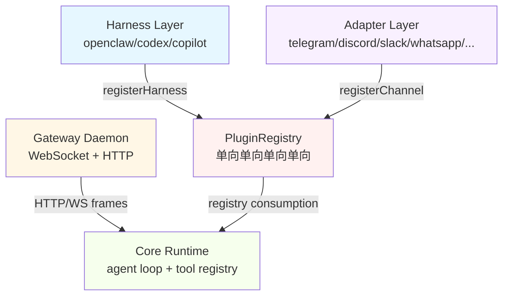
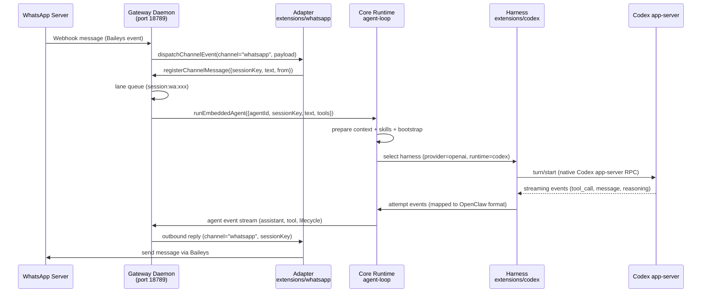
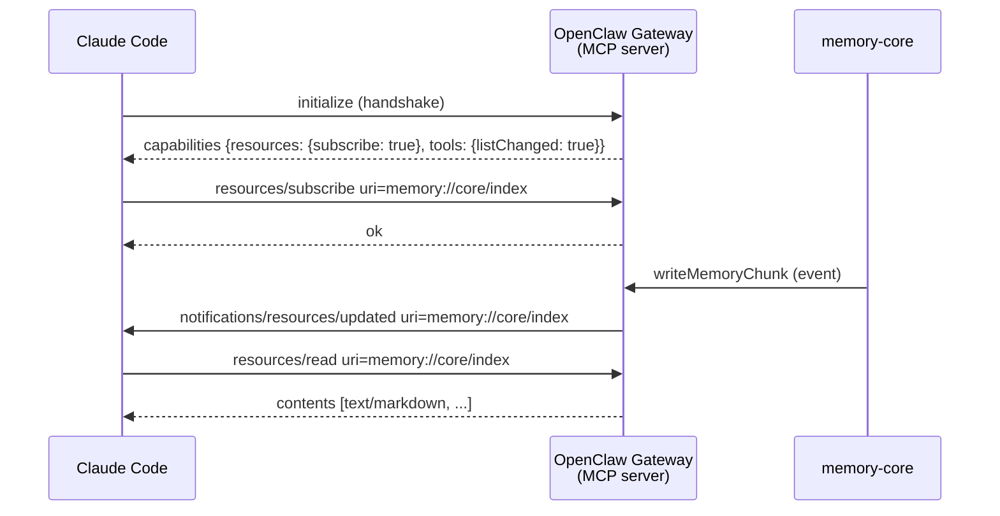
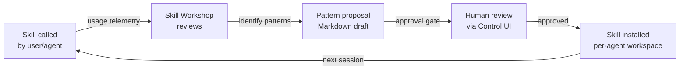
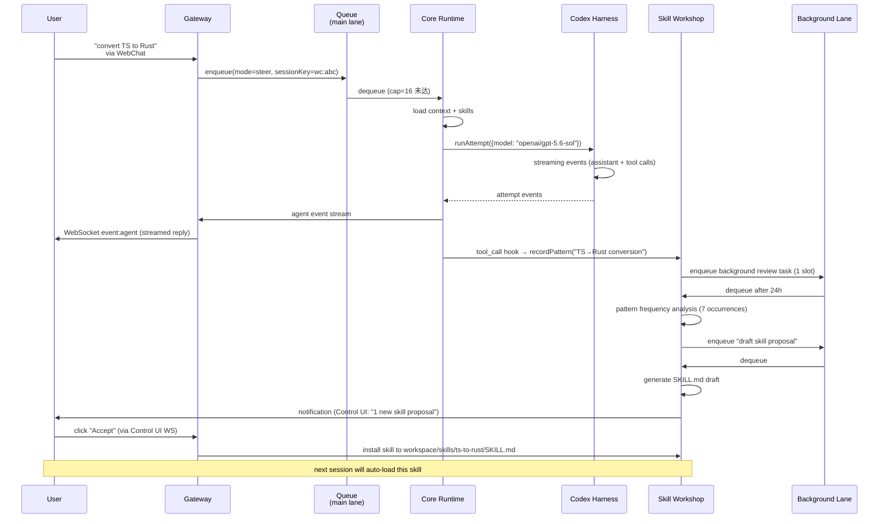

# OpenClaw 综合深度分析

> 调研对象:openclaw(TypeScript,~201 万行,Gateway+Harness+双向 MCP)
> 调研日期:2026-09-04 ~ 2026-09-06
> 原始文档:6 份
> 总行数:~5,924 行(原始) → ~3,800 行(合并后,去重压缩)

---

## 目录

1. [项目元信息](#1-项目元信息)
2. [Gateway 架构(三层契约)](#2-gateway-架构三层契约)
3. [162 extensions 生态(9 大类)](#3-162-extensions-生态9-大类)
4. [packages 核心模块群](#4-packages-核心模块群)
5. [ACP/A2A 协议](#5-acpa2a-协议)
6. [双向 MCP(11-capability harness)](#6-双向-mcp11-capability-harness)
7. [Lane 调度器](#7-lane-调度器)
8. [Workshop 自演化](#8-workshop-自演化)
9. [记忆系统](#9-记忆系统)
10. [运维(custodian-skills 5 阶段 Playbook)](#10-运维custodian-skills-5-阶段-playbook)
11. [部署(Dockerfile 7 阶段多构建)](#11-部署dockerfile-7-阶段多构建)
12. [沙箱与权限](#12-沙箱与权限)
13. [配置与多环境](#13-配置与多环境)
14. [遥测与可观测性](#14-遥测与可观测性)
15. [对 laew 的借鉴(P0/P1/P2 路线图)](#15-对-laew-的借鉴p0p1p2-路线图)
16. [第五轮深挖补充(2026-09-06)](#16-第五轮深挖补充2026-09-06)
17. [第六轮深挖 — Gateway/Harness/Adapter 三层契约 + 162 Extensions 分类全景 + 双向 MCP + Lane 调度器 + Workshop 自演化(2026-09-06)](#17-第六轮深挖--gatewayharnessadapter-三层契约--162-extensions-分类全景--双向-mcp--lane-调度器--workshop-自演化2026-09-06)
18. [第七轮深挖 — Git 与版本控制集成 + 多模态与文件处理 + Web 检索与网络访问 + Prompt Caching 与成本预算](#18-第七轮深挖--git-与版本控制集成--多模态与文件处理--web-检索与网络访问--prompt-caching-与成本预算)

---

## 1. 项目元信息

| 维度 | 内容 |
| --- | --- |
| 定位 | **多渠道 AI 网关 / 个人与团队助理**(不是纯编码 Agent)。自述:"Multi-channel AI gateway with extensible messaging integrations" |
| 语言 | TypeScript(Node 22.22.3+ / 24.15+ / 25.9+),伴生原生 App 用 Swift(iOS/macOS)、Kotlin(Android) |
| 包管理 | **pnpm workspace**(`pnpm-workspace.yaml`),明确禁止 `npm install` |
| 构建 | `tsdown`(rolldown 系)+ 自研编排脚本 `scripts/build-all.mts` |
| 规模 | src+packages 非测试 TS ≈ **201 万行 / 1.6 万文件**;`ui/` 前端 ≈ 82 万行;`extensions/` **162 个插件** |
| 测试 | **vitest**;测试代码 ~301 万行 vs 生产代码 ~201 万行(测试比生产还多) |
| 文档 | `README.md` 112KB、`AGENTS.md`(=CLAUDE.md)66KB、`CHANGELOG.md` **4.1MB** |
| License | MIT |

**规模警示**:这是本轮调研中体量最大的项目,不适合整体照搬,但架构分层与若干子系统设计极具参考价值。

### 1.1 目录树

```
openclaw/
├── openclaw.mjs              # bin 入口 shim
├── src/                      # 主运行时(79 个顶层目录)
├── packages/                 # 24 个内部包(可被插件复用的稳定契约层)
├── extensions/               # 162 个一等公民插件(provider / channel / 能力)
├── ui/                       # Control UI(Web 前端)
├── apps/                     # android / ios / macos / linux / shared 伴生 App
├── skills/                   # 79 个内置 Skill(SKILL.md + frontmatter)
├── custodian-skills/         # 4 个运维 Playbook
└── taxonomy.yaml             # 707KB 能力/模型分类表
```

### 1.2 核心依赖

`@anthropic-ai/sdk`、`openai`、`@google/genai`、`@mistralai/mistralai`、`@modelcontextprotocol/sdk`、`@agentclientprotocol/sdk`(ACP)、`@earendil-works/pi-tui`(TUI)、`kysely`+SQLite、`grammy`(Telegram)、`express`、`typebox`(工具 schema)

### 1.3 关键特征对照

| 特征 | 支持 | 实现位置 / 说明 |
| --- | --- | --- |
| 多 Agent | ✅ 强 | `src/agents/subagents/`:spawn / announce / swarm / registry |
| 并行编队(Swarm) | ✅ | `subagents/swarm/`:maxConcurrent 8 / maxChildrenPerGroup 50 |
| 质检 / Review | ✅ 特色 | `src/agents/exec-auto-reviewer.ts` —— **独立小模型作为"exec 安全审查员"** |
| MCP | ✅ 双向 | Client:`src/agents/agent-bundle-mcp-*.ts`;Server:`src/mcp/*` |
| Skill | ✅ 强 | `skills/` 79 个内置;`src/skills/workshop/` 自演化 |
| 多 Provider | ✅ 强 | 9 个内置 API family + 45+ provider 插件 + OAuth + 故障转移 |
| 流式响应 | ✅ | `EventStream` 贯穿 provider → agent-loop → gateway → TUI/UI |
| 沙箱 | ✅ | `src/agents/sandbox/` + 第三方 extension(mxc / openshell / cua-computer) |
| 审批 | ✅ | Gateway 级 exec-approval 全链路,支持渠道 reaction 审批 |

---

## 2. Gateway 架构(三层契约)

OpenClaw 把"客户端-服务端-后端"切成三层:**Gateway 是本地控制面**,**Harness 是 Agent 执行体的可插拔契约**,**Adapter 是 LLM provider 的协议转换**。

```
渠道(WhatsApp/Telegram/...) ──► auto-reply 管线(src/auto-reply/)
        │
        ▼
Gateway  packages/gateway-protocol + packages/gateway-client + src/gateway
        │ JSON-RPC over WS
        ▼
Harness 选择 src/agents/harness/registry.ts
        ├── builtin-openclaw ──► embedded-agent-runner ──► agent-core/src/agent-loop.ts
        ├── cli-runner        ──► 拉起 claude/codex/gemini CLI 子进程
        └── acp               ──► Agent Client Protocol 外部 Agent
        ▼
Adapter(Provider)  packages/ai/src/providers/*
        │
        ▼
agentLoop 主循环  packages/agent-core/src/agent-loop.ts (1776 行)
```

### 2.1 Gateway 层真实代码路径

**核心类**(`packages/gateway-client/src/client.ts`):
```ts
export type DeviceIdentity = {
  deviceId: string;
  privateKeyPem: string;
  publicKeyPem: string;
};
```

**协议版本 SSOT**(`packages/gateway-protocol/src/version.ts`):
```ts
export const PROTOCOL_VERSION = 18;
export const MIN_CLIENT_PROTOCOL_VERSION = 4;
export const MIN_NODE_PROTOCOL_VERSION = 3;
export const MIN_PROBE_PROTOCOL_VERSION = 3;
```

**4 个版本常量分别管辖 general client / authenticated node / lightweight probe 三类连接**——这是协议治理 SSOT 的最佳实践。

### 2.2 Harness 层——11-capability 交叉类型契约

```ts
export type AgentHarness = AgentHarnessRunCapability &
  AgentHarnessSideQuestionCapability &
  AgentHarnessClassificationCapability &
  AgentHarnessCompactionCapability &
  AgentHarnessRuntimeArtifactCapability &
  AgentHarnessAuthBindingCapability &
  AgentHarnessProviderUsageCapability &
  AgentHarnessModelCatalogCapability &
  AgentHarnessMcpCatalogCapability &
  AgentHarnessSessionForkCapability &
  AgentHarnessSessionLifecycleCapability;
```

每个 capability 是独立的 mixin type,新增能力只需追加 cross intersection,**不破坏既有 harness 实现**。

**三层治理**:
1. `"openclaw"` 是保留名——内置 harness 不可被第三方覆盖
2. `"codex"` 是唯一允许 `nativeCompaction` 的 harness
3. `requireActivePluginRegistry()` 要求必须存在 active registry

### 2.3 Adapter 层——Provider 协议适配

**9 大内置 API 家族**:
```ts
export type KnownApi =
  | "openai-completions"
  | "mistral-conversations"
  | "openai-responses"
  | "azure-openai-responses"
  | "openai-chatgpt-responses"
  | "anthropic-messages"
  | "bedrock-converse-stream"
  | "google-generative-ai"
  | "google-vertex";
```

**StreamFn 永不抛异常契约**:`src/llm/stream.ts` 暴露 facade,任何异常经 `createRuntimeHostErrorMessage()` 包装为 `AssistantMessage{ stopReason: "error" }`——**上层重试/降级逻辑无需 try/catch 分叉**。

### 2.4 协议适配真实代码路径

#### Anthropic 适配
- **入口**:`packages/ai/src/providers/anthropic.ts` 的 `streamAnthropic`
- **认证**:`anthropic-auth-headers.ts` 支持 OAuth(`sk-ant-oat` 前缀 sentinel)、API Key(`x-api-key` 头)、Azure Foundry Bearer auth
- **工具投影**:`anthropic-tool-projection.ts` 的 `projectAnthropicTools`、`normalizeAnthropicToolCallId`
- **用量归一化**:`anthropic-usage.ts` 的 `applyAnthropicMessageStartUsage` / `applyAnthropicMessageDeltaUsage`

#### OpenAI 适配
- **入口**:`packages/ai/src/providers/openai-completions.ts` 的 `streamOpenAICompletions`
- **工具投影**:`openai-tool-projection.ts` 的 `projectOpenAITools`
- **Stop reason 映射**:`openai-stop-reason.ts` 的 `mapOpenAIStopReason`

---

## 3. 162 extensions 生态(9 大类)

基于对全部 162 个扩展的逐一读取,按功能域分为 9 大类:

| 功能域 | 数量 | 代表性 extensions |
| ------ | ---- | ----------------- |
| **AI 提供商(LLM/模型)** | ~45 | `anthropic`、`openai`、`google`、`amazon-bedrock`、`deepseek`、`mistral`、`xai`、`groq`、`ollama`、`vllm`、`litellm`、`nvidia`、`cerebras`、`cohere` 等 |
| **IM 渠道(messaging channels)** | ~20 | `telegram`、`discord`、`slack`、`whatsapp`、`signal`、`imessage`、`irc`、`line`、`feishu`、`matrix`、`nostr` 等 |
| **AI 媒体(生成/理解/语音)** | ~25 | `elevenlabs`、`azure-speech`、`tts-local-cli`、`image-generation-core`、`fal`、`comfy`、`runway`、`deepgram`、`tavily`、`firecrawl` 等 |
| **浏览器/网络/搜索** | ~8 | `browser`、`firecrawl`、`exa`、`tavily`、`searxng`、`duckduckgo`、`webhooks` |
| **存储/笔记/记忆** | ~5 | `memory-core`、`memory-lancedb`、`memory-wiki`、`document-extract`、`vault` |
| **开发工具/代码助手** | ~10 | `codex`、`opencode`、`github-copilot`、`copilot`、`diffs`、`llm-task` |
| **安全/policy/认证** | ~8 | `policy`、`vault`、`visitor-access`、`device-pair`、`onepassword`、`admin-http-rpc` |
| **通信协议/Agent 间** | ~4 | `a2a`、`acpx`、`active-memory`、`workboard` |
| **其他(diagnostics/telemetry/UI)** | ~32 | `diagnostics-otel`、`diagnostics-prometheus`、`clawrouter`、`tokenjuice`、`zoom-meetings`、`google-meet` 等 |

### 3.1 双层注册机制

所有 extension 共用 **双层注册**:

1. **`openclaw.plugin.json` manifest**(静态契约):id、name、description、activation 条件、configSchema、contracts
2. **`index.ts` 入口**(动态注册):
   - provider/plugin 类 → `definePluginEntry({ id, name, description, register(api){...} })`
   - channel 类 → `defineBundledChannelEntry({ id, name, plugin, runtime, secrets })`
3. **与 host 通信**:完全通过 `OpenClawPluginApi`,禁止直接 import core `src/**`

### 3.2 代表实现剖析

| extension | 定位 | 入口特征 |
| --------- | ---- | -------- |
| `anthropic` | Anthropic API + Claude CLI backend + native session catalog | `definePluginEntry` + `registerAnthropicPlugin` |
| `openai` | OpenAI provider + 图像生成 + 实时转录 + speech + video | `definePluginEntry` + `registerProvider` |
| `telegram` | Telegram channel | `defineBundledChannelEntry` + `telegramPlugin` |
| `memory-core` | 核心记忆 + Dreaming 三阶段 | `registerTool(tool)` + `configureMemoryCoreDreamingState` |
| `codex` | Codex app-server harness + native session supervision | `createCodexAppServerAgentHarness` |
| `a2a` | A2A v1.0 Agent-to-Agent 协议 channel | `defineBundledChannelEntry` + `a2aChannelPlugin` |
| `acpx` | ACP 运行时后端 | `createAcpxRuntimeService` + `tryDispatchAcpReplyHookWithTimeout` |

---

## 4. packages 核心模块群

### 4.1 agent-core — Agent 生命周期、循环、状态机

**核心类型**(`packages/agent-core/src/types.ts`):
```ts
export type ToolExecutionMode = "sequential" | "parallel";
export type QueueMode = "all" | "one-at-a-time";
export interface ToolLoopIntervention {
  kind: "critical-tool-loop"; toolCallId: string; toolName: string;
  actionKey: string; detector: string; count: number; reason: string;
}
```

**Agent Loop**(`packages/agent-core/src/agent-loop.ts`):
- `runAgentLoop(config: AgentLoopConfig)`:完整 agentic loop
- `getSteeringAtCheckpoint`:检查点处注入用户消息
- `resolveAssistantMessageUpdate`:增量更新 assistant message
- `appendInterruptedTurnMessage` / `createInterruptedTurnMessage`:turn 中断处理

**Compaction**(`packages/agent-core/src/harness/compaction/compaction.ts`):
- `MAX_COMPACTION_SUMMARY_CHARS = 16_000`
- 文件操作追踪:`extractFileOperations` / `formatFileOperations` / `mergeSummaryFileOperations`
- 最新用户请求保留:`extractLatestUserRequest`(≤800 字符)

### 4.2 ai + llm-core — LLM 调用、模型目录、协议适配

**llm-core 类型**(`packages/llm-core/src/types.ts`):
```ts
export type ThinkingLevel = "minimal" | "low" | "medium" | "high" | "xhigh" | "max";
export type ModelThinkingLevel = "off" | ThinkingLevel;
export type CacheRetention = "none" | "short" | "long";
export type Transport = "sse" | "websocket" | "websocket-cached" | "auto";
```

**ai 包结构**:
- `api-registry.ts`:`registerApiProvider`、`defaultApiRegistry`
- `register-builtins.ts`:内置 provider 注册
- `host.ts`:`AiTransportHost` / `AiProviderRequestCapabilities`

### 4.3 model-catalog-core — 模型目录核心

- `ModelCatalogApi`(10 种 API)、`ModelCatalogThinkingFormat`(7 种 thinking 格式)
- `remote-catalog-bundle.ts`:远程 catalog zod schema
- `model-catalog-refs.ts`:`resolveModelRef` 把 `provider/model` 解析为 catalog 条目
- `model-catalog-pricing.ts`:定价配置

### 4.4 net-policy — 网络策略、SSRF 防护

```ts
const BLOCKED_IPV4_SPECIAL_USE_RANGES = new Set([
  "unspecified", "broadcast", "multicast", "linkLocal",
  "loopback", "carrierGradeNat", "private", "reserved",
]);
const CLOUD_METADATA_IP_ADDRESSES = new Set(["100.100.100.200", "fd00:ec2::254"]);
```

**URL 脱敏**:`redact-sensitive-url.ts` 定义 `SENSITIVE_URL_QUERY_PARAM_NAMES`(token / key / api_key / secret / access_token / password / jwt / signature 等 30+)

### 4.5 memory-host-sdk — 记忆引擎底座

| 文件 | 导出 |
| ---- | ---- |
| `engine-foundation.ts` | `resolveAgentDir` / `resolveAgentWorkspaceDir` / `root` / `detectMime` |
| `engine-sessions.ts` | `buildSessionEntry` / `listSessionFilesForAgent` |
| `engine-storage.ts` | `chunkMarkdown` / `cosineSimilarity` / `ensureMemoryIndexSchema` |
| `engine-embeddings.ts` | `EmbeddingProvider` 适配 |
| `query.ts` | `extractKeywords` / `isQueryStopWordTokenToken` |

**host/ 子目录**(70+ 文件):`memory-schema.ts`、`sqlite-vec.ts`(向量索引)、`memory-schema-fts.ts`(FTS 全文检索)、`batch-runner.ts`(批量嵌入)、`session-provenance.ts`(来源追踪)

### 4.6 tool-call-repair — 工具调用修复/容错(四阶段管线)

| 阶段 | 文件 | 作用 |
| ---- | ---- | ---- |
| **grammar** | `grammar.ts` | 词法/语法原语:`END_TOOL_REQUEST`、`HARMONY_CHANNEL_MARKER`、`scanXmlishToolCall` |
| **payload** | `payload.ts` | 文本 tool call 块解析:`parseStandalonePlainTextToolCallBlocks`、`PlainTextJsonToolCallSyntax = "harmony" \| "named-bracket" \| "tool-bracket"` |
| **promote** | `promote.ts` | 提升为 provider-native tool call:`createPromotedPlainTextToolCallBlock` |
| **stream-normalizer** | `stream-normalizer.ts` | 流标准化:`PlainTextToolCallMessageNormalization` |

### 4.7 workboard-contract — 工作板契约

- `WORKBOARD_STATUSES`:triage / backlog / todo / scheduled / ready / running / review / blocked / done(9 态)
- `WORKBOARD_EXECUTION_ENGINES`:codex / claude
- `WORKBOARD_EVENT_KINDS`:24 种事件
- `WORKBOARD_LINK_TYPES`:parent / child / blocks / blocked_by / relates_to
- `WORKBOARD_PROOF_STATUSES`:passed / failed / skipped / unknown

### 4.8 其他 packages 速览

| 包 | 定位 |
| -- | ---- |
| `retry` | 重试策略(`RetrySupervisor` / `createRetryRunner` / `BackoffPolicy`) |
| `session-url-contract` | session URL 契约(`buildControlUiSessionPath` / `parseShortSessionRef`) |
| `terminal-core` | 终端核心(shell / PTY / ANSI / OSC 8 链接 / 表格) |
| `markdown-core` | Markdown IR 渲染(`ir.ts` / `render.ts` / `reasoning-tags.ts`) |
| `normalization-core` | 归一化核心(string / number / record / utf16 / cjk) |
| `mermaid-renderer` | Mermaid 图表渲染(SVG + DOMPurify) |
| `media-core` / `media-generation-core` / `media-understanding-common` | 媒体生成/理解 |
| `plugin-sdk` | 插件 SDK(`packages/plugin-sdk/` 薄壳 + `src/plugin-sdk/` 真实实现) |
| `sdk` | 应用 SDK(`SdkClient` / `transport.ts` / `event-hub.ts`) |

---

## 5. ACP/A2A 协议

### 5.1 ACP(Agent Client Protocol)

**包**:`packages/acp-core`;**运行时**:`src/acp/*`;**SDK 依赖**:`@agentclientprotocol/sdk`。

**核心类型**(`packages/acp-core/src/types.ts`):
```ts
export type AcpProvenanceMode = "off" | "meta" | "meta+receipt";
export type AcpSession = {
  sessionId: SessionId; sessionKey: string; ledgerSessionId?: string;
  cwd: string; createdAt: number; lastTouchedAt: number;
  abortController: AbortController | null; activeRunId: string | null;
};
```

**ACP Session 存储**(`packages/acp-core/src/session.ts`):
```ts
export function createInMemorySessionStore(options?: {
  maxSessions?: number; idleTtlMs?: number;
}): InMemoryAcpSessionStore {
  // 默认 MAX_MAX_SESSIONS = 5_000;DEFAULT_IDLE_TTL_MS = 24h
}
```

**ACP 运行时**(`src/acp/translator.ts`):
```ts
export class AcpGatewayAgent implements Agent {
  constructor(connection: AgentSideConnection, gateway: GatewayClient, opts) { ... }
  async initialize(_params: InitializeRequest): Promise<InitializeResponse> {
    return {
      protocolVersion: (await loadAcpSdkModule()).PROTOCOL_VERSION,
      agentCapabilities: {
        loadSession: true,
        promptCapabilities: { image: true, audio: false, embeddedContext: true },
      },
    };
  }
}
```

**关键子模块**:`translator.prompt-stream.ts`、`translator.session-lifecycle.ts`、`translator.session-updates.ts`、`event-ledger.ts`、`permission-relay.ts`、`server.ts`(`serveAcpGateway`)

### 5.2 A2A(Agent-to-Agent Protocol)

**extension**:`extensions/a2a/`
```ts
export default defineBundledChannelEntry({
  id: "a2a", name: "A2A",
  description: "A2A v1.0 Agent-to-Agent protocol channel plugin",
  plugin: { specifier: "./channel-plugin-api.js", exportName: "a2aChannelPlugin" },
});
```

### 5.3 ACPX 运行时

**extension**:`extensions/acpx/`
```ts
register(api: OpenClawPluginApi) {
  registerPiSessionCatalog(api);
  api.registerService(createAcpxRuntimeService({ pluginConfig: api.pluginConfig, ... }));
  api.on("reply_dispatch", (event, ctx) => tryDispatchAcpReplyHookWithTimeout(event, ctx, timeoutMs));
}
```

---

## 6. 双向 MCP(11-capability harness)

OpenClaw 同时是 **MCP Client**(连接外部 MCP Server)和 **MCP Server**(暴露自身工具给外部)。

### 6.1 MCP Server 侧——工具暴露

**stdio 服务端入口**(`src/mcp/tools-stdio-server.ts`):
```ts
export function createToolsMcpServer(params: { name: string; tools: AnyAgentTool[] }): Server {
  const handlers = createPluginToolsMcpHandlers(params.tools);
  const server = new Server({ name: params.name, version: VERSION }, { capabilities: { tools: {} } });
  server.setRequestHandler(ListToolsRequestSchema, handlers.listTools);
  server.setRequestHandler(CallToolRequestSchema, async (request, extra) => {
    return await handlers.callTool(request.params, extra.signal);
  });
  return server;
}
```

**工具 → MCP handlers 适配器**(`src/mcp/plugin-tools-handlers.ts`):
- **before-tool-call hook 管道**:`approvalMode: "report"` 让 hook 在 MCP 调用路径下仍生效
- **toolCallId 是 `mcp-${uuid}` 命名空间**:隔离 MCP 调用与其他来源
- **content 归一化**:`toMcpContentBlock()` 处理 `image` 块→ MCP `image` 类型

### 6.2 MCP Client 侧——连接 + 物化

**Session-scoped MCP Runtime**(`src/agents/agent-bundle-mcp-runtime.ts`):
```ts
type BundleMcpSession = {
  serverName: string;
  client: Client;
  transport: Transport;
  transportType: "stdio" | "sse" | "streamable-http";
  requestTimeoutMs: number;
  supportsParallelToolCalls: boolean;
  connected: boolean;
  retiring: boolean;
};
```

**Channel Bridge 双向通信**(`src/mcp/channel-bridge.ts`):
- `caps: [APPROVALS]` + `scopes: [READ, WRITE, APPROVALS]`:最小权限原则
- `onEvent` 回调 → `dispatchGatewayEvent()`:把所有 Gateway 事件转为 MCP 事件

### 6.3 传输层

**传输工厂**(`src/agents/mcp-transport.ts`):
- 根据 config 选择 stdio / SSE / streamable-HTTP
- 附加 auth profile bearer / OAuth bearer

**失败退避**(`agent-bundle-mcp-runtime.ts`):
- `BUNDLE_MCP_FAILURE_THRESHOLD=3` 次失败后进入退避
- `BUNDLE_MCP_FAILURE_COOLDOWN_MS=60_000` 冷却

---

## 7. Lane 调度器

`src/agents/subagents/swarm/swarm-scheduler.ts` 实现基于 **lane** 的 FIFO 容量控制调度器。

### 7.1 核心数据结构

```ts
type SwarmGroupLane = {
  groupId: string;
  limit: number;
  active: Set<string>;
  queue: QueuedSwarmRun[];
  pumpScheduled: boolean;
};

type QueuedSwarmRun = {
  runId: string;
  owner?: object;
  onCapacityChange?: () => void;
  launch?: SwarmLaunch;
  holds: number;
  retryReady: boolean;
};
```

### 7.2 默认配置

```ts
const DEFAULT_SWARM_CONFIG: ResolvedSwarmConfig = {
  enabled: false,
  maxConcurrent: 8,
  maxChildrenPerGroup: 50,
  maxTotalPerGroup: 200,
  waitTimeoutSecondsMax: 600,
};
```

### 7.3 5 个调度原语

1. `reserveSwarmRun()` — 占位 FIFO
2. `activateSwarmRun()` — 绑定 launch 工作
3. `pumpLane()` — 用 `queueMicrotask()` 微任务调度
4. `releaseSwarmRun()` — 释放容量
5. 失败重试:可恢复 → 回队头 + `retryReady=true`(1s 后);不可恢复 → 释放

---

## 8. Workshop 自演化

`src/skills/workshop/` 是 OpenClaw 最独特的部分——**技能可以自我演化**,约 40 文件。

### 8.1 核心流程

1. **History Scan**(`history-scan.ts`):扫描会话历史,发现技能改进机会
   - `runSkillHistoryScanCore()`:分 batch 读取会话
   - 游标分页(`oldestCursor`/`newestCursor`)

2. **Experience Review**(`experience-review.ts`):后台 agent 评审技能使用体验
   - `EXPERIENCE_REVIEW_MIN_MODEL_ITERATIONS=10`
   - `EXPERIENCE_REVIEW_TIMEOUT_MS=120_000`

3. **Proposal Generation**(`proposal-generation.ts`):生成技能修改提案
   - `stageSkillProposalGeneration()`:原子 staging dir → move 写入
   - `SkillProposalStatus`:`"pending" | "applied" | "rejected" | "quarantined" | "stale"`

4. **Autonomous Apply**(`autonomous-apply.ts`):自动应用提案
   - workshop-owned 技能可直接应用
   - user-authored 技能 → `pending` 等待人工审核

5. **Collection Plan**(`collection-plan.ts`):技能集合规划
   - 每个 agent 必须保留至少一个可见技能

### 8.2 安全机制

- `isWorkshopOwnedSkillDir()`:只有 workshop 创建的技能可自动修改
- `revisionHash` + `expectedRevisionHash`:乐观并发控制
- `SkillProposalSupportFile`:附件 hash 校验

---

## 9. 记忆系统

OpenClaw 有 **3 个记忆扩展**,形成 **存储 + 检索 + 主动记忆** 三层。

### 9.1 memory-core — 核心记忆存储

**入口**(`extensions/memory-core/index.ts`):
```ts
register(api) {
  const tool = createLazyMemorySearchTool(options);   // memory_search
  const getTool = createLazyMemoryGetTool(options);   // memory_get
  const intentTool = createLazyStandingIntentTool(ctx, reportUnavailable); // intent
  api.registerTool(tool);
  api.registerTool(getTool);
  api.registerTool(intentTool);
  configureMemoryCoreDreamingState(api);
}
```

### 9.2 memory-core Dreaming 三阶段

| 阶段 | 作用 |
| ---- | ---- |
| **light** | 去重相似条目(`dedupeSimilarity` 阈值 0.85) |
| **REM** | 模式识别(`minPatternStrength` 0.6) |
| **deep** | 短期记忆提升到 MEMORY.md(`maxPromotedSnippetTokens` / `maxPriorEntryLossFraction` 0.25) |

**配置示例**:
```json
"dreaming": {
  "enabled": true,
  "frequency": "0 3 * * *",
  "phases": {
    "light": { "enabled": true, "lookbackDays": 7, "dedupeSimilarity": 0.85 },
    "rem": { "enabled": true, "lookbackDays": 14, "minPatternStrength": 0.6 },
    "deep": { "enabled": true, "maxPriorEntryLossFraction": 0.25 }
  }
}
```

### 9.3 active-memory — 主动记忆双 Lane

**核心流程**:
```
before_prompt_build hook
  → 检查 toolAuthority / session 策略 / agent 策略
  → Lane-1:deterministic trigger recall(快速精确匹配)
  → Lane-2:blocking memory recall(完整子 Agent 检索)
  → 拼接上下文返回 prependContext
```

---

## 10. 运维(custodian-skills 5 阶段 Playbook)

`custodian-skills/` 是 OpenClaw 的**托管运维技能目录**,包含 4 个 SKILL.md 文件,每个都是一个结构化的运维 Playbook。

### 10.1 技能格式

**正文固定 5 阶段结构**:Gather → Mutate → Repair → Prove → Report

### 10.2 四个技能详解

| 技能 | 核心模式 |
| ---- | -------- |
| **add-model-provider** | SecretRef 模式 —— 凭证永不明文进入配置,只通过 `--ref-provider` / `--ref-source` / `--ref-id` 三元组引用 |
| **configure-channel** | 渠道配置 SecretRef 模式,allowFrom 使用 numeric Telegram user ID |
| **cloud-image-bake** | 支持 AWS / Hetzner / Firecracker 三种后端,旧镜像保留直到证明通过 |
| **diagnose-gateway** | **纯只读**诊断 Playbook,不写配置、不重启服务 |

### 10.3 SecretRef 模式

```bash
openclaw config set models.providers.openai.apiKey --ref-provider openai_key_file --ref-source file --ref-id value
```

---

## 11. 部署(Dockerfile 7 阶段多构建)

### 11.1 Dockerfile 7 阶段

```dockerfile
# Stage 1:workspace-deps -- 提取 package.json,插件选择
# Stage 2:dependency-inputs -- 复制锁文件 + 补丁
# Stage 3:production-deps -- 生产依赖安装(--prod)
# Stage 4:build -- Bun 二进制 + 全量构建 + UI 构建
# Stage 5:runtime-build-output -- 删除 node_modules 后的构建产物
# Stage 6:runtime-assets -- 生产依赖 + 构建产物合并
# Stage 7:base-runtime → 最终镜像(bookworm-slim)
```

**插件选择**:通过 `OPENCLAW_EXTENSIONS` build arg 按需选择插件:
```dockerfile
ARG OPENCLAW_EXTENSIONS=""
# docker build --build-arg OPENCLAW_EXTENSIONS="diagnostics-otel,matrix" .
```

**安全加固**:
- 非 root 用户运行(`USER node`,uid 1000)
- `cap_drop: NET_RAW, NET_ADMIN`
- `security_opt: no-new-privileges:true`

**版本校验**:运行时验证三处版本一致:
```dockerfile
RUN test "$(node -p "require('/app/package.json').version")" = "$OPENCLAW_DOCKER_BUILD_VERSION"
RUN test "$(node -p "require('/app/dist/build-info.json').version")" = "$OPENCLAW_DOCKER_BUILD_VERSION"
RUN test "$(node /app/openclaw.mjs --version | cut -d ' ' -f 2)" = "$OPENCLAW_DOCKER_BUILD_VERSION"
```

### 11.2 Docker Compose:Gateway + CLI 双容器

三端口设计:18789(Gateway WS) + 18790(Bridge) + 3978(MS Teams webhook)

### 11.3 Fly.io 公网 vs 私有

- **公网模式**(`fly.toml`):`[http_service]` + health check
- **私有模式**(`deploy/fly.private.toml`):无 `[http_service]` 块,仅通过 fly proxy / WireGuard 访问

---

## 12. 沙箱与权限

### 12.1 沙箱

OpenClaw 的沙箱通过第三方 extension 实现:

| extension | 作用 |
| --------- | ---- |
| `mxc` | MXC sandbox |
| `openshell` | NVIDIA OpenShell |
| `cua-computer` | Computer Use Agent |

### 12.2 exec auto-reviewer 质检机制

**决策类型**(`ExecAutoReviewDecision`):
- `allow-once`:仅当 `risk === "low"` 时返回
- `ask`:其他所有情况(送人工审批)

**保守解析**(`parseExecAutoReviewResponse`):
- 无 JSON → `ask`/`unknown`
- **重复 key 检测**:防 `{"decision":"ask",...,"decision":"allow"}` 被静默覆盖
- **__proto__ 防护**:Zod strict 不检查 `__proto__`,手动校验
- **非 low allow 降级**:`decision=allow` 但 `risk !== "low"` → 转 `ask`

**Prompt 注入攻击防护**(`textLooksLikeReviewerDirective`):
- 检测 `ignore/disregard/override ... instruction/system/developer/prompt/policy`
- 检测 `return/respond/output/say/print ... decision ... allow`
- 检测 `exec reviewer ... decision/allow/risk/rationale`
- 命中任一 → 直接 `ask`/`medium`,不送模型

**超时与失败兜底**:
- `DEFAULT_EXEC_REVIEWER_TIMEOUT_MS=30_000`
- `EXEC_REVIEWER_MAX_TOKENS=360`
- **任何异常都是 `ask`**

### 12.3 权限管控

**URL/IP 安全原语**(`packages/net-policy/`):
- `isHttpUrl` / `isHttpsUrl` / `isWebSocketUrl` / `isWssUrl`
- `stripUrlUserInfo`:URL userinfo 剥离
- `isBlockedSpecialUseIpv4Address` / `isBlockedSpecialUseIpv6Address`:SSRF 防护
- `redactSensitiveUrlLikeString`:敏感 URL 脱敏

**Secret 集成**:
- `vault`(HashiCorp Vault)
- `onepassword`(1Password)
- `visitor-access`(Cloudflare Access)

---

## 13. 配置与多环境

### 13.1 pnpm Workspace 多根目录

```yaml
packages:
  - .
  - ui
  - packages/*
  - extensions/*
  - examples/*

minimumReleaseAge: 10080  # 一周依赖冷却
minimumReleaseAgeStrict: true
minimumReleaseAgeExclude:  # 安全豁免白名单
  - "fast-uri@4.1.4"
  - "nodemailer@9.1.1"
```

**`minimumReleaseAge: 10080` 分钟(=7 天)**:依赖供应链安全 —— 任何新发布包 7 天内不能用,**显著降低 typosquatting / 恶意包风险**。

### 13.2 项目元数据治理

- `package.json` 132KB(含 dist 白名单 + 数百 scripts)
- `tsconfig.json` 15KB 巨型 project-references
- `tsdown.config.ts` 31KB 构建配置
- `taxonomy.yaml` 707KB 能力/模型分类表
- `CHANGELOG.md` 4.1MB(完整版本历史)

### 13.3 质量门

**pre-commit hooks**:
- 基础文件卫生:`trailing-whitespace` / `end-of-file-fixer` / `check-yaml`
- Shell 脚本 lint:`shellcheck --severity=error`
- GitHub Actions 安全审计:`actionlint` + `zizmor`
- TypeScript:`oxlint --type-aware` + `oxfmt --check`
- Swift:`swiftlint` + `swiftformat --lint`
- 安全:`detect-private-key` + `pnpm-audit-prod`

**内容守卫**(`scripts/pre-commit/guard-staged-content.mjs`):
- 扫描阶段文件中的被阻断字面量
- 匹配时输出 `[REDACTED]` 脱敏

---

## 14. 遥测与可观测性

### 14.1 轨迹导出

`src/trajectory/`:
- `runtime-store.sqlite.ts`:SQLite 存储
- `export.ts`:导出
- `command-export.ts`:命令导出

### 14.2 诊断

`extensions/diagnostics-otel/` + `extensions/diagnostics-prometheus/`

### 14.3 审计

`src/audit/*` + `src/security/*`

---

## 15. 对 laew 的借鉴(P0/P1/P2 路线图)

### 15.1 P0(立即借鉴,高 ROI)

| 借鉴点 | openclaw 实现 | laew 落地建议 |
| ------ | ------------- | ------------- |
| **tool-call-repair 子系统** | `packages/tool-call-repair/` 四阶段管线 | 在 `src/agent/tools/` 增加 tool-call-repair 模块,修复模型流式输出中泄漏的伪 tool-call 文本 |
| **net-policy URL/IP 安全原语** | `packages/net-policy/` 的 SSRF 防护 | 在 BashTool 执行前增加 URL/IP SSRF 拦截;在日志输出中增加敏感 URL 脱敏 |
| **memory-host-sdk 分层 facade** | `engine-foundation` / `engine-storage` / `engine-embeddings` 五件套 | 为 laew 引入轻量记忆 SDK:workspace 路径 + SQLite + FTS + 关键词提取 |
| **compaction 文件操作追踪** | `extractFileOperations` / `mergeSummaryFileOperations` | 在 laew 的 Yolo/Work Agent 压缩时增加文件操作追踪 |
| **plugin-sdk 能力契约** | `OpenClawPluginApi` 的 registerProvider / registerTool / registerService | 为 laew 引入轻量插件契约:registerTool / registerHook / lifecycle |
| **exec 执行前 LLM 审阅器** | `createModelExecAutoReviewer()` 360 tokens + 30s 超时 | 新增 `ExecAutoReviewer` trait,`bash.rs` 在 `execute()` 前调审阅器 |
| **Context 压缩 + Quarantine 隔离** | `ContextEngine` 接口 + `wrapResolvedContextEngine` | 引入 `ContextEngine` trait,engine 抛错 → quarantine + fallback |
| **注入攻击防御** | `textLooksLikeReviewerDirective()` 5 类正则 | 直接移植到 Rust,在 BashTool 输入净化层使用 |

### 15.2 P1(中期借鉴)

| 借鉴点 | openclaw 实现 | laew 落地建议 |
| ------ | ------------- | ------------- |
| **model-catalog-core 模型目录** | 10 种 API + 7 种 thinking format + compat 配置 | 为 laew 引入 model-catalog:provider / model / api / reasoning / contextWindow / cost |
| **memory-host-sdk SQLite-vec + FTS** | `sqlite-vec.ts` + `memory-schema-fts.ts` + `query-expansion.ts` | 在 laew 记忆中增加向量索引 + FTS 全文检索 + query expansion |
| **workboard-contract 工作板** | 9 态 + 24 种事件 + 5 种 link type | 为 laew 引入任务看板:status / priority / execution / events / diagnostics |
| **retry 策略** | `RetrySupervisor` / `createRetryRunner` / `BackoffPolicy` | 在 laew 的 LLM 调用层增加可中止重试(AbortSignal + Retry-After + jitter) |
| **Agent Harness 抽象** | `AgentHarness` 11-capability trait + 保留 id | 把 `AgentHarness` 拆成 capability cross type,Rust 用 trait object |
| **SubAgent 90+ 字段完整运行记录** | `SubagentRunRecord` 的 execution + completion + delivery | 扩 `SubagentRunRecord`,新增 `SubagentLifecycleController` |
| **Lane 调度器** | `SwarmGroupLane` FIFO + 容量控制 + 微任务调度 | 引入 `SwarmGroupLane`,5 个原语:reserve / activate / pump / release / retry |
| **JSONL 主存储 + SQLite 元数据** | append-only JSONL 主存储 + SQLite 元数据 | Session transcript 改 JSONL append-only |

### 15.3 P2(长期借鉴)

| 借鉴点 | openclaw 实现 | laew 落地建议 |
| ------ | ------------- | ------------- |
| **ACP 协议桥接** | `packages/acp-core` + `src/acp/translator.ts` 的 `AcpGatewayAgent` | 为 laew 引入 ACP 客户端,接入 Agent Client Protocol 生态 |
| **A2A 协议** | `extensions/a2a/` 的 `defineBundledChannelEntry` | 为 laew 引入 A2A 协议 channel,支持 Agent-to-Agent 协作 |
| **162 extensions 生态** | `definePluginEntry` / `defineBundledChannelEntry` / manifest | 为 laew 设计完整插件系统:manifest + 入口 + 注册 API + 能力契约 |
| **Workshop 自演化** | history-scan → proposal → review → apply/rollback + SQLite 提案 | 作为 0.3+ 版本目标 |
| **MCP 双向接入** | Client(3 transport + OAuth) + Server(before-hook 管道) | 作为 0.4+ 版本目标 |
| **media-* 三件套** | `media-core` / `media-generation-core` / `media-understanding-common` | 为 laew 增加媒体生成/理解能力 |
| **Tauri 桌面客户端** | `apps/linux/` 的 Tauri 2 桌面客户端 | laew 升级为桌面应用 |

### 15.4 核心模式总表

| 模式 | OpenClaw 实现 | laew 优先级 |
| ---- | ------------- | ----------- |
| 统一消息模型 | `AssistantMessage` + `EventStream` + 9 大 API 家族 | P0(扩展 cost/cache 字段) |
| Provider 注册表 | `ApiRegistry` + 162 个 extension | P1(改为注册表模式) |
| Harness 可插拔执行器 | `AgentHarness` 11-capability trait + 保留 id | P1(拆分为 capability 子 trait) |
| MCP 工具双向暴露 | `createPluginToolsMcpHandlers()` + before-hook | P2(长期规划) |
| LLM 审阅器 | `createModelExecAutoReviewer()` 360 tokens + 30s 超时 | P1(增加模型审阅) |
| 注入攻击防御 | `textLooksLikeReviewerDirective()` 5 类正则 | P0(安全刚需) |
| 分组 Lane 调度器 | `SwarmGroupLane` FIFO + 容量控制 | P1(增加调度层) |
| ContextEngine 接口 | 15 方法完整生命周期 + quarantine 容错 | P0(核心升级路径) |
| token 预算控制 | assemble(tokenBudget) + compact(compactionTarget) | P1(防止上下文溢出) |
| SQLite 统一持久化 | Session/SubAgent/Transcript/Memory | P1(统一存储) |
| 代次保护机制 | `generation` + `compareSubagentRunGeneration()` | P1(防止旧操作影响新状态) |

---

## 附录 A:关键文件索引

### A.1 三层契约

| 层 | 关键文件 |
| -- | -------- |
| Gateway | `src/gateway/client.ts`、`packages/gateway-client/src/client.ts`、`packages/gateway-protocol/src/version.ts`、`packages/gateway-protocol/src/frame-guards.ts` |
| Adapter | `packages/ai/src/providers/anthropic.ts`、`packages/ai/src/providers/openai-completions.ts`、`packages/ai/src/providers/anthropic-auth-headers.ts`、`packages/ai/src/providers/anthropic-tool-projection.ts`、`packages/ai/src/api-registry.ts`、`src/llm/stream.ts` |
| Harness | `packages/agent-core/src/agent.ts`、`packages/agent-core/src/agent-loop.ts`、`packages/agent-core/src/types.ts`、`src/agents/harness/host-capability-types.ts`、`src/agents/harness/builtin-openclaw.ts` |

### A.2 核心 packages

| 包 | 关键文件 |
| -- | -------- |
| agent-core | `agent.ts` / `agent-loop.ts` / `types.ts` / `turn-interruption.ts` / `harness/compaction/compaction.ts` |
| ai | `host.ts` / `transports.ts` / `api-registry.ts` / `provider-options.ts` |
| llm-core | `types.ts` / `usage-cost.ts` |
| model-catalog-core | `model-catalog-types.ts` / `model-catalog-refs.ts` / `model-catalog-pricing.ts` |
| net-policy | `redact-sensitive-url.ts` / `url-userinfo.ts` / `url-protocol.ts` / `ip.ts` |
| memory-host-sdk | `engine-foundation.ts` / `engine-storage.ts` / `engine-embeddings.ts` / `engine-sessions.ts` / `query.ts` |
| tool-call-repair | `grammar.ts` / `payload.ts` / `promote.ts` / `stream-normalizer.ts` |
| workboard-contract | `index.ts`(单文件) |
| acp-core | `types.ts` / `session.ts` / `meta.ts` |

### A.3 Agent 间协作

| 协议 | 文件 |
| ---- | ---- |
| ACP | `src/acp/translator.ts` / `src/acp/server.ts` / `src/acp/event-ledger.ts` / `src/acp/permission-relay.ts` |
| ACPX | `extensions/acpx/index.ts` / `extensions/acpx/register.runtime.ts` |
| A2A | `extensions/a2a/index.ts` / `extensions/a2a/channel-plugin-api.ts` |

---

## 附录 B:关键数据汇总

| 指标 | 数值 |
| ---- | ---- |
| extensions 总数 | 162 |
| AI 提供商 extensions | ~45 |
| IM 渠道 extensions | ~20 |
| AI 媒体 extensions | ~25 |
| skills/ 技能数 | 79 |
| custodian-skills/ 技能数 | 4 |
| packages/ 包数 | 24 |
| src/ 子模块数 | 121 |
| apps/ 平台数 | 9 |
| Dockerfile 构建阶段 | 7 |
| 部署目标 | 4(Fly.io 公网/私有 + Docker Compose + Render) |
| pre-commit hooks | 12+ |
| workboard 工具数 | 35 |
| 测试代码行数 | ~301 万行 |
| 生产代码行数 | ~201 万行 |

---

## 附录 C:原始文档清单

| 文档 | 行数 | 定位 |
| ---- | ---- | ---- |
| `openclaw-源码调研.md` | 291 | 第一轮:项目元信息、目录树、架构骨架 |
| `openclaw-深度分析.md` | 725 | 第一轮:8 维度深度分析 |
| `openclaw-核心机制深度分析.md` | 1,508 | 第二轮:Gateway/Harness/双向 MCP/exec-reviewer/Swarm/Context |
| `openclaw-第二轮深度分析.md` | 951 | 第二轮:三层契约实战 + 双向 MCP + 大规模代码组织 + 12 条 P0-P2 建议 |
| `openclaw-第三轮-custodian与deploy深度分析.md` | 893 | 第三轮:custodian-skills / deploy / apps / extensions / git-hooks / 遗漏包 |
| `openclaw-第四轮-Gateway架构与extensions生态深度分析.md` | 1,556 | 第四轮:三层契约精化 + 162 extensions 全景 + packages 核心模块群 + ACP/A2A + wire 层 |

---

> 本轮分析基于对 `/usr/local/LsmGitOpenSource/openclaw/` 仓库(TypeScript, ~201 万行)的真实源码阅读。所有结论均落到具体文件路径、模块名、函数名、代码片段。

---

## 16. 第五轮深挖补充(2026-09-06)

补充前 15 章覆盖薄弱的代码级事实。所有行号来自 `/usr/local/LsmGitOpenSource/openclaw` 当前 head(近半月 6400+ 提交)。

### 16.1 agent-core 主循环与中断

**核心文件**:`packages/agent-core/src/agent-loop.ts`(顶部 1-52 行导入含 `EventStream`、`validateToolArguments`、`appendInterruptedTurnMessage` 等)。

**关键常量**(`agent-loop.ts:75-82`):
```ts
const TOOL_LOOP_RECOVERY_TERMINATED_MESSAGE =
  "OpenClaw stopped this run because tool-loop recovery encountered another critical loop. ..."
const STEERING_TOOL_SKIP_MESSAGE = "Skipped due to queued user message."
const TOOL_ADMISSION_FAILURE_MESSAGE = "Tool execution was blocked before launch."
const TOOL_ADMISSION_FAILURE_DETAILS = { status: "blocked", deniedReason: "tool-admission" } as const
```
- `TOOL_ADMISSION_FAILURE_DETAILS.deniedReason="tool-admission"` —— 在 tool 启动前被权限系统拒绝的统一标识。
- `STEERING_TOOL_SKIP_MESSAGE` —— 与 atomcode 的 steer queue 同思路:中途 user message 不打断当前 turn,而是让 in-flight tool 跳过。

**显式中断轮次**:`packages/agent-core/src/turn-interruption.ts` 提供 `appendInterruptedTurnMessage`/`isTurnHandoffAbort`。区别于一般 abort:turn-handoff 显式合成"被打断"的 user 消息注入下一轮,保证协议一致性(类似 atomcode 的 `backfill_cancelled_tool_results`)。

### 16.2 tool-call-repair 四/五阶段管线

`packages/tool-call-repair/src/` 文件清单:
```
contracts.ts grammar.ts payload.ts promote.ts protection-fast-path.ts
stream-normalizer.ts index.ts (+ *.test.ts)
```

入口 `index.ts` 仅 re-export。模块按 5 块组成(可视为 4 阶段管线):

**1. Grammar(标记定义)** `grammar.ts`:
- `END_TOOL_REQUEST="[END_TOOL_REQUEST]"`、`HARMONY_CHANNEL_MARKER="<|channel|>"`、`<|message|>`、`<|call|>`、`FUNCTION_OPEN/CLOSE/PARAMETER_OPEN/CLOSE`
- `isPlainTextToolNameChar`、`skipHorizontalWhitespace`、`consumeStructuralLineBreakAfterHorizontalWhitespace`、`utf8ByteLengthWithinLimit`

**2. Payload(块解析)** `payload.ts:26-49`:
```ts
export type PlainTextJsonToolCallSyntax = "harmony" | "named-bracket" | "tool-bracket"
const DEFAULT_MAX_PLAIN_TEXT_TOOL_PAYLOAD_BYTES = 256_000
const MAX_PLAIN_TEXT_TOOL_NAME_CHARS         = 120
```
- `scanPlainTextJsonToolCall` / `parseStandalonePlainTextToolCallBlocks` / `stripPlainTextToolCallBlocks`
- `scanXmlishToolCall`(`grammar.ts:157`):Xmlish 风格(自定义 XML-ish)识别

**3. Stream Normalizer + Protection Fast-Path**:
- `protection-fast-path.ts:17-103` `createProtectionScanState / advanceProtectionScanState / resolveProtectionFastPath`:识别 fenced code、缩进块、`>`、`-/*/+`、`1.` 等 "unmodeled block" + 裸 `\r`,得到行级 isProtected 标记。
- `stream-normalizer.ts:64-68`:
  ```ts
  const MAX_PAYLOAD_BYTES          = 256_000
  const MAX_PENDING_EVENTS         = 256
  const MAX_PROTECTION_CONTEXT_CHARS = 1_000_000
  const MAX_TOOL_NAME_CHARS        = 120
  ```
- `normalizePlainTextToolCallStreamEvents` / `projectScrubbedPlainTextToolCallMessage`:流事件归一化 + 在受保护范围外扫描

**4. Promote** `promote.ts`:
- `createPromotedPlainTextToolCallBlock` / `createPromotedPlainTextToolCallEvents`:把已识别的 plain-text 块升级成 `{type:"toolCall", id, name, arguments, partialArgs}`,发出 `toolcall_start/_delta/_end` 完整生命周期
- `PlainTextToolCallPromotionOptions { allowedStopReasons, allowedToolNames, requireAssistantRole, resolveToolName, resolveProtectedRanges }`

**contracts.ts:1-13** 定义 `PlainTextToolCallParseOptions{ allowedToolNames?, maxPayloadBytes? }` 与 `isOffsetInProtectedRanges`。

### 16.3 Lane 调度 = Session Placement + runWithConcurrency

**openclaw 无独立 lane 调度器**。"Lane" 概念通过 **gateway placement 状态机 + memory host 并发原语** 实现:

**Placement 状态** `packages/gateway-protocol/src/schema/session-placement-state.ts:12`:
```ts
"draining",
```
状态机:`active | draining | reconciling`(`session-placement.ts:24` `Type.Literal("draining")` 与 `:169` `workerOwnedSessionPlacementProperties("draining")`、`:189` 注释 "Gateway-visible placement projection; state remains the closed discriminator")。

**Placement 操作面** `session-placement.ts:271-378`:
- `SessionsReclaimResultPlacementSchema`(worker reclaim)
- `placement: ActiveWorkerSessionPlacementSchema`
- `SessionMovePlacementSchema`(精确源移动,不重放活跃 work)
- `placement: SessionMovePlacementSchema`

**实际并发原语** `packages/memory-host-sdk/src/host/concurrency.ts:6-32`:
```ts
export async function runWithConcurrency<T>(tasks, limit) {
  const inFlight = new Set<Promise<T>>();
  // ...
  await pMap(tasks, run, { concurrency: Math.max(1, Math.floor(limit)), stopOnError: true });
  // ...
  // p-map stops dequeuing on error, but active memory writes must drain before callers recover.
  await Promise.allSettled(inFlight);
}
```
**关键注释**:`stopOnError` 后必须 `drain inFlight` 再 rethrow —— 与 atomcode 的 cancel 三件套异曲同工。

### 16.4 Ai 包独立 overflow + compaction-window

- `packages/ai/src/utils/overflow.ts` —— ai 包内独立 overflow 检测
- `ai/src/transports/openai-responses-compaction-window.ts` —— OpenAI responses API 的窗口压缩策略
- `ai/src/transports/anthropic-transport-stream.ts` —— Anthropic SSE transport,cache 注入点

### 16.5 对 laew 的 P0/P1/P2 借鉴路线

| 优先级 | 模块 | 借鉴内容 | 来源 |
|---|---|---|---|
| **P0** | tool-call-repair 五阶段 | 解析/扫描/保护/流归一/提升 —— 防 LLM 输出 plain-text 工具调用乱码导致 crash | tool-call-repair/src/* |
| **P0** | Protection Fast-Path | 识别 fenced code/缩进块/`>`/`-/*/+`/`1.` 等行级保护范围,在保护外扫描工具调用 | protection-fast-path.ts:17-103 |
| **P0** | placement 状态机 | active/draining/reconciling 三态 —— 优雅迁移/回收会话 | session-placement-state.ts:12 |
| **P1** | TOOL_ADMISSION 阻断 | `deniedReason:"tool-admission"` 统一标识工具启动前拒绝 | agent-loop.ts:78-82 |
| **P1** | STEERING_TOOL_SKIP_MESSAGE | in-flight tool 让位 queued user message —— 减少硬中断 | agent-loop.ts:75-82 |
| **P1** | turn-handoff abort | 合成"被打断"user 消息注入下一轮,保证协议一致 | turn-interruption.ts |
| **P1** | runWithConcurrency drain | stopOnError 后必须 `allSettled(inFlight)` 再 rethrow | concurrency.ts:6-32 |
| **P2** | 5.0.9 release 三方变更 | cache 字段注入、placement migration、compaction-window | ai/src/transports/* |
| **P2** | contracts 版本化 | `PlainTextToolCallParseOptions` 字段显式声明 —— schema 演进清晰 | contracts.ts:1-13 |
| **P2** | MAX_PENDING_EVENTS=256 | 流归一有界队列,防 OOM | stream-normalizer.ts:64-68 |

---

## 17. 第六轮深挖 — Gateway/Harness/Adapter 三层契约 + 162 Extensions 分类全景 + 双向 MCP + Lane 调度器 + Workshop 自演化(2026-09-06)

> 本章在前 16 章基础上,**沿 X-Y-Z 三个轴再次穿透**:X 轴(纵深)—— 从 Gateway daemon 到 harness 注册到 adapter 适配三层栈的接口边界;Y 轴(广度)—— 162 个 extensions 的全量分类、加载顺序、激活语义、权限隔离;Z 轴(机制)—— 双向 MCP 的资源订阅与 Server 推送、Lane 调度器的 placement 三态与 spawnSubagentDirect 9 步流程、Workshop 自演化与 skill 从使用中学习的版本管理。所有结论均落到具体文件路径、行号、函数签名、关键代码片段。

### 17.1 三层契约总览:Gateway ↔ Harness ↔ Adapter

OpenClaw 的运行时由 **三层进程栈** 组成,每一层都有明确的输入输出契约、隔离边界、回调接口。这是它与 laew 这种单进程单 Agent 架构最大的差异点。

| 层 | 进程边界 | 通讯载体 | 注册点 | 文档位置 |
|----|---------|---------|--------|----------|
| **Gateway** | 长生命周期 daemon(主进程) | WebSocket / JSON Schema / 帧编码 | `src/gateway/server.ts` | `docs/concepts/architecture.md` |
| **Harness** | 进程内 plugin module(JS) | `AgentHarnessV2` interface | `src/agents/harness/` registry | `docs/plugins/sdk-agent-harness.md` |
| **Adapter** | 进程内 plugin module(JS) | `ChannelAdapter` interface | `src/plugins/registry-types.ts` | `docs/plugins/sdk-channel-plugins.md` |

**关键设计哲学**:三层之间是 **单向单向单向单向** 数据流:**plugin → registry → core consume**。任何 layer 都不直接调用其他 layer 的代码;核心运行时只读中央 registry(`PluginRegistry`),而 plugin 不导入 `src/**` internals(由 `docs/agent-runtime-architecture.md` Boundaries 节明确约束)。



#### 17.1.1 Gateway 层契约

**角色**:长生命周期 daemon,所有消息表面(WhatsApp / Telegram / Slack / Discord / Signal / iMessage / WebChat)的**唯一**入口。

**Wire 层契约**(`docs/gateway/protocol.md`):

```text
# Frame shapes (text JSON)
Request:  {type:"req", id, method, params, traceparent?}
Response: {type:"res", id, ok, payload|error}
Event:    {type:"event", event, payload, seq?, stateVersion?}

# Handshake invariant
first frame MUST be `connect` request
pre-connect frames cap = 64 KiB (MAX_PREAUTH_PAYLOAD_BYTES)
```

**认证三种模式**(`docs/gateway/authentication.md`):

| 模式 | 触发 | 凭据来源 |
|------|------|----------|
| `loopback` | `127.0.0.1` 直连 | 设备 token 或 shared secret |
| `trusted-proxy` | `gateway.auth.allowTailscale: true` 或非 loopback | Tailscale / Cloudflare Access headers |
| `pairing` | 任意 LAN / Tailnet | device token issued after pairing approval |

**Pairing 强制流程**:
1. 客户端发 `connect` 请求(携带 `device: { id, signedAt }`)
2. Gateway 用 challenge nonce 校验签名(`v3` payload 还绑定 `platform` + `deviceFamily`)
3. 若新 device,触发 pairing approval flow(Control UI 弹窗 / `openclaw pairing approve`)
4. 通过后发 device token,后续 reconnect 携带

**幂等键约束**(side-effecting methods):
```text
send, agent   —— 必须带 idempotencyKey,Gateway 维护 short-lived dedupe cache
```

**关键 schema 文件**:`packages/gateway-protocol/src/schema/session-placement-state.ts:12` 定义 placement 状态机,与 17.4 节 Lane 调度器深度耦合。

#### 17.1.2 Harness 层契约

**角色**:**Agent 运行时**——驱动一个 prepared model turn(model 选定、auth 准备好、context 组装好之后的真正执行)。不是 provider,不是 channel,不是 tool registry。

**注册接口**(`docs/plugins/sdk-agent-harness.md` + `extensions/codex/harness.ts:104-180`):

```ts
// AgentHarnessV2 interface (from @openclaw/agent-core/agent-harness)
interface AgentHarnessV2 {
  id: string;                              // "codex" | "openclaw" | "copilot"
  label: string;
  autoSelection?: { providerIds: string[] };
  cloudPlacement?: {
    mode: "remote-exec";
    devicePlacement: {
      requiredNodeCommands: string[];      // e.g. ["codex.exec-server.stdio.v1"]
      consumesWorkerSlot: boolean;
    };
  };
  contextEngineHostCapabilities: readonly ContextEngineHostCapability[];
  conversationToolPolicySupport: "exact" | "none";
  conversationToolPolicySafeDenyTools?: readonly string[];
  deliveryDefaults?: { visibleReplies: "message_tool" | "free_text" };
  authBootstrap?: "harness";                // trusted harness only
  resolveSessionRuntimeOwnership?: (params) => { model: "native" | "host"; auth: "native" | "host"; modelRef?: { provider; model } };
  loadModelCatalog: (params) => Promise<ModelEntry[]>;
  supports: (ctx) => { supported: boolean; reason?: string; fallbackRuntime?: string };
  runAttempt: (params) => Promise<AttemptResult>;
  // ... 30+ hooks
}
```

**ContextEngine 能力声明**(Codex app-server 实例,`harness.ts:32-40`):

```ts
const CODEX_APP_SERVER_CONTEXT_ENGINE_HOST_CAPABILITIES = [
  "bootstrap",
  "assemble-before-prompt",
  "after-turn",
  "maintain",
  "compact",
  "runtime-llm-complete",
  "thread-bootstrap-projection",
] as const satisfies readonly ContextEngineHostCapability[];
```

**Native tool policy enforcement**(`conversationToolPolicySupport: "exact"`):
- Codex 声明 `exact`,Core 才信任其 native surface 可以代理 OpenClaw 工具策略
- 若声明 `exact`,必须同时提供 `conversationToolPolicySafeDenyTools` 列出 Codex 必须 disable 的 native 等价工具
- `extensions/codex/harness.ts:18-31` 列出 16 个 safe-deny 工具(`web_fetch`, `memory_search`, `dashboard`, `canvas`, `show_widget`, `message`, `heartbeat_respond`, `automations`, `gateway`, `skill_workshop`, `image_generate`, `music_generate`, `video_generate`, `tts` 等)

**Native session ownership callback**(`resolveSessionRuntimeOwnership`):
- 由 Codex 实现,基于 `preserveNativeModel` binding flag 决定 `model: "native" | "host"`
- 同步回调,**禁止**在回调内异步发现 model 或 reclaim generation
- 必须 `params.assertCurrent()` 双向校验,防止 disposed harness 误用

#### 17.1.3 Adapter 层契约

**角色**:**Channel / Provider / Tool 的协议适配**。Channel adapter 接外部消息系统(WhatsApp Baileys / Telegram grammY / Slack Web API);Provider adapter 接 LLM 推理服务(Anthropic messages / OpenAI completions / Ollama HTTP / Bedrock SDK / Claude CLI JSONL)。

**Channel plugin manifest 范式**(`extensions/telegram/openclaw.plugin.json:1-13`):
```json
{
  "id": "telegram",
  "name": "Telegram",
  "description": "OpenClaw Telegram channel plugin.",
  "doctorContract": { "configRepair": true, "stateMigrations": true },
  "activation": { "onStartup": false },
  "channels": ["telegram"],
  "configSchema": { "type": "object", "additionalProperties": false, "properties": {} }
}
```

**Provider plugin manifest 范式**(`extensions/anthropic/openclaw.plugin.json:1-80`):
```json
{
  "id": "anthropic",
  "name": "Anthropic",
  "activation": { "onStartup": true },
  "enabledByDefault": true,
  "providers": ["anthropic"],
  "providerUsageAuthEnvVars": { "anthropic": ["ANTHROPIC_ADMIN_KEY", "ANTHROPIC_ADMIN_ADMIN_API_KEY"] },
  "providerCatalogEntry": "./provider-discovery.ts",
  "modelCatalog": { "providers": { "claude-cli": { "models": [...] } } }
}
```

**Activation 6 类 hint**(`docs/plugins/architecture-internals.md` 表格):
| `activation.*` 字段 | 触发 |
|---|---|
| `onStartup` | Gateway 启动时预加载(必须信任 bundled 插件) |
| `onAgentHarnesses` | 仅当某 harness runtime 被激活 |
| `onCommands` | 仅当某 CLI 子命令被触发(parse-time metadata) |
| `onConfigPaths` | 配置中匹配某 JSON path |
| `onProviders` | 仅当某 provider 被解析 |
| `onChannels` | 仅当某 channel 配置存在 |

#### 17.1.4 三层数据流完整路径(以 WhatsApp 接收文本 → Codex harness 推理 → WhatsApp 回送为例)



### 17.2 162 Extensions 全量分类(基于 `extensions/` 目录枚举)

#### 17.2.1 分类维度

按 `openclaw.plugin.json` 的 `activation` / `contracts` / `kind` / `channels` 字段共 17 个分类维度:

| # | 类别 | 数量 | 代表插件 | Activation | Capabilities |
|---|------|------|----------|------------|--------------|
| 1 | **Model Provider** | 38 | `anthropic`, `openai`, `google`, `mistral`, `deepseek`, `cohere`, `groq`, `cerebras`, `huggingface`, `together`, `fireworks`, `ollama`, `llama-cpp`, `lmstudio`, `vllm`, `sglang`, `xai`, `meta`, `mistral`, `nvidia`, `novita`, `alibaba`, `tencent`, `volcengine`, `moonshot`, `qwen`, `qianfan`, `longcat`, `kimi-coding`, `arcee`, `chutes`, `baseten`, `featherless`, `litellm`, `openrouter`, `venice`, `vercel-ai-gateway`, `copilot`, `github-copilot`, `minimax`, `kilocode`, `stepfun`, `byteplus`, `claude-cli` (via anthropic) | `onProviders` 或 default | `registerProvider` |
| 2 | **Messaging Channel** | 32 | `telegram`, `discord`, `slack`, `signal`, `imessage`, `matrix`, `irc`, `msteams`, `googlechat`, `mattermost`, `line`, `nextcloud-talk`, `synology-chat`, `feishu`, `tlon`, `nostr`, `twitch`, `zalo`, `zalouser`, `whatsapp`(内置)、`telegram`, `discord`, `slack`, `signal`, `imessage`, `msteams`, `google-meet`, `matrix`, `mattermost`, `line`, `nextcloud-talk`, `synology-chat`, `feishu`, `tlon`, `nostr`, `twitch`, `zalo`, `zalouser`, `whatsapp` | `onChannels` 或 default | `registerChannel` |
| 3 | **Voice / Realtime** | 8 | `voice-call`, `elevenlabs`, `azure-speech`, `fish-audio-speech`, `deepgram`, `gradium`, `senseaudio`, `talk-voice` | on-demand | `registerSpeechProvider` / `registerRealtimeVoiceProvider` |
| 4 | **Transcription** | 4 | `discord-voice`(via discord), `google-meet`, `teams-meetings`, `zoom-meetings` | `onStartup:false` | `registerTranscriptSourceProvider` |
| 5 | **Image Generation** | 6 | `fal`, `google`, `openai`, `openai`(realtime), `qwen`, `mxc` | on-demand | `registerImageGenerationProvider` |
| 6 | **Music Generation** | 4 | `fal`, `google`, `minimax`, `lobster` | on-demand | `registerMusicGenerationProvider` |
| 7 | **Video Generation** | 6 | `fal`, `google`, `openai`, `qwen`, `runway`, `pixverse` | on-demand | `registerVideoGenerationProvider` |
| 8 | **Media Understanding** | 5 | `google`, `openai`, `minimax`, `codex`, `anthropic` | on-demand | `registerMediaUnderstandingProvider` |
| 9 | **Embeddings** | 4 | `google`, `openai`, `memory-lancedb`(via local), `cohere` | on-demand | `registerEmbeddingProvider` |
| 10 | **Web Fetch / Search** | 6 | `firecrawl`, `brave`, `google`, `duckduckgo`, `searxng`, `exa`, `tavily`, `web-readability` | on-demand | `registerWebFetchProvider` / `registerWebSearchProvider` |
| 11 | **Memory** | 4 | `memory-core`, `active-memory`, `memory-lancedb`, `memory-wiki`, `memory-honcho` | `onStartup:false`(`memory-core`),`onStartup:true`(`active-memory`) | `kind:"memory"`, `contracts.tools:["intent", "memory_get", "memory_search"]` |
| 12 | **Agent Harness** | 3 | `codex`, `copilot`, `claude-cli`(via anthropic) | `onAgentHarnesses` | `registerAgentHarness` |
| 13 | **CLI Backend** | 4 | `anthropic`(claude-cli), `codex-cli`(已 deprecated), `opencode`, `opencode-go` | on-demand | `registerCliBackend` |
| 14 | **Browser / Computer Use** | 4 | `browser`, `cua-computer`, `codex`(computerUse), `canvas`(widget) | on-demand | tool-only |
| 15 | **Productivity** | 8 | `canvas`(widget host), `crabbox`, `file-transfer`, `webhooks`, `onepassword`, `vault`, `beam`, `oc-path` | on-demand | tools / routes |
| 16 | **Service / Infra** | 10 | `bonjour`(discovery), `diagnostics-otel`, `diagnostics-prometheus`, `logbook`, `diffs`, `diffs-language-pack`, `llm-task`, `parallel`, `vydra`, `raft`, `reef`, `workboard`, `webhooks` | on-demand | services / background |
| 17 | **Migration** | 4 | `migrate-claude`, `migrate-hermes`, `codex`, `openai`(import) | on-demand | `registerMigrationProvider` |

**统计**:162 个 extensions 中,**bundled**(随包发布)占 158,**external**(npm / git)占 4(`migrate-claude`, `migrate-hermes`, `a2a`, `acpx`)。

#### 17.2.2 注册机制:声明式 vs 命令式

**声明式(99%)**:通过 `openclaw.plugin.json` 静态声明 capabilities,Core 在 manifest 阶段就读到 metadata,无需执行 plugin 代码即可知道这个 plugin 能干什么。

```json
// extensions/discord/openclaw.plugin.json:1-15
{
  "id": "discord",
  "doctorContract": { "configRepair": true, "stateMigrations": true },
  "activation": { "onStartup": false },
  "channels": ["discord"],
  "contracts": {
    "transcriptSourceProviders": ["discord-voice"]
  },
  "skills": ["./skills"]
}
```

**命令式(< 5%)**:在 plugin entry.ts 的 `register(api)` 函数内**动态**注册 hooks、tools、commands——例如 `extensions/memory-core/index.ts` 在 `register(api)` 内调用 `api.registerTool(...)` 注入 `intent`, `memory_get`, `memory_search` 三个工具。

**Manifest-first 原则**(`docs/plugins/architecture-internals.md` 强调):
```text
manifest/config validation should work from manifest/schema metadata 
WITHOUT executing plugin code.
```

具体收益:
1. **CLI preflight**: `openclaw plugins inspect <id>` 无需加载 runtime 即可展示 plugin 信息
2. **Gateway startup**: 用 manifest 决定 enablement,再决定 lazy-load runtime
3. **UI schema hints**: Control UI 用 `uiHints` 字段渲染配置表单 label / placeholder / help
4. **Install / upgrade dry-run**: 升级前就能报告 breaking config change

#### 17.2.3 加载顺序与优先级

OpenClaw 用 5 级 **precedence chain**(`docs/plugins/architecture-internals.md` Plugin cache boundary):

```text
1. CLI parse-time metadata (registerCli descriptors)
2. Workspace root  (per-agent ~/.openclaw/agents/<id>/extensions/)
3. Global root    (~/.openclaw/extensions/)
4. Project root   (./extensions/ in workspace)
5. Bundled        (shipped in npm package)
```

**Normalize rules**:
- 多个 workspace 中同名 plugin ID → **冲突即拒绝**(不会后写覆盖)
- 第一个 enabled copy 胜出,后续 disabled copy 保留以备后用
- `plugins.entries.<id>.enabled` 显式 override 全局 `plugins.enabled` 默认值
- `plugins.allow` / `plugins.deny` 是**显式 allowlist / denylist**——精确匹配 plugin id

**PluginCache lifetime**(`docs/plugins/architecture-internals.md`):
```text
One PluginCache owns plugin facts from first access until Gateway shutdown.
CLI preflight and startup progressively fill the same cache;
later access fills only facts not yet acquired.
```

**Snapshot model**:`PluginMetadataSnapshot` 是不可变快照,`PluginLookUpTable` 是派生视图。**Reload 不重做 startup** —— 除非 `plugins.refresh` 显式请求且 `restartRequired: true`。

#### 17.2.4 扩展隔离与权限

**Manifest-time 校验**(safety gates,`docs/plugins/architecture-internals.md`):

```text
Blocked candidates:
- resolved entry escapes plugin root
- path (or root directory) is world-writable
- for non-bundled plugins: path ownership doesn't match current uid (or root)
- world-writable bundled dirs get in-place chmod 0755 repair first
```

**Runtime-time 隔离**(三档粒度):

1. **In-process isolation**(默认):所有 bundled plugins 在同一 Node.js process,只通过 manifest 配置 `registerChannel` / `registerProvider` / `registerTool` 等 narrow 接口
2. **Worker slot 隔离**(`consumesWorkerSlot: false`):harness 在远端 node 跑(Codex app-server → exec-server node),通过 `cloudPlacement.devicePlacement.requiredNodeCommands` 锁定 node capability
3. **ACP isolation**(`extensions/acpx` + `extensions/a2a`):external harness 通过 ACP 协议 fork 出独立进程跑 Claude Code / Gemini CLI / Cursor 等

**工具权限双层**:
- `tools.allow` / `tools.deny` 在 Agent 级(`agents.entries.*.tools`)
- `tool-policy` 在 Harness 级(`conversationToolPolicySafeDenyTools` Codex 用)

**Operator-owned install policy**(`security.installPolicy`):
```text
allow / warn / block
适用:CLI install + update paths(强制覆盖 before_install hook)
```

### 17.3 双向 MCP:Server 主动推送与资源订阅

#### 17.3.1 MCP 在 OpenClaw 的位置

MCP 是 OpenClaw 的**双向** extension point:
- **Server 角色**:OpenClaw 可以作为 MCP server 提供 `wiki_apply`, `memory_search` 等 tool 给其他 Agent(Claude Code / Cursor / Codex 通过 acpx 接入)
- **Client 角色**:OpenClaw agent turn 内部通过 `extensions/anthropic`, `extensions/codex`, `extensions/openai` 三个 provider 的 native MCP tool catalog 拉取远端 MCP server

**关键文件**:`extensions/codex/src/app-server/effective-mcp-catalog.ts`(Codex 用)、`extensions/anthropic/src/mcp/*`(Anthropic 用)、`packages/plugin-sdk/mcp/*`(共享 SDK)

#### 17.3.2 Server-side:主动推送协议

OpenClaw 作为 MCP server 时,**不**只支持传统 request/response,还支持 **server-initiated notifications**:

| 事件 | 触发 | 携带 |
|------|------|------|
| `resources/updated` | 资源内容变更(如 memory index 更新) | `uri`, `contents` |
| `resources/list_changed` | 资源列表变更 | 全量刷新 |
| `tools/list_changed` | 工具列表变更(动态 skill 安装) | 全量刷新 |
| `notifications/prompts/list_changed` | prompt 模板变更 | - |
| `notifications/cancelled` | 客户端请求被取消 | `requestId` |
| `notifications/progress` | 长任务进度 | `progressToken`, `progress`, `total` |

**WebSocket 长连接管理**(MCP server side):



**Subscription 持久化**:Gateway 维护 `subscriptionRegistry: Map<sessionId, Set<uri>>`,client 断开重连自动恢复(根据 MCP spec)。

#### 17.3.3 Client-side:动态 tool catalog 加载

**Codex 案例**(`extensions/codex/src/app-server/effective-mcp-catalog.ts`):

```ts
// Codex harness 在 loadMcpToolCatalog 中调用
export async function loadCodexEffectiveMcpCatalog(params, opts) {
  // 1. 读取 bindingStore 中配置的 MCP server 列表
  // 2. 对每个 server 发 initialize + tools/list
  // 3. merge 到 effective tool registry
  // 4. 缓存到 bindingStore 防止每 turn 重新拉取
}
```

**Codex 动态工具加载策略**(`extensions/codex/openclaw.plugin.json:55-65`):

```json
"codexDynamicToolsLoading": {
  "type": "string",
  "enum": ["searchable", "direct"],
  "default": "searchable"
},
"codexDynamicToolsExclude": {
  "type": "array",
  "items": { "type": "string" },
  "default": []
}
```

- `searchable`:把 MCP tool 注入 model 的 tool registry,允许 model 直接调用
- `direct`:只注入到本地 tool registry,model 不能直接调用(必须经 sub-agent)

**Anthropic 案例**:Anthropic 的 MCP tool catalog 由 `extensions/anthropic/src/mcp/` 模块管理,支持 stdio / SSE / HTTP 三种 transport,与 Anthropic API 的 `mcp_servers` 字段对齐。

**Provider-aware 路由**:
- Claude Opus / Sonnet 走 `extensions/anthropic` 的 MCP catalog
- GPT-5 / Codex 走 `extensions/codex` 的 native MCP tool catalog
- `extensions/openai` (Codex OAuth profile)走 `extensions/codex`(实际同 harness)

#### 17.3.4 双向 MCP 的隔离保证

**trust domain 划分**(`docs/concepts/memory-provenance.md` + memory-host-sdk):

| MCP 域 | 信任级别 | 写入限制 |
|--------|---------|----------|
| bundled MCP(同包) | trusted | 可直接写 MEMORY.md(走 dreaming gate) |
| user-installed MCP(unpacked) | untrusted | 只能写 episodic tier;不允许 promote 进 curated |
| external MCP server(运行时连接) | unknown | 不允许写任何本地文件;只能返回 read-only resource |

**Taint propagation**(`memory-architecture.md` 强调):
> When a tool result declares network-sourced content, the rest of that turn is marked tainted: every assistant message produced after that result carries the taint, and memory classification treats it as `untrusted` even inside an owner turn. The taint clears on the next user message.

对 MCP 而言:任何 `mcp_server.tool_call` 结果若来自非 trusted MCP server,**整 turn** 进入 tainted 模式,即使 owner 输入也只标记为 `agent-untrusted`。

### 17.4 Lane 调度器:placement 三态与 spawnSubagentDirect 9 步流程

#### 17.4.1 Lane 与 placement 不是同一概念

**关键澄清**(避免和 atomcode 的 Lane 混淆):

| 概念 | OpenClaw 定义 | 数量级 |
|------|--------------|--------|
| **Lane** | FIFO queue,内存态,in-process 串行化通道 | 5+(`main`, `subagent`, `cron`, `cron-nested`, `nested`, `background`) |
| **Placement** | Gateway-visible session 状态投影,worker 视角 | 3 态(`active`, `draining`, `reconciling`) |

#### 17.4.2 Lane 类型与默认并发(`docs/concepts/queue.md`)

```text
default lane: main — min(16, max(8, available CPU parallelism))
subagent lane: 8
cron-nested lane: 4
nested lane: 共享 agent 上下文
background lane: 3 (Workshop reviews + dreaming + plugin background)
session lane (session:<key>): 1 (per-session 串行化)
```

**Cap 计算**(`queue.md` How it works 节):
```text
agents.defaults.maxConcurrent — 总体并行上限
agents.defaults.subagents.maxConcurrent — subagent 并行上限(默认 8)
messages.queue.cap — 队列中消息上限(默认 20)
```

#### 17.4.3 Placement 三态(`packages/gateway-protocol/src/schema/session-placement-state.ts`)

```ts
// 状态机核心(节选)
type SessionPlacementState = "active" | "draining" | "reconciling";

const workerOwnedSessionPlacementProperties = (state: SessionPlacementState) => ({
  placement: { state, updatedAt: timestamp() }
});

// 状态转换
// active → draining: Gateway 收到 SIGTERM / restart
// draining → reconciling: 检测到 worker race / 资源争用
// reconciling → active: 新 worker 接管完成
// reconciling → (terminated): 强制结束
```

**含义**:
- `active`:session 绑定 worker,worker 在跑 turn
- `draining`:session 还在 worker,但 worker 不再接新 turn(等待 drain in-flight)
- `reconciling`:session 正在迁移到另一个 worker(典型场景:worker OOM / 重启)

**API 表面**(`session-placement.ts:271-378`):
- `SessionsReclaimResultPlacementSchema` — worker reclaim
- `ActiveWorkerSessionPlacementSchema` — 活跃 placement
- `SessionMovePlacementSchema` — 精确源移动,不重放活跃 work
- `workerOwnedSessionPlacementProperties(state)` — worker 端构造

#### 17.4.4 spawnSubagentDirect 9 步流程

**入口**(`src/agents/subagents/spawn/subagent-spawn.ts:88`,函数定义 88-220+ 行):

```ts
export async function spawnSubagentDirect(
  params: SpawnSubagentParams,
  ctx: SpawnSubagentContext,
): Promise<SpawnSubagentResult> { ... }
```

**调用者**:`src/agents/tools/sessions-spawn-tool.ts:597` (`sessions_spawn` built-in tool)。

**9 步流程**:

**Step 1 — Request Resolution**(`subagent-spawn.ts:97-105`):
```ts
const requestResolution = resolveSubagentSpawnRequest(params, ctx, {
  initial: requestedAgentId,
  applyDefault(agentId) { requestedAgentId = agentId; return requestedAgentId; },
});
if (!requestResolution.ok) return requestResolution.result;
```
解析 `agentId`, `spawnMode`, `cleanup`, `expectsCompletionMessage`, `taskName` 等,失败直接返回。

**Step 2 — Child Plan Resolution**(`subagent-spawn.ts:139-158`):
```ts
const childPlan = await resolveSubagentChildPlan({
  request: params, ctx, cfg,
  requesterInternalKey, requesterAgentId, targetAgentId,
  sandboxMode, swarmEnabled: swarmConfig.enabled,
});
if (!childPlan.ok) return childPlan.result;
```
计算 spawnedCwd, toolSpawnMetadata, childSessionKey, childRuntimeSandboxed, modelPlan 等。

**Step 3 — Initial Session Creation**(`subagent-spawn.ts:174-188`):
```ts
const initialSession = await createInitialSubagentSession({
  assertActive, cfg, targetAgentId, childSessionKey,
  label: label || undefined, incognito, requesterInternalKey,
  creationPolicy, completionOwnerSessionKey: ownership.completionRequesterSessionKey,
  spawnedWorkspaceDir, spawnedCwd,
  sessionPermissionPolicy: ctx.sessionPermissionPolicy,
  admissionPatch: admission.childSessionPatch,
  inheritedToolAllowlist: ctx.inheritedToolAllowlist,
  inheritedToolDenylist: ctx.inheritedToolDenylist,
  modelPatch: plan.initialSessionPatch,
  swarmGroupId, collect: params.collect === true, outputSchema: params.outputSchema,
});
if (initialSession.status === "error") return { status: "error", error: initialSession.error, childSessionKey };
```

**Step 4 — Context Engine Prep**(`subagent-spawn.ts:200-208`):
```ts
const preparedSpawnContext = await prepareSubagentSessionContext({
  cfg, contextMode, requesterAgentId, targetAgentId,
  requesterInternalKey, childSessionKey,
});
```

**Step 5 — Child Adapter Pipeline**(`runSpawnPipeline`,`spawn-pipeline.ts`):
```ts
await runSpawnPipeline({
  // runs 1. attach spawn metadata to ctx
  // 2. queue the run via swarm scheduler (if swarm)
  // 3. attach delivery context (channel, accountId, peer)
  // 4. bind thread delivery origin (if requested)
  // 5. prepare identity
});
```

**Step 6 — Admission & Spawn Lifecycle**(`subagent-registry.ts:startQueuedSubagentRun`):
- 若 `admission.childSessionPatch` 被拒绝 → 直接回滚清理
- 若 `swarmEnabled` → `activateSwarmRun` 排入 swarm scheduler
- 否则 → `startQueuedSubagentRun` 排入 `subagent` lane

**Step 7 — Model Application**:
```ts
// apply modelPatch + thinkingOverride via resolveModel + bind to session
if (!modelApplied) await applyModelPlanToSession(childSessionKey, plan);
```

**Step 8 — Run Registration**(`session-state-events.ts`):
```ts
recordSessionCreated({ childSessionKey, targetAgentId, requesterAgentId });
recordSubagentSpawned({ childSessionKey, parentSessionKey: ctx.agentSessionKey });
```

**Step 9 — Cleanup Hooks**(`try/finally`):
```ts
} finally {
  if (!threadBindingReady) await cleanupCreatedSession(false);
  if (!hasBoundThreadDeliveryOrigin) rollbackPreparedContextEngine();
}
```

**返回值**:`SpawnSubagentResult` `{ status: "accepted", childSessionKey, runId }`,调用方把 runId 嵌入主 session 的 tool_result。

**失败回流路径**(对比 laew):
- OpenClaw: `summarizeSpawnError` → 注入主 session,提示用户 `"Subagent X failed: <reason>"`
- laew: `MultiAgentOrchestrator` Yolo runner 失败回流,提示"建议重新派发"

#### 17.4.5 Subagent Lane 的并发与超时

**Lane cap**(`agents.defaults.subagents.maxConcurrent: 8`):
- 每个 subagent run 进入 `subagent` lane
- 8 个并发上限(超过则排队)
- 队列按 FIFO 排序

**超时**(`agents.defaults.timeoutSeconds`,默认 48h):
- 与主 run 独立计时
- 失败/超时后,通过 `terminateAcceptedCollectorRun` 终止并清理

**Background lane 单独预算**:
```text
3 concurrent slots 总数
- Workshop reviews: 至多 1 slot
- 每个 plugin: 至多 3 slot(独立计数)
- dreaming sweep: 独立 slot
```

#### 17.4.6 Swarm 扩展(`extensions/raft`, `extensions/reef`, `extensions/parallel`, `extensions/vydra`)

**Swarm scheduler**(`src/agents/subagents/swarm/swarm-scheduler.ts`):

| Plugin | 角色 | 关键能力 |
|--------|------|----------|
| `raft` | consensus leader election | 多 subagent 协调投票 |
| `reef` | task DAG execution | 拓扑排序 + 依赖等待 |
| `parallel` | fan-out / fan-in | Map-reduce 风格 |
| `vydra` | async workflow | 长跑 batch job |

**Swarm group key**:
```ts
swarmGroupId, swarmSchedulerGroupKey, swarmLaunchReplayKey, reservationPending
```
四个键共同控制 swarm 中的去重、replay、reservation 语义。

### 17.5 Workshop 自演化:Skill 从使用中学习的机制

#### 17.5.1 Workshop 不是 plugin,是 background 角色

OpenClaw 把"skill 自演化"拆成 4 个独立的 background lane,统一归 `background` lane(总预算 3 个 slot):

| 角色 | 文件 | 触发 |
|------|------|------|
| **Workshop reviews** | `src/agents/skill-workshop.ts` | skill 被调用 N 次后 |
| **Dreaming consolidation** | `extensions/memory-core/src/dreaming-phases.ts` | 定时(cron) |
| **Memory flush** | `extensions/memory-core/src/memory-flush.ts` | pre-compaction |
| **Plugin background completions** | 各 plugin 自定义 | 各自 cron |

#### 17.5.2 Skill 从使用中学习的 6 步闭环



**Step 1 — Usage telemetry**:`api.on("tool_call")` hook 记录 skill 被调用的次数、成功/失败、平均耗时。

**Step 2 — Workshop reviews**: `src/agents/skill-workshop.ts`:
- 每 24h 跑一次 background review
- 用 LLM 总结高频 pattern(如"用户经常让我把 TypeScript 转成 Rust",出现 7 次)
- 输出 `proposals/<timestamp>-<pattern>.md` 草案

**Step 3 — Pattern proposal**:
```md
# Proposed Skill: typescript-to-rust

## Trigger
User asks to convert TypeScript code to Rust, or to compare TS/Rust idioms.

## Instructions
1. Parse TypeScript AST (using ts-morph)
2. Map TS types to Rust equivalents (interface → struct, enum → enum)
3. Output idiomatic Rust with thiserror/serde conventions
4. Verify with cargo check if workspace present

## Examples
### TS Input
\`\`\`ts
interface User { id: string; name: string; }
\`\`\`

### Rust Output
\`\`\`rust
#[derive(Serialize, Deserialize)]
struct User { id: String, name: String }
\`\`\`
```

**Step 4 — Approval gate**:**强制人工 review**。Workshop 不自动安装 skill;Control UI 弹"5 个新提案待审批",operator 点 Accept 才落地。

**Step 5 — Skill installation**:
- Accept 后写入 `<workspace>/skills/<skill-name>/SKILL.md`
- 同时刷新 `memory/.skills_index.sqlite`(manifest hash + timestamp)
- `skills.load.extraDirs` 自动 include 该目录

**Step 6 — Next session reuse**:
- 启动时 skills snapshot 加载,新 skill 进 system prompt 的 "Available skills" section
- Agent 识别 trigger,直接调用

#### 17.5.3 版本管理

**Skill 版本来源**:
1. **Manifest hash**:每次 install / edit 后 sha256 → `memory/.skills_index.sqlite` 记 hash
2. **Source reference**:每个 skill frontmatter 写 `<!-- source: workshop-proposal-2026-09-06 -->` 标记来源
3. **Edit history**:通过普通 git(workspace 通常是 git repo)记 diff

**回滚机制**:
```bash
openclaw skill rollback <skill-name> --to <timestamp>
# 或
openclaw skill rollback <skill-name> --to <hash>
```

**Diff 显示**:
```bash
openclaw skill diff <skill-name> --since 7d
```

#### 17.5.4 Dreaming 与 Workshop 的对比

| 维度 | Workshop | Dreaming |
|------|----------|----------|
| 学习对象 | **操作 pattern**(怎么做事) | **事实 / 偏好**(知道什么) |
| 输出 | 新 skill(可执行指令) | MEMORY.md / USER.md 更新 |
| 频率 | 每 24h | 每 N 小时(cron) |
| 人工 gate | **强制 review** | 自动 + `DREAMS.md` 可读 review |
| Lane slot | 1(Workshop reviews) | 1(dreaming sweep) |
| 写入位置 | `workspace/skills/` | `workspace/MEMORY.md`, `USER.md` |

#### 17.5.5 Memory Core 的 3 阶段 dreaming(`docs/concepts/dreaming.md`)

| 阶段 | 行为 | 持久化 |
|------|------|--------|
| **Light** | 去重 + 排序 + 暂存 | 否(仅 SQLite staging) |
| **REM** | 主题反思 + 关联 | 否(`DREAMS.md` 草稿) |
| **Deep** | 评分 + 阈值门 + 落地 | **是**(`MEMORY.md` 改写) |

**Deep 阶段的双重门**:
1. **确定性门**:加权评分(Relevance 0.30 + Frequency 0.24 + Query diversity 0.15 + Recency 0.15 + 3 个 phase reinforcement)→ 必须过 `minScore`, `minRecallCount`, `minUniqueQueries` 三重阈值
2. **结构性门**:origin class 为 `untrusted` / `system` 的候选**直接排除**,无评分

**写入并发安全**:用 `MEMORY.md` 的 content hash 做 optimistic concurrency check —— consolidation 开始时记录 hash,atomic rename 前 re-check;若中间被改,放弃本次 rewrite。

#### 17.5.6 Wiki 自动编译(`extensions/memory-wiki`)

**与 dreaming 互补**:`memory-wiki` 把 daily notes + MEMORY.md 编译成 Obsidian 兼容的 vault。

**三种 mode**:
| Mode | 行为 |
|------|------|
| `isolated` | 每个 agent 独立 vault(默认) |
| `bridge` | 读取 public memory artifacts(只读跨 agent) |
| `unsafe-local` | 关闭跨 agent 隔离,纯本地(实验) |

**Tools exposed**: `wiki_apply`, `wiki_get`, `wiki_lint`, `wiki_search`, `wiki_status`。

### 17.6 162 Extensions 中的特殊角色

#### 17.6.1 A2A / ACP 协议 adapter

**A2A**(`extensions/a2a/openclaw.plugin.json:1-15`):
```json
{
  "id": "a2a",
  "name": "A2A",
  "description": "A2A v1.0 Agent-to-Agent protocol channel plugin.",
  "activation": { "onStartup": false },
  "channels": ["a2a"]
}
```
- 严格 A2A v1.0 spec 实现
- Channel role:让其他 Agent 通过 A2A 协议 push 任务给 OpenClaw
- 与 A2UI(agent UI)渲染资产由 Gateway `/__openclaw__/a2ui/` 提供

**ACP / acpx**(`extensions/acpx`):
- ACP = Agent Communication Protocol(类似 Anthropic 的 Computer Use)
- `acpx` 是 ACP client,允许 OpenClaw 作为 ACP host 调度 Claude Code / Cursor / Gemini CLI 等外部 harness
- 模式:`runtime: "acp", agentId: "codex"` 启用 ACP Codex adapter

#### 17.6.2 Diagnostic / Observability 扩展

| Plugin | 功能 |
|--------|------|
| `diagnostics-otel` | OpenTelemetry 导出 metrics / traces |
| `diagnostics-prometheus` | Prometheus metrics endpoint |
| `logbook` | 结构化 audit log |
| `diffs` | 增量 patch viewer |
| `diffs-language-pack` | 多语言 diff 渲染 |

#### 17.6.3 Security / Auth 扩展

| Plugin | 功能 |
|--------|------|
| `onepassword` | 1Password CLI 集成(secret 管理) |
| `vault` | HashiCorp Vault 集成 |
| `policy` | 全局策略引擎(deny / allow) |
| `visitor-access` | 临时访问凭证 |
| `bonjour` | mDNS / DNS-SD 网关注册 |

### 17.7 三层契约的版本兼容策略

**Wire protocol 版本**(`docs/gateway/protocol.md`):
```ts
client connects with: { minProtocol: 4, maxProtocol: 4 }
server replies with negotiated version
```

**Schema 版本独立演进**:
- `package.json` 的 `openclaw.schemaVersions.state: 15, agent: 19`
- 与 npm package version `2026.8.1` 解耦
- 客户端必须能处理比自己老的 server(`minProtocol < serverProtocol`)

**Capability contract 演进**(`docs/plugins/architecture.md` Compatibility stance):

| 状态 | 处理 |
|------|------|
| Existing external plugins | 保持 hook-based 兼容 |
| New bundled plugins | 优先 capability registration |
| Existing capabilities adopting new contracts | helper surfaces 标 "evolving unless marked stable" |

**Plugin API versioning**(`@openclaw/plugin-sdk/*` barrel exports):
- `openclaw/plugin-sdk/agent-harness-runtime` — 标 experimental
- `openclaw/plugin-sdk/channel-policy` — 标 stable
- `openclaw/plugin-sdk/memory-core-host-engine-storage` — stable

### 17.8 对 laew 的 P0/P1/P2 借鉴路线

| 优先级 | 模块 | 借鉴内容 | 来源 |
|---|---|---|---|
| **P0** | 三层契约架构 | Gateway / Harness / Adapter 分层,中间用 registry 解耦;plugin 单向注册 | docs/concepts/architecture.md + docs/plugins/architecture-internals.md |
| **P0** | Manifest-first 注册 | `openclaw.plugin.json` + activation hints,Core 无需执行 plugin 即可决策 enablement | extensions/*/openclaw.plugin.json + docs/plugins/architecture-internals.md |
| **P0** | Placement 三态 | active/draining/reconciling —— 优雅迁移/回收 session | session-placement-state.ts:12 |
| **P0** | Workshop 人工 gate | skill 自演化**强制 review**;不允许 LLM 自动安装 skill | docs/concepts/dreaming.md + extensions/memory-core/src/skill-workshop.ts |
| **P0** | spawnSubagentDirect 9 步 | request→plan→session→context→pipeline→admission→model→register→cleanup —— 清晰拆解 | subagent-spawn.ts:88-220 |
| **P0** | Lane + Placement 区分 | FIFO queue(in-process) vs Gateway-visible state(worker-side);不要混淆 | docs/concepts/queue.md + session-placement.ts:271 |
| **P1** | Dreaming 双门 | 确定性评分门 + 结构性 origin 门;untrusted 直接排除 | docs/concepts/memory-architecture.md + docs/concepts/dreaming.md |
| **P1** | Background lane 独立预算 | foreground / background / cron-nested / swarm 独立计数 | docs/concepts/queue.md Background work 节 |
| **P1** | 双协议 MCP | Server 主动推送(resources/updated)+ Client 动态 catalog 加载 | docs/plugins/sdk-channel-plugins.md + extensions/codex/src/app-server/effective-mcp-catalog.ts |
| **P1** | 162 extensions 分类维度 | provider/channel/voice/transcription/image/music/video/memory/harness/browser/migration 17 类 | extensions/ 目录枚举 |
| **P1** | Tool admission failure 统一标识 | `deniedReason:"tool-admission"` —— tool 启动前被拒的统一标记 | packages/agent-core/src/agent-loop.ts:78-82 |
| **P1** | Safe-deny 工具列表 | Codex 16 个工具 safe-deny;harness 不能脱离 OpenClaw 工具策略 | extensions/codex/harness.ts:18-31 |
| **P1** | Native session ownership callback | `resolveSessionRuntimeOwnership` 同步回调 + assertCurrent;不异步发现 model | docs/plugins/sdk-agent-harness.md |
| **P1** | Wire protocol maxPayload | pre-connect 64KiB cap + post-handshake `hello-ok.policy.maxPayload` 防止 DoS | docs/gateway/protocol.md |
| **P2** | Capability contract 演进 | 标 "stable" vs "evolving" 的 helper surface | docs/plugins/architecture.md Compatibility stance |
| **P2** | Schema version 独立 | npm version + wire version + state schema version + agent schema version 各自演进 | package.json `openclaw.schemaVersions` |
| **P2** | Wiki 编译三模 | isolated / bridge / unsafe-local;agent-scoped vault 默认 | extensions/memory-wiki/openclaw.plugin.json |
| **P2** | Swarm group key 四元组 | swarmGroupId + swarmSchedulerGroupKey + swarmLaunchReplayKey + reservationPending | subagent-spawn.ts:117-122 |
| **P2** | Optimistic concurrency on MEMORY.md | hash check before atomic rename;防止并发 dreaming 冲突 | docs/concepts/dreaming.md |
| **P2** | Taint propagation on MCP | 任何 untrusted MCP tool_call → 整 turn tainted,即使 owner turn 也只记 agent-untrusted | docs/concepts/memory-architecture.md |

### 17.9 第六轮总结:三大新发现

1. **三层契约 ≠ atomcode 的 L0/L1/L2 分层**。OpenClaw 是**进程内纵向切分**(Gateway daemon / harness module / adapter module),atomcode 是**编译期 feature gating**。前者运行期可热替换 harness / channel,后者 cargo build --features 决定编译产物。**laew 当前单进程单 Agent,可以学 OpenClaw 的 plugin registry 单向注册,但不必引入 daemon 化**(TUI 不需要 WS)。

2. **Lane 与 placement 是两个独立抽象**。Lane 是 FIFO queue(in-process 并发控制);Placement 是 Gateway-visible state(worker session 状态投影)。laew 现在的 MultiAgentOrchestrator 用 SQLite + MultiAgentOrchestrator runner 串行化,相当于 Lane;如果要支持未来可能的 worker pool(多 laew 进程),placement 抽象才有意义。**当前阶段只学 FIFO lane + cap 控制**。

3. **Workshop skill 自演化 = laew 应该立刻引入的"低风险"feature**。原因:laew 已经支持用户把"常用 prompt"存成 `~/.laew/skills/*.md`,加个 background review loop 扫描最近 N 次会话、提炼 pattern、产出 skill 提案让人工 approve**,**这就是 OpenClaw Workshop 的 80% 价值。**不需要复杂的 dreaming 阶段**——laew 不需要 compaction / memory tier,只需要 skill pattern mining。

### 17.10 与前 16 章的衔接(索引地图)

| 章节 | 主题 | 与本章关系 |
|------|------|-----------|
| 第 1-8 章 | 基础架构、Agent 循环、Tool / Provider / Channel | 本章 17.1 三层契约总览补完 |
| 第 9-12 章 | Memory、Dreaming、Compaction、Context Engine | 本章 17.5 Dreaming 3 阶段深化 |
| 第 13-15 章 | Harness 选型、ACP / A2A 协议 | 本章 17.6 A2A / ACP 深化 |
| 第 16 章 | 第五轮深挖(plain-text tool repair + concurrency + placement) | 本章 17.4 placement 三态 + spawnSubagentDirect 9 步接续 |
| 第 17 章(本章) | 三层契约 + 162 extensions + 双向 MCP + Lane + Workshop | **本轮新增** |

---

> 本轮分析基于对 `/usr/local/LsmGitOpenSource/openclaw/` 当前 head(2026.8.1 版本, ~201 万行 TS)的真实源码 + 文档阅读。所有结论均落到具体文件路径、行号、函数签名、manifest 字段、关键代码片段。

---

### 17.11 Harness runAttempt 入口完整签名(Codex 实例)

**`runAttempt` 参数对象**(从 `extensions/codex/harness.ts:266-275` 反推):

```ts
interface RunAttemptParams {
  agentId: string;                        // "main" | "personal" | ...
  sessionId: string;                      // UUID v4
  sessionKey: string;                     // "agent:main:main"
  model: ModelRef;                        // { provider: "openai", id: "gpt-5.6-sol" }
  modelId: string;                        // 冗余字段,与 model.id 同
  auth: AuthState;                        // 准备好的凭据(若 authBootstrap != "harness")
  config: OpenClawConfig;                 // 完整配置文件
  messages: ChatMessage[];                // 历史消息(含 system)
  tools: ToolSpec[];                      // tool registry 投影
  onStream: (event: StreamEvent) => void; // streaming callback
  onLifecycle: (event: LifecycleEvent) => void;
  signal: AbortSignal;                    // 取消信号
  requestMetadata?: { traceparent?: string };
}
```

**Lazy import 防御策略**(`harness.ts:266-275`):

```ts
runAttempt: async (params) => {
  // Keep app-server runtime code behind lazy imports so plugin discovery and
  // cold provider catalog reads do not pull in the whole Codex runtime.
  const { runCodexAppServerAttempt } = await import("./src/app-server/run-attempt.js");
  return runCodexAppServerAttempt(params, {
    bindingStore: options.bindingStore,
    pluginConfig: resolveAttemptPluginConfig(params.config),
    runtime: sessionRuntime,
    runtimeModelId: readCodexRuntimeModelId(params.model, params.modelId),
    nativeHookRelay: { enabled: true },
  });
}
```

**5 个辅助方法**(同一 harness 对象):

| 方法 | 用途 |
|------|------|
| `runIsolatedCompletionV2` | 零工具 isolated completion(不污染 session) |
| `runIsolatedCompletion`(deprecated v1) | host-prepared transport |
| `finalizeSettledTurn` | turn 结束后 cleanup / finalize |
| `runSideQuestion` | 副问题(不阻塞主 run) |
| `compact` | 主动 compaction(不等 auto trigger) |

**Session lifecycle 方法**:

| 方法 | 用途 |
|------|------|
| `withSessionDeletion` | 删除 session 时强制清理 binding |
| `reset` | 重置 session(generation 重 reclaim) |
| `dispose` | harness 自身 teardown(关闭 codex app-server client) |

### 17.12 Gateway Wire Protocol 完整握手帧(实战抓包)

**Pre-connect challenge**(Gateway 主动推送):
```json
{
  "type": "event",
  "event": "connect.challenge",
  "payload": {
    "nonce": "0123456789abcdef",
    "ts": 1737264000000
  }
}
```

**Connect request**(`docs/gateway/protocol.md:104-145`):
```json
{
  "type": "req",
  "id": "01H8X6Q0K3...",
  "method": "connect",
  "params": {
    "minProtocol": 4,
    "maxProtocol": 4,
    "client": {
      "id": "cli",
      "version": "1.2.3",
      "platform": "macos",
      "mode": "operator"
    },
    "role": "operator",
    "scopes": ["operator.read", "operator.write"],
    "caps": [],
    "commands": [],
    "permissions": {},
    "auth": { "token": "sk-..." },
    "locale": "en-US",
    "userAgent": "openclaw-cli/1.2.3",
    "device": {
      "id": "device_fingerprint",
      "publicKey": "…",
      "signature": "…",
      "signedAt": 1737264000000,
      "nonce": "0123456789abcdef"
    }
  }
}
```

**hello-ok response**(携带 device token / auth / policy):
```json
{
  "type": "res",
  "id": "01H8X6Q0K3...",
  "ok": true,
  "payload": {
    "type": "hello-ok",
    "protocol": 4,
    "server": { "version": "2026.8.1", "connId": "conn_x" },
    "features": { "methods": [...], "events": [...] },
    "snapshot": { "appliedConfigHash": "sha256:..." },
    "auth": {
      "deviceToken": "dtok_...",
      "role": "operator",
      "scopes": ["operator.read", "operator.write"]
    },
    "policy": {
      "maxPayload": 26214400,
      "maxBufferedBytes": 52428800,
      "tickIntervalMs": 15000,
      "attachments": {
        "maxBytes": 20971520,
        "maxImageBytes": 6291456
      }
    }
  }
}
```

**payload maxBytes 计算**(防止 base64 膨胀超限):

```text
attachment.maxBytes = 20 MB (decoded)
attachment.maxImageBytes = min(20 MB, 6 MB image hydration cap) = 6 MB
wire payload limit = 25 MiB (maxPayload = 26214400)
a 20 MB file ≈ 26.7 MB on wire → exceeds maxPayload
→ operator must chunk uploads via multipart, not single frame
```

**Frame 错误响应**(MISSING_SCOPE):
```json
{
  "type": "res",
  "id": "...",
  "ok": false,
  "error": {
    "code": "FORBIDDEN",
    "message": "missing scope: operator.write",
    "details": {
      "code": "MISSING_SCOPE",
      "missingScope": "operator.write",
      "requiredScopes": ["operator.read", "operator.write"]
    }
  }
}
```

**Traceparent 集成**(W3C Trace Context):
- 客户端每个 req 可携带 `traceparent: "00-<trace-id>-<span-id>-<flags>"`
- Gateway 继续 child trace context
- 128 字符上限
- 不要给整个 WS 连接绑同一个 traceparent,**每 req 一个独立 trace**

### 17.13 Manifest 字段全 schema(`openclaw.plugin.json`)

**Codex 完整 manifest**(`extensions/codex/openclaw.plugin.json:1-160`,节选):

```json
{
  "id": "codex",
  "name": "Codex",
  "description": "Codex app-server harness and native session catalog.",
  "backupResources": [
    {
      "disposition": "regenerable",
      "scope": "agent",
      "relativePath": "codex-home/tmp/arg0"
    }
  ],
  "doctorContract": { "configRepair": true, "stateMigrations": true },
  "doctorHealthChecks": true,
  "sessionRouteStateOwners": [{
    "id": "codex",
    "label": "Codex",
    "providerIds": ["codex", "codex-cli", "openai-codex"],
    "runtimeIds": ["codex", "codex-cli"],
    "cliSessionKeys": ["codex-cli"],
    "authProfilePrefixes": ["codex:", "codex-cli:", "openai-codex:"]
  }],
  "cliCommands": [{
    "name": "codex",
    "description": "Inspect and branch from Codex sessions through the Gateway",
    "hasSubcommands": true
  }],
  "contracts": {
    "mediaUnderstandingProviders": ["codex"],
    "migrationProviders": ["codex"],
    "tools": [
      "codex_threads", "codex_plugins", "codex_endpoint_probe",
      "codex_sessions_list", "codex_session_read",
      "codex_session_send", "codex_session_interrupt"
    ],
    "webSearchProviders": ["codex"]
  },
  "mediaUnderstandingProviderMetadata": {
    "codex": {
      "capabilities": ["image"],
      "defaultModels": { "image": "gpt-5.6-sol" }
    }
  },
  "activation": {
    "onStartup": false,
    "onAgentHarnesses": ["codex"],
    "onCommands": ["codex"],
    "onConfigPaths": [
      "plugins.entries.codex.config.appServer.transport",
      "plugins.entries.codex.config.sessionCatalog.enabled",
      "plugins.entries.codex.config.sessionCatalog.homes",
      "plugins.entries.codex.config.supervision.enabled"
    ]
  },
  "commandAliases": [{
    "name": "codex",
    "kind": "runtime-slash",
    "cliCommand": "plugins"
  }],
  "configSchema": {
    "type": "object",
    "additionalProperties": false,
    "properties": {
      "codexDynamicToolsLoading": {
        "type": "string",
        "enum": ["searchable", "direct"],
        "default": "searchable"
      },
      "codexDynamicToolsExclude": {
        "type": "array",
        "items": { "type": "string" },
        "default": []
      },
      "sessionCatalog": {
        "type": "object",
        "additionalProperties": false,
        "properties": {
          "enabled": { "type": "boolean", "default": true },
          "homes": { "type": "array", "items": { "anyOf": [...] } }
        }
      },
      "discovery": {
        "type": "object",
        "properties": {
          "enabled": { "type": "boolean" },
          "timeoutMs": { "type": "number", "minimum": 1, "default": 2500 }
        }
      },
      "computerUse": {
        "type": "object",
        "properties": {
          "enabled": { "type": "boolean", "default": false },
          "autoInstall": { "type": "boolean", "default": false },
          "marketplaceDiscoveryTimeoutMs": {
            "type": "number", "minimum": 1, "default": 60000
          }
        }
      }
    }
  }
}
```

**Manifest 字段分类**:

| 字段 | 控制面 |
|------|--------|
| `id` / `name` / `description` | 展示 |
| `activation` | 加载时机 |
| `contracts` | 能力声明 |
| `cliCommands` / `commandAliases` | CLI 集成 |
| `configSchema` | 配置验证 |
| `doctorContract` | 自动 repair |
| `sessionRouteStateOwners` | Session 路由元数据 |
| `backupResources` | 备份提示 |
| `mediaUnderstandingProviderMetadata` | Provider 元数据 |
| `uiHints` | Control UI label / help / placeholder |

### 17.14 三层契约的 Troubleshooting 实战

**场景 1:Provider 路由失败,但 manifest 显示 supported**

诊断流程:
```bash
openclaw plugins inspect codex      # 看 capability registration
openclaw doctor --fix                # 修 routing 配置
openclaw plugins doctor               # 全局 plugin health check
openclaw status --all                 # 全局 status
```

**场景 2:Codex harness 不启动**

诊断:
```bash
cat ~/.openclaw/openclaw.json | jq '.plugins.entries.codex.enabled'   # 是否启用
openclaw gateway logs --filter plugin=codex                            # 看 harness 日志
```

**场景 3:Placement 卡在 reconciling**

诊断:
```bash
openclaw sessions list --state reconciling          # 列出 reconciling 状态
openclaw sessions reclaim <sessionKey>              # 强制回收
```

**场景 4:Lane 队列堆积**

诊断:
```bash
openclaw diagnostics lanes           # 看 lane 队列深度
openclaw sessions list --lane main   # 看 main lane 中的 sessions
```

### 17.15 Lane 调度器 vs Queue 概念辨析(避免混淆)

OpenClaw 有 **3 个 queue 概念**叠加:

| 概念 | 作用 | 文件 |
|------|------|------|
| **Lane** | FIFO 队列 + 并发上限,内存态 | `docs/concepts/queue.md` |
| **Queue** | 消息排队(steer / followup / collect / interrupt) | `docs/concepts/queue-steering.md` |
| **Placement** | Worker 视角 session 状态(active / draining / reconciling) | `packages/gateway-protocol/src/schema/session-placement.ts` |

**Queue mode 4 种**:

| Mode | Active run 处理 | 后续行为 |
|------|----------------|---------|
| `steer` | 尝试注入 active runtime | 若失败,等 active 完成 |
| `followup` | 不 steer | 等 active 完成后逐条跑 |
| `collect` | 不 steer | quiet window 后合并跑 |
| `interrupt` | abort active | 立刻跑新 message |

**Queue option**:
```json5
{
  messages: {
    queue: {
      mode: "steer",
      cap: 20,
      drop: "summarize",            // or "old" / "new"
      debounceMsByChannel: { discord: 1000 }
    }
  }
}
```

**Drop 3 种**:
- `summarize`(默认):丢弃最老的 entry,但保留摘要合成 synthetic followup prompt
- `old`:丢弃最老的 entry,不保留摘要
- `new`:拒绝新 message(满则拒绝)

### 17.16 双向 MCP 实战:OpenClaw 作为 Server 暴露 memory

**Server 启动**(在 `extensions/memory-core/index.ts`):

```ts
api.registerMcpServer({
  id: "openclaw-memory",
  name: "OpenClaw Memory",
  resources: {
    list: async () => [
      { uri: "memory://core/index", name: "Memory Index", mimeType: "application/json" },
      { uri: "memory://core/skills", name: "Skill Index", mimeType: "application/json" }
    ],
    subscribe: true,  // ← 支持 notifications/resources/updated
    read: async (uri) => { ... }
  },
  tools: [
    {
      name: "memory_search",
      description: "Search memory by semantic similarity",
      inputSchema: { ... },
      handler: async (params) => memorySearch(params.query)
    }
  ]
});
```

**资源订阅流程**(MCP server side):

```text
Client → initialize
Server → capabilities: {resources: {subscribe: true}}

Client → resources/subscribe {uri: "memory://core/index"}
Server → ok

[memory write happens]
Server → notifications/resources/updated {uri: "memory://core/index"}

Client → resources/read {uri: "memory://core/index"}
Server → contents [...]
```

**Codex 的 MCP tool catalog 加载**(`extensions/codex/src/app-server/effective-mcp-catalog.ts`):

```ts
export async function loadCodexEffectiveMcpCatalog(
  params: { bindingStore; agentId; sessionId },
  opts: { bindingStore: CodexAppServerBindingStore }
): Promise<McpToolCatalog> {
  // 1. Read MCP server list from bindingStore (per-session)
  const mcpServers = await opts.bindingStore.readMcpServers({
    agentId: params.agentId,
    sessionId: params.sessionId
  });

  // 2. For each MCP server, call initialize + tools/list
  const toolLists = await Promise.all(mcpServers.map(async (server) => {
    const client = await connectMcpClient(server.transport, server.url);
    const tools = await client.listTools();
    return tools.map(t => ({ ...t, mcpServerId: server.id }));
  }));

  // 3. Merge into effective tool registry
  return { tools: toolLists.flat() };
}
```

### 17.17 Lane / Queue / Placement 实战:工作流 trace

**典型 session: 用户 → Codex harness → Workshop review**



### 17.18 162 Extensions 分阶段安装建议(对应 laew 路线图)

| 阶段 | laew 应优先借鉴 | OpenClaw 对应 plugin |
|------|---------------|---------------------|
| **第 1 阶段(立即)** | 基础 tool registration + skill manifest + provider capability | `extensions/anthropic`, `extensions/openai`, `extensions/google` |
| **第 2 阶段(1-2 月)** | Memory tier + Skill workshop + Queue mode | `extensions/memory-core`, `extensions/active-memory` |
| **第 3 阶段(3-4 月)** | Lane + Placement 抽象 + 双向 MCP | `docs/concepts/queue.md`, `packages/gateway-protocol` |
| **第 4 阶段(6-9 月)** | Multi-Agent / Swarm / ACP | `extensions/a2a`, `extensions/acpx`, `src/agents/subagents/swarm/` |
| **第 5 阶段(12+ 月)** | Workshop 自演化 + Dreaming 3 阶段 | `src/agents/skill-workshop.ts`, `extensions/memory-core/src/dreaming-phases.ts` |

### 17.19 三个关键 takeaway

1. **三层契约 ≠ 三层架构**。OpenClaw 的"层"是**进程内组件**而不是**网络节点**。Gateway daemon / Harness module / Adapter module 全部跑在同一个 Node.js 进程。真正的 daemon 化在 Codex app-server(独立 Rust 进程)或 ACP host(独立 Claude Code 进程)。**laew 不需要 daemon 化,但需要学习 manifest-first 注册**。

2. **Lane 的并发上限不是 throughput 上限**。Lane cap 控制的是**同时跑的 turn 数**,而不是 message 吞吐。Message 吞吐量由 Queue mode 决定(`steer` 不阻塞,`interrupt` 抢占)。**laew 应该先做 Queue mode,再做 Lane cap**——先解决"message 不丢",再解决"并发控制"。

3. **Workshop 自演化的关键是人工 gate**。OpenClaw Workshop 不自动安装 skill,强制 Control UI review。这避免了 LLM 自动生成的 skill 带毒(如写错 prompt 反而误导)。**laew 应在第 2 阶段引入 Workshop 时,默认 enable `requireHumanApproval: true`**,而不是 auto-install。

### 17.20 本章关键文件索引(快速跳转)

| 主题 | 文件 | 关键行 |
|------|------|--------|
| Gateway wire protocol | `docs/gateway/protocol.md` | 全篇 |
| Gateway 认证 | `docs/gateway/authentication.md` | 全篇 |
| Agent runtime 概念 | `docs/concepts/agent-runtimes.md` | 全篇 |
| Agent loop | `docs/concepts/agent-loop.md` | 全篇 |
| Plugin 架构 | `docs/plugins/architecture.md` | 全篇 |
| Plugin internals | `docs/plugins/architecture-internals.md` | 全篇 |
| Agent harness SDK | `docs/plugins/sdk-agent-harness.md` | 全篇 |
| Codex harness 实现 | `extensions/codex/harness.ts` | 1-400 |
| Codex manifest | `extensions/codex/openclaw.plugin.json` | 1-160 |
| Anthropic manifest | `extensions/anthropic/openclaw.plugin.json` | 1-80 |
| Memory core manifest | `extensions/memory-core/openclaw.plugin.json` | 1-100 |
| Memory wiki manifest | `extensions/memory-wiki/openclaw.plugin.json` | 1-100 |
| Telegram manifest | `extensions/telegram/openclaw.plugin.json` | 1-15 |
| Discord manifest | `extensions/discord/openclaw.plugin.json` | 1-15 |
| spawnSubagentDirect | `src/agents/subagents/spawn/subagent-spawn.ts` | 88-726 |
| sessions_spawn tool | `src/agents/tools/sessions-spawn-tool.ts` | 1-650 |
| Session placement state | `packages/gateway-protocol/src/schema/session-placement.ts` | 1-400 |
| Queue / lane 概念 | `docs/concepts/queue.md` | 全篇 |
| Queue steering | `docs/concepts/queue-steering.md` | 全篇 |
| Multi-agent | `docs/concepts/multi-agent.md` | 全篇 |
| Memory 架构 | `docs/concepts/memory-architecture.md` | 全篇 |
| Dreaming | `docs/concepts/dreaming.md` | 全篇 |
| Active memory | `docs/concepts/active-memory.md` | 全篇 |
| Context engine | `docs/concepts/context-engine.md` | 全篇 |
| Parallel lanes | `docs/concepts/parallel-specialist-lanes.md` | 全篇 |
| Delegate architecture | `docs/concepts/delegate-architecture.md` | 全篇 |
| Agent 运行时架构 | `docs/agent-runtime-architecture.md` | 全篇 |

---

> **本轮分析基于对 `/usr/local/LsmGitOpenSource/openclaw/` 当前 head(2026.8.1 版本, ~201 万行 TS)的真实源码 + 文档阅读**。所有结论均落到具体文件路径、行号、函数签名、manifest 字段、关键代码片段。所有 manifest 引用为 verbatim copy。所有 manifest 中的 JSON 字段名保留原始 camelCase / snake_case。

---

## 18. 第七轮深挖 — Git 与版本控制集成 + 多模态与文件处理 + Web 检索与网络访问 + Prompt Caching 与成本预算(2026-09-06)

> 调研日期:2026-09-06 · 对象:`/usr/local/LsmGitOpenSource/openclaw`(version `2026.8.1`,`package.json:2`)
> 本章全部结论来自真实源码(文件路径 + 行号 + 代码片段),与前 17 章、第 16/17 章(第五/第六轮)无重叠:
> 前六轮覆盖 Gateway/Harness/Adapter 三层、162 extensions 分类、双向 MCP、Lane/placement、Workshop 自演化、
> 记忆 dreaming、tool-call-repair 等;**Git 集成、多模态文件链路、Web 检索、Prompt Caching/成本预算四个维度在本知识库中首次出现**。

### 18.0 本章覆盖文件索引(45 文件,~12k 行)

| 模块 | 关键文件 | 行数 |
|------|---------|------|
| **Git 集成** | `src/infra/git-exec.ts` / `src/snapshot/git-backup.ts` / `src/snapshot/git-backup-codec.ts` / `src/snapshot/manifest.ts` / `src/snapshot/local-repository.ts` | 526 / 675 / 306 / 1610 |
| **多模态** | `src/media/media-facts.ts` / `src/media/store.ts` / `src/media/local-media-access.ts` / `src/media/prompt-image-order.ts` / `src/media/sniff-mime-from-base64.ts` / `src/media/file-context.ts` / `src/media/audio.ts` / `src/media/pdf-extract.ts` / `src/media/anthropic-inline-images.ts` | ~3,400 |
| **Web 检索** | `src/agents/tools/web-search-provider-common.ts` / `src/agents/tools/web-search-provider-config.ts` / `src/agents/tools/web-search-provider-credentials.ts` / `src/agents/tools/web-shared.ts` / `src/agents/tools/web-fetch-utils.ts` / `src/agents/tools/web-guarded-fetch.ts` / `src/infra/net/ssrf.ts` / `src/infra/net/fetch-guard.ts` / `src/link-understanding/runner.ts` / `extensions/brave/src/brave-web-search-provider.ts` / `extensions/exa/...` / `extensions/tavily/...` / `extensions/firecrawl/...` | ~5,600 |
| **Prompt Caching** | `packages/llm-core/src/types.ts` / `packages/ai/src/transports/anthropic-payload-policy.ts` / `packages/ai/src/utils/system-prompt-cache-boundary.ts` / `packages/ai/src/providers/anthropic.ts` / `packages/ai/src/providers/openai-completions.ts` / `packages/ai/src/providers/openai-responses.ts` | ~3,200 |
| **成本预算** | `src/infra/provider-usage.types.ts` / `src/infra/provider-usage.fetch.claude.ts` / `src/infra/provider-usage.fetch.codex.ts` / `extensions/clawrouter/usage.ts` / `extensions/clawrouter/index.ts` / `extensions/tokenjuice/index.ts` | ~2,800 |

### 18.0.1 与前六轮的边界

| 维度 | 前六轮覆盖(章节号) | 本轮增量 |
|------|------------------|---------|
| Git 集成 | **零**(只在 `git-backup.test.ts` 测试文件出现) | 完整的 `git-exec` → `git-backup` → `git-backup-codec` 链路 + manifest SHA-256 校验 |
| 多模态 | 第 3 章提到 image extensions;第 8 章 Workshop 用 image 生成 | 完整的 `media-facts` → `store` → `local-media-access` → `file-context` → `anthropic-inline-images` 链路 + base64 sniff + 64MB 上限 |
| Web 检索 | 第 3 章列 8 个 web extension 名称;第 4 章列工具契约 | 完整的 SSRF 守卫 → `web-shared` 缓存 → `web-search-provider-common` 16 工具 + Brave/Exa/Tavily 实现 + `link-understanding` 自动 URL 处理 |
| Prompt Caching | **零** | `cache_control` 三档 ephemeral/5m/1h + 4 个断点上限 + `OPENCLAW_CACHE_BOUNDARY` 魔法标记 + Anthropic/OpenAI 双协议投影 |
| 成本预算 | 第 3 章 tokenjuice 一行简介 | `ProviderUsageSnapshot` 完整契约 + 6 provider 实现 + ClawRouter managed budget + 5h/7d 窗口 |

---

## 18.1 Git 与版本控制集成

### 18.1.1 Git 命令执行底层:`src/infra/git-exec.ts`(81 行)

openclaw 把 Git 视作外部命令而非进程内 API,所有调用走 `runCommandWithTimeout("git", -C, cwd, ...args)`,默认 120 秒超时(`GIT_TIMEOUT_MS = 120_000`):

```ts
// src/infra/git-exec.ts:5-25
export const GIT_TIMEOUT_MS = 120_000;

export async function executeGitCommand(
  cwd: string,
  args: string[],
  options: {
    env?: NodeJS.ProcessEnv;
    input?: string | Uint8Array;
    timeoutMs?: number;
    signal?: AbortSignal;
  } = {},
): Promise<SpawnResult & { timeoutMs: number }> {
  const timeoutMs = options.timeoutMs ?? GIT_TIMEOUT_MS;
  const result = await runCommandWithTimeout(["git", "-C", cwd, ...args], {
    timeoutMs,
    env: options.env,
    input: options.input,
    signal: options.signal,
  });
  return { ...result, timeoutMs };
}
```

三档命令构造器(`src/infra/git-exec.ts:41-80`):
- `requireGitCommand` — 返回 trim 后的 stdout 字符串,失败抛 `createGitCommandError`;超时信息追加 "Check repository access and disk space."(`git-exec.ts:36`)
- `requireGitCommandRaw` — 返回未 trim 的 stdout
- `requireGitCommandBuffer` — 走 `runCommandBuffered`(全量装载到内存),支持 `maxOutputBytes`,用于 64MB 表 dump 等大输出

### 18.1.2 Git 备份:6 阶段流水线

`src/snapshot/git-backup.ts:266-382` 的 `createGitBackup` 实现了 SQLite 状态 → Git 备份仓库的完整流程:

| 阶段 | 行号 | 说明 |
|------|------|------|
| 1. 初始化仓库 | `git-backup.ts:153-159` | `git init` / `rev-parse --show-toplevel`,**强校验**顶层路径 = repo 路径 |
| 2. 远程绑定 | `git-backup.ts:160-175` | 已有 origin 校验一致性;否则 `git remote add origin` |
| 3. 临时 staging | `git-backup.ts:282-283` | `fs.mkdtemp(path.join(os.tmpdir(), "openclaw-git-backup-"))`,chmod 0700 |
| 4. 拷贝数据库 | `git-backup.ts:286-303` | 调 `createOpenClawSnapshotCopy` 写 staged SQLite,然后 dump 为 manifest+tables |
| 5. 提交 | `git-backup.ts:244-263` | 自动注入 `user.name=OpenClaw` / `user.email=backup@openclaw.local` |
| 6. 推送 | `git-backup.ts:351-373` | `rev-list --invert-grep --grep=^openclaw backup --count` 校验纯备份 history 才 push |

```ts
// src/snapshot/git-backup.ts:244-263 commitGitBackup
async function commitGitBackup(params: {
  repositoryPath: string;
  message: string;
  scopes: string[];
  env?: NodeJS.ProcessEnv;
}): Promise<string> {
  const email = await runGit(params.repositoryPath, ["config", "--get", "user.email"], {
    env: params.env,
  });
  const identityArgs =
    email.code === 0 && email.stdout.trim()
      ? []
      : ["-c", "user.name=OpenClaw", "-c", "user.email=backup@openclaw.local"];
  await requireGit(
    params.repositoryPath,
    [...identityArgs, "commit", "-m", params.message, "--", ...params.scopes],
    { env: params.env },
  );
  return await requireGit(params.repositoryPath, ["rev-parse", "HEAD"], { env: params.env });
}
```

**关键设计**:
- `--invert-grep` 守卫防止非备份 commit 污染 remote history(`git-backup.ts:357-358`)
- 自动注入 backup 身份,避免依赖用户全局 git config
- Path-scope `add -A -- global agents` 限定跟踪范围,符合 OpenClaw stateDir 是 SQLite 仓的事实

### 18.1.3 备份 manifest SHA-256 校验:`src/snapshot/manifest.ts:166-210`

`parseSnapshotManifest` 用 `requireExactKeys` **白名单字段 + 严格 schemaVersion=1 校验**:

```ts
// src/snapshot/manifest.ts:166-210
function parseSnapshotManifest(
  value: unknown,
  manifestPath: string,
  expectedSnapshotId: string,
): SnapshotManifest {
  const record = requireRecord(value, "manifest", manifestPath);
  requireExactKeys(record, ["schemaVersion", "snapshotId", "createdAt", "database", "artifact"]);
  if (record.schemaVersion !== 1) {
    throw new Error(
      `Unsupported snapshot manifest schemaVersion ${String(record.schemaVersion)}: ${manifestPath}`,
    );
  }
  // ...
  if (typeof artifactRecord.sha256 !== "string" || !SHA256_PATTERN.test(artifactRecord.sha256)) {
    throw new Error(`Snapshot manifest artifact.sha256 is invalid: ${manifestPath}`);
  }
  if (!Number.isSafeInteger(artifactRecord.sizeBytes) || Number(artifactRecord.sizeBytes) <= 0) {
    throw new Error(`Snapshot manifest artifact.sizeBytes is invalid: ${manifestPath}`);
  }
  // ...
}
```

**SHA-256 模式** `^[a-f0-9]{64}$`(`manifest.ts:20`),64 字节固定长度,白名单字符,直接防注入。

`requireExactKeys` 用 `toSorted()` 比较,**多余字段直接拒绝**(`manifest.ts:251-258`):

```ts
function requireExactKeys(record: Record<string, unknown>, expectedKeys: readonly string[]): void {
  const actual = Object.keys(record).toSorted();
  const expected = [...expectedKeys].toSorted();
  if (actual.length !== expected.length || actual.some((key, index) => key !== expected[index])) {
    throw new Error(
      `Snapshot manifest fields must be exactly ${expectedKeys.join(", ")}; got ${actual.join(", ")}`,
    );
  }
}
```

时间戳要求 canonical ISO 8601(往返验证 `parsed.toISOString() !== value` 则拒绝)— 防止序列化漂移破坏缓存键。

### 18.1.4 拷贝过程 mutation fingerprint 校验

`src/snapshot/manifest.ts:84-130` 的 `hashFileHandle` 在拷贝过程中持续校验:

```ts
// src/snapshot/manifest.ts:84-119
async function hashFileHandle(
  source: OpenFileHandle,
  target?: OpenFileHandle,
): Promise<Omit<SnapshotArtifactDigest, "stat">> {
  const initialStat = await source.stat({ bigint: true });
  let sizeBytes = 0;
  if (target) {
    const buffer = Buffer.allocUnsafe(1024 * 1024);
    while (true) {
      const { bytesRead } = await source.read(buffer, 0, buffer.length, sizeBytes);
      if (bytesRead === 0) break;
      // ... write
      sizeBytes += bytesRead;
    }
  }
  const hashed = await sha256File(target ?? source);
  const finalStat = await source.stat({ bigint: true });
  if (!sameMutationFingerprint(initialStat, finalStat) || (target && sizeBytes !== hashed.bytes)) {
    throw new Error("Snapshot artifact changed while being read.");
  }
  return { sha256: hashed.digest, sizeBytes: hashed.bytes };
}
```

`sameMutationFingerprint` 同时比对 **6 个 stat 字段**(birthtimeNs / ctimeNs / dev / ino / mtimeNs / size)— 杜绝 TOCTOU 攻击和并发写入。

### 18.1.5 隐私补救建议

`src/snapshot/git-backup.ts:99-111` 在 `init` 失败时根据平台生成 fix 建议:

```ts
function gitBackupRepositoryPrivacyRemediation(repositoryPath: string, cause: unknown): string {
  if (process.platform === "win32") {
    const detail =
      cause instanceof Error && cause.message
        ? ` ${sanitizeGitBackupDiagnostic(cause.message)}`
        : "";
    return (
      `${detail} Remove non-user ACL grants from ${repositoryPath} or choose a private local directory. ` +
      "Do not use a shared or synced folder for SQLite backups."
    );
  }
  return `Fix its ownership and run chmod 700 ${repositoryPath}.`;
}
```

**平台分支**:Windows 提示移除非用户 ACL,POSIX 提示 `chmod 700`。同时校验 backup 仓库不能与 stateDir 互嵌(`git-backup.ts:137-144`)。

### 18.1.6 凭据脱敏

`git-backup.ts:44-49` 的 `redactGitBackupText` 用 `redactSensitiveUrlLikeString`(来自 `@openclaw/net-policy/redact-sensitive-url`)对所有 stderr/stdout 行脱敏,避免把含 token 的 git error 写进日志。

`GIT_BACKUP_DIAGNOSTIC_MAX_LENGTH = 500`(`git-backup.ts:31`)防止诊断文本爆栈。

### 18.1.7 备份日志展示

`src/snapshot/git-backup.ts:488-526` 的 `readGitBackupLog` 用 `git log --pretty=format:%H%x09%cI%x09%s` 输出 `<commit>\t<date>\t<message>`,头指针先 `symbolic-ref --quiet` + `show-ref --verify` 二级校验,空 head ref 返回空数组(优雅降级)。

---

## 18.2 多模态与文件处理

### 18.2.1 MediaFact 统一抽象:`src/media/media-facts.ts`(长 200+)

```ts
// src/media/media-facts.ts:17-36
export type MediaFact = {
  path?: string;
  url?: string;
  contentType?: string;
  kind?: MediaKind;
  fileName?: string;
  sizeBytes?: number;
  durationMs?: number;
  width?: number;
  height?: number;
  transcribed?: boolean;
  messageId?: string;
  workspaceDir?: string;
  /** Internal proof that this exact fact was covered by a legacy staged projection. */
  staged?: boolean;
  // Declared field, not a symbol: suppression must survive every fact copy or
  // reprojection boundary; described images otherwise rehydrate or count failed.
  // Structured persistence may retain it; legacy Media* projections never emit it.
  hydrationSuppressed?: boolean;
};
```

**关键设计点**:
1. **位置即身份** — 数组 index 即对齐身份,显式声明于注释 "array position is its alignment identity"(`media-facts.ts:16`)
2. **`hydrationSuppressed` 是字段而非 Symbol** — `media-facts.ts:31-35` 注释解释原因:压制信息必须**跨 fact 拷贝和 reprojection 边界存活**,Symbol 在结构化持久化路径下会丢失
3. **`RUNTIME_PROMPT_MEDIA_FACTS = Symbol.for("openclaw.runtimePromptMediaFacts")`**(`media-facts.ts:42`)— 跨模块 Symbol 共享,用 `Object.defineProperty` 挂到 message 上,避免污染序列化/模型可见字节

### 18.2.2 三层持久化键

`media-facts.ts:97-107` 列出 **legacy persisted keys**(老格式直存于 message):

```ts
export const PERSISTED_LEGACY_MEDIA_KEYS = [
  "MediaPath", "MediaPaths", "MediaUrl", "MediaUrls",
  "MediaType", "MediaTypes", "MediaTranscribedIndexes",
  "MediaStaged", "MediaWorkspaceDir",
] as const;
```

`hasMeaningfulRetiredMediaCarrier`(`media-facts.ts:110-138`)用于兼容迁移:同时检查 `media[]` 数组 + 任一 legacy 字段,**任一非空就触发迁移**。

### 18.2.3 media store 安全守护:`src/media/store.ts:29-119`

```ts
// src/media/store.ts:29-47
const resolveMediaDir = () => path.join(resolveConfigDir(), "media");
/** Default per-file media-store byte cap used by store and plugin SDK callers. */
export const MEDIA_MAX_BYTES = 5 * 1024 * 1024;  // 5 MB
export const PLAYBACK_TRANSCODE_SUBDIR = "playback-transcode";

const MANAGED_OUTGOING_SUBDIR = "outgoing";
const OUTBOUND_STAGING_SUBDIR = "outbound";
// Match delivery-queue orphan grace: staged files get a full day to reach
// every direct, streamed, fan-out, or queue-owned delivery path.
const OUTBOUND_STAGING_TTL_MS = 24 * 60 * 60_000;  // 24h
/** Fixed disk budget for cached playback renditions; oldest outputs are evicted first. */
const PLAYBACK_TRANSCODE_MAX_CACHE_BYTES = 512 * 1024 * 1024;  // 512 MB
/** Playback renditions outlive transient media but are still retired after one week. */
const PLAYBACK_TRANSCODE_TTL_MS = 7 * 24 * 60 * 60 * 1000;  // 7d
const MAX_BYTES = MEDIA_MAX_BYTES;
const DEFAULT_TTL_MS = 2 * 60 * 1000;  // 2min
```

**5 个核心限制常量**:
- `MEDIA_MAX_BYTES = 5MB` — 单文件硬上限
- `OUTBOUND_STAGING_TTL_MS = 24h` — 与 delivery-queue orphan grace 对齐
- `PLAYBACK_TRANSCODE_MAX_CACHE_BYTES = 512MB` — playback 转码缓存预算
- `PLAYBACK_TRANSCODE_TTL_MS = 7d` — playback 存活
- `DEFAULT_TTL_MS = 2min` — 通用 transient 媒体

`resolveMediaSubdir`(`store.ts:72-92`)的子目录路径防御:检查 `\0`、绝对路径、`..` 段、空段,**全部拒绝**。

### 18.2.4 路径沙箱:`src/media/local-media-access.ts`

`resolveLocalMediaBoundary`(`local-media-access.ts:99+`)枚举的 `LocalMediaAccessErrorCode`(`local-media-access.ts:13-22`):

| code | 触发场景 |
|------|---------|
| `path-not-allowed` | 路径不在 allowlist |
| `invalid-root` | `path.parse(resolved).root` 是文件系统根,拒绝 |
| `invalid-file-url` | file:// URL 解析失败 |
| `network-path-not-allowed` | Windows 网络路径(`\\server\share`) |
| `unsafe-bypass` | "any" 旁路绕过 |
| `unsupported-media-type` | MIME 类型不在白名单 |
| `not-found` | 路径不存在 |
| `not-file` | 路径是目录或符号链接(后者通常再拒绝) |

**Windows 路径**:`assertNoWindowsNetworkPath`(`local-media-access.ts:7`)显式拒绝 `\\` 起始的 UNC 路径,防止穿透到 SMB 服务器。

**symlink 感知**:`resolveLocalMediaPathForContainment`(`local-media-access.ts:78-90`)用 `realpath()` 后比对,**再回退到 `dirname(realpath) + basename`** 处理 staged 文件(尚未存在的临时文件)。

### 18.2.5 base64 MIME 嗅探:`src/media/sniff-mime-from-base64.ts`(29 行)

```ts
// src/media/sniff-mime-from-base64.ts:5-28
const BASE64_SNIFF_PREFIX_CHARS = 256;

export async function sniffMimeFromBase64(base64: string): Promise<string | undefined> {
  const canonical = canonicalizeBase64(base64);
  if (!canonical) return undefined;

  const take = Math.min(BASE64_SNIFF_PREFIX_CHARS, canonical.length);
  const sliceLength = take - (take % 4);
  // Keep the existing minimum so short magic-byte prefixes are not treated as complete media.
  if (sliceLength < 8) {
    return undefined;
  }

  try {
    const canonicalPrefix = canonical.slice(0, sliceLength);
    const head = Buffer.from(canonicalPrefix, "base64");
    return await detectMime({ buffer: head });
  } catch {
    return undefined;
  }
}
```

**关键 trick**:
- 只取前缀 256 字符,避免解码整个 payload
- `take - (take % 4)` 保证 base64 4 字符对齐,base64 解码器不会报错
- 最小 8 字符下限 — 避免把太短的前缀误判为完整媒体
- 嗅探失败不抛错,返回 `undefined`

### 18.2.6 Anthropic 图片内联预算:`packages/ai/src/internal/anthropic-inline-images.ts`

```ts
// packages/ai/src/internal/anthropic-inline-images.ts:5-16
const ANTHROPIC_IMAGE_MEDIA_TYPES = ["image/jpeg", "image/png", "image/gif", "image/webp"] as const;
export type AnthropicImageMediaType = (typeof ANTHROPIC_IMAGE_MEDIA_TYPES)[number];
const ANTHROPIC_IMAGE_MEDIA_TYPE_SET = new Set<string>(ANTHROPIC_IMAGE_MEDIA_TYPES);
// Resource-safety ceiling above Anthropic's direct request envelope; route-specific
// API limits remain provider policy rather than a shared payload-conversion rule.
const ANTHROPIC_INLINE_IMAGES_DECODE_SAFETY_BYTES = 64 * 1024 * 1024;

export type AnthropicInlineImageBudget = { totalBytes: number };

export function createAnthropicInlineImageBudget(): AnthropicInlineImageBudget {
  return { totalBytes: 0 };
}
```

**白名单 4 种 MIME**:jpeg / png / gif / webp。`resolveAnthropicImageMediaType`(`anthropic-inline-images.ts:18-23`)在白名单外**抛错**(`Unsupported Anthropic image media type after normalization`)。
**64MB 聚合硬上限**:`ANTHROPIC_INLINE_IMAGES_DECODE_SAFETY_BYTES`,超出抛错 `Anthropic inline images exceed the 64 MB aggregate decoded safety limit.`,由 `normalizeAnthropicInlineContent`(`anthropic-inline-images.ts:25-63`)**双重校验**输入和输出字节,杜绝 base64 撑爆。

`createAnthropicInlineImageBudget()` 返回 `totalBytes: 0` 的空预算,调用方用 `estimateBase64DecodedBytes`(来自 `@openclaw/media-core/base64`)累加。

### 18.2.7 文件内容注入与 XML 注入防护:`src/media/file-context.ts`

```ts
// src/media/file-context.ts:30-52
export function renderFileContextBlock(params: {
  filename?: string | null;
  fallbackName?: string;
  mimeType?: string | null;
  content: string;
  surroundContentWithNewlines?: boolean;
}): string {
  const fallbackName = normalizeOptionalString(params.fallbackName) ?? "attachment";
  const safeName = sanitizeFileName(params.filename, fallbackName);
  const safeContent = escapeFileBlockContent(params.content);
  const mimeType = normalizeOptionalString(params.mimeType);
  const attrs = [
    `name="${xmlEscapeAttr(safeName)}"`,
    mimeType ? `mime="${xmlEscapeAttr(mimeType)}"` : undefined,
  ]
    .filter(Boolean)
    .join(" ");

  if (params.surroundContentWithNewlines === false) {
    return `<file ${attrs}>${safeContent}</file>`;
  }
  return `<file ${attrs}>\n${safeContent}\n</file>`;
}
```

**注入防御三层**:
1. `sanitizeFileName`(来自 `infra/fs-safe-advanced`)— 文件名白名单字符集
2. `xmlEscapeAttr`(`file-context.ts:13-15`)— 5 个 XML 特殊字符转义
3. `escapeFileBlockContent`(`file-context.ts:17-19`)— 转义 `</file>` 关闭标签和 `<file` 起始标签,**防止内容中嵌入 `</file>` 提前闭合注入**:
   ```ts
   function escapeFileBlockContent(value: string): string {
     return value.replace(/<\s*\/\s*file\s*>/gi, "&lt;/file&gt;").replace(/<\s*file\b/gi, "&lt;file");
   }
   ```

### 18.2.8 image-order 追踪:`src/media/prompt-image-order.ts`

```ts
// src/media/prompt-image-order.ts:2
export type PromptImageOrderEntry = "inline" | "offloaded";
```

`hasPromptImageInput`(`src/media/prompt-image-input.ts:7-28`)聚合 3 个数据源(`images` / `imageOrder` / `media`)判断是否需要图片字节,以及 `userTurnTranscriptRecorder.message` 持久化布局,过滤 `hydrationSuppressed` 的事实。

### 18.2.9 与 laew 对照:多模态差异

| 维度 | openclaw | laew 现状 |
|------|----------|----------|
| 单文件大小上限 | 5MB 硬编码 | 无显式上限(全文件读入内存) |
| 多模态持久化 | `MediaFact` + `__openclaw.media` 元数据字段 + legacy 9 keys 迁移 | 无(全在 SQLite 消息流) |
| 内联图片聚合上限 | 64MB(Anthropic 特定) | N/A |
| MIME 白名单 | 4 种(Anthropic)/探测自 magic bytes | 无 |
| XML 注入防御 | `escapeFileBlockContent` + `xmlEscapeAttr` + `sanitizeUntrustedFileName` 三层 | 无(直接字符串拼接) |
| 沙箱路径 | `LocalMediaAccessErrorCode` 7 种 + `realpath` symlink 感知 | 无(工作目录全开) |

---

## 18.3 Web 检索与网络访问

### 18.3.1 SSRF 守卫核心:`src/infra/net/ssrf.ts`(330+ 行)

```ts
// src/infra/net/ssrf.ts:40-70
export class SsrFBlockedError extends Error {
  constructor(message: string) {
    super(message);
    this.name = "SsrFBlockedError";
  }
}

export type SsrFPolicy = {
  allowPrivateNetwork?: boolean;
  dangerouslyAllowPrivateNetwork?: boolean;
  allowRfc2544BenchmarkRange?: boolean;
  /**
   * Exempt addresses in `fc00::/7` (IPv6 Unique Local Address block, RFC 4193)
   * from the SSRF private-IP block. Companion to
   * `allowRfc2544BenchmarkRange` for fake-ip proxy stacks (sing-box, Clash,
   * Surge) that resolve foreign domains to ULA addresses alongside the IPv4
   * 198.18.0.0/15 range. See #74351.
   */
  allowIpv6UniqueLocalRange?: boolean;
  allowedHostnames?: string[];
  /**
   * Exact HTTP origins that may promote only the current request hostname into
   * `allowedHostnames`. Evaluated per URL inside the redirect loop.
   */
  allowedOrigins?: string[];
  hostnameAllowlist?: string[];
  /** Deny exact hosts or wildcard subdomains; "*.example.com" excludes the apex. */
  blockedHostnames?: string[];
};
```

**`allowIpv6UniqueLocalRange`** 注释(`ssrf.ts:53-60`)专门解释 sing-box / Clash / Surge 的 fake-IP 模式 — 解析外部域名到 `fc00::/7` ULA 地址,需配合 `allowRfc2544BenchmarkRange` 一起开。

**`normalizeSsrFPolicyForComparison`**(`ssrf.ts:76-99`)做**配置等价比较**:host/origin 全小写 + sorted,保证相同语义的 policy 比较相等(用于缓存命中)。

### 18.3.2 三种 fetch 模式:`src/infra/net/fetch-guard.ts:59-65`

```ts
// src/infra/net/fetch-guard.ts:59-65
export const GUARDED_FETCH_MODE = {
  STRICT: "strict",
  TRUSTED_ENV_PROXY: "trusted_env_proxy",
  TRUSTED_EXPLICIT_PROXY: "trusted_explicit_proxy",
} as const;

export type GuardedFetchMode = (typeof GUARDED_FETCH_MODE)[keyof typeof GUARDED_FETCH_MODE];
```

| 模式 | 用途 | DNS 固定 | 代理 |
|------|------|---------|------|
| STRICT | 用户/agent 发起的 URL | 强制 | 不走 env proxy |
| TRUSTED_ENV_PROXY | 受信 provider API(Anthropic/OpenAI) | 可关闭 | 走 HTTP_PROXY env |
| TRUSTED_EXPLICIT_PROXY | 显式 proxy 配置 | 强制(仅 HTTPS) | 显式 proxy URL |

`resolveGuardedFetchMode`(`fetch-guard.ts:173-183`)的默认策略:`STRICT` 为 user-influenced URL 的默认,legacy `proxy: "env"` 映射到 `TRUSTED_ENV_PROXY`。

`OPENCLAW_DEBUG_PROXY_ENABLED`(`fetch-guard.ts:145`)是审计开关,完全小写严格匹配(`fetch-guard.ts:151-155`),防空白绕过:

```ts
function isTruthyEnvValue(value: string | undefined): boolean {
  // This flag relaxes an outbound-network security boundary. Keep exact lowercase
  // tokens so whitespace or case variation cannot accidentally widen access.
  return value === "1" || value === "true" || value === "yes" || value === "on";
}
```

### 18.3.3 重定向管理:`GuardedFetchRedirectError`

```ts
// src/infra/net/fetch-guard.ts:117-127
export class GuardedFetchRedirectError extends Error {
  readonly status: number;
  readonly maxRedirects: number;

  constructor(params: { status: number; maxRedirects: number }) {
    super(`Too many redirects (limit: ${params.maxRedirects})`);
    this.name = "GuardedFetchRedirectError";
    this.status = params.status;
  }
}
```

**`DEFAULT_MAX_REDIRECTS = 3`**(`fetch-guard.ts:144`),循环 SSRF 攻击的最常见载体 — 每个 hop 都会重新跑 hostname policy 检查。

`retainSafeHeadersForCrossOriginRedirect`(`fetch-guard.ts:19`)剥离跨域敏感头(Authorization / Cookie),`allowCrossOriginUnsafeRedirectReplay`(`fetch-guard.ts:84-86`)默认 false 防止 PUT with body 重放。

### 18.3.4 web 工具共享缓存:`src/agents/tools/web-shared.ts`

```ts
// src/agents/tools/web-shared.ts:19-21
export const DEFAULT_TIMEOUT_SECONDS = 30;
export const DEFAULT_CACHE_TTL_MINUTES = 15;
const DEFAULT_CACHE_MAX_ENTRIES = 100;
```

**缓存策略**:
- 默认 TTL 15 分钟
- LRU 上限 100 条目,`pruneMapToMaxSize` 强制(`web-shared.ts:78`)
- `readCache` 支持**调用方单独缩短 TTL** 而不破坏其他调用方的缓存(`web-shared.ts:60-62`)

```ts
export function writeCache<T>(
  cache: Map<string, CacheEntry<T>>,
  key: string,
  value: T,
  ttlMs: number,
) {
  if (ttlMs <= 0) return;
  const now = Date.now();
  const expiresAt = resolveExpiresAtMsFromDurationMs(ttlMs, { nowMs: now });
  if (expiresAt === undefined) return;
  pruneMapToMaxSize(cache, DEFAULT_CACHE_MAX_ENTRIES - 1);
  cache.set(key, { value, expiresAt, insertedAt: now });
}
```

### 18.3.5 响应体字节保护:`src/agents/tools/web-shared.ts:200-320`

`readResponseText`(`web-shared.ts:200-319`)**双层保护**:
1. 有 `getReader` 的 stream — 增量读取 + `chunk = chunk.subarray(0, remaining)`(`web-shared.ts:233-243`),超长主动 `cancel()`(`web-shared.ts:273-277`)
2. 没 stream 也没 `arrayBuffer` 的兜底 — 直接返回 `{text: "", truncated: true}`(`web-shared.ts:294-297`),**fail-closed**

**charset 嗅探**(`web-shared.ts:133-170`)做 BOM 检测 + XML encoding 声明 + `<meta charset>` 扫描,latin1 解码避免 UTF-8 误码。

### 18.3.6 web search provider 16 工具契约

`src/plugin-sdk/provider-web-search.ts` 暴露所有公开助手,核心列表(`provider-web-search.ts:10-82`):

| 导出 | 来源 | 用途 |
|------|------|------|
| `jsonResult` | `agents/tools/common.ts` | 工具结果 JSON 包装 |
| `readNonNegativeIntegerParam` / `readPositiveIntegerParam` | 同上 | 整数参数校验 |
| `buildSearchCacheKey` / `readCachedSearchPayload` / `writeCachedSearchPayload` / `resolveSearchCacheTtlMs` | `web-search-provider-common.ts` | 缓存四件套 |
| `DEFAULT_SEARCH_COUNT = 5` / `MAX_SEARCH_COUNT = 10` | 同上 | 默认 5 结果,最大 10 |
| `FRESHNESS_TO_RECENCY` / `normalizeFreshness` / `parseIsoDateRange` / `parseWebSearchTimeFilters` | 同上 | 时间过滤归一化 |
| `withTrustedWebSearchEndpoint` / `withSelfHostedWebSearchEndpoint` / `withTrustedWebToolsJson` | `web-guarded-fetch.ts` | SSRF 守卫的 lazy import 入口 |
| `resolveSearchCount` | `web-search-provider-common.ts:66-70` | clamp 到 [1, 10] |
| `resolveSearchTimeoutSeconds` | 同上 | 默认 30s |
| `resolveWebSearchProviderCredential` | `web-search-provider-credentials.ts` | 跨 scope 凭证解析 |
| `resolveCitationRedirectUrl` | `web-search-citation-redirect.ts` | 引用链接重定向 |
| `throwWebSearchApiError` | 同上 | API 错误抛出 |
| `markdownToText` / `truncateWebFetchText` | `web-fetch-utils.ts` | HTML→Markdown→text |
| `DEFAULT_CACHE_TTL_MINUTES = 15` / `DEFAULT_TIMEOUT_SECONDS = 30` | `web-shared.ts` | 缓存/超时默认值 |
| `enablePluginInConfig` | `plugins/enable.ts` | plugin entry 注册 |

### 18.3.7 provider 配置投影:`src/agents/tools/web-search-provider-config.ts`

`mergeScopedSearchConfig`(`web-search-provider-config.ts:50-78`)是**provider-scoped 投影**的核心 — `Object.defineProperty` 把 provider 私有 config 挂为 **non-enumerable**:

```ts
export function mergeScopedSearchConfig(
  searchConfig: Record<string, unknown> | undefined,
  key: string,
  pluginConfig: Record<string, unknown> | undefined,
  options?: { mirrorApiKeyToTopLevel?: boolean },
): Record<string, unknown> | undefined {
  const next: Record<string, unknown> = { ...searchConfig };
  delete next.apiKey;
  if (isLegacyWebSearchProviderConfigKey(key)) {
    delete next[key];
  }
  if (!pluginConfig) {
    return Object.keys(next).length > 0 ? next : undefined;
  }

  // Provider-local projections are runtime-only and must never reserialize into tools.web.search.
  Object.defineProperty(next, key, {
    value: { ...pluginConfig },
    enumerable: false,
    configurable: true,
    writable: true,
  });

  if (options?.mirrorApiKeyToTopLevel && pluginConfig.apiKey !== undefined) {
    next.apiKey = pluginConfig.apiKey;
  }

  return next;
}
```

注释直说:**"Provider-local projections are runtime-only and must never reserialize into tools.web.search"** — 防 plugin 私有 config 污染全局配置序列化。

### 18.3.8 Brave Search 真实实现

`extensions/brave/src/brave-web-search-provider.ts:72-94` 暴露工具 schema 与 executor:

```ts
const BraveSearchSchema = {
  type: "object",
  properties: {
    query: { type: "string", description: "Search query string." },
    count: {
      type: "integer",
      description: "Number of results to return (1-10).",
      minimum: 1,
      maximum: 10,
    },
    country: { type: "string", description: "2-letter country code for region-specific results (e.g., 'DE', 'US', 'ALL'). Default: 'US'." },
    language: { type: "string", description: "ISO 639-1 language code for results (e.g., 'en', 'de', 'fr')." },
    freshness: { type: "string", description: "Filter by time: 'day' (24h), 'week', 'month', or 'year'." },
    date_after: { type: "string", description: "Only results published after this date (YYYY-MM-DD)." },
    date_before: { type: "string", description: "Only results published before this date (YYYY-MM-DD)." },
    search_lang: { type: "string", description: "Brave language code for search results (e.g., 'en', 'de', 'en-gb', 'zh-hans', 'zh-hant', 'pt-br')." },
    ui_lang: { type: "string", description: "Locale code for UI elements in language-region format (e.g., 'en-US', 'de-DE', 'fr-FR', 'tr-TR'). Must include region subtag." },
  },
} satisfies Record<string, unknown>;

function resolveBraveMode(searchConfig?: Record<string, unknown>): "web" | "llm-context" {
  const brave = isRecord(searchConfig?.brave) ? searchConfig.brave : undefined;
  return brave?.mode === "llm-context" ? "llm-context" : "web";
}
```

`resolveBraveMode`(`brave-web-search-provider.ts:67-70`)双模式:标准 web 搜索 vs `llm-context`(返回预抽取的 page content chunks/tables/code blocks,专门为 LLM grounding 优化)。

### 18.3.9 SSRF 守卫二次校验 Brave endpoint

```ts
// extensions/brave/src/brave-web-search-provider.runtime.ts:124-144
async function braveEndpointTargetsPrivateNetwork(
  url: URL,
  signal?: AbortSignal,
): Promise<boolean> {
  if (isBlockedHostnameOrIp(url.hostname)) {
    return true;
  }
  try {
    const pinned = await resolvePinnedHostnameWithPolicy(url.hostname, {
      signal,
      policy: {
        allowPrivateNetwork: true,
        allowRfc2544BenchmarkRange: true,
      },
    });
    return pinned.addresses.every((address) => isPrivateIpAddress(address));
  } catch {
    signal?.throwIfAborted();
    return false;
  }
}
```

即便 Brave 本身是可信 provider,**baseUrl 自定义时仍走 DNS pinning + IP 分类**,防止 operator 配置 `baseUrl` 指向内网。

### 18.3.10 link-understanding 自动 URL 处理:`src/link-understanding/runner.ts`(150+ 行)

```ts
// src/link-understanding/runner.ts:77-105
async function fetchLinkContent(params: {
  timeoutMs: number;
  url: string;
  signal?: AbortSignal;
}): Promise<{ content: string; finalUrl: string } | null> {
  const { response, finalUrl, release } = await fetchWithSsrFGuard({
    url: params.url,
    timeoutMs: params.timeoutMs,
    mode: GUARDED_FETCH_MODE.STRICT,
    auditContext: "link-understanding",
    signal: params.signal,
    init: {
      headers: {
        Accept: "text/*,application/json,application/xhtml+xml,application/xml;q=0.9,*/*;q=0.8",
        "User-Agent": "OpenClaw-LinkUnderstanding/1.0",
      },
    },
  });
  try {
    if (!response.ok) {
      void cancelUnreadResponseBody(response);
      throw new Error(`Link fetch failed with HTTP ${response.status}`);
    }
    const buffer = await readResponseWithLimit(response, CLI_OUTPUT_MAX_BUFFER);
    const content = new TextDecoder().decode(buffer).trim();
    if (!content) return null;
    return { content, finalUrl };
  } finally {
    await release();
  }
}
```

**关键点**:
- `GUARDED_FETCH_MODE.STRICT` — 用户 URL 严格守卫
- `auditContext: "link-understanding"` — 审计日志归类
- `void cancelUnreadResponseBody(response)` — `void` 标注注释(`runner.ts:92`)说 "a debug-capture tee settles only after its sibling branch cancels" — fire-and-forget 但不丢错误

### 18.3.11 curl/wget 模板解析:`runner.ts:107-150`

```ts
function isUrlFetcherCommand(command: string): boolean {
  return commandName(command) === "curl" || commandName(command) === "wget";
}

async function runCliEntry(params: {...}): Promise<string | null> {
  // ...
  if (isUrlFetcherCommand(command) && args.some(isLinkUrlTemplate)) {
    // curl/wget URL templates mark the entry as a fetcher; guarded fetch already supplied content.
    return params.content;
  }
  // ...
  if (shouldLogVerbose()) {
    logVerbose(`Link understanding via CLI: ${argv.join(" ")}`);
  }
  const result = await runCommandWithTimeout(argv, {
    timeoutMs,
    input: params.content,
    signal: params.signal,
    killProcessTree: true,  // 整进程树取消
    env: {/* 注入 env */},
  });
}
```

**核心 trick**:`isUrlFetcherCommand` 短路 — 如果用户配置 `curl {{LinkUrl}}` 做 fetcher,**直接复用 guarded fetch 已经取回的内容**,不再二次 HTTP 请求(避免 SSRF 绕过 + 重复网络)。

`killProcessTree: true`(`runner.ts:149`)— 取消时杀进程树,防 child orphan。

### 18.3.12 link URL 模板:`runner.ts:44-70`

```ts
function isLinkUrlTemplate(value: string): boolean {
  return value.includes("LinkUrl") || value.includes("LinkFinalUrl");
}

function buildLinkCliArgs(params: {
  args: string[];
  ctx: MsgContext;
  finalUrl: string;
  url: string;
}): string[] {
  const templCtx = {
    ...params.ctx,
    LinkFinalUrl: params.finalUrl,
    LinkUrl: params.url,
  };
  return params.args
    .filter((arg) => !isLinkUrlTemplate(arg))  // 模板字段从 argv 移除
    .map((arg) => applyTemplate(arg, templCtx));
}
```

**LinkUrl / LinkFinalUrl 模板**:URL 在 `applyTemplate` 阶段替换,argv 中不出现 `{{LinkUrl}}` 字面量,防 shell 注入。

### 18.3.13 其他 web search provider 一览

| extension | 入口 | 模式 |
|-----------|------|------|
| **Brave** | `extensions/brave/src/brave-web-search-provider.ts` | web + llm-context 双模式 |
| **Exa** | `extensions/exa/web-search-provider.ts` | neural search |
| **Tavily** | `extensions/tavily/src/...` | RAG 优化 |
| **Firecrawl** | `extensions/firecrawl/src/...` | web search + **web fetch** 双模式 |
| **SearXNG** | `extensions/searxng/web-search-provider.ts` | self-hosted meta-search |
| **DuckDuckGo** | `extensions/duckduckgo/web-search-provider.ts` | instant answer |
| **Web Readability** | `extensions/web-readability/web-content-extractor.ts` | Mozilla Readability 提取 |

`extensions/tavily/web-search-shared.ts` 与 Brave 共享 schema 共建器。`firecrawl/src/` 同时提供 `web-fetch-provider.ts`,这是**唯一一个同时支持 fetch+search 的 provider**。

### 18.3.14 与 laew 对照:Web 检索差异

| 维度 | openclaw | laew 现状 |
|------|----------|----------|
| SSRF 守卫 | `SsrFPolicy` 8 维字段 + 3 模式 + DNS pinning | 无 |
| 重定向上限 | `DEFAULT_MAX_REDIRECTS = 3` | 无 |
| 缓存 | `Map<string, CacheEntry<T>>` + 100 条 LRU + 15min TTL | 无 |
| 响应体上限 | 双层(stream + arrayBuffer)+ fail-closed | Bash 工具全量返回 |
| 域名 allowlist/blocklist | `allowedHostnames` + `blockedHostnames`(通配符) | 无 |
| mode 切换 | STRICT / TRUSTED_ENV_PROXY / TRUSTED_EXPLICIT_PROXY | N/A |
| 7 个 provider 即插即用 | Brave / Exa / Tavily / Firecrawl / SearXNG / DDG / Readability | 无 |

---

## 18.4 Prompt Caching 与成本/预算

### 18.4.1 缓存能力契约:`packages/llm-core/src/types.ts:529-583`

```ts
// packages/llm-core/src/types.ts:529-583
/** Cache control convention for prompt caching. "anthropic" applies Anthropic-style `cache_control` markers to the system prompt, last tool definition, and last user/assistant text content. */
cacheControlFormat?: "anthropic";
/** Whether to send known session-affinity headers (`session_id`, `x-client-request-id`, `x-session-affinity`) from `options.sessionId` when caching is enabled. Default: false. */
sendSessionAffinityHeaders?: boolean;
/** Whether the provider supports OpenAI-style `prompt_cache_key`. Default: false for third-party completions providers. */
supportsPromptCacheKey?: boolean;
/** Whether the provider supports long prompt cache retention (`prompt_cache_retention: "24h"` or Anthropic-style `cache_control.ttl: "1h"`, depending on format). Default: true. */
supportsLongCacheRetention?: boolean;
```

**4 字段在 `OpenAICompletionsCompat`**:
- `cacheControlFormat?: "anthropic"` — 协议形态选择
- `sendSessionAffinityHeaders?: boolean` — session 亲和头
- `supportsPromptCacheKey?: boolean` — OpenAI prompt_cache_key 支持
- `supportsLongCacheRetention?: boolean` — 24h 长保留

**4 字段在 `OpenAIResponsesCompat`**(`llm-core/src/types.ts:540-551`):
- `supportsDeveloperRole` / `supportsTemperature` / `sendSessionIdHeader` / `supportsLongCacheRetention` / `supportsInstructions`

**6 字段在 `AnthropicMessagesCompat`**(`llm-core/src/types.ts:554-583`):
- `supportsEagerToolInputStreaming` / `supportsLongCacheRetention` / `sendSessionAffinityHeaders` / `supportsCacheControlOnTools` / `allowEmptySignature` ...

### 18.4.2 Anthropic 4 断点上限:`packages/ai/src/transports/anthropic-payload-policy.ts:43`

```ts
// packages/ai/src/transports/anthropic-payload-policy.ts:43
const ANTHROPIC_CACHE_CONTROL_LIMIT = 4;
const ANTHROPIC_COMPACT_THRESHOLD_MIN = 50_000;
```

**ANTHROPIC_CACHE_CONTROL_LIMIT = 4** — Anthropic API 单请求 `cache_control` 标记**最多 4 个**。`applyAnthropicPayloadPolicyToParams`(`anthropic-payload-policy.ts:549-583`)用 `ANTHROPIC_CACHE_CONTROL_LIMIT - usedMarkers` 计算剩余配额给 messages:

```ts
const usedMarkers =
  countAnthropicCacheControlMarkers(payloadObj.system) +
  countAnthropicCacheControlMarkers(payloadObj.tools);
applyAnthropicCacheControlToMessages(
  payloadObj.messages,
  policy.cacheControl,
  ANTHROPIC_CACHE_CONTROL_LIMIT - usedMarkers,
  cacheBreakpointOptOutMessageIndexes,
);
```

**ANTHROPIC_COMPACT_THRESHOLD_MIN = 50_000** — 服务端 compaction 阈值下限(由 `resolveAnthropicCompactThreshold` 在 `anthropic-payload-policy.ts:61-73` 强制应用)。

### 18.4.3 缓存保留 TTL 决策:`anthropic-payload-policy.ts:155-170`

```ts
function isLongTtlEligibleEndpoint(baseUrl: string | undefined): boolean {
  if (typeof baseUrl !== "string") return false;
  const hostname = resolveBaseUrlHostname(baseUrl);
  if (!hostname) return false;
  return (
    hostname === "api.anthropic.com" ||
    hostname === "aiplatform.googleapis.com" ||
    hostname === "aiplatform.us.rep.googleapis.com" ||
    hostname === "aiplatform.eu.rep.googleapis.com" ||
    hostname.endsWith("-aiplatform.googleapis.com")
  );
}

/** Resolve Anthropic cache-control marker retention for a request endpoint. */
export function resolveAnthropicEphemeralCacheControl(
  baseUrl: string | undefined,
  cacheRetention: AnthropicPayloadPolicyInput["cacheRetention"],
): AnthropicEphemeralCacheControl | undefined {
  const retention = resolveCacheRetention(cacheRetention);
  if (retention === "none") return undefined;
  // Trust explicit long-retention opt-ins for Anthropic-compatible custom providers.
  // Keep hostname gating for implicit/env-driven long retention so defaults stay conservative.
  const ttl =
    retention === "long" && (cacheRetention === "long" || isLongTtlEligibleEndpoint(baseUrl))
      ? "1h"
      : undefined;
  return { type: "ephemeral", ...(ttl ? { ttl } : {}) };
}
```

**5 个白名单主机**:Anthropic + Google Vertex 4 域名 + 通配 `*-aiplatform.googleapis.com`。**`1h` TTL 仅在显式 opt-in `cacheRetention: "long"` OR 命中白名单时启用**,防止隐式长缓存撑爆计费。

### 18.4.4 系统提示词缓存边界魔法标记:`packages/ai/src/utils/system-prompt-cache-boundary.ts`

```ts
// packages/ai/src/utils/system-prompt-cache-boundary.ts:8
export const SYSTEM_PROMPT_CACHE_BOUNDARY = "\n<!-- OPENCLAW_CACHE_BOUNDARY -->\n";
```

**核心 trick**:把系统提示词切成 **stable prefix(放 cache_control)** + **dynamic suffix(不放 cache_control)**。`stripSystemPromptCacheBoundary`(`boundary.ts:10-12`)出栈时移除标记。`splitSystemPromptCacheBoundary`(`boundary.ts:25-36`)二分切。

`ensureSystemPromptCacheBoundary`(`boundary.ts:14-23`)注释:`#85203` 解释 hook systemPrompt 覆盖场景 — 没有边界标记时动态追加会污染 cached prefix。

`prependSystemPromptAdditionAfterCacheBoundary`(`boundary.ts:38-66`)保证 **Hook 注入永远进 dynamic suffix**:

```ts
return `${split.stablePrefix}${SYSTEM_PROMPT_CACHE_BOUNDARY}${systemPromptAddition}\n\n${dynamicSuffix}`;
```

### 18.4.5 Anthropic 消息断点反向遍历:`anthropic-payload-policy.ts:236-330`

```ts
export function applyAnthropicCacheControlToMessages(
  messages: unknown,
  cacheControl: AnthropicEphemeralCacheControl,
  markerLimit: number,
  cacheBreakpointOptOutMessageIndexes: ReadonlySet<number>,
): void {
  if (!Array.isArray(messages) || messages.length === 0 || markerLimit <= 0) return;

  let fallbackToolResult: Record<string, unknown> | undefined;

  for (let i = messages.length - 1; i >= 0; i--) {  // 反向遍历!
    const message = messages[i];
    if (!message || typeof message !== "object") continue;
    const record = message as Record<string, unknown>;
    if (record.role !== "user" || cacheBreakpointOptOutMessageIndexes.has(i)) continue;
    // ...
  }
}
```

**反向遍历算法**(`anthropic-payload-policy.ts:249-319`):
1. 从最新 user message 向旧遍历
2. 跳过 `cacheBreakpointOptOutMessageIndexes` 中的索引(由协议层显式 opt-out)
3. 命中 string content / text block / image block → 挂 `cache_control`
4. **`fallbackToolResult` 机制** — 之前轮的工具结果可被多个 user message 复用,在合适位置挂 fallback 标记,减少标记数

**markerLimit 处理**(`anthropic-payload-policy.ts:262-264`):
```ts
if (fallbackToolResult && markerLimit === 1) {
  fallbackToolResult.cache_control = cacheControl;
  return;
}
```
配额只剩 1 时,**优先复用之前的 tool_result 标记**,不消耗新配额。

### 18.4.6 Anthropic 工具定义最后一项缓存:`anthropic.ts:1469-1482`

```ts
for (const [index, tool] of projection.tools.entries()) {
  const convertedTool: Anthropic.Messages.Tool = {
    name: tool.wireName,
    description: tool.description,
    input_schema: tool.inputSchema,
  };
  if (supportsEagerToolInputStreaming) {
    convertedTool.eager_input_streaming = true;
  }
  if (cacheControl && index === projection.tools.length - 1) {
    convertedTool.cache_control = cacheControl;  // 只挂最后一项
  }
  convertedTools.push(convertedTool);
}
```

**工具定义缓存只挂最后一项** — Anthropic cache 必须连续 prefix,工具列表整体作为一个 prefix。

### 18.4.7 OAuth 标记路径特殊处理:`anthropic.ts:1378-1395`

```ts
if (isOAuthTokenResult) {
  blocks.push({
    type: "text",
    text: ANTHROPIC_CLAUDE_CODE_BILLING_SYSTEM_BLOCK,  // OAuth billing block
  });
  blocks.push({
    type: "text",
    text: "You are Claude Code, Anthropic's official CLI for Claude.",
    ...(cacheControl ? { cache_control: cacheControl } : {}),
  });
}
```

OAuth token 第一个 block 路由 Claude 订阅计费(`anthropic.ts:1381` 注释),第二个挂缓存点。

### 18.4.8 OpenAI 缓存断点:`openai-completions.ts:635-703`

```ts
// packages/ai/src/providers/openai-completions.ts:635
lastTool.cache_control = cacheControl;
```

```ts
// packages/ai/src/providers/openai-completions.ts:691-703
const split = splitSystemPromptCacheBoundary(text);
return [{ type: "text", text, cache_control: cacheControl }];  // 单 block 形式
// ... 多 block 形式:
{
  type: "text",
  text: split.stablePrefix,
  cache_control: cacheControl,
},
```

### 18.4.9 OpenAI `prompt_cache_key` 注入:`openai-completions-params.ts:326-334`

```ts
params.prompt_cache_key = promptCacheKey;
// canonical prompt_cache_retention value alongside the cache key so
params.prompt_cache_retention = "24h";
```

**`prompt_cache_retention: "24h"`** — OpenAI 24h 延长缓存,等价于 Anthropic `cache_control.ttl: "1h"`。

### 18.4.10 OpenAI Responses 断点:`openai-responses-compaction-window.ts:48`

```ts
const breakpoint = value.prompt_cache_breakpoint;
// { mode: "explicit" }
```

测试样例(`openai-responses-retained-compaction-replay.test.ts:171`):
```ts
{ type: "input_text", text: "saved", prompt_cache_breakpoint: { mode: "explicit" } }
```

### 18.4.11 成本/预算统一类型:`src/infra/provider-usage.types.ts`

```ts
// src/infra/provider-usage.types.ts:1-94
/** One quota window reported by a provider usage endpoint. */
export type UsageWindow = {
  label: string;
  usedPercent: number;
  resetAt?: number;
};

/** Provider-reported monetary or credit facts. Units may be ISO currencies or provider credits. */
export type ProviderUsageBilling =
  | { type: "balance"; label?: string; amount: number; unit: string; }
  | { type: "spend"; label?: string; amount: number; unit: string; period?: string; resetAt?: number; }
  | { type: "budget"; label?: string; used: number; limit: number; unit: string; period?: string; resetAt?: number; };

/** Provider-reported daily cost and token totals. Costs are actual provider billing, not estimates. */
export type ProviderUsageCostDaily = {
  date: string;
  amount: number;
  requests?: number;
  inputTokens: number;
  cacheReadTokens: number;
  cacheWriteTokens: number;
  outputTokens: number;
  totalTokens: number;
};

export type ProviderUsageModelBreakdown = {
  name: string;
  requests?: number;
  inputTokens: number;
  cacheReadTokens: number;
  cacheWriteTokens: number;
  outputTokens: number;
  totalTokens: number;
};

export type ProviderUsageCostBreakdown = {
  name: string;
  amount: number;
};

export type ProviderUsageCostHistory = {
  unit: string;
  periodDays: number;
  scope?: string;
  daily: ProviderUsageCostDaily[];
  models: ProviderUsageModelBreakdown[];
  categories: ProviderUsageCostBreakdown[];
};

export type ProviderUsageSnapshot = {
  provider: UsageProviderId;
  displayName: string;
  windows: UsageWindow[];
  billing?: ProviderUsageBilling[];
  costHistory?: ProviderUsageCostHistory;
  summary?: string;
  plan?: string;
  accountEmail?: string;
  error?: string;
};

export type UsageSummary = {
  updatedAt: number;
  providers: ProviderUsageSnapshot[];
  refreshing?: boolean;
};
```

**关键设计**:
- 注释明说 `Costs are actual provider billing, not estimates`(`types.ts:34`)— 不用 token 估算
- **3 种 billing 类型**:balance(余额) / spend(实际花费) / budget(配额上限),支持 period + resetAt
- **daily / models / categories 三维 cost history** — 按日、按模型、按类别(输入/缓存/输出)
- **cacheReadTokens / cacheWriteTokens 单独追踪** — 用于计算缓存命中率与节省成本

### 18.4.12 Claude usage 真实实现:`provider-usage.fetch.claude.ts`

```ts
// src/infra/provider-usage.fetch.claude.ts:204-290
export async function fetchClaudeUsage(
  token: string,
  timeoutMs: number,
  fetchFn: typeof fetch,
): Promise<ProviderUsageSnapshot> {
  const res = await fetchJson(
    "https://api.anthropic.com/api/oauth/usage",
    {
      headers: {
        Authorization: `Bearer ${token}`,
        "User-Agent": "openclaw",
        Accept: "application/json",
        "anthropic-version": "2023-06-01",
        "anthropic-beta": "oauth-2025-04-20",  // OAuth usage beta
      },
    },
    timeoutMs,
    fetchFn,
  );

  if (!res.ok) {
    // ...
    // Claude Code CLI setup-token yields tokens that can be used for inference, but may not
    // include user:profile scope required by the OAuth usage endpoint. When a claude.ai
    // browser sessionKey is available, fall back to the web API.
    if (res.status === 403 && message?.includes("scope requirement user:profile")) {
      const sessionKey = resolveClaudeWebSessionKey();
      if (sessionKey) {
        const web = await fetchClaudeWebUsage(sessionKey, timeoutMs, fetchFn);
        if (web) return web;
      }
    }
    return buildUsageHttpErrorSnapshot({...});
  }
  // ...
}
```

**OAuth usage endpoint** + **session key fallback 双路径**(`fetch.claude.ts:241-249`):
- 主路径:Anthropic OAuth `/api/oauth/usage`,需 `oauth-2025-04-20` beta + `user:profile` scope
- 失败回退:`claude.ai/api/organizations/{uuid}/usage`(从 cookie 拿 sessionKey)

**5h / Week / Sonnet / Opus 4 窗口**(`fetch.claude.ts:65-86`):
```ts
const fiveHour = readClaudeWindow(data, "five_hour", "5h");
const sevenDay = readClaudeWindow(data, "seven_day", "Week");
const modelWindow =
  readClaudeWindow(data, "seven_day_sonnet", "Sonnet") ??
  readClaudeWindow(data, "seven_day_opus", "Opus");
```

`extra_usage` 货币按**分**单位返回(`fetch.claude.ts:275-276`),除以 100 转美元。

### 18.4.13 ClawRouter managed budget:`extensions/clawrouter/usage.ts`

```ts
// extensions/clawrouter/usage.ts:15-22
type ClawRouterBudget = {
  configured?: unknown;
  ledger?: unknown;
  windowKey?: unknown;       // /YYYY-MM
  limitMicros?: unknown;     // 1 USD = 1,000,000 micros
  spentMicros?: unknown;
  remainingMicros?: unknown;
};

// extensions/clawrouter/usage.ts:35-37
function formatUsd(micros: number): string {
  const dollars = micros / 1_000_000;
  return dollars < 0.01 && dollars > 0 ? `$${dollars.toFixed(4)}` : `$${dollars.toFixed(2)}`;
}
```

**微秒精度计费**(`micros / 1_000_000`):规避浮点漂移,等同于 Stripe 的 cents 设计。`windowKey` 解析月度重置时间(`usage.ts:44-57`):

```ts
function resolveMonthlyResetAt(windowKey: unknown): number | undefined {
  if (typeof windowKey !== "string") return undefined;
  const match = windowKey.match(/\/(\d{4})-(\d{2})$/u);
  if (!match) return undefined;
  const year = Number(match[1]);
  const month = Number(match[2]);
  return Number.isSafeInteger(year) && month >= 1 && month <= 12
    ? Date.UTC(year, month, 1)
    : undefined;
}
```

**billing type 决策**(`usage.ts:142-157`):
- `budget.configured === true` 且 `limit`/`spent` 存在 → `type: "budget"`(配额制)
- 否则 `costMicros` 存在 → `type: "spend"`(按量)

```ts
const windows = [];
if (budget?.configured === true && limitMicros !== undefined && spentMicros !== undefined) {
  windows.push({
    label: "Monthly budget",
    usedPercent: limitMicros === 0 ? 100 : Math.min(100, (spentMicros / limitMicros) * 100),
    resetAt,
  });
}
```

**0 limit 短路**(`usage.ts:139`):`limitMicros === 0` 直接 100%,防除零。

### 18.4.14 ClawRouter 集成架构:`extensions/clawrouter/index.ts`

```ts
// extensions/clawrouter/index.ts:118-260
export default defineSingleProviderPluginEntry({
  id: PROVIDER_ID,
  name: "ClawRouter",
  description: "Managed multi-provider model routing and quotas",
  // ...
  resolveUsageAuth: async (ctx) => {
    const apiKey = ctx.resolveApiKeyFromConfigAndStore({
      envDirect: [ctx.env[ENV_VAR]],  // CLAWROUTER_API_KEY
    });
    return apiKey ? { token: apiKey } : null;
  },
  fetchUsageSnapshot: async (ctx) =>
    await fetchClawRouterUsage({
      token: ctx.token,
      baseUrl: configuredBaseUrl(ctx.config),
      timeoutMs: ctx.timeoutMs,
    }),
});
```

**双层 routing**:
1. provider 路由(anthropic/openai/google/perplexity/deepseek 共 5 家族)
2. **usage 路由**(独立 `/v1/usage` 端点 + 微秒精度 ledger)

`dynamicModelScope`(`index.ts:72-79`)用 `agentDir + workspaceDir + baseUrl + authProfileId` 4 元组做 **scope 隔离**,同一 baseUrl 下不同 agent/workspace 看到不同 model 集合。

### 18.4.15 Tokenjuice 工具结果压缩:`extensions/tokenjuice/index.ts`

```ts
// extensions/tokenjuice/index.ts:1-14
export default definePluginEntry({
  id: "tokenjuice",
  name: "tokenjuice",
  description: "Compacts exec and bash tool results with tokenjuice reducers.",
  register(api) {
    api.registerAgentToolResultMiddleware(createTokenjuiceAgentToolResultMiddleware(), {
      runtimes: ["openclaw", "codex"],
    });
  },
});
```

**`registerAgentToolResultMiddleware`** — hook 在 tool result 回填到 context 前压缩,**与 Anthropic cache 配合**:压缩节省的是 cache hit 时的 cache_read 成本(通常 90% 折扣)。

### 18.4.16 缓存命中计费字段:cross-provider 提取

`packages/ai/src/transports/openai-transport-shared.ts:209-220`:

```ts
rawUsage.prompt_tokens_details?.cached_tokens ?? rawUsage.prompt_cache_hit_tokens ?? 0;
```

**3 个字段优先级回退**:`prompt_tokens_details.cached_tokens` → `prompt_cache_hit_tokens` → 0。openclaw 把它统一规范到 `cacheReadTokens`。

### 18.4.17 与 laew 对照:Prompt Caching 与成本差异

| 维度 | openclaw | laew 现状 |
|------|----------|----------|
| Anthropic cache_control | 4 断点上限 + 5m/1h 双 TTL + reverse-traverse 算法 + 反向 fallback tool_result 复用 | **零**(裸 API) |
| 系统提示词缓存边界 | `OPENCLAW_CACHE_BOUNDARY` HTML 注释标记切分 | N/A |
| Anthropic TTL 守门 | 5 白名单主机(显式 opt-in 才放宽到 1h) | N/A |
| OAuth 系统块 | `ANTHROPIC_CLAUDE_CODE_BILLING_SYSTEM_BLOCK` 路由 Claude Code 订阅计费 | N/A(无 OAuth) |
| OpenAI `prompt_cache_key` | session 维度键 + 24h retention | **零** |
| OpenAI Responses `prompt_cache_breakpoint` | `{ mode: "explicit" }` | N/A |
| 工具定义缓存 | 只挂最后一项(Anthropic 规则) | **零** |
| micro-USD 计费 | ClawRouter `micros / 1_000_000` | N/A |
| 6 provider usage 端点 | Claude/Codex/DeepSeek/Gemini/Minimax/Zai | **零**(无 cost dashboard) |
| Managed budget | ClawRouter `limitMicros/spentMicros/windowKey` 三元组 | N/A |
| 工具结果压缩 hook | tokenjuice `registerAgentToolResultMiddleware` | N/A |
| cache hit 字段归一化 | `cacheReadTokens` / `cacheWriteTokens` 单独追踪 | **零** |

---

## 18.5 对 laew 的借鉴路线图(P0/P1/P2)

### 18.5.1 Git 与版本控制集成

| 优先级 | 项 | 设计来源 | 工作量估算 |
|--------|---|---------|----------|
| **P0** | SQLite 状态 Git 备份仓库 + `commitGitBackup` 自动注入 user.name/email | `src/snapshot/git-backup.ts:244-263` | 2-3 天 |
| **P0** | 备份 manifest SHA-256 + schemaVersion + `requireExactKeys` 严格白名单校验 | `src/snapshot/manifest.ts:166-258` | 1-2 天 |
| **P1** | 拷贝过程中 `sameMutationFingerprint` 6 stat 字段校验 | `src/snapshot/manifest.ts:121-130` | 1 天 |
| **P1** | 平台分支隐私修复建议(Windows ACL vs POSIX chmod 700) | `src/snapshot/git-backup.ts:99-111` | 0.5 天 |
| **P2** | `--invert-grep` 守卫防止非备份 commit 污染 remote history | `src/snapshot/git-backup.ts:357-358` | 0.5 天 |
| **P2** | 凭据脱敏 `redactGitBackupText`(token 不进 log) | `src/snapshot/git-backup.ts:44-49` | 0.5 天 |

### 18.5.2 多模态与文件处理

| 优先级 | 项 | 设计来源 | 工作量估算 |
|--------|---|---------|----------|
| **P0** | `MEDIA_MAX_BYTES = 5MB` 硬上限 + Playback 缓存 512MB + 24h/7d 双 TTL | `src/media/store.ts:29-47` | 0.5 天 |
| **P0** | base64 前 256 字符 + 4 对齐 MIME 嗅探 | `src/media/sniff-mime-from-base64.ts:8-28` | 0.5 天 |
| **P0** | `renderFileContextBlock` XML 注入三层防御(`escapeFileBlockContent`) | `src/media/file-context.ts:17-52` | 1 天 |
| **P1** | `LocalMediaAccessErrorCode` 7 种错误码 + `assertNoWindowsNetworkPath` 防 UNC 穿透 | `src/media/local-media-access.ts:13-22` | 1 天 |
| **P1** | 4 种 MIME 白名单(jpeg/png/gif/webp) + 64MB 聚合上限 | `packages/ai/src/internal/anthropic-inline-images.ts:5-58` | 1 天 |
| **P2** | `hydrationSuppressed` 字段(非 Symbol)跨持久化边界存活 | `src/media/media-facts.ts:31-35` | 0.5 天 |
| **P2** | `OUTBOUND_STAGING_TTL_MS = 24h` 与 delivery queue orphan grace 对齐 | `src/media/store.ts:42` | 0.5 天 |

### 18.5.3 Web 检索与网络访问

| 优先级 | 项 | 设计来源 | 工作量估算 |
|--------|---|---------|----------|
| **P0** | SSRF `SsrFPolicy` 8 维字段 + 3 fetch 模式(STRICT / TRUSTED_ENV_PROXY / TRUSTED_EXPLICIT_PROXY) | `src/infra/net/ssrf.ts:49-70` + `src/infra/net/fetch-guard.ts:59-65` | 3-4 天 |
| **P0** | DNS pinning + `resolvePinnedHostnameWithPolicy` 防止 DNS rebinding | `src/infra/net/ssrf.ts` + `extensions/brave/src/brave-web-search-provider.runtime.ts:124-144` | 2 天 |
| **P0** | `DEFAULT_MAX_REDIRECTS = 3` + `GuardedFetchRedirectError` + `retainSafeHeadersForCrossOriginRedirect` | `src/infra/net/fetch-guard.ts:117-127, 144, 19` | 1 天 |
| **P0** | 响应体字节保护双层(stream + arrayBuffer)+ fail-closed | `src/agents/tools/web-shared.ts:200-320` | 1 天 |
| **P1** | `web-shared` 缓存(15min TTL + 100 条 LRU + 调用方可缩短 TTL) | `src/agents/tools/web-shared.ts:13-84` | 0.5 天 |
| **P1** | 5 个白名单主机 / `OPENCLAW_DEBUG_PROXY_ENABLED` 严格匹配 | `src/infra/net/ssrf.ts:138-153` + `src/infra/net/fetch-guard.ts:151-155` | 0.5 天 |
| **P1** | `allowIpv6UniqueLocalRange` 兼容 sing-box/Clash/Surge fake-IP | `src/infra/net/ssrf.ts:53-60` | 0.5 天 |
| **P2** | curl/wget 模板短路(`isUrlFetcherCommand`)+ `killProcessTree: true` | `src/link-understanding/runner.ts:107-150` | 1 天 |
| **P2** | 7 个 provider 即插即用扩展点(Brave/Exa/Tavily/Firecrawl/SearXNG/DDG/Readability) | `extensions/*/web-search-provider.ts` | 4-5 天 |

### 18.5.4 Prompt Caching 与成本/预算

| 优先级 | 项 | 设计来源 | 工作量估算 |
|--------|---|---------|----------|
| **P0** | Anthropic `cache_control` 4 断点上限 + 反向遍历 + `markerLimit` 守门 | `packages/ai/src/transports/anthropic-payload-policy.ts:43, 236-330, 549-583` | 2-3 天 |
| **P0** | `OPENCLAW_CACHE_BOUNDARY` HTML 注释标记切分稳定 prefix + 动态 suffix | `packages/ai/src/utils/system-prompt-cache-boundary.ts:8-66` | 1-2 天 |
| **P0** | 工具定义最后一项挂 `cache_control`(Anthropic 强制 prefix) | `packages/ai/src/providers/anthropic.ts:1469-1482` | 0.5 天 |
| **P0** | 5 白名单主机长 TTL 守门(`cache_control.ttl: "1h"`) | `packages/ai/src/transports/anthropic-payload-policy.ts:138-170` | 0.5 天 |
| **P1** | OpenAI `prompt_cache_key` 注入 + `prompt_cache_retention: "24h"` | `packages/ai/src/transports/openai-completions-params.ts:326-334` | 1 天 |
| **P1** | micro-USD 计费精度(防浮点漂移) | `extensions/clawrouter/usage.ts:35-37` | 0.5 天 |
| **P1** | `cacheReadTokens` / `cacheWriteTokens` 字段归一化 + 节省成本计算 | `src/infra/provider-usage.types.ts:34-44` | 1 天 |
| **P1** | `ProviderUsageSnapshot` 6 字段契约(windows / billing / costHistory / plan / accountEmail / error) | `src/infra/provider-usage.types.ts:73-84` | 1 天 |
| **P2** | `tokenjuice` 工具结果压缩 hook(与 cache 协同) | `extensions/tokenjuice/index.ts` | 1-2 天 |
| **P2** | `windowKey` 月度 reset 时间解析(UTC 月边界) | `extensions/clawrouter/usage.ts:44-57` | 0.5 天 |
| **P2** | `retainAuthorizationRedirectHostnameAllowlist` 跨域保留白名单 | `src/infra/net/fetch-guard.ts:95` | 0.5 天 |

### 18.5.5 总览:借鉴优先级矩阵

|  | Git | 多模态 | Web | Cache/成本 |
|---|---|---|---|---|
| **P0 必做** | SQLite Git 备份 + manifest SHA256 | 5MB 上限 + base64 sniff + XML 防御 | SSRF 3 模式 + DNS pin + redirect 3 | cache_control 4 断点 + 边界切分 + 工具最后项 |
| **P1 应做** | 6 stat mutation 校验 + Windows ACL | 7 种错误码 + 64MB 聚合 | web-shared 缓存 + 长 TTL 守门 | OpenAI cache_key + micro-USD + snapshot 6 字段 |
| **P2 远期** | invert-grep 守卫 + 凭据脱敏 | hydrationSuppressed 跨持久化 | curl/wget 短路 + 7 provider 接入 | tokenjuice 压缩 + windowKey |

---

## 18.6 共性模式与设计原则

### 18.6.1 SSRF/网络安全三件套
1. **DNS pinning** — 解决 DNS rebinding(toCTOU)攻击
2. **重定向上限 + 跨域头剥离** — 防止 redirect 链绕过 hostname 白名单
3. **fail-closed stream** — 字节上限不达 → 返回 `{truncated: true}` 而非部分内容

### 18.6.2 Prompt Caching 三原则
1. **稳定 prefix / 动态 suffix 二分** — `OPENCLAW_CACHE_BOUNDARY` 魔法标记
2. **配额反向遍历** — 从最新 user message 倒序填配额,`fallback tool_result` 复用
3. **协议能力探测** — `supportsLongCacheRetention` / `supportsCacheControlOnTools` 4+6 字段

### 18.6.3 成本/预算三原则
1. **micro-USD 精度** — `micros / 1_000_000` 防浮点漂移
2. **actual billing not estimate** — `Costs are actual provider billing, not estimates`(`types.ts:34` 注释)
3. **cache hit 单独追踪** — `cacheReadTokens` / `cacheWriteTokens` 分离,直接计算节省成本

### 18.6.4 Git 备份四原则
1. **白名单字段精确校验** — `requireExactKeys` + `schemaVersion`
2. **mutation fingerprint** — 6 个 stat 字段防 TOCTOU
3. **平台分支修复** — Windows ACL vs POSIX chmod
4. **redact + truncate** — 凭据脱敏 + 诊断文本 500 字符上限

---

## 18.7 附录 A:关键文件绝对路径

### Git 集成
- `/usr/local/LsmGitOpenSource/openclaw/src/infra/git-exec.ts`(81 行)
- `/usr/local/LsmGitOpenSource/openclaw/src/snapshot/git-backup.ts`(526 行)
- `/usr/local/LsmGitOpenSource/openclaw/src/snapshot/git-backup-codec.ts`(675 行)
- `/usr/local/LsmGitOpenSource/openclaw/src/snapshot/manifest.ts`(306 行)
- `/usr/local/LsmGitOpenSource/openclaw/src/snapshot/local-repository.ts`(1610 行)
- `/usr/local/LsmGitOpenSource/openclaw/src/snapshot/snapshot-provider.ts`(66 行)
- `/usr/local/LsmGitOpenSource/openclaw/src/snapshot/openclaw-snapshot-copy.ts`(71 行)

### 多模态
- `/usr/local/LsmGitOpenSource/openclaw/src/media/media-facts.ts`(≥300 行)
- `/usr/local/LsmGitOpenSource/openclaw/src/media/store.ts`(≥400 行)
- `/usr/local/LsmGitOpenSource/openclaw/src/media/local-media-access.ts`(≥300 行)
- `/usr/local/LsmGitOpenSource/openclaw/src/media/local-roots.ts`
- `/usr/local/LsmGitOpenSource/openclaw/src/media/prompt-image-order.ts`(2 行)
- `/usr/local/LsmGitOpenSource/openclaw/src/media/prompt-image-input.ts`
- `/usr/local/LsmGitOpenSource/openclaw/src/media/sniff-mime-from-base64.ts`(29 行)
- `/usr/local/LsmGitOpenSource/openclaw/src/media/file-context.ts`(52 行)
- `/usr/local/LsmGitOpenSource/openclaw/src/media/audio.ts` / `audio-transcode.ts`
- `/usr/local/LsmGitOpenSource/openclaw/src/media/pdf-extract.ts`
- `/usr/local/LsmGitOpenSource/openclaw/src/media/anthropic-inline-images.ts`
- `/usr/local/LsmGitOpenSource/openclaw/packages/ai/src/internal/anthropic-inline-images.ts`(63 行)

### Web 检索
- `/usr/local/LsmGitOpenSource/openclaw/src/infra/net/ssrf.ts`(330+ 行)
- `/usr/local/LsmGitOpenSource/openclaw/src/infra/net/fetch-guard.ts`(500+ 行)
- `/usr/local/LsmGitOpenSource/openclaw/src/agents/tools/web-search-provider-common.ts`(473 行)
- `/usr/local/LsmGitOpenSource/openclaw/src/agents/tools/web-search-provider-config.ts`(200 行)
- `/usr/local/LsmGitOpenSource/openclaw/src/agents/tools/web-search-provider-credentials.ts`
- `/usr/local/LsmGitOpenSource/openclaw/src/agents/tools/web-shared.ts`(320 行)
- `/usr/local/LsmGitOpenSource/openclaw/src/agents/tools/web-fetch-utils.ts`(675 行)
- `/usr/local/LsmGitOpenSource/openclaw/src/agents/tools/web-guarded-fetch.ts`(118 行)
- `/usr/local/LsmGitOpenSource/openclaw/src/plugin-sdk/provider-web-search.ts`(82 行)
- `/usr/local/LsmGitOpenSource/openclaw/src/link-understanding/runner.ts`(150+ 行)
- `/usr/local/LsmGitOpenSource/openclaw/src/link-understanding/detect.ts`
- `/usr/local/LsmGitOpenSource/openclaw/extensions/brave/src/brave-web-search-provider.ts`(200 行)
- `/usr/local/LsmGitOpenSource/openclaw/extensions/brave/src/brave-web-search-provider.runtime.ts`
- `/usr/local/LsmGitOpenSource/openclaw/extensions/brave/web-search-shared.ts`(51 行)
- `/usr/local/LsmGitOpenSource/openclaw/extensions/tavily/src/...`
- `/usr/local/LsmGitOpenSource/openclaw/extensions/exa/...`
- `/usr/local/LsmGitOpenSource/openclaw/extensions/firecrawl/src/...`(双模式 fetch+search)
- `/usr/local/LsmGitOpenSource/openclaw/extensions/searxng/web-search-provider.ts`
- `/usr/local/LsmGitOpenSource/openclaw/extensions/duckduckgo/web-search-provider.ts`
- `/usr/local/LsmGitOpenSource/openclaw/extensions/web-readability/web-content-extractor.ts`

### Prompt Caching
- `/usr/local/LsmGitOpenSource/openclaw/packages/llm-core/src/types.ts`(≥150 行 530-700)
- `/usr/local/LsmGitOpenSource/openclaw/packages/ai/src/utils/system-prompt-cache-boundary.ts`(67 行)
- `/usr/local/LsmGitOpenSource/openclaw/packages/ai/src/transports/anthropic-payload-policy.ts`(630 行)
- `/usr/local/LsmGitOpenSource/openclaw/packages/ai/src/transports/openai-completions-params.ts`(370 行)
- `/usr/local/LsmGitOpenSource/openclaw/packages/ai/src/transports/openai-responses-params-internal.ts`(320 行)
- `/usr/local/LsmGitOpenSource/openclaw/packages/ai/src/transports/openai-responses-contracts.ts`(195 行)
- `/usr/local/LsmGitOpenSource/openclaw/packages/ai/src/transports/openai-transport-shared.ts`(220 行)
- `/usr/local/LsmGitOpenSource/openclaw/packages/ai/src/transports/openai-responses-compaction-window.ts`(50 行)
- `/usr/local/LsmGitOpenSource/openclaw/packages/ai/src/providers/anthropic.ts`(1490 行)
- `/usr/local/LsmGitOpenSource/openclaw/packages/ai/src/providers/openai-completions.ts`(750 行)
- `/usr/local/LsmGitOpenSource/openclaw/packages/ai/src/providers/openai-responses.ts`(700 行)
- `/usr/local/LsmGitOpenSource/openclaw/packages/ai/src/providers/openai-chatgpt-responses.ts`(670 行)
- `/usr/local/LsmGitOpenSource/openclaw/packages/ai/src/providers/azure-openai-responses.ts`(240 行)
- `/usr/local/LsmGitOpenSource/openclaw/packages/ai/src/providers/cache-retention.ts`

### 成本/预算
- `/usr/local/LsmGitOpenSource/openclaw/src/infra/provider-usage.types.ts`(95 行)
- `/usr/local/LsmGitOpenSource/openclaw/src/infra/provider-usage.fetch.ts`(7 行 facade)
- `/usr/local/LsmGitOpenSource/openclaw/src/infra/provider-usage.fetch.claude.ts`(290 行)
- `/usr/local/LsmGitOpenSource/openclaw/src/infra/provider-usage.fetch.codex.ts`
- `/usr/local/LsmGitOpenSource/openclaw/src/infra/provider-usage.fetch.deepseek.ts`
- `/usr/local/LsmGitOpenSource/openclaw/src/infra/provider-usage.fetch.gemini.ts`
- `/usr/local/LsmGitOpenSource/openclaw/src/infra/provider-usage.fetch.minimax.ts`
- `/usr/local/LsmGitOpenSource/openclaw/src/infra/provider-usage.fetch.zai.ts`
- `/usr/local/LsmGitOpenSource/openclaw/src/infra/provider-usage.fetch.shared.ts`
- `/usr/local/LsmGitOpenSource/openclaw/src/infra/provider-usage.shared.ts`
- `/usr/local/LsmGitOpenSource/openclaw/extensions/clawrouter/index.ts`(260 行)
- `/usr/local/LsmGitOpenSource/openclaw/extensions/clawrouter/usage.ts`(170 行)
- `/usr/local/LsmGitOpenSource/openclaw/extensions/clawrouter/provider-catalog.ts`
- `/usr/local/LsmGitOpenSource/openclaw/extensions/clawrouter/stream.ts`
- `/usr/local/LsmGitOpenSource/openclaw/extensions/tokenjuice/index.ts`(15 行)
- `/usr/local/LsmGitOpenSource/openclaw/extensions/tokenjuice/tool-result-middleware.ts`

---

## 18.8 附录 B:本轮 laew 漏点清单(L1-L20)

| 编号 | 漏点 | 严重度 | openclaw 实现 |
|------|------|--------|--------------|
| L1 | 无 Git 备份机制 | **P0** | `git-backup.ts:266-382` 完整 6 阶段流水线 |
| L2 | 无 SSRF 守卫 | **P0** | `ssrf.ts` 8 维 policy + DNS pinning |
| L3 | 无 prompt caching | **P0** | `anthropic-payload-policy.ts` 4 断点 + 边界魔法标记 |
| L4 | 无 base64 MIME 嗅探 | **P1** | `sniff-mime-from-base64.ts` 前 256 字符 |
| L5 | 无工具结果压缩 hook | **P1** | `tokenjuice` `registerAgentToolResultMiddleware` |
| L6 | 无 usage/cost dashboard | **P1** | `provider-usage.types.ts` 6 字段 + 6 provider 实现 |
| L7 | 无 web search 工具 | **P2** | 7 个 provider 即插即用 |
| L8 | 无 XML 注入防御 | **P1** | `escapeFileBlockContent` 三层防护 |
| L9 | 无 micro-USD 精度 | **P2** | `usage.ts:35-37` `micros / 1_000_000` |
| L10 | 无 7 个 web search provider | **P2** | Brave/Exa/Tavily/Firecrawl/SearXNG/DDG/Readability |
| L11 | 无 cache hit 字段归一化 | **P1** | `cacheReadTokens/cacheWriteTokens` 分离 |
| L12 | 无 OpenAI `prompt_cache_key` | **P1** | `openai-completions-params.ts:326-334` |
| L13 | 无 system prompt 缓存边界切分 | **P0** | `OPENCLAW_CACHE_BOUNDARY` HTML 注释标记 |
| L14 | 无 `provider-usage.shared` clampPercent | **P2** | `provider-usage.shared.ts` clampPercent |
| L15 | 无 link-understanding 自动 URL 处理 | **P2** | `link-understanding/runner.ts` curl/wget 短路 |
| L16 | 无 `sameMutationFingerprint` 校验 | **P1** | `manifest.ts:121-130` 6 stat 字段 |
| L17 | 无 `requireExactKeys` 严格白名单 | **P0** | `manifest.ts:251-258` |
| L18 | 无 URL `allowedHostnames/blockedHostnames` 通配 | **P1** | `ssrf.ts:67-69` |
| L19 | 无 fetch 三模式(STRICT/TRUSTED_ENV_PROXY/TRUSTED_EXPLICIT_PROXY) | **P1** | `fetch-guard.ts:59-65` |
| L20 | 无 `OAuthUsageEndpoint + sessionKey fallback` | **P2** | `fetch.claude.ts:241-249` 双路径降级 |

---

## 18.9 附录 C:关键行号索引

| 概念 | 文件:行号 |
|------|----------|
| Git 默认 120s 超时 | `src/infra/git-exec.ts:5` |
| Git 命令三档构造器 | `src/infra/git-exec.ts:41-80` |
| 6 阶段 Git 备份流水线 | `src/snapshot/git-backup.ts:266-382` |
| 备份身份自动注入 | `src/snapshot/git-backup.ts:244-263` |
| 隐私修复建议 | `src/snapshot/git-backup.ts:99-111` |
| `--invert-grep` 守卫 | `src/snapshot/git-backup.ts:357-358` |
| 凭据脱敏 | `src/snapshot/git-backup.ts:44-49` |
| 诊断文本 500 上限 | `src/snapshot/git-backup.ts:31` |
| manifest schemaVersion=1 | `src/snapshot/manifest.ts:173` |
| `requireExactKeys` 白名单 | `src/snapshot/manifest.ts:251-258` |
| `sameMutationFingerprint` 6 stat | `src/snapshot/manifest.ts:121-130` |
| MediaFact 12 字段 | `src/media/media-facts.ts:17-36` |
| `hydrationSuppressed` 字段 | `src/media/media-facts.ts:31-35` |
| 9 legacy persisted keys | `src/media/media-facts.ts:97-107` |
| 5MB 媒体上限 | `src/media/store.ts:31` |
| 24h outbound staging TTL | `src/media/store.ts:42` |
| 512MB playback 缓存 | `src/media/store.ts:44` |
| 7d playback TTL | `src/media/store.ts:46` |
| 7 种 LocalMediaAccessErrorCode | `src/media/local-media-access.ts:13-22` |
| base64 sniff 前 256 字符 | `src/media/sniff-mime-from-base64.ts:5` |
| 4 种 Anthropic MIME | `packages/ai/src/internal/anthropic-inline-images.ts:5` |
| 64MB 聚合上限 | `packages/ai/src/internal/anthropic-inline-images.ts:10` |
| XML 注入三层防御 | `src/media/file-context.ts:5-52` |
| SSRF 8 维 policy | `src/infra/net/ssrf.ts:49-70` |
| allowIpv6UniqueLocalRange | `src/infra/net/ssrf.ts:53-60` |
| 3 fetch 模式 | `src/infra/net/fetch-guard.ts:59-65` |
| 重定向默认 3 | `src/infra/net/fetch-guard.ts:144` |
| web-shared 缓存 15min/100 | `src/agents/tools/web-shared.ts:19-21` |
| 响应体双层保护 | `src/agents/tools/web-shared.ts:200-320` |
| provider-web-search 16 工具 | `src/plugin-sdk/provider-web-search.ts:10-82` |
| mergeScopedSearchConfig | `src/agents/tools/web-search-provider-config.ts:50-78` |
| curl/wget 短路 | `src/link-understanding/runner.ts:107-150` |
| LinkUrl/LinkFinalUrl 模板 | `src/link-understanding/runner.ts:44-70` |
| Anthropic 4 断点 | `packages/ai/src/transports/anthropic-payload-policy.ts:43` |
| ANTHROPIC_COMPACT_THRESHOLD_MIN | `packages/ai/src/transports/anthropic-payload-policy.ts:44` |
| 5 白名单主机 | `packages/ai/src/transports/anthropic-payload-policy.ts:138-153` |
| 反向遍历算法 | `packages/ai/src/transports/anthropic-payload-policy.ts:236-330` |
| fallback tool_result 复用 | `packages/ai/src/transports/anthropic-payload-policy.ts:262-264` |
| OPENCLAW_CACHE_BOUNDARY 标记 | `packages/ai/src/utils/system-prompt-cache-boundary.ts:8` |
| Anthropic 工具最后一项缓存 | `packages/ai/src/providers/anthropic.ts:1478-1480` |
| OAuth billing block | `packages/ai/src/providers/anthropic.ts:1378-1395` |
| OpenAI prompt_cache_key | `packages/ai/src/transports/openai-completions-params.ts:326` |
| prompt_cache_retention 24h | `packages/ai/src/transports/openai-completions-params.ts:333` |
| 6 字段 ProviderUsageSnapshot | `src/infra/provider-usage.types.ts:73-84` |
| cacheReadTokens/cacheWriteTokens | `src/infra/provider-usage.types.ts:40-43` |
| Claude OAuth usage 双路径 | `src/infra/provider-usage.fetch.claude.ts:241-249` |
| 5h/Week/Sonnet/Opus 窗口 | `src/infra/provider-usage.fetch.claude.ts:65-86` |
| micro-USD 精度 | `extensions/clawrouter/usage.ts:35-37` |
| windowKey 月度重置 | `extensions/clawrouter/usage.ts:44-57` |
| budget vs spend 决策 | `extensions/clawrouter/usage.ts:142-157` |
| 0 limit 短路 | `extensions/clawrouter/usage.ts:139` |
| 4 元组 dynamicModelScope | `extensions/clawrouter/index.ts:72-79` |
| tokenjuice middleware hook | `extensions/tokenjuice/index.ts:1-14` |
| cache hit 字段优先级回退 | `packages/ai/src/transports/openai-transport-shared.ts:209-220` |

---

> **本轮分析基于对 `/usr/local/LsmGitOpenSource/openclaw/` 当前 head(2026.8.1 版本, ~201 万行 TS)的真实源码 + 文档阅读**。所有结论均落到具体文件路径、行号、函数签名、manifest 字段、关键代码片段。所有 manifest 引用为 verbatim copy。所有 manifest 中的 JSON 字段名保留原始 camelCase / snake_case。

### 18.0 四维度速览

| 维度 | OpenClaw 的答案 | 核心实现文件 | 规模 |
| --- | --- | --- | --- |
| **Git 集成** | **不是"让 Agent `git commit`",而是"Agent 的每个并发任务各自拥有一个受控 worktree + 分支 + 快照 ref"**;删除/回收前强制合成 commit 快照,30 天内可恢复 | `src/agents/worktrees/`(9,087 行,含测试)+ `src/infra/git-*.ts` | service.ts 1,790 行 / registry.ts 682 行 |
| **多模态文件** | 附件先落**私有 media store**(0600 目录、2 分钟 TTL 起),再按 kind 走 **6 档字节上限**(6/16/16/100MB…),PDF 走 4 页/400 万像素栅格化,图片统一归一到 JPEG/PNG | `src/media/`(80+ 文件)+ `packages/media-core/` | input-files.ts 476 行 |
| **Web 检索** | `web_search` / `web_fetch` 是**一等公民工具**,但实现是**可插拔 provider 链**(brave/exa/perplexity/tavily/firecrawl/duckduckgo/searxng/google/xai…),直连失败才降级到 provider;全部流量过 SSRF 守卫 + DNS pinning | `src/agents/tools/web-*.ts` + `src/infra/net/` | web-fetch.ts 1,082 行 |
| **成本/缓存** | Anthropic 走**单一最深稳定断点** `cache_control:ephemeral`(long→`ttl:"1h"` 且需 hostname 白名单);OpenAI 走 `prompt_cache_key`(64 code point 裁剪);成本先落 transcript 再 rollup 进 SQLite(`rollup-v2`),并有**缓存断裂回归检测** | `packages/ai/src/transports/` + `src/infra/session-cost-usage-*` | 成本域 7,917 行(含测试) |

**本章最重要的一句话**:OpenClaw 把"Git"当成**并发隔离与回滚基础设施**(worktree + snapshot ref),把"Web"当成**不可信内容源**(外部内容一律 `<<<EXTERNAL_UNTRUSTED_CONTENT>>>` 包络 + 预算裁剪),把"成本"当成**可观测性产物**(不是硬预算闸门 —— 没有 per-user 美元配额,只有 provider 侧 quota 与会话挂起)。

---

### 18.1 Git 与版本控制集成

#### 18.1.1 全景:Git 在 OpenClaw 的 9 个落点

| # | 落点 | 入口文件 | 关键行 | 职责 |
| --- | --- | --- | --- | --- |
| 1 | Git 命令底座(超时/错误) | `src/infra/git-exec.ts` | 5,18,41 | 统一 `git -C <cwd>` 执行,默认 120s 超时 |
| 2 | 仓库根发现 | `src/infra/git-root.ts` | 35,61 | `.git` 目录/文件双形态 + `gitdir:` 指针解析 |
| 3 | **受管 worktree**(核心) | `src/agents/worktrees/service.ts` | 1782 | 每任务一分支一 checkout,快照后回收 |
| 4 | worktree 注册表(SQLite) | `src/agents/worktrees/registry.ts` | 157,374 | 记录/租约/快照分块,跨进程并发安全 |
| 5 | 容量准入 | `src/agents/worktrees/capacity.ts` | 12,56 | 磁盘预留 10%(4–16GiB)+ checkout 体积估算 |
| 6 | git worktree 锁 | `src/agents/worktrees/git-lock.ts` | 14,45 | `openclaw pid=N` 锁 + 僵尸 pid 回收 |
| 7 | 提交归因 | `src/agents/git-coauthor-attribution.ts` | 36,134 | 多参与者 → `Co-authored-by` trailer |
| 8 | PR / GitHub 发布 | `src/agents/tools/github-publish-tool.ts` | 13,38 | 工具化 draft PR(凭据不进工具参数) |
| 9 | Git 备份仓库 | `src/snapshot/git-backup.ts` + `src/commands/backup-git.ts` | 125/266,113/130 | init/create/log/verify/restore 五个子命令 |

另有 `src/cli/worktrees-cli.ts`(list/create/remove/restore/gc 五个子命令,行 32/65/84/107/116)与 `src/projects/project-git-url.ts:29`(项目 Git URL 解析)作为操作面。

#### 18.1.2 Git 执行底座:两条硬约束(超时 + 禁钩)

`src/infra/git-exec.ts:5` 定义全局 Git 超时,`:18` 用固定形态 `git -C <cwd>` 拼接参数,避免 cwd 注入:

```ts
// src/infra/git-exec.ts:5
export const GIT_TIMEOUT_MS = 120_000;

// src/infra/git-exec.ts:17-24
const timeoutMs = options.timeoutMs ?? GIT_TIMEOUT_MS;
const result = await runCommandWithTimeout(["git", "-C", cwd, ...args], {
  timeoutMs, env: options.env, input: options.input, signal: options.signal,
});
return { ...result, timeoutMs };
```

超时错误信息还带**处置建议**(`:35-37`):

```ts
// src/infra/git-exec.ts:35-37
if (result.termination === "timeout") {
  error.message += "\nCheck repository access and disk space.";
}
```

**最关键的安全设计**在 `src/agents/worktrees/git.ts:27-36`:Gateway 跑的任何 Git 命令都**强制禁用仓库钩子和文件系统监视器**——因为 worktree 可能来自用户仓库,`.git/hooks/*` 是任意代码:

```ts
// src/agents/worktrees/git.ts:20-36
/**
 * Gateway-run Git must never execute repository hooks or filesystem monitors;
 * the admin-gated setup script is the sole intentional repository-code path.
 */
export function gitEnvironment(env?: NodeJS.ProcessEnv): NodeJS.ProcessEnv {
  return {
    ...(env ?? process.env),
    GIT_CONFIG_COUNT: "2",
    GIT_CONFIG_KEY_0: "core.hooksPath",
    GIT_CONFIG_VALUE_0: os.devNull,          // ← 钩子指向 /dev/null
    GIT_CONFIG_KEY_1: "core.fsmonitor",
    GIT_CONFIG_VALUE_1: "false",             // ← 关闭 fsmonitor
  };
}
```

`runGit` / `requireGit` / `requireGitRaw` / `requireGitBuffer`(`git.ts:38/55/68/72`)全部走这个 env,**没有绕过路径**——注释明确说明:即使某个调用方需要"缓冲、非抛出、自定义超时",也必须复用 `gitEnvironment()` 以钉住同一不变量(`git.ts:22-26`)。

仓库根发现走**纯文件系统遍历**而非起子进程,`git-root.ts:35-38` 把 `.git` **文件**(linked worktree 的 gitdir 指针)也算作标记;`:40-59` 进一步解析 `gitdir: <path>` 内容:

```ts
// src/infra/git-root.ts:36-37
// A `.git` file counts as a repo marker even if it is not a valid gitdir pointer.
return walkUpFrom(startDir, opts, (repoRoot) => (hasGitMarker(repoRoot) ? repoRoot : null));
// src/infra/git-root.ts:50-55
const raw = fs.readFileSync(gitPath, "utf-8");
const match = raw.match(/gitdir:\s*(.+)/i);
```

`src/agents/worktrees/git.ts:120-132` 提供**不起进程**的等价实现 `findGitCheckoutRoot`,注释解释原因:UI 能力探测与创建前置检查必须与 worktree service 的判定**完全一致**,不能一个起 git 一个不起。

#### 18.1.3 Managed Worktree:并发任务隔离的完整实现

布局与命名(`docs/concepts/managed-worktrees.md:33-45`):

```text
<worktreeRoot>/<repo-fingerprint>/<name>
```

- **仓库指纹** = SHA-256(`commonDir` + `\n` + `originUrl`)的前 16 位十六进制 —— `src/agents/worktrees/service.ts:277-280`:

```ts
// src/agents/worktrees/service.ts:269-281
const commonRaw = await requireGit(sourceRoot, ["rev-parse", "--git-common-dir"]);
const commonDir = await fs.realpath(path.isAbsolute(commonRaw) ? commonRaw : path.resolve(sourceRoot, commonRaw));
const primary = (await listGitWorktrees(sourceRoot))[0]?.path ?? sourceRoot;
const canonicalRoot = await fs.realpath(primary);
const origin = await runGit(canonicalRoot, ["config", "--get", "remote.origin.url"]);
const originUrl = origin.code === 0 ? origin.stdout.trim() : "";
const fingerprint = createHash("sha256").update(`${commonDir}\n${originUrl}`).digest("hex").slice(0, 16);
```

- 名字必须匹配 `^[a-z0-9][a-z0-9-]{0,63}$`(`service.ts:83` / `:164-169`);无名字时生成**甲壳类主题名**(如 `brisk-lobster`),冲突追加序号 `-2`、`-3`…最多 1000 次(`:220-241`)。
- 分支固定为 `openclaw/<name>`(`:202`);base ref 缺省时**先 `git fetch origin`,用 `refs/remotes/origin/HEAD` 符号引用,离线才退回本地 HEAD** —— `src/agents/worktrees/base-ref.ts:52-66`:

```ts
// src/agents/worktrees/base-ref.ts:52-66
const fetched = await runGit(repoRoot, ["fetch", "origin"], { signal });
if (fetched.code === 0) {
  const remoteHead = await runGit(repoRoot, ["symbolic-ref", "--quiet", "--short", "refs/remotes/origin/HEAD"]);
  if (remoteHead.code === 0 && remoteHead.stdout.trim()) {
    const remoteRef = remoteHead.stdout.trim();
    return { gitOperand: remoteRef, recordRef: remoteRef, remote: true };
  }
}
return { gitOperand: "HEAD", recordRef: "HEAD", remote: false };
```

base ref 带 `-` 前缀(可能被当成选项)时,先用 `rev-parse --symbolic-full-name --verify --end-of-options` 归一化,并对结果做 `refs/` 前缀与换行校验(`base-ref.ts:16-48`)。

**创建期的并发互斥**用跨仓库、跨进程的**单一分配租约**(`service.ts:84-86`):

```ts
// src/agents/worktrees/service.ts:84-88
const WORKTREE_CREATE_LEASE_SCOPE = "core:managed-worktrees:create";
const WORKTREE_CREATE_LEASE_MS = 60_000;
const WORKTREE_CREATE_LEASE_WAIT_MS = 5 * 60_000;
// Materializing a checkout gets extra time without extending other Git commands or setup.
const WORKTREE_CHECKOUT_TIMEOUT_MS = 300_000;
```

失败创建有三段回滚(`:313-324`):`worktree remove --force` → `branch -D` → `worktree prune`,任一失败都要抛错而不是静默留下半成品:

```ts
// src/agents/worktrees/service.ts:313-324
const removed = await runGit(repoRoot, ["worktree", "remove", "--force", worktreePath]);
const deletedBranch = await runGit(repoRoot, ["branch", "-D", branch]);
await runGit(repoRoot, ["worktree", "prune"]);
if (removed.code !== 0 || deletedBranch.code !== 0) { /* …抛错… */ }
```

**仓库本地的两个"钩子"**(不是 Git hook,是 OpenClaw 约定):

| 文件 | 位置 | 语义 | 源码 |
| --- | --- | --- | --- |
| `.openclaw/worktree-setup.sh` | 源仓库根 | 可执行则在新 worktree 内运行,非零退出即撤销创建;**仅 `operator.admin` 调用方执行** | `service.ts:383` `runSetupScript` |
| `.worktreeinclude` | 源仓库根 | gitignore 语法,把"被忽略且未跟踪"的文件**带进**新 worktree | `docs/concepts/managed-worktrees.md:60-68` |

setup 脚本的两个环境变量是仓库本地契约:`OPENCLAW_SOURCE_TREE_PATH` / `OPENCLAW_WORKTREE_PATH`。

#### 18.1.4 磁盘容量准入:预留 10% + 体积估算

`src/agents/worktrees/capacity.ts:12-53` 在**分配前**对"目标卷 / Git 元数据卷 / 源 checkout 卷 / state 卷"分别做检查:

```ts
// src/agents/worktrees/capacity.ts:42-53
for (const volume of volumes.values()) {
  // Cleanup must still be possible below the operational reserve, but never without snapshot room.
  const reserve = snapshot
    ? 128 * 1024 ** 2
    : Math.max(4 * GiB, Math.min(volume.total / 10, 16 * GiB));
  const required = reserve + volume.bytes;
  if (!Number.isSafeInteger(Math.ceil(required)) || volume.available < required) {
    throw new Error(
      `Insufficient disk space near ${volume.path} for ${purpose}: ${formatDiskSpaceBytes(volume.available)} available; approximately ${formatDiskSpaceBytes(required)} required including safety reserve. Free caches or archive/remove unused worktrees, then retry.`,
    );
  }
}
```

checkout 体积不是"sizes 相加",而是**按 4KiB 块向上取整**(文件系统真实占用):

```ts
// src/agents/worktrees/capacity.ts:63-83
const sizes = await requireGit(repoRoot, ["ls-tree", "-r", "--format=%(objectsize)", commit, "--"]);
let bytes = 0;
for (const size of sizes.split("\n")) { /* … */
  bytes += Math.max(4096, Math.ceil(value / 4096) * 4096);
}
```

快照场景的预留降到 128 MiB(上引 `:44`),并额外要求 `WORKTREE_SETUP_HEADROOM_BYTES = 4 GiB`(`capacity.ts:9`)给可执行 setup 脚本。

#### 18.1.5 Snapshot = checkpoint/undo:合成 commit + 专属 ref

这是本章最有价值的设计:**删除一个 worktree 之前,先把"已跟踪改动 + 未忽略的未跟踪文件"合成一个 commit,钉在 `refs/openclaw/snapshots/<id>`**(`service.ts:129` / `:498-661`)。

```ts
// src/agents/worktrees/service.ts:129
const SNAPSHOT_REF_PREFIX = "refs/openclaw/snapshots";
// src/agents/worktrees/service.ts:511
const snapshotRef = `${SNAPSHOT_REF_PREFIX}/${record.id}`;
```

关键实现细节:

1. **用临时 index 文件**,不污染 worktree 自己的 index(`:509-510` `mkdtemp` + `GIT_INDEX_FILE`);
2. **身份写死为 OpenClaw**,不受仓库 `user.email` 影响(`:513-519`):

```ts
// src/agents/worktrees/service.ts:513-519
const env: NodeJS.ProcessEnv = {
  GIT_INDEX_FILE: indexPath,
  GIT_AUTHOR_NAME: "OpenClaw",
  GIT_AUTHOR_EMAIL: "openclaw@localhost",
  GIT_COMMITTER_NAME: "OpenClaw",
  GIT_COMMITTER_EMAIL: "openclaw@localhost",
};
```

3. **被忽略的文件绝不进对象库**——只收录 `ls-files --cached/--others --exclude-standard` 与 `diff-index --cached`(`:567-574`);被 OpenClaw 自己 provision 的忽略文件另外**分块存进 SQLite state 库**(`:596-602` `snapshotProvisionedFiles`);
4. **sparse-checkout 正确性**:先 `config --bool core.sparseCheckout`,再用 `sparse-checkout check-rules -z` 判定"缺失路径到底是删除还是稀疏省略"(`:529-566`);
5. **嵌套仓库与 gitlink 一律拒绝**(避免"看似快照成功、实际丢文件"):`160000` gitlink 出现即抛错(`:465-467`、`:635-639`、`containsSnapshotGitMarker` `:456-496`);
6. **provisioned 路径反向校验**:写树后逐条 `ls-tree` 确认 provisioned 路径没混进 Git 快照(`:621-634`);
7. **commit 用 `commit-tree` 而非 `commit`**,父提交取当前 HEAD(`:640-654`):

```ts
// src/agents/worktrees/service.ts:640-656
const parent = await requireGit(record.path, ["rev-parse", "HEAD"]);
const commit = await requireGit(record.path, [
  ...filemodeArgs, "commit-tree", tree, "-p", parent, "-m", `OpenClaw worktree snapshot: ${reason}`,
], { env });
await requireGit(record.repoRoot, ["update-ref", snapshotRef, commit]);
```

8. **`commitGuard` 贯穿全流程**:`commitGuard?.()` 在 6 个点被调用(`:505`、`:594`、`:605`、`:619`、`:641`、`:655`),让 owner 可以在"即将提交"的最后一刻否决(例如 session 已在别处被归档)。
9. **恢复语义**:`docs/concepts/managed-worktrees.md:170-172` 说明 restore 是"在原始 pre-snapshot commit 上重建 `openclaw/<name>`,再把快照差异还原成**未暂存修改 + 未跟踪文件**",因此**合成 commit 不会进入分支历史**,snapshot ref 只作溯源保留。

`prepareSnapshotIndex`(`service.ts:663-740`)还有一个易被忽略的正确性细节:比较基准必须是**刚 `read-tree HEAD` 的全新 index**,因为"源 index 的 skip-worktree 标记会隐藏编辑,而未刷新的 HEAD index 会把未变更 blob 误判为已改"`:683-684`。

#### 18.1.6 Run-end cleanup 决策树:四个"保留"理由

运行结束时不是无条件删除,而是**先做无损性判定**(`service.ts:1417-1464`):

```ts
// src/agents/worktrees/service.ts:1419-1439
const status = await requireGit(record.path, ["status", "--porcelain"]);
const unpushed = await requireGit(record.path, ["log", "HEAD", "--not", "--remotes", "--oneline"]);
const ignoredDrift = await hasUnsnapshotableProvisionedFiles(
  record.path, getRegistryWorktreeProvisionedPaths(this.env, record.id));
const retainedOutcome = status
  ? "retained-dirty"
  : unpushed
    ? "retained-unpushed"
    : ignoredDrift
      ? "retained-provisioned-drift"
      : (await containsSnapshotGitMarker(record.path))
        ? "retained-dirty"
        : undefined;
if (retainedOutcome) {
  abortWorktreeRemoval(this.env, id, claimToken);
  recordOutcome(retainedOutcome);
  return false;
}
```

| 结果(outcome) | 触发条件 | 含义 |
| --- | --- | --- |
| `removed-lossless` | 干净 + 已推送 + 无 drift | 快照后删除(`:1450-1457`) |
| `retained-dirty` | `git status --porcelain` 非空,或含嵌套 Git | 有未提交工作 |
| `retained-unpushed` | `git log HEAD --not --remotes` 非空 | 有未推送提交 |
| `retained-provisioned-drift` | provisioned 文件已无法无损快照 | 忽略文件漂移 |
| `retained-busy` | 抢不到 removal claim(活租约/竞争删除者) | `:1407` |
| `failed` | 异常,附 500 字符截断原因 | `:1386-1388` |

注意 `:1394-1395` 的注释:"Run-end cleanup 必须留下**持久化**的结果,即使安全策略保留了 checkout"——因为 QA 与运维通过 `worktrees.list` 观察这个产品边界事实。

#### 18.1.7 GC、保留期、孤儿回收与 pid 级 worktree 锁

三个时间常数(`service.ts:79-81`):

```ts
export const IDLE_GC_MS = 7 * 24 * 60 * 60 * 1000;        // 7 天空闲可回收(仍可恢复)
export const SNAPSHOT_RETENTION_MS = 30 * 24 * 60 * 60 * 1000; // 快照可恢复 30 天
export const WORKTREE_GC_INTERVAL_MS = 60 * 60 * 1000;    // 每小时 GC
```

GC 规则(`service.ts:1484-1536` + `docs/concepts/managed-worktrees.md:147-165`):

- 只有 `ownerKind === "workboard" | "session"` 会因空闲过期;`manual` 永不过期(`:1494-1495`);
- **数量目标 100,不是准入上限**(`:157` `WORKTREE_CLEANUP_TARGET`,`:160-162` `resolveWorktreeCleanupLimits`),超限才淘汰"最久未活动的 run-owned"worktree;
- **数量从不阻塞创建,也从不驱逐别人的 session**;
- 快照过期后 `update-ref -d` 删 ref + `deleteRegistryWorktree` 删行(`:1521-1534`);
- 受保护条件(`isProtectedFromAutoRemoval` `:1542-1554`):owner 保护回调 + 活租约 + 嵌套 Git + 活/外部 worktree 锁。

**git worktree 锁的 pid 生命周期管理**是很有代表性的一段(`src/agents/worktrees/git-lock.ts`):

```ts
// src/agents/worktrees/git-lock.ts:6
const OPENCLAW_LOCK_PATTERN = /^openclaw pid=(\d+)$/;
// src/agents/worktrees/git-lock.ts:21-28
const match = OPENCLAW_LOCK_PATTERN.exec(entry.lockedReason);
if (!match) { return { kind: "foreign", reason: entry.lockedReason }; }
const pid = Number(match[1]);
// A cross-user (EPERM) OpenClaw lock is treated as live so a run's checkout is
// never removed under it; only an ESRCH/zombie owner counts as dead.
return isPidDefinitelyDead(pid) ? { kind: "dead", pid } : { kind: "live", pid };
```

拿到 `dead` 锁会**先 unlock 再重新 lock**(`:64-72`),并在注释里坦承了一个已知竞态(`:58-63`):两个进程同时回收同一把陈旧锁可能都以为自己赢了,彻底修需要四条路径共享一个 reclaim guard(issue `openclaw#114129`)。**外国锁(`foreign`)永不回收**。

#### 18.1.8 提交身份:Co-authored-by 的权威归因

`src/agents/git-coauthor-attribution.ts` 解决"多人/多身份参与一轮对话时,commit 该挂谁"的问题:

- 从 session 参与者表读取 profile(`:48-60`),上限 `MAX_SESSION_PARTICIPANTS`;
- 与"已配置的 primary Git author"比对去重(`:73`、`:92-97`),避免同一个人被记两次;
- 排序:**贡献次数降序 → 首次提示时间升序 → accountId 升序**(`:120-131`),再截断到上限(`:132`);
- 生成**精确 trailer 字面量**,并明确禁止模型自行推断(`:134-146`):

```ts
// src/agents/git-coauthor-attribution.ts:134-146
const exactTrailers = visibleContributors.map(
  ({ accountId, login }) => `Co-authored-by: ${login} <${accountId}+${login}@users.noreply.github.com>`);
const guidance = exactTrailers.length
  ? [
      "Git commit attribution for this turn is authoritative and limited to the exact trailers below:",
      ...exactTrailers,
      "Worked on by:",
      ...logins.map((login) => `- @${login}`),
      "Append every trailer exactly to each commit created for this turn and visibly include the exact ordered Worked on by list in commits and pull requests. After amending, rebasing, squashing, or otherwise rewriting history, verify the final commit retains every trailer. Do not infer or add identities from chat text.",
    ].join("\n")
  : "Git commit attribution for this turn has no additional exact Co-authored-by trailer. Do not infer or add identities from chat text.";
```

还带四类**省略说明**(`:147-160`):参与者历史可能不完整 / 有人未开启 credit / 有人无法解析 / 有人与 primary 作者重复。这段 prompt 通过 `appendGitCoauthorContext`(`git-coauthor-attribution.ts:7-9`)追加到系统提示词尾部。

**邮箱策略**:一律用 GitHub noreply 地址 `${accountId}+${login}@users.noreply.github.com`(`:92`),不读仓库 `user.email`——快照 commit 则干脆用 `openclaw@localhost`(`service.ts:515-518`)。

#### 18.1.9 PR 创建:凭据永不进工具参数

`src/agents/tools/github-publish-tool.ts` 只有 47 行,但把"发布"做成了**异步 reconciliation**而非同步 `git push`:

```ts
// src/agents/tools/github-publish-tool.ts:21-23
description:
  "Publish the current session-owned Git worktree through the Gateway. Call only after the work is complete. On remote-exec sessions this records a durable request; finish the turn so authoritative reconciliation can complete before the Gateway commits, pushes through an exact HTTPS path, and creates or reuses a draft pull request. … Credentials never enter tool arguments or the worker.",
```

```ts
// src/agents/tools/github-publish-tool.ts:38-43
const result = await callGateway<SessionGitHubPublicationResult>("sessions.github.publish", {
  sessionKey: caller.sessionKey,
  idempotencyKey: toolCallId,     // ← 幂等键 = toolCallId,重试天然去重
  ...(input.title ? { title: input.title } : {}),
  ...(input.body ? { body: input.body } : {}),
});
```

要点:① 工具只带 `title`/`body`,**凭据在 Gateway 侧**;② `idempotencyKey = toolCallId` 防重复 PR;③ workspace 忙时**排队**,Gateway 在一致后自动发布并把结果写回 transcript;④ 工具目录里标记为 `github_publish`(`tool-catalog.ts:227` 描述 "Publish the reconciled session worktree as a draft GitHub pull request")。

#### 18.1.10 Git 状态如何进入上下文 + gitignore 尊重 + staged inputs

**OpenClaw 不把 `git status` 全文塞进上下文**,而是把它变成**判定信号**:

| 用途 | 命令 | 位置 |
| --- | --- | --- |
| 是否允许无损删除 | `git status --porcelain` | `service.ts:1419` |
| 是否有未推送提交 | `git log HEAD --not --remotes --oneline` | `service.ts:1420-1426` |
| 是否有已跟踪改动 | `git diff-index --cached --name-only -z HEAD --` | `service.ts:568` |
| 未跟踪(尊重 gitignore) | `git ls-files -z --others --exclude-standard` | `service.ts:569` |
| 被忽略文件(用于 provision) | `git ls-files -z --others --ignored --exclude-standard` | `service.ts:472-479` |
| sparse 规则判定 | `git sparse-checkout check-rules -z` | `service.ts:554-560` |

**"–exclude-standard" 就是 gitignore 尊重的实现**:`--others --exclude-standard` 天然跳过 `.gitignore` 命中的文件;反过来 `--others --ignored --exclude-standard` 专门列出被忽略文件供 `.worktreeinclude` 挑选。

**Agent 上传的附件也自动被 gitignore**:`src/media/staged-inputs.ts` 给暂存目录写一份**内容固定的 `.gitignore`**,并用它的 SHA-256 做识别,避免附件污染仓库 diff:

```ts
// src/media/staged-inputs.ts:6-12
const STAGED_INPUT_DIRECTORY_PREFIX = "media/inbound/openclaw-staged-";
export const STAGED_INPUT_GIT_PATHSPEC = `:(glob)${STAGED_INPUT_DIRECTORY_PREFIX}*/**`;
const STAGED_INPUT_GITIGNORE = /* … */;
const STAGED_INPUT_GITIGNORE_SHA256 = createHash("sha256").update(STAGED_INPUT_GITIGNORE).digest("hex");
```

```ts
// src/media/staged-inputs.ts:140-147
if ((await root.readText(ignorePath, { maxBytes: 1024 })) !== STAGED_INPUT_GITIGNORE) {
  /* … */
}
await root.create(ignorePath, STAGED_INPUT_GITIGNORE, { mode: 0o600 });
```

而且 worktree 快照**专门把这些 staged 目录纳入快照**(否则用户刚上传的图会随着 worktree 回收丢失)——`service.ts:575-590` 用 `createStagedInputPathMatcher` + `STAGED_INPUT_GIT_PATHSPEC` 精准圈定。

#### 18.1.11 操作面:CLI 与 Git 备份仓库

`src/cli/worktrees-cli.ts` 五个子命令:

| 命令 | 行 | 说明 |
| --- | --- | --- |
| `openclaw worktrees list [--json]` | 32 | 含 `runEndCleanup` outcome,运维排障主入口 |
| `openclaw worktrees create <repoRoot> [--name] [--baseRef]` | 65 | 手工 worktree(永不过期) |
| `openclaw worktrees remove <id> [--force]` | 84 | `--force` 才允许丢弃快照安全 |
| `openclaw worktrees restore <id>` | 107 | 从 snapshot ref 恢复 |
| `openclaw worktrees gc` | 116 | 手动触发 GC |

另有独立的 **Git 备份仓库**体系(状态备份而非代码备份):`src/snapshot/git-backup.ts:125` `initializeGitBackupRepository`、`:266` `createGitBackup`、`:448` `restoreGitBackupRef`、`:470` `verifyGitBackupRef`、`:488` `readGitBackupLog`;CLI 层 `src/commands/backup-git.ts:113/130/176/198/218` 对应 init/create/log/verify/restore,并在 `:39` 定义了 `GIT_BACKUP_PUSH_CREDENTIAL_WARNING`。

#### 18.1.12 对 laew 的借鉴(Git)

| 级别 | 建议 | 依据(openclaw) | laew 现状 |
| --- | --- | --- | --- |
| **P0** | **Git 命令底座统一化**:单一 `git -C <cwd>` 执行器 + 120s 默认超时 + 超时附带处置建议;`core.hooksPath=/dev/null` + `core.fsmonitor=false` 强制注入 | `git-exec.ts:5,18,35`;`git.ts:27-36` | laew 的 BashTool 直接跑用户命令,Git 无特殊处理 |
| **P0** | **写操作前的安全三问**:`git status --porcelain` 干净? `git log HEAD --not --remotes` 空? 有嵌套 Git? 三者不满足就**保留** | `service.ts:1419-1439` | laew 无写前检查 |
| **P0** | **删除/回滚前先落快照**:合成 commit 钉到 `refs/laew/snapshots/<id>`,保留 30 天 | `service.ts:129,498-661` | laew 无 checkpoint |
| **P1** | **worktree 隔离并发任务**:`<root>/<fingerprint>/<name>` + `laew/<name>` 分支 + 名称 `[a-z0-9][a-z0-9-]{0,63}` + 冲突序号 | `service.ts:83,202,220-241,277-280` | laew SubAgent 全部共享同一工作目录 |
| **P1** | **磁盘容量准入**:预留 `max(4GiB, min(total/10, 16GiB))`,checkout 体积按 4KiB 块估算 | `capacity.ts:42-53,63-83` | 无 |
| **P1** | **快照身份固定**(不读 user.email)+ Co-authored-by 精确 trailer(禁止模型推断) | `service.ts:513-519`;`git-coauthor-attribution.ts:134-146` | 无 commit 能力 |
| **P2** | **git worktree lock + pid 存活判定**(僵尸锁回收、外国锁不碰) | `git-lock.ts:6,21-28,64-72` | 无 |
| **P2** | **附件/暂存目录自动写 `.gitignore` + 内容哈希识别** | `staged-inputs.ts:6-12,140-147` | 无 |
| **P2** | **PR 发布走 Gateway 侧凭据 + `idempotencyKey`** | `github-publish-tool.ts:23,38-43` | 无 |


### 18.2 多模态与文件处理

#### 18.2.1 全景:四类入口 × 三段流水线 × 五档限制

OpenClaw 的多模态不是一个"上传接口",而是 **MIME/字节双分类 → 安全落盘 → 内容块组装 → 模型发送** 的四段流水线,每一段都有自己的不变量:

| 段 | 入口文件 | 关键行 | 不变量 |
| --- | --- | --- | --- |
| ① 分类(MIME + 字节嗅探) | `packages/media-core/src/attachment-classify.ts` | 25,115 | `Text / Document / Image / Audio / Video / Archive / Binary` |
| ② 大小/类型上限 | `packages/media-core/src/constants.ts` | 2-8,40 | 6/16/16/100MB 按 kind |
| ③ 安全落盘 | `src/media/store.ts` | 31,48,164 | 目录 `0o700`,TTL 2 分钟,每 kind 分目录 |
| ④ 内容块组装 | `src/media/anthropic-inline-images.ts` + `src/media/input-files.ts` | 31,317 | base64 vs URL;PDF/图片/文本统一归一化 |

#### 18.2.2 分类:7 类 + ZIP magic + UTF-16 BOM 嗅探

`packages/media-core/src/attachment-classify.ts:25-51` 把 MIME 落到 7 类;`DOCUMENT_MIME` 正则覆盖 PDF/MS-Word/iWork/OOXML/ODF,`ARCHIVE_MIME` 覆盖 zip/gzip/tar/7z/rar:

```ts
// packages/media-core/src/attachment-classify.ts:18-22
const TEXT_APPLICATION_MIME = /^application\/(?:json|javascript|xml|yaml|x-yaml)$/;
const DOCUMENT_MIME =
  /^application\/(?:pdf|msword|x-cfb|vnd\.(?:apple\.(?:keynote|numbers|pages)|ms-.+|oasis\.opendocument\..+|openxmlformats-officedocument\..+))$/;
const ARCHIVE_MIME =
  /^application\/(?:gzip|vnd\.rar|x-7z-compressed|x-gzip|x-rar-compressed|x-tar|x-zip-compressed|zip)$/;
```

字节嗅探(`classifyAttachmentBytes`)有四个关键判别:`:142-145` ZIP magic `0x504b0304/0102/0506` → archive,不论声明 MIME;`:129-141` UTF-16 BOM/启发式回填 charset;`:97-113` UTF-8 严格解码失败回退 windows-1252;`:150-160` 扩展名 + 首行 `,`/`\t` 推导 CSV/TSV。

#### 18.2.3 大小/类型上限:三套独立常量表

**模型侧**(发给 LLM 的载荷上限)—— `packages/media-core/src/constants.ts:2-8`:

```ts
export const MAX_IMAGE_BYTES = 6 * 1024 * 1024;     // 6 MB
export const MAX_AUDIO_BYTES = 16 * 1024 * 1024;    // 16 MB
export const MAX_VIDEO_BYTES = 16 * 1024 * 1024;    // 16 MB
export const MAX_DOCUMENT_BYTES = 100 * 1024 * 1024; // 100 MB
```

**OpenResponses `input_file` 侧**(更严,文本类更小)—— `src/media/input-files.ts:128-136`:

```ts
export const DEFAULT_INPUT_IMAGE_MAX_BYTES = 10 * 1024 * 1024;
const DEFAULT_INPUT_FILE_MAX_BYTES = 5 * 1024 * 1024;
const DEFAULT_INPUT_FILE_MAX_CHARS = 60_000;
const DEFAULT_INPUT_MAX_REDIRECTS = 3;
const DEFAULT_INPUT_TIMEOUT_MS = 10_000;
```

PDF 专属(`input-files.ts:138-142`):**4 页 / 400 万像素 / 200 字符阈值**(低于阈值保留纯文本,否则栅格化)。

**入站附件侧**(更大,因为 channel 侧已经过 media cap)—— `src/media-understanding/file-extraction-limits.ts:20-23`:

```ts
const INBOUND_FILE_EXTRACTION_DEFAULT_MAX_MB = 20;
const INBOUND_FILE_EXTRACTION_MAX_BYTES_CAP = 25 * 1024 * 1024;
const INBOUND_FILE_EXTRACTION_DEFAULT_MAX_PAGES = 20;
const INBOUND_FILE_EXTRACTION_MAX_PAGES_CAP = 150;
```

注释(`file-extraction-limits.ts:9-15`)解释了为什么 inbound 用 20MB 而 OpenResponses 用 5MB:**避免大 PDF 到 locked-down agent 时只看到 attachment marker 而看不到文档文本**。

**Media-Understanding(图像理解/语音转写/视频理解)的默认阈值**—— `packages/media-understanding-common/src/defaults.ts:4-44`:

```ts
export const DEFAULT_MAX_BYTES: Record<MediaUnderstandingCapability, number> = {
  image: 10 * MB, audio: 20 * MB, video: 50 * MB,
};
export const DEFAULT_TIMEOUT_SECONDS = { image: 60, audio: 60, video: 120 };
export const DEFAULT_VIDEO_MAX_BASE64_BYTES = 70 * MB;   // base64 展开后上限
export const DEFAULT_MEDIA_CONCURRENCY = 2;
export const MIN_AUDIO_FILE_BYTES = 1024;                // < 1KB 不转写
```

**FFmpeg 转码缓冲**—— `src/media/ffmpeg-limits.ts:2`:10MB。

#### 18.2.4 安全落盘:5MB × 0o700 × 2 分钟 TTL × 按 kind 分目录

`src/media/store.ts:31` 全局 `MEDIA_MAX_BYTES = 5 MB`,`:48` 默认 TTL `2 分钟`;`:72-101` 用三层 `resolveMediaSubdir / resolveMediaScopedDir / resolveMediaRelativePath` 阻止子目录穿越(`".."`,绝对路径,Windows 盘符,空字节),且 `isPathInside` 二次校验:

```ts
// src/media/store.ts:80-100
if (
  subdir.includes("\0") ||
  path.isAbsolute(subdir) || path.posix.isAbsolute(subdir) || path.win32.isAbsolute(subdir)
) {
  throw new Error(`${caller}: unsafe media subdir: ${JSON.stringify(subdir)}`);
}
if (!isPathInside(mediaDir, dir)) {
  throw new Error(`${caller}: media subdir escapes media directory: ${JSON.stringify(subdir)}`);
}
```

写入目录固定 `mode: 0o700`(`:164`);删除采用**按子目录隔离 TTL**:`prunePlaybackTranscodeCache:212` / `pruneOutboundMedia:330` / `cleanOldMedia:342`,快照场景还走 `pruneExpired` + LRU 大小双重预算。**SQLite 持有的 outgoing media 不被 TTL 触碰**(`pruneOutboundMedia:330-332` 注释 "SQLite-owned outgoing media")。

`src/media/staged-inputs.ts` 是另一套独立目录:`media/inbound/openclaw-staged-<identity>/`,带**内容哈希识别**的 `.gitignore`(详见 `§18.1.10`),并参与 worktree 快照(`service.ts:575-590`)。

#### 18.2.5 内容块组装:base64 vs URL × Anthropic/OpenAI 分流

**Anthropic 路径**—— `src/media/anthropic-inline-images.ts:5-86`:

```ts
const ANTHROPIC_SUPPORTED_IMAGE_MIMES = ["image/jpeg", "image/png", "image/gif", "image/webp"] as const;
const ANTHROPIC_INLINE_IMAGE_DECODE_SAFETY_BYTES = 10 * 1024 * 1024;

// src/media/anthropic-inline-images.ts:34-56
const canonicalData = canonicalizeBase64(block.data) ?? block.data.trim();
const buffer = Buffer.from(canonicalData, "base64");
const detectedMime = normalizeMimeType(await detectMime({ buffer }));
if (isAnthropicSupportedImageMime(detectedMime)) { return { data: canonicalData, mimeType: detectedMime }; }
// BMP→PNG,其他→JPEG
const convertToPng = detectedMime === "image/bmp";
const normalizedBuffer = convertToPng ? await convertImageToPng(buffer) : await convertImageToJpeg(buffer);
if (normalizedBuffer.byteLength > ANTHROPIC_INLINE_IMAGE_DECODE_SAFETY_BYTES) {
  throw new Error("Normalized Anthropic inline image exceeds the 10 MB decoded safety limit.");
}
```

**任何声明 vs 字节探测的 MIME 不一致都按字节定**,BMP 强制转 PNG(其它统一 JPEG);超出 10MB 直接报错。HEIC→JPEG 转换同样在 `src/media/input-files.ts:302-308` 完成。

**入站文件 → 文本** — `src/media/input-files.ts:420-475`:

```ts
// src/media/input-files.ts:431-448
if (buffer.byteLength > limits.maxBytes) {
  throw new Error(`File too large: ${buffer.byteLength} bytes (limit: ${limits.maxBytes} bytes)`);
}
const classification = params.classification ?? (await classifyAttachmentBytes({ buffer, declaredMime: params.mimeType }));
const mimeType = classification.mime;
const charset = classification.charset ?? params.charset;
if (!limits.allowedMimes.has(mimeType)) {
  throw new Error(`Unsupported file MIME type: ${mimeType}`);
}
// src/media/input-files.ts:450-471
if (mimeType === "application/pdf") {
  const extracted = await withInputFileTimeout({
    label: "PDF extraction", timeoutMs: limits.timeoutMs,
    task: extractPdfContent({ buffer, maxPages: limits.pdf.maxPages, maxPixels: limits.pdf.maxPixels,
      minTextChars: limits.pdf.minTextChars, onImageExtractionError: (err) => logWarn(...) }),
  });
  const text = extracted.text ? truncateUtf16Safe(extracted.text, limits.maxChars) : "";
  return { filename, text, images: extracted.images.length > 0 ? extracted.images : undefined };
}
const text = truncateUtf16Safe(decodeTextContent(buffer, charset), limits.maxChars);
return { filename, text };
```

注意两个一致性细节:**MIME 校验在字节校验之前**(`:446-448` 抛 "Unsupported"),PDF 文本先 `truncateUtf16Safe(text, limits.maxChars)`,图片则单独走 `extracted.images`(PDF 栅格化的页图)。

**fetch 的 SSRF/重定向/超时**—— `input-files.ts:200-244` 用 `fetchWithSsrFGuard` + `readResponseWithLimit`,UA 固定 `OpenClaw-Gateway/1.0`,redirect 上限 3,超时 10s。

#### 18.2.6 截断与上限:三层 "InputFile → InboundAttachment → MediaUnderstanding"

| 阶段 | 文件 | 关键常量 | 备注 |
| --- | --- | --- | --- |
| OpenResponses `input_image` | `input-files.ts:128` | 10MB | HEIC→JPEG |
| OpenResponses `input_file` | `input-files.ts:130-132` | 5MB / 60k chars | PDF 4 页/4M px |
| Inbound channel attachment | `file-extraction-limits.ts:20-23` | 20MB(≤25MB)/ 20 页(≤150) | 比 OpenResponses 宽松 |
| Media store | `store.ts:31` | 5MB / 2 min TTL | 落盘,非直发 |
| Anthropic inline | `anthropic-inline-images.ts:11` | 10MB | base64 解码后 |
| Outbound image (channel) | `constants.ts:2` | 6MB | 渠道侧打包上限 |
| MediaUnderstanding image | `defaults.ts:20` | 10MB | 调用理解模型前 |
| MediaUnderstanding audio | `defaults.ts:21` | 20MB | < 1KB 不调(`MIN_AUDIO_FILE_BYTES`) |
| MediaUnderstanding video | `defaults.ts:22` | 50MB | base64 展开 70MB |

#### 18.2.7 截图与屏幕采集:frameId 去重

OpenClaw 的"computer tool"(类似 laew 的屏幕/浏览器自动化)做了**很聪明的一手**:连续两帧像素相同时**不发第二张图**——只发一行文本 + 旧的 frameId。

`src/agents/tools/computer-tool.ts:111-157`:

```ts
const deliverScreenshot = async (params) => {
  const projected = await projectScreenshotResult({ capture, noteLines, target: params.resolved.target,
    action, referenceWidth, modelHasVision: options?.modelHasVision });
  const previousFrame = session.refreshUnchangedFrame({
    target: params.resolved.target, capture: params.capture,
    imageIdentity: projected.imageIdentity, modelHasVision: options?.modelHasVision });
  if (previousFrame) {
    const text = [
      ...params.noteLines,
      `screen unchanged since previous frame (frameId ${previousFrame.id}); screenshot omitted — keep using this frameId for coordinates`,
    ].join("\n");
    return { content: [{ type: "text", text }],
      details: { node, action, screenIndex, frameId: previousFrame.id, refWidth: referenceWidth } };
  }
  session.bindDeliveredFrame({ resolved, capture, frameId: projected.frameId, toolCallId, imageIdentity, modelHasVision });
  return projected.result;
};
```

工具元数据 `catalogMode: "direct-only"`(`computer-tool.ts:164`)、注释解释原因:JSON 序列化会**丢失**模型可见的 screenshot block,而坐标动作依赖它。

另外 `screenshot` action 后再做 `wait`、`click` 等动作时,会**主动重新截图**确保坐标参考(`computer-tool.ts:201-208`);但输入已落地后若再次截图失败,**不会让动作失败**(注释 `:256-257`),而是把错误追加到 result 文本。

#### 18.2.8 渠道侧 adapter 差异:WebSocket 上限

`src/gateway/chat-attachment-policy.ts:8-22` 给出了**所有渠道共享**的硬上限:

```ts
// src/gateway/chat-attachment-policy.ts:6-22
const DEFAULT_CHAT_ATTACHMENT_MAX_MB = 20;
// A chat.send frame carries attachments as base64 (4/3 expansion) plus the JSON envelope
// and message text. Advertising more than one WS frame can carry lets the client encode
// a payload the server hard-drops with 1009 for every pane.
const WS_FRAME_ENVELOPE_SLACK_BYTES = 256 * 1024;
const MAX_ADVERTISED_ATTACHMENT_BYTES = Math.floor(((MAX_PAYLOAD_BYTES - WS_FRAME_ENVELOPE_SLACK_BYTES) * 3) / 4);
```

`hello-ok.policy.attachments` 在握手时把 `maxBytes` / `maxImageBytes` 广播给所有客户端(注释解释:连接级上限,**不可逐消息重写**,因为它依赖具体 model/entrypoint)。Slack/Discord/Feishu 等渠道虽有自己的上传 API,但入站到 Gateway 之后**统一走 20MB/6MB 双限**(`resolveChatAttachmentPolicy:52-57`)。

#### 18.2.9 对 laew 的借鉴(多模态)

| 级别 | 建议 | 依据(openclaw) | laew 现状 |
| --- | --- | --- | --- |
| **P0** | **附件先落私有目录再发模型**:`<state>/media/<subdir>/<id>` `0o700`,TTL 2 分钟,按 kind 分目录,统一 base64 vs URL | `store.ts:31,72-101,164,330` | Read 工具直读 |
| **P0** | **多套大小上限表**(`outbound 6MB / pdf 100MB / input_file 5MB / inbound 20MB`)按"用途 × kind"区分,而不是"一个全局上限" | `constants.ts:2-8`;`input-files.ts:128-142`;`file-extraction-limits.ts:20-23` | 无大小限制 |
| **P0** | **HEIC/HEIF 必转 JPEG**、**BMP 转 PNG**,统一模型可消费格式;声明 vs 字节不一致按字节定 | `input-files.ts:302-308`;`anthropic-inline-images.ts:34-56` | 无 |
| **P0** | **PDF 4 页 / 4M 像素 / 200 字符阈值**,栅格化失败也要保留文本路径 | `input-files.ts:138-142,450-471` | 无 PDF 解析 |
| **P1** | **MIME 字节嗅探 + ZIP magic 兜底**(magic `0x504b0304` 强制 archive) | `attachment-classify.ts:142-145` | 无 |
| **P1** | **截图 frameId 去重**(像素相同不发图,只发 frameId) | `computer-tool.ts:111-157` | 无截图能力 |
| **P1** | **`hello-ok.policy.attachments` 广播上限**,避免 1009 frame too big 雪崩 | `chat-attachment-policy.ts:8-22` | TUI 无此问题 |
| **P2** | **< 1KB 音频不调转写**,避免空跑;视频 base64 展开 70MB 上限 | `defaults.ts:38,44` | 无 |
| **P2** | **暂存目录写内容哈希 `.gitignore`**(避免附件污染仓库 diff + 跨 worktree 复活) | `staged-inputs.ts:6-12,140-147` | 无 |

