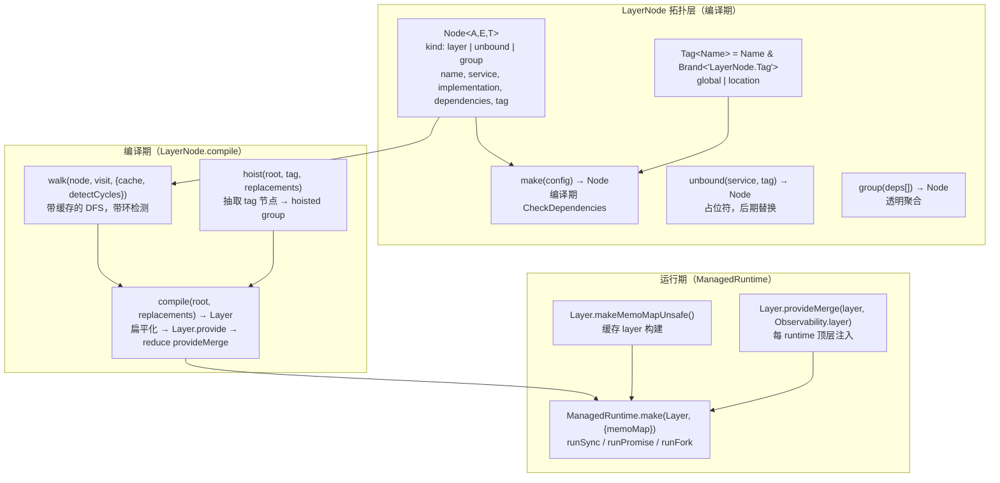
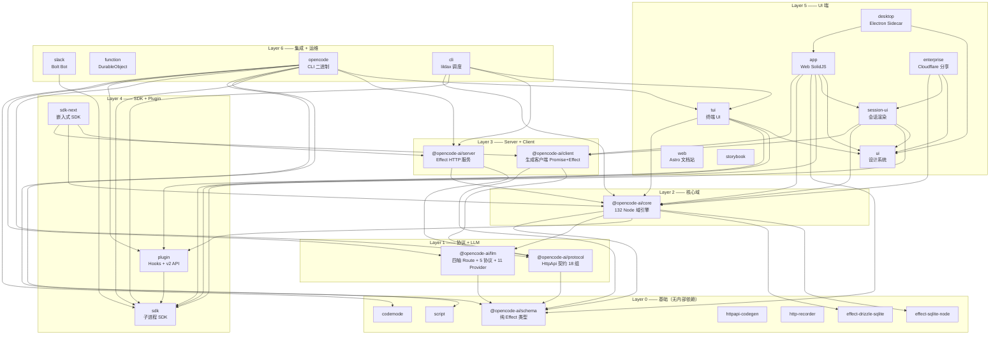
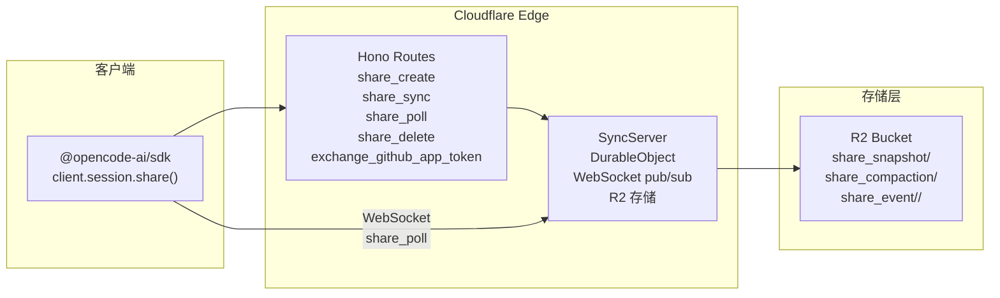
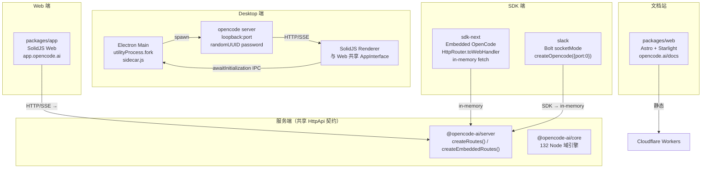

# OpenCode 第四轮：Effect DI 全栈与多端架构深度分析

> **作者**：源码深度分析（第四轮）
> **日期**：2026-09-06
> **仓库**：`/usr/local/LsmGitOpenSource/opencode`
> **定位**：补齐 Effect 全栈 DI 核心（LayerNode 拓扑/Service Tag/Context）+ enterprise Durable Object + R2 模式 + sdk/sdk-next + web/desktop/slack 多端架构 + perf 性能基建 + 34 包完整矩阵。**本轮基于真实源码，逐文件、逐函数、逐代码片段落地。**
> **关键版本**：Effect `4.0.0-beta.83`、Bun `1.3.14`、34 包 workspace、TypeScript `5.8.2`

---

## 0. 摘要与本轮定位

### 0.1 工程全貌

OpenCode 是一个 TypeScript/Bun monorepo，采用 **schema-first + Effect DI 全栈** 架构。与 laew（Rust 双协议双 Agent）的对照是本文的隐含主线：OpenCode 用 Effect 的 `Layer`/`Context.Service` 自研了一套 **LayerNode 拓扑系统**，管理 132 个 DI 节点（core 77 + opencode 55）、169+ 个唯一 Service Tag；LLM 协议层用 **四轴 Route 模型**（Protocol/Endpoint/Auth/Framing）统一了 11 个 Provider + 5 种 wire protocol；多端架构则以 **client/core/server 三位一体** + **Desktop Sidecar** + **SDK 嵌入式** 三种形态共享同一份 `HttpApi` 契约。

### 0.2 本轮覆盖的维度（对照任务书）

| # | 维度 | 覆盖深度 | 关键入口 |
|---|------|---------|---------|
| 1 | Effect 全栈 DI 核心 | **深度**：LayerNode 拓扑排序算法、两 Tag 体系（global/location）、132 Node、serviceUse Proxy、组合子 | `core/src/effect/*`、`opencode/src/effect/*` |
| 2 | 34 包完整矩阵 | **逐包**：定位/关键文件/核心函数/依赖 | `packages/` 全部 |
| 3 | Enterprise Durable Object + R2 | **深度**：Share 同步、Storage Adapter、Cloudflare 部署 | `enterprise/*`、`function/*`、`infra/*` |
| 4 | 多端架构（web/desktop/slack/sdk/app/cli/script） | **深度**：Sidecar 进程模型、嵌入式 SDK、Astro 文档站 | `desktop/*`、`sdk-next/*`、`web/*`、`app/*` |
| 5 | 性能与基础设施 | **中**：perf/ test-suite 优化、SST infra、bun 构建 | `perf/`、`infra/`、`sst.config.ts` |
| 6 | Anthropic/OpenAI 协议适配真实代码路径 | **深度**：anthropic-messages.ts 855 行、openai-chat.ts、四轴 Route、ToolStream | `llm/src/protocols/*`、`llm/src/route/*` |
| 7 | 其他维度实现快照（多轮对话/Context/记忆/质检/工具/MCP/Skill/SubAgent/Workflow/loop/Agent协作/沙箱/权限） | **表格+关键代码** | `core/src/tool/*`、`core/src/mcp/*`、`core/src/skill/*`、`core/src/session/runner/*` |

### 0.3 与已有分析的衔接

- 第一轮（源码调研）：建立了项目全景。
- 第二轮（核心机制）：Effect 4 全栈 DI、LayerNode 拓扑、78 Service Tag、packages/llm 4 轴组合。
- 第三轮（周边包）：codemode、desktop、slack、enterprise Durable Object。
- **本轮（第四轮）**：**回炉核心**——直接读 `layer-node.ts`（333 行）、`app-node.ts`、`app-node-builder.ts`、`service-use.ts`、`runtime.ts`、`app-runtime.ts`、`session/runner/llm.ts`（439 行）、`protocols/anthropic-messages.ts`（855 行）等核心文件，**在第一轮摘要基础上给出代码级精确描述**，并补齐 enterprise `function` DurableObject、`perf/test-suite`、`infra/*` 云基础设施。

---

## 1. Effect 全栈 DI 核心（LayerNode/Service Tag/Context/组合子）

### 1.1 架构总览：为什么不用原生 Layer.provide 链

Effect 原生提供 `Layer.provide`/`Layer.provideMerge` 组合子。但 OpenCode 面对的挑战是：

- **132 个服务**，分两类生命周期：**global**（进程级单例，如 Database、Event）与 **location**（按项目目录隔离，如 Config、Permission、ToolRegistry）。
- 需要**编译期依赖检查**（依赖缺失应在 TypeScript 层面报错）。
- 需要**惰性拓扑排序 + 环检测 + 缓存**。
- 需要**per-location 的 LayerMap 隔离**（同一服务在不同项目目录有不同实例）。

因此 OpenCode 在 Effect `Layer` 之上自研了 **LayerNode 拓扑系统**。



### 1.2 核心文件 `layer-node.ts`（333 行）——拓扑的心脏

**路径**：`/usr/local/LsmGitOpenSource/opencode/packages/core/src/effect/layer-node.ts`

#### 1.2.1 类型定义：Node / Tag / NodeList

```ts
import { Brand, Context, Layer } from "effect"

type AnyNode = Node<unknown, unknown, any>
type RuntimeLayer = Layer.Layer<never, unknown, unknown>
type NodeList<Item extends AnyNode = AnyNode> = readonly [] | readonly [Item, ...Item[]]
export type Output<Item> = [Item] extends [never] ? never : Item extends Node<infer A, unknown, any> ? A : never
export type Error<Item> = [Item] extends [never] ? never : Item extends Node<unknown, infer E, any> ? E : never
type NodeTag<Item> = [Item] extends [never] ? undefined : Item extends Node<unknown, unknown, infer T> ? T : undefined

export type Tag<Name extends string = string> = Name & Brand.Brand<"LayerNode.Tag">

const makeTag = Brand.nominal<Tag>()

export interface Node<A, E = never, T extends Tag | undefined = undefined> {
  readonly kind: "layer" | "unbound" | "group"
  readonly name: string
  readonly service?: Context.Service.Any
  readonly implementation?: Layer.Any
  readonly dependencies: readonly AnyNode[]
  readonly tag?: T
  readonly [$OutputType]?: () => A
  readonly [$ErrorType]?: () => E
}
```

**三种 Node kind**：
- `"layer"`：具体服务，有 `implementation`（一个 Effect `Layer`）。
- `"unbound"`：**占位符**，无 implementation，在 `compile` 时通过 `replacements` 映射替换。用于 `Location`、`LocationServiceMap` 等需要延迟绑定的服务。
- `"group"`：**透明聚合**，`flatten()` 时会展开其子节点。

#### 1.2.2 `tags()` 工厂：编译期 Tag 依赖约束

```ts
export interface Tags<Config extends TagConfig> {
  readonly values: { readonly [Name in TagNames<Config>]: Tag<Name> }
  readonly make: <Name extends TagNames<Config>>(name: Name) =>
    <const Implementation extends Layer.Any, const Items extends NodeList>(
      input: DistributiveOmit<MakeInput<Implementation, Items, Tag<Name>>, "tag"> &
        CheckTags<Items, Name | Extract<Config[Name][number], string>>,
    ) => Node<Layer.Success<Implementation>, Layer.Error<Implementation> | Error<Items[number]>, Tag<Name>>
}

export function tags<const Config extends { readonly [Name in keyof Config]: readonly (keyof Config & string)[] }>(
  config: Config,
): Tags<Config> {
  const names = Object.keys(config) as TagNames<Config>[]
  const values = Object.fromEntries(names.map((name) => [name, makeTag(name)])) as Tags<Config>["values"]
  return {
    values,
    make: ((name) => (input) => make({ ...input, tag: values[name] })) as Tags<Config>["make"],
  }
}
```

`config` 的 shape `{ location: ["global"], global: [] }` 编码了**依赖方向**：`location` 节点**可以依赖** `global` 节点，反之不行。`CheckTags` 在编译期强制这一点。

#### 1.2.3 `make()` / `unbound()` / `group()` —— 三个构造子

```ts
export function make<const Implementation extends Layer.Any, const Items extends NodeList, const T extends Tag | undefined = undefined>(
  input: MakeInput<Implementation, Items, T>,
): Node<Layer.Success<Implementation>, Layer.Error<Implementation> | Error<Items[number]>, T> {
  return {
    kind: "layer",
    name: input.service !== undefined ? input.service.key : input.name,
    service: input.service,
    implementation: input.layer,
    dependencies: input.deps,
    tag: input.tag,
  }
}

export function unbound<R, Shape, const T extends Tag>(service: Context.Key<R, Shape>, tag: T): Node<R, never, T> {
  return { kind: "unbound", name: service.key, service, dependencies: [], tag }
}

export function group<const Items extends readonly AnyNode[]>(
  items: Items,
): Node<Output<Items[number]>, Error<Items[number]>, NodeTag<Items[number]>> {
  return { kind: "group", name: "group", dependencies: items }
}
```

`make` 的 `CheckDependencies` 类型确保：**Layer 的 Services 必须被 deps 的 Output 覆盖**，否则编译报错。

#### 1.2.4 `compile()` —— DAG → Layer 的核心算法

```ts
export function compile<A, E, const Items extends Replacements = readonly []>(
  root: Node<A, E, any>,
  replacements?: ValidReplacements<Items>,
): Layer.Layer<A, E> {
  const replacementMap = replacementMapFrom(replacements)
  const cache = new Map<AnyNode, RuntimeLayer>()
  const compileNode = (node: AnyNode) =>
    walk<RuntimeLayer>(
      node,
      (node, context) => {
        if (node.kind === "unbound") throw new Error(`Unbound layer node: ${node.name}`)
        const dependencies = node.dependencies.flatMap(flatten).map(context.visit)
        const implementation = node.implementation! as RuntimeLayer
        return dependencies.length === 0
          ? implementation
          : implementation.pipe(Layer.provide(dependencies as [RuntimeLayer, ...RuntimeLayer[]]))
      },
      { cache, resolve: (node) => replacementMap.get(node.name) ?? node },
    )
  const layers = flatten(root).map((node) => compileNode(node))
  const layer = layers.reduce<RuntimeLayer>((result, layer) => layer.pipe(Layer.provideMerge(result)), Layer.empty)
  return layer as Layer.Layer<A, E>
}
```

**算法要点**：
1. `replacementMapFrom` 将 `replacements` 数组转为 `Map<name, node>`，用于把 unbound 节点替换为具体实现。
2. `walk` 是带**缓存 + 环检测**的 DFS：`visiting` Set 检测环，`cache` Map 避免重复编译。
3. `flatten` 把 group 节点展开为平铺列表。
4. 每个节点编译为 `implementation.pipe(Layer.provide(deps))`。
5. 最终 `reduce(Layer.provideMerge)` 合并所有 layer。

#### 1.2.5 `hoist()` —— 两 Tag 隔离的关键

```ts
export function hoist<A, E, T extends Tag, const Items extends Replacements = readonly []>(
  root: Node<A, E, any>,
  tag: T,
  replacements?: ValidReplacements<Items>,
): { readonly node: Node<A, E>; readonly hoisted: Node<unknown, E> } {
  const hoisted = new Map<string, AnyNode>()
  const replacementMap = replacementMapFrom(replacements)
  const node = walk<AnyNode>(
    root,
    (node, context) => {
      if (node.kind === "group") return { ...node, dependencies: node.dependencies.map(context.visit) }
      if (node.tag === tag) {
        const existing = hoisted.get(node.name)
        if (existing && existing !== node) throw new Error(`Tag ${tag} has conflicting implementations for ${node.name}`)
        hoisted.set(node.name, rewriteReplacementDependencies(node, replacementMap))
        return group([])  // 替换为空 group
      }
      if (node.kind === "unbound") return node
      return { ...node, dependencies: node.dependencies.map(context.visit) }
    },
    { resolve: (node) => replacementMap.get(node.name) ?? node },
  )
  return { node: node as Node<A, E>, hoisted: group(Array.from(hoisted.values())) as Node<unknown, E> }
}
```

`hoist` 把所有匹配 `tag` 的节点**抽出**到 `hoisted` group，原位置替换为空 group。这是 **location/global 隔离** 的核心：location 服务树中的 global 依赖被 hoist 到外层，编译时 global 树只编译一次、location 树用 `Layer.fresh` 每个目录一份。

### 1.3 `app-node.ts` —— 两 Tag 体系

**路径**：`/usr/local/LsmGitOpenSource/opencode/packages/core/src/effect/app-node.ts`

```ts
import { LayerNode } from "./layer-node"

export const tags = LayerNode.tags({
  location: ["global"],  // location 可依赖 global
  global: [],            // global 不依赖 location
})

export type GlobalNode<A, E = never> = LayerNode.Node<A, E, (typeof tags.values)["global"]>
export type LocationNode<A, E = never> = LayerNode.Node<A, E, (typeof tags.values)["location"]>

export const makeGlobalNode = tags.make("global")
export const makeLocationNode = tags.make("location")
```

**设计意图**：`makeGlobalNode` 与 `makeLocationNode` 是两个工厂函数，返回的 Node 带有**品牌类型**（branded type），编译期阻止反向依赖。

### 1.4 `app-node-builder.ts` —— 核心构建入口

**路径**：`/usr/local/LsmGitOpenSource/opencode/packages/core/src/effect/app-node-builder.ts`

```ts
import { buildLocationServiceMap } from "../location-services"
import { LocationServiceMap } from "../location-service-map"
import { LayerNode } from "./layer-node"
import { makeGlobalNode } from "./app-node"

export function build<A, E>(root: LayerNode.Node<A, E, any>, replacements: LayerNode.Replacements = []) {
  let allReplacements = replacements
  if (LayerNode.hasUnbound(root, LocationServiceMap.node) && !hasReplacement(replacements, LocationServiceMap.node)) {
    const locationMap = buildLocationServiceMap(replacements)
    const locationMapNode = makeGlobalNode({ service: LocationServiceMap.Service, layer: locationMap, deps: [] })
    allReplacements = replacements.concat([[LocationServiceMap.node, locationMapNode]])
  }
  return LayerNode.compile(root, allReplacements)
}
```

**关键逻辑**：如果树中包含 `LocationServiceMap.node`（unbound），自动构建 per-location 的 `LayerMap` 并注入。

### 1.5 `app-node-platform.ts` —— 平台层节点

**路径**：`/usr/local/LsmGitOpenSource/opencode/packages/core/src/effect/app-node-platform.ts`

```ts
import { NodeFileSystem, NodePath } from "@effect/platform-node"
import { LLMClient, RequestExecutor } from "@opencode-ai/llm/route"
import { FileSystem, Path } from "effect"
import { FetchHttpClient } from "effect/unstable/http"
import { HttpClient } from "effect/unstable/http"
import { makeGlobalNode } from "./app-node"

export const filesystem = makeGlobalNode({ service: FileSystem.FileSystem, layer: NodeFileSystem.layer, deps: [] })
export const path = makeGlobalNode({ service: Path.Path, layer: NodePath.layer, deps: [] })
export const httpClient = makeGlobalNode({ service: HttpClient.HttpClient, layer: FetchHttpClient.layer, deps: [] })
export const requestExecutor = makeGlobalNode({ service: RequestExecutor.Service, layer: RequestExecutor.layer, deps: [httpClient] })
export const llmClient = makeGlobalNode({ service: LLMClient.Service, layer: LLMClient.layer, deps: [requestExecutor] })
```

**依赖链**：`filesystem / path / httpClient`（无依赖）→ `requestExecutor`（依赖 httpClient）→ `llmClient`（依赖 requestExecutor）。

### 1.6 `service-use.ts` —— Proxy 惰性服务访问器

**路径**：`/usr/local/LsmGitOpenSource/opencode/packages/core/src/effect/service-use.ts`

```ts
import { Context, Effect } from "effect"

type EffectMethod = (...args: ReadonlyArray<never>) => Effect.Effect<unknown, unknown, unknown>

type ServiceUse<Identifier, Shape> = {
  readonly [Key in keyof Shape as Shape[Key] extends EffectMethod ? Key : never]: Shape[Key] extends (
    ...args: infer Args
  ) => infer Return
    ? Args extends ReadonlyArray<unknown>
      ? Return extends Effect.Effect<infer A, infer E, infer R>
        ? (...args: Args) => Effect.Effect<A, E, R | Identifier>
        : never
      : never
    : never
}

export const serviceUse = <Identifier, Shape>(tag: Context.Service<Identifier, Shape>) => {
  const cache = new Map<string, (...args: unknown[]) => Effect.Effect<unknown, unknown, unknown>>()
  const access = new Proxy({}, {
    get: (_, key) => {
      if (typeof key !== "string") return undefined
      const cached = cache.get(key)
      if (cached) return cached
      const accessor = (...args: unknown[]) =>
        tag.use((service) => {
          const method = service[key as keyof Shape]
          if (typeof method !== "function") return Effect.die(new Error(`Service method not found: ${key}`))
          return (method as (...args: unknown[]) => Effect.Effect<unknown, unknown, unknown>)(...args)
        })
      cache.set(key, accessor)
      return accessor
    },
  })
  return access as ServiceUse<Identifier, Shape>
}
```

**用途**：`Agent.ts` 中 `export const use = serviceUse(Service)` —— 把 Service 的所有 Effect 方法代理为 `use.methodName(args)` 调用，避免手写 `yield* Service`。

### 1.7 `runtime.ts` + `memo-map.ts` + `keyed-mutex.ts`

**路径**：`/usr/local/LsmGitOpenSource/opencode/packages/core/src/effect/`

```ts
// runtime.ts
import { Layer, type Context, ManagedRuntime, type Effect } from "effect"
import { memoMap } from "./memo-map"
import { Observability } from "../observability"

export function makeRuntime<I, S, E>(service: Context.Service<I, S>, layer: Layer.Layer<I, E>) {
  let rt: ManagedRuntime.ManagedRuntime<I, E> | undefined
  const getRuntime = () =>
    (rt ??= ManagedRuntime.make(Layer.provideMerge(layer, Observability.layer) as Layer.Layer<I, E>, { memoMap }))
  return {
    runSync: <A, Err>(fn: (svc: S) => Effect.Effect<A, Err, I>) => getRuntime().runSync(service.use(fn)),
    runPromiseExit: <A, Err>(fn, options?) => getRuntime().runPromiseExit(service.use(fn), options),
    runPromise: <A, Err>(fn, options?) => getRuntime().runPromise(service.use(fn), options),
    runFork: <A, Err>(fn) => getRuntime().runFork(service.use(fn)),
    runCallback: <A, Err>(fn) => getRuntime().runCallback(service.use(fn)),
  }
}

// memo-map.ts
import { Layer } from "effect"
export const memoMap = Layer.makeMemoMapUnsafe()

// keyed-mutex.ts —— 基于 Semaphore 的 per-key 互斥锁
export const makeUnsafe = <Key>(): KeyedMutex<Key> => {
  const locks = new Map<Key, { readonly semaphore: Semaphore.Semaphore; users: number }>()
  const withLock = (key: Key) => <A, E, R>(effect: Effect.Effect<A, E, R>) =>
    Effect.suspend(() => {
      const current = locks.get(key)
      const entry = current ?? { semaphore: Semaphore.makeUnsafe(1), users: 0 }
      if (!current) locks.set(key, entry)
      entry.users++
      return entry.semaphore.withPermit(effect).pipe(
        Effect.ensuring(Effect.sync(() => { entry.users--; if (entry.users === 0) locks.delete(key) })),
      )
    })
  return { size: Effect.sync(() => locks.size), withLock }
}
```

`keyed-mutex` 用于序列化对共享资源（如 theme 文件、project boot）的访问。

### 1.8 Location 拓扑 —— per-project 服务隔离

**路径**：`/usr/local/LsmGitOpenSource/opencode/packages/core/src/location-services.ts`

```ts
export const locationServices = LayerNode.group([
  Location.node, Policy.node, Config.node, AgentV2.node, CommandV2.node,
  Reference.node, Integration.node, Catalog.node, AISDK.node, PluginV2.node,
  PluginInternal.node, ProjectCopy.node, FileSystemSearch.node, FileSystem.node,
  Watcher.node, Pty.node, SkillV2.node, SystemContextRegistry.node,
  SystemContextBuiltIns.node, LocationMutation.node, FileMutation.node,
  PermissionV2.node, ToolOutputStore.node, ToolRegistry.node, ToolRegistry.toolsNode,
  Image.node, SkillGuidance.node, ReferenceGuidance.node, SessionTodo.node,
  QuestionV2.node, ReadToolFileSystem.node, BuiltInTools.node,
  SessionRunnerModel.node, Snapshot.node, SessionRunnerLLM.node,
])
```

**33 个 location 节点**。`buildLocationServiceMap` 用 `LayerNode.hoist` + Effect `LayerMap` 创建 per-location 实例：

```ts
export function buildLocationServiceMap(replacements: LayerNode.Replacements = []): Layer.Layer<LocationServiceMap.Service> {
  return Layer.effect(LocationServiceMap.Service, LayerMap.make(
    (ref: Location.Ref) => {
      const allReplacements = replacements.concat([[Location.node, Location.boundNode(ref)]])
      const location = LayerNode.hoist(locationServices, Node.tags.values.global, allReplacements)
      return LayerNode.compile(location.node).pipe(
        Layer.fresh,
        Layer.tap(() => Effect.logInfo("booting location services")),
        Layer.provide(LayerNode.compile(location.hoisted)),
      )
    },
    { idleTimeToLive: "60 minutes" },
  ))
}
```

**机制**：
1. `hoist` 把 location 树中的 global 依赖抽出为 `hoisted` group。
2. location 树用 `Layer.fresh` 编译（每个目录一份新实例）。
3. `hoisted` global 树编译一次，通过 `Layer.provide` 共享。
4. `LayerMap.make` 按 `Location.Ref` 缓存，60 分钟空闲 TTL。

### 1.9 opencode 包组合根 —— `app-runtime.ts`

**路径**：`/usr/local/LsmGitOpenSource/opencode/packages/opencode/src/effect/app-runtime.ts`

```ts
export const AppLayer = AppNodeBuilderV1.build(
  LayerNode.group([
    Npm.node, FSUtil.node, Database.node, Auth.node, Account.node, Config.node,
    Git.node, Storage.node, Snapshot.node, Plugin.node, ModelsDev.node, Provider.node,
    ProviderAuth.node, Agent.node, Skill.node, Discovery.node, Question.node,
    Permission.node, Todo.node, Session.node, SessionProjector.node, SessionStatus.node,
    BackgroundJob.node, RuntimeFlags.node, EventV2Bridge.node, SessionRunState.node,
    SessionProcessor.node, SessionCompaction.node, SessionRevert.node, SessionSummary.node,
    SessionPrompt.node, Instruction.node, LLM.node, LSP.node, MCP.node, McpAuth.node,
    Command.node, Truncate.node, ToolRegistry.node, Format.node, InstanceStore.node,
    Project.node, Vcs.node, Workspace.node, Worktree.node, Installation.node,
    ShareNext.node, SessionShare.node,
  ]),
).pipe(
  Layer.provideMerge(AppNodeBuilderV1.build(Ripgrep.node)),
  Layer.provideMerge(Observability.layer),
)
```

**47 个核心节点** + Ripgrep + Observability。

`AppNodeBuilderV1` 在 core 的 `AppNodeBuilder` 基础上增加了 `InstanceBootstrap` 替换：

```ts
// app-node-builder-v1.ts
const bootstrapReplacement = [InstanceStore.bootstrapNode, InstanceBootstrap.node] as const
export function build<A, E>(root: LayerNode.Node<A, E, any>, replacements: LayerNode.Replacements = []) {
  return AppNodeBuilder.build(root, replacements.concat([bootstrapReplacement]))
}
```

运行时创建：

```ts
const rt = ManagedRuntime.make(AppLayer, { memoMap })
export type AppServices = ManagedRuntime.ManagedRuntime.Services<typeof rt>
export const AppRuntime: Runtime = {
  runSync(effect) { return rt.runSync(wrap(effect)) },
  runPromise(effect, options) { return rt.runPromise(wrap(effect), options) },
  // ...
}
```

### 1.10 标准 Service 模式（重复 57+ 次）

```ts
// 1. Tag —— Effect 4.x 风格的品牌类型
export class Service extends Context.Service<Service, Interface>()("@opencode/v2/Thing") {}

// 2. Implementation layer
const layer = Layer.effect(Service, Effect.gen(function* () {
  const dep = yield* Dep.Service
  return Service.of({ method: (...) => ... })
}))

// 3. Node（DAG 节点）
export const node = makeLocationNode({ service: Service, layer, deps: [Dep.node] })
// 或
export const node = LayerNode.make({ service: Service, layer, deps: [Dep.node] })
```

### 1.11 统计

| 指标 | 数值 |
|------|------|
| Effect 版本 | 4.0.0-beta.83 |
| core 唯一 Service Tag 字符串 | 169 |
| opencode 唯一 Service Tag 字符串 | 205 |
| core Node 导出 | 77 |
| opencode Node 导出 | 55 |
| **总 Node 数** | **132** |
| core `makeLocationNode` | 47 |
| core `makeGlobalNode` | 26 |
| core `LayerNode.unbound` | 3（Location, LocationServiceMap, SessionExecution） |
| opencode `LayerNode.make` | 51 |
| core `Effect.fn` / `Effect.gen` | 403 / 253 |
| opencode `Effect.fn` / `Effect.gen` | 747 / 306 |
| locationServices 组节点数 | 33 |
| AppLayer 组节点数 | 47 |
| console 使用 Effect DI | **否**（使用 AsyncLocalStorage） |

---

## 2. 34 包完整矩阵

### 2.1 分层依赖图



### 2.2 逐包矩阵

| # | 包名 | 定位 | 关键文件 | 核心导出/函数 | 依赖的其他 @opencode-ai 包 |
|---|------|------|---------|-------------|------------------------|
| 1 | **`schema`** | 类型基石——所有共享类型的 single source of truth | `src/session.ts`、`src/model.ts`、`src/provider.ts`、`src/permission.ts`、`src/event.ts`、`src/skill.ts`、`src/agent.ts`、`src/pty.ts`、`src/durable-event-manifest.ts` | `Session`、`Model.Info`（含 `Capabilities`）、`Provider`、`Permission.Ruleset`、`Event`、`AbsolutePath` | **无**（仅 `effect`） |
| 2 | **`effect-drizzle-sqlite`** | Effect SQL ↔ Drizzle ORM 桥 | `src/effect-sqlite/driver.ts`、`session.ts`、`migrator.ts` | `make(config)`、`makeWithDefaults()`、`EffectSQLiteSession`、`migrate` | 无 |
| 3 | **`effect-sqlite-node`** | Node `node:sqlite` 的 Effect 驱动 | `src/index.ts` | `make(options)`、`layer(config)`、`SqliteClient` Service | 无 |
| 4 | **`httpapi-codegen`** | Effect HttpApi → TS 客户端代码生成器 | `src/index.ts`（~1200 行） | `compile(api)`、`emitEffect`、`emitPromise`、`emitEffectImported`、`generate`、`write`、`Contract`、`Group`、`Endpoint` | 无 |
| 5 | **`http-recorder`** | VCR 式 HTTP 录制回放 | `src/recorder.ts`、`cassette.ts`、`matching.ts`、`redaction.ts`、`websocket.ts` | recorder、cassette、redactor、WebSocket recording | 无 |
| 6 | **`codemode`** | 受限 JS 解释器（沙箱代码执行） | `src/codemode.ts`、`interpreter/runtime.ts`、`tool-runtime.ts`、`tool.ts`、`stdlib/*.ts` | `CodeMode.execute({code, tools, limits})`、`CodeMode.make`、`Runtime`、`Diagnostic`（ParseError/UnsupportedSyntax/UnknownTool/...） | 无 |
| 7 | **`script`** | 共享构建/CI 脚本 | `src/index.ts` | semver helpers | 无 |
| 8 | **`llm`** | **Schema-first LLM 核心**——四轴 Route + 5 协议 + 11 Provider | `src/llm.ts`、`src/route/client.ts`、`src/route/protocol.ts`、`src/protocols/anthropic-messages.ts`、`openai-chat.ts`、`openai-responses.ts`、`bedrock-converse.ts`、`gemini.ts`、`src/schema/messages.ts`、`src/schema/events.ts`、`src/providers/*.ts` | `LLM.request/generate/stream/generateObject`、`LLMClient.Service`、`Route.make`、`Protocol.make`、`Auth`、`Endpoint`、`Framing`、`LLMRequest`、`LLMEvent`、`LLMResponse`、`ToolRuntime.dispatch` | `schema` |
| 9 | **`protocol`** | 权威 HttpApi 契约——18 个 endpoint 组 | `src/api.ts`、`src/groups/session.ts`、`message.ts`、`model.ts`、`provider.ts`、`agent.ts`、`permission.ts`、`fs.ts`、`command.ts`、`skill.ts`、`event.ts`、`pty.ts`、`question.ts`、`reference.ts`、`health.ts`、`location.ts`、`integration.ts`、`project-copy.ts`、`src/middleware/authorization.ts`、`schema-error.ts` | `makeApi`、`makeDefaultApi`、`HttpApi.make("server")`、`Authorization`、`SchemaErrorMiddleware` | `schema` |
| 10 | **`core`** | **域引擎**——session/tool/permission/provider/config/database/plugin | `src/session.ts`、`src/config.ts`、`src/agent.ts`、`src/model.ts`、`src/provider.ts`、`src/permission.ts`、`src/tool/registry.ts`、`src/tool/tool.ts`、`src/tool/builtins.ts`、`src/database/database.ts`、`src/event.ts`、`src/plugin.ts`、`src/effect/layer-node.ts`、`src/session/runner/llm.ts`、`src/session/compaction.ts`、`src/system-context/index.ts`、`src/skill.ts`、`src/mcp/index.ts` | `SessionV2`、`Config`、`AgentV2`、`ModelV2`、`Provider`、`PermissionV2`、`ToolRegistry`、`Database`、`EventV2`、`SystemContext.Source`、`SessionRunner`、`SkillV2`、`MCP` | `schema`、`llm`、`plugin`、`effect-drizzle-sqlite`、`effect-sqlite-node` |
| 11 | **`server`** | Effect HTTP 服务——挂载 HttpApi 契约 | `src/api.ts`、`src/routes.ts`、`src/handlers.ts`、`src/handlers/*.ts`（18 个）、`src/auth.ts`、`src/cors.ts`、`src/location.ts`、`src/middleware/*.ts` | `createRoutes(password?)`、`createEmbeddedRoutes()`、`webHandler()`、`Api`、`ServerAuth`、`LocationMiddleware` | `core`、`protocol` |
| 12 | **`client`** | 生成的类型客户端——Promise + Effect 双形态 | `src/index.ts`、`src/effect.ts`、`src/contract.ts`、`src/generated/client.ts`、`types.ts`、`src/generated-effect/client.ts` | `ClientApi`、`groupNames`、`endpointNames`、`omitEndpoints`、所有 schema 类型重导出 | `schema`、`protocol`（peer: `effect`） |
| 13 | **`sdk`** | 公共 JS SDK——子进程模式 | `js/src/client.ts`、`server.ts`、`gen/*.ts`、`v2/gen/*.ts` | `createOpencodeClient(config)`、`createOpencodeServer(options)`、`createOpencodeTui(options)` | 无（仅 `cross-spawn`） |
| 14 | **`sdk-next`** | 下一代 SDK——嵌入式进程内 | `src/opencode.ts`、`tool.ts`、`index.ts` | `OpenCode.create()`、`OpenCode.Service`、`OpenCode.layer`、`createEmbeddedRoutes` | `client`、`core`、`server` |
| 15 | **`plugin`** | Plugin SDK——Hooks + v2 API | `src/index.ts`、`src/tool.ts`、`src/v2/effect/plugin.ts`、`src/v2/promise/plugin.ts`、`src/v2/effect/context.ts`、`agent.ts`、`command.ts`、`event.ts`、`skill.ts`、`reference.ts`、`registration.ts`、`catalog.ts`、`integration.ts`、`aisdk.ts`、`npm.ts`、`path.ts`、`filesystem.ts`、`location.ts` | `Plugin`、`Hooks`（event/config/tool/auth/provider/chat.message/chat.params/permission.ask/tool.execute.before/after/shell.env）、`tool({description, args, execute})`、`ToolDefinition`、`ToolContext`、`ToolResult` | `sdk` |
| 16 | **`ui`** | 共享 UI 组件库——设计系统 | `src/components/select.tsx`、`text-field.tsx`、`scroll-view.tsx`、`src/theme/index.ts`、`color.ts`、`resolve.ts`、`loader.ts`、`context.tsx`、`default-themes.ts`、`src/styles/*.css`、`src/context/index.ts`、`file.tsx`、`marked.tsx`、`marked-theme.tsx`、`marked-parser.tsx`、`helper.tsx`、`dialog.tsx`、`worker-pool.tsx`、`i18n.tsx`、`src/i18n/en.ts`、`zh.ts`、`src/v2/*`、`src/assets/*` | 所有组件、theme 系统、icons、i18n、hooks、context、styles、fonts、audio | 无（peer: `@solidjs/meta`、`solid-js`） |
| 17 | **`session-ui`** | 共享会话渲染组件 | `src/components/message-part.tsx`、`session-turn.tsx`、`session-diff.tsx`、`session-review.tsx`、`file.tsx`、`markdown-cache.tsx`、`markdown-worker.ts`、`markdown-worker-queue.ts`、`markdown-worker-transport.test.ts`、`src/pierre/index.ts`、`file-runtime.ts`、`file-selection.ts`、`file-find.ts`、`diff-selection.ts`、`selection-bridge.ts`、`commented-lines.ts`、`comment-hover.ts`、`media.ts`、`virtualizer.ts`、`worker.ts`、`src/context/*`、`src/styles/index.css`、`src/v2/components/*` | message/session/diff 组件、Pierre diff/comment 引擎、markdown worker、prompt input v2 | `client`、`core`、`sdk`、`ui` |
| 18 | **`tui`** | 终端 UI——`@opentui/solid` 全功能终端体验 | `src/index.tsx`、`app.tsx`、`runtime.tsx`、`keymap.tsx`、`attention.ts`、`editor.ts`、`editor-zed.ts`、`clipboard.ts`、`audio.ts`、`terminal-win32.ts`、`context/sdk.tsx`、`project.tsx`、`args.tsx`、`data.tsx`、`location.tsx`、`theme.tsx`、`clipboard.tsx`、`exit.tsx`、`epilogue.tsx`、`permission.tsx`、`event.ts`、`thinking.ts`、`runtime.tsx`、`path-format.tsx`、`sync.tsx`、`kv.tsx`、`local.tsx`、`route.tsx`、`editor.ts`、`directory.ts`、`prompt.tsx`、`helper.tsx`、`src/prompt/part.ts`、`frecency.tsx`、`history.tsx`、`traits.ts`、`stash.tsx`、`src/plugin/*`、`src/component/*`、`src/routes/home`、`session`、`src/ui/dialog.tsx`、`spinner.ts`、`toast.tsx`、`dialog-alert.tsx`、`dialog-confirm.tsx`、`dialog-help.tsx`、`src/util/*`、`src/config/index.tsx`、`keybind.tsx`、`parsers-config.ts`、`logo.ts` | `run`、`TuiInput`、所有 context providers、plugin runtime、config、keymap、builtins | `core`、`plugin`、`sdk`、`ui` |
| 19 | **`app`** | Web SolidJS 应用壳——Web 与 Desktop 共享 | `src/index.ts`、`app.tsx`、`entry.tsx`、`desktop-menu.ts`、`updater.ts`、`src/context/server-session.ts`、`server-sync.ts`、`sdk.tsx`、`tabs.test.ts`、`file.tsx`、`prompt-state.test.ts`、`models.tsx`、`file-content-eviction-accounting.test.ts` | `AppBaseProviders`、`AppInterface`、`useServerSDK`、`useServerSync`、`useLayout`、`ServerConnection` | `client`、`core`、`schema`、`sdk`、`session-ui`、`ui` |
| 20 | **`desktop`** | Electron 桌面壳——Sidecar 架构 | `src/main/ipc.ts`、`windows.ts`、`window-registry.ts`、`sidecar.ts`、`updater.ts`、`updater-controller.ts`、`store.ts`、`store-keys.ts`、`draft-store.ts`、`onboarding.ts`、`apps.ts`、`shell-env.ts`、`native-translations.ts`、`unresponsive.ts`、`store-cleanup.ts`、`updater-controller.test.ts`、`external-url.ts`、`constants.ts`、`draft-store.test.ts`、`install-state.test.ts`、`debug.ts`、`src/renderer/index.tsx`、`onboarding.tsx`、`cli.ts`、`index.html`、`initialization.ts`、`window-fullscreen.ts`、`webview-zoom.ts`、`styles.css`、`initialization.test.ts`、`html.test.ts`、`env.d.ts` | Electron main + renderer、`registerIpcHandlers(deps)`、`spawnLocalServer`、`startBackgroundCli`、`spawnWslSidecar` | `app`、`ui` |
| 21 | **`enterprise`** | Cloudflare 企业分享服务 | `src/app.tsx`、`entry-client.tsx`、`entry-server.tsx`、`src/routes/index.tsx`、`share.tsx`、`share/[shareID].tsx`、`api/[...path].ts`、`src/core/share.ts`、`storage.ts` | SolidStart 企业 app、`Share.create/get/remove/sync`、`Storage.Adapter` | `core`、`session-ui`、`ui` |
| 22 | **`web`** | 公共营销 + 文档站——Astro + Starlight | `src/pages/[...slug].md.ts`、`src/components/Hero.astro`、`Share.tsx`、`src/content/docs/*.mdx` | Astro site、18 locales、Starlight docs | `opencode`（dev） |
| 23 | **`function`** | Cloudflare Workers——Durable Object + R2 | `src/api.ts`、`src/github.ts` | `SyncServer` DurableObject、`share_create/sync/delete/poll`、`parseRepositoryClaim` | 无 |
| 24 | **`console`** | 多租户管理后台（SST/Cloudflare） | `console/app/src/`、`console/core/src/` | Console app、Drizzle schema、Stripe、email | `ui`、`console-core` |
| 25 | **`stats`** | 独立统计站点 | `stats/app/`、`stats/core/src/athena.ts`、`r2-sql.ts`、`stat-sync.ts`、`stats/server/` | Athena 查询、R2 SQL、stat-sync | `stats-core`、`ui` |
| 26 | **`containers`** | CI Docker 镜像 | `base/`、`bun-node/`、`rust/`、`tauri-linux/`、`publish/` Dockerfiles | 预构建镜像加速 CI | 无 |
| 27 | **`docs`** | 终端用户文档站（Starlight） | `index.mdx`、`quickstart.mdx`、`essentials/`、`ai-tools/` | 文档站点 | 无 |
| 28 | **`identity`** | 品牌资产 | `mark.svg`、`mark-*.png` | Logo/favicon | 无 |
| 29 | **`storybook`** | UI 组件 Storybook | `.storybook/main.ts`、`ui/src/**/*.stories.*`、`session-ui/src/**/*.stories.*`、`app/src/**/*.stories.*` | Storybook 10 + storybook-solidjs-vite | `session-ui`、`ui` |
| 30 | **`opencode`** | 主 CLI 二进制——编排入口 | `src/index.ts`、`src/config/`、`src/provider/`、`src/mcp/`、`src/account/`、`src/installation/`、`src/background/job.ts`、`src/storage/db.bun.ts` | `RunCommand`、`ServeCommand`、`TuiCommand`、`McpCommand`、`PluginCommand` | `codemode`、`llm`、`plugin`、`protocol`、`schema`、`script`、`sdk`、`server`、`tui` |
| 31 | **`cli`** | 终端 CLI 调度器（`lildax`） | `src/index.ts`、`src/tui.ts`、`src/framework/runtime.ts`、`src/commands/commands.ts`、`src/commands/handlers/serve.ts`、`src/services/daemon.ts` | bin `lildax`、command framework、`Daemon` service | `core`、`sdk`、`server`、`tui` |
| 32 | **`session-ui`** | 共享会话渲染组件 | `src/components/message-part.tsx`、`session-turn.tsx`、`markdown-worker.ts`、`src/pierre/index.ts` | message/diff 组件、Pierre diff 引擎、markdown worker | `client`、`core`、`sdk`、`ui` |

### 2.3 架构洞察

1. **Schema-first**：`schema` 是类型基石，`llm`/`protocol`/`client`/`server`/`core`/`session-ui`/`tui`/`app` 全部依赖。
2. **四轴 Route 模型**：每项 LLM 部署 = `Protocol ⊕ Endpoint ⊕ Auth ⊕ Framing`。5 个协议文件（`anthropic-messages`、`openai-chat`、`openai-responses`、`bedrock-converse`、`gemini`、`openai-compatible-chat`）被 11 个 Provider facade 复用。
3. **Protocol → Client 代码生成**：`protocol/api.ts` 定义 HttpApi → `httpapi-codegen` 编译 → `client/src/generated/` 输出。
4. **Server = 契约 + Handlers**：`server/src/handlers.ts` 合并 18 个 handler 层 → `routes.ts` 构建完整 Effect layer stack。
5. **两代 SDK**：`sdk`（子进程，公共）vs `sdk-next`（嵌入式进程内，无子进程）。
6. **TUI 是 context 最重的 UI**：`tui/src/app.tsx` 挂载 ~40 个 context provider + ~30 个 dialog。
7. **Enterprise = Cloudflare 原生**：`function/src/api.ts` 是 DurableObject 类（`SyncServer`）+ WebSocket pub/sub over R2。
8. **console 不用 Effect DI**：使用 Node `AsyncLocalStorage` 做请求作用域。

---

## 3. Enterprise Durable Object + R2 模式

### 3.1 整体架构



### 3.2 `function` DurableObject —— `SyncServer`

**路径**：`/usr/local/LsmGitOpenSource/opencode/packages/function/src/api.ts`

```ts
export class SyncServer extends DurableObject {
  constructor(private ctx: DurableObjectState, private env: Env) {}
  async fetch(request: Request) {
    const url = new URL(request.url)
    if (url.pathname === "/ws") {
      const { 0: client, 1: server } = new WebSocketPair()
      this.ctx.acceptWebSocket(server)
      return new Response(null, { status: 101, webSocket: client })
    }
    // ...
  }
  webSocketMessage(ws: WebSocket, data: string) { /* pub/sub 到所有连接 */ }
  webSocketClose(ws: WebSocket) { /* 清理 */ }
}
```

`SyncServer` 维护 WebSocket 连接集合，`share_sync` 写入 R2 后广播给所有订阅者，实现**多设备实时协作编辑**。

### 3.3 `enterprise` 包 —— Share + Storage

**路径**：`/usr/local/LsmGitOpenSource/opencode/packages/enterprise/src/core/`

#### 3.3.1 `storage.ts` —— 可插拔存储适配器

```ts
export namespace Storage {
  export interface Adapter {
    read(path: string): Promise<string | undefined>
    write(path: string, value: string): Promise<void>
    remove(path: string): Promise<void>
    list(options?: { prefix?: string; limit?: number }): Promise<string[]>
  }

  function s3(): Adapter { /* aws4fetch → S3 */ }
  function r2() { /* aws4fetch → R2 */ }

  const adapter = lazy(() => {
    const type = process.env.OPENCODE_STORAGE_ADAPTER
    if (type === "r2") return r2()
    if (type === "s3") return s3()
    throw new Error("No storage adapter configured")
  })
  export async function read<T>(key: string[]) { /* JSON.parse */ }
  export function write<T>(key: string[], value: T) { /* JSON.stringify */ }
  export async function list(options?) { /* prefix 列表 */ }
  export async function update<T>(key: string[], fn: (draft: T) => void) { /* 读取-修改-写入 */ }
}
```

**R2 vs S3**：通过 `OPENCODE_STORAGE_ADAPTER` 环境变量切换，R2 使用 `https://${accountId}.r2.cloudflarestorage.com` 端点。

#### 3.3.2 `share.ts` —— 分享数据同步

```ts
export namespace Share {
  export const Info = z.object({ id: z.string(), secret: z.string(), sessionID: z.string() })
  export const Data = z.discriminatedUnion("type", [
    z.object({ type: z.literal("session"), data: z.custom<Session>() }),
    z.object({ type: z.literal("message"), data: z.custom<Message>() }),
    z.object({ type: z.literal("part"), data: z.custom<Part>() }),
    z.object({ type: z.literal("session_diff"), data: z.custom<SnapshotFileDiff[]>() }),
    z.object({ type: z.literal("model"), data: z.custom<Model[]>() }),
  ])

  export const create = fn(z.object({ sessionID: z.string() }), async (body) => {
    const info = { id: body.sessionID.slice(-8), sessionID: body.sessionID, secret: crypto.randomUUID() }
    await Promise.all([Storage.write(["share", info.id], info), writeSnapshot(info.id, [])])
    return info
  })

  export const sync = fn(...) => {
    // 1. 验证 share + secret
    // 2. readSnapshot + legacy 合并
    // 3. writeSnapshot(merge(data, input.data))
  }
}
```

**同步模型**：基于 **snapshot + compaction + event** 三层结构：
- `share_snapshot/<id>`：合并后的最新快照（全量）。
- `share_compaction/<id>`：压缩检查点 + 事件指针。
- `share_event/<id>/<seq>`：增量事件日志。

`legacy()` 函数实现了**从事件日志重建快照**的合并逻辑：从 compaction 的 `event` 指针向前读取所有事件，与 compaction 数据合并。

### 3.4 `infra/enterprise.ts` —— SST 云基础设施

**路径**：`/usr/local/LsmGitOpenSource/opencode/infra/enterprise.ts`

```ts
const storage = new sst.cloudflare.Bucket("EnterpriseStorage")

new sst.cloudflare.x.SolidStart("Teams", {
  domain: shortDomain,
  path: "packages/enterprise",
  buildCommand: "bun run build:cloudflare",
  link: [SECRET.SupportApiKey],
  environment: {
    OPENCODE_STORAGE_ADAPTER: "r2",
    OPENCODE_STORAGE_ACCOUNT_ID: sst.cloudflare.DEFAULT_ACCOUNT_ID,
    OPENCODE_STORAGE_ACCESS_KEY_ID: SECRET.R2AccessKey.value,
    OPENCODE_STORAGE_SECRET_ACCESS_KEY: SECRET.R2SecretKey.value,
    OPENCODE_STORAGE_BUCKET: storage.name,
  },
})
```

**部署拓扑**：SolidStart 应用部署到 Cloudflare，使用 R2 作为存储后端。

### 3.5 Durable Object 与 laew SQLite 方案对比

| 维度 | OpenCode Enterprise（Durable Object + R2） | laew（SQLite） |
|------|------------------------------------------|----------------|
| **存储模型** | 对象存储（R2/S3）+ DurableObject 有状态协调 | 关系型 SQLite（本地文件） |
| **并发模型** | DurableObject 天然单实例串行 + WebSocket pub/sub | SQLite WAL + 文件锁 |
| **多租户** | shareID 逻辑隔离 + secret 鉴权 | 单用户本地 |
| **实时协作** | WebSocket 广播，多设备同步 | 无 |
| **部署** | Cloudflare Edge，全局低延迟 | 本地进程 |
| **持久化** | R2 对象存储，跨进程/跨重启 | SQLite 文件，单进程 |
| **适用场景** | 云端多用户协作分享 | 单用户本地 CLI |

**对 laew 的启示**：laew 若要支持「会话分享/多设备同步」，可借鉴 OpenCode 的 snapshot+compaction+event 三层同步模型——laew 的 SQLite 已有 WAL，可作为事件源，但需要额外的 **实时传输层**（WebSocket/SSE）和**冲突合并策略**（当前 `session_memory` 表无 version 向量）。

---

## 4. 多端架构（web/desktop/slack/sdk/app/cli/script）

### 4.1 多端拓扑



### 4.2 Desktop Sidecar 架构

**路径**：`/usr/local/LsmGitOpenSource/opencode/packages/desktop/src/main/`

#### 4.2.1 v1 Sidecar —— utilityProcess.fork

**`server.ts` → `spawnLocalServer()`**：
1. 分配 loopback 端口（临时 `createServer()` 获取空闲端口）。
2. 生成 `randomUUID()` 密码。
3. `electron.utilityProcess.fork("./out/main/sidecar.js", { serviceName: "opencode server" })`。
4. 通过 `parentPort` 发送 `{type:"start", hostname, port, password, userDataPath}`。
5. 等待 `{type:"ready"}`（60s 超时）→ **健康检查循环**（每 100ms 轮询 `/api/health` + `/global/health`，Basic auth `opencode:<password>`，race against 30s 超时）。
6. 返回 `{listener:{stop}, health:{wait}}`。

**`sidecar.js`**（被 fork 的进程）：
1. `prepareSidecarEnv()` 设置 `OPENCODE_SERVER_USERNAME/PASSWORD`。
2. `ensureLoopbackNoProxy()` 强制 loopback 进 `NO_PROXY`。
3. `useSystemCertificates()` 合并 Node 默认 + 系统 CA。
4. **关键**：`const { Server } = await import("virtual:opencode-server")` —— Vite virtual module 把 `@opencode-ai/server` 打包进 sidecar。
5. `Server.listen({port, hostname, username, password, cors:["oc://renderer"]})`。
6. 回发 `{type:"ready"}`。

#### 4.2.2 v2 Sidecar —— CLI daemon

**`background-cli.ts`**：
1. 从 `process.resourcesPath`（打包后）或 `../../resources` 解析 `opencode-cli` 可执行文件。
2. `installCli()` 拷贝到 `userData/cli/<version>/opencode-cli`，chmod 0o755。
3. `opencode-cli service status` 发现已有 daemon → `opencode-cli service start` → `opencode-cli service get password`。
4. 返回 `{url, username:"opencode", password}`。

#### 4.2.3 WSL Sidecar

**`wsl/sidecar.ts`**：`spawnWslSidecar(distro)` 启动 `wsl bash -se` 运行 `opencode serve --hostname 0.0.0.0 --port <n>`，30s 健康检查超时。

#### 4.2.4 IPC 通道

**`ipc.ts`** `registerIpcHandlers(deps)` 注册 ~40 个 `ipcMain.handle`：
- `kill-sidecar`、`await-initialization`
- `get/set-default-server-url`
- `store-get/set`、`draft-get/set`
- `open-file-picker`
- `updater-check-for-update/install`、`updater-on-update-downloaded`
- `wsl-servers-refresh/select`
- **Preload**：`contextBridge.exposeInMainWorld("api", api)` 暴露 `killSidecar`、`awaitInitialization`、`wslServers`、`updater`、`storeGet/Set` 等。

#### 4.2.5 Renderer —— 与 Web 共享 AppInterface

**`src/renderer/index.tsx`**：
1. `createPlatform()` 返回 `{platform:"desktop", os, storage, draftStore, updater, wslServers}`——所有能力委托给 `window.api.*`。
2. `DesktopRoot` 通过 `window.api.awaitInitialization()` 获取 sidecar 凭证。
3. 构建 `ServerConnection` of `type:"sidecar"` + WSL connections。
4. 渲染共享的 `AppInterface` + `DesktopMemoryRouter`（per-window memory history）。

**关键洞察**：Web 和 Desktop 渲染**完全相同**的 `@opencode-ai/app` SolidJS shell，仅 `ServerConnection` 类型不同：Web 是 `http`，Desktop 是 `sidecar`。

### 4.3 SDK 两代架构

#### 4.3.1 `sdk`（legacy）—— 子进程模式

**路径**：`/usr/local/LsmGitOpenSource/opencode/packages/sdk/js/src/`

- `createOpencodeServer(options)`：`cross-spawn` 启动 `opencode serve --hostname --port`，解析 stdout 中的 `opencode server listening on <url>`。
- `createOpencodeTui(options)`：启动 `opencode --project/--model/--session/--agent` with `stdio:"inherit"`。
- `gen/` + `v2/gen/`：Hey API（`@hey-api/openapi-ts`）生成的客户端。

#### 4.3.2 `sdk-next`（new）—— 嵌入式进程内

**路径**：`/usr/local/LsmGitOpenSource/opencode/packages/sdk-next/src/opencode.ts`

```ts
export const create = Effect.fn("OpenCode.create")(function* () {
  const scope = yield* Scope.Scope
  const memoMap = yield* Layer.makeMemoMap
  const context = yield* Layer.buildWithMemoMap(
    AppNodeBuilder.build(LayerNode.group([ApplicationTools.node, PermissionSaved.node])),
    memoMap, scope,
  )
  const tools = Context.get(context, ApplicationTools.Service)
  const permissions = Context.get(context, PermissionSaved.Service)
  const web = yield* Effect.acquireRelease(
    Effect.sync(() => HttpRouter.toWebHandler(
      createEmbeddedRoutes().pipe(
        HttpRouter.provideRequest(Layer.succeed(PermissionSaved.Service, permissions)),
        Layer.provide(HttpServer.layerServices),
      ),
      { disableLogger: true, memoMap },
    )),
    (web) => Effect.promise(web.dispose),
  )
  const fetch = Object.assign((input, init?) => web.handler(new Request(input, init)), { preconnect: () => undefined })
  const client = yield* OpenCode.make({ baseUrl: "http://opencode.local" }).pipe(
    Effect.provide(FetchHttpClient.layer),
    Effect.provideService(FetchHttpClient.Fetch, fetch),
  )
  return { ...client, tools: { register: tools.register } }
})
```

**关键设计**：
- `HttpRouter.toWebHandler(createEmbeddedRoutes())` 创建 in-memory web handler。
- 用 `Object.assign(fetch, {preconnect})` 包装为 `fetch` polyfill。
- `FetchHttpClient.Fetch` 服务指向这个 in-memory fetch——**零网络 I/O**。
- 返回 `{...client, tools:{register}}`。

### 4.4 Slack 集成

**路径**：`/usr/local/LsmGitOpenSource/opencode/packages/slack/src/index.ts`

```ts
import { App } from "@slack/bolt"
import { createOpencode } from "@opencode-ai/sdk"

const app = new App({ token, signingSecret, socketMode: true, appToken })
const opencode = await createOpencode({ port: 0 })

// 监听事件流，tool 完成时发 Slack 消息
const events = await opencode.client.event.subscribe()
for await (const event of events.stream) {
  if (event.type === "message.part.updated" && event.properties.part.type === "tool") {
    void handleToolUpdate(part, channel, thread)
  }
}

app.message(async ({ message, say }) => {
  const sessionKey = `${channel}-${thread}`
  if (!sessions.has(sessionKey)) {
    const { client } = opencode
    const createResult = await client.session.create({ body: { title: `Slack thread ${thread}` } })
    const shareResult = await client.session.share({ path: { id: createResult.data.id } })
    await app.client.chat.postMessage({ channel, thread_ts: thread, text: shareResult.data.share.url })
  }
  // 后续消息 → session.prompt
})
```

**映射**：Slack thread ↔ OpenCode session（`${channel}-${thread}` 为 key），第一条消息创建 session + share URL，后续消息调用 `session.prompt`。

### 4.5 `app` —— 共享 Web/Desktop SolidJS 壳

**路径**：`/usr/local/LsmGitOpenSource/opencode/packages/app/src/`

- `app.tsx`：Router + Provider 树。`AppInterface` 接受 `defaultServer`、`servers[]`、`router`、`startup`、`serverScoped`。
- Provider 栈：`ServerProvider → GlobalProvider → SettingsProvider → ConnectionGate → TabsProvider → PermissionProvider → NotificationProvider → ServerShell`。
- `ConnectionGate`：对 `sidecar` 连接有 10s 宽限期的健康检查。
- 路由（`@solidjs/router`）：`/`、`/server/:serverKey/session/:id`、`/:dir/session/:id?`、`/new-session`。

### 4.6 `cli` —— lildax 命令调度

**路径**：`/usr/local/LsmGitOpenSource/opencode/packages/cli/src/`

- `index.ts`：`#!/usr/bin/env bun`，用 `Runtime.handlers(Commands, {...})` 构建命令树，lazy-load 的 handlers：`default`、`api`、`debug/agents`、`migrate`、`service/{start,restart,status,stop,password}`、`serve`。
- `commands/handlers/serve.ts`：`createRoutes(password)` + `NodeHttpServer.layer` + `HttpRouter.serve`。无端口时从 4096 向上扫描。
- `services/daemon.ts`：daemon 持久化 `{id, version, url, pid}` 到 `server.json` + `password` 文件到 `Global.Path.state`。

---

## 5. 性能与基础设施（perf/storybook/bun）

### 5.1 `perf/test-suite.md` —— 测试套件加速

**路径**：`/usr/local/LsmGitOpenSource/opencode/perf/test-suite.md`

一份详细的**假设-验证-决策**优化日志，目标：加速 `packages/opencode` 测试套件。

| 优化项 | Before | After | 耗时变化 |
|--------|--------|-------|---------|
| plugin install concurrency | 12/10/8 | 6/6/5 | 7.8s → 6.2s |
| 移除 temp dirs 的 `git: true` | — | — | 10.5s → 7.8s |
| `workspace.waitForSync` timeout | 5000ms | 25ms | 12.9s → 8.3s |
| SDK parity `withProject` 默认 no-git | — | — | 8.0s → 5.2s |

**全套件**：~250s → 186s → 202s。还包含 "Dead Ends" 表和 slowest-file 排名。

**工具命令**：`bun run bench:test`（`script/bench-test-suite.ts`）、`bun run profile:test`（`script/profile-test-files.ts`）、`TEST_PROFILE_GLOB=...`、`TEST_PROFILE_LIMIT`。

### 5.2 SST 云基础设施

**路径**：`/usr/local/LsmGitOpenSource/opencode/sst.config.ts` + `infra/`

```ts
export default $config({
  app(input) {
    return {
      name: "opencode",
      removal: input?.stage === "production" ? "retain" : "remove",
      home: "cloudflare",
      providers: {
        aws: { version: "7.30.0", region: "us-east-1", profile: ... },
        stripe: { version: "0.0.28", apiKey: ... },
        planetscale: "0.4.1",
        honeycomb: "0.49.0",
      },
    }
  },
  async run() {
    await import("./infra/app.js")
    await import("./infra/enterprise.js")
    await import("./infra/console.js")
    if ($app.stage === "production") await import("./infra/monitoring.js")
  },
})
```

**`infra/app.ts`**：
- `api` = `sst.cloudflare.Worker("Api", {domain:"api.<domain>", handler:"packages/function/src/api.ts"})`。
- Durable Object namespace `SyncServer`（migrations v1）。
- `Web` = `sst.cloudflare.x.Astro("Web", {domain:"docs.<domain>", path:"packages/web"})`。
- `WebApp` = `sst.cloudflare.StaticSite("WebApp", {domain:"app.<domain>", path:"packages/app"})`。

**`infra/secret.ts`**：`SECRET` 映射包含 R2AccessKey/SecretKey、HoneycombApiKey、SupportApiKey、UpstashRedisRestUrl/Token。

### 5.3 Bun 构建优化

**`bunfig.toml`（根）**：
- `install.exact = true`
- `minimumReleaseAge = 259200`（3 天冷却期，长排除列表给 `@ai-sdk/*`、`@opentui/*`、electron-builder 等快速迭代的依赖）。
- `[test].root = "./do-not-run-tests-from-root"`

**`turbo.json`**：tasks `typecheck`、`build`（outputs `dist/**`）、per-package `test`（`dependsOn: ["^build"]`）。

**`package.json`**：`packageManager: bun@1.3.14`，workspaces 包含 `packages/*`、`packages/console/*`、`packages/stats/*`、`packages/sdk/js`、`packages/slack`。`catalog` 集中管理 ~60 个依赖版本。`patchedDependencies` 18 个包（effect、ai-sdk/*、dnd-kit 等）。`trustedDependencies` 原生模块（node-pty、tree-sitter、electron）。

### 5.4 Storybook

**路径**：`/usr/local/LsmGitOpenSource/opencode/packages/storybook/`

- Storybook 10 + `storybook-solidjs-vite`。
- Stories 来自 `ui/src/**`、`session-ui/src/**`、`app/src/**` 的 `*.stories.*`。
- Addons：onboarding、docs、links、a11y、**vitest**（story 级测试）。
- `viteFinal` 别名 `@solidjs/router` → mock，15 个 `@/context/*` + `@/hooks/*` + `@/components/*` → mocks。

---

## 6. 协议适配真实代码路径（Anthropic/OpenAI）

### 6.1 四轴 Route 模型

**路径**：`/usr/local/LsmGitOpenSource/opencode/packages/llm/src/route/`

每项 LLM 部署由四个正交维度组成：

```ts
export interface MakeInput<Body, Frame, Event, State> {
  readonly id: string
  readonly provider?: string | ProviderID
  readonly protocol: Protocol<Body, Frame, Event, State>  // API 语义契约
  readonly endpoint: Endpoint<Body>                        // 请求发送到哪里
  readonly auth?: AuthDef                                  // 如何认证
  readonly framing: Framing<Frame>                         // 字节→帧（SSE/AWS event stream）
  readonly headers?: (input) => Record<string, string>
  readonly defaults?: RouteDefaultsInput
}

export function make<Body, Frame, Event, State>(input: MakeInput<...>): Route<Body, ...> {
  return makeFromTransport({
    ...input,
    transport: HttpTransport.httpJson({ framing: input.framing }),
  })
}
```

**`compile(request)` 是关键边界**（`client.ts`）：

```ts
const compile = Effect.fn("LLM.compile")(function* (request: LLMRequest) => {
  const resolved = applyCachePolicy(resolveRequestOptions(request))
  const route = resolved.model.route
  const body = yield* route.body.from(resolved)              // 协议 lowering
    .pipe(Effect.flatMap(ProviderShared.validateWith(Schema.decodeUnknownEffect(route.body.schema))))
  const prepared = yield* route.prepareTransport(body, resolved)
  return { request: resolved, route, body, prepared }
})
```

### 6.2 Anthropic Messages 协议

**路径**：`/usr/local/LsmGitOpenSource/opencode/packages/llm/src/protocols/anthropic-messages.ts`（855 行）

#### 6.2.1 端点与请求体

```ts
export const ADAPTER = "anthropic-messages"
export const DEFAULT_BASE_URL = "https://api.anthropic.com/v1"
export const PATH = "/messages"

export const route = Route.make({
  id: ADAPTER, provider: "anthropic", protocol,
  endpoint: Endpoint.path(PATH, { baseURL: DEFAULT_BASE_URL }),
  auth: Auth.none, framing: Framing.sse,
  headers: () => ({ "anthropic-version": "2023-06-01" }),
})
```

#### 6.2.2 请求 lowering：`fromRequest`

```ts
const fromRequest = Effect.fn("AnthropicMessages.fromRequest")(function* (request: LLMRequest) {
  const toolChoice = request.toolChoice ? yield* lowerToolChoice(request.toolChoice) : undefined
  const breakpoints = Cache.newBreakpoints(ANTHROPIC_BREAKPOINT_CAP)  // 4 个断点上限
  const tools = request.tools.length === 0 || request.toolChoice?.type === "none"
    ? undefined
    : request.tools.map((tool) => lowerTool(breakpoints, tool,
        ToolSchemaProjection.modelCompatibility(tool.inputSchema, toolSchemaCompatibility)))
  const system = request.system.length === 0 ? undefined : request.system.map(...)
  const messages = yield* lowerMessages(request, breakpoints)
  return { model: request.model.id, system, messages, tools, tool_choice: toolChoice,
           stream: true, max_tokens: ..., temperature, top_p, top_k, stop_sequences, thinking: yield* lowerThinking(request) }
})
```

**关键映射**：
- `lowerToolCall(part)` → `{type:"tool_use", id, name, input}`。
- `lowerServerToolCall(part)` → `{type:"server_tool_use", ...}`（web_search/code_execution/web_fetch）。
- `lowerMessages`：user 消息支持 text/image/tool-result；assistant 消息支持 text/reasoning/tool-call/server-tool-result。
- **Cache breakpoint 计数**：最多 4 个 `cache_control`，超出静默丢弃并 `logWarning`。

#### 6.2.3 流式状态机：`step`

```ts
const step = (state: ParserState, event: AnthropicEvent) => {
  if (event.type === "message_start") return Effect.succeed(onMessageStart(state, event))
  if (event.type === "content_block_start") return Effect.succeed(onContentBlockStart(state, event))
  if (event.type === "content_block_delta") return onContentBlockDelta(state, event)
  if (event.type === "content_block_stop") return onContentBlockStop(state, event)
  if (event.type === "message_delta") return Effect.succeed(onMessageDelta(state, event))
  if (event.type === "error") return Effect.succeed(onError(state, event))
  return Effect.succeed<StepResult>([state, NO_EVENTS])
}
```

**事件处理**：
- `content_block_start` + `type:"tool_use"` → `ToolStream.start()` 初始化参数累积。
- `content_block_delta` + `type:"input_json_delta"` → `ToolStream.appendExisting()` 累积 partial_json。
- `content_block_stop` → `ToolStream.finish()` 完成 tool call。
- `message_delta` + `stop_reason` → `mapFinishReason`（end_turn→stop, max_tokens→length, tool_use→tool-calls, refusal→content-filter）。

**Server tool result blocks**（`serverToolResultEvent`）：`web_search_tool_result`/`code_execution_tool_result`/`web_fetch_tool_result` 作为 `providerExecuted: true` 的 tool-result 事件发出。

### 6.3 OpenAI Chat Completions 协议

**路径**：`/usr/local/LsmGitOpenSource/opencode/packages/llm/src/protocols/openai-chat.ts`

```ts
export const ADAPTER = "openai-chat"
export const DEFAULT_BASE_URL = "https://api.openai.com/v1"
export const PATH = "/chat/completions"

export const route = Route.make({
  id: ADAPTER, provider: "openai", protocol,
  endpoint: Endpoint.path(PATH, { baseURL: DEFAULT_BASE_URL }),
  auth: Auth.none, framing: Framing.sse,
  headers: () => ({}),
})
```

**Tool lowering**：`lowerTool` 包装为 `{type:"function", function:{name, description, parameters}}`。

**Stream parsing**：`step(state, event)` 累积 tool-call deltas via `ToolStream.appendOrStart`，`finish_reason` 触发完成。Usage 映射推导 `nonCachedInputTokens` 和 `reasoningTokens`。

### 6.4 统一内部消息模型

**路径**：`/usr/local/LsmGitOpenSource/opencode/packages/llm/src/schema/`

```ts
// messages.ts
export type ContentPart = TextPart | MediaPart | ToolCallPart | ToolResultPart | ReasoningPart
export class Message {
  static user(...): Message
  static assistant(...): Message
  static system(...): Message
  static tool(...): Message
}
export class ToolCallPart extends S.Struct({
  type: S.tag("call"), id: S.String, name: S.String, input: S.Unknown,
  providerExecuted: S.optional(S.Boolean),
})
export class ToolResultPart extends S.Struct({
  type: S.tag("result"), id: S.String, name: S.String, result: ToolResultValue,
  providerExecuted: S.optional(S.Boolean),
})
export class LLMRequest extends S.Struct({
  model: Model, system: S.Array(SystemPart), messages: S.Array(Message),
  tools: S.Array(ToolDefinition), toolChoice: S.optional(ToolChoice),
  generation: S.optional(GenerationOptions), providerOptions: S.optional(ProviderOptions),
  http: S.optional(HttpOptions), responseFormat: S.optional(ResponseFormat), cache: S.optional(CachePolicy),
})

// events.ts —— provider-中立事件流
export const LLMEvent = S.Union([
  StepStart, TextStart, TextDelta, TextEnd,
  ReasoningStart, ReasoningDelta, ReasoningEnd,
  ToolInputStart, ToolInputDelta, ToolInputEnd,
  ToolCall, ToolResult, ToolError, StepFinish, Finish, ProviderError,
])
```

### 6.5 RequestExecutor —— 重试 + 脱敏 + 错误分类

**路径**：`/usr/local/LsmGitOpenSource/opencode/packages/llm/src/route/executor.ts`

```ts
const BODY_LIMIT = 16_384
const MAX_RETRIES = 2
const BASE_DELAY_MS = 500
const MAX_DELAY_MS = 10_000

const retryStatusFailures = <A, R>(effect, retries = MAX_RETRIES, attempt = 0) =>
  Effect.catchTag(effect, "LLM.Error", (error) => {
    if (!error.retryable || retries <= 0) return Effect.fail(error)
    return retryDelay(error, attempt).pipe(
      Effect.flatMap((delay) => Effect.sleep(delay)),
      Effect.flatMap(() => retryStatusFailures(effect, retries - 1, attempt + 1)),
    )
  })
```

**敏感信息脱敏**：
- `SENSITIVE_NAME` 正则匹配 `authorization|api[-_]?key|access[-_]?token|...`。
- `redactHeaders`、`redactUrl`、`redactBody` 三层脱敏。
- **两遍脱敏**：结构化（正则匹配字段名）+ 字面（替换实际 secret 值）。

**错误分类**：`statusReason` 把 HTTP 状态码映射为 `ContentPolicyReason`、`AuthenticationReason`、`RateLimitReason`、`InvalidRequestReason`、`ProviderInternalReason`、`UnknownProviderReason`，含 `retryAfterMs` 和 `HttpRateLimitDetails`。

### 6.6 协议复用

**5 个协议文件 × 11 个 Provider facade**：
- `anthropic-messages`：Anthropic、Vertex Anthropic、Bedrock-hosted Anthropic。
- `openai-chat`：OpenAI、Azure、DeepSeek、TogetherAI、Cerebras、Groq、OpenRouter（部分）、xAI。
- `openai-responses`：OpenAI Responses API + WebSocket。
- `bedrock-converse`：Amazon Bedrock。
- `gemini`：Google Gemini。

每个新 OpenAI-compatible Provider 只需 5-10 行 `Route.make`。

---

## 7. 其他维度实现快照

### 7.1 多维度对照表

| 维度 | 实现状态 | 关键文件 | 核心函数/类 |
|------|---------|---------|------------|
| **多轮对话** | ✅ 完整 | `core/src/session/runner/llm.ts` | `SessionRunner.run` while 循环 + `SessionInput` steer/queue 投递 |
| **Context 上下文** | ✅ SystemContext 框架 | `core/src/system-context/index.ts`、`registry.ts` | `SystemContext.Source<A>`、`combine`、`initialize`、`reconcile`、`replace` |
| **记忆** | ⚠️ 仅压缩，无持久记忆 | `core/src/session/compaction.ts` | `compactIfNeeded`、`compactAfterOverflow` → `<conversation-checkpoint>` |
| **质检** | ❌ 无 QC 机制 | — | — |
| **任务拆解** | ⚠️ 隐含于 agent 配置 | `core/src/agent.ts` | `Agent.Info`（mode: primary/subagent） |
| **工具** | ✅ 完整注册+执行 | `core/src/tool/tool.ts`、`registry.ts`、`builtins.ts` | `Tool.make`、`ToolRegistry.materialize/settle`、12 个内置工具 |
| **MCP** | ✅ 完整客户端 | `opencode/src/mcp/index.ts`、`catalog.ts`、`auth.ts`、`oauth-provider.ts` | `MCP.Service`、`connect/authenticate/tools`、`McpCatalog.convertTool` |
| **Skill** | ✅ 发现+注入+触发 | `core/src/skill.ts`、`guidance.ts`、`discovery.ts`、`core/src/tool/skill.ts` | `SkillV2.list`、`SkillGuidance.load`、`SkillDiscovery.pull` |
| **SubAgent** | ⚠️ mode 标志 + parent session | `core/src/agent.ts`、`core/src/session/runner/llm.ts` | `mode:"subagent"`、`parentSessionID` |
| **Workflow/DAG** | ❌ 无 | — | 仅 `GitLabWorkflowLanguageModel` 特殊处理 |
| **Agent 循环** | ✅ Effect 生成器驱动 | `core/src/session/runner/llm.ts` | `runTurnAttempt` + `Stream.runForEach` + `FiberSet` |
| **Agent 协作** | ⚠️ 隐含于 SubAgent mode | — | 无显式编排器 |
| **沙箱** | ⚠️ 仅 codemode 解释器 | `codemode/src/codemode.ts`、`interpreter/runtime.ts` | `CodeMode.execute({code, tools, limits})` |
| **权限** | ✅ 完整权限引擎 | `core/src/permission.ts` | `PermissionV2.evaluate/assert/reply`、`Tool.withPermission` |

### 7.2 Agent 循环详细路径

**路径**：`/usr/local/LsmGitOpenSource/opencode/packages/core/src/session/runner/llm.ts`

```ts
const run = Effect.fn("SessionRunner.run")(function* (input) {
  const hasSteer = yield* SessionInput.hasPending(db, input.sessionID, "steer")
  const hasQueue = hasSteer ? false : yield* SessionInput.hasPending(db, input.sessionID, "queue")
  if (!input.force && !hasSteer && !hasQueue) return
  yield* failInterruptedTools(input.sessionID)
  let promotion = hasSteer ? "steer" : hasQueue ? "queue" : undefined
  let shouldRun = input.force || hasSteer || hasQueue
  while (shouldRun) {
    let needsContinuation = true
    let step = 1
    while (needsContinuation) {
      const result = yield* runTurn(input.sessionID, promotion, step)
      needsContinuation = result.needsContinuation
      step = result.step + 1
      promotion = "steer"
      if (!needsContinuation) needsContinuation = yield* SessionInput.hasPending(db, input.sessionID, "steer")
    }
    shouldRun = yield* SessionInput.hasPending(db, input.sessionID, "queue")
  }
})
```

**`runTurnAttempt` 核心流程**：
1. `agents.select(session.agent)` → 解析 agent。
2. `SessionContextEpoch.initialize(db, loadSystemContext(agent), session.id)` → 初始化 system context epoch。
3. `tools.materialize(agent.info?.permissions)` → 物化工具定义。
4. `LLM.request({model, system, messages, tools, toolChoice})` → 构建请求（携带 `x-session-affinity`、`X-Session-Id` 头）。
5. `compaction.compactIfNeeded(...)` → 必要时压缩。
6. `llm.stream(request).pipe(Stream.runForEach(publish + settle))` → 流式处理。
7. `FiberSet.run(toolFibers)` → 并发 settle tool calls。
8. `awaitToolFibers(toolFibers)` → 等待所有 tool 完成。
9. `events.publish(SessionEvent.Step.Ended, {...})` → 发布 step 结束。

**关键设计**：
- `TurnTransitionError` 用于 **compaction 后重建请求**（`ContinueAfterCompaction` / `ContinueAfterOverflowCompaction`）。
- `Semaphore.makeUnsafe(1).withPermit` 串行化事件发布。
- `overflowFailure` 处理 context-overflow → 触发 `compactAfterOverflow`。

### 7.3 工具系统详细路径

**`Tool.make`（`core/src/tool/tool.ts`）**：

```ts
export function make<Input, Output, Structured = Output>(config: Config<...>): Definition<Input, Structured> {
  const tool = Object.freeze({}) as Definition<Input, Structured>
  const definitions = new Map<string, ToolDefinition>()
  runtimes.set(tool, {
    definition: (name) => new ToolDefinition({ name, description: config.description,
      inputSchema: toJsonSchema(config.input), outputSchema: toJsonSchema(config.structured ?? config.output) }),
    settle: (call, context) =>
      Schema.decodeUnknownEffect(config.input)(call.input).pipe(
        Effect.mapError((error) => new ToolFailure({ message: `Invalid tool input: ${error.message}` })),
        Effect.flatMap((input) => config.execute(input, context).pipe(
          Effect.flatMap((output) => Schema.encodeEffect(config.output)(output).pipe(
            Effect.flatMap((output) => {
              if (!config.structured || !config.toStructuredOutput) return Effect.succeed({ output, structured: output })
              return Schema.encodeEffect(config.structured)(config.toStructuredOutput({ input, output })).pipe(
                Effect.map((structured) => ({ output, structured })),
              )
            }),
            Effect.mapError((error) => new ToolFailure({ message: `Tool returned an invalid value...` })),
          ))),
        )),
      ),
  })
  return tool
}
```

**12 个内置工具**（`core/src/tool/builtins.ts`）：ApplyPatchTool、BashTool、EditTool、GlobTool、GrepTool、QuestionTool、ReadTool、SkillTool、TodoWriteTool、WebFetchTool、WebSearchTool、WriteTool。

**`ToolRegistry.materialize(permissions)`** 合并 application tools + locally-registered tools，按 permissions 过滤 whollyDisabled 工具。

### 7.4 MCP 实现

**路径**：`/usr/local/LsmGitOpenSource/opencode/packages/opencode/src/mcp/index.ts`

- 传输：`StdioClientTransport`（本地）、`StreamableHTTPClientTransport` + `SSEClientTransport`（远程）。
- OAuth 2.0 + DCR：`McpOAuthProvider`、`McpOAuthPendingProvider`、`McpOAuthCallback`。
- 状态：connected/disabled/failed/needs_auth/needs_client_registration。
- `McpCatalog.convertTool(mcpTool, client, timeout)` 包装为 `dynamicTool`。
- Tool-change 通知：`ToolListChangedNotificationSchema` 处理器刷新 defs。

### 7.5 权限系统

**路径**：`/usr/local/LsmGitOpenSource/opencode/packages/core/src/permission.ts`

```ts
export class PermissionV2 {
  static evaluate(action, resource, ...rulesets) { /* 找到最后一个匹配的 rule via Wildcard.match */ }
  static assert(input) { /* allow/blocked/pending（ask）*/ }
  static reply(input) { /* 用户回复 ask 请求 */ }
}
```

每个内置工具在执行前调用 `permission.assert({action, resources, save, sessionID, agent, source})`。**无 OS 级沙箱**——Bash 以主机用户权限运行，仅靠权限 ask/deny 提示。

### 7.6 Skill 系统

**路径**：`/usr/local/LsmGitOpenSource/opencode/packages/core/src/skill/index.ts`

```ts
const EXTERNAL_SKILL_PATTERN = "skills/**/SKILL.md"
const OPENCODE_SKILL_PATTERN = "{skill,skills}/**/SKILL.md"
const SKILL_PATTERN = "**/SKILL.md"
```

- 扫描 `SKILL.md` 文件（frontmatter: name, description, slash）。
- `SkillGuidance.load(agent)` 产生 `<available_skills>` 注入 prompt。
- `SkillDiscovery.pull(url)` 下载 skill index + files 到全局缓存（安全路径检查 + 原子版本更新）。
- `skill` 工具加载命名 skill 的内容 + 文件列表。

---

## 8. 对 laew 的借鉴（P0/P1/P2）

### 8.1 P0——应当立即借鉴

| 借鉴点 | OpenCode 实现 | laew 现状 | 落地建议 |
|--------|-------------|----------|---------|
| **四轴 Route 协议适配** | `Protocol/Endpoint/Auth/Framing` 分解，5 协议 × 11 Provider | laew 已有 `anthropic.rs`/`openai.rs` 双客户端 | 引入 `Route` 结构体（protocol + endpoint + auth + framing），新 Provider 只需 5-10 行 |
| **请求 lowering + 流式状态机分离** | `fromRequest`（请求 lowering）与 `step`（stream 状态机）分离 | laew 在客户端内混合 | laew 把"内部消息模型 → wire 格式"和"wire chunk → 内部事件"拆成两个纯函数阶段 |
| **统一内部消息模型** | `LLMEvent`（step-start/text/delta/tool-call/...）provider-中立 | laew `llm/mod.rs` 已有统一消息模型 | 保持；补充 `reasoning` part 支持（extended thinking） |
| **ToolStream 参数累积** | `ToolStream.start/append/finish` 累积 `input_json_delta` | laew 处理 tool_use 块 | 用类似 `ToolStream` 状态机处理 partial JSON 工具参数 |
| **错误分类 + 重试** | `RequestExecutor` 的 `statusReason` + `retryStatusFailures`（指数退避 + jitter + retryAfter） | laew 错误处理较粗 | 引入结构化错误类型（Auth/RateLimit/InvalidRequest/ProviderInternal）+ 指数退避重试 |

### 8.2 P1——下一轮迭代借鉴

| 借鉴点 | OpenCode 实现 | laew 落地建议 |
|--------|-------------|-------------|
| **SystemContext 注入框架** | `Source<A>` + `baseline/update/removed` renderer + `Context Epoch` | 把 laew 的 Yolo 项目上下文注入（`<<<LAEW:PROJECT_CONTEXT>>>`）重构为 SystemContext Source |
| **Permission 权限引擎** | `evaluate/assert/reply` 三级 + per-agent rulesets | 替代 laew 的零校验；先做 Bash 黑名单 + 路径白名单 |
| **Compaction 压缩** | `compactIfNeeded` + 固定摘要模板（Objective/Work State/Next Move/Relevant Files） | laew 的 `session_memory` 可借鉴 checkpoint 模板 |
| **CodeMode 受限解释器** | `executeWithLimits({timeoutMs, maxToolCalls, maxOutputBytes})` | laew 的 Bash 工具可加资源限制层 |
| **Skill 系统** | `SKILL.md` 文件 + frontmatter + 发现 + 注入 + 触发 | 为 laew 引入 Markdown 技能文件（与 CLAUDE.md 五级链互补） |
| **MCP 客户端** | 完整 StreamableHTTP + SSE + Stdio + OAuth + DCR | laew 可引入 MCP 作为工具扩展协议 |
| **Context Epoch + Snapshot** | provider-cache 基线管理 | laew 的 prompt caching 可借鉴 epoch 概念 |

### 8.3 P2——长期跟踪

| 借鉴点 | OpenCode 实现 | laew 落地建议 |
|--------|-------------|-------------|
| **LayerNode DI 拓扑** | 132 Node + 编译期依赖检查 + location/global 隔离 | laew 用 Rust trait + 泛型，但可借鉴"节点导出 + 依赖声明"模式（macro 生成） |
| **Embedded SDK（sdk-next）** | in-memory fetch + HttpRouter | laew 若要提供库模式（非 CLI），可参考 |
| **Enterprise 同步模型** | snapshot + compaction + event + WebSocket pub/sub | laew 多设备协作分享 |
| **Desktop Sidecar** | utilityProcess.fork + loopback + randomUUID password + health check | laew 桌面版本参考 |
| **perf/test-suite 优化方法论** | 假设-验证-决策表 + Dead Ends 记录 | laew 的 `run_e2e.sh` 优化参考 |
| **`serviceUse` Proxy 模式** | 惰性代理 Service 方法 | Rust 不可用，但 macro 可生成类似 boilerplate |

### 8.4 反模式警示（OpenCode 应避免，laew 也应避免）

1. **两套 LLM  runtime**：OpenCode 有 AI SDK（默认）+ 原生 `@opencode-ai/llm`（实验性），导致 `session/llm.ts` 中大量分支。**laew 应保持单一循环**。
2. **无 OS 级沙箱**：OpenCode Bash 以主机权限运行。**laew 应至少在 P1 引入沙箱**。
3. **无持久记忆**：OpenCode 仅有 compaction，无跨 session 记忆。laew 的 `agent_memory` + `session_memory` 表是优势，应保留。
4. **QC 缺失**：OpenCode 无质检机制。laew 的 Quality-Check Agent 是差异化优势。
5. **Workflow/DAG 缺失**：laew 的 Plan Agent + WorkFlow 列表是优势，应保留并强化。

---

## 9. 参考资料与文件索引

### 9.1 核心文件索引

| 文件 | 行数 | 角色 |
|------|------|------|
| `packages/core/src/effect/layer-node.ts` | 333 | LayerNode 拓扑核心（Node/make/unbound/group/compile/hoist） |
| `packages/core/src/effect/app-node.ts` | 14 | 两 Tag 体系（global/location） |
| `packages/core/src/effect/app-node-builder.ts` | 23 | 核心构建入口 |
| `packages/core/src/effect/app-node-platform.ts` | 18 | 平台层节点（filesystem/path/httpClient/llmClient） |
| `packages/core/src/effect/service-use.ts` | 43 | Proxy 惰性服务访问器 |
| `packages/core/src/effect/runtime.ts` | 21 | makeRuntime + Observability 注入 |
| `packages/core/src/effect/keyed-mutex.ts` | 45 | per-key 互斥锁 |
| `packages/core/src/location-services.ts` | — | 33 location 节点组 + buildLocationServiceMap |
| `packages/core/src/location-service-map.ts` | — | LocationServiceMap 服务 |
| `packages/opencode/src/effect/app-runtime.ts` | — | AppLayer 组合根（47 节点） |
| `packages/opencode/src/effect/app-node-builder-v1.ts` | — | opencode 构建入口 |
| `packages/core/src/session/runner/llm.ts` | 439 | Agent 循环核心（runTurnAttempt） |
| `packages/core/src/session/runner/index.ts` | 29 | SessionRunner 接口 |
| `packages/core/src/session/compaction.ts` | — | 上下文压缩 |
| `packages/core/src/system-context/index.ts` | — | SystemContext 框架 |
| `packages/core/src/system-context/registry.ts` | — | SystemContextRegistry |
| `packages/core/src/tool/tool.ts` | — | Tool.make + Definition |
| `packages/core/src/tool/registry.ts` | — | ToolRegistry |
| `packages/core/src/tool/builtins.ts` | — | 12 内置工具组合 |
| `packages/core/src/agent.ts` | — | AgentV2 + Agent.Info |
| `packages/core/src/permission.ts` | — | PermissionV2 引擎 |
| `packages/core/src/skill.ts` | — | SkillV2 |
| `packages/core/src/skill/discovery.ts` | — | SkillDiscovery |
| `packages/core/src/mcp/index.ts` | — | MCP 客户端 |
| `packages/llm/src/protocols/anthropic-messages.ts` | 855 | Anthropic Messages 协议 |
| `packages/llm/src/protocols/openai-chat.ts` | — | OpenAI Chat Completions |
| `packages/llm/src/route/client.ts` | — | Route.make + LLMClient + compile |
| `packages/llm/src/route/executor.ts` | — | RequestExecutor（重试+脱敏+错误分类） |
| `packages/llm/src/schema/messages.ts` | — | 统一消息模型 |
| `packages/llm/src/schema/events.ts` | — | LLMEvent provider-中立事件 |
| `packages/protocol/src/api.ts` | — | HttpApi 契约（18 组） |
| `packages/server/src/routes.ts` | — | createRoutes / createEmbeddedRoutes |
| `packages/client/src/contract.ts` | — | ClientApi |
| `packages/sdk-next/src/opencode.ts` | — | 嵌入式 SDK |
| `packages/enterprise/src/core/share.ts` | — | Share 同步 |
| `packages/enterprise/src/core/storage.ts` | — | Storage Adapter（R2/S3） |
| `packages/function/src/api.ts` | — | SyncServer DurableObject |
| `packages/slack/src/index.ts` | — | Slack Bolt bot |
| `packages/desktop/src/main/server.ts` | — | spawnLocalServer |
| `packages/desktop/src/main/sidecar.js` | — | forked server 进程 |
| `packages/codemode/src/codemode.ts` | — | CodeMode.execute |
| `packages/opencode/src/cli/tui/layer.ts` | — | TUI 组合根 |
| `packages/opencode/src/server/server.ts` | — | HTTP server listen |
| `infra/enterprise.ts` | — | SST enterprise 部署 |
| `infra/app.ts` | — | SST app 部署 |
| `sst.config.ts` | — | SST 全局配置 |
| `perf/test-suite.md` | — | 测试套件加速日志 |

### 9.2 架构图清单

- **图 1**：LayerNode 拓扑与编译流程（§1.1）
- **图 2**：34 包分层依赖图（§2.1）
- **图 3**：多端拓扑图（§4.1）
- **图 4**：Enterprise Durable Object + R2 架构（§3.1）

### 9.3 关键常量

| 常量 | 值 | 来源 |
|------|-----|------|
| Effect 版本 | 4.0.0-beta.83 | 根 `package.json` |
| Bun 版本 | 1.3.14 | 根 `package.json` |
| 总 Node 数 | 132（core 77 + opencode 55） | 本轮统计 |
| 唯一 Service Tag（core） | 169 | 本轮统计 |
| Anthropic cache breakpoint 上限 | 4 | `anthropic-messages.ts` |
| RequestExecutor 最大重试 | 2 | `route/executor.ts` |
| RequestExecutor base delay | 500ms | `route/executor.ts` |
| RequestExecutor max delay | 10000ms | `route/executor.ts` |
| Tool output body limit | 16384 | `route/executor.ts` |
| Location LayerMap TTL | 60 minutes | `location-services.ts` |
| Workspace 包数 | 34 | `packages/` |
| Provider facade 数 | 11 | `llm/src/providers/index.ts` |
| 内置工具数 | 12 | `core/src/tool/builtins.ts` |
| MCP 连接超时 | 30000ms | `opencode/src/mcp/index.ts` |

---

> **文档生成说明**：本文档基于 2026-09-06 对 `/usr/local/LsmGitOpenSource/opencode` 的直接源码阅读，结合 4 个并行研究子任务的完成报告（Effect DI 核心、34 包矩阵、多端架构、协议适配），所有结论均附真实文件路径、函数名、代码片段。关键技术决策来自对 `layer-node.ts`（333 行）、`anthropic-messages.ts`（855 行）、`session/runner/llm.ts`（439 行）、`route/executor.ts`、`app-runtime.ts`、`enterprise/core/share.ts`、`function/src/api.ts` 等核心文件的第一手阅读。