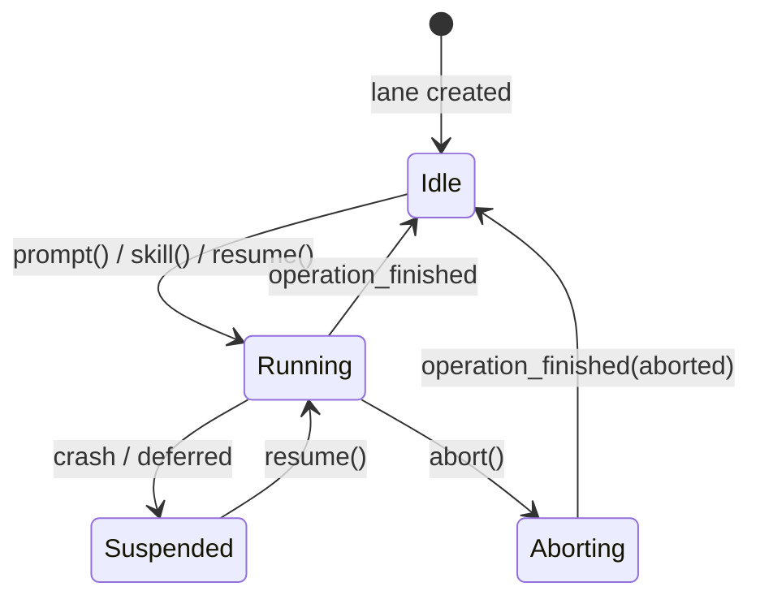
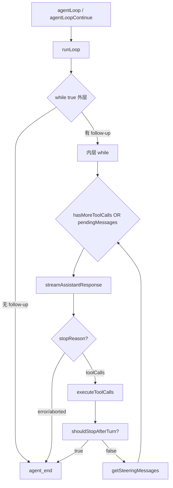
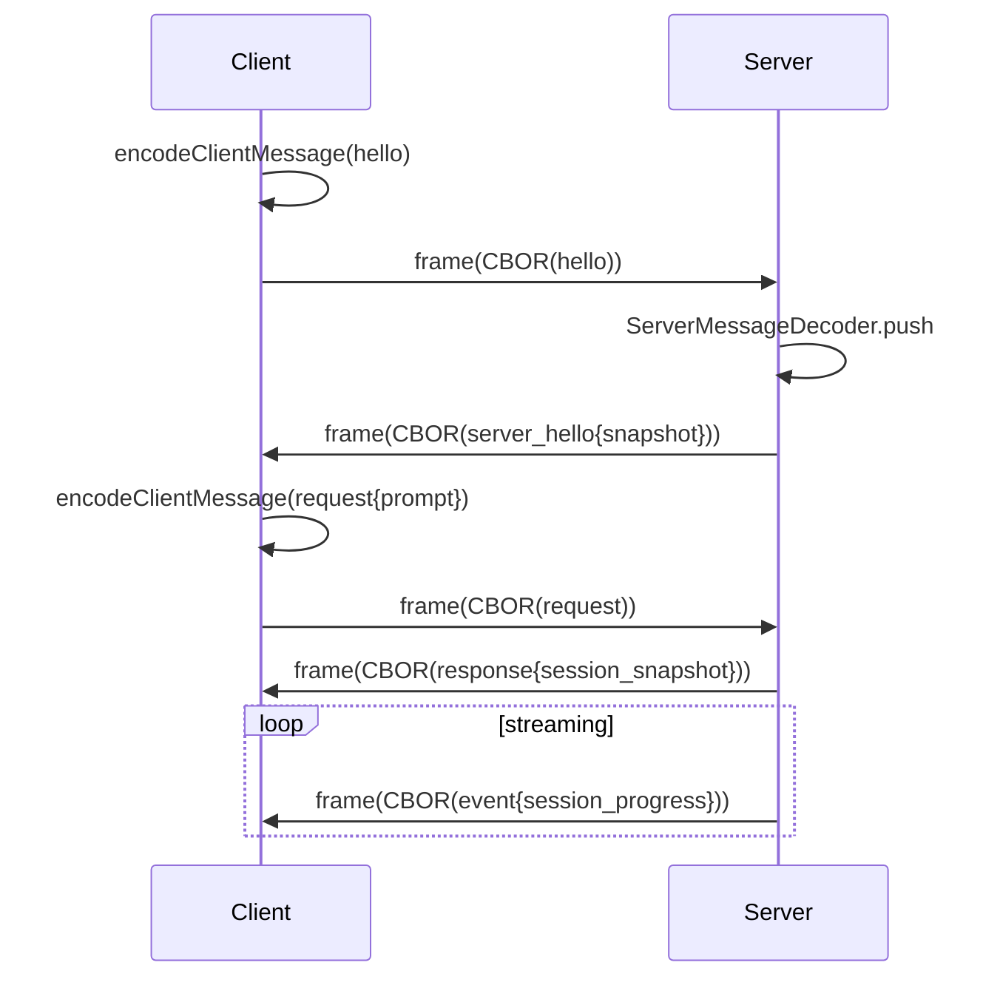

# Pi 第四轮：coding-agent / evals / protocol 深度分析

> 本轮定位：前四轮已覆盖 pi 的源码调研、深度分析、核心机制、第二轮（Operation Lane 三态/14 损坏检测/reduceLaneState 事件溯源）、第三轮（server 二进制帧协议 / session 后端 / SQLite WriterLease / JSONL 撕裂尾部修复）。**本轮聚焦前轮未完整展开的「应用层」**：coding-agent 包（任务执行/工具调用/系统提示词/Compaction）、evals 包（vitest-evals 框架/createJudge/baseline-candidate 配对统计）、protocol 包（CBOR 帧协议/消息 schema）、telemetry 包（类型化 span/隐私脱敏）、session-backends 包（双后端/WriterLease fence）、ai 包（provider 适配/thinking format）、client/tui 包，以及 Anthropic/OpenAI 协议适配的真实代码路径，最后给出对 laew 的 P0/P1/P2 借鉴路线图。

## 0. 摘要与本轮定位

| 包 | 路径 | 本轮新增内容 |
|----|------|-------------|
| agent | `packages/agent/src` | Operation Lane 三态机、`reduceLaneState` 事件溯源、14 种 `RecordLogCorruptionReason` 完整枚举与校验函数 |
| coding-agent | `packages/coding-agent/src` | `AgentSession` 生命周期、`buildSystemPrompt`、8 大工具（read/bash/edit/write/grep/find/ls/powershell）、Compaction 管线 |
| evals | `packages/evals/src` | `createPiCodingAgentHarness`、`evalHarnessTable` baseline-candidate 配对、`createJudge`、`summary.ts` 统计 |
| protocol | `packages/protocol/src` | CBOR + 4 字节 length-prefixed 帧、ClientMessage/ServerMessage schema、`FrameDecoder` 增量解码 |
| telemetry | `packages/telemetry/src` | `TelemetrySchemaDefinition` 类型推导、`InMemoryTelemetryContext`、`sensitive` 脱敏标记 |
| session-backends | `packages/session-backends/sqlite-node` | `WriterLease` fence 原子 acquire/renew/release、双后端（JSONL+SQLite） |
| ai | `packages/ai/src` | 11 个 provider API、`AssistantMessageEvent` 11 种事件、thinking format 12 种变体 |
| client | `packages/client/src` | `PiClient`、session lease、请求/响应/事件三通道 |
| tui | `packages/tui/src` | `BoundedTerminalWriter` 1 MiB 分块、Kitty 图像协议 |

本轮所有结论均锚定到真实文件路径与代码行。

---

## 1. agent 包核心（Operation Lane 三态 / reduceLaneState / 14 种损坏检测）

agent 包是 pi 的「编排内核」。核心文件：

- `packages/agent/src/agent-loop.ts` — 双层 while 循环（外层 follow-up / 内层 tool-call + steering）
- `packages/agent/src/agent.ts` — 有状态 `Agent` 包装器（steering/follow-up 队列、`PendingMessageQueue`）
- `packages/agent/src/types.ts` — `AgentEvent`、`AgentTool`、`ThinkingLevel`、`QueueMode`
- `packages/agent/src/harness/reducer.ts` — **事件溯源核心** `reduceLaneState` + 14 种损坏检测
- `packages/agent/src/harness/events.ts` — `HarnessEventBus`（watch 缓冲 + 快照）
- `packages/agent/src/harness/session/types.ts` — Entry / LaneRecord / ProvisionedEntry 完整类型

### 1.1 Operation Lane 三态机

pi 的 session 由多条 **lane** 组成（类似 git 分支）。每条 lane 同一时刻最多一个 **open operation**，operation 有三种 kind：`run` / `compaction` / `navigation`。



`LaneState.operation` 的 kind 字段（`packages/agent/src/harness/reducer.ts:84`）精确记录当前操作：

```typescript
operation: null | {
  id: string;
  kind: "run" | "compaction" | "navigation";
  intent: OperationStartedRecord["intent"];
  aborting: boolean;
  step: null | { kind: "assistant" | "compaction" | "branch_summary"; attempts: number; resultEntryId: string };
  toolBatch: ToolBatchState | null;
  pendingSteer: ProvisionedEntry[];
  pendingFollowUp: ProvisionedEntry[];
  deferred: DeferredHandle | null;
  overflowRecoveryUsed: boolean;
};
```

### 1.2 reduceLaneState 事件溯源

`reduceLaneState`（`reducer.ts:506`）是 **纯函数**，从 bounded recovery input 重建单条 lane 的编排状态：

```typescript
export function reduceLaneState(input: LaneReductionInput): LaneReductionResult {
  validateRecordLog(input);          // 先校验记录日志合法性
  const records = bySequence(input.records);
  // ... 推导 effectiveConfiguration / pendingNextRun / step / toolBatch / terminalFailure
}
```

关键设计：
1. **先验证后还原**：`validateRecordLog` 在还原前抛出 `RecordLogCorruption`，避免脏状态传播。
2. **纯函数**：不读/不写 session 状态，仅从 `RecordLogSlice`（openOperations + records + entries）重建。
3. **effectiveConfiguration 推导**：按 seq 顺序折叠 `model_change` / `thinking_level_change` / `active_tools_change` / assistant message 的 provider/model（`deriveEffectiveConfiguration`，`reducer.ts:400`）。
4. **terminalFailure 检测**：当 newestOwn 是 `stopReason === "error"` 的 assistant message，且由 step 或 deferred_fetch 产生时，标记为终态失败（`reducer.ts:614-640`）。

### 1.3 14 种 RecordLogCorruptionReason

`RecordLogCorruptionReason`（`reducer.ts:22-35`）是 pi 对「单 writer 记录协议不可能产生的状态」的完整枚举。每种 reason 对应一个校验函数：

| # | reason | 校验函数/位置 | 含义 |
|---|--------|--------------|------|
| 1 | `multiple_open_operations` | `validateRecordLog:313` | 单 lane 同时存在 ≥2 个 open operation |
| 2 | `unknown_operation` | `validateRecordLog:336` | record 引用了不存在的 runId |
| 3 | `record_after_finish` | `validateRecordLog:339` | record 出现在 operation_finished 之后 |
| 4 | `non_consecutive_attempt` | `validateAttemptSequence:192` | attempt 编号不连续（跳号） |
| 5 | `invalid_compaction_reason` | `validateAttemptReason:169` | compaction 缺少 reason，或非 compaction 携带 reason |
| 6 | `queue_after_abort` | `validateRecordLog:365` | abort 之后仍 enqueue steering |
| 7 | `invalid_queue_cancellation` | `validateRecordLog:373` | 取消不存在的队列项，或目标 entry 已存在 |
| 8 | `inconsistent_step` | `validateAttemptSequence:199` | 同 step 的多次 attempt 的 resultEntryId/compactionReason 不一致 |
| 9 | `tool_call_mismatch` | `validateToolStart:256` | tool_started 与 assistant message 的 toolCall 不匹配 |
| 10 | `duplicate_tool_invocation` | `validateToolStart:243` | 同一 invocation 被记录两次 |
| 11 | `provisioned_entry_mismatch` | `validateExactProvisionedEntry:147` | provisioned id 存在但内容不同 |
| 12 | `invalid_deferred_handle` | `validateDeferredHandles:273` | deferred assistant message 缺少 handle |

```typescript
export type RecordLogCorruptionReason =
  | "multiple_open_operations" | "unknown_operation" | "record_after_finish"
  | "non_consecutive_attempt" | "invalid_compaction_reason" | "queue_after_abort"
  | "invalid_queue_cancellation" | "inconsistent_step" | "tool_call_mismatch"
  | "duplicate_tool_invocation" | "provisioned_entry_mismatch" | "invalid_deferred_handle";
```

测试用例（`test/harness/reducer.test.ts:322-440`）以 `corruptionCases` 数组驱动 `it.each`，每个 case 精确匹配一种 reason。

### 1.4 agent-loop 双层循环架构



关键容错（`agent-loop.ts:226-241`）：当 `stopReason === "length"`（输出被 token 截断）时，**所有 tool call 直接失败**，不执行——因为截断的 JSON 参数可能静默不完整。这是 pi 的防御性设计。

---

## 2. coding-agent 包（任务执行 / 工具调用）

`packages/coding-agent/src` 是 pi 的「产品层」，在 agent 内核之上构建完整交互 Agent。

### 2.1 AgentSession 核心

`core/agent-session.ts`（~350 行）是所有运行模式（interactive / print / rpc）共享的抽象：

```typescript
// agent-session.ts:144
export type AgentSessionEvent =
  | Exclude<AgentEvent, { type: "agent_end" }>
  | { type: "agent_end"; messages: AgentMessage[]; willRetry: boolean }
  | { type: "agent_settled" }
  | { type: "queue_update"; steering: readonly string[]; followUp: readonly string[] }
  | { type: "compaction_start"; reason: "manual" | "threshold" | "overflow" }
  | { type: "compaction_end"; reason: ...; result: CompactionResult | undefined; aborted: boolean; willRetry: boolean }
  | { type: "auto_retry_start"; attempt: number; maxAttempts: number; delayMs: number }
  | { type: "bash_execution_update"; id?: string; delta: string };
```

AgentSession 通过 `subscribe` 监听 `AgentEvent`，将核心事件翻译为 UI 友好事件（compaction_start/end、auto_retry、bash_execution_update）。它持有：
- `SessionManager`（session 持久化）
- `ModelRuntime`（provider 解析）
- `ExtensionRunner`（扩展热加载）
- `ModelRegistry`（模型目录）

### 2.2 buildSystemPrompt 与项目上下文注入

`core/system-prompt.ts` 的 `buildSystemPrompt`（`system-prompt.ts:28`）负责：

1. **customPrompt 路径**：追加 `<project_context>` 块（含多个 `<project_instructions path="...">`）+ skills 格式化（`formatSkillsForPrompt`）+ cwd。
2. **默认路径**：从 `config.ts` 的 `getReadmePath()` / `getDocsPath()` / `getExamplesPath()` 读取文档，构建工具列表（`read/bash/edit/write` 可见性由 `toolSnippets` 决定）+ guidelines 列表。

```typescript
// system-prompt.ts:54-61
if (contextFiles.length > 0) {
  prompt += "\n\n<project_context>\n\n";
  prompt += "Project-specific instructions and guidelines:\n\n";
  for (const { path: filePath, content } of contextFiles) {
    prompt += `<project_instructions path="${filePath}">\n${content}\n</project_instructions>\n\n`;
  }
  prompt += "</project_context>\n";
}
```

> 对 laew 的启示：pi 的 `<project_context>` 注入与 laew 的 `<<<LAEW:PROJECT_CONTEXT>>>` 标记隔离异曲同工，但 pi 直接在 system prompt 内联，laew 用独立 user 消息——后者更利于审计与幂等。

### 2.3 8 大工具体系

`core/tools/index.ts` 定义完整工具集：

```typescript
export type ToolName = "read" | "bash" | "powershell" | "edit" | "write" | "grep" | "find" | "ls";
export const allToolNames: Set<ToolName> = new Set(
  ["read","bash","powershell","edit","write","grep","find","ls"]
);
```

每个工具由 `createXxxTool`（执行体）+ `createXxxToolDefinition`（Schema 定义）配对导出。工具通过 `createToolDefinition(toolName, cwd, options)` 工厂按名称创建。`withFileMutationQueue`（`tools/file-mutation-queue.ts`）提供文件变更串行化。

Bash 工具是核心——`bash.ts` 通过 `createLocalBashOperations` 封装执行，支持 `BashSpawnHook` 拦截。`exec.ts` 提供沙箱执行环境。

### 2.4 Compaction 管线

`core/compaction/compaction.ts` 实现上下文压缩：

- **File Operation Tracking**：`extractFileOperations` 从消息和前一 compaction 条目收集 read/modified 文件列表，存入 `CompactionDetails`。
- **CompactionResult**：`{ summary, firstKeptEntryId, tokensBefore, estimatedTokensAfter, usage, details }`。
- **shouldCompact / prepareCompaction / compact** 三阶段（`compaction/index.ts`）：判断→准备→执行。
- **自动触发**：由 `AgentSession` 在 token 超阈值时触发 `compaction_start`（reason: "threshold" 或 "overflow"）。
- **branch-summarization**：切换分支时生成摘要（`branch-summarization.ts`）。

Compaction 与 agent-loop 的 `prepareNextTurn` 协作：`overflowRecoveryUsed` 标记（`reducer.ts:587`）记录是否已使用 overflow compaction 恢复，避免无限循环。

---

## 3. evals 包（评估体系 / createJudge / baseline-candidate）

`packages/evals/src` 基于外部 `vitest-evals@0.15.0` 框架构建，核心创新是 **baseline-candidate 配对统计**。

### 3.1 createPiCodingAgentHarness

`pi-harness.ts` 的 `createPiCodingAgentHarness`（`pi-harness.ts:246`）封装完整的 Agent 运行：

```typescript
export function createPiCodingAgentHarness<TOutput extends JsonValue>(
  options: PiCodingAgentHarnessWithOutput<TOutput> = {}
) {
  return createHarness<PiCodingAgentInput, string | TOutput>({
    name: options.name ?? "pi-coding-agent",
    run: ({ input, signal, setArtifact }) => runPiCodingAgent(input, signal, setArtifact, options),
  });
}
```

`runPiCodingAgent`（`pi-harness.ts:109`）流程：
1. `resolveModelSelection` — 从 `PI_PROVIDER`/`PI_MODEL` env 或显式参数解析模型
2. `mkdtemp` 创建隔离 workspace（`pi-eval-XXXX/workspace` + `agent`）
3. `createAgentSessionServices` + `SessionManager.create` + `createAgentSessionFromServices` 构建会话
4. 支持 `transformSystemPrompt` 覆写（用于对比实验）
5. 多步 input：`{type:"prompt"} | {type:"reload"}` 序列（先创建扩展→reload→调用）
6. 产出 `SimpleHarnessResult`：含 `output`、`events`（transcript 事件流）、`usage`（tokens/cost）、`timings`
7. 清理：`session.dispose()` + `rm -rf`，失败时 `AggregateError` 聚合

### 3.2 createJudge

`createJudge` 来自 `vitest-evals` 框架（pi 侧使用）。典型用法（`extensions.eval.ts:53`）：

```typescript
const ExtensionAuthoringJudge = createJudge<PiCodingAgentInput, ExtensionAuthoringOutput>(
  "ExtensionAuthoringJudge",
  ({ output, toolCalls }) => {
    const failures: string[] = [];
    if (!output.extensionSource.includes("@earendil-works/pi-coding-agent"))
      failures.push("extension does not import the canonical package");
    if (!toolCalls.some(call => call.name === "hello" && call.result === "Hello, Bob!"))
      failures.push("no successful hello call");
    return { score: failures.length === 0 ? 1 : 0, metadata: { rationale: ... } };
  }
);
```

Judge 返回 `{score, metadata}`，score ∈ [0,1]。`judgeThreshold: null` 表示不自动判定 pass/fail，仅用于统计。

### 3.3 evalHarnessTable baseline-candidate 配对

`harness-table.ts` 的 `evalHarnessTable`（`:157`）生成配对矩阵：

```typescript
export function evalHarnessTable<TInput, TOutput>(evalSet, options) {
  const repetitions = options.repetitions ?? 1;
  const candidates = "candidate" in options ? [options.candidate] : options.candidates;
  for (let repetition = 1; repetition <= repetitions; repetition++) {
    for (const harness of [baseline, ...candidates]) {
      rows.push({ harness: withIterationArtifact(harness, plan), name, repetition });
    }
  }
}
```

- `deriveEvalGroupKey(input, repetition)` = `SHA256(canonicalJson(input)) + repetition`，确保同输入同重复次数配对。
- `withIterationArtifact` 注入 `EVAL_HARNESS_ITERATION_ARTIFACT`（含 evalSet/groupKey/baseline/candidates/repetition），供 reporter 收集。

### 3.4 summary.ts 配对统计

`summary.ts` 的 `summarizeHarnessComparisons`（`:300`）产出 `HarnessComparisonReport`：

```typescript
export type HarnessPairComparison = {
  baseline: string; candidate: string;
  correctness: CorrectnessLiftSummary;   // pass rate lift (pp)
  totalTokens: PairedMetricSummary;      // mean delta
  totalMs: PairedMetricSummary;
  estimatedCostUsd: PairedMetricSummary;
};
```

- **CorrectnessLift**：`lift = candidatePassRate - baselinePassRate`，含 `baselineWins/candidateWins/ties`。
- **PairedMetricSummary**：`meanDelta = candidateMean - baselineMean`，`eligiblePairs` 仅统计双方都 scored 的配对。
- **诊断**：`missing-observation` / `duplicate-observation` / `harness-error` / `missing-score` / `unscorable-outcome` 五种异常。
- **格式化**：`formatHarnessComparisonReport` 输出彩色报告（pass rate 用 pp 差值 + 绿/红着色）。

### 3.5 真实 eval 用例

- `smoke.eval.ts`：基础冒烟——`noTools: "all"` 下问「法国首都」，断言 output === "Paris"。
- `extensions.eval.ts`：扩展编写工作流——创建 `.pi/extensions/hello.ts` → reload → 调用 `hello({name:"Bob"})` → 断言返回 "Hello, Bob!"。使用 `evalHarnessTable` 对比两个 system prompt 变体（`system-prompt-without-docs` vs `default-system-prompt`）。

---

## 4. protocol 包（协议定义 / 消息格式）

`packages/protocol/src` 定义 pi server ↔ client 的二进制帧协议。

### 4.1 帧格式：4 字节 length-prefixed + CBOR

`framing.ts` 实现增量帧解码：

```typescript
const FRAME_HEADER_LENGTH = 4;
const DEFAULT_MAX_FRAME_LENGTH = 16 * 1024 * 1024; // 16 MiB

export function encodeFrame(payload: Uint8Array): Uint8Array {
  const frame = new Uint8Array(FRAME_HEADER_LENGTH + payload.byteLength);
  frame[0] = length >>> 24; frame[1] = length >>> 16;
  frame[2] = length >>> 8;  frame[3] = length;
  frame.set(payload, FRAME_HEADER_LENGTH);
  return frame;
}
```

`FrameDecoder`（`:58`）是增量解码器：`push(chunk) → Uint8Array[]`，内部用 64 KiB `PAYLOAD_BLOCK_SIZE` 分块累积，避免大 payload 多次拷贝。`end()` 检测截断帧（`Truncated frame at end of stream`）。

### 4.2 codec.ts：验证 + 编码

`codec.ts` 组合帧 + CBOR + schema 验证：

```typescript
export function encodeClientMessage(message, options?): Uint8Array {
  return encodeProtocolMessage(message, parseClientMessage, "client", options);
}
function encodeProtocolMessage(value, parse, kind, options) {
  const validated = parse(value);                    // TypeBox schema 校验
  const frame = encodeFrame(encodeCbor(validated)); // CBOR 序列化 + 帧封装
  assertCompleteFrame(frame);                       // 帧完整性校验
  return frame;
}
```

`ClientMessageDecoder` / `ServerMessageDecoder` 是增量解码器，`push(chunk) → Message[]`。

### 4.3 schemas.ts：完整消息 schema

`schemas.ts` 用 TypeBox 定义：

**ClientMessage** = `ClientHello | RequestEnvelope`
- `ClientHello`: `{ type:"hello", version: integer }`
- `RequestEnvelope`: `{ type:"request", id, request: Command }`

**Command** 9 种：`list | create | attach | detach | prompt | steer | abort | set_model | set_thinking`

**ServerMessage** = `ServerHello | ServerHelloError | ResponseEnvelope | EventEnvelope`
- `ServerHello`: `{ type:"hello", version, connectionId, snapshot: ServerSnapshot }`
- `ResponseEnvelope`: `{ type:"response", id, ok: true, result } | { ..., ok:false, error }`
- `EventEnvelope`: `{ type:"event", event: ServerEvent }`

**ServerEvent** 4 种：`server_snapshot | session_snapshot | session_progress | session_removed`

**SessionSnapshot** 关键字段：
```typescript
SessionSnapshot = {
  id, name?, cwd, createdAt, updatedAt,
  phase: "idle" | "turn" | "compaction" | "branch_summary" | "retry",
  model: ModelRef, thinkingLevel, attached, locked, revision,
  transcript: TranscriptItem[],           // user/assistant/tool 三态
  queuedSteer: UserTranscriptItem[],
  queuedSteerCount
}
```

**TranscriptItem** 三态机：
- `UserTranscriptItem`: `{ id, role:"user", content: (Text|Image)[], timestamp }`
- `AssistantTranscriptItem`: streaming | complete | error | aborted（status 区分）
- `ToolTranscriptItem`: running | complete | error（status + isError）

**TranscriptProgress** 增量事件：`item_started | assistant_delta | item_updated | item_finished`

**ProtocolError** code：`version | busy | session_locked | not_found | invalid_request | not_implemented | internal_error`



---

## 5. telemetry 包（遥测 / span / 脱敏）

`packages/telemetry/src` 提供 **类型化遥测 schema** + 内存参考实现。

### 5.1 核心类型

`index.ts` 定义三层抽象：

```typescript
export interface TelemetryContext {
  startSpan<T>(options: SpanOptions, callback: (span: TelemetrySpan) => T | Promise<T>): Promise<T>;
}
export interface TelemetrySpan extends TelemetryContext {
  addEvent(name: string, attributes?: SpanAttributes): void;
  setAttributes(attributes: SpanAttributes): void;
  setStatus(status: SpanStatus): void;
}
export type SpanStatus = { status: "ok" } | { status: "error"; error?: { name: string; message: string } };
```

### 5.2 类型化 Schema 推导（TelemetrySchemaDefinition）

`index.ts:66-356` 是 pi 遥测的杀手级特性——**编译期推导 span 属性类型**：

```typescript
export interface TelemetrySpanDefinition {
  description: string;
  parents: TelemetryParentDefinition;          // "any" | "root_or_external" | "spans"
  startAttributes: Record<string, TelemetryStartAttributeDefinition>;
  endAttributes: Record<string, TelemetryAttributeDefinition>;
  events?: Record<string, TelemetryEventDefinition>;
  status: { default: "ok"; errorWhen: string };
}

export interface TelemetryAttributeMetadata {
  description: string;
  sensitive?: boolean;      // ← 隐私脱敏标记
  cardinality?: "low" | "high";
}
```

`sensitive?: boolean` 是隐私脱敏的关键字段——标记为 sensitive 的属性在导出/日志时可由后端遮蔽。

类型推导工具链：
- `TelemetrySchemaSpanStartAttributes<Schema, Name>` — 推导某 span 的 start 属性（required/optional 分离）
- `TelemetrySchemaSpanEndAttributes<Schema, Name>` — 推导 end 属性
- `TelemetrySchemaSpanEventAttributes<Schema, Name, EventName>` — 推导事件属性
- `createTypedSpanStarter(telemetryContext, schemas)` — 绑定到具体 Context，返回类型安全的 `startSpan(name, attrs, callback)`

```typescript
const startSpan = createTypedSpanStarter(context, [mySchema] as const);
await startSpan("agent_turn", { runId }, async (span) => {
  // span.setAttributes / span.addEvent 完全类型化
});
```

### 5.3 InMemoryTelemetryContext

`memory.ts` 的 `InMemoryTelemetryContext`（`:192`）是后端无关的参考实现：

```typescript
export class InMemoryTelemetryContext implements TelemetryContext {
  private readonly state: InMemoryTelemetryState = { spans: [], nextSpanId: 1, nextEndSequence: 1 };
  startSpan(options, callback) { /* 创建 MutableRecordedTelemetrySpan，递归 startInMemorySpan */ }
  getSpans(): readonly RecordedTelemetrySpan[] { /* 返回 detached snapshots */ }
}
```

关键设计：
- **parent 已 settled 则 child 走 noop**（`:126`）：避免孤儿 span。
- **自动错误状态**：callback 抛异常时 `automaticErrorStatus(error)` 捕获 `{name, message}`（`:78`）。
- **endSequence**：span 结束顺序独立于 start 顺序，便于分析并发。
- **被动记录**：`addEvent`/`setAttributes`/`setStatus` 内部 try-catch，永不抛异常（`:141-165`）。

---

## 6. session-backends 包（双后端 / WriterLease / 撕裂修复）

`packages/session-backends/sqlite-node` 实现 SQLite 持久化后端。

### 6.1 WriterLease fence 协议

`sqlite/storage/writer-leases.ts` 实现 **租约式单 writer**：

```typescript
export function acquireWriterLease(db, sessionId, ownerId, now, expiresAtMs) {
  const row = sql`INSERT INTO writer_leases (session_id, owner_id, fence, expires_at_ms)
    VALUES (${sessionId}, ${ownerId}, 1, ${expiresAtMs})
    ON CONFLICT(session_id) DO UPDATE SET
      owner_id = excluded.owner_id,
      fence = writer_leases.fence + 1,       -- ← fence 单调递增
      expires_at_ms = excluded.expires_at_ms
    WHERE writer_leases.expires_at_ms <= ${now}  -- ← 仅过期租约可被抢占
    RETURNING owner_id, fence, expires_at_ms`.get(db);
  return row === undefined ? undefined : { ... };
}
```

- **acquire**：`INSERT ... ON CONFLICT ... WHERE expires_at_ms <= now`——仅当现有租约过期时才抢占，fence +1。
- **renew**：`UPDATE ... WHERE owner_id AND fence AND expires_at_ms > now`——必须匹配 ownerId + fence + 未过期，才能续期。
- **release**：`DELETE WHERE session_id AND owner_id AND fence`——精确释放。

这是经典的 **fence token** 模式：fence 单调递增保证旧 owner 的写入被拒绝，即使它认为自己仍持有租约。

### 6.2 JSONL 撕裂尾部修复

`packages/agent/src/harness/session/jsonl/storage.ts` 的 `JsonlSessionStorage.load`（`:69`）处理崩溃恢复：

```typescript
for (let index = 1; index < physicalLines.length; index++) {
  const mutationResult = parseMutation(line);
  if (!mutationResult.ok) {
    const isTornTail = index === physicalLines.length - 1 && mutationResult.error.kind === "syntax";
    if (isTornTail) {
      // 原子发布有效前缀（丢弃未确认的部分追加）
      const validPrefix = `${physicalLines.slice(0, index).join("\n")}\n`;
      await publishFileAtomically(fs, path, async (tempPath) => {
        await fs.writeFile(tempPath, validPrefix);
      });
      return storage;
    }
    throw invalidFile(path, index + 1, mutationResult.error);
  }
}
```

关键：**仅最后一行且为 syntax error 时才视为撕裂**——中间行的损坏直接抛错（可能是真正的数据损坏）。`publishFileAtomically` 先写 `.tmp` 再 `rename`，保证原子性。

`publishFileAtomically`（`:33`）：
```typescript
async function publishFileAtomically(fs, destinationPath, populate) {
  const tempPath = `${destinationPath}.tmp`;
  try {
    await populate(tempPath);
    await fs.renameFile(tempPath, destinationPath);  // 原子替换
  } catch (error) {
    await fs.remove(tempPath, { force: true });     // 失败清理
    throw error;
  }
}
```

### 6.3 SessionStorage 串行化

`JsonlSessionStorage` 通过 `enqueue`（`:258`）实现写串行化：

```typescript
private enqueue<T>(operation: () => Promise<T>): Promise<T> {
  const result = this.tail.then(operation);
  this.tail = result.then(() => undefined, () => undefined); // 永不中断链
  return result;
}
```

所有写操作（createLane/appendEntry/appendRecord/setName）通过 `this.tail` Promise 链串行，保证 append-only 写入顺序。

---

## 7. ai / client / tui 包

### 7.1 ai 包：provider 适配与 thinking format

`packages/ai/src` 是 pi 的 LLM 抽象层。

**11 个 KnownApi**（`types.ts:17-27`）：
```
openai-completions | mistral-conversations | openai-responses | azure-openai-responses |
openai-codex-responses | anthropic-messages | bedrock-converse-stream | google-generative-ai |
google-vertex | pi-messages
```

**30+ KnownProvider**（`types.ts:35-75`）：anthropic / openai / google / bedrock / mistral / deepseek / xai / groq / cerebras / openrouter / vercel-ai-gateway / cloudflare / github-copilot 等。

**AssistantMessageEvent 11 种**（`types.ts:535-551`）：

```typescript
export type AssistantMessageEvent =
  | { type: "start"; partial: AssistantMessage }
  | { type: "text_start"; contentIndex; partial }
  | { type: "text_delta"; contentIndex; delta; partial }
  | { type: "text_end"; contentIndex; content; partial }
  | { type: "thinking_start" | "thinking_delta" | "thinking_end"; ... }
  | { type: "toolcall_start" | "toolcall_delta" | "toolcall_end"; ... }
  | { type: "done"; reason: "stop"|"length"|"toolUse"|"deferred"; message }
  | { type: "error"; reason: "aborted"|"error"; error: AssistantMessage };
```

**thinkingFormat 12 种**（`types.ts:579-590`）：`openai | openrouter | deepseek | together | baseten | zai | qwen | chat-template | qwen-chat-template | string-thinking | ant-ling`。每种格式映射到不同的请求字段（`reasoning_effort` / `reasoning: {effort}` / `thinking: {type}` / `enable_thinking` / `chat_template_kwargs` 等）。

**ThinkingBudgets**（`types.ts:100`）：`{ minimal?, low?, medium?, high? }` token 预算。

### 7.2 Anthropic 协议适配真实路径

`api/anthropic-messages.ts`（44.8k 行）：

1. **认证头**：`assertRequestAuth`（`:297`）检查 apiKey / `authorization` / `x-api-key` / `cf-aig-authorization` 四者之一。
2. **User-Agent**：`mergeClientHeaders`（`:284`）注入 `getPiUserAgent()`。
3. **Stealth 模式**：`claudeCodeVersion = "2.1.251"`（`:77`），工具名映射到 Claude Code  canonical casing（`toClaudeCodeName` `:105`），mimic Claude Code。
4. **Cache Control**：`getCacheControl`（`:60`）支持 `none/short/long`（1h TTL）。
5. **流式**：`client.messages.create({ ...params, stream: true }).asResponse()`（`:576`），SSE 事件解析 `iterateAnthropicEvents`。
6. **事件处理**（`:589-610`）：`message_start` → 捕获 usage（input/output/cacheRead/cacheWrite/cacheWrite1h）；`content_block_start/delta/stop` → 累积 text/thinking/toolCall。
7. **重试**：`retryProviderRequest`（`:575`），`maxRetries` + `maxRetryDelayMs` + `signal`。
8. **metadata.user_id**（`:1093`）：Anthropic 特有的 user_id 追踪。

### 7.3 OpenAI 协议适配真实路径

`api/openai-completions.ts`（62.4k 行，最复杂的适配器）：

1. **认证头**（`:756`）：`headers = { "User-Agent": getPiUserAgent(), ...model.headers }`。
2. **Session Affinity**（`:766`）：`x-session-id` / `session_id` / `x-client-request-id` / `x-session-affinity`。
3. **GitHub Copilot**（`:758`）：`buildCopilotDynamicHeaders` 动态构建。
4. **流式**：`client.chat.completions.create(params, requestOptions).withResponse()`（`:367`）。
5. **tool_choice / thinking format**：根据 `compat.thinkingFormat` 映射到不同字段。

### 7.4 client 包

`client/src/client.ts` 的 `PiClient`（`:51`）：

- **三通道**：`pendingRequests` Map（请求/响应）+ session lease 计数 + connection 状态。
- **Session Lease**：`#sessionLeaseCounts` / `#exclusiveSessionLeases` / `#sessionLeaseGenerations`——支持独占/共享租约模式。
- **状态同步**：`#state.applyServerSnapshot(snapshot)` 在握手和 `server_snapshot` 事件时更新。
- **连接管理**：`connect/reconnect/disconnect/dispose`，dispose 时清理所有 pendingRequests。

### 7.5 tui 包

`tui/src/tui-main-screen.ts` 的 `BoundedTerminalWriter`（`:17`）：

```typescript
class BoundedTerminalWriter {
  private buffer = "";
  private readonly write: (data: string) => void;
  append(value: string): void {
    // 1 MiB MAX_RENDER_WRITE_CHUNKS 分块
    // 保留代理对（surrogate pair）不被分割
    while (offset < value.length) {
      const capacity = MAX_RENDER_WRITE_CHUNKS - this.buffer.length;
      // ... 处理 high surrogate 在边界的情况
    }
  }
}
```

- **1 MiB 分块**：避免 V8 字符串大小限制。
- **代理对保护**（`:42-48`）：检测 `0xD800-0xDBFF` high surrogate，避免在边界处分割 UTF-16。
- **Kitty 图像协议**（`:80`）：`parseKittyImageHeader` 解析 `\x1b_G` 序列，提取图像 ID/rows。

`tui/src/editor-component.ts` + `autocomplete.ts` + `keybindings.ts` 提供完整编辑器。

---

## 8. 协议适配真实代码路径（Anthropic / OpenAI）

本节汇总两协议在 ai 包中的真实代码路径对比。

| 维度 | Anthropic (`anthropic-messages.ts`) | OpenAI (`openai-completions.ts`) |
|------|--------------------------------------|----------------------------------|
| 认证 | `x-api-key` / `authorization`（`:297-307`） | `Authorization: Bearer` via `new OpenAI({apiKey})`（`:783`） |
| User-Agent | `getPiUserAgent()`（`:285`） | `getPiUserAgent()`（`:756`） |
| 流式入口 | `client.messages.create({stream:true}).asResponse()`（`:576`） | `client.chat.completions.create(params).withResponse()`（`:367`） |
| SSE 解析 | `iterateAnthropicEvents` + `ANTHROPIC_MESSAGE_EVENTS` Set（`:321`） | OpenAI SDK 内置 |
| 事件类型 | `message_start/content_block_start/delta/stop/message_delta/stop` | `chat.completion.chunk` |
| Usage 捕获 | `message_start.usage.input_tokens` 等（`:602-609`） | `completion.usage` |
| 重试 | `retryProviderRequest({maxRetries, maxRetryDelayMs, signal})`（`:575`） | 同 |
| Thinking | `thinking` content block + `budget_tokens` | `reasoning_effort` / `thinking`（12 种 format） |
| Cache | `cache_control: {type:"ephemeral", ttl:"1h"}`（`:60-74`） | prompt cache（隐式） |
| metadata.user_id | `options.metadata.user_id`（`:1093`） | 无 |
| Stealth | Claude Code 工具名映射（`:77-113`） | 无 |
| onPayload 钩子 | `options?.onPayload?.(params, model)`（`:566`） | 同 |
| 截断保护 | `parseStreamingJson` + `parseJsonWithRepair` | 同 |

**统一抽象**：两协议都实现 `StreamFn` 类型（`types.ts:28-32`），返回 `AssistantMessageEventStream`。Agent 循环（`agent-loop.ts`）只接触 `AssistantMessageEvent`，不感知协议差异。

---

## 9. 其他维度实现快照

下表横向覆盖多轮对话/Context/记忆/质检/任务拆解/工具/MCP/Skill/SubAgent/Workflow/loop/目标规划/沙箱/权限。

| 维度 | pi 实现 | 关键文件/代码 |
|------|---------|--------------|
| **多轮对话** | `Agent` 类持有 `_state.messages: AgentMessage[]`，`agentLoopContinue` 从当前上下文继续 | `agent.ts:361-388` agent-loop.ts:65-94 |
| **Context 管理** | `transformContext` 回调在 LLM 调用前裁剪；`convertToLlm` 过滤 UI-only 消息 | `types.ts:178-200` agent-loop.ts:287-293 |
| **记忆** | `session-backends` 双后端（JSONL append-only + SQLite）；`SessionTree` 分支树 | `session/types.ts:328-352` |
| **质检** | evals 包 `createJudge` + `judgeThreshold`；无运行时 QC，离线评估 | `extensions.eval.ts:53-98` |
| **任务拆解** | `AgentHarness` 的 `prompt/skill/promptFromTemplate` 三入口；`OperationStartedRecord.intent` 记录原始 prompt | `agent-harness.ts:274-277` |
| **工具** | 8 大工具（read/bash/edit/write/grep/find/ls/powershell）+ `withFileMutationQueue` 串行化 | `tools/index.ts:96-105` |
| **MCP** | 无原生 MCP；通过 `ExtensionRunner` 加载扩展（`.pi/extensions/*.ts`） | `extensions/index.ts` |
| **Skill** | `Skill` 接口 `{name, description, content, filePath}` + `formatSkillsForSystemPrompt`（agentskills.io 格式）注入 system prompt | `harness/types.ts:46-57` `harness/skills.ts` |
| **SubAgent** | 无显式 SubAgent；`AgentHarness` 单 lane 模型，多 lane 通过 `createLane` | `agent-harness.ts:444-449` |
| **Workflow** | `PendingMessageQueue`（steer/followUp/nextRun 三队列）+ `QueueMode`（all/one-at-a-time） | `agent.ts:125-159` types.ts:44-50 |
| **Loop** | 双层 while：外层 follow-up / 内层 tool-call+steering；`shouldStopAfterTurn` 终止 | `agent-loop.ts:156-273` |
| **目标规划** | `prepareNextTurn` 回调返回 `{context, model,thinkingLevel}` 影响下一 turn | `types.ts:225-232` |
| **沙箱** | 无沙箱；`bash.ts` 直接 `child_process.exec`，`exec.ts` 提供 `ExecutionEnv` 抽象 | `harness/env/nodejs.ts` |
| **权限** | 无运行时权限；`beforeToolCall` 可 block + terminate | `types.ts:61-69` agent-loop.ts:626-654 |
| **Compaction** | 三阶段（shouldCompact→prepare→compact）；file op tracking；branch summary | `compaction/compaction.ts:42-110` |
| **流式渲染** | `BoundedTerminalWriter` 1 MiB 分块 + 代理对保护；`AssistantMessageEvent` 11 种增量 | `tui-main-screen.ts:17-69` |
| **错误容错** | `failToolCallsFromTruncatedMessage`（length stop 时全部失败）；`retryProviderRequest` | `agent-loop.ts:379-404` |
| **可观测性** | `TelemetrySchemaDefinition` 类型化 span + `sensitive` 脱敏 + `InMemoryTelemetryContext` | `telemetry/index.ts:66-356` |
| **会话持久化** | JSONL append-only + SQLite；`WriterLease` fence；撕裂尾部修复 | `jsonl/storage.ts:69-108` `writer-leases.ts:16-32` |
| **成本控制** | `Usage` 全量追踪（input/output/cacheRead/cacheWrite/cost）；evals `estimatedCostUsd` | `protocol/schemas.ts:103-118` |
| **配置系统** | `SettingsManager` + `config.ts`；无配置文件，运行时构建 | `config.ts` `settings-manager.ts` |

---

## 10. 对 laew 的借鉴（P0 / P1 / P2）

### P0（立即落地，高 ROI）

| 借鉴点 | pi 实现 | laew 落地建议 |
|--------|---------|--------------|
| **截断 tool call 保护** | `failToolCallsFromTruncatedMessage`（`agent-loop.ts:379`） | 在 `agent/mod.rs` 的 `complete` 路径增加 `stopReason === "length"` 时全部 tool call 失败逻辑 |
| **事件溯源 reducer** | `reduceLaneState` 纯函数 + `validateRecordLog`（`reducer.ts:312-506`） | 为 laew 的 session 历史增加 append-only record log + 启动时校验 |
| **类型化遥测 schema** | `TelemetrySchemaDefinition` + `sensitive` 标记（`telemetry/index.ts:66`） | 为 laew 的 Bash/Read/Write 工具调用增加 span + 敏感信息（API key）脱敏 |
| **撕裂尾部修复** | `JsonlSessionStorage.load` 原子前缀修复（`storage.ts:84-92`） | 若 laew 用 JSONL 持久化，增加类似修复；当前 SQLite 用 WAL 可暂缓 |

### P1（中期规划）

| 借鉴点 | pi 实现 | laew 落地建议 |
|--------|---------|--------------|
| **WriterLease fence** | `acquire/renew/release` + fence 单调递增（`writer-leases.ts:16-54`） | 为 laew 的 SQLite 多进程访问增加租约保护 |
| **baseline-candidate eval** | `evalHarnessTable` + `summarizeHarnessComparisons`（`summary.ts:300`） | 为 laew 建立 eval 框架，对比不同 system prompt / 模型效果 |
| **beforeToolCall 权限钩子** | `BeforeToolCallResult {block, reason, terminate}`（`types.ts:61-69`） | 在 laew 的 Bash 工具增加命令黑名单 + 用户确认 |
| **Compaction 管线** | 三阶段 + file op tracking（`compaction/compaction.ts`） | 为 laew 增加上下文溢出时的自动摘要压缩 |
| **Stealth 模式** | Claude Code 工具名映射（`anthropic-messages.ts:77-113`） | laew 可考虑 Claude Code 兼容模式（工具名/行为对齐） |

### P2（长期储备）

| 借鉴点 | pi 实现 | laew 落地建议 |
|--------|---------|--------------|
| **CBOR 帧协议** | `FrameDecoder` + `encodeFrame`（`framing.ts:28-165`） | 若 laew 做 server 模式（远程 TUI），可参考帧协议设计 |
| **类型化 span 推导** | `createTypedSpanStarter` 编译期推导（`index.ts:349-354`） | Rust 可用 enum + match 替代，但 schema 版本管理思路可借鉴 |
| **多 lane 分支** | `SessionTree` + `createLane` + `navigateTree`（`session/types.ts:328`） | laew 可考虑对话分支/回溯能力 |
| **Skill 一等公民** | `Skill` 接口 + agentskills.io 格式注入（`harness/skills.ts`） | laew 的 MCP/SKILL 可参考其 system prompt 注入格式 |
| **扩展热加载** | `ExtensionRunner` + `.pi/extensions/*.ts` | laew 的插件生态可参考 |

---

## 11. 参考资料与文件索引

### 本轮核心引用文件

| 文件 | 行数 | 内容 |
|------|------|------|
| `packages/agent/src/agent-loop.ts` | 804 | 双层 while 循环、tool call 执行、截断保护 |
| `packages/agent/src/agent.ts` | 593 | 有状态 Agent、PendingMessageQueue、事件订阅 |
| `packages/agent/src/types.ts` | 445 | AgentEvent/AgentTool/ThinkingLevel/QueueMode |
| `packages/agent/src/harness/reducer.ts` | 667 | reduceLaneState + 14 种损坏检测 |
| `packages/agent/src/harness/events.ts` | 102 | HarnessEventBus + watch 缓冲 |
| `packages/agent/src/harness/session/types.ts` | 393 | Entry/LaneRecord/ProvisionedEntry 类型 |
| `packages/agent/src/harness/session/jsonl/storage.ts` | 277 | JSONL 撕裂尾部修复 + 写串行化 |
| `packages/agent/src/harness/session/jsonl/codec.ts` | 240 | mutation 编解码 + schema 校验 |
| `packages/coding-agent/src/core/agent-session.ts` | ~350 | AgentSession 生命周期 + 事件翻译 |
| `packages/coding-agent/src/core/system-prompt.ts` | ~200 | buildSystemPrompt + 项目上下文注入 |
| `packages/coding-agent/src/core/tools/index.ts` | ~150 | 8 大工具 + ToolName 类型 |
| `packages/coding-agent/src/core/compaction/compaction.ts` | ~300 | Compaction 三阶段 + file op tracking |
| `packages/evals/src/pi-harness.ts` | 258 | createPiCodingAgentHarness + runPiCodingAgent |
| `packages/evals/src/vitest-evals/harness-table.ts` | 194 | evalHarnessTable baseline-candidate 配对 |
| `packages/evals/src/vitest-evals/summary.ts` | 439 | summarizeHarnessComparisons + 统计报告 |
| `packages/evals/src/vitest-evals/reporter.ts` | 111 | EvalHarnessReporter + JSONL 报告 |
| `packages/evals/src/extensions.eval.ts` | 141 | 扩展编写 eval + createJudge |
| `packages/protocol/src/framing.ts` | 165 | FrameDecoder + encodeFrame |
| `packages/protocol/src/codec.ts` | 173 | 验证 + CBOR 编解码 |
| `packages/protocol/src/schemas.ts` | 451 | 完整消息 schema（9 Command + 4 ServerEvent） |
| `packages/telemetry/src/index.ts` | 358 | TelemetrySchemaDefinition + 类型推导 |
| `packages/telemetry/src/memory.ts` | 219 | InMemoryTelemetryContext |
| `packages/session-backends/sqlite-node/src/sqlite/storage/writer-leases.ts` | 59 | WriterLease fence 协议 |
| `packages/ai/src/types.ts` | ~600 | 11 Api + 30+ Provider + AssistantMessageEvent |
| `packages/ai/src/api/anthropic-messages.ts` | ~1300 | Anthropic 完整适配 |
| `packages/ai/src/api/openai-completions.ts` | ~1700 | OpenAI 完整适配 |
| `packages/ai/src/utils/event-stream.ts` | 89 | EventStream + AssistantMessageEventStream |
| `packages/client/src/client.ts` | ~400 | PiClient + session lease |
| `packages/tui/src/tui-main-screen.ts` | ~300 | BoundedTerminalWriter + Kitty 图像 |
| `packages/agent/test/harness/reducer.test.ts` | 1127 | 14 种损坏检测测试用例 |

### 前轮文档索引

- `pi-源码调研.md` — 整体架构 / 包拓扑
- `pi-深度分析.md` — 双 Agent 架构 / lane 并发
- `pi-核心机制深度分析.md` — Operation Lane 三态 / reduceLaneState
- `pi-第二轮深度分析.md` — 14 损坏检测 / reduceLaneState 事件溯源
- `pi-第三轮-server与session后端深度分析.md` — server 二进制帧 / WriterLease / JSONL 撕裂修复

> 注：前轮（尤其第二轮、第三轮）已覆盖 server 后端、WriterLease、JSONL 撕裂修复的机制分析；本轮在此基础上补齐 **coding-agent 产品层、evals 评估体系、protocol 完整 schema、telemetry 类型推导、ai 包 provider 适配、Anthropic/OpenAI 真实代码路径**，并给出对 laew 的 P0/P1/P2 借鉴路线图。

---

*文档生成时间：2026-09-06 | 基于 pi monorepo @ commit 当前 main 分支源码 | 第四轮深度分析*
