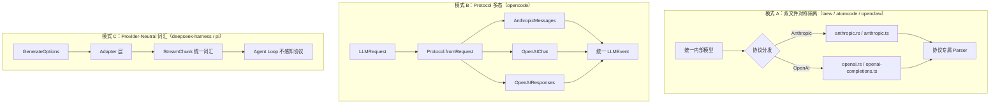
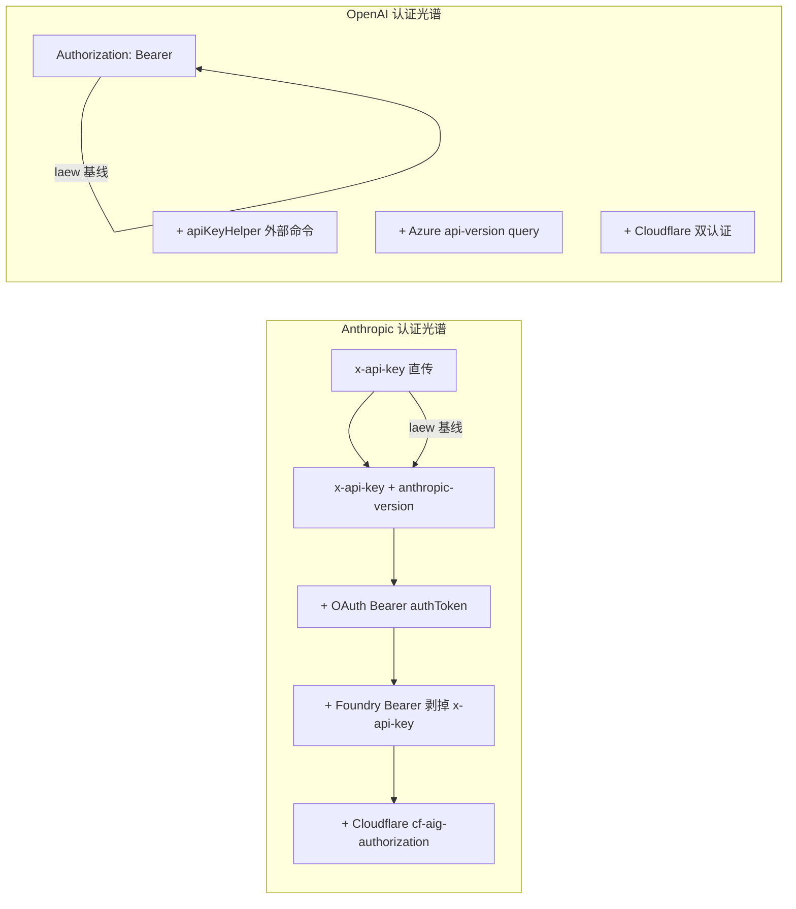

# 专题 第四轮：Anthropic 与 OpenAI 协议调用真实实现对比

> **调研日期**：2026-09-06  
> **调研范围**：7 个外部仓库 + laew 自身基线  
> **核心方法**：代码级真实源码阅读，落地到文件路径 / 函数名 / 代码片段  
> **文档规模**：12 章 / 3 幅 Mermaid 图 / 7×8 横向矩阵 / 真实代码级证据

---

## 0. 摘要与本轮定位（相对已有专题新增什么）

本工程知识库已完成三轮调研，累计 89 份文档 / 114k 行，覆盖 15 个外部 Agent 仓库。已有专题包括：

- **源码调研层**（`*-源码调研.md` / `*-深度分析.md` / `*-核心机制深度分析.md`）：单仓库纵深
- **横向专题层**（`专题-*.md`）：跨仓库某维度对比（Context / MCP / Skill / SubAgent / 任务拆解 / 质检 / 多轮对话 / 工具调用 / 记忆系统 /  Workflow / Yolo / 多Agent协作 / 沙箱 / 权限 / LLM网关 / 流式渲染 / 错误容错 / 可观测性 / 会话持久化 / 测试Eval / 成本控制 / 提示词工程 / 配置系统 / 插件生态）
- **第二轮 / 第三轮深挖**：核心机制 + 边缘模块补齐

**本轮新增的独特价值**——此前没有任何一份文档做过的事情：

| 已有专题覆盖 | 本轮首次覆盖 |
|---|---|
| 架构 / 记忆 / 工具 / 协作等"宏观维度" | **Anthropic vs OpenAI 协议 wire 级真实代码差异** |
| 某个仓库的 SSE 解析"大概怎么做的" | 7 个仓库 **SSE chunk 格式 / partial JSON 容错 / tool args 累积** 的函数级横向对比 |
| 错误处理"有没有熔断" | **429/500/timeout 在各仓库的具体错误码映射表 + 退避算法代码片段** |
| 工具定义 Schema 的"设计思路" | **`tools[].{name,description,input_schema}` vs `tools[].{type:function,function:{...}}` 的每仓库真实转换代码** |
| thinking 的"概念介绍" | **extended thinking / reasoning_effort / budget_tokens 在各仓库的请求构造 + 流式回传代码** |

简言之：**本轮是知识库唯一一份"协议实现差异"的代码级横向对比**，直接服务于 laew 的双协议维护（anthropic.rs / openai.rs）以及未来可能新增的 OpenAI Responses / Bedrock / Vertex 等协议。

### 0.1 仓库定性总览

在进入 8 维度前，先对 7 个仓库做定性定位，避免把"HTTP 库"与"Agent"混为一谈：

| 仓库 | 语言 | 定位 | 协议覆盖 | 是否本轮核心参考 |
|---|---|---|---|---|
| **atomcode** | Rust | LLM Agent（L0/L1/L2 分层） | Anthropic + OpenAI-compatible | 是 |
| **claudecode** | TypeScript/Bun | Claude Code CLI | **Anthropic 单协议** | 是（单协议深参考） |
| **deepseek-harness** | TypeScript | Cordis 插件化 Agent 框架 | Anthropic（via pi-ai 外部库）+ OpenAI | 部分（Anthropic wire 在外部库） |
| **openclaw** | TypeScript | Gateway+Harness+双向 MCP | Anthropic + OpenAI | 是 |
| **opencode** | TypeScript/Bun | Effect+Schema 全栈 DI Agent | Anthropic + OpenAI Chat + OpenAI Responses | 是（三协议典范） |
| **pi** | TypeScript | lane 并发 + 一等公民 Skill | Anthropic + OpenAI + pi-messages | 是 |
| **undici** | JavaScript | Node.js 官方 HTTP 客户端 | **纯 HTTP 传输层**（不感知 LLM 协议） | 辅助（HTTP 层参考） |

> **关键提醒**：undici 是 HTTP 客户端库（Dispatcher 体系 + llhttp 解析器），**不实现任何 LLM 协议语义**。但它被 claudecode / opencode / pi 等仓库作为底层 HTTP 传输，其 header 透传、流式 body 消费、25 种错误类是"协议层脚下的地基"。本报告在 Tool wire / Thinking / Usage 三个 LLM 专属维度将 undici 标记为"不适用"，但在请求构造 / 认证头透传 / 流式传输 / 错误类 / URL 处理五个 HTTP 层维度仍给出完整分析。

### 0.2 laew 自身基线（对照原点）

本报告在最后一章给出"对 laew 借鉴"，因此先确立 laew 当前实现的精确基线，避免空谈。

**核心文件**（`/usr/local/LsmGitOpenSource/LsmAgentEmergentWork/src/llm/`）：

| 文件 | 职责 | 关键函数/结构体 |
|---|---|---|
| `mod.rs` | 统一消息模型 + LlmClient trait + 客户端工厂 | `build_common_headers` / `client_from_record` / `normalize_endpoint` / `ChatMessage` / `ContentBlock` / `ToolDef` / `Usage` / `Completion` |
| `anthropic.rs` | Anthropic Messages 协议 | `AnthropicClient::new` / `AnthropicRequest` / `build_user_id` / `convert_messages` / `convert_tools` / `AnthropicParser::feed` / `ANTHROPIC_VERSION="2023-06-01"` |
| `openai.rs` | OpenAI Chat Completions 协议 | `OpenAiClient::new` / `OpenAiRequest` / `StreamOptions{include_usage:true}` / `convert_messages` / `convert_tools` / `OpenAiParser::feed` / `InFlightToolCall` |
| `sse.rs` | 协议无关 SSE 字节流→事件流 | `SseStream::push` / `SseEvent` / `DeltaEvent` / `ParseSink` |

**当前基线要点**：

- **双协议**：Anthropic + OpenAI Chat（**不支持 OpenAI Responses / Bedrock / Vertex**）
- **认证**：统一 `build_common_headers`（Bearer）+ Anthropic 额外 `x-api-key` + `anthropic-version`
- **SSE**：自实现 `SseStream`（按 `\n` 切行，64KiB 行缓冲上限），两协议各自 Parser 把 `SseEvent` 翻译成 `DeltaEvent`，由 `ParseSink` 聚合成 `Completion`
- **错误**：**无重试、无熔断**，仅 `HTTP {status}: {body}` 直接上抛
- **Tool wire**：Anthropic `{name,description,input_schema}` / OpenAI `{type:function,function:{name,description,parameters}}`
- **Thinking**：**未实现**（`thinking_delta`/`signature_delta` 在 AnthropicParser 中被忽略，OpenAI 侧无对应）
- **Usage**：`Usage{input_tokens, output_tokens, cache_read_input_tokens, cache_creation_input_tokens}`，无定价
- **端点**：`normalize_endpoint` 裁尾部 `/`，拼接 `/v1/messages` 或 `/chat/completions`

---

## 1. 横向对比总表（7 仓库 × 8 维度矩阵）

> 符号说明：✅ 完整实现 · ⚠️ 部分实现 · ❌ 未实现 · ➖ 不适用（HTTP 传输层）

### 1.1 协议覆盖与请求构造

| 仓库 | 协议数 | Anthropic 认证 | OpenAI 认证 | system 位置 | metadata.user_id | 工具格式 |
|---|---|---|---|---|---|---|
| **atomcode** | 2 | `x-api-key` + `anthropic-version` | `Bearer` / RequestSigner | 顶层字段 | ❌ | `input_schema` / `function.parameters` |
| **claudecode** | 1 | `x-api-key`(SDK) / OAuth Bearer | ❌ | 顶层字段 | ✅ device_id+account_uuid+session_id | `input_schema` |
| **deepseek-harness** | 2 | 外部 pi-ai 库 | `Bearer` | 视协议 | ❌(本仓) | `function` / pi-ai 内部 |
| **openclaw** | 2 | 4 种模式 | `Bearer` / Cloudflare 双认证 | 顶层字段 | ✅ | `input_schema` / `function` |
| **opencode** | 3 | `x-api-key` | `Bearer` | 顶层字段 / system 消息 | ❌ | `input_schema` / `function` |
| **pi** | 3 | `x-api-key`(SDK) / OAuth Bearer | `Bearer` | 顶层字段 | ❌ | `input_schema` / `function` |
| **undici** | ➖ | ➖ 透传 | ➖ 透传 | ➖ | ➖ | ➖ |
| **laew 基线** | 2 | `x-api-key` + `anthropic-version` + Bearer | `Bearer` | 顶层字段 | ✅ device_id+session_id | `input_schema` / `function` |

### 1.2 流式 / 错误 / Thinking / Usage / 端点

| 仓库 | SSE 风格 | partial JSON 容错 | 重试策略 | 熔断 | Thinking | Usage 维度 | 端点补全 |
|---|---|---|---|---|---|---|---|
| **atomcode** | 事件型 + choice-delta | 碎片累积→整体发射 | 指数±25%jitter, 429 所有权分离 | RateLimitHook 窗口感知 | 签名块往返 + effort | prompt+completion+cached | `trim_end_matches('/')` |
| **claudecode** | 手动 BetaRawMessageStreamEvent | `input_json_delta` 拼接 | 10 次/529→fallback model | ❌(fast-mode cooldown 替代) | adaptive/budget/effort | 6 维+web_search | SDK 内部 |
| **deepseek-harness** | eventsource-parser / pi-ai | 字符串拼接 | 指数+jitter, 无熔断 | ❌ | 7 级 thinking level | DISJOINT(减 cache) | 直接拼接(无 trim) |
| **openclaw** | 手写 frame 解析器 / SDK+[DONE] | 几何级数刷新+权威重解析 | packages/retry 协议无关 | ❌(重试预算替代) | 7 种 thinkingFormat | 5 维+cacheWrite1h 分层价 | `replace(/\/+$/,"")` |
| **opencode** | 统一 Framing + 协议 Schema | ToolStream 累积+`raw\|\|"{}"` | 2 次+指数±20% | ❌ | budget_tokens / effort 枚举 | 双视角(包容+breakdown) | `trimBaseUrl` 正则 |
| **pi** | 手工 SSE 行解码 / SDK | 3 层降级(parse→repair→partial) | 双层(provider+会话) | ❌ | 11 种 thinkingFormat | 5 维+分层价 | SDK 内部 |
| **undici** | ➖ Readable/ReadableStream 双通道 | ➖ | retry-handler 429/5xx | ❌ | ➖ | ➖ | `parseOrigin` 强制 path 空 |
| **laew 基线** | 自实现 SseStream + 双 Parser | 碎片累积→`content_block_stop`/`[DONE]` 整体 | ❌ 无重试 | ❌ | ❌ 未实现 | 4 维(无定价) | `normalize_endpoint` 裁 `/` |

### 1.3 协议差异隔离架构（Mermaid 图 1）

下图展示 7 个仓库在"协议差异隔离"上的三种典型架构模式：



> **对 laew 的启示**：laew 当前是模式 A（双文件对称），已足够。若未来新增第 3/4 个协议（Responses / Bedrock），可局部借鉴 opencode 的模式 B 把"协议"抽象成可组合对象，但**不必重构为模式 C**——laew 的 DB-as-config 多 provider 切换已解决"运行时选协议"问题。

---

## 2. 请求构造对比（逐仓库真实代码路径 + 代码片段）

### 2.1 atomcode（Rust）— L1 adapter 层双协议对称

**文件**：
- `/usr/local/LsmGitOpenSource/atomcode/crates/atomcode-capabilities/src/provider/anthropic.rs`（~2025 行）
- `/usr/local/LsmGitOpenSource/atomcode/crates/atomcode-capabilities/src/provider/openai_compat.rs`（~4000 行）

**关键差异处理函数**：

```rust
// anthropic.rs L400-473  build_request_body
fn build_request_body(model, messages, tools, options, cfg) -> Value {
    let mut body = Map::new();
    body.insert("model".into(), json!(model));
    body.insert("max_tokens".into(), json!(options.max_tokens.unwrap_or(cfg.max_tokens))); // 必填
    body.insert("stream".into(), json!(true));
    let (system, msgs) = format_messages_with_vision(messages, cfg.thinking, cfg.supports_vision);
    if let Some(s) = system { body.insert("system".into(), json!(s)); } // 顶层字段
    body.insert("messages".into(), json!(msgs));
    if !tools.is_empty() {
        let t: Vec<Value> = tools.iter().map(|td| json!({
            "name": td.name,
            "description": td.description,
            "input_schema": td.parameters,   // ← Anthropic 用 input_schema
        })).collect();
        body.insert("tools".into(), json!(t));
    }
    Value::Object(body)
}
```

```rust
// openai_compat.rs L1081-1151  build_request_body
fn build_request_body(model, messages, tools, options, cfg, policy) -> Value {
    let mut body = Map::new();
    body.insert("model".into(), json!(model));
    body.insert("messages".into(), json!(format_messages(messages, policy, cfg.supports_vision)));
    body.insert("stream".into(), json!(true));
    body.insert("stream_options".into(), json!({ "include_usage": true })); // OpenAI 特有
    if let Some(mt) = options.max_tokens.or(cfg.max_tokens) { body.insert("max_tokens".into(), json!(mt)); }
    if !tools.is_empty() {
        let t: Vec<Value> = tools.iter().map(|td| {
            json!({
                "type": "function",
                "function": { "name": td.name, "description": td.description,
                              "parameters": normalize_openai_tool_schema(&td.parameters) }
            })
        }).collect();
        body.insert("tools".into(), json!(t));
    }
    Value::Object(body)
}
```

**Anthropic 的 system 提升 + 相邻 user 合并**（易漏点）：

```rust
// anthropic.rs L484-551  format_messages_with_vision
fn format_messages_with_vision(messages, echo_thinking, supports_vision) -> (Option<String>, Vec<Value>) {
    let system_text: String = messages.iter().filter(|m| m.role == Role::System)
        .map(|m| m.text.as_str()).collect::<Vec<_>>().join("\n\n"); // 提升为单一字符串
    ...
    let out = merge_consecutive_user(out);   // ← 必须，否则 Anthropic 返回 400
    (system, out)
}
```

**消息角色映射差异**：

| 角色 | Anthropic | OpenAI |
|---|---|---|
| 纯文本 assistant | `content` 为字符串 | `content` 为字符串 |
| 含 tool_calls assistant | `content` 为 `[thinking*, text, tool_use*]` 数组 | `content`+`tool_calls` 并列，arguments 为 JSON 字符串 |
| tool_result | `role:"user"`+`tool_result` 块 | `role:"tool"`+`tool_call_id` |

### 2.2 claudecode（TypeScript）— Anthropic 单协议 + beta.messages

**文件**：`/usr/local/LsmGitOpenSource/claudecode/src/services/api/claude.ts`（~3000 行）

**函数**：`queryModel()`（L1017）、`getAPIMetadata()`（L503）、`paramsFromContext()` 闭包（L1538）

```typescript
// claude.ts L503-528 - metadata.user_id 结构
export function getAPIMetadata() {
  return {
    user_id: jsonStringify({
      ...extra,
      device_id: getOrCreateUserID(),
      account_uuid: getOauthAccountInfo()?.accountUuid ?? '',
      session_id: getSessionId(),
    }),
  }
}

// claude.ts L1699-1729 - 请求体组装
return {
  model: normalizeModelStringForAPI(options.model),
  messages: addCacheBreakpoints(messagesForAPI, ...),
  system,
  tools: allTools,
  tool_choice: options.toolChoice,
  ...(useBetas && { betas: betasParams }),
  metadata: getAPIMetadata(),          // ← Anthropic 独有
  max_tokens: maxOutputTokens,
  thinking,
  ...(temperature !== undefined && { temperature }),
  ...extraBodyParams,
  ...(Object.keys(outputConfig).length > 0 && { output_config: outputConfig }),
}

// claude.ts L1822-1833 - 调用方式（beta.messages.create）
const result = await anthropic.beta.messages
  .create({ ...params, stream: true }, { signal, ... })
  .withResponse()
```

**说明**：使用 `anthropic.beta.messages.create()`，metadata.user_id 携带 device_id/account_uuid/session_id JSON 三元组；**OpenAI 侧未实现**。

### 2.3 deepseek-harness（TypeScript）— 双 adapter + 外部 pi-ai

**文件**：
- `/usr/local/LsmGitOpenSource/deepseek-harness/packages/llm/llm-deepseek/src/adapter.ts`（DeepSeek 直连）
- `/usr/local/LsmGitOpenSource/deepseek-harness/packages/llm/llm-pi-ai/src/provider.ts`（pi-ai 多 provider）

```typescript
// adapter.ts L531-543 - DeepSeek 直连（OpenAI chat-completions）
const headers = {
  'authorization': `Bearer ${apiKey}`,
  'content-type': 'application/json',
  'accept': 'text/event-stream',
  ...attributionHeaders(),
  'x-deepseek-harness-user-id': String(userId),
}

// provider.ts L47-51 - pi-ai 协议分发
const PROTOCOLS: Readonly<Record<string, () => ProviderStreams>> = {
  'openai-completions': openAICompletionsApi,
  'openai-responses': openAIResponsesApi,
  'anthropic-messages': anthropicMessagesApi,
}
```

**关键结论**：Anthropic 的 `x-api-key` / `anthropic-version` / `metadata.user_id` **不在本仓**——全部由外部 `@earendil-works/pi-ai` 库实现。本仓只负责把 `GenerateOptions` 转成 pi-ai 的 `Context`。

### 2.4 openclaw（TypeScript）— Provider 层 + Transport 层双架构

**文件**：
- `/usr/local/LsmGitOpenSource/openclaw/packages/ai/src/providers/anthropic.ts`（1489 行）
- `/usr/local/LsmGitOpenSource/openclaw/packages/ai/src/providers/openai-completions.ts`（732 行）
- `/usr/local/LsmGitOpenSource/openclaw/packages/ai/src/transports/anthropic-transport-stream.ts`（1824 行）

```typescript
// providers/anthropic.ts L1098-1122  buildParams
const params: MessageCreateParamsStreaming = {
  model: model.id,
  messages: await convertMessages(/* ... */),
  max_tokens: options?.maxTokens ?? model.maxTokens,
  stream: true,
};
if (system) { params.system = system; }   // system 是 TextBlockParam[], 不是 string
if (tools && tools.length > 0) { params.tools = tools; }
if (options?.metadata) {
  const userId = options.metadata.user_id;
  if (typeof userId === "string") { params.metadata = { user_id: userId }; }
}

// providers/openai-completions.ts L392-401
const params: ChatCompletionRequestParams = {
  model: model.id, messages, stream: true,
  prompt_cache_key: promptCacheKey,
  prompt_cache_retention: /* "24h" | undefined */,
};
```

**说明**：openclaw 同时存在 provider 层（用官方 SDK）和 transport 层（手写 fetch+SSE）。后者用于"被 pin 住的 SDK 行为不满足需求"场景（精细错误、压缩回放、thinking 恢复）。

### 2.5 opencode（TypeScript）— Protocol/Route/Endpoint/Auth/Framing 五轴正交

**文件**：
- `/usr/local/LsmGitOpenSource/opencode/packages/llm/src/protocols/anthropic-messages.ts`
- `/usr/local/LsmGitOpenSource/opencode/packages/llm/src/protocols/openai-chat.ts`
- `/usr/local/LsmGitOpenSource/opencode/packages/llm/src/protocols/openai-responses.ts`

```ts
// protocols/anthropic-messages.ts L506-553  fromRequest
const fromRequest = Effect.fn("AnthropicMessages.fromRequest")(function* (request: LLMRequest) {
  const breakpoints = Cache.newBreakpoints(ANTHROPIC_BREAKPOINT_CAP)   // 4 个 cache 断点上限
  return {
    model: request.model.id,
    system, messages, tools, tool_choice: toolChoice,
    stream: true as const,
    max_tokens: generation?.maxTokens ?? outputLimit,
    thinking: yield* lowerThinking(request),  // ← Anthropic 专属
  }
})

// protocols/openai-chat.ts L344-370
const fromRequest = Effect.fn("OpenAIChat.fromRequest")(function* (request: LLMRequest) {
  return {
    model: request.model.id,
    messages: yield* lowerMessages(request),
    tools: ...,
    stream: true as const,
    stream_options: { include_usage: true },  // ← OpenAI 特有
    ...(yield* lowerOptions(request)),        // 注入 store + reasoning_effort
  }
})

// protocols/openai-responses.ts L478-498
const fromRequest = Effect.fn("OpenAIResponses.fromRequest")(function* (request: LLMRequest) {
  return {
    model: request.model.id,
    input: yield* lowerMessages(request),        // 注意：字段叫 input 不是 messages
    max_output_tokens: generation?.maxTokens,    // 注意命名不同
    ...options,
  }
})
```

**说明**：三协议完全隔离，差异封闭在独立 protocol 文件，上层 `LLMEvent` + `Usage` 完全协议无关。这是本轮"协议差异隔离"的最佳范本。

### 2.6 pi（TypeScript）— 三协议 + pi-messages 直 fetch

**文件**：
- `/usr/local/LsmGitOpenSource/pi/packages/ai/src/api/anthropic-messages.ts`
- `/usr/local/LsmGitOpenSource/pi/packages/ai/src/api/openai-completions.ts`
- `/usr/local/LsmGitOpenSource/pi/packages/ai/src/api/pi-messages.ts`

```ts
// anthropic-messages.ts L961-968 — 走官方 SDK
const client = new Anthropic({
  apiKey: apiKey ?? null, authToken: null, baseURL: model.baseUrl,
  dangerouslyAllowBrowser: true, fetch, defaultHeaders,
});
client.messages.create({ ...params, stream: true }, requestOptions).asResponse();

// pi-messages.ts L360-392 — 唯一直接 fetch 的协议（Radius 网关）
const url = new URL(`${model.baseUrl.replace(/\/+$/u, "")}/messages`);
const response = await (options?.fetch ?? globalThis.fetch)(url, {
  method: "POST",
  headers: {
    authorization: `Bearer ${apiKey}`,
    accept: "text/event-stream",
    "content-type": "application/json",
    ...providerHeadersToRecord(options?.headers),
  },
  body: JSON.stringify(payload),
});
```

**说明**：Anthropic/OpenAI 走官方 SDK（SDK 决定路径），仅 `pi-messages` 直接 fetch 并在代码中拼 `/messages` 端点。

### 2.7 undici（JavaScript）— 纯 HTTP 传输层

**文件**：
- `/usr/local/LsmGitOpenSource/undici/lib/dispatcher/client.js`
- `/usr/local/LsmGitOpenSource/undici/lib/core/request.js`

```js
// lib/dispatcher/client.js L405-424  Client[kDispatch]
[kDispatch] (opts, handler) {
  const request = new Request(this[kUrl].origin, opts, handler)
  this[kQueue].push(request)
  if (this[kResuming]) {
    // Do nothing.
  } else if (util.bodyLength(request.body) == null && util.isIterable(request.body)) {
    this[kResuming] = 1
    queueMicrotask(() => resume(this))
  } else { this[kResume](true) }
  return this[kNeedDrain] < 2
}

// lib/core/request.js L97-280  Request 构造函数
class Request {
  constructor (origin, {
    path, method, body, headers, query, idempotent, blocking, upgrade,
    headersTimeout, bodyTimeout, reset, ...
  }, handler) {
    if (typeof path !== 'string') throw new InvalidArgumentError('path must be a string')
    else if (path[0] !== '/' && !(path.startsWith('http://') || path.startsWith('https://')) && method !== 'CONNECT')
      throw new InvalidArgumentError('path must be an absolute URL or start with a slash')
    this.method = method
    this.path = query ? serializePathWithQuery(path, query) : path
    this.origin = origin
    this.idempotent = idempotent == null ? method === 'HEAD' || method === 'GET' || method === 'QUERY' : idempotent
    this.headers = []    // 偶数 index=key, 奇数 index=value
    if (Array.isArray(headers)) {
      for (let i = 0; i < headers.length; i += 2) processHeader(this, headers[i], headers[i + 1])
    } else if (headers && typeof headers === 'object') {
      const keys = Object.keys(headers)
      for (let i = 0; i < keys.length; ++i) processHeader(this, keys[i], headers[keys[i]])
    }
  }
}

// lib/dispatcher/client-h1.js L1178  writeH1（wire 帧组装）
let header = `${method} ${path} HTTP/1.1\r\n`
if (typeof host === 'string') { header += `host: ${host}\r\n` }
else { header += client[kHostHeader] }
if (Array.isArray(headers)) {
  for (let n = 0; n < headers.length; n += 2) {
    const key = headers[n + 0]; const val = headers[n + 1]
    if (Array.isArray(val)) { for (let i = 0; i < val.length; i++) header += `${key}: ${val[i]}\r\n` }
    else { header += `${key}: ${val}\r\n` }
  }
}
```

**说明**：undici 的 `Request` 是协议无关描述体，headers 扁平化为 `[k0,v0,k1,v1,...]` 数组，`writeH1` 负责序列化成 HTTP/1.1 wire 帧。**调用方 headers 原样拼入**——不注入任何 LLM 认证头。

### 2.8 laew 基线真实代码（对照）

**文件**：`/usr/local/LsmGitOpenSource/LsmAgentEmergentWork/src/llm/anthropic.rs` / `openai.rs`

```rust
// anthropic.rs L47-67  AnthropicRequest 结构体
#[derive(Serialize)]
struct AnthropicRequest {
    model: String,
    max_tokens: u32,
    #[serde(skip_serializing_if = "Option::is_none")]
    system: Option<String>,       // 顶层字段
    messages: Vec<Value>,
    #[serde(skip_serializing_if = "Vec::is_empty")]
    tools: Vec<Value>,
    #[serde(skip_serializing_if = "Option::is_none")]
    metadata: Option<Metadata>,   // ← Anthropic 独有
    stream: bool,
}

#[derive(Serialize)]
struct Metadata {
    user_id: String,  // {"device_id":"...","account_uuid":"","session_id":"..."}
}

// openai.rs L47-65  OpenAiRequest 结构体
#[derive(Serialize)]
struct OpenAiRequest<'a> {
    model: &'a str,
    messages: Vec<Value>,         // system 已被提升为 role:"system" 消息
    #[serde(skip_serializing_if = "Vec::is_empty")]
    tools: Vec<Value>,
    #[serde(skip_serializing_if = "Option::is_none")]
    tool_choice: Option<&'static str>,
    stream: bool,
    #[serde(skip_serializing_if = "Option::is_none")]
    stream_options: Option<StreamOptions>,  // ← OpenAI 特有
}

#[derive(Serialize)]
struct StreamOptions { include_usage: bool }

// mod.rs L27-47  build_common_headers（两协议共用）
pub fn build_common_headers(api_key: &str, meta: &RequestMeta, user_agent: &str) -> Result<HeaderMap> {
    let mut headers = HeaderMap::new();
    headers.insert(CONTENT_TYPE, HeaderValue::from_static("application/json"));
    headers.insert(HeaderName::from_static("user-agent"), HeaderValue::from_str(user_agent)?);
    headers.insert(AUTHORIZATION, HeaderValue::from_str(&format!("Bearer {api_key}"))?);  // 统一 Bearer
    headers.insert(HeaderName::from_static("x-session-id"), HeaderValue::from_str(&meta.session_id)?);
    Ok(headers)
}

// anthropic.rs L255-266  Anthropic 额外加 x-api-key + anthropic-version
let mut headers = build_common_headers(&self.api_key, meta, &self.user_agent)?;
headers.insert(HeaderName::from_static("x-api-key"), HeaderValue::from_str(&self.api_key)?);
headers.insert(HeaderName::from_static("anthropic-version"), HeaderValue::from_static(ANTHROPIC_VERSION));
headers.insert(ACCEPT, HeaderValue::from_static("text/event-stream"));
```

---

## 3. 认证头对比

### 3.1 认证模式光谱（Mermaid 图 2）



### 3.2 各仓库认证实现

#### atomcode

**文件**：
- `/usr/local/LsmGitOpenSource/atomcode/crates/atomcode-capabilities/src/provider/anthropic.rs`（L316-326）
- `/usr/local/LsmGitOpenSource/atomcode/crates/atomcode-capabilities/src/provider/openai_compat.rs`（L751-779）
- `/usr/local/LsmGitOpenSource/atomcode/crates/atomcode-config/src/config/provider.rs`（L284-326）

```rust
// anthropic.rs L316-326  open_stream — 无 Bearer
let mut req = client.post(url)
    .header("x-api-key", api_key)
    .header("anthropic-version", anthropic_version)
    .json(body);
if !session_id.is_empty() { req = req.header("x-atomcode-session-id", session_id); }

// openai_compat.rs L751-779  open_stream — Bearer + 可选 RequestSigner
let mut req = http.post(url)
    .header(reqwest::header::CONTENT_TYPE, "application/json")
    .body(body_bytes.to_vec());
let signed_auth = match signer {
    Some(signer) => {
        let auth = signer.sign(body_bytes)...;
        req = req.bearer_auth(auth.bearer.as_deref().unwrap_or(api_key));
        for (name, value) in &auth.headers { req = req.header(name.as_str(), value.as_str()); }
        Some(auth)
    }
    None => { req = req.bearer_auth(api_key); None }
};

// provider.rs L284-326  resolved_api_key — 三级解析
pub fn resolved_api_key(&self) -> Option<String> {
    if let Some(key_str) = self.api_key.as_deref() {
        let trimmed = key_str.trim();
        if !trimmed.is_empty() {
            if trimmed.contains('$') { return Some(expand_env_vars(trimmed)); }
            else if let Ok(env_val) = std::env::var(trimmed) { return Some(env_val); }
            else { return Some(trimmed.to_string()); }
        }
    }
    let env_var = match self.provider_type.as_str() {
        "openai" | "openai-compat" | "openai_compat" => "OPENAI_API_KEY",
        "claude" | "anthropic" => "ANTHROPIC_API_KEY",
        "ollama" => "OLLAMA_API_KEY",
        _ => "",
    };
    ... // → ATOMCODE_API_KEY → None
}
```

**刷新机制**：OpenAI 路径通过 `RequestSigner::recover_unauthorized` 在收到 401 时刷新（如 AtomGit signer）；二次 401 → `authentication_expired_error`。Anthropic 路径**无自动刷新**。

#### claudecode

**文件**：
- `/usr/local/LsmGitOpenSource/claudecode/src/services/api/client.ts`（L88-328）
- `/usr/local/LsmGitOpenSource/claudecode/src/utils/auth.ts`（L214-348）

```typescript
// client.ts L105-116 - defaultHeaders
const defaultHeaders: { [key: string]: string } = {
  'x-app': 'cli',
  'User-Agent': getUserAgent(),
  'X-Claude-Code-Session-Id': getSessionId(),
  ...customHeaders,
  ...(containerId ? { 'x-claude-remote-container-id': containerId } : {}),
}

// client.ts L318-328 - 非 subscriber 走 Bearer
async function configureApiKeyHeaders(headers, isNonInteractiveSession): Promise<void> {
  const token = process.env.ANTHROPIC_AUTH_TOKEN ||
    (await getApiKeyFromApiKeyHelper(isNonInteractiveSession))
  if (token) { headers['Authorization'] = `Bearer ${token}` }
}

// client.ts L301-315 - subscriber 用 OAuth authToken
const clientConfig = {
  apiKey: isClaudeAISubscriber() ? null : apiKey || getAnthropicApiKey(),
  authToken: isClaudeAISubscriber() ? getClaudeAIOAuthTokens()?.accessToken : undefined,
}

// auth.ts L226-348 - API Key 来源优先级
export function getAnthropicApiKeyWithSource(opts): { key, source: ApiKeySource } {
  // --bare: ANTHROPIC_API_KEY / apiKeyHelper
  // CI/test: file descriptor / env
  // 常规: approved apiKeyHelper → file descriptor → apiKeyHelper → keychain
}
```

**多 provider 切换**：仅限 Anthropic 生态内（1P / Bedrock / Vertex / Foundry），**不支持 OpenAI**。

#### openclaw

**文件**：
- `/usr/local/LsmGitOpenSource/openclaw/packages/ai/src/env-api-keys.ts`（L149-228）
- `/usr/local/LsmGitOpenSource/openclaw/packages/ai/src/providers/anthropic.ts`（L919-1058）

```typescript
// env-api-keys.ts L149-199 - provider → env var 映射
if (provider === "anthropic") {
  return ["ANTHROPIC_OAUTH_TOKEN", "ANTHROPIC_API_KEY"];   // OAuth 优先
}
const envMap: Record<string, string> = {
  openai: "OPENAI_API_KEY", deepseek: "DEEPSEEK_API_KEY",
  google: "GEMINI_API_KEY", "google-vertex": "GOOGLE_CLOUD_API_KEY",
  // ... 20+ 个 provider
};

// providers/anthropic.ts L919-1058 - 4 种认证模式
if (model.provider === "cloudflare-ai-gateway") {
  // → Authorization: null, 用 Cloudflare 的 cf-aig-authorization
}
if (model.provider === "github-copilot") { /* → Bearer auth: authToken: apiKey */ }
if (usesFoundryBearerAuth(model)) { /* → Foundry Bearer: 剥掉 authorization/x-api-key/api-key 头 */ }
if (isAnthropicOAuthApiKey(apiKey)) { /* → OAuth: authToken: apiKey, 加 claude-code/oauth beta 头 */ }
// 默认: API key auth → x-api-key 由 SDK 自动加

// providers/anthropic-auth-headers.ts L4-9
export function isAnthropicOAuthApiKey(apiKey: unknown): boolean {
  return typeof apiKey === "string" &&
    getAiTransportHost().resolveSecretSentinel(apiKey).includes("sk-ant-oat");
}
```

**说明**：Anthropic 有 4 种认证模式（标准 API key / OAuth / Foundry Bearer / Copilot Bearer / Cloudflare），通过 provider 名和 key 形状分支。两者都 `maxRetries: 0`，把重试控制权收到上层。

#### opencode

**文件**：
- `/usr/local/LsmGitOpenSource/opencode/packages/llm/src/route/auth.ts`
- `/usr/local/LsmGitOpenSource/opencode/packages/llm/src/providers/anthropic.ts`（L13-18）
- `/usr/local/LsmGitOpenSource/opencode/packages/llm/src/providers/openai.ts`（L24）

```ts
// route/auth.ts - Credential + Auth 双接口 + orElse 组合子
const credential = (load: Effect.Effect<Redacted.Redacted, CredentialError>): Credential => {
  const self: Credential = {
    load,
    orElse: (that) => credential(load.pipe(Effect.catch(() => that.load))),
    bearer: () => fromCredential(self, (secret) => ({ authorization: `Bearer ${secret}` })),
    header: (name) => fromCredential(self, (secret) => ({ [name]: secret })),
    ...
  }
}

// providers/anthropic.ts L13-18
const auth = (options: ProviderAuthOption<"optional">) => {
  if ("auth" in options && options.auth) return options.auth
  return Auth.optional("apiKey" in options ? options.apiKey : undefined, "apiKey")
    .orElse(Auth.config("ANTHROPIC_API_KEY"))
    .pipe(Auth.header("x-api-key"))   // ← 裸 key，不是 Bearer
}

// providers/openai.ts L24 + route/auth-options.ts L47-55
const auth = (options: ProviderAuthOption<"optional">) =>
  AuthOptions.bearer(options, "OPENAI_API_KEY")   // ← Authorization: Bearer <key>

// auth-options.ts L47-55 - 支持多 env var 链式 fallback
export const bearer = (options, envVar) => {
  if ("auth" in options && options.auth) return options.auth
  return (Array.isArray(envVar) ? envVar : [envVar])
    .reduce((auth, name) => auth.orElse(Auth.config(name)),
      Auth.optional("apiKey" in options ? options.apiKey : undefined, "apiKey"))
    .bearer()
}
```

**说明**：Auth 设计精巧（Redacted + orElse 组合子），但**无 key 轮换、无热刷新、无多账号 fallback**。

#### pi

**文件**：
- `/usr/local/LsmGitOpenSource/pi/packages/ai/src/providers/anthropic.ts`（L9-40）
- `/usr/local/LsmGitOpenSource/pi/packages/ai/src/api/anthropic-messages.ts`（L297-307）

```ts
// providers/anthropic.ts L18-40 - 三级解析链
resolve: async ({ ctx, credential, signal }) => {
  if (credential?.key) {
    return { auth: { apiKey: credential.key }, env: credential.env, source: "stored credential" };
  }
  const authToken = await ctx.env(ANTHROPIC_AUTH_TOKEN_ENV);
  if (authToken) {
    return { auth: { headers: { Authorization: `Bearer ${authToken}` } }, source: ANTHROPIC_AUTH_TOKEN_ENV };
  }
  for (const envVar of [ANTHROPIC_OAUTH_TOKEN_ENV, ANTHROPIC_API_KEY_ENV]) {
    const apiKey = await ctx.env(envVar);
    if (apiKey) return { auth: { apiKey }, source: envVar };
  }
  return undefined;
},

// anthropic-messages.ts L297-307 - 认证兜底校验
function assertRequestAuth(provider: string, apiKey: string | undefined,
    headers: ProviderHeaders | undefined): void {
  if (apiKey) return;
  if (hasHeader(headers, "authorization") || hasHeader(headers, "x-api-key") ||
      hasHeader(headers, "cf-aig-authorization")) return;
  throw new Error(`No API key for provider: ${provider}`);
}

// pi-user-agent.ts L17-19
export function getPiUserAgent(): string {
  return nodeOs ? `pi (${nodeOs.platform()} ${nodeOs.release()}; ${nodeOs.arch()})` : "pi (browser)";
}
```

**说明**：通过 `resolveProviderAuth()` 三级链（stored credential / env vars / OAuth token）解析，最终以 `apiKey` 字段传给 SDK 或 `Authorization: Bearer` header 直传。

#### undici（HTTP 传输层）

**文件**：`/usr/local/LsmGitOpenSource/undici/lib/core/request.js`（L446-544）

```js
// lib/core/request.js L446-544  processHeader
function processHeader (request, key, val) {
  if (val && (typeof val === 'object' && !Array.isArray(val))) {
    throw new InvalidArgumentError(`invalid ${key} header`)
  } else if (val === undefined) return
  let headerName = headerNameLowerCasedRecord[key]
  if (headerName === undefined) {
    headerName = key.toLowerCase()
    if (!isValidHTTPToken(headerName)) throw new InvalidArgumentError('invalid header key')
  }
  if (headerName === 'host') { request.host = val }
  else if (headerName === 'content-length') { request.contentLength = parseInt(val, 10) }
  else if (request.contentType === null && headerName === 'content-type') {
    request.contentType = val; request.headers.push(key, val)
  } else if (headerName === 'transfer-encoding' || headerName === 'keep-alive' || headerName === 'upgrade') {
    throw new InvalidArgumentError(`invalid ${headerName} header`)
  } else if (headerName === 'connection') { /* close → reset */ }
  else if (headerName === 'expect') { throw new NotSupportedError('expect header not supported') }
  else { request.headers.push(key, val) }   // ← authorization/x-api-key/anthropic-version 走这里原样透传
}
```

**说明**：undici 完全不知道也不构造任何 LLM 协议头。唯一做特殊处理的是 `host` / `content-length` / `content-type` / `connection` 这几个 HTTP 语义头。

### 3.3 认证头差异总结表

| 仓库 | Anthropic header | OpenAI header | 多 provider | key 刷新 |
|---|---|---|---|---|
| **atomcode** | `x-api-key` + `anthropic-version` | `Bearer` / RequestSigner | ✅ provider_type 分发 | 401→recover_unauthorized（仅 OpenAI） |
| **claudecode** | `x-api-key`(SDK) / OAuth Bearer | ❌ | ❌ 单协议 | ❌ |
| **deepseek-harness** | 外部 pi-ai 库 | `Bearer` | ✅ Models 集合 | ❌ |
| **openclaw** | 4 种模式（API/OAuth/Foundry/Copilot/Cloudflare） | `Bearer` / Cloudflare 双认证 | ✅ 20+ provider | ❌(maxRetries:0) |
| **opencode** | `x-api-key` | `Bearer` | ✅ per-provider configure | ❌(Effect Config 一次性) |
| **pi** | `x-api-key`(SDK) / OAuth Bearer | `Bearer` | ✅ 三级链 | ❌ |
| **undici** | ➖ 透传 | ➖ 透传 | ➖ | ➖ |
| **laew 基线** | `x-api-key` + `anthropic-version` + Bearer | `Bearer` | ✅ DB providers 表 | ❌ |

---

## 4. 流式 SSE 解析对比

### 4.1 SSE 解析器架构（Mermaid 图 3）

```mermaid
flowchart TD
    subgraph Byte层["字节流 → 事件流（协议无关）"]
        B1[undici: Readable 回调 / ReadableStream] 
        B2[laew: SseStream::push 按 \\n 切行，64KiB 上限]
        B3[pi: iterateSseMessages 行缓冲 + TextDecoder]
        B4[opencode: Sse.decode effect 库]
        B5[openclaw: 手写 \\n\\n 分界 frame 解析器]
        B6[deepseek: eventsource-parser 库]
    end
    subgraph Event层["事件 → Delta（协议专属）"]
        E1[Anthropic 事件型: message_start/content_block_*/message_delta/stop]
        E2[OpenAI choice-delta: choices[{delta}] + [DONE]]
    end
    subgraph Sink层["Delta → Completion（协议无关）"]
        S1[laew: ParseSink 聚合 text/tool_calls/usage]
        S2[atomcode: StreamEvent::ToolCall 整体发射]
        S3[opencode: ToolStream 累积 + 最终 parse]
    end
    B1 --> E1; B1 --> E2
    B2 --> E1; B2 --> E2
    B3 --> E1; B4 --> E1; B5 --> E1; B6 --> E2
    E1 --> S1; E1 --> S2; E1 --> S3
    E2 --> S1; E2 --> S2; E2 --> S3
```

### 4.2 Anthropic 事件型 SSE（各仓库实现）

#### laew 基线

**文件**：`/usr/local/LsmGitOpenSource/LsmAgentEmergentWork/src/llm/sse.rs` + `anthropic.rs`

```rust
// sse.rs L31-97  SseStream 字节流→事件流（协议无关）
pub const DEFAULT_MAX_BUFFER: usize = 64 * 1024;  // 行缓冲上限 64KiB
pub struct SseStream {
    buf: Vec<u8>,
    max_buf: usize,
    pending: Option<SseEvent>,
}
impl SseStream {
    pub fn push(&mut self, chunk: &[u8]) -> Result<Vec<SseEvent>> {
        self.buf.extend_from_slice(chunk);
        if self.buf.len() > self.max_buf {
            return Err(AgentError::Llm(format!("SSE 行缓冲超过 {} 字节上限", self.max_buf)));
        }
        let mut out = Vec::new();
        loop {
            match self.buf.iter().position(|&b| b == b'\n') {
                None => break,
                Some(idx) => {
                    let end = if idx > 0 && self.buf[idx - 1] == b'\r' { idx - 1 } else { idx };
                    let line = self.buf[..end].to_vec();
                    self.buf.drain(..=idx);
                    self.handle_line(&line, &mut out)?;
                }
            }
        }
        Ok(out)
    }
}

// anthropic.rs L141-231  AnthropicParser::feed — 事件→DeltaEvent
fn feed(&mut self, ev: &SseEvent, sink: &mut ParseSink) -> Result<()> {
    let v: Value = match serde_json::from_str(&ev.data) {
        Ok(v) => v,
        Err(e) => { tracing::warn!(...); return Ok(()); }  // 非 JSON → 跳过（容错）
    };
    match event_name {
        "message_start" => { /* 读取 input_tokens/cache_read/cache_creation */ }
        "content_block_start" => { /* 记录 block kind/id/name；tool_use → ToolCallStart */ }
        "content_block_delta" => match delta["type"].as_str() {
            Some("text_delta") => { sink.feed(DeltaEvent::TextDelta(...))?; }
            Some("input_json_delta") => { sink.feed(DeltaEvent::ToolCallJsonDelta(pj))?; }
            _ => {} // thinking_delta / signature_delta 本期不向 TUI 输出
        }
        "content_block_stop" => { /* tool_use → ToolCallEnd */ }
        "message_delta" => { /* output_tokens + stop_reason */ }
        "message_stop" => { sink.feed(DeltaEvent::Stop { stop_reason: None })?; }
        "ping" => {}
        "error" => { sink.feed(DeltaEvent::Error(msg))?; }
        other => { tracing::debug!(event = %other, "未识别的 Anthropic SSE 事件"); }
    }
}
```

#### atomcode

**文件**：`/usr/local/LsmGitOpenSource/atomcode/crates/atomcode-capabilities/src/provider/anthropic.rs`（L835-1024）

```rust
// anthropic.rs L835-1024  process_line — 事件型 SSE
fn process_line(&mut self, line, out) {
    let v = match serde_json::from_str::<Value>(data.trim()) { Ok(v) => v, Err(_) => return };
    match v.get("type").and_then(|t| t.as_str()).unwrap_or("") {
        "message_start" => { /* ResponseId + input_tokens/cache_read/cache_creation */ }
        "content_block_delta" => match dtype {
            "input_json_delta" => {
                self.block_mut(index).input_json.push_str(&frag);    // ← 累积
                out.push(StreamEvent::ToolCallDelta{ index, arguments: frag }); // ← 实时显示
            }
            ...
        }
        "content_block_stop" => {
            "tool_use" => { out.push(StreamEvent::ToolCall{ id, name, arguments }); }   // ← 整体发射
        }
        ...
    }
}
```

**要点**：tool args 以 `input_json_delta.partial_json` 碎片累积，在 `content_block_stop` 时**整体发射**一个 `StreamEvent::ToolCall`；同时每个碎片发一个 `ToolCallDelta` 用于实时显示。**字节安全**：feed 直接处理 `&[u8]`，UTF-8 只在整行解码。

#### claudecode

**文件**：`/usr/local/LsmGitOpenSource/claudecode/src/services/api/claude.ts`（L1818-2170）

```typescript
// claude.ts L1818-1833 - 使用原始 Stream（避免 SDK partialParse O(n²)）
const result = await anthropic.beta.messages
  .create({ ...params, stream: true }, { signal, ... }).withResponse()
streamResponse = result.response
return result.data  // Stream<BetaRawMessageStreamEvent>

// claude.ts L1979-2170 - 事件分发
switch (part.type) {
  case 'content_block_delta': {
    switch (delta.type) {
      case 'input_json_delta':
        contentBlock.input += delta.partial_json   // ← partial JSON 累积
        break
      case 'thinking_delta':
        contentBlock.thinking += delta.thinking
        break
      case 'signature_delta':
        contentBlock.signature = delta.signature
        break
    }
  }
}
```

**说明**：不用 SDK 的 `BetaMessageStream`（因其 `partialParse` O(n²)），手动处理 `input_json_delta.partial_json` 拼接。

#### opencode

**文件**：`/usr/local/LsmGitOpenSource/opencode/packages/llm/src/protocols/anthropic-messages.ts`（L744-758）

```ts
// protocols/anthropic-messages.ts L744-758 - partial_json 容错累积
if (delta?.type === "input_json_delta" && event.index !== undefined) {
  if (!delta.partial_json) return [state, NO_EVENTS] satisfies StepResult
  const result = ToolStream.appendExisting(
    ADAPTER, state.tools, event.index, delta.partial_json,
    "Anthropic Messages tool argument delta is missing its tool call",
  )
  if (ToolStream.isError(result)) return yield* result
  ...
}
// protocols/shared.ts L155-156 - parseToolInput 兜底
raw || "{}"   // 空串视为 {}
```

#### pi

**文件**：`/usr/local/LsmGitOpenSource/pi/packages/ai/src/api/anthropic-messages.ts`（L346-458）

```ts
// anthropic-messages.ts L346-370  decodeSseLine — 手工 SSE 行级解码
function decodeSseLine(line: string, state: SseDecoderState): ServerSentEvent | null {
  if (line === "") return flushSseEvent(state);
  state.raw.push(line);
  if (line.startsWith(":")) return null;
  const delimiterIndex = line.indexOf(":");
  const fieldName = delimiterIndex === -1 ? line : line.slice(0, delimiterIndex);
  let value = delimiterIndex === -1 ? "" : line.slice(delimiterIndex + 1);
  if (value.startsWith(" ")) value = value.slice(1);
  if (fieldName === "event") state.event = value;
  else if (fieldName === "data") state.data.push(value);
  return null;
}

// anthropic-messages.ts L401-458  iterateSseMessages
async function* iterateSseMessages(body: ReadableStream<Uint8Array>, signal?: AbortSignal)
  : AsyncGenerator<ServerSentEvent> {
  const reader = body.getReader();
  const decoder = new TextDecoder();
  let buffer = "";
  while (true) {
    const { value, done } = await reader.read();
    if (done) break;
    buffer += decoder.decode(value, { stream: true });
    let consumed = consumeLine(buffer);
    while (consumed) {
      buffer = consumed.rest;
      const event = decodeSseLine(consumed.line, state);
      if (event) yield event;
      consumed = consumeLine(buffer);
    }
  }
}

// json-parse.ts L104-124 - partial JSON 容错三层降级
export function parseStreamingJson<T>(partialJson: string | undefined): T {
  if (!partialJson || partialJson.trim() === "") return {} as T;
  try { return parseJsonWithRepair<T>(partialJson); }
  catch {
    try { const result = partialParse(partialJson); return (result ?? {}) as T; }
    catch {
      try { const result = partialParse(repairJson(partialJson)); return (result ?? {}) as T; }
      catch { return {} as T; }
    }
  }
}
```

#### undici（HTTP 传输层）

**文件**：`/usr/local/LsmGitOpenSource/undici/lib/api/api-request.js`（L96-166）

```js
// lib/api/api-request.js L96-166  ResponseHandler — 双通道并存
onResponseStart (controller, statusCode, headers, statusText) {
  const res = new Readable({
    resume: () => controller.resume(),
    abort: (reason) => controller.abort(reason),
    contentType, contentLength, highWaterMark
  })
  this.callback = null
  this.res = res
}
onResponseData (controller, chunk) {
  if (!this.res) return
  if (this.res.push(chunk) === false) controller.pause()   // 背压
}

// lib/web/fetch/response.js L215-225
get body () { return this.#state.body ? this.#state.body.stream : null }   // ReadableStream

// lib/web/fetch/util.js L988-1019  readAllBytes
async function readAllBytes (reader, successSteps, failureSteps) {
  try {
    const bytes = []; let byteLength = 0
    do {
      const { done, value: chunk } = await reader.read()
      if (done) { successSteps(Buffer.concat(bytes, byteLength)); return }
      if (!isUint8Array(chunk)) { failureSteps(new TypeError('Received non-Uint8Array chunk')); return }
      bytes.push(chunk); byteLength += chunk.length
    } while (true)
  } catch (e) { failureSteps(e) }
}
```

**说明**：undici 提供双通道——`undici.request()` 的 `body` 是 Node `Readable`（`body.on('data', ...)` 是 SSE 解析的最佳入口），`Response.body` 是 Web `ReadableStream`（`for await` 增量消费）。

### 4.3 OpenAI choice-delta SSE（各仓库实现）

#### laew 基线

**文件**：`/usr/local/LsmGitOpenSource/LsmAgentEmergentWork/src/llm/openai.rs`（L157-303）

```rust
// openai.rs L161-303  OpenAiParser — in_flight HashMap 累积
struct OpenAiParser {
    in_flight: HashMap<u32, InFlightToolCall>,  // 以 chunk.tool_calls[].index 为 key
    order: Vec<u32>,                            // 维持 index 出现顺序
    finish_reason: Option<String>,
    stopped: bool,
}
struct InFlightToolCall { id: String, name: String, json_buf: String }

fn feed(&mut self, ev: &SseEvent, sink: &mut ParseSink) -> Result<()> {
    let data = ev.data.trim();
    if data == "[DONE]" { self.flush_into(sink)?; ... return Ok(()); }
    // 尾部 usage chunk(choices 可能为空,usage 非 null)
    if v.get("usage").map(|u| !u.is_null()).unwrap_or(false) {
        sink.feed(DeltaEvent::InputUsage { input_tokens: u["prompt_tokens"]... })?;
        sink.feed(DeltaEvent::OutputUsage { output_tokens: u["completion_tokens"]... })?;
    }
    if let Some(choices) = v["choices"].as_array() {
        for c in choices {
            if let Some(tcs) = delta["tool_calls"].as_array() {
                for tc in tcs {
                    let idx = tc["index"].as_u64().unwrap_or(0) as u32;
                    let entry = self.in_flight.entry(idx).or_insert_with(...);
                    if let Some(id) = tc["id"].as_str() { entry.id = id.to_string(); }
                    if let Some(args) = tc["function"]["arguments"].as_str() { entry.json_buf.push_str(args); }
                }
            }
            if let Some(fr) = c["finish_reason"].as_str() { self.finish_reason = Some(fr.to_string()); ... }
        }
    }
}

// flush_into — 把 in_flight 累积的 tool_calls 按 order 顺序喂给 sink
fn flush_into(&mut self, sink: &mut ParseSink) -> Result<()> {
    for idx in order { if let Some(call) = map.remove(&idx) {
        sink.feed(DeltaEvent::ToolCallStart { id, name })?;
        if !call.json_buf.is_empty() { sink.feed(DeltaEvent::ToolCallJsonDelta(call.json_buf))?; }
        sink.feed(DeltaEvent::ToolCallEnd)?;
    } }
}
```

#### openclaw

**文件**：`/usr/local/LsmGitOpenSource/openclaw/packages/ai/src/transports/openai-completions-transport.ts`（L61-110）

```typescript
// transports/openai-completions-transport.ts L61-110 - [DONE] 探测器
const SSE_DONE_LINE_RE = /^data:[ \t]*\[DONE\][ \t]*$/i;
function createSseDoneDetector() {
  const observeText = (text: string) => {
    for (const char of text) {
      if (char === "\n" || char === "\r") { finishLine(); continue; }
      if (!lineOverflowed && line.length < SSE_DONE_MAX_LINE_CHARS) { line += char; }
      else { lineOverflowed = true; }   // 防止超长 data 行把尾部截成伪 [DONE]
    }
  };
  return { observe(chunk) { ... }, finish() { ... }, sawDone: () => sawDone };
}

// transports/openai-completions-stream.ts L633-641 - tool args 累积
const toolArgumentsDelta = toolCall.function?.arguments;
if (toolArgumentsDelta) {
  block.partialArgs += toolArgumentsDelta;
  if (toolArgumentPreviewSchedules.get(block)?.(block.partialArgs.length)) {
    block.arguments = parseStreamingJson(block.partialArgs);
  }
}
```

**说明**：OpenAI 的 SSE 解析主要靠 `openai` SDK，但 transport 层加了一个 `createSseDoneDetector` 来区分"正常结束于 `[DONE]`"和"异常 EOF"。用"几何级数间隔刷新预览 + 最终权威重解析"策略处理 partial JSON。

### 4.4 SSE 解析差异总结

| 仓库 | Anthropic 解析方式 | OpenAI 解析方式 | partial JSON 策略 |
|---|---|---|---|
| **laew** | 自实现 SseStream + AnthropicParser | SseStream + OpenAiParser(in_flight HashMap) | 碎片字符串拼接→`content_block_stop`/`[DONE]` 整体 |
| **atomcode** | AnthropicSseDecoder 事件型 | SseDecoder choice-delta | 累积→`content_block_stop` 整体 |
| **claudecode** | 手动 BetaRawMessageStreamEvent | ❌ | `input_json_delta` 拼接 |
| **deepseek-harness** | 外部 pi-ai | eventsource-parser + translate | 字符串拼接→`[DONE]` flush |
| **openclaw** | 手写 frame 解析器(`\n\n` 分界) | SDK + `[DONE]` 探测器 | 几何级数刷新+权威重解析 |
| **opencode** | 统一 Framing + AnthropicEvent Schema | 统一 Framing + OpenAIChatEvent Schema | ToolStream 累积+`raw\|\|"{}"` 兜底 |
| **pi** | 手工 SSE 行解码 | SDK 内置 | 3 层降级(parse→repair→partial) |
| **undici** | ➖ Readable 回调 | ➖ ReadableStream | ➖ 不感知 |

---

## 5. 错误码映射与重试对比

### 5.1 重试策略横向对比表

| 仓库 | 可重试码 | 最大次数 | 退避算法 | Retry-After | 熔断器 |
|---|---|---|---|---|---|
| **laew** | ❌ 无重试 | — | — | — | ❌ |
| **atomcode** | 408/425/429/500/502/503/504/529 | 3 | 指数 ±25% jitter, 500ms base, 8s cap | ✅ delta-seconds + HTTP-date | RateLimitHook 窗口感知 |
| **claudecode** | 408/409/429/529/5xx | 10 (529:3) | 指数 + 25% jitter, 上限 32s | ✅ retry-after header | ❌(fast-mode cooldown) |
| **deepseek-harness** | RATE_LIMIT/SERVER/TIMEOUT/TRANSPORT | 可配 | 指数 + 对称抖动 | ✅ providerRetryAfterMs | ❌ |
| **openclaw** | 429/500/502/503/504 | 可配 | 指数 + jitter (sym/pos/full) | ✅ retry-after-ms + retry-after + HTTP-date | ❌(重试预算) |
| **opencode** | 429/503/504/529 | 2 | 指数 ±20%, 上限 10s | ✅ retry-after/retry-after-ms | ❌ |
| **pi** | 408/409/429/5xx + 30+ 正则 | 可配 | 指数 ±12.5%, 上限 8s | ✅ retry-after-ms + retry-after | ❌ |
| **undici** | 429/500/502/503/504 | 可配 retry-handler | — | — | ❌ |

### 5.2 各仓库真实重试代码

#### atomcode

**文件**：`/usr/local/LsmGitOpenSource/atomcode/crates/atomcode-capabilities/src/provider/retry.rs`（~700 行）

```rust
// retry.rs L92-101 可重试状态码
pub(crate) fn is_retryable_status(code: u16) -> bool {
    matches!(code, 408 | 425 | 429 | 500 | 502 | 503 | 504 | 529)   // 529=Anthropic Overloaded
}
pub(crate) fn should_retry_open_status(code, owner) -> bool {
    is_retryable_status(code) && (code != 429 || owner == RateLimitRetryOwner::Provider)
}

// retry.rs L411-446 退避策略
pub(crate) fn compute_backoff(attempt, policy) -> Duration {
    compute_backoff_jittered(attempt, policy, random_jitter_fraction())
}
fn compute_backoff_jittered(attempt, policy, jitter) -> Duration {
    let exp = policy.base_delay.saturating_mul(1u32 << attempt.saturating_sub(1).min(16));   // 指数
    let capped = exp.min(policy.max_delay);
    // ±25% jitter, wall-clock subsec nanos 作随机源（避免 rand dep）
}

// retry.rs L387-400 Retry-After 解析
pub(crate) fn parse_retry_after(headers) -> Option<Duration> {
    if let Ok(secs) = trimmed.parse::<u64>() { return Some(Duration::from_secs(secs)); }
    let when = httpdate::parse_http_date(trimmed).ok()?;
    Some(when.duration_since(now).unwrap_or(Duration::ZERO))
}
```

**429 所有权分离**：kernel 可在每调用选择 `RateLimitRetryOwner::Provider`（provider 内部快速重试）或 `Kernel`（交还给 kernel 做生命周期感知等待 + 倒计时 + 熔断）。

#### claudecode

**文件**：`/usr/local/LsmGitOpenSource/claudecode/src/services/api/withRetry.ts`（822 行）

```typescript
// withRetry.ts L51-56 重试常量
const DEFAULT_MAX_RETRIES = 10
const MAX_529_RETRIES = 3
export const BASE_DELAY_MS = 500

// withRetry.ts L530-548 退避策略
export function getRetryDelay(attempt, retryAfterHeader?, maxDelayMs = 32000): number {
  if (retryAfterHeader) {
    const seconds = parseInt(retryAfterHeader, 10)
    if (!isNaN(seconds)) return seconds * 1000
  }
  const baseDelay = Math.min(BASE_DELAY_MS * Math.pow(2, attempt - 1), maxDelayMs)
  const jitter = Math.random() * 0.25 * baseDelay
  return baseDelay + jitter
}

// withRetry.ts L696-787 shouldRetry
if (error.status === 408) return true
if (error.status === 409) return true
if (error.status === 429) return !isClaudeAISubscriber() || isEnterpriseSubscriber()
if (error.status === 401) { clearApiKeyHelperCache(); return true }
if (error.status === 529 || error.message?.includes('"type":"overloaded_error"')) return true
if (error.status >= 500) return true

// withRetry.ts L326-365 529 → fallback model 触发
if (is529Error(error) && (...)) {
  consecutive529Errors++
  if (consecutive529Errors >= MAX_529_RETRIES) {
    if (options.fallbackModel) { throw new FallbackTriggeredError(options.model, options.fallbackModel) }
  }
}
```

#### openclaw

**文件**：
- `/usr/local/LsmGitOpenSource/openclaw/packages/retry/src/index.ts`
- `/usr/local/LsmGitOpenSource/openclaw/packages/ai/src/transports/transport-utils.ts`（L113-135）

```typescript
// packages/retry/src/index.ts L10-14
export type BackoffPolicy = { initialMs: number; maxMs: number; factor: number; jitter: number; };
export function computeBackoff(policy: BackoffPolicy, attempt: number): number {
  const base = Math.min(policy.maxMs, policy.initialMs * policy.factor ** Math.max(attempt - 1, 0));
  const jitter = base * policy.jitter * Math.random();
  return Math.min(policy.maxMs, Math.round(base + jitter));
}

// transports/transport-utils.ts L113-135 - Retry-After 解析
export function parseRetryAfterSeconds(headers: Headers): number | undefined {
  const retryAfterMs = headers.get("retry-after-ms");
  if (retryAfterMs) { return milliseconds / 1000; }
  const retryAfter = headers.get("retry-after")?.trim();
  if (/^\d+$/.test(retryAfter)) { return parseStrictNonNegativeInteger(retryAfter) ?? Number.POSITIVE_INFINITY; }
  const retryAt = parseRetryAfterHttpDateMs(retryAfter);   // 支持 IMF-Fixdate / RFC850 / asctime 三种 HTTP-date
  return retryAt === undefined ? undefined : Math.max(0, (retryAt - Date.now()) / 1000);
}

// utils/overflow.ts - 30+ 正则覆盖溢出错误
// 区分"溢出"和"限流"(NON_OVERFLOW_PATTERNS 排除 rate limit / too many requests 等)
```

#### opencode

**文件**：`/usr/local/LsmGitOpenSource/opencode/packages/llm/src/route/executor.ts`（L35-38, L91, L345-364）

```ts
// route/executor.ts L35-38
const MAX_RETRIES = 2
const BASE_DELAY_MS = 500
const MAX_DELAY_MS = 10_000

// route/executor.ts L91 可重试状态码
const retryableStatus = (status: number) => status === 429 || status === 503 || status === 504 || status === 529

// route/executor.ts L345-351 退避算法
const retryDelay = (error: LLMError, attempt: number) => {
  if (error.retryAfterMs !== undefined) return Effect.succeed(Math.min(error.retryAfterMs, MAX_DELAY_MS))
  return Random.nextBetween(
    Math.min(BASE_DELAY_MS * 2 ** attempt * 0.8, MAX_DELAY_MS),
    Math.min(BASE_DELAY_MS * 2 ** attempt * 1.2, MAX_DELAY_MS),
  ).pipe(Effect.map((delay) => Math.round(delay)))
}

// schema/errors.ts - 错误分类体系
// InvalidRequestReason(400/404/409/413/422) / AuthenticationReason(401/403) /
// RateLimitReason(429) / QuotaExceededReason(429+quota 关键词) /
// ContentPolicyReason / ProviderInternalReason(500/503/504/529) / TransportReason
```

#### pi

**文件**：
- `/usr/local/LsmGitOpenSource/pi/packages/ai/src/utils/provider-retry.ts`（L23-125）
- `/usr/local/LsmGitOpenSource/pi/packages/ai/src/utils/retry.ts`（L26-163）

```ts
// provider-retry.ts L23-35 - 请求级重试决策
function isRetryableProviderError(error: ProviderError): boolean {
  const shouldRetry = error.headers?.get("x-should-retry");
  if (shouldRetry === "true") return true;
  if (shouldRetry === "false") return false;
  if (error.status === undefined) return true;
  return error.status === 408 || error.status === 409 || error.status === 429 ||
         (typeof error.status === "number" && error.status >= 500);
}

// provider-retry.ts L51-67 - 退避策略
function getRetryDelayMs(error: ProviderError, retryIndex: number,
    maxRetryDelayMs: number | undefined): number {
  const retryAfterMs = error.headers?.get("retry-after-ms");
  if (retryAfterMs) { /* ... */ }
  const retryAfter = error.headers?.get("retry-after");
  if (retryAfter) {
    const seconds = Number.parseFloat(retryAfter);
    const delayMs = Number.isNaN(seconds) ? Date.parse(retryAfter) - Date.now() : seconds * 1000;
    return validateServerRetryDelayMs(delayMs, maxRetryDelayMs, error.message);
  }
  const exponentialDelay = Math.min(0.5 * 2 ** retryIndex, 8) * 1000;
  return exponentialDelay * (1 - Math.random() * 0.25);   // ±12.5% jitter
}

// retry.ts L26-90 - 会话级重试（30+ 错误消息正则）
const RETRYABLE_PROVIDER_ERROR_PATTERN = buildProviderErrorPattern([
  "overloaded", "rate.?limit", "too many requests", "429", "500", "502", "503", "504",
  "network.?error", "connection.?refused", "fetch failed", "ENOTFOUND",
  "stream ended before message_stop", "http2 request did not get a response",
  "ResourceExhausted", ...
]);
```

**说明**：pi 调用 SDK 时显式传 `maxRetries: 0`，把 SDK 自有 retry 关掉，统一由 provider-retry 接管。双层重试——请求级（provider-retry）+ 会话级（retry.ts 基于错误消息正则）。

#### undici（HTTP 传输层）

**文件**：
- `/usr/local/LsmGitOpenSource/undici/lib/core/errors.js`（25 个错误类）
- `/usr/local/LsmGitOpenSource/undici/lib/handler/retry-handler.js`（L104-116）

```js
// lib/handler/retry-handler.js L104-116 - 重试拦截器
statusCodes: statusCodes ?? [500, 502, 503, 504, 429],
errorCodes: errorCodes ?? [
  'ECONNRESET', 'ECONNREFUSED', 'ENOTFOUND', 'ENETDOWN',
  'ENETUNREACH', 'EHOSTDOWN', 'EHOSTUNREACH', 'EPIPE', 'UND_ERR_SOCKET'
]

// lib/core/errors.js - 25 个细粒度错误类继承层次
Error
└── UndiciError                      UND_ERR
    ├── ConnectTimeoutError           UND_ERR_CONNECT_TIMEOUT
    ├── HeadersTimeoutError           UND_ERR_HEADERS_TIMEOUT
    ├── BodyTimeoutError              UND_ERR_BODY_TIMEOUT
    ├── InvalidArgumentError          UND_ERR_INVALID_ARG
    ├── AbortError                    UND_ERR_ABORT
    │   └── RequestAbortedError       UND_ERR_ABORTED
    ├── RequestRetryError             UND_ERR_REQ_RETRY     (带 statusCode/headers/data)
    ├── ResponseError                 UND_ERR_RESPONSE      (带 statusCode/headers/body)
    ├── ResponseExceededMaxSizeError  UND_ERR_RES_EXCEEDED_MAX_SIZE
    └── ... (共 25 个)
```

**说明**：每个错误类用 `Symbol.for('undici.error.UND_ERR_*)` 暴露 getter 支持跨 realm 判定。laew 应映射 `UND_ERR_SOCKET/CONNECT_TIMEOUT/BODY_TIMEOUT/REQ_RETRY` → 可重试；`UND_ERR_ABORTED/INVALID_ARG/HTTPParserError` → 不可重试；SSE 长响应的 bodyTimeout 应设 0 = 禁用。

### 5.3 错误码映射总结

| 仓库 | 429 处理 | 529(Anthropic Overloaded) | 401/403 | 上下文溢出识别 |
|---|---|---|---|---|
| **laew** | 直接上抛 | 直接上抛 | 直接上抛 | ❌ |
| **atomcode** | Provider/Kernel 所有权分离 | ✅ is_retryable_status | friendly_http_error 中文 | ✅ is_context_overflow |
| **claudecode** | 非 subscriber 重试 | ✅ 529→fallback model | clearApiKeyHelperCache | ✅ prompt_too_long |
| **deepseek-harness** | RATE_LIMIT 码 | ❌ | AUTH 码 | ✅ context_window_exceeded |
| **openclaw** | RateLimitReason | ✅ 529 正则 | AuthenticationReason | ✅ 30+ 正则 |
| **opencode** | RateLimitReason / QuotaExceededReason | ✅ retryableStatus | AuthenticationReason | ✅ 25+ 正则 |
| **pi** | 429 + 正则 | ✅ overloaded 正则 | AUTH 码 | ✅ 30+ 正则 |
| **undici** | ➖ | ➖ | ➖ | ➖ |

---

## 6. Tool wire 格式转换对比

### 6.1 协议差异对照总表

| 维度 | Anthropic wire | OpenAI Chat wire | 差异本质 |
|---|---|---|---|
| 工具外层 | `{name, description, input_schema}` | `{type:"function", function:{name, description, parameters}}` | 单层 vs 双层嵌套 |
| 调用块 | `{"type":"tool_use","id","name","input": <object>}` | `tool_calls[]` 里 `{id, type:"function", function:{name, arguments:<string>}}` | input=object vs arguments=string |
| 工具结果 | `{"type":"tool_result","tool_use_id","content","is_error"}` 包在 user 消息 | `{"role":"tool","tool_call_id","content"}` | 块 vs 独立角色 |
| tool_choice | `{type:any/tool/none}` + name | `"required"/"none"/{type:function,function:{name}}` | 结构差异 |

### 6.2 各仓库真实转换代码

#### laew 基线

**文件**：`/usr/local/LsmGitOpenSource/LsmAgentEmergentWork/src/llm/anthropic.rs`（L117-128）/ `openai.rs`（L141-155）

```rust
// anthropic.rs L117-128  convert_tools
fn convert_tools(tools: &[ToolDef]) -> Vec<Value> {
    tools.iter().map(|t| {
        json!({
            "name": t.name,
            "description": t.description,
            "input_schema": t.input_schema,   // ← 单层
        })
    }).collect()
}

// openai.rs L141-155  convert_tools
fn convert_tools(tools: &[ToolDef]) -> Vec<Value> {
    tools.iter().map(|t| {
        json!({
            "type": "function",
            "function": {
                "name": t.name,
                "description": t.description,
                "parameters": t.input_schema,   // ← 双层嵌套
            }
        })
    }).collect()
}
```

#### atomcode

**文件**：
- `/usr/local/LsmGitOpenSource/atomcode/crates/atomcode-capabilities/src/provider/anthropic.rs`（L460-472）
- `/usr/local/LsmGitOpenSource/atomcode/crates/atomcode-capabilities/src/provider/openai_compat.rs`（L1133-1149）

```rust
// anthropic.rs L460-472
let t: Vec<Value> = tools.iter().map(|td| json!({
    "name": td.name,
    "description": td.description,
    "input_schema": td.parameters,   // ← Anthropic
})).collect();

// openai_compat.rs L1133-1149
let t: Vec<Value> = tools.iter().map(|td| {
    json!({
        "type": "function",
        "function": { "name": td.name, "description": td.description,
                      "parameters": normalize_openai_tool_schema(&td.parameters) }
    })
}).collect();

// openai_compat.rs L1033-1043 - OpenAI arguments 修复
let args = if serde_json::from_str::<Value>(&tc.arguments).is_ok() { tc.arguments.clone() }
    else { let repaired = repair_tool_args(&tc.name, &tc.arguments);
        if serde_json::from_str::<Value>(&repaired).is_ok() { repaired }
        else { json!({ "input": tc.arguments }).to_string() } };

// anthropic.rs L668-671 - Anthropic tool_use.input 重序列化
let input: Value = serde_json::from_str(tc.arguments.trim()).ok()
    .filter(Value::is_object).unwrap_or_else(|| json!({}));
```

**Schema 归一化**：OpenAI 路径 `normalize_openai_tool_schema` 递归补充缺失的 `properties:{}`（兼容 LM Studio 校验器）。

#### claudecode

**文件**：`/usr/local/LsmGitOpenSource/claudecode/src/utils/api.ts`（L169-221）

```typescript
// utils/api.ts L169-221 - 纯 Anthropic 格式
base = {
  name: tool.name,
  description: await tool.prompt({ getToolPermissionContext, tools, agents, allowedAgentTypes }),
  input_schema,                          // ← Anthropic 原生字段
}
// 可选增强字段（beta 形态）
if (strictToolsEnabled && tool.strict === true && options.model && modelSupportsStructuredOutputs(options.model)) {
  base.strict = true
}
if (getAPIProvider() === 'firstParty' && isFirstPartyAnthropicBaseUrl() && ...) {
  base.eager_input_streaming = true      // ← Anthropic 私有字段
}
```

**说明**：**纯 Anthropic `input_schema` 形式**，没有 OpenAI `tools[].{type:"function", function:{...}}` 转换。

#### openclaw

**文件**：
- `/usr/local/LsmGitOpenSource/openclaw/packages/ai/src/providers/anthropic.ts`（L1456-1487）
- `/usr/local/LsmGitOpenSource/openclaw/packages/ai/src/providers/openai-completions.ts`（L710-731）

```typescript
// providers/anthropic.ts L1456-1487 - convertTools
function convertTools(tools, isOAuthTokenLocal, supportsEagerToolInputStreaming, cacheControl) {
  const convertedTool: Anthropic.Messages.Tool = {
    name: tool.wireName,
    description: tool.description,
    input_schema: tool.inputSchema,          // ← Anthropic
  };
  if (supportsEagerToolInputStreaming) { convertedTool.eager_input_streaming = true; }
  if (cacheControl && index === projection.tools.length - 1) { convertedTool.cache_control = cacheControl; }
}

// providers/openai-completions.ts L710-731
function convertTools(tools, compat) {
  return sortPromptCacheToolsByName(projection.tools).map((tool) => ({
    type: "function",
    function: {
      name: tool.name, description: tool.description, parameters: tool.parameters,
      ...(compat.supportsStrictMode && { strict: false }),   // ← OpenAI 的 strict 模式
    },
  }));
}
```

**公共前置**：两者都通过 `projectRuntimeToolInputSchema` 把内部 JSON Schema 投影成 provider 可接受形状（剥离 `$ref`、`$dynamicRef`、`if/then/else` 等不被目标 provider 支持的关键词）。Anthropic 的 tool name 会被 `normalizeAnthropicToolCallId` 清洗（只允许 `[a-zA-Z0-9_-]`, 最长 64）。

#### opencode

**文件**：
- `/usr/local/LsmGitOpenSource/opencode/packages/llm/src/protocols/anthropic-messages.ts`（L138-144）
- `/usr/local/LsmGitOpenSource/opencode/packages/llm/src/protocols/openai-chat.ts`（L43-46）
- `/usr/local/LsmGitOpenSource/opencode/packages/llm/src/protocols/openai-responses.ts`（L108-115）

```ts
// protocols/anthropic-messages.ts L138-144 - AnthropicTool
const AnthropicTool = Schema.Struct({
  name: Schema.String,
  description: Schema.String,
  input_schema: JsonObject,                // ← 扁平
  cache_control: Schema.optional(AnthropicCacheControl),
})

// protocols/openai-chat.ts L43-46 - OpenAIChatTool
const OpenAIChatTool = Schema.Struct({
  type: Schema.tag("function"),
  function: OpenAIChatFunction,            // ← 双层嵌套
})
const OpenAIChatFunction = Schema.Struct({
  name: Schema.String, description: Schema.String, parameters: JsonObject,
})

// protocols/openai-responses.ts L108-115 - OpenAIResponsesTool
// 与 Chat 结构几乎相同，但额外带 strict?: boolean

// 转换函数 lowerTool 在每个 protocol 文件内各自实现：
// anthropic-messages.ts L261-266 —— 直接映射到 {name, description, input_schema}
// openai-chat.ts L179-186 —— 包装成 {type:"function", function:{...}}
// openai-responses.ts L259-266 —— 包装成 {type:"function", function:{...}, strict:false}
```

**Tool Schema 投影**：通过 `ToolSchemaProjection.modelCompatibility` / `.openAI`（`protocols/utils/tool-schema.ts`）处理各协议对 JSON Schema 子集的裁剪差异。

#### pi

**文件**：
- `/usr/local/LsmGitOpenSource/pi/packages/ai/src/api/anthropic-messages.ts`（L1326-1363）
- `/usr/local/LsmGitOpenSource/pi/packages/ai/src/api/openai-completions.ts`（L1493-1504）

```ts
// anthropic-messages.ts L1326-1363 - Anthropic input_schema
function convertTools(tools, isOAuthToken, supportsEager, supportsStrict, cacheControl, deferLoading) {
  return tools.map((tool, index) => {
    const strict = resolveJsonSchemaStrictSampling(tool, supportsStrict);
    const parameters = getJsonSchemaToolParameters(tool, strict);
    return {
      name: isOAuthToken ? toClaudeCodeName(tool.name) : tool.name,
      description: tool.description,
      ...(supportsEager ? { eager_input_streaming: true } : {}),
      ...(strict === true ? { strict: true } : {}),
      input_schema: inputSchema,
      ...(deferLoading ? { defer_loading: true } : {}),
      ...(cacheControl && index === tools.length - 1 ? { cache_control: cacheControl } : {}),
    };
  });
}

// openai-completions.ts L1493-1504 - OpenAI function
const strict = resolveJsonSchemaStrictSampling(tool, compat.supportsStrictMode !== false);
return {
  type: "function",
  function: {
    name: tool.name, description: tool.description,
    parameters: getJsonSchemaToolParameters(tool, strict),
    ...(compat.supportsStrictMode !== false && { strict: strict ?? false }),
  },
};
```

#### deepseek-harness

**文件**：
- `/usr/local/LsmGitOpenSource/deepseek-harness/packages/llm/llm-deepseek/src/serialize.ts`（L343-355）
- `/usr/local/LsmGitOpenSource/deepseek-harness/packages/llm/llm-pi-ai/src/context.ts`（L120-128）

```typescript
// llm-deepseek/src/serialize.ts L343-355 - OpenAI function 风格
const tools: WireTool[] | undefined = options.tools?.map(tool => ({
  type: 'function',
  function: { name: tool.name, description: tool.description, parameters: tool.parameters },
}))

// llm-pi-ai/src/context.ts L120-128 - 中间格式（pi-ai 内部转换）
function toolsOf(options: GenerateOptions): PiTool[] | undefined {
  return options.tools?.map(tool => ({
    name: tool.name, description: tool.description, parameters: tool.parameters,
  }))
}
```

**说明**：DeepSeek 直连走 `{type:function,function:{...}}`；pi-ai adapter 传 `name/description/parameters`（无 `type:function` 包装），pi-ai 内部根据协议转。

### 6.3 Tool 结果回传对照

| 协议 | 工具结果角色 | 标识字段 | 错误标记 |
|---|---|---|---|
| Anthropic | `user` 消息的 `tool_result` block | `tool_use_id` | `is_error: true` |
| OpenAI Chat | `tool` 角色消息 | `tool_call_id` | 无（content 区分） |
| OpenAI Responses | `function_call_output` item | `call_id` | `status: "error"` |

---

## 7. Thinking/Reasoning 对比

### 7.1 概念映射表

| 概念 | Anthropic 术语 | OpenAI 术语 | 控制维度 |
|---|---|---|---|
| 思考开关 | `thinking: {type: "adaptive"/"enabled"/"disabled"}` | `reasoning_effort: "none"/"low"/"medium"/"high"/"xhigh"/"max"` | 有无 / 强度 |
| 思考预算 | `budget_tokens: N` | ❌ (无直接对应) | 绝对 token 数 |
| 思考强度 | `output_config.effort` (adaptive 模式下) | `reasoning_effort` 枚举 | 档位 |
| 思考回传 | `thinking_delta` + `signature_delta` | `reasoning_content` / `reasoning_summary_text.delta` | 流式事件 |
| 签名续传 | `signature`(不透明令牌，必须原样回传) | `encrypted_content` / `item_reference` | 多轮保持 |

### 7.2 各仓库 Thinking 实现

#### laew 基线 — 未实现

**文件**：`/usr/local/LsmGitOpenSource/LsmAgentEmergentWork/src/llm/anthropic.rs`（L188-189）

```rust
// anthropic.rs L188-189
// thinking_delta / signature_delta 本期不向 TUI 输出
_ => {}
```

**说明**：当前 `AnthropicParser` 收到 `thinking_delta` / `signature_delta` 事件时直接忽略，不向 TUI 输出，也不回传给下一轮。**这意味着 laew 开启 thinking 后会在多轮对话中丢失思考上下文，导致 400 错误**。

#### atomcode — 签名 thinking（必须回传）

**文件**：`/usr/local/LsmGitOpenSource/atomcode/crates/atomcode-capabilities/src/provider/anthropic.rs`（L637-675）

```rust
// anthropic.rs L637-675  format_assistant_message
let echoable = |b: &Reasoning_Block| echo_thinking && b.provider.as_deref() == Some("anthropic");
for b in m.reasoning_blocks.iter().filter(|b| echoable(b)) {
  if b.text.is_empty() { parts.push(json!({"type":"redacted_thinking","data": opaque})); }
  else { parts.push(json!({"type":"thinking","thinking": b.text,"signature": opaque})); }
}

// reasoning.rs L68-91 - ReasoningPolicy 按模型推导
pub fn derive(model, base_url) -> Self {
  if m.contains("deepseek-reasoner") || m.contains("deepseek-r1") { Exclude }
  else if m.contains("deepseek-v4") { Include }
  else if m.starts_with("kimi-") || ... || u.contains("moonshot") ... { Include }
  else { Exclude }   // GLM, 普通 OpenAI
}
```

**签名感知**：`provider` 字段严格校验——非 `"anthropic"` 块不回传，避免串台 400。

#### claudecode — 三种 thinking 模式

**文件**：`/usr/local/LsmGitOpenSource/claudecode/src/utils/thinking.ts`（163 行）

```typescript
// thinking.ts L10-13 - ThinkingConfig 类型
export type ThinkingConfig =
  | { type: 'adaptive' }                             // 自适应（新模型默认）
  | { type: 'enabled'; budgetTokens: number }       // 固定 budget
  | { type: 'disabled' }

// thinking.ts L113-144 - 仅部分模型支持 adaptive
export function modelSupportsAdaptiveThinking(model: string): boolean {
  const canonical = getCanonicalName(model)
  if (canonical.includes('opus-4-6') || canonical.includes('sonnet-4-6')) return true
  if (canonical.includes('opus') || canonical.includes('sonnet') || canonical.includes('haiku')) return false
  return provider === 'firstParty' || provider === 'foundry'
}

// claude.ts L1596-1630 - adaptive 与 budget 二选一
if (hasThinking && modelSupportsThinking(options.model)) {
  if (!isEnvTruthy(process.env.CLAUDE_CODE_DISABLE_ADAPTIVE_THINKING) &&
      modelSupportsAdaptiveThinking(options.model)) {
    thinking = { type: 'adaptive' }
  } else {
    let thinkingBudget = getMaxThinkingTokensForModel(options.model)
    thinking = { budget_tokens: thinkingBudget, type: 'enabled' }
  }
}

// claude.ts L440-466 - effort 参数
function configureEffortParams(effortValue, outputConfig, extraBodyParams, betas, model): void {
  if (!modelSupportsEffort(model) || 'effort' in outputConfig) return
  if (effortValue === undefined) { betas.push(EFFORT_BETA_HEADER) }
  else if (typeof effortValue === 'string') { outputConfig.effort = effortValue; betas.push(EFFORT_BETA_HEADER) }
}
```

#### openclaw — 7 种 thinking 格式

**文件**：
- `/usr/local/LsmGitOpenSource/openclaw/packages/ai/src/providers/anthropic.ts`（L1145-1168）
- `/usr/local/LsmGitOpenSource/openclaw/packages/ai/src/providers/openai-completions.ts`（L492-532）
- `/usr/local/LsmGitOpenSource/openclaw/packages/ai/src/providers/openai-reasoning-effort.ts`

```typescript
// providers/anthropic.ts L1145-1168 - 三种 thinking 模式
if (mandatoryAdaptiveThinking || model.reasoning || supportsClaudeAdaptiveThinking(model)) {
  if (mandatoryAdaptiveThinking || options?.thinkingEnabled) {
    if (supportsClaudeAdaptiveThinking(model)) {
      params.thinking = { type: "adaptive", display };
      const effort = options?.effort ?? (mandatoryAdaptiveThinking ? "high" : undefined);
      if (effort) { params.output_config = { effort }; }     // ← effort 走 output_config
    } else {
      params.thinking = { type: "enabled",
        budget_tokens: options?.thinkingBudgetTokens ?? ANTHROPIC_MIN_THINKING_BUDGET_TOKENS, display };
    }
  } else if (options?.thinkingEnabled === false) {
    params.thinking = { type: "disabled" };
  }
}

// providers/openai-completions.ts L492-532 - 7 种 thinking 格式
if (compat.thinkingFormat === "zai" && model.reasoning) {
  params.thinking = reasoningEnabled ? { type: "enabled", clear_thinking: false } : { type: "disabled" };
} else if (compat.thinkingFormat === "qwen" && model.reasoning) {
  params.enable_thinking = reasoningEnabled;
} else if (compat.thinkingFormat === "qwen-chat-template" && model.reasoning) {
  params.chat_template_kwargs = { enable_thinking: reasoningEnabled, preserve_thinking: true };
} else if (compat.thinkingFormat === "deepseek" && model.reasoning) {
  params.thinking = { type: reasoningEnabled ? "enabled" : "disabled" };
  if (reasoningEnabled && compat.supportsReasoningEffort) { params.reasoning_effort = reasoningEffort; }
} else if (compat.thinkingFormat === "openrouter" && model.reasoning) {
  openRouterParams.reasoning = { effort: reasoningEffort };   // OpenRouter 用嵌套 reasoning 对象
} else if (compat.thinkingFormat === "together" && model.reasoning) {
  togetherParams.reasoning = { enabled: reasoningEnabled };
} else if (reasoningEnabled && model.reasoning && compat.supportsReasoningEffort) {
  params.reasoning_effort = reasoningEffort;   // ← 标准 OpenAI 风格
}
```

#### opencode — Anthropic budget / OpenAI effort 双模型

**文件**：
- `/usr/local/LsmGitOpenSource/opencode/packages/llm/src/protocols/anthropic-messages.ts`（L151-154, L491-504）
- `/usr/local/LsmGitOpenSource/opencode/packages/llm/src/protocols/openai-chat.ts`（L99）
- `/usr/local/LsmGitOpenSource/opencode/packages/llm/src/protocols/openai-responses.ts`（L136-141）

```ts
// protocols/anthropic-messages.ts L151-154, L491-504
const AnthropicThinking = Schema.Struct({
  type: Schema.tag("enabled"),
  budget_tokens: Schema.Number,
})
const lowerThinking = Effect.fn("AnthropicMessages.lowerThinking")(function* (request: LLMRequest) {
  const thinking = anthropicOptions(request)?.thinking
  if (!ProviderShared.isRecord(thinking) || thinking.type !== "enabled") return undefined
  const budget = typeof thinking.budgetTokens === "number" ? thinking.budgetTokens
    : typeof thinking.budget_tokens === "number" ? thinking.budget_tokens : undefined
  if (budget === undefined) return yield* invalid("Anthropic thinking provider option requires budgetTokens")
  return { type: "enabled" as const, budget_tokens: budget }
})

// protocols/anthropic-messages.ts L255-259 - signature 续传
signatureFromMetadata   // signature 保留在 providerMetadata.anthropic.signature 用于下一轮回传

// protocols/openai-chat.ts L99
reasoning_effort: Schema.optional(OpenAIOptions.OpenAIReasoningEffort)

// protocols/openai-responses.ts L136-141 - 嵌套 reasoning 结构
reasoning: { effort, summary: "auto" }

// schema/ids.ts L29-31
ReasoningEfforts = ["none", "minimal", "low", "medium", "high", "xhigh", "max"]
// protocols/utils/openai-options.ts L5-9 - OpenAI 排除 "max"
```

#### pi — 11 种 thinkingFormat

**文件**：
- `/usr/local/LsmGitOpenSource/pi/packages/ai/src/api/anthropic-messages.ts`（L1067-1089）
- `/usr/local/LsmGitOpenSource/pi/packages/ai/src/api/openai-completions.ts`（L866-878）
- `/usr/local/LsmGitOpenSource/pi/packages/ai/src/api/simple-options.ts`（L55-79）

```ts
// anthropic-messages.ts L1067-1089 - adaptive/budget 二选一
if (model.compat?.forceAdaptiveThinking === true) {
  params.thinking = { type: "adaptive", display };
  if (options.effort) {
    params.output_config = options.effort === "xhigh"
      ? ({ effort: options.effort } as unknown as ...) : { effort: options.effort };
  }
} else {
  params.thinking = { type: "enabled", budget_tokens: options.thinkingBudgetTokens || 1024, display };
}

// openai-completions.ts L866-878 - 11 种 thinkingFormat 示例：zai
if (compat.thinkingFormat === "zai" && model.reasoning) {
  zaiParams.thinking = options?.reasoningEffort ? { type: "enabled", clear_thinking: false } : { type: "disabled" };
  if (options?.reasoningEffort && compat.supportsReasoningEffort) {
    zaiParams.reasoning_effort = model.thinkingLevelMap?.[options.reasoningEffort] || options.reasoningEffort;
  }
}

// simple-options.ts L55-77 - thinking 预算帽
export const MIN_ANSWER_TOKENS = 1024;
export const DEFAULT_THINKING_BUDGETS: ThinkingBudgets = {
  minimal: 1024, low: 2048, medium: 8192, high: 16384,
};
export function clampThinkingBudgetToAnswerRoom(thinkingBudget: number, ceiling: number): number {
  return Math.min(thinkingBudget, Math.max(0, ceiling - MIN_ANSWER_TOKENS));
}
export function adjustMaxTokensForThinking(baseMaxTokens, modelMaxTokens, reasoningLevel, customBudgets) {
  let thinkingBudget = thinkingBudgetForLevel(reasoningLevel, customBudgets);
  const maxTokens = baseMaxTokens === undefined ? modelMaxTokens : Math.min(baseMaxTokens + thinkingBudget, modelMaxTokens);
  if (maxTokens <= thinkingBudget) { thinkingBudget = clampThinkingBudgetToAnswerRoom(thinkingBudget, maxTokens); }
  return { maxTokens, thinkingBudget };
}
```

### 7.3 Thinking 实现差异总结

| 仓库 | Anthropic thinking | OpenAI reasoning | 签名续传 | 模型适配方式 |
|---|---|---|---|---|
| **laew** | ❌ 未实现 | ❌ | ❌ | — |
| **atomcode** | 签名块往返 + effort | `reasoning_effort` + ReasoningPolicy | ✅ provider 字段校验 | derive(model) |
| **claudecode** | adaptive/budget/effort | ❌ | ✅ signature | modelSupportsAdaptiveThinking |
| **deepseek-harness** | ❌(外部 pi-ai) | 7 级 thinking level | ❌ | ThinkingLevelMap |
| **openclaw** | 3 种模式(adaptive/budget/disabled) | 7 种 thinkingFormat | ✅ signature | compat.thinkingFormat |
| **opencode** | budget_tokens + signature | effort 枚举 + encrypted_content | ✅ signatureFromMetadata | providerMetadata |
| **pi** | adaptive/budget + effort | 11 种 thinkingFormat | ❌ | compat.thinkingFormat + thinkingLevelMap |

---

## 8. Usage/Token 统计对比

### 8.1 各仓库 Usage 字段对照

| 字段 | Anthropic 原生 | OpenAI 原生 | laew 当前 |
|---|---|---|---|
| 输入 token | `input_tokens`(非缓存) | `prompt_tokens`(包容总数) | `input_tokens` |
| 输出 token | `output_tokens` | `completion_tokens` | `output_tokens` |
| 缓存读 | `cache_read_input_tokens` | `prompt_tokens_details.cached_tokens` | `cache_read_input_tokens` |
| 缓存写 | `cache_creation_input_tokens` | ❌(无对应) | `cache_creation_input_tokens` |
| 推理 token | ❌(混在 output) | `completion_tokens_details.reasoning_tokens` | ❌ |
| 缓存写 TTL | `cache_creation.ephemeral_5m/1h_input_tokens` | ❌ | ❌ |
| 网络搜索 | `server_tool_use.web_search_requests` | ❌ | ❌ |
| 总 token | 计算 | `total_tokens` | ❌ |

### 8.2 各仓库 Usage 映射代码

#### laew 基线

**文件**：`/usr/local/LsmGitOpenSource/LsmAgentEmergentWork/src/llm/mod.rs`（L142-152）/ `anthropic.rs`（L155-204）/ `openai.rs`（L212-225）

```rust
// mod.rs L142-152  Usage 结构体
pub struct Usage {
    pub input_tokens: u32,           // Anthropic input_tokens / OpenAI prompt_tokens
    pub output_tokens: u32,          // Anthropic output_tokens / OpenAI completion_tokens
    pub cache_read_input_tokens: u32,
    pub cache_creation_input_tokens: u32,  // Anthropic 特有，OpenAI 不发
}

// anthropic.rs L155-162  message_start 事件
"message_start" => {
    let usage = &v["message"]["usage"];
    sink.feed(DeltaEvent::InputUsage {
        input_tokens: usage["input_tokens"].as_u64().unwrap_or(0) as u32,
        cache_read: usage["cache_read_input_tokens"].as_u64().unwrap_or(0) as u32,
        cache_creation: usage["cache_creation_input_tokens"].as_u64().unwrap_or(0) as u32,
    })?;
}
// anthropic.rs L198-204  message_delta 事件
"message_delta" => {
    if let Some(out) = v["usage"]["output_tokens"].as_u64() {
        sink.feed(DeltaEvent::OutputUsage { output_tokens: out as u32 })?;
    }
}

// openai.rs L212-225  尾部 usage chunk
if v.get("usage").map(|u| !u.is_null()).unwrap_or(false) {
    let u = &v["usage"];
    sink.feed(DeltaEvent::InputUsage {
        input_tokens: u["prompt_tokens"].as_u64().unwrap_or(0) as u32,
        cache_read: u["prompt_tokens_details"]["cached_tokens"].as_u64().unwrap_or(0) as u32,
        cache_creation: 0,
    })?;
    if let Some(out) = u["completion_tokens"].as_u64() {
        sink.feed(DeltaEvent::OutputUsage { output_tokens: out as u32 })?;
    }
}
```

#### atomcode — 多 vendor 归一化

**文件**：
- `/usr/local/LsmGitOpenSource/atomcode/crates/atomcode-capabilities/src/provider/anthropic.rs`（L862-866, L994-998）
- `/usr/local/LsmGitOpenSource/atomcode/crates/atomcode-capabilities/src/provider/openai_compat.rs`（L1638-1657）
- `/usr/local/LsmGitOpenSource/atomcode/crates/atomcode-kernel/src/stream.rs`（L6-29）

```rust
// kernel/src/stream.rs L6-10  统一结构
pub struct TokenUsage { pub prompt: u32, pub completion: u32, pub cached: u32 }

// kernel/src/stream.rs L25-29  merge_max（多 Usage 事件按字段取 max）
pub fn merge_max(&mut self, other: TokenUsage) {
    self.prompt = self.prompt.max(other.prompt);
    self.completion = self.completion.max(other.completion);
    self.cached = self.cached.max(other.cached);
}

// anthropic.rs L862-866, L994-998
"message_start" => { input_tokens = u32(u,"input_tokens"); cache_read = u32(u,"cache_read_input_tokens"); ... }
"message_delta" => { output_tokens = u32(u,"output_tokens"); }   // 累积输出
fn usage(&self) -> TokenUsage {
    TokenUsage { prompt: input_tokens + cache_read + cache_creation, completion: output_tokens, cached: cache_read }
}

// openai_compat.rs L1638-1657  map_usage — 多 vendor 归一化
fn map_usage(u: ChunkUsage) -> TokenUsage {
    let cached = u.prompt_cache_hit_tokens.or(u.cached_tokens)
        .or_else(|| u.prompt_tokens_details.and_then(|d| d.cached_tokens)).unwrap_or(0);
    let prompt = u.prompt_tokens.unwrap_or_else(|| u.prompt_cache_hit_tokens + u.prompt_cache_miss_tokens);
    TokenUsage { prompt, completion: u.completion_tokens.unwrap_or(0), cached }
}
```

**说明**：`ChunkUsage` 同时覆盖 OpenAI（`prompt_tokens_details.cached_tokens`）、DeepSeek（`prompt_cache_hit_tokens/miss`）、GLM（`cached_tokens`）。**无本地 token 单价计价逻辑**。

#### claudecode — 6 维 token + 定价表

**文件**：
- `/usr/local/LsmGitOpenSource/claudecode/src/services/api/claude.ts`（L2924-2987）
- `/usr/local/LsmGitOpenSource/claudecode/src/utils/modelCost.ts`（200 行）

```typescript
// claude.ts L2924-2987  updateUsage
export function updateUsage(usage, partUsage): NonNullableUsage {
  return {
    input_tokens: partUsage.input_tokens > 0 ? partUsage.input_tokens : usage.input_tokens,
    cache_creation_input_tokens: ...,
    cache_read_input_tokens: ...,
    output_tokens: partUsage.output_tokens ?? usage.output_tokens,
    server_tool_use: { web_search_requests, web_fetch_requests },
    cache_creation: { ephemeral_1h_input_tokens, ephemeral_5m_input_tokens },
    ...(feature('CACHED_MICROCOMPACT') ? { cache_deleted_input_tokens } : {}),
    iterations, speed,
  }
}

// modelCost.ts L27-126  模型定价表（美元/Mtok）
export const COST_TIER_3_15   = { inputTokens: 3, outputTokens: 15, ... }   // Sonnet
export const COST_TIER_15_75  = { inputTokens: 15, outputTokens: 75, ... }  // Opus 4
export const COST_TIER_5_25   = { inputTokens: 5, outputTokens: 25, ... }   // Opus 4.5
export const COST_HAIKU_35    = { inputTokens: 0.80, outputTokens: 4, ... }
export const COST_HAIKU_45    = { inputTokens: 1, outputTokens: 5, ... }
export const MODEL_COSTS: Record<ModelShortName, ModelCosts> = { ... }

// modelCost.ts L131-142 tokensToUSDCost
function tokensToUSDCost(modelCosts, usage): number {
  return (usage.input_tokens / 1_000_000) * modelCosts.inputTokens +
    (usage.output_tokens / 1_000_000) * modelCosts.outputTokens +
    ((usage.cache_read_input_tokens ?? 0) / 1_000_000) * modelCosts.promptCacheReadTokens +
    ((usage.cache_creation_input_tokens ?? 0) / 1_000_000) * modelCosts.promptCacheWriteTokens +
    (usage.server_tool_use?.web_search_requests ?? 0) * modelCosts.webSearchRequests
}
```

#### openclaw — 分层定价引擎

**文件**：
- `/usr/local/LsmGitOpenSource/openclaw/packages/ai/src/providers/anthropic-usage.ts`（L157-200）
- `/usr/local/LsmGitOpenSource/openclaw/packages/ai/src/transports/openai-transport-shared.ts`（L206-241）
- `/usr/local/LsmGitOpenSource/openclaw/packages/llm-core/src/usage-cost.ts`（L93-114）

```typescript
// providers/anthropic-usage.ts L157-200
export function applyAnthropicMessageStartUsage(target, payload) {
  const inputTokens = readAnthropicUsageTokenCount(payload.input_tokens);
  const cacheReadTokens = payload.cache_read_input_tokens == null ? 0 : ...;
  const cacheWriteTokens = payload.cache_creation_input_tokens == null ? 0 : ...;
  const { cacheWrite1h } = readAnthropicCacheWriteUsage(payload);   // 支持 1h 长缓存
  target.totalTokens = target.input + target.output + target.cacheRead + target.cacheWrite;
}

// transports/openai-transport-shared.ts L206-241
export function parseOpenAICompletionsUsage(rawUsage, model, options) {
  const cacheRead = rawUsage.prompt_tokens_details?.cached_tokens ?? rawUsage.prompt_cache_hit_tokens ?? 0;
  const input = Math.max(0, (rawUsage.prompt_tokens || 0) - cacheRead - cacheWrite);
  const output = rawUsage.completion_tokens || 0;
  const reasoningTokens = rawUsage.completion_tokens_details?.reasoning_tokens;
  const usage = { input, output, cacheRead, cacheWrite, reasoningTokens, totalTokens: input + output + cacheRead + cacheWrite,
    cost: { input: 0, output: 0, cacheRead: 0, cacheWrite: 0, total: 0 } };
  calculateCost(model, usage);
  applyProviderReportedUsageCost(usage, rawUsage.cost);   // 提供商报告的费用覆盖本地估算
  return usage;
}

// packages/llm-core/src/usage-cost.ts L93-114  分层定价
export function calculateUsageCost(usage, pricing: RawModelCostConfig): Usage["cost"] {
  const rates = selectPricingRates(pricing, input + cacheRead + cacheWrite);   // 分层定价
  const cacheWrite1h = Math.min(cacheWrite, Math.max(0, finiteOrZero(usage.cacheWrite1h)));
  const cacheWrite5m = cacheWrite - cacheWrite1h;
  const cost = {
    input: (input * rates.input) / 1_000_000,
    output: (output * rates.output) / 1_000_000,
    cacheRead: (cacheRead * rates.cacheRead) / 1_000_000,
    cacheWrite: (cacheWrite5m * rates.cacheWrite + cacheWrite1h * rates.input * 2) / 1_000_000,
    total: 0,
  };
  cost.total = cost.input + cost.output + cost.cost.cacheRead + cost.cacheWrite;
  return cost;
}
```

#### opencode — 双视角 Usage 模型

**文件**：
- `/usr/local/LsmGitOpenSource/opencode/packages/llm/src/schema/events.ts`（L51-73）
- `/usr/local/LsmGitOpenSource/opencode/packages/llm/src/protocols/anthropic-messages.ts`（L173-179, L573-617）
- `/usr/local/LsmGitOpenSource/opencode/packages/llm/src/protocols/openai-chat.ts`（L117-131, L391-405）

```ts
// schema/events.ts L51-73  统一 Usage 模型
export class Usage extends Schema.Class<Usage>("LLM.Usage")({
  inputTokens: Schema.optional(Schema.Number),       // 含 cache 的包容总数
  outputTokens: Schema.optional(Schema.Number),      // 含 reasoning 的包容总数
  nonCachedInputTokens: Schema.optional(Schema.Number),
  cacheReadInputTokens: Schema.optional(Schema.Number),
  cacheWriteInputTokens: Schema.optional(Schema.Number),
  reasoningTokens: Schema.optional(Schema.Number),
  totalTokens: Schema.optional(Schema.Number),
  providerMetadata: Schema.optional(ProviderMetadata),  // 原始数据
}) {
  get visibleOutputTokens() {
    return Math.max(0, (this.outputTokens ?? 0) - (this.reasoningTokens ?? 0))
  }
}

// protocols/anthropic-messages.ts L573-588  mapUsage
const mapUsage = (usage: AnthropicUsage | undefined): Usage | undefined => {
  const nonCached = usage.input_tokens  // Anthropic 的 input_tokens 是 **非缓存** 数
  const cacheRead = usage.cache_read_input_tokens ?? undefined
  const cacheWrite = usage.cache_creation_input_tokens ?? undefined
  const inputTokens = ProviderShared.sumTokens(nonCached, cacheRead, cacheWrite)   // 包容总数 = 三项和
  return new Usage({
    inputTokens, outputTokens: usage.output_tokens,
    nonCachedInputTokens: nonCached, cacheReadInputTokens: cacheRead, cacheWriteInputTokens: cacheWrite,
    totalTokens: ProviderShared.totalTokens(inputTokens, usage.output_tokens, undefined),
    providerMetadata: { anthropic: usage },
  })
}

// protocols/openai-chat.ts L391-405  mapUsage
const mapUsage = (usage) => {
  const cached = usage.prompt_tokens_details?.cached_tokens
  const reasoning = usage.completion_tokens_details?.reasoning_tokens
  const nonCached = ProviderShared.subtractTokens(usage.prompt_tokens, cached)   // 减法求 fresh
  return new Usage({
    inputTokens: usage.prompt_tokens, outputTokens: usage.completion_tokens,
    nonCachedInputTokens: nonCached, cacheReadInputTokens: cached, reasoningTokens: reasoning,
    totalTokens: ProviderShared.totalTokens(usage.prompt_tokens, usage.completion_tokens, usage.total_tokens),
    providerMetadata: { openai: usage },
  })
}
```

**双视角设计**：包容总数（inputTokens/outputTokens）满足 AI SDK/OpenAI 习惯；non-overlapping breakdown（nonCached/cacheRead/cacheWrite/reasoning）满足分类计费需求。Anthropic 原生给 breakdown → 加总成包容总数；OpenAI 原生给包容总数 → 减法求 fresh。

#### pi — 分层费率 calculateCost

**文件**：
- `/usr/local/LsmGitOpenSource/pi/packages/ai/src/api/anthropic-messages.ts`（L590-768）
- `/usr/local/LsmGitOpenSource/pi/packages/ai/src/api/openai-completions.ts`（L1518-1547）
- `/usr/local/LsmGitOpenSource/pi/packages/ai/src/models.ts`（L878-898）

```ts
// anthropic-messages.ts L601-610  message_start 事件
output.usage.input = event.message.usage.input_tokens || 0;
output.usage.output = event.message.usage.output_tokens || 0;
output.usage.cacheRead = event.message.usage.cache_read_input_tokens || 0;
output.usage.cacheWrite = event.message.usage.cache_creation_input_tokens || 0;
output.usage.cacheWrite1h = event.message.usage.cache_creation?.ephemeral_1h_input_tokens || 0;
output.usage.totalTokens = output.usage.input + output.usage.output + output.usage.cacheRead + output.usage.cacheWrite;
calculateCost(usageModel, output.usage);

// openai-completions.ts L1518-1547  parseChunkUsage
const cacheReadTokens = rawUsage.prompt_tokens_details?.cached_tokens
                     ?? rawUsage.prompt_cache_hit_tokens
                     ?? rawUsage.cached_tokens ?? 0;
const input = Math.max(0, promptTokens - cacheReadTokens - cacheWriteTokens);
usage.reasoning = rawUsage.completion_tokens_details?.reasoning_tokens || 0;
calculateCost(model, usage);

// models.ts L878-898  calculateCost — 分层费率
export function calculateCost<TApi extends Api>(model: Model<TApi>, usage: Usage): Usage["cost"] {
  const inputTokens = usage.input + usage.input + usage.cacheRead + usage.cacheWrite;
  let rates: ModelCostRates = model.cost;
  let matchedThreshold = -1;
  for (const tier of model.cost.tiers ?? []) {
    if (inputTokens > tier.inputTokensAbove && tier.inputTokensAbove > matchedThreshold) {
      rates = tier; matchedThreshold = tier.inputTokensAbove;
    }
  }
  const longWrite = usage.cacheWrite1h ?? 0;
  const shortWrite = usage.cacheWrite - longWrite;
  usage.cost.input = (rates.input / 1000000) * usage.input;
  usage.cost.output = (rates.output / 1000000) * usage.output;
  usage.cost.cacheRead = (rates.cacheRead / 1000000) * usage.cacheRead;
  usage.cost.cacheWrite = (rates.cacheWrite * shortWrite + rates.input * 2 * longWrite) / 1000000;
  usage.cost.total = usage.cost.input + usage.cost.output + usage.cost.cacheRead + usage.cost.cacheWrite;
  return usage.cost;
}
```

### 8.3 Usage 统计差异总结

| 仓库 | input 口径 | 包容总数推导 | reasoningTokens | 定价引擎 |
|---|---|---|---|---|
| **laew** | 直接透传 | ❌ | ❌ | ❌ |
| **atomcode** | prompt=input+cache_read+cache_creation | 加总 | ❌ | ❌ |
| **claudecode** | 直接透传 | 直接透传 | ❌(混在 output) | ✅ 6 档写死价格表 |
| **deepseek-harness** | DISJOINT(减 cache) | — | ✅ reasoning_tokens | ❌(estimateContent 估算) |
| **openclaw** | 包容总数 | — | ✅ reasoning_tokens | ✅ 分层定价(1h cache 2x) |
| **opencode** | 包容总数 | Anthropic 加总 / OpenAI 减法 | ✅(OpenAI) / ❌(Anthropic) | ❌(仅 catalog 相对排序) |
| **pi** | 包容总数 | Anthropic 加总 / OpenAI 减法 | ✅ reasoning_tokens | ✅ 分层费率 calculateCost |

---

## 9. 端点补全与路径处理对比

### 9.1 各仓库端点处理代码

#### laew 基线

**文件**：`/usr/local/LsmGitOpenSource/LsmAgentEmergentWork/src/llm/mod.rs`（L201-204）/ `anthropic.rs`（L36）/ `openai.rs`（L36）

```rust
// mod.rs L201-204  normalize_endpoint
pub fn normalize_endpoint(ep: &str) -> String {
    ep.trim().trim_end_matches('/').to_string()
}

// anthropic.rs L36
let url = format!("{}/v1/messages", normalize_endpoint(end_point));
// openai.rs L36
let url = format!("{}/chat/completions", normalize_endpoint(end_point));
```

#### atomcode

**文件**：
- `/usr/local/LsmGitOpenSource/atomcode/crates/atomcode-capabilities/src/provider/anthropic.rs`（L143）
- `/usr/local/LsmGitOpenSource/atomcode/crates/atomcode-capabilities/src/provider/openai_compat.rs`（L263）
- `/usr/local/LsmGitOpenSource/atomcode/crates/atomcode-config/src/endpoints.rs`（L102-107）

```rust
// anthropic.rs L143
let url = format!("{}/v1/messages", cfg.base_url.trim_end_matches('/'));

// openai_compat.rs L263
let url = format!("{}/chat/completions", cfg.base_url.trim_end_matches('/'));

// config/endpoints.rs L102-107  环境变量层统一去尾斜杠
fn env_url(key) -> Option<String> {
    std::env::var(key).ok()
        .map(|v| v.trim().trim_end_matches('/').to_string())
        .filter(|v| !v.is_empty())
}
```

**网关识别**：`is_codingplan_llm_gateway` / `is_openrouter_url` / `is_managed_https_url` 用 host 后缀匹配（label-aware，防 `evilatomgit.com` 伪造）。

#### claudecode

**文件**：
- `/usr/local/LsmGitOpenSource/claudecode/src/services/api/client.ts`（L301-316）
- `/usr/local/LsmGitOpenSource/claudecode/src/utils/model/providers.ts`（L25-40）

```typescript
// client.ts L301-316 — 端点通过 baseURL 切换；SDK 内部拼接 /v1/messages
const clientConfig = {
  apiKey: ..., authToken: ...,
  ...(process.env.USER_TYPE === 'ant' && isEnvTruthy(process.env.USE_STAGING_OAUTH)
    ? { baseURL: getOauthConfig().BASE_API_URL } : {}),
  ...ARGS,
}
return new Anthropic(clientConfig)    // SDK 默认 api.anthropic.com

// providers.ts L25-40 — 识别第一方 Anthropic URL
export function isFirstPartyAnthropicBaseUrl(): boolean {
  const baseUrl = process.env.ANTHROPIC_BASE_URL
  if (!baseUrl) return true
  const host = new URL(baseUrl).host
  const allowedHosts = ['api.anthropic.com']
  if (process.env.USER_TYPE === 'ant') allowedHosts.push('api-staging.anthropic.com')
  return allowedHosts.includes(host)
}
```

**说明**：claudecode **没有手动拼接 `v1/messages` 路径**——由 `@anthropic-ai/sdk` 客户端完成。没有尾部 `/` 裁剪逻辑（SDK 内部处理）。

#### opencode

**文件**：
- `/usr/local/LsmGitOpenSource/opencode/packages/llm/src/protocols/shared.ts`（L211）
- `/usr/local/LsmGitOpenSource/opencode/packages/llm/src/route/endpoint.ts`（L47-51）
- `/usr/local/LsmGitOpenSource/opencode/packages/llm/src/route/transport/http.ts`（L24-29）

```ts
// protocols/shared.ts L211
export const trimBaseUrl = (value: string) => value.replace(/\/+$/, "")

// route/endpoint.ts L47-51
export const render = <Body>(endpoint: Endpoint<Body>, input: EndpointInput<Body>) => {
  const url = new URL(`${ProviderShared.trimBaseUrl(endpoint.baseURL ?? "")}${renderPart(endpoint.path, input)}`)
  for (const [key, value] of Object.entries(endpoint.query ?? {})) url.searchParams.set(key, value)
  return url
}

// route/transport/http.ts L24-29  applyQuery
const applyQuery = (url: string, query: Record<string, string> | undefined) => {
  if (!query) return url
  const next = new URL(url)
  Object.entries(query).forEach(([key, value]) => next.searchParams.set(key, value))
  return next.toString()
}
```

**说明**：所有协议共享 `trimBaseUrl` 防尾部 `/` 的防御逻辑。各协议 PATH 常量：Anthropic `/messages`、OpenAI Chat `/chat/completions`、OpenAI Responses `/responses`。

#### openclaw

**文件**：
- `/usr/local/LsmGitOpenSource/openclaw/packages/ai/src/transports/anthropic-transport-stream.ts`（L580-589）
- `/usr/local/LsmGitOpenSource/openclaw/packages/ai/src/transports/openai-transport-shared.ts`（L40-55）
- `/usr/local/LsmGitOpenSource/openclaw/packages/ai/src/transports/openai-completions-transport.ts`（L142-176）

```typescript
// transports/anthropic-transport-stream.ts L580-589
const DEFAULT_ANTHROPIC_BASE_URL = "https://api.anthropic.com";
function resolveAnthropicBaseUrl(baseUrl?: string): string {
  return baseUrl?.trim() || process.env.ANTHROPIC_BASE_URL?.trim() || DEFAULT_ANTHROPIC_BASE_URL;
}
export function resolveAnthropicMessagesUrl(baseUrl?: string): string {
  const normalized = resolveAnthropicBaseUrl(baseUrl).replace(/\/+$/, "");   // ← 剥尾部 /
  return normalized.endsWith("/v1") ? `${normalized}/messages` : `${normalized}/v1/messages`;
}

// transports/openai-transport-shared.ts L40-55
export function resolveOpenAIClientBaseUrl(model, baseUrl = model.baseUrl) {
  if (baseUrl?.trim()) { return baseUrl; }
  if (model.provider.trim().toLowerCase() === "openai") {
    return undefined;   // SDK 默认 api.openai.com
  }
  throw new Error(`Provider "${model.provider}" requires an explicit base URL before using an OpenAI-compatible API.`);
}

// transports/openai-completions-transport.ts L142-176
let baseURL = model.baseUrl;
const parsed = new URL(model.baseUrl);
parsed.searchParams.forEach((value, key) => { if (value) { defaultQuery[key] = value; } });   // query → defaultQuery
parsed.search = "";
baseURL = parsed.toString().replace(/\/$/, "");   // ← 剥尾部 /
return { baseURL: resolveOpenAIClientBaseUrl(model, baseURL), defaultHeaders: headers,
  defaultQuery: Object.keys(defaultQuery).length > 0 ? defaultQuery : undefined };
```

#### pi

**文件**：
- `/usr/local/LsmGitOpenSource/pi/packages/ai/src/api/pi-messages.ts`（L360）
- `/usr/local/LsmGitOpenSource/pi/packages/ai/src/providers/anthropic.ts`（L47）
- `/usr/local/LsmGitOpenSource/pi/packages/ai/src/providers/openai.ts`（L10）

```ts
// pi-messages.ts L360 — 唯一显式拼端口的代码
const url = new URL(`${model.baseUrl.replace(/\/+$/u, "")}/messages`);

// providers/anthropic.ts L47
baseUrl: "https://api.anthropic.com",
// providers/openai.ts L10
baseUrl: "https://api.openai.com/v1",
```

**说明**：除 `pi-messages` 直接 `/messages` 端点外，其他协议都走官方 SDK 内部路径拼接；pi 只负责配置 `baseURL`。

#### undici

**文件**：`/usr/local/LsmGitOpenSource/undici/lib/core/util.js`（L161-247, L934-968）

```js
// lib/core/util.js L161-233  parseURL
function parseURL (url) {
  if (typeof url === 'string') {
    url = new URL(url)
    if (!isHttpOrHttpsPrefixed(url.origin || url.protocol)) {
      throw new InvalidArgumentError('Invalid URL protocol: the URL must start with `http:` or `https:`.')
    }
    return url
  }
  if (!url || typeof url !== 'object') { throw ... }
  if (!(url instanceof URL)) {
    if (url.port != null && url.port !== '' && isValidPort(url.port) === false) { throw ... }
    if (!isHttpOrHttpsPrefixed(url.origin || url.protocol)) { throw ... }
    const port = url.port != null ? url.port : (url.protocol === 'https:' ? 443 : 80)
    let origin = url.origin != null ? url.origin : `${url.protocol || ''}//${url.hostname || ''}:${port}`
    let path = url.path != null ? url.path : `${url.pathname || ''}${url.search || ''}`
    if (origin[origin.length - 1] === '/') origin = origin.slice(0, origin.length - 1)
    if (path && path[0] !== '/') path = `/${path}`
    return new URL(`${origin}${path}`)
  }
  if (!isHttpOrHttpsPrefixed(url.origin || url.protocol)) { throw ... }
  return url
}

// lib/core/util.js L239-247  parseOrigin
function parseOrigin (url) {
  url = parseURL(url)
  if (url.pathname !== '/' || url.search || url.hash) {
    throw new InvalidArgumentError('invalid url')
  }
  return url
}

// lib/core/util.js L934-968  getProtocolFromUrlString（缓存最近一次解析结果）
function getProtocolFromUrlString (urlString) {
  if (urlString === lastUrlString) return lastProtocol
  const protocol = getProtocolFromUrlStringSlow(urlString)
  lastUrlString = urlString; lastProtocol = protocol
  return protocol
}
function getProtocolFromUrlStringSlow (urlString) {
  if (urlString[0] === 'h' && urlString[1] === 't' && urlString[2] === 't' && urlString[3] === 'p') {
    switch (urlString[4]) {
      case ':':  return 'http:'
      case 's':  if (urlString[5] === ':') return 'https:'
    }
  }
  return 'http:'   // 默认
}
```

**说明**：`Client` 构造函数调用 `this[kUrl] = util.parseOrigin(url)` 把 origin 存成 URL 实例；`dispatch(opts)` 时再把 `opts.path` + `opts.query` 拼到 origin 上发出。`getProtocolFromUrlString` 用 `lastUrlString/lastProtocol` 两个变量缓存最近一次解析结果，避免重复构造 `URL` 对象。

### 9.2 端点补全差异总结

| 仓库 | 尾部 `/` 裁剪方法 | 路径拼接方式 | 默认 baseURL | 网关识别 |
|---|---|---|---|---|
| **laew** | `trim_end_matches('/')` | `format!("{}/v1/messages")` | — | ❌ |
| **atomcode** | `trim_end_matches('/')` | `format!` 拼接 | 环境变量驱动 | ✅ host 后缀匹配 |
| **claudecode** | SDK 内部 | SDK 内部 | api.anthropic.com | ✅ allowedHosts |
| **deepseek-harness** | ❌(直接拼接) | `${baseURL}/chat/completions` | 配置 baseURL | ❌ |
| **openclaw** | `.replace(/\/+$/,"")` | 手动拼 `/v1/messages` + SDK | api.anthropic.com / api.openai.com | ✅ provider 名分支 |
| **opencode** | `replace(/\/+$/,"")` | `renderPart(endpoint.path)` | 各协议 DEFAULT_BASE_URL | ❌ |
| **pi** | `replace(/\/+$/u,"")` | SDK 内部（pi-messages 直拼） | 各 provider 注册 | ❌ |
| **undici** | `origin.slice(0,-1)` | `parseOrigin` + `dispatch.path` | ➖ | ➖ |

---

## 10. 共性模式与反模式

### 10.1 跨仓库共性模式（8 个）

#### 模式 1：协议差异严格隔离在 adapter 层

**描述**：所有双协议仓库都把 Anthropic vs OpenAI 的 wire 差异封闭在独立文件/模块中，上层 agent loop 只接触统一内部模型。

**体现**：
- laew：`llm/anthropic.rs` + `llm/openai.rs`，上层 `agent/mod.rs` 不感知协议
- atomcode：`provider/anthropic.rs` + `provider/openai_compat.rs`，kernel 只看到中性 `Message/StreamEvent`
- opencode：`protocols/anthropic-messages.ts` + `openai-chat.ts` + `openai-responses.ts`，上层 `LLMEvent` 协议无关
- openclaw：`providers/anthropic.ts` + `providers/openai-completions.ts`，`Context/AssistantMessage` 统一

**价值**：新增协议只需加一个文件，不改 agent 层。

#### 模式 2：system 提升（Anthropic 专属）

**描述**：Anthropic 的 `system` 是顶层字段（不是 message role），所有双协议仓库都做了"把 `Role::System` 消息提升为顶层字符串"的处理。

**体现**：
- laew：`convert_messages` 中 `Role::System => "user"`（**注意：laew 当前把 System 降级为 user，未提升为顶层 system 字段——这是潜在 bug**）
- atomcode：`format_messages_with_vision` 把 System join 成单一字符串
- opencode：`request.system.map(part => ({type:"text", text:part.text, cache_control}))`
- openclaw：`params.system = system`（TextBlockParam[]）

**反模式警示**：laew 当前把 System 消息映射为 `role:"user"`，**未使用 Anthropic 的顶层 system 字段**，浪费了 Anthropic 的 system 缓存断点能力。

#### 模式 3：tool args 碎片累积 + 整体发射

**描述**：流式 tool call 的 arguments 以碎片形式到达，所有仓库都采用"碎片累积→最终整体 JSON.parse"的策略。

**体现**：
- laew：`ToolCallJsonDelta` 累积 → `content_block_stop`/`[DONE]` 时整体
- atomcode：`input_json_delta` 碎片累积 → `content_block_stop` 整体发射 `StreamEvent::ToolCall`
- opencode：`ToolStream.appendExisting` 累积 → `content_block_stop` 触发 parse
- pi：`block.partialJson += delta.partial_json` → `parseStreamingJson`

#### 模式 4：partial JSON 容错兜底

**描述**：碎片 JSON 可能不完整，各仓库都有容错机制。

**体现**：
- laew：`serde_json::from_str` 失败 → `tracing::warn` 跳过（**最弱**）
- opencode：`raw || "{}"` 空串兜底
- pi：3 层降级（parse → repair → partial-json 库）
- openclaw：几何级数刷新预览 + 最终权威重解析

#### 模式 5：指数退避 + jitter 重试

**描述**：所有有重试的仓库都用指数退避 + 随机抖动，避免 thundering herd。

**体现**：
- atomcode：±25% jitter, 500ms base, 8s cap
- claudecode：+25% jitter, 上限 32s
- opencode：±20%, 上限 10s
- pi：±12.5%, 上限 8s

#### 模式 6：Retry-After 双格式解析

**描述**：HTTP `Retry-After` 头支持 delta-seconds 和 HTTP-date 两种格式，所有有重试的仓库都处理了。

**体现**：
- atomcode：`parse_retry_after` 支持 delta-seconds + HTTP-date
- openclaw：`parseRetryAfterSeconds` 支持 retry-after-ms + retry-after + IMF-Fixdate/RFC850/asctime
- pi：`retry-after-ms` + `retry-after`（seconds 或 HTTP-date）

#### 模式 7：Usage 多 vendor 归一化

**描述**：不同 vendor 报告 usage 的字段名不同，adapter 层做归一。

**体现**：
- atomcode：`map_usage` 覆盖 OpenAI/DeepSeek/GLM
- openclaw：`parseOpenAICompletionsUsage` 覆盖 prompt_tokens_details.cached_tokens / prompt_cache_hit_tokens
- pi：`parseChunkUsage` 覆盖 prompt_tokens_details.cached_tokens / prompt_cache_hit_tokens / cached_tokens

#### 模式 8：尾部 `/` 裁剪防御

**描述**：baseURL 可能带尾部 `/`，所有仓库都在拼接路径前裁剪。

**体现**：
- laew：`trim_end_matches('/')`
- atomcode：`trim_end_matches('/')`
- opencode：`replace(/\/+$/,"")`
- openclaw：`.replace(/\/+$/,"")`
- pi：`replace(/\/+$/u,"")`
- undici：`origin.slice(0,-1)`

### 10.2 跨仓库反模式（6 个）

#### 反模式 1：错误分类靠正则（deepseek-harness pi-ai adapter）

**描述**：pi-ai 不暴露 HTTP status 到 harness，只能靠消息文本正则匹配。

**代码**：`classifyPiAiError` 用 `/\b429\b|rate.?limit/i.test(message)` 判断。

**危害**：正则易漏、难维护、跨语言正则不一致。

**教训**：adapter 边界应透传 HTTP status code，不要压平为 message。

#### 反模式 2：无重试 / 无熔断（laew 当前）

**描述**：laew 当前对 429/500/timeout 直接上抛，无任何重试。

**危害**：网络抖动直接导致任务失败，用户体验差。

**教训**：至少实现指数退避 + Retry-After 尊重（参见 P0 建议）。

#### 反模式 3：thinking 签名丢失（laew 当前）

**描述**：`thinking_delta`/`signature_delta` 在 AnthropicParser 中被忽略。

**危害**：多轮对话中丢失思考上下文，Anthropic 返回 400。

**教训**：必须存储 signature 并在下一轮回传（参见 P0 建议）。

#### 反模式 4：System 消息降级为 user（laew 当前）

**描述**：`convert_messages` 中 `Role::System => "user"`。

**危害**：浪费 Anthropic 的 system 缓存断点能力；system 指令与用户消息混在一起，模型难以区分"指令"与"数据"。

**教训**：应提升为顶层 `system` 字段，并加 `cache_control` 断点。

#### 反模式 5：端点直接拼接无 trim（deepseek-harness）

**描述**：`${connection.baseURL}/chat/completions` 直接拼接，无尾部 `/` 裁剪。

**危害**：用户配置 `https://api.deepseek.com/` 时生成 `https://api.deepseek.com//chat/completions`，部分网关返回 404 或 301。

**教训**：始终在拼接前裁剪尾部 `/`。

#### 反模式 6：无熔断器（所有仓库，除 cc-switch）

**描述**：7 个仓库中**没有任何一个**实现真正的三态熔断器（Closed/Open/HalfOpen）。

**危害**：持续失败时继续重试，浪费资源 + 加剧上游压力。

**教训**：参考 cc-switch 的熔断器实现（`lib/circuit_breaker`），在连续 N 次失败后开启熔断，T 秒后半开探测。

### 10.3 各仓库独特亮点（值得 laew 借鉴）

| 仓库 | 独特亮点 | 借鉴优先级 |
|---|---|---|
| **atomcode** | 429 所有权分离（Provider vs Kernel） | P1 |
| **atomcode** | thinking 签名往返 + provider 字段校验 | P0 |
| **atomcode** | tool args 双向修复（Anthropic 重序列化 / OpenAI 字符串修复） | P1 |
| **claudecode** | 529 → fallback model（Opus→Sonnet） | P1 |
| **claudecode** | 6 档写死价格表 + tokensToUSDCost | P2 |
| **claudecode** | 手动 BetaRawMessageStreamEvent 解析（避开 SDK O(n²)） | ➖(laew 已自实现) |
| **openclaw** | 7 种 thinkingFormat 适配矩阵 | P2 |
| **openclaw** | 分层定价引擎（1h cache 2x） | P2 |
| **openclaw** | overflow.ts 30+ 正则溢出检测 | P1 |
| **openclaw** | packages/retry 协议无关重试 | P1 |
| **opencode** | Usage 双视角模型（包容总数 + non-overlapping breakdown） | P1 |
| **opencode** | Protocol/Route/Endpoint/Auth/Framing 五轴正交 | P2(架构重构时) |
| **opencode** | ToolStream 累积 + `raw\|\|"{}"` 容错 | P1 |
| **pi** | 双层重试（provider + 会话） | P1 |
| **pi** | partial JSON 3 层降级 | P1 |
| **pi** | 11 种 thinkingFormat 兼容矩阵 | P2 |
| **undici** | 25 个细粒度错误类 | P1(错误映射) |
| **undici** | 超时三件套（connect/headers/body） | P1 |

---

## 11. 对 laew 的借鉴（P0/P1/P2）

### 11.0 laew 当前差距评估

基于前文 8 维度对比，laew 的当前实现状态：

| 维度 | laew 状态 | 业界最佳实践 | 差距 |
|---|---|---|---|
| 请求构造 | 双协议对称，System 降级为 user | 顶层 system + cache_control 断点 | 中 |
| 认证头 | Bearer + x-api-key + anthropic-version | 同 + OAuth + 多 provider 切换 | 小 |
| SSE 解析 | 自实现 SseStream + 双 Parser | 同，+ partial JSON 3 层降级 | 中 |
| 错误映射 | 无重试无熔断 | 指数退避 + Retry-After + 熔断 | **大** |
| Tool wire | 正确转换 | 同 + Schema 投影 | 小 |
| Thinking | ❌ 未实现 | adaptive/budget + signature 续传 | **大** |
| Usage | 4 维无定价 | 双视角 + 分层定价 | 中 |
| 端点补全 | normalize_endpoint 裁 `/` | 同 + 网关识别 | 小 |

### 11.1 P0（必须做——影响正确性）

#### P0-1：修复 Anthropic System 消息提升

**问题**：`convert_messages` 中 `Role::System => "user"`，未使用顶层 `system` 字段。

**方案**：参照 atomcode `format_messages_with_vision`，把 `Role::System` 消息 join 成单一字符串（或 `TextBlockParam[]`），放到请求体顶层 `system` 字段。

**改动文件**：`src/llm/anthropic.rs` `convert_messages` 函数。

```rust
// 当前（错误）
crate::llm::Role::System => "user",

// 改为：提升为顶层 system 字段
fn convert_messages(messages: &[ChatMessage]) -> (Option<String>, Vec<Value>) {
    let mut system_text = String::new();
    let mut out = Vec::new();
    for m in messages {
        match m.role {
            Role::System => {
                // 收集 system 文本
                for b in &m.content {
                    if let ContentBlock::Text { text } = b {
                        if !system_text.is_empty() { system_text.push_str("\n\n"); }
                        system_text.push_str(text);
                    }
                }
            }
            Role::User => { /* 现有逻辑 */ }
            Role::Assistant => { /* 现有逻辑 */ }
            Role::Tool => { /* 现有逻辑 */ }
        }
    }
    (if system_text.is_empty() { None } else { Some(system_text) }, out)
}
```

#### P0-2：Anthropic thinking 签名续传

**问题**：`thinking_delta`/`signature_delta` 被忽略，多轮对话丢失思考上下文。

**方案**：参照 atomcode `format_assistant_message` + opencode `signatureFromMetadata`：
1. `AnthropicParser` 收到 `thinking_delta` 时累积 text
2. 收到 `signature_delta` 时存储 signature
3. 下一轮请求时把 `{type:"thinking", thinking:text, signature:opaque}` 回传

**改动文件**：`src/llm/anthropic.rs` `AnthropicParser` + `convert_messages`（assistant 消息需携带 thinking block）。

```rust
// thinking_delta 处理
Some("thinking_delta") => {
    if let Some(thinking) = delta["thinking"].as_str() {
        sink.feed(DeltaEvent::ThinkingDelta(thinking.to_string()))?;
    }
}
Some("signature_delta") => {
    if let Some(sig) = delta["signature"].as_str() {
        sink.feed(DeltaEvent::ThinkingSignature(sig.to_string()))?;
    }
}
```

#### P0-3：基础重试 + Retry-After 尊重

**问题**：无重试，网络抖动直接失败。

**方案**：参照 opencode `retryStatusFailures` + atomcode `parse_retry_after`：
- 可重试码：429 / 500 / 502 / 503 / 504
- 最大次数：3
- 退避：指数 500ms base, 8s cap, ±25% jitter
- 优先尊重 `Retry-After` / `Retry-After-Ms` 头

**改动文件**：新增 `src/llm/retry.rs`，在 `anthropic.rs`/`openai.rs` 的 `complete` 方法中包装重试循环。

```rust
// src/llm/retry.rs（新增）
pub fn is_retryable_status(code: u16) -> bool {
    matches!(code, 429 | 500 | 502 | 503 | 504)
}
pub fn compute_backoff(attempt: u32) -> Duration {
    let base = Duration::from_millis(500);
    let exp = base.saturating_mul(1u32 << attempt.min(16));
    let capped = exp.min(Duration::from_secs(8));
    // ±25% jitter
    let jitter = rand::random::<f64>() * 0.25;
    capped.mul_f64(1.0 + jitter - 0.125)
}
```

### 11.2 P1（应该做——提升健壮性）

#### P1-1：partial JSON 3 层降级

**问题**：当前 `serde_json::from_str` 失败直接跳过。

**方案**：参照 pi `parseStreamingJson`：
1. `serde_json::from_str`
2. `json_repair::repair`（或类似库）
3. `partial_json::parse`（容忍不完整 JSON）
4. 兜底 `{}`

**改动文件**：`src/llm/anthropic.rs` + `src/llm/openai.rs` 的 tool args 累积处。

#### P1-2：Usage 双视角模型

**问题**：当前 `Usage` 只有 4 维，无包容总数 / 无 reasoningTokens。

**方案**：参照 opencode `Usage` 结构体：
- 新增 `total_tokens`（包容总数）
- 新增 `reasoning_tokens`（OpenAI 侧）
- 保留 `provider_metadata: Value`（原始数据）

**改动文件**：`src/llm/mod.rs` `Usage` 结构体。

#### P1-3：错误分类 + 上下文溢出识别

**问题**：当前错误直接上抛，无分类。

**方案**：参照 openclaw `overflow.ts` + opencode `statusReason`：
- 新增 `AgentError::ContextOverflow` / `AgentError::RateLimit` / `AgentError::Authentication`
- 429 时提取 `Retry-After`
- 上下文溢出时给出友好提示（"输入过长，请使用 /clear 或缩短提示词"）

**改动文件**：`src/error.rs` + `src/llm/anthropic.rs` + `src/llm/openai.rs`。

#### P1-4：超时三件套

**问题**：当前 `reqwest::Client::new()` 使用默认超时（无超时）。

**方案**：参照 undici 超时三件套：
- `connect_timeout: 10s`
- `timeout: 120s`（整体）
- SSE 长响应的 body timeout 设 0 = 禁用（避免 mid-stream 切断）

**改动文件**：`src/llm/anthropic.rs` + `src/llm/openai.rs` 的客户端构造。

#### P1-5：429 所有权分离（atomcode 模式）

**方案**：在 `agent/mod.rs` 的 agentic loop 中，429 时选择：
- Provider 内部快速重试（当前请求内）
- Kernel 级等待 + 倒计时（跨请求）

**改动文件**：`src/agent/mod.rs` + 新增 `src/llm/retry.rs`。

### 11.3 P2（可以做——提升体验）

#### P2-1：分层定价引擎

**方案**：参照 openclaw `usage-cost.ts` + pi `calculateCost`：
- 新增 `src/llm/pricing.rs`
- 内置主流模型单价表（美元/Mtok）
- 按 usage × 单价计算费用
- 在 TUI 底部显示当前 session 累计费用

#### P2-2：529 → fallback model

**方案**：参照 claudecode 的 `FallbackTriggeredError`：
- 连续 N 次 529 后自动切换到备用模型
- 在 TUI 提示"上游过载，已切换至 {fallback_model}"

#### P2-3：熔断器

**方案**：参照 cc-switch 三态熔断器：
- 连续 N 次失败 → Open
- T 秒后半开 → 探测请求
- 成功 → Closed，失败 → Open

#### P2-4：OpenAI Responses 协议支持

**方案**：参照 opencode `openai-responses.ts`：
- 新增 `src/llm/openai_responses.rs`
- 实现 `Protocol` trait（如重构为模式 B）
- 支持 `input` / `instructions` / `reasoning.{effort,summary}` / `service_tier`

#### P2-5：Tool Schema 投影

**方案**：参照 openclaw `projectRuntimeToolInputSchema`：
- 在 `convert_tools` 前对 JSON Schema 做投影
- 剥离 `$ref` / `$dynamicRef` / `if/then/else` 等不被目标 provider 支持的关键词
- 递归补充缺失的 `properties:{}`

### 11.4 借鉴优先级路线图

```
P0（正确性）─────────────────────────────────────────
│ P0-1: System 提升（1-2 天）
│ P0-2: Thinking 签名续传（2-3 天）
│ P0-3: 基础重试 + Retry-After（1-2 天）
────────────────────────────────────────────────────
P1（健壮性）─────────────────────────────────────────
│ P1-1: partial JSON 3 层降级（1 天）
│ P1-2: Usage 双视角（1 天）
│ P1-3: 错误分类 + 溢出识别（2 天）
│ P1-4: 超时三件套（0.5 天）
│ P1-5: 429 所有权分离（1 天）
────────────────────────────────────────────────────
P2（体验）───────────────────────────────────────────
│ P2-1: 分层定价引擎（2-3 天）
│ P2-2: 529 → fallback model（1 天）
│ P2-3: 熔断器（2 天）
│ P2-4: OpenAI Responses（3-5 天）
│ P2-5: Tool Schema 投影（1-2 天）
────────────────────────────────────────────────────
```

---

## 12. 参考资料与文件索引

### 12.1 laew 改动文件清单（P0/P1 实施参考）

| 文件 | 当前职责 | P0/P1 改动 |
|---|---|---|
| `src/llm/mod.rs` | 统一消息模型 + LlmClient trait | P1-2: 扩展 Usage 结构体 |
| `src/llm/anthropic.rs` | Anthropic Messages 协议 | P0-1: System 提升 / P0-2: Thinking 签名 / P1-1: partial JSON / P1-4: 超时 |
| `src/llm/openai.rs` | OpenAI Chat Completions 协议 | P1-1: partial JSON / P1-4: 超时 |
| `src/llm/sse.rs` | SSE 字节流→事件流 | 无（已满足） |
| `src/llm/retry.rs` | **新增** | P0-3: 重试 + 退避 + Retry-After |
| `src/llm/pricing.rs` | **新增** | P2-1: 分层定价引擎 |
| `src/error.rs` | AgentError 枚举 | P1-3: 错误分类 |
| `src/agent/mod.rs` | agentic loop | P1-5: 429 所有权分离 |

### 12.2 外部仓库关键文件索引

#### atomcode（`/usr/local/LsmGitOpenSource/atomcode/`）

| 文件 | 职责 | 本轮引用维度 |
|---|---|---|
| `crates/atomcode-capabilities/src/provider/anthropic.rs` | Anthropic wire 实现 | 请求构造 / 认证 / SSE / 错误 / Tool / Thinking / Usage / 端点 |
| `crates/atomcode-capabilities/src/provider/openai_compat.rs` | OpenAI-compatible wire 实现 | 请求构造 / 认证 / SSE / 错误 / Tool / Thinking / Usage / 端点 |
| `crates/atomcode-capabilities/src/provider/retry.rs` | 重试 + 退避 + Retry-After | 错误码映射 |
| `crates/atomcode-capabilities/src/provider/reasoning.rs` | ReasoningPolicy 推导 | Thinking |
| `crates/atomcode-kernel/src/stream.rs` | TokenUsage + merge_max | Usage |
| `crates/atomcode-config/src/endpoints.rs` | 端点环境变量 + trim | 端点补全 |
| `crates/atomcode-config/src/config/provider.rs` | resolved_api_key 三级解析 | 认证头 |
| `crates/atomcode-coding/src/provider_factory.rs` | provider_type 分发 | 认证头 |

#### claudecode（`/usr/local/LsmGitOpenSource/claudecode/`）

| 文件 | 职责 | 本轮引用维度 |
|---|---|---|
| `src/services/api/claude.ts` | 主请求组装 + SSE 解析 | 请求构造 / SSE / Thinking / Usage |
| `src/services/api/client.ts` | getAnthropicClient + defaultHeaders | 认证头 / 端点 |
| `src/services/api/withRetry.ts` | withRetry + shouldRetry + getRetryDelay | 错误码映射 |
| `src/services/api/errors.ts` | classifyAPIError | 错误码映射 |
| `src/utils/thinking.ts` | ThinkingConfig + modelSupportsAdaptiveThinking | Thinking |
| `src/utils/modelCost.ts` | MODEL_COSTS + tokensToUSDCost | Usage |
| `src/utils/api.ts` | toolToAPISchema | Tool wire |
| `src/utils/auth.ts` | getAnthropicApiKeyWithSource | 认证头 |

#### deepseek-harness（`/usr/local/LsmGitOpenSource/deepseek-harness/`）

| 文件 | 职责 | 本轮引用维度 |
|---|---|---|
| `packages/llm/llm-deepseek/src/adapter.ts` | DeepSeek 直连请求 + 认证 | 请求构造 / 认证 / 端点 |
| `packages/llm/llm-deepseek/src/sse.ts` | eventsource-parser SSE 解析 | SSE |
| `packages/llm/llm-deepseek/src/translate.ts` | chunk 翻译 + mapUsage | SSE / Usage |
| `packages/llm/llm-deepseek/src/serialize.ts` | tool wire + thinking | Tool / Thinking |
| `packages/llm/llm-pi-ai/src/provider.ts` | pi-ai 协议分发 | 请求构造 |
| `packages/llm/llm-pi-ai/src/auth.ts` | credentialStore + AuthContext | 认证头 |
| `packages/llm/llm-pi-ai/src/stream.ts` | toStreamChunks + mapUsage | SSE / Usage |
| `packages/llm/llm/src/retry-policy.ts` | DEFAULT_RETRYABLE_CODES | 错误码映射 |
| `packages/llm/llm/src/api-key.ts` | normalizeApiKey | 认证头 |

#### openclaw（`/usr/local/LsmGitOpenSource/openclaw/`）

| 文件 | 职责 | 本轮引用维度 |
|---|---|---|
| `packages/ai/src/providers/anthropic.ts` | Anthropic provider 层 | 请求构造 / 认证 / Tool / Thinking |
| `packages/ai/src/providers/openai-completions.ts` | OpenAI provider 层 | 请求构造 / 认证 / Tool / Thinking |
| `packages/ai/src/providers/anthropic-usage.ts` | applyAnthropicMessageStartUsage | Usage |
| `packages/ai/src/providers/anthropic-auth-headers.ts` | isAnthropicOAuthApiKey | 认证头 |
| `packages/ai/src/transports/anthropic-transport-stream.ts` | 手写 SSE frame 解析器 | SSE / 端点 |
| `packages/ai/src/transports/openai-completions-transport.ts` | [DONE] 探测器 + baseURL | SSE / 端点 |
| `packages/ai/src/transports/openai-completions-stream.ts` | tool args 累积 | SSE |
| `packages/ai/src/transports/openai-transport-shared.ts` | parseOpenAICompletionsUsage | Usage |
| `packages/ai/src/transports/transport-utils.ts` | parseRetryAfterSeconds | 错误码映射 |
| `packages/ai/src/env-api-keys.ts` | provider → env var 映射 | 认证头 |
| `packages/retry/src/index.ts` | BackoffPolicy + computeBackoff | 错误码映射 |
| `packages/llm-core/src/usage-cost.ts` | calculateUsageCost 分层定价 | Usage |
| `utils/overflow.ts` | isContextOverflow 30+ 正则 | 错误码映射 |

#### opencode（`/usr/local/LsmGitOpenSource/opencode/`）

| 文件 | 职责 | 本轮引用维度 |
|---|---|---|
| `packages/llm/src/protocols/anthropic-messages.ts` | Anthropic Protocol | 请求构造 / SSE / Tool / Thinking / Usage |
| `packages/llm/src/protocols/openai-chat.ts` | OpenAI Chat Protocol | 请求构造 / SSE / Tool / Thinking / Usage |
| `packages/llm/src/protocols/openai-responses.ts` | OpenAI Responses Protocol | 请求构造 / Tool |
| `packages/llm/src/protocols/shared.ts` | trimBaseUrl + sseFraming + matchToolChoice | SSE / 端点 / Tool |
| `packages/llm/src/route/auth.ts` | Credential + Auth 组合子 | 认证头 |
| `packages/llm/src/route/auth-options.ts` | bearer 多 env var fallback | 认证头 |
| `packages/llm/src/route/executor.ts` | retryStatusFailures + retryableStatus | 错误码映射 |
| `packages/llm/src/route/endpoint.ts` | render + applyQuery | 端点补全 |
| `packages/llm/src/route/framing.ts` | sseFraming | SSE |
| `packages/llm/src/providers/anthropic.ts` | auth + DEFAULT_BASE_URL | 认证头 / 端点 |
| `packages/llm/src/providers/openai.ts` | auth + DEFAULT_BASE_URL | 认证头 / 端点 |
| `packages/llm/src/schema/events.ts` | Usage 双视角模型 | Usage |
| `packages/llm/src/schema/errors.ts` | 错误分类体系 | 错误码映射 |

#### pi（`/usr/local/LsmGitOpenSource/pi/`）

| 文件 | 职责 | 本轮引用维度 |
|---|---|---|
| `packages/ai/src/api/anthropic-messages.ts` | Anthropic 请求 + SSE + usage | 请求构造 / SSE / Tool / Thinking / Usage |
| `packages/ai/src/api/openai-completions.ts` | OpenAI Completions | 请求构造 / SSE / Tool / Thinking / Usage |
| `packages/ai/src/api/openai-responses.ts` | OpenAI Responses | Tool |
| `packages/ai/src/api/pi-messages.ts` | pi-messages 直 fetch | 请求构造 / 端点 |
| `packages/ai/src/api/simple-options.ts` | thinkingBudget + clamp | Thinking |
| `packages/ai/src/providers/anthropic.ts` | 三级认证链 | 认证头 |
| `packages/ai/src/utils/provider-retry.ts` | retryProviderRequest | 错误码映射 |
| `packages/ai/src/utils/retry.ts` | 会话级重试 30+ 正则 | 错误码映射 |
| `packages/ai/src/utils/json-parse.ts` | parseStreamingJson 3 层降级 | SSE |
| `packages/ai/src/models.ts` | calculateCost 分层费率 | Usage |

#### undici（`/usr/local/LsmGitOpenSource/undici/`）

| 文件 | 职责 | 本轮引用维度 |
|---|---|---|
| `lib/dispatcher/client.js` | Client[kDispatch] 入口 | 请求构造 |
| `lib/core/request.js` | Request 构造 + processHeader | 认证头透传 |
| `lib/dispatcher/client-h1.js` | writeH1 wire 帧组装 | 请求构造 |
| `lib/api/api-request.js` | ResponseHandler 双通道 | SSE |
| `lib/web/fetch/response.js` | Response.body ReadableStream | SSE |
| `lib/web/fetch/util.js` | readAllBytes | SSE |
| `lib/core/errors.js` | 25 个错误类 | 错误码映射 |
| `lib/handler/retry-handler.js` | statusCodes/errorCodes 重试 | 错误码映射 |
| `lib/core/util.js` | parseURL + parseOrigin + getProtocolFromUrlString | 端点补全 |

### 12.3 参考专题索引（知识库内已有文档）

| 专题文档 | 关联维度 |
|---|---|
| `专题-12Agent全面对比深度分析.md` | 架构总览 |
| `专题-Context上下文管理深度分析.md` | 多轮上下文 |
| `专题-工具调用深度分析.md` | Tool wire 设计 |
| `专题-多轮对话与循环架构深度分析.md` | agentic loop |
| `专题-错误处理重试与容错降级深度分析.md` | 重试/熔断（第三轮新增） |
| `专题-流式输出与终端渲染管线深度分析.md` | SSE 渲染（第三轮新增） |
| `专题-成本控制与Token统计深度分析.md` | Usage 定价（第三轮新增） |
| `专题-LLM网关与协议翻译深度分析.md` | 协议 IR / 翻译 |
| `atomcode-核心机制深度分析.md` | atomcode 架构 |
| `claudecode-核心机制深度分析.md` | claudecode 架构 |
| `opencode-核心机制深度分析.md` | opencode 架构 |
| `pi-核心机制深度分析.md` | pi 架构 |
| `undici-*.md` | undici HTTP 层 |

---

## 附录 A：本轮调研方法说明

1. **源码优先**：所有结论来自真实文件路径 + 函数名 + 代码片段，无推测
2. **grep + 阅读双验证**：先 grep 关键词定位候选文件，再整段阅读确认上下文
3. **laew 基线先行**：先读 laew 自身 4 文件建立对照原点，避免"外部都有我们都没有"的误判
4. **undici 特殊处理**：明确区分"LLM 协议层"与"HTTP 传输层"，避免把 HTTP 库与 Agent 混为一谈
5. **代理并行**：6 个 general-purpose 代理并行调研 7 个仓库，汇总后人工校验一致性

## 附录 B：术语对照表

| 英文 | 中文 | 说明 |
|---|---|---|
| wire format | 线缆格式 / 实际传输格式 | 协议在网络上传输的实际 JSON 结构 |
| SSE | Server-Sent Events | 服务器推送事件，LLM 流式响应载体 |
| partial JSON | 部分 JSON | 流式 tool args 碎片，不完整 |
| input_schema | 输入 Schema | Anthropic 工具定义字段 |
| parameters | 参数 Schema | OpenAI 工具定义字段 |
| tool_use | 工具使用 | Anthropic 工具调用块 |
| tool_calls | 工具调用 | OpenAI 工具调用数组 |
| thinking block | 思考块 | Anthropic extended thinking |
| reasoning_effort | 推理力度 | OpenAI 思考强度枚举 |
| budget_tokens | 预算 token 数 | Anthropic 思考预算 |
| adaptive thinking | 自适应思考 | Anthropic 模型自主决定思考量 |
| signature | 签名 | Anthropic thinking 不透明令牌 |
| cache_control | 控制缓存 | Anthropic prompt 缓存断点 |
| Retry-After | 重试等待 | HTTP 头，delta-seconds 或 HTTP-date |
| jitter | 抖动 | 退避算法的随机分量 |
| circuit breaker | 熔断器 | 连续失败时停止请求的机制 |
| inclusive total | 包容总数 | 含 cache 的总 token 数 |
| non-overlapping breakdown | 非重叠分解 | 各项互不包含的 token 分解 |

---

> **文档完成时间**：2026-09-06  
> **维护建议**：当 laew 新增协议（OpenAI Responses / Bedrock / Vertex）或实施 P0/P1 改动时，同步更新对应维度章节与代码片段。

