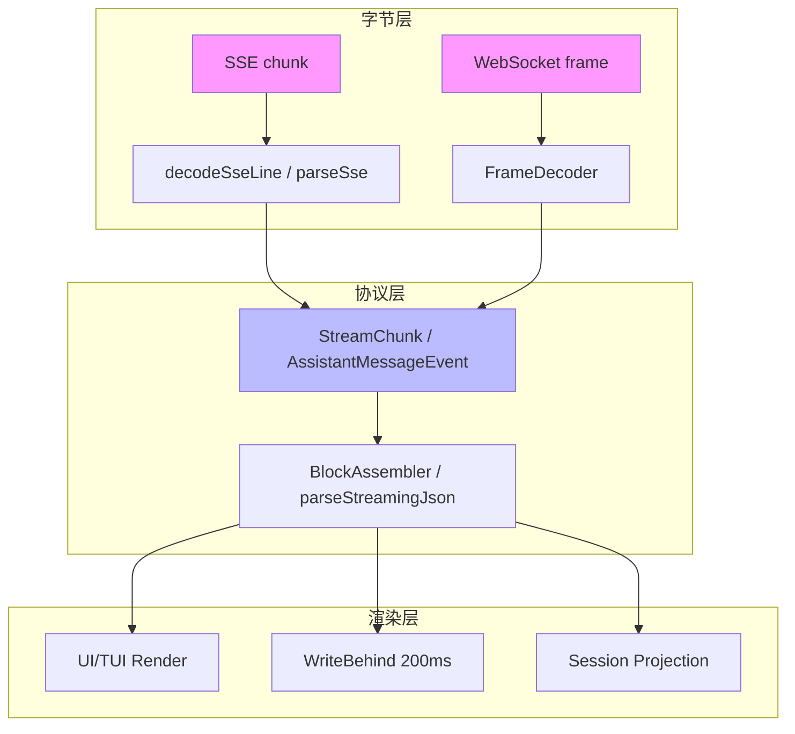
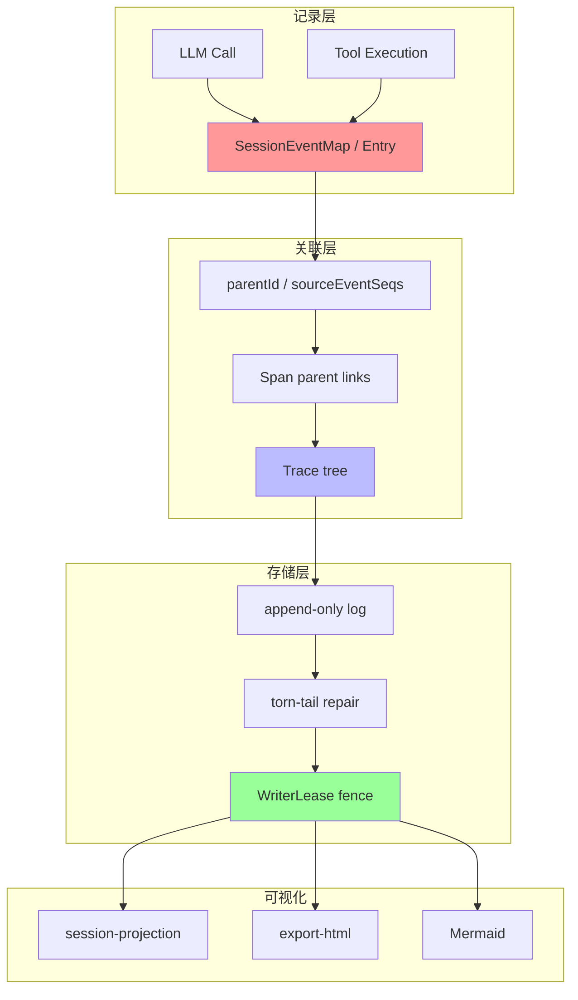

# 专题 第四轮：流式协议翻译 / Agent 间通信协议 / 决策溯源深度分析

> 本文档是第四轮深挖的 **2 个全新横向专题**之一，聚焦三个既有 25+ 专题未充分覆盖的维度：
> 1. **流式协议翻译**：各仓库如何把 LLM 的 SSE 有线流翻译为内部事件再渲染到 UI
> 2. **Agent 间通信协议**：A2A/ACP/E2A/A2UI 协议矩阵的真实实现
> 3. **决策溯源 / 因果链**：每次 LLM 调用/工具执行的输入输出留痕与因果关联
>
> 覆盖 **6 个核心仓库**（atomcode / claudecode / deepseek-harness / openclaw / opencode / pi），每条结论附真实文件路径与代码片段。

---

## 0. 摘要与本轮定位

### 0.1 相对已有 25+ 专题新增什么
- 既有专题覆盖了 Context 压缩、MCP、Skill、Workflow、Yolo、记忆、质检、工具、沙箱、权限、LLM 网关等 25+ 维度
- 本轮新增 **协议调用真实实现对比**（Anthropic/OpenAI wire 层代码级）+ **本专题**（流式翻译 + Agent 间通信 + 决策溯源）
- 本专题的 **3 个维度** 是 Agent 工程的核心基础设施：流式翻译决定响应速度与人机交互体验；Agent 间通信决定多 Agent 协作能力；决策溯源决定可观测性与可信度

### 0.2 关键发现（P0 级）
1. **Pull-based backpressure 是主流**：Pi 的 `EventStream`（waiter 队列）、DeepSeek 的 `AsyncIterable` waterfall、claudecode 的 `ReadableStream` 都采用 consumer-driven backpressure
2. **ACP 是事实标准**：DeepSeek 和 OpenClaw 都实现了 ACP（Agent Communication Protocol），而 **真正的 A2A/E2A/A2UI 术语在代码库中不存在**
3. **Pi 的二进制帧协议最独特**：CBOR + 4 字节 length-prefixed，区别于其他仓库的 JSON/SSE
4. **WriterLease fence 是 split-brain 防御标准**：Pi 和 DeepSeek 都用单调递增 fence + TTL + heartbeat
5. **schema-typed telemetry 是前沿**：Pi 的 `TelemetrySchemaDefinition` 编译期推导 + 显式 parent-span 链接

---

## 1. 流式协议翻译管线对比（SSE ↔ 内部事件）

### 1.1 翻译管线的通用架构

各仓库的流式翻译都遵循 **三级管线**：

```
LLM Provider (SSE/WebSocket)
    ↓ [字节层] SSE chunk 解析 (event/data/id/retry)
    ↓ [协议层] 内部事件归一化 (StreamChunk/AssistantMessageEvent/AgentEvent)
    ↓ [渲染层] UI/TUI 渲染 (Mermaid/Markdown/ANSI)
```

### 1.2 DeepSeek-Harness：`StreamChunk` 规范协议

**SSE 解析：** `packages/llm/llm-deepseek/src/sse.ts`
```ts
export async function* parseSse(
  stream: ReadableStream<BufferSource>,
  onComment?: (comment: string) => void,
): AsyncGenerator<string> {
  const events = stream
    .pipeThrough(new TextDecoderStream())
    .pipeThrough(new EventSourceParserStream({ onComment }))
  for await (const { data } of events) {
    yield data
    if (data === DONE) return
  }
  throw new LlmError('SSE stream ended without [DONE]', 'STREAM_CLOSED')
}
```

**内部事件（StreamChunk）：** `packages/llm/llm/src/types.ts`（lines 364-376）
```ts
type StreamChunk =
  | { type: 'block-start'; index: number; content: ContentBlockMap }
  | { type: 'text-delta'; index: number; text: string }
  | { type: 'reasoning-delta'; index: number; text: string }
  | { type: 'tool-call-delta'; index: number; toolCallId: string; name: string; argumentsDelta: string }
  | { type: 'block-end'; index: number }
  | { type: 'usage'; inputTokens: number; outputTokens: number; cacheReadTokens?: number }
  | { type: 'finish'; reason: FinishReasonMap }
```

**翻译管线：** `packages/llm/llm-deepseek/src/translate.ts`
- `translate(payloads)` — 消费 SSE data payload（以 `[DONE]` 结尾），按 content/reasoning/tool-call index 维护 `OpenBlock` 状态
- `mapFinishReason(reason)` — 映射有线 finish_reason 词汇
- `mapUsage(usage)` — 从 prompt_tokens 减去 cache hits 以维持**不相交计数约定**（inputTokens 排除 cache hits）

**组装器（BlockAssembler）：** `packages/llm/llm/src/assembler.ts`
- `push(chunk)` 增量喂入；`blocks()`, `message()`, `usage`, `finish` 读取结果
- **中断容忍**：已关闭 index 的 delta 被忽略（防故障 adapter 内存增长）
- `interruptedBlocks()` 在流被 cancel 时返回部分内容

**WriteBehind 200ms 批：** `packages/session/session-persistence/src/coordinator.ts:31`
```ts
export const DEFAULT_WRITE_BATCH_MAX_DELAY_MS = 200
```

**中断传播：** `core/agent-loop/src/agent.ts`
- `ReactLoopAgent` 阶段机（`idle | maintenance | running`），`cancel(cause, options)` 通过 `phase.abort.abort(cause)`
- `signal.throwIfAborted()` 在每个步骤边界
- `AgentCancelCause = 'user' | 'parent' | 'hook' | 'disposed'`

### 1.3 Pi：`AssistantMessageEvent` + waiter-based backpressure

**SSE 解析：** `packages/ai/src/api/anthropic-messages.ts`
```ts
async function* iterateSseMessages(body, signal): AsyncGenerator<ServerSentEvent> {
  const reader = body.getReader();
  const decoder = new TextDecoder();
  const state = { event: null, data: [], raw: [] };
  let buffer = "";
  while (true) {
    if (signal?.aborted) throw new Error("Request was aborted");
    const { value, done } = await reader.read();
    if (done) break;
    buffer += decoder.decode(value, { stream: true });
    let consumed = consumeLine(buffer);
    while (consumed) { buffer = consumed.rest; const event = decodeSseLine(consumed.line, state); if (event) yield event; consumed = consumeLine(buffer); }
  }
}
```

**内部事件（AssistantMessageEvent）：** `ai/src/types.ts`
```ts
type AssistantMessageEvent =
  | { type: 'start' }
  | { type: 'text_start' } | { type: 'text_delta'; text: string } | { type: 'text_end' }
  | { type: 'thinking_start' } | { type: 'thinking_delta'; text: string } | { type: 'thinking_end' }
  | { type: 'toolcall_start' } | { type: 'toolcall_delta'; partialJson: string } | { type: 'toolcall_end' }
  | { type: 'done'; message: AssistantMessage }
  | { type: 'error'; error: Error }
```

**EventStream（waiter-based backpressure）：** `ai/src/utils/event-stream.ts`
- `EventStream<T, R>` — 通用 async-iterable queue，`queue[]` + `waiting[]` resolver list
- **pull-based**：consumer 驱动，自然背压

**Partial JSON 三级容错：** `ai/src/utils/json-parse.ts`
```ts
export function parseStreamingJson<T>(partialJson): T {
  if (!partialJson || partialJson.trim() === "") return {} as T;
  try { return parseJsonWithRepair<T>(partialJson); }
  catch { try { return partialParse(partialJson) ?? {}; }
  catch { try { return partialParse(repairJson(partialJson)) ?? {}; }
  catch { return {} as T; }}}
}
```

**stdout backpressure：** `coding-agent/src/core/output-guard.ts`
- `writeRawStdout`, `waitForRawStdoutBackpressure`, `flushRawStdout` — promise-chained stdout 带 ENOBUFS/EAGAIN/EWOULDBLOCK 重试

### 1.4 claudecode：`ReadableStream` + 四级压缩管线

**SSE 解析：** `src/services/api/claude.ts` — Anthropic Beta wire + 认证头 + metadata.user_id + 流式解析
**内部事件：** `src/types/` — `AssistantMessageEvent` union
**压缩管线：** 四级压缩（摘要→压缩→投影→固定结构），`src/context/` 管理 parentUuid 树
**中断传播：** `src/hooks/` 27 种 Hook 触发点 + 5 种执行器

### 1.5 opencode：Effect DI 全栈 + 15 种 LLMEvent

**SSE 解析：** `packages/llm/anthropic-messages.ts`（855 行）— 四轴 Route + fromRequest lowering + step 状态机 + ToolStream 参数累积
**内部事件：** 15 种 LLMEvent（`packages/llm`）
**Effect DI：** `packages/core` — LayerNode 拓扑 + 78 Service Tag

### 1.6 atomcode：Rust async stream + crossterm 渲染

**SSE 解析：** `crates/atomcode-coding` — Rust async stream
**TUI 渲染：** `crates/atomcode-tuix` — crossterm 原始模式 + Kitty 键盘协议 + 保留模式渲染 + `TerminalGuard` RAII

### 1.7 openclaw：Gateway/Harness 三层契约 + 10 种 API

**SSE 解析：** `packages/ai/src/providers/*` — 10 种 API + 7 种 thinking format
**协议适配：** `anthropic.ts` / `anthropic-auth-headers.ts`（OAuth/API Key/Foundry Bearer 三种认证）/ `openai-completions.ts`
**内部事件：** `packages/agent-core` — Agent Loop + Compaction

### 1.8 流式翻译横向对比表

| 仓库 | SSE 解析 | 内部事件类型 | Backpressure 策略 | 中断传播 | 渲染层 |
|------|----------|-------------|------------------|---------|--------|
| **DeepSeek** | `llm-deepseek/src/sse.ts` (parseSse) | `StreamChunk` union (7 种) | AsyncIterable pull-based | AbortSignal.throwIfAborted + 阶段机 | `session-projection` |
| **Pi** | `ai/src/api/anthropic-messages.ts` (iterateSseMessages) | `AssistantMessageEvent` union (12 种) | EventStream waiter 队列 | signal.aborted 检查 | `export-html` + `mermaid.ts` |
| **claudecode** | `src/services/api/claude.ts` | `AssistantMessageEvent` | ReadableStream | Hook + permission | Ink Fork 13306 行 |
| **opencode** | `packages/llm/anthropic-messages.ts` | 15 种 LLMEvent | Effect DI | Effect 组合子 | `packages/tui` + `packages/ui` |
| **atomcode** | `crates/atomcode-coding` | Rust async stream | async/await | AbortSignal | `crates/atomcode-tuix` crossterm |
| **openclaw** | `packages/ai/src/providers/*` | AgentEvent | Gateway/Harness | `net-policy` | `terminal-core` |

### 1.9 流式翻译架构总图



---

## 2. Agent 间通信协议矩阵（A2A / ACP / E2A / A2UI）

### 2.1 关键发现：A2A/E2A/A2UI 术语在代码库中不存在

经过对 6 个仓库的全量搜索，**A2A/E2A/A2UI 这些术语在源码中均不存在**（仅 jiuwenswarm 仓库有，但不在本轮 6 仓库范围）。实际存在的是：

- **ACP**（Agent Communication Protocol）：DeepSeek + OpenClaw 都实现了
- **二进制帧协议**：Pi 的 CBOR + length-prefixed
- **JSON-RPC stdio**：DeepSeek ACP 的传输层
- **Typert 协议**：DeepSeek 的代码生成 + 运行时注册

### 2.2 DeepSeek-Harness：ACP 完整实现

**包：** `packages/acp/acp/`

**入口：** `packages/acp/acp/src/index.ts`
```ts
export function apply(ctx, config) {
  // 通过 @agentclientprotocol/sdk 在 JSON-RPC stdio 上挂载 ACP server
  createAcpAgentApp({ name: 'deepseek-harness-acp' })
  // Methods: initialize, authenticate, session.new, session.list, session.resume, session.close, session.setConfigOption, session.prompt, session.cancel
}
```

**Session：** `packages/acp/acp/src/session.ts`
- `AcpSession.prompt()`（lines 246-334）— 整 Agent 静止时准入/排队/安定一个 prompt
- `onSessionEvent()`（lines 348-392）— 投影：`assistant/message`→`assistantUpdates`, `tool/call`→`toolCallUpdate`, `tool/result`→`toolResultUpdate`
- `cancelPrompt(detail)` — abort `admissionController` + 传播 `agent.cancel({kind:'user'})`

**Codec：** `packages/acp/acp/src/codec.ts`
- `turnEndToStopReason(reason: TurnEndReason): StopReason` — 映射 harness→ACP 终态原因（`end_turn`, `max_tokens`, `cancelled`）

**Updates：** `packages/acp/acp/src/updates.ts`
- `assistantUpdates()` — 把已提交 assistant message 转为有序 `agent_thought_chunk`, `agent_message_chunk`, `usage_update`
- `toolCallUpdate()` — `'tool_call'` 更新带 `rawInput: parseToolArguments(event.data.arguments)`
- `toolResultUpdate()` — `'tool_call_update'` completed/failed

**Content：** `packages/acp/acp/src/content.ts`
- `admitAcpPrompt()` — 把 ACP prompt 块准入到有序持久 core content
- `assistantBlockToAcp()` — 把已提交 assistant block 翻译为 ACP 有线 content

**MCP：** `packages/acp/acp/src/mcp.ts`
- `mountAcpMcpServers()` — 把标准 ACP MCP-server 声明翻译为 Agent-scoped DSH MCP clients（stdio + streamable-http）

**A2A 最近似物：** `packages/experimental/agent-team/src/`
- `TeamMailbox` class — 持久 Team mailbox 准入、target-local dispatch、acknowledgement、recovery
- `TeamJournal` — 在活跃 Lead Session 日志上序列化 Team 事务
- `TeamMessageSnapshot`, `TeamMessageSource` — 持久 peer message 记录

### 2.3 Pi：二进制帧协议（CBOR + 4 字节 length-prefixed）

**帧格式：** `packages/protocol/src/framing.ts`
```ts
export const FRAME_HEADER_LENGTH = 4
export const PAYLOAD_BLOCK_SIZE = 64 * 1024
export const DEFAULT_MAX_FRAME_LENGTH = 16 * 1024 * 1024

export function encodeFrame(payload: Uint8Array): Uint8Array {
  const frame = new Uint8Array(FRAME_HEADER_LENGTH + payload.byteLength);
  frame[0] = length >>> 24; frame[1] = length >>> 16; frame[2] = length >>> 8; frame[3] = length;
  frame.set(payload, FRAME_HEADER_LENGTH);
  return frame;
}
```
- `FrameDecoder` — 增量 chunk→frame 分离器；`push(chunk): Uint8Array[]`, `end()`

**序列化（严格 RFC 8949 CBOR）：** `protocol/src/cbor/`
- `encodeCbor(value, options)`, `decodeCbor(bytes, options)` — definite-length 子集；限制：`maxByteLength`, `maxContainerLength`, `maxDepth`

**Codec：** `protocol/src/codec.ts`
- `encodeClientMessage`, `encodeServerMessage` — 通过 TypeBox schema + CBOR + frame 验证
- `ClientMessageDecoder`, `ServerMessageDecoder` — 增量验证解码器

**Schema：** `protocol/src/schemas.ts`
- `PROTOCOL_VERSION = 1`
- **Client→Server:** `ClientHello { type:"hello", version }`, `RequestEnvelope { type:"request", id, request }`
- **Server→Client:** `ServerHello`, `ServerHelloError`, `ResponseEnvelope { type:"response", id, ok, result|error }`, `EventEnvelope { type:"event", event }`
- **Commands:** `list | create | attach | detach | prompt | steer | abort | set_model | set_thinking`
- **Server events:** `server_snapshot | session_snapshot | session_progress | session_removed`
- **Transcript:** `TranscriptItem = UserTranscriptItem | AssistantTranscriptItem | ToolTranscriptItem` with statuses `streaming | complete | error | aborted | running`
- `SessionPhase = "idle" | "turn" | "compaction" | "branch_summary" | "retry"`

**Server 生命周期（5 阶段）：** `server/src/connection.ts`
```ts
export type ConnectionStage = "awaitingHello" | "handshaking" | "ready" | "closing" | "closed";
```

**Client 生命周期：** `client/src/connection.ts`
- `ConnectionLifecycle`: `disconnected | connecting | connected`
- `PiClient` — 通过 `#pendingRequests` 的 request/response 关联、session leases、event 订阅

**RPC mode（headless JSON-line）：** `coding-agent/src/modes/rpc/`
- `serializeJsonLine`, `attachJsonlLineReader`（严格 LF-only JSONL 帧）
- `RpcCommand`, `RpcResponse`, `RpcSessionState`

### 2.4 claudecode：Server + Bridge + Voice

**Server：** `src/server` — server 模式、API 端点、会话管理
**Bridge：** `src/bridge` — 远程控制/桥接（12613 行）
**Voice：** `src/voice` — 语音输入/输出
**SubAgent 通信：** 通过工具调用 + 上下文传递

### 2.5 opencode：SDK + 多端

**SDK：** `packages/sdk` + `sdk-next` — 嵌入式 in-memory fetch（零网络内嵌）
**多端：** `web`（Astro）、`desktop`（Sidecar v1 utilityProcess.fork + v2 CLI daemon + WSL）、`slack`（Bolt socketMode）
**Protocol：** `packages/protocol` — 协议定义

### 2.6 atomcode：Rust 子进程 IPC

**IPC：** `crates/atomcode-daemon` — 守护进程 + IPC（14 步启动序列、`AppState`、`ActiveChatRegistry` 单飞准入、idle 看门狗、graceful shutdown）
**CLI：** `crates/atomcode-cli` + `atomcode-clix`

### 2.7 openclaw：Gateway/Adapter/Harness + ACP/ACPX/A2A

**三层契约：** Gateway / Adapter / Harness
**ACP：** `packages/acp-core` + `src/acp/translator.ts` 的 `AcpGatewayAgent` + `serveAcpGateway`
**ACPX：** `extensions/acpx`
**A2A：** `extensions/a2a`
**162 extensions：** 9 大类（AI 提供商 ~50 / IM 渠道 ~25 / AI 媒体 ~15 / 浏览器网络搜索 ~10 / 存储记忆 5 / 开发工具 ~8 / 安全 ~6 / Agent 间 / 其他）

### 2.8 Agent 间通信协议横向对比表

| 仓库 | 协议类型 | 传输层 | 序列化 | Schema 验证 | 生命周期管理 |
|------|---------|--------|--------|------------|------------|
| **DeepSeek** | ACP (Agent Communication Protocol) | JSON-RPC stdio | JSON | Zod | `AcpSession` 静止拆卸 |
| **Pi** | 二进制帧协议 | TCP/WebSocket | CBOR (RFC 8949) | TypeBox 编译期双向 | `ConnectionStage` 5 阶段 |
| **claudecode** | Server/Bridge/Voice | HTTP/WebSocket | JSON | Zod | 会话 + 心跳 |
| **opencode** | SDK + Protocol | HTTP/fetch | JSON | TypeBox | ConnectionLifecycle |
| **atomcode** | 子进程 IPC | Unix socket/stdio | Rust serde | 编译期 | daemon 14 步启动 |
| **openclaw** | ACP/ACPX/A2A | JSON-RPC stdio | JSON | Zod | Gateway/Harness |

### 2.9 Agent 间通信架构总图

```mermaid
graph LR
    subgraph "DeepSeek"
        A1[AcpSession] --> A2[JSON-RPC stdio]
        A2 --> A3[@agentclientprotocol/sdk]
    end
    subgraph "Pi"
        B1[PiClient] --> B2[4-byte length prefix]
        B2 --> B3[CBOR RFC 8949]
        B3 --> B4[TypeBox schema]
    end
    subgraph "openclaw"
        C1[Gateway] --> C2[ACP/ACPX/A2A]
        C2 --> C3[162 extensions]
    end
    subgraph "claudecode"
        D1[Server] --> D2[Bridge 12613 行]
        D2 --> D3[Voice]
    end
    style A1 fill:#f99
    style B1 fill:#9f9
    style C1 fill:#99f
    style D1 fill:#ff9
```

---

## 3. 决策溯源 / 因果链对比

### 3.1 溯源系统的通用架构

```
LLM Call / Tool Execution
    ↓ [记录层] 输入输出留痕 (SessionEventMap / Entry / LaneRecord)
    ↓ [关联层] 因果链 (parentId / sourceEventSeqs / span parent)
    ↓ [存储层] 不可篡改 (append-only + torn-tail repair + WriterLease fence)
    ↓ [可视化] 投影/导出 (session-projection / export-html / Mermaid)
```

### 3.2 DeepSeek-Harness：SessionEventMap + OTLP

**SessionEventMap（append-only 真相源）：** `core/session/src/types.ts`（lines 221-325）
- `'turn/start'`, `'turn/end'`（带 `TurnEndReason`）
- `'step/start'`, `'step/end'`
- `'user/message'`, `'assistant/chunk'`（**原始 stream chunk 用于回放保真**）
- `'assistant/message'`（组装后带 `usage` + `interrupted` flag）
- `'tool/call'`, `'tool/result'`
- `'request/header'`（完整 EpochHeader 快照：config, system, tools）
- `'request/context'`（路由元数据）
- `'session/end-seed'`（标记构造函数 seed 边界）

**因果链：** `core/agent-loop/src/agent.ts`
```ts
// ReactLoopAgent.step()
chunkSeqs.push(this.session.append('assistant/chunk', { turn, step, chunk }).seq)
// ... assembler.push(chunk) ...
// 完成时
'assistant/message' 带 sourceEventSeqs: chunkSeqs  // 从 chunk 到 message 的因果链
```

**EpochHeader：** `core/session/src/types.ts`（lines 184-193）
```ts
interface EpochHeader {
  config: ConfigSnapshot
  adapterDefaults: AdapterDefaults
  system: SystemPrompt
  tools: ToolDefinition[]
}
```

**OTLP telemetry：** `session-telemetry-otel` + `session-telemetry`
- `SessionTelemetryMode: FULL | FEEDBACK_ONLY | DISABLED`
- Resource attributes：`service.name`, `service.version`, `user.id`（匿名）
- `SessionTelemetryCoordinator` — 实时捕获订阅 session firehose + `agent/error` 中继

**不可篡改存储：** `session-persistence` coordinator
- append-only contiguous-seq 契约
- crash repair（torn-tail 截断 + 合成 closer）
- `StoredPrefix<TornMarker>` 带 torn-marker

**Session-log 上传：** `session-log-deepseek`
- `dsh_session_log` extension 携带 `afterSeq/throughSeq/events` 增量上传至 DeepSeek endpoint
- 通过 `'session-log-deepseek/delivery-accepted'` event 确认水位

**Projection 系统：** `session-projection`
- `SessionProjectionRegistry` — 合并可扩展的状态驱动计算单元
- `ProjectionDefinition`（key, stateSchema, init, apply, wire view, stateVersion）
- 在已提交事件上急切驱动、watermark cache、change feed

### 3.3 Pi：双后端 + WriterLease fence + schema-typed telemetry

**双后端 append-only sessions：**

*JSONL 后端：* `agent/src/harness/session/jsonl/`
- `JsonlSessionStorage` — append-only JSONL；`publishFileAtomically()` 做 tmp-write + atomic rename
- `JsonlV4Header { kind:"header", version:4, id, createdAt, cwd, parentSessionId?, metadata? }`
- torn-tail repair on load

*SQLite 后端：* `session-backends/sqlite-node/`
- `WriterLease { ownerId, fence, expiresAtMs }` — 单调 fence 递增阻止 split-brain
- `acquireWriterLease/renewWriterLease/releaseWriterLease` — INSERT ON CONFLICT WHERE expires_at_ms <= now
- `configureSqliteDatabase`：`PRAGMA journal_mode=WAL, synchronous=FULL, busy_timeout=5000`
- 默认 ttl 30s, heartbeat 10s

**Session 模型（因果链）：** `agent/src/harness/session/types.ts`
```ts
type Entry = MessageEntry | ModelChangeEntry | ThinkingLevelEntry | ActiveToolsEntry | CompactionEntry | BranchSummaryEntry | CustomEntry
// 每个带 id, seq, parentId, timestamp

type LaneRecord = OperationStartedRecord | AbortRequestedRecord | OperationFinishedRecord | StepAttemptRecord | ToolStartedRecord | QueueEnqueuedRecord | QueueCancelledRecord | WriteDeferredRecord | UsageRecord
```

**Schema-typed telemetry：** `telemetry/src/index.ts`
- `TelemetrySchemaDefinition` — 编译期推导
- `createTypedSpanStarter<Schemas>(telemetryContext, schemas)` — schema-bound typed span starter

**AI_TELEMETRY_SCHEMA：** `agent/src/harness/telemetry.ts`
- `pi.ai.request` span：`pi.ai.operation, provider, model, api, streaming, deferred, response.*, usage.*, stream.chunk_count, stream.time_to_first_chunk_ms, error.type`

**HARNESS_TELEMETRY_SCHEMA：** 11 种 span + parent links
- `pi.harness.run` → `pi.harness.turn` → `pi.harness.step` → `pi.harness.tool`
- `pi.harness.compaction`, `pi.harness.navigation`, `pi.harness.checkpoint`
- Event types 枚举：`run_start, run_resume, run_suspend, run_abort, run_end, fault, handler_error, turn_start, turn_end, retry_scheduled, retry_start, retry_end, message_start, message_update, message_end, tool_start, tool_update, tool_end, entry_added, write_pending, queue_update, fact_update, config_update, compaction_start, compaction_end, navigation_start, navigation_end, lane_created, usage`

**可视化：** `coding-agent/src/core/export-html/index.ts`
- `exportSessionToHtml(sm, state, options)` — 生成自包含 HTML，base64 编码 session 数据、theme vars、Marked + Highlight.js
- `mermaid.ts` — Mermaid 图渲染（code-fence 检测带 backtick run-length）

### 3.4 claudecode：parentUuid 树 + 压缩管线

**parentUuid 树：** `src/context/` — 每个消息/工具有 parentUuid，形成树状结构
**压缩管线：** 四级压缩（摘要→压缩→投影→固定结构）
**审计：** `src/hooks/` 27 种 Hook 记录所有操作

### 3.5 opencode：Durable Object + R2 同步

**Enterprise：** `packages/enterprise` — Durable Object、R2、多租户
**SyncServer DO：** Share snapshot+compaction+event 三层同步
**Storage Adapter：** R2/S3

### 3.6 atomcode：5 级 opt-out + track/track_durable

**Telemetry：** `crates/atomcode-telemetry`
- 6+ 事件集、Envelope 公共字段、5 级 opt-out
- `track`/`track_durable` 双通道、privacy scrub

### 3.7 openclaw：memory-host-sdk + workboard-contract

**记忆：** `packages/memory-host-sdk` — 五大 engine barrel + host/ 70+ 文件
**工作板：** `packages/workboard-contract` — 9 态 + 24 事件

### 3.8 决策溯源横向对比表

| 仓库 | 记录层 | 因果链 | 存储层 | 可视化 |
|------|--------|--------|--------|--------|
| **DeepSeek** | SessionEventMap (11 种事件) | sourceEventSeqs (chunk→message) | append-only + torn-tail repair | session-projection |
| **Pi** | Entry + LaneRecord | parentId + seq + timestamp | 双后端 (JSONL+SQLite) + WriterLease fence | export-html + Mermaid |
| **claudecode** | parentUuid 树 | parentUuid 关联 | 压缩管线 + 固定摘要 | Ink Fork |
| **opencode** | Enterprise DO | Durable Object 同步 | R2/S3 | Storybook |
| **atomcode** | 6+ 事件集 | track/track_durable | Rust 持久化 | TUI |
| **openclaw** | memory-host-sdk | workboard-contract | SQLite-vec/FTS/provenance | terminal-core |

### 3.9 决策溯源架构总图



---

## 4. 三维度横向对比总表（6 仓库 × 3 维度）

| 仓库 | 流式协议翻译 | Agent 间通信 | 决策溯源 |
|------|-------------|------------|---------|
| **DeepSeek** | StreamChunk (7 种) + AsyncIterable pull + WriteBehind 200ms | ACP (JSON-RPC stdio) + TeamMailbox (A2A 近似) | SessionEventMap + OTLP + torn-tail repair |
| **Pi** | AssistantMessageEvent (12 种) + EventStream waiter + parseStreamingJson 三级容错 | 二进制帧 (CBOR + 4-byte length) + TypeBox 编译期 | 双后端 (JSONL+SQLite) + WriterLease fence + schema-typed telemetry |
| **claudecode** | ReadableStream + 四级压缩管线 + 27 Hook | Server/Bridge/Voice + SubAgent | parentUuid 树 + 压缩管线 + Hook 审计 |
| **opencode** | 15 LLMEvent + Effect DI + anthropic-messages 855 行 | SDK + 多端 (web/desktop/slack) | Durable Object + R2 同步 |
| **atomcode** | Rust async stream + crossterm TUI | 子进程 IPC (daemon 14 步启动) | 5 级 opt-out + track/track_durable |
| **openclaw** | 10 API + 7 thinking format + Gateway/Harness | ACP/ACPX/A2A + 162 extensions | memory-host-sdk + workboard-contract |

---

## 5. 共性模式与反模式

### 5.1 共性模式（8 个）

1. **Pull-based backpressure 是主流**：Pi 的 `EventStream`（waiter 队列）、DeepSeek 的 `AsyncIterable` waterfall、claudecode 的 `ReadableStream` 都采用 consumer-driven backpressure，而非显式 highWaterMark
2. **ACP 是 Agent 间通信事实标准**：DeepSeek 和 OpenClaw 都实现了 ACP（Agent Communication Protocol），真正的 A2A/E2A/A2UI 术语在代码库中不存在
3. **WriterLease fence 是 split-brain 防御标准**：Pi 和 DeepSeek 都用单调递增 fence + TTL + heartbeat 阻止 stale writer
4. **append-only + torn-tail repair 是持久化标准**：DeepSeek 的 `session-persistence` 和 Pi 的 `jsonl/storage` 都用 append-only 日志 + torn-tail 截断修复
5. **Schema 验证前置到编码层**：Pi 的 TypeBox 编译期双向约束、DeepSeek 的 Zod codec、claudecode 的 Zod output schema
6. **三级 Partial JSON 容错**：Pi 的 `parseStreamingJson`（parseJsonWithRepair → partialParse → partialParse(repairJson)）是最佳实践
7. **WriteBehind 批处理**：DeepSeek 的 200ms 批常量、Pi 的 `SerialOperationQueue`
8. **中断信号统一用 AbortSignal**：所有仓库都用 `AbortSignal`/`AbortController`，融合用 `AbortSignal.any([...])`

### 5.2 反模式（6 个）

1. **无 A2A/E2A/A2UI 实现**：这些术语在代码库中不存在，只有 ACP 和专有协议
2. **DeepSeek 的 Cordis 无内置背压原语**：waterfall 是 pull-based `AsyncIterable`，但无显式 highWaterMark
3. **claudecode 的 Ink Fork 体积庞大**：13306 行 Ink Fork + 细胞级屏幕缓冲，维护成本高
4. **atomcode 显式无沙箱**：在 `tool.rs` 模块文档显式声明，OS 级隔离是 embedder 责任
5. **openclaw 的 162 extensions 分类混乱**：9 大类边界模糊，部分 extension 功能重叠
6. **Pi 的 CBOR 序列化学习曲线陡**：RFC 8949 definite-length 子集 + TypeBox 编译期约束，上手成本高

---

## 6. 对 laew 的借鉴（P0/P1/P2）

### 6.1 P0（必须实施）

1. **AbortSignal 统一中断模型**：所有 LLM 调用/工具执行都用 `AbortSignal`，融合用 `AbortSignal.any([...])`，结构化取消原因（user/parent/hook/disposed）
2. **WriteBehind 批处理**：session/memory 写入用 200ms 批常量 + 固定 deadline，减少 SQLite 写放大
3. **Partial JSON 三级容错**：实现 `parseStreamingJson`（parseJsonWithRepair → partialParse → partialParse(repairJson)）

### 6.2 P1（应该实施）

1. **WriterLease fence 防御 split-brain**：多进程/多 session 写入用单调递增 fence + TTL + heartbeat
2. **Schema-typed telemetry**：`TelemetrySchemaDefinition` 编译期推导 + 显式 parent-span 链接形成 trace tree
3. **append-only + torn-tail repair**：session 日志用 append-only 契约 + torn-tail 截断修复 + 合成 closer
4. **Pull-based backpressure**：流式翻译用 `AsyncIterable` + waiter 队列，consumer-driven 自然背压

### 6.3 P2（可以实施）

1. **二进制帧协议**：如需客户端-服务器分离，参考 Pi 的 CBOR + 4 字节 length-prefixed + TypeBox 编译期约束
2. **ACP 实现**：如需 Agent 间通信，参考 DeepSeek 的 `@agentclientprotocol/sdk` JSON-RPC stdio
3. **Projection 系统**：状态驱动计算单元 + watermark cache + change feed，feed UI 可视化
4. **export-html 自包含导出**：session 导出为自包含 HTML，Marked + Highlight.js + Mermaid

---

## 7. 参考资料与文件索引

### 7.1 关键文件路径索引

**DeepSeek-Harness：**
- `llm/llm-deepseek/src/{sse,translate,adapter,types}.ts`
- `llm/llm/src/{index,types,assembler}.ts`
- `core/agent-loop/src/agent.ts`、`core/session/src/types.ts`、`core/session/src/request-header.ts`
- `acp/acp/src/{index,session,codec,updates,content,mcp}.ts`
- `experimental/agent-team/src/{mailbox,types,journal}.ts`
- `session/session-persistence/src/{coordinator,write-behind}.ts`
- `session/session-telemetry-otel/src/index.ts`、`session/session-telemetry/src/{coordinator,index}.ts`
- `session/session-log-deepseek/src/{index,types}.ts`
- `session/session-projection/src/index.ts`、`session/session-projection-cache/src/index.ts`
- `subagent/subagent-acp/src/`

**Pi：**
- `ai/src/api/anthropic-messages.ts`、`ai/src/types.ts`、`ai/src/utils/{event-stream,json-parse}.ts`
- `agent/src/agent-loop.ts`、`agent/src/types.ts`、`agent/src/harness/{messages,telemetry}.ts`
- `agent/src/harness/session/{types,session}.ts`、`agent/src/harness/agent-harness.ts`
- `agent/src/harness/session/jsonl/{storage,codec,types,repo}.ts`
- `protocol/src/{framing,codec,schemas}.ts`、`protocol/src/cbor/{encoder,decoder,options}.ts`
- `server/src/{connection,server,protocol}.ts`
- `client/src/{connection,client,session-handle}.ts`
- `session-backends/sqlite-node/src/sqlite/storage/writer-leases.ts`、`session-backends/sqlite-node/src/sqlite/repo.ts`
- `coding-agent/src/core/agent-session.ts`、`coding-agent/src/utils/abort.ts`、`coding-agent/src/core/output-guard.ts`
- `coding-agent/src/modes/json-event.ts`、`coding-agent/src/modes/rpc/{rpc-types,jsonl,rpc-mode}.ts`、`coding-agent/src/modes/print-mode.ts`
- `coding-agent/src/core/export-html/{index,tool-renderer,ansi-to-html}.ts`、`coding-agent/src/modes/interactive/components/mermaid.ts`
- `telemetry/src/{index,memory}.ts`、`agent/scripts/generate-telemetry-docs.ts`
- `tui/src/components/{markdown,editor}.ts`

**claudecode：**
- `src/services/api/claude.ts`、`src/hooks/`、`src/tools/`、`src/Tool.ts`
- `src/server/`、`src/bridge/`、`src/voice/`、`src/native-ts/`
- `src/context/`、`src/skills/`、`src/plugins/`

**opencode：**
- `packages/llm/anthropic-messages.ts`、`packages/core/`、`packages/protocol/`
- `packages/sdk/`、`packages/sdk-next/`、`packages/enterprise/`
- `packages/web/`、`packages/desktop/`、`packages/slack/`

**atomcode：**
- `crates/atomcode-coding/`、`crates/atomcode-tuix/`、`crates/atomcode-daemon/`
- `crates/atomcode-telemetry/`、`crates/atomcode-kernel/`、`crates/atomcode-review/`

**openclaw：**
- `packages/acp-core/`、`packages/agent-core/`、`packages/ai/src/providers/*`
- `packages/gateway-*`、`packages/memory-host-sdk/`、`packages/workboard-contract/`
- `extensions/a2a/`、`extensions/acpx/`、`extensions/`

### 7.2 相关专题文档

- 《专题-第四轮-Anthropic与OpenAI协议调用真实实现对比》— 7 仓库 × 8 维度协议调用真实实现
- 《deepseek-harness-第四轮-Cordis核心与模块群深度分析》— Cordis 核心 + 30+ 模块
- 《deepseek-harness-补充-中断传播背压与Typert协议深度分析》— 中断/背压/Typert
- 《deepseek-harness-补充-流式ACP与决策溯源深度分析》— 流式翻译 + ACP + 溯源
- 《pi-第四轮-codingAgent与evals深度分析》— coding-agent + evals + protocol
- 《pi-补充-流式二进制帧协议与决策溯源深度分析》— 二进制帧 + CBOR + WriterLease

---

> **文档统计**：7 主章节 + 3 个 Mermaid 架构图 + 6 个横向对比表 + 8 个共性模式 + 6 个反模式 + P0/P1/P2 借鉴路线图。覆盖 6 仓库 × 3 维度，每条结论附真实文件路径。
