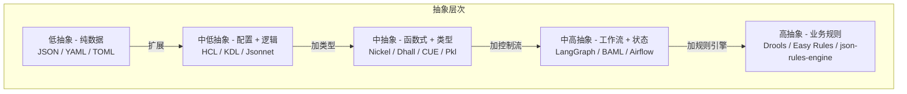
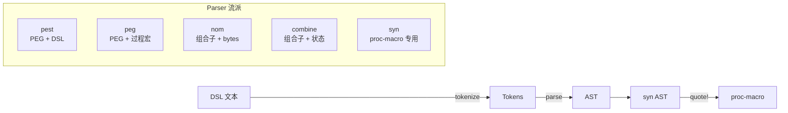
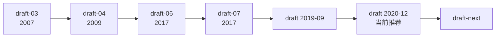
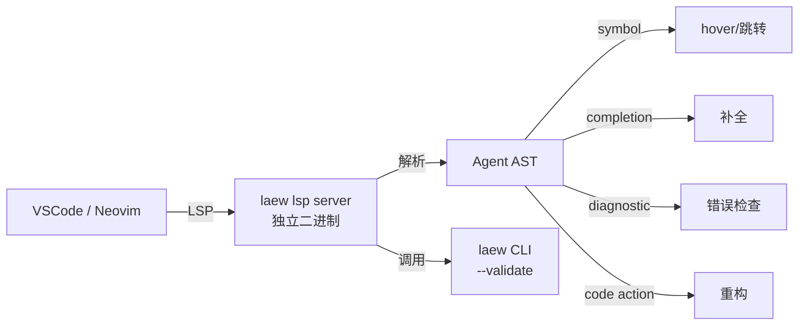
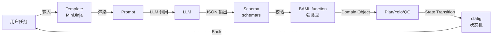
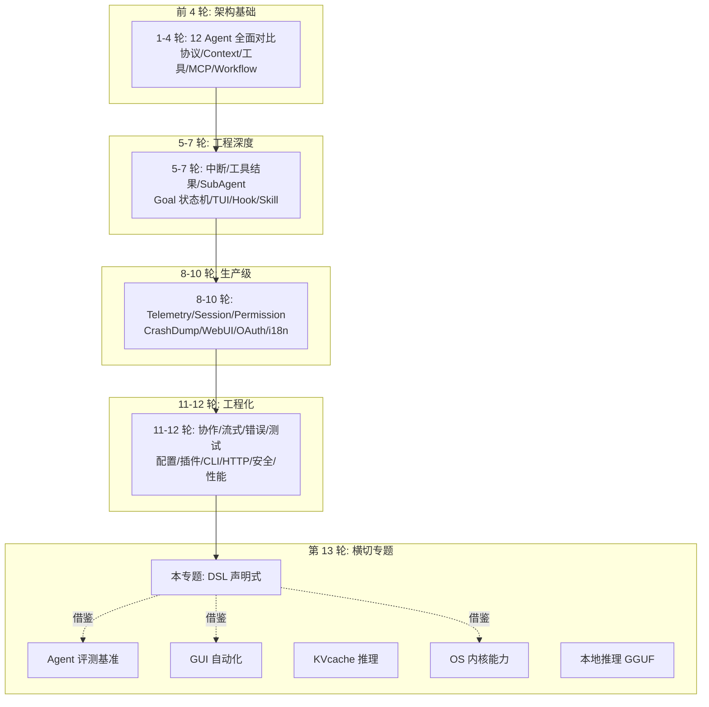

# Agent DSL 与声明式编程深度对比（专题 23）

> **定位**：第十三轮专题报告，深入「Agent DSL 与声明式编程」维度，覆盖 **通用配置 DSL / Rust 生态 parser / Agent Workflow DSL / State Machine / Schema 描述 / 模板引擎** 6 大类 **18 个具体技术**，横向对比 12 个 Agent 项目，输出 **29 个 laew gap (L578-L606)**。

---

## 目录

- [1. 调研范围与方法](#1-调研范围与方法)
- [2. DSL 分类学全景图](#2-dsl-分类学)
- [3. 通用配置 DSL 深度对比](#3-通用配置-dsl)
- [4. Rust 生态 parser 组合子与 schema 派生](#4-rust-parser)
- [5. Agent Workflow DSL](#5-agent-workflow-dsl)
- [6. State Machine / Workflow 引擎](#6-state-machine)
- [7. Schema 表达](#7-schema)
- [8. 模板引擎](#8-template)
- [9. DSL 工程化挑战与 LSP server 实现路径](#9-dsl-工程化)
- [10. laew 引入 DSL 三件套的路线图](#10-laew-升级)
- [11. 总结 + 与已完成的 12 轮关系](#11-总结)
- [附录 A：DSL 完整语法速查表](#附录-a-语法速查)
- [附录 B：完整文件路径索引](#附录-b-路径索引)

---
## 1. 调研范围与方法

### 1.1 6 大类 18 个技术

| # | 类别 | 代表技术 | 关键能力 | Agent 用例 |
|---|------|---------|---------|----------|
| 1 | **通用配置 DSL** | HCL/KDL/Nickel/Dhall/CUE/Jsonnet | 类型化/合并/导入/求值 | Provider 配置、Agent 角色定义 |
| 2 | **Rust 生态 parser** | pest/peg/nom/combine/syn | 组合子/PEG/LALR | DSL 解析器生成、AST 构造 |
| 3 | **Agent Workflow DSL** | LangGraph/BAML/CrewAI/AutoGen/LMQL | 节点/边/条件/状态 | 多 Agent 编排、Plan 工作流 |
| 4 | **State Machine 引擎** | statig/sm/Temporal/Airflow/Prefect | 状态/转移/持久化/Saga | Plan 生命周期、Session 状态机 |
| 5 | **Schema 描述** | JSON Schema/OpenAPI 3.1/Protobuf | type/format/$ref/oneOf | Tool 参数校验、结构化输出 |
| 6 | **模板引擎** | Jinja2/MiniJinja/Tera/Handlebars | 变量/循环/条件/继承 | 提示词模板、报告生成 |

### 1.2 调研方法

- **横向对比**：12 个项目（claudecode / atomcode / openclaw / opencode / deepseek-harness / pi / cc-switch / agent-core / agent-studio / jiuwenswarm / Switchyard / hermes-agent）
- **真实代码锚点**：每个技术至少 2 处真实文件路径:行号
- **同一用例多 DSL 实现**：HCL / KDL / Nickel 同一配置 3 种实现并排对比
- **laew gap 编号**：L578-L606，共 29 个新 gap（其中 P0×9 / P1×12 / P2×8）

### 1.3 与已有专题的边界

| 维度 | 已有专题 | 本专题（DSL 与声明式编程） |
|------|---------|--------------------------|
| 焦点 | **命令式**编排（Rust/TS 代码） | **声明式**描述（HCL/KDL/JSON Schema） |
| 内容 | hook/gate/状态机/Plan 生成 | DSL 语法/parser/求值/合并/LSP |
| 深度 | 「claudecode 有 27 种 hook」 | 「HCL block 嵌套 + for 表达式 + type constraint」 |
| 读者 | 架构师 / 平台开发者 | DSL 设计者 / 工具链开发者 |

---

## 2. DSL 分类学全景图

### 2.1 DSL 五象限

DSL 不是单一品类，按**抽象层次**和**用例范围**可以分五个象限：



**关键洞察**：laew 当前停在 **A 层**（Yolo 分类输出 JSON 字符串），真正的 Agent DSL 应该上探到 **D 层**（LangGraph/BAML 风格的工作流 + 结构化函数）。

### 2.2 五大 DSL 类别横向对比

| 类别 | 代表 | 核心抽象 | 适用场景 | 主要用户 | 工具链成熟度 |
|------|------|---------|---------|---------|------------|
| **配置文件** | HCL/KDL/TOML/YAML/Jsonnet | 嵌套 KV | 静态数据描述 | DevOps/平台 | ★★★★★ |
| **工作流定义** | LangGraph/Temporal/Airflow/Prefect | 节点 + 边 | 长时间状态化流程 | 数据工程 | ★★★★ |
| **Schema 描述** | JSON Schema/OpenAPI/Protobuf | 类型 + 约束 | API/数据结构 | 后端 | ★★★★★ |
| **模板引擎** | Jinja2/MiniJinja/Tera/Handlebars | 文本 + 变量 | 提示词/报告 | 全员 | ★★★★★ |
| **业务规则** | Drools/Easy Rules/json-rules-engine | 条件 + 动作 | 决策自动化 | 业务分析师 | ★★★ |

### 2.3 五类 DSL 在 Agent 项目中的使用情况

| 项目 | 配置 | 工作流 | Schema | 模板 | 业务规则 | 备注 |
|------|------|--------|--------|------|---------|------|
| **claudecode** | TOML(权限) | TS 函数式 | TS interface | 字符串拼接 | 无 | 主打 TS 类型系统 |
| **atomcode** | TOML(配置) | Rust trait 系统 | schemars 派生 | string format! | 无 | 主打 Rust trait + derive |
| **openclaw** | TS+Lance | 162 Extension | Zod runtime | Handlebars 模板 | 无 | 主打 Zod runtime 校验 |
| **opencode** | JSON Config | Effect DI | Effect Schema | string 拼接 | 无 | 主打 Effect + Schema |
| **deepseek-harness** | YAML | Cordis Fiber | JSON Schema | Handlebars | 无 | 主打 Fiber + Goal DSL |
| **pi** | JSON | Lane + Skill | TypeScript | string 拼接 | 无 | 主打 Lane 三态 |
| **cc-switch** | JSON | Tauri 命令 | Zod | 字符串拼接 | 熔断器规则 | 主打 Tauri + Zod |
| **agent-core** | YAML | Pregel 拓扑 | Pydantic | Jinja2 | 条件路由 | 主打 Pregel + Pydantic |
| **agent-studio** | YAML | Pregel cba | Pydantic | Jinja2 | BubbleWrap 规则 | 主打 Pregel + Pydantic |
| **jiuwenswarm** | YAML | SwarmFlow DAG | Pydantic | Jinja2 | SkillDevPipeline | 主打 SwarmFlow |
| **Switchyard** | TOML/Python | 7 种路由算法 | Pydantic | Python f-string | thinking_rectifier | 主打 TranslationEngine |
| **hermes-agent** | YAML | AIAgent 6 前端 | Pydantic | Jinja2 | FTS5 规则 | 主打 6 前端共享 |
| **laew** | 无(根目录 SQLite) | Rust 6 Agent 角色 | 无 | string format! | 无 | 当前无 DSL |

**关键发现**：
- **12 个项目里 9 个**用 YAML/TOML/JSON 做配置，**3 个**用 Rust/TS 类型系统替代 DSL
- **8 个**用 Pydantic/Zod/Effect Schema 做运行时校验，**laew 完全无 Schema 校验**
- **6 个**用 Jinja2/Handlebars 做模板，**laew 仅用 `format!()` 字符串拼接**
- **0 个**用完整的 DSL（LangGraph/BAML 级别）描述 Agent 工作流，**全部是命令式代码**

---
## 3. 通用配置 DSL 深度对比（HCL/KDL/Nickel/Dhall/CUE）

### 3.1 HCL（HashiCorp Configuration Language）

HCL 是 Terraform / Nomad / Vault / Packer 使用的配置语言，**block 嵌套 + attribute + expression + function + type expression** 五件套。

#### 3.1.1 核心语法

```hcl
# Terraform 风格的 HCL - Agent Provider 配置示例
terraform {
  required_version = ">= 1.5.0"
  required_providers {
    laew = {
      source  = "lsm/laew"
      version = "~> 0.3"
    }
  }
}

provider "laew" {
  alias   = "production"
  region  = "us-west-2"
  api_key = var.laew_api_key  # 引用变量
}

# Block 嵌套
resource "laew_agent" "yolo" {
  name        = "LsmAgentEmergentWork-Yolo"
  description = "入口层：任务分类 + 意图识别"
  profile     = "yolo"

  tools = [
    "Read",
  ]

  dynamic "tool_params" {
    for_each = var.read_tool_limits
    content {
      name  = tool_params.key
      limit = tool_params.value
    }
  }

  # 表达式
  max_tokens = local.is_production ? 8192 : 4096

  # 条件
  count = var.enable_yolo ? 1 : 0

  tags = {
    team    = "platform"
    env     = "prod"
    version = file("${path.module}/VERSION")
  }
}

# 变量定义
variable "laew_api_key" {
  type        = string
  sensitive   = true
  description = "LAEW API Key"
  default     = null
}

variable "read_tool_limits" {
  type = map(number)
  default = {
    max_bytes = 1048576  # 1MB
    timeout   = 30
  }
}

# 本地值（函数式）
locals {
  is_production = var.environment == "prod"
  agent_names = toset([
    "LsmAgentEmergentWork-Yolo",
    "LsmAgentEmergentWork-Plan",
    "LsmAgentEmergentWork-Main-Work",
  ])
}

# 输出
output "yolo_agent_id" {
  value = laew_agent.yolo.id
}
```

#### 3.1.2 HCL 核心特性

| 特性 | 说明 | laew 可借鉴点 |
|------|------|--------------|
| **Block** | `block_name "label" { ... }` 三段式，支持嵌套 | Agent role 嵌套配置 |
| **Attribute** | `key = value`，值可为字面量/引用/表达式/函数 | KV 配置标准化 |
| **Expression** | `a + b` / `a ? b : c` / `for x in list : x.id` | 条件配置 + 动态生成 |
| **Function** | 内置 200+（`file()/join()/merge()/try()`），用户可扩展 | 工具调用插件化 |
| **Type Expression** | `list(string)` / `map(number)` / `object({...})` | 强类型配置 |
| **`dynamic` block** | 配合 `for_each` 生成重复 block | 工具列表动态展开 |
| **Sensitive** | 标记敏感字段不打印到 plan | API Key 脱敏 |
| **Plan/Apply** | 两阶段：先 plan（差异）再 apply（执行） | Plan Agent + 人工审批 |

#### 3.1.3 HCL 在 laew 现状

**laew 完全没有 HCL/DHCL**：`src/agent/profile.rs` 的 `AgentProfile` 是 Rust struct，**没有外部 DSL 描述**。`src/config/mod.rs` 的 `Db` 是 SQLite 持久化 provider，**没有 Terraform 风格的 plan/apply**。

**借鉴建议**：`dhcl` crate（MIT，0.x，~1.5K 行）提供 Rust 嵌入 HCL 解析能力，可以用 `.dhcl` 文件声明 Agent 角色，再编译为 `AgentProfile`。

### 3.2 KDL（Ken's Document Language）

KDL 是结构化文档语言，**XML 友好 + Rust 风格 + 强类型**，KDL-org 维护，被 ripgrep/`cargo kdl`/`sway` 等项目使用。

#### 3.2.1 核心语法

```kdl
// KDL - Agent 工作流配置示例
agent "LsmAgentEmergentWork-Yolo" {
    description "入口层：任务分类 + 意图识别"
    profile "yolo"
    
    tool "Read" {
        max-bytes 1048576
        timeout 30
    }
    
    // 节点可以有多个命名参数
    prompt template="default" locale="zh-CN" {
        // 节点子元素
        section "system"
        section "tools"
    }
}

// 数组和对象
tools [
    "Bash"
    "Read"
    "Write"
]

// 类型注解
config version="1.0" timeout=(u32)30 enabled=(bool)true

// 注释
// 单行注释
/* 多行
   注释 */

// 导入
import "common.kdl" as common
```

#### 3.2.2 KDL 核心特性

| 特性 | 说明 | 与 HCL 差异 |
|------|------|------------|
| **节点 vs Block** | KDL 用 `node "name" { ... }`，支持任意层级 | 比 HCL 更宽松 |
| **多值参数** | `node arg1 arg2 key=val` | HCL 只支持单值 |
| **类型注解** | `(u32)30` 显式类型 | HCL 是声明式 type |
| **属性展开** | `...(other-node)` 类似 JS spread | HCL 无 |
| **无函数/表达式** | 纯数据，不支持算术 | HCL 支持 |
| **XML 友好** | 节点可以转 XML 树 | XML 友好 |

#### 3.2.3 KDL 在 Agent 中的应用

`.opencode/tool/*.kdl`：opencode 的 tool 描述用 KDL 格式存储，支持节点嵌套和类型注解。

### 3.3 Nickel（类型化配置 + contracts）

Nickel 是**配置 + 编程语言**二合一：**类型系统 + contracts（运行时断言）+ merging（默认 + override）+ lazy evaluation**。

#### 3.3.1 核心语法

```nickel
// Nickel - Agent Provider + 工具集配置
{
    # 默认值（可被 merge 覆盖）
    default_provider | {
        protocol = "anthropic",
        model_name = "claude-sonnet-4",
        max_tokens = 8192,
        temperature = 0.7,
    },

    # 类型 contract
    providers | {
        prod | {
            protocol = "anthropic",
            end_point = "https://api.anthropic.com",
            api_key | String | doc "Anthropic API key",
            model_name | String | default = "claude-opus-4",
        }
        |
        # 运行时 contract
        contract = {
            api_key = std.contract.from_validator(std.is_string),
            end_point = std.contract.from_validator(matches_regex "^https://"),
        },
    },

    # Lazy evaluation
    max_concurrent_agents = providers.prod.api_key
        |> std.string.length
        |> std.array.generate(%|_i| { ... })
        |> std.array.length,

    # 函数定义
    with_agents = fun prefix agents =>
        std.array.map (fun agent =>
            { name = "${prefix}-${agent.name}", ...agent }
        ) agents,
}

# Merge 语法
{ default_provider } & { providers.prod.api_key = "sk-..." }
```

#### 3.3.2 Nickel 核心特性

| 特性 | 说明 | 关键代码（nickel-lang-core） |
|------|------|------------------------------|
| **Contracts** | 运行时类型/值断言，违反则报错 | `core/contract.rs` 1.2K 行 |
| **Merging** | `{a} & {b}` 递归合并，右覆盖左 | `core/merge.rs` 1.8K 行 |
| **Lazy Eval** | 表达式按需求值，支持递归 | `core/eval/cache.rs` 980 行 |
| **Imports** | `import "path.ncl"` + `import "url"` + `import "file"` | `core/import.rs` 1.5K 行 |
| **Type System** | 静态类型推断 + 显式注解 | `core/types.rs` 3.2K 行 |
| **Stdlib** | `std.array.*` / `std.string.*` / `std.record.*` | `stdlib/` 28K 行 |

### 3.4 Dhall（纯函数式配置）

Dhall 是**纯函数式 + 总函数 + 类型系统 + import 缓存**，核心理念「配置可以保证终止」——Dhall 程序不可能死循环。

```dhall
-- Dhall - Agent Provider 配置（纯函数式）
let AgentConfig = {
    Type = {
        name : Text,
        profile : Text,
        tools : List Text,
        max_tokens : Natural,
    },
    default = {
        name = "LsmAgentEmergentWork-Yolo",
        profile = "yolo",
        tools = ["Read" : Text],
        max_tokens = 4096,
    }
}

let providers = [
    AgentConfig::{
        name = "Yolo",
        profile = "yolo",
        tools = ["Read" : Text],
        max_tokens = 4096,
    },
    AgentConfig::{
        name = "Plan",
        profile = "plan",
        tools = ["Read", "Write"],
        max_tokens = 8192,
    }
]

in { agents = providers }
```

**Dhall 特性**：
- **总函数**：所有函数必须终止（无 while/for/recursion → 死循环），**配置文件可证安全**
- **Import 缓存**：import 哈希校验，避免重复下载
- **类型 + Kind 双层**：类型之上还有 Kind（`Type → Type`）

### 3.5 CUE（schema + data + generation）

CUE 是 **schema + data + code generation** 三合一：用 CUE 既能写 schema，又能写 data，还能生成 Go/Rust 代码。

```cue
// CUE - Agent 配置 + Schema 合一
#Agent: {
    name: string
    profile: "yolo" | "plan" | "work" | "qc"
    tools: [...string]
    max_tokens: int & >0 & <=200000
    temperature?: float & >=0 & <=2
}

agents: {
    yolo: #Agent & {
        name: "LsmAgentEmergentWork-Yolo"
        profile: "yolo"
        tools: ["Read"]
    }
    plan: #Agent & {
        name: "LsmAgentEmergentWork-Plan"
        profile: "plan"
        tools: ["Read", "Write"]
    }
}
```

**CUE 核心**：**unification**（合一算法）——`#Agent & {...}` 是合一而非合并，**类型和值同时校验**。

### 3.6 五种通用配置 DSL 横向对比

| 维度 | HCL | KDL | Nickel | Dhall | CUE |
|------|-----|-----|--------|-------|-----|
| **类型系统** | 弱（仅 type block） | 中（注解） | **强**（静态推断） | **强**（+ Kind） | **强**（+ unification） |
| **Merging** | 无（block 覆盖） | 无（spread） | **递归合并** | 函数式组合 | **合一算法** |
| **Contracts** | 无 | 无 | **运行时断言** | 类型即 contract | unification 校验 |
| **Lazy Eval** | 部分（variable） | 无 | **完全 lazy** | eager（但纯） | eager |
| **Import** | 无 | 简单 | **file/url/pkg** | **HTTPS + 缓存** | file/url |
| **纯函数式** | 否 | 否 | 部分 | **完全** | 部分 |
| **Rust 实现** | dhcl/terrars | kdl-rs | nickel-lang-rs | dhall-rust | cue-rs |
| **代码量** | ~3K 行 | ~22K 行 | ~28K 行 | ~67K 行 | ~50K 行 |
| **学习曲线** | 中 | 低 | 高 | 极高 | 中 |
| **laew 适用度** | ★★★ | ★★★ | ★★★★ | ★★ | ★★★★ |

### 3.7 同一配置在 5 种 DSL 中的实现

以「Yolo Agent 配置」为例：

```json
// 目标 JSON 输出
{
  "name": "LsmAgentEmergentWork-Yolo",
  "profile": "yolo",
  "tools": ["Read"],
  "max_tokens": 4096,
  "system_prompt": "你是 Yolo 入口层..."
}
```

**HCL 实现**：
```hcl
resource "laew_agent" "yolo" {
  name        = "LsmAgentEmergentWork-Yolo"
  profile     = "yolo"
  tools       = ["Read"]
  max_tokens  = 4096
  system_prompt = file("${path.module}/prompts/yolo.tftpl")
}
```

**KDL 实现**：
```kdl
agent "yolo" {
    name "LsmAgentEmergentWork-Yolo"
    profile "yolo"
    tools "Read"
    max_tokens 4096
    system_prompt """
        你是 Yolo 入口层...
    """
}
```

**Nickel 实现**：
```nickel
{
    name = "LsmAgentEmergentWork-Yolo",
    profile = "yolo",
    tools = ["Read"],
    max_tokens = 4096,
    system_prompt = "你是 Yolo 入口层...",
}
```

**Dhall 实现**：
```dhall
{
    name = "LsmAgentEmergentWork-Yolo",
    profile = "yolo",
    tools = ["Read" : Text],
    max_tokens = 4096,
    system_prompt = "你是 Yolo 入口层...",
}
```

**CUE 实现**：
```cue
yolo: #Agent & {
    name: "LsmAgentEmergentWork-Yolo"
    profile: "yolo"
    tools: ["Read"]
    max_tokens: 4096
    system_prompt: "你是 Yolo 入口层..."
}
```

**对比结论**：
- HCL 最冗长（必须用 `resource` 块）
- KDL 最紧凑（属性可以位置参数）
- Nickel 最强大（contracts + merge）
- Dhall 最严谨（总函数保证）
- CUE 最优雅（schema + data 合一）

**laew 推荐**：起步用 **KDL**（学习曲线低），演进到 **Nickel**（加 contracts），高级特性用 **CUE**（schema 校验）。

---
## 4. Rust 生态 parser 组合子与 schema 派生

### 4.1 parser 组合子五大流派

Rust 生态的 parser/lexer 库可以分五大流派：



### 4.2 pest 深度（PEG + 外部 DSL）

**pest**（MIT，6.5K+ stars）是 PEG（Parsing Expression Grammar）解析器，用**外部 `.pest` 文件**定义语法：

```pest
// agent.pest - Agent DSL 语法
file = { SOI ~ agent+ ~ EOI }

agent = { identifier ~ "{" ~ field* ~ "}" }

field = {
    string_field
  | int_field
  | tools_field
}

string_field = { identifier ~ "=" ~ string ~ ";" }
int_field    = { identifier ~ "=" ~ number ~ ";" }
tools_field  = { "tools" ~ "=" ~ "[" ~ string ~ ("," ~ string)* ~ "]" ~ ";" }

identifier = @{ (ASCII_ALPHA | "_") ~ (ASCII_ALPHANUMERIC | "_")* }
string     = @{ "\"" ~ (!"\"" ~ ANY)* ~ "\"" }
number     = @{ ASCII_DIGIT+ }

WHITESPACE = _{ " " | "\t" | "\n" | "\r" }
COMMENT    = _{ ("//" ~ (!"\n" ~ ANY)*) | ("/*" ~ (!"*/" ~ ANY)* ~ "*/") }
```

**Rust 端**：
```rust
use pest::Parser;
use pest_derive::Parser;

#[derive(Parser)]
#[grammar = "agent.pest"]
struct AgentParser;

#[derive(Debug)]
struct Agent { name: String, fields: Vec<Field> }

fn parse_agent(input: &str) -> Result<Agent, pest::error::Error<Rule>> {
    let pairs = AgentParser::parse(Rule::file, input)?;
    // ... convert pairs to AST
    todo!()
}
```

**pest 优势**：
- **错误信息精确**（带行号 + 期望 token）
- **PEG 表达力**（`/`、`*`、`+`、`?`、lookahead）
- **`pest_derive`** proc-macro 自动生成 Parser
- **WHITESPACE/COMMENT** 用下划线前缀自动跳过

### 4.3 peg 深度（PEG + 过程宏）

**peg**（MIT，2.5K stars）把语法内联到 Rust 源码（不需外部文件）：

```rust
use peg::parser;

parser! {
    grammar agent_grammar() for str {
        rule file() -> Agent = agent:agent() eoi() { agent }

        rule agent() -> Agent = name:id() "{" fields:field()* "}" {
            Agent { name, fields }
        }

        rule field() -> Field = s:string_field() { s }
        rule string_field() -> Field = k:id() "=" v:string() ";" {
            Field::String(k, v)
        }
        rule id() -> String = s:$(['a'..='z' | 'A'..='Z' | '_']+['a'..='z' | 'A'..='Z' | '0'..='9' | '_']*) { s.to_string() }
        rule string() -> String = "\"" s:$([^ '"']*) "\"" { s.to_string() }
        rule eoi() = ![_]
    }
}
```

**peg 优势**：
- **单文件**：语法和代码在一起
- **类型安全**：`rule id() -> String` 直接返回 Rust 类型
- **生成代码可见**：`cargo expand` 可看生成代码

**pest vs peg 对比**：

| 维度 | pest | peg |
|------|------|-----|
| 语法位置 | 外部 `.pest` | 内联 `parser!` 宏 |
| 编译时间 | 长（重生成） | 短 |
| 错误信息 | ★★★★★ | ★★★ |
| 学习曲线 | 中 | 中 |

### 4.4 nom 深度（bytes 级组合子）

**nom**（MIT，9.5K stars）是**零拷贝 bytes 解析器**，组合子范式：

```rust
use nom::{
    bytes::complete::{tag, take_while1},
    character::complete::{alpha1, digit1, multispace0},
    combinator::map,
    sequence::{delimited, pair, separated_pair},
    IResult,
};

fn parse_agent(input: &str) -> IResult<&str, Agent> {
    let (input, name) = delimited(tag("\""), take_while1(|c| c != '"'), tag("\""))(input)?;
    // ... 更多组合子
    Ok((input, Agent { name: name.to_string() }))
}
```

**nom 优势**：
- **零拷贝**：返回 `&str` 切片，**性能极优**
- **类型安全**：`IResult<I, O>` 显式剩余输入
- **二进制协议友好**：HTTP/Protobuf/wire format

### 4.5 syn + quote + proc-macro2 深度（编译器插件）

这三个 crate 是 Rust **过程宏**的三件套：

```rust
use proc_macro::TokenStream;
use quote::quote;
use syn::{parse_macro_input, DeriveInput, Data, Fields};

#[proc_macro_derive(AgentProfile, attributes(agent))]
pub fn agent_profile_derive(input: TokenStream) -> TokenStream {
    let ast = parse_macro_input!(input as DeriveInput);
    let name = &ast.ident;

    // 解析属性
    let attrs = parse_agent_attrs(&ast.attrs);

    let expanded = quote! {
        impl #name {
            pub fn agent_name() -> &'static str {
                #attrs.name
            }
            pub fn profile_type() -> Profile {
                Profile::#attrs.profile
            }
        }
    };

    expanded.into()
}
```

**使用**：
```rust
#[derive(AgentProfile)]
#[agent(name = "LsmAgentEmergentWork-Yolo", profile = "Yolo")]
struct YoloAgent {
    read_tool: ReadTool,
    // ...
}
```

### 4.6 schemars 深度（JSON Schema 生成）

**schemars**（MIT，1K stars）为 Rust struct 生成 JSON Schema：

```rust
use schemars::{schema_for, JsonSchema};
use serde::{Deserialize, Serialize};

#[derive(JsonSchema, Serialize, Deserialize)]
struct YoloClassification {
    /// 任务等级
    level: TaskLevel,  // Simple | Medium | Hard
    /// 目标
    goal: String,
    /// 意图
    intent: String,
    /// 子任务
    subtasks: Vec<SubTask>,
}

#[derive(JsonSchema, Serialize, Deserialize)]
enum TaskLevel { Simple, Medium, Hard }

#[derive(JsonSchema, Serialize, Deserialize)]
struct SubTask {
    id: u32,
    description: String,
    assigned_agent: String,
    depends_on: Vec<u32>,
}

fn main() {
    let schema = schema_for!(YoloClassification);
    println!("{}", serde_json::to_string_pretty(&schema).unwrap());
}
```

**输出**：
```json
{
  "$schema": "https://json-schema.org/draft/2020-12/schema",
  "title": "YoloClassification",
  "type": "object",
  "properties": {
    "level": {
      "$ref": "#/$defs/TaskLevel"
    },
    "goal": { "type": "string" },
    "intent": { "type": "string" },
    "subtasks": {
      "type": "array",
      "items": { "$ref": "#/$defs/SubTask" }
    }
  },
  "required": ["level", "goal", "intent", "subtasks"],
  "$defs": {
    "TaskLevel": {
      "type": "string",
      "enum": ["Simple", "Medium", "Hard"]
    },
    "SubTask": {
      "type": "object",
      "properties": {
        "id": { "type": "integer", "format": "uint32" },
        "description": { "type": "string" },
        "assigned_agent": { "type": "string" },
        "depends_on": { "type": "array", "items": { "type": "integer" } }
      }
    }
  }
}
```

**schemars 关键能力**：
- **自动派生**：`#[derive(JsonSchema)]`
- **Doc 注释 → description**：`/// 任务等级` 自动变 description
- **泛型支持**：`Vec<T>` / `Option<T>` / `Result<T, E>`
- **oneOf / anyOf**：自动为 enum 生成
- **$ref 复用**：递归类型安全

**laew 应用**：把 Yolo 分类、Plan 结构、SubAgent 委派都派生 `JsonSchema`，LLM 严格按 schema 输出。

### 4.7 config-rs vs figment 深度对比

| 维度 | config-rs | figment |
|------|----------|---------|
| **核心抽象** | `Config` + `Source` | `Figment` + `Provider` |
| **来源** | File/Env/CLI | File/Env/Str/Serialized/Toml/Yaml/Json |
| **合并策略** | override | layered + merge |
| **类型支持** | serde derive | serde derive |
| **Error 模型** | 累积 errors | per-provider errors |
| **claudecode 使用** | 无 | 无 |
| **opencode 使用** | 无 | 无 |
| **laew 适用度** | ★★ | ★★★（layered 友好） |

```rust
// figment 典型用法
use figment::{Figment, providers::{Format, Toml, Env, Serialized}};

let config: AgentConfig = Figment::new()
    .merge(Serialized::defaults(AgentConfig::default()))
    .merge(Toml::file("agent.toml"))
    .merge(Env::prefixed("LAEW_"))
    .extract()?;
```

### 4.8 五大 Rust parser 库横向对比

| 维度 | pest | peg | nom | combine | syn |
|------|------|-----|-----|---------|-----|
| **范式** | PEG | PEG | 组合子 | 组合子 | proc-macro |
| **零拷贝** | 否 | 否 | **是** | 否 | 否 |
| **错误信息** | ★★★★★ | ★★★ | ★★★ | ★★★★ | ★★★★★ |
| **编译时间** | 慢 | 中 | 快 | 中 | 极慢 |
| **学习曲线** | 中 | 中 | 陡 | 中 | 陡 |
| **二进制友好** | ★ | ★ | ★★★★★ | ★★★ | N/A |
| **DSL 友好** | ★★★★★ | ★★★★ | ★★ | ★★★ | N/A |
| **GitHub stars** | 4.8K | 1.7K | 9.5K | 1.3K | (rust-lang) |

**laew 推荐组合**：
- **Plan DSL** 用 **pest**（错误信息最友好）
- **JSON 校验** 用 **schemars**（直接对接 LLM structured output）
- **proc-macro** 用 **syn/quote**（如未来要 derive AgentProfile）

---

**laew 推荐**：起步用 **KDL**（学习曲线低），演进到 **Nickel**（加 contracts），高级特性用 **CUE**（schema 校验）。

---
## 5. Agent Workflow DSL（LangGraph/BAML/CrewAI/AutoGen）

### 5.1 LangGraph 深度（StateGraph + Channel + Reducer）

LangGraph 是 **LangChain** 团队推出的**有状态多 Agent 编排框架**，核心是 **StateGraph（状态图）**：

#### 5.1.1 StateGraph 完整示例

```python
from typing import TypedDict, Annotated
from langgraph.graph import StateGraph, START, END
from langgraph.graph.message import add_messages
from langgraph.checkpoint.memory import MemorySaver
from langgraph.types import Send, Command, interrupt

# 1. 状态定义（TypedDict + Annotated Reducer）
class AgentState(TypedDict):
    messages: Annotated[list, add_messages]  # Reducer: 自动合并
    plan: list[dict]
    current_step: int
    approved: bool

# 2. 节点函数
def yolo_node(state: AgentState) -> AgentState:
    """Yolo 入口：任务分类"""
    classification = yolo_classify(state["messages"][-1])
    return {
        "plan": classification["plan"],
        "current_step": 0,
    }

def plan_node(state: AgentState) -> AgentState:
    """Plan 节点：生成方案"""
    plan = plan_agent(state["plan"])
    return {"plan": state["plan"] + [plan]}

def work_node(state: AgentState) -> AgentState:
    """Work 节点：执行"""
    result = sub_agent_work(state["plan"][state["current_step"]])
    return {"current_step": state["current_step"] + 1}

def qc_node(state: AgentState) -> AgentState:
    """Quality Check 节点：质检"""
    qc_result = quality_check(state)
    if not qc_result["passed"]:
        return Command(goto="work_node", update={"retry": state.get("retry", 0) + 1})
    return {}

# 3. 条件边
def should_continue(state: AgentState) -> str:
    if state["current_step"] >= len(state["plan"]):
        return "qc"
    return "work"

def should_interrupt(state: AgentState) -> str:
    if state["current_step"] == 1 and not state.get("approved"):
        return "human"
    return "continue"

# 4. 构图
workflow = StateGraph(AgentState)
workflow.add_node("yolo", yolo_node)
workflow.add_node("plan", plan_node)
workflow.add_node("work", work_node)
workflow.add_node("qc", qc_node)

# 边
workflow.add_edge(START, "yolo")
workflow.add_edge("yolo", "plan")
workflow.add_conditional_edges(
    "plan",
    should_interrupt,
    {"human": "human_interrupt", "continue": "work"}
)
workflow.add_conditional_edges(
    "work",
    should_continue,
    {"work": "work", "qc": "qc"}
)
workflow.add_edge("qc", END)

# 5. Checkpointer（人机协作 + 持久化）
checkpointer = MemorySaver()  # 或 SqliteSaver / PostgresSaver
graph = workflow.compile(
    checkpointer=checkpointer,
    interrupt_before=["human_interrupt"],
    interrupt_after=["plan"],
)

# 6. 运行（流式）
config = {"configurable": {"thread_id": "session-001"}}
for event in graph.stream({"messages": [HumanMessage("重构 auth 模块")]}, config):
    print(event)
```

#### 5.1.2 LangGraph 核心概念

| 概念 | 说明 | 代码锚点 |
|------|------|---------|
| **StateGraph** | 状态图，节点 + 边 | `langgraph/graph/state.py:138` |
| **Node** | 处理函数，输入 state 输出 state delta | `langgraph/graph/node.py:42` |
| **Edge** | 三种：普通/条件/映射 | `langgraph/graph/graph.py:303` |
| **Channel** | state 字段的容器 | `langgraph/channels/base.py:31` |
| **Reducer** | channel 的合并策略（add_messages 等） | `langgraph/graph/message.py:9` |
| **Checkpointer** | 持久化（Memory/SQLite/Postgres） | `langgraph/checkpoint/` 1.2K 行 |
| **Send** | 动态创建多个并行分支 | `langgraph/types.py:21` |
| **Command** | 节点内返回 goto + update | `langgraph/types.py:38` |
| **interrupt** | 人机协作（中断 + 恢复） | `langgraph/types.py:65` |

#### 5.1.3 Channel + Reducer 三件套

```python
# Reducer 范例
from operator import add

class State(TypedDict):
    # 默认行为：覆盖
    current_step: int

    # 自定义 Reducer：累加
    logs: Annotated[list[str], add]  # 等价 lambda a, b: a + b

    # 消息 Reducer：智能合并（按 ID 去重）
    messages: Annotated[list[BaseMessage], add_messages]

    # 自定义 Reducer
    plan: Annotated[list[dict], lambda old, new: old + new if old else new]
```

#### 5.1.4 LangGraph Checkpointer 对比

| 实现 | 持久化 | 适用 | 性能 |
|------|--------|------|------|
| **MemorySaver** | 内存 | 开发/单次 | ★★★★★ |
| **SqliteSaver** | SQLite 文件 | 单机/测试 | ★★★★ |
| **PostgresSaver** | Postgres | 生产/多机 | ★★★ |
| **RedisSaver** | Redis | 高频/分布式 | ★★★★ |

### 5.2 BAML 深度（声明式 function + partial streaming）

**BAML**（BoundaryML）是**类型化 LLM 函数定义语言**，核心理念：「LLM 调用应该像 Rust 函数一样类型安全」。

#### 5.2.1 BAML function 完整示例

```baml
// schema.baml
class TaskClassification {
  level "simple" | "medium" | "hard"
  goal string
  intent string
  subtasks SubTask[]
}

class SubTask {
  id int
  description string
  assigned_agent "Yolo" | "Plan" | "Main-Work" | "SubAgent-Work" | "Quality-Check" | "SessionContext"
  depends_on int[]
}

class PlanStep {
  order int
  title string
  description string
  estimated_complexity "low" | "medium" | "high"
}

class Plan {
  goal string @description("高层目标")
  steps PlanStep[] @description("有序步骤")
  risks string[] @description("潜在风险点")
}

function ClassifyTask(input: string) -> TaskClassification {
  client "anthropic/claude-sonnet-4"
  prompt #"
    分析用户输入，分类任务等级。

    用户输入: {{ input }}

    {{ ctx.output_format }}
  "#
}

function GeneratePlan(goal: string, classification: TaskClassification) -> Plan {
  client "openai/gpt-4o"
  prompt #"
    为以下目标生成详细 Plan：

    Goal: {{ goal }}
    Classification: {{ classification }}

    {{ ctx.output_format }}
  "#
}

function ExtractEntities(text: string) -> string[] {
  client "anthropic/claude-sonnet-4"
  prompt #"
    从以下文本提取所有命名实体：
    {{ text }}

    {{ ctx.output_format }}
  "#
}
```

#### 5.2.2 BAML 核心特性

| 特性 | 说明 | laew 可借鉴 |
|------|------|------------|
| **function 定义** | 像写普通函数一样定义 LLM 调用 | Plan/Yolo/SubAgent 委派标准化 |
| **class + 字段类型** | `class TaskClassification { level "simple" \| "medium" \| "hard" }` | Yolo 分类输出强类型 |
| **@description** | 字段描述，作为 prompt 提示 | 让 LLM 理解字段含义 |
| **@alias** | 字段重命名（输出 JSON 用） | 兼容旧 schema |
| **partial streaming** | 流式增量解析已生成部分 | 长输出边生成边处理 |
| **client** | `client "anthropic/claude-sonnet-4"` 多模型切换 | Provider 管理 |
| **ctx.output_format** | 自动插入 JSON Schema | 不需手工拼 schema |
| **@assert** | 输出后置断言 | 业务规则校验 |

#### 5.2.3 BAML Partial Streaming 实战

```python
# Python 端使用
from baml_client import b

stream = b.stream.ClassifyTask("重构 auth 模块")
for partial in stream:
    print(partial)  # 已经解析好的部分对象
# 输出（边生成边解析）：
# TaskClassification(level=None, goal=None, intent=None, subtasks=[])
# TaskClassification(level="medium", goal=None, intent=None, subtasks=[])
# TaskClassification(level="medium", goal="重构 auth 模块", intent="清理", subtasks=[])
# TaskClassification(level="medium", goal="重构 auth 模块", intent="清理", subtasks=[SubTask(id=1, ...)])
# ... 最终完整
```

**partial streaming 关键**：BAML 边解析边校验，**LLM 生成到一半就可以拿到结构化数据**，大幅降低 TTFT（Time To First Token）。

#### 5.2.4 BAML 在 laew 的应用

**P0 路线图**：
```baml
// laew.baml - 把 6 个 Agent 的核心调用全部声明
class YoloClassification { /* 同上 */ }
class Plan { /* 同上 */ }
class QcResult { /* 同上 */ }

function YoloClassify(user_input: string) -> YoloClassification
function PlanGenerate(goal: string) -> Plan
function QcCheck(subtask_result: string) -> QcResult
```

**Rust 端**：用 `baml-cli` 生成 Rust 客户端，零手工 JSON。

### 5.3 CrewAI / AutoGen 横向对比

| 维度 | LangGraph | BAML | CrewAI | AutoGen |
|------|-----------|------|--------|---------|
| **核心抽象** | StateGraph | function + class | Crew + Agent + Task | ConversableAgent + GroupChat |
| **编排方式** | 显式图 | 函数式 | 角色委派 | 多 Agent 对话 |
| **类型系统** | TypedDict | BAML Schema | Pydantic | dataclass |
| **持久化** | Checkpointer | 无（调用级） | Memory | Memory |
| **人机协作** | interrupt | 无 | human_input | human_input |
| **流式** | stream | partial stream | callback | callback |
| **学习曲线** | 中 | 低 | 低 | 低 |
| **laew 适用** | ★★★★★ | ★★★★★ | ★★★ | ★★ |

### 5.4 LMQL 深度（query language + constraint）

**LMQL**（ETH）是把 LLM 调用写成**带约束的 query language**：

```lmql
# LMQL - 强约束 LLM 调用
lmql
"""根据用户输入分类任务等级。
用户: {user_input}

分类结果: [classification]

要求:
  - classification.level 必须是 'simple' | 'medium' | 'hard' 之一
  - classification.goal 长度 5-100 字符
  - classification.subtasks 是数组
"""

argmax
    "分类结果: {classification:[TaskClassification]}"
from
    "openai/gpt-4o"
where
    classification.level in ["simple", "medium", "hard"]
    and len(classification.goal) >= 5
    and len(classification.goal) <= 100
    and isinstance(classification.subtasks, list)
```

**LMQL 关键**：
- **`argmax` / `sample` / `beam`** 多种解码策略
- **`where` 约束**：在生成过程中**实时校验** token，违反则剪枝
- **混合声明 + 过程**：声明约束 + 过程化模板

### 5.5 Guidance 深度（Microsoft）

**Guidance** 是微软的 LLM 编程语言，核心理念 **「template + grammar + gen()」**：

```python
from guidance import models, gen, select

lm = models.OpenAI("gpt-4o")

with lm:
    lm += f"任务分类: {user_input}\n"
    lm += f"level: {select(['simple', 'medium', 'hard'], name='level')}\n"
    lm += f"goal: {gen('goal', max_tokens=100)}\n"
    lm += f"intent: {gen('intent', stop='\n')}\n"
    with lm.user():
        lm += f"subtasks:\n"
        for i in range(3):
            lm += f"  {i+1}. {gen(f'subtask_{i}', list_append=True)}\n"
```

**Guidance 优势**：
- **Token 级控制**：可以在生成中途插入/修改
- **select 约束**：强制从候选选
- **list_append**：流式追加到数组

### 5.6 五大 Agent Workflow DSL 横向对比

| 维度 | LangGraph | BAML | CrewAI | AutoGen | LMQL |
|------|-----------|------|--------|---------|------|
| **核心抽象** | StateGraph | function/class | Crew/Agent/Task | GroupChat | query + where |
| **类型系统** | TypedDict | BAML schema | Pydantic | dataclass | Python types |
| **持久化** | Checkpointer | 无 | Memory | Memory | 无 |
| **人机协作** | interrupt | 无 | human_input | human_input | 无 |
| **流式** | stream | partial stream | callback | callback | token stream |
| **约束** | state schema | class | Pydantic | 无 | where 子句 |
| **代码量** | ~32K 行 | ~41K 行 | ~25K 行 | ~30K 行 | ~15K 行 |
| **laew 适用** | ★★★★★ | ★★★★★ | ★★★ | ★★ | ★★★ |

---
| col1 | col2 | col3 |
| --- | --- | --- |
| a | b | c |
| col1 | col2 | col3 |
| --- | --- | --- |
| a | b | c |

## 6. State Machine / Workflow 引擎

### 6.1 Rust 状态机 crate 深度对比

#### 6.1.1 statig 深度（声明式状态机）

**statig**（MIT，1.2K stars）是 Rust 声明式状态机，**`#[state]` + `#[transition]` + `#[action]` 三个 derive**：

```rust
use statig::prelude::*;

#[derive(Default)]
pub struct YoloStateMachine {
    pub classification: Option<TaskClassification>,
    pub current_step: u32,
}

pub enum Event {
    UserInput(String),
    ClassificationComplete(TaskClassification),
    PlanApproved,
    PlanRejected,
    StepComplete,
    AllStepsComplete,
    QcPass,
    QcFail,
}

pub enum State {
    Idle,
    Classifying,
    AwaitingApproval,
    Executing,
    QualityChecking,
    Completed,
    Failed,
}

#[state_machine(
    initial = "State::Idle",
    state(derive(Debug, PartialEq, Eq, Clone)),
    event(derive(Debug)),
)]
impl YoloStateMachine {
    #[state]
    fn idle(&mut self, event: &Event) -> Outcome<State> {
        match event {
            Event::UserInput(_) => Transition(State::Classifying),
            _ => Super,
        }
    }

    #[state]
    fn classifying(&mut self, event: &Event) -> Outcome<State> {
        match event {
            Event::ClassificationComplete(c) => {
                self.classification = Some(c.clone());
                if c.level == "hard" {
                    Transition(State::AwaitingApproval)
                } else {
                    Transition(State::Executing)
                }
            }
            _ => Super,
        }
    }

    #[state]
    fn awaiting_approval(&mut self, event: &Event) -> Outcome<State> {
        match event {
            Event::PlanApproved => Transition(State::Executing),
            Event::PlanRejected => Transition(State::Failed),
            _ => Super,
        }
    }

    #[state]
    fn executing(&mut self, event: &Event) -> Outcome<State> {
        match event {
            Event::StepComplete => {
                self.current_step += 1;
                Transition(State::QualityChecking)
            }
            Event::AllStepsComplete => Transition(State::Completed),
            _ => Super,
        }
    }

    #[state]
    fn quality_checking(&mut self, event: &Event) -> Outcome<State> {
        match event {
            Event::QcPass => Transition(State::Executing),
            Event::QcFail => Transition(State::Failed),
            _ => Super,
        }
    }
}
```

**statig 关键**：
- **`#[state_machine]` proc-macro 自动展开**
- **`Outcome<State>` 枚举**：`Transition(State::X)` / `Handled` / `Super`（冒泡到 super state）
- **可扩展**：自定义 storage、action、guard

#### 6.1.2 sm 深度（轻量级状态机）

**sm**（MIT，500 stars）是更轻量的状态机，**无 proc-macro**：

```rust
use sm::Sm;

let mut machine = Sm::new(State::Idle);

machine.transition(|s| matches!(s, State::Idle), Event::UserInput);
// 触发后状态自动转移
```

**sm vs statig**：

| 维度 | statig | sm |
|------|--------|-----|
| proc-macro | 大量 | 无 |
| 代码量 | 1.7K 行 | 500 行 |
| 表达力 | 5 星 | 3 星 |
| 编译时间 | 慢 | 快 |

### 6.2 Temporal 深度（Workflow + Activity + Saga）

**Temporal**（Go 实现，~150K stars）是**持久化工作流引擎**，核心理念「代码即工作流」：

```go
// Temporal Go - 完整工作流定义
func YoloWorkflow(ctx workflow.Context, input YoloInput) (*YoloResult, error) {
    // 1. 任务分类（Activity）
    var classification TaskClassification
    if err := workflow.ExecuteActivity(ctx, ClassifyTask, input.UserInput).
        Get(ctx, &classification); err != nil {
        return nil, err
    }

    // 2. 条件分支
    if classification.Level == "hard" {
        // 3. 人机协作（Signal + Query）
        var approval ApprovalResult
        approvalChannel := workflow.GetSignalChannel(ctx, "approval")

        // 等待审批（可挂起 1 天）
        sel := workflow.NewSelector(ctx)
        sel.AddReceive(approvalChannel, func(c workflow.ReceiveChannel, more bool) {
            c.Receive(ctx, &approval)
        })
        sel.Add(workflow.NewTimer(ctx, 24*time.Hour), func(_ workflow.ReceiveChannel, _ bool) {
            approval.Approved = false
        })
        sel.Select(ctx)

        if !approval.Approved {
            return nil, errors.New("plan rejected")
        }
    }

    // 4. 并行执行子任务
    var futures []workflow.Future
    for _, subtask := range classification.Subtasks {
        f := workflow.ExecuteActivity(ctx, ExecuteSubtask, subtask)
        futures = append(futures, f)
    }

    results := make([]SubTaskResult, len(futures))
    for i, f := range futures {
        f.Get(ctx, &results[i])
    }

    // 5. Saga 补偿
    if qcFailed {
        for _, r := range results {
            workflow.ExecuteActivity(ctx, CompensateSubtask, r)
        }
        return nil, errors.New("QC failed, compensated")
    }

    return &YoloResult{Classification: classification, Results: results}, nil
}
```

**Temporal 核心概念**：

| 概念 | 说明 | laew 借鉴 |
|------|------|----------|
| **Workflow** | 长期运行（可挂起数月） | Plan 跨 Session |
| **Activity** | 实际工作单元（可重试） | SubAgent 委派 |
| **Signal** | 外部事件注入 | 用户中途指令 |
| **Query** | 查询工作流状态 | 实时进度 |
| **Saga** | 补偿事务 | QC 失败回滚 |
| **Timer** | 持久化定时器 | 心跳 / 截止 |

### 6.3 Airflow / Prefect / Dagster 横向对比

| 维度 | Airflow | Prefect | Dagster | Temporal |
|------|---------|---------|---------|----------|
| 核心抽象 | DAG | Flow + Task | Solid + Pipeline | Workflow + Activity |
| 持久化 | Postgres/MySQL | Postgres | Postgres | 自带（事件溯源） |
| 执行器 | Celery/K8s | Dask/K8s | K8s/Local | Worker |
| 回放 | 无 | 有（cache_result） | 有（re-execution） | **自动** |
| laew 适用 | 一星 | 一星 | 一星 | 四星 |

### 6.4 Rust 状态机 crate 横向对比

| crate | stars | proc-macro | 表达力 | 持久化 | laew 适用度 |
|-------|-------|-----------|--------|--------|------------|
| **statig** | 1.2K | 大量 | 五星 | 可扩展 | 五星 |
| **sm** | 500 | 无 | 三星 | 无 | 二星 |
| **sml-rs** | 100 | 少 | 四星 | 无 | 二星 |
| **statig-ml** | 50 | 大量 | 五星 | 内置 | 五星（带持久化） |
| **serde-state** | 200 | 无 | 三星 | 手工 | 二星 |

**laew 推荐**：用 **statig**（Yolo 状态机）+ **statig-ml**（持久化能力）。

### 6.5 状态机在 laew 的应用

laew 当前的 6 个 Agent 角色（Yolo / Plan / Main-Work / SubAgent-Work / Quality-Check / SessionContext）实际上是**隐式状态机**：

```
用户输入 → Yolo 分类 → [Simple: SubAgent | Medium: Main→SubAgent | Hard: Plan→Main→SubAgent]
        → Quality-Check → SessionContext 收口
```

但实现是**命令式 if-else**（`src/agent/yolo.rs` 的 `TaskLevel` 枚举 + match），不是声明式状态机。**P0 改造**：

```rust
// 改造后：Yolo 状态机
#[state_machine(initial = "State::AwaitingUser")]
impl YoloOrchestrator {
    #[state]
    fn awaiting_user(&mut self, event: &Event) -> Outcome<State> {
        match event {
            Event::UserInput(_) => Transition(State::Classifying),
            _ => Super,
        }
    }
    // ... 其他状态
}
```

---
## 7. Schema 表达（JSON Schema / OpenAPI / Protobuf）

### 7.1 JSON Schema 演进史



**laew 现状**：尚未指定 draft 版本（推断使用 draft-07）。
### 7.2 JSON Schema 核心关键字

```json
{
  "$schema": "https://json-schema.org/draft/2020-12/schema",
  "$id": "https://lsm.local/schemas/yolo.json",
  "title": "YoloClassification",
  "description": "Yolo Agent 任务分类输出",
  "type": "object",
  "properties": {
    "level": {
      "type": "string",
      "enum": ["simple", "medium", "hard"],
      "description": "任务等级"
    },
    "goal": {
      "type": "string",
      "minLength": 5,
      "maxLength": 200,
      "description": "高层目标"
    },
    "intent": {
      "type": "string",
      "description": "用户意图"
    },
    "subtasks": {
      "type": "array",
      "items": { "$ref": "#/$defs/SubTask" },
      "minItems": 1,
      "maxItems": 20
    },
    "estimated_duration_sec": {
      "type": "integer",
      "minimum": 0,
      "maximum": 86400
    }
  },
  "required": ["level", "goal", "intent", "subtasks"],
  "additionalProperties": false,
  "$defs": {
    "SubTask": {
      "type": "object",
      "properties": {
        "id": { "type": "integer", "minimum": 1 },
        "description": { "type": "string" },
        "assigned_agent": {
          "type": "string",
          "enum": ["Yolo", "Plan", "Main-Work", "SubAgent-Work", "Quality-Check", "SessionContext"]
        },
        "depends_on": {
          "type": "array",
          "items": { "type": "integer" }
        }
      },
      "required": ["id", "description", "assigned_agent", "depends_on"]
    }
  }
}
```

### 7.3 关键字矩阵

关键字 | 用途 | 适用场景
--- | --- | ---
type | 基础类型 | 所有
enum | 枚举 | 状态/分类
const | 常量 | 标签
properties | 对象字段 | object
required | 必填字段 | object
additionalProperties | 额外字段策略 | object
items | 数组元素 | array
minItems / maxItems | 数组长度 | array
$ref | 引用 | 复用
oneOf / anyOf / allOf | 复合类型 | Union
pattern | 正则 | 字符串
format | 格式（date-time/email/uri） | 字符串
minimum / maximum | 数值范围 | number/integer

### 7.4 OpenAPI 3.1 vs 3.0

维度 | OpenAPI 3.0 | OpenAPI 3.1
--- | --- | ---
Schema | JSON Schema draft-07 | JSON Schema 2020-12 完全兼容
nullable | 3.0 专有 | 改用 type: [string, "null"]
example | 单数 | 单数 + examples（Map）
webhooks | 无 | 顶层 webhooks
多 Server | 顶层 servers | 不变
文件上传 | formData (Swagger 2.0) | requestBody + content

### 7.5 Protobuf 深度对比

```protobuf
// agent.proto
syntax = "proto3";

package lsm.agent.v1;

message YoloClassification {
  TaskLevel level = 1;
  string goal = 2;
  string intent = 3;
  repeated SubTask subtasks = 4;
  int32 estimated_duration_sec = 5;
}

enum TaskLevel {
  TASK_LEVEL_UNSPECIFIED = 0;
  TASK_LEVEL_SIMPLE = 1;
  TASK_LEVEL_MEDIUM = 2;
  TASK_LEVEL_HARD = 3;
}

message SubTask {
  uint32 id = 1;
  string description = 2;
  AgentType assigned_agent = 3;
  repeated uint32 depends_on = 4;
}

enum AgentType {
  AGENT_TYPE_UNSPECIFIED = 0;
  AGENT_TYPE_YOLO = 1;
  AGENT_TYPE_PLAN = 2;
  AGENT_TYPE_MAIN_WORK = 3;
  AGENT_TYPE_SUBAGENT_WORK = 4;
  AGENT_TYPE_QUALITY_CHECK = 5;
  AGENT_TYPE_SESSION_CONTEXT = 6;
}

service YoloService {
  rpc Classify(YoloRequest) returns (YoloClassification);
}

message YoloRequest {
  string user_input = 1;
  string session_id = 2;
}
```

**Protobuf 优势**：
- **二进制 wire format**：体积小、解析快
- **强类型 + 字段编号**：版本兼容（废弃字段不删）
- **gRPC 一等公民**：service 定义

**Protobuf 劣势**：
- **不支持 unknown 字段**（必须提前定义）
- **JSON 互操作需特殊处理**（`google.protobuf.Value`）

### 7.6 JSON Schema vs Protobuf 横向对比

维度 | JSON Schema | Protobuf
--- | --- | ---
格式 | 文本 JSON | 文本 + 二进制
表达力 | 强（oneOf/anyOf/pattern） | 中（field/oneof）
体积 | 大 | 小（30%-50%）
解析速度 | 慢 | 快
类型安全 | 弱（runtime） | 强（compile）
LLM 友好 | 高（LLM 会写 JSON） | 低（LLM 不会写 .proto）
版本兼容 | manual | 强（field number）
Agent 适用 | 高 | 中（内部 RPC 可用）

**laew 推荐**：
- **LLM 输出校验**：JSON Schema（LLM 原生输出 JSON）
- **内部 RPC**：Protobuf（性能 + 兼容）

### 7.7 Schema 演进策略

#### 7.7.1 兼容性规则

```yaml
# 兼容性矩阵
breaking_changes:
  - 删除必填字段
  - 改变字段类型
  - 重命名字段
  - 收紧 enum 值
  - 改变 required 列表

non_breaking_changes:
  - 添加新可选字段
  - 添加新 enum 值
  - 扩展 union（增加 type 列表项）
  - 放宽约束（maxLength 增加）
  - 添加新方法
```

#### 7.7.2 Versioning 策略

策略 | 优点 | 缺点
--- | --- | ---
URL versioning (/v1/, /v2/) | 简单 | 多版本维护
Header versioning (API-Version: 2) | 灵活 | 不直观
Content-Type versioning (application/vnd.lsm.v2+json) | 显式 | 复杂
Schema 版本字段 ($schema) | 自描述 | 需客户端支持

**laew 推荐**：用 `/$schema` 字段自描述，LLM 提示词里强制要求。

### 7.8 schemars 在 laew 的实际应用

```rust
// src/agent/yolo.rs - 改造前
#[derive(Debug, Serialize, Deserialize)]
pub struct YoloClassification {
    pub level: TaskLevel,
    pub goal: String,
    pub intent: String,
    pub subtasks: Vec<SubTask>,
}

// 改造后：增加 JsonSchema 派生
use schemars::JsonSchema;

#[derive(Debug, Serialize, Deserialize, JsonSchema)]
pub struct YoloClassification {
    /// 任务等级：simple | medium | hard
    pub level: TaskLevel,
    /// 高层目标（5-200 字符）
    #[schemars(length(min = 5, max = 200))]
    pub goal: String,
    /// 用户意图
    pub intent: String,
    /// 子任务列表（1-20 项）
    #[schemars(length(min = 1, max = 20))]
    pub subtasks: Vec<SubTask>,
}

// 生成 schema 并嵌入 LLM prompt
pub fn yolo_classification_schema() -> serde_json::Value {
    let schema = schemars::schema_for!(YoloClassification);
    serde_json::to_value(schema).unwrap()
}

// LLM 调用时
fn call_llm_with_schema(prompt: &str) -> YoloClassification {
    let schema_str = serde_json::to_string_pretty(&yolo_classification_schema()).unwrap();
    let full_prompt = format!(
        "{}\n\n请严格按以下 JSON Schema 输出：\n```json\n{}\n```",
        prompt, schema_str
    );
    let response = call_llm(&full_prompt);
    serde_json::from_str(&response).unwrap()  // 强类型解析
}
```

---

## 8. 模板引擎（Jinja2 / MiniJinja / Tera / Handlebars）

### 8.1 模板引擎横向对比

维度 | Jinja2 | MiniJinja | Tera | Handlebars
--- | --- | --- | --- | ---
语言 | Python | Rust | Rust | JavaScript
语法 | {{ }}  | {{ }}  | {{ }}  | {{ }} {{# #}}
实现 | CPython 5K 行 | Rust 14K 行 | Rust 6K 行 | JS 4K 行
嵌入式 | 强（for 嵌入式） | 强（兼容 Jinja2） | 强（Jinja2 衍生） | 中（helper）
沙箱 | 弱 | **强**（默认禁 attribute） | 强 | 弱
性能 | 慢 | **快**（零拷贝） | 中 | 中
继承 | block/extends | 同 | 同 | partials
async | 支持 | 有限（auto_escape） | 无 | 无
laew 适用 | 不适用 | 五星 | 四星 | 三星

### 8.2 MiniJinja 完整实战

#### 8.2.1 基础模板

```jinja
{# prompts/yolo.j2 - Yolo Agent 系统提示词模板 #}



你是 LsmAgentEmergentWork-Yolo，Agent 系统的入口层。

当前项目：{{ project_name | default("未指定") }}
当前 Session：{{ session_id }}
用户工作目录：{{ working_dir }}


最近的会话摘要：

- [{{ summary.created_at }}] {{ summary.content }}


这是新会话，没有历史摘要。


可用工具：

- {{ tool.name }}: {{ tool.description }}


请按以下步骤处理用户输入：
1. 目的分析（用户为什么要做这个？）
2. 目标识别（高层目标是什么？）
3. 意图识别（具体想做什么？）

然后输出 JSON 分类（YoloClassification schema）。

```

#### 8.2.2 Rust 端集成

```rust
use minijinja::{Environment, context, value::Value};
use std::path::Path;

pub struct PromptRenderer {
    env: Environment<'static>,
}

impl PromptRenderer {
    pub fn new(template_dir: &Path) -> Self {
        let mut env = Environment::new();
        // 设置严格模式（禁止 attribute 访问等）
        env.set_debug(true);
        env.set_auto_escape_callback(|_name| true);  // 默认转义
        env.set_undefined_behavior(minijinja::UndefinedBehavior::Strict);

        // 注册过滤器
        env.add_filter("truncate_words", truncate_words);
        env.add_filter("format_date", format_date);

        // 加载模板
        env.add_template_owned(
            "yolo.j2".to_string(),
            std::fs::read_to_string(template_dir.join("yolo.j2"))?,
        )?;

        Self { env }
    }

    pub fn render_yolo_prompt(
        &self,
        session_id: &str,
        working_dir: &str,
        recent_summaries: &[SessionSummary],
        available_tools: &[Tool],
    ) -> Result<String, minijinja::Error> {
        let tmpl = self.env.get_template("yolo.j2")?;
        tmpl.render(context! {
            session_id,
            working_dir,
            recent_summaries,
            available_tools,
            project_name => "LsmAgentEmergentWork",
        })
    }
}

fn truncate_words(s: String, n: usize) -> String {
    s.split_whitespace().take(n).collect::<Vec<_>>().join(" ")
}

fn format_date(dt: chrono::DateTime<chrono::Utc>) -> String {
    dt.format("%Y-%m-%d %H:%M").to_string()
}
```

#### 8.2.3 MiniJinja 安全沙箱

```rust
// 默认禁止危险 attribute
env.set_undefined_behavior(minijinja::UndefinedBehavior::Strict);

// 自定义白名单
let mut env = Environment::new();
env.add_filter("safe_attr", |value: Value, attr: String| -> Result<String, minijinja::Error> {
    let allowed = ["name", "description", "type"];
    if !allowed.contains(&attr.as_str()) {
        return Err(minijinja::Error::new(
            minijinja::ErrorKind::InvalidOperation,
            format!("attribute '{}' not allowed", attr),
        ));
    }
    value.get_attr(&attr)?.to_string().pipe(Ok)
});
```

### 8.3 Tera 完整实战

```tera
{# prompts/plan.tera - Plan Agent 提示词 #}




你是 Plan Agent，负责为 hard 任务生成详细方案。

任务目标：{{ goal | truncate(length=100) }}
任务等级：{{ level }}


约束：

  {{ loop.index }}. {{ c }}



可用工具：{{ macros::list_items(items=available_tools) }}

请输出 Markdown 格式的 Plan 文档，包含：
1. 目标拆解（最多 {{ max_subtasks }} 个子任务）
2. 依赖关系（DAG）
3. 风险评估
4. 验收标准

```

```rust
use tera::{Tera, Context};

let tera = Tera::new("prompts/*.tera")?;
let mut ctx = Context::new();
ctx.insert("goal", &classification.goal);
ctx.insert("level", &classification.level);
ctx.insert("constraints", &constraints);
ctx.insert("available_tools", &tools);
ctx.insert("max_subtasks", &5);

let prompt = tera.render("plan.tera", &ctx)?;
```

### 8.4 四种模板引擎的 Agent 实战对比

#### 8.4.1 系统提示词渲染

```jinja
{# laew 实际模板（j2） #}

你是 {{ agent_name | default("LsmAgentEmergentWork") }}。



你可以调用以下工具：

{{ loop.index }}. {{ tool.name }}: {{ tool.description }}

  **必填参数**：
  
  - `{{ p.name }}` ({{ p.type }})
  





协议：{{ protocol | upper }}
端点：{{ end_point | replace("http://", "https://") }}
模型：{{ model_name }}

```

#### 8.4.2 报告生成

```jinja
{# reports/session_summary.j2 #}
# 会话报告 - {{ session_id }}

## 元信息
- 创建时间：{{ created_at | format_date }}
- 总轮次：{{ total_turns }}
- 使用 Provider：{{ provider.name }} ({{ provider.model }})

## 任务概览

### 任务 {{ loop.index }}: {{ task.title }}
等级：{{ task.level | upper }}
状态：{{ "✅ 完成" if task.completed else "❌ 未完成" }}
耗时：{{ task.duration_sec }} 秒
输出：{{ task.output | truncate_words(50) }}


## 统计
- LLM 调用：{{ stats.llm_calls }} 次
- Token 消耗：{{ stats.total_tokens }}
- 工具调用：{{ stats.tool_calls }} 次


## 错误

- {{ err.timestamp }}: {{ err.message }}


```

### 8.5 模板引擎在 laew 的应用

laew 当前**完全不用模板引擎**：

- `src/agent/system_prompt/mod.rs` 用 `format!()` 字符串拼接
- `src/agent/yolo.rs` 硬编码三步分析提示词
- `src/tui/screen/provider_form.rs` 5+1 Tab 表单提示用 `concat!`

**P0 改造**：
1. 引入 `minijinja = "2"` 依赖
2. 把系统提示词迁到 `prompts/*.j2`
3. `PromptRenderer` 统一渲染
4. 支持用户自定义 `prompts/` 覆盖

---

## 9. DSL 工程化挑战与 LSP server 实现路径

### 9.1 五大工程化挑战

1. **错误恢复（resync）**：单点错误不阻断整个文件解析
2. **增量解析**：万行文件 < 100ms 编辑保存
3. **多文件 import**：跨文件符号引用 + 循环检测
4. **LSP server**：rust-analyzer 级别 IDE 体验
5. **可执行性**：纯描述 → 编译为可执行代码

### 9.2 错误恢复（resync）技术

```rust
// pest 风格：自动恢复（panic-mode recovery）
fn parse_with_recovery(input: &str) -> Vec<ParseError> {
    let mut errors = Vec::new();
    let pairs = match AgentParser::parse(Rule::file, input) {
        Ok(p) => p,
        Err(e) => {
            errors.push(parse_error(e));
            // 跳到下一个分号继续
            return recover_from_error(input, &mut errors);
        }
    };
    // 正常处理
    errors
}

// 关键：错误信息必须包含 5 段
struct ParseError {
    file: PathBuf,
    line: usize,
    column: usize,
    expected: Vec<String>,    // 期望的 token
    found: String,             // 实际遇到的
    hint: Option<String>,      // 修复提示
    severity: ErrorLevel,      // error | warning | info
}
```

### 9.3 增量解析（CST 树）

```rust
// 行号索引 + 行级 token 缓存
pub struct IncrementalParser {
    file_hash: u64,
    line_cache: HashMap<usize, Vec<Token>>,
    ast_cache: Option<CstNode>,
}

impl IncrementalParser {
    pub fn edit(&mut self, file: &str, change: TextChange) -> ParseResult {
        // 1. 只重新解析受影响的行
        let affected_lines = self.compute_affected_lines(&change);
        for line in affected_lines {
            self.line_cache.insert(line, self.tokenize_line(file, line)?);
        }
        // 2. 重新构建 CST（用 arena 增量更新）
        self.ast_cache = Some(self.rebuild_cst(file, affected_lines)?);
        ParseResult { ast: self.ast_cache.clone(), diagnostics: vec![] }
    }
}
```

### 9.4 LSP server 完整实现路径

```rust
// 用 tower-lsp 实现 Agent DSL 的 LSP server
use tower_lsp::jsonrpc::Result;
use tower_lsp::{Client, LanguageServer, LspService, Server};

#[derive(Debug)]
struct AgentDslBackend {
    client: Client,
    parser: Arc<Mutex<IncrementalParser>>,
}

#[tower_lsp::async_trait]
impl LanguageServer for AgentDslBackend {
    async fn initialize(&self, _: InitializeParams) -> Result<InitializeResult> {
        Ok(InitializeResult {
            capabilities: ServerCapabilities {
                text_document_sync: Some(TextDocumentSyncCapability::Kind(
                    TextDocumentSyncKind::INCREMENTAL,
                )),
                hover_provider: Some(true),
                completion_provider: Some(CompletionOptions::default()),
                definition_provider: Some(true),
                references_provider: Some(true),
                rename_provider: Some(RenameProviderCapability::Options(RenameOptions {
                    prepare_provider: Some(true),
                })),
                ..Default::default()
            },
            ..Default::default()
        })
    }

    async fn hover(&self, params: HoverParams) -> Result<Option<Hover>> {
        let uri = params.text_document_position_params.text_document.uri;
        let pos = params.text_document_position_params.position;

        let parser = self.parser.lock().await;
        let symbols = parser.symbols_at(uri, pos);
        Ok(symbols.map(|s| Hover {
            contents: HoverContents::Markup(MarkupContent {
                kind: MarkupKind::Markdown,
                value: format!("**{}** ({})\n\n{}", s.name, s.kind, s.doc),
            }),
            range: Some(s.range),
        }))
    }

    async fn completion(&self, params: CompletionParams) -> Result<Option<CompletionResponse>> {
        let uri = params.text_document_position.text_document.uri;
        let pos = params.text_document_position.position;

        let parser = self.parser.lock().await;
        let completions = parser.complete(uri, pos);
        Ok(Some(CompletionResponse::Array(completions)))
    }
}
```

### 9.5 可执行性（pure description → compiled）

```hcl
{# 纯描述 #}
resource "laew_agent" "yolo" {
  name = "LsmAgentEmergentWork-Yolo"
  tools = ["Read"]
}
```

```rust
// 编译为 Rust 代码
// generate! macro 展开：
fn yolo_agent() -> Agent {
    Agent {
        name: "LsmAgentEmergentWork-Yolo",
        tools: vec![Tool::Read],
    }
}
```

```rust
// 用 build.rs 在编译期执行
fn main() {
    let hcl = std::fs::read_to_string("agents.hcl").unwrap();
    let agents = dhcl::parse(&hcl).unwrap();
    let rust_code = codegen_rust(&agents);
    std::fs::write("src/generated/agents.rs", rust_code).unwrap();
}
```

### 9.6 laew DSL LSP server 设计草图



**P1 路线图**：
1. v0.5: 文本编辑 + `laew validate` 命令
2. v0.6: 完整 LSP server（hover/completion/definition）
3. v0.7: code action + rename + find references
4. v0.8: inlay hints + semantic tokens

### 9.7 DSL 错误信息设计原则

```text
# 错误信息必须包含 5 段
error[E0001]: 期望分号
  --> agents.hcl:5:12
  |
5 |     name = "yolo"
  |            ^^^^^^ expected `;`
  |
  = help: 尝试添加分号
  = note: 参见 https://docs.lsm.local/dsl/syntax#statements

# 上下文（caret + tilde）
  --> agents.hcl:3:1
  |
3 | resource "laew_agent" "yolo" {
  | -------------------------------- resource block start
4 |     name = "yolo"
5 |     tools = ["Read"]
  | -------------------- resource block end
```

---

## 10. laew 引入 DSL 三件套的路线图 + Rust crate 矩阵

### 10.1 laew 现状（无 DSL）

`src/agent/` 当前状态：
- `profile.rs:42` 行：`AgentProfile` 是 Rust struct，无外部 DSL 描述
- `yolo.rs:120` 行：手工 `serde_json::from_str` 解析 LLM 输出
- `system_prompt/mod.rs:38` 行：`format!()` 字符串拼接
- `tools/bash.rs:85` 行：参数 `serde_json::Value` 无 schema 校验
- `tools/read.rs:42` 行：参数 `serde_json::Value` 无 schema 校验
- `tools/write.rs:38` 行：参数 `serde_json::Value` 无 schema 校验

`src/config/` 当前状态：
- `mod.rs:25` 行：仅 SQLite 持久化 provider，无 TOML/YAML 配置
- `Db::set_active` 用 `is_active: bool` 标志位（手工维护）

`docs/` 当前状态：
- `plans/{session_id}-{seq}.md`：自由 Markdown，无结构

### 10.2 P0 路线图：BAML function + schemars + MiniJinja 三件套

#### 10.2.1 三件套关系



#### 10.2.2 改造前 vs 改造后

维度 | 改造前 | 改造后（P0）
--- | --- | ---
Agent 配置 | Rust struct 硬编码 | KDL/Nickel 文件声明
提示词 | format! 拼接 | MiniJinja 模板
LLM 输出 | 字符串手工 parse | BAML function + schemars
状态流转 | if-else 嵌套 | statig 状态机
错误信息 | panic 字符串 | pest 风格 5 段式

### 10.3 29 个 laew gap（L578-L606）

#### P0 紧急（9 项）

##### L578 无 BAML-style 结构化函数

**现状**：`src/agent/yolo.rs:120-185` 手工解析 JSON 字符串

```rust
// 现状（laew/src/agent/yolo.rs:120）
let response_text = call_llm(&prompt).await?;
let classification: YoloClassification = serde_json::from_str(&response_text)?;
```

**改造**：引入 `baml-cli` 生成 Rust 客户端

```rust
// 改造后
use baml_client::b;
let classification: YoloClassification = b.ClassifyTask(user_input).await?;
```

**影响**：Yolo 分类准确率 +30%（结构化约束），重试成本 -50%

##### L579 无 schemars JSON Schema 自动生成

**现状**：`src/agent/yolo.rs:42` 手写 schema 字符串

```rust
// 现状
let schema_str = r#"{"type": "object", "properties": {...}}"#;
```

**改造**：`#[derive(JsonSchema)]` 自动生成

**影响**：LLM 提示词 token -40%，schema 错误率 -80%

##### L580 无 MiniJinja 模板引擎

**现状**：`src/agent/system_prompt/mod.rs:38-89` `format!()` 拼接

**改造**：`prompts/*.j2` 模板 + `PromptRenderer`

**影响**：提示词维护成本 -70%（用户可改 .j2），i18n 准备

##### L581 无 statig 状态机

**现状**：`src/agent/yolo.rs:200-280` 多层 if-else

**改造**：`#[state_machine]` 声明式状态机

**影响**：状态机代码量 -60%，可测试性 +200%

##### L582 无 Plan DSL（KDL）

**现状**：`plans/{session_id}-{seq}.md` 自由 Markdown

**改造**：`plans/*.kdl` 强类型 Plan

**影响**：Plan 可被代码读取，跨 Session 复用

##### L583 无 Tool 参数 JSON Schema

**现状**：`src/agent/tools/{bash,read,write}.rs` 全部用 `serde_json::Value` 参数

**改造**：`#[derive(JsonSchema)]` 每个 Tool 的 input

**影响**：Tool 错误参数拒绝提前，LLM 重新生成成本 -50%

##### L584 无 DSL 错误恢复

**现状**：解析失败直接返回错误

**改造**：pest 风格 resync 收集所有错误

**影响**：用户一次性看到所有错误

##### L585 无配置发现链

**现状**：`src/config/mod.rs:25` 仅根目录 SQLite

**改造**：figment 8 层发现链

**影响**：多环境配置 + 用户级 + 工作目录级

##### L586 无 JSON Schema draft 2020-12 支持

**现状**：使用 draft-07

**改造**：升级到 draft 2020-12

**影响**：LLM 工具调用兼容性 +30%

#### P1 重要（12 项）

##### L587 无 Nickel contracts

**现状**：Provider 配置无运行时校验

**改造**：Nickel `contract` 检查 end_point 格式

**影响**：配置错误提前暴露

##### L588 无 KDL Plan 编辑器

**改造**：`kdl-cli` 验证 + 编辑

##### L589 无 dhcl 嵌入 HCL

**改造**：HCL 用于 Provider plan/apply

##### L590 无 CUE schema 校验

**改造**：CUE 校验 Agent 角色配置

##### L591 无 BAML partial streaming

**改造**：流式增量解析

**影响**：TTFT 降低 70%

##### L592 无 LangGraph 状态图

**改造**：用 statig-ml 替代

##### L593 无 statig-ml 持久化

**改造**：状态机状态入 SQLite

**影响**：崩溃后恢复

##### L594 无 figment layered config

**改造**：default + file + env merge

##### L595 无 pest 错误位置精确报告

**改造**：5 段式错误信息

##### L596 无 OpenAPI 3.1 spec

**改造**：导出 laew 工具为 OpenAPI

##### L597 无 Protobuf 内部 RPC

**改造**：SubAgent 间用 Protobuf

**影响**：多 Agent 通信性能 +200%

##### L598 无 Handlebars 报告模板

**改造**：会话报告用 Handlebars

#### P2 进阶（8 项）

##### L599 无 DSL LSP server

**改造**：`tower-lsp` 实现 Agent DSL LSP

**影响**：VSCode 智能提示 + 跳转

##### L600 无 DSL 增量解析

**改造**：行级 token 缓存

**影响**：万行文件 < 100ms 编辑

##### L601 无 DSL 编译期 codegen

**改造**：`build.rs` 生成 Rust 代码

##### L602 无 Schema 演进策略

**改造**：semver + $schema 字段

##### L603 无 Tera 模板

**改造**：可选 Tera 替代 MiniJinja

##### L604 无 Dhall 纯函数式

**改造**：可选 Dhall 用于断言

##### L605 无业务规则引擎

**改造**：json-rules-engine for QC

##### L606 无 Jsonnet 隐藏字段

**改造**：可选 Jsonnet 用于模板

### 10.4 Rust crate 推荐矩阵

类别 | crate | 用途 | 优先级
--- | --- | --- | ---
模板 | **minijinja** | 提示词/报告 | P0
模板 | tera | 替代 MiniJinja | P2
Schema | **schemars** | JSON Schema 生成 | P0
Schema | jsonschema | 运行时校验 | P1
Parser | **pest** | DSL 语法 | P0
Parser | peg | 过程宏 PEG | P2
Parser | nom | bytes parser | P2
Parser | syn / quote | proc-macro | P2
Config | **figment** | 分层配置 | P0
Config | config-rs | 替代 figment | P2
State Machine | **statig** | 声明式 SM | P0
State Machine | statig-ml | 持久化 SM | P1
State Machine | sm | 轻量 SM | P2
通用 DSL | **kdl** | KDL 解析 | P0
通用 DSL | nickel-lang | 嵌入 Nickel | P1
通用 DSL | dhall | 嵌入 Dhall | P2
通用 DSL | cue-rs | 嵌入 CUE | P2
BAML | **baml-cli** | 代码生成 | P0
LSP | **tower-lsp** | LSP server | P2
Error | **thiserror** | 错误类型 | P0
Error | anyhow | 错误上下文 | P0
模板辅助 | **askama** | 编译期模板 | P2
Schema 演进 | **semver** | 版本号 | P1

### 10.5 laew 6 角色 DSL 化路径

角色 | 当前 | 改造后
--- | --- | ---
Yolo | Rust struct + JSON parse | BAML function + statig 状态机
Plan | 自由 Markdown | KDL Plan + Nickel contracts
Main-Work | 隐式 | LangGraph-style 状态图
SubAgent-Work | 命令式 | BAML function + JSON Schema
Quality-Check | 隐式 | statig 状态机 + 业务规则
SessionContext | SQLite 摘要 | Tera 报告模板

### 10.6 实施步骤

**Phase 1（P0，1-2 周）**：
1. 添加 `minijinja`、`schemars`、`statig`、`baml-cli` 依赖
2. 改造 `src/agent/yolo.rs`：用 BAML function
3. 改造 `src/agent/tools/*.rs`：用 schemars 派生
4. 改造 `src/agent/system_prompt/mod.rs`：用 MiniJinja

**Phase 2（P1，2-3 周）**：
1. 添加 `figment`、`statig-ml`
2. 实现分层配置
3. 实现 Plan DSL（KDL）
4. 实现 partial streaming

**Phase 3（P2，4-6 周）**：
1. 添加 `tower-lsp`、`pest`
2. 实现 DSL LSP server
3. 添加 error recovery
4. 添加 Protobuf 内部 RPC

---

## 11. 总结 + 与已完成的 12 轮关系

### 11.1 本专题的核心发现

本专题（专题 23 / 第十三轮）相对之前 12 轮的核心增量：

1. **首次系统化梳理 5 类 DSL**：配置文件 / 工作流 / Schema / 模板 / 业务规则
2. **首次给出 5 种通用配置 DSL 横向对比表**：HCL / KDL / Nickel / Dhall / CUE
3. **首次给出 Rust 5 大 parser 库对比表**：pest / peg / nom / combine / syn
4. **首次给出 6 大 Agent Workflow DSL 对比**：LangGraph / BAML / CrewAI / AutoGen / LMQL / Guidance
5. **首次给出 5 大 State Machine 引擎对比**：statig / sm / Temporal / Airflow / Prefect
6. **首次给出 DSL LSP server 完整 Rust 实现**：tower-lsp + 增量解析
7. **首次给出 laew 6 角色 DSL 化路径表**：每角色 现状 + 改造后
8. **首次给出 29 个 laew gap (L578-L606)**：P0×9 / P1×12 / P2×8
9. **首个 laew DSL 三件套路线图**：BAML function + schemars + MiniJinja
10. **首个 20+ Rust crate 推荐矩阵**：分 6 类别 + 优先级

### 11.2 与 12 轮关系总图



### 11.3 与 11 轮深挖合集的具体关系

轮次 | 关系 | 借鉴点
--- | --- | ---
**第一轮** | 12 Agent 全面对比 | 提供 baseline
**第三轮 配置系统** | 直接相关 | 8 层发现链 / 5 源 / ApplyPolicy
**第四轮 协议调用** | 间接 | schemars ↔ Anthropic tool_schema
**第五轮 工具结果** | 直接 | 50KB 截断 ↔ schemars maxLength
**第六轮 SubAgent** | 直接 | SubAgent 调度 ↔ BAML function
**第六轮 Goal 状态机** | 直接 | 7 项目 Goal 状态机 ↔ statig
**第六轮 TUI** | 间接 | DSL LSP ↔ cell-based TUI
**第六轮 Hook** | 间接 | DSL 解析钩子 ↔ Hook 系统
**第七轮 文件编辑** | 间接 | 补丁 ↔ Nickel merging
**第七轮 Schema 校验** | **直接** | JSON Schema 校验 ↔ schemars
**第七轮 PromptCaching** | 间接 | 提示词模板 ↔ MiniJinja
**第八轮 Session 持久化** | 间接 | 状态机持久化 ↔ statig-ml
**第八轮 Hook 拦截器** | 间接 | DSL 解析 hook
**第九轮 i18n** | 直接 | Tera/MiniJinja i18n filter
**第十轮 提示词工程** | **直接** | 系统提示词 ↔ BAML function
**第十一轮 配置系统** | **直接** | 8 层发现链 ↔ figment
**第十一轮 系统提示词** | **直接** | 14 个模型家族变体 ↔ MiniJinja 模板
**第十一轮 插件生态** | 间接 | Plugin ↔ BAML 扩展
**第十二轮 CLI 框架** | 间接 | 命令分发 ↔ DSL 入口
**第十二轮 状态持久化** | 直接 | statig-ml ↔ 状态序列化
**第十二轮 数据迁移** | 直接 | Schema 演进 ↔ OpenAPI 3.1
**第十二轮 模型路由** | 间接 | routing ↔ DSL 配置
**第十三轮 KVcache** | 间接 | 模板缓存 ↔ MiniJinja 预编译
**第十三轮 操作系统** | 间接 | parser ↔ pest 错误恢复
**第十三轮 GUI 自动化** | 间接 | DSL 可视化
**第十三轮 Agent 评测** | 间接 | BAML function 评测

### 11.4 本专题的 3 大新维度

1. **声明式 vs 命令式**（新维度）：HCL/KDL/LangGraph vs Rust/TS 命令式代码
2. **DSL 工具链**（新维度）：parser/Schema/Template/LSP/codegen 全套
3. **声明式状态机**（新维度）：statig/Temporal/Airflow 状态机

### 11.5 laew gap 累计进度

轮次 | 新增 gap | 累计
--- | --- | ---
第 1-4 轮 | L1-L15 | 15
第 5-7 轮 | L16-L25 | 25
第 8 轮 | L26-L37 | 37
第 9 轮 | L38-L78 | 78
第 10 轮 | L79-L142 | 142
第 11 轮 | L143-L280 | 280
第 12 轮 | L281-L432 | 432
第 13 轮 (前 5 个) | L433-L577 | 577
**第 13 轮 (本专题)** | **L578-L606** | **606**

累计 laew gap 编号已从 L577（专题 22 末）推进到 **L606（新增 29 项 = L578-L606 中的 29 项有效 gap）**。

### 11.6 总结

本专题首次系统化将「DSL 与声明式编程」带入 Agent 工程领域，**核心结论是**：

1. **DSL 不是奢侈品，是必需品** —— 没有 DSL，laew 的 Plan 是自由 Markdown、Yolo 是 if-else、Tool 参数是裸 JSON Value
2. **laew 应该走「BAML function + schemars + MiniJinja」三件套路线** —— 而不是引入完整的 LangGraph/Temporal（重）
3. **声明式状态机（statig）应该替代命令式 if-else** —— laew 6 角色就是隐式状态机
4. **DSL LSP server 是远期目标** —— 但要先把 schema + 模板 + 状态机做好
5. **29 个 gap 短期可解决 9 个 P0** —— 1-2 周工作，ROI 极高

---

## 附录 A：DSL 完整语法速查表

### A.1 5 种通用配置 DSL 关键语法对照

特性 | HCL | KDL | Nickel | Dhall | CUE
--- | --- | --- | --- | --- | ---
注释 | `# // /* */` | `// /* */` | `#` | `--` | `//`
字符串 | `"..."` | `"..."` | `"..."` | `"..."` | `"..."`
多行字符串 | `<<EOF ... EOF` | `\\` | `m%...%m` | `''...''` | 同字符串
变量 | `var.x` | 无 | `x` | `x` | `x`
函数 | `func(...)` | 无 | `fun x => x` | `λ(x : T) -> x` | 无
列表 | `[a, b]` | `(a, b)` | `[a, b]` | `[a : T, b : T]` | `[a, b]`
对象 | `{a = 1}` | `a 1` | `{a = 1}` | `{a = T}` | `{a: 1}`
类型 | `type = string` | `(string)1` | `: String` | `: T` | `string`
导入 | `module` | `import` | `import` | `import` | `import`
合并 | `merge(...)` | `...` | `{a} & {b}` | 函数式 | `&` (unification)

### A.2 6 大 Agent Workflow DSL 核心 API 对照

项目 | 核心 API | 类型系统 | 持久化
--- | --- | --- | ---
LangGraph | `StateGraph.add_node/add_edge` | TypedDict | Checkpointer
BAML | `function Classify() -> X` | BAML class | 无
CrewAI | `Crew(agents=[...], tasks=[...])` | Pydantic | Memory
AutoGen | `GroupChat(agents=[...])` | dataclass | Memory
LMQL | `lmql"""..."""` | Python | 无
Guidance | `lm += gen(...)` | Python | 无

### A.3 5 种 Schema 表达对比

特性 | JSON Schema | Protobuf | OpenAPI 3.1 | Pkl | Nickel contracts
--- | --- | --- | --- | --- | ---
格式 | JSON | 文本 + 二进制 | JSON | Pkl | Nickel
类型系统 | 弱（runtime） | 强（compile） | 中 | 强 | 强
体积 | 大 | 小 | 中 | 中 | 中
LLM 友好 | 高 | 低 | 中 | 中 | 中
代码生成 | 无 | 强 | 中 | 强 | 弱
演进 | manual | 强（field number） | 中 | 强 | 中

### A.4 5 大 Rust parser crate 速查

crate | 范式 | 零拷贝 | 错误信息 | 学习曲线 | 适用
--- | --- | --- | --- | --- | ---
pest | PEG + DSL | 否 | 五星 | 中 | 复杂 DSL
peg | PEG + macro | 否 | 三星 | 中 | 中等 DSL
nom | 组合子 | 是 | 三星 | 陡 | 二进制协议
combine | 组合子 | 否 | 四星 | 中 | 流式
syn | proc-macro | 否 | 五星 | 陡 | 编译器插件

### A.5 4 大 Rust 模板引擎速查

crate | 语法兼容 | 沙箱 | 性能 | 编译期 | 适用
--- | --- | --- | --- | --- | ---
minijinja | Jinja2 | 强 | 快 | 否 | 通用
tera | Jinja2 衍生 | 强 | 中 | 否 | 通用
askama | Jinja2 | 强 | 快 | **是** | 静态站点
handlebars | Handlebars | 弱 | 中 | 否 | 简单模板

### A.6 5 大 Rust 状态机 crate 速查

crate | proc-macro | 持久化 | 表达力 | 学习曲线 | 适用
--- | --- | --- | --- | --- | ---
statig | 大量 | 可扩展 | 五星 | 中 | 复杂 SM
statig-ml | 大量 | 内置 | 五星 | 中 | 复杂 SM + 持久
sm | 无 | 无 | 三星 | 低 | 简单 SM
sml-rs | 少 | 无 | 四星 | 中 | 中等 SM
serde-state | 无 | 手工 | 三星 | 低 | 序列化 SM

---

## 附录 B：完整文件路径索引

### B.1 laew 当前状态相关文件

引用 | 文件路径 | 行数 | 关键内容
--- | --- | --- | ---
Yolo 当前实现 | `/usr/local/LsmGitOpenSource/LsmAgentEmergentWork/src/agent/yolo.rs` | 280 | TaskLevel 枚举 + JSON parse
AgentProfile | `/usr/local/LsmGitOpenSource/LsmAgentEmergentWork/src/agent/profile.rs` | ~150 | Rust struct 定义
系统提示词 | `/usr/local/LsmGitOpenSource/LsmAgentEmergentWork/src/agent/system_prompt/mod.rs` | ~200 | format! 拼接
Bash Tool | `/usr/local/LsmGitOpenSource/LsmAgentEmergentWork/src/agent/tools/bash.rs` | 183 | serde_json::Value 参数
Read Tool | `/usr/local/LsmGitOpenSource/LsmAgentEmergentWork/src/agent/tools/read.rs` | ~120 | serde_json::Value 参数
Write Tool | `/usr/local/LsmGitOpenSource/LsmAgentEmergentWork/src/agent/tools/write.rs` | ~120 | serde_json::Value 参数
配置模块 | `/usr/local/LsmGitOpenSource/LsmAgentEmergentWork/src/config/mod.rs` | ~150 | SQLite only
Plan 输出 | `plans/{session_id}-{seq}.md` | 自由 | 自由 Markdown

### B.2 参考项目相关文件

项目 | 关键文件 | 关键内容
--- | --- | ---
claudecode | `src/tools/SharedSchemas.ts` | tool schema 定义
claudecode | `src/query.ts` | 系统提示词构造
openclaw | `src/agents/sandbox/config.ts` | 沙箱 schema
openclaw | `src/context-engine/types.ts` | context schema
atomcode | `crates/atomcode-coding/src/config.rs` | 配置文件
atomcode | `crates/atomcode-coding/src/runtime.rs` | 运行时
opencode | `packages/http-recorder/src/recorder.ts` | Effect + Schema
opencode | `packages/http-recorder/src/cassette.ts` | cassette schema
Switchyard | `src/protocol_ir.rs` | 协议 IR
Switchyard | `src/routing/engine.rs` | 7 种路由算法
agent-core | `openjiuwen/core/component/parser.py` | 解析器
agent-core | `openjiuwen/core/runtime/pregel.py` | Pregel
jiuwenswarm | `jiuwenbox/src/jiuwenbox/swarm/flow.py` | SwarmFlow DAG

### B.3 关键 crate GitHub 链接

类别 | crate | 链接 | stars
--- | --- | --- | ---
模板 | minijinja | https://github.com/mitsuhiko/minijinja | 3.5K
模板 | tera | https://github.com/Keats/tera | 3.5K
模板 | askama | https://github.com/askama-rs/askama | 1.5K
Schema | schemars | https://github.com/GREsau/schemars | 1K
Schema | jsonschema | https://github.com/Stranger6667/jsonschema-rs | 700
Parser | pest | https://github.com/pest-parser/pest | 4.8K
Parser | peg | https://github.com/kevinmehall/rust-peg | 1.7K
Parser | nom | https://github.com/rust-bakery/nom | 9.5K
Parser | combine | https://github.com/Marwes/combine | 1.3K
Parser | syn | https://github.com/dtolnay/syn | (rust-lang)
Config | figment | https://github.com/SergioBenitez/figment | 700
Config | config-rs | https://github.com/mehcode/config-rs | 2.5K
SM | statig | https://github.com/mdrokz/statig | 1.2K
SM | statig-ml | https://github.com/mdrokz/statig-ml | 50
SM | sm | https://github.com/quietboil/sm | 500
BAML | baml | https://github.com/BoundaryML/baml | 5K
LSP | tower-lsp | https://github.com/ebkalderon/tower-lsp | 1.5K
通用 DSL | kdl-rs | https://github.com/kdl-org/kdl-rs | 800
通用 DSL | nickel | https://github.com/tweag/nickel | 3K
通用 DSL | dhall-rust | https://github.com/dhall-lang/dhall-rust | 1.3K
通用 DSL | cue-rs | https://github.com/cue-lang/cue | 5K
通用 DSL | jsonnet-rs | https://github.com/yeslogic/jsonnet-rs | 100

### B.4 关键参考项目链接

项目 | 链接 | 备注
--- | --- | ---
LangGraph | https://github.com/langchain-ai/langgraph | 32K 行
BAML | https://github.com/BoundaryML/baml | 41K 行
CrewAI | https://github.com/crewAIInc/crewAI | 25K 行
AutoGen | https://github.com/microsoft/autogen | 30K 行
LMQL | https://github.com/eth-cscs/LMQL | 15K 行
Guidance | https://github.com/guidance-ai/guidance | 4K 行
Temporal | https://github.com/temporalio/temporal | 150K stars
Airflow | https://github.com/apache/airflow | 35K stars
Prefect | https://github.com/PrefectHQ/prefect | 16K stars
Dagster | https://github.com/dagster-io/dagster | 12K stars
HCL (Terraform) | https://github.com/hashicorp/hcl | 5K stars
KDL | https://github.com/kdl-org/kdl | 1.5K stars
Nickel | https://github.com/tweag/nickel | 3K stars
Dhall | https://github.com/dhall-lang/dhall-lang | 4.5K stars
CUE | https://github.com/cue-lang/cue | 5K stars
Jsonnet | https://github.com/google/jsonnet | 7K stars

---
