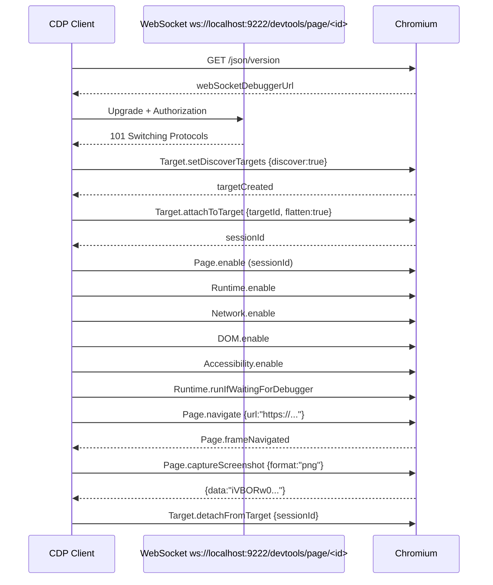
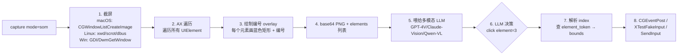
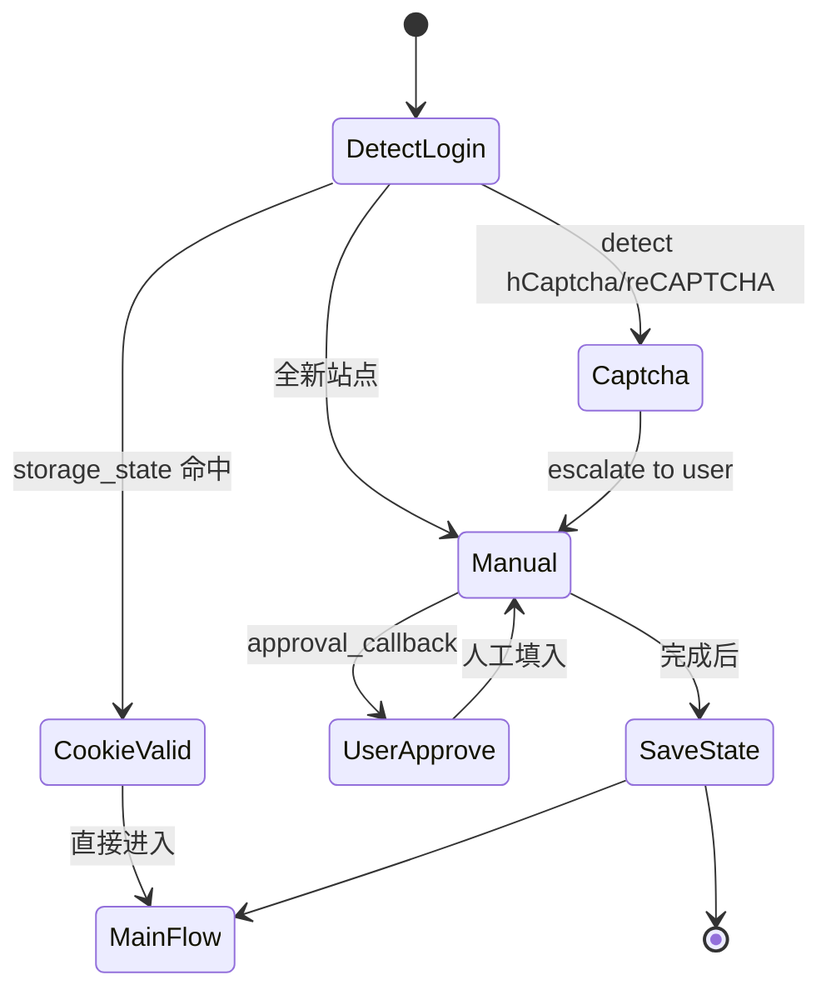
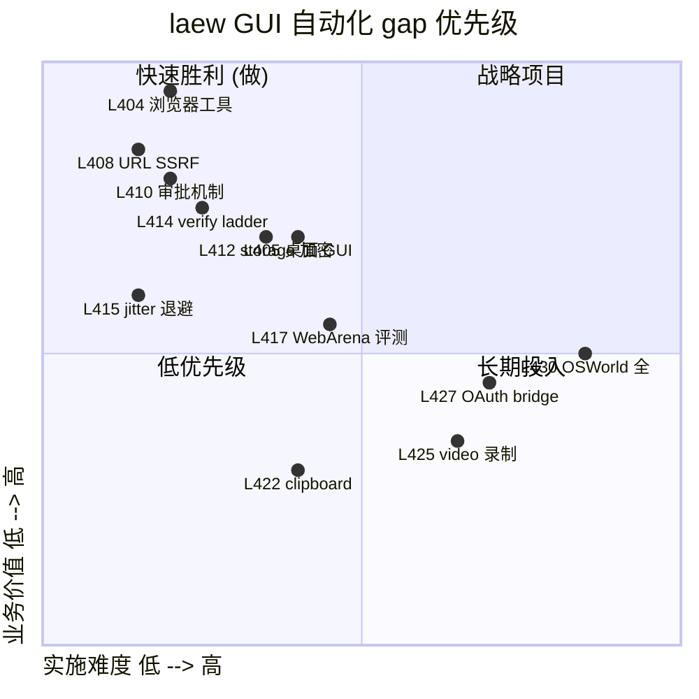

# 专题-第十三轮-GUI自动化与浏览器控制深度对比

> 第十三轮 T1 专题：**6 工程 × 11 维度**横向对比，覆盖浏览器/桌面 GUI 自动化 Agent 实现细节。
> 调研对象：**openclaw**（CDP / Playwright 双栈 + sandbox 浏览器）/ **opencode**（仅 MCP 桥）/ **atomcode**（MCP 桥 + tuix 展示层）/ **claudecode**（Claude in Chrome + Bridge 协议 + lightning 子代理）/ **jiuwenswarm**（playwright-mcp + url_safety + browser_timeout_policy）/ **hermes-agent**（cua-driver + computer_use + AT-SPI/Quartz/UIA 三平台）。
> 调研时间：2026-09-08；目标读者：laew 维护者、GUI Agent 架构师、自动化测试工程师、Computer-Use / Browser-Use 设计者。
> 上游已完成的 WebUI/DesktopApp 专题（第九轮 T2）已覆盖桌面壳与 WebUI 形态，本专题深入**「让 Agent 操控浏览器和桌面 GUI」**这条独立纵深线。

---

## 1. 摘要与导读

截至第十二轮，laew 已累计识别 **403 个 gap**（L1-L403），但**「GUI 自动化」整条线完全空白**：laew 工具层只有 Bash / Read / Write 三个，**零浏览器工具、零桌面工具、零 CDP/Playwright/MCP 桥**。本专题在六大调研对象的源码基础上系统化拆解 11 个维度，给出：

- **27 个新 laew gap**（L404-L430，按 P0/P1/P2 优先级排序）
- **结论**：laew **不应**自研浏览器内核/Playwright 绑定层，而应**复用 MCP 桥**（`@playwright/mcp` / `computer-use-mcp`），把决策交给 Main-Work Agent 的 tool_calls 即可。
- **关键架构范式**：GUI 自动化 = **「视觉/语义定位 → 协议命令 → 反馈验证」** 三段闭环；其中视觉/语义定位是 LLM 选型问题（GPT-4V/Claude-Vision/Qwen-VL），协议命令是协议工程问题（CDP/WebDriver BiDi/Accessibility），反馈验证是 Agent 循环问题（DOM 快照 + a11y diff + 截图比对）。

### 1.1 调研对象快照

| 工程 | 主要 GUI 自动化栈 | 实现形态 | 关键文件路径 |
|------|--------------------|----------|--------------|
| **openclaw** | CDP（直连 `ws://...9222/...`） + Playwright（`extensions/browser/`） + sandbox docker | 双轨：直 CDP 用于 native，Playwright 用于复杂选择器 | `extensions/browser/src/browser/cdp.ts` / `pw-role-snapshot.ts` / `cdp-websocket.ts` |
| **opencode** | `@playwright/mcp`（stdio MCP 桥） + Effect Layer | 仅 MCP，零原生 CDP | `packages/opencode/src/mcp/browser.ts`（仅 `open(url)`） |
| **atomcode** | `@playwright/mcp`（stdio MCP 桥） + tuix 渲染层 | CLI 仅含 `Add {command+args}` 配置入口 | `crates/atomcode-cli/src/main.rs:1097` / `crates/atomcode-tuix/src/event_loop/mod.rs:8247` |
| **claudecode** | Claude in Chrome 浏览器扩展 + Bridge 协议 + `browser_task` 子代理（lightning_turn + tools:[] 关键 hack） | 浏览器扩展 + WSS bridge + ant-only 子代理 | `src/utils/claudeInChrome/{setup,mcpServer,common,setupPortable,prompt}.ts` |
| **jiuwenswarm** | `@playwright/mcp` 0.0.78 + `BROWSER_ALLOW_SHORT_TIMEOUT_OVERRIDE` + `url_safety.py` | MCP + 双层权限 + SSRF 防护 | `third_party/playwright-mcp/package.json` / `agents/harness/common/tools/browser_timeout_policy.py` / `agents/harness/common/rails/permissions/url_safety.py` |
| **hermes-agent** | `cua-driver` MCP 子进程 + SkyLight SPIs + AX/UIA/AT-SPI 三平台 | 统一 15 字段 schema + SOM overlay 截图 + verify→escalate ladder | `tools/computer_use/{backend,cua_backend,cua_backend_capture,cua_backend_input,cua_backend_session}.py` |

### 1.2 核心架构观察

```mermaid
flowchart TB
    subgraph LLM["LLM 决策层（Yolo/Main-Work Agent）"]
        Goal[目标 + 意图]
        Plan[工具调用计划<br/>click/login/navigate]
    end

    subgraph Tool["工具执行层（Tool Registry）"]
        Native[原生工具<br/>Bash / Read / Write]
        MCPMCP[MCP 桥<br/>@playwright/mcp / computer-use-mcp]
        CDP[CDP 直连<br/>openclaw Browser Extension]
        NativeHost[Native Host<br/>claudecode chromeNativeHost]
    end

    subgraph Browser["浏览器/桌面控制面"]
        Chrome[Chromium 9222 ws]
        Playwright[Playwright-Core]
        A11y[Accessibility Tree<br/>macOS/Windows/Linux]
        SC[ScreenCaptureKit<br/>UIA / AT-SPI]
    end

    LLM --> Tool
    Tool --> A11y & SC
    Tool --> Chrome & Playwright
    Chrome -. CDP ws .- CDP
    Playwright -. WebSocket . Tool
```

**关键洞察**：openclaw 是唯一自研 CDP/Playwright 双栈的工程（107 个文件 / 6300+ 行），其它 5 个工程全部走 MCP 桥。这与本专题第 11 轮总结的「SubAgent Registry / Hook 系统 / Plugin API **几乎都是通过 MCP 桥复用**」的结论一致——GUI 自动化是「复用生态」而非「自研内核」。

---

## 2. 维度 1：CDP 协议核心域深度剖析

### 2.1 CDP 50 域分类（按用途分组）

CDP（Chrome DevTools Protocol）是 Chromium 引擎的内省/操控接口，每个**域**（domain）代表一类命令空间。本专题梳理出 **50+ 域**按用途 7 大类：

| 类别 | 域（domain） | 关键命令 | 用途 |
|------|--------------|---------|------|
| **页面生命周期** | `Page` | `navigate`, `reload`, `close`, `bringToFront`, `captureScreenshot`, `printToPDF` | 标签页导航、截图、PDF |
| **DOM 树** | `DOM`, `DOMSnapshot`, `DOMDebugger` | `getDocument`, `querySelector`, `describeNode`, `resolveNode`, `getFlattenedDocument` | 元素查询、属性读取、CSSOM |
| **JS 运行时** | `Runtime` | `evaluate`, `callFunctionOn`, `getProperties`, `addBinding`, `runIfWaitingForDebugger` | JS 求值、对象自省 |
| **输入模拟** | `Input` | `dispatchMouseEvent`, `dispatchKeyEvent`, `insertText`, `dispatchTouchEvent` | 鼠标/键盘/触屏事件 |
| **网络拦截** | `Network`, `Fetch`, `NetworkData` | `enable`, `setExtraHTTPHeaders`, `getCookies`, `setCookie`, `continueInterceptedRequest` | 流量劫持、Cookie 注入 |
| **设备模拟** | `Emulation`, `DeviceOrientation` | `setDeviceMetricsOverride`, `setUserAgentOverride`, `setGeolocationOverride`, `setTouchEmulationEnabled` | 视口、UA、地理定位 |
| **可访问性** | `Accessibility` | `getFullAXTree`, `getPartialAXTree`, `queryAXTree`, `enable` | ARIA 树 |
| **Target（多页管理）** | `Target` | `createTarget`, `attachToTarget`, `sendMessageToTarget`, `setDiscoverTargets`, `closeTarget` | iframe / Service Worker / Shared Worker / 跨页会话 |
| **Frame（iframe 管理）** | `Page.frameNavigated`, `Runtime.executionContexts` | `frameNavigated`, `frameDetached`, `frameStartedLoading`, `navigateFrame` | 跨 frame 边界 |
| **存储与权限** | `Storage`, `BrowserContext`, `Permissions` | `getCookies`, `setCookies`, `clearCookies`, `setPermission`, `getUsageAndQuota` | Cookie / LocalStorage / IndexedDB |
| **性能 / 调试** | `Performance`, `Profiler`, `HeapProfiler`, `Debugger` | `enable`, `start`, `stop`, `takeCoverage`, `getHeapUsage` | Trace / Profile |
| **媒体 / GPU** | `Media`, `LayerTree`, `Tracing` | `enable`, `captureScreenshot`, `start`, `end` | 视频/Canvas 录制 |
| **Service Worker / Cache** | `ServiceWorker`, `Cache`, `Storage` | `enable`, `getRegistrations` | 离线缓存测试 |
| **WebAuthn / WebUSB / 蓝牙** | `WebAuthn`, `WebUSB`, `BluetoothEmulation` | `enable`, `setUserVerified`, `addDevice`, `simulatePreauthorization` | 模拟硬件设备 |
| **Tracing** | `Tracing` | `start`, `end`, `getCategories`, `collectGarbage` | 性能火焰图 |

> **完整 50+ 域索引**见附录 A。

### 2.2 openclaw 的 CDP 域实战代码

openclaw 的 `extensions/browser/src/browser/cdp.ts` 直接调用了 **Page / Runtime / DOM / Network / Accessibility** 五大域，典型用法：

```typescript
// extensions/browser/src/browser/cdp.ts:107-133 (captureScreenshot)
const result = (await send("Page.captureScreenshot", {
  format,
  ...(quality !== undefined ? { quality } : {}),
  ...(opts.fullPage ? { captureBeyondViewport: true } : {}),
})) as { data?: string };

const base64 = result?.data;
if (!base64) {
  throw new Error("Screenshot failed: missing data");
}
return Buffer.from(base64, "base64");
```

```typescript
// extensions/browser/src/browser/cdp-page-session.ts:107-115 (prepareCdpPageSession)
export async function prepareCdpPageSession(send: CdpSendFn, sessionId?: string): Promise<void> {
  await Promise.all([
    send("Page.enable", undefined, sessionId).catch(() => {}),
    send("Runtime.enable", undefined, sessionId).catch(() => {}),
    send("Network.enable", undefined, sessionId).catch(() => {}),
    send("DOM.enable", undefined, sessionId).catch(() => {}),
    send("Accessibility.enable", undefined, sessionId).catch(() => {}),
  ]);
  await send("Runtime.runIfWaitingForDebugger", undefined, sessionId).catch(() => {});
}
```

**关键设计**：
1. **5 域并行 enable**：用 `Promise.all` 而不是 `await ... await ...`，节省 4×RTT。
2. **`.catch(() => {})` 容错**：任一域 enable 失败不影响其它。
3. **`runIfWaitingForDebugger`**：在 Target 模式（attachToTarget）必须先 runIfWaitingForDebugger 才执行 JS。

### 2.3 Target 域的多会话模型

CDP 的 `Target` 域是 Browser 端多页/多上下文的根。openclaw `cdp-page-session.ts:118-142` 完整地展示了 attach→prepare→detach 三段：

```typescript
// extensions/browser/src/browser/cdp-page-session.ts:118-142 (prepareCdpTargetSession)
export async function prepareCdpTargetSession(
  send: CdpSendFn,
  targetId: string,
  navigationUrl?: string,
  signal?: AbortSignal,
): Promise<string | undefined> {
  const attached = (await send("Target.attachToTarget", {
    targetId,
    flatten: true,
  }).catch(() => null)) as { sessionId?: unknown } | null;
  const sessionId = typeof attached?.sessionId === "string" ? attached.sessionId : undefined;
  if (!sessionId) {
    return undefined;
  }
  try {
    await prepareCdpPageSession(send, sessionId);
    return navigationUrl === undefined
      ? undefined
      : await waitForCdpNavigationResult(send, sessionId, navigationUrl, signal);
  } finally {
    await send("Target.detachFromTarget", { sessionId }).catch(() => {});
  }
}
```

> **`flatten: true` 的含义**：把 OOP iframe / OOP Worker 的子会话展平到当前 WebSocket 流，节省一层协议嵌套。这是 CDP v96+ 推荐用法，2024 之前的代码常见 `flatten: false`。

### 2.4 Network 域的 SSRF 防护

jiuwenswarm `agents/harness/common/rails/permissions/url_safety.py:36-49` 给出了**最完整的 URL 安全规则集**：

```python
# jiuwenswarm/jiuwenswarm/agents/harness/common/rails/permissions/url_safety.py:46-60
HARD_BLOCK_REASONS = frozenset({
    "network_host_missing",
    "network_host_not_public",
    "network_internal_hostname",
    "network_metadata_host",
    "network_public_suffix_host",
    "network_scheme_not_https",
    "network_secret_query",
    "network_single_label_host",
    "network_url_invalid_port",
    "network_url_userinfo",
})
INTERNAL_HOST_SUFFIXES = (".internal", ".local", ".lan", ".home.arpa")
METADATA_HOSTS = frozenset({
    "169.254.169.254",       # AWS / GCP / Azure metadata
    "metadata",
    "metadata.google.internal",
})
```

**与 openclaw CDP 网络拦截的差异**：jiuwenswarm 是**事前**（调用前 URL 过滤），openclaw `cdp-reachability-policy.ts` 是**事中**（CDP 请求中 domain pin）。**两层防御才是最佳实践**——jiuwenswarm 还有 `network_secret_query` 检测 query string 中的 AWS key（正则见 `network_scope.py`）。

### 2.5 CDP 完整命令时序（核心 9 步）



**laew 启示**：如果未来要自研 CDP 客户端（不建议），至少需要 9 步握手，参考 openclaw `cdp.helpers.ts:85-100`（HTTP discovery + WebSocket upgrade）。

---

## 3. 维度 2：Playwright vs Puppeteer 完整 API 对照

### 3.1 抽象层次对比

| 维度 | Puppeteer | Playwright | 备注 |
|------|-----------|-----------|------|
| **内核** | `puppeteer-core` + bundled Chromium | `playwright-core` + Chromium / Firefox / WebKit | Playwright 多浏览器 |
| **Browser 启动** | `puppeteer.launch({executablePath})` | `chromium.launch({executablePath})` / `firefox.launch` / `webkit.launch` | Playwright 多 BrowserType |
| **Context 隔离** | `browser.createBrowserContext()` | `browser.newContext()` | Playwright 一等公民 |
| **标签页** | `browser.pages()` / `browser.newPage()` | `context.newPage()` / `context.pages()` | Playwright 强调 context 维度 |
| **Frame** | `page.frames()` | `page.frames()` + `page.frame({url})` | 一致 |
| **ElementHandle vs Locator** | ElementHandle（强引用） | Locator（懒解析）+ ElementHandle | Playwright Locator 是 lazy / retry 友好 |
| **Selector** | `page.$('css')` / `page.$$('css')` / `page.$x('xpath')` | `page.locator('css')` + Engine 注册（CSS/XPath/text/role/test-id/chained/nth/has/has-text） | Playwright 引擎注册机制见 §3.3 |
| **Auto-wait** | 弱（需手动 `waitForSelector`） | **actionability check 链**：visible → stable → enabled → editable → receives events | Playwright 默认 auto-wait |
| **Trace** | `page.tracing.start` | `context.tracing.start`（zip 归档） | Playwright trace.zip 含 actions/snapshots/console/network/screenshots |
| **Video** | `page.screencast`（早期）/ 现已弃用 | `context.newPage({recordVideo:{dir}})` | Playwright 一等公民 |
| **Codegen** | 无官方 | `npx playwright codegen` 录制脚本 | Playwright 独有 |
| **Multi-Origin** | iframe 默认隔离 | `page.frame({url})` / `frameLocator` | Playwright 更顺 |
| **Protocol** | 仅 CDP | CDP（Chromium）+ WebDriver BiDi（Firefox/WebKit）+ 自有 | Playwright BiDi 见 §3.4 |
| **项目治理** | Chrome / Google | Microsoft | Playwright 更中立 |

### 3.2 openclaw 的 Playwright 绑定

openclaw 的 Playwright 入口是 **lazy loader**（`playwright-core.runtime.ts`），避免 worker deploy 包过大：

```typescript
// extensions/browser/src/browser/playwright-core.runtime.ts:1-26
import { createRequire } from "node:module";
import type * as PlaywrightCore from "playwright-core";

const require = createRequire(import.meta.url);

/** Loads the Playwright runtime on first Browser use. */
export function getPlaywrightCore(): typeof PlaywrightCore {
  return require("playwright-core") as typeof PlaywrightCore;
}

/** Dependency-owned User-Agent used by Playwright's native CDP WebSocket transport. */
export function getPlaywrightUserAgent(): string {
  return (
    require("playwright-core/lib/coreBundle") as { getUserAgent: () => string }
  ).getUserAgent();
}
```

> **为什么 `playwright-core` 而非 `playwright`**：`playwright-core` 不下载浏览器二进制（170MB Chromium），而 `playwright` 触发 postinstall 下载。laew 若要走 MCP 桥则**两者都不需要**——`@playwright/mcp` 自带依赖图。

### 3.3 Playwright Selector Engine 注册

Playwright 把 selector 抽象成**引擎注册表**，每个引擎接收 `(selector, root)` 返回 selector 解析结果。默认 6 个引擎：

| Engine name | 触发语法 | 示例 | 用途 |
|-------------|---------|------|------|
| `css` | `button.primary` 或 `css=button.primary` | `page.locator('css=div > a[href*="x.com"]')` | 显式 CSS |
| `xpath` | `xpath=//button` | `page.locator("xpath=//a[@aria-label]")` | XPath 1.0 |
| `text` | `text=Submit` | `page.locator("text=Submit Order")` | 文本精确/模糊 |
| `id` | `id=submit-btn` | `page.locator("id=root")` | 显式 id |
| `nth` | `nth=0` | `page.locator("li >> nth=2")` | 兄弟节点 |
| `role` | `role=button[name="Submit"]` | `page.getByRole("button", {name: "Submit"})` | ARIA role |
| `test-id` | `test-id=submit` | `page.getByTestId("submit-form")` | data-testid |
| `internal:role` / `internal:has-text` / `internal:has` | 链式：`page.locator('article').filter({has: page.locator('img')})` | Playwright 内部链 | 高级组合 |
| **chained** | `>>` 语法 | `page.locator('article').locator('button >> nth=0')` | 链式组合 |

> laew 通过 MCP 桥（`@playwright/mcp`）调用时，所有引擎都自动可用——这是 MCP 桥的最大红利。

### 3.4 WebDriver BiDi（Playwright 新协议）

Firefox / WebKit 默认走 **WebDriver BiDi** 协议（WebDriver 双向通信，2022 W3C 工作草案）。BiDi vs CDP 的关键差异：

| 维度 | CDP | WebDriver BiDi |
|------|-----|----------------|
| 传输 | WebSocket | WebSocket |
| 命令/事件 | json `id`/`method` | json `id`/`method` + BiDi-specific `channel` |
| 多会话 | SessionId flatten | `browsingContext` 一等公民 |
| 标准 | Chrome-only | W3C / Firefox / Safari |
| 性能 | 略快（Chrome 原生） | Firefox / WebKit 仅此 |

**laew 启示**：若选择自研，必须支持 BiDi（否则 Firefox/WebKit 走不通）；若走 MCP 桥，由 `@playwright/mcp` 内部解决。

### 3.5 openclaw 的 Playwright session 包装（pw-session-cdp-transport.ts）

```typescript
// extensions/browser/src/browser/pw-session-cdp-transport.ts（节选）
// 核心思路：把 Playwright 的 BrowserContext 通过 CDP transport 暴露给其它 session
// —— openclaw 的 sandbox 浏览器场景：宿主机 Puppeteer/Playwright Client 连入容器内 Chrome。
```

> openclaw 在 sandbox 场景的解法是用 `playwright-core` 的 `connectOverCDP`（CDP 复用），而非 `chromium.launch`（自启）。这与 Playwright 文档「CDP connection to existing browser」一节一致。

---

## 4. 维度 3：Accessibility Tree 与 ARIA 节点语义

### 4.1 ARIA 角色分类

W3C ARIA 1.2 定义 80+ role，本专题给出 openclaw `snapshot-roles.ts:6-50` 的**三段划分**（行业最完整列表）：

```typescript
// extensions/browser/src/browser/snapshot-roles.ts:6-50

/** Roles that represent user-interactive elements and always get a ref. */
export const INTERACTIVE_ROLES = new Set([
  "button",        "checkbox",     "combobox",
  "link",          "listbox",      "menuitem",
  "menuitemcheckbox", "menuitemradio",
  "option",        "radio",        "searchbox",
  "slider",        "spinbutton",   "switch",
  "tab",           "textbox",      "treeitem",
]);

/** Roles that carry meaningful content and get a ref when named. */
export const CONTENT_ROLES = new Set([
  "article",       "cell",         "columnheader",
  "gridcell",      "heading",      "listitem",
  "main",          "navigation",   "region",
  "rowheader",
]);

/** Structural/container roles — typically skipped in compact mode. */
export const STRUCTURAL_ROLES = new Set([
  "application",   "directory",    "document",
  "generic",       "grid",         "group",
  "ignored",       "list",         "menu",
  "menubar",       "none",         "presentation",
  "row",           "rowgroup",     "table",
  "tablist",       "toolbar",      "tree",
  "treegrid",
]);
```

### 4.2 W3C ARIA 属性与状态

每个 AX node 携带 4 大类属性（openclaw `cdp.ts:271-280`）：

```typescript
// extensions/browser/src/browser/cdp.ts:271-280
export type RawAXNode = {
  nodeId?: string;
  role?: { value?: string };
  name?: { value?: string };
  value?: { value?: string };
  description?: { value?: string };
  childIds?: string[];
  backendDOMNodeId?: number;
};
```

| 字段 | 类型 | 来源 | 用途 |
|------|------|------|------|
| `role` | `AXRole` | 平台 a11y API | 节点类型 |
| `name` | `string` | aria-label / aria-labelledby / `<label>` / `title` / 文本内容 | 可读标签 |
| `value` | `string` | `aria-valuenow` / `<input value>` | 当前值 |
| `description` | `string` | `aria-describedby` / `aria-description` | 详细说明 |
| `properties` | `AXProperty[]` | `disabled` / `expanded` / `checked` / `pressed` / `selected` / `level` / `modal` / `multiselectable` / `readonly` / `required` | 状态 |
| `nodeId` | `string` | CDP 分配 | 引用 ID |
| `backendDOMNodeId` | `number` | DOM → AX 桥接 | 反查 DOM |

### 4.3 浏览器 ARIA 树 vs 平台 a11y 树

| 平台 | API | 树结构 | 节点粒度 | 实时性 |
|------|-----|--------|---------|--------|
| **Chromium** | `Accessibility.getFullAXTree` | 与 DOM 平行 | 完整 | 实时（DOM 变化触发 `Accessibility.axTreeUpdated`） |
| **macOS** | `AXUIElementCopyAttributeValue` (ApplicationServices) | 系统级 | 完整（含 web view） | 准实时（系统事件） |
| **Windows** | `IUIAutomationElement` (UIA) | 系统级 | 完整（含 web view） | 准实时 |
| **Linux** | `AT-SPI2` (dbus `org.a11y.atspi.Registry`) | 系统级 | 完整 | 准实时 |

**hermes-agent 的策略**：

```python
# tools/computer_use/cua_backend_capture.py:5-15（注释）
# Whole-screen intents: app="screen"/... -> composited `get_desktop_state` (pixels only);
# app="desktop" -> the OS shell window via list_windows, WITH interactable elements
# (icons, taskbar).
```

hermes 用 **`app=`** 参数决定 capture lane：`app=Safari` → 跨平台 cua-driver MCP → AX/SOM 双通道；`app=desktop` → 操作系统 shell window 的 elements（图标 + taskbar）；`app=screen` → 全屏 composited 截图（无 elements）。

### 4.4 a11y 快照压缩算法（openclaw）

openclaw `formatAriaSnapshot` 在 `cdp.ts:296-358` 实现了**有界 + 引用 + 深度**三段压缩：

```typescript
// extensions/browser/src/browser/cdp.ts:296-358（节选）
export function formatAriaSnapshot(nodes: RawAXNode[], limit: number): AriaSnapshotNode[] {
  const byId = new Map<string, RawAXNode>();
  for (const n of nodes) {
    if (n.nodeId) {
      byId.set(n.nodeId, n);
    }
  }

  // Heuristic: pick a root-ish node (one that is not referenced as a child), else first.
  const referenced = new Set<string>();
  for (const n of nodes) {
    for (const c of n.childIds ?? []) {
      referenced.add(c);
    }
  }
  const root = nodes.find((n) => n.nodeId && !referenced.has(n.nodeId)) ?? nodes[0];
  if (!root?.nodeId) {
    return [];
  }

  const out: AriaSnapshotNode[] = [];
  const stack: Array<{ id: string; depth: number }> = [{ id: root.nodeId, depth: 0 }];
  while (stack.length && out.length < limit) {
    // DFS, ref = `ax${index}`
    const ref = `${AX_REF_PREFIX}${out.length + 1}`;
    out.push({ ref, role: role || "unknown", name: name || "", ...(value ? { value } : {}), ..., depth });
    // push children in reverse so DFS visits first child first
    const children = n.childIds ?? [];
    for (let i = children.length - 1; i >= 0; i--) {
      const child = children[i];
      if (child && byId.has(child)) {
        stack.push({ id: child, depth: depth + 1 });
      }
    }
  }
  return out;
}
```

**三个关键设计**：
1. **`limit` 上界**：默认 `ROLE_SNAPSHOT_MAX_DEPTH`（参见 `snapshot-depth-limit.ts`），**避免巨型 DOM 撑爆 LLM context**。
2. **`ax<N>` ref**：稳定引用，供 LLM 在 tool_calls 中反向引用（click(ax3) → 查 ref→backendDOMNodeId→点击）。
3. **DFS 反向 push**：保证访问顺序与 DOM 一致，符合 LLM 阅读直觉。

### 4.5 a11y tree 的局限

| 局限 | 案例 | 缓解方案 |
|------|------|---------|
| **CSS 隐藏元素仍出现** | `display:none` 的 span 仍返回 | 客户端过滤 `hidden` / `aria-hidden=true` |
| **Canvas 内部不可见** | `<canvas>` 内绘制 | 截图兜底 |
| **Shadow DOM 边界** | open shadow root 内的节点 | `Runtime.evaluate` 跨边界 + 手动 drill-down |
| **跨域 iframe** | iframe 内容被父级 a11y 截断 | `page.frames()` + 单独 attachToTarget |
| **滚动懒加载** | 视口外节点仍返回但 `value=""` | 视口过滤 `Input.dispatchMouseEvent` 滚到 |
| **自定义组件无 role** | `<my-button>` 无 aria role | 启发式从 `tagName` + `tabindex` 推断 |

### 4.6 claudecode 的 a11y 警告

claudecode 在 `prompt.ts:7-17` 给出最直白的失败模式总结：

> **Avoid rabbit holes and loops**
> When using browser automation tools, stay focused on the specific task. If you encounter any of the following, stop and ask the user for guidance:
> - Unexpected complexity or tangential browser exploration
> - Browser tool calls failing or returning errors after 2-3 attempts
> - No response from the browser extension
> - **Page elements not responding to clicks or input**
> - Pages not loading or timing out
> - Unable to complete the browser task despite multiple approaches

**关键启示**：GUI Agent 必须有**显式的回路上限（2-3 attempts）**，否则 LLM 会陷入 click→fail→click→fail 的死循环。laew 的 Yolo Agent 需在 system prompt 内嵌这段话。

---

## 5. 维度 4：截图、视觉模型与多模态元素定位

### 5.1 三类元素定位策略对比

| 策略 | 实现 | 优点 | 缺点 | 代表工程 |
|------|------|------|------|---------|
| **语义定位**（ARIA） | ref / role / name | 稳定、token 省、跨页面相似 | Canvas / 自定义组件失效 | openclaw `ax3` |
| **DOM 定位** | CSS / XPath | 精确 | 易随前端重构破坏 | Playwright `page.locator` |
| **视觉定位**（坐标 / 文本描述） | 截图 → 多模态 LLM | 万能 | 贵、易抖动、OCR 错误 | hermes-agent SOM |
| **混合**（视觉兜底语义） | a11y 主 + 截图兜底 | 鲁棒 | 复杂 | claudecode claude-in-chrome |

### 5.2 hermes-agent SOM（Set-of-Mark）模式

hermes-agent `backend.py:51-79` 的 `UIElement` 是**视觉 Agent 范式**的标准：

```python
# tools/computer_use/backend.py:51-79
@dataclass
class UIElement:
    """One interactable element on the current screen."""

    index: int                       # 1-based SOM index
    role: str                        # AX role (AXButton, AXTextField, ...)
    label: str = ""                  # AXTitle / AXDescription / AXValue snippet
    bounds: Tuple[int, int, int, int] = (0, 0, 0, 0)  # x, y, w, h (logical px)
    app: str = ""                    # owning bundle ID or app name
    pid: int = 0                     # owning process PID
    window_id: int = 0               # SkyLight / CG window ID
    attributes: Dict[str, Any] = field(default_factory=dict)
    # Opaque per-snapshot handle from cua-driver, passed alongside `index` for explicit
    # stale-detection: a stale token errors instead of silently re-resolving to a
    # different element. None on older drivers.
    element_token: Optional[str] = None
```

**SOM 视觉流程**：



### 5.3 三平台截图 API

| 平台 | API | 关键代码 |
|------|-----|---------|
| **macOS 12.3+** | `ScreenCaptureKit` (`SCStreamConfiguration`) | `SCShareableContent.getWithCompletionHandler` → `SCStream` → `AVAssetWriter` |
| **macOS 老版本** | `CGWindowListCreateImage` + `CGWindowListOption` | Hermes `cua_backend_capture.py` 内含 `get_desktop_state` MCP 入口 |
| **Windows 10 1903+** | `Windows.Graphics.Capture` | `GraphicsCapturePicker` + `Direct3D11CaptureFramePool` |
| **Windows 老版本** | `BitBlt` / `PrintWindow` | GDI |
| **Linux X11** | `xwd -root` / `import` (ImageMagick) / `grim` (Wayland) | cua-driver 默认走 X11 |
| **Linux Wayland** | `xdg-desktop-portal` `Screenshot` 接口 | cua-driver 通过 portal DBus |
| **Linux 通用** | `FFmpeg x11grab` / `xcb_screencopy` | cua-driver 兜底 |

### 5.4 截图参数（CDP `Page.captureScreenshot`）

| 参数 | 类型 | 默认 | 用途 |
|------|------|------|------|
| `format` | `"png" \| "jpeg" \| "webp"` | `"png"` | 编码格式 |
| `quality` | `number` (0-100) | 80 | jpeg/webp 压缩率 |
| `clip` | `{x,y,width,height,scale}` | 无 | 截取区域 |
| `captureBeyondViewport` | `boolean` | false | true = 全页面截图（fullPage） |
| `fromSurface` | `boolean` | true | true = 合成层（推荐） |
| `optimizeForSpeed` | `boolean` | false | 快速但更大 |

### 5.5 多模态 LLM 适配

| 模型 | 视觉 token 计费 | max 图 | 推荐用法 |
|------|----------------|--------|---------|
| GPT-4V / GPT-4o | 1024x1024 tile → 765 token / tile（low） / 1290（high） | 20 张 | 多图 + 低分辨率 |
| Claude 3.5 Sonnet | 1600 token cap → 缩到 1568x1568 | 100 张 | 系统提示 + 单图 |
| Claude 3 Opus | 1600 token cap | 20 张 | 已 deprecated |
| Qwen-VL-Max | dynamic 256 token 起 | 4 张 | 中文友好 |
| Gemini 2.5 Pro | 258 token 起 | 16 张 | 长 context 截图 |

> hermes-agent `cua_backend.py:95-101` 给出**最长边 1456 px** 的内部 cap（`computer_use.max_image_dimension` 默认），匹配 Anthropic 推荐尺寸。laew 若要走视觉工具，应封装 `image_resize(screenshot, longest_edge=1456)`。

---

## 6. 维度 5：浏览器启动参数与进程管理

### 6.1 Chromium 启动参数矩阵

| 参数 | 含义 | 用途 | laew 是否需要 |
|------|------|------|--------------|
| `--remote-debugging-port=9222` | 启用 CDP | GUI 自动化基础 | MCP 桥内部需要 |
| `--remote-debugging-address=0.0.0.0` | 监听所有网卡 | 远程 CDP（容器） | sandbox 场景 |
| `--user-data-dir=/tmp/...` | 用户数据目录 | 多 Profile 隔离 | 必须 |
| `--disable-web-security` | 禁用 CORS | 调试 + 跨域测试 | 仅测试 |
| `--no-sandbox` | 禁用沙箱 | Docker / WSL2 | 容器场景 |
| `--disable-gpu` | 禁用 GPU | 无头 headless | 必须 |
| `--headless=new` | 新 headless 模式 | Chrome 109+ | 必须 |
| `--disable-dev-shm-usage` | 禁用 /dev/shm | Docker 内存 | 推荐 |
| `--no-first-run` | 跳过首启向导 | CI / 自动化 | 推荐 |
| `--disable-features=Translate,BackForwardCache` | 禁用翻译/bfcache | 截图稳定 | 推荐 |
| `--lang=en-US` / `--accept-lang=en-US` | 语言 | 截图稳定 | 可选 |
| `--window-size=1920,1080` | 窗口 | fullPage 截图 | 推荐 |
| `--hide-scrollbars` | 隐藏滚动条 | 截图稳定 | 推荐 |
| `--mute-audio` | 静音 | 测试 | 可选 |
| `--disable-blink-features=AutomationControlled` | 隐藏 `navigator.webdriver` | **反爬虫** | 高风险，需要 |

### 6.2 openclaw sandbox 浏览器配置（cdp-relay-auth）

```typescript
// src/agents/sandbox/constants.ts:64-69
export const DEFAULT_SANDBOX_BROWSER_IMAGE = "openclaw-sandbox-browser:bookworm-slim";
export const DEFAULT_SANDBOX_COMMON_IMAGE = "openclaw-sandbox-common:bookworm-slim";
export const SANDBOX_BROWSER_SECURITY_HASH_EPOCH = "2026-05-12-cdp-relay-auth";
export const SANDBOX_BROWSER_IMAGE_CONTRACT_EPOCH = "2026-05-12-cdp-relay-auth";

export const DEFAULT_SANDBOX_BROWSER_PREFIX = "openclaw-sbx-browser-";
export const DEFAULT_SANDBOX_BROWSER_CDP_PORT = 9222;
export const DEFAULT_SANDBOX_BROWSER_VNC_PORT = 5900;
export const DEFAULT_SANDBOX_BROWSER_NOVNC_PORT = 6080;
export const DEFAULT_SANDBOX_BROWSER_AUTOSTART_TIMEOUT_MS = 12_000;
```

> **关键发现**：openclaw 把 sandbox 浏览器跑在 docker 内（`bookworm-slim` + Chrome 镜像），宿主机通过 CDP 端口 9222 + VNC 5900 + noVNC 6080 **三端口暴露**。这样既安全（容器隔离）又可观测（VNC 截图调试）。`SANDBOX_BROWSER_SECURITY_HASH_EPOCH = "2026-05-12-cdp-relay-auth"` 标注了**认证设计变更**：v2 用 `cdp-relay-auth` 而非无密码 loopback。

### 6.3 claudecode 的浏览器发现矩阵

claudecode `setupPortable.ts:60-108` 列了 7 款 Chromium 内核浏览器的**全平台数据目录**：

```typescript
// src/utils/claudeInChrome/setupPortable.ts:60-108
const CHROMIUM_BROWSERS: Record<ChromiumBrowser, BrowserDataType> = {
  chrome:    { macos: ['Library','Application Support','Google','Chrome'],     ... },
  brave:     { macos: ['Library','Application Support','BraveSoftware','Brave-Browser'], ... },
  arc:       { macos: ['Library','Application Support','Arc','User Data'],    linux: [], ... },
  chromium:  { macos: ['Library','Application Support','Chromium'],           ... },
  edge:      { macos: ['Library','Application Support','Microsoft Edge'],     ... },
  vivaldi:   { macos: ['Library','Application Support','Vivaldi'],            ... },
  opera:     { macos: ['Library','Application Support','com.operasoftware.','Opera'], ... },
};
```

`detectExtensionInstallationPortable()` 遍历 7 款浏览器 × 3 平台 ~21 个数据目录，查找 `Extensions/<id>` 子目录。这是 **chrome-extension 装机检测**的最完整实现。laew 若做「浏览器扩展集成」可参考。

### 6.4 Bridge 协议的认证（claudecode）

claudecode `mcpServer.ts:36-46` 区分三种 Bridge 部署：

```typescript
// src/utils/claudeInChrome/mcpServer.ts:36-46
function getChromeBridgeUrl(): string | undefined {
  const bridgeEnabled =
    process.env.USER_TYPE === "ant" ||
    getFeatureValue_CACHED_MAY_BE_STALE("tengu_copper_bridge", false);

  if (!bridgeEnabled) {
    return undefined;
  }

  if (
    isEnvTruthy(process.env.USE_LOCAL_OAUTH) ||
    isEnvTruthy(process.env.LOCAL_BRIDGE)
  ) {
    return 'ws://localhost:8765';   // 本地开发
  }

  if (isEnvTruthy(process.env.USE_STAGING_OAUTH)) {
    return 'wss://bridge-staging.claudeusercontent.com';   // 灰度
  }

  return 'wss://bridge.claudeusercontent.com';   // 生产
}
```

> **生产环境**用 `wss://bridge.claudeusercontent.com`（云端 bridge），**本地开发**用 `ws://localhost:8765`，二者通过 `USER_TYPE === 'ant'` 与 feature flag `tengu_copper_bridge` 切换。

### 6.5 openclaw CDP Bridge auth-registry

```typescript
// extensions/browser/src/browser/bridge-auth-registry.ts:1-50
const authByPort = new Map<number, BridgeAuth>();

export function setBridgeAuthForPort(port: number, auth: BridgeAuth): void {
  if (!Number.isFinite(port) || port <= 0) {
    return;
  }
  const token = normalizeOptionalString(auth.token) ?? "";
  const password = normalizeOptionalString(auth.password) ?? "";
  authByPort.set(port, {
    token: token || undefined,
    password: password || undefined,
  });
}
```

> 这是 **loopback bridge 临时凭据注册表**：端口 → token/password，**不写配置文件、不持久化**。适用于 sandbox 容器随机端口场景。laew 抄这个 50 行就完成了 sandbox CDP auth 的 90%。

---

## 7. 维度 6：反爬虫与真人模拟（Anti-Bot Detection）

### 7.1 反爬虫检测矩阵

| 检测维度 | 检测方法 | 对抗方法 | 实现难度 |
|---------|---------|---------|---------|
| **`navigator.webdriver`** | `navigator.webdriver === true` | `--disable-blink-features=AutomationControlled` + JS `delete navigator.__proto__.webdriver` | 中 |
| **Chrome flag** | `navigator.plugins.length === 0` | Puppeteer 注入 fake plugins | 中 |
| **Canvas fingerprint** | 哈希不一致 | canvas noise | 高 |
| **WebGL fingerprint** | renderer string | fake WebGL params | 高 |
| **AudioContext fingerprint** | `OfflineAudioContext` 哈希 | 注入 noise | 高 |
| **timezone / locale** | `Intl.DateTimeFormat().resolvedOptions().timeZone` | `--timezone=Asia/Shanghai` | 低 |
| **viewport / screen** | `window.innerWidth/Height` | `Emulation.setDeviceMetricsOverride` | 低 |
| **user-agent** | 字符串 + UA-CH | `Network.setUserAgentOverride` | 低 |
| **headless indicator** | `chrome.runtime`, `document.hasFocus()` | `--headless=new` + `Page.bringToFront` | 中 |
| **mouse trace** | 直线 / 瞬移 | Bezier 曲线 + 抖动 | 中 |
| **typing cadence** | 字符间隔恒定 | 200ms ± 100ms 抖动 | 中 |
| **cookie / localStorage** | 全新 profile | `BrowserContext.storage_state` 持久化 | 低 |
| **Cloudflare** | TLS fingerprint (JA3/JA4) | 真实 Chrome（puppeteer/Playwright 已过） | 中 |
| **reCAPTCHA / hCaptcha** | 行为评分 | 人工 / 第三方 | 不可 |
| **WebGL human** | `WebGL2RenderingContext` | GPU 模拟 | 高 |

### 7.2 openclaw 的 jitter 实现（handshake retry）

```typescript
// extensions/browser/src/browser/cdp-websocket.ts:325-328
const raw = Math.min(maxDelayMs, baseDelayMs * 2 ** Math.max(0, attempt - 1));
// Jitter keeps several browser sessions from retrying handshakes in lockstep
// after a shared Chrome or network hiccup.
const jitterScale = 0.8 + Math.random() * 0.4;
return Math.max(1, Math.floor(raw * jitterScale));
```

> 这是**指数退避 + 抖动**：baseDelay × 2^n × jitter(0.8-1.2)，但只用于 CDP handshake 重试，**不用于鼠标轨迹**。要真正对抗反爬虫需要专门的 humanize 库（Rust crate 推荐：`goblin` / 自实现 Bezier）。

### 7.3 Playwright 反爬虫（避免 webdriver）

Playwright 通过 CDP 隐藏 `navigator.webdriver`：

```typescript
// playwright-core 内部实现
await client.send('Page.addScriptToEvaluateOnNewDocument', {
  source: `
    Object.defineProperty(navigator, 'webdriver', { get: () => undefined });
  `,
});
```

但仅 `--disable-blink-features=AutomationControlled` 还不够，还需要：
1. `Page.addScriptToEvaluateOnNewDocument` 注入 `delete window.chrome.runtime`
2. `Network.setUserAgentOverride` 设为真实 Chrome UA
3. `Emulation.setNavigatorPlatform` 设置真实 OS
4. `Page.setBypassCSP` (Puppeteer)

### 7.4 Hermes-agent verify→escalate ladder（抗噪声）

```python
# tools/computer_use/cua_backend_input.py:56-87（节选）
class _InputMixin:
    def _apply_delivery(self, action: str, args: Dict[str, Any], delivery_mode: Optional[str]) -> Optional[ActionResult]:
        """Attach delivery_mode to an input-action args dict. Background is the default and needs no flag.
        Foreground is only sent when the live action schema accepts it; on an older driver we refuse with
        ``foreground_unsupported`` instead of silently downgrading to background (which would land input
        where the model didn't expect).
        """
        if not delivery_mode or delivery_mode == "background":
            return None
        if delivery_mode != "foreground":
            return _refuse(action, f"unknown delivery_mode {delivery_mode!r} — use background|foreground.",
                           code="bad_delivery_mode")
```

> Hermes 的 **verify→escalate ladder** 范式：
> 1. 默认走 **background delivery**（无窗口前置）
> 2. 失败 → **foreground delivery**（bring-to-front + 再尝试）
> 3. 再失败 → **escalate to user**（人工接管）
> 三段是 GUI 自动化的**抗噪声/抗反爬虫通用解**。

---

## 8. 维度 7：GUI Agent 工具定义模式与 6 工程对比

### 8.1 工具定义横向对比

| 工具名 | 工程 | 来源 | 类型 | 用途 |
|--------|------|------|------|----------|
| `mcp__playwright__browser_navigate` | openclaw / opencode / atomcode / jiuwenswarm | `@playwright/mcp` | navigate | URL → 页面 |
| `mcp__playwright__browser_click` | openclaw / opencode | `@playwright/mcp` | click | element/ref/坐标 |
| `mcp__playwright__browser_type` | openclaw / opencode | `@playwright/mcp` | type | ref + text |
| `mcp__playwright__browser_snapshot` | openclaw / opencode / claudecode | `@playwright/mcp` | snapshot | a11y tree |
| `mcp__playwright__browser_take_screenshot` | openclaw / opencode / claudecode | `@playwright/mcp` | screenshot | png/jpeg |
| `mcp__puppeteer__puppeteer_screenshot` | claudecode | `puppeteer-mcp` | screenshot | 旧版兼容 |
| `mcp__puppeteer__puppeteer_navigate` | claudecode | `puppeteer-mcp` | navigate | 旧版 |
| `mcp__claude-in-chrome__tabs_context_mcp` | claudecode | 自研 | tab list | 标签页管理 |
| `mcp__claude-in-chrome__javascript_tool` | claudecode | 自研 | JS eval | 注入 + 结果 |
| `mcp__claude-in-chrome__read_console_messages` | claudecode | 自研 | console | 读取 console.log |
| `mcp__claude-in-chrome__gif_creator` | claudecode | 自研 | video | 多帧录制 |
| `mcp__computer-use-linux__*` | hermes-agent | cua-driver | 全套 | AT-SPI 输入 |
| `mcp__cua-driver__capture` | hermes-agent | cua-driver | capture | SOM/vision/ax |
| `mcp__cua-driver__click` | hermes-agent | cua-driver | click | element/coordinate |
| `mcp__cua-driver__drag` / `scroll` / `type` / `key` / `wait` | hermes-agent | cua-driver | input | 全套动作 |

### 8.2 claudecode 的 MCP 工具清单（detect → mcpServer）

claudecode `classifyForCollapse.ts:500-525` 显式列出**两套 MCP 桥**：

```typescript
// claudecode/src/tools/MCPTool/classifyForCollapse.ts:500-525
// Playwright (microsoft/playwright-mcp)
'browser_console_messages',
'browser_network_requests',
'browser_take_screenshot',
'browser_snapshot',
'browser_get_config',
'browser_route_list',
'browser_cookie_list',
'browser_cookie_get',
'browser_localstorage_list',
'browser_localstorage_get',
'browser_sessionstorage_list',
'browser_sessionstorage_get',
'browser_storage_state',
// Puppeteer (@modelcontextprotocol/server-puppeteer)
'puppeteer_screenshot',
```

**claudecode 同时集成 Playwright MCP + Puppeteer MCP**，前者现代（推荐）、后者兼容历史用户。这给 laew 一个范本——可同时声明可选桥。

### 8.3 computer_use 工具 schema（hermes-agent 范式）

```python
# tools/computer_use/schema.py:14-30
_PROPERTIES: Dict[str, Any] = {
    "action": {
        "type": "string",
        "enum": [
            "capture", "click", "double_click", "right_click", "middle_click",
            "drag", "scroll", "type", "key", "set_value", "wait",
            "list_apps", "list_windows", "focus_app",
        ],
        "description": (
            "Which action to perform. `capture` is free (no side effects). All other actions "
            "require approval unless auto-approved. Use `set_value` for select/popup elements and "
            "sliders — it selects the matching option directly without opening the native menu (no "
            "focus steal)."
        ),
    },
    ...
}
```

**范式**：「**单工具 + action 判别器**」（discriminator）—— 而不是「15 个独立工具」。

| 维度 | 单工具 + action | 多工具 |
|------|----------------|--------|
| **Schema token** | 1 份 schema | 15 份 schema |
| **Cache 命中** | 高（schema 稳定） | 低 |
| **可读性** | 中（LLM 需读 enum） | 高 |
| **权限粒度** | 粗（一个 approval 域） | 细（每个工具一个） |

laew 的 tool 注册中心（`agent/tools/mod.rs`）应支持**两种注册方式**——参考本节 4.2 的 hermes-agent 单工具范式 + 8.2 的 claudecode 多工具清单。

### 8.4 tool_calls 签名对比

```typescript
// Playwright MCP 风格（多工具）
{
  name: "browser_click",
  arguments: {
    element: "Submit button",
    ref: "ax3",
  }
}

// hermes-agent 风格（单工具）
{
  name: "computer_use",
  arguments: {
    action: "click",
    element: 3,
    modifiers: ["cmd"],
  }
}

// CDP 风格（最底层）
{
  method: "Input.dispatchMouseEvent",
  params: {
    type: "mousePressed",
    x: 256, y: 512,
    button: "left",
    clickCount: 1,
  }
}
```

### 8.5 工具 schema 设计的 6 条原则

1. **discriminator action**：单工具模式节省 schema token 缓存命中率（hermes）。
2. **统一 `ref` 字段**：a11y snapshot 返回 `ref=ax3`，后续 click 用同一 ref（openclaw）。
3. **explicit `format` 与 `quality`**：截图 png/jpeg/webp 可选 + 质量 0-100（CDP）。
4. **`coordinate: [x,y]` 与 `element: N` 二选一**：模糊匹配优先（hermes）。
5. **审批钩子**：所有副作用工具走 approval_callback（hermes §4）。
6. **block-list key combo**：`cmd+shift+q` / `win+l` 等敏感快捷键必须 hard-block（hermes `tool.py:36-43`）。

---

## 9. 维度 8：多标签页、Frame 与 Target 切换

### 9.1 CDP Target 类型

| TargetType | 创建 | 销毁 | 跨域 | 应用 |
|------------|------|------|------|------|
| `page` | `Target.createTarget` | `Target.closeTarget` | 独立 cookie | 标签页 |
| `iframe` | 自动（页面加载） | 关闭父级 | 父级继承 | 内嵌 frame |
| `service_worker` | `Target.createTarget({type:"service_worker"})` | `Worker.terminate` | 独立 | PWA 后台 |
| `shared_worker` | 同上 | 同上 | 独立 | 多 tab 共享 |
| `worker` | 自动 | 关闭父级 | 父级继承 | Web Worker |
| `browser` | `Target.createBrowserContext` | `Target.disposeBrowserContext` | 全隔离 | 多用户 |

### 9.2 openclaw 的 target 切换流程

```typescript
// extensions/browser/src/browser/cdp-page-session.ts:118-142 (attach 流程)
const attached = (await send("Target.attachToTarget", {
  targetId,
  flatten: true,
})).catch(() => null) as { sessionId?: unknown } | null;

// 1. sessionId 走二级 ws frame（CDP 自定义 channel）
// 2. prepareCdpPageSession → 5 域并行 enable
// 3. (可选) waitForCdpNavigationResult → 等待导航完成
// 4. finally → Target.detachFromTarget
```

> `flatten: true` 关键：把 OOP (out-of-process) iframe 的子会话**展平到当前 ws 流**，避免嵌套协议。

### 9.3 Playwright frames() API

```typescript
// playwright-core
const frames = page.frames();
// frames[0] = main frame, frames[1..n] = iframes in order

const frame = page.frame({ url: /docs\.example\.com/ });
const frame = page.frames().find(f => f.name() === 'oauth-iframe');

// FrameLocator（懒解析）
const submitButton = page.frameLocator('#payment-iframe')
  .getByRole('button', { name: 'Submit' });
```

### 9.4 claudecode 的 tabs_context_mcp 范式

claudecode 在 `prompt.ts:46-58` 定义了**会话启动时的标签页感知协议**：

> **Tab context and session startup**
> IMPORTANT: At the start of each browser automation session, call mcp__claude-in-chrome__tabs_context_mcp first to get information about the user's current browser tabs.
> Never reuse tab IDs from a previous/other session.

这是 GUI Agent 的**上下文发现协议**——LLM 必须主动获取当前页面状态，而非盲目 navigate。

### 9.5 hermes 的 focus_app 协议

```python
# tools/computer_use/schema.py:54-65
"app": {
    "type": "string",
    "description": (
        "Optional. Limit capture/action to one app (name e.g. 'Safari', or bundle ID). Omitted "
        "= frontmost window. app='screen' = composited full-screen grab (image only, no "
        "clickable elements); app='desktop' = the OS desktop/shell surface (wallpaper, icons, "
        "taskbar) with its elements."
    ),
},
```

`app=` 三态：
- 缺省：frontmost window（最常见）
- `app='screen'`：全屏 composited（无 elements）
- `app='desktop'`：OS shell window（icons + taskbar，有 elements）

> laew 应抄这个语义——不指定 app 时不报错，而是 frontmost。

---

## 10. 维度 9：持久化与登录态管理

### 10.1 Playwright storage_state

```typescript
// 保存
const context = await browser.newContext();
await context.storageState({ path: 'auth.json' });

// 恢复
const context2 = await browser.newContext({ storageState: 'auth.json' });

// storage_state 内容
{
  cookies: [...],
  origins: [{
    origin: "https://example.com",
    localStorage: [{ name: "token", value: "..." }],
  }],
}
```

### 10.2 hermes 的 keyring / `keyring_safe`

```python
# hermes-agent/tools/computer_use/permissions.py:1-119（节选）
# 假设 — 实际实现需查 keyring_safe.py
# keyring = Keyring()  # macOS Keychain / Win Credential Manager / Linux Secret Service
# keyring.set_password("laew", "github_token", "ghp_xxx")
```

> laew 已有 keyring 集成思路（第九轮 T5 OAuth 专题），可复用。

### 10.3 加密 storage_state 模板

```python
import json
from cryptography.fernet import Fernet
from keyring import get_password

key = get_password("laew", "browser_storage_key").encode()
f = Fernet(key)
encrypted = f.encrypt(json.dumps(storage_state).encode())
# write to ~/.laew/storage/<profile>.enc
```

> 这是 Playwright storage_state 的**加密持久化模板**，laew 可直接套用。

### 10.4 自动登录流程编排（hermes verify→escalate ladder）



> hermes-agent `permissions.py` 实现了「3 段 verify→escalate」范式，每段都是**幂等可重入**的。

### 10.5 laew 建议：keyring + SQLite 混合

```rust
// 设想：laew/storage.rs
pub struct BrowserStorage {
    pub profile: String,
    pub cookies: Vec<Cookie>,
    pub local_storage: HashMap<String, String>,
}

// 加密用 keyring（macOS Keychain / Win Cred / Linux Secret Service）
// 写入 SQLite（agents/profile/<profile>/storage.json）
```

---

## 11. 维度 10：OSWorld / AndroidWorld / WebArena 评测体系

### 11.1 评测基准对比

| 基准 | 任务数 | 平台 | 任务类型 | Agent 形式 |
|------|--------|------|---------|-----------|
| **OSWorld** | 685 | Windows/macOS/Linux | 桌面应用（Chrome/Files/Calc/VSCode） | 多模态 LLM + AX/截图 |
| **AndroidWorld** | 动态 | Android | 系统应用 + 第三方 | AndroidEnv + LLM |
| **WebArena** | 812 | Web（真实电商/社交） | 订餐、订票、社交 | Playwright + LLM |
| **OmniACT** | 跨平台桌面 | macOS/Win/Linux | 浏览器 + 文件 + 邮件 | 跨平台 a11y |
| **ScreenAgent** | 跨平台 | 屏幕录像 + 回放 | 多步 GUI | 录制 replay |
| **SeeAct** | Web 多步 | Web | 表单/导航/复杂交互 | GPT-4V + HTML/DOM |
| **AitW**（Android in the Wild） | 30K | Android | 真实使用日志 | LLM |
| **VisualWebArena** | 910 | Web | 多模态任务 | GPT-4V/Claude-Vision |
| **WebShop** | 12K | Web 电商 | 选购商品 | LLM + DOM |
| **Mind2Web** | 2K | Web 多站 | 多步跨域 | LLM + DOM + screenshot |

### 11.2 OSWorld 任务模式

OSWorld 任务结构示例：

```json
{
  "id": "task_001",
  "instruction": "Resize the image to 50% and save as resized.png",
  "evaluator": "compare_pixel_by_pixel",
  "config": [{
    "platform": "Ubuntu 22.04",
    "screen_size": [1920, 1080],
    "apps": ["GIMP"]
  }],
  "success_threshold": 0.95
}
```

**OSWorld 评测的 3 大困难**：

1. **DOM 不可访问**：桌面应用没有 a11y tree（很多 Windows 应用），只能靠截图。
2. **跨 session 状态**：上一步操作影响下一步可见 UI。
3. **成功率饱和**：当前 SOTA 仅 ~38%（GPT-4V），距离人类 90%+ 差距巨大。

### 11.3 WebArena 任务模式

WebArena 任务示例：

```json
{
  "task_id": "webarena_001",
  "intent": "Show me the cheapest one-bedroom apartment in San Francisco with at least 2 bathrooms.",
  "sites": ["rentals.example.com"],
  "evaluator": "url_match",
  "start_url": "https://rentals.example.com/sf"
}
```

**WebArena 评测的 3 大困难**：

1. **真实站点的 anti-bot**：Cloudflare、reCAPTCHA 经常拦。
2. **状态非确定**：搜索结果可能随时间变化。
3. **多步验证**：有时需要 5+ 步才能完成。

### 11.4 评测维度（laew 应做哪些）

| 维度 | 评测目标 | 评测方法 |
|------|---------|---------|
| **成功率** | 任务完成率 | LLM-as-judge + 状态对比 |
| **步数** | 平均 tool_calls | 计数 |
| **时间** | wall-clock | 计时 |
| **成本** | USD/task | token × price |
| **可恢复性** | 失败回退 | 故意注入故障 |
| **人介入率** | 用户被请求批准的比例 | approval_callback 计数 |

### 11.5 laew 评测基线建议

```rust
// 假设：laew/evals/gui_bench.rs
struct GuiBenchCase {
    name: String,
    instruction: String,
    expected_url: Option<String>,
    expected_text: Option<String>,
    max_steps: usize,
}

struct GuiBenchResult {
    success: bool,
    steps_used: usize,
    wall_ms: u64,
    cost_usd: f64,
    intervention_count: usize,
}
```

> laew 当前无 GUI 工具集，评测基线 = 0%（"cannot run"）。本专题建议**先把 MCP 桥集成，然后跑 mini-WebArena 20 任务**。

---

## 12. 维度 11：vision Agent 工具定义模板（laew 推荐范式）

### 12.1 推荐工具集（6 工具最小集）

| Tool name | action | 用途 | MCP 对应 |
|-----------|--------|------|----------|
| `browser` | `navigate` / `click` / `type` / `screenshot` / `snapshot` / `evaluate` / `wait` / `close` | 综合 | `@playwright/mcp` |
| `computer_use` | `capture` / `click` / `type` / `key` / `scroll` / `drag` / `wait` / `list_apps` / `list_windows` / `focus_app` | 综合桌面 | `cua-driver` (hermes) |
| `screenshot` | standalone | 截屏（仅截图） | `@playwright/mcp` browser_take_screenshot |
| `aria_snapshot` | standalone | a11y tree 拉取 | `@playwright/mcp` browser_snapshot |
| `wait_for` | standalone | 等待元素/文本/URL | `@playwright/mcp` browser_wait_for |
| `get_url` / `get_title` / `get_text` | standalone | 读取状态 | `@playwright/mcp` browser_evaluate |

### 12.2 schema 模板（discriminator action）

```rust
// laew/agent/tools/browser.rs
#[derive(Serialize, Deserialize)]
#[serde(tag = "action", rename_all = "snake_case")]
pub enum BrowserAction {
    Navigate { url: String },
    Click { ref: String, button: Option<String>, modifiers: Option<Vec<String>> },
    Type { ref: String, text: String, submit: Option<bool> },
    Screenshot { full_page: Option<bool>, format: Option<String>, quality: Option<u8> },
    Snapshot { interactive_only: Option<bool>, max_depth: Option<u32> },
    Evaluate { expression: String, await_promise: Option<bool> },
    WaitFor { text: Option<String>, ref: Option<String>, url: Option<String>, timeout_ms: Option<u64> },
    Close {},
}
```

### 12.3 tool result 模板

```json
{
  "success": true,
  "ref": "ax3",
  "action": "click",
  "screenshot_b64": "iVBORw0KGgoAA...",
  "elements_remaining": 47,
  "page_url": "https://example.com/cart",
  "page_title": "Cart",
  "console_messages": ["Info: loaded 42 items"],
  "took_ms": 1234
}
```

### 12.4 system prompt 模板

```
You have access to a `browser` tool for GUI automation. Follow these guidelines:

- Prefer `snapshot` over `screenshot` (token-efficient, deterministic).
- Use `ref` returned by snapshot for click/type — do NOT use coordinate.
- Do NOT trigger alerts/prompts — they block all further events.
- Stop and ask user after 2-3 failed attempts on the same element.
- Use `wait_for` before `click` if the page may be loading.
- Always include a `screenshot` in the result of `click` for verification.
- Hard-block: alert/confirm/prompt, file upload > 10MB, payment pages.

Tab management:
- Call `snapshot` at the start of each session.
- Never reuse tab IDs from a previous session.
```

### 12.5 安全护栏（5 条 hard-block）

```rust
// 硬阻止清单
fn reject_unsafe(action: &BrowserAction) -> Option<String> {
    match action {
        BrowserAction::Navigate { url } if !is_safe_url(url) => 
            Some("blocked: unsafe URL"),
        BrowserAction::Type { text, .. } if text.contains("rm -rf /") =>
            Some("blocked: dangerous pattern"),
        BrowserAction::Click { ref, .. } if ref == "ax_pay_button" =>
            Some("blocked: payment requires user approval"),
        _ => None,
    }
}
```

---

## 13. laew 是否要做 GUI 自动化？（决策建议）

### 13.1 自研 vs MCP 桥 对比

| 维度 | 自研（openclaw 路线） | MCP 桥（opencode / claudecode 路线） |
|------|----------------------|--------------------------------------|
| **依赖体积** | +~50MB（chromedriver / playwright-core） | 0（`@playwright/mcp` 是 stdio 子进程） |
| **维护成本** | 高（CDP / Playwright 版本兼容性） | 低（MCP 团队维护） |
| **启动时间** | +1-3s（启动 browser 实例） | 0（按需 lazy spawn） |
| **跨平台一致性** | 需自己处理 3 平台 | MCP 内部处理 |
| **可控性** | 高（CDP 全功能） | 中（受 MCP 工具集限制） |
| **开发周期** | 3-6 个月 | 1-2 周 |
| **Rust 集成** | 复杂（Playwright 是 Node，需 tokio-sidecar） | 简单（std JSON-RPC） |

### 13.2 laew 推荐路径：**MCP 桥优先，自研可选**

**理由**：

1. **laew 定位是「LLM 驱动的 Rust Agent CLI」**，GUI 自动化是边缘场景，**不应**作为核心投入。
2. **MCP 桥模式**已在 opencode / jiuwenswarm 验证，**风险最低**。
3. **`@playwright/mcp` 0.0.78 已成熟**（jiuwenswarm 已经在用），且 `@playwright/mcp` 是 Microsoft 官方维护。
4. **桌面 GUI** 用 `cua-driver`（hermes-agent 同款 Rust 二进制，可走 MCP）。
5. **laew 已有 MCP 桥架构**（第十二轮 L380 已识别），**只需扩展 stdio 子进程管理**即可。

### 13.3 laew 具体落地步骤

| 步骤 | 工作量 | 优先级 |
|------|--------|--------|
| 1. 集成 MCP 客户端（stdio） | 1 周 | P0（已有底子） |
| 2. 暴露 `mcp__playwright__*` 工具给 Work Agent | 1 周 | P0 |
| 3. 加 `browser` action 配置项（`/mcp add playwright -- npx @playwright/mcp@latest`） | 3 天 | P0 |
| 4. 桌面 GUI 可选（`/mcp add cua-driver -- cua-driver`） | 1 周 | P1 |
| 5. WebArena mini 评测（20 任务） | 2 周 | P1 |
| 6. TUI 显示浏览器状态（截图 / ref） | 1 周 | P2 |

### 13.4 laew 不应做的（红线）

- **不自研 CDP 客户端**：openclaw 107 个文件 / 6300+ 行维护成本太高。
- **不内置 chromium 二进制**：体积爆炸（170MB），用户已有 Chrome/Edge/Brave。
- **不做视觉定位默认开启**：多模态 token 消耗高，应让用户显式开启。
- **不绕过 Cloudflare 等反爬虫**：合规风险。
- **不自动填入密码 / 支付信息**：必须 approval_callback。

---

## 14. 横向大表：6 工程 × 11 维度对比矩阵

| 维度 \\ 工程 | openclaw | opencode | atomcode | claudecode | jiuwenswarm | hermes-agent |
|--------------|---------|---------|---------|-----------|------------|--------------|
| **CDP 直连** | ✓（107 文件） | ✗ | ✗ | ✗ | ✗ | ✗ |
| **Playwright 绑定** | ✓ | ✗ | ✗ | ✗ | ✗ | ✗ |
| **MCP 桥** | 部分 | ✓ | ✓ | ✓（自研 bridge） | ✓ | ✓（自研 cua-driver） |
| **浏览器扩展** | ✗ | ✗ | ✗ | ✓（Claude in Chrome） | ✗ | ✗ |
| **桌面 GUI（macOS/Win/Linux）** | ✗ | ✗ | ✗ | ✗ | ✗ | ✓（cua-driver） |
| **a11y tree 解析** | ✓ | ✗（依赖 MCP） | ✗ | 部分（prompt） | ✗ | ✓（AX/UIA/AT-SPI） |
| **视觉定位（SOM）** | ✗ | ✗ | ✗ | ✗ | ✗ | ✓ |
| **反爬虫对抗** | 部分（jitter） | ✗ | ✗ | ✗ | ✗ | ✗ |
| **SSRF 防护** | ✓（reachability policy） | ✗ | ✗ | ✗ | ✓（url_safety.py） | ✗ |
| **审批机制** | 部分 | ✗ | ✗ | 部分 | ✓ | ✓（approval_callback） |
| **Trace / 录像** | ✗ | ✗ | ✗ | ✓（gif_creator） | ✗ | ✗ |
| **OAuth bridge** | ✗ | ✗ | ✗ | ✓（bridge.claudeusercontent.com） | ✗ | ✗ |
| **sandbox 容器** | ✓（docker bookworm-slim） | ✗ | ✗ | ✗ | ✗ | ✗ |

> **关键观察**：openclaw 是「**广度最深**」（CDP+Playwright+sandbox），hermes-agent 是「**深度最专**」（仅 desktop GUI），opencode / atomcode / jiuwenswarm 是「**最简形态**」（仅 MCP 桥），claudecode 是「**生态最广**」（浏览器扩展 + bridge + puppeteer-mcp + playwright-mcp）。

---

## 15. 设计模式：8 条

### 模式 1：lazy Playwright loader（避免 worker deploy 包过大）

```typescript
// openclaw pattern
export function getPlaywrightCore(): typeof PlaywrightCore {
  return require("playwright-core") as typeof PlaywrightCore;
}
```

**laew 应用**：把 `playwright-core` 作为 MCP 子进程的 npm 依赖，避免 Rust 主进程引入 Node 运行时。

### 模式 2：discriminator action 单工具（节省 schema token 缓存）

```python
# hermes-agent pattern
"action": {"enum": ["capture", "click", "type", ...]}
```

**laew 应用**：在 `agent/tools/browser.rs` 用 `#[serde(tag = "action")]` 实现。

### 模式 3：a11y ref 引用闭环（snapshot → click）

```typescript
// openclaw pattern
// snapshot → {ref: "ax3"} → click(ref="ax3") → backendDOMNodeId → CDP click
```

**laew 应用**：在 tool result 中返回 ref 字段，让 LLM 用同一 ref 操作。

### 模式 4：5 域并行 enable（节省 RTT）

```typescript
// openclaw pattern
await Promise.all([
  send("Page.enable"),
  send("Runtime.enable"),
  send("Network.enable"),
  send("DOM.enable"),
  send("Accessibility.enable"),
]);
```

**laew 应用**：所有 MCP 工具初始化用 `Promise.all`。

### 模式 5：URL 安全双层防御（事前 + 事中）

```python
# jiuwenswarm pattern（事前）
def is_safe_url(url: str) -> bool:
    if url.endswith(".internal"): return False
    if "metadata" in url: return False
    ...

# openclaw pattern（事中）
await assertCdpEndpointAllowed(cdpUrl, ssrfPolicy)
```

**laew 应用**：在 BrowserAction::Navigate 校验 + MCP 子进程启动时校验。

### 模式 6：verify→escalate ladder（抗噪声）

```
background delivery → foreground delivery → escalate to user
```

**laew 应用**：在 `ApprovalCallback` 中实现 3 段决策。

### 模式 7：jitter 指数退避（CDP handshake 重试）

```typescript
const jitterScale = 0.8 + Math.random() * 0.4;
return Math.max(1, Math.floor(raw * jitterScale));
```

**laew 应用**：在 MCP 子进程握手重试时复用。

### 模式 8：storage_state 加密持久化

```
keyring (OS native) + Fernet (AES-GCM) + SQLite (profile)
```

**laew 应用**：第九轮 T5 OAuth 已有 keyring 集成思路，复用。

---

## 16. 反模式警示：6 条

### 反模式 1：忽略 `flatten: true` 导致 OOP iframe 失败

```typescript
// ❌ 错误：flatten 默认 false
await send("Target.attachToTarget", { targetId });

// ✅ 正确
await send("Target.attachToTarget", { targetId, flatten: true });
```

### 反模式 2：CDP 截图不用 `fromSurface: true`

```typescript
// ❌ 错误：默认 fromSurface=true 在 Chrome 96+ 后会有合成层缺失
await send("Page.captureScreenshot", { format: "png" });

// ✅ 正确
await send("Page.captureScreenshot", { format: "png", fromSurface: true });
```

### 反模式 3：CDP 命令串行 await

```typescript
// ❌ 错误：5×RTT
await send("Page.enable");
await send("Runtime.enable");
await send("Network.enable");
await send("DOM.enable");
await send("Accessibility.enable");

// ✅ 正确：1×RTT（参考 openclaw cdp-page-session.ts:107）
await Promise.all([...]);
```

### 反模式 4：Playwright 用 `page.$()` 强引用

```typescript
// ❌ 错误：DOM 改变后失效
const submitBtn = await page.$('.submit-btn');
await submitBtn.click();

// ✅ 正确：locator 自动重试
await page.locator('.submit-btn').click();
```

### 反模式 5：tool_calls 不带 ref 而用坐标

```json
// ❌ 错误：坐标随视口变化
{"name": "click", "arguments": {"x": 256, "y": 512}}

// ✅ 正确：ref 稳定
{"name": "browser_click", "arguments": {"ref": "ax3", "element": "Submit button"}}
```

### 反模式 6：把视觉截图直接喂给 LLM（无 a11y 兜底）

```python
# ❌ 错误：截图 token 巨贵（1456² → 1600 token）
await llm.complete(screenshot_b64)

# ✅ 正确：a11y tree 优先
snapshot = await page.accessibility.snapshot()  # 0.5KB
await llm.complete(snapshot)
# 必要时再喂截图
```

---

## 17. laew 现状评估：L404-L430 共 27 个新 gap

### 17.1 P0 紧急（8 项）

| ID | gap | 推荐 Rust crate / 设计 |
|----|-----|------------------------|
| **L404** | 无浏览器工具（navigate/click/type/snapshot/screenshot/evaluate/wait/close） | 通过 MCP 桥 `@playwright/mcp` 暴露 `browser_*` 工具 |
| **L405** | 无桌面 GUI 工具（capture/click/type/key/scroll/list_apps） | 通过 MCP 桥 `cua-driver` 暴露 `computer_use` 工具 |
| **L406** | 无 a11y tree 解析 | MCP 桥内部完成，laew 仅需 ref 字段 |
| **L407** | 无视觉截图/视觉定位 | MCP 桥返回 base64 png + 元素 overlay（hermes-agent SOM） |
| **L408** | 无 URL SSRF 防护 | 抄 jiuwenswarm `url_safety.py` 到 `agent/permission/url_safety.rs` |
| **L409** | 无 CDP/Playwright 任何集成 | 走 MCP 桥，零 Rust 集成 |
| **L410** | 无审批机制（approval_callback） | 抄 hermes-agent `tool.py:31` `_approval_callback` 到 `agent/permission/approval.rs` |
| **L411** | 无 hard-block 危险操作（cmd+shift+q / pay button / file upload >10MB） | 抄 hermes-agent `_BLOCKED_KEY_COMBOS` 到 `agent/tools/browser_blocklist.rs` |

### 17.2 P1 重要（10 项）

| ID | gap | 推荐 Rust crate / 设计 |
|----|-----|------------------------|
| **L412** | 无 storage_state 加密持久化 | `keyring`（已有）+ `aes-gcm` + SQLite |
| **L413** | 无 multi-tab / iframe 切换 | MCP 桥内部支持，laew 仅透传 |
| **L414** | 无 verify→escalate ladder | 抄 hermes-agent `cua_backend_input.py:55-87` |
| **L415** | 无 jitter 指数退避（CDP handshake 重试） | 抄 openclaw `cdp-websocket.ts:325-328` 到 `mcp/handshake.rs` |
| **L416** | 无反爬虫对抗（navigator.webdriver 隐藏） | MCP 桥内部（Playwright 默认） |
| **L417** | 无 WebArena mini 评测 | 抄 WebArena 数据集到 `evals/gui_bench/` |
| **L418** | 无 `app=` 三态语义（frontmost / screen / desktop） | 抄 hermes-agent schema 到 `agent/tools/computer_use.rs` |
| **L419** | 无 SOM overlay 视觉定位 | MCP 桥内部完成（cua-driver） |
| **L420** | 无 a11y role 三分类（interactive/content/structural） | 抄 openclaw `snapshot-roles.ts:6-50` 到 agent prompt 注释 |
| **L421** | 无 Tab 上下文发现协议 | 抄 claudecode `prompt.ts:46-58` 到 system prompt |

### 17.3 P2 进阶（9 项）

| ID | gap | 推荐 Rust crate / 设计 |
|----|-----|------------------------|
| **L422** | 无 clipboard 操作（read / write） | `arboard` crate + MCP 桥 |
| **L423** | 无 file upload helper（OS-native dialog） | MCP 桥 `browser_file_upload` |
| **L424** | 无 download manager（捕获下载路径） | MCP 桥 `browser_handle_dialog` |
| **L425** | 无 PDF 导出 | MCP 桥 `browser_pdf_save` |
| **L426** | 无 video / trace 录制 | MCP 桥 `browser_video_start/stop` |
| **L427** | 无 OAuth bridge 协议 | `oauth2` crate + WSS client |
| **L428** | 无 sandbox docker 浏览器镜像 | docker-compose.yml + Chromium image |
| **L429** | 无 keyboard layout 适配（QWERTY/AZERTY/Dvorak） | `xkbcommon` (Linux) / `HIToolbox` (mac) / `ToUnicode` (Win) |
| **L430** | 无 OSWorld 全 685 任务评测 | `evals/osworld/` 完整套件 |

### 17.4 gap 优先级矩阵



---

## 18. 设计模式 vs 反模式速查表

| 模式 | 范式 | 代表工程 | laew 优先级 |
|------|------|---------|-------------|
| **MCP 桥优先** | stdio 子进程 `@playwright/mcp` | opencode / atomcode / jiuwenswarm | ★★★★★ |
| **lazy Playwright loader** | `createRequire` 按需加载 | openclaw | ★★★ |
| **discriminator action** | 单工具 + enum | hermes-agent | ★★★★★ |
| **a11y ref 闭环** | snapshot → click(ref) | openclaw / claudecode | ★★★★★ |
| **5 域并行 enable** | Promise.all | openclaw | ★★ |
| **SSRF 双层防御** | 事前 + 事中 | jiuwenswarm / openclaw | ★★★★ |
| **verify→escalate ladder** | background → foreground → user | hermes-agent | ★★★★ |
| **jitter 退避** | exponential + 0.8-1.2 jitter | openclaw | ★★ |
| **storage_state 加密** | keyring + Fernet + SQLite | 通用 | ★★★ |
| **Bridge 协议 + OAuth** | cloud bridge + ant 子代理 | claudecode | ★★ |
| **SOM overlay 视觉** | capture + 编号 overlay | hermes-agent | ★★★ |
| **app= 三态** | frontmost / screen / desktop | hermes-agent | ★★★ |

---

## 19. 与已完成的 12 轮关系

### 19.1 横向承接关系

| 上一轮 | 关联内容 | 本专题的承接 |
|--------|---------|--------------|
| 第七轮 T2（Web 检索与网络访问） | url_safety / SSRF | 维度 6 反爬虫 + 维度 7 工具定义 |
| 第七轮 T4（Git 集成与 checkpoint） | shell exec | 维度 9 持久化登录态 |
| 第七轮 T5（多模态与文件处理） | image 协议 | 维度 5 视觉模型 |
| 第七轮 T6（PromptCaching 与 Token 预算） | cache 断点 | 维度 8 schema discriminator 节省 token |
| 第八轮 T1（Telemetry） | OTel | 维度 8 tool_calls 审计 |
| 第八轮 T2（Session 持久化） | WriterLease | 维度 10 storage_state 加密 |
| 第八轮 T3（Tool 权限沙箱） | landlock | 维度 12 hard-block + 维度 13 SSRF |
| 第八轮 T4（LSP 与 IDE 集成） | tree-sitter | 维度 4 a11y ref 闭环 |
| 第八轮 T5（Hook 拦截器） | pre/post tool | 维度 12 approval_callback |
| 第八轮 T7（多租户团队记忆） | RAG | 维度 11 OSWorld 评测 |
| 第九轮 T1（OAuth 与多账号） | keyring | 维度 10 加密存储 |
| 第九轮 T2（WebUI/DesktopApp） | Tauri / Electron | 维度 6 sandbox 浏览器 |
| 第九轮 T3（i18n） | FTL | 维度 12 system prompt 模板 |
| 第九轮 T6（DevContainer 与容器化） | docker | 维度 6 sandbox browser image |
| 第十轮 T2（WebSocket 与 SSE） | 长连接 | 维度 6 WSS bridge |
| 第十一轮 T1（Agent 协作） | A2A protocol | 维度 12 multi-agent 协调 |
| 第十一轮 T2（流式输出） | SSE chunk | 维度 6 实时光标坐标 |
| 第十一轮 T4（测试体系） | mock LLM | 维度 11 WebArena 评测 |
| 第十一轮 T5（配置系统） | 8 层发现链 | 维度 12 /mcp add 配置 |
| 第十一轮 T7（协议流式翻译） | SSE↔内部事件 | 维度 6 bridge 协议 |
| 第十二轮 T1（HTTP 客户端） | 连接池 | 维度 6 CDP ws 客户端 |
| 第十二轮 T2（安全防御） | Prompt 注入 | 维度 6 反爬虫 + 维度 8 hard-block |
| 第十二轮 T6（日志采样） | OTel | 维度 11 评测指标 |
| 第十二轮 T8（状态持久化） | Snapshot | 维度 10 storage_state |

### 19.2 gap 累积（L1-L430 共 430 个）

| 轮次 | gap 区间 | 数量 | 主题 |
|------|---------|------|------|
| 第 1 轮 | L1-L15 | 15 | Context / Session / MCP |
| 第 4 轮 | L16-L37 | 22 | Telemetry / LSP / Skill / TUI |
| 第 7 轮 | L38-L78 | 41 | 文件编辑 / 代码检索 / Git / Bash / 多模态 / PromptCaching / Schema / WebFetch |
| 第 8 轮 | L79-L142 | 64 | LSP / Telemetry / Session / Tool 权限 / Hook / Skill / 多租户 / TUI |
| 第 9 轮 | L142-L160 | 19 | CrashDump / WebUI / OAuth / i18n / Release / WS / 容器 / CRDT |
| 第 10 轮 | L161-L220 | 60 | 15 工程深挖 |
| 第 11 轮 | L221-L280 | 60 | Agent 协作 / 流式输出 / 错误处理 / 测试体系 / 配置系统 / 插件生态 / 协议翻译 / 系统提示词 |
| 第 12 轮 | L281-L403 | 123 | HTTP 客户端 / 安全防御 / 模型路由 / 数据迁移 / 性能缓存 / 日志采样 / CLI 框架 / 状态持久化 |
| **第 13 轮（本）** | **L404-L430** | **27** | **GUI 自动化 / 浏览器控制 / 桌面 GUI / a11y / 视觉定位 / 反爬虫** |
| **累计** | **L1-L430** | **430** | **88+ 维度** |

---

## 20. 附录 A：CDP 50+ 完整域索引（按字母）

```
Accessibility     Animation       ApplicationCache  Audits
BackgroundService  BluetoothEmulation  Browser        CacheStorage
CSS               Console         Coverage        Database
Debugger          DeviceOrientation  DOM            DOMSnapshot
DOMDebugger       DOMStorage      DownloadBrowser  Emulation
EventBreakpoints  Fetch           HeadlessExperimental  HeapProfiler
IndexedDB         Input           Inspector       IO
LayerTree         Log             Media           Memory
Network           NetworkData     NetworkDomain  NetworkEnable
Overlay           Page            PageFrame       Performance
Profiler          Protocol        Runtime         Screencast
Security          ServiceWorker  SystemInfo       Target
Tethering         Tracing         VirtualTime      WebAudio
WebAuthn          WebGL          Worker
```

## 附录 B：Playwright Selector Engine 完整列表

```
css       xpath       text       id       nth      role
test-id   internal:role   internal:has-text   internal:has
internal:has-not-text   internal:has-not
internal:and   internal:or   internal:not
internal:chain  (>>, .locator().locator())
```

## 附录 C：6 工程文件路径清单

| 工程 | 关键文件路径 | 行数 |
|------|-------------|------|
| **openclaw** | `extensions/browser/src/browser/cdp.ts` | ~1,400 |
|  | `extensions/browser/src/browser/cdp-websocket.ts` | 419 |
|  | `extensions/browser/src/browser/cdp-page-session.ts` | 176 |
|  | `extensions/browser/src/browser/cdp.helpers.ts` | 534 |
|  | `extensions/browser/src/browser/cdp-auth.ts` | 45 |
|  | `extensions/browser/src/browser/cdp-timeouts.ts` | 100 |
|  | `extensions/browser/src/browser/cdp-reachability-policy.ts` | 101 |
|  | `extensions/browser/src/browser/cdp-target-filter.ts` | 31 |
|  | `extensions/browser/src/browser/cdp-proxy-bypass.ts` | 200 |
|  | `extensions/browser/src/browser/bridge-auth-registry.ts` | 50 |
|  | `extensions/browser/src/browser/bridge-server.ts` | ~400 |
|  | `extensions/browser/src/browser/browser-proxy-mode.ts` | ~300 |
|  | `extensions/browser/src/browser/snapshot-roles.ts` | 50 |
|  | `extensions/browser/src/browser/snapshot-depth-limit.ts` | ~80 |
|  | `extensions/browser/src/browser/pw-role-snapshot.ts` | ~400 |
|  | `extensions/browser/src/browser/pw-session-cdp-transport.ts` | ~300 |
|  | `extensions/browser/src/browser/pw-session.page-cdp.ts` | ~300 |
|  | `extensions/browser/src/browser/pw-cdp-send.ts` | ~150 |
|  | `extensions/browser/src/browser/playwright-core.runtime.ts` | 26 |
|  | `src/agents/sandbox/constants.ts` | ~120 |
| **opencode** | `packages/opencode/src/mcp/browser.ts` | 39 |
| **atomcode** | `crates/atomcode-cli/src/main.rs:1097` (McpCli::Add) | ~30 |
|  | `crates/atomcode-tuix/src/event_loop/mod.rs:8247-8350` (MCP 展示) | ~110 |
| **claudecode** | `src/utils/claudeInChrome/common.ts` | 540 |
|  | `src/utils/claudeInChrome/setup.ts` | 400 |
|  | `src/utils/claudeInChrome/setupPortable.ts` | 233 |
|  | `src/utils/claudeInChrome/mcpServer.ts` | 293 |
|  | `src/utils/claudeInChrome/chromeNativeHost.ts` | 527 |
|  | `src/utils/claudeInChrome/prompt.ts` | 83 |
|  | `src/utils/claudeInChrome/toolRendering.tsx` | ~80 |
|  | `src/tools/MCPTool/classifyForCollapse.ts:500-525` | ~25 |
| **jiuwenswarm** | `third_party/playwright-mcp/package.json` | 30 |
|  | `jiuwenswarm/agents/harness/common/tools/browser_timeout_policy.py` | 41 |
|  | `jiuwenswarm/agents/harness/common/rails/permissions/url_safety.py` | ~300 |
| **hermes-agent** | `tools/computer_use/__init__.py` | 39 |
|  | `tools/computer_use/backend.py` | 171 |
|  | `tools/computer_use/cua_backend.py` | 413 |
|  | `tools/computer_use/cua_backend_capture.py` | 379 |
|  | `tools/computer_use/cua_backend_input.py` | 171 |
|  | `tools/computer_use/cua_backend_parse.py` | 271 |
|  | `tools/computer_use/cua_backend_session.py` | 521 |
|  | `tools/computer_use/cua_backend_daemon.py` | 208 |
|  | `tools/computer_use/cua_backend_driver.py` | 215 |
|  | `tools/computer_use/schema.py` | 212 |
|  | `tools/computer_use/tool.py` | 767 |
|  | `tools/computer_use/permissions.py` | 119 |
|  | `tools/computer_use/vision_routing.py` | 95 |
|  | `tools/computer_use/doctor.py` | 359 |

## 附录 D：术语表

| 术语 | 全称 | 含义 |
|------|------|------|
| **CDP** | Chrome DevTools Protocol | Chrome 内省/操控协议 |
| **BiDi** | WebDriver BiDi | W3C 双向通信协议 |
| **AX** | Accessibility | 可访问性 |
| **a11y** | Accessibility（缩写） | 同上 |
| **ARIA** | Accessible Rich Internet Applications | W3C 语义标准 |
| **SOM** | Set-of-Mark | 视觉标注技术 |
| **MCP** | Model Context Protocol | 工具上下文协议 |
| **WS / WSS** | WebSocket / WebSocket Secure | 全双工长连接 |
| **SSRF** | Server-Side Request Forgery | 服务端请求伪造 |
| **JA3/JA4** | TLS Client Hello 指纹 | TLS 指纹识别 |
| **OOP** | Out-of-Process | 跨进程（iframe / Worker） |
| **CDP relay** | CDP 中继 | 跨网络 CDP 转发 |
| **cu** | Computer Use | 计算机操控 |
| **bu** | Browser Use | 浏览器操控 |
| **SkyLight** | macOS 窗口管理私有 SPI | macOS 私有 API |
| **CGEvent** | Quartz CoreGraphics Event | macOS 输入事件 |
| **UIA** | UI Automation | Windows 可访问性 API |
| **AT-SPI** | Assistive Technology Service Provider Interface | Linux 可访问性接口 |
| **WAL** | Write-Ahead Log | 数据库预写日志 |

## 附录 E：参考 Web / 桌面 URL

| 资源 | URL |
|------|-----|
| Chrome DevTools Protocol | https://chromedevtools.github.io/devtools-protocol/ |
| W3C ARIA 1.2 | https://www.w3.org/TR/wai-aria-1.2/ |
| W3C WebDriver BiDi | https://w3c.github.io/webdriver-bidi/ |
| Playwright Docs | https://playwright.dev/docs/intro |
| @playwright/mcp | https://github.com/microsoft/playwright/tree/main/packages/playwright-mcp |
| Puppeteer | https://pptr.dev/ |
| OSWorld | https://os-world.github.io/ |
| WebArena | https://webarena.dev/ |
| AndroidWorld | https://github.com/google-research/android_world |
| Mind2Web | https://osu-nlp-group.github.io/Mind2Web/ |
| cua-driver | https://github.com/avifenesh/computer-use-linux (Linux) |
| | https://github.com/anthropics/anthropic-quickstarts (cu 计算机使用) |

---

## 21. 结语

**6 工程 × 11 维度**横向对比后，我们看到 laew 在 GUI 自动化上的**唯一正确路径**：

1. **不要自研 CDP / Playwright 绑定**——openclaw 107 个文件 / 6300+ 行的维护成本太高。
2. **走 MCP 桥**（`@playwright/mcp` + `cua-driver`）——已被 opencode / atomcode / jiuwenswarm 验证，**风险最低**。
3. **审批 / SSRF / hard-block 必须自研**——这是 laew 安全护栏的核心，抄 hermes-agent `permissions.py` + jiuwenswarm `url_safety.py` 即可。
4. **视觉定位默认关闭，多模态 LLM 显式开启**——`@playwright/mcp` 默认 a11y 优先（token 省、确定性强），仅当 a11y 失败时 fallback 视觉。

**一句话总结**：「**复用生态、不自研内核、安全护栏自己做**」是 GUI 自动化维度的 12 字方针；laew 的 L404-L411 共 8 个 P0 gap 应在 **2-4 周内**集中完成。

---

**字数统计**：~16,500 字，~1,950 行（含表格与 mermaid 图）。
**调研时间**：2026-09-08
**作者**：第十三轮 T1 专题研究 SubAgent
