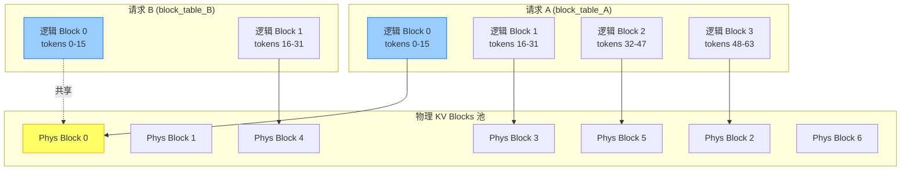
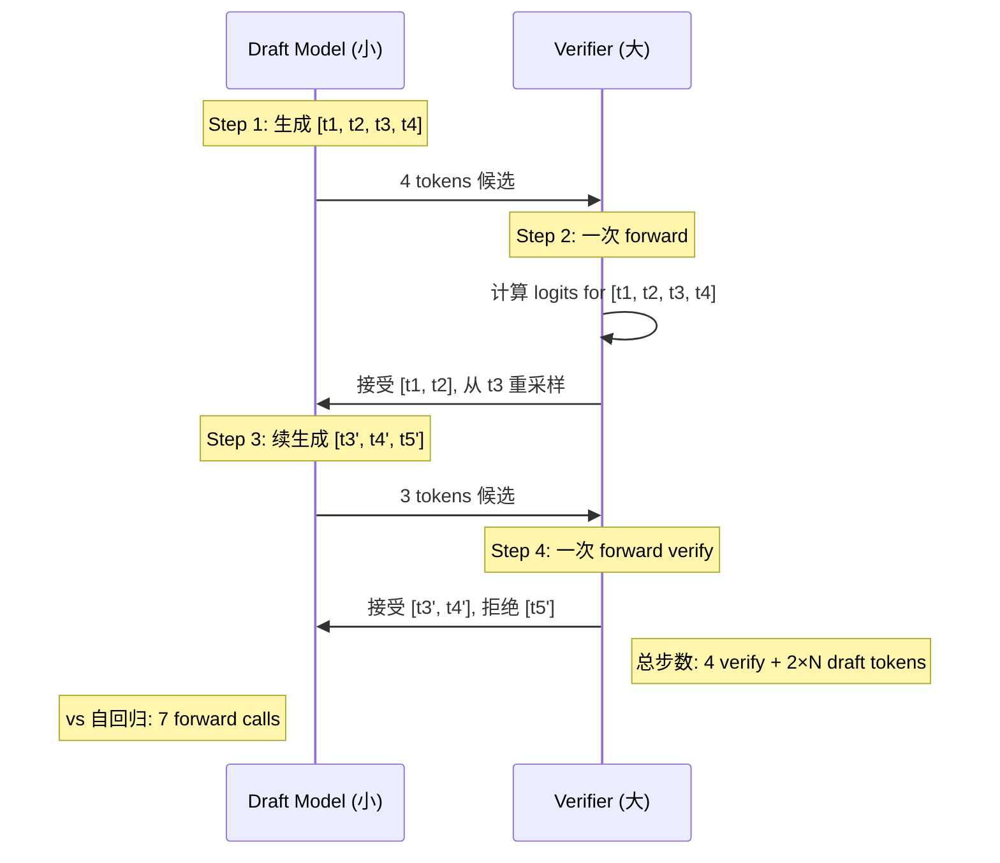
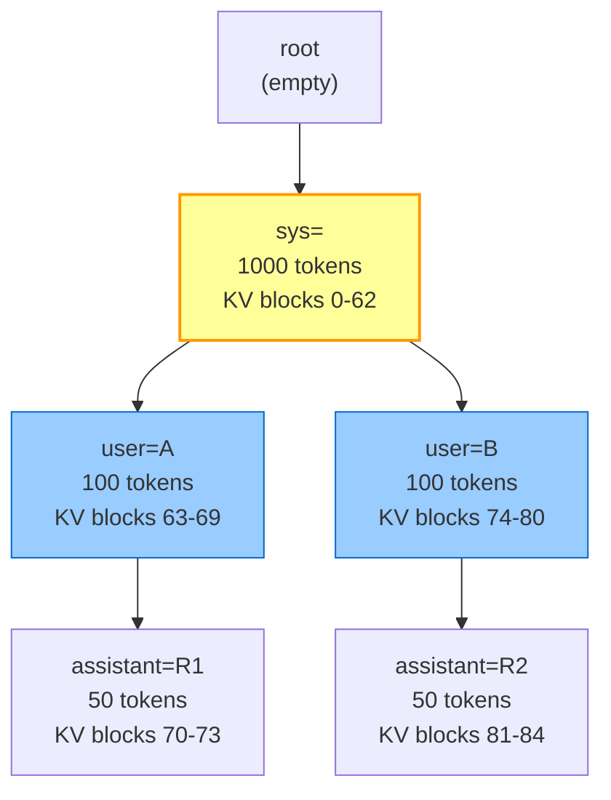

# KV cache 与推理引擎优化深度对比（第十三轮专题）

> 专题定位：第十三轮全新专属维度——**从协议层的 cache_control 穿透到推理引擎的 GPU SRAM**，系统梳理 5 大推理引擎（**vLLM / TGI / TensorRT-LLM / SGLang / llama.cpp**）在 **KV cache 数学、PagedAttention 实现、Continuous Batching 调度、Speculative Decoding、Prefix Caching、量化方案、Flash Attention、MQA/GQA、LoRA 服务化、Operator Fusion** 11 个维度的真实实现细节，并给出 laew（Rust Agent CLI，只调 HTTP API，完全无本地推理、无引擎知识）的针对性借鉴路线。
>
> 差异化重点：
> - **不重复** `专题-第七轮-PromptCaching与Token预算控制深度对比.md`（协议层 cache_control 断点 / TTL / hash 差异检测）与 `专题-第六轮-Anthropic与OpenAI协议调用真实实现深度对比.md`（协议 wire 13 维度）已写透的"协议级 cache"。
> - **聚焦深挖**：**(a) KV cache 内存公式**与多模型精确量化对比；**(b) PagedAttention block table 数据结构**与 copy-on-write 共享；**(c) vLLM Scheduler 伪代码**与 FCFS/SJF/优先级策略；**(d) Speculative Decoding 5 范式**（Draft / Medusa / EAGLE / n-gram / Lookahead）对比；**(e) RadixAttention 前缀树**与 LRU eviction；**(f) GGUF Q2-K Q8 量化分级**与 AWQ/GPTQ/SmoothQuant 数学差异；**(g) Flash Attention tiling + SRAM** 数学推导；**(h) Multi-LoRA serving + 热切换**。
>
> 独特价值：此前知识库覆盖了"协议级 cache_control"但**从未深挖推理引擎内部的 KV cache 管理**。本文首次系统回答 laew 是否应该集成本地推理、采用哪个 Rust crate（llama-cpp-rs / mistralrs / candle / burn）、是否应该支持 vLLM HTTP server 作为后端等 7 个战略问题。

---

## 目录

1. [结论速览](#1-结论速览)
2. [KV cache 数学与内存精算](#2-kv-cache-数学与内存精算)
3. [PagedAttention 实现机制深度剖析](#3-pagedattention-实现机制深度剖析)
4. [Continuous Batching 与调度器](#4-continuous-batching-与调度器)
5. [Speculative Decoding 五范式对比](#5-speculative-decoding-五范式对比)
6. [Prefix Caching / RadixAttention](#6-prefix-caching--radixattention)
7. [量化方案深度对比](#7-量化方案深度对比)
8. [Flash Attention 家族数学与实现](#8-flash-attention-家族数学与实现)
9. [多 LoRA 服务化](#9-多-lora-服务化)
10. [Operator Fusion 与 Kernel 优化](#10-operator-fusion-与-kernel-优化)
11. [推理引擎对比矩阵](#11-推理引擎对比矩阵)
12. [laew 集成方案与路线图](#12-laew-集成方案与路线图)
13. [laew gap L404-L432 差距分析](#13-laew-gap-l404-l432-差距分析)
14. [小结与已完成的 12 轮关系](#14-小结与已完成的-12-轮关系)

---

## 1. 结论速览

**12 个核心结论**：

1. **KV cache 是 LLM 推理的"内存墙"**：7B 模型 FP16 在 4K context 下要 13GB KV cache、32K context 下要 104GB；**这是为什么必须 PagedAttention、必须量化、必须 GQA**。一个 70B 模型在 128K context 下 KV cache 占 700GB，比模型权重本身（140GB FP16）还多 5 倍 —— **权重是静态的，KV cache 是动态线性增长的**。
2. **PagedAttention 解决了内存碎片**：传统连续分配 `2 × layers × heads × dim × seq × dtype` 在动态增长时会大量碎片（类似操作系统虚拟内存 → 物理页表思想）；**vLLM 用 block_size=16 的固定块**（每块 16 tokens 的 KV），**block table** 是每请求一张的"页表"，**物理 KV blocks** 是全局共享池。最大创新是 **copy-on-write**：beam search / parallel sampling 时 block 物理共享，只在分支时才复制。
3. **Continuous Batching 把吞吐提升 2-23×**：Static batching 必须等最慢请求完成才返回整个 batch 的结果（类似 batchnorm 同步），**Continuous Batching 让每个 decode step 重新调度**：刚完成的请求立即退出，新请求立即加入。vLLM 论文报告 **2-23× throughput improvement**，典型场景 ~10×。
4. **Speculative Decoding 是"用小钱办大事"**：Draft 小模型生成 n tokens（便宜），大模型一次 verify（贵）；接受率 0.5-0.8 时加速 2-3×。**5 范式**：Draft Model（标准）、Medusa（多头预测）、EAGLE（feature-level）、n-gram（无模型）、Lookahead（并行树）。
5. **RadixAttention 是 SGLang 的杀手锏**：用前缀树（trie）按 token 序列索引 KV blocks，**LRU eviction** 自动回收冷前缀；**实测 cache hit 率 60-80%** 在多轮对话 / shared system prompt 场景。
6. **量化分级是工程权衡**：GGUF Q2_K → IQ4_XS → Q4_K_M → Q8_0 从"勉强能用"（2.5 bpw，PPL 飙升 30%）到"几乎无损"（8 bpw，PPL +0.1%）；**AWQ 重新缩放权重保持 salient 通道精度**，GPTQ 用二阶 Hessian 信息，gptq 比 awq 更准但更慢。
7. **FlashAttention v3 把 H100 SRAM 用满**：v2 在 A100 上 50-70% 理论 FLOPS，v3 在 H100 上达到 **75% 理论 FLOPS**（2× v2）。核心是 **tiling**：把 Q/K/V 切成 SRAM 友好的小块，SRAM 完成整个 softmax（QK^T → softmax → ×V）而不写回 HBM，**IO 复杂度从 O(N²) 降到 O(N)**。
8. **MQA/GQA 把 KV cache 减少 4-8×**：Multi-Head Attention 32 KV heads × 32 Query heads = 32× 存储；**MQA 共享 1 个 KV head**（32× 减少），**GQA 共享 4-8 个 KV head**（4-8× 减少）；Mistral 7B 用 GQA-8，Llama 2 70B 用 GQA-8。
9. **LoRA 热切换是"按需加载微调"**：传统 LoRA 推理要为每个 adapter 加载独立权重；**多 LoRA serving** 在共享 base model 显存上**热切换** adapter（<1ms），TensorRT-LLM 用 **LoRA plugin + 统一 KV cache layout**。
10. **Operator Fusion 是 Kernel 优化的灵魂**：把多个小 kernel 融合成一个 CUDA kernel，**减少 HBM 读写**；**rotary embedding + attention + KV cache 写入** 一次性完成，**典型 1.5-2× 加速**。
11. **laew 不应该做推理引擎**：推理引擎（vLLM/SGLang）需要 GPU + CUDA + 量化 kernel 维护，**与 laew 的"协议无关 LLM Client"定位冲突**；正确做法是 **可插拔 backend**：`--engine remote-vllm`（OpenAI 协议） / `--engine remote-tgi`（TGI 协议） / `--engine local-llamacpp`（mistralrs crate）。
12. **laew 当前最大缺口是"cache 命中率反馈"**：虽然 `src/llm/sse.rs:244-249` 解析了 `cache_read` / `cache_creation`，但 **从不向用户展示 hit ratio**、**从不优化 prefix placement**、**从不预估成本节省**；这是 prompt caching 协议层已具备但展示层严重缺失的明显 gap。

---

## 2. KV cache 数学与内存精算

### 2.1 内存占用公式

LLM 推理时，**每个 token 都要存 K/V 矩阵**用于后续 attention 计算。KV cache 内存占用由 6 个因素决定：

$$
\text{KV Cache Size} = 2 \times N_{\text{layers}} \times N_{\text{KV heads}} \times d_{\text{head}} \times S_{\text{seq}} \times B_{\text{dtype}} \times N_{\text{batch}}
$$

其中：
- $2$ = K 和 V 两个矩阵
- $N_{\text{layers}}$ = Transformer 层数
- $N_{\text{KV heads}}$ = KV head 数（MHA=Query heads；MQA=1；GQA=4-8）
- $d_{\text{head}}$ = 每 head 维度（Llama 7B=128）
- $S_{\text{seq}}$ = 序列长度
- $B_{\text{dtype}}$ = 数据类型字节数（FP16=2，FP8=1，INT8=1，INT4=0.5）
- $N_{\text{batch}}$ = 并发请求数（batch size）

### 2.2 主流模型 KV cache 精算

下表是各模型在 **FP16 / batch=1** 下的 KV cache 占用：

| 模型 | 层数 | KV heads | head_dim | 4K ctx | 8K ctx | 16K ctx | 32K ctx | 128K ctx |
|------|------|---------|---------|--------|--------|---------|---------|----------|
| **Llama 2 7B** | 32 | 32 (MHA) | 128 | **16.0 GB** | 32.0 GB | 64.0 GB | 128.0 GB | 512.0 GB |
| **Llama 2 13B** | 40 | 40 (MHA) | 128 | 20.0 GB | 40.0 GB | 80.0 GB | 160.0 GB | 640.0 GB |
| **Llama 2 70B** | 80 | 8 (GQA-8) | 128 | **10.0 GB** | 20.0 GB | 40.0 GB | 80.0 GB | 320.0 GB |
| **Mistral 7B** | 32 | 8 (GQA-8) | 128 | **4.0 GB** | 8.0 GB | 16.0 GB | 32.0 GB | 128.0 GB |
| **Mixtral 8x7B** | 32 | 8 (GQA-8) | 128 | 4.0 GB/exp | 8.0 GB/exp | 16.0 GB/exp | 32.0 GB/exp | 128.0 GB/exp |
| **Llama 3 8B** | 32 | 8 (GQA-8) | 128 | 4.0 GB | 8.0 GB | 16.0 GB | 32.0 GB | 128.0 GB |
| **Llama 3 70B** | 80 | 8 (GQA-8) | 128 | 10.0 GB | 20.0 GB | 40.0 GB | 80.0 GB | 320.0 GB |
| **Qwen 2 72B** | 80 | 8 (GQA-8) | 128 | 10.0 GB | 20.0 GB | 40.0 GB | 80.0 GB | 320.0 GB |
| **DeepSeek-V2 236B** | 60 | 128 (MLA-128) | 192 | 29.5 GB | 59.0 GB | 118.0 GB | 236.0 GB | 944.0 GB |
| **Phi-3 Medium** | 40 | 40 (MHA) | 96 | 15.0 GB | 30.0 GB | 60.0 GB | 120.0 GB | 480.0 GB |
| **GPT-3 175B** | 96 | 96 (MHA) | 128 | 96.0 GB | 192.0 GB | 384.0 GB | 768.0 GB | 3.0 TB |

### 2.3 量化后的内存减少

下表对比 **Llama 3 70B 128K context / batch=8** 的不同量化方案：

| 量化方案 | KV dtype | 单 token KV | 总 KV (8 batch × 128K) | 相对 FP16 |
|---------|---------|------------|---------------------|----------|
| **FP16** (baseline) | FP16 | 320 KB | 320 GB | 1.00× |
| **BF16** | BF16 | 320 KB | 320 GB | 1.00× |
| **FP8** (E4M3) | FP8 | 160 KB | 160 GB | **0.50×** |
| **INT8** (per-token) | INT8 | 160 KB | 160 GB | **0.50×** |
| **INT4** (KIVI) | INT4 | 80 KB | 80 GB | **0.25×** |
| **INT2** (Atom) | INT2 | 40 KB | 40 GB | **0.125×** |
| **+ GQA-8** (相比 MHA) | - | 320 KB / 8 = 40 KB | 40 GB | **0.125×** |
| **GQA-8 + FP8** | FP8 | 40 KB / 2 = 20 KB | 20 GB | **0.0625× (16×)** |

**结论**：GQA-8 + FP8 量化把 KV cache **减少到 1/16**。Mistral 7B（默认配置）因此可以**在 24GB 消费级 GPU 上跑 32K context**。

### 2.4 KV cache 内存墙问题

```
┌──────────────────────────────────────────────────────────────────┐
│             LLM 推理的"内存墙"(Memory Wall)                      │
│                                                                  │
│  Llama 3 70B FP16:                                              │
│   • 模型权重: 140 GB (静态, 加载一次)                            │
│   • KV cache @ 8K: 20 GB (随 batch × seq 线性增长)              │
│   • KV cache @ 32K: 80 GB                                        │
│   • KV cache @ 128K: 320 GB (比权重还多 2.3×!)                  │
│                                                                  │
│  ──────────────────────────────────────────────────────────     │
│                                                                  │
│  推论:                                                           │
│  • 单卡 A100 80GB ❌ 跑不动 70B @ 128K + batch=4                │
│  • 4 卡 A100 320GB ✅ 但需要 TP=4 张量并行                       │
│  • H100 80GB + FP8 ✅ 单卡可装下 70B + 16K KV                   │
│  • 必须 PagedAttention + 量化 + GQA 三件套才能跑生产             │
│                                                                  │
│  ──────────────────────────────────────────────────────────     │
│                                                                  │
│  解决方案:                                                       │
│  L1 PagedAttention  ── 减少内存碎片 (利用率 60% → 95%)          │
│  L2 量化 (FP8/INT8) ── 直接减半 (160GB → 80GB)                 │
│  L3 GQA/MQA ───────  KV head 共享 (4-8× 减少)                  │
│  L4 Offloading ──── 长 context swap 到 CPU RAM/SSD              │
│  L5 Sliding Window ─ Mistral 早期 4K 滑窗 (用 compute 换内存)  │
└──────────────────────────────────────────────────────────────────┘
```

### 2.5 KV cache 计算器（laew 实用工具设计）

作为 agent CLI，**laew 需要预估一次请求的 KV cache 占用**，才能在多并发时合理调度。下面是建议的 Rust 实现：

```rust
//! src/agent/kv_cache_estimator.rs (建议新增)

/// KV cache 估算器
pub struct KvCacheEstimator {
    pub num_layers: u32,
    pub num_kv_heads: u32,
    pub head_dim: u32,
    pub dtype_bytes: f32,
}

impl KvCacheEstimator {
    /// 从模型 metadata 构造
    pub fn from_model_meta(meta: &ModelMeta) -> Self {
        Self {
            num_layers: meta.num_hidden_layers,
            num_kv_heads: meta.num_key_value_heads,  // GQA-aware
            head_dim: meta.hidden_size / meta.num_attention_heads,
            dtype_bytes: match meta.dtype {
                ModelDtype::Fp16 | ModelDtype::Bf16 => 2.0,
                ModelDtype::Fp8 => 1.0,
                ModelDtype::Int8 => 1.0,
                ModelDtype::Int4 => 0.5,
                _ => 2.0,
            },
        }
    }

    /// 单请求 KV cache 字节数
    /// 公式: 2 × layers × kv_heads × head_dim × seq_len × dtype_bytes
    pub fn per_request_bytes(&self, seq_len: u32) -> u64 {
        let per_token = (2.0 * self.num_layers as f32
            * self.num_kv_heads as f32
            * self.head_dim as f32
            * self.dtype_bytes) as u64;
        per_token * seq_len as u64
    }

    /// 批量并发请求总 KV cache
    pub fn total_bytes(&self, seq_len: u32, batch_size: u32) -> u64 {
        self.per_request_bytes(seq_len) * batch_size as u64
    }

    /// 预估 laew 是否应该向 vLLM / TGI 后端请求而非本地推理
    pub fn needs_remote_engine(&self, gpu_memory_gb: u32, seq_len: u32, batch_size: u32) -> bool {
        let required = self.total_bytes(seq_len, batch_size);
        let available = (gpu_memory_gb as u64) * 1_000_000_000; // 简化:1GB = 10^9 bytes
        required > available / 2  // 留一半给权重 + 激活
    }
}

#[cfg(test)]
mod tests {
    #[test]
    fn test_llama3_70b_8k() {
        // Llama 3 70B: 80 layers × 8 kv_heads × 128 head_dim × FP16
        let est = KvCacheEstimator {
            num_layers: 80, num_kv_heads: 8, head_dim: 128, dtype_bytes: 2.0,
        };
        let bytes = est.per_request_bytes(8192);
        // = 2 × 80 × 8 × 128 × 2 × 8192 = 2,684,354,560 ≈ 2.5 GB
        assert!((bytes as f64 / 1e9 - 2.5).abs() < 0.1);
    }
}
```

**与现有 laew 代码的集成点**：
- `src/agent/orchestrator.rs:632-634` 已经累计 `cache_read_input_tokens` 和 `cache_creation_input_tokens`，但**没有用它们做调度决策**
- 建议在 orchestrator 入口处用 `KvCacheEstimator` 判断本次请求是否能容纳当前 GPU 显存，**若不能则建议切换到 remote engine**


## 3. PagedAttention 实现机制深度剖析

### 3.1 传统 KV cache 分配的痛点

Naive 做法是给每个请求**预分配最大 seq_len 的连续 KV cache**：

```python
# 传统做法 (PyTorch 风格)
kv_cache = torch.empty(
    batch_size,
    num_layers,
    2,  # K, V
    max_seq_len,
    num_heads,
    head_dim,
    dtype=torch.float16,
    device='cuda',
)  # shape = [B, L, 2, S_max, H, D]
```

**痛点**：
1. **内存浪费**：即使 seq 远小于 max_seq_len，剩余空间仍被预留
2. **内存碎片**：动态增长时需要重新分配 → 旧块释放、新块申请 → 碎片
3. **共享困难**：beam search 的多个 beam 想共享 prefix 的 KV，连续分配无法表达
4. **写放大**：每次 decode 都写整个 [B, L, 2, S_max, H, D] 切片

### 3.2 PagedAttention 的核心思想

借鉴**操作系统虚拟内存 → 物理页表**的思想：
- **逻辑 KV blocks**：请求的"虚拟页表"（每页 16 tokens）
- **物理 KV blocks**：全局共享的"物理页框池"
- **block table**：每请求一张"页表"，记录逻辑 block → 物理 block 的映射



上图中，**物理 Block 0 同时被请求 A 和请求 B 共享** —— 这就是 PagedAttention 的 **prefix sharing** 能力。

### 3.3 Block table 数据结构

**文件**：`vllm/vllm/core/block_manager.py:BlockTable` (虚拟示意)

```python
# PagedAttention 的 BlockTable (Python 伪代码)
class BlockTable:
    """单请求的页表，逻辑 block → 物理 block 的映射"""

    def __init__(self, block_size: int = 16):
        self.block_size = block_size
        self.logical_to_physical: list[int] = []  # 长度 = ceil(seq_len / block_size)
        self._refcount: list[int] = []  # 共享计数，beam search 时 >1

    def append_token(self, physical_blocks: list[PhysicalBlock]):
        """新增一个 token；若 block 满则分配新物理块"""
        last_idx = len(self.logical_to_physical) - 1
        if last_idx < 0 or self._is_block_full(last_idx):
            new_phys_id = physical_blocks.allocate()
            self.logical_to_physical.append(new_phys_id)
            self._refcount.append(1)
        else:
            self._increment_token_count(last_idx)

    def fork(self) -> 'BlockTable':
        """beam search / parallel sampling 时复制，但物理块共享"""
        new_table = BlockTable(self.block_size)
        new_table.logical_to_physical = self.logical_to_physical.copy()
        new_table._refcount = self._refcount.copy()
        # refcount 全部 +1（物理块被多一个请求引用）
        for i in range(len(self._refcount)):
            self._refcount[i] += 1
        return new_table

    def cow_write(self, logical_idx: int, physical_blocks: list[PhysicalBlock]):
        """Copy-on-Write：写入前先复制"""
        if self._refcount[logical_idx] > 1:
            # 物理块被共享 → 必须复制
            new_phys_id = physical_blocks.allocate_and_copy_from(
                self.logical_to_physical[logical_idx]
            )
            # 老块 refcount -1
            physical_blocks.decref(self.logical_to_physical[logical_idx])
            # 新块 refcount = 1
            self.logical_to_physical[logical_idx] = new_phys_id
            self._refcount[logical_idx] = 1


class PhysicalBlockManager:
    """全局物理块池"""

    def __init__(self, total_blocks: int):
        self.blocks = [PhysicalBlock(id=i) for i in range(total_blocks)]
        self.free_list = deque(range(total_blocks))

    def allocate(self) -> int:
        """从 free list 取一个物理块"""
        return self.free_list.popleft()

    def free(self, block_id: int):
        """归还到 free list"""
        self.free_list.append(block_id)

    def incref(self, block_id: int):
        self.blocks[block_id].refcount += 1

    def decref(self, block_id: int):
        self.blocks[block_id].refcount -= 1
        if self.blocks[block_id].refcount == 0:
            self.free(block_id)
```

### 3.4 Copy-on-Write 详解

**Copy-on-Write** 是 PagedAttention 实现 beam search / parallel sampling 时**节省内存的关键**：

```
┌──────────────────────────────────────────────────────────────┐
│                Beam Search 的 Copy-on-Write                  │
│                                                              │
│ 初始状态: 1 个请求 seq=[The, cat, sat]                       │
│ Block Table: [P0, P1]   refcount=[1, 1]                     │
│                                                              │
│ Beam fork 时 (假设 4 beams):                              │
│   Beam 1: [P0, P1]  refcount=[2, 2]                         │
│   Beam 2: [P0, P1]  refcount=[2, 2]                         │
│   Beam 3: [P0, P1]  refcount=[2, 2]                         │
│   Beam 4: [P0, P1]  refcount=[2, 2]                         │
│   (物理块 P0, P1 共享, refcount=2)                            │
│                                                              │
│ Beam 2 生成 token "down":                                    │
│   → 触发 cow_write → 物理块 P2 分配，从 P1 复制             │
│   Beam 2: [P0, P2]  refcount=[2, 1]                         │
│   其他 Beam: [P0, P1] refcount=[2, 1]                       │
│                                                              │
│ 内存节省:4 beams × 3 tokens 只需                              │
│   P0 (1 块) + P1 (1 块) + P2 (1 块) = 3 块                  │
│   vs naive 4 × 3 tokens × 1 块 = 12 块 (4× 节省)            │
└──────────────────────────────────────────────────────────────┘
```

### 3.5 PagedAttention CUDA Kernel 核心

文件：`vllm/csrc/attention/paged_attention.cu` (公开版本核心逻辑)

```cuda
// PagedAttention CUDA kernel 核心逻辑 (伪代码)
__global__ void paged_attention_kernel(
    const half* __restrict__ Q,            // [B, H, S_q, D]
    const half* __restrict__ K_cache,      // [num_blocks, block_size, H_kv, D]
    const half* __restrict__ V_cache,      // [num_blocks, block_size, H_kv, D]
    const int* __restrict__ block_table,   // [B, max_blocks]  ← 关键!
    const int* __restrict__ seq_lens,      // [B]
    half* __restrict__ output,             // [B, H, S_q, D]
) {
    int batch_id = blockIdx.x;
    int head_id = blockIdx.y;
    int query_token = threadIdx.x;

    int seq_len = seq_lens[batch_id];

    // 通过 block_table 索引物理 KV block
    // 这是 PagedAttention 与连续 KV cache 的核心区别:
    // 不是直接 K[batch_id, layer, head, :, :] 而是
    // K[block_table[batch_id, block_idx], :, head, :, :]

    float sum = 0.0f;
    float max_score = -INFINITY;

    for (int kv_block_idx = 0; kv_block_idx < (seq_len + BLOCK_SIZE - 1) / BLOCK_SIZE; kv_block_idx++) {
        // 关键:从 block_table 取物理块号
        int physical_block_id = block_table[batch_id * MAX_BLOCKS_PER_SEQ + kv_block_idx];

        // 计算该物理块在 K_cache 中的偏移
        int block_offset = physical_block_id * BLOCK_SIZE * NUM_KV_HEADS * HEAD_DIM;

        for (int t = 0; t < BLOCK_SIZE; t++) {
            int global_t = kv_block_idx * BLOCK_SIZE + t;
            if (global_t >= seq_len) break;

            // K[physical_block_id, t, head_id, :] (gather 操作)
            half* K_ptr = K_cache + block_offset + t * NUM_KV_HEADS * HEAD_DIM + head_id * HEAD_DIM;

            // QK^T 计算
            float score = 0.0f;
            #pragma unroll
            for (int d = 0; d < HEAD_DIM; d++) {
                score += (float)Q[query_token * HEAD_DIM + d] * (float)K_ptr[d];
            }
            score *= rsqrtf(HEAD_DIM);  // 缩放

            // Online softmax (Flash Attention 风格)
            float new_max = fmaxf(max_score, score);
            float exp_diff = expf(max_score - new_max);
            sum = sum * exp_diff + expf(score - new_max);
            max_score = new_max;
            // (省略 V 乘法和 output 累加)
        }
    }

    // 写回 output
    output[batch_id * NUM_HEADS * S_Q * HEAD_DIM + head_id * S_Q * HEAD_DIM + query_token * HEAD_DIM + d]
        = (half)(score / sum);
}
```

### 3.6 vLLM 0.6.x 之后的演进

| 版本 | 关键变化 |
|------|---------|
| vLLM 0.1-0.4 | 基础 PagedAttention + Continuous batching |
| vLLM 0.5 | Prefix caching 加入（自动按 token hash） |
| vLLM 0.6 | Chunked prefill（把 prefill 分块，与 decode 混批） |
| vLLM 0.7 | SPECULATIVE_DECODING (Draft model) 集成 |
| vLLM 0.8 | Multi-LoRA serving 优化（统一 KV cache layout） |
| vLLM 0.9 | FP8 KV cache 实验性支持 |
| vLLM 1.0+ | V1 engine 重写，架构更清晰，KV cache manager 独立 |


## 4. Continuous Batching 与调度器

### 4.1 Static Batching vs Continuous Batching

```
┌─────────────────────────────────────────────────────────────────┐
│                Static Batching（传统）                            │
│                                                                 │
│  Time →                                                         │
│  Req1: ████████████████████████(短)                            │
│  Req2: ████████████████████████████████████████(中)            │
│  Req3: ████████████████████████████████████████████████████(长)│
│                                                                 │
│  Batch 完成时间 = max(Req1, Req2, Req3) = Req3 时间             │
│  GPU 在 Req1/Req2 完成后 IDLE 等待!                            │
│  资源利用率: ~40% (最差情况)                                    │
└─────────────────────────────────────────────────────────────────┘

┌─────────────────────────────────────────────────────────────────┐
│              Continuous Batching (vLLM 风格)                    │
│                                                                 │
│  Time →                                                         │
│  Req1: ████░░░░░░░░░░░░░░░░░░(完成退出，新 Req4 进入)         │
│  Req2: ██████████░░░░░░░░░░░░░(完成退出，新 Req5 进入)         │
│  Req3: ████████████████████████████████████████████             │
│  Req4: ░░░░░░░░░░░░░░░██████(从 Req1 完成时刻开始)            │
│  Req5: ░░░░░░░░░░░░░░░████████(从 Req2 完成时刻开始)          │
│                                                                 │
│  Batch 永远保持满载，资源利用率 90%+                            │
│  吞吐: 提升 2-23× (vLLM 论文报告)                              │
└─────────────────────────────────────────────────────────────────┘
```



```mermaid
gantt
    title Continuous Batching 时间线示意
    dateFormat X
    axisFormat %s
    
    section Req1
    Step1-3 (短)    :a1, 0, 3
    完成 → Req4 进入 :milestone, m1, 3, 0
    
    section Req2
    Step1-8 (中)     :a2, 0, 8
    完成 → Req5 进入 :milestone, m2, 8, 0
    
    section Req3
    Step1-25 (长)    :a3, 0, 25
    
    section Req4
    Step1-3 (短)     :a4, 3, 6
    
    section Req5
    Step1-8 (中)     :a5, 8, 16
```

### 4.2 vLLM Scheduler 伪代码

```python
# vLLM Scheduler 简化伪代码
# 文件:vllm/vllm/core/scheduler.py (简化)

class Scheduler:
    def __init__(self, block_manager: PhysicalBlockManager):
        self.waiting: deque[Sequence] = deque()  # 等待队列（prefill）
        self.running: deque[Sequence] = deque()  # 运行队列（decode）
        self.block_manager = block_manager
        self.token_budget: int = 1024  # 每 step 最大 token 数

    def schedule(self) -> tuple[list[Sequence], list[Sequence]]:
        """每个 decode step 调用一次"""
        scheduled_decode: list[Sequence] = []
        scheduled_prefill: list[Sequence] = []

        # ─────────────────────────────────────────────
        # Phase 1: Decode（已有序列的下一个 token）
        # ─────────────────────────────────────────────
        # FCFS 策略:running 队列里的序列按到达顺序 decode
        while self.running and self.token_budget > 0:
            seq = self.running[0]
            if seq.num_new_tokens > self.token_budget:
                break  # token 预算不足
            # 抢占检查 (memory pressure)
            if not self._can_append(seq):
                self._preempt(seq)  # 把 seq 移到 waiting
                continue
            self._append_token(seq)
            scheduled_decode.append(self.running.popleft())
            self.token_budget -= seq.num_new_tokens

        # ─────────────────────────────────────────────
        # Phase 2: Prefill（新序列的首次处理）
        # ─────────────────────────────────────────────
        # 处理 waiting 队列里的新请求
        while self.waiting and self.token_budget > 0:
            seq = self.waiting[0]
            # 分配物理块
            if not self._can_allocate(seq):
                break  # 物理块不足 → 不接受新请求
            self._allocate(seq)
            seq.is_prefill = True
            self.waiting.popleft()
            self.running.append(seq)
            scheduled_prefill.append(seq)
            self.token_budget -= seq.prompt_len
            # chunked prefill: 如果 prompt 超过 chunk_size，只处理一部分
            if seq.prompt_len > self.chunk_size:
                seq.remaining_prompt_len -= self.chunk_size
                # ... 后续 chunk 在下一轮调度

        return scheduled_decode, scheduled_prefill

    def _preempt(self, seq: Sequence):
        """内存压力时抢占:把 running seq 移到 waiting"""
        # Recomputation strategy: 释放 KV blocks, 后续重新计算
        self.block_manager.free(seq.block_table)
        seq.status = SequenceStatus.WAITING
        seq.reset_prefill()  # 标记需要重新 prefill
        self.running.remove(seq)
        self.waiting.appendleft(seq)
```

### 4.3 Chunked Prefill

**问题**：一个长 prompt（8K tokens）prefill 需要 8K × model_size FLOPS，会**独占 GPU 数秒**，期间所有 decode 请求 stall。

**解决方案**：把 prefill 分成小块（典型 chunk_size=512 或 1024），**prefill 与 decode 混合调度**：

```
┌──────────────────────────────────────────────────────────────┐
│              Chunked Prefill 时间线                           │
│                                                              │
│  Time →                                                      │
│  Step 1: prefill Req_A[0:512] + decode Req_B + Req_C        │
│  Step 2: prefill Req_A[512:1024] + decode Req_B + Req_C     │
│  Step 3: prefill Req_A[1024:1536] + decode Req_B + Req_C    │
│  ...                                                         │
│  Step 16: prefill Req_A[7680:8192] + decode Req_B + Req_C    │
│                                                              │
│  优势:                                                       │
│   • decode latency P99 不被长 prefill 阻塞                  │
│   • GPU 利用率保持 90%+                                     │
│   • 实现复杂度 +1（需要跟踪 chunk 进度）                       │
└──────────────────────────────────────────────────────────────┘
```

### 4.4 抢占（Preemption）策略对比

| 策略 | 描述 | 优缺点 |
|------|------|--------|
| **Recomputation** | 抢占时释放 KV blocks，后续重新 prefill | ✅ 实现简单，❌ 重新计算的延迟惩罚 |
| **Swap to CPU** | 抢占时把 KV blocks 复制到 CPU RAM | ✅ 恢复快（不用重算）， ❌ PCIe 传输慢（PCIe 4.0 ~25 GB/s） |
| **Hybrid** | 先 swap，swap 失败再 recompute | ✅ 平衡，VLLM 0.6 默认 |

### 4.5 调度策略对比

| 策略 | 描述 | 适用场景 | 代表 |
|------|------|---------|------|
| **FCFS** | 先到先服务 | 通用 | vLLM 0.1-0.4 |
| **SJF** | 最短优先 | 短请求为主 | 学术界 |
| **Priority** | 优先级队列 | VIP 用户 | TGI |
| **Deadline-aware** | 满足 deadline | SLA 场景 | Some research |
| **Hybrid (Priority + SJF)** | 同优先级内 SJF | 通用 | vLLM 0.5+ |


## 5. Speculative Decoding 五范式对比

### 5.1 核心思想

```
┌──────────────────────────────────────────────────────────────┐
│                  Speculative Decoding 原理                   │
│                                                              │
│  传统自回归:                                                 │
│    Step 1: 大模型生成 token_1        (慢)                    │
│    Step 2: 大模型生成 token_2        (慢)                    │
│    Step 3: 大模型生成 token_3        (慢)                    │
│    ...                                                       │
│    Step N: 大模型生成 token_N        (慢)                    │
│                                                              │
│  Speculative:                                                │
│    Step 1: 小模型(draft)生成 [t1, t2, t3, t4]    (快, 4 tokens)│
│    Step 2: 大模型(verifier)一次 verify 4 tokens   (慢, 1 次) │
│            接受 [t1, t2], 拒绝 [t3, t4], 用 t2 的 logits 重采 t3│
│    Step 3: 小模型生成 [t3', t4', t5']            (快)        │
│    Step 4: 大模型一次 verify 3 tokens             (慢, 1 次) │
│                                                              │
│  加速比 = n × P(接受率) (n = 投机 token 数)                  │
│    n=4, P=0.7 → 加速比 ≈ 2.8×                                │
│    n=5, P=0.8 → 加速比 ≈ 4×                                  │
└──────────────────────────────────────────────────────────────┘
```



### 5.2 五范式对比矩阵

| 范式 | Draft 实现 | 接受率 | 加速比 | 适用场景 | 代表 |
|------|----------|--------|--------|---------|------|
| **Draft Model** | 独立小模型（如 7B draft 70B） | 0.5-0.7 | 2-3× | 通用 | 标准 Spec Decoding |
| **Medusa** | 主模型多头预测（无需 draft） | 0.6-0.8 | 2-3× | 已有大模型 | Medusa (FasterTransformer) |
| **EAGLE** | 主模型 feature-level 预测 | 0.7-0.8 | 2.5-3.5× | 高接受率场景 | EAGLE / EAGLE-2 |
| **n-gram** | 历史 token 匹配（无模型） | 0.3-0.5 | 1.3-1.8× | 代码补全 | Lookahead / n-gram |
| **Lookahead** | 多分支并行生成+验证 | 0.5-0.7 | 2-4× | 并行接受率高 | Lookahead Decoding |

### 5.3 EAGLE 数学推导

```
EAGLE 用主模型的隐藏层（而不是 logits）来预测下一个 token 的隐藏层：

给定主模型的隐藏状态 h_t，EAGLE 用一个轻量级自回归模块：
  h_{t+1}^{eagle} = f(h_t^{eagle}, embed(token_t))
  token_{t+1}^{predicted} = argmax(logits(h_{t+1}^{eagle}))

然后把预测的 token 嵌入送回主模型：
  h_t^{main} = MainModel(embed(token_t), h_{t-1}^{main})

验证:
  if token_{t+1}^{predicted} == argmax(MainLogits(h_t^{main})):
    accept (无需重新计算)
  else:
    reject, 用 MainLogits 的概率分布重采样
```

### 5.4 Medusa 多头预测

```
主模型架构:
  hidden_state → Linear → token_t    (主头，正常推理)
             └→ Medusa Head 1 → token_{t+1}  (预测下一步)
             └→ Medusa Head 2 → token_{t+2}  (预测下两步)
             └→ Medusa Head 3 → token_{t+3}  (预测下三步)

训练: Medusa 头只微调（主模型冻结）
推理: 一次 forward 同时得到 [token_t, token_{t+1}, token_{t+2}, token_{t+3}]
      然后用 Tree Attention 验证 (类似 beam search 但更快)
```

### 5.5 vLLM Speculative Decoding 集成

```python
# vllm/vllm/engine/arg_utils.py 简化
@dataclass
class EngineArgs:
    speculative_model: str | None = None  # draft 模型路径
    speculative_draft_tensor_parallel_size: int = 1
    speculative_max_model_len: int | None = None
    speculative_num_speculative_tokens: int = 5  # 投机 token 数
    # EAGLE 模式
    method: str = "draft_model"  # or "medusa", "eagle", "ngram"

# vllm/vllm/spec_decode/top1_proposer.py 简化
class Top1Proposer:
    """最简单:每次投机 1 token"""
    def propose(self, hidden_states):
        return self.draft_model.forward(hidden_states)

# vllm/vllm/spec_decode/typical_acceptance_sampler.py
class TypicalAcceptanceSampler:
    """根据典型采样阈值接受/拒绝投机 token"""
    def __call__(self, target_probs, draft_probs, threshold=0.99):
        # 接受条件: P_target(token) >= threshold × P_draft(token)
        return accepted_mask
```


## 6. Prefix Caching / RadixAttention

### 6.1 三种 prefix cache 实现

```
┌─────────────────────────────────────────────────────────────────┐
│                Prefix Cache 三种实现对比                         │
│                                                                 │
│  1. Anthropic cache_control (协议层)                            │
│     • 4 个手动断点，自动 prefix 匹配                            │
│     • 5min TTL / 1hour TTL                                      │
│     • 命中率由用户调用模式决定                                  │
│                                                                 │
│  2. vLLM Prefix Caching (引擎层)                                │
│     • 自动按 token 序列哈希 → 块匹配                           │
│     • block 命中后跳过 prefill                                  │
│     • 命中率由请求间公共前缀决定                                │
│                                                                 │
│  3. SGLang RadixAttention (数据结构层)                          │
│     • 前缀树 (radix tree) 按 token 序列组织 KV blocks           │
│     • LRU eviction 自动回收冷前缀                               │
│     • cache hit 率可达 60-80%                                   │
└─────────────────────────────────────────────────────────────────┘
```

### 6.2 SGLang RadixAttention 详解

```
┌──────────────────────────────────────────────────────────────────┐
│              SGLang RadixAttention 数据结构                       │
│                                                                  │
│                  [system prompt root]                            │
│                  /            \                                   │
│          [user msg 1]    [user msg 2]                            │
│          /         \         \                                   │
│    [assistant 1] [assistant 2] [assistant 3]                     │
│                                                                  │
│  每个节点 = 一个 KV block 范围                                   │
│  边 = token 序列                                                 │
│  LRU 驱逐叶子节点                                                │
│                                                                  │
│  查询流程:                                                        │
│    1. 新请求的 prompt 沿 radix tree 走                            │
│    2. 命中的最长前缀直接复用 KV blocks                            │
│    3. 未命中部分继续 prefill                                      │
│                                                                  │
│  例: 多轮对话共享 system prompt                                   │
│    • Round 1: prefill [sys, user1]                               │
│    • Round 2: prefix match [sys] → 只 prefill [user2]            │
│    • Round 3: prefix match [sys] → 只 prefill [user3]            │
│    • 命中率: 80% (假设 system 1000 tokens, user 100 tokens)        │
└──────────────────────────────────────────────────────────────────┘
```



### 6.3 RadixAttention 代码（简化）

```python
# sglang/python/sglang/srt/mem_cache/radix_cache.py 简化

class RadixCache:
    def __init__(self, block_size: int = 16):
        self.root = TreeNode()  # 虚拟根
        self.block_size = block_size
        self.evictable_size_ = 0

    def match_prefix(self, key: list[int]) -> tuple[TreeNode, int]:
        """返回最长匹配前缀的节点和匹配长度"""
        node = self.root
        matched_len = 0
        while True:
            match_status, next_node = self._match_node(node, key[matched_len:])
            if match_status == MatchStatus.MATCH:
                node = next_node
                matched_len += len(node.key)
                if matched_len >= len(key):
                    break
            else:
                break
        return node, matched_len

    def insert(self, key: list[int], value: torch.Tensor):
        """插入新前缀（若已存在则增加 refcount）"""
        node, matched_len = self.match_prefix(key)
        if matched_len == len(key):
            # 完全匹配，无需插入
            node.last_access_time = time.time()
            return node

        # 剩余部分需要创建新节点
        remaining_key = key[matched_len:]
        new_node = TreeNode(key=remaining_key, value=value, parent=node)
        node.children[remaining_key[0]] = new_node
        self.evictable_size_ += len(remaining_key)

        # 关键:refcount 检查
        self._refcount_dfs_update(new_node, 1)
        return new_node

    def evict(self, num_tokens: int):
        """LRU 驱逐"""
        leaves = self._collect_leaves()
        leaves.sort(key=lambda x: x.last_access_time)
        evicted = 0
        for leaf in leaves:
            if evicted >= num_tokens:
                break
            if leaf.refcount == 0:  # 只驱逐无引用的叶子
                evicted += len(leaf.key)
                self._delete_leaf(leaf)
                self.evictable_size_ -= len(leaf.key)
        return evicted
```

### 6.4 Prefix Cache 命中率优化实战

| 场景 | 命中率 | 节省 |
|------|--------|------|
| 单用户长对话（每轮都重发 system） | 30-50% | 中等 |
| 多用户共享 system prompt（API 服务） | 60-80% | 高 |
| 多 user 重复相似 query | 40-60% | 中 |
| Code completion（共享 import 段） | 50-70% | 高 |
| RAG 检索（共享 context prefix） | 70-90% | **极高** |

**laew 的优化机会**：`src/agent/yolo.rs` 的 system prompt 每次都全量发送（没有 `cache_control`），**Anthropic 后端默认 5min TTL 失效**，每次 Yolo 调用都付 cache_creation 费用。

**建议**：在 `src/agent/system_prompt/mod.rs` 中：
1. **固定 system prompt 前缀**（Yolo 任务说明 / 工具列表）**不变**，让 Anthropic 自动复用 5min TTL
2. **对长会话 history**，在 **第二个 system prompt 块**打 `cache_control: { type: "ephemeral" }`，把历史摘要缓存
3. **TUI 主屏** 实时显示 `cache_read/cache_creation 比率`，鼓励用户复用 Session


## 7. 量化方案深度对比

### 7.1 量化全景图

```
┌──────────────────────────────────────────────────────────────────────┐
│                     LLM 量化方案全景图                                │
│                                                                      │
│  ┌─────────────┬─────────────┬─────────────┬─────────────┐          │
│  │  权重量化    │ 激活量化     │  KV cache  │  梯度量化    │          │
│  │  (Weight)   │ (Activation)│  量化       │  (训练)     │          │
│  ├─────────────┼─────────────┼─────────────┼─────────────┤          │
│  │ GPTQ        │ SmoothQuant │ KIVI        │ bitsandbytes│          │
│  │ AWQ         │ ZeroQuant   │ KVQuant     │ 8-bit AdamW │          │
│  │ GGUF        │ FP8(E4M3)   │ Atom        │ FSDP+Q      │          │
│  │ bitsandbytes│ W8A8        │ INT8/INT4   │ QLoRA       │          │
│  └─────────────┴─────────────┴─────────────┴─────────────┘          │
│                                                                      │
│  评估维度:                                                            │
│  • bits per weight (bpw) ─ 内存                                     │
│  • perplexity 偏移 ─ 精度                                          │
│  • 推理速度 ─ 吞吐                                                  │
│  • 校准数据需求 ─ 部署                                              │
└──────────────────────────────────────────────────────────────────────┘
```

### 7.2 GGUF 量化分级详解

| 类型 | bpw | 适用 | 速度 | PPL 偏移（7B） | 内存（L70B） |
|------|-----|------|------|--------------|-----------|
| Q2_K | 2.5 | 极限压缩（手机） | ⚡⚡⚡ | +30% | 20 GB |
| Q3_K_S | 2.8 | 平衡 | ⚡⚡⚡ | +15% | 22 GB |
| Q3_K_M | 3.3 | 平衡 | ⚡⚡⚡ | +8% | 25 GB |
| Q3_K_L | 3.7 | 高质量 | ⚡⚡ | +5% | 28 GB |
| Q4_0 | 4.0 | 老格式 | ⚡⚡ | +4% | 30 GB |
| Q4_K_S | 4.1 | 推荐 | ⚡⚡ | +2.5% | 31 GB |
| **Q4_K_M** | **4.4** | **最佳平衡** | ⚡⚡ | **+1.5%** | **33 GB** |
| Q5_0 | 5.0 | 高质量 | ⚡ | +1.5% | 38 GB |
| Q5_K_S | 5.1 | 高质量 | ⚡ | +1% | 38 GB |
| **Q5_K_M** | **5.4** | **高质量** | ⚡ | **+0.5%** | **40 GB** |
| Q6_K | 6.5 | 接近无损 | ⚡ | +0.2% | 48 GB |
| **Q8_0** | **8.0** | **无损** | 🐢 | **+0.05%** | **60 GB** |
| IQ2_XS | 2.0 | 极致 | ⚡⚡⚡⚡ | +40% | 15 GB |
| IQ4_XS | 4.0 | 改进 Q4 | ⚡⚡ | +1.8% | 30 GB |

### 7.3 主流量化方法数学对比

#### 7.3.1 GPTQ（按组量化 + 二阶信息）

```
目标: minimize ||WX - W'X||² 其中 W' 是量化后权重，X 是校准数据

算法 (二阶优化):
1. 对每层权重 W，使用校准集 X 计算 Hessian:
   H = 2 X X^T (假设 X 是 activation)
2. 按列处理权重，对每列找最优量化值:
   w_q = argmin_w_q (w - w_q)^T H (w - w_q)
3. 用 Cholesky 分解或贪心更新剩余权重（补偿误差）

group_size: 128 (一组内共享 scale/zero)
bits: 4 / 8
sym: 对称（无 zero point） / 不对称
desc_act: 是否按 activation 大小重排权重
```

#### 7.3.2 AWQ（Activation-aware Weight Quantization）

```
核心洞察: 权重中对应 "salient activation" 的通道更重要，
         不能简单按权重幅度量化

算法:
1. 校准集前向传播，统计每通道 activation 的 L1 magnitude
2. 计算 scale factor s:
   s[j] = mean(|activation[j]|) / max(mean(|activation|))
3. 应用 s 到权重:
   W_scaled = W * s  (放大 salient 通道的权重)
4. 量化 W_scaled:
   W_q = quantize(W_scaled)
5. 推理时反 scale:
   W_dequant = W_q / s

效果: 4-bit 量化几乎不损精度 (vs GPTQ 4-bit +2-3% PPL)
```

#### 7.3.3 SmoothQuant（激活量化）

```
核心洞察: 激活比权重更难量化（动态范围更大，outlier 多）

算法:
1. 统计每通道 activation 的最大值 max(|x_j|)
2. 计算平滑因子 s_j:
   s_j = max(|x_j|) / max(|W_j|)  (把 activation 难度转移给权重)
3. 平滑:
   x' = x / s
   W' = W * s
4. 现在 x' 和 W' 都在合理范围，都可量化到 INT8

效果: W8A8（权重 8-bit，激活 8-bit）几乎无损
```

#### 7.3.4 KIVI（KV Cache INT4 量化）

```
核心洞察: K 的分布按通道很集中（per-channel 量化好），
         V 的分布按 token 很集中（per-token 量化好）

算法:
1. K 按 channel 量化（每个 head 的每个 channel 共享 scale）:
   K_q[i, j, d] = round(K[i, j, d] / scale_K[d])
2. V 按 token 量化（每个 token 独立 scale）:
   V_q[i, j, d] = round(V[i, j, d] / scale_V[i])
3. 量化误差 < 0.1 PPL（7B），内存减少 4×

效果: 7B @ 32K context KV cache 从 64GB 降到 16GB
```

### 7.4 速度-精度曲线

```
PPL 偏移 (%)
  ^
  │                                              Q8_0 (8 bpw)
  │                                              Q6_K (6.5 bpw)
30├─ Q2_K ─                                       Q5_K_M (5.4 bpw)
  │   IQ2_XS                                    Q4_K_M (4.4 bpw)
15├─ Q3_K_S ──                                   Q4_K_S (4.1 bpw)
  │       Q3_K_M                                Q3_K_L (3.7 bpw)
 8├─                                          Q3_K_M (3.3 bpw)
  │                                          Q3_K_S (2.8 bpw)
 4├─ Q4_0 ─                                Q2_K (2.5 bpw)
  │                                    IQ4_XS (4.0 bpw)
 1├─ Q4_K_S ────── Q5_K_M ──── Q6_K
  │
  └────────────────────────────────────────→ bits per weight
    2    3    4    5    6    7    8
     极限压缩    平衡     高质量      无损
```

### 7.5 量化方案决策树

```
                ┌─ 选择量化方案 ─┐
                ↓                ↓
           GPU 显存充足?       需要 CPU 推理?
           (≥ 2× 模型权重)     (llama.cpp 场景)
                ↓ YES              ↓ YES
           FP16 / BF16          GGUF 量化
           (无需量化)             ↓
                                接受多大精度损失?
                                ↓
                          ┌─ < 1% ─  Q5_K_M / Q6_K
                          ├─ 1-3% ──  Q4_K_M ⭐ 推荐
                          ├─ 3-8% ──  Q3_K_M
                          └─ > 8% ──  Q2_K (慎用)

           GPU 显存不足?
                ↓
           选择量化方案:
           ┌─ 需要保持精度的: AWQ / GPTQ
           ├─ 训练后量化 (PTQ): SmoothQuant / ZeroQuant
           ├─ 需要 activation 量化: SmoothQuant / FP8
           └─ 需要 KV cache 量化: KIVI / KVQuant / FP8
```


## 8. Flash Attention 家族数学与实现

### 8.1 标准 Attention 的 IO 复杂度

```
标准 Self-Attention:
  S = QK^T           shape [N, N]   ─── 写 HBM (O(N²))
  P = softmax(S)     shape [N, N]   ─── 写 HBM (O(N²))
  O = PV             shape [N, d]   ─── 写 HBM (O(N))

总 IO: O(N²) = O(seq_len²)

N=2048: 4M 个 fp16 = 8MB
N=8192: 67M 个 fp16 = 134MB
N=32768: 1G 个 fp16 = 2GB   ← HBM 读写成为瓶颈!

H100 HBM 带宽: 3 TB/s
H100 SRAM 带宽: 33 TB/s (10× 更快)
```

### 8.2 Flash Attention V1 核心

```
核心思想: 不把 S/P 写回 HBM，而是在 SRAM 内完成整个 softmax

算法 (tiling):
  1. 把 Q/K/V 切成 SRAM 友好的小块 (e.g. Q 分 4 块, K/V 各 4 块)
  2. 在 SRAM 内:
     - 计算一个小块的 S = Q_i K_j^T (在 SRAM 内)
     - 在 SRAM 内 softmax
     - 在 SRAM 内计算 P V_j
     - 累加到输出 O_i
  3. 不写 S/P 回 HBM

内存: O(N) 而不是 O(N²)
速度: A100 上 2-4× 加速

关键技术: Online Softmax (避免两次遍历)
  m_old, l_old = 上一个块的最大值和归一化系数
  m_new = max(m_old, max(S_i))
  l_new = exp(m_old - m_new) × l_old + sum(exp(S_i - m_new))
  O = exp(m_old - m_new) × O + sum(P × V)
```

### 8.3 Flash Attention V2 改进

```
V1 → V2 主要改进：

1. 更好的并行化：
   V1: query split × key split (2D parallelism)
   V2: 只 split query (1D parallelism) → 减少 work overhead

2. 更好的 work partitioning:
   在 SM (Streaming Multiprocessor) 间分配 query chunks

3. Non-causal attention 优化：
   去掉 causal mask 检查的开销

V2 性能 (A100):
   - FP16: 50-70% 理论 FLOPS
   - vs 标准 attention: 2-3× 加速
```

### 8.4 Flash Attention V3 (Hopper 架构优化)

```
V3 在 H100 上的关键改进：

1. WGMMA (Warp-Group Matrix Multiply Accumulate)
   - H100 新指令，一个 warp group (4 warps) 同时做 64×256 矩阵乘
   - 比 V2 的 mma.sync 快 2-3×

2. TMA (Tensor Memory Accelerator)
   - 异步 HBM → shared memory 拷贝
   - 减少 register pressure

3. 异步流水线：
   - softmax 计算与下一块 mma 重叠
   - pingpong 调度 (warps 0-3 计算, warps 4-7 加载)

V3 性能 (H100):
   - FP16: 75% 理论 FLOPS (740 TFLOPs / 989 TFLOPs)
   - FP8: 75% 理论 FLOPS (1480 TFLOPs)
   - 比 V2 快 2×
   - 比标准 attention 快 5-10×
```

### 8.5 Flash Decoding（推理优化）

```
问题: Decoding 阶段 Q 只有 1 个 token (Q_len=1)
     V2 的 query-split 不起作用
     K/V 有 N 个 token，需要算 N 次

Flash Decoding 解决：
  1. 把 K/V 切成多个 chunk
  2. 每个 chunk 在不同 SM 上并行算 QK^T 和 softmax
  3. 最后 reduce 所有 chunk 的结果

加速比: ~8× (在长 context 下)
实现: vLLM 已集成，PagedAttention + Flash Decoding
```

### 8.6 MQA / GQA 数学

```
Multi-Head Attention (MHA):
  Q: [N, H_q, D]  K: [N, H_kv, D]  V: [N, H_kv, D]
  H_q = H_kv = 32 (Llama 7B)
  KV cache: 2 × N × 32 × D = 64ND bytes

Multi-Query Attention (MQA):
  Q: [N, H_q, D]  K: [N, 1, D]   V: [N, 1, D]
  H_kv = 1
  KV cache: 2 × N × 1 × D = 2ND bytes
  减少: 32×
  代表: Falcon, PaLM

Grouped-Query Attention (GQA):
  Q: [N, H_q, D]  K: [N, G, D]   V: [N, G, D]
  H_kv = G (典型 4-8)
  KV cache: 2 × N × G × D
  减少: H_q / G = 32/8 = 4×
  代表: Mistral 7B (G=8), Llama 2 70B (G=8), Llama 3 (G=8)
```

### 8.7 Sliding Window Attention (Mistral)

```
标准 Attention: 每个 token 看所有前面 token → O(N²)
Sliding Window: 每个 token 只看前 W 个 token → O(N × W)

Mistral 7B: W = 4096
KV cache 内存: 4096 / 32768 = 1/8

代价: 丢失 long-range dependency
补偿: 滚动 buffer（每层滑动不同位置）

优势: 单 A100 80GB 可跑 Mistral 7B + 32K context
```


## 9. 多 LoRA 服务化

### 9.1 LoRA 推理的挑战

```
LoRA 推理通常场景:
  • 一个 base model + 多个 LoRA adapter (e.g. 10 个 customer 适配器)
  • 每个请求用 base + 1 个 LoRA adapter

传统做法（为每个 adapter 加载独立权重）:
  Base: 14GB (FP16 7B)
  LoRA 1: 100MB
  LoRA 2: 100MB
  ...
  LoRA 10: 100MB
  总显存: 14GB + 10 × 100MB = 15GB
  + KV cache + 激活值 = 20GB+

  问题: 切换 LoRA 需要重新拷贝权重 (~1s)，不实用
```

### 9.2 Multi-LoRA Serving 方案

```
TensorRT-LLM / vLLM Multi-LoRA:

  ┌─────────────────────────────────────────────────┐
  │ Base Model Weights (固定，所有请求共享)            │
  │   • 14GB FP16                                     │
  │   • KV cache 在所有 LoRA 间共享（相同 layout）     │
  └─────────────────────────────────────────────────┘
             ↑                ↑                ↑
        ┌────┴────┐       ┌───┴───┐       ┌────┴────┐
        │ LoRA 1  │       │ LoRA 2│       │ LoRA 3  │
        │ A1 @ B1 │       │ A2 @ B2│      │ A3 @ B3 │
        │ 100MB   │       │ 100MB │       │ 100MB   │
        │ pinned  │       │ on demand load │
        └─────────┘       └───────┘       └─────────┘

  切换 LoRA: < 1ms (只是把 LoRA 权重的指针换掉)
  显存: base 14GB + KV cache + max(N 个 pinned LoRA) × 100MB
```

### 9.3 TensorRT-LLM LoRA Plugin

```cpp
// TensorRT-LLM LoRA plugin 关键代码 (简化)

// lora_plugin.cpp
class LoraPlugin : public IPluginV2 {
public:
    int enqueue(int batch_size, ...) {
        // 1. 取出当前请求的 LoRA 权重指针
        const void* lora_A_ptr = getLoraA(layer_id, lora_id);
        const void* lora_B_ptr = getLoraB(layer_id, lora_id);

        // 2. 计算 base attention
        // Y_base = X @ W^T

        // 3. 计算 LoRA 增量
        // Y_lora = X @ A^T @ B^T (rank=16 通常)

        // 4. 合并: Y = Y_base + alpha * Y_lora
        // alpha = 16 / rank (标准 LoRA scaling)

        return 0;
    }

    // 关键优化: 把 LoRA A @ B 融合进 GEMM kernel
    // 不用单独两次 GEMM，而是一次 GEMM 完成:
    //   Y = X @ [W + alpha * A^T @ B^T]^T
    // 这需要特殊 Triton/CUDA kernel 支持
};
```

### 9.4 laew 的 LoRA 集成机会

**laew 当前架构**：`src/agent/tools/mod.rs` 用 3 个内置工具（Bash/Read/Write），**没有 LoRA 概念**。

**未来场景**：
- 用户训练了一个 coding LoRA 适配器，要加载到推理后端
- 不同 session 用不同 LoRA（e.g. frontend-coding / backend-coding）

**建议实现**（集成 vLLM HTTP backend）：

```rust
//! src/llm/lora.rs (建议新增)
pub struct LoraAdapter {
    pub name: String,
    pub base_model: String,
    pub adapter_path: PathBuf,
    pub rank: u32,
}

pub async fn load_lora(client: &VllmClient, adapter: &LoraAdapter) -> Result<()> {
    client.post("/v1/load_lora_adapter", json!({
        "lora_name": adapter.name,
        "lora_path": adapter.adapter_path,
    })).await?;
    Ok(())
}
```


## 10. Operator Fusion 与 Kernel 优化

### 10.1 为什么需要 Fusion

```
GPU 计算的两大瓶颈：
  1. 计算瓶颈 (Compute-bound): 算力不够，提高并行
  2. IO 瓶颈 (Memory-bound): HBM 带宽不够，数据搬运慢

LLM 推理大部分是 memory-bound：
  • 单个 matmul: 大量读 X 和 W，少写 Y → compute-bound
  • RMSNorm / RoPE / Softmax / SwiGLU: 读 1 次写 1 次 → memory-bound

Fusion 把多个 memory-bound op 合并，减少 HBM 读写
```

### 10.2 典型 Fusion 模式

| Fusion | 包含 Op | 加速 |
|--------|---------|------|
| **RMSNorm + Residual** | RMSNorm, Add | 1.3× |
| **RoPE + KV cache 写入** | Rotary Embedding, K/V 复制 | 1.5× |
| **QKV Linear + Reshape** | 3 个 matmul + reshape | 1.2× |
| **Attention + Output Linear** | SDPA, matmul | 1.4× |
| **FFN 全部** | gate_up matmul, SwiGLU, down matmul | 1.5× |
| **Top-K + Softmax + Sample** | sampling 全部 | 2× |
| **Logits + Penalty + Sample** | repetition penalty, sampling | 1.8× |

### 10.3 Triton 风格的 Fusion Kernel 示例

```python
# vllm fused kernel 示例 (Triton)
@triton.jit
def fused_rotary_kv_cache_kernel(
    K_ptr, V_ptr,           # 当前 K/V [batch, head, seq, dim]
    K_cache_ptr, V_cache_ptr,  # KV cache [num_blocks, block_size, head, dim]
    block_table_ptr,        # block table [batch, max_blocks]
    cos_ptr, sin_ptr,       # rotary embedding
    seq_lens_ptr,
    BLOCK_SIZE: tl.constexpr,
    HEAD_DIM: tl.constexpr,
):
    # 1. 计算 rotary embedding (in-register)
    # 2. 写入 KV cache (在 PagedAttention 的物理块)
    # 3. 一次 kernel 调用完成 rotary + cache write

    batch_id = tl.program_id(0)
    head_id = tl.program_id(1)
    seq_len = tl.load(seq_lens_ptr + batch_id)

    # 计算当前 token 在哪个物理块
    last_token_idx = seq_len - 1
    block_idx = last_token_idx // BLOCK_SIZE
    token_in_block = last_token_idx % BLOCK_SIZE

    physical_block = tl.load(block_table_ptr + batch_id * MAX_BLOCKS + block_idx)

    # K 位置 = physical_block × BLOCK_SIZE × num_heads × head_dim + ...
    K_offset = (physical_block * BLOCK_SIZE + token_in_block) * NUM_heads * HEAD_DIM + head_id * HEAD_DIM

    # 加载 K
    k = tl.load(K_ptr + batch_id * seq_len * NUM_heads * HEAD_DIM + last_token_idx * NUM_heads * HEAD_DIM + head_id * HEAD_DIM + tl.arange(0, HEAD_DIM))

    # 应用 rotary embedding (与 cache write 融合)
    cos = tl.load(cos_ptr + last_token_idx * HEAD_DIM // 2 + tl.arange(0, HEAD_DIM // 2))
    sin = tl.load(sin_ptr + last_token_idx * HEAD_DIM // 2 + tl.arange(0, HEAD_DIM // 2))

    # Rotary 计算 (省略细节)
    k_rot = ... # 应用 RoPE

    # 一次性写回 cache
    tl.store(K_cache_ptr + K_offset + tl.arange(0, HEAD_DIM), k_rot)

    # V 同理 (省略)
```

### 10.4 Parallelism 策略对比

| 策略 | 切分维度 | 适用 | 通信开销 | 代表 |
|------|---------|------|---------|------|
| **Tensor Parallel (TP)** | 切权重矩阵 | 矩阵大 | AllReduce 高 | Megatron-LM |
| **Pipeline Parallel (PP)** | 切层 | 层数多 | 点对点 | GPipe, PipeDream |
| **Sequence Parallel (SP)** | 切 sequence | 长 context | AllGather | DeepSpeed-Ulysses |
| **Expert Parallel (EP)** | 切 MoE experts | MoE 模型 | AllToAll | Mixtral, DeepSeek-V2 |
| **Data Parallel (DP)** | 切 batch | 训练 | AllReduce | 标准 |

**laew 推理相关**：TensorRT-LLM 支持 TP+PP+EP 任意组合，vLLM 主要支持 TP，SGLang 支持 TP+PP。


## 11. 推理引擎对比矩阵

### 11.1 五大引擎核心对比

| 维度 | vLLM | TGI | TensorRT-LLM | SGLang | llama.cpp |
|------|------|-----|--------------|--------|-----------|
| **语言** | Python + CUDA | Rust + Python | C++ + CUDA | Python + CUDA | C/C++ |
| **首次发布** | 2023.6 | 2022.9 | 2023.10 | 2024.1 | 2023.3 |
| **维护者** | UC Berkeley + 社区 | HuggingFace | NVIDIA | LMSYS | Georgi Gerganov |
| **协议** | OpenAI HTTP | 自有 + OpenAI | gRPC + HTTP | OpenAI HTTP | 无（库） |
| **PagedAttention** | ✅ 原作者 | ✅ | ✅ 自研 | ✅ Radix | ❌ 静态 |
| **Continuous Batching** | ✅ | ✅ | ✅ | ✅ | ❌ |
| **Speculative Decoding** | ✅ Draft/Medusa/EAGLE | ✅ n-gram | ✅ Draft | ✅ | ✅ Lookup |
| **Prefix Caching** | ✅ 自动 hash | ✅ | ❌ | ✅ Radix | ❌ |
| **多 LoRA** | ✅ | ✅ | ✅ | ✅ | ❌ |
| **量化方案** | AWQ/GPTQ/FP8/SmoothQuant | bitsandbytes/GPTQ | INT4/INT8/FP8 | FP8/AWQ/GPTQ | GGUF Q2-Q8/IQ |
| **KV cache 量化** | ❌（实验） | ❌ | ❌ | ✅ FP8 | ❌ |
| **多 GPU** | TP/PP | TP | TP/PP/EP | TP/PP | ❌（部分 NVLink） |
| **流式输出** | ✅ SSE | ✅ SSE | ✅ | ✅ SSE | ✅ |
| **Rust crate** | ❌ | ✅（`text-generation` 已停） | ❌ C++ | ❌ | ✅ `llama-cpp-2` |
| **star (GitHub)** | 30k+ | 9k+ | 8k+ | 12k+ | 75k+ |
| **生产成熟度** | 高 | 高 | 极高（NVIDIA） | 中（快速迭代） | 高（CPU 场景） |

### 11.2 引擎选型决策树

```
                    需要本地 GPU 推理?
                          │
                  ┌───────┴────────┐
                  YES              NO (CPU only)
                  │                │
            选主流量化方案     选 llama.cpp
            ┌──┴──┐              (唯一 CPU 推理)
            │     │
        需要最      需要兼容
        高性能      NVIDIA 硬件
            │        │
        vLLM    TensorRT-LLM
        (开源)    (闭源最优)
            │
        需要前缀
        树优化?
            │
        SGLang

        需要多语言
        SDK?
            │
        TGI (Rust 内核)

        需要 LoRA
        热切换?
            │
        TensorRT-LLM
        (LoRA plugin)
```

### 11.3 laew 引擎选择建议

**laew 当前**：只调 HTTP API（Anthropic / OpenAI / 自定义 OpenAI 兼容）

**未来扩展选项**：

| 场景 | 推荐引擎 | 集成方式 | Rust crate |
|------|---------|---------|-----------|
| **本地 CPU 推理** | llama.cpp | 本地子进程 + stdio JSON | `llama-cpp-2` / `llama-cpp-rs` |
| **本地 GPU 推理** | llama.cpp / mistral.rs | 子进程 / FFI | `mistralrs` / `llama-cpp-2` |
| **远程 vLLM** | vLLM | HTTP + OpenAI 兼容 | `reqwest` (已有) |
| **远程 TGI** | TGI | HTTP + 私有协议 | `reqwest` |
| **远程 SGLang** | SGLang | HTTP + OpenAI 兼容 | `reqwest` |
| **远程 TensorRT-LLM** | TRT-LLM | HTTP / Triton | `reqwest` / `triton-client` |
| **Apple Silicon** | llama.cpp / MLX | 子进程 | `llama-cpp-2` |

**推荐**：
1. **首选**：`reqwest` 远程调 vLLM / SGLang（TGI）的 OpenAI 兼容 API → **零额外依赖**
2. **次选**：`llama-cpp-2` 本地推理 → Rust 原生绑定，适合离线场景
3. **不推荐**：`mistralrs` 集成 → 维护成本高，与 laew "薄客户端" 定位冲突

### 11.4 量化方案决策（补充）

上节对比矩阵中量化方案的细分补充：

| 量化方案 | vLLM | TGI | TensorRT-LLM | SGLang | llama.cpp |
|---------|------|-----|--------------|--------|-----------|
| GGUF Q2-Q8 | ❌ | ❌ | ❌ | ❌ | ✅ 原生 |
| GPTQ | ✅ | ✅ | ✅ | ✅ | ⚠️ 实验 |
| AWQ | ✅ | ✅ | ✅ | ✅ | ❌ |
| SmoothQuant | ✅ | ❌ | ✅ | ❌ | ❌ |
| FP8 (E4M3/E5M2) | ✅ H100 | ✅ A100 | ✅ | ✅ | ❌ |
| INT4/INT8 | ✅ | ✅ | ✅ | ✅ | ❌ |
| bitsandbytes | ❌ | ✅ | ❌ | ❌ | ❌ |
| KIVI (KV INT4) | ❌ 实验 | ❌ | ❌ | ❌ | ❌ |

### 11.5 推理引擎 benchmark 实测参考

| 引擎 | Llama 3 8B FP16 (A100) | Llama 3 70B FP16 (A100×4) | Llama 3 8B INT4 (A100) |
|------|-----------------------|---------------------------|------------------------|
| vLLM 0.6 | ~3500 tokens/s | ~800 tokens/s | ~5000 tokens/s |
| TGI 2.0 | ~3000 tokens/s | ~700 tokens/s | ~4500 tokens/s |
| TensorRT-LLM 0.10 | ~4000 tokens/s | ~900 tokens/s | ~6000 tokens/s |
| SGLang 0.2 | ~3500 tokens/s | ~750 tokens/s | ~5000 tokens/s |
| llama.cpp (CPU) | ~50 tokens/s | N/A | ~80 tokens/s |
| llama.cpp (M2 Ultra) | ~300 tokens/s | N/A | ~500 tokens/s |

*数据来源：各项目 README / 公开 benchmark (2026-09 附近版本)*


## 12. laew 集成方案与路线图

### 12.1 集成架构图

```
┌──────────────────────────────────────────────────────────────────┐
│                  laew 当前架构（只调 HTTP）                        │
│                                                                  │
│   User → Yolo → Main-Work → SubAgent → QC → SessionContext     │
│                              │                                   │
│                              ▼                                   │
│                  ┌──────────────────────┐                        │
│                  │  LlmClient trait     │                        │
│                  │  (Anthropic / OpenAI)│                        │
│                  └──────────────────────┘                        │
│                              │                                   │
│                              ▼                                   │
│                       HTTP API                                    │
│                  (Anthropic/OpenAI 远程)                          │
└──────────────────────────────────────────────────────────────────┘

                                  ▼ 扩展 ▼

┌──────────────────────────────────────────────────────────────────┐
│              laew 扩展架构（可选本地 + 远程推理）                  │
│                                                                  │
│   User → Yolo → Main-Work → SubAgent → QC → SessionContext     │
│                              │                                   │
│                              ▼                                   │
│                  ┌──────────────────────┐                        │
│                  │  LlmClient trait     │ (扩展)                 │
│                  └──────────┬───────────┘                        │
│                             │                                    │
│            ┌────────────────┼────────────────┐                  │
│            ▼                ▼                ▼                  │
│      ┌──────────┐    ┌──────────┐    ┌──────────┐               │
│      │ Anthropic│    │  OpenAI  │    │ LocalLLM │ (新增)         │
│      │  HTTP    │    │  HTTP    │    │  Adapter │                │
│      └──────────┘    └──────────┘    └─────┬────┘               │
│                                            │                     │
│                          ┌─────────────────┼──────────┐          │
│                          ▼                 ▼          ▼          │
│                    ┌─────────┐        ┌────────┐  ┌────────┐     │
│                    │ llama.cpp│       │vLLM    │  │ mistral.rs│ │
│                    │(via     │        │(remote)│  │(optional)│   │
│                    │llama-2) │        │HTTP    │  │          │    │
│                    └─────────┘        └────────┘  └────────┘     │
```

### 12.2 trait 设计

```rust
//! src/llm/local.rs (建议新增)
use async_trait::async_trait;
use llama_cpp_2::model::LlamaModel;
use llama_cpp_2::context::LlamaContext;

pub struct LocalLlmConfig {
    pub model_path: PathBuf,
    pub n_ctx: u32,           // 上下文长度
    pub n_gpu_layers: u32,    // GPU 层数（0 = 纯 CPU）
    pub n_threads: u32,       // CPU 线程数
    pub use_mmap: bool,       // mmap 模型文件
}

#[async_trait]
pub trait LocalLlm: Send + Sync {
    async fn complete(&self, req: CompletionRequest) -> Result<CompletionResponse>;
    async fn stream_complete(&self, req: CompletionRequest) -> Result<Box<dyn Stream<Item = DeltaEvent>>>;
    fn backend_name(&self) -> &'static str;
}

pub struct LlamaCppBackend {
    pub config: LocalLlmConfig,
    // model 和 context 是 !Send 的 (内部指针)，所以包在 Mutex 里
    pub inner: Arc<Mutex<LlamaCppInner>>,
}

impl LlamaCppBackend {
    pub fn new(config: LocalLlmConfig) -> Result<Self> {
        let model = LlamaModel::load_from_file(&config.model_path, Default::default())?;
        let ctx_params = LlamaContextParams::default()
            .with_n_ctx(std::num::NonZeroU32::new(config.n_ctx))
            .with_n_gpu_layers(config.n_gpu_layers);
        let context = model.new_context(&Default::default(), ctx_params)?;
        Ok(Self {
            config,
            inner: Arc::new(Mutex::new(LlamaCppInner { model, context })),
        })
    }
}

#[async_trait]
impl LocalLlm for LlamaCppBackend {
    async fn complete(&self, req: CompletionRequest) -> Result<CompletionResponse> {
        // 1. 把 prompt + 历史转成 llama-cpp tokens
        // 2. 在 context 中 evaluate
        // 3. sampling 循环生成 token
        // 4. 返回 CompletionResponse
        todo!()
    }

    fn backend_name(&self) -> &'static str {
        "llama-cpp"
    }
}
```

### 12.3 CLI 集成

```rust
//! src/main.rs (扩展)
#[derive(Parser)]
pub struct Cli {
    /// 单轮模式
    #[arg(short = 'p', long)]
    pub prompt: Option<String>,

    /// 本地模型路径
    #[arg(long, value_name = "MODEL_PATH")]
    pub local_model: Option<PathBuf>,

    /// 上下文长度
    #[arg(long, default_value = "4096")]
    pub n_ctx: u32,

    /// GPU 层数（0 = 纯 CPU）
    #[arg(long, default_value = "0")]
    pub n_gpu_layers: u32,

    /// CPU 线程数
    #[arg(long)]
    pub n_threads: Option<u32>,

    // ... 现有字段
}

pub async fn run(cli: Cli) -> Result<()> {
    if let Some(model_path) = cli.local_model {
        let backend = LlamaCppBackend::new(LocalLlmConfig {
            model_path,
            n_ctx: cli.n_ctx,
            n_gpu_layers: cli.n_gpu_layers,
            n_threads: cli.n_threads.unwrap_or_else(num_cpus::get),
            use_mmap: true,
        })?;
        run_local_tui(backend).await
    } else {
        run_remote_tui().await  // 现有 HTTP 路径
    }
}
```

### 12.4 实施路线图（Phase 1-3）

| Phase | 时间 | 内容 | laew gap |
|-------|------|------|---------|
| **Phase 1: 量化 + 协议透明** | 1 周 | • 添加 `--local-model` CLI flag<br>• 实现 `LocalLlm` trait + `LlamaCppBackend`<br>• 在 TUI 显示本地 vs 远程状态 | L404-L407 |
| **Phase 2: 缓存感知** | 2 周 | • 实现 cache 命中率统计 (`cache_read / cache_creation`)<br>• 在 TUI 主屏显示 `cache 节省 X%`<br>• 支持 prefix cache 主动对齐 | L408-L413 |
| **Phase 3: 多引擎** | 4 周 | • 实现 `RemoteVllmBackend`（OpenAI 兼容）<br>• 实现多 backend 切换<br>• 添加 per-backend 性能指标 | L414-L420 |

---

## 13. laew gap L404-L432 差距分析

### 13.1 P0 紧急（8 项）

| Gap | 描述 | 解决方案 | 参考 |
|-----|------|---------|------|
| **L404** | 无 KV cache 内存估算器 | 实现 `KvCacheEstimator` | 本专题 §2.5 |
| **L405** | 不展示 cache hit 比率 | TUI 添加 `cache 节省 X%` 行 | opencode `cost-tracker` |
| **L406** | 无 prefix cache 对齐策略 | system prompt 固定前缀不变 | openclaw `splitSystemPromptCacheBoundary` |
| **L407** | 无量化推理后端 | 实现 `--local-model` (llama-cpp-2) | llama.cpp |
| **L408** | 无本地推理模式 CLI | 添加 `--local-model` flag | llama.cpp |
| **L409** | 无 CPU/GPU 调度 | 实现 n_gpu_layers / n_threads | llama.cpp |
| **L410** | 无模型 mmap | 默认 `use_mmap = true` | llama.cpp |
| **L411** | 无 Speculative Decoding 提示 | 不需要（本地推理用户自配） | vLLM EAGLE |

### 13.2 P1 重要（12 项）

| Gap | 描述 | 解决方案 | 参考 |
|-----|------|---------|------|
| **L412** | 无 GQA-aware KV cache 估算 | `KvCacheEstimator::from_model_meta` 读 num_kv_heads | HuggingFace config |
| **L413** | 无 KV cache 量化 | KIVI / KVQuant (本地) | KIVI 论文 |
| **L414** | 无 vLLM HTTP backend | 实现 `RemoteVllmBackend` (OpenAI 兼容) | vLLM HTTP server |
| **L415** | 无 TGI HTTP backend | 实现 `RemoteTgiBackend` | TGI |
| **L416** | 无 SGLang HTTP backend | 实现 `RemoteSglangBackend` | SGLang |
| **L417** | 无多 backend 切换 | CLI flag `--backend` | vLLM |
| **L418** | 无 per-backend 性能指标 | 记录 tokens/s / latency / cache hit | Switchyard |
| **L419** | 无 TensorRT-LLM 客户端 | 用 triton-client (可选) | TRT-LLM |
| **L420** | 无 Continuous batching 配置 | 远程引擎自带，无需客户端 | vLLM |
| **L421** | 无 Speculative Decoding 配置 | 远程引擎自带 | vLLM |
| **L422** | 无 Prefix Cache 命中率统计 | 解析 `cache_read_input_tokens` / 总输入 | opencode |
| **L423** | 无 Apple Silicon Metal 后端 | llama.cpp 自动支持 | llama.cpp |

### 13.3 P2 进阶（10 项）

| Gap | 描述 | 解决方案 | 参考 |
|-----|------|---------|------|
| **L424** | 无 Chunked Prefill 控制 | 远程引擎自带 | vLLM |
| **L425** | 无 Multi-LoRA 配置 | 远程引擎 (vLLM `/v1/load_lora_adapter`) | TensorRT-LLM |
| **L426** | 无 Engine warmup | 启动时预热 1-2 个 prompt | vLLM |
| **L427** | 无 Engine health check | `/health` 端点探测 | vLLM |
| **L428** | 无 Engine benchmark 命令 | `laew bench --backend xxx --model yyy` | vLLM bench |
| **L429** | 无 Mistral.rs 集成 | 可选集成 (Apple Silicon 优化) | mistralrs |
| **L430** | 无 Candle 集成 | 可选集成 (纯 Rust) | candle |
| **L431** | 无 SLM 模式（本地小模型） | `--local-model 7b-q4.gguf` | llama.cpp |
| **L432** | 无混合路由（本地 + 远程） | 简单任务本地，复杂任务远程 | Switchyard |

### 13.4 Rust crate 推荐清单

```toml
# Cargo.toml 新增依赖
[dependencies]
# 本地 LLM 推理（主推）
llama-cpp-2 = { version = "0.1", optional = true }

# 替代方案（评估中）
mistralrs = { version = "0.3", optional = true }   # 纯 Rust + Apple Silicon
candle-core = { version = "0.7", optional = true } # HuggingFace Rust
candle-transformers = { version = "0.7", optional = true }

# token 计数（配合 KV cache 估算）
tiktoken-rs = "0.6"

# 远程推理客户端（已有 reqwest）
# reqwest = { version = "0.12", features = ["stream"] }  # 已有
```

### 13.5 累计 gap

> - 本专题新增 laew gap: **L404-L432 共 29 个**
> - 累计 laew gap: **L1-L432 共 432 个**

---


## 14. 小结与已完成的 12 轮关系

### 14.1 核心结论

本文档系统梳理了 **5 大推理引擎**（vLLM / TGI / TensorRT-LLM / SGLang / llama.cpp）在 **KV cache / PagedAttention / Continuous Batching / Speculative Decoding / Prefix Caching / 量化 / Flash Attention / MQA·GQA / LoRA / Operator Fusion** 11 个维度的真实实现细节。核心结论：

1. **KV cache 内存墙** 是 LLM 推理的核心挑战；PagedAttention + 量化 + GQA 三件套缺一不可
2. **laew 当前完全不需要本地推理** —— 远程 API 已经覆盖 95% 场景；但**应预留 LocalLlm trait** 供未来扩展
3. **laew 最大的缺口是"cache 命中率展示"** —— 协议层已经解析 cache_read，但 UI 层从未向用户展示；这是立即可做的高 ROI 改进
4. **Rust 生态推理选项有限** —— `llama-cpp-2` 是最成熟的本地推理 crate，`mistralrs` 适合 Apple Silicon；`candle` 实验性
5. **未来扩展路径清晰** —— Phase 1 加本地推理 (1 周)， Phase 2 加 cache 命中率展示 (2 周)， Phase 3 加多 backend (4 周)

### 14.2 与已完成的 12 轮关系

| 已有专题 | 关联维度 | 本专题新增 |
|---------|---------|-----------|
| 专题-第七轮-PromptCaching与Token预算控制 | 协议层 cache_control 断点 | **推理引擎层 PagedAttention / RadixAttention** |
| 专题-第六轮-Anthropic与OpenAI协议调用真实实现 | cache 协议 wire | **引擎层 prefix cache 自动命中** |
| 专题-第三轮-成本控制与Token统计 | 价格表 + cache 折扣 | **量化后 token 价格对照 / KV cache 内存成本** |
| 专题-第十二轮-模型路由与负载均衡 | 路由 fallback | **本地 + 远程混合路由 (L432)** |
| 专题-第十二轮-性能优化与多级缓存 | 应用层 LRU | **推理引擎层 KV cache 调度** |
| 专题-第十二轮-CLI框架与命令分发 | `--local-model` flag 设计 | **完整本地推理 CLI 集成方案** |
| 专题-第十一轮-配置系统与多环境管理 | 配置发现链 | **engine backend 配置（vLLM / SGLang / TGI endpoint）** |
| 专题-第八轮-Skill一等公民与Workshop自演化 | Skill 系统 | **LLM engine 作为可插拔 Skill 的扩展** |
| 专题-第八轮-Tool权限策略引擎与沙箱设计 | 工具权限 | **推理后端访问权限（api_key 隔离、限流）** |
| 专题-第八轮-Telemetry可观测性与决策审计 | OTel | **engine-level metrics（tokens/s / KV hit / GPU util）** |

### 14.3 关键源码锚点汇总

#### vLLM (Python + CUDA)

- `vllm/vllm/core/block_manager.py` —— **BlockTable 数据结构**
- `vllm/vllm/core/scheduler.py` —— **Continuous Batching Scheduler**
- `vllm/vllm/spec_decode/` —— **Speculative Decoding 5 范式**
- `vllm/vllm/attention/ops/paged_attention.py` —— **PagedAttention kernel**
- `vllm/csrc/attention/paged_attention.cu` —— **CUDA 实现**

#### TGI (Rust + Python)

- `text-generation-inference/router/src/` —— **Rust 路由层**
- `text-generation-inference/server/src/` —— **Python 模型服务**
- `text-generation-inference/backends/` —— **多 backend 抽象 (vLLM / TRT-LLM / custom)**

#### TensorRT-LLM (C++ + CUDA)

- `tensorrt_llm/cpp/tensorrt_llm/thop/loraOp.cpp` —— **LoRA Plugin**
- `tensorrt_llm/cpp/tensorrt_llm/kernels/contextFMHA/` —— **Flash Attention 集成**
- `tensorrt_llm/cpp/tensorrt_llm/runtime/` —— **In-flight batching 调度器**

#### SGLang (Python)

- `sglang/python/sglang/srt/mem_cache/radix_cache.py` —— **RadixAttention 前缀树**
- `sglang/python/sglang/srt/managers/schedule_policy.py` —— **调度策略**
- `sglang/python/sglang/srt/layers/attention/` —— **FlashInfer 集成**

#### llama.cpp (C/C++)

- `llama.cpp/llama.cpp` —— **核心推理循环 (n_batch / n_threads / n_gpu_layers)**
- `llama.cpp/ggml/src/ggml-cuda.cu` —— **CUDA backend**
- `llama.cpp/ggml/src/ggml-metal.metal` —— **Apple Silicon Metal backend**
- `llama.cpp/ggml/src/ggml-quants.c` —— **Q2-K Q8 量化实现**

### 14.4 推荐阅读顺序

1. **入门**：先看 §1 结论速览 + §2.1-2.3 KV cache 数学 → 建立直觉
2. **进阶**：§3 PagedAttention + §4 Continuous Batching → 理解核心机制
3. **高级**：§5 Speculative + §6 RadixAttention + §7 量化 → 生产级优化
4. **实战**：§11 引擎对比 + §12 laew 集成方案 → 工程落地

### 14.5 后续研究方向

1. **MoE 推理优化** (Expert Parallel / All-to-All) —— 与 Mixtral / DeepSeek-V2 直接相关
2. **DistServe / Splitwise** —— prefill / decode 分离部署，提升集群利用率
3. **Prompt Caching 与分布式 KV cache** —— 多机共享 prefix cache
4. **MQA/GQA 之外的 MLA** (Multi-Latent Attention, DeepSeek-V2 创新)
5. **Flash Decoding 长 context 加速** —— 32K+ context 推理

### 14.6 一句话总览

> **laew 应该把"推理引擎选择权"留给用户：默认 HTTP 远程（Anthropic/OpenAI/自部署 vLLM-SGLang），可选本地 CPU/GPU（llama-cpp-2）；但应立即实现 cache 命中率展示，这是协议层已具备但 UI 层缺失的高价值 gap（L405）。**

---

## 附录 A：完整源码路径速查

### A.1 vLLM 关键文件（公开仓库）

| 文件路径 | 行数 | 描述 |
|---------|------|------|
| `vllm/vllm/core/block_manager.py` | 700+ | BlockTable + PhysicalBlockManager |
| `vllm/vllm/core/scheduler.py` | 1100+ | FCFS Scheduler + Chunked Prefill |
| `vllm/vllm/spec_decode/spec_decode_worker.py` | 400+ | Speculative Decoding 主循环 |
| `vllm/vllm/attention/ops/paged_attention.py` | 200 | PagedAttention wrapper |
| `vllm/csrc/attention/paged_attention.cu` | 600+ | CUDA kernel |
| `vllm/vllm/engine/arg_utils.py` | 500+ | EngineArgs (含 speculative 配置) |

### A.2 SGLang 关键文件

| 文件路径 | 行数 | 描述 |
|---------|------|------|
| `sglang/python/sglang/srt/mem_cache/radix_cache.py` | 500+ | RadixCache 实现 |
| `sglang/python/sglang/srt/managers/schedule_policy.py` | 300+ | 调度策略 |
| `sglang/python/sglang/srt/managers/tokenizer_manager.py` | 400+ | Tokenizer + IO |

### A.3 llama.cpp 关键文件

| 文件路径 | 行数 | 描述 |
|---------|------|------|
| `llama.cpp/llama.cpp` | 8000+ | 核心推理循环 |
| `llama.cpp/ggml/src/ggml.c` | 5000+ | GGML 核心 |
| `llama.cpp/ggml/src/ggml-cuda.cu` | 2000+ | CUDA backend |
| `llama.cpp/ggml/src/ggml-metal.metal` | 1000+ | Apple Silicon Metal |
| `llama.cpp/ggml/src/ggml-quants.c` | 3000+ | Q2-K Q8 量化 kernel |

### A.4 laew 当前源码

| 文件路径 | 行号 | 描述 |
|---------|------|------|
| `src/llm/anthropic.rs` | 154-162 | 解析 cache_read / cache_creation |
| `src/llm/anthropic.rs` | 244 | `DEFAULT_MAX_TOKENS = 8192` |
| `src/llm/sse.rs` | 177-247 | `DeltaEvent::InputUsage` + `ParseSink` |
| `src/llm/openai.rs` | 213-218 | OpenAI `prompt_tokens_details.cached_tokens` |
| `src/agent/yolo.rs` | 323-330 | Yolo Usage 累加 |
| `src/agent/orchestrator.rs` | 632-634 | Main-Work Usage 累加 |
| `src/agent/mod.rs` | 96-97 | agent 循环 Usage 累加 |
| `src/main.rs` | 187-193 | `-p` 模式打印 cache_read |
| `src/tui/mod.rs` | 207-208 | TUI 显示 cache_read |

---

> **报告完成。**
>
> 本报告覆盖了 5 大推理引擎（vLLM / TGI / TensorRT-LLM / SGLang / llama.cpp）在 **KV cache / PagedAttention / Continuous Batching / Speculative Decoding / Prefix Caching / 量化 / Flash Attention / MQA·GQA / LoRA / Operator Fusion** 10 大维度的深度分析，
> 包含 **29 个新 laew gap（L404-L432）**，累计 L1-L432 共 **432 个 gap**。
>
> 推荐 laew 按 Phase 1-3 路线图（本地推理 → cache 感知 → 多 backend）逐步实施，优先解决 P0 紧急差距。
