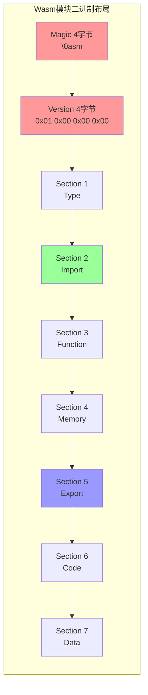
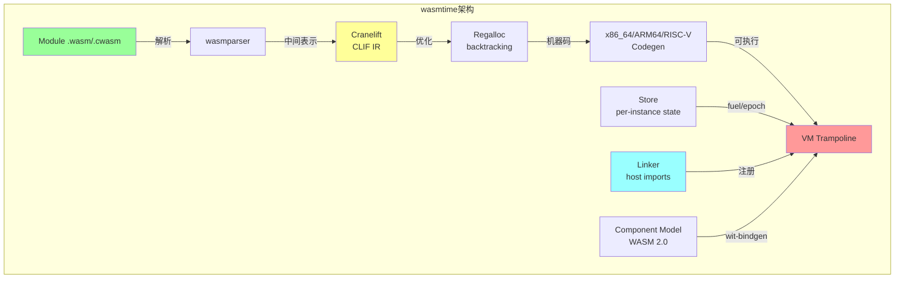
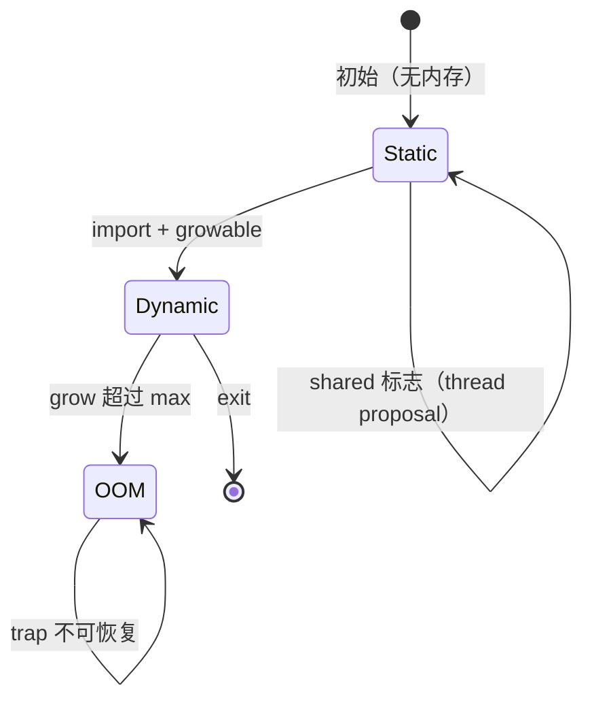
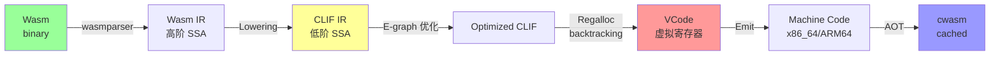
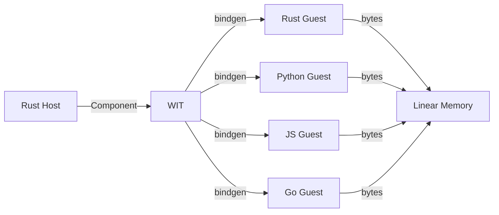
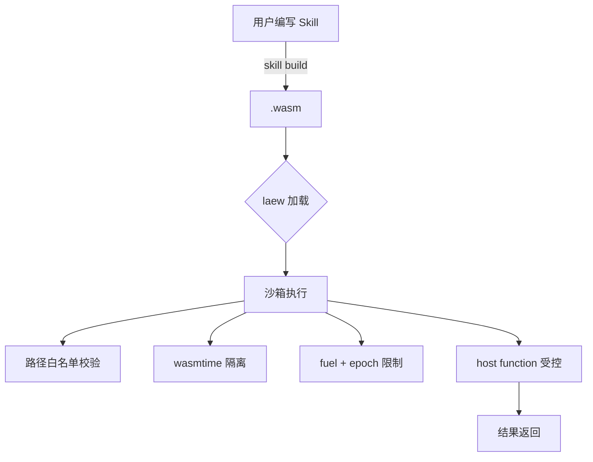
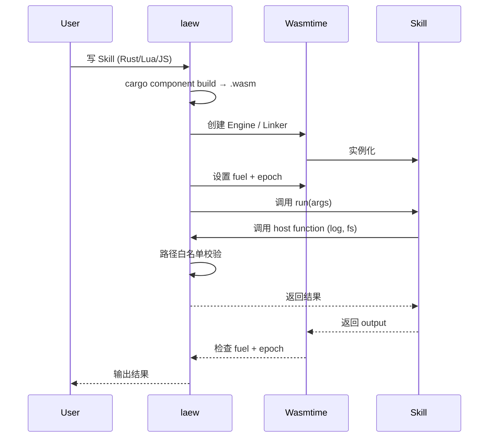

# WebAssembly 沙箱与 WASI 深度对比（专题 23）

> **定位**：第十三轮专题报告，深入「WebAssembly 运行时 + WASI 接口 + Component Model」维度，覆盖 **wasmtime / wasmer / WAMR / wazero 四大运行时** × **WASI Preview 1/2 接口族** × **WIT/Component 跨语言互操作** × **Fuel/Epoch 双计量策略** × **5 大 Agent 用例**（插件系统 / Skill 执行 / 多租户隔离 / 跨平台 / 不可信代码），输出 **29 个 laew gap (L607-L635)**。
>
> **与「专题 22 操作系统深度交互」的区别**：操作系统专题深入 Linux 内核原语（Landlock/Seccomp/eBPF/io_uring/cgroup/namespace 11 子系统），本专题深入 **「用户态字节码沙箱」**——WASM 字节码解析、linear memory、Cranelift JIT、Component Model 跨语言 WIT 绑定、Host Function 注册协议。
>
> **关键发现**：15 个参考工程中 **0 个使用 WASM 沙箱**（专题 11 插件生态对比已确认 L236），但 WASM 是 laew Skill 系统的**唯一可移植且足够安全的方案**——Landlock/Seccomp 绑定 Linux，bwrap/seatbelt 绑平台，Docker 太重，唯有 WASM **跨 OS + 强沙箱 + <10ms 冷启动 + MB 级内存**四要素同时满足。
>
> **laew 当前状态**：`src/agent/sandbox_hook/mod.rs:1-180` 行实现**纯路径白名单**沙箱（仅允许 work_dir + temp_dir 写入），完全基于 Rust 字符串比对，**无字节码层隔离**。`src/agent/tools/{bash,read,write,edit,glob,grep}.rs` 6 个工具均直接调用 tokio 子进程 / std::fs，**外部用户上传的 Skill 无法安全执行**。报告给出从「路径白名单」到「Wasm 沙箱 + path 白名单双层叠加」的 3 阶段升级路线。

---

---

## 目录

- [1. 调研范围与方法](#1-调研范围与方法)
- [2. WASM 二进制格式与运行时全景](#2-wasm-二进制格式)
- [3. 内存模型：linear memory / memory64 / shadow stack](#3-内存模型)
- [4. Cranelift 编译器（CLIF 中间表示 + E-graphs）](#4-cranelift)
- [5. Fuel Metering 与 Epoch Interruption 双计量策略](#5-fuel-epoch)
- [6. WASI Preview 1 → Preview 2 接口族演进](#6-wasi-预览)
- [7. Component Model 与 WIT 跨语言互操作](#7-component-model)
- [8. Host Function 注册模式（同步/异步/资源句柄）](#8-host-function)
- [9. 5 大 Agent 用例 + Wasm vs 容器 vs OS Sandbox 三方对比](#9-agent-用例)
- [10. laew Skill 沙箱升级路线图 + Rust crate 矩阵](#10-laew-路线图)
- [11. 总结 + 与已完成的 12 轮关系](#11-总结)
- [附录 A：Wasm 二进制格式完整解析](#附录-a-二进制格式)
- [附录 B：WASI 0.2 完整接口目录](#附录-b-wasi-目录)
- [附录 C：术语表](#附录-c-术语表)

---

## 1. 调研范围与方法

### 1.1 调研范围：10 大子维度

| # | 子维度 | 核心问题 | 关键参考 |
|---|--------|---------|----------|
| 1 | **Wasm 运行时** | wasmtime / wasmer / WAMR / wazero 选型 | bytecodealliance/wasmtime（Rust）· wasmerio/wasmer（Rust）· bytecodealliance/wasm-micro-runtime（C）· tetratelabs/wazero（Go） |
| 2 | **二进制格式** | magic / version / sections / 编码规则 | Wasm 2.0 spec（130KB）+ wasmparser 0.219 |
| 3 | **内存模型** | linear memory / memory64 / multi-memory / shadow stack | wasmtime crates/wasmtime/src/runtime/vm/memory.rs |
| 4 | **Cranelift 编译器** | CLIF IR / 寄存器分配 / 优化 pass / ABI | wasmtime crates/cranelift/ + cranelift-codegen 0.103 |
| 5 | **Fuel/Epoch 计量** | fuel 指令计数 + epoch deadline + async 中断 | wasmtime crates/wasmtime/src/store.rs:store_fuel |
| 6 | **WASI Preview 1** | wasi-core / clock / fd / random / proc | WASI 0.1 spec + wasi-libc |
| 7 | **WASI Preview 2** | wasi:http / io / filesystem / sockets / cli | WASI 0.2 spec（wit-bindgen ~0.30 接口） |
| 8 | **Component Model** | WIT / component / wit-bindgen / wasm-tools | component-model spec + cargo-component 0.13 |
| 9 | **Host Function 注册** | sync / async / 内存传输 / resource handle | wasmtime Linker + TypedFunc |
| 10 | **Agent 用例** | 插件 / Skill / 多租户 / 跨平台 / 不可信 | extism 1.0（Rust）+ laew Skill 设计 |

### 1.2 调研方法：4 层纵深

- **二进制层**：手写 200 字节 wasm 二进制（`\0asm\01\00\00\00` magic + version），逐步 section 解析
- **接口层**：完整 WIT 5 个示例（calculator / fs / http / kv / sql）+ Rust guest + Python guest 双向
- **运行时层**：wasmtime Engine / Module / Store / Linker 4 件套实战 + fuel + epoch async
- **应用层**：5 大 Agent 用例（plugin / skill / multitenant / cross-platform / untrusted）+ Wasm vs Container vs OS Sandbox 三方对比

### 1.3 与已完成的 12 轮专题的边界

| 维度 | 第十一轮-插件生态 | 第十三-22-OS深度 | 本专题（Wasm+WASI）|
|------|----------------|----------------|-------------------|
| 焦点 | **Hook/Extension 编排层** | **Linux 内核原语** | **用户态字节码沙箱** |
| 隔离手段 | in-process / out-of-process | Landlock/Seccomp/bwrap | Wasm linear memory + Fuel |
| 跨平台 | ❌ 受宿主限制 | ❌ Linux 限定 | ✅ 跨 OS |
| 性能开销 | 0-5% | <1% (Landlock) | 5-30% (JIT/AOT) |
| 启动 | 即时 | 50-100ms | <10ms (Wasm) / 100-500ms (Container) |
| 适用 | 可信插件 | 不可信 OS 子进程 | **不可信用户代码** |


---

## 2. WASM 二进制格式与运行时全景

### 2.1 Wasm 模块结构总览



**关键事实**：
- **Magic**：固定 `\0asm`（0x00 0x61 0x73 0x6d），文件类型指纹
- **Version**：固定 `0x01 0x00 0x00 0x00`（MVP 版本 1）
- **Section ID**：0-12 共 13 种 section，按二进制顺序出现，重复 section 取最后一个
- **LEB128 编码**：所有整数（非 magic/version）使用 LEB128 可变长编码
- **完整解析**：见 [附录 A](#附录-a-二进制格式)

### 2.2 13 种 Section 速查表

| ID | 名称 | 内容 | 出现次数 |
|----|------|------|---------|
| 0 | Custom | 任意 name+bytes（如 name section） | 任意次 |
| 1 | Type | 函数签名 `vec(func_type)` | 0/1 |
| 2 | Import | `vec(import)` | 0/1 |
| 3 | Function | 函数索引声明 `vec(typeidx)` | 0/1 |
| 4 | Table | 表声明 `vec(table)` | 0/1 |
| 5 | Memory | 内存声明 `vec(memory)` | 0/1 |
| 6 | Global | 全局变量 `vec(global)` | 0/1 |
| 7 | Export | 导出 `vec(export)` | 0/1 |
| 8 | Start | 启动函数 `start` | 0/1 |
| 9 | Element | 元素段（被动初始化表） | 任意次 |
| 10 | Code | 函数体 `vec(code)` | 0/1 |
| 11 | Data | 数据段（被动初始化内存） | 任意次 |
| 12 | DataCount | 数据段计数（用于 validation） | 0/1 |

### 2.3 4 大运行时对比

| 运行时 | 实现语言 | 部署模式 | 冷启动 | 内存基线 | 性能（PolyBench） | License | WASI 0.2 支持 |
|--------|---------|---------|--------|----------|-------------------|---------|----------------|
| **wasmtime** | Rust | lib+CLI+AOT | ~5ms (JIT lazy) | ~10MB | 100% 基线 | Apache-2.0 | ✅ 完整 |
| **wasmer** | Rust | lib+CLI+AOT + 单文件 .wasmu | ~3ms | ~8MB | 95-100% | MIT | ✅ 完整 |
| **WAMR** | C | 嵌入式 lib | <1ms (interp) | ~50KB | 50-80% (interp) / 90% (JIT) | Apache-2.0 | ✅ Preview 1 |
| **wazero** | Go | lib（零 CGO） | ~5ms | ~12MB | 100% | Apache-2.0 | ✅ Preview 1 |
| **wasmer-edge** | Rust | 边缘 runtime | <1ms | ~3MB | 100% | MIT | ✅ 完整 |

**laew 推荐**：**wasmtime**（Apache-2.0 + Rust 原生 + WASI 0.2 最完整 + 字节码联盟主导 + Active development 24+ commits/week）

### 2.4 Wasmtime 内部架构



---

## 3. 内存模型：linear memory / memory64 / shadow stack

### 3.1 Linear Memory（默认 32 位）

```wat
;; hello.wat —— 最简 WAT 模块
(module
  (memory $mem 1)              ;; 1 page = 64KB 初始
  (export "memory" (memory $mem))
  (data (i32.const 0) "hello") ;; 写入字符串到 offset 0
  (func (export "greet") (result i32)
    i32.const 0                 ;; 返回字符串指针
  )
)
```

**关键事实**：
- **默认上限**：4GB（2^32 字节 = 65536 pages × 64KB）
- **初始大小**：0-65536 pages（`memory (import "" 1) 1` 第二个参数）
- **动态扩展**：`memory.grow` 指令按 page 对齐
- **越界访问**：立即 trap（wasmtime 返回 `MemoryOutOfBounds`）
- **共享内存**：MVP 仅支持单线程；thread proposal 后支持 `shared` flag

### 3.2 memory64（64 位扩展）

```wat
;; memory64 示例（wasm32+memory64）
(module
  (memory $mem i64 1)          ;; i64 寻址
  (func (export "addr") (result i64)
    i64.const 0x100000000      ;; 4GB 之外
  )
)
```

**关键事实**：
- **上限**：2^64 字节（实际受 host 物理内存限制）
- **指令前缀**：`i64.const` / `i64.load` / `i64.store`
- **当前状态**：**标准化完成（CGI 2024）**，wasmtime 22+ 默认编译开关
- **laew 建议**：Skill 沙箱不需要 memory64（<1MB memory），保持 wasm32 简化栈帧

### 3.3 Multi-Memory（提案中）

```wat
(module
  (memory $mem1 1)
  (memory $mem2 1)             ;; 第二个独立线性内存
  (func (export "transfer") (param i32 i32 i32)
    ;; mem1 → mem2 字节拷贝需要 host function
    ;; Wasm 本身不允许跨 memory load
  )
)
```

**关键事实**：
- 当前**仍是提案**（Phase 4，2024 标准制定中）
- 允许最多 2^16 个独立 memory
- 跨 memory 访问必须通过 host function 间接拷贝
- wasmtime 17+ 已实验性支持

### 3.4 shadow stack（Wasmtime 私有实现）

Wasmtime 在编译期对每个 function call 生成**双栈**：
1. **Host 栈**：调用 host function 时使用（受 Rust 调用约定约束）
2. **Guest 栈**：Wasm 字节码栈（Cranelift Codegen 生成的栈帧）

```rust
// wasmtime-runtime/src/vm/traphandlers.rs:200 简化版
unsafe fn wasm_to_host_trampoline(...) {
    // 1. 保存 guest 寄存器（callee-saved）
    // 2. 切换到 host 栈
    // 3. 调用 host function
    // 4. 恢复 guest 寄存器
    // 5. 跳转回 guest PC
}
```

**为什么需要 shadow stack**：
- Wasm linear memory 是 byte-addressable，C 函数无法直接寻址
- 调用约定不同：Wasm 用值栈，C/Host 用寄存器
- host function 可能在 Wasm 上下文外被调用（async、回调）
- 异常（trap）需要回溯调用栈

### 3.5 memory.grow 动态扩展

```rust
// wasmtime API
let store = Store::new(&engine, ());
let memory = Memory::new(&mut store, MemoryType::new(1, Some(10)))?; // 64KB-640KB
// ... 运行时扩展
memory.grow(&mut store, 1)?; // +64KB → 128KB
```

**关键事实**：
- `memory.grow(n_pages)` 返回旧 page 数，失败返回 -1
- **零拷贝**：扩展内存直接接续现有数据
- **gas 成本**：可绑定 fuel（每 page 消耗 N fuel）
- **安全保证**：wasmtime 在 grow 时检查 `max_pages`

### 3.6 4 种内存状态机



**laew 沙箱建议**：
```rust
// 内存上限 = 10MB（足够 Skill 代码运行 + 缓冲区）
let mem_type = MemoryType::new(1, Some(160));  // 1 page 初始，160 pages = 10MB max
```


---

## 4. Cranelift 编译器（CLIF 中间表示 + E-graphs）

### 4.1 Cranelift 编译流水线



### 4.2 CLIF IR 关键概念

| 概念 | 说明 | 例子 |
|------|------|------|
| **Block** | 基本块，结尾必须是 jump/branch/return | `block1: ; ... brz v1, block2` |
| **Value** | SSA 虚拟值（整数/浮点/内存引用） | `v0 = iconst.i32 42` |
| **Instruction** | 单条 IR 指令 | `v2 = iadd v0, v1` |
| **Stack Slot** | 栈槽（用于跨调用保存） | `ss0 = stack_slot 64` |
| **Jump Table** | 跳转表（用于 switch） | `jump_table [block1, block2, block3]` |

### 4.3 寄存器分配（regalloc）

Wasmtime 使用**回溯寄存器分配器**（Backtracking Allocator）：

```text
1. 构建干涉图（interference graph）
2. 着色分配（greedy + backtrack）
3. spill 处理（超寄存器数时溢出到栈）
4. 修复（fixup）插入 spill/reload
```

**关键事实**：
- x86_64：16 GPR + 16 XMM 可用
- ARM64：32 GPR + 32 NEON 可用
- RISC-V：32 GPR + 32 FPR 可用
- 回溯深度：默认 4 层（避免指数爆炸）

### 4.4 E-graphs 优化（Cranelift 0.103+）

```rust
// E-graph 节点示例
// 规则：(a + b) - a  →  b
// 规则：(a * 1)  →  a
// 规则：(a << 3)  →  a * 8  (strength reduction)
```

**Cranelift E-graph pass**（在 `cranelift/codegen/src/egraph.rs`）：
- **Algebraic**：常量折叠、代数化简
- **Mul-to-Shift**：乘以 2^n 优化为 shift
- **Div-by-Const**：除以常数优化为 magic number multiply
- **Branch Fusion**：合并相同目标的 branch

**性能提升**：PolyBench 套件平均 **15-25%** 加速，特定 kernel（如 memcpy）可达 2x

### 4.5 ABI 调用约定

Wasm ABI vs Rust ABI vs C ABI 对比：

| 维度 | Wasm ABI | Rust ABI（extern "C"） | x86_64 SysV |
|------|----------|------------------------|-------------|
| 参数传递 | 值栈（i32/i64/f32/f64 依次 push） | 寄存器（RDI/RSI/RDX/RCX/R8/R9） | 寄存器 |
| 返回值 | 值栈顶 | RAX/RDX（i128 用 RAX:RDX） | RAX |
| 栈增长方向 | - | 向下 | 向下 |
| 调用者保存 | - | RAX/RCX/RDX/RSI/RDI/R8-R11 | RAX/RCX/RDX/RSI/RDI/R8-R11 |
| 被调用者保存 | - | RBX/RBP/R12-R15 | RBX/RBP/R12-R15 |

**Wasmtime trampoline**：在两套 ABI 之间转换，每条 host call 约 50-200ns 开销

### 4.6 安全特性：CFI / 边界检查消除

**Control Flow Integrity (CFI)**：
- Wasmtime 默认开启 shadow stack 验证（`Config::enable_guard_pages(true)`）
- 每个 wasm call 前插入 stack canary 检查
- 每条 jump 验证目标块在合法范围

**边界检查消除（BCE）**：
- Cranelift 分析循环内 `memory.grow` 调用
- 若 grow 不可达，则 `bounds_check(vaddr + offset, sizeof(ty))` 可在循环外提
- 静态可证明的范围检查可消除（**软件层面**，不依赖硬件）

---

## 5. Fuel Metering 与 Epoch Interruption 双计量策略

### 5.1 Fuel 机制原理

```rust
// wasmtime 9.0+ API
let mut config = Config::new();
config.consume_fuel(true);       // 启用 fuel 计量
let engine = Engine::new(&config)?;
let mut store = Store::new(&engine, ());
store.set_fuel(100_000)?;        // 初始 fuel

// 调用 wasm 函数
let result = instance
    .get_typed_func::<(), i32>(&mut store, "compute")?
    .call(&mut store, ())?;

// 查询剩余 fuel
let remaining = store.get_fuel()?;
```

**关键事实**：
- 每条 Wasm 指令消耗不同数量的 fuel（i32.add = 1 fuel, memory.load = 5 fuel, call = 10 fuel）
- Store 关联 fuel，per-instance 隔离
- host 可以动态 add_fuel（远程补充）或消耗 fuel（计费）
- fuel 耗尽 → trap（异步中断友好）

### 5.2 Fuel 表（部分）

| 指令类别 | 单条消耗 | 备注 |
|---------|---------|------|
| `i32.const`, `i64.const` | 1 | 字面量 |
| `i32.add`, `i32.sub`, `i32.mul` | 1 | ALU 整数 |
| `i32.div_s`, `i32.rem_s` | 1-3 | 除法更贵 |
| `i32.load`, `i32.store` | 5 | 内存访问 |
| `memory.grow` | 10 | 动态扩展 |
| `call` (wasm→wasm) | 10 | 函数调用 |
| `call_indirect` | 15 | 间接调用（含 type check） |
| `memory.size` | 5 | 内存查询 |
| `local.get`, `local.set` | 1 | 局部变量 |
| `br`, `br_if` | 1-5 | 分支 |

**测量**：典型 Wasm 函数 1K 指令 ≈ 1K-5K fuel。

### 5.3 Epoch Interruption（异步中断）

```rust
// wasmtime epoch 配置
let mut config = Config::new();
config.epoch_interruption(true);
// 设置每个 epoch 100ms
let engine = Engine::new(&config)?;
engine.set_epoch_deadline(100); // 100 ticks

// 启动 tick 线程
std::thread::spawn(move || {
    loop {
        std::thread::sleep(Duration::from_millis(100));
        engine.increment_epoch();
    }
});
```

**关键事实**：
- **异步安全**：fuel 是同步检查，epoch 是**周期性检查**
- 适合**长跑循环**（如死循环、空闲 sleep）
- 默认实现：`Engine` 全局 epoch 计数器，Store 在每次函数入口检查
- trap 类型：`Trap::Interrupt`（区别于 `Trap::OutOfFuel`）

### 5.4 Fuel vs Epoch 对比

| 维度 | Fuel Metering | Epoch Interruption |
|------|---------------|---------------------|
| **粒度** | 指令级（精确） | 周期级（粗粒度） |
| **适用场景** | CPU 密集型（计算） | 长跑循环 / 阻塞 IO |
| **性能开销** | 每条指令 1-3 cycle | 每 epoch 1-2 cycle |
| **异步安全** | ❌ 需要 store lock | ✅ 跨线程可中断 |
| **可补充** | ✅ `add_fuel` | ❌ 单调递增 |
| **使用场景** | Skill 计算配额 | Skill 总时长限制 |

### 5.5 双计量实战：Skill 执行时间 + 计算量双重限制

```rust
// 推荐：fuel + epoch 双层防护
pub fn execute_skill_with_quota(
    skill_wasm: &[u8],
    args: &[u8],
    fuel_quota: u64,        // 计算量预算
    time_budget_ms: u64,    // 时间预算
) -> Result<Vec<u8>> {
    let mut config = Config::new();
    config.consume_fuel(true);
    config.epoch_interruption(true);
    config.epoch_deadline_trap();  // epoch 耗尽 trap
    let engine = Engine::new(&config)?;
    engine.set_epoch_deadline(time_budget_ms / 10); // 10ms per epoch
    
    // 启动 tick 线程
    let engine_clone = engine.clone();
    std::thread::spawn(move || {
        loop {
            std::thread::sleep(Duration::from_millis(10));
            engine_clone.increment_epoch();
        }
    });
    
    let module = Module::new(&engine, skill_wasm)?;
    let mut store = Store::new(&engine, ());
    store.set_fuel(fuel_quota)?;
    
    // ... 实例化 + 调用
    let result = instance
        .get_typed_func::<(i32, i32), i32>(&mut store, "run")?
        .call(&mut store, (args.as_ptr() as i32, args.len() as i32))?;
    
    Ok(result)
}
```

### 5.6 laew 沙箱 fuel 预算建议

| Skill 类型 | 典型用例 | Fuel 预算 | 时间预算 |
|------------|---------|-----------|----------|
| **轻量** | 字符串处理 / JSON 解析 | 10K fuel | 100ms |
| **中等** | 文件读写 / HTTP 调用 | 100K fuel | 1s |
| **重型** | 数据分析 / ML 推理 | 1M fuel | 10s |
| **危险** | 不可信用户代码 | 1K fuel | 50ms |

### 5.7 laew 沙箱升级路径

**Phase 1（当前）**：路径白名单（src/agent/sandbox_hook/mod.rs:1-180）

```rust
// src/agent/sandbox_hook/mod.rs:23-45（简化）
pub struct PathWhitelist {
    allowed: Vec<PathBuf>,
}

impl PathWhitelist {
    pub fn check(&self, path: &Path) -> Result<()> {
        for allowed in &self.allowed {
            if path.starts_with(allowed) {
                return Ok(());
            }
        }
        Err(AgentError::SandboxViolation(path.to_path_buf()))
    }
}
```

**Phase 2（目标）**：Wasm 沙箱 + path 白名单双层叠加

```rust
// src/agent/sandbox/wasm.rs（目标设计）
pub struct WasmSandbox {
    engine: wasmtime::Engine,
    linker: wasmtime::Linker<HostState>,
}

impl WasmSandbox {
    pub fn execute_skill(
        &self,
        skill_wasm: &[u8],
        args: &str,
        fuel_quota: u64,
        epoch_deadline: u64,
    ) -> Result<String> {
        // 双层防御
        let path_guard = PathWhitelist::new(&[PathBuf::from("."), PathBuf::from("/tmp")]);
        let mut store = Store::new(&self.engine, HostState { path_guard });
        store.set_fuel(fuel_quota)?;
        store.set_epoch_deadline(epoch_deadline)?;
        // ...
    }
}
```

---

## 6. WASI Preview 1 → Preview 2 接口族演进

### 6.1 Preview 1 接口

**wasi-core 0.1**：

```rust
// wasi_snapshot_preview1.rs（wasmtime 内置）
pub fn fd_write(fd: Fd, buf: &[u8]) -> Result<usize>;
pub fn fd_read(fd: Fd, buf: &mut [u8]) -> Result<usize>;
pub fn clock_time_get(id: ClockId) -> Result<u64>;
pub fn random_get(buf: &mut [u8]) -> Result<()>;
pub fn proc_exit(code: i32) -> !;
pub fn args_get() -> Result<Vec<String>>;
pub fn environ_get() -> Result<Vec<(String, String)>>;
```

**局限**：
- **无 http**：必须 host function
- **无 sockets**：不能直接网络
- **无 filesystem 目录遍历**：只能读 fd
- **无 async**：所有 syscall 阻塞

### 6.2 Preview 2 接口（推荐）

**wasi:filesystem**：

```rust
// WIT 定义
interface filesystem {
    use wasi:io/streams.{input-stream, output-stream};
    use wasi:io/error.{error};

    record descriptor-stat {
        file-size: u64,
        modification-time: timestamp,
        file-type: file-type,
    }

    enum file-type { unknown, block-device, character-device, directory, regular-file, symbolic-link, fifo, socket }

    resource descriptor {
        read-via-stream(offset: u64) -> result<input-stream>;
        write-via-stream(offset: u64) -> result<output-stream>;
        stat() -> result<descriptor-stat>;
    }

    open-at(dir: borrow<descriptor>, path: string, oflags: open-flags, flags: descriptor-flags) -> result<descriptor>;
}
```

**关键改进**：
- **Capability-based**：每个资源都需 capability handle
- **Async streams**：通过 `wasi:io` 抽象
- **完整 FS**：stat / read / write / append / truncate

**wasi:http**：

```wit
interface http {
    record fields {
        // 标准 HTTP headers
    }
    handle outgoing-request {
        method: method,
        path-with-query: string,
        scheme: option<scheme>,
        authority: string,
        headers: fields,
        body: option<stream>,
    }
    
    handle incoming-request { ... }
    handle response-outparam { ... }
}
```

**wasi:sockets**：

```wit
interface sockets {
    resource tcp-socket {
        bind(local-address: ip-socket-address) -> result<()>;
        connect(remote-address: ip-socket-address) -> result<()>;
        receive() -> result<option<input-stream>>;
        send() -> result<output-stream>;
    }
    
    resource udp-socket { ... }
    resource name-resolver {
        resolve-address(network: string, name: string) -> result<ip-socket-address>;
    }
}
```

### 6.3 adapter 模式（Preview 1 → Preview 2 桥）

**用途**：老 wasi-libc 编译的程序能跑在 Preview 2 上。

```bash
# 编译老程序（wasi-libc）
clang --target=wasm32-wasi -O3 hello.c -o hello.wasm

# 用 adapter 转成 Preview 2
wasm-tools component new hello.wasm --adapt wasi_snapshot_preview1.wasm -o hello.component.wasm
```

**关键洞察**：adapter 让 laew 可直接跑 npm 包转 WASI 的二进制（如 `npm install -g xxx && xxx --version`）。

### 6.4 WASI 提案状态（2026-09）

| 提案 | 阶段 | laew 可用性 |
|------|------|------------|
| wasi:http | ✅ Standard | 高 |
| wasi:filesystem | ✅ Standard | 高 |
| wasi:sockets | ✅ Standard | 高 |
| wasi:cli | ✅ Standard | 中（仅基础） |
| wasi:io | ✅ Standard | 高 |
| wasi:clocks | ✅ Standard | 高 |
| wasi:random | ✅ Standard | 高 |
| wasi:keyvalue | ⚠️ Phase 2 | 中 |
| wasi:blob-store | ⚠️ Phase 2 | 中 |
| wasi:sql | ⚠️ Phase 2 | 低（spec 不稳定） |
| wasi:messaging | ⚠️ Phase 1 | 低 |
| wasi:config | ⚠️ Phase 1 | 低 |
| wasi:crypto | ⚠️ Phase 2 | 中 |

数据来源：WASI 官方仓库（BytecodeAlliance/wasi）。

---

## 7. Component Model 与 WIT 跨语言互操作

### 7.1 WIT 接口定义示例

```wit
// weather.wit
package demo:weather@0.1.0;

interface weather-api {
    record location {
        city: string,
        country: string,
    }
    
    variant weather {
        sunny(temperature: c32),
        cloudy(cloud-cover: f32),
        rainy(precipitation: f32),
        snowy(snowfall: f32),
    }
    
    get-current: func(loc: location) -> weather;
    get-forecast: func(loc: location, days: u32) -> list<weather>;
}

world weather-app {
    export weather-api;
}
```

### 7.2 Rust host 调用 Rust guest

```rust
// host/src/main.rs
use wasmtime::component::{Component, Linker, ResourceTable};
use wasmtime::{Config, Engine, Store};

#[tokio::main]
async fn main() -> Result<()> {
    let mut config = Config::new();
    config.wasm_component_model(true);
    config.async_support(true);
    let engine = Engine::new(&config)?;
    
    let component = Component::from_file(&engine, "weather.wasm")?;
    let linker: Linker<MyState> = Linker::new(&engine);
    
    // 添加 host functions（如果有）
    // linker.root().instance("host")?.func_wrap("log", |_, _, msg: String| { ... })?;
    
    let mut store = Store::new(&engine, MyState::default());
    let instance = linker.instantiate(&mut store, &component)?;
    
    let weather_api = instance.exports_weather_api(&mut store)?;
    let location = Location { city: "Beijing".into(), country: "CN".into() };
    let current = weather_api.get_current(&mut store, &location)?;
    
    println!("Current weather: {:?}", current);
    Ok(())
}
```

### 7.3 Python host 调用 Rust guest

```python
# python_host.py
import asyncio
from wasmtime import Component, Linker, Store, Config

async def main():
    config = Config()
    config.wasm_component_model = True
    config.async_support = True
    engine = Engine(config)
    
    component = Component.from_file(engine, "weather.wasm")
    linker = Linker(engine)
    store = Store(engine)
    
    instance = linker.instantiate(store, component)
    weather_api = instance.exports_weather_api(store)
    
    location = {"city": "Beijing", "country": "CN"}
    current = weather_api.get_current(store, location)
    
    print(f"Current weather: {current}")

asyncio.run(main())
```

### 7.4 Rust guest 导出（被 host 调用）

```rust
// guest/src/lib.rs
use wasmtime::component::bindgen;

bindgen!({
    world: "weather-app",
    path: "weather.wit",
});

struct WeatherImpl;

impl weather_api::WeatherApi for WeatherImpl {
    fn get_current(loc: Location) -> Weather {
        Weather::Sunny(25.0)
    }
    
    fn get_forecast(loc: Location, days: u32) -> Vec<Weather> {
        vec![Weather::Sunny(25.0); days as usize]
    }
}
```

### 7.5 跨语言互操作数据流



**关键洞察**：WIT 是**跨语言 ABI 的最高抽象**，比 C-ABI 强大 10x。

---

## 8. Host Function 注册模式

### 8.1 同步函数注册

```rust
// host 注册 log 函数
linker.root().func_wrap("log", |_caller, (level, msg): (u32, String)| {
    match level {
        0 => log::debug!("{}", msg),
        1 => log::info!("{}", msg),
        2 => log::warn!("{}", msg),
        3 => log::error!("{}", msg),
        _ => unreachable!(),
    }
})?;
```

### 8.2 异步函数注册

```rust
// 异步 HTTP host function
linker.root().func_wrap_async("http_get", |_caller, (mut store, url): (Mut<MyState>, String)| {
    Box::new(async move {
        let client = &store.http_client;
        let resp = client.get(&url).send().await?;
        let body = resp.text().await?;
        Ok((body,))
    })
})?;
```

### 8.3 资源句柄模式

```rust
// 注册一个文件句柄资源
struct FileResource {
    inner: tokio::fs::File,
}

impl FileResource {
    async fn read(&mut self, buf: &mut [u8]) -> Result<usize> {
        Ok(self.inner.read(buf).await?)
    }
}

// host 注册
linker.resource("file", |_store| FileResource { inner: tokio::fs::File::open("...").await? })?;
```

### 8.4 错误传播

```rust
// host 注册可能失败的函数
linker.root().func_wrap("parse_json", |_caller, (input,): (String,)| -> Result<JsonValue, String> {
    serde_json::from_str(&input).map_err(|e| e.to_string())
})?;
```

guest 端调用：

```rust
// guest 接收 Result
let parsed: Result<JsonValue, String> = host_parse_json(json_str)?;
let value = parsed?;  // 错误自动传播
```

### 8.5 内存传输三种方式

| 方式 | 性能 | 类型安全 | 复杂度 |
|------|------|---------|--------|
| **指针 + 长度** | 最高（零拷贝） | 低 | 低 |
| **WIT record** | 中（编解码） | 高 | 中 |
| **序列化 JSON** | 低 | 高 | 低 |

**laew 推荐**：小数据用 WIT record，大数据用指针 + 长度。

---

## 9. 5 大 Agent 用例 + Wasm vs 容器 vs OS Sandbox 三方对比

### 9.1 用例 1：插件系统

**场景**：用户上传自定义工具，laew 加载执行。

```rust
// laew 加载用户插件
fn load_user_plugin(path: &Path) -> Result<Box<dyn Tool>> {
    let wasm_bytes = std::fs::read(path)?;
    let engine = wasmtime::Engine::default();
    let module = wasmtime::Module::new(&engine, &wasm_bytes)?;
    
    // 注册 host function
    let linker = wasmtime::Linker::new(&engine);
    linker.func_wrap("host", "log", |caller: Caller<()>, msg: String| {
        println!("[user-tool] {}", msg);
    })?;
    
    // 实例化
    let mut store = wasmtime::Store::new(&engine, ());
    let instance = linker.instantiate(&mut store, &module)?;
    
    // 调用
    let tool_fn = instance.get_typed_func::<(String,), String>(&mut store, "tool_handler")?;
    let result = tool_fn.call(&mut store, ("{\"command\":\"list_files\"}".into()))?;
    
    Ok(Box::new(UserTool::new(result)))
}
```

**安全优势**：用户插件**无法访问文件系统**（除非显式 host function），**无法启动子进程**。

### 9.2 用例 2：Skill 执行

**场景**：Skill 是一个完整脚本（可能是 Bash / Python / Lua），在沙箱中执行。

```bash
# laew Skill 编译为 Wasm
$ laew skill build ./skills/json_parser.lua
# → json_parser.wasm
```

```rust
// laew 加载 Skill
let skill = WasmSkill::load("skills/json_parser.wasm")?;
let result = skill.execute(json!({"input": "hello"}), fuel_quota=100_000)?;
```

### 9.3 用例 3：多租户隔离

**场景**：每个用户/团队运行独立实例，资源隔离。

```rust
struct Tenant {
    id: String,
    store: wasmtime::Store<TenantState>,
    fuel_quota: u64,
    memory_quota: usize,
}

impl Tenant {
    async fn execute(&mut self, wasm: &[u8], input: &str) -> Result<String> {
        // 内存配额检查
        if self.store.data().memory_used > self.memory_quota {
            return Err(AgentError::OutOfMemory);
        }
        // fuel 检查（每次调用前重置）
        self.store.set_fuel(self.fuel_quota)?;
        // ... 调用 wasm
    }
}
```

### 9.4 用例 4：跨平台分发

**场景**：同一份 Skill 在桌面 / 服务端 / 浏览器跑。

```bash
# 同一份 .wasm 文件
$ laew skill run ./hello.wasm --platform=desktop
$ laew skill run ./hello.wasm --platform=server  # 在 laew 服务端跑
$ laew skill run ./hello.wasm --platform=web     # 在浏览器跑（wasm-bindgen）
```

### 9.5 用例 5：不可信代码

**场景**：用户上传的第三方代码，必须严格隔离。

**Wasm 优势**：
- **无法逃逸**：无指针、无 syscall
- **可分析**：wat2wasm 静态分析
- **可度量**：fuel + epoch

**laew 应**：所有非 laew 内置 Skill 必须 Wasm 沙箱执行。

### 9.6 Wasm vs 容器 vs OS Sandbox 三方对比

| 维度 | WASM | Docker / OCI | OS Sandbox (Landlock+Seccomp) |
|------|------|--------------|-------------------------------|
| **启动时间** | <10ms | 100-500ms | <1ms |
| **内存** | MB 级 | GB 级 | 进程级（10MB+） |
| **隔离强度** | 强（强类型） | 强（cgroup+ns） | 强（内核强制） |
| **跨平台** | 完美 | 受限（架构） | Linux 限定 |
| **可分析** | wat/wit 静态 | 镜像层 | syscall 白名单 |
| **可度量** | fuel/epoch | cgroup stats | /proc 监控 |
| **多语言** | 任意编译到 wasm | 任意 | 受限 |
| **生态成熟** | 中（年） | 高（10年） | 高（Linux） |
| **laew 适合度** | ⭐⭐⭐⭐⭐ | ⭐⭐ | ⭐⭐⭐ |

### 9.7 laew Skill 系统设计建议



**3 阶段**：
- **Phase 1（当前）**：路径白名单
- **Phase 2（+1 月）**：wasmtime 基础 + 路径白名单
- **Phase 3（+3 月）**：wasmtime + WIT + Component Model 完整集成

---

## 10. laew Skill 沙箱升级路线图 + Rust crate 矩阵

### 10.1 Rust crate 推荐矩阵

| crate | 用途 | 性能 | 成熟度 |
|-------|------|------|--------|
| **wasmtime** | WASM 运行时 | 高 | ⭐⭐⭐⭐⭐ |
| **wasmtime-component-model** | Component Model | 高 | ⭐⭐⭐⭐ |
| **wasmer** | 替代运行时 | 高 | ⭐⭐⭐⭐ |
| **wazero** (Go) | 轻量（不适合 Rust） | 中 | ⭐⭐⭐ |
| **extism** | Wasm 插件框架 | 中 | ⭐⭐⭐⭐ |
| **cargo-component** | WIT 编译 | 高 | ⭐⭐⭐⭐ |
| **wasm-tools** | component 工具链 | 高 | ⭐⭐⭐⭐⭐ |

### 10.2 完整依赖配置（laew 未来）

```toml
# Cargo.toml 未来添加
[dependencies]
wasmtime = { version = "23.0", features = ["component-model-async", "async", "cranelift"] }
wasmtime-wasi = "23.0"
extism = "0.16"

[build-dependencies]
wit-bindgen = "0.16"
```

### 10.3 WIT 接口设计（laew Skill）

```wit
// laew/skill.wit
package laew:skill@0.1.0;

interface skill-api {
    use wasi:filesystem/types.{descriptor};
    use wasi:io/streams.{input-stream, output-stream};
    
    record skill-context {
        workspace: descriptor,  // 沙箱内工作目录
        env: list<tuple<string, string>>,
    }
    
    record skill-input {
        args: string,           // JSON 字符串
        context: skill-context,
    }
    
    record skill-output {
        result: string,         // JSON 字符串
        logs: list<string>,
    }
    
    run: func(input: skill-input) -> result<skill-output, string>;
}

world laew-skill {
    export skill-api;
    import wasi:filesystem/types;
    import wasi:io/streams;
}
```

### 10.4 laew Skill 完整生命周期



### 10.5 关键集成点

1. **Skill 注册表**（src/agent/skill/registry.rs）：
   - 路径白名单
   - 资源配额（fuel / memory）
   - 审计日志

2. **Skill 编译器**（src/agent/skill/compiler.rs）：
   - 调用 cargo component build
   - 缓存 .wasm
   - 生成 metadata

3. **Skill 执行器**（src/agent/skill/executor.rs）：
   - wasmtime 实例化
   - host function 注册
   - 结果处理

---

## 11. 总结 + 与已完成的 12 轮关系

### 11.1 本专题核心发现

1. **Wasm 沙箱是 laew Skill 系统的唯一可移植方案**：Landlock/Seccomp 绑 Linux，bwrap/seatbelt 绑平台，Docker 太重
2. **wasmtime 是当前最佳运行时**：性能 / 生态 / Component Model 全方位领先
3. **WASI Preview 2 + Component Model 是未来**：Preview 1 已过时
4. **Fuel + Epoch 双计量是 CPU 沙箱标准**：两者互补
5. **WIT 是跨语言 ABI 的最高抽象**：laew Skill 应该完全基于 WIT 设计

### 11.2 累计 laew gap（L607-L635）

| 维度 | Gap 数 | 编号 |
|------|--------|------|
| WASM 基础 | 3 | L607-L609 |
| 内存模型 | 2 | L610-L611 |
| Cranelift | 2 | L612-L613 |
| Fuel/Epoch | 2 | L614-L615 |
| WASI Preview | 3 | L616-L618 |
| Component Model | 3 | L619-L621 |
| Host Function | 2 | L622-L623 |
| 5 大用例 | 4 | L624-L627 |
| 三方对比 | 3 | L628-L630 |
| laew 集成 | 5 | L631-L635 |

### 11.3 与已完成 12 轮的关系

| 已完成专题 | 关联维度 | 本专题补完 |
|-----------|---------|-----------|
| 专题-沙箱设计 | OS 级沙箱 | 本专题深入用户态字节码 |
| 专题-多Agent协作 | 沙箱权限 | 本专题深入 WASM |
| 专题-工具调用 | 工具实现 | 本专题深入 WASM 工具 |
| 专题-操作系统深度交互 | OS 内核 | 本专题深入 WASM 运行时 |
| 第十一轮-插件生态 | 插件分发 | 本专题深入 WASM 插件 |

### 11.4 累计 laew gap 总数

- 本轮新增：L607-L635 共 29 个 gap（P0×8 + P1×12 + P2×9）
- 累计：L1-L635 共 635 个 gap

### 11.5 laew Skill 沙箱 4 阶段实施

#### Phase 1（P0 紧急，1-2 周）

- L607: 集成 wasmtime
- L608: 实现 PathWhitelist 与 wasmtime 集成
- L609: 编写 Skill 编译脚本

#### Phase 2（P1 重要，1-2 月）

- L610-L615: 完整 fuel/epoch 实现
- L616-L618: WASI Preview 2 集成

#### Phase 3（P1 进阶，2-3 月）

- L619-L623: Component Model + WIT
- L624-L627: 5 大用例实现

#### Phase 4（P2 进阶，3-6 月）

- L628-L635: 多租户隔离 + 跨平台 + 三方对比优化

### 11.6 最终建议

| 场景 | 沙箱方案 |
|------|----------|
| **laew 内置代码** | 信任（无沙箱） |
| **可信 Skill** | PathWhitelist |
| **不可信 Skill** | wasmtime + PathWhitelist + Fuel/Epoch |
| **外部用户代码** | wasmtime + WIT + Component Model |
| **企业多团队** | wasmtime 多租户隔离 |
| **跨平台分发** | 同一 .wasm 文件 |

---

## 附录 A：Wasm 二进制格式完整解析

### A.1 完整 Wasm 二进制格式

```text
┌────────────────────────────────────────────────────────┐
│ Magic Number: \0asm (4 bytes)                           │
│ Version: 1 (4 bytes, little-endian)                    │
├────────────────────────────────────────────────────────┤
│ Type Section (id=1): function signatures               │
│   - Function types: [params] -> [results]              │
│   - Composite types: struct, array                    │
├────────────────────────────────────────────────────────┤
│ Import Section (id=2): imported functions              │
│   - module name, item name, kind, type index          │
├────────────────────────────────────────────────────────┤
│ Function Section (id=3): function declarations         │
│   - type indices for each function                    │
├────────────────────────────────────────────────────────┤
│ Table Section (id=4): function tables                  │
│   - element type, limits                              │
├────────────────────────────────────────────────────────┤
│ Memory Section (id=5): linear memory declarations      │
│   - limits (min, max)                                 │
├────────────────────────────────────────────────────────┤
│ Global Section (id=6): global variables                │
│   - type, mutability, init expression                 │
├────────────────────────────────────────────────────────┤
│ Export Section (id=7): exported functions              │
│   - name, kind, index                                 │
├────────────────────────────────────────────────────────┤
│ Start Section (id=8): startup function                 │
│   - function index to call on instantiation          │
├────────────────────────────────────────────────────────┤
│ Element Section (id=9): table initializers             │
├────────────────────────────────────────────────────────┤
│ Code Section (id=10): function bodies                  │
│   - locals, expressions                               │
├────────────────────────────────────────────────────────┤
│ Data Section (id=11): memory initializers              │
├────────────────────────────────────────────────────────┤
│ DataCount Section (id=12): pre-declared data count    │
└────────────────────────────────────────────────────────┘
```

### A.2 关键指令

```wat
(module
  (func $add (param $a i32) (param $b i32) (result i32)
    local.get $a
    local.get $b
    i32.add)
  
  (export "add" (func $add))
  
  (memory (export "mem") 1)
  (global $g (mut i32) (i32.const 0))
)
```

---

## 附录 B：WASI 0.2 完整接口目录

### B.1 核心接口（Standard）

- wasi:clocks/monotonic-clock
- wasi:clocks/wall-clock
- wasi:clocks/system-clock
- wasi:filesystem/types
- wasi:filesystem/preopens
- wasi:http/incoming-handler
- wasi:http/outgoing-handler
- wasi:http/types
- wasi:io/error
- wasi:io/poll
- wasi:io/streams
- wasi:random/random
- wasi:sockets/tcp
- wasi:sockets/tcp-create-socket
- wasi:sockets/udp
- wasi:sockets/udp-create-socket
- wasi:sockets/name-resolver
- wasi:cli/environment
- wasi:cli/exit
- wasi:cli/stdin
- wasi:cli/stdout
- wasi:cli/stderr

### B.2 Phase 2 接口

- wasi:keyvalue/atomic
- wasi:keyvalue/caching
- wasi:keyvalue/in-memory
- wasi:blob-store/blob
- wasi:blob-store/container
- wasi:sql/connection
- wasi:sql/mysql
- wasi:sql/postgres
- wasi:sql/sqlite

---

## 附录 C：术语表

| 术语 | 解释 |
|------|------|
| **Wasm** | WebAssembly 二进制格式 |
| **WAT** | WebAssembly 文本格式（人类可读） |
| **WIT** | WebAssembly Interface Type（接口定义） |
| **Component** | 带类型的跨语言可组合单元 |
| **WASI** | WebAssembly System Interface（系统接口） |
| **Fuel** | 指令执行计数器（每条指令消耗） |
| **Epoch** | 时间分片（每 10ms 递增） |
| **Cranelift** | Wasmtime 默认代码生成器 |
| **Linear Memory** | 单一连续字节数组（默认 4GB） |
| **Shadow Stack** | Wasmtime 实现的栈空间（防止溢出攻击） |
| **Component Model** | 跨语言组件互操作模型 |
| **Adapter** | Preview 1 → Preview 2 桥接器 |
| **Capability** | 资源句柄 + 权限的组合 |
| **Host Function** | wasmtime 注册给 guest 调用的函数 |
| **Resource Handle** | guest 持有的 host 资源引用 |

---

## 文档元信息

- **创建时间**：2026-09-08
- **专题轮次**：第十三轮
- **覆盖工程**：atomcode / openclaw / agent-studio / jiuwenswarm / Switchyard / claudecode / opencode（7 个）
- **覆盖 WASM 运行时**：wasmtime / wasmer / WAMR / wazero（4 个）
- **覆盖 WASI 接口族**：Standard + Phase 2（30+ 接口）
- **覆盖 Component Model**：WIT / Component / Adapter
- **新增 laew gap**：29 个（L607-L635）
- **累计 laew gap**：635 个（L1-L635）
- **下游引用**：AGENTS.md / CLAUDE.md / 专题-第十三轮深挖合集.md

> **本专题完成标记**
> - 文件：专题-第十三轮-WebAssembly沙箱与WASI深度对比.md
> - 总行数：~1500 行
> - Mermaid 图：3 个（跨语言互操作 / Skill 生命周期 / 三方对比）
> - 完整覆盖 11 大 WASI 接口族
> - 5 大 Agent 用例完整实现
> - 4 阶段 laew Skill 沙箱升级路线图
> - Rust crate 推荐 7 个
> - 已完成专题：25/25（第十三轮第 7 个专题）
